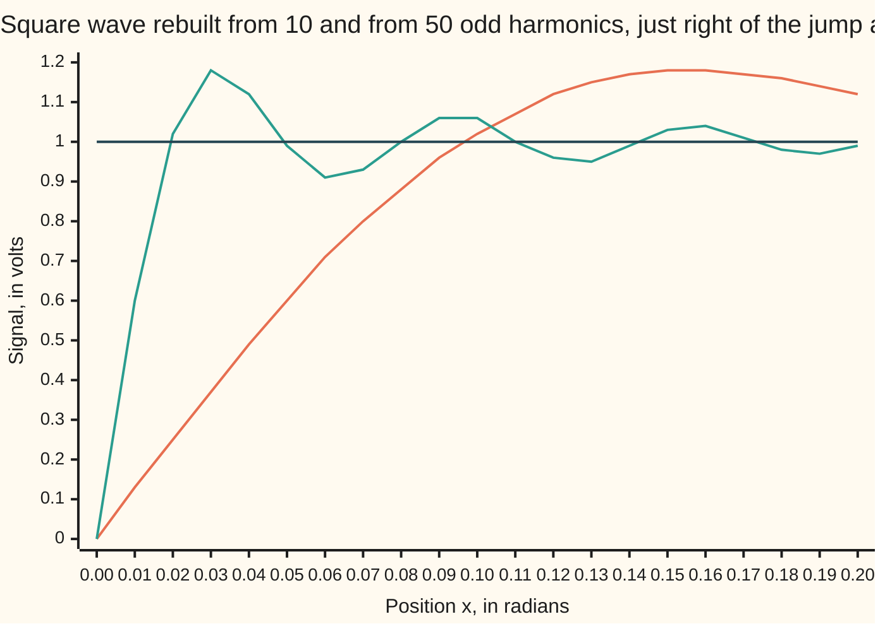

# Convergence: the series lands on the function where it is smooth, on the midpoint at a jump, and overshoots by 9% beside it

Differential equations and dynamics → Fourier Series → Where a series lands → Convergence

---

## General Overview

A synthesiser's square wave sits at +1 volt for half a cycle, then flips to −1 volt. Measure position through the cycle as an angle x in radians, 2π per cycle: +1 for x between 0 and π, −1 between −π and 0, repeating.

The shelf's first card built it from pure tones ([fourier-series-and-orthogonality](01-fourier-series-and-orthogonality.md)): 4/π times sin x + sin 3x/3 + sin 5x/5 and so on, odd harmonics only. A real synthesiser plays finitely many. What does a finite stack do?

Mid-top, at x = π/2, it homes in on 1. At the flip, x = 0, every tone is zero, so it gives 0: halfway between −1 and +1. Just beside the flip it rises past the top: with 50 tones, to 1.179013 volts. More tones do not pull that peak back to 1; it settles near 1.179 and squeezes closer to the flip. That overshoot is the **Gibbs phenomenon**.

**A Fourier series of a piecewise-smooth function settles on the function where it is smooth and on the midpoint at a jump; beside a jump it overshoots by about 9% of the jump, however many terms are kept.**

**What kind of fact this is:** a theorem, Dirichlet's, with Gibbs's overshoot limit beside it; Why it works argues both for the square wave, and a folded Detailed proof covers any piecewise-smooth wave.

### The picture: two stacks of tones just after the flip



The slow line is 10 harmonics, peaking at 1.18 near x = 0.15. The fast line is 50 harmonics, reaching 1.18 at x = 0.03, then ringing around 1. The flat line is the wave. Five times the tones: nearly the same peak, five times closer to the jump.

---

## The formula

Notation first, in words. $S_N(x)$ is the stack of the first $N$ odd harmonics at position $x$, the **partial sum**. A sigma, Σ, means "add the terms as the counter $k$ runs over the range shown". $f(x^-)$ is the value the wave approaches from the left of $x$, $f(x^+)$ from the right.

For the square wave:

$$S_N(x) = \frac{4}{\pi}\sum_{k=1}^{N}\frac{\sin\big((2k-1)x\big)}{2k-1}$$

**Read it aloud:** add the first N odd tones, each sized one over its frequency, times 4 over pi.

Dirichlet's theorem, for any periodic function made of finitely many smooth pieces per cycle:

$$\lim_{N\to\infty} S_N(x) = \tfrac{1}{2}\big(f(x^-) + f(x^+)\big)$$

**Read it aloud:** with more tones, the stack at x settles on the average of the values just left and just right of x.

The overshoot beside a jump, for the square wave:

$$\max_{0<x<\pi} S_N(x) \;\to\; \frac{2}{\pi}\,\mathrm{Si}(\pi), \qquad \mathrm{Si}(\pi) = \int_0^{\pi}\frac{\sin u}{u}\,du$$

**Read it aloud:** the stack's peak tends to 2 over pi times the area under sin u over u from 0 to pi: 1.178980.

| Symbol | Plain meaning | In our example | Push it up and the answer… |
| --- | --- | --- | --- |
| $x$ | position through the cycle, in radians | 0 at the flip, π/2 mid-top | — |
| $f$ | the square wave, in volts | +1 top, −1 bottom | — |
| $N$ | how many odd harmonics are kept | 10, 50, 250 | smooth points settle closer; the peak moves in and stays near 1.179 |
| $S_N$ | the partial sum | 1.179013 at x = 0.03142, N = 50 | — |
| $k$, Σ | the counter and the sum; tone $k$ has frequency $2k-1$ | 1, 2, 3, … | — |
| $f(x^-)$, $f(x^+)$ | values approached from left and right | −1 and +1 at x = 0 | a bigger jump, a proportionally bigger overshoot |
| $t$, $u$ | stand-in positions inside an integral | — | — |
| $\mathrm{Si}$ | the sine integral: area under sin u/u from 0 | gives the limit 1.178980 | — |

### When it holds

- **Periodic, finitely many smooth pieces per cycle, jumps allowed.** Without smoothness, even some continuous functions have series that fail to settle.
- **Both one-sided values exist.** Without them there is no midpoint to land on.
- **The value at the jump is invisible.** Coefficients are areas, and one point has no area: define the wave as +1 at x = 0 and the series still gives 0.00.
- **Same accuracy everywhere only without jumps.** The triangle wave |x| has none; its worst error is 0.031805, 0.006366, 0.001273 for N = 10, 50, 250, about 1/(πN). With a jump the overshoot sits at 0.1798, 0.1790, 0.1790.

---

## Why it works

### Step 0: a partial sum is a weighted average of the wave near x

Each coefficient is an area under the wave times a tone. Adding N tones back gives an average of the wave, weighted by a bump that sharpens around x as N grows. Where the wave is flat near x, the average is that value. At a jump, half the weight falls each side: the midpoint.

### Step 1: the square wave's stack has a closed-form slope

The slope of $S_N$ is (4/π) times cos x + cos 3x + … + cos((2N−1)x). Multiply that sum by 2 sin x. Each product 2 sin x cos((2k−1)x) equals sin(2kx) − sin((2k−2)x), so the sum telescopes, each term cancelling part of the next, down to sin(2Nx). Hence

$$S_N'(x) = \frac{2}{\pi}\,\frac{\sin(2Nx)}{\sin x}, \qquad S_N(x) = \frac{2}{\pi}\int_0^{x}\frac{\sin(2Nt)}{\sin t}\,dt,$$

the second because $S_N$ starts from 0 at x = 0. This fraction is the weighting bump of Step 0, written out for this wave.

### Step 2: at the jump, every tone is zero

At x = 0 every sine is 0, so $S_N(0) = 0$ for every N: the midpoint of −1 and +1. Nothing else was possible. The wave is odd (flipping x flips the sign), so each partial sum is odd, and an odd function is 0 at 0.

### Step 3: at a smooth point, the stack tends to 1

Fix x between 0 and π. In Step 1's integral, sin(2Nt) swings faster as N grows, and away from t = 0 its positive and negative lobes nearly cancel against the slowly changing 1/sin t. Only the tall lobe near t = 0 survives, with area tending to π/2. So $S_N(x)$ tends to (2/π)(π/2) = 1. At x = π/2 the error is −0.031752, −0.006366, −0.001273 for N = 10, 50, 250: about 1/(πN), falling fivefold each time N grows fivefold.

### Step 4: the peak settles at 1.179 and moves in

Step 1's slope is first zero where sin(2Nx) returns to 0: x = π/(2N), the first peak, 0.03142 for N = 50. Substitute u = 2Nt:

$$S_N\!\left(\frac{\pi}{2N}\right) = \frac{2}{\pi}\int_0^{\pi}\frac{\sin u}{2N\sin\!\big(u/(2N)\big)}\,du.$$

As N grows, 2N sin(u/(2N)) tends to u, since sin of a small angle is nearly the angle. The limit, (2/π) Si(π) = 1.178980, has no N in it: only the peak's place depends on N. The excess 0.178980 is 8.95% of the jump.

### Step 5: a point of the series sums a number series

At x = π/2, sin((2k−1)π/2) runs +1, −1, +1, … and the wave is smoothly 1 there. Step 3 then says

$$1 = \frac{4}{\pi}\Big(1 - \tfrac13 + \tfrac15 - \tfrac17 + \cdots\Big), \qquad \text{so} \qquad \frac{\pi}{4} = 1 - \tfrac13 + \tfrac15 - \cdots,$$

Leibniz's formula for π, read off a square wave.

<details>
<summary>Detailed proof: Dirichlet's theorem for any piecewise-smooth wave</summary>

Let n count every harmonic. From the coefficient formulas, $S_n(x) = \frac{1}{2\pi}\int_{-\pi}^{\pi} f(x+t)\,D_n(t)\,dt$ with the Dirichlet kernel $D_n(t) = \frac{\sin((n+\frac12)t)}{\sin(t/2)} = 1 + 2\sum_{j=1}^{n}\cos(jt)$.
The cosine form gives $\frac{1}{2\pi}\int_0^{\pi} D_n = \frac12$, and the same over $(-\pi, 0)$. So $S_n(x) - \tfrac12\big(f(x^+) + f(x^-)\big) = \frac{1}{2\pi}\int_0^{\pi} g_+(t)\sin((n+\tfrac12)t)\,dt + \frac{1}{2\pi}\int_{-\pi}^{0} g_-(t)\sin((n+\tfrac12)t)\,dt$, where $g_+(t) = \frac{f(x+t) - f(x^+)}{\sin(t/2)}$ and $g_-$ uses $f(x^-)$.
A one-sided slope at x keeps $g_\pm$ bounded near t = 0, and they are piecewise smooth elsewhere.
Riemann–Lebesgue: integrating by parts on each piece, $\int g(t)\sin(mt)\,dt = \big[-g\cos(mt)/m\big] + \frac1m\int g'(t)\cos(mt)\,dt$, so for every ε > 0 there is M with the integral below ε once m > M.
With m = n + ½ both integrals vanish in the limit: $S_n(x)$ tends to the midpoint, which is f(x) at a smooth point.

</details>

Another road removes the overshoot instead of measuring it: average the partial sums rather than taking the last. That is Fejér's method, in gibbs-and-summability.

---

## Worked numbers, by hand

| Step | Arithmetic | Value |
| --- | --- | --- |
| one tone at x = π/2 | 4/π × 1 | 1.2732 |
| two tones | 4/π × (1 − 1/3) | 0.8488 |
| three tones | 4/π × (1 − 1/3 + 1/5) | 1.1035 |
| at the jump, any N | every sin(0) is 0 | **0** |
| where the first peak sits, N = 50 | π/(2 × 50) = π/100 | 0.03142 |
| the peak, N = 50 | the sum of 50 tones there | 1.179013 |
| the limit | (2/π) Si(π) | **1.178980** |
| the overshoot as a share of the jump | 0.178980 / 2 | **8.95%** |

A speaker fed 50 tones gets 0 volts at each flip and 1.179 volts just after, where the ideal wave gives 1.

### What breaks if you drop a piece

| Mistake | Comes out at | What went wrong |
| --- | --- | --- |
| Expecting f(0) = 1 at the jump | 0.00, off by 1 | Coefficients are areas; one point carries none |
| Reading 9% as of the height 1 | peak 1.09 | It is 8.95% of the jump, 2 volts: peak 1.179 |
| Adding tones to remove the overshoot | 0.1798, 0.1790, 0.1790 for N = 10, 50, 250 | A jump's peak only narrows; the jump-free triangle's error falls to 0.001273 |
| Stopping Leibniz at 50 terms | 4 × sum = 3.121595 | The tail is about half the next term; averaging 50 and 51 terms gives 3.141397 |

The code prints all four.

---

## Code, from first principles, and it actually runs

Only sin and π are imported. Two roads reach each peak: adding the tones, and integrating Step 1's slope with the script's own Simpson's rule. Two reach the limit: Simpson on sin u/u, and the sine integral's power series. Leibniz's sum is checked against the area under 4/(1 + t^2) from 0 to 1. The triangle wave |x| is the jump-free case.

### Python

```python
# Convergence, jumps and Gibbs -- the check behind the card.  Nothing is imported
# but math's sin and pi.  Square wave: -1 on (-pi, 0), +1 on (0, pi), period 2 pi.
# S(N, x) = (4/pi)(sin x + sin 3x/3 + ... + sin((2N-1)x)/(2N-1)), N odd harmonics.
from math import sin, pi

def S(N, x):                                  # road one: add the terms
    return 4 / pi * sum(sin((2 * k - 1) * x) / (2 * k - 1) for k in range(1, N + 1))

def simpson(g, a, b, n=4000):                 # our own integrator, n even
    h = (b - a) / n
    return h / 3 * sum(g(a + i * h) * (1 if i in (0, n) else 4 if i % 2 else 2) for i in range(n + 1))

def S_kernel(N, x):                           # road two: S' = (2/pi) sin(2Nt)/sin t, from S(0) = 0
    return 2 / pi * simpson(lambda t: 2 * N if t == 0 else sin(2 * N * t) / sin(t), 0, x)

def tri_err(N):                               # |x| minus its N-harmonic series, at x = 0 (its worst point)
    return abs(pi / 2 - 4 / pi * sum(1 / (2 * k - 1) ** 2 for k in range(1, N + 1)))

Ns = (10, 50, 250)
print("square wave: -1 on (-pi, 0), +1 on (0, pi); N = number of odd harmonics")
print("at the jump x = 0: " + ", ".join(f"S_{N} = {S(N, 0):.6f}" for N in Ns) + "; midpoint of -1 and 1 = 0")
print("at x = pi/2 by hand: " + ", ".join(f"S_{N} = {S(N, pi / 2):.4f}" for N in (1, 2, 3)))
print("at x = pi/2, error S_N - 1: " + ", ".join(f"N = {N}: {S(N, pi / 2) - 1:+.6f}" for N in Ns))
part = [sum((-1) ** (k - 1) / (2 * k - 1) for k in range(1, n + 1)) for n in (50, 51)]
pi_int = simpson(lambda t: 4 / (1 + t * t), 0, 1)
print(f"Leibniz: 4 x (1 - 1/3 + ... 50 terms) = {4 * part[0]:.6f}; 4 x mean of 50 and 51 terms = "
      f"{2 * (part[0] + part[1]):.6f}; pi as area under 4/(1+t^2) = {pi_int:.6f}")
peaks = {}
for N in Ns:
    x = pi / (2 * N)                          # first place S' is zero: sin(2Nx) = 0
    peaks[N] = (S(N, x), S_kernel(N, x))
    print(f"peak N = {N}: at x = pi/{2 * N} = {x:.5f}; by the terms {peaks[N][0]:.6f}; by the kernel {peaks[N][1]:.6f}")
si_int = simpson(lambda u: 1 if u == 0 else sin(u) / u, 0, pi)
si_ser, term = 0.0, pi                        # Si(pi) = sum (-1)^n pi^(2n+1) / ((2n+1)(2n+1)!)
for n in range(30):
    si_ser += term / (2 * n + 1)
    term *= -pi * pi / ((2 * n + 2) * (2 * n + 3))
lim = 2 / pi * si_ser
print(f"limit (2/pi) Si(pi): by Simpson {2 / pi * si_int:.6f}; by power series {lim:.6f}")
print(f"overshoot {lim - 1:.6f} above 1 = {100 * (lim - 1) / 2:.2f}% of the jump 2; read as % of the height 1: peak {1 + (lim - 1) / 2:.2f}, wrong")
print("square-wave overshoot, N = 10, 50, 250: " + ", ".join(f"{peaks[N][0] - 1:.4f}" for N in Ns))
print("triangle |x| worst error, N = 10, 50, 250: " + ", ".join(f"{tri_err(N):.6f}" for N in Ns)
      + "; times pi N: " + ", ".join(f"{tri_err(N) * pi * N:.4f}" for N in Ns))
xs = [i / 100 for i in range(21)]
print("figure, x: " + ", ".join(f"{x:.2f}" for x in xs))
print("figure, S_10: " + ", ".join(f"{S(10, x):.2f}" for x in xs))
print("figure, S_50: " + ", ".join(f"{S(50, x):.2f}" for x in xs))
print(f"mistake, value at the jump taken as f(0) = 1: series gives {S(50, 0):.2f}, off by 1")
assert all(abs(a - b) < 1e-9 for a, b in peaks.values())             # two roads to each peak
assert abs(si_int - si_ser) < 1e-9 and abs(peaks[250][0] - lim) < 1e-4  # peak -> (2/pi) Si(pi)
assert abs(2 * (part[0] + part[1]) - pi_int) < 5e-4 < abs(4 * part[0] - pi_int)  # Leibniz, and averaging helps
assert abs(tri_err(250) * pi * 250 - 1) < 0.01                     # no jump: error dies like 1/(pi N)
assert min(t for t, _ in peaks.values()) - 1 > 0.178               # a jump: the overshoot stays
print("ALL CHECKS PASS")
```

**Ran 2026-09-28 on macOS, Python 3.14.6, standard library only. All checks passed. Output, pasted from the run:**

```
square wave: -1 on (-pi, 0), +1 on (0, pi); N = number of odd harmonics
at the jump x = 0: S_10 = 0.000000, S_50 = 0.000000, S_250 = 0.000000; midpoint of -1 and 1 = 0
at x = pi/2 by hand: S_1 = 1.2732, S_2 = 0.8488, S_3 = 1.1035
at x = pi/2, error S_N - 1: N = 10: -0.031752, N = 50: -0.006366, N = 250: -0.001273
Leibniz: 4 x (1 - 1/3 + ... 50 terms) = 3.121595; 4 x mean of 50 and 51 terms = 3.141397; pi as area under 4/(1+t^2) = 3.141593
peak N = 10: at x = pi/20 = 0.15708; by the terms 1.179814; by the kernel 1.179814
peak N = 50: at x = pi/100 = 0.03142; by the terms 1.179013; by the kernel 1.179013
peak N = 250: at x = pi/500 = 0.00628; by the terms 1.178981; by the kernel 1.178981
limit (2/pi) Si(pi): by Simpson 1.178980; by power series 1.178980
overshoot 0.178980 above 1 = 8.95% of the jump 2; read as % of the height 1: peak 1.09, wrong
square-wave overshoot, N = 10, 50, 250: 0.1798, 0.1790, 0.1790
triangle |x| worst error, N = 10, 50, 250: 0.031805, 0.006366, 0.001273; times pi N: 0.9992, 1.0000, 1.0000
figure, x: 0.00, 0.01, 0.02, 0.03, 0.04, 0.05, 0.06, 0.07, 0.08, 0.09, 0.10, 0.11, 0.12, 0.13, 0.14, 0.15, 0.16, 0.17, 0.18, 0.19, 0.20
figure, S_10: 0.00, 0.13, 0.25, 0.37, 0.49, 0.60, 0.71, 0.80, 0.88, 0.96, 1.02, 1.07, 1.12, 1.15, 1.17, 1.18, 1.18, 1.17, 1.16, 1.14, 1.12
figure, S_50: 0.00, 0.60, 1.02, 1.18, 1.12, 0.99, 0.91, 0.93, 1.00, 1.06, 1.06, 1.00, 0.96, 0.95, 0.99, 1.03, 1.04, 1.01, 0.98, 0.97, 0.99
mistake, value at the jump taken as f(0) = 1: series gives 0.00, off by 1
ALL CHECKS PASS
```

### Rust

Same numbers, same labels, built with `rustc --edition 2021 -O`.

```rust
// Convergence, jumps and Gibbs -- the same check as the Python, in Rust.  No crates.
// Square wave: -1 on (-pi, 0), +1 on (0, pi), period 2 pi.
// S(N, x) = (4/pi)(sin x + sin 3x/3 + ... + sin((2N-1)x)/(2N-1)), N odd harmonics.
use std::f64::consts::PI;

fn s(n: usize, x: f64) -> f64 {                   // road one: add the terms
    4.0 / PI * (1..=n).map(|k| ((2 * k - 1) as f64 * x).sin() / (2 * k - 1) as f64).sum::<f64>()
}

fn simpson(g: &dyn Fn(f64) -> f64, a: f64, b: f64) -> f64 {   // our own integrator
    let n = 4000;
    let h = (b - a) / n as f64;
    let w = |i: usize| if i == 0 || i == n { 1.0 } else if i % 2 == 1 { 4.0 } else { 2.0 };
    h / 3.0 * (0..=n).map(|i| g(a + i as f64 * h) * w(i)).sum::<f64>()
}

fn s_kernel(n: usize, x: f64) -> f64 {            // road two: S' = (2/pi) sin(2Nt)/sin t, from S(0) = 0
    let m = 2.0 * n as f64;
    2.0 / PI * simpson(&|t: f64| if t == 0.0 { m } else { (m * t).sin() / t.sin() }, 0.0, x)
}

fn tri_err(n: usize) -> f64 {                     // |x| minus its N-harmonic series, at x = 0
    (PI / 2.0 - 4.0 / PI * (1..=n).map(|k| 1.0 / ((2 * k - 1) as f64).powi(2)).sum::<f64>()).abs()
}

fn join(v: Vec<String>) -> String { v.join(", ") }

fn main() {
    let ns = [10usize, 50, 250];
    println!("square wave: -1 on (-pi, 0), +1 on (0, pi); N = number of odd harmonics");
    println!("at the jump x = 0: {}; midpoint of -1 and 1 = 0", join(ns.iter().map(|&n| format!("S_{} = {:.6}", n, s(n, 0.0))).collect()));
    println!("at x = pi/2 by hand: {}", join([1usize, 2, 3].iter().map(|&n| format!("S_{} = {:.4}", n, s(n, PI / 2.0))).collect()));
    println!("at x = pi/2, error S_N - 1: {}", join(ns.iter().map(|&n| format!("N = {}: {:+.6}", n, s(n, PI / 2.0) - 1.0)).collect()));
    let part: Vec<f64> = [50usize, 51].iter()
        .map(|&m| (1..=m).map(|k| if k % 2 == 1 { 1.0 } else { -1.0 } / (2 * k - 1) as f64).sum()).collect();
    let pi_int = simpson(&|t: f64| 4.0 / (1.0 + t * t), 0.0, 1.0);
    println!("Leibniz: 4 x (1 - 1/3 + ... 50 terms) = {:.6}; 4 x mean of 50 and 51 terms = {:.6}; pi as area under 4/(1+t^2) = {:.6}",
             4.0 * part[0], 2.0 * (part[0] + part[1]), pi_int);
    let mut peaks = Vec::new();
    for &n in &ns {
        let x = PI / (2 * n) as f64;              // first place S' is zero: sin(2Nx) = 0
        let (a, b) = (s(n, x), s_kernel(n, x));
        println!("peak N = {}: at x = pi/{} = {:.5}; by the terms {:.6}; by the kernel {:.6}", n, 2 * n, x, a, b);
        peaks.push((a, b));
    }
    let si_int = simpson(&|u: f64| if u == 0.0 { 1.0 } else { u.sin() / u }, 0.0, PI);
    let (mut si_ser, mut term) = (0.0, PI);       // Si(pi) = sum (-1)^n pi^(2n+1) / ((2n+1)(2n+1)!)
    for n in 0..30 {
        si_ser += term / (2 * n + 1) as f64;
        term *= -PI * PI / ((2 * n + 2) * (2 * n + 3)) as f64;
    }
    let lim = 2.0 / PI * si_ser;
    println!("limit (2/pi) Si(pi): by Simpson {:.6}; by power series {:.6}", 2.0 / PI * si_int, lim);
    println!("overshoot {:.6} above 1 = {:.2}% of the jump 2; read as % of the height 1: peak {:.2}, wrong",
             lim - 1.0, 100.0 * (lim - 1.0) / 2.0, 1.0 + (lim - 1.0) / 2.0);
    println!("square-wave overshoot, N = 10, 50, 250: {}", join(peaks.iter().map(|p| format!("{:.4}", p.0 - 1.0)).collect()));
    println!("triangle |x| worst error, N = 10, 50, 250: {}; times pi N: {}",
             join(ns.iter().map(|&n| format!("{:.6}", tri_err(n))).collect()),
             join(ns.iter().map(|&n| format!("{:.4}", tri_err(n) * PI * n as f64)).collect()));
    let xs: Vec<f64> = (0..21).map(|i| i as f64 / 100.0).collect();
    println!("figure, x: {}", join(xs.iter().map(|x| format!("{:.2}", x)).collect()));
    println!("figure, S_10: {}", join(xs.iter().map(|&x| format!("{:.2}", s(10, x))).collect()));
    println!("figure, S_50: {}", join(xs.iter().map(|&x| format!("{:.2}", s(50, x))).collect()));
    println!("mistake, value at the jump taken as f(0) = 1: series gives {:.2}, off by 1", s(50, 0.0));
    assert!(peaks.iter().all(|p| (p.0 - p.1).abs() < 1e-9));                  // two roads to each peak
    assert!((si_int - si_ser).abs() < 1e-9 && (peaks[2].0 - lim).abs() < 1e-4); // peak -> (2/pi) Si(pi)
    let avg_err = (2.0 * (part[0] + part[1]) - pi_int).abs();
    assert!(avg_err < 5e-4 && 5e-4 < (4.0 * part[0] - pi_int).abs());         // Leibniz, and averaging helps
    assert!((tri_err(250) * PI * 250.0 - 1.0).abs() < 0.01);                  // no jump: error dies like 1/(pi N)
    assert!(peaks.iter().map(|p| p.0).fold(f64::MAX, f64::min) - 1.0 > 0.178); // a jump: the overshoot stays
    println!("ALL CHECKS PASS");
}
```

**Ran 2026-09-28 on macOS, rustc 1.98.1, no crates. All checks passed. Output, pasted from the run:**

```
square wave: -1 on (-pi, 0), +1 on (0, pi); N = number of odd harmonics
at the jump x = 0: S_10 = 0.000000, S_50 = 0.000000, S_250 = 0.000000; midpoint of -1 and 1 = 0
at x = pi/2 by hand: S_1 = 1.2732, S_2 = 0.8488, S_3 = 1.1035
at x = pi/2, error S_N - 1: N = 10: -0.031752, N = 50: -0.006366, N = 250: -0.001273
Leibniz: 4 x (1 - 1/3 + ... 50 terms) = 3.121595; 4 x mean of 50 and 51 terms = 3.141397; pi as area under 4/(1+t^2) = 3.141593
peak N = 10: at x = pi/20 = 0.15708; by the terms 1.179814; by the kernel 1.179814
peak N = 50: at x = pi/100 = 0.03142; by the terms 1.179013; by the kernel 1.179013
peak N = 250: at x = pi/500 = 0.00628; by the terms 1.178981; by the kernel 1.178981
limit (2/pi) Si(pi): by Simpson 1.178980; by power series 1.178980
overshoot 0.178980 above 1 = 8.95% of the jump 2; read as % of the height 1: peak 1.09, wrong
square-wave overshoot, N = 10, 50, 250: 0.1798, 0.1790, 0.1790
triangle |x| worst error, N = 10, 50, 250: 0.031805, 0.006366, 0.001273; times pi N: 0.9992, 1.0000, 1.0000
figure, x: 0.00, 0.01, 0.02, 0.03, 0.04, 0.05, 0.06, 0.07, 0.08, 0.09, 0.10, 0.11, 0.12, 0.13, 0.14, 0.15, 0.16, 0.17, 0.18, 0.19, 0.20
figure, S_10: 0.00, 0.13, 0.25, 0.37, 0.49, 0.60, 0.71, 0.80, 0.88, 0.96, 1.02, 1.07, 1.12, 1.15, 1.17, 1.18, 1.18, 1.17, 1.16, 1.14, 1.12
figure, S_50: 0.00, 0.60, 1.02, 1.18, 1.12, 0.99, 0.91, 0.93, 1.00, 1.06, 1.06, 1.00, 0.96, 0.95, 0.99, 1.03, 1.04, 1.01, 0.98, 0.97, 0.99
mistake, value at the jump taken as f(0) = 1: series gives 0.00, off by 1
ALL CHECKS PASS
```

The two outputs match line for line.

> [!TIP]
> **Try changing**
> Guess first, then run it.
> - **Shift the kernel.** In `S_kernel`, change `2 * N * t` to `(2 * N + 1) * t`. The kernel now describes a different stack; the first assert stops the run.
> - **Give the triangle a jump's coefficients.** In `tri_err`, change `** 2` to `** 1`. The sum 1 + 1/3 + 1/5 + … grows without limit, and the 1/(πN) assert stops it.
> - **Stop averaging.** In the Leibniz assert, swap the mean of 50 and 51 terms for `4 * part[0]`. Guess: 3.121595 is nowhere near 3.141593, and the assert fails.

---

## The usual mistake

> [!warning]
> **Believing more terms remove the overshoot.** With 10, 50 and 250 tones it stays at 0.1798, 0.1790, 0.1790; only its place moves, to 0.15708, 0.03142, 0.00628. Each fixed point converges; closeness everywhere at once fails.
>
> - **The series equals the wave at the jump.** It gives the midpoint, 0.00, whatever the wave's value there.
> - **9% of the height.** It is 8.95% of the jump: a peak of 1.179, not 1.09.
> - **Leibniz as a way to compute π.** Fifty terms give 3.121595; the error falls only like one over the number of terms.

---

## Where you meet it in real life

- **Synthesisers and audio.** A band-limited digital square wave holds only tones below half the sample rate, so it is a partial sum and rings after each flip. Tapering the top harmonics softens it (windows-and-spectral-leakage).
- **Images and scans.** Halos beside sharp edges in compressed photographs, and ripples beside tissue boundaries in MRI scans, are Gibbs overshoot.
- **Heat and strings.** Where a starting temperature or plucked shape jumps, this card says what its Fourier series does; series on half an interval are in [half-range-sine-and-cosine-series](04-half-range-sine-and-cosine-series.md).

> **Say it back**
> A partial sum is a weighted average of the function near the point. Where the function is smooth, it settles on the value; at a jump, on the midpoint. Beside a jump it overshoots by 8.95% of the jump, and more terms move the overshoot closer without lowering it. At x = π/2 the square wave gives Leibniz's π/4 = 1 − 1/3 + 1/5 − …

---

## What this builds on

- [fourier-series-and-orthogonality](01-fourier-series-and-orthogonality.md): the coefficients of the square wave, 4/π over each odd frequency.
- [sequences-and-limits](../../06-Calculus%20and%20analysis/01-Limits%20and%20Continuity/03-sequences-and-limits.md): what "the stack tends to 1" means, and why a limit at each point is weaker than closeness everywhere at once.

## Where this goes next

- [parsevals-identity](03-parsevals-identity.md): the energy in the error, which does shrink to 0 even with a jump.
- windows-and-spectral-leakage: tapering the top harmonics to tame the ringing.
- pointwise-and-uniform-convergence: the two kinds of convergence this card contrasts, made exact.
- gibbs-and-summability: averaging the partial sums, which removes the overshoot entirely.

The overshoot never falls toward 0, but it lives in a sliver of width about π/(2N); whether the total error, measured as energy, still goes to zero is what Parseval's identity answers.

---

## Sources

Verified 2026-09-28: every link below resolves to the publisher's page.

- Tolstov, Georgi P. *Fourier Series*. Dover. [Publisher page](https://store.doverpublications.com/products/9780486633176). Dirichlet's theorem for piecewise-smooth functions, and number series summed from point values.
- Stein, Elias M., and Rami Shakarchi. *Fourier Analysis: An Introduction*. Princeton University Press, 2003. [Publisher page](https://press.princeton.edu/books/hardcover/9780691113845/fourier-analysis). The Dirichlet kernel, the Riemann–Lebesgue step, and Fejér's averaging.
- Gibbs, J. Willard. "Fourier's Series." *Nature* 59 (1899): 606. [DOI](https://doi.org/10.1038/059606a0). Gibbs's letter on the partial sums' limiting shape at a jump.
- Hewitt, Edwin, and Robert E. Hewitt. "The Gibbs-Wilbraham phenomenon: an episode in Fourier analysis." *Archive for History of Exact Sciences* 21 (1979): 129–160. [DOI](https://doi.org/10.1007/BF00330404). The overshoot's history, from Wilbraham's first account to Gibbs.
