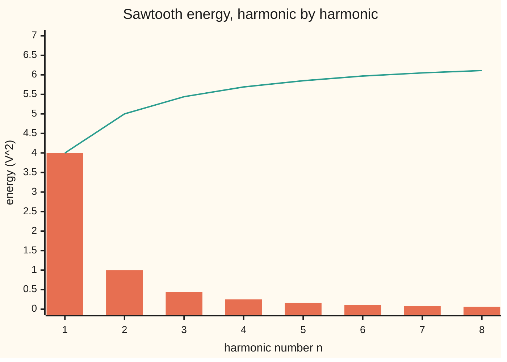

# Parseval's identity: the energy of a signal equals the energy of its coefficients, so nothing is lost

Differential equations and dynamics → Fourier Series → Energy in the harmonics → Parseval's identity

---

## General Overview

A synthesiser's oscillator puts out a sawtooth voltage: over one cycle it climbs steadily from −3.14 V to +3.14 V, then snaps back. Measure the cycle by its phase, an angle from −π to π radians, and the voltage equals the phase. Into a 1-ohm resistor it delivers an average 3.2899 W, which is π^2/3, the average of the voltage squared.

The same sawtooth is a stack of pure sine tones ([fourier-series-and-orthogonality](01-fourier-series-and-orthogonality.md)). The first, of amplitude 2 V, delivers 2 W on its own; the second 0.5 W; the third 0.2222 W; and so on without end. Parseval's identity says the list adds up to exactly 3.2899 W. No power leaks between tones, and none goes missing.

Run backwards, the balance sums a series: the sawtooth forces 1 + 1/4 + 1/9 + … to equal π^2/6 = 1.6449. Run forwards, it says how fast tones must fade and what a cut series leaves out.

**The energy of a repeating signal, averaged over one cycle, equals the sum of the energies of its separate harmonics; because the harmonics are perpendicular, no energy is shared and none is lost.**

**What kind of fact this is:** a theorem, proved on this card in Why it works, with the limit step in a folded detailed proof.

### The picture: the energy ledger, one harmonic at a time



Bars (orange): each harmonic's share, the square of its amplitude, 4/n^2 V^2. Line (green): the running total. The total the signal holds is 6.5797 V^2, twice the average watts; the line creeps towards it and reaches it only in the limit.

---

## The formula

Notation first, in words. A repeating signal $f$ splits into a cosine amount and a sine amount per whole-number frequency $n$. The shelf's recipe is $a_n = \frac{1}{\pi}\int_{-\pi}^{\pi} f(x)\cos(nx)\,dx$ and $b_n = \frac{1}{\pi}\int_{-\pi}^{\pi} f(x)\sin(nx)\,dx$, and the series is $a_0/2 + \sum_{n\ge1}\big(a_n\cos nx + b_n\sin nx\big)$. The **energy** $E$ of the signal is the integral of its square over one cycle, divided by π.

$$E \;=\; \frac{1}{\pi}\int_{-\pi}^{\pi} f(x)^2\,dx \;=\; \frac{a_0^2}{2} + \sum_{n=1}^{\infty}\big(a_n^2 + b_n^2\big)$$

**Read it aloud:** square the signal and average it the Fourier way; that equals half the constant term squared plus the squares of every cosine and sine amount.

Halve both sides and the left is the mean power into 1 ohm, 3.2899 W for the sawtooth; the right is a sum of harmonic powers, since a sine of amplitude A delivers A^2/2 on average.

| Symbol | Plain meaning | In our example | Push it up and the answer… |
| --- | --- | --- | --- |
| $f$, $x$ | the signal, as a function of phase $x$ in radians | $f(x) = x$ volts | energy grows with its square |
| $n$ | harmonic number: cycles of the tone per cycle of the signal | 1, 2, 3, … | its share shrinks as 1/n^2 |
| $a_0$ | twice the signal's average level | 0; the triangle wave's is π | adds $a_0^2/2$ |
| $a_n$, $b_n$ | cosine and sine amounts of harmonic $n$ | $a_n = 0$, $b_n = 2(-1)^{n+1}/n$ | each adds its square |
| $E$ | energy: the integral of the square over a cycle, over π | 2π^2/3 = 6.5797 V^2 | — |
| $S_N$, $N$ | the series cut after harmonic $N$ | N = 3 keeps 2 sin x − sin 2x + (2/3) sin 3x | shortfall falls like 4/N |
| $g$, $T$, $\sigma_N$ | proof helpers: a smoothed signal, any mix of harmonics, averaged partial sums | used in the detailed proof | — |

### When it holds

- **Finite energy.** The square must have a finite integral over a cycle; for 1/√|x| it is infinite and there is nothing to balance.
- **The whole family of tones.** Constant, cosines and sines all in. Drop the cosines and the triangle wave |x| shows a ledger of 0.0000 against 6.5797.
- **One recipe throughout.** The 1/π and the halved $a_0^2$ belong together; mixing scalings gives 5.1677 for π^2/6.
- **Balance in energy, not point by point.** Near a jump the series still overshoots ([convergence-jumps-and-gibbs](02-convergence-jumps-and-gibbs.md)); the spike narrows, so its energy goes to zero.

---

## Why it works

### Step 0: harmonics are perpendicular, so energies add like squared sides

The integral of two signals' product over a cycle acts as a dot product ([dot-product](../../03-Algebra/06-Dot%20Products%20and%20Best%20Fits/01-dot-product.md)), and a signal's squared length is its energy. Two different harmonics have product integrating to zero: they are orthogonal, meaning perpendicular. For perpendicular arrows, Pythagoras adds squared lengths. Parseval is Pythagoras with infinitely many sides.

### Step 1: a finite stack of harmonics has exactly the ledger's energy

Square the partial sum $S_N$ and integrate. Every cross term between two different harmonics integrates to zero. A sine or cosine squared integrates to π, and the constant $a_0/2$ squared to 2π times $a_0^2/4$. Divide by π:

$$\frac{1}{\pi}\int_{-\pi}^{\pi} S_N(x)^2\,dx = \frac{a_0^2}{2} + \sum_{n=1}^{N}\big(a_n^2+b_n^2\big).$$

For the sawtooth with $N = 3$: 4 + 1 + 4/9 = 5.4444.

### Step 2: the leftover is perpendicular to what was kept

The leftover $f - S_N$ has zero product with every harmonic up to $N$: integrating $f$ against sin(nx) gives π $b_n$ by the recipe, and integrating $S_N$ against it gives the same. So $f = S_N + (f - S_N)$ splits into two perpendicular pieces, and

$$E = \Big[\frac{a_0^2}{2} + \sum_{n=1}^{N}\big(a_n^2+b_n^2\big)\Big] + \frac{1}{\pi}\int_{-\pi}^{\pi}\big(f - S_N\big)^2\,dx.$$

After three harmonics the sawtooth's leftover, integrated directly, is 1.135292, and 6.579736 − 5.444444 = 1.135292. The leftover is never negative, so the ledger never exceeds the energy: **Bessel's inequality**.

### Step 3: the leftover's energy goes to zero

Equality needs the leftover's energy to fade. Step 2 makes $S_N$ the best fit among mixes of harmonics up to $N$ (proof below). Some mix follows any continuous repeating signal as closely as wished, and a jump is smoothed over a window holding almost no energy. For the sawtooth the leftover after $N$ harmonics is 0.3807 at $N = 10$, 0.0398 at 100, 0.0040 at 1000.

<details>
<summary>Detailed proof</summary>

**Best fit.** Let $T$ be any mix of harmonics up to $N$. Then $f - T = (f - S_N) + (S_N - T)$, whose second piece is perpendicular to the first by Step 2, so $\int(f-T)^2 = \int(f-S_N)^2 + \int(S_N-T)^2 \ge \int(f-S_N)^2$.

**Continuous signals (Fejér).** For a continuous repeating $g$, the average $\sigma_N$ of its first $N$ partial sums is $\sigma_N(x) = \frac{1}{2\pi}\int_{-\pi}^{\pi} g(x-t)F_N(t)\,dt$ with the kernel $F_N(t) = \frac{1}{N}\big(\sin(Nt/2)/\sin(t/2)\big)^2$. The kernel is never negative, integrates to 2π, and for $\delta \le |t| \le \pi$ is at most $1/(N\sin^2(\delta/2))$. Given ε > 0, pick δ with $|g(x-t)-g(x)| < \varepsilon$ whenever $|t| < \delta$. Then $|\sigma_N(x) - g(x)| \le \varepsilon + 2\max|g| / (N\sin^2(\delta/2))$ for every $x$, which falls below 2ε once $N$ is large. So $\frac{1}{\pi}\int(g-\sigma_N)^2 \le 8\varepsilon^2$.

**A jump.** Let $g$ equal $f$ except on a window of width 2δ around the jump, where it runs in a straight line across. For the sawtooth $|f - g| \le 2\pi$, so $\frac1\pi\int(f-g)^2 \le 8\pi\delta$. Since $\sigma_N$ of $g$ is a mix of harmonics below $N$, best fit and $(u+v)^2 \le 2u^2 + 2v^2$ give $\frac1\pi\int(f-S_N)^2 \le \frac2\pi\int(f-g)^2 + \frac2\pi\int(g-\sigma_N)^2 \le 16\pi\delta + 16\varepsilon^2$. Both terms are as small as wished, so Step 2's equation becomes Parseval's identity in the limit. Finitely many jumps are handled alike; every finite-energy signal is covered in l2-convergence-and-riesz-fischer.

</details>

### Step 4: the sawtooth sums 1/n^2

Left side: $\frac{1}{\pi}\int_{-\pi}^{\pi} x^2\,dx = \frac{1}{\pi}\cdot\frac{2\pi^3}{3} = \frac{2\pi^2}{3}$. Right side: $a_n = 0$ and $b_n^2 = 4/n^2$. So $4\sum 1/n^2 = 2\pi^2/3$, and

$$\sum_{n=1}^{\infty}\frac{1}{n^2} = \frac{\pi^2}{6} = 1.644934\ldots$$

Euler found it in 1734 another way; here it falls out of an energy balance.

### Step 5: smoothness forces fast decay

The squared coefficients add to a finite number, so the coefficients must shrink. If the signal joins up around the loop and its slope has finite energy, integration by parts gives the slope's coefficients as $n b_n$ and $-n a_n$; Parseval on the slope makes $\sum n^2(a_n^2+b_n^2)$ finite. Each further smooth derivative buys another factor of $n$.

The sawtooth jumps, and $n\,|b_n| = 2$ for every $n$: its coefficients fall only as 1/n. The triangle wave |x| joins up with a kink, and $n^2|a_n| = 4/\pi = 1.2732$ on odd $n$: 1/n^2. What a cut series misses is the ledger's tail: 0.3807 for the sawtooth after 10 harmonics, 0.0002650 for the triangle. A 1/n fall means a jump; 1/n^2, a kink; faster, a smoother signal.

The triangle's energy is also 2π^2/3, with $a_0 = \pi$ and $a_n = -4/(\pi n^2)$ on odd $n$, so Parseval gives $\sum_{n\ \mathrm{odd}} 1/n^4 = \pi^4/96$. Odd terms are 15/16 of the full sum, so $\sum 1/n^4 = \pi^4/90 = 1.082323$.

The same ledger in complex exponentials is one sum of squared sizes: [complex-fourier-series-and-the-transform-in-outline](05-complex-fourier-series-and-the-transform-in-outline.md).

---

## Worked numbers, by hand

| Step | Arithmetic | Value |
| --- | --- | --- |
| energy of the sawtooth | (1/π) × 2π^3/3 | 2π^2/3 = 6.5797 V^2 |
| harmonic 1 | b_1 = 2, squared | 4 |
| harmonics 1 to 3 | 4 + 1 + 4/9 | 5.4444 |
| leftover after 3 | 6.5797 − 5.4444 | 1.1353 |
| all harmonics | 4 × (1 + 1/4 + 1/9 + …) | must equal 6.5797 |
| divide by 4 | 6.5797 / 4 | **1.6449 = π^2/6** |

In the resistor: 3.2899 W in all, 2 W from the fundamental, the rest spread over higher tones.

### What breaks if you drop a piece

| Mistake | Comes out at | What went wrong |
| --- | --- | --- |
| No 1/π in front of the integral | sum of 1/n^2 = 5.1677 | π^3/6: energy and ledger on different scales |
| $a_0^2$ not halved, triangle wave | sum of 1/n^4 = −2.1646 | The constant counted twice; positives summing negative |
| Sines only, triangle wave | ledger 0.0000 against 6.5797 | An even signal lives in the cosines |

The code prints all three.

---

## Code, from first principles, and it actually runs

The code integrates the sawtooth's coefficients numerically, a midpoint rule over 40,000 slices, and compares them with the closed form. It reaches π^2/6 by two roads sharing no arithmetic: the integrated energy over four, and 1/n^2 added directly to a million terms plus an estimated tail. A third check integrates the leftover after three harmonics against the ledger's shortfall. The triangle wave is the second case, reaching π^4/90 both ways.

### Python

```python
# Parseval's identity -- the check behind the card.  Standard library only;
# math gives pi, sin and cos, nothing more.  The signal is the sawtooth f(x) = x
# on (-pi, pi).  Its coefficients come from numerical integration and from the
# closed form, and the energy ledger is balanced by two independent roads.
import math
PI, M, BIG = math.pi, 40000, 10 ** 6        # M midpoints across one cycle
DX = 2 * PI / M
XS = [-PI + (k + 0.5) * DX for k in range(M)]

def integral(g):                            # midpoint rule over one cycle
    return sum(g(x) for x in XS) * DX

def b(n):                                   # sawtooth sine coefficient, integrated
    return integral(lambda x: x * math.sin(n * x)) / PI

def a(n):                                   # triangle |x| cosine coefficient, integrated
    return integral(lambda x: abs(x) * math.cos(n * x)) / PI

def partial(N, p=2, start=1, step=1):       # sum of 1/n^p for start <= n <= N
    return sum(1 / n ** p for n in range(start, N + 1, step))

def row(v, d=2):
    return " ".join(f"{t:.{d}f}" for t in v)

energy = integral(lambda x: x * x) / PI                   # (1/pi) times the integral of f^2
bs = [b(n) for n in range(1, 9)]
closed = [2 * (-1) ** (n + 1) / n for n in range(1, 9)]
share = [t * t for t in bs]
run = [sum(share[:k + 1]) for k in range(8)]
resid = integral(lambda x: (x - sum(bs[n - 1] * math.sin(n * x) for n in (1, 2, 3))) ** 2) / PI
direct = partial(BIG) + 1 / BIG - 1 / (2 * BIG * BIG)     # tail of 1/n^2 past BIG, estimated
a0, a1, a3 = a(0), a(1), a(3)
quart = (energy - a0 ** 2 / 2) * PI ** 2 / 15            # Parseval on |x|: odd n, times 16/15
quart_direct = partial(20000, 4)
tri_tail = [16 / PI ** 2 * partial(20001, 4, N + 1 + N % 2, 2) for N in (10, 100)]
print(f"sawtooth energy (1/pi) int f^2, midpoint rule: {energy:.6f}; 2 pi^2/3 = {2 * PI ** 2 / 3:.6f}")
print("b_n, n=1..4, integrated:", row(bs[:4], 6), "; closed form 2(-1)^(n+1)/n:", row(closed[:4], 6))
print("harmonic share b_n^2, n=1..8:", row(share))
print("running total, n=1..8:", row(run))
print("running total 4 sum 1/n^2 at N = 10, 100, 1000:", row([4 * partial(N) for N in (10, 100, 1000)], 4))
print("shortfall from 2 pi^2/3 at N = 10, 100, 1000:", row([energy - 4 * partial(N) for N in (10, 100, 1000)], 4))
print(f"ledger after 3 harmonics: {run[2]:.6f}; missed, integrated: {resid:.6f}; energy minus ledger: {energy - run[2]:.6f}")
print(f"sum 1/n^2 by Parseval, energy/4: {energy / 4:.9f}")
print(f"sum 1/n^2 added directly to 10^6, plus tail: {direct:.9f}; pi^2/6 = {PI ** 2 / 6:.9f}")
print(f"1-ohm reading: mean power {energy / 2:.4f} W; harmonics 1, 2, 3 give {row([s / 2 for s in share[:3]], 4)} W; "
      f"2 and up {(energy - share[0]) / 2:.4f} W")
print(f"triangle |x|: a_0 = {a0:.6f}, a_1 = {a1:.6f}, a_3 = {a3:.6f}; -4/pi = {-4 / PI:.6f}")
print(f"sum 1/n^4 by Parseval on |x|: {quart:.9f}; added directly: {quart_direct:.9f}")
print("decay at n = 1, 9, 99: sawtooth n |b_n|", row([n * abs(b(n)) for n in (1, 9, 99)], 4),
      "; triangle n^2 |a_n|", row([n * n * abs(a(n)) for n in (1, 9, 99)], 4))
print("triangle energy missed after N = 10, 100:", row(tri_tail, 7))
print(f"mistake 1, no 1/pi in front: sum 1/n^2 would be {energy * PI / 4:.4f}")
print(f"mistake 2, a_0^2 not halved: sum 1/n^4 would be {(energy - a0 ** 2) * PI ** 2 / 15:.4f}")
sines = sum((integral(lambda x: abs(x) * math.sin(n * x)) / PI) ** 2 for n in range(1, 9))
print(f"mistake 3, sines only for |x|: ledger {sines:.4f} against energy {energy:.4f}")
assert all(abs(u - v) < 1e-6 for u, v in zip(bs, closed))      # integration against closed form
assert abs(energy / 4 - direct) < 1e-7                          # Parseval against direct summing
assert abs(resid - (energy - run[2])) < 1e-6                    # Pythagoras for the leftover
assert abs(quart - quart_direct) < 1e-7                         # second case, 1/n^4
print("ALL CHECKS PASS")
```

**Ran 2026-09-28 on macOS, Python 3.14.6, standard library only. All checks passed. Output, pasted from the run:**

```
sawtooth energy (1/pi) int f^2, midpoint rule: 6.579736; 2 pi^2/3 = 6.579736
b_n, n=1..4, integrated: 2.000000 -1.000000 0.666667 -0.500000 ; closed form 2(-1)^(n+1)/n: 2.000000 -1.000000 0.666667 -0.500000
harmonic share b_n^2, n=1..8: 4.00 1.00 0.44 0.25 0.16 0.11 0.08 0.06
running total, n=1..8: 4.00 5.00 5.44 5.69 5.85 5.97 6.05 6.11
running total 4 sum 1/n^2 at N = 10, 100, 1000: 6.1991 6.5399 6.5757
shortfall from 2 pi^2/3 at N = 10, 100, 1000: 0.3807 0.0398 0.0040
ledger after 3 harmonics: 5.444444; missed, integrated: 1.135292; energy minus ledger: 1.135292
sum 1/n^2 by Parseval, energy/4: 1.644934066
sum 1/n^2 added directly to 10^6, plus tail: 1.644934067; pi^2/6 = 1.644934067
1-ohm reading: mean power 3.2899 W; harmonics 1, 2, 3 give 2.0000 0.5000 0.2222 W; 2 and up 1.2899 W
triangle |x|: a_0 = 3.141593, a_1 = -1.273240, a_3 = -0.141471; -4/pi = -1.273240
sum 1/n^4 by Parseval on |x|: 1.082323231; added directly: 1.082323234
decay at n = 1, 9, 99: sawtooth n |b_n| 2.0000 2.0000 2.0000 ; triangle n^2 |a_n| 1.2732 1.2732 1.2732
triangle energy missed after N = 10, 100: 0.0002650 0.0000003
mistake 1, no 1/pi in front: sum 1/n^2 would be 5.1677
mistake 2, a_0^2 not halved: sum 1/n^4 would be -2.1646
mistake 3, sines only for |x|: ledger 0.0000 against energy 6.5797
ALL CHECKS PASS
```

### Rust

Same numbers, same labels, built with `rustc --edition 2021 -O`.

```rust
// Parseval's identity -- the same check as the Python, in Rust.  No crates;
// std gives pi, sin and cos, nothing more.  The signal is the sawtooth f(x) = x
// on (-pi, pi).  Its coefficients come from numerical integration and from the
// closed form, and the energy ledger is balanced by two independent roads.
use std::f64::consts::PI;
const M: usize = 40000; // midpoints across one cycle
const BIG: usize = 1_000_000;

fn integral(g: impl Fn(f64) -> f64) -> f64 { // midpoint rule over one cycle
    let dx = 2.0 * PI / M as f64;
    (0..M).map(|k| g(-PI + (k as f64 + 0.5) * dx)).sum::<f64>() * dx
}
fn b(n: f64) -> f64 { integral(|x| x * (n * x).sin()) / PI } // sawtooth sine coefficient
fn a(n: f64) -> f64 { integral(|x| x.abs() * (n * x).cos()) / PI } // triangle |x| cosine coefficient
fn partial(n_max: usize, p: i32, start: usize, step: usize) -> f64 { // sum of 1/n^p
    (start..=n_max).step_by(step).map(|n| 1.0 / (n as f64).powi(p)).sum()
}
fn row(v: &[f64], d: usize) -> String {
    v.iter().map(|t| format!("{:.*}", d, t)).collect::<Vec<_>>().join(" ")
}

fn main() {
    let energy = integral(|x| x * x) / PI; // (1/pi) times the integral of f^2
    let bs: Vec<f64> = (1..9).map(|n| b(n as f64)).collect();
    let closed: Vec<f64> = (1..9).map(|n| 2.0 * if n % 2 == 1 { 1.0 } else { -1.0 } / n as f64).collect();
    let share: Vec<f64> = bs.iter().map(|t| t * t).collect();
    let run: Vec<f64> = (0..8).map(|k| share[..=k].iter().sum()).collect();
    let resid = integral(|x| (x - (1..4).map(|n| bs[n - 1] * (n as f64 * x).sin()).sum::<f64>()).powi(2)) / PI;
    let big = BIG as f64;
    let direct = partial(BIG, 2, 1, 1) + 1.0 / big - 1.0 / (2.0 * big * big); // tail past BIG, estimated
    let (a0, a1, a3) = (a(0.0), a(1.0), a(3.0));
    let quart = (energy - a0 * a0 / 2.0) * PI * PI / 15.0; // Parseval on |x|: odd n, times 16/15
    let quart_direct = partial(20000, 4, 1, 1);
    let tri_tail: Vec<f64> = [10, 100].iter().map(|&n| 16.0 / (PI * PI) * partial(20001, 4, n + 1 + n % 2, 2)).collect();
    let ns = [10, 100, 1000];
    println!("sawtooth energy (1/pi) int f^2, midpoint rule: {:.6}; 2 pi^2/3 = {:.6}", energy, 2.0 * PI * PI / 3.0);
    println!("b_n, n=1..4, integrated: {} ; closed form 2(-1)^(n+1)/n: {}", row(&bs[..4], 6), row(&closed[..4], 6));
    println!("harmonic share b_n^2, n=1..8: {}", row(&share, 2));
    println!("running total, n=1..8: {}", row(&run, 2));
    println!("running total 4 sum 1/n^2 at N = 10, 100, 1000: {}", row(&ns.map(|n| 4.0 * partial(n, 2, 1, 1)), 4));
    println!("shortfall from 2 pi^2/3 at N = 10, 100, 1000: {}", row(&ns.map(|n| energy - 4.0 * partial(n, 2, 1, 1)), 4));
    println!("ledger after 3 harmonics: {:.6}; missed, integrated: {:.6}; energy minus ledger: {:.6}", run[2], resid, energy - run[2]);
    println!("sum 1/n^2 by Parseval, energy/4: {:.9}", energy / 4.0);
    println!("sum 1/n^2 added directly to 10^6, plus tail: {:.9}; pi^2/6 = {:.9}", direct, PI * PI / 6.0);
    println!("1-ohm reading: mean power {:.4} W; harmonics 1, 2, 3 give {} W; 2 and up {:.4} W",
             energy / 2.0, row(&share[..3].iter().map(|s| s / 2.0).collect::<Vec<_>>(), 4), (energy - share[0]) / 2.0);
    println!("triangle |x|: a_0 = {:.6}, a_1 = {:.6}, a_3 = {:.6}; -4/pi = {:.6}", a0, a1, a3, -4.0 / PI);
    println!("sum 1/n^4 by Parseval on |x|: {:.9}; added directly: {:.9}", quart, quart_direct);
    let nn = [1.0, 9.0, 99.0];
    println!("decay at n = 1, 9, 99: sawtooth n |b_n| {} ; triangle n^2 |a_n| {}",
             row(&nn.map(|n| n * b(n).abs()), 4), row(&nn.map(|n| n * n * a(n).abs()), 4));
    println!("triangle energy missed after N = 10, 100: {}", row(&tri_tail, 7));
    println!("mistake 1, no 1/pi in front: sum 1/n^2 would be {:.4}", energy * PI / 4.0);
    println!("mistake 2, a_0^2 not halved: sum 1/n^4 would be {:.4}", (energy - a0 * a0) * PI * PI / 15.0);
    let sines: f64 = (1..9).map(|n| (integral(|x| x.abs() * (n as f64 * x).sin()) / PI).powi(2)).sum();
    println!("mistake 3, sines only for |x|: ledger {:.4} against energy {:.4}", sines, energy);
    assert!(bs.iter().zip(&closed).all(|(u, v)| (u - v).abs() < 1e-6)); // integration against closed form
    assert!((energy / 4.0 - direct).abs() < 1e-7); // Parseval against direct summing
    assert!((resid - (energy - run[2])).abs() < 1e-6); // Pythagoras for the leftover
    assert!((quart - quart_direct).abs() < 1e-7); // second case, 1/n^4
    println!("ALL CHECKS PASS");
}
```

**Ran 2026-09-28 on macOS, rustc 1.98.1, no crates. All checks passed. Output, pasted from the run:**

```
sawtooth energy (1/pi) int f^2, midpoint rule: 6.579736; 2 pi^2/3 = 6.579736
b_n, n=1..4, integrated: 2.000000 -1.000000 0.666667 -0.500000 ; closed form 2(-1)^(n+1)/n: 2.000000 -1.000000 0.666667 -0.500000
harmonic share b_n^2, n=1..8: 4.00 1.00 0.44 0.25 0.16 0.11 0.08 0.06
running total, n=1..8: 4.00 5.00 5.44 5.69 5.85 5.97 6.05 6.11
running total 4 sum 1/n^2 at N = 10, 100, 1000: 6.1991 6.5399 6.5757
shortfall from 2 pi^2/3 at N = 10, 100, 1000: 0.3807 0.0398 0.0040
ledger after 3 harmonics: 5.444444; missed, integrated: 1.135292; energy minus ledger: 1.135292
sum 1/n^2 by Parseval, energy/4: 1.644934066
sum 1/n^2 added directly to 10^6, plus tail: 1.644934067; pi^2/6 = 1.644934067
1-ohm reading: mean power 3.2899 W; harmonics 1, 2, 3 give 2.0000 0.5000 0.2222 W; 2 and up 1.2899 W
triangle |x|: a_0 = 3.141593, a_1 = -1.273240, a_3 = -0.141471; -4/pi = -1.273240
sum 1/n^4 by Parseval on |x|: 1.082323231; added directly: 1.082323234
decay at n = 1, 9, 99: sawtooth n |b_n| 2.0000 2.0000 2.0000 ; triangle n^2 |a_n| 1.2732 1.2732 1.2732
triangle energy missed after N = 10, 100: 0.0002650 0.0000003
mistake 1, no 1/pi in front: sum 1/n^2 would be 5.1677
mistake 2, a_0^2 not halved: sum 1/n^4 would be -2.1646
mistake 3, sines only for |x|: ledger 0.0000 against energy 6.5797
ALL CHECKS PASS
```

The two outputs match line for line. The ninth-decimal gap, 1.644934066 against 1.644934067, is the midpoint rule's error.

> [!TIP]
> **Try changing**
> Guess first, then run it.
> - **Fewer slices.** Set `M` to 2000. The midpoint rule's error grows four hundredfold, the higher coefficients drift past the one-in-a-million tolerance, and the first assert stops the run.
> - **Keep a different harmonic.** In the leftover line, keep harmonics 1, 2 and 4. The leftover no longer matches a ledger that subtracts the third, and the third assert fails.
> - **Break the recipe.** Write the closed form as `2 / n`. The integrated b_2 is −1, the closed form says +1, and the first assert fails.

---

## The usual mistake

> [!warning]
> **Reading Parseval as point-by-point convergence.** The leftover's energy goes to zero; the series need not equal the signal at every phase. The sawtooth's series gives 0 at the jump, not ±π, and overshoots beside it for every $N$; the spike only narrows.
>
> - **Mixing scalings.** Forgetting the 1/π sends the sum of 1/n^2 to 5.1677 instead of 1.6449.
> - **Counting the constant in full.** Using $a_0^2$ instead of $a_0^2/2$ drives the triangle's sum of 1/n^4 to −2.1646.
> - **Trusting a partial ledger.** Eight harmonics of the sawtooth hold 6.11 of 6.5797: Bessel's inequality alone never proves nothing is missing.

---

## Where you meet it in real life

- **Mains power with harmonics.** The rms current of a distorted waveform (the root of its average square) is the root of the summed squares of its harmonics' rms currents. Cables and transformers are sized with this ledger.
- **Audio distortion.** Total harmonic distortion compares the energy in harmonics 2 and up with the fundamental's. The sawtooth scores badly: 1.2899 W against 2 W.
- **Compression.** Dropping small coefficients costs exactly their energy, the tail sum above, so keeping the largest is the best cut.
- **Plucked strings.** Split into modes ([half-range-sine-and-cosine-series](04-half-range-sine-and-cosine-series.md)), a string's energy is the sum of its modes' energies.

> **Say it back**
> A signal's energy is the integral of its square over a cycle, divided by π. Harmonics are perpendicular, so a stack of them has the sum of their squared amounts as energy, and what a cut series leaves out is perpendicular to what it keeps. The leftover's energy fades to zero, so the squared coefficients balance the energy exactly. For the sawtooth, 4 times the sum of 1/n^2 equals 2π^2/3, so the sum is π^2/6. The squares must add up, so coefficients shrink, faster for smoother signals.

---

## What this builds on

- [convergence-jumps-and-gibbs](02-convergence-jumps-and-gibbs.md): where the series meets the signal point by point, and the overshoot at a jump.
- [dot-product](../../03-Algebra/06-Dot%20Products%20and%20Best%20Fits/01-dot-product.md): length, perpendicularity and Pythagoras, here for signals.

## Where this goes next

- [complex-fourier-series-and-the-transform-in-outline](05-complex-fourier-series-and-the-transform-in-outline.md): the same ledger with complex exponentials, one squared size per frequency.
- the-fourier-transform-as-a-unitary-operator: Parseval for signals that never repeat, as a transform that keeps every length.
- l2-convergence-and-riesz-fischer: every finite-energy signal, and the converse: every square-summable list of coefficients is some signal.

Parseval balances the books for a repeating signal; what balances for a pulse that never repeats is the transform's question.

---

## Sources

Verified 2026-09-28: every link below resolves to a page naming the cited work.

- Stein, Elias M., and Rami Shakarchi. *Fourier Analysis: An Introduction*. Princeton University Press, 2003. [Publisher page](https://press.princeton.edu/books/hardcover/9780691113845/fourier-analysis). Mean-square convergence, Parseval's identity and the Fejér kernel.
- Tolstov, Georgi P. *Fourier Series*. Dover. [Publisher page](https://store.doverpublications.com/products/9780486633176). Bessel's inequality and completeness for piecewise smooth signals.
- O'Connor, J. J., and E. F. Robertson. "Marc-Antoine Parseval des Chênes." MacTutor Archive, University of St Andrews. [Biography](https://mathshistory.st-andrews.ac.uk/Biographies/Parseval/). Dates the 1799 memoir holding the result, first stated for summing series.
