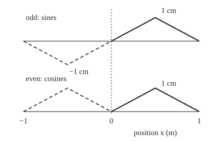
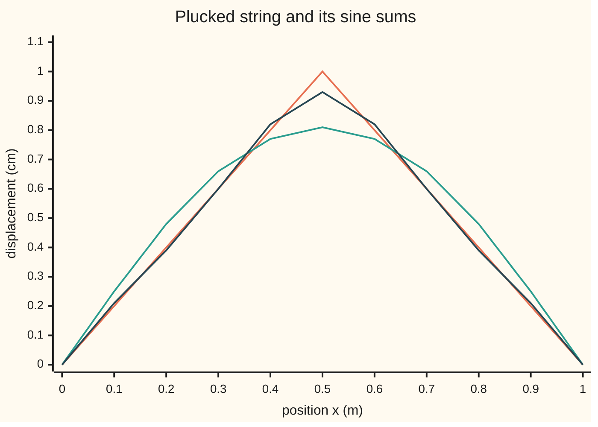

# Half-range series: extend a function on [0, L] as odd or even so the series matches fixed or insulated ends

Differential equations and dynamics → Fourier Series → Reflecting to fit the ends → Half-range series

---

## General Overview

A string 1 m long is pinned at both ends. Pull its middle 1 cm aside and hold it. The string makes a triangle: 0 cm at the ends, 1 cm at the middle. Released, it vibrates in its own shapes, the modes: one hump, two, three, each pinned at both ends. Which mix makes the triangle?

The Fourier series of [fourier-series-and-orthogonality](01-fourier-series-and-orthogonality.md) needs a function that repeats forever. The string lives only on 0 to 1 m, so invent the rest: reflect the triangle across the left end, and repeat. Flip the copy upside down and only sine waves appear, each zero at both ends, as a pinned string demands. Mirror it upright and only cosines appear, each flat at both ends.

Flat ends suit a metal rod. Heat flows along it at a rate set by the slope of its temperature, so zero slope at an end means no heat crosses: an insulated end. Give a 1 m rod the same triangle as its temperature, in °C above the room, and the cosine series describes it.

**On a stretch from 0 to L, a function can be written with sines alone or with cosines alone; sines fit ends held at zero, cosines fit sealed ends, and each coefficient is twice the average of the function times its mode.**

**What kind of fact this is:** a method: the reflection is a choice matched to the ends; the coefficient formulas it rests on are proved on this card in Why it works.

### The picture: one triangle, two reflections

<p align="center"></p>

Scale: 150 units per metre across, 40 per centimetre up. Solid: the real string. Dashed: the invented half, flipped (top) or mirrored (bottom). Dotted: the left end, x = 0. Each picture repeats every 2 m.

---

## The formula

Notation first, in words. The string's shape is $f$: at position $x$ metres from the left end, it stands f(x) centimetres aside. Its length is $L$. The **odd extension** $F_o$ copies $f$ onto the left half upside down; the **even extension** $F_e$ copies it upright. For x between −L and 0:

$$F_o(x) = -f(-x), \qquad F_e(x) = f(-x)$$

Both then repeat every 2L. Σ adds a term for each n = 1, 2, 3 and on.

$$b_n = \frac{2}{L}\int_0^L f(x)\sin\frac{n\pi x}{L}\,dx, \qquad a_n = \frac{2}{L}\int_0^L f(x)\cos\frac{n\pi x}{L}\,dx$$

$$f(x) = \sum_{n=1}^{\infty} b_n \sin\frac{n\pi x}{L} = \frac{a_0}{2} + \sum_{n=1}^{\infty} a_n \cos\frac{n\pi x}{L} \quad \text{for } 0 < x < L$$

**Read it aloud:** each coefficient is twice the average of the shape times its mode; adding the modes back rebuilds the shape.

For the triangle, with L = 1 m, integration by parts gives:

$$b_n = \frac{8\sin(n\pi/2)}{n^2\pi^2}, \qquad a_n = \frac{4\,\big(2\cos(n\pi/2) - 1 - (-1)^n\big)}{n^2\pi^2}, \qquad a_0 = 1$$

| Symbol | Plain meaning | In our example | Push it up and the answer… |
| --- | --- | --- | --- |
| $x$ | position, metres from the left end | 0 to 1 m | walks along the triangle |
| $L$ | length of the string or rod | 1 m | every mode stretches to fit |
| $f$ | the shape: pull in cm, or °C above the room | 1 at x = 0.5 m | every coefficient scales with it |
| $n$ | mode number: n half-waves fit in the length | 1, 3, 5 carry the string | coefficients shrink like 1/n^2 |
| $b_n$ | sine coefficient, cm | b1 = 0.8106, b3 = −0.0901 | a bigger share of that mode |
| $a_n$, $a_0$ | cosine coefficients; a0/2 is the average | a0 = 1, a2 = −0.4053 | a bigger share of that mode |
| $F_o$, $F_e$ | the odd and even extensions, period 2L | the two dashed pictures | they agree with f on 0 to L |
| $N$ | how many modes a partial sum keeps | 1, 3, 5, 99 | the sum closes on f |

Here sin(nπ/2) is 1, −1, 1 on n = 1, 3, 5 and 0 on even n; the cosine coefficients vanish except at n = 2, 6, 10.

### When it holds

- **Ends at zero, or ends sealed.** Sines suit f = 0 at both ends (a Dirichlet condition: the value is fixed); cosines suit zero slope (a Neumann condition: the slope is fixed). An end held at 20 °C needs the straight line through the end values subtracted first.
- **A piecewise smooth shape.** Finitely many corners and jumps; then both series converge inside ([convergence-jumps-and-gibbs](02-convergence-jumps-and-gibbs.md)). The triangle has one corner.
- **Matching ends for speed.** With f(0) = f(L) = 0 the odd extension is continuous and the sine coefficients shrink like 1/n^2. With f(L) ≠ 0 it jumps: coefficients shrink like 1/n and the sum overshoots beside the end. The even extension never jumps when f is continuous, so cosine coefficients shrink like 1/n^2 whatever the end values.
- **The same kind of end at both ends.** One pinned and one sealed end need quarter waves instead, sin((2k − 1)πx/(2L)).

---

## Why it works

### Step 0: reflect, then use the full-period series

Reflection builds a function of period 2L equal to f on 0 to L. Its full series, read on 0 to L, is a series for f; the reflection decides which modes survive.

### Step 1: the odd reflection kills every cosine

Over the full period, $a_n$ is 1/L times the integral from −L to L of the extension against cos(nπx/L), and $b_n$ the same with sin. An odd function times the even cosine is odd: its left half cancels its right half, so every cosine coefficient is 0. Times the odd sine it is even: the halves are equal, and the doubling turns 1/L into 2/L.

<details>
<summary>The algebra behind this</summary>

On the left half put x = −u. The odd extension at −u is −f(u) and sin(−nπu/L) = −sin(nπu/L); the two signs cancel, and dx = −du flips the limits back to 0 to L, so the left half equals the right half. With cosine, cos(−nπu/L) = cos(nπu/L), one sign survives, and the halves cancel.

</details>

### Step 2: the even reflection kills every sine

Swap the roles: even times sine cancels, even times cosine doubles. The cosine series keeps n = 0, the constant mode; its term a0/2 is the average of f, 0.5 °C for the rod.

### Step 3: the modes are the ends' own shapes

The same formulas come from the ends alone. Pinned ends ask X(0) = X(L) = 0 of each mode shape X; the problem X'' = −λX, with λ a constant to be found, then has the solutions sin(nπx/L). Sealed ends, X'(0) = X'(L) = 0, give cos(nπx/L) for n = 0, 1, 2 and on ([eigenvalues-and-eigenfunctions](../07-Series%20Solutions%20and%20Boundary%20Problems/08-eigenvalues-and-eigenfunctions.md)). On 0 to L the integral of sin(mπx/L) sin(nπx/L) is 0 when m ≠ n and L/2 when m = n; the cosines behave the same, except the constant mode, whose integral is L, which is why its term is a0/2. Multiply the series by one mode and integrate: one term survives, and the formula returns. Every partial sum obeys the end condition term by term.

### Step 4: the triangle's coefficients

Split at the peak. The right half mirrors the left, and mirroring a mode multiplies it by ±1, so all reduces to one integral of 2x against a sine or cosine on 0 to ½, done by parts. Even sine modes cancel: they are lopsided about the middle, and the triangle is not.

<details>
<summary>Detailed proof: the coefficients by parts</summary>

Take L = 1 and k = nπ. On the right half put x = 1 − u, so f = 2u. Since sin(nπ − ku) = −(−1)^n sin(ku) and cos(nπ − ku) = (−1)^n cos(ku),

$$b_n = 2\big(1 - (-1)^n\big) I, \quad a_n = 2\big(1 + (-1)^n\big) J,$$

with I and J the integrals of 2u sin(ku) and 2u cos(ku) from 0 to ½. By parts, u sin(ku) and u cos(ku) have antiderivatives −u cos(ku)/k + sin(ku)/k^2 and u sin(ku)/k + cos(ku)/k^2. Doubling and evaluating from 0 to ½:

$$I = -\frac{\cos(n\pi/2)}{n\pi} + \frac{2\sin(n\pi/2)}{n^2\pi^2}, \qquad J = \frac{\sin(n\pi/2)}{n\pi} + \frac{2\big(\cos(n\pi/2) - 1\big)}{n^2\pi^2}.$$

For odd n, cos(nπ/2) = 0, so the sine coefficient is 4I = 8 sin(nπ/2)/(n^2π^2) and the cosine coefficient is 0. For even n, the sine coefficient is 0 and sin(nπ/2) = 0, so the cosine coefficient is 4J = 8(cos(nπ/2) − 1)/(n^2π^2): zero when 4 divides n, −16/(n^2π^2) otherwise. Both cases fit the single cosine formula above. Finally a0 = 2 times the triangle's area, 2 × ½ × 1 × 1 = 1.

</details>

### Step 5: why so few modes suffice

A corner, not a jump, makes the coefficients shrink like 1/n^2. Their sizes add to a finite total, so after N modes the error anywhere is at most the sum of the dropped ones. For odd n above 99 that sum is below 8/(π^2 × 198), which is 0.00409 cm; the check measures 0.00405 cm.

A third road checks the coefficients through the sum of their squares: [parsevals-identity](03-parsevals-identity.md).

---

## Worked numbers, by hand

| Step | Arithmetic | Value |
| --- | --- | --- |
| first sine coefficient | 8/π^2 | b1 = 0.8106 cm |
| third and fifth | −8/(9π^2), 8/(25π^2) | −0.0901, 0.0324 cm |
| peak, modes 1 and 3 | 8/π^2 + 8/(9π^2) | 0.9006 cm |
| peak, modes 1, 3, 5 | add 8/(25π^2) | 0.9331 cm |
| rod: average, then a2 | a0/2 = ½; −16/(4π^2) | 0.5000, −0.4053 °C |
| rod middle, through a2 | 0.5 + 0.4053 | 0.9053 °C |
| **peak, all modes** | (8/π^2)(1 + 1/9 + 1/25 + …) | **1 cm** |

The fundamental carries 0.81 cm of the 1 cm pull; no even mode is present. Read backwards, the last row says 1 + 1/9 + 1/25 + … = π^2/8.

### The picture: the sine sums closing on the triangle



Orange: the triangle. Teal: mode 1 alone, peaking at 0.81 cm. Dark blue: modes 1, 3 and 5, peaking at 0.93 cm. Every sum is 0 at both ends.

### What breaks if you drop a piece

| Mistake | Comes out at | What went wrong |
| --- | --- | --- |
| Full-period factor 1/L on the half range | b1 = 0.4053 cm; peak 0.5000 cm | The doubling of Step 1 was dropped |
| Cosine modes for the pinned string | end reads 0.0947 cm with a0 and a2 | Cosines are not zero at the ends |
| Alternating signs dropped | peak reads 0.7425 cm, not 1 | Mode 3 now subtracts at the middle |

The code prints all three.

---

## Code, from first principles, and it actually runs

Two roads to every coefficient: the by-parts formula, and the odd or even extension integrated against its mode over the whole period, −L to L, with factor 1/L and a hand-written Simpson rule (a weighted sum of 2,001 sampled values). Road two never uses the half-range formula, so it tests the reflection itself. The sums are held to Step 5's tail bound on 101 points.

### Python

```python
# Half-range series -- the check behind the card.  Only math.sin, cos and pi
# are imported.  A 1 m string is pulled 1 cm aside at its middle: the triangle
# f.  Road one: coefficients by integration by parts.  Road two: build the odd
# and even reflections and integrate them over the whole period, -L to L.
from math import sin, cos, pi
L = 1.0
def f(x):                                   # the triangle, in cm, 0 <= x <= L
    return 2 * x / L if x <= L / 2 else 2 * (L - x) / L
def odd(x): return f(x) if x >= 0 else -f(-x)       # reflect with a sign flip
def even(x): return f(abs(x))                       # reflect without one
def simpson(g, a, b, m=2000):               # composite Simpson rule, written out
    h = (b - a) / m
    return h / 3 * (g(a) + g(b) + sum((4 if j % 2 else 2) * g(a + j * h) for j in range(1, m)))
def b(n): return 8 * [0, 1, 0, -1][n % 4] / (n * pi) ** 2     # road one, sine
def a(n):                                                      # road one, cosine
    return 1.0 if n == 0 else 4 * (2 * [1, 0, -1, 0][n % 4] - 1 - (-1) ** n) / (n * pi) ** 2
def S(x, N): return sum(b(n) * sin(n * pi * x / L) for n in range(1, N + 1))
def C(x, N): return a(0) / 2 + sum(a(n) * cos(n * pi * x / L) for n in range(1, N + 1))
def r(v, d=4): return f"{round(v, d) + 0.0:.{d}f}"
def row(vals, d=4): return " ".join(r(v, d) for v in vals)
b_int = [simpson(lambda x: odd(x) * sin(n * pi * x / L), -L, L) / L for n in range(1, 8)]
a_int = [simpson(lambda x: even(x) * cos(n * pi * x / L), -L, L) / L for n in range(0, 7)]
print("sine b1..b7, by parts:      ", row(b(n) for n in range(1, 8)))
print("sine b1..b7, odd reflection:", row(b_int))
print("cosine a0..a6, by parts:      ", row(a(n) for n in range(0, 7)))
print("cosine a0..a6, even reflection:", row(a_int))
print("string peak, sine sum with modes 1 / 1,3 / 1,3,5:", row(S(0.5, N) for N in (1, 3, 5)))
print("rod middle, cosine sum through a2 / through a6:", row(C(0.5, N) for N in (2, 6)))
ends = max(abs(S(x, N)) for x in (0, L) for N in (1, 3, 5, 99))
slopes = max(abs(sum(-a(n) * n * pi / L * sin(n * pi * x / L) for n in range(1, 100))) for x in (0, L))
print("sine sums at both ends below 1e-12:", "yes" if ends < 1e-12 else "no",
      "; cosine end slopes below 1e-12:", "yes" if slopes < 1e-12 else "no")
grid = [k / 100 for k in range(101)]
err_s = max(abs(S(x, 99) - f(x)) for x in grid)
err_c = max(abs(C(x, 99) - f(x)) for x in grid)
tail_s = 8 / pi ** 2 / (2 * 99)             # odd n > 99: sum of 1/n^2 <= 1/198
tail_c = 16 / pi ** 2 / (4 * 98)            # n = 102, 106, ...: sum <= 1/392
print(f"99 modes, 101 points: sine max error {r(err_s, 5)} (tail bound {r(tail_s, 5)}), "
      f"cosine {r(err_c, 5)} (bound {r(tail_c, 5)})")
print("rod, insulated: mean", r(simpson(f, 0, L) / L), "= a0/2 =", r(a(0) / 2))
xs = [k / 10 for k in range(11)]
print("chart, triangle:", row((f(x) for x in xs), 2))
print("chart, mode 1:  ", row((S(x, 1) for x in xs), 2))
print("chart, modes 1,3,5:", row((S(x, 5) for x in xs), 2))
X = lambda x: 190 + 150 * x
for name, g, base in (("odd", odd, 70), ("even", even, 190)):
    print(f"figure, {name}:", " ".join(f"{X(x):.0f},{base - 40 * g(x):.0f}" for x in (-1, -0.5, 0, 0.5, 1)))
print("mistake 1, factor 1/L on half the range: b1 =", r(simpson(lambda x: f(x) * sin(pi * x), 0, L) / L),
      "cm, peak reads", r(S(0.5, 9999) / 2), "cm")
print("mistake 2, cosine modes for the pinned string: end reads", r(C(0, 2)), "cm, not 0")
print("mistake 3, alternating signs dropped: peak reads",
      r(sum(abs(b(n)) * sin(n * pi / 2) for n in range(1, 10000))), "cm, not 1")
assert all(abs(p - q) < 1e-9 for p, q in zip((b(n) for n in range(1, 8)), b_int))  # two roads, sine
assert all(abs(p - q) < 1e-9 for p, q in zip((a(n) for n in range(0, 7)), a_int))  # two roads, cosine
assert err_s <= tail_s + 1e-12 and err_c <= tail_c + 1e-12      # sums land on f
assert abs(S(0.5, 9999) - f(0.5)) < 1e-4                        # the peak is 1 cm
print("ALL CHECKS PASS")
```

**Ran 2026-09-28 on macOS, Python 3.14.6, standard library only. All checks passed. Output, pasted from the run:**

```
sine b1..b7, by parts:       0.8106 0.0000 -0.0901 0.0000 0.0324 0.0000 -0.0165
sine b1..b7, odd reflection: 0.8106 0.0000 -0.0901 0.0000 0.0324 0.0000 -0.0165
cosine a0..a6, by parts:       1.0000 0.0000 -0.4053 0.0000 0.0000 0.0000 -0.0450
cosine a0..a6, even reflection: 1.0000 0.0000 -0.4053 0.0000 0.0000 0.0000 -0.0450
string peak, sine sum with modes 1 / 1,3 / 1,3,5: 0.8106 0.9006 0.9331
rod middle, cosine sum through a2 / through a6: 0.9053 0.9503
sine sums at both ends below 1e-12: yes ; cosine end slopes below 1e-12: yes
99 modes, 101 points: sine max error 0.00405 (tail bound 0.00409), cosine 0.00405 (bound 0.00414)
rod, insulated: mean 0.5000 = a0/2 = 0.5000
chart, triangle: 0.00 0.20 0.40 0.60 0.80 1.00 0.80 0.60 0.40 0.20 0.00
chart, mode 1:   0.00 0.25 0.48 0.66 0.77 0.81 0.77 0.66 0.48 0.25 0.00
chart, modes 1,3,5: 0.00 0.21 0.39 0.60 0.82 0.93 0.82 0.60 0.39 0.21 0.00
figure, odd: 40,70 115,110 190,70 265,30 340,70
figure, even: 40,190 115,150 190,190 265,150 340,190
mistake 1, factor 1/L on half the range: b1 = 0.4053 cm, peak reads 0.5000 cm
mistake 2, cosine modes for the pinned string: end reads 0.0947 cm, not 0
mistake 3, alternating signs dropped: peak reads 0.7425 cm, not 1
ALL CHECKS PASS
```

### Rust

```rust
// Half-range series -- the same check as the Python, in Rust, std only.  A 1 m
// string is pulled 1 cm aside at its middle: the triangle f.  Road one:
// coefficients by integration by parts.  Road two: build the odd and even
// reflections and integrate them over the whole period, -L to L.
use std::f64::consts::PI;
const L: f64 = 1.0;
fn f(x: f64) -> f64 { if x <= L / 2.0 { 2.0 * x / L } else { 2.0 * (L - x) / L } }
fn odd(x: f64) -> f64 { if x >= 0.0 { f(x) } else { -f(-x) } }
fn even(x: f64) -> f64 { f(x.abs()) }
fn simpson(g: &dyn Fn(f64) -> f64, a: f64, b: f64) -> f64 {
    let m = 2000;
    let h = (b - a) / m as f64;
    let inner: f64 = (1..m).map(|j| if j % 2 == 1 { 4.0 } else { 2.0 } * g(a + j as f64 * h)).sum();
    h / 3.0 * (g(a) + g(b) + inner)
}
fn b(n: i64) -> f64 { 8.0 * [0.0, 1.0, 0.0, -1.0][(n % 4) as usize] / (n as f64 * PI).powi(2) }
fn a(n: i64) -> f64 {
    if n == 0 { return 1.0; }
    let c = [1.0, 0.0, -1.0, 0.0][(n % 4) as usize];
    let alt = if n % 2 == 0 { 1.0 } else { -1.0 };
    4.0 * (2.0 * c - 1.0 - alt) / (n as f64 * PI).powi(2)
}
fn s(x: f64, n: i64) -> f64 { (1..=n).map(|k| b(k) * (k as f64 * PI * x / L).sin()).sum() }
fn c(x: f64, n: i64) -> f64 { a(0) / 2.0 + (1..=n).map(|k| a(k) * (k as f64 * PI * x / L).cos()).sum::<f64>() }
fn r(v: f64, d: i32) -> String {
    let p = 10f64.powi(d);
    format!("{:.*}", d as usize, (v * p).round() / p + 0.0)
}
fn row(vals: &[f64], d: i32) -> String { vals.iter().map(|&v| r(v, d)).collect::<Vec<_>>().join(" ") }
fn yn(t: bool) -> &'static str { if t { "yes" } else { "no" } }
fn main() {
    let b_int: Vec<f64> = (1..8).map(|n| simpson(&|x| odd(x) * (n as f64 * PI * x / L).sin(), -L, L) / L).collect();
    let a_int: Vec<f64> = (0..7).map(|n| simpson(&|x| even(x) * (n as f64 * PI * x / L).cos(), -L, L) / L).collect();
    let b_by: Vec<f64> = (1..8).map(b).collect();
    let a_by: Vec<f64> = (0..7).map(a).collect();
    println!("sine b1..b7, by parts:       {}", row(&b_by, 4));
    println!("sine b1..b7, odd reflection: {}", row(&b_int, 4));
    println!("cosine a0..a6, by parts:       {}", row(&a_by, 4));
    println!("cosine a0..a6, even reflection: {}", row(&a_int, 4));
    println!("string peak, sine sum with modes 1 / 1,3 / 1,3,5: {}", row(&[s(0.5, 1), s(0.5, 3), s(0.5, 5)], 4));
    println!("rod middle, cosine sum through a2 / through a6: {}", row(&[c(0.5, 2), c(0.5, 6)], 4));
    let mut ends: f64 = 0.0;
    for x in [0.0, L] { for n in [1, 3, 5, 99] { ends = ends.max(s(x, n).abs()); } }
    let slopes = [0.0, L].iter().map(|&x| (1..100).map(|k| -a(k) * k as f64 * PI / L * (k as f64 * PI * x / L).sin())
        .sum::<f64>().abs()).fold(0.0, f64::max);
    println!("sine sums at both ends below 1e-12: {} ; cosine end slopes below 1e-12: {}", yn(ends < 1e-12), yn(slopes < 1e-12));
    let grid: Vec<f64> = (0..101).map(|k| k as f64 / 100.0).collect();
    let err_s = grid.iter().map(|&x| (s(x, 99) - f(x)).abs()).fold(0.0, f64::max);
    let err_c = grid.iter().map(|&x| (c(x, 99) - f(x)).abs()).fold(0.0, f64::max);
    let tail_s = 8.0 / PI.powi(2) / (2.0 * 99.0); // odd n > 99: sum of 1/n^2 <= 1/198
    let tail_c = 16.0 / PI.powi(2) / (4.0 * 98.0); // n = 102, 106, ...: sum <= 1/392
    println!("99 modes, 101 points: sine max error {} (tail bound {}), cosine {} (bound {})",
        r(err_s, 5), r(tail_s, 5), r(err_c, 5), r(tail_c, 5));
    println!("rod, insulated: mean {} = a0/2 = {}", r(simpson(&f, 0.0, L) / L, 4), r(a(0) / 2.0, 4));
    let xs: Vec<f64> = (0..11).map(|k| k as f64 / 10.0).collect();
    println!("chart, triangle: {}", row(&xs.iter().map(|&x| f(x)).collect::<Vec<_>>(), 2));
    println!("chart, mode 1:   {}", row(&xs.iter().map(|&x| s(x, 1)).collect::<Vec<_>>(), 2));
    println!("chart, modes 1,3,5: {}", row(&xs.iter().map(|&x| s(x, 5)).collect::<Vec<_>>(), 2));
    let fx = |x: f64| 190.0 + 150.0 * x;
    for (name, g, base) in [("odd", odd as fn(f64) -> f64, 70.0), ("even", even, 190.0)] {
        let pts: Vec<String> = [-1.0, -0.5, 0.0, 0.5, 1.0].iter()
            .map(|&x| format!("{:.0},{:.0}", fx(x), base - 40.0 * g(x))).collect();
        println!("figure, {}: {}", name, pts.join(" "));
    }
    println!("mistake 1, factor 1/L on half the range: b1 = {} cm, peak reads {} cm",
        r(simpson(&|x| f(x) * (PI * x).sin(), 0.0, L) / L, 4), r(s(0.5, 9999) / 2.0, 4));
    println!("mistake 2, cosine modes for the pinned string: end reads {} cm, not 0", r(c(0.0, 2), 4));
    let dropped: f64 = (1..10000).map(|n| b(n).abs() * (n as f64 * PI / 2.0).sin()).sum();
    println!("mistake 3, alternating signs dropped: peak reads {} cm, not 1", r(dropped, 4));
    assert!(b_by.iter().zip(&b_int).all(|(p, q)| (p - q).abs() < 1e-9)); // two roads, sine
    assert!(a_by.iter().zip(&a_int).all(|(p, q)| (p - q).abs() < 1e-9)); // two roads, cosine
    assert!(err_s <= tail_s + 1e-12 && err_c <= tail_c + 1e-12); // sums land on f
    assert!((s(0.5, 9999) - f(0.5)).abs() < 1e-4); // the peak is 1 cm
    println!("ALL CHECKS PASS");
}
```

**Ran 2026-09-28 on macOS, rustc 1.98.1, no crates. All checks passed. Output, pasted from the run:**

```
sine b1..b7, by parts:       0.8106 0.0000 -0.0901 0.0000 0.0324 0.0000 -0.0165
sine b1..b7, odd reflection: 0.8106 0.0000 -0.0901 0.0000 0.0324 0.0000 -0.0165
cosine a0..a6, by parts:       1.0000 0.0000 -0.4053 0.0000 0.0000 0.0000 -0.0450
cosine a0..a6, even reflection: 1.0000 0.0000 -0.4053 0.0000 0.0000 0.0000 -0.0450
string peak, sine sum with modes 1 / 1,3 / 1,3,5: 0.8106 0.9006 0.9331
rod middle, cosine sum through a2 / through a6: 0.9053 0.9503
sine sums at both ends below 1e-12: yes ; cosine end slopes below 1e-12: yes
99 modes, 101 points: sine max error 0.00405 (tail bound 0.00409), cosine 0.00405 (bound 0.00414)
rod, insulated: mean 0.5000 = a0/2 = 0.5000
chart, triangle: 0.00 0.20 0.40 0.60 0.80 1.00 0.80 0.60 0.40 0.20 0.00
chart, mode 1:   0.00 0.25 0.48 0.66 0.77 0.81 0.77 0.66 0.48 0.25 0.00
chart, modes 1,3,5: 0.00 0.21 0.39 0.60 0.82 0.93 0.82 0.60 0.39 0.21 0.00
figure, odd: 40,70 115,110 190,70 265,30 340,70
figure, even: 40,190 115,150 190,190 265,150 340,190
mistake 1, factor 1/L on half the range: b1 = 0.4053 cm, peak reads 0.5000 cm
mistake 2, cosine modes for the pinned string: end reads 0.0947 cm, not 0
mistake 3, alternating signs dropped: peak reads 0.7425 cm, not 1
ALL CHECKS PASS
```

The two outputs agree line for line.

> [!TIP]
> **Try changing**
> - **Swap the reflection.** Guess first: what do the sine integrals give with `even` in place of `odd` in road two? All 0, since an even function times a sine cancels; the first assert fails.
> - **Pluck at a quarter.** Guess first: move the peak of `f` to x = 0.25 m and read road two. Even modes appear, but modes 4, 8, 12 vanish: each rests exactly where the string was pulled.
> - **Lift to room temperature.** Guess first: add 20 to `f`. Road two moves, road one does not, and the first assert fails.

---

## The usual mistake

> [!warning]
> **Choosing sines or cosines by the look of the shape, not by the ends.** The triangle looks like a sine hump, yet it is a sine series on a pinned string and a cosine series in a sealed rod. Both equal it inside. They differ at the ends: once time runs, the wrong family lets heat leak or a pinned end move.
>
> - **Reading a0 as the average.** The average is a0/2. Taking a0 = 1 puts the rod's settled temperature at 1 °C above the room, twice the true 0.5000.

---

## Where you meet it in real life

- **A guitar string.** Plucked at the middle, it sounds no even harmonics: b2, b4 and b6 are 0.
- **A sealed rod or lagged pipe.** The cosine series starts the heat calculation; the rod settles at a0/2.
- **JPEG images.** Each 8 × 8 pixel block is coded in cosines, the even reflection in discrete form: no jump at the edge, so most coefficients are tiny and dropped.

> **Say it back**
> A shape on 0 to L can be reflected into one that repeats every 2L. Flipped, it has only sines, zero at the ends: a pinned string. Mirrored, only cosines, flat at the ends: a sealed rod. Each coefficient is 2/L times the integral of the shape against its mode. The plucked triangle gets 8/(n^2π^2) on odd modes, signs alternating.

---

## What this builds on

- [fourier-series-and-orthogonality](01-fourier-series-and-orthogonality.md): the full-period series and its coefficients, which the reflection reuses.
- [eigenvalues-and-eigenfunctions](../07-Series%20Solutions%20and%20Boundary%20Problems/08-eigenvalues-and-eigenfunctions.md): sines and cosines as the mode shapes that pinned and sealed ends allow.

## Where this goes next

- [separation-of-variables-for-the-heat-equation](../10-The%20Classical%20PDEs/04-separation-of-variables-for-the-heat-equation.md): each mode here decays at its own rate once heat flows.
- reflection-at-a-wall-and-the-half-line: the two reflections solving waves on a half-line.
- gibbs-and-summability: the overshoot beside an end not at zero, and how averaging tames it.

---

## Sources

Verified 2026-09-28: every link below resolves to the publisher's page.

- Lebl, Jiří. *Notes on Diffy Qs: Differential Equations for Engineers*, §4.4 "Sine and cosine series". [Section page](https://www.jirka.org/diffyqs/html/sec_scs.html). Extensions, half-range formulas, boundary problems.
- Strauss, Walter A. *Partial Differential Equations: An Introduction*, 2nd ed. Wiley, 2008. [Publisher page](https://www.wiley.com/en-us/Partial+Differential+Equations%3A+An+Introduction%2C+2nd+Edition-p-9780470054567). Chapter 5: sine and cosine series from Dirichlet and Neumann ends, and the extensions.
