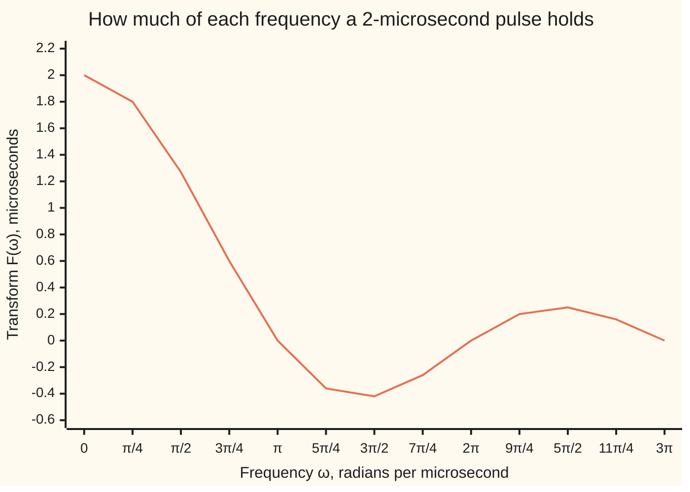
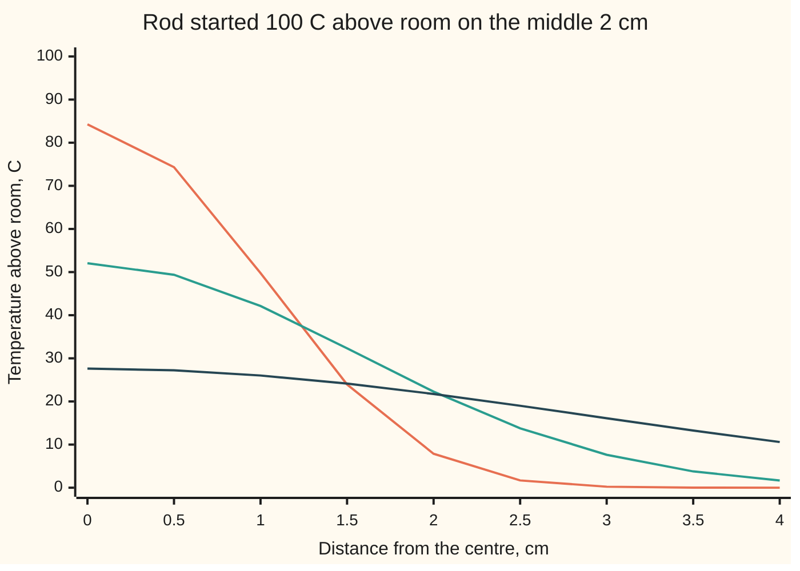

# The complex form: one coefficient c_n e^(inx) per frequency, and letting the period grow gives the Fourier transform

[Syllabus](../../../SYLLABUS.md) → [Differential equations and dynamics](../../../SYLLABUS.md#w08) → [Fourier Series](../../../SYLLABUS.md#w08-s09) → The complex form

---

## General Overview

A radar transmitter keys its carrier on for 2 microseconds, then off. Its envelope is a rectangle, height 1 for 2 µs, and the receiver must pass the frequencies it holds. It never repeats, so no Fourier series fits it.

The synthesiser's square wave, +1 for half of each cycle and −1 for the rest, does repeat: (4/π)(sin x + sin 3x/3 + sin 5x/5 + …) ([Fourier series](01-fourier-series-and-orthogonality.md)).

Written as spinning arrows, those sines get one complex coefficient per frequency. Repeat the radar pulse ever further apart and its frequencies close up into a continuous dial: the Fourier transform. On a hot rod, that dial turns the heat equation into one decay law per frequency.

**A sine-and-cosine series is a series of arrows c_n e^(inx) with c_n = (a_n − i b_n)/2; stretch the period without end and the amounts become the Fourier transform, which turns heat flow on an endless rod into one decay per frequency.**

**What kind of fact this is:** a definition (the complex coefficients and the transform). The conversion, the pulse's transform and the rod's solution are proved in Why it works; sum to integral is sketched there, proved in [The Fourier transform](../../07-Complex%20analysis/08-Transforms%20in%20Outline/03-fourier-transform.md).

### The picture: the radar pulse's spectrum



The line is F(ω) = 2 sin ω/ω; most of the pulse lives below its first zero, ω = π. Repeated every 4 µs, the pulse's coefficients times 4 are every second point here; repeated every 8 µs, times 8, every point.

---

## The formula

Notation first. The arrow e^(inx), a complex exponential, is the point at angle nx on the unit circle ([Euler's formula](../../07-Complex%20analysis/01-Complex%20Numbers%20and%20the%20Plane/04-eulers-formula.md)), turning n times per cycle, backwards for negative n. A hat, as in û, names a transform. The complex series, from [Fourier series](../../07-Complex%20analysis/08-Transforms%20in%20Outline/01-fourier-series-in-complex-form.md):

$$f(x)=\sum_{n=-\infty}^{\infty} c_n\,e^{inx},\qquad c_n=\frac{1}{2\pi}\int_{-\pi}^{\pi} f(x)\,e^{-inx}\,dx$$

The bridge from this shelf's real series a_0/2 + Σ (a_n cos nx + b_n sin nx):

$$c_0=\frac{a_0}{2},\qquad c_n=\frac{a_n-i\,b_n}{2},\qquad c_{-n}=\frac{a_n+i\,b_n}{2}\qquad(n\ge 1)$$

**Read it aloud:** each real tone splits into two half-size arrows turning opposite ways.

For the square wave, a_n = 0 and b_n = 4/(nπ) on odd n, so

$$c_n=\frac{2}{i\pi n}=-\frac{2i}{\pi n}\quad(n\text{ odd}),\qquad c_n=0\quad(n\text{ even})$$

The transform and its inverse, from [The Fourier transform](../../07-Complex%20analysis/08-Transforms%20in%20Outline/03-fourier-transform.md):

$$F(\omega)=\int_{-\infty}^{\infty} f(t)\,e^{-i\omega t}\,dt,\qquad f(t)=\frac{1}{2\pi}\int_{-\infty}^{\infty} F(\omega)\,e^{i\omega t}\,d\omega$$

**Read it aloud:** the amount of frequency ω is the signal times a backward-spinning probe, added over all time; the inverse adds every amount spun forward, over 2π.

The radar pulse, 1 for −1 < t < 1 and 0 otherwise, has

$$F(\omega)=\frac{2\sin\omega}{\omega},\qquad F(0)=2$$

On a rod, u(x, t) is the temperature at place x and time t; u_t is its rate in time and u_xx the profile's bend (second derivative in x). The heat equation, and what the transform makes of it:

$$u_t=\kappa\,u_{xx}\quad\Longrightarrow\quad \hat u(\omega,t)=\hat u(\omega,0)\,e^{-\kappa\omega^2 t}$$

**Read it aloud:** temperature rises where the profile bends up; in frequency, each wiggle fades at its own rate, κ times ω squared.

| Symbol | Plain meaning | In our example | Push it up and the answer… |
| --- | --- | --- | --- |
| $x$ | angle in the cycle; on the rod, place in cm | −π to π; 0 to 4 cm | — |
| $n$, $k$ | tone numbers, negatives included | ±1, ±3, ±5 | c_n shrinks like 1/n |
| $c_n$ | arrow n: length and starting angle | c_1 = −0.636620i | — |
| $a_n$, $b_n$ | cosine and sine amounts | b_1 = 1.273240 | c_n grows half as much |
| $t$, $\omega$ | time in µs; radians per µs (per cm on the rod) | pulse on −1 < t < 1 | F ripples down like 1/ω |
| $F$, $\hat u$ | transforms: amount of each frequency | F(1) = 1.682942 | — |
| $T$ | repeat spacing of the pulse | 4 µs, 8 µs | samples crowd together |
| $u$, $u_t$, $u_{xx}$, $\kappa$ | °C above room; its time rate; its bend; diffusivity, cm^2/s | 100 on −1 < x < 1; κ = 0.1 | κ up: evens out faster |

### When it holds

- **The conversion is exact** whenever the real coefficients exist.
- **The transform needs finite area under |f|.** A carrier left on for ever has none: its F(0), the integral of cos t from −L to L, reads −1.088042 at L = 10, 1.825891 at L = 20, and never settles.
- **Inversion gives f where f is continuous, the midpoint at a jump**, as the square wave's series does ([Convergence](02-convergence-jumps-and-gibbs.md)).
- **The rod must be endless and cool far away.** Otherwise the end terms dropped in Step 4 stay; a rod with fixed ends takes a sine series ([Half-range series](04-half-range-sine-and-cosine-series.md)).

---

## Why it works

### Step 0: a real tone is two arrows turning opposite ways

An arrow turning forwards and its mirror image turning backwards always add to a real number. So a cosine or sine is a pair of arrows.

### Step 1: the conversion, from Euler's formula

Euler's formula gives cos nx = (e^(inx) + e^(−inx))/2 and sin nx = (e^(inx) − e^(−inx))/(2i). Multiply by a_n and b_n, add, and collect arrows (1/i = −i):

$$a_n\cos nx+b_n\sin nx=\frac{a_n-i\,b_n}{2}\,e^{inx}+\frac{a_n+i\,b_n}{2}\,e^{-inx}.$$

The two coefficients are c_n and c_(−n). The constant a_0/2 is the arrow that does not turn, c_0.

On the square wave, b_1 = 4/π = 1.273240, so c_1 = −0.636620i and c_(−1) = +0.636620i: one starts straight down, the other straight up. The direct average of f e^(−inx), split at x = 0, agrees:

$$c_n=\frac{1}{2\pi}\Big(\int_0^{\pi}e^{-inx}\,dx-\int_{-\pi}^{0}e^{-inx}\,dx\Big)=\frac{1-(-1)^n}{i\pi n},$$

which is 2/(iπn) on odd n and 0 on even n.

In arrows, Parseval's identity ([Parseval's identity](03-parsevals-identity.md)) says the average of |f|^2 over a cycle, 1 here, is the sum of |c_n|^2. Tone 1's two arrows give 0.810569; up to |n| = 9, 0.959605; up to 99, 0.995947.

### Step 2: repeat the pulse, then stretch the repeat

Repeat the radar pulse every T µs, T > 2. Now it has a series, with arrows at ω_k = 2πk/T and coefficients averaged over one period:

$$c_k=\frac1T\int_{-T/2}^{T/2} f(t)\,e^{-i\omega_k t}\,dt=\frac{F(\omega_k)}{T}.$$

The last step holds because f is zero outside the pulse. At T = 4, 4 c_1 = 1.273240 = F(π/2); at T = 8, 8 c_2 sits at the same frequency and matches. Doubling T halves the spacing Δω = 2π/T, so samples of one curve crowd together:

$$f(t)=\sum_k \frac{F(\omega_k)}{T}\,e^{i\omega_k t}=\frac{1}{2\pi}\sum_k F(\omega_k)\,e^{i\omega_k t}\,\Delta\omega.$$

The right side is a Riemann sum (strips of width Δω). As T grows it becomes the inverse integral; the inverse's 1/(2π) is the series' 1/T, carried through.

<details>
<summary>Detailed proof: why the strips become the integral</summary>

The sketch moves a limit through an infinite sum. The clean proof, in [The Fourier transform](../../07-Complex%20analysis/08-Transforms%20in%20Outline/03-fourier-transform.md), takes finite area under |f| and |F|, damps the inverse by e^(−εω^2), swaps the integrals, and lets ε shrink to 0: the damped integral is f averaged over a bell of width about √ε, which tends to f(t) where f is continuous, the midpoint at a jump. The pulse's F shrinks only like 1/ω, so its inverse settles only through cancelling ripples, like the square wave's series.

</details>

### Step 3: the pulse's transform, by one antiderivative

The integral runs over the pulse's 2 µs only. The antiderivative of e^(−iωt) is e^(−iωt)/(−iω):

$$F(\omega)=\int_{-1}^{1}e^{-i\omega t}\,dt=\frac{e^{i\omega}-e^{-i\omega}}{i\omega}=\frac{2\sin\omega}{\omega}.$$

At ω = 0 it is the pulse's area, 2; at ω = 1, 1.682942; at ω = π the probe turns once across the pulse and cancels to 0. The pulse is symmetric, so the imaginary part is 0.

### Step 4: the rod, one decay law per frequency

A long metal rod, diffusivity κ = 0.1 cm^2/s, has its stretch −1 < x < 1 raised 100 °C above room. Measured from room, the start is 100 times the pulse, in cm: û(ω, 0) = 100 × 2 sin ω/ω.

Transform in x. Two integrations by parts turn u_xx into −ω^2 û, so for each ω separately

$$\frac{d\hat u}{dt}=-\kappa\,\omega^2\,\hat u,$$

the decay law of [Growth, decay and cooling](../01-Rate%20Equations/04-exponential-growth-decay-and-cooling.md) at rate κω^2, solved by û(ω, 0) e^(−κω^2 t). A wiggle twice as fine fades four times as fast, so edges round off first; at ω = 0 nothing fades, so total heat is kept. Invert, the integrand being even in ω:

$$u(x,t)=\frac{1}{\pi}\int_0^{\infty}100\,\frac{2\sin\omega}{\omega}\,e^{-\kappa\omega^2 t}\cos\omega x\,d\omega.$$

At the centre this gives 84.27 °C after 2.5 s, 52.05 °C after 10 s and 27.63 °C after 40 s.

<details>
<summary>The algebra behind this</summary>

The integral of u_x e^(−iωx) over the rod is [u e^(−iωx)] at the far ends, 0, minus the integral of u × (−iω) e^(−iωx): the transform of u_x is iω û. Again for u_xx: (iω)^2 û = −ω^2 û. Time is not transformed, so u_t becomes dû/dt.

</details>

A second road adds spreading bells: 50 [erf((1 − x)/s) + erf((1 + x)/s)], s = 2√(κt), erf being the error function (area under a bell), from [The heat kernel](../10-The%20Classical%20PDEs/10-the-heat-kernel.md). The code runs both.

---

## Worked numbers, by hand

| Step | Arithmetic | Value |
| --- | --- | --- |
| square wave, sine amount of tone 1 | b_1 = 4/π | 1.273240 |
| its forward arrow | c_1 = (0 − i × 1.273240)/2 | **−0.636620i** |
| its backward arrow | c_(−1) = (0 + i × 1.273240)/2 | +0.636620i |
| pulse, frequency 1 | F(1) = 2 sin 1 / 1 | 1.682942 |
| repeat every 4 µs, k = 1 | 4 c_1 = F(2π/4) | 1.273240 |
| rod centre after 10 s | κt = 1, so s = 2; 100 erf(1/2) | **52.05 °C** |

After 10 s the centre has lost about half its excess; 3 cm out reads 7.63 °C.

### The picture: the rod evening out



Lines: 2.5 s, 10 s, 40 s. Only x ≥ 0 is drawn, by symmetry; the start was 100 inside 1 cm, 0 outside.

### What breaks if you drop a piece

| Mistake | Comes out at | What went wrong |
| --- | --- | --- |
| Drop the 1/2 in (a_n − i b_n)/2 | c_1 = −1.273240i | two arrows share each tone |
| Swap the sign, (a_n + i b_n)/2 | c_1 = +0.636620i | that is c_(−1): the wave upside down |
| Drop the 1/(2π) in the inverse | 327.04 °C at the centre after 10 s | hotter than the 100 °C start |
| Transform a carrier left on for ever | −1.088042 at L = 10, 1.825891 at L = 20 | no finite area; never settles |

The code prints all four.

---

## Code, from first principles, and it actually runs

Every integral, erf included, is a Simpson or midpoint sum written here. Two roads each: c_n by average and by conversion; F by integration and by 2 sin ω/ω; T c_k over one period against F; the rod by inverse transform and by bells.

### Python

```python
# Complex Fourier series and the transform in outline -- the check behind the card.
# Standard library only (sin, cos, exp, sqrt, pi); every integral, erf included, is a sum written here.
from math import sin, cos, exp, sqrt, pi

def simpson(f, a, b, n=2000):              # n even; error shrinks like step^4
    h = (b - a) / n
    s = f(a) + f(b) + sum((4 if k % 2 else 2) * f(a + k * h) for k in range(1, n))
    return s * h / 3
z = lambda v: 0.0 if abs(v) < 5e-7 else v  # prints a rounding speck as 0, not -0

# 1. Square wave, +1 on (0, pi), -1 on (-pi, 0).  Road one: c_n as the average
#    of f times e^(-inx).  Road two: (a_n - i b_n)/2 from the real series, b_n = 4/(n pi).
for n in (1, -1, 2, 3, 5):
    re_ = (simpson(lambda x: cos(n * x), 0, pi) - simpson(lambda x: cos(n * x), -pi, 0)) / (2 * pi)
    im_ = -(simpson(lambda x: sin(n * x), 0, pi) - simpson(lambda x: sin(n * x), -pi, 0)) / (2 * pi)
    b = 4 / (abs(n) * pi) if n % 2 else 0.0
    conv = -b / 2 if n > 0 else b / 2      # c_n = -i b_n/2, c_(-n) = +i b_n/2
    assert max(abs(re_), abs(im_ - conv)) < 1e-9
    print(f"square n={n:2d}: c_n by integral {z(re_):.6f} {z(im_):+.6f}i | (a_n - i b_n)/2 {z(conv):+.6f}i")
par = [sum(2 * (2 / (n * pi)) ** 2 for n in range(1, N + 1, 2)) for N in (1, 9, 99)]
print("Parseval, sum of |c_n|^2 for |n| <= 1, 9, 99:", " ".join(f"{p:.6f}" for p in par))

# 2. The radio pulse, 1 for |t| < 1 microsecond: F(w) by integral, against 2 sin(w)/w.
F = lambda w: 2 * sin(w) / w if w else 2.0
ws = (0.0, 1.0, pi / 2, pi)
num = [simpson(lambda t: cos(w * t), -1, 1) for w in ws]
odd = max(abs(simpson(lambda t: sin(w * t), -1, 1)) for w in ws)
assert max(abs(a - F(w)) for a, w in zip(num, ws)) < 1e-9
print("pulse F(w), w = 0, 1, pi/2, pi: integral", " ".join(f"{z(v):.6f}" for v in num), f"| imag {z(odd):.6f}")
print("pulse F(w), same w: 2 sin(w)/w       ", " ".join(f"{z(F(w)):.6f}" for w in ws))

# 3. Repeat the pulse every T; T c_k by a midpoint sum over one period lands on F(2 pi k/T).
def Tc(T, k, M=40000):
    h = T / M
    return sum(h * cos(2 * pi * k / T * t) for t in (-T / 2 + (j + 0.5) * h for j in range(M)) if abs(t) < 1)
for k in (1, 2, 3):
    assert max(abs(Tc(4, k) - F(k * pi / 2)), abs(Tc(8, 2 * k) - F(k * pi / 2))) < 1e-6
    print(f"w = {k * pi / 2:.6f}: T c_k at T=4 {z(Tc(4, k)):.6f}, T=8 {z(Tc(8, 2 * k)):.6f}; F {z(F(k * pi / 2)):.6f}")
print("spectrum 2 sin(w)/w, w = k pi/4, k = 0..12:", ", ".join(f"{z(F(k * pi / 4)):.2f}" for k in range(13)))
print("carrier cos t, F(0) = integral over (-L, L), L = 10, 20:",
      " ".join(f"{simpson(cos, -L, L, 4000):.6f}" for L in (10, 20)))

# 4. Heat on an endless rod, kappa = 0.1 cm^2/s, 100 C above ambient on |x| < 1 cm.
#    Road one: invert the transform, each frequency damped by exp(-kappa w^2 t).
#    Road two: the heat-kernel answer 50 [erf((1 - x)/s) + erf((1 + x)/s)], s = 2 sqrt(kappa t).
kap = 0.1
def u_transform(x, t):
    return simpson(lambda w: 100 * F(w) * exp(-kap * w * w * t) * cos(w * x), 0, 16) / pi
def erf(y):                                # error function, by its defining integral
    return simpson(lambda s: 2 / sqrt(pi) * exp(-s * s), 0, y, 400)
def u_kernel(x, t):
    s = 2 * sqrt(kap * t)
    return 50 * (erf((1 - x) / s) + erf((1 + x) / s))
ts, xs = (2.5, 10, 40), [j / 2 for j in range(9)]
assert max(abs(u_transform(x, t) - u_kernel(x, t)) for t in ts for x in xs) < 1e-6
print("rod centre, t = 2.5, 10, 40 s: transform", " ".join(f"{u_transform(0, t):.4f}" for t in ts),
      "| kernel", " ".join(f"{u_kernel(0, t):.4f}" for t in ts))
for t in ts:
    print(f"profile t = {t} s, x = 0..4 cm by 0.5:", ", ".join(f"{u_transform(x, t):.2f}" for x in xs))
print(f"breaks: c_1 without the 1/2 {-4 / pi:+.6f}i; centre at 10 s without 1/(2 pi) {2 * pi * u_kernel(0, 10):.2f} C")
```

**Ran 2026-09-28 on macOS, Python 3.14.6, standard library only. All checks passed. Output, pasted from the run:**

```
square n= 1: c_n by integral 0.000000 -0.636620i | (a_n - i b_n)/2 -0.636620i
square n=-1: c_n by integral 0.000000 +0.636620i | (a_n - i b_n)/2 +0.636620i
square n= 2: c_n by integral 0.000000 +0.000000i | (a_n - i b_n)/2 +0.000000i
square n= 3: c_n by integral 0.000000 -0.212207i | (a_n - i b_n)/2 -0.212207i
square n= 5: c_n by integral 0.000000 -0.127324i | (a_n - i b_n)/2 -0.127324i
Parseval, sum of |c_n|^2 for |n| <= 1, 9, 99: 0.810569 0.959605 0.995947
pulse F(w), w = 0, 1, pi/2, pi: integral 2.000000 1.682942 1.273240 0.000000 | imag 0.000000
pulse F(w), same w: 2 sin(w)/w        2.000000 1.682942 1.273240 0.000000
w = 1.570796: T c_k at T=4 1.273240, T=8 1.273240; F 1.273240
w = 3.141593: T c_k at T=4 0.000000, T=8 0.000000; F 0.000000
w = 4.712389: T c_k at T=4 -0.424413, T=8 -0.424413; F -0.424413
spectrum 2 sin(w)/w, w = k pi/4, k = 0..12: 2.00, 1.80, 1.27, 0.60, 0.00, -0.36, -0.42, -0.26, 0.00, 0.20, 0.25, 0.16, 0.00
carrier cos t, F(0) = integral over (-L, L), L = 10, 20: -1.088042 1.825891
rod centre, t = 2.5, 10, 40 s: transform 84.2701 52.0500 27.6326 | kernel 84.2701 52.0500 27.6326
profile t = 2.5 s, x = 0..4 cm by 0.5: 84.27, 74.33, 49.77, 23.95, 7.86, 1.69, 0.23, 0.02, 0.00
profile t = 10 s, x = 0..4 cm by 0.5: 52.05, 49.37, 42.14, 32.33, 22.28, 13.78, 7.63, 3.78, 1.67
profile t = 40 s, x = 0..4 cm by 0.5: 27.63, 27.22, 26.02, 24.15, 21.74, 19.00, 16.11, 13.26, 10.59
breaks: c_1 without the 1/2 -1.273240i; centre at 10 s without 1/(2 pi) 327.04 C
```

### Rust

```rust
// Complex Fourier series and the transform in outline -- the check behind the card.
// Rust std only.  f64 gives sin, cos, exp, sqrt; every integral, the error
// function included, is a Simpson or midpoint sum written here.
use std::f64::consts::PI;

fn simpson(f: &dyn Fn(f64) -> f64, a: f64, b: f64, n: usize) -> f64 {
    let h = (b - a) / n as f64;
    let mut s = f(a) + f(b);
    for k in 1..n { s += if k % 2 == 1 { 4.0 } else { 2.0 } * f(a + k as f64 * h); }
    s * h / 3.0
}
fn z(v: f64) -> f64 { if v.abs() < 5e-7 { 0.0 } else { v } } // a rounding speck prints as 0
fn big_f(w: f64) -> f64 { if w == 0.0 { 2.0 } else { 2.0 * w.sin() / w } }
fn join(v: &[f64], d: usize, sep: &str) -> String {
    v.iter().map(|x| format!("{:.*}", d, z(*x))).collect::<Vec<_>>().join(sep)
}
// Pulse train of period T: T c_k by a midpoint sum over one whole period.
fn tc(t_per: f64, k: f64) -> f64 {
    let m = 40000; let h = t_per / m as f64; let w = 2.0 * PI * k / t_per;
    (0..m).map(|j| -t_per / 2.0 + (j as f64 + 0.5) * h).filter(|t| t.abs() < 1.0)
        .map(|t| h * (w * t).cos()).sum()
}
const KAP: f64 = 0.1;
fn u_transform(x: f64, t: f64) -> f64 {
    simpson(&|w| 100.0 * big_f(w) * (-KAP * w * w * t).exp() * (w * x).cos(), 0.0, 16.0, 2000) / PI
}
fn erf(y: f64) -> f64 { simpson(&|s| 2.0 / PI.sqrt() * (-s * s).exp(), 0.0, y, 400) }
fn u_kernel(x: f64, t: f64) -> f64 {
    let s = 2.0 * (KAP * t).sqrt();
    50.0 * (erf((1.0 - x) / s) + erf((1.0 + x) / s))
}

fn main() {
    // 1. Square wave: c_n by its defining average, against (a_n - i b_n)/2, b_n = 4/(n pi).
    for n in [1i32, -1, 2, 3, 5] {
        let nf = n as f64;
        let re = (simpson(&|x| (nf * x).cos(), 0.0, PI, 2000) - simpson(&|x| (nf * x).cos(), -PI, 0.0, 2000)) / (2.0 * PI);
        let im = -(simpson(&|x| (nf * x).sin(), 0.0, PI, 2000) - simpson(&|x| (nf * x).sin(), -PI, 0.0, 2000)) / (2.0 * PI);
        let b = if n % 2 != 0 { 4.0 / (nf.abs() * PI) } else { 0.0 };
        let conv = if n > 0 { -b / 2.0 } else { b / 2.0 };
        assert!(re.abs().max((im - conv).abs()) < 1e-9);
        println!("square n={:2}: c_n by integral {:.6} {:+.6}i | (a_n - i b_n)/2 {:+.6}i", n, z(re), z(im), z(conv));
    }
    let par: Vec<f64> = [1, 9, 99].iter().map(|&nn| (1..=nn).step_by(2)
        .map(|n| 2.0 * (2.0 / (n as f64 * PI)).powi(2)).sum()).collect();
    println!("Parseval, sum of |c_n|^2 for |n| <= 1, 9, 99: {}", join(&par, 6, " "));

    // 2. The radio pulse, 1 for |t| < 1 microsecond: F(w) by integral, against 2 sin(w)/w.
    let ws = [0.0, 1.0, PI / 2.0, PI];
    let num: Vec<f64> = ws.iter().map(|&w| simpson(&|t| (w * t).cos(), -1.0, 1.0, 2000)).collect();
    let odd = ws.iter().map(|&w| simpson(&|t| (w * t).sin(), -1.0, 1.0, 2000).abs()).fold(0.0, f64::max);
    assert!(num.iter().zip(ws.iter()).map(|(a, &w)| (a - big_f(w)).abs()).fold(0.0, f64::max) < 1e-9);
    println!("pulse F(w), w = 0, 1, pi/2, pi: integral {} | imag {:.6}", join(&num, 6, " "), z(odd));
    let cl: Vec<f64> = ws.iter().map(|&w| big_f(w)).collect();
    println!("pulse F(w), same w: 2 sin(w)/w        {}", join(&cl, 6, " "));

    // 3. Repeat the pulse every T; T c_k lands on F(2 pi k / T).
    for k in [1.0, 2.0, 3.0] {
        assert!((tc(4.0, k) - big_f(k * PI / 2.0)).abs().max((tc(8.0, 2.0 * k) - big_f(k * PI / 2.0)).abs()) < 1e-6);
        println!("w = {:.6}: T c_k at T=4 {:.6}, T=8 {:.6}; F {:.6}", k * PI / 2.0, z(tc(4.0, k)), z(tc(8.0, 2.0 * k)), z(big_f(k * PI / 2.0)));
    }
    let sp: Vec<f64> = (0..13).map(|k| big_f(k as f64 * PI / 4.0)).collect();
    println!("spectrum 2 sin(w)/w, w = k pi/4, k = 0..12: {}", join(&sp, 2, ", "));
    let st: Vec<f64> = [10.0, 20.0].iter().map(|&l| simpson(&|t| t.cos(), -l, l, 4000)).collect();
    println!("carrier cos t, F(0) = integral over (-L, L), L = 10, 20: {}", join(&st, 6, " "));

    // 4. Heat on an endless rod, kappa = 0.1 cm^2/s, 100 C above ambient on |x| < 1 cm.
    let ts = [2.5, 10.0, 40.0];
    let xs: Vec<f64> = (0..9).map(|j| j as f64 / 2.0).collect();
    let worst = ts.iter().flat_map(|&t| xs.iter().map(move |&x| (u_transform(x, t) - u_kernel(x, t)).abs())).fold(0.0, f64::max);
    assert!(worst < 1e-6);
    let ct: Vec<f64> = ts.iter().map(|&t| u_transform(0.0, t)).collect();
    let ck: Vec<f64> = ts.iter().map(|&t| u_kernel(0.0, t)).collect();
    println!("rod centre, t = 2.5, 10, 40 s: transform {} | kernel {}", join(&ct, 4, " "), join(&ck, 4, " "));
    for t in ts {
        let pr: Vec<f64> = xs.iter().map(|&x| u_transform(x, t)).collect();
        println!("profile t = {} s, x = 0..4 cm by 0.5: {}", t, join(&pr, 2, ", "));
    }
    println!("breaks: c_1 without the 1/2 {:+.6}i; centre at 10 s without 1/(2 pi) {:.2} C", -4.0 / PI, 2.0 * PI * u_kernel(0.0, 10.0));
}
```

**Ran 2026-09-28 on macOS, rustc 1.98.1, no crates. All checks passed. Output, pasted from the run:**

```
square n= 1: c_n by integral 0.000000 -0.636620i | (a_n - i b_n)/2 -0.636620i
square n=-1: c_n by integral 0.000000 +0.636620i | (a_n - i b_n)/2 +0.636620i
square n= 2: c_n by integral 0.000000 +0.000000i | (a_n - i b_n)/2 +0.000000i
square n= 3: c_n by integral 0.000000 -0.212207i | (a_n - i b_n)/2 -0.212207i
square n= 5: c_n by integral 0.000000 -0.127324i | (a_n - i b_n)/2 -0.127324i
Parseval, sum of |c_n|^2 for |n| <= 1, 9, 99: 0.810569 0.959605 0.995947
pulse F(w), w = 0, 1, pi/2, pi: integral 2.000000 1.682942 1.273240 0.000000 | imag 0.000000
pulse F(w), same w: 2 sin(w)/w        2.000000 1.682942 1.273240 0.000000
w = 1.570796: T c_k at T=4 1.273240, T=8 1.273240; F 1.273240
w = 3.141593: T c_k at T=4 0.000000, T=8 0.000000; F 0.000000
w = 4.712389: T c_k at T=4 -0.424413, T=8 -0.424413; F -0.424413
spectrum 2 sin(w)/w, w = k pi/4, k = 0..12: 2.00, 1.80, 1.27, 0.60, 0.00, -0.36, -0.42, -0.26, 0.00, 0.20, 0.25, 0.16, 0.00
carrier cos t, F(0) = integral over (-L, L), L = 10, 20: -1.088042 1.825891
rod centre, t = 2.5, 10, 40 s: transform 84.2701 52.0500 27.6326 | kernel 84.2701 52.0500 27.6326
profile t = 2.5 s, x = 0..4 cm by 0.5: 84.27, 74.33, 49.77, 23.95, 7.86, 1.69, 0.23, 0.02, 0.00
profile t = 10 s, x = 0..4 cm by 0.5: 52.05, 49.37, 42.14, 32.33, 22.28, 13.78, 7.63, 3.78, 1.67
profile t = 40 s, x = 0..4 cm by 0.5: 27.63, 27.22, 26.02, 24.15, 21.74, 19.00, 16.11, 13.26, 10.59
breaks: c_1 without the 1/2 -1.273240i; centre at 10 s without 1/(2 pi) 327.04 C
```

The two outputs agree line for line.

> [!TIP]
> **Try changing**
> Guess first, then run it.
> - **Flip the arrow.** Change `conv = -b / 2` to `conv = b / 2`. The integral still says −0.636620i at n = 1; the first assert stops the run.
> - **Only κt matters.** Set `kap = 0.4`. The 10 s centre reads 27.6326, the old 40 s value.
> - **Stretch further.** Change `Tc(8, 2 * k)` to `Tc(16, 4 * k)`. Still 1.273240, 0.000000, −0.424413: closer samples, same curve.

---

## The usual mistake

> [!warning]
> **Reading c_n as the size of tone n.** Tone n is shared by two arrows, n and −n. The square wave's first tone has height 1.273240; each arrow has length 0.636620. Drop the negative n and every tone halves, and the sum is no longer real.
>
> - **Moving the 2π.** Some books put 1/√(2π) on both integrals, or count cycles, not radians. Mixing conventions leaves a stray factor built from 2π; dropping the 1/(2π) gives 327.04 °C, not 52.05 °C.
> - **The wrong width.** Width 2 gives 2 sin ω/ω; the width-1 flash of [The Fourier transform](../../07-Complex%20analysis/08-Transforms%20in%20Outline/03-fourier-transform.md) gives 2 sin(ω/2)/ω.
> - **Series or transform.** A repeating signal has arrows at separate frequencies; a one-off pulse needs the whole dial.

---

## Where you meet it in real life

- **Radar receivers.** A 2 µs pulse lives mostly below ω = π radians per µs. Halve the pulse and the first zero moves to 2π: shorter pulses need wider receivers.
- **Audio.** A spectrum analyser shows |c_n| for a held note, |F(ω)| for a click.
- **Welding.** A hot band in a long bar flattens as charted, fine detail first; dye spreads the same way in [The heat kernel](../10-The%20Classical%20PDEs/10-the-heat-kernel.md).

> **Say it back**
> A sine or cosine is two arrows turning opposite ways, so c_n = (a_n − i b_n)/2; the square wave's are 2/(iπn) on odd n. Repeat a pulse every T and T c_k samples one curve, F; as T grows the series becomes the inverse integral. The width-2 pulse has F(ω) = 2 sin ω/ω. On an endless rod each frequency decays by e^(−κω^2 t): 52.05 °C at the centre after 10 s.

---

## What this builds on

- [Parseval's identity](03-parsevals-identity.md): the energy count, in sines.
- [Euler's formula](../../07-Complex%20analysis/01-Complex%20Numbers%20and%20the%20Plane/04-eulers-formula.md): cosine and sine as two arrows.
- [Improper integrals](../../06-Calculus%20and%20analysis/04-Integrals/07-improper-integrals.md): integrals over the whole line.
- [Fourier series](../../07-Complex%20analysis/08-Transforms%20in%20Outline/01-fourier-series-in-complex-form.md): the complex series, derived.
- [The Fourier transform](../../07-Complex%20analysis/08-Transforms%20in%20Outline/03-fourier-transform.md): the transform and its inversion, proved.

## Where this goes next

- [A partial differential equation](../10-The%20Classical%20PDEs/01-what-a-pde-says.md): equations in time and place.
- [The heat equation](../10-The%20Classical%20PDEs/03-the-heat-equation.md): where u_t = κ u_xx comes from.
- [The heat kernel](../10-The%20Classical%20PDEs/10-the-heat-kernel.md): the rod's answer as a blend of bell curves.
- [Convolution](../../07-Complex%20analysis/08-Transforms%20in%20Outline/04-convolution-theorem.md): why multiplying transforms blends signals.
- The Fourier transform of an absolutely integrable signal, and why it fades at infinity: the theory of the transform in full.

The transform solved the rod one frequency at a time; why the same answer is a blend of spreading bells is [The heat kernel](../10-The%20Classical%20PDEs/10-the-heat-kernel.md).

---

## Sources

Verified 28 Sep 2026: every link below opens a page naming the cited work.

- Stein, Elias M., and Rami Shakarchi. *Fourier Analysis: An Introduction*. Princeton University Press, 2003. [Publisher page](https://press.princeton.edu/books/hardcover/9780691113845/fourier-analysis). Complex series, the transform, and heat on the line.
- Osgood, Brad. "The Fourier Transform and its Applications" (EE261). Stanford Engineering Everywhere. [Course page with lecture notes](https://see.stanford.edu/Course/EE261). Series to transform as the period grows; the rectangle's transform.
- O'Connor, J. J., and E. F. Robertson. "Joseph Fourier." MacTutor Archive, University of St Andrews. [Biography](https://mathshistory.st-andrews.ac.uk/Biographies/Fourier/). Fourier's heat problem, where the series began.
