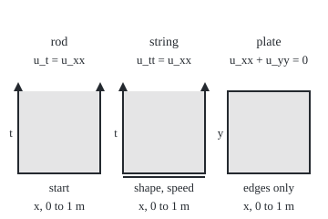
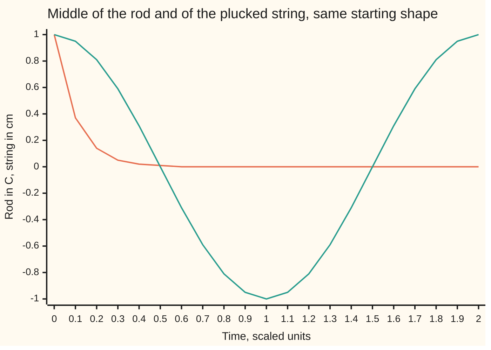

# A partial differential equation: rates in more than one direction, and three families with three personalities

[Syllabus](../../../SYLLABUS.md) → [Differential equations and dynamics](../../../SYLLABUS.md#w08) → [The Classical PDEs](../../../SYLLABUS.md#w08-s10) → A partial differential equation

---

## General Overview

A metal rod 1 m long has both ends in ice water at 0 C; its temperature starts as a smooth arch, 1 C above the ends at the middle. A guitar string 1 m long, pinned at both ends, is bent into the same arch, 1 cm high at the middle, and let go. A square metal plate 1 m on a side has three edges on ice and its top edge held warm. Each unknown depends on two things: place and time, or two coordinates of place.

An ordinary differential equation links an unknown to its rate in one direction, time. Here the unknown is a whole profile with rates in several directions at once. A rule linking those rates is a **partial differential equation**, a PDE from here on.

The three rules have three personalities. The rod's heat fades; the string swings for ever; the plate settles into a state fixed by its edges. Each asks for different information: the rod, its starting profile and two ends; the string, its starting shape, starting speed and two ends; the plate, only its edges.

**A PDE links a function's rates in several directions; for second-order equations in two variables, the sign of B^2 − 4AC sorts each into the heat, wave or Laplace family, and each family takes its own kind of starting and edge conditions.**

**What kind of fact this is:** a definition: the family names are given by the sign of B^2 − 4AC. Which conditions each family takes is shown here by example and proved on each equation's own card.

### The picture: where each problem is given its data

<p align="center"></p>

To scale: 90 units per metre across; up, 90 per scaled time unit or per metre. Thick edges carry data; the string's doubled edge is shape and speed. The strips are open at the top: the future is not given.

---

## The formula

Notation first, in words. A subscript names a partial derivative, a rate in one direction with the other variables held still ([Partial derivatives](../../06-Calculus%20and%20analysis/07-Several%20Variables/01-partial-derivatives.md)). So u_t is how fast the temperature at one fixed point changes in time, and u_x is the slope along the rod at one instant. A doubled letter takes the rate twice: u_xx is the **bend** of the profile (its second derivative in x), and u_tt the acceleration of one point of the string.

The three equations, with the rod's diffusivity κ and the string's wave speed c scaled to 1:

$$u_t = u_{xx}, \qquad u_{tt} = u_{xx}, \qquad u_{xx} + u_{yy} = 0$$

**Read it aloud:** the rod warms where its profile bends upward; the string accelerates where its shape bends; the plate's bend across cancels its bend up, at every point.

Every second-order linear equation in two variables x and y, with A, B, C not all zero, can be written, with the lower-order terms (u_x, u_y, u and a given source) gathered as "…",

$$A\,u_{xx} + B\,u_{xy} + C\,u_{yy} + \ldots = 0.$$

Its family is the sign of one number, B^2 − 4AC: positive, **hyperbolic** (the wave family); zero, **parabolic** (the heat family); negative, **elliptic** (the Laplace family).

**Read it aloud:** square the middle coefficient, subtract four times the product of the outer two, and read the sign.

For the rod, time plays the part of y: u_xx − u_t = 0 has A = 1 and B = C = 0. The first-order u_t does not vote.

| Symbol | Plain meaning | In our example | Push it up and the answer… |
| --- | --- | --- | --- |
| $u$ | the unknown: temperature or height | rod middle: 1 C at the start | — |
| $x$, $y$, $t$ | place along, place up, scaled time | 0 to 1 m | — |
| $u_t$, $u_x$, $u_y$ | first partial derivatives | rod middle: u_x = 0 | — |
| $u_{xx}$, $u_{yy}$, $u_{tt}$, $u_{xy}$ | second partial derivatives: bends, acceleration, twist | the string's bend | faster change |
| $A$, $B$, $C$ | coefficients of u_xx, u_xy, u_yy | heat 1, 0, 0; wave 1, 0, −1 | large B: hyperbolic |
| $B^2 - 4AC$ | the discriminant | 0, 4, −4 | past 0, hyperbolic |
| $\kappa$, $c$ | diffusivity; wave speed | both 1 | faster change |

### When it holds

The names are a definition. The sort assumes:

- **Second order.** The transport equation u_t + u_x = 0 sits outside the three ([The transport equation](02-the-transport-equation-and-characteristics.md)).
- **One convention.** Books writing 2B u_xy test B^2 − AC.
- **Two variables.** With more, the test reads the eigenvalue signs of the coefficient matrix, `[[A, B/2], [B/2, C]]` in two variables: all one sign, elliptic; one opposite, hyperbolic; one zero, parabolic.
- **Point by point.** Varying coefficients can change the family: the Tricomi equation y u_xx + u_yy = 0, a model of airflow near the speed of sound, is elliptic for y > 0, hyperbolic for y < 0.
- **Matching conditions.** Wrong data gives many answers or wildly sensitive ones; What breaks shows both.

---

## Why it works

### Step 0: an equation fixes its highest rates; the rest must be handed in

The rod's and string's equations give the highest time rate from the shape. Every lower time rate must be handed in at the start, and each end must be told its value.

### Step 1: the rod needs one snapshot and its two ends

On a grid of points h apart, the bend is (left + right − 2 × middle)/h^2: the gap between the neighbours' mean and the point, over h^2/2. So each point warms at a rate set by how far it sits below its neighbours' mean.

Given the profile at one instant, every rate is known; a small step along them gives the next instant (Euler's rule, [Euler's method](../05-Numerical%20Evolution/01-eulers-method.md)). The end points have one neighbour each, so each end must be told, here 0 C. A starting rate cannot be handed in too: the profile fixes it.

From u(x, 0) = sin(πx) the solution is u = e^(−π^2 t) sin(πx). The middle reads 0.3727 C at t = 0.1 and has halved by t = 0.0702.

### Step 2: the string needs a snapshot, a starting speed and its two ends

u_tt = u_xx fixes the acceleration from the bend, not the speed. Plucked into sin(πx) and released from rest, the string follows u = cos(πt) sin(πx). Struck from the same shape with starting speed sin(πx), it follows u = (cos(πt) + sin(πt)/π) sin(πx). At t = 0.5 their middles read 0.0000 cm and 0.3183 cm. Two time derivatives, two starting conditions.

### Step 3: the plate needs its edges and nothing else

On a grid, u_xx + u_yy = 0 says each inside point is the mean of its four neighbours. There is no start: sweep the grid, replacing points by their neighbours' mean, until nothing moves. With the top edge at sin(πx) C and the others at 0 C, the answer is u = sin(πx) sinh(πy)/sinh(π), where sinh(z) = (e^z − e^(−z))/2. Its bend along, −π^2 u, cancels its bend up, +π^2 u. The centre reads 0.1993 C.

### Step 4: why one sign sorts them

Take a direction with components p along x and q along y, and replace u_xx by p^2, u_xy by pq and u_yy by q^2:

$$Q(p, q) = A p^2 + B p q + C q^2.$$

A direction with Q = 0 points across a **characteristic** line: the top-order part says nothing about how u changes across it, so a jump or signal can ride it. Solving Q = 0 for p/q is a quadratic with discriminant B^2 − 4AC.

- **Positive: two families of lines.** For the string, x + t and x − t constant: a pluck travels 1 m per time unit both ways, so shape and speed at one instant fix the future.
- **Zero: one family.** For the rod, t constant: a change is felt everywhere at once, forward in time only.
- **Negative: none.** Every point hears every edge, so data must go all round.

The code's second road scans Q round 3600 directions instead: both signs, hyperbolic; never zero, elliptic; touching zero, parabolic.

<details>
<summary>Detailed proof: no change of variables changes the family</summary>

New variables ξ(x, y), η(x, y) with Jacobian determinant J = ξ_x η_y − ξ_y η_x ≠ 0 turn the top-order part into A' u_ξξ + B' u_ξη + C' u_ηη. The chain rule gives the matrix `[[A', B'/2], [B'/2, C']]` as M^T `[[A, B/2], [B/2, C]]` M, where M has columns (ξ_x, ξ_y) and (η_x, η_y). Determinants multiply, so A'C' − B'^2/4 = J^2 (AC − B^2/4), that is B'^2 − 4A'C' = J^2 (B^2 − 4AC). As J^2 > 0, the sign survives.

For the wave, ξ = x + t and η = x − t give J = −2 and turn u_xx − u_tt = 0 into 4u_ξη = 0, solved by F(x + t) + G(x − t): d'Alembert's formula, proved in [The wave equation](05-the-wave-equation-and-dalemberts-formula.md).

</details>

### The picture: two personalities in time



Orange: the rod's middle, e^(−π^2 t). Teal: the plucked string's, cos(πt), back at full height at t = 2.

A problem is **well posed** when it has one solution that moves little when the data do; the general theory is A PDE problem.

---

## Worked numbers, by hand

| Step | Arithmetic | Value |
| --- | --- | --- |
| rod, u_xx − u_t = 0 | 0^2 − 4 × 1 × 0 | 0: **parabolic** |
| string, u_xx − u_tt = 0 | 0^2 − 4 × 1 × (−1) | 4: **hyperbolic** |
| plate | 0^2 − 4 × 1 × 1 | −4: **elliptic** |
| rod middle, t = 0.1 | e^(−π^2 × 0.1) | 0.3727 C |
| struck string's middle, t = 0.5 | cos(π/2) + sin(π/2)/π | 0.3183 cm |
| plate centre | sinh(π/2)/sinh(π) | **0.1993 C** |

An end condition can fix the value (held at 0 C) or the flow (insulated, slope zero); [The heat equation](03-the-heat-equation.md) uses both.

### What breaks if you drop a piece

| Mistake | Comes out at | What went wrong |
| --- | --- | --- |
| String given its shape only | middle at t = 0.5: 0.0000 or 0.3183 | one condition short |
| Plate given value 0 and slope sin(10x)/10 on one edge | 110.13 at y = 1 m; slope sin(20x)/20 gives 606456 | elliptic, given start-style data |
| Rod run backwards 0.01 | noise 0.001 sin(10πx) grows to 19.33; the profile ×1.1037 | heat runs forward only |

The plate's solution is u = sin(nx) sinh(ny)/n^2, n = 10 or 20 (Hadamard's example). The code prints all three rows.

---

## Code, from first principles, and it actually runs

Road one sorts seven equations by B^2 − 4AC and writes the closed forms. Road two scans Q and solves on grids: Euler steps for the rod, leapfrog steps (each new height from the two before) for the string, neighbour-averaging for the plate. Asserts check the sortings agree, the rod's error falls fourfold as h halves, and the grids land on the closed forms.

### Python

```python
# A partial differential equation -- the check behind the card.  Only math is
# imported.  Road one sorts seven equations by B^2 - 4AC and solves the rod, string
# and plate in closed form.  Road two sorts them by scanning directions, and steps
# the rod, string and plate on finite-difference grids that never see the answers.
from math import sin, cos, exp, sinh, pi, log
CASES = [("heat u_t = u_xx", 1, 0, 0), ("wave u_tt = u_xx", 1, 0, -1), ("Laplace u_xx + u_yy = 0", 1, 0, 1),
         ("Tricomi y u_xx + u_yy at y = 1", 1, 0, 1), ("Tricomi y u_xx + u_yy at y = -1", -1, 0, 1),
         ("trap u_xx + 3u_xy + u_yy", 1, 3, 1), ("tilted u_xx + 2u_xy + u_yy", 1, 2, 1)]
def by_discriminant(a, b, c):            # road one: the sign of B^2 - 4AC
    d = b * b - 4 * a * c
    return d, "hyperbolic" if d > 0 else ("parabolic" if d == 0 else "elliptic")
def by_scan(a, b, c, k=3600):            # road two: signs of A p^2 + B p q + C q^2 round a half circle
    q = [a * cos(t) ** 2 + b * cos(t) * sin(t) + c * sin(t) ** 2 for t in (pi * j / k for j in range(k))]
    lo, hi = min(q), max(q)
    return "hyperbolic" if lo < -1e-9 and hi > 1e-9 else ("elliptic" if lo > 1e-9 or hi < -1e-9 else "parabolic")
def lap(u, j, h): return (u[j - 1] - 2 * u[j] + u[j + 1]) / (h * h)
def heat(n, t_end=0.1):                  # rod: each point moves toward its neighbours' mean
    h = 1 / n; dt = 0.25 * h * h; u = [sin(pi * j * h) for j in range(n + 1)]
    for _ in range(round(t_end / dt)):
        u = [0.0] + [u[j] + dt * lap(u, j, h) for j in range(1, n)] + [0.0]
    return u[n // 2]
def wave(v0, n=40, t_end=0.5):           # string: the bend sets the acceleration, leapfrog steps
    h = 1 / n; dt = h / 2; old = [sin(pi * j * h) for j in range(n + 1)]
    now = [0.0] + [old[j] + dt * v0 * old[j] + dt * dt / 2 * lap(old, j, h) for j in range(1, n)] + [0.0]
    for _ in range(round(t_end / dt) - 1):
        old, now = now, [0.0] + [2 * now[j] - old[j] + dt * dt * lap(now, j, h) for j in range(1, n)] + [0.0]
    return now[n // 2]
def plate(n=20, sweeps=2000):            # plate: each inside point becomes its neighbours' mean
    u = [[sin(pi * i / n) if j == n else 0.0 for i in range(n + 1)] for j in range(n + 1)]
    for _ in range(sweeps):
        for j in range(1, n):
            for i in range(1, n):
                u[j][i] = (u[j][i - 1] + u[j][i + 1] + u[j - 1][i] + u[j + 1][i]) / 4
    return u[n // 2][n // 2]
kinds = []
for name, a, b, c in CASES:
    d, k1 = by_discriminant(a, b, c); k2 = by_scan(a, b, c); kinds.append((k1, k2))
    print(f"{name}: A {a}, B {b}, C {c}, B^2 - 4AC {d} -> {k1}; direction scan -> {k2}")
rod = exp(-pi * pi * 0.1); e1, e2 = abs(heat(10) - rod), abs(heat(20) - rod)
print(f"rod middle at t = 0.1: closed {rod:.4f}; grid error {e1:.6f} at h = 0.1, {e2:.6f} at h = 0.05; halves at t = {log(2) / pi ** 2:.4f}")
pl, st = wave(0.0), wave(1.0)
print(f"string middle at t = 0.5: plucked closed {cos(pi / 2):.4f}, grid {pl:.4f}; struck closed {1 / pi:.4f}, grid {st:.4f}")
pc, pg = sinh(pi / 2) / sinh(pi), plate()
print(f"plate centre: closed {pc:.4f}, grid {pg:.4f} at h = 0.05")
ts = [k / 10 for k in range(21)]
print("chart rod middle:", ", ".join(f"{exp(-pi * pi * t):.2f}" for t in ts))
print("chart string middle:", ", ".join(f"{cos(pi * t):.2f}" for t in ts))
print("figure, panels left x " + ", ".join(f"{20 + 115 * p}" for p in range(3)) + ", width 90 (1 m), bottom y 190, top y 100 (t = 1 or y = 1 m)")
print(f"mistake 1, string given its shape only: middle at t = 0.5 is {cos(pi / 2):.4f} or {1 / pi:.4f}, both fit")
print(f"mistake 2, plate given value and slope on one edge: slope data sin(10x)/10, at y = 1 m u reaches {sinh(10) / 100:.2f}; "
      f"data sin(20x)/20 gives {sinh(20) / 400:.0f}")
print(f"mistake 3, rod run backwards 0.01: noise 0.001 sin(10 pi x) grows to {0.001 * exp(100 * pi * pi * 0.01):.2f}, "
      f"the true profile only x{exp(pi * pi * 0.01):.4f}")
assert all(k1 == k2 for k1, k2 in kinds)                    # two roads, one sorting
assert 3.5 < e1 / e2 < 4.5 and e2 < 1e-3                    # the rod's grid closes on e^(-pi^2 t) at second order
assert abs(pl) < 1e-3 and abs(st - 1 / pi) < 1e-3           # the string's grid matches both closed forms
assert abs(pg - pc) < 2e-3                                  # the plate's averaging matches the closed form
print("ALL CHECKS PASS")
```

**Ran 2026-09-28 on macOS, Python 3.14.6, standard library only. All checks passed. Output, pasted from the run:**

```
heat u_t = u_xx: A 1, B 0, C 0, B^2 - 4AC 0 -> parabolic; direction scan -> parabolic
wave u_tt = u_xx: A 1, B 0, C -1, B^2 - 4AC 4 -> hyperbolic; direction scan -> hyperbolic
Laplace u_xx + u_yy = 0: A 1, B 0, C 1, B^2 - 4AC -4 -> elliptic; direction scan -> elliptic
Tricomi y u_xx + u_yy at y = 1: A 1, B 0, C 1, B^2 - 4AC -4 -> elliptic; direction scan -> elliptic
Tricomi y u_xx + u_yy at y = -1: A -1, B 0, C 1, B^2 - 4AC 4 -> hyperbolic; direction scan -> hyperbolic
trap u_xx + 3u_xy + u_yy: A 1, B 3, C 1, B^2 - 4AC 5 -> hyperbolic; direction scan -> hyperbolic
tilted u_xx + 2u_xy + u_yy: A 1, B 2, C 1, B^2 - 4AC 0 -> parabolic; direction scan -> parabolic
rod middle at t = 0.1: closed 0.3727; grid error 0.001520 at h = 0.1, 0.000379 at h = 0.05; halves at t = 0.0702
string middle at t = 0.5: plucked closed 0.0000, grid 0.0003; struck closed 0.3183, grid 0.3188
plate centre: closed 0.1993, grid 0.1999 at h = 0.05
chart rod middle: 1.00, 0.37, 0.14, 0.05, 0.02, 0.01, 0.00, 0.00, 0.00, 0.00, 0.00, 0.00, 0.00, 0.00, 0.00, 0.00, 0.00, 0.00, 0.00, 0.00, 0.00
chart string middle: 1.00, 0.95, 0.81, 0.59, 0.31, 0.00, -0.31, -0.59, -0.81, -0.95, -1.00, -0.95, -0.81, -0.59, -0.31, -0.00, 0.31, 0.59, 0.81, 0.95, 1.00
figure, panels left x 20, 135, 250, width 90 (1 m), bottom y 190, top y 100 (t = 1 or y = 1 m)
mistake 1, string given its shape only: middle at t = 0.5 is 0.0000 or 0.3183, both fit
mistake 2, plate given value and slope on one edge: slope data sin(10x)/10, at y = 1 m u reaches 110.13; data sin(20x)/20 gives 606456
mistake 3, rod run backwards 0.01: noise 0.001 sin(10 pi x) grows to 19.33, the true profile only x1.1037
ALL CHECKS PASS
```

### Rust

Same numbers, same labels, built with `rustc --edition 2021 -O`.

```rust
// A partial differential equation -- the same check as the Python, in Rust.  No
// crates.  Road one sorts seven equations by B^2 - 4AC and solves the rod, string
// and plate in closed form.  Road two sorts them by scanning directions, and steps
// the rod, string and plate on finite-difference grids that never see the answers.
use std::f64::consts::PI;

fn by_discriminant(a: i64, b: i64, c: i64) -> (i64, &'static str) {   // road one: the sign of B^2 - 4AC
    let d = b * b - 4 * a * c;
    (d, if d > 0 { "hyperbolic" } else if d == 0 { "parabolic" } else { "elliptic" })
}
fn by_scan(a: f64, b: f64, c: f64) -> &'static str {   // road two: signs of A p^2 + B p q + C q^2 round a half circle
    let (mut lo, mut hi) = (f64::INFINITY, f64::NEG_INFINITY);
    for j in 0..3600 {
        let t = PI * j as f64 / 3600.0;
        let q = a * t.cos().powi(2) + b * t.cos() * t.sin() + c * t.sin().powi(2);
        lo = lo.min(q); hi = hi.max(q);
    }
    if lo < -1e-9 && hi > 1e-9 { "hyperbolic" } else if lo > 1e-9 || hi < -1e-9 { "elliptic" } else { "parabolic" }
}
fn lap(u: &[f64], j: usize, h: f64) -> f64 { (u[j - 1] - 2.0 * u[j] + u[j + 1]) / (h * h) }
fn heat(n: usize, t_end: f64) -> f64 {                  // rod: each point moves toward its neighbours' mean
    let (h, mut u): (f64, Vec<f64>) = (1.0 / n as f64, (0..=n).map(|j| (PI * j as f64 / n as f64).sin()).collect());
    let dt = 0.25 * h * h;
    for _ in 0..(t_end / dt).round() as usize {
        let mut v = vec![0.0; n + 1];
        for j in 1..n { v[j] = u[j] + dt * lap(&u, j, h) }
        u = v;
    }
    u[n / 2]
}
fn wave(v0: f64, n: usize, t_end: f64) -> f64 {         // string: the bend sets the acceleration, leapfrog steps
    let h = 1.0 / n as f64; let dt = h / 2.0;
    let mut old: Vec<f64> = (0..=n).map(|j| (PI * j as f64 * h).sin()).collect();
    let mut now = vec![0.0; n + 1];
    for j in 1..n { now[j] = old[j] + dt * v0 * old[j] + dt * dt / 2.0 * lap(&old, j, h) }
    for _ in 0..(t_end / dt).round() as usize - 1 {
        let mut next = vec![0.0; n + 1];
        for j in 1..n { next[j] = 2.0 * now[j] - old[j] + dt * dt * lap(&now, j, h) }
        old = now; now = next;
    }
    now[n / 2]
}
fn plate(n: usize, sweeps: usize) -> f64 {              // plate: each inside point becomes its neighbours' mean
    let mut u = vec![vec![0.0; n + 1]; n + 1];
    for i in 0..=n { u[n][i] = (PI * i as f64 / n as f64).sin() }
    for _ in 0..sweeps { for j in 1..n { for i in 1..n {
        u[j][i] = (u[j][i - 1] + u[j][i + 1] + u[j - 1][i] + u[j + 1][i]) / 4.0;
    } } }
    u[n / 2][n / 2]
}
fn main() {
    let cases = [("heat u_t = u_xx", 1, 0, 0), ("wave u_tt = u_xx", 1, 0, -1), ("Laplace u_xx + u_yy = 0", 1, 0, 1),
        ("Tricomi y u_xx + u_yy at y = 1", 1, 0, 1), ("Tricomi y u_xx + u_yy at y = -1", -1, 0, 1), ("trap u_xx + 3u_xy + u_yy", 1, 3, 1),
        ("tilted u_xx + 2u_xy + u_yy", 1, 2, 1)];
    let mut agree = true;
    for (name, a, b, c) in cases {
        let (d, k1) = by_discriminant(a, b, c); let k2 = by_scan(a as f64, b as f64, c as f64);
        agree &= k1 == k2;
        println!("{}: A {}, B {}, C {}, B^2 - 4AC {} -> {}; direction scan -> {}", name, a, b, c, d, k1, k2);
    }
    let rod = (-PI * PI * 0.1).exp(); let (e1, e2) = ((heat(10, 0.1) - rod).abs(), (heat(20, 0.1) - rod).abs());
    println!("rod middle at t = 0.1: closed {:.4}; grid error {:.6} at h = 0.1, {:.6} at h = 0.05; halves at t = {:.4}", rod, e1, e2, 2f64.ln() / (PI * PI));
    let (pl, st) = (wave(0.0, 40, 0.5), wave(1.0, 40, 0.5));
    println!("string middle at t = 0.5: plucked closed {:.4}, grid {:.4}; struck closed {:.4}, grid {:.4}", (PI / 2.0).cos(), pl, 1.0 / PI, st);
    let (pc, pg) = ((PI / 2.0).sinh() / PI.sinh(), plate(20, 2000));
    println!("plate centre: closed {:.4}, grid {:.4} at h = 0.05", pc, pg);
    let ts: Vec<f64> = (0..21).map(|k| k as f64 / 10.0).collect();
    println!("chart rod middle: {}", ts.iter().map(|t| format!("{:.2}", (-PI * PI * t).exp())).collect::<Vec<_>>().join(", "));
    println!("chart string middle: {}", ts.iter().map(|t| format!("{:.2}", (PI * t).cos())).collect::<Vec<_>>().join(", "));
    println!("figure, panels left x {}, width 90 (1 m), bottom y 190, top y 100 (t = 1 or y = 1 m)", (0..3).map(|p| (20 + 115 * p).to_string()).collect::<Vec<_>>().join(", "));
    println!("mistake 1, string given its shape only: middle at t = 0.5 is {:.4} or {:.4}, both fit", (PI / 2.0).cos(), 1.0 / PI);
    println!("mistake 2, plate given value and slope on one edge: slope data sin(10x)/10, at y = 1 m u reaches {:.2}; data sin(20x)/20 gives {:.0}", 10f64.sinh() / 100.0, 20f64.sinh() / 400.0);
    println!("mistake 3, rod run backwards 0.01: noise 0.001 sin(10 pi x) grows to {:.2}, the true profile only x{:.4}", 0.001 * (100.0 * PI * PI * 0.01).exp(), (PI * PI * 0.01).exp());
    assert!(agree);                                         // two roads, one sorting
    assert!(e1 / e2 > 3.5 && e1 / e2 < 4.5 && e2 < 1e-3);   // the rod's grid closes on e^(-pi^2 t) at second order
    assert!(pl.abs() < 1e-3 && (st - 1.0 / PI).abs() < 1e-3);   // the string's grid matches both closed forms
    assert!((pg - pc).abs() < 2e-3);                        // the plate's averaging matches the closed form
    println!("ALL CHECKS PASS");
}
```

**Ran 2026-09-28 on macOS, rustc 1.98.1, no crates. All checks passed. Output, pasted from the run:**

```
heat u_t = u_xx: A 1, B 0, C 0, B^2 - 4AC 0 -> parabolic; direction scan -> parabolic
wave u_tt = u_xx: A 1, B 0, C -1, B^2 - 4AC 4 -> hyperbolic; direction scan -> hyperbolic
Laplace u_xx + u_yy = 0: A 1, B 0, C 1, B^2 - 4AC -4 -> elliptic; direction scan -> elliptic
Tricomi y u_xx + u_yy at y = 1: A 1, B 0, C 1, B^2 - 4AC -4 -> elliptic; direction scan -> elliptic
Tricomi y u_xx + u_yy at y = -1: A -1, B 0, C 1, B^2 - 4AC 4 -> hyperbolic; direction scan -> hyperbolic
trap u_xx + 3u_xy + u_yy: A 1, B 3, C 1, B^2 - 4AC 5 -> hyperbolic; direction scan -> hyperbolic
tilted u_xx + 2u_xy + u_yy: A 1, B 2, C 1, B^2 - 4AC 0 -> parabolic; direction scan -> parabolic
rod middle at t = 0.1: closed 0.3727; grid error 0.001520 at h = 0.1, 0.000379 at h = 0.05; halves at t = 0.0702
string middle at t = 0.5: plucked closed 0.0000, grid 0.0003; struck closed 0.3183, grid 0.3188
plate centre: closed 0.1993, grid 0.1999 at h = 0.05
chart rod middle: 1.00, 0.37, 0.14, 0.05, 0.02, 0.01, 0.00, 0.00, 0.00, 0.00, 0.00, 0.00, 0.00, 0.00, 0.00, 0.00, 0.00, 0.00, 0.00, 0.00, 0.00
chart string middle: 1.00, 0.95, 0.81, 0.59, 0.31, 0.00, -0.31, -0.59, -0.81, -0.95, -1.00, -0.95, -0.81, -0.59, -0.31, -0.00, 0.31, 0.59, 0.81, 0.95, 1.00
figure, panels left x 20, 135, 250, width 90 (1 m), bottom y 190, top y 100 (t = 1 or y = 1 m)
mistake 1, string given its shape only: middle at t = 0.5 is 0.0000 or 0.3183, both fit
mistake 2, plate given value and slope on one edge: slope data sin(10x)/10, at y = 1 m u reaches 110.13; data sin(20x)/20 gives 606456
mistake 3, rod run backwards 0.01: noise 0.001 sin(10 pi x) grows to 19.33, the true profile only x1.1037
ALL CHECKS PASS
```

> [!TIP]
> **Try changing**
> - **Shrink the middle coefficient.** Guess first: trap B from 3 to 1. Both roads print elliptic.
> - **Walk onto the Tricomi line.** Guess first: set the first Tricomi case's A to 0, the line y = 0. Both print parabolic.
> - **Stop the plate early.** Guess first: `plate(20, 100)`. The centre falls short of 0.1993 and its assert fails: the edge's warmth has not reached the middle.

---

## The usual mistake

> [!warning]
> **Judging the family by A and C alone.** u_xx + 3u_xy + u_yy has both positive, like the plate's. But B^2 − 4AC = 9 − 4 = 5: hyperbolic, a wave equation in tilted coordinates.
>
> - **Letting u_t vote.** It is first order and enters none of A, B, C.
> - **Handing the rod a starting speed.** The profile fixes it; a disagreeing value leaves no solution.
> - **Running the plate from one edge.** Slope data half the size, sin(20x)/20, gave 606456 instead of 110.13.
> - **One family per equation.** With varying coefficients it belongs to each point, as for Tricomi.

---

## Where you meet it in real life

- **Diffusion.** Heat in a wall, a drug in tissue: parabolic ([The heat equation](03-the-heat-equation.md)).
- **Option prices.** Black-Scholes is parabolic; its start is the payoff at expiry, and it runs backwards in calendar time ([Black-Scholes by hedging](../../12-Financial%20mathematics/05-Black-Scholes%20from%20the%20Ground%20Up/03-black-scholes-by-delta-hedging.md)).
- **Sound and vibration.** Hyperbolic, with finite speed ([Standing waves](06-standing-waves-on-a-string.md)).
- **Steady fields.** Voltage between conductors, a soap film on a wire loop: elliptic ([Laplace's equation](07-laplaces-equation-and-harmonic-functions.md)).
- **Flight near the speed of sound.** The flow changes family across the sonic line, as in Tricomi's model (Navier-Stokes).

> **Say it back**
> A PDE links a function's rates in several directions: u_t a rate in time, u_xx a bend in space. In two variables the sign of B^2 − 4AC names the family: zero heat, positive wave, negative Laplace. Heat needs a start and its ends, and runs forward only. Waves also need a starting speed. Laplace needs its whole edge and nothing else.

---

## What this builds on

- [Boundary value problems](../07-Series%20Solutions%20and%20Boundary%20Problems/05-two-point-boundary-value-problems.md): conditions at two ends, the pattern every edge condition here repeats.
- [Partial derivatives](../../06-Calculus%20and%20analysis/07-Several%20Variables/01-partial-derivatives.md): rates with the other variables held still, and the chain rule behind the proof.

## Where this goes next

- [The transport equation](02-the-transport-equation-and-characteristics.md): a shape carried along characteristic lines.
- [The heat equation](03-the-heat-equation.md): the rod's equation from conservation of heat.
- [Black-Scholes by hedging](../../12-Financial%20mathematics/05-Black-Scholes%20from%20the%20Ground%20Up/03-black-scholes-by-delta-hedging.md): a parabolic equation from hedging.
- Navier-Stokes: a nonlinear system mixing families.
- Three families: a grid solver for each family.
- Weak solutions: solutions with corners, where u_xx fails to exist.
- A PDE problem: well-posedness in general.

---

## Sources

Verified 2026-09-28: every link below resolves to the publisher's or author's page.

- Olver, Peter J. *Introduction to Partial Differential Equations*. Springer Undergraduate Texts in Mathematics, 2014. [Publisher DOI](https://doi.org/10.1007/978-3-319-02099-0); [author's page](https://www-users.cse.umn.edu/~olver/pde.html). The three equations, the discriminant, and each one's conditions.
- Evans, Lawrence C. *Partial Differential Equations*, 2nd ed. American Mathematical Society, 2010. [Author's page, with the book's errata](https://math.berkeley.edu/~evans/). The model equations and well-posedness, in full rigour.
