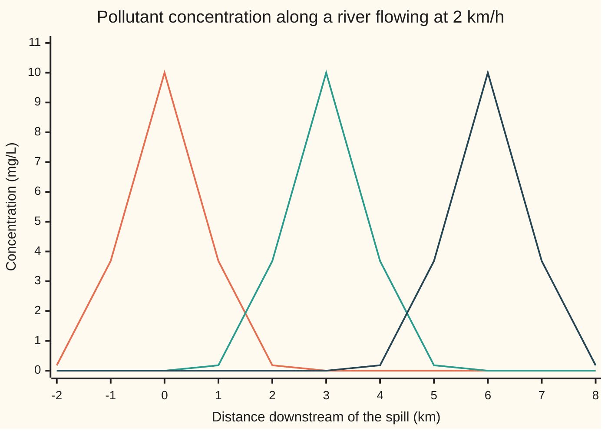
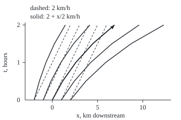

# The transport equation: a shape carried along unchanged, and the lines along which a PDE is really an ODE

[Syllabus](../../../SYLLABUS.md) → [Differential equations and dynamics](../README.md) → [The Classical PDEs](../README.md#s10) → The transport equation

---

## General Overview

A tanker spills a pollutant into a river at noon. At the spill point the concentration is 10 milligrams per litre (mg/L), falling to 3.68 mg/L one kilometre away and to almost nothing at two. The river flows at 2 km/h. Ignore mixing: each parcel of water keeps the pollutant it started with.

Then only the plume's position changes: 3 km downstream after 1.5 hours, 6 km after 3. A station 5 km downstream reads, at 3 pm, what the river held 1 km *upstream* of the spill at noon: 3.68 mg/L. Look back along the current and read the starting value there.

The paths the parcels trace on a map of place against time are the **characteristics**. Along each one the concentration never changes, so there the partial differential equation (a rule linking rates in time and in place) collapses to an ordinary one. When the current speeds up downstream the paths fan out and the plume stretches.

**A quantity carried by a current at speed c without mixing obeys u_t + c u_x = 0; its value is constant along each path the current traces, so the answer is the starting shape read back along those paths, which for a constant speed is the same shape shifted by ct.**

**What kind of fact this is:** a theorem, proved on this card in Why it works: the shifted shape solves the equation, and it is the only solution.

### The picture: the plume at noon, 1:30 pm and 3 pm



From left: t = 0 (orange), 1.5 h (green), 3 h (dark blue). Same shape, 2 km further each hour.

---

## The formula

Notation first. As on [A partial differential equation](01-what-a-pde-says.md), a subscript names the variable a partial derivative is taken in: $u_t$ is the rate of change of $u$ in time with place held fixed, and $u_x$ the rate of change along the river with time held fixed.

$$u_t + c\,u_x = 0, \qquad u(x, 0) = f(x) \quad\Longrightarrow\quad u(x, t) = f(x - c t)$$

**Read it aloud:** the value at place x and time t is the starting value at x − ct, where that water was at time 0.

| Symbol | Plain meaning | In our example | Push it up and the answer… |
| --- | --- | --- | --- |
| $u$ | the carried quantity | concentration, mg/L | — |
| $x$, $t$ | place along the river; time since the spill | km; hours | later t looks further upstream |
| $c$ | the current's speed; c(x) if it varies | 2 km/h, or 2 + x/2 km/h | the plume arrives sooner |
| $f$ | the starting shape, at t = 0 | 10 e^(−x^2) mg/L | every later value scales with it |
| $a$ | a label: where a parcel of water was at t = 0 | x − ct for a constant speed | — |
| $X$, $s$ | one parcel's path: its place at time s | X(s) = a + 2s | — |
| $u_t$, $u_x$ | rate in time at a fixed place; rate along the river at a fixed time | rising, then falling, at the station | — |

For a speed that varies with place, each parcel's path solves an ordinary differential equation, the **characteristic equation**:

$$X'(s) = c\big(X(s)\big), \qquad X(0) = a, \qquad\text{and then}\quad u\big(X(s), s\big) = f(a).$$

### The picture: characteristics on a map of place against time

<p align="center"></p>

To scale: 18 px per km across, 75 px per hour up. Five parcels start 1 km apart. At 2 km/h (dashed) they reach 2 to 6 km after 2 hours, still 1 km apart. At 2 + x/2 km/h (solid) they reach 1.44, 4.15, 6.87, 9.59 and 12.31 km: the gaps, and the plume, stretched by the factor e. The heavier curve carries the peak.

### When it holds

- **The speed is set by the river, not by the pollutant.** If it depends on the carried value, as in a flood wave where deeper water runs faster, characteristics can cross: for u_t + u u_x = 0 starting from 2 + e^(−x^2) km/h, the check finds a first crossing at 1.1658 h.
- **No mixing.** Real plumes also spread; that adds a u_xx term, the smoothing of [The heat equation](03-the-heat-equation.md). Without it the peak stays at 10 mg/L forever.
- **No source or decay.** A pollutant breaking down at rate k per hour gives u_t + c u_x = −ku; along each path the value falls as e^(−kt).
- **A smooth enough speed.** A bounded slope in c(x) gives one path through each point ([The flow](../02-Existence%2C%20Uniqueness%20and%20Sensitivity/05-the-flow-of-an-equation.md)); two paths through one point would demand two values.
- **No boundary.** On a finite reach, a path traced back far enough hits the upstream end, and the value comes from whatever enters there.

---

## Why it works

### Step 0: ride with the water

A station on the bank sees the concentration change. A float drifting with the current sees no change: it rides its own parcel of water. The equation says exactly that: u_t + c u_x is the rate of change seen by an observer moving at speed c.

### Step 1: the chain rule turns the PDE into an ODE along a path

Follow the path X(s) = a + cs. The value seen along it is u(X(s), s), a function of the single variable s. By the [Chain rule](../../06-Calculus%20and%20analysis/02-Derivatives/03-chain-rule.md) in two variables,

$$\frac{d}{ds}\,u\big(X(s), s\big) = u_x\,X'(s) + u_t = c\,u_x + u_t = 0.$$

So the value along the path is constant, equal to f(a). Along this line the PDE has become the ordinary equation "rate of change = 0".

### Step 2: every point lies on one path, so the formula is forced

The point (x, t) sits on the path with a = x − ct, so any solution equals f(x − ct) there: uniqueness.

### Step 3: the formula does solve the equation

Put u = f(x − ct), and write f′ for the slope of the spill's shape. The chain rule gives u_x = f′(x − ct) and u_t = −c f′(x − ct), so u_t + c u_x = 0, and at t = 0 the formula reads f(x): existence.

### Step 4: a varying speed changes the paths, not the argument

With speed c(x) the path solves X′ = c(X), and Step 1 goes through word for word: the value is constant along each path, now a curve. For c(x) = 2 + x/2, (X + 4)′ = (X + 4)/2, so X(s) + 4 = (a + 4) e^(s/2). Run it back from (x, t):

$$a = (x + 4)\,e^{-t/2} - 4, \qquad u(x, t) = f\big((x + 4)\,e^{-t/2} - 4\big).$$

The gap between any two paths grows by the factor e^(t/2), and so does the plume's width. The peak stays at 10 mg/L.

<details>
<summary>Detailed proof: the varying-speed case</summary>

Assume c(x) has a continuous slope with |c′(x)| ≤ L for all x. Then X′ = c(X) has one solution through each start, defined for all time (Picard–Lindelöf with a global Lipschitz bound), and the flow maps starts to places one-to-one and onto. Write a(x, t) for the start of the path through (x, t); it has continuous partial derivatives, since the flow depends smoothly on its start.

Existence: set u(x, t) = f(a(x, t)). The label is constant along each path, so by the chain rule a_t + c(x) a_x = 0. Then u_t + c u_x = f′(a)(a_t + c a_x) = 0, and at t = 0, a = x, so u = f.

Uniqueness: for any solution v with continuous partial derivatives, Step 1 gives d/ds v(X(s), s) = 0 along each path, so v(x, t) = f(a(x, t)) = u(x, t).

Where the proof stops: for u_t + u u_x = 0 the speed is the unknown. Paths still carry constant values, X(s) = a + s·g(a) for a starting profile g, but neighbours first meet at time −1/(the most negative slope of g). For g(a) = 2 + e^(−a^2) km/h that slope is −√2 e^(−1/2), so the crossing time is √(e/2) = 1.1658 h. After it no smooth solution exists.

</details>

A second road: chop the river into cells and each time step move a fraction of each cell's contents one cell downstream. That upwind grid is road 2 in the code, and the subject of Flow problems.

---

## Worked numbers, by hand

| Step | Arithmetic | Value |
| --- | --- | --- |
| where the water at the station was at noon | x − ct = 5 − 2 × 3 | −1 km |
| the spill there | 10 × e^(−1) | **3.6788 mg/L** |
| varying speed: label of the water at 10 km, 2 pm | (10 + 4)/e − 4 | 1.1503 km |
| the spill there | 10 × e^(−1.1503^2) | **2.6628 mg/L** |
| where the peak is at 2 pm | 4(e − 1) | 6.8731 km |
| width at half height, noon | 2√(ln 2) | 1.6651 km |
| width at half height, 2 pm | 1.6651 × e | **4.5262 km** |

At 3 pm the station at 5 km reads 3.6788 mg/L; at 2 pm the stretched plume is 4.5262 km wide at half height, not 1.6651.

### What breaks if you drop a piece

| Mistake | Comes out at | What went wrong |
| --- | --- | --- |
| f(x + ct) instead of f(x − ct) | 0.0000 mg/L at 6 km, 3 pm, not 10.0000 | the plume sent 6 km upstream |
| varying speed treated as 2 km/h | 0.0000 mg/L at 10 km, 2 pm, not 2.6628 | the straight line misses the curved path |
| water crosses 1.5 cells per grid step | peak grows to 10^16.3 mg/L | the grid outruns the information it needs |
| speed depends on the carried value | paths cross at 1.1658 h | two values demanded at one point: a shock |

The checks print all four.

---

## Code, from first principles, and it actually runs

Two roads to each answer. For the constant speed, road 1 is the formula; road 2 is an upwind grid moving 0.8 of each cell's contents one cell downstream per step, whose error halves with the cell width (order 1). For the varying speed, road 2 steps the characteristic equation backwards by Runge-Kutta 4 (a step that averages four slopes, from [Runge-Kutta four](../05-Numerical%20Evolution/04-runge-kutta-four.md)) and reads the spill at the label it finds. A search over neighbouring paths confirms the nonlinear crossing time.

### Python

```python
# The transport equation u_t + c u_x = 0 -- the check behind the card.  A spill
# of 10 mg/L, width 1 km, rides a river at 2 km/h.  Road 1 is the formula; road 2
# is a grid stepped with no formula (constant speed), or the characteristic ODE
# stepped by RK4 (speed 2 + x/2).  math supplies only exp, log and sqrt.
from math import exp, log, sqrt

def f(a): return 10 * exp(-a * a)                    # the spill, mg/L, at label a km

def upwind(h, nu, T=3.0, lo=-4.0, hi=10.0, xq=5.0):  # road 2: upwind grid, speed 2
    k = nu * h / 2; u = [f(lo + i * h) for i in range(round((hi - lo) / h) + 1)]
    for _ in range(round(T / k)):
        u = [0.0] + [u[i] - nu * (u[i] - u[i - 1]) for i in range(1, len(u))]
    return u[round((xq - lo) / h)], max(abs(v) for v in u)

def rk4(x, t0, t1, n):                               # step X' = 2 + X/2 from t0 to t1
    s = (t1 - t0) / n; c = lambda X: 2 + X / 2
    for _ in range(n):
        k1 = c(x); k2 = c(x + s * k1 / 2); k3 = c(x + s * k2 / 2); k4 = c(x + s * k3)
        x += s * (k1 + 2 * k2 + 2 * k3 + k4) / 6
    return x

e = exp(1); exact = f(5 - 2 * 3)
print(f"constant speed 2 km/h, x = 5 km, t = 3 h: formula f(x - ct) = {exact:.4f} mg/L")
errs = []
for h in (0.05, 0.025, 0.0125):
    g = upwind(h, 0.8)[0]; errs.append(g - exact)
    print(f"road 2, upwind grid h = {h} km: {g:.4f} mg/L, grid minus formula {g - exact:+.4f}")
print(f"error ratios as h halves: {errs[0] / errs[1]:.2f}, {errs[1] / errs[2]:.2f}")
lab = 14 / e - 4; v = f(lab); back = [rk4(10, 2, 0, n) for n in (5, 10)]
print(f"speed 2 + x/2, x = 10 km, t = 2 h: label (x + 4)/e - 4 = {lab:.4f} km, value {v:.4f} mg/L")
for n, b in zip((5, 10), back):
    print(f"road 2, RK4 back to t = 0 in {n} steps: label {b:.6f} km, error {abs(b - lab):.7f}")
w0 = 2 * sqrt(log(2)); w2 = rk4(w0 / 2, 0, 2, 20) - rk4(-w0 / 2, 0, 2, 20)
print(f"centre at t = 2 h: formula 4(e - 1) = {4 * (e - 1):.4f} km, RK4 {rk4(0, 0, 2, 20):.4f} km")
print(f"half-height width: {w0:.4f} km at t = 0; at t = 2 h, {w0 * e:.4f} km by formula, {w2:.4f} by RK4")
print(f"mistake 1, f(x + ct) at x = 6 km, t = 3 h: {f(12):.4f} mg/L, not {f(0):.4f}")
print(f"mistake 2, speed 2 + x/2 taken as 2, at x = 10 km, t = 2 h: {f(6):.4f} mg/L, not {v:.4f}")
big = upwind(0.05, 1.5)[1]
print(f"mistake 3, river moves 1.5 cells per time step, not 0.8: peak grows to 10^{log(big) / log(10):.1f} mg/L")
labels = [-3 + i / 1000 for i in range(6001)]; sp = [2 + exp(-a * a) for a in labels]   # u_t + u u_x = 0
cross = min(-(labels[i + 1] - labels[i]) / (sp[i + 1] - sp[i]) for i in range(6000) if sp[i + 1] < sp[i])
print(f"nonlinear, speed 2 + e^(-a^2): lines first cross at {cross:.4f} h by search, {sqrt(e / 2):.4f} h by formula")
for t in (0, 1.5, 3):
    print(f"chart, t = {t} h:", ", ".join(f"{f(x - 2 * t):.2f}" for x in range(-2, 9)))
print("figure, x (km) at t = 2 h for a = -2 to 2, speed 2:", " ".join(f"{a + 4:.2f}" for a in (-2, -1, 0, 1, 2))
      + "; speed 2 + x/2, at t = 0.5, 1, 1.5, 2 h:")
print("figure,", "; ".join(" ".join(f"{(a + 4) * exp(t / 2) - 4:.2f}" for t in (0.5, 1, 1.5, 2)) for a in (-2, -1, 0, 1, 2)))
assert 0 < errs[2] < 0.06 and 1.8 < errs[1] / errs[2] < 2.2  # grid meets formula at order 1
assert abs(back[1] - lab) < 1e-5 and abs(w2 - w0 * e) < 1e-5      # RK4 meets the closed-form label
assert abs(cross - sqrt(e / 2)) < 1e-4                            # search meets breaking-time formula
print("ALL CHECKS PASS")
```

**Ran 2026-09-28 on macOS, Python 3.14.6, standard library only. All checks passed. Output, pasted from the run:**

```
constant speed 2 km/h, x = 5 km, t = 3 h: formula f(x - ct) = 3.6788 mg/L
road 2, upwind grid h = 0.05 km: 3.8648 mg/L, grid minus formula +0.1860
road 2, upwind grid h = 0.025 km: 3.7801 mg/L, grid minus formula +0.1013
road 2, upwind grid h = 0.0125 km: 3.7317 mg/L, grid minus formula +0.0529
error ratios as h halves: 1.84, 1.92
speed 2 + x/2, x = 10 km, t = 2 h: label (x + 4)/e - 4 = 1.1503 km, value 2.6628 mg/L
road 2, RK4 back to t = 0 in 5 steps: label 1.150393 km, error 0.0000812
road 2, RK4 back to t = 0 in 10 steps: label 1.150317 km, error 0.0000047
centre at t = 2 h: formula 4(e - 1) = 6.8731 km, RK4 6.8731 km
half-height width: 1.6651 km at t = 0; at t = 2 h, 4.5262 km by formula, 4.5262 by RK4
mistake 1, f(x + ct) at x = 6 km, t = 3 h: 0.0000 mg/L, not 10.0000
mistake 2, speed 2 + x/2 taken as 2, at x = 10 km, t = 2 h: 0.0000 mg/L, not 2.6628
mistake 3, river moves 1.5 cells per time step, not 0.8: peak grows to 10^16.3 mg/L
nonlinear, speed 2 + e^(-a^2): lines first cross at 1.1658 h by search, 1.1658 h by formula
chart, t = 0 h: 0.18, 3.68, 10.00, 3.68, 0.18, 0.00, 0.00, 0.00, 0.00, 0.00, 0.00
chart, t = 1.5 h: 0.00, 0.00, 0.00, 0.18, 3.68, 10.00, 3.68, 0.18, 0.00, 0.00, 0.00
chart, t = 3 h: 0.00, 0.00, 0.00, 0.00, 0.00, 0.00, 0.18, 3.68, 10.00, 3.68, 0.18
figure, x (km) at t = 2 h for a = -2 to 2, speed 2: 2.00 3.00 4.00 5.00 6.00; speed 2 + x/2, at t = 0.5, 1, 1.5, 2 h:
figure, -1.43 -0.70 0.23 1.44; -0.15 0.95 2.35 4.15; 1.14 2.59 4.47 6.87; 2.42 4.24 6.59 9.59; 3.70 5.89 8.70 12.31
ALL CHECKS PASS
```

### Rust

Same numbers, same labels, built with `rustc --edition 2021 -O`.

```rust
// The transport equation u_t + c u_x = 0 -- the same check in Rust, std only.
// A spill of 10 mg/L, width 1 km, rides a river at 2 km/h.  Road 1 is the
// formula; road 2 is a grid stepped with no formula (constant speed), or the
// characteristic ODE stepped by RK4 (speed 2 + x/2).
fn f(a: f64) -> f64 { 10.0 * (-a * a).exp() }            // the spill, mg/L, at label a km

fn upwind(h: f64, nu: f64) -> (f64, f64) {               // road 2: upwind grid, speed 2
    let (t, lo, hi, xq) = (3.0, -4.0, 10.0, 5.0);
    let k = nu * h / 2.0;
    let n = ((hi - lo) / h).round() as usize + 1;
    let mut u: Vec<f64> = (0..n).map(|i| f(lo + i as f64 * h)).collect();
    for _ in 0..(t / k).round() as usize {
        let old = u.clone();
        u[0] = 0.0;
        for i in 1..n { u[i] = old[i] - nu * (old[i] - old[i - 1]) }
    }
    (u[((xq - lo) / h).round() as usize], u.iter().fold(0.0f64, |m, v| m.max(v.abs())))
}

fn rk4(mut x: f64, t0: f64, t1: f64, n: usize) -> f64 {  // step X' = 2 + X/2 from t0 to t1
    let s = (t1 - t0) / n as f64;
    let c = |x: f64| 2.0 + x / 2.0;
    for _ in 0..n {
        let k1 = c(x); let k2 = c(x + s * k1 / 2.0); let k3 = c(x + s * k2 / 2.0); let k4 = c(x + s * k3);
        x += s * (k1 + 2.0 * k2 + 2.0 * k3 + k4) / 6.0;
    }
    x
}

fn main() {
    let e = 1f64.exp();
    let exact = f(5.0 - 2.0 * 3.0);
    println!("constant speed 2 km/h, x = 5 km, t = 3 h: formula f(x - ct) = {:.4} mg/L", exact);
    let mut errs = vec![];
    for h in [0.05, 0.025, 0.0125] {
        let g = upwind(h, 0.8).0;
        errs.push(g - exact);
        println!("road 2, upwind grid h = {} km: {:.4} mg/L, grid minus formula {:+.4}", h, g, g - exact);
    }
    println!("error ratios as h halves: {:.2}, {:.2}", errs[0] / errs[1], errs[1] / errs[2]);
    let lab = 14.0 / e - 4.0;
    let v = f(lab);
    let back: Vec<f64> = [5, 10].iter().map(|&n| rk4(10.0, 2.0, 0.0, n)).collect();
    println!("speed 2 + x/2, x = 10 km, t = 2 h: label (x + 4)/e - 4 = {:.4} km, value {:.4} mg/L", lab, v);
    for (n, b) in [5, 10].iter().zip(&back) {
        println!("road 2, RK4 back to t = 0 in {} steps: label {:.6} km, error {:.7}", n, b, (b - lab).abs());
    }
    let w0 = 2.0 * 2f64.ln().sqrt();
    let w2 = rk4(w0 / 2.0, 0.0, 2.0, 20) - rk4(-w0 / 2.0, 0.0, 2.0, 20);
    println!("centre at t = 2 h: formula 4(e - 1) = {:.4} km, RK4 {:.4} km", 4.0 * (e - 1.0), rk4(0.0, 0.0, 2.0, 20));
    println!("half-height width: {:.4} km at t = 0; at t = 2 h, {:.4} km by formula, {:.4} by RK4", w0, w0 * e, w2);
    println!("mistake 1, f(x + ct) at x = 6 km, t = 3 h: {:.4} mg/L, not {:.4}", f(12.0), f(0.0));
    println!("mistake 2, speed 2 + x/2 taken as 2, at x = 10 km, t = 2 h: {:.4} mg/L, not {:.4}", f(6.0), v);
    let big = upwind(0.05, 1.5).1;
    println!("mistake 3, river moves 1.5 cells per time step, not 0.8: peak grows to 10^{:.1} mg/L", big.log10());
    let labels: Vec<f64> = (0..6001).map(|i| -3.0 + i as f64 / 1000.0).collect();   // u_t + u u_x = 0
    let sp: Vec<f64> = labels.iter().map(|a| 2.0 + (-a * a).exp()).collect();
    let cross = (0..6000).filter(|&i| sp[i + 1] < sp[i])
        .map(|i| -(labels[i + 1] - labels[i]) / (sp[i + 1] - sp[i])).fold(f64::INFINITY, f64::min);
    println!("nonlinear, speed 2 + e^(-a^2): lines first cross at {:.4} h by search, {:.4} h by formula", cross, (e / 2.0).sqrt());
    for t in [0.0, 1.5, 3.0] {
        let row: Vec<String> = (-2..9).map(|x| format!("{:.2}", f(x as f64 - 2.0 * t))).collect();
        println!("chart, t = {} h: {}", t, row.join(", "));
    }
    let a5 = [-2.0, -1.0, 0.0, 1.0, 2.0];
    let ends: Vec<String> = a5.iter().map(|a| format!("{:.2}", a + 4.0)).collect();
    println!("figure, x (km) at t = 2 h for a = -2 to 2, speed 2: {}; speed 2 + x/2, at t = 0.5, 1, 1.5, 2 h:", ends.join(" "));
    let curves: Vec<String> = a5.iter().map(|a| [0.5, 1.0, 1.5, 2.0].iter()
        .map(|t: &f64| format!("{:.2}", (a + 4.0) * (t / 2.0).exp() - 4.0)).collect::<Vec<_>>().join(" ")).collect();
    println!("figure, {}", curves.join("; "));
    assert!(errs[2] > 0.0 && errs[2] < 0.06 && errs[1] / errs[2] > 1.8 && errs[1] / errs[2] < 2.2);
    assert!((back[1] - lab).abs() < 1e-5 && (w2 - w0 * e).abs() < 1e-5);   // RK4 meets the closed-form label
    assert!((cross - (e / 2.0).sqrt()).abs() < 1e-4);                     // search meets breaking-time formula
    println!("ALL CHECKS PASS");
}
```

**Ran 2026-09-28 on macOS, rustc 1.98.1, no crates. All checks passed. Output, pasted from the run:**

```
constant speed 2 km/h, x = 5 km, t = 3 h: formula f(x - ct) = 3.6788 mg/L
road 2, upwind grid h = 0.05 km: 3.8648 mg/L, grid minus formula +0.1860
road 2, upwind grid h = 0.025 km: 3.7801 mg/L, grid minus formula +0.1013
road 2, upwind grid h = 0.0125 km: 3.7317 mg/L, grid minus formula +0.0529
error ratios as h halves: 1.84, 1.92
speed 2 + x/2, x = 10 km, t = 2 h: label (x + 4)/e - 4 = 1.1503 km, value 2.6628 mg/L
road 2, RK4 back to t = 0 in 5 steps: label 1.150393 km, error 0.0000812
road 2, RK4 back to t = 0 in 10 steps: label 1.150317 km, error 0.0000047
centre at t = 2 h: formula 4(e - 1) = 6.8731 km, RK4 6.8731 km
half-height width: 1.6651 km at t = 0; at t = 2 h, 4.5262 km by formula, 4.5262 by RK4
mistake 1, f(x + ct) at x = 6 km, t = 3 h: 0.0000 mg/L, not 10.0000
mistake 2, speed 2 + x/2 taken as 2, at x = 10 km, t = 2 h: 0.0000 mg/L, not 2.6628
mistake 3, river moves 1.5 cells per time step, not 0.8: peak grows to 10^16.3 mg/L
nonlinear, speed 2 + e^(-a^2): lines first cross at 1.1658 h by search, 1.1658 h by formula
chart, t = 0 h: 0.18, 3.68, 10.00, 3.68, 0.18, 0.00, 0.00, 0.00, 0.00, 0.00, 0.00
chart, t = 1.5 h: 0.00, 0.00, 0.00, 0.18, 3.68, 10.00, 3.68, 0.18, 0.00, 0.00, 0.00
chart, t = 3 h: 0.00, 0.00, 0.00, 0.00, 0.00, 0.00, 0.18, 3.68, 10.00, 3.68, 0.18
figure, x (km) at t = 2 h for a = -2 to 2, speed 2: 2.00 3.00 4.00 5.00 6.00; speed 2 + x/2, at t = 0.5, 1, 1.5, 2 h:
figure, -1.43 -0.70 0.23 1.44; -0.15 0.95 2.35 4.15; 1.14 2.59 4.47 6.87; 2.42 4.24 6.59 9.59; 3.70 5.89 8.70 12.31
ALL CHECKS PASS
```

The two outputs match line for line.

> [!TIP]
> **Try changing**
> Guess first, then run it.
> - **A slower river.** Set the speed to 1 in the station line, `f(5 - 1 * 3)` (Rust: `f(5.0 - 1.0 * 3.0)`): the water at 5 km came from 2 km downstream of the spill, the far flank of the plume, and the reading falls to 10 e^(−4) mg/L.
> - **Stability edge.** Change `upwind(h, 0.8)` to `upwind(h, 1.0)`: the water crosses exactly one cell per step, the grid copies each cell into the next, and it matches the formula exactly, +0.0000 at every width. Python then stops on a division by zero in the error ratios; Rust prints NaN and the first assert stops it.

---

## The usual mistake

> [!warning]
> **Shifting the wrong way.** The station reads the value that was *upstream*, at x − ct. Writing f(x + ct) sends the plume upstream; the station at 6 km reads 0.0000 mg/L at 3 pm instead of the peak 10.0000.
>
> - **Assuming the shape always survives.** Only a constant speed keeps it. At 2 + x/2 km/h the plume is 4.5262 km wide at half height after 2 hours, not 1.6651.
> - **Reading "constant along characteristics" as "constant in time".** A fixed station sees the concentration rise and fall; only a float riding the current sees it fixed.
> - **Carrying a total instead of a concentration.** Mass per kilometre of river obeys u_t + (c u)_x = 0 instead, and falls as the plume stretches.

---

## Where you meet it in real life

- **Tracer tests.** Hydrologists time dye arriving downstream to measure a river's speed: before mixing matters, arrival time is distance over speed.
- **Traffic.** Car density obeys a transport law whose speed depends on density; crossing characteristics are sudden motorway queues.
- **Waves on a string.** The wave equation splits into two transport equations, one carrying a shape right and one left: [The wave equation](05-the-wave-equation-and-dalemberts-formula.md)

> **Say it back**
> A pollutant carried by a current without mixing satisfies u_t + c u_x = 0. Along each path the water takes, the chain rule turns that PDE into "the rate of change is zero". So the value at a place and time is the starting value where that water came from: f(x − ct) for a constant speed. A varying speed bends the paths and stretches the plume. A speed that depends on the carried value can make paths cross, and there the smooth solution ends.

---

## What this builds on

- [A partial differential equation](01-what-a-pde-says.md): the subscript notation u_t, u_x and what a solution of a PDE is.
- [The flow](../02-Existence%2C%20Uniqueness%20and%20Sensitivity/05-the-flow-of-an-equation.md): one path through each point, so each point gets one label.
- [Chain rule](../../06-Calculus%20and%20analysis/02-Derivatives/03-chain-rule.md): the one computation that turns the PDE into an ODE along a path.

## Where this goes next

- [The wave equation](05-the-wave-equation-and-dalemberts-formula.md): two transport equations, running in opposite directions, make a wave.
- Flow problems: the grid of road 2, its stability limit and its smearing.
- Characteristics: characteristics for general first-order PDEs, and what happens after they cross.

Left open: what the solution does once two paths meet, a moving jump called a shock, answered in Characteristics.

---

## Sources

Verified 2026-09-28: every link below resolves to the publisher's page.

- Strauss, Walter A. *Partial Differential Equations: An Introduction*, 2nd ed. Wiley, 2008. [Publisher page](https://www.wiley.com/en-us/Partial+Differential+Equations:+An+Introduction,+2nd+Edition-p-9780470054567). Chapter 1: transport at constant and varying speed, by characteristics.
- LeVeque, Randall J. *Finite Volume Methods for Hyperbolic Problems*. Cambridge University Press, 2002. [doi:10.1017/CBO9780511791253](https://doi.org/10.1017/CBO9780511791253). Advection, the upwind grid and its stability limit, and crossing characteristics.
