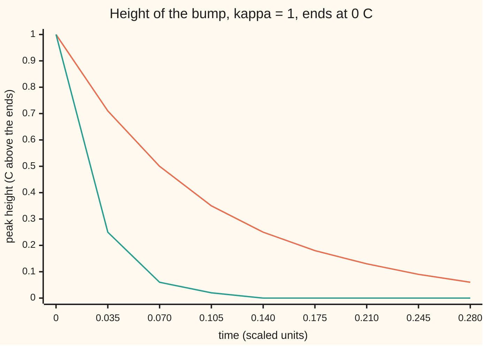
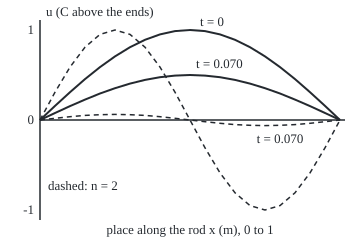

# The heat equation: each point drifts toward the average of its neighbours, so bumps flatten and never grow

[Syllabus](../../../SYLLABUS.md) → [Differential equations and dynamics](../../../SYLLABUS.md#w08) → [The Classical PDEs](../../../SYLLABUS.md#w08-s10) → The heat equation

---

## General Overview

A metal rod 1 m long has both ends clamped in iced water, held at 0 C. The middle starts 1 C warmer than the ends, in one smooth sine-shaped arch. Nothing heats it.

The arch sinks and keeps its shape, halving every 0.070 time units. The time unit is scaled to the rod: 9009 s for 1 m of copper, so the half-life is 633 s. A bump of twice the frequency, one warm hump and one cold dip, fades four times faster, half-life 0.0176. That square is the equation's fingerprint.

The reason is local. Each point compares itself with its two neighbours' average: warmer, it cools; cooler, it warms. So bumps flatten, and no new hot spot forms.

**Each point warms or cools in proportion to its gap from its neighbours' average; with $u$ the temperature and $\kappa$ the rod's diffusivity (how fast heat spreads in it), that is $u_t = \kappa u_{xx}$, a sine bump of frequency $n$ decays as $e^{-\kappa n^2 \pi^2 t}$, and the rod is never hotter inside than at the start or the ends.**

**What kind of fact this is:** a model, built from conservation of heat and Fourier's law, a measured law of materials; the decay rate and the maximum principle are theorems about the model, proved on this card in Why it works.

### The picture: two bumps, one half-life apart



Orange: the arch, $n = 1$, halving every 0.070. Green: the double bump, $n = 2$, at 0.06 of its height when the arch has halved.

---

## The formula

Notation from [A partial differential equation](01-what-a-pde-says.md): $u(x, t)$ is the temperature at place $x$ and time $t$; a subscript means a rate with the other variable held still, so $u_t$ is how fast one spot warms and $u_{xx}$ is the bend of the profile along the rod.

$$u_t = \kappa\, u_{xx}, \qquad u(0, t) = u(1, t) = 0, \qquad u(x, 0) = \sin(\pi x)$$

**Read it aloud:** each spot warms at the diffusivity times the bend of the profile there; the ends stay at 0; the rod starts as one arch.

For a start of frequency $n$, $\sin(n\pi x)$, the solution is

$$u(x, t) = e^{-\lambda_n t} \sin(n \pi x), \qquad \lambda_n = \kappa\, n^2 \pi^2 .$$

**Read it aloud:** the shape stays; its height shrinks exponentially, at a rate growing with the frequency squared.

| Symbol | Plain meaning | In our example | Push it up and the answer… |
| --- | --- | --- | --- |
| $u$ | temperature above the ends, in C | 1 in the middle at the start | — |
| $x$, $t$ | place along the rod in m; time in scaled units | 0 to 1; 0.070 for one half-life | — |
| $u_t$, $u_{xx}$ | warming rate at one spot; bend of the profile | both −4.87463 at x = 0.3, t = 0.05 | — |
| $\kappa$ | diffusivity: conductivity over heat capacity, m^2/s | 1 scaled; 1.11e-4 for copper | bumps fade faster |
| $q$, $k$ | heat flow rightward per unit area; conductivity | $q = -k u_x$ | more flow per degree of slope |
| $\rho$, $c$ | density; heat to warm 1 kg by 1 C | product: heat capacity per volume | slower change |
| $n$, $\lambda_n$ | frequency (humps across the rod); its decay rate | 1 and 9.869604; 2 and 39.478418 | rate grows as $n$ squared |
| $h$ | spacing of grid points along the rod | 0.1, 0.05, 0.025 m | grid error grows as $h$ squared |

### When it holds

- **No heat source inside.** A heater of 20 C per time unit lifts the middle to 2.5 C: the maximum principle fails.
- **Heat flows down the temperature slope, in proportion to it.** Flip the sign and every ripple explodes.
- **A uniform rod.** If $k$, $\rho$ or $c$ vary along it, sines stop decaying cleanly.
- **Insulated sides.** Sides losing heat to the air add a loss term; bumps fade faster.
- **Ends held at 0 C.** Insulated ends make cosines the natural shapes.

---

## Why it works

### Step 0: heat is conserved and flows from hot to cold

Heat in the rod is neither made nor destroyed. It only moves, from warmer to cooler, faster where the temperature changes steeply. The rest is bookkeeping.

### Step 1: conservation on a short slice

Take the slice between $x = a$ and $x = b$, cross-section 1 m^2. Its heat, $\rho c$ times the integral of $u$, changes only by what flows in at the left minus out at the right:

$$\frac{d}{dt}\int_a^b \rho c\, u \, dx = q(a, t) - q(b, t) = -\int_a^b q_x \, dx .$$

This holds for every slice, however short, so the integrands agree at every point: $\rho c\, u_t = -q_x$.

### Step 2: Fourier's law closes the equation

Joseph Fourier's law of conduction, published in 1822, says the flow runs down the temperature slope: $q = -k u_x$, the minus sign sending heat from warm to cool. Substitute it:

$$\rho c\, u_t = k\, u_{xx}, \qquad\text{so}\qquad u_t = \kappa\, u_{xx}, \quad \kappa = \frac{k}{\rho c} .$$

$\kappa$ has units of m^2/s: conductivity drives change, heat capacity resists it.

### Step 3: the bend is a gap from the neighbours' average

Put points a small distance $h$ apart. The standard estimate of the bend is

$$u_{xx} \approx \frac{u(x-h) - 2u(x) + u(x+h)}{h^2} = \frac{2}{h^2}\left(\frac{u(x-h) + u(x+h)}{2} - u(x)\right).$$

The bracket is the neighbours' average minus the point. So: **each point moves toward its neighbours' average, at a rate proportional to the gap.** A peak sinks, a dip fills, a straight profile stays.

Stepping this rule forward with time steps of $h^2/4$ is the code's second road. Each new value is half the old one plus a quarter of each neighbour: an average, never above the largest of the three. That is the grid's own maximum principle; the method has its own card, [Stepping the heat equation on a grid](09-finite-differences-for-the-heat-equation.md).

### Step 4: the sine keeps its shape and decays at rate $\kappa n^2\pi^2$

Try $u = e^{-\lambda t}\sin(n\pi x)$. Differentiating in time multiplies it by $-\lambda$; twice in place, by $-n^2\pi^2$, each derivative bringing out $n\pi$ and the pair flipping the sign. The equation then asks $-\lambda u = -\kappa n^2 \pi^2 u$, so $\lambda = \kappa n^2 \pi^2$. The ends stay at 0, since $\sin(n\pi) = 0$.

The height halves when $e^{-\lambda t} = 1/2$, at $t = \ln 2 / \lambda$: 0.070230 for the arch, 0.017558 for the double bump.

Why the square? Doubling the frequency halves the distance from warm hump to cold dip and doubles the slope between them: half as far, pushed twice as hard.

### Step 5: the maximum principle

**Over any stretch of time, the rod's hottest temperature is reached at the start or at an end; no point inside ever exceeds it.** Likewise the coldest, so bumps and dips only shrink.

The idea: at a hottest point inside the rod the profile is capped, so $u_{xx} \le 0$ and $u_t \le 0$: the spot is not warming. A tiny tilt makes that airtight.

<details>
<summary>Detailed proof</summary>

Let M be the largest value of $u$ at time 0 or at the two ends, over times 0 to T. Pick any $\varepsilon > 0$ and set $v = u + \varepsilon x^2$. Then $v_t - \kappa v_{xx} = u_t - \kappa u_{xx} - 2\kappa\varepsilon = -2\kappa\varepsilon < 0$.

Suppose v reaches its largest value over the rod and the time span at a point with $0 < x < 1$ and $0 < t \le T$. There v is at a peak along the rod, so $v_{xx} \le 0$; and it was no larger a moment earlier, so $v_t \ge 0$ (a one-sided rate if $t = T$). Then $v_t - \kappa v_{xx} \ge 0$, which contradicts the strict inequality. So the largest value of v lies at $t = 0$ or at an end, where $v \le M + \varepsilon$.

Hence $u \le v \le M + \varepsilon$ everywhere, for every ε > 0, so $u \le M$. The same argument on $-u$ gives the minimum. A heater breaks the first line: with a source, $v_t - \kappa v_{xx}$ need not be negative.

</details>

Any start as a sum of sines is [Separation of variables](04-separation-of-variables-for-the-heat-equation.md); a start concentrated at one point is [The heat kernel](10-the-heat-kernel.md).

### The picture: the rod's profile at the start and after one half-life

<p align="center"></p>

Scale: 300 units per metre across, 90 per degree up, zero at 120. After one half-life the arch's peak sits at 75.0 (height 0.5); the dashed double bump at 114.4 (height 0.0625).

---

## Worked numbers, by hand

| Step | Arithmetic | Value |
| --- | --- | --- |
| arch's decay rate | $\kappa n^2\pi^2$ = 1 × 1 × 9.869604 | 9.869604 |
| arch's half-life | 0.693147 ÷ 9.869604 | **0.070230** |
| double bump's rate | 1 × 4 × 9.869604 | 39.478418 |
| its half-life | 0.693147 ÷ 39.478418 | **0.017558** |
| ratio | 0.070230 ÷ 0.017558 | 4.000 |
| double bump at 0.070230 | (1/2)^4 | 0.0625 |
| copper, 1 m | time unit (1 m)^2 ÷ 1.11e-4 m^2/s = 9009 s; × 0.070230 | 633 s = 10.5 min |

### What breaks if you drop a piece

| Mistake | Comes out at | What went wrong |
| --- | --- | --- |
| Rate linear in frequency, $\kappa n\pi^2$ | double-bump half-life 0.035115, true 0.017558 | Two derivatives, two factors of $n$ |
| Sign flipped, $u_t = -\kappa u_{xx}$ | a 0.001 ripple of frequency 10 grows by e^98.696 = 10^42.86 in 0.1 | Heat running uphill sharpens every bump |
| Heater inside, 20 C per time unit | middle 2.499919 at t = 1, above the starting 1 | The principle needs no source; steady peak 20/8 = 2.5 |

---

## Code, from first principles, and it actually runs

Road one is the formula, $\ln 2 / (\kappa n^2 \pi^2)$. Road two never uses it: on 10, 20 and 40 intervals it moves each point toward its neighbours' average, time step $h^2/4$, until the middle halves; its error falls by 4 as the spacing halves. The check also differentiates the formula numerically, runs a tent whose peak only falls, and runs the heater.

### Python

```python
# The heat equation -- the check behind the card.  Only math's sin, exp, log
# and pi are imported.  The rod: 1 m, ends held at 0 C, kappa = 1 in scaled
# time, starting at u = sin(pi x).  Road one is the formula e^(-kappa n^2 pi^2 t).
# Road two is a grid where each point drifts toward its neighbours' average.
from math import sin, exp, log, pi

def step(u, r, heat=0.0):                  # one grid step, ends held at 0
    return [0.0] + [u[i] + r * (u[i - 1] - 2 * u[i] + u[i + 1]) + heat
                    for i in range(1, len(u) - 1)] + [0.0]

def grid_half_life(n, N, r=0.25):          # step sin(n pi x) until its peak halves
    dx = 1 / N; dt = r * dx * dx
    u = [sin(n * pi * i * dx) for i in range(N + 1)]
    j = N // (2 * n); top = u[j]; t = 0.0
    while True:
        v = step(u, r); t += dt
        if v[j] <= top / 2:                # the last step, read as a pure exponential
            return t - dt + dt * log(2 * u[j] / top) / log(u[j] / v[j])
        u = v

U = lambda x, t: exp(-pi * pi * t) * sin(pi * x)       # the formula, kappa = 1
lam1, lam2 = pi * pi, 4 * pi * pi
h1, h2 = log(2) / lam1, log(2) / lam2
print(f"decay rate kappa n^2 pi^2: n=1 {lam1:.6f}, n=2 {lam2:.6f} per time unit")
print(f"half-life ln2/rate: n=1 {h1:.6f}, n=2 {h2:.6f}, ratio {h1 / h2:.3f}")
g = {N: grid_half_life(1, N) for N in (10, 20, 40)}
for N in (10, 20, 40):
    print(f"grid N={N}: half-life {g[N]:.6f}, error {g[N] - h1:.7f}")
print(f"error shrinks per halving of the spacing h, dt = h^2/4: {(g[10] - h1) / (g[20] - h1):.3f}, {(g[20] - h1) / (g[40] - h1):.3f}")
g2 = grid_half_life(2, 40)
print(f"grid N=40, n=2: half-life {g2:.6f}; grid ratio {g[40] / g2:.3f}")
e = 1e-4; x, t = 0.3, 0.05
ut = (U(x, t + e) - U(x, t - e)) / (2 * e)
uxx = (U(x + e, t) - 2 * U(x, t) + U(x - e, t)) / (e * e)
print(f"formula at x=0.3, t=0.05, by differences: u_t {ut:.6f}, u_xx {uxx:.6f}")
N = 40; u = [min(i / 12, (N - i) / 28) for i in range(N + 1)]   # tent, peak 1 at x=0.3
peaks = []
for k in range(400):
    u = step(u, 0.25); peaks.append(max(u))
print(f"tent start, peak 1 at x=0.3: largest later value {max(peaks):.6f}, at t=0.0625 {peaks[-1]:.6f}")
N = 20; u = [sin(pi * i / N) for i in range(N + 1)]            # a heater: 20 C per time unit
for k in range(1600):
    u = step(u, 0.25, 20 * 0.25 / (N * N))
print(f"heater inside: middle at t=1 {u[N // 2]:.6f}; steady formula 20/8 = {20 / 8:.6f}")
print(f"mistake, rate linear in n: n=2 half-life {log(2) / (2 * pi * pi):.6f}, true {h2:.6f}")
print(f"mistake, sign flipped: ripple 0.001 at n=10 after t=0.1 grows by e^{100 * pi * pi * 0.1:.3f} = 10^{100 * pi * pi * 0.1 / log(10):.2f}")
tu = 1 / 1.11e-4                                               # copper, 1 m: seconds per time unit
print(f"copper rod 1 m, kappa 1.11e-4 m^2/s: time unit {tu:.0f} s, half-life {h1 * tu:.0f} s = {h1 * tu / 60:.1f} min")
ts = [0.035 * k for k in range(9)]
print("chart n=1:", ", ".join(f"{exp(-lam1 * s):.2f}" for s in ts))
print("chart n=2:", ", ".join(f"{exp(-lam2 * s):.2f}" for s in ts))
print("chart times:", ", ".join(f"{s:.3f}" for s in ts))
a1, a2 = U(0.5, h1), exp(-lam2 * h1)                        # heights after one half-life of n=1
print(f"figure, x 40+300x, y 120-90u; at t=0.070 heights n=1 {a1:.4f}, n=2 {a2:.4f}, y {120 - 90 * a1:.1f}, {120 - 90 * a2:.1f}")
assert abs(g[40] - h1) < 2e-5 and abs(g2 - h2) < 2e-5        # the grid meets the formula
assert abs(ut - uxx) < 1e-5 * abs(uxx)                        # the formula obeys u_t = u_xx
assert max(peaks) <= 1.0 and all(a >= b for a, b in zip(peaks, peaks[1:]))   # no new hot spot
assert abs(u[N // 2] - 2.5) < 1e-3                            # the heater breaks the bound
print("ALL CHECKS PASS")
```

**Ran 2026-09-28 on macOS, Python 3.14.6, standard library only. All checks passed. Output, pasted from the run:**

```
decay rate kappa n^2 pi^2: n=1 9.869604, n=2 39.478418 per time unit
half-life ln2/rate: n=1 0.070230, n=2 0.017558, ratio 4.000
grid N=10: half-life 0.069941, error -0.0002895
grid N=20: half-life 0.070158, error -0.0000722
grid N=40: half-life 0.070212, error -0.0000181
error shrinks per halving of the spacing h, dt = h^2/4: 4.007, 4.002
grid N=40, n=2: half-life 0.017540; grid ratio 4.003
formula at x=0.3, t=0.05, by differences: u_t -4.874631, u_xx -4.874630
tent start, peak 1 at x=0.3: largest later value 0.970238, at t=0.0625 0.423052
heater inside: middle at t=1 2.499919; steady formula 20/8 = 2.500000
mistake, rate linear in n: n=2 half-life 0.035115, true 0.017558
mistake, sign flipped: ripple 0.001 at n=10 after t=0.1 grows by e^98.696 = 10^42.86
copper rod 1 m, kappa 1.11e-4 m^2/s: time unit 9009 s, half-life 633 s = 10.5 min
chart n=1: 1.00, 0.71, 0.50, 0.35, 0.25, 0.18, 0.13, 0.09, 0.06
chart n=2: 1.00, 0.25, 0.06, 0.02, 0.00, 0.00, 0.00, 0.00, 0.00
chart times: 0.000, 0.035, 0.070, 0.105, 0.140, 0.175, 0.210, 0.245, 0.280
figure, x 40+300x, y 120-90u; at t=0.070 heights n=1 0.5000, n=2 0.0625, y 75.0, 114.4
ALL CHECKS PASS
```

### Rust

Same rows and labels; built with `rustc --edition 2021 -O`.

```rust
// The heat equation -- the same check as the Python, in Rust.  No crates.
// The rod: 1 m, ends held at 0 C, kappa = 1 in scaled time, starting at
// u = sin(pi x).  Road one is the formula e^(-kappa n^2 pi^2 t).  Road two
// is a grid where each point drifts toward its neighbours' average.
use std::f64::consts::PI;

fn step(u: &[f64], r: f64, heat: f64) -> Vec<f64> {      // one grid step, ends held at 0
    let n = u.len();
    let mut v = vec![0.0; n];
    for i in 1..n - 1 { v[i] = u[i] + r * (u[i - 1] - 2.0 * u[i] + u[i + 1]) + heat; }
    v
}

fn grid_half_life(n: usize, big_n: usize, r: f64) -> f64 { // step sin(n pi x) until its peak halves
    let dx = 1.0 / big_n as f64;
    let dt = r * dx * dx;
    let mut u: Vec<f64> = (0..=big_n).map(|i| (n as f64 * PI * i as f64 * dx).sin()).collect();
    let j = big_n / (2 * n);
    let (top, mut t) = (u[j], 0.0);
    loop {
        let v = step(&u, r, 0.0);
        t += dt;
        if v[j] <= top / 2.0 {                             // the last step, read as a pure exponential
            return t - dt + dt * (2.0 * u[j] / top).ln() / (u[j] / v[j]).ln();
        }
        u = v;
    }
}

fn big_u(x: f64, t: f64) -> f64 { (-PI * PI * t).exp() * (PI * x).sin() } // the formula, kappa = 1

fn main() {
    let (lam1, lam2) = (PI * PI, 4.0 * PI * PI);
    let (h1, h2) = (2f64.ln() / lam1, 2f64.ln() / lam2);
    println!("decay rate kappa n^2 pi^2: n=1 {:.6}, n=2 {:.6} per time unit", lam1, lam2);
    println!("half-life ln2/rate: n=1 {:.6}, n=2 {:.6}, ratio {:.3}", h1, h2, h1 / h2);
    let g: Vec<f64> = [10, 20, 40].iter().map(|&n| grid_half_life(1, n, 0.25)).collect();
    for (k, n) in [10, 20, 40].iter().enumerate() {
        println!("grid N={}: half-life {:.6}, error {:.7}", n, g[k], g[k] - h1);
    }
    println!("error shrinks per halving of the spacing h, dt = h^2/4: {:.3}, {:.3}", (g[0] - h1) / (g[1] - h1), (g[1] - h1) / (g[2] - h1));
    let g2 = grid_half_life(2, 40, 0.25);
    println!("grid N=40, n=2: half-life {:.6}; grid ratio {:.3}", g2, g[2] / g2);
    let (e, x, t) = (1e-4, 0.3, 0.05);
    let ut = (big_u(x, t + e) - big_u(x, t - e)) / (2.0 * e);
    let uxx = (big_u(x + e, t) - 2.0 * big_u(x, t) + big_u(x - e, t)) / (e * e);
    println!("formula at x=0.3, t=0.05, by differences: u_t {:.6}, u_xx {:.6}", ut, uxx);
    let mut u: Vec<f64> = (0..=40).map(|i| (i as f64 / 12.0).min((40 - i) as f64 / 28.0)).collect(); // tent
    let mut peaks = Vec::new();
    for _ in 0..400 { u = step(&u, 0.25, 0.0); peaks.push(u.iter().cloned().fold(f64::MIN, f64::max)); }
    let most = peaks.iter().cloned().fold(f64::MIN, f64::max);
    println!("tent start, peak 1 at x=0.3: largest later value {:.6}, at t=0.0625 {:.6}", most, peaks[399]);
    let mut w: Vec<f64> = (0..=20).map(|i| (PI * i as f64 / 20.0).sin()).collect(); // a heater: 20 C per time unit
    for _ in 0..1600 { w = step(&w, 0.25, 20.0 * 0.25 / 400.0); }
    println!("heater inside: middle at t=1 {:.6}; steady formula 20/8 = {:.6}", w[10], 20.0 / 8.0);
    println!("mistake, rate linear in n: n=2 half-life {:.6}, true {:.6}", 2f64.ln() / (2.0 * PI * PI), h2);
    let grow = 100.0 * PI * PI * 0.1;
    println!("mistake, sign flipped: ripple 0.001 at n=10 after t=0.1 grows by e^{:.3} = 10^{:.2}", grow, grow / 10f64.ln());
    let tu = 1.0 / 1.11e-4;                                // copper, 1 m: seconds per time unit
    println!("copper rod 1 m, kappa 1.11e-4 m^2/s: time unit {:.0} s, half-life {:.0} s = {:.1} min", tu, h1 * tu, h1 * tu / 60.0);
    let ts: Vec<f64> = (0..9).map(|k| 0.035 * k as f64).collect();
    let row = |lam: f64| ts.iter().map(|s| format!("{:.2}", (-lam * s).exp())).collect::<Vec<_>>().join(", ");
    println!("chart n=1: {}", row(lam1));
    println!("chart n=2: {}", row(lam2));
    println!("chart times: {}", ts.iter().map(|s| format!("{:.3}", s)).collect::<Vec<_>>().join(", "));
    let (a1, a2) = (big_u(0.5, h1), (-lam2 * h1).exp());   // heights after one half-life of n=1
    println!("figure, x 40+300x, y 120-90u; at t=0.070 heights n=1 {:.4}, n=2 {:.4}, y {:.1}, {:.1}", a1, a2, 120.0 - 90.0 * a1, 120.0 - 90.0 * a2);
    assert!((g[2] - h1).abs() < 2e-5 && (g2 - h2).abs() < 2e-5);        // the grid meets the formula
    assert!((ut - uxx).abs() < 1e-5 * uxx.abs());                       // the formula obeys u_t = u_xx
    assert!(most <= 1.0 && peaks.windows(2).all(|p| p[0] >= p[1]));    // no new hot spot
    assert!((w[10] - 2.5).abs() < 1e-3);                                // the heater breaks the bound
    println!("ALL CHECKS PASS");
}
```

**Ran 2026-09-28 on macOS, rustc 1.98.1, no crates. All checks passed. Output, pasted from the run:**

```
decay rate kappa n^2 pi^2: n=1 9.869604, n=2 39.478418 per time unit
half-life ln2/rate: n=1 0.070230, n=2 0.017558, ratio 4.000
grid N=10: half-life 0.069941, error -0.0002895
grid N=20: half-life 0.070158, error -0.0000722
grid N=40: half-life 0.070212, error -0.0000181
error shrinks per halving of the spacing h, dt = h^2/4: 4.007, 4.002
grid N=40, n=2: half-life 0.017540; grid ratio 4.003
formula at x=0.3, t=0.05, by differences: u_t -4.874631, u_xx -4.874630
tent start, peak 1 at x=0.3: largest later value 0.970238, at t=0.0625 0.423052
heater inside: middle at t=1 2.499919; steady formula 20/8 = 2.500000
mistake, rate linear in n: n=2 half-life 0.035115, true 0.017558
mistake, sign flipped: ripple 0.001 at n=10 after t=0.1 grows by e^98.696 = 10^42.86
copper rod 1 m, kappa 1.11e-4 m^2/s: time unit 9009 s, half-life 633 s = 10.5 min
chart n=1: 1.00, 0.71, 0.50, 0.35, 0.25, 0.18, 0.13, 0.09, 0.06
chart n=2: 1.00, 0.25, 0.06, 0.02, 0.00, 0.00, 0.00, 0.00, 0.00
chart times: 0.000, 0.035, 0.070, 0.105, 0.140, 0.175, 0.210, 0.245, 0.280
figure, x 40+300x, y 120-90u; at t=0.070 heights n=1 0.5000, n=2 0.0625, y 75.0, 114.4
ALL CHECKS PASS
```

> [!TIP]
> **Try changing**
> Guess first, then run it.
> - **A longer rod.** Guess the copper half-life for 2 m, then change `tu` to `4 / 1.11e-4`: four times 633 s.
> - **Triple frequency.** Print `grid_half_life(3, 60)`: nine times shorter than 0.070230.
> - **A step too big.** In the tent loop change `step(u, 0.25)` to `step(u, 0.6)`. The old value's weight, 1 − 2 × 0.6, goes negative, the grid saw-tooths and grows, and the third assert stops the run.

---

## The usual mistake

> [!warning]
> **Reading the rate from the slope, not the bend.** A rod with ends at 10 C and 30 C and a straight profile between has heat flowing through it, yet no spot changes: $u_{xx} = 0$, so $u_t = 0$. What moves a point is its gap from its neighbours' average.
>
> - **Frequency to the first power.** The double bump's half-life is 0.017558, not 0.035115.
> - **Expecting a sine to change shape.** It only shrinks; a mixture changes shape as its parts shrink at different rates.
> - **Forgetting the scaling.** 0.070 is in units of length squared over $\kappa$: 633 s for 1 m of copper.

---

## Where you meet it in real life

- **Cooking.** A roast's centre lags its surface; doubling the thickness roughly quadruples the time, the square of Step 4.
- **Diffusion of anything.** Dye in still water obeys the same equation.
- **Option pricing.** The Black–Scholes equation becomes this one after a change of variables; see [Feynman-Kac](../../11-Stochastic%20processes%20and%20calculus/07-Changing%20Measure/06-feynman-kac-formula.md).
- **Image smoothing.** The neighbour-average rule on a photograph's pixels blurs it, fine detail first.

> **Say it back**
> Heat is conserved and flows down the temperature slope, which gives $u_t = \kappa u_{xx}$. The bend is a point's gap from its neighbours' average, so every point drifts toward it. A sine bump keeps its shape and decays at rate $\kappa n^2\pi^2$: the arch halves every 0.070, the double bump four times faster. Without a source, the rod is never hotter inside than at the start or ends.

---

## What this builds on

- [A partial differential equation](01-what-a-pde-says.md): the notation $u(x, t)$, $u_t$ and $u_{xx}$, and what it means for an equation to hold at every place and time.

## Where this goes next

- [Separation of variables](04-separation-of-variables-for-the-heat-equation.md): any start as a sum of decaying sines.
- [Laplace's equation](07-laplaces-equation-and-harmonic-functions.md): where the heat settles.
- [Stepping the heat equation on a grid](09-finite-differences-for-the-heat-equation.md): the grid of Step 3 and its step limit.
- [The heat kernel](10-the-heat-kernel.md): the solution from one hot point.
- [Feynman-Kac](../../11-Stochastic%20processes%20and%20calculus/07-Changing%20Measure/06-feynman-kac-formula.md): the equation as an average over random paths.
- Fourier's law: real materials and walls.
- Three families: the model parabolic equation.
- Hille-Yosida: when such a law defines an evolution.
- Two evolutions: the solution as an exponential of the bend.
- Solving differential equations by transform: the $n^2$ decay as a multiplier.
- Volume form and Laplace-Beltrami: the bend on a curved surface.
- Ricci flow: a heat equation smoothing a space's shape.

---

## Sources

Verified 2026-09-28: every link below resolves to the publisher's or author's page.

- Strauss, Walter A. *Partial Differential Equations: An Introduction*, 2nd ed. Wiley, 2008. [Publisher page](https://www.wiley.com/en-us/Partial+Differential+Equations%3A+An+Introduction%2C+2nd+Edition-p-9780470054567). Conservation derivation; the maximum principle by the same tilt.
- Olver, Peter J. *Introduction to Partial Differential Equations*. Springer Undergraduate Texts in Mathematics, 2014. [Author's book page](https://www-users.cse.umn.edu/~olver/pde.html). The heated rod and the decay of each sine.
- O'Connor, J. J., and E. F. Robertson. "Joseph Fourier." MacTutor History of Mathematics, University of St Andrews. [Biography](https://mathshistory.st-andrews.ac.uk/Biographies/Fourier/). Fourier's heat work and the 1822 *Théorie analytique de la chaleur*.
