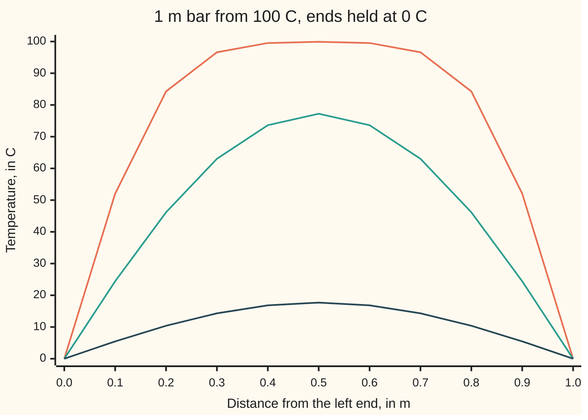

# Separation of variables: guess a product of a space shape and a time factor, and the PDE splits into two ODEs

Differential equations and dynamics → The Classical PDEs → Cooling a rod mode by mode → Separation of variables

---

## General Overview

A copper bar 1 m long comes out of an oven at a uniform 100 C, its sides wrapped in insulation. Both ends go straight into iced water, which holds them at 0 C. How warm is the middle a few minutes later?

The heat equation ([the-heat-equation](03-the-heat-equation.md)) governs the bar, but a flat 100 C start fits no formula on sight. The way in is to find temperature patterns that keep their shape and only fade. A chord is several pure notes sounding at once; the bar's pure notes are sine-shaped humps, one, two, three. From here on each is called a **mode**. Each mode fades at its own fixed rate, and the flat start is a sum of modes.

The answer: after 450 s, 7.5 min, the middle of the bar is at 77.23 C.

**Guess a temperature that is a shape along the bar times a fading factor in time; the heat equation splits into one equation for each, the cold ends allow only the shapes sin(nπx), and adding those modes with Fourier sine coefficients fits any start.**

**What kind of fact this is:** a method; each step is proved in Why it works.

### The picture: the bar's temperature at three times



Orange: t = 0.01. Teal: t = 0.05. Dark blue: t = 0.20, in the bar's own time unit (9009 s for copper, see The formula). By t = 0.20 only the one-hump mode is left.

---

## The formula

Notation first, in words. $u(x, t)$ is the temperature in C at $x$ metres from the left end at time $t$. A subscript is a rate ([what-a-pde-says](01-what-a-pde-says.md)): $u_t$ the change in time, $u_{xx}$ the curvature along the bar. $\kappa$, the thermal diffusivity in m^2/s, sets how fast heat spreads. With cold ends:

$$u_t = \kappa\, u_{xx}, \qquad u(0, t) = u(1, t) = 0, \qquad u(x, 0) = f(x).$$

Trying a space shape $X(x)$ times a time factor $T(t)$, $u = X(x)\,T(t)$, leads to

$$u(x, t) = \sum_{n=1}^{\infty} b_n\, e^{-\kappa n^2 \pi^2 t} \sin(n\pi x), \qquad b_n = 2\int_0^1 f(x)\sin(n\pi x)\,dx .$$

**Read it aloud:** the temperature is a sum of sine humps; the n-th starts at size b_n, the start's share of that shape, and fades like e to the minus n squared pi squared kappa t.

For the bar, $f = 100$, so $b_n = 400/(n\pi)$ for odd n and 0 for even n.

Insulated ends pass no heat, so the slope $u_x$ is zero there, and cosines replace sines:

$$u(x, t) = \frac{a_0}{2} + \sum_{n=1}^{\infty} a_n\, e^{-\kappa n^2 \pi^2 t} \cos(n\pi x), \qquad a_n = 2\int_0^1 f(x)\cos(n\pi x)\,dx .$$

| Symbol | Plain meaning | In our example | Push it up and the answer… |
| --- | --- | --- | --- |
| $u$, $f$, $u_t$, $u_x$, $u_{xx}$ | temperature, in C; $f$ is the start; subscripts are rates | $f = 100$ | — |
| $x$ | distance from the left end, in m | 0 to 1 | — |
| $t$ | time, in units of L^2/κ (L the length): 9009 s for copper | 0.05 = 450 s for copper | the bar cools |
| $\kappa$ | thermal diffusivity: heat's spreading speed, in m^2/s | 1 in scaled units; copper 1.11e-4 | faster cooling |
| $X$, $T$ | one product's space shape and time factor | sin(πx) and e^(−π^2 t) | — |
| $\lambda$ | the separation constant; on this bar $\lambda = n^2\pi^2$ | π^2 for n = 1 | that mode fades faster |
| $n$ | mode number: the count of humps | 1, 3, 5, … | faster fading |
| $b_n$, $a_n$ | sine and cosine coefficients: each mode's starting size, in C | 127.324, 0, 42.441 | a larger share of that mode |

### When it holds

- **A linear equation.** Modes add only because κ does not depend on u; if it does, modes interact.
- **Ends at zero, or at zero slope.** Ends at 0 C and 20 C defeat the sines: subtract the straight-line steady state first, then separate the rest.
- **A uniform bar.** If κ varies along the bar, the modes are no longer sines.
- **A finite bar.** An endless bar has no list of modes; its solution is an integral ([the-heat-kernel](10-the-heat-kernel.md)).

---

## Why it works

### Step 0: a product keeps its shape

A solution X(x)T(t) has one fixed shape X, scaled by T as time passes. The guess turns one question in two variables into two questions in one. The ends constrain only the shape; the start is fitted last, by adding products.

### Step 1: the equation splits

Put u = XT into $u_t = \kappa u_{xx}$: X T' = κ X'' T. Divide by κXT:

T'(t) / (κ T(t)) = X''(x) / X(x).

The left side depends only on t, the right only on x. Hold x fixed and let t run: the right side cannot move, so neither can the left. Both equal one constant, written −λ, leaving two ordinary differential equations:

X'' = −λ X, with X(0) = X(1) = 0, and T' = −κλ T.

### Step 2: the ends choose the shapes

This is a boundary-value problem: a λ allowing a nonzero X is an eigenvalue, that X an eigenfunction. Three cases.

- λ < 0, say λ = −μ^2: X = A e^(μx) + B e^(−μx). X(0) = 0 gives B = −A, then X(1) = 0 forces A = 0.
- λ = 0: X = A + Bx; both ends zero force A = B = 0.
- λ > 0: X = A cos(√λ x) + B sin(√λ x). X(0) = 0 gives A = 0. X(1) = 0 needs sin(√λ) = 0, so √λ = nπ.

So λ = n^2 π^2 and X = sin(nπx), n = 1, 2, 3, …: exactly the humps that vanish at both ends.

### Step 3: each mode fades on its own clock

With λ = n^2 π^2, T' = −κ n^2 π^2 T is exponential decay ([exponential-growth-decay-and-cooling](../01-Rate%20Equations/04-exponential-growth-decay-and-cooling.md)): T = e^(−κ n^2 π^2 t). Three humps fade nine times as fast as one: tighter wiggles have more curvature, which drives heat.

### Step 4: add the modes to fit the start

The equation is linear, so any sum of modes is a solution with cold ends. At t = 0 it must equal f: Σ b_n sin(nπx) = f(x), a Fourier sine series ([half-range-sine-and-cosine-series](../09-Fourier%20Series/04-half-range-sine-and-cosine-series.md)). The shapes are perpendicular: the integral from 0 to 1 of sin(mπx) sin(nπx) is 0 when m ≠ n and 1/2 when m = n. Multiply both sides by sin(mπx) and integrate; every term but the m-th vanishes, leaving b_m / 2 = ∫ f sin(mπx) dx.

### Step 5: insulated ends give cosines

Insulation passes no heat, so X'(0) = X'(1) = 0. The same three cases allow X = cos(nπx) with λ = n^2 π^2, and X = 1 with λ = 0. The flat mode never fades: it carries the average temperature a_0/2, which no escaping heat can change.

<details>
<summary>Detailed proof: the sum is a solution, and the only one</summary>

Let f be piecewise smooth; then |b_n| ≤ B = 2∫|f|. Fix t_0 > 0. For t ≥ t_0, the k-th t-derivative or 2k-th x-derivative of the n-th term is at most B (1 + κ)^k (nπ)^(2k) e^(−n^2 π^2 κ t_0), a convergent series of bounds. So the series may be differentiated term by term for t > 0, and u_t = κ u_xx holds because every term obeys it. Every term vanishes at both ends, so u does.

As t → 0, u tends to f in mean square: the integral of (u − f)^2 is Σ b_n^2 (1 − e^(−κ n^2 π^2 t))^2 / 2, which tends to 0 by Parseval's identity.

Uniqueness: let w be the difference of two solutions with the same start and ends. E(t) = ∫ w^2 dx has E' = 2∫ w w_t = 2κ∫ w w_xx = −2κ∫ w_x^2 ≤ 0, integrating by parts with w zero at the ends. E starts at 0 and cannot rise, so w = 0.

</details>

A second road needs no modes: step the heat equation on a grid of cells, as the code does and [finite-differences-for-the-heat-equation](09-finite-differences-for-the-heat-equation.md) develops.

---

## Worked numbers, by hand

The middle of the copper bar, x = 0.5, at t = 0.05 (450 s). At the middle sin(nπ/2) is 1 for n = 1 and −1 for n = 3.

| Step | Arithmetic | Value |
| --- | --- | --- |
| first coefficient | b_1 = 400/π | 127.324 |
| third coefficient | b_3 = 400/(3π) | 42.441 |
| mode 1 at the middle | 127.324 × e^(−π^2 × 0.05) = 127.324 × 0.6105 | 77.73 |
| mode 3 at the middle | −42.441 × e^(−9π^2 × 0.05) = −42.441 × 0.0118 | −0.50 |
| mode 5 | 25.465 × e^(−25π^2 × 0.05) | 0.0001 |
| the sum | 77.73 − 0.50 + 0.0001 | **77.23 C** |

Seven and a half minutes after the ends go into ice, the middle of the copper bar is at 77.23 C.

At t = 0 the sum converges slowly: one odd mode gives 127.32 C at the middle, two 84.88, three 110.35, ten 96.82, a hundred 99.68. A short wait leaves the first mode nearly all of the answer.

**A second case: insulated ends.** A bar starts as a ramp, 0 C at the left end rising evenly to 100 C at the right, both ends insulated. Cosine coefficients: a_0/2 = 50, a_n = −400/(nπ)^2 for odd n, so a_1 = −40.528 and a_3 = −4.503. At the left end at t = 0.05: 50 − 40.528 × 0.6105 − 4.503 × 0.0118 = **25.20 C**. The mean stays at 50.00 C forever.

### What breaks if you drop a piece

| Mistake | Comes out at | What went wrong |
| --- | --- | --- |
| Dropping the 2 in b_n | 38.62 C at the middle, not 77.23 | the 1/2 from Step 4 was never divided out |
| n in place of n^2 in the decay | 69.79 C, not 77.23 | high modes kept alive too long |
| Insulated ends treated as cold | mean 0.29 C at t = 0.5, not 50.00 | sines drain heat the insulation keeps in |
| One mode at t = 0 | 127.32 C, not 100 | a flat start is not one hump |

The code prints all four.

---

## Code, from first principles, and it actually runs

Road one sums the modes and checks each coefficient by Simpson's rule, a numerical integral written in the script. Road two uses no modes: it cuts the bar into N cells and steps u_t = u_xx, each new temperature the old plus a quarter of (left − 2 × itself + right). Its error falls fourfold each time N doubles: order two. Both roads run the insulated ramp too.

### Python

```python
# Separation of variables -- the check behind the card.  Standard library only.
# A 1 m rod, kappa = 1 (scaled time), started at 100 C with both ends held at 0 C:
# u = sum over odd n of (400/(n pi)) e^(-n^2 pi^2 t) sin(n pi x).  Road one: that
# mode sum, its coefficients also found by Simpson's rule.  Road two: a grid that
# steps u_t = u_xx directly and knows nothing of modes.  Second case: a 0-to-100 C
# ramp with insulated ends, a cosine series.
import math
PI = math.pi
def simpson(f, m=2000):                     # integral of f from 0 to 1, m even
    return sum((1 if i in (0, m) else 4 if i % 2 else 2) * f(i / m) for i in range(m + 1)) / (3 * m)
def sine_sum(x, t, terms=10**4):            # cold ends, uniform 100 C start; terms counts odd n
    return sum(400 / (n * PI) * math.exp(-(n * PI) ** 2 * t) * math.sin(n * PI * x) for n in range(1, 2 * terms, 2))
def cos_sum(x, t, terms=400):               # insulated ends, ramp 100x start
    return 50 - sum(400 / (n * PI) ** 2 * math.exp(-(n * PI) ** 2 * t) * math.cos(n * PI * x) for n in range(1, 2 * terms, 2))
def grid(N, t_end, insulated=False):        # N cells, time step dx^2/4, new u = u + (left - 2u + right)/4
    u = [100 * i / N for i in range(N + 1)] if insulated else [0.0] + [100.0] * (N - 1) + [0.0]
    for _ in range(round(t_end * 4 * N * N)):
        e = [u[1]] + u + [u[-2]]            # insulated: mirror points make the end slope zero
        new = [e[i + 1] + (e[i] - 2 * e[i + 1] + e[i + 2]) / 4 for i in range(N + 1)]
        u = new if insulated else [0.0] + new[1:-1] + [0.0]
    return u
b_f = [400 / (n * PI) if n % 2 else 0.0 for n in range(1, 7)]
b_s = [simpson(lambda x: 200 * math.sin(n * PI * x)) for n in range(1, 7)]
a_f = [-400 / (n * PI) ** 2 if n % 2 else 0.0 for n in range(1, 5)]
a_s = [simpson(lambda x: 200 * x * math.cos(n * PI * x)) for n in range(1, 5)]
f3 = lambda v: f"{round(v, 3) + 0.0:.3f}"   # + 0.0 prints -0.000 as 0.000
mid = sine_sum(0.5, 0.05)
modes = [400 / (n * PI) * math.exp(-(n * PI) ** 2 * 0.05) * math.sin(n * PI / 2) for n in (1, 3, 5)]
Ns = (10, 20, 40, 80)
errs = [abs(grid(N, 0.05)[N // 2] - mid) for N in Ns]
end_s, end_g = cos_sum(0.0, 0.05), grid(80, 0.05, True)
print("sine coefficients b1..b6, formula:", " ".join(map(f3, b_f)))
print("sine coefficients b1..b6, Simpson:", " ".join(map(f3, b_s)))
print("middle at t = 0, first 1 2 3 10 100 odd modes:", " ".join(f"{sine_sum(0.5, 0, k):.2f}" for k in (1, 2, 3, 10, 100)))
print("decay factors e^(-n^2 pi^2 0.05), n = 1 3 5:", " ".join(f"{math.exp(-(n * PI) ** 2 * 0.05):.4f}" for n in (1, 3, 5)))
print(f"middle at t = 0.05: modes 1 3 5 give {modes[0]:.2f} {modes[1]:.2f} {modes[2]:.4f}; full sum {mid:.2f} C")
print("grid middle at t = 0.05, N = 10 20 40 80:", " ".join(f"{grid(N, 0.05)[N // 2]:.4f}" for N in Ns))
print("grid error:", " ".join(f"{e:.4f}" for e in errs), " ratios", " ".join(f"{errs[i] / errs[i + 1]:.2f}" for i in range(3)))
print(f"copper, kappa 1.11e-4 m^2/s: one time unit = {1 / 1.11e-4:.0f} s; t = 0.05 is {0.05 / 1.11e-4:.0f} s = {0.05 / 1.11e-4 / 60:.1f} min")
print("figure, x (m):    ", " ".join(f"{i / 10:.1f}" for i in range(11)))
for t in (0.01, 0.05, 0.2):
    print(f"figure, t = {t:.2f}:", " ".join(f"{sine_sum(i / 10, t, 200):.2f}" for i in range(11)))
print("cosine coefficients a1..a4, formula:", " ".join(map(f3, a_f)), " Simpson:", " ".join(map(f3, a_s)))
print(f"insulated ramp, end x = 0 at t = 0.05: series {end_s:.2f} C, grid {end_g[0]:.2f} C; grid mean {(sum(end_g) - (end_g[0] + end_g[-1]) / 2) / 80:.2f} C")
print(f"mistake, dropping the 2 in b_n: middle at t = 0.05 is {mid / 2:.2f} C, not {mid:.2f}")
wrong = sum(400 / (n * PI) * math.exp(-n * PI * PI * 0.05) * math.sin(n * PI / 2) for n in range(1, 2 * 10**4, 2))
print(f"mistake, e^(-n pi^2 t) for e^(-n^2 pi^2 t): middle {wrong:.2f} C, not {mid:.2f}")
cold_mean = sum(200 / (n * PI) * math.exp(-(n * PI) ** 2 * 0.5) * 2 / (n * PI) for n in range(1, 400, 2))
print(f"mistake, insulated ends treated as cold: ramp's mean at t = 0.5 is {cold_mean:.2f} C, not {simpson(lambda x: cos_sum(x, 0.5, 50), 200):.2f}")
assert max(abs(p - q) for p, q in zip(b_f + a_f, b_s + a_s)) < 1e-6    # closed form against numerical integral
assert errs[-1] < 0.02                                                 # grid, no modes, lands on the mode sum
assert all(3.5 < errs[i] / errs[i + 1] < 4.5 for i in range(3))        # and closes in at order two
assert abs(end_s - end_g[0]) < 0.02                                    # insulated case: cosines against the grid
print("ALL CHECKS PASS")
```

**Ran 2026-09-28 on macOS, Python 3.14.6, standard library only. All checks passed. Output, pasted from the run:**

```
sine coefficients b1..b6, formula: 127.324 0.000 42.441 0.000 25.465 0.000
sine coefficients b1..b6, Simpson: 127.324 0.000 42.441 0.000 25.465 0.000
middle at t = 0, first 1 2 3 10 100 odd modes: 127.32 84.88 110.35 96.82 99.68
decay factors e^(-n^2 pi^2 0.05), n = 1 3 5: 0.6105 0.0118 0.0000
middle at t = 0.05: modes 1 3 5 give 77.73 -0.50 0.0001; full sum 77.23 C
grid middle at t = 0.05, N = 10 20 40 80: 76.5451 77.0612 77.1888 77.2206
grid error: 0.6860 0.1700 0.0424 0.0106  ratios 4.04 4.01 4.00
copper, kappa 1.11e-4 m^2/s: one time unit = 9009 s; t = 0.05 is 450 s = 7.5 min
figure, x (m):     0.0 0.1 0.2 0.3 0.4 0.5 0.6 0.7 0.8 0.9 1.0
figure, t = 0.01: 0.00 52.05 84.27 96.61 99.53 99.92 99.53 96.61 84.27 52.05 0.00
figure, t = 0.05: 0.00 24.42 46.16 63.04 73.63 77.23 73.63 63.04 46.16 24.42 0.00
figure, t = 0.20: 0.00 5.47 10.40 14.31 16.82 17.69 16.82 14.31 10.40 5.47 0.00
cosine coefficients a1..a4, formula: -40.528 0.000 -4.503 0.000  Simpson: -40.528 0.000 -4.503 0.000
insulated ramp, end x = 0 at t = 0.05: series 25.20 C, grid 25.20 C; grid mean 50.00 C
mistake, dropping the 2 in b_n: middle at t = 0.05 is 38.62 C, not 77.23
mistake, e^(-n pi^2 t) for e^(-n^2 pi^2 t): middle 69.79 C, not 77.23
mistake, insulated ends treated as cold: ramp's mean at t = 0.5 is 0.29 C, not 50.00
ALL CHECKS PASS
```

### Rust

```rust
// Separation of variables -- the same check as the Python, in Rust.  No crates.
// A 1 m rod, kappa = 1 (scaled time), started at 100 C with both ends held at 0 C:
// u = sum over odd n of (400/(n pi)) e^(-n^2 pi^2 t) sin(n pi x).  Road one: that
// mode sum, its coefficients also found by Simpson's rule.  Road two: a grid that
// steps u_t = u_xx directly and knows nothing of modes.  Second case: a 0-to-100 C
// ramp with insulated ends, a cosine series.
use std::f64::consts::PI;

fn simpson(f: &dyn Fn(f64) -> f64, m: usize) -> f64 { // integral of f from 0 to 1, m even
    (0..=m).map(|i| (if i == 0 || i == m { 1.0 } else if i % 2 == 1 { 4.0 } else { 2.0 }) * f(i as f64 / m as f64)).sum::<f64>() / (3 * m) as f64
}
fn sine_sum(x: f64, t: f64, terms: usize) -> f64 { // cold ends, uniform 100 C start; terms counts odd n
    (0..terms).map(|k| { let n = (2 * k + 1) as f64; 400.0 / (n * PI) * (-(n * PI).powi(2) * t).exp() * (n * PI * x).sin() }).sum()
}
fn cos_sum(x: f64, t: f64, terms: usize) -> f64 { // insulated ends, ramp 100x start
    50.0 - (0..terms).map(|k| { let n = (2 * k + 1) as f64; 400.0 / (n * PI).powi(2) * (-(n * PI).powi(2) * t).exp() * (n * PI * x).cos() }).sum::<f64>()
}
fn grid(n: usize, t_end: f64, insulated: bool) -> Vec<f64> { // n cells, time step dx^2/4
    let mut u: Vec<f64> = (0..=n).map(|i| if insulated { 100.0 * i as f64 / n as f64 } else if i == 0 || i == n { 0.0 } else { 100.0 }).collect();
    for _ in 0..(t_end * 4.0 * (n * n) as f64).round() as usize {
        let mut e = vec![u[1]]; e.extend(&u); e.push(u[n - 1]); // insulated: mirror points make the end slope zero
        let mut new: Vec<f64> = (0..=n).map(|i| e[i + 1] + (e[i] - 2.0 * e[i + 1] + e[i + 2]) / 4.0).collect();
        if !insulated { new[0] = 0.0; new[n] = 0.0; }
        u = new;
    }
    u
}
fn f3(v: f64) -> String { let s = format!("{:.3}", v); if s == "-0.000" { "0.000".to_string() } else { s } }
fn join(v: &[f64], f: &dyn Fn(f64) -> String) -> String { v.iter().map(|&x| f(x)).collect::<Vec<_>>().join(" ") }

fn main() {
    let b_f: Vec<f64> = (1..7).map(|n| if n % 2 == 1 { 400.0 / (n as f64 * PI) } else { 0.0 }).collect();
    let b_s: Vec<f64> = (1..7).map(|n| simpson(&|x| 200.0 * (n as f64 * PI * x).sin(), 2000)).collect();
    let a_f: Vec<f64> = (1..5).map(|n| if n % 2 == 1 { -400.0 / (n as f64 * PI).powi(2) } else { 0.0 }).collect();
    let a_s: Vec<f64> = (1..5).map(|n| simpson(&|x| 200.0 * x * (n as f64 * PI * x).cos(), 2000)).collect();
    let mid = sine_sum(0.5, 0.05, 10000);
    let modes: Vec<f64> = [1.0f64, 3.0, 5.0].iter().map(|&n| 400.0 / (n * PI) * (-(n * PI).powi(2) * 0.05).exp() * (n * PI / 2.0).sin()).collect();
    let ns = [10usize, 20, 40, 80];
    let gm: Vec<f64> = ns.iter().map(|&n| grid(n, 0.05, false)[n / 2]).collect();
    let errs: Vec<f64> = gm.iter().map(|g| (g - mid).abs()).collect();
    let (end_s, end_g) = (cos_sum(0.0, 0.05, 400), grid(80, 0.05, true));
    println!("sine coefficients b1..b6, formula: {}", join(&b_f, &f3));
    println!("sine coefficients b1..b6, Simpson: {}", join(&b_s, &f3));
    println!("middle at t = 0, first 1 2 3 10 100 odd modes: {}", [1, 2, 3, 10, 100].iter().map(|&k| format!("{:.2}", sine_sum(0.5, 0.0, k))).collect::<Vec<_>>().join(" "));
    println!("decay factors e^(-n^2 pi^2 0.05), n = 1 3 5: {}", [1.0f64, 3.0, 5.0].iter().map(|&n| format!("{:.4}", (-(n * PI).powi(2) * 0.05).exp())).collect::<Vec<_>>().join(" "));
    println!("middle at t = 0.05: modes 1 3 5 give {:.2} {:.2} {:.4}; full sum {:.2} C", modes[0], modes[1], modes[2], mid);
    println!("grid middle at t = 0.05, N = 10 20 40 80: {}", join(&gm, &|v| format!("{:.4}", v)));
    println!("grid error: {}  ratios {}", join(&errs, &|v| format!("{:.4}", v)), (0..3).map(|i| format!("{:.2}", errs[i] / errs[i + 1])).collect::<Vec<_>>().join(" "));
    println!("copper, kappa 1.11e-4 m^2/s: one time unit = {:.0} s; t = 0.05 is {:.0} s = {:.1} min", 1.0 / 1.11e-4, 0.05 / 1.11e-4, 0.05 / 1.11e-4 / 60.0);
    println!("figure, x (m):     {}", (0..11).map(|i| format!("{:.1}", i as f64 / 10.0)).collect::<Vec<_>>().join(" "));
    for t in [0.01, 0.05, 0.2] {
        println!("figure, t = {:.2}: {}", t, (0..11).map(|i| format!("{:.2}", sine_sum(i as f64 / 10.0, t, 200))).collect::<Vec<_>>().join(" "));
    }
    println!("cosine coefficients a1..a4, formula: {}  Simpson: {}", join(&a_f, &f3), join(&a_s, &f3));
    let mean = (end_g.iter().sum::<f64>() - (end_g[0] + end_g[80]) / 2.0) / 80.0;
    println!("insulated ramp, end x = 0 at t = 0.05: series {:.2} C, grid {:.2} C; grid mean {:.2} C", end_s, end_g[0], mean);
    println!("mistake, dropping the 2 in b_n: middle at t = 0.05 is {:.2} C, not {:.2}", mid / 2.0, mid);
    let wrong: f64 = (0..10000).map(|k| { let n = (2 * k + 1) as f64; 400.0 / (n * PI) * (-n * PI * PI * 0.05).exp() * (n * PI / 2.0).sin() }).sum();
    println!("mistake, e^(-n pi^2 t) for e^(-n^2 pi^2 t): middle {:.2} C, not {:.2}", wrong, mid);
    let cold_mean: f64 = (0..200).map(|k| { let n = (2 * k + 1) as f64; 200.0 / (n * PI) * (-(n * PI).powi(2) * 0.5).exp() * 2.0 / (n * PI) }).sum();
    println!("mistake, insulated ends treated as cold: ramp's mean at t = 0.5 is {:.2} C, not {:.2}", cold_mean, simpson(&|x| cos_sum(x, 0.5, 50), 200));
    let worst = b_f.iter().chain(&a_f).zip(b_s.iter().chain(&a_s)).map(|(p, q)| (p - q).abs()).fold(0.0, f64::max);
    assert!(worst < 1e-6); // closed form against numerical integral
    assert!(errs[3] < 0.02); // grid, no modes, lands on the mode sum
    assert!((0..3).all(|i| errs[i] / errs[i + 1] > 3.5 && errs[i] / errs[i + 1] < 4.5)); // and closes in at order two
    assert!((end_s - end_g[0]).abs() < 0.02); // insulated case: cosines against the grid
    println!("ALL CHECKS PASS");
}
```

**Ran 2026-09-28 on macOS, rustc 1.98.1, no crates. All checks passed. Output, pasted from the run:**

```
sine coefficients b1..b6, formula: 127.324 0.000 42.441 0.000 25.465 0.000
sine coefficients b1..b6, Simpson: 127.324 0.000 42.441 0.000 25.465 0.000
middle at t = 0, first 1 2 3 10 100 odd modes: 127.32 84.88 110.35 96.82 99.68
decay factors e^(-n^2 pi^2 0.05), n = 1 3 5: 0.6105 0.0118 0.0000
middle at t = 0.05: modes 1 3 5 give 77.73 -0.50 0.0001; full sum 77.23 C
grid middle at t = 0.05, N = 10 20 40 80: 76.5451 77.0612 77.1888 77.2206
grid error: 0.6860 0.1700 0.0424 0.0106  ratios 4.04 4.01 4.00
copper, kappa 1.11e-4 m^2/s: one time unit = 9009 s; t = 0.05 is 450 s = 7.5 min
figure, x (m):     0.0 0.1 0.2 0.3 0.4 0.5 0.6 0.7 0.8 0.9 1.0
figure, t = 0.01: 0.00 52.05 84.27 96.61 99.53 99.92 99.53 96.61 84.27 52.05 0.00
figure, t = 0.05: 0.00 24.42 46.16 63.04 73.63 77.23 73.63 63.04 46.16 24.42 0.00
figure, t = 0.20: 0.00 5.47 10.40 14.31 16.82 17.69 16.82 14.31 10.40 5.47 0.00
cosine coefficients a1..a4, formula: -40.528 0.000 -4.503 0.000  Simpson: -40.528 0.000 -4.503 0.000
insulated ramp, end x = 0 at t = 0.05: series 25.20 C, grid 25.20 C; grid mean 50.00 C
mistake, dropping the 2 in b_n: middle at t = 0.05 is 38.62 C, not 77.23
mistake, e^(-n pi^2 t) for e^(-n^2 pi^2 t): middle 69.79 C, not 77.23
mistake, insulated ends treated as cold: ramp's mean at t = 0.5 is 0.29 C, not 50.00
ALL CHECKS PASS
```

The two outputs match line for line.

> [!TIP]
> **Try changing**
> Guess first, then run it.
> - **Move the probe.** Print `sine_sum(0.25, 0.05)`. It lands between 46.16 (x = 0.2) and 63.04 (x = 0.3): nearer a cold end, cooler.
> - **A greedy time step.** In `grid`, change both 4s to 1.9. The old value now gets a negative weight, the grid values swing and blow up, and the second assert stops the run. The limit is explained on [finite-differences-for-the-heat-equation](09-finite-differences-for-the-heat-equation.md).

---

## The usual mistake

> [!warning]
> **Taking one product as the answer.** X(x)T(t) fits only a start that is already one sine hump. For the flat 100 C bar a single mode reads 127.32 C at the middle at t = 0, not 100. The product is a building block; the answer sums infinitely many.
>
> - **Sines at insulated ends.** They lose the flat mode, so the ramp drains to a mean of 0.29 C at t = 0.5 though no heat can leave; the true mean stays 50.00 C.
> - **Ends not at zero.** Subtract the straight line joining the end temperatures, itself a solution, then separate the rest.

---

## Where you meet it in real life

- **Quenching and heat treatment.** The core of a plate cools on the slowest mode's clock, since faster modes die first. That clock scales with thickness squared: twice as thick, four times as long. Cooking a thick joint of meat obeys the same square law.
- **Heat through walls.** Conduction through a slab is treated this way; the physics is on heat-conduction-and-fouriers-law.

> **Say it back**
> Guess a shape along the bar times a factor in time, and the heat equation splits into two ordinary equations sharing one constant. Cold ends allow only sin(nπx), fading like e^(−n^2 π^2 κ t); insulated ends allow cosines plus a flat mode that never fades. Fourier coefficients size the modes to fit any start. The bar from 100 C reads 77.23 C at its middle at t = 0.05; a grid agrees.

---

## What this builds on

- [the-heat-equation](03-the-heat-equation.md): the equation u_t = κ u_xx and why curvature drives heat.
- [half-range-sine-and-cosine-series](../09-Fourier%20Series/04-half-range-sine-and-cosine-series.md): expanding a start on 0 to 1 in sines or cosines, and the coefficient integrals.

## Where this goes next

- [standing-waves-on-a-string](06-standing-waves-on-a-string.md): the wave equation split the same way.
- [laplace-on-a-rectangle](08-laplace-on-a-rectangle.md): separation in two space directions.
- heat-conduction-and-fouriers-law: the heat equation in real materials and units.
- spectral-methods-and-the-fft: computing with modes, summed by a fast transform.

---

## Sources

Verified 2026-09-28: every link below resolves to the publisher's page.

- Strauss, Walter A. *Partial Differential Equations: An Introduction*, 2nd ed. Wiley, 2008. [Publisher page](https://www.wiley.com/en-us/Partial+Differential+Equations%3A+An+Introduction%2C+2nd+Edition-p-9780470054567). Separation with cold and insulated ends, and Fourier convergence.
- Farlow, Stanley J. *Partial Differential Equations for Scientists and Engineers*. Dover, 1993. [Publisher page](https://store.doverpublications.com/products/9780486676203). Short lessons on separation for heat flow.
- Lebl, Jiří. *Notes on Diffy Qs*, section "PDEs, separation of variables, and the heat equation". [Free text](https://www.jirka.org/diffyqs/html/heateq_section.html). The same derivation, worked examples.
