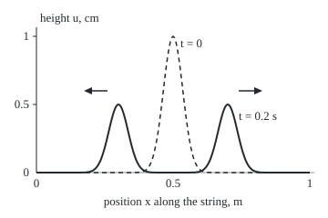
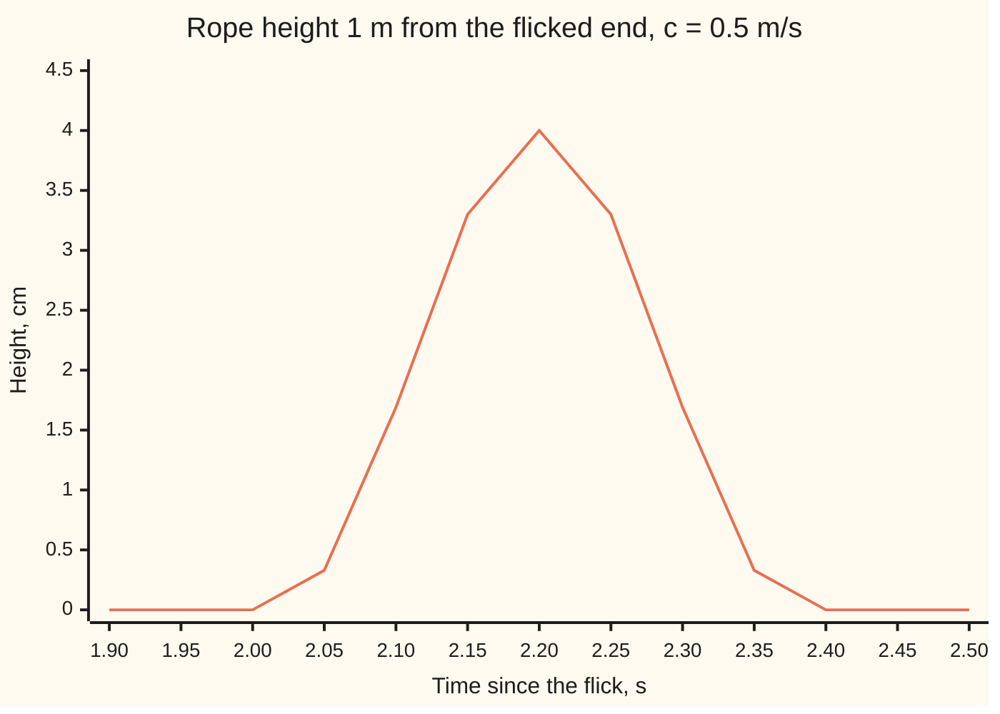

# The wave equation: a shape splits into two half-copies travelling opposite ways at speed c

Differential equations and dynamics → The Classical PDEs → Travelling waves on a line → The wave equation

---

## General Overview

A taut string 1 m long is pinched at its midpoint into a smooth bump 1 cm high, falling to about a third of that 5 cm either side, then let go without a push. Disturbances travel along it at 1 m/s.

The bump splits into two half-height copies that run apart. After 0.2 s they sit at 0.3 m and 0.7 m, and the middle is flat.

A loosely held skipping rope, flicked at one end, sends one pulse along at 0.5 m/s. A point 1 m away stays still for 2 s, then rises and falls. The flick gave the rope a starting velocity as well as a shape, and that velocity sends the whole pulse one way.

The rule behind both is the **wave equation**: each bit of string accelerates in proportion to how sharply the string bends there. **D'Alembert's formula** solves it on a long line, straight from the starting shape and velocity.

**On a long uniform string every motion is one shape sliding right plus one shape sliding left, both at speed c; released from rest, each carries half the starting shape, and a point feels only the starting data within distance ct of it.**

**What kind of fact this is:** a theorem, proved on this card in Why it works; the wave equation itself is a model of a string with small slopes.

### The picture: the pinch at release and 0.2 s later

<p align="center"></p>

Dashed: at release. Solid: 0.2 s later. To scale: 300 px per metre across, 150 px per centimetre up.

---

## The formula

Notation, as in [what-a-pde-says](01-what-a-pde-says.md): a subscript names the rate. $u_t$ is the rate of change of height with time at a fixed place, $u_x$ the slope at a fixed time; a doubled letter takes the rate twice.

$$u_{tt} = c^2\, u_{xx}, \qquad c = \sqrt{T/\rho}$$

Here $u(x,t)$ is the string's height at position $x$ and time $t$, $T$ the tension and $\rho$ the mass per metre.

**Read it aloud:** the acceleration of each bit of string equals the wave speed squared times how sharply the string bends there.

On the whole line, starting from shape $f$ and velocity $g$, the solution is d'Alembert's formula:

$$u(x,t) = \frac{f(x-ct) + f(x+ct)}{2} + \frac{1}{2c}\int_{x-ct}^{x+ct} g(s)\,ds$$

**Read it aloud:** average the starting shape at the two points distance ct either side, then add the starting velocity summed between them, divided by twice the speed.

Behind it sits the general solution $u=F(x-ct)+G(x+ct)$: a profile $F$ sliding right plus a profile $G$ sliding left.

| Symbol | Plain meaning | In our example | Push it up and the answer… |
| --- | --- | --- | --- |
| $u$, $x$, $t$ | height, position, time | cm, m from 0 to 1, s | — |
| $u_t$, $u_x$, $u_{tt}$, $u_{xx}$ | velocity, slope, acceleration, bending (rate of change of slope) | bending peaks atop the pinch | more bending, more acceleration |
| $c$ | wave speed | 1 m/s string, 0.5 m/s rope | bumps travel farther |
| $T$, $\rho$ | tension, N; mass per metre, kg/m | rope: 0.05 and 0.2 | tension speeds waves, mass slows them |
| $f$, $g$ (with $H$, $w$) | starting shape and velocity; the pinch's height and width | $f(x)=H e^{-((x-0.5)/w)^2}$, 1 cm, 0.05 m; $g$ = 0 | copies scale with $f$; $g$ tips the balance between them |
| $F$, $G$ | right- and left-moving profiles | both $f/2$ for the pinch | — |
| $\xi$, $\eta$ | riding coordinates $x-ct$, $x+ct$ | 0.5 and 0.9 at 0.7 m, 0.2 s | — |
| $s$, $p$, $\Gamma$ | position summed over; rope pulse shape; antiderivative (running sum) of $g$ | $p$: 4 cm high, 0.2 m long, front at 0 | longer pulse, longer to pass |

### When it holds

- **Small slopes.** The upward pull is taken as tension times slope; steep bends break that.
- **Uniform string, constant tension.** Where $\rho$ changes, $c$ changes and part of a pulse reflects.
- **No friction or stiffness.** Drag or a stiff wire adds terms, and pulses shrink or change shape.
- **A whole line, or a time before anything reaches an end.** On the 1 m string the formula holds while the bumps are clear of the held ends; their peaks arrive at 0.50 s.
- **Smooth data.** $f$ twice differentiable, $g$ once; a kink travels by the formula but is not a solution in the plain sense.

---

## Why it works

### Step 0: coordinates that ride with the waves

A shape sliding right at speed c looks frozen to someone walking with it; [the-transport-equation-and-characteristics](02-the-transport-equation-and-characteristics.md) used this for one direction. A string carries waves both ways, so the proof uses two walkers, one each way.

### Step 1: Newton on one short piece of string gives the equation

Take the piece from $x$ to $x+dx$, of mass $\rho\,dx$. With small slopes, the upward part of the tension at each end is tension times slope, so the net upward force is $T$ times the change in slope across the piece, $T\,u_{xx}\,dx$. Mass times acceleration equals force:

$$\rho\,dx\,u_{tt} = T\,u_{xx}\,dx \quad\Longrightarrow\quad u_{tt} = \frac{T}{\rho}\,u_{xx}.$$

Call $T/\rho$ by the name $c^2$. For the rope, $c=\sqrt{0.05/0.2}$ = 0.50 m/s.

### Step 2: any sliding shape solves it

Take $u=F(x-ct)$. By the [chain-rule](../../06-Calculus%20and%20analysis/02-Derivatives/03-chain-rule.md), each rate in $x$ brings out a factor 1 and each rate in $t$ a factor $-c$. So $u_{xx}=F''$ and $u_{tt}=c^2 F''$: the equation holds for any twice-differentiable $F$, and likewise for $G(x+ct)$. A sum of solutions is a solution, so $F(x-ct)+G(x+ct)$ solves it.

### Step 3: every solution is of that form

Change to the riding coordinates $\xi=x-ct$ and $\eta=x+ct$. The chain rule turns the equation into

$$u_{\xi\eta} = 0,$$

so the $\eta$-rate of $u$ does not change with $\xi$: it is a function of $\eta$ alone. Summing it up in $\eta$ gives a function of $\eta$ plus a function of $\xi$. So $u=F(\xi)+G(\eta)$ and nothing else.

<details>
<summary>The algebra behind Step 3</summary>

With $u(x,t)=U(\xi,\eta)$: $u_x=U_\xi+U_\eta$ and $u_t=-c\,U_\xi+c\,U_\eta$. Taking each rate again, $u_{xx}=U_{\xi\xi}+2U_{\xi\eta}+U_{\eta\eta}$ and $u_{tt}=c^2(U_{\xi\xi}-2U_{\xi\eta}+U_{\eta\eta})$. Subtract: $u_{tt}-c^2 u_{xx}=-4c^2\,U_{\xi\eta}$. Since $c$ is not zero, the wave equation holds exactly when $U_{\xi\eta}=0$.

</details>

### Step 4: the starting data fix the two profiles

At $t=0$ the shape and the velocity are given:

$$F(x) + G(x) = f(x), \qquad -c\,F'(x) + c\,G'(x) = g(x).$$

Summing the second from 0 to $x$ gives $G(x)-F(x)=\frac{1}{c}\int_0^x g(s)\,ds$ plus a constant. Add and subtract: $F$ and $G$ are each half of $f$, minus or plus half the summed velocity. Put them back with $x-ct$ and $x+ct$; the constants cancel and the two sums of $g$ join into one from $x-ct$ to $x+ct$. That is d'Alembert's formula.

Released from rest, $g=0$ and $F=G=f/2$: the pinch splits. The flick gives $g=-c\,p'$, the velocity of a right-moving pulse; then $G=0$ and $F=p$, and the whole pulse goes right.

### Step 5: finite speed and the domain of dependence

The formula uses $f$ only at $x \pm ct$ and $g$ only between. So the height at $x$ and time $t$ depends on the starting data from $x-ct$ to $x+ct$ and nowhere else: the **domain of dependence**. The rope pulse's front starts at 0, so the point at 1 m stays still until $0.5\,t$ reaches 1, at 2 s.

<details>
<summary>Detailed proof</summary>

Claim: with $f$ twice and $g$ once continuously differentiable, d'Alembert's formula solves the equation on the whole line for $t \ge 0$, takes the given data, and is the only such solution.
Existence: the average of $f$ has the form $F(x-ct)+G(x+ct)$, so it solves by Step 2. The integral term is $\frac{1}{2c}(\Gamma(x+ct)-\Gamma(x-ct))$ with $\Gamma$ an antiderivative of $g$, the same form. At $t=0$ the first term is $f(x)$ and the integral is zero. The time rate at $t=0$ is $\frac{-c f'(x)+c f'(x)}{2}+\frac{c\,g(x)+c\,g(x)}{2c}=g(x)$.
Uniqueness: the difference of two solutions with the same data solves the equation with zero shape and zero velocity. It has continuous second rates, so Step 3 writes it as $F(\xi)+G(\eta)$. Step 4 with $f=g=0$ makes $F=-G$ a constant, so the difference is zero everywhere.
The whole line matters: Step 3 needs, for each $\eta$, every $\xi \le \eta$ (the half-plane $t \ge 0$). On a finite string the ends constrain the profiles.

</details>

Another route factors the equation into two transport equations, one per direction; dalembert-and-characteristics-for-waves takes it.

---

## Worked numbers, by hand

The pinch: $f(x)=e^{-((x-0.5)/0.05)^2}$ cm, $c$ = 1 m/s, released from rest, so $u=\tfrac12\big(f(x-t)+f(x+t)\big)$.

| Step | Arithmetic | Value |
| --- | --- | --- |
| Midpoint at release | $f(0.5)=e^0$ | 1.000000 cm |
| Midpoint at 0.05 s | $\tfrac12(f(0.45)+f(0.55))=\tfrac12(e^{-1}+e^{-1})$ | 0.367879 cm |
| Right bump at 0.2 s | $\tfrac12(f(0.5)+f(0.9))=\tfrac12(1+e^{-64})$ | 0.500000 cm |
| Midpoint at 0.2 s | $\tfrac12(f(0.3)+f(0.7))=e^{-16}$ | 0.000000 cm |
| Rope speed | $\sqrt{0.05 / 0.2}$ | 0.50 m/s |
| Rope arrival at 1 m | 1 m ÷ 0.50 m/s | **2.00 s** |

At 0.05 s each half-copy is one pinch-width off the midpoint. The rope's 4 cm peak passes 1 m at 2.2 s.

### What breaks if you drop a piece

| Mistake | Comes out at | What went wrong |
| --- | --- | --- |
| Drop the 1/2 in the average | right bump 1.000000 cm at 0.2 s | each copy at full height: the start would read double |
| Keep only the right-moving copy | u(0.30 m, 0.20 s) = 0.000000 cm, not 0.5 | that is the transport equation; the left bump is lost |
| Drop the velocity term on the rope | 2.000000 cm at 1 m, 2.2 s, not 4 | half the pulse is sent the wrong way |
| Speed as T/ρ, no square root | arrival at 4.00 s, not 2.00 | wrong units; here the speed halves |

---

## Code, from first principles, and it actually runs

Road one is d'Alembert's formula. Road two never uses it: it steps the string on a grid, bending measured by neighbouring heights, ends held at zero (the leapfrog scheme). Their gap at 0.2 s shrinks about fourfold each time the spacing halves: a second-order method. The second case is the rope: the formula, velocity term summed by Simpson's rule (a weighted sum of samples), against the sliding pulse $p(x-ct)$, plus a scan for first motion at 1 m.

### Python

```python
# The wave equation u_tt = c^2 u_xx, two roads: d'Alembert's formula and a grid stepped by its own loop.
import math

C, H, W = 1.0, 1.0, 0.05                   # string: speed m/s, pinch height cm, pinch width m
f = lambda x: H * math.exp(-((x - 0.5) / W) ** 2)          # starting shape, cm

def dalembert(x, t):                       # released from rest: two half-copies of f
    return 0.5 * (f(x - C * t) + f(x + C * t))

def grid(n, t_end, r=0.5):                 # leapfrog on 0..1 m, ends held at 0, r = c dt / dx
    dx = 1.0 / n; steps = round(t_end / (r * dx / C))
    lap = lambda u, j: u[j + 1] - 2 * u[j] + u[j - 1]
    old = [0.0] + [f(j * dx) for j in range(1, n)] + [0.0]
    new = [0.0] + [old[j] + 0.5 * r * r * lap(old, j) for j in range(1, n)] + [0.0]
    for _ in range(steps - 1):
        old, new = new, [0.0] + [2 * new[j] - old[j] + r * r * lap(new, j) for j in range(1, n)] + [0.0]
    return new, dx

for x, t in ((0.5, 0.0), (0.5, 0.05), (0.7, 0.2), (0.3, 0.2), (0.5, 0.2)):
    print(f"pinch: u({x:.2f} m, {t:.2f} s) = {dalembert(x, t):.6f} cm")
errs = []
for n in (100, 200, 400):
    u, dx = grid(n, 0.2)
    errs.append(max(abs(u[j] - dalembert(j * dx, 0.2)) for j in range(n + 1)))
    print(f"grid n={n}: dx = {dx:.4f} m, largest gap to d'Alembert at 0.2 s = {errs[-1]:.5f} cm")
print(f"error ratios: {errs[0] / errs[1]:.2f} {errs[1] / errs[2]:.2f} (order 2 means 4)")
jp = max(range(200, 401), key=lambda j: u[j])
print(f"grid right bump at 0.2 s: x = {jp * dx:.3f} m, height = {u[jp]:.4f} cm")
print(f"bump peaks reach the held ends at: {0.5 / C:.2f} s")
print(f"what breaks: no 1/2 gives {2 * dalembert(0.7, 0.2):.6f} cm; one copy only gives u(0.30, 0.20) = {f(0.3 - C * 0.2):.6f} cm")
print(f"figure, px: start peak (190, {190 - 150 * f(0.5):.0f}); bumps ({40 + 300 * 0.3:.0f}, {190 - 150 * dalembert(0.3, 0.2):.1f}) ({40 + 300 * 0.7:.0f}, {190 - 150 * dalembert(0.7, 0.2):.1f})")

# Second case: a rope, c = sqrt(T / rho), flicked so one pulse runs right from x = 0.
T, RHO, A = 0.05, 0.2, 4.0                 # tension N, mass per length kg/m, pulse height cm
c = math.sqrt(T / RHO)
p = lambda s: A * (1 - ((s + 0.1) / 0.1) ** 2) ** 3 if -0.2 < s < 0 else 0.0
dp = lambda s: A * 3 * (1 - ((s + 0.1) / 0.1) ** 2) ** 2 * (-2 * (s + 0.1) / 0.01) if -0.2 < s < 0 else 0.0
def rope(x, t, m=4000):                    # d'Alembert with f = p, g = -c p', g integrated by Simpson's rule
    a, b = x - c * t, x + c * t; h = (b - a) / m
    s = sum((1 if k in (0, m) else 4 if k % 2 else 2) * -c * dp(a + k * h) for k in range(m + 1)) * h / 3
    return 0.5 * (p(a) + p(b)) + s / (2 * c)
print(f"rope: c = sqrt({T} N / {RHO} kg/m) = {c:.2f} m/s, so 1 m takes {1 / c:.2f} s; T / rho = {T / RHO:.2f} would say {RHO / T:.2f} s")
print(f"rope u(1 m, 2.2 s): travelling pulse p(x - ct) = {p(1 - c * 2.2):.6f} cm, d'Alembert = {rope(1, 2.2):.6f} cm, no velocity term = {0.5 * (p(1 - c * 2.2) + p(1 + c * 2.2)):.6f} cm")
first = next(k / 100 for k in range(400) if abs(rope(1, k / 100)) > 1e-9)
print(f"rope: first motion at x = 1 m on a 0.01 s scan: t = {first:.2f} s")
print("rope u(1 m, t) cm, t = 1.90 to 2.50 step 0.05:", " ".join(f"{round(rope(1, 1.9 + 0.05 * k), 2) + 0.0:.2f}" for k in range(13)))

assert errs[2] < 1e-3                      # the grid, stepped blind, lands on d'Alembert's formula
assert 3.5 < errs[0] / errs[1] < 4.5       # halving dx cuts the gap about fourfold: second order
assert abs(rope(1, 2.2) - p(1 - c * 2.2)) < 1e-6   # the velocity integral turns two halves into one pulse
assert 1 / c <= first <= 1 / c + 0.01      # nothing arrives before distance / speed
```

**Ran 2026-09-28 on macOS, Python 3.14.6, standard library only. All checks passed. Output, pasted from the run:**

```
pinch: u(0.50 m, 0.00 s) = 1.000000 cm
pinch: u(0.50 m, 0.05 s) = 0.367879 cm
pinch: u(0.70 m, 0.20 s) = 0.500000 cm
pinch: u(0.30 m, 0.20 s) = 0.500000 cm
pinch: u(0.50 m, 0.20 s) = 0.000000 cm
grid n=100: dx = 0.0100 m, largest gap to d'Alembert at 0.2 s = 0.00991 cm
grid n=200: dx = 0.0050 m, largest gap to d'Alembert at 0.2 s = 0.00245 cm
grid n=400: dx = 0.0025 m, largest gap to d'Alembert at 0.2 s = 0.00061 cm
error ratios: 4.05 4.01 (order 2 means 4)
grid right bump at 0.2 s: x = 0.700 m, height = 0.5000 cm
bump peaks reach the held ends at: 0.50 s
what breaks: no 1/2 gives 1.000000 cm; one copy only gives u(0.30, 0.20) = 0.000000 cm
figure, px: start peak (190, 40); bumps (130, 115.0) (250, 115.0)
rope: c = sqrt(0.05 N / 0.2 kg/m) = 0.50 m/s, so 1 m takes 2.00 s; T / rho = 0.25 would say 4.00 s
rope u(1 m, 2.2 s): travelling pulse p(x - ct) = 4.000000 cm, d'Alembert = 4.000000 cm, no velocity term = 2.000000 cm
rope: first motion at x = 1 m on a 0.01 s scan: t = 2.01 s
rope u(1 m, t) cm, t = 1.90 to 2.50 step 0.05: 0.00 0.00 0.00 0.33 1.69 3.30 4.00 3.30 1.69 0.33 0.00 0.00 0.00
```

### Rust

```rust
// The wave equation u_tt = c^2 u_xx, two roads: d'Alembert's formula and a grid stepped by its own loop.
const C: f64 = 1.0; // string speed, m/s
const H: f64 = 1.0; // pinch height, cm
const W: f64 = 0.05; // pinch width, m
const T: f64 = 0.05; // rope tension, N
const RHO: f64 = 0.2; // rope mass per length, kg/m
const A: f64 = 4.0; // rope pulse height, cm

fn f(x: f64) -> f64 { H * (-((x - 0.5) / W).powi(2)).exp() } // starting shape, cm
fn dalembert(x: f64, t: f64) -> f64 { 0.5 * (f(x - C * t) + f(x + C * t)) } // released from rest

fn grid(n: usize, t_end: f64, r: f64) -> (Vec<f64>, f64) { // leapfrog on 0..1 m, ends held at 0
    let dx = 1.0 / n as f64;
    let steps = (t_end / (r * dx / C)).round() as usize;
    let lap = |u: &Vec<f64>, j: usize| u[j + 1] - 2.0 * u[j] + u[j - 1];
    let mut old: Vec<f64> = (0..=n).map(|j| if j == 0 || j == n { 0.0 } else { f(j as f64 * dx) }).collect();
    let mut new: Vec<f64> = (0..=n).map(|j| if j == 0 || j == n { 0.0 } else { old[j] + 0.5 * r * r * lap(&old, j) }).collect();
    for _ in 0..steps - 1 {
        let next: Vec<f64> = (0..=n).map(|j| if j == 0 || j == n { 0.0 } else { 2.0 * new[j] - old[j] + r * r * lap(&new, j) }).collect();
        old = new;
        new = next;
    }
    (new, dx)
}

fn p(s: f64) -> f64 { if -0.2 < s && s < 0.0 { A * (1.0 - ((s + 0.1) / 0.1).powi(2)).powi(3) } else { 0.0 } }
fn dp(s: f64) -> f64 { if -0.2 < s && s < 0.0 { A * 3.0 * (1.0 - ((s + 0.1) / 0.1).powi(2)).powi(2) * (-2.0 * (s + 0.1) / 0.01) } else { 0.0 } }
fn rope(x: f64, t: f64, c: f64) -> f64 { // d'Alembert with f = p, g = -c p', g integrated by Simpson's rule
    let m = 4000;
    let (a, b) = (x - c * t, x + c * t);
    let h = (b - a) / m as f64;
    let s: f64 = (0..=m).map(|k| { let wt = if k == 0 || k == m { 1.0 } else if k % 2 == 1 { 4.0 } else { 2.0 }; wt * -c * dp(a + k as f64 * h) }).sum::<f64>() * h / 3.0;
    0.5 * (p(a) + p(b)) + s / (2.0 * c)
}

fn main() {
    for &(x, t) in &[(0.5, 0.0), (0.5, 0.05), (0.7, 0.2), (0.3, 0.2), (0.5, 0.2)] {
        println!("pinch: u({:.2} m, {:.2} s) = {:.6} cm", x, t, dalembert(x, t));
    }
    let mut errs = vec![];
    let (mut u, mut dx) = (vec![], 0.0);
    for &n in &[100usize, 200, 400] {
        let g = grid(n, 0.2, 0.5);
        u = g.0; dx = g.1;
        errs.push((0..=n).map(|j| (u[j] - dalembert(j as f64 * dx, 0.2)).abs()).fold(0.0, f64::max));
        println!("grid n={}: dx = {:.4} m, largest gap to d'Alembert at 0.2 s = {:.5} cm", n, dx, errs[errs.len() - 1]);
    }
    println!("error ratios: {:.2} {:.2} (order 2 means 4)", errs[0] / errs[1], errs[1] / errs[2]);
    let jp = (200..=400).fold(200, |b, j| if u[j] > u[b] { j } else { b });
    println!("grid right bump at 0.2 s: x = {:.3} m, height = {:.4} cm", jp as f64 * dx, u[jp]);
    println!("bump peaks reach the held ends at: {:.2} s", 0.5 / C);
    println!("what breaks: no 1/2 gives {:.6} cm; one copy only gives u(0.30, 0.20) = {:.6} cm", 2.0 * dalembert(0.7, 0.2), f(0.3 - C * 0.2));
    println!("figure, px: start peak (190, {:.0}); bumps ({:.0}, {:.1}) ({:.0}, {:.1})", 190.0 - 150.0 * f(0.5), 40.0 + 300.0 * 0.3, 190.0 - 150.0 * dalembert(0.3, 0.2), 40.0 + 300.0 * 0.7, 190.0 - 150.0 * dalembert(0.7, 0.2));
    let c = (T / RHO).sqrt();
    println!("rope: c = sqrt({} N / {} kg/m) = {:.2} m/s, so 1 m takes {:.2} s; T / rho = {:.2} would say {:.2} s", T, RHO, c, 1.0 / c, T / RHO, RHO / T);
    println!("rope u(1 m, 2.2 s): travelling pulse p(x - ct) = {:.6} cm, d'Alembert = {:.6} cm, no velocity term = {:.6} cm", p(1.0 - c * 2.2), rope(1.0, 2.2, c), 0.5 * (p(1.0 - c * 2.2) + p(1.0 + c * 2.2)));
    let first = (0..400).map(|k| k as f64 / 100.0).find(|&t| rope(1.0, t, c).abs() > 1e-9).unwrap();
    println!("rope: first motion at x = 1 m on a 0.01 s scan: t = {:.2} s", first);
    let row: Vec<String> = (0..13).map(|k| format!("{:.2}", (rope(1.0, 1.9 + 0.05 * k as f64, c) * 100.0).round() / 100.0 + 0.0)).collect();
    println!("rope u(1 m, t) cm, t = 1.90 to 2.50 step 0.05: {}", row.join(" "));

    assert!(errs[2] < 1e-3); // the grid, stepped blind, lands on d'Alembert's formula
    assert!(3.5 < errs[0] / errs[1] && errs[0] / errs[1] < 4.5); // halving dx cuts the gap about fourfold
    assert!((rope(1.0, 2.2, c) - p(1.0 - c * 2.2)).abs() < 1e-6); // the velocity integral makes one pulse
    assert!(1.0 / c <= first && first <= 1.0 / c + 0.01); // nothing arrives before distance / speed
}
```

**Ran 2026-09-28 on macOS, rustc 1.98.1, no crates. All checks passed. Output, pasted from the run:**

```
pinch: u(0.50 m, 0.00 s) = 1.000000 cm
pinch: u(0.50 m, 0.05 s) = 0.367879 cm
pinch: u(0.70 m, 0.20 s) = 0.500000 cm
pinch: u(0.30 m, 0.20 s) = 0.500000 cm
pinch: u(0.50 m, 0.20 s) = 0.000000 cm
grid n=100: dx = 0.0100 m, largest gap to d'Alembert at 0.2 s = 0.00991 cm
grid n=200: dx = 0.0050 m, largest gap to d'Alembert at 0.2 s = 0.00245 cm
grid n=400: dx = 0.0025 m, largest gap to d'Alembert at 0.2 s = 0.00061 cm
error ratios: 4.05 4.01 (order 2 means 4)
grid right bump at 0.2 s: x = 0.700 m, height = 0.5000 cm
bump peaks reach the held ends at: 0.50 s
what breaks: no 1/2 gives 1.000000 cm; one copy only gives u(0.30, 0.20) = 0.000000 cm
figure, px: start peak (190, 40); bumps (130, 115.0) (250, 115.0)
rope: c = sqrt(0.05 N / 0.2 kg/m) = 0.50 m/s, so 1 m takes 2.00 s; T / rho = 0.25 would say 4.00 s
rope u(1 m, 2.2 s): travelling pulse p(x - ct) = 4.000000 cm, d'Alembert = 4.000000 cm, no velocity term = 2.000000 cm
rope: first motion at x = 1 m on a 0.01 s scan: t = 2.01 s
rope u(1 m, t) cm, t = 1.90 to 2.50 step 0.05: 0.00 0.00 0.00 0.33 1.69 3.30 4.00 3.30 1.69 0.33 0.00 0.00 0.00
```

### The picture: the rope pulse passing the 1 m mark



The line is the rope's height at 1 m, from the formula with its velocity term: flat until 2.00 s, peak at 2.20 s.

> [!TIP]
> **Try changing**
> - **Guess first:** the grid with `r=1.0`? *Answer:* the gap drops to zero at the printed precision; the wave then moves exactly one point per step, so the fourfold assert fails for a good reason.
> - **Guess first:** `r=1.1`? *Answer:* the grid blows up. The wave crosses more than one point per step, but the grid passes news only one point per step: its domain of dependence misses the true one.
> - **Guess first:** `C` set to 2.0? *Answer:* by 0.2 s the bumps' tails touch the held ends, which the whole-line formula ignores; the gap stops shrinking.
> - **Guess first:** `-c * dp` changed to `c * dp`? *Answer:* the pulse runs left, the rope at 1 m stays flat, the third assert fails.

---

## The usual mistake

> [!warning]
> **Giving only the starting shape.** Two time rates need two pieces of starting data, shape and velocity. Released from rest a shape splits; with the right push it all goes one way. Leave out $g$ and the rope's 4 cm pulse arrives as 2.000000 cm.
>
> - **Reading the halves as decay.** Two half-height copies carry the whole disturbance; nothing is lost.
> - **Speed as T over ρ.** The square root gives 0.50 m/s; without it the pulse is timed at 4.00 s.
> - **The whole-line formula after the ends matter.** On the 1 m string it holds only while the bumps are clear of the ends; their peaks arrive at 0.50 s.

---

## Where you meet it in real life

- **Musical strings.** A plucked string splits into two copies that reflect off the nut and bridge. Tuning pegs change $T$, so $c$ and the pitch.
- **Sound and light.** Pressure in a pipe, voltage on a cable and light obey the same equation (electromagnetic-waves).
- **Earthquake timing.** A distant seismometer feels nothing until the fastest wave arrives: distance over speed.
- **Simulation.** A grid solver's time step must keep its domain of dependence covering the true one: the `r=1.1` lesson.

> **Say it back**
> Newton's law on a piece of string: acceleration equals speed squared times bending, speed the square root of tension over mass per metre. In riding coordinates, every solution is one shape sliding right plus one sliding left. Shape and velocity at the start fix both: from rest, each is half the shape. The height at a point depends only on starting data within distance ct, so nothing arrives before distance over speed.

---

## What this builds on

- [the-transport-equation-and-characteristics](02-the-transport-equation-and-characteristics.md): one shape sliding one way, carried along a line.
- [chain-rule](../../06-Calculus%20and%20analysis/02-Derivatives/03-chain-rule.md): the factors $-c$ and $+c$ in Steps 2 and 3.

## Where this goes next

- [standing-waves-on-a-string](06-standing-waves-on-a-string.md): the finite string, where reflected copies add into standing patterns.
- electromagnetic-waves: the same equation for light.
- dalembert-and-characteristics-for-waves: characteristics, energy and uniqueness in full.

The formula leaves open what the string does once the copies hit the held ends at 0.50 s; the standing-waves card answers it.

---

## Sources

Verified 2026-09-28: every link below resolves to a page naming the work.

- Strauss, Walter A. *Partial Differential Equations: An Introduction*, 2nd ed. Wiley, 2008. [Book page](https://books.google.com/books?vid=ISBN9780470054567). D'Alembert's formula and the domain of dependence.
- Lebl, Jiří. *Notes on Diffy Qs*, §4.8. [D'Alembert solution of the wave equation](https://www.jirka.org/diffyqs/html/dalemb_section.html). Free; riding coordinates and the formula.
- Olver, Peter J. *Introduction to Partial Differential Equations*. Springer, 2014. [Author's book page](https://www-users.cse.umn.edu/~olver/pde.html). The factored form and finite differences for waves.
- O'Connor, J. J., and E. F. Robertson. "Jean le Rond d'Alembert." MacTutor Archive, University of St Andrews. [Biography](https://mathshistory.st-andrews.ac.uk/Biographies/DAlembert/). Dates the 1747 vibrating-strings article, the equation's first printing.
