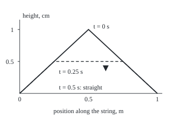

# Standing waves: a fixed string vibrates in harmonics, and the pluck shape decides how loud each one is

Differential equations and dynamics → The Classical PDEs → Vibrating strings → Standing waves

---

## General Overview

A string 1 m long is tied down at both ends. A ripple runs along it at 1 m/s, this shelf's scaled speed; a real guitar string is faster, which raises every pitch and changes no shape. Pull the middle 1 cm aside, so the string makes a triangle, and let go.

The triangle splits into two half-height copies running opposite ways, flipping over at the ends ([the-wave-equation-and-dalemberts-formula](05-the-wave-equation-and-dalemberts-formula.md)). At 0.25 s the string is a flat-topped trapezoid 0.5 cm high. At 0.5 s it is straight but moving. At 2 s it is back where it began.

The same motion is also a sum of pure patterns, each a sine-shaped arch repeated n times along the string that keeps its shape while it swells and shrinks: a **standing wave**. From here on they are **harmonics**: harmonic n has n arches and swings n times as fast as harmonic 1. By energy the triangle is 81.06% harmonic 1, 9.01% harmonic 3, 3.24% harmonic 5, and holds none of harmonics 2, 4 and 6. Each of those has a still point, a **node**, where the string was pulled. That missing half is why a middle pluck sounds hollow.

**A tied string moves as a sum of harmonics, sine shapes with n arches swinging at n times the lowest frequency; the start sets each amplitude through one integral, and the unchanging energy allows only one motion.**

**What kind of fact this is:** a theorem, proved on this card in Why it works.

### The picture: the plucked string at three moments

<p align="center"></p>

To scale: 280 units per metre across, 130 per centimetre up. Solid: the pluck. Dashed: 0.25 s, the flat top moving down. At 0.5 s the string lies on the axis, moving.

---

## The formula

Notation first. The height is $u(x,t)$ in cm, at place $x$ metres from the left end and time $t$ seconds. A subscript is a rate with the other variable held still ([what-a-pde-says](01-what-a-pde-says.md)): $u_t$ is a point's speed, $u_{tt}$ its acceleration, $u_x$ the slope, $u_{xx}$ the bending. The string obeys $u_{tt} = c^2 u_{xx}$, with wave speed $c$; u = 0 at both ends, x = 0 and x = $L$; it starts at rest in the pluck shape $f(x)$. A large sigma, Σ, adds the terms for n = 1, 2, 3 and on.

$$u(x,t) = \sum_{n=1}^{\infty} b_n \sin\frac{n\pi x}{L}\,\cos(\omega_n t), \qquad \omega_n = \frac{n\pi c}{L}, \qquad b_n = \frac{2}{L}\int_0^L f(x)\sin\frac{n\pi x}{L}\,dx$$

**Read it aloud:** the height is a sum of sine shapes with 1, 2, 3 … arches; shape n swings at n times the base rate, and its size is twice the average of the pluck times that sine.

In hertz, harmonic n swings n c/(2L) times a second: 0.5, 1.0, 1.5 Hz here. For a triangle of height $h$ pulled at the middle, Step 3 gives

$$b_n = \frac{8h}{n^2\pi^2}\sin\frac{n\pi}{2}$$

which is +0.810569, 0, −0.090063, 0, +0.032423 cm for h = 1 cm. With the string's mass per metre taken as 1, its energy is

$$E = \frac{1}{2}\int_0^L \left(u_t^2 + c^2 u_x^2\right)dx = \sum_{n=1}^{\infty} \frac{L}{4}\,\omega_n^2\, b_n^2$$

**Read it aloud:** energy is half the squared speed plus half the squared stretch, added along the string, or harmonic by harmonic.

| Symbol | Plain meaning | In our example | Push it up and the answer… |
| --- | --- | --- | --- |
| $u$, $u_t$, $u_x$, $u_{tt}$, $u_{xx}$ | height; speed; slope; acceleration; bending | 1 cm at the middle at t = 0 | — |
| $x$, $t$ | place, m; time, s | 0 to 1 m; 0.25 s | — |
| $c$, $L$ | wave speed; length | 1 m/s; 1 m | faster c, shorter L: higher pitch |
| $f$, $h$, $a$ | pluck shape; height; pull point | triangle; 1 cm; 0.5 m | larger h: amplitudes up in step |
| $X$, $q$ | a harmonic's shape part and time part | sines; cosines | — |
| $n$, $\omega_n$ | harmonic number; its angular frequency, rad/s | 1, 3, 5; nπ | higher pitch, smaller amplitude |
| $b_n$ | amplitude of harmonic n | 0.810569, 0, −0.090063 cm | a louder harmonic |
| $E$ | energy: motion plus stretch | 2 | — it never changes |

### When it holds

- **Ends held still.** Otherwise a wave walks in: u = (t − x)^3 for t > x starts at rest, yet reaches 0.125 cm at the middle at t = 1 s.
- **Small swings on an even string.** Big swings change the tension, so c varies and harmonics trade energy; an uneven string has harmonics that are not sines.
- **No friction.** Otherwise harmonics fade, high ones first, and E falls.
- **A start with finite energy.** The slope squared, added along the string, must be finite. The triangle's corner passes, but its series converges slowly: b_n shrinks like 1/n^2.

---

## Why it works

### Step 0: find shapes that keep their form, then add them

The wave equation is linear: a sum of solutions is a solution ([superposition-and-the-shape-of-linear-solutions](../03-Oscillators%20-%20Second-Order%20Linear%20Equations/01-superposition-and-the-shape-of-linear-solutions.md)). So find motions that keep one shape, build the pluck from them, then show no other motion fits.

### Step 1: separate place from time

Guess u = X(x) q(t): a fixed shape $X$ scaled by a time factor $q$, as on [separation-of-variables-for-the-heat-equation](04-separation-of-variables-for-the-heat-equation.md). The equation becomes q''/q = c^2 X''/X. The left side depends only on time, the right only on place, so both equal one constant, written −ω^2. Then q'' = −ω^2 q, an oscillator, and X'' = −(ω/c)^2 X. Heat has one time derivative, so its time factor decayed; here there are two, so it swings.

### Step 2: the fixed ends choose the frequencies

X(0) = 0 leaves X = sin(ωx/c); a positive constant, as on the heat card, allows only X = 0. X(L) = 0 needs sin(ωL/c) = 0, so ω = nπc/L for a whole number n. Each shape sin(nπx/L) is an **eigenfunction**: a shape the bending only rescales. Released from rest, q is a cosine (a start with speed would add a sine), so harmonic n is sin(nπx/L) cos(ω_n t), with nodes at x = L/n, 2L/n and on.

### Step 3: fit the pluck with one integral

At t = 0 every cosine is 1, so the pluck must equal the sum of b_n sin(nπx/L). Multiply by one sine, sin(mπx/L), and integrate along the string. Two different such sines integrate to zero, and one squared to L/2: **orthogonality**, the harmonics do not overlap. Only n = m survives, giving b_m.

<details>
<summary>The algebra behind b_n</summary>

On the 1 m string, integrate by parts twice. The pluck is straight either side of the pull point $a$, where its slope falls by h/(a(1 − a)). The integral of f sin(nπx) becomes that fall times sin(nπa) over n^2 π^2, so b_n = 2h sin(nπa)/(n^2 π^2 a(1 − a)). At a = 0.5 the fall is 4h, giving the formula above. At a = 0.25, b_2 = 32h/(12π^2).

</details>

The factor sin(nπa) explains the missing harmonics: it is zero when harmonic n has a node at the pluck point. At the middle, that is every even n.

### Step 4: each harmonic keeps its own clock

After harmonic 1's period, 2L/c = 2 s, every harmonic has made whole swings, so the string repeats: that is why it has a clear pitch.

### Step 5: energy stays fixed

Differentiate E in time, swap u_tt for c^2 u_xx, and integrate the slope term by parts. Only a boundary term survives, c^2 u_x u_t at the ends, and the ends do not move, so it is zero.

| Time | Energy of motion | Energy of stretch | Total |
| --- | --- | --- | --- |
| 0 s | 0 | 2 | 2 |
| 0.25 s | 1 | 1 | 2 |
| 0.5 s | 2 | 0 | 2 |

Harmonic by harmonic the cross terms vanish by orthogonality, leaving the sum of (L/4) ω_n^2 b_n^2: here 16/π^2 times (1 + 1/9 + 1/25 + …), which is 2.

### Step 6: energy makes the motion unique

Two motions with the same start and tied ends differ by a motion that starts flat and still. Its energy starts at 0 and stays 0, so it has no speed and no slope anywhere: the two motions are one.

<details>
<summary>Detailed proof</summary>

Let $u$ be twice continuously differentiable, with u_tt = c^2 u_xx on 0 ≤ x ≤ L and u = 0 at both ends. Then E'(t) = ∫ (u_t u_tt + c^2 u_x u_xt) dx, and by parts ∫ u_x u_xt dx = [u_x u_t] from 0 to L − ∫ u_xx u_t dx. The ends are fixed for all t, so u_t = 0 there and E'(t) = ∫ u_t (u_tt − c^2 u_xx) dx = 0.

If u and v solve the problem with the same data, w = u − v has w(x,0) = 0, hence w_x(x,0) = 0, and w_t(x,0) = 0, so its energy is 0 at t = 0 and so for all t. The integrand is continuous and never negative, so w_t = w_x = 0 everywhere, w is constant, and w(0,t) = 0 makes it 0.

</details>

The other road is d'Alembert's two half-height copies ([the-wave-equation-and-dalemberts-formula](05-the-wave-equation-and-dalemberts-formula.md)); the code checks the series against it.

---

## Worked numbers, by hand

| Step | Arithmetic | Value |
| --- | --- | --- |
| slope of the pluck | 1 cm over 0.5 m, then back | +2, then −2 cm/m |
| harmonic 1 | 8/π^2 × sin(π/2) | 0.810569 cm |
| harmonic 3 | 8/(9π^2) × sin(3π/2) | −0.090063 cm |
| harmonic 5 | 8/(25π^2) × sin(5π/2) | 0.032423 cm |
| energy at the start | ½ × 1 × 2 × 2 × 1 m | 2 |
| harmonic 1's share | ¼ × π^2 × 0.810569 × 0.810569, over 2 | 81.06% |
| harmonics 3 and 5 | the same with 9π^2 and 25π^2 | 9.01%, 3.24% |
| middle at 0.25 s | ½ × (0.5 + 0.5), the two halves | **0.5 cm** |

### What breaks if you drop a piece

| Mistake | Comes out at | What went wrong |
| --- | --- | --- |
| Ends not held | (t − x)^3 reaches 0.125 cm at the middle at t = 1 s | A wave walks in from x < 0 |
| Energy as the sum of b_n^2, no n^2 | 1.644934, not 2 | Faster harmonics carry more energy |
| Pluck at a quarter, assumed hollow | b_2 = 0.270190 cm | Harmonic 2's node is at 0.5 m |
| Series stopped after harmonic 1 | 0.810569 cm at the middle at t = 0, not 1 | The corner needs the high harmonics |

---

## Code, from first principles, and it actually runs

Amplitudes come from Simpson's rule (an integral estimated with parabolas) and the closed form. The height at the middle at 0.25 s comes from the series, from d'Alembert's halves, and from a grid stepped by the leapfrog rule: next height = twice the present one, minus the last, plus a multiple of the bending. The grid's error shrinks slowly, because the corner defeats the method's usual accuracy. Energy is summed by harmonic and measured from the shape.

### Python

```python
# Standing waves on a string -- the check behind the card.  Standard library only.
# A 1 m string, c = 1 m/s, ends fixed, pulled 1 cm aside at the middle, let go.
# Roads: the sine series (amplitudes by Simpson's rule and by formula), d'Alembert's
# two travelling halves, a grid stepped in time.  Energy: by mode and from the shape.
from math import sin, cos, pi
L, C = 1.0, 1.0
clean = lambda v: round(v, 9) + 0.0       # prints -0.000000 as 0.000000

def pluck(x, a=0.5):                      # the triangle, 1 cm high at x = a
    return x / a if x <= a else (L - x) / (L - a)
def b_simpson(n, a=0.5, m=2000):          # b_n = (2/L) * integral of pluck * sine
    f = lambda x: pluck(x, a) * sin(n * pi * x / L)
    s = f(0) + f(L) + sum((4 if k % 2 else 2) * f(k * L / m) for k in range(1, m))
    return 2 / L * s * (L / m) / 3
def b(n):                                 # the closed form for the middle pluck
    return 8 / (n * n * pi * pi) * sin(n * pi / 2)
def series(x, t, N):
    return sum(b(n) * sin(n * pi * x / L) * cos(n * pi * C * t / L) for n in range(1, N + 1))
def dal(x, t):                            # half the pluck runs each way, reflected odd
    def ext(y):
        y %= 2 * L
        return pluck(y) if y <= L else -pluck(2 * L - y)
    return 0.5 * (ext(x - C * t) + ext(x + C * t))
def grid(m, t_end, r=0.5):                # leapfrog, m intervals, c*dt/dx = r
    u0 = [pluck(i / m) for i in range(m + 1)]
    u1 = [0.0] + [u0[i] + r*r/2 * (u0[i+1] - 2*u0[i] + u0[i-1]) for i in range(1, m)] + [0.0]
    for _ in range(round(t_end * C * m / r) - 1):
        u0, u1 = u1, [0.0] + [2*u1[i] - u0[i] + r*r * (u1[i+1] - 2*u1[i] + u1[i-1]) for i in range(1, m)] + [0.0]
    return max(abs(u1[i] - dal(i / m, t_end)) for i in range(m + 1))
def shape_energy(t, m=1000, h=1e-7):      # (1/2) integral of u_t^2, and of c^2 u_x^2
    xs = [(k + 0.5) / m for k in range(m)]
    kin = sum(((dal(x, t + h) - dal(x, t - h)) / (2 * h)) ** 2 for x in xs) / (2 * m)
    pot = sum(C * C * ((dal(x + h, t) - dal(x - h, t)) / (2 * h)) ** 2 for x in xs) / (2 * m)
    return kin, pot

mode_E = lambda n, k=1: L / 4 * (k * pi * C / L) ** 2 * b(n) ** 2      # k = n is right
print("string 1 m, c = 1 m/s, plucked 1 cm at the middle; harmonic 1 repeats every 2 s")
for n in range(1, 7):
    print(f"harmonic {n}: b by Simpson {clean(b_simpson(n)):+.6f} cm, by formula {clean(b(n)):+.6f} cm, "
          f"{n * C / (2 * L):.1f} Hz, energy share {100 * mode_E(n, n) / 2:.2f}%")
print(f"middle at t = 0.25 s: d'Alembert {dal(0.5, 0.25):.6f}, series to n = 21 {series(0.5, 0.25, 21):.6f}, to n = 201 {series(0.5, 0.25, 201):.6f}")
errs = [grid(m, 0.25) for m in (40, 80, 160)]
print(f"grid, c*dt/dx = 0.5, worst error at t = 0.25 s: 40 intervals {errs[0]:.4f}, 80 {errs[1]:.4f}, 160 {errs[2]:.4f} cm")
for t in (0, 0.25, 0.5):
    k, p = shape_energy(t)
    print(f"energy from the shape at t = {t} s: motion {k:.6f} + stretch {p:.6f} = {k + p:.6f}")
modes = [sum(mode_E(n, n) for n in range(1, N + 1)) for N in (201, 2001)]
print(f"energy summed over modes: to n = 201 {modes[0]:.6f}, to n = 2001 {modes[1]:.6f}")
print(f"figure, t = 0 peak (180.0, {190 - 130 * dal(0.5, 0):.1f}); t = 0.25 s shoulders ({40 + 280 * 0.25:.1f}, "
      f"{190 - 130 * dal(0.25, 0.25):.1f}) ({40 + 280 * 0.75:.1f}, {190 - 130 * dal(0.75, 0.25):.1f}); t = 0.5 s flat at {190 - 130 * dal(0.5, 0.5):.1f}")
w = lambda x, t: max(C * t - x, 0.0) ** 3                               # a wave arriving from x < 0
print(f"mistake, ends not held: u = (t - x)^3 for t > x starts at rest, middle at t = 1 s {w(0.5, 1):.6f} cm")
print(f"mistake, energy as sum of b_n^2 without n^2: {sum(mode_E(n) for n in range(1, 2002)):.6f}")
print(f"mistake, pluck at a quarter still hollow: b_2 by Simpson {b_simpson(2, 0.25):.6f} cm, not 0")
print(f"mistake, series cut after harmonic 1: middle at t = 0 {series(0.5, 0, 1):.6f} cm, not 1")
assert all(abs(b_simpson(n) - b(n)) < 1e-6 for n in range(1, 7))        # integral vs formula
assert abs(series(0.5, 0.25, 201) - dal(0.5, 0.25)) < 1e-4 and errs[2] < errs[0] / 2
assert abs(modes[1] - sum(shape_energy(0.25))) < 1e-3                     # modes vs shape
assert abs(b_simpson(2, 0.25) - 32 / (12 * pi * pi)) < 1e-6              # quarter pluck, b_2
print("ALL CHECKS PASS")
```

**Ran 2026-09-28 on macOS, Python 3.14.6, standard library only. All checks passed. Output, pasted from the run:**

```
string 1 m, c = 1 m/s, plucked 1 cm at the middle; harmonic 1 repeats every 2 s
harmonic 1: b by Simpson +0.810569 cm, by formula +0.810569 cm, 0.5 Hz, energy share 81.06%
harmonic 2: b by Simpson +0.000000 cm, by formula +0.000000 cm, 1.0 Hz, energy share 0.00%
harmonic 3: b by Simpson -0.090063 cm, by formula -0.090063 cm, 1.5 Hz, energy share 9.01%
harmonic 4: b by Simpson +0.000000 cm, by formula +0.000000 cm, 2.0 Hz, energy share 0.00%
harmonic 5: b by Simpson +0.032423 cm, by formula +0.032423 cm, 2.5 Hz, energy share 3.24%
harmonic 6: b by Simpson +0.000000 cm, by formula +0.000000 cm, 3.0 Hz, energy share 0.00%
middle at t = 0.25 s: d'Alembert 0.500000, series to n = 21 0.498837, to n = 201 0.500014
grid, c*dt/dx = 0.5, worst error at t = 0.25 s: 40 intervals 0.0118, 80 0.0074, 160 0.0048 cm
energy from the shape at t = 0 s: motion 0.000000 + stretch 2.000000 = 2.000000
energy from the shape at t = 0.25 s: motion 1.000000 + stretch 1.000000 = 2.000000
energy from the shape at t = 0.5 s: motion 2.000000 + stretch 0.000000 = 2.000000
energy summed over modes: to n = 201 1.995987, to n = 2001 1.999595
figure, t = 0 peak (180.0, 60.0); t = 0.25 s shoulders (110.0, 125.0) (250.0, 125.0); t = 0.5 s flat at 190.0
mistake, ends not held: u = (t - x)^3 for t > x starts at rest, middle at t = 1 s 0.125000 cm
mistake, energy as sum of b_n^2 without n^2: 1.644934
mistake, pluck at a quarter still hollow: b_2 by Simpson 0.270190 cm, not 0
mistake, series cut after harmonic 1: middle at t = 0 0.810569 cm, not 1
ALL CHECKS PASS
```

### Rust

Same numbers, same labels, built with `rustc --edition 2021 -O`.

```rust
// Standing waves on a string -- the same check as the Python, in Rust.  No crates.
// A 1 m string, c = 1 m/s, ends fixed, pulled 1 cm aside at the middle, let go.
// Roads: the sine series (amplitudes by Simpson's rule and by formula), d'Alembert's
// two travelling halves, a grid stepped in time.  Energy: by mode and from the shape.
use std::f64::consts::PI;
const L: f64 = 1.0; const C: f64 = 1.0;
fn clean(v: f64) -> f64 { (v * 1e9).round() / 1e9 + 0.0 }   // prints -0.000000 as 0.000000
fn pluck(x: f64, a: f64) -> f64 { if x <= a { x / a } else { (L - x) / (L - a) } }
fn b_simpson(n: f64, a: f64) -> f64 {                       // (2/L) * integral of pluck * sine
    let m = 2000;
    let f = |x: f64| pluck(x, a) * (n * PI * x / L).sin();
    let mut s = f(0.0) + f(L);
    for k in 1..m { s += (if k % 2 == 1 { 4.0 } else { 2.0 }) * f(k as f64 * L / m as f64) }
    2.0 / L * s * (L / m as f64) / 3.0
}
fn b(n: f64) -> f64 { 8.0 / (n * n * PI * PI) * (n * PI / 2.0).sin() }
fn series(x: f64, t: f64, big_n: usize) -> f64 {
    (1..=big_n).map(|k| { let n = k as f64; b(n) * (n * PI * x / L).sin() * (n * PI * C * t / L).cos() }).sum()
}
fn ext(y: f64) -> f64 {                                     // the pluck reflected odd, period 2L
    let y = y.rem_euclid(2.0 * L);
    if y <= L { pluck(y, 0.5) } else { -pluck(2.0 * L - y, 0.5) }
}
fn dal(x: f64, t: f64) -> f64 { 0.5 * (ext(x - C * t) + ext(x + C * t)) }
fn grid(m: usize, t_end: f64, r: f64) -> f64 {              // leapfrog, m intervals, c*dt/dx = r
    let mut u0: Vec<f64> = (0..=m).map(|i| pluck(i as f64 / m as f64, 0.5)).collect();
    let mut u1 = vec![0.0; m + 1];
    for i in 1..m { u1[i] = u0[i] + r * r / 2.0 * (u0[i + 1] - 2.0 * u0[i] + u0[i - 1]) }
    for _ in 0..((t_end * C * m as f64 / r).round() as usize - 1) {
        let mut u2 = vec![0.0; m + 1];
        for i in 1..m { u2[i] = 2.0 * u1[i] - u0[i] + r * r * (u1[i + 1] - 2.0 * u1[i] + u1[i - 1]) }
        u0 = u1;
        u1 = u2;
    }
    (0..=m).map(|i| (u1[i] - dal(i as f64 / m as f64, t_end)).abs()).fold(0.0, f64::max)
}
fn shape_energy(t: f64) -> (f64, f64) {                     // (1/2) integral of u_t^2, and of c^2 u_x^2
    let (m, h) = (1000, 1e-7);
    let (mut kin, mut pot) = (0.0, 0.0);
    for k in 0..m {
        let x = (k as f64 + 0.5) / m as f64;
        kin += ((dal(x, t + h) - dal(x, t - h)) / (2.0 * h)).powi(2);
        pot += C * C * ((dal(x + h, t) - dal(x - h, t)) / (2.0 * h)).powi(2);
    }
    (kin / (2.0 * m as f64), pot / (2.0 * m as f64))
}
fn mode_e(n: f64, k: f64) -> f64 { L / 4.0 * (k * PI * C / L).powi(2) * b(n).powi(2) }   // k = n is right
fn main() {
    println!("string 1 m, c = 1 m/s, plucked 1 cm at the middle; harmonic 1 repeats every 2 s");
    for k in 1..=6 {
        let n = k as f64;
        println!("harmonic {}: b by Simpson {:+.6} cm, by formula {:+.6} cm, {:.1} Hz, energy share {:.2}%",
                 k, clean(b_simpson(n, 0.5)), clean(b(n)), n * C / (2.0 * L), 100.0 * mode_e(n, n) / 2.0);
    }
    println!("middle at t = 0.25 s: d'Alembert {:.6}, series to n = 21 {:.6}, to n = 201 {:.6}",
             dal(0.5, 0.25), series(0.5, 0.25, 21), series(0.5, 0.25, 201));
    let errs: Vec<f64> = [40, 80, 160].iter().map(|&m| grid(m, 0.25, 0.5)).collect();
    println!("grid, c*dt/dx = 0.5, worst error at t = 0.25 s: 40 intervals {:.4}, 80 {:.4}, 160 {:.4} cm", errs[0], errs[1], errs[2]);
    for (t, lab) in [(0.0, "0"), (0.25, "0.25"), (0.5, "0.5")] {
        let (k, p) = shape_energy(t);
        println!("energy from the shape at t = {} s: motion {:.6} + stretch {:.6} = {:.6}", lab, k, p, k + p);
    }
    let modes: Vec<f64> = [201, 2001].iter().map(|&nn| (1..=nn).map(|k| mode_e(k as f64, k as f64)).sum()).collect();
    println!("energy summed over modes: to n = 201 {:.6}, to n = 2001 {:.6}", modes[0], modes[1]);
    println!("figure, t = 0 peak (180.0, {:.1}); t = 0.25 s shoulders ({:.1}, {:.1}) ({:.1}, {:.1}); t = 0.5 s flat at {:.1}",
             190.0 - 130.0 * dal(0.5, 0.0), 40.0 + 280.0 * 0.25, 190.0 - 130.0 * dal(0.25, 0.25),
             40.0 + 280.0 * 0.75, 190.0 - 130.0 * dal(0.75, 0.25), 190.0 - 130.0 * dal(0.5, 0.5));
    let w = |x: f64, t: f64| (C * t - x).max(0.0).powi(3);  // a wave arriving from x < 0
    println!("mistake, ends not held: u = (t - x)^3 for t > x starts at rest, middle at t = 1 s {:.6} cm", w(0.5, 1.0));
    let wrong: f64 = (1..=2001).map(|k| mode_e(k as f64, 1.0)).sum();
    println!("mistake, energy as sum of b_n^2 without n^2: {:.6}", wrong);
    println!("mistake, pluck at a quarter still hollow: b_2 by Simpson {:.6} cm, not 0", b_simpson(2.0, 0.25));
    println!("mistake, series cut after harmonic 1: middle at t = 0 {:.6} cm, not 1", series(0.5, 0.0, 1));
    assert!((1..=6).all(|k| (b_simpson(k as f64, 0.5) - b(k as f64)).abs() < 1e-6));   // integral vs formula
    assert!((series(0.5, 0.25, 201) - dal(0.5, 0.25)).abs() < 1e-4 && errs[2] < errs[0] / 2.0);
    let (k, p) = shape_energy(0.25);
    assert!((modes[1] - (k + p)).abs() < 1e-3);                                          // modes vs shape
    assert!((b_simpson(2.0, 0.25) - 32.0 / (12.0 * PI * PI)).abs() < 1e-6);            // quarter pluck, b_2
    println!("ALL CHECKS PASS");
}
```

**Ran 2026-09-28 on macOS, rustc 1.98.1, no crates. All checks passed. Output, pasted from the run:**

```
string 1 m, c = 1 m/s, plucked 1 cm at the middle; harmonic 1 repeats every 2 s
harmonic 1: b by Simpson +0.810569 cm, by formula +0.810569 cm, 0.5 Hz, energy share 81.06%
harmonic 2: b by Simpson +0.000000 cm, by formula +0.000000 cm, 1.0 Hz, energy share 0.00%
harmonic 3: b by Simpson -0.090063 cm, by formula -0.090063 cm, 1.5 Hz, energy share 9.01%
harmonic 4: b by Simpson +0.000000 cm, by formula +0.000000 cm, 2.0 Hz, energy share 0.00%
harmonic 5: b by Simpson +0.032423 cm, by formula +0.032423 cm, 2.5 Hz, energy share 3.24%
harmonic 6: b by Simpson +0.000000 cm, by formula +0.000000 cm, 3.0 Hz, energy share 0.00%
middle at t = 0.25 s: d'Alembert 0.500000, series to n = 21 0.498837, to n = 201 0.500014
grid, c*dt/dx = 0.5, worst error at t = 0.25 s: 40 intervals 0.0118, 80 0.0074, 160 0.0048 cm
energy from the shape at t = 0 s: motion 0.000000 + stretch 2.000000 = 2.000000
energy from the shape at t = 0.25 s: motion 1.000000 + stretch 1.000000 = 2.000000
energy from the shape at t = 0.5 s: motion 2.000000 + stretch 0.000000 = 2.000000
energy summed over modes: to n = 201 1.995987, to n = 2001 1.999595
figure, t = 0 peak (180.0, 60.0); t = 0.25 s shoulders (110.0, 125.0) (250.0, 125.0); t = 0.5 s flat at 190.0
mistake, ends not held: u = (t - x)^3 for t > x starts at rest, middle at t = 1 s 0.125000 cm
mistake, energy as sum of b_n^2 without n^2: 1.644934
mistake, pluck at a quarter still hollow: b_2 by Simpson 0.270190 cm, not 0
mistake, series cut after harmonic 1: middle at t = 0 0.810569 cm, not 1
ALL CHECKS PASS
```

The two outputs match line for line.

> [!TIP]
> **Try changing**
> Guess first, then run it.
> - **Pluck at a third.** Set `a=0.5` in `b_simpson` to `1/3`. Harmonics 3 and 6 vanish, 2 and 4 appear; the first assert stops the run.
> - **Grid ratio 1.** The ratio r is c × time step / grid spacing. Set `r=0.5` in `grid` to `1.0`. The grid copies d'Alembert exactly: every error prints 0.0000, and the second assert stops the run.
> - **Grid ratio 1.1.** Each step outruns the wave and the errors explode.

---

## The usual mistake

> [!warning]
> **Picturing the pluck as harmonic 1 alone, bobbing.** Harmonic 1 carries 81.06% of the energy, not all. The string never holds the triangle's shape while moving: it passes through trapezoids and is straight at 0.5 s. Cut the series after harmonic 1 and the middle starts at 0.810569 cm, not 1.
>
> - **Every pluck hollow.** At a quarter, b_2 is 0.270190 cm.
> - **A negative amplitude as quiet.** Harmonic 3's −0.090063 cm means it starts upside down.

---

## Where you meet it in real life

- **Guitars.** Plucked near the bridge, sin(nπa) stays large for many n, so the tone is bright; plucked over the middle, it is soft and hollow.
- **Guitar harmonics.** A finger resting on the middle forces a node there, silencing the odd harmonics.
- **Cables.** Engineers compute a cable's harmonics so wind cannot drive one.

> **Say it back**
> A tied string's motion is a sum of harmonics: sine shapes with n arches, each swinging n times as fast as the first. The pluck sets each amplitude by one integral. A harmonic with a node at the pluck point is missing, so a middle pluck sounds hollow. The energy never changes, so only one motion fits a start.

---

## What this builds on

- [the-wave-equation-and-dalemberts-formula](05-the-wave-equation-and-dalemberts-formula.md): the equation, and the travelling-halves road that checks the series.
- [separation-of-variables-for-the-heat-equation](04-separation-of-variables-for-the-heat-equation.md): the product guess and the sine series, here with two time derivatives.

## Where this goes next

- electromagnetic-waves: the same equation for light, standing in a cavity.
- wave-equation-for-strings-and-membranes: harmonics as the model for quantised states.
- membranes-and-bessel-modes: a drum's harmonics, no longer whole multiples.

---

## Sources

Verified 2026-09-28: each link opens a page naming the cited work.

- Strauss, Walter A. *Partial Differential Equations: An Introduction*, 2nd ed. Wiley, 2007. [Publisher page](https://www.wiley.com/en-us/Partial+Differential+Equations%3A+An+Introduction%2C+2nd+Edition-p-9780470054567). Energy, uniqueness, and separation with fixed ends.
- Dawkins, Paul. "Vibrating String." Paul's Online Notes, Lamar University. [Notes](https://tutorial.math.lamar.edu/classes/de/VibratingString.aspx). The problem that picks the frequencies nπc/L.
- MIT OpenCourseWare. *18.303 Linear Partial Differential Equations*, Fall 2006. [Course page](https://ocw.mit.edu/courses/18-303-linear-partial-differential-equations-fall-2006/). The wave equation, normal modes and sine series.
