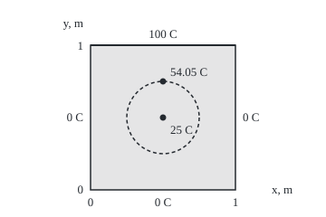
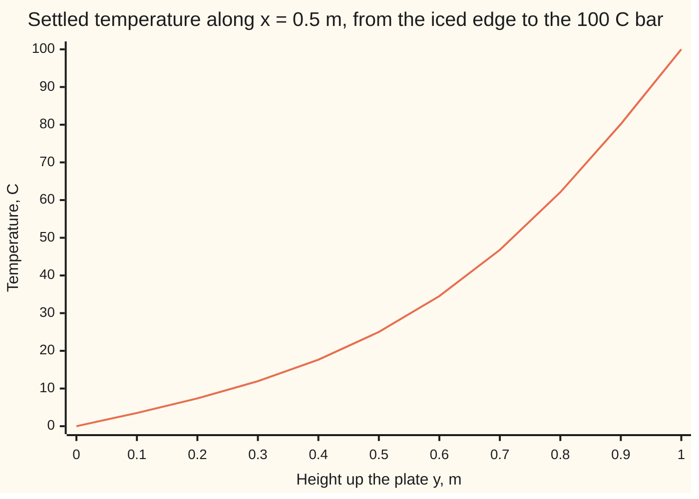

# Laplace's equation: what is left when everything has settled, and each point is the average of its neighbours

[Syllabus](../../../SYLLABUS.md) → [Differential equations and dynamics](../../../SYLLABUS.md#w08) → [The Classical PDEs](../../../SYLLABUS.md#w08-s10) → Laplace's equation

---

## General Overview

A square metal plate, 1 m on a side, has its top edge clamped to a bar at 100 °C and the other three in iced water at 0 °C. Hours later its thermometers stop moving: the temperature has settled.

The centre reads 25 °C, and no formula is needed. Turn the plate a quarter turn and the hot edge moves, but the centre stays put. Add the four turned patterns: every edge is now at 100 °C, and such a plate settles at 100 °C everywhere. Each turn gives the centre an equal share, so it reads 100 / 4 = 25 °C. And no point inside reaches 100 °C.

Both facts come from one rule: with no heater inside, each point's settled temperature is the average of those round it. That rule is **Laplace's equation**; a pattern obeying it is **harmonic**. A heater inside turns it into **Poisson's equation**.

**A settled temperature with no sources inside equals, at every point, the average round any small circle centred there; so it has no hot or cold spot inside, its extremes sit on the edge, and the edge temperatures fix it completely.**

**What kind of fact this is:** a theorem; the maximum principle and uniqueness are proved in Why it works, the circle average on [Mean value and maximum principle](../../07-Complex%20analysis/07-Conformal%20Maps%20and%20Harmonic%20Functions/05-mean-value-and-maximum-principle-for-harmonic-functions.md).

### The picture: the plate, its centre and one ring

<p align="center"></p>

To scale: 160 units per metre; plate (100, 50) to (260, 210), centre (180, 130), ring of radius 0.25 m drawn at radius 40, point 0.75 m up the middle at (180, 90). The ring's temperatures average exactly 25 °C.

---

## The formula

Reminder from [A partial differential equation](01-what-a-pde-says.md): $u_{xx}$ is the second derivative of $u$ in $x$ with $y$ held still: its bend across the plate. New here: the sum of the two bends, $u_{xx} + u_{yy}$, is the **Laplacian**, written $\Delta u$.

$$u_{xx} + u_{yy} = 0 \qquad\text{(Laplace: no sources)}$$

$$u_{xx} + u_{yy} = -f \qquad\text{(Poisson: a source of strength } f\text{)}$$

**Read it aloud:** the bend of the temperature across the plate plus its bend up the plate is zero; with a heater, it is minus the heater's strength.

The averaging rule is the same equation in another form. On a circle of radius $r$ round a point $(x_0, y_0)$ inside the plate:

$$u(x_0, y_0) = \frac{1}{2\pi}\int_0^{2\pi} u(x_0 + r\cos\theta,\ y_0 + r\sin\theta)\,d\theta$$

**Read it aloud:** a point's temperature is the average round any circle centred there that stays inside the plate.

| Symbol | Plain meaning | In our example | Push it up and the answer… |
| --- | --- | --- | --- |
| $u$, $w$, $v$ | temperature, °C; $w$ the gap between two patterns; $v$ a proof helper | 25 °C at the centre | — |
| $x$, $y$, $x_0$, $y_0$ | position across and up, m; a chosen point | centre (0.5, 0.5) | $y$ up: nearer the bar, warmer |
| $u_{xx}$, $u_{yy}$ | bend across and up, °C per square metre | cancel inside | one up forces the other down |
| $\Delta u$ | the Laplacian: $u_{xx} + u_{yy}$ | 0 on the plain plate | positive means a local dip |
| $u_t$, $\kappa$ | rate of change in time; spreading speed, square metres per second | 0 once settled | same final pattern |
| $f$ | source strength, °C per square metre (heating over conductivity) | 0; heated plate 100 | centre rises |
| $r$, $\theta$ | averaging circle's radius, m; angle round it | 0.25 m | same average |
| $h$ | grid spacing, m | 1/40 m | grid error grows as $h^2$ |

### When it holds

- **Settled:** while the plate still warms, $u_t$ is not zero and [The heat equation](03-the-heat-equation.md) governs.
- **No sources inside:** with a heater the centre can beat every edge: 7.37 °C against four edges at 0 °C.
- **A bounded plate, every edge held:** on the endless half-plane above an edge at 0 °C, both $u = y$ and $u = 0$ fit.
- **Uniform material:** varying conductivity makes each point a weighted average; the maximum principle survives, the circle average does not.

---

## Why it works

### Step 0: settled heat is Laplace's equation

On a plate the rod's heat law gains a second direction: $u_t = \kappa\,(u_{xx} + u_{yy})$. Settled means zero rate, so the bends cancel. A heater adds a rate, giving $u_{xx} + u_{yy} = -f$.

### Step 1: a grid turns the equation into averaging

Step $h$ east and west. Adding the two Taylor expansions cancels odd powers of $h$: east + west = 2 × centre + $h^2 u_{xx}$, up to terms in $h^4$. North and south give $u_{yy}$. So the four neighbours sum to 4 × centre + $h^2 \Delta u$. With $\Delta u = -f$:

centre = (east + west + north + south) / 4 + $h^2 f / 4$.

With no source, each grid point is its neighbours' average. The coarsest grid has one interior point, the centre: (100 + 0 + 0 + 0) / 4 = 25 °C.

### Step 2: the average holds on every circle

The grid rule is the discrete shadow of the circle average. As the radius grows, the ring average changes at the average outward slope of $u$ across the ring. By Green's theorem, that slope summed round the ring is the total of $\Delta u$ over the disc inside: zero. So the average ignores the radius; shrunk to nothing, it is the centre value. The full proof is on [Mean value and maximum principle](../../07-Complex%20analysis/07-Conformal%20Maps%20and%20Harmonic%20Functions/05-mean-value-and-maximum-principle-for-harmonic-functions.md). With a source, the ring average falls short of the centre by exactly $f r^2 / 4$.

### Step 3: no hot spot inside

Suppose an interior point were the hottest on the plate. Its value is the average round a small circle, and nothing on that circle is hotter. An average reaches its largest term only when every term equals it, so the whole circle shares that temperature. Repeating from each circle point spreads it everywhere. So either the plate is uniform, or its maximum sits on the edge only; likewise the minimum. This is the **maximum principle**. The warmest interior grid point, 2.5 cm below the bar, reads 94.96 °C.

<details>
<summary>Detailed proof: the maximum principle without circles</summary>

Let $u$ be harmonic in a bounded region and continuous up to its edge, with $x^2 + y^2 \le R^2$ on the region ($R^2 = 2$ for the unit square). For small $\varepsilon > 0$ set $v = u + \varepsilon(x^2 + y^2)$, so $\Delta v = 4\varepsilon > 0$.

A continuous function on a closed bounded region reaches a maximum. At an interior maximum the second-derivative test gives $v_{xx} \le 0$ and $v_{yy} \le 0$, so $\Delta v \le 0$: a contradiction. So $v$ peaks on the edge.

Inside, $u \le v \le \max_{\text{edge}} v \le \max_{\text{edge}} u + \varepsilon R^2$. Let $\varepsilon$ shrink to 0. Applying this to $-u$ bounds the minimum. Only the sign of $\Delta v$ was used, so for Poisson's equation with $f \ge 0$ the minimum still sits on the edge.

</details>

### Step 4: the edge fixes everything inside

Suppose two settled patterns share their edge temperatures. Their gap $w$ is harmonic, because the equation is linear: its bends are differences of zeros. On the edge $w$ is 0, so by Step 3 it is 0 inside too. This is uniqueness for the boundary problem, called the **Dirichlet problem**. The code starts grids at 0 °C and at 100 °C; both settle to one pattern.

### Step 5: the 25 °C, now proved

Take the four patterns with the hot edge on top, left, bottom and right. By linearity their sum is settled, with every edge at 100 °C. Uniform 100 °C fits, and by Step 4 nothing else does (the two jump corners are single points and change nothing), so the four centre values add to 100. A quarter turn carries each pattern to the next and fixes the centre, so the values are equal: 25 °C each.

### Step 6: a source breaks the no-peak rule

With a heater, the grid rule adds $h^2 f / 4$ to the neighbour average, so a point can sit above all its neighbours. Heat the plate uniformly at $f$ = 100 °C per square metre with all edges at 0 °C: the centre settles at 7.37 °C, hotter than every edge.

Two other roads build the patterns themselves: the Poisson integral formula on a disc ([The Poisson formula](../../07-Complex%20analysis/07-Conformal%20Maps%20and%20Harmonic%20Functions/06-poisson-integral-formula.md)), and a sine series on a rectangle ([Laplace on a rectangle](08-laplace-on-a-rectangle.md)), which the code uses as its second road.

---

## Worked numbers, by hand

| Step | Arithmetic | Value |
| --- | --- | --- |
| one interior point, $h$ = 0.5 m | (100 + 0 + 0 + 0) / 4 | 25 °C |
| four turns | 4 × centre = 100 | **25 °C** |
| ring of radius 0.25 m round the centre | 256-point average | 25.000000 °C |
| point 0.75 m up the middle | series; its ring of radius 0.2 m | 54.05 °C both |
| warmest interior grid point | 2.5 cm below the bar | 94.96 °C, below 100 |
| heated plate, one interior point | 0 + (0.25 × 100) / 4 | 6.25 °C |
| heated plate, true centre | series | **7.37 °C** |

The settled centre reads 25 °C, a quarter of the way from ice to bar, and nothing inside reaches 100 °C.

### The picture: temperature up the middle line



The line is the series solution; the grid agrees within 0.03 °C at every point. It sags below a straight line because heat also leaks out through the cold sides.

### What breaks if you drop a piece

| Mistake | Comes out at | What went wrong |
| --- | --- | --- |
| A heater inside, $f$ = 100 | centre 7.37 °C, every edge 0 °C | the centre sits above its neighbour average |
| An endless half-plane, edge at 0 °C | $u = y$ and $u = 0$ both fit; at 2 m they read 2.0 and 0 | no far edge pins the answer |
| Averaging the four edges for any point | 25.00 °C at (0.5, 0.75); true 54.05 °C | the average is round the point, not over the edges |

The code prints all three.

---

## Code, from first principles, and it actually runs

Two roads solve the plate: a grid of spacing 1/40 m, swept until every point equals its neighbour average (each change over-corrected to settle faster), and the sine series from [Laplace on a rectangle](08-laplace-on-a-rectangle.md). The centre has a third, the symmetry value 25. Ring averages use 256 equally spaced points.

### Python

```python
# Laplace's equation on a 1 m square plate: top edge 100 C, other three 0 C.
# Road one relaxes a grid until each point is the average of its neighbours;
# road two is the rectangle card's sine series; the centre's third road is symmetry.
from math import pi, sin, cos, exp
N, F = 40, 100.0                     # grid intervals per metre; heat source, C per m^2

def relax(n, top, src, start):       # sweep u = neighbour average + h^2 src / 4 until settled
    h, w = 1 / n, 2 / (1 + sin(pi / n))                  # w: over-relaxation factor
    u = [[start] * (n + 1) for _ in range(n + 1)]        # u[i][j] is u at x = i h, y = j h
    for i in range(n + 1):
        u[i][0], u[0][i], u[n][i], u[i][n] = 0.0, 0.0, 0.0, top
    while True:
        big = 0.0
        for i in range(1, n):
            for j in range(1, n):
                new = (u[i+1][j] + u[i-1][j] + u[i][j+1] + u[i][j-1] + h * h * src) / 4
                big = max(big, abs(new - u[i][j]))
                u[i][j] += w * (new - u[i][j])
        if big < 1e-12:
            return u

def plate(x, y):                     # sum over odd n of 400/(n pi) sin(n pi x) sinh(n pi y)/sinh(n pi)
    return sum(400 / (n * pi) * sin(n * pi * x) * (exp(n * pi * (y - 1)) - exp(-n * pi * (y + 1)))
               / (1 - exp(-2 * n * pi)) for n in range(1, 800, 2))

def heated(x, y):                    # edges 0 C, source F: a parabola minus a harmonic correction
    return F * (x * (1 - x) / 2 - sum(4 / (n * pi) ** 3 * sin(n * pi * x) * (exp(n * pi * (y - 1))
               + exp(-n * pi * y)) / (1 + exp(-n * pi)) for n in range(1, 200, 2)))
def ring(g, x, y, r, m=256):         # average of g round a circle of radius r, m points
    return sum(g(x + r * cos(2 * pi * k / m), y + r * sin(2 * pi * k / m)) for k in range(m)) / m

A, B = relax(N, 100.0, 0.0, 0.0), relax(N, 100.0, 0.0, 100.0)   # two different first guesses
inner = [A[i][j] for i in range(1, N) for j in range(1, N)]
line_s = [plate(0.5, k / 10) if k < 10 else 100.0 for k in range(11)]
line_g = [A[N // 2][4 * k] for k in range(11)]
p20, p40, pex = relax(20, 0.0, F, 0.0)[10][10], relax(40, 0.0, F, 0.0)[20][20], heated(0.5, 0.5)
m1, m2, m3 = ring(plate, 0.5, 0.5, 0.25), ring(plate, 0.5, 0.75, 0.2), ring(heated, 0.5, 0.5, 0.25)
f = lambda v: ", ".join(f"{t:.2f}" for t in v)
print(f"plate centre: symmetry 25, series {plate(0.5, 0.5):.6f}, grid h=1/40 {A[20][20]:.6f}")
print(f"one-point grids h=1/2: plate (100+0+0+0)/4 = {relax(2, 100.0, 0.0, 0.0)[1][1]:.2f}, "
      f"heated 0 + (1/4)(100)/4 = {relax(2, 0.0, F, 0.0)[1][1]:.2f}")
print(f"centre line x=0.5, y=0,0.1..1, series: {f(line_s)}")
print(f"centre line x=0.5, y=0,0.1..1, grid:   {f(line_g)}")
print(f"interior grid max {max(inner):.4f} at (0.5, 0.975), min {min(inner):.4f} at (0.025, 0.025); edges 0 and 100")
gap = max(abs(a - b) for ra, rb in zip(A, B) for a, b in zip(ra, rb))
print(f"uniqueness: first guesses 0 and 100 settle within 1e-9 of each other: {'yes' if gap < 1e-9 else 'no'}")
print(f"mean value at (0.5, 0.5), r=0.25: ring {m1:.6f}, point {plate(0.5, 0.5):.6f}")
print(f"mean value at (0.5, 0.75), r=0.2: ring {m2:.6f}, point {plate(0.5, 0.75):.6f}")
print(f"Poisson, edges 0, source {F:.0f}: centre series {pex:.4f}, grid h=1/20 {p20:.4f}, h=1/40 {p40:.4f}")
print(f"Poisson grid error: h=1/20 {pex - p20:.5f}, h=1/40 {pex - p40:.5f}, ratio {(pex - p20) / (pex - p40):.2f}")
print(f"Poisson ring r=0.25: {m3:.4f}; centre minus F r^2/4 = {pex - F * 0.25 ** 2 / 4:.4f}")
print(f"breaks 1, a source: centre {pex:.4f} C, above every edge (all 0 C)")
print(f"breaks 2, half-plane y>0 with edge 0: u=y has neighbour average {(2 + 2 + 2.1 + 1.9) / 4:.1f} = u at (0.5, 2); u=0 fits too")
print(f"breaks 3, edge average at (0.5, 0.75): 25.00, true {plate(0.5, 0.75):.2f}")
print("figure, 160 per metre; plate (100,50)-(260,210); centre (180,130), ring r=0.25 -> radius 40; point (0.5,0.75) -> (180,90)")
assert abs(plate(0.5, 0.5) - 25) < 1e-9                                  # series against symmetry
assert max(abs(a - b) for a, b in zip(line_s, line_g)) < 0.05 and max(inner) < 100
assert abs(m1 - 25) < 1e-9 and abs(m2 - plate(0.5, 0.75)) < 1e-9          # mean value, two circles
assert 3.8 < (pex - p20) / (pex - p40) < 4.2 and abs(m3 - (pex - F * 0.25 ** 2 / 4)) < 1e-9
print("ALL CHECKS PASS")
```

**Ran 2026-09-28 on macOS, Python 3.14.6, standard library only. All checks passed. Output, pasted from the run:**

```
plate centre: symmetry 25, series 25.000000, grid h=1/40 25.000000
one-point grids h=1/2: plate (100+0+0+0)/4 = 25.00, heated 0 + (1/4)(100)/4 = 6.25
centre line x=0.5, y=0,0.1..1, series: 0.00, 3.51, 7.37, 11.94, 17.65, 25.00, 34.53, 46.79, 62.08, 80.17, 100.00
centre line x=0.5, y=0,0.1..1, grid:   0.00, 3.52, 7.37, 11.95, 17.66, 25.00, 34.53, 46.77, 62.06, 80.15, 100.00
interior grid max 94.9625 at (0.5, 0.975), min 0.0684 at (0.025, 0.025); edges 0 and 100
uniqueness: first guesses 0 and 100 settle within 1e-9 of each other: yes
mean value at (0.5, 0.5), r=0.25: ring 25.000000, point 25.000000
mean value at (0.5, 0.75), r=0.2: ring 54.052922, point 54.052922
Poisson, edges 0, source 100: centre series 7.3671, grid h=1/20 7.3527, h=1/40 7.3635
Poisson grid error: h=1/20 0.01446, h=1/40 0.00363, ratio 3.99
Poisson ring r=0.25: 5.8046; centre minus F r^2/4 = 5.8046
breaks 1, a source: centre 7.3671 C, above every edge (all 0 C)
breaks 2, half-plane y>0 with edge 0: u=y has neighbour average 2.0 = u at (0.5, 2); u=0 fits too
breaks 3, edge average at (0.5, 0.75): 25.00, true 54.05
figure, 160 per metre; plate (100,50)-(260,210); centre (180,130), ring r=0.25 -> radius 40; point (0.5,0.75) -> (180,90)
ALL CHECKS PASS
```

### Rust

Same numbers, same labels.

```rust
// Laplace's equation on a 1 m square plate: top edge 100 C, other three 0 C.
// Road one relaxes a grid until each point is the average of its neighbours;
// road two is the rectangle card's sine series; the centre's third road is symmetry.
use std::f64::consts::PI;
const N: usize = 40;
const F: f64 = 100.0; // heat source, C per m^2

fn relax(n: usize, top: f64, src: f64, start: f64) -> Vec<Vec<f64>> {
    let (h, w) = (1.0 / n as f64, 2.0 / (1.0 + (PI / n as f64).sin())); // w: over-relaxation
    let mut u = vec![vec![start; n + 1]; n + 1]; // u[i][j] is u at x = i h, y = j h
    for i in 0..=n { u[i][0] = 0.0; u[0][i] = 0.0; u[n][i] = 0.0; u[i][n] = top; }
    loop {
        let mut big: f64 = 0.0;
        for i in 1..n { for j in 1..n {
            let new = (u[i + 1][j] + u[i - 1][j] + u[i][j + 1] + u[i][j - 1] + h * h * src) / 4.0;
            big = big.max((new - u[i][j]).abs());
            u[i][j] += w * (new - u[i][j]);
        } }
        if big < 1e-12 { return u; }
    }
}
fn plate(x: f64, y: f64) -> f64 { // sum over odd n of 400/(n pi) sin(n pi x) sinh(n pi y)/sinh(n pi)
    (1..800).step_by(2).map(|n| { let a = n as f64 * PI;
        400.0 / a * (a * x).sin() * ((a * (y - 1.0)).exp() - (-a * (y + 1.0)).exp()) / (1.0 - (-2.0 * a).exp())
    }).sum()
}
fn heated(x: f64, y: f64) -> f64 { // edges 0 C, source F: a parabola minus a harmonic correction
    let c: f64 = (1..200).step_by(2).map(|n| { let a = n as f64 * PI;
        4.0 / a.powi(3) * (a * x).sin() * ((a * (y - 1.0)).exp() + (-a * y).exp()) / (1.0 + (-a).exp())
    }).sum();
    F * (x * (1.0 - x) / 2.0 - c)
}
fn ring(g: fn(f64, f64) -> f64, x: f64, y: f64, r: f64) -> f64 { // average round a circle, 256 points
    let m = 256;
    (0..m).map(|k| { let t = 2.0 * PI * k as f64 / m as f64; g(x + r * t.cos(), y + r * t.sin()) }).sum::<f64>() / m as f64
}
fn f2(v: &[f64]) -> String { v.iter().map(|t| format!("{:.2}", t)).collect::<Vec<_>>().join(", ") }

fn main() {
    let (a, b) = (relax(N, 100.0, 0.0, 0.0), relax(N, 100.0, 0.0, 100.0)); // two first guesses
    let inner: Vec<f64> = (1..N).flat_map(|i| (1..N).map(move |j| (i, j))).map(|(i, j)| a[i][j]).collect();
    let (mx, mn) = (inner.iter().cloned().fold(f64::MIN, f64::max), inner.iter().cloned().fold(f64::MAX, f64::min));
    let line_s: Vec<f64> = (0..11).map(|k| if k < 10 { plate(0.5, k as f64 / 10.0) } else { 100.0 }).collect();
    let line_g: Vec<f64> = (0..11).map(|k| a[N / 2][4 * k]).collect();
    let (p20, p40, pex) = (relax(20, 0.0, F, 0.0)[10][10], relax(40, 0.0, F, 0.0)[20][20], heated(0.5, 0.5));
    let (m1, m2, m3) = (ring(plate, 0.5, 0.5, 0.25), ring(plate, 0.5, 0.75, 0.2), ring(heated, 0.5, 0.5, 0.25));
    let gap = a.iter().zip(&b).flat_map(|(ra, rb)| ra.iter().zip(rb).map(|(x, y)| (x - y).abs())).fold(0.0, f64::max);
    println!("plate centre: symmetry 25, series {:.6}, grid h=1/40 {:.6}", plate(0.5, 0.5), a[20][20]);
    println!("one-point grids h=1/2: plate (100+0+0+0)/4 = {:.2}, heated 0 + (1/4)(100)/4 = {:.2}",
             relax(2, 100.0, 0.0, 0.0)[1][1], relax(2, 0.0, F, 0.0)[1][1]);
    println!("centre line x=0.5, y=0,0.1..1, series: {}", f2(&line_s));
    println!("centre line x=0.5, y=0,0.1..1, grid:   {}", f2(&line_g));
    println!("interior grid max {:.4} at (0.5, 0.975), min {:.4} at (0.025, 0.025); edges 0 and 100", mx, mn);
    println!("uniqueness: first guesses 0 and 100 settle within 1e-9 of each other: {}", if gap < 1e-9 { "yes" } else { "no" });
    println!("mean value at (0.5, 0.5), r=0.25: ring {:.6}, point {:.6}", m1, plate(0.5, 0.5));
    println!("mean value at (0.5, 0.75), r=0.2: ring {:.6}, point {:.6}", m2, plate(0.5, 0.75));
    println!("Poisson, edges 0, source {:.0}: centre series {:.4}, grid h=1/20 {:.4}, h=1/40 {:.4}", F, pex, p20, p40);
    println!("Poisson grid error: h=1/20 {:.5}, h=1/40 {:.5}, ratio {:.2}", pex - p20, pex - p40, (pex - p20) / (pex - p40));
    println!("Poisson ring r=0.25: {:.4}; centre minus F r^2/4 = {:.4}", m3, pex - F * 0.25f64.powi(2) / 4.0);
    println!("breaks 1, a source: centre {:.4} C, above every edge (all 0 C)", pex);
    println!("breaks 2, half-plane y>0 with edge 0: u=y has neighbour average {:.1} = u at (0.5, 2); u=0 fits too", (2.0 + 2.0 + 2.1 + 1.9) / 4.0);
    println!("breaks 3, edge average at (0.5, 0.75): 25.00, true {:.2}", plate(0.5, 0.75));
    println!("figure, 160 per metre; plate (100,50)-(260,210); centre (180,130), ring r=0.25 -> radius 40; point (0.5,0.75) -> (180,90)");
    assert!((plate(0.5, 0.5) - 25.0).abs() < 1e-9); // series against symmetry
    assert!(line_s.iter().zip(&line_g).map(|(s, g)| (s - g).abs()).fold(0.0, f64::max) < 0.05 && mx < 100.0);
    assert!((m1 - 25.0).abs() < 1e-9 && (m2 - plate(0.5, 0.75)).abs() < 1e-9); // mean value, two circles
    let ratio = (pex - p20) / (pex - p40);
    assert!(3.8 < ratio && ratio < 4.2 && (m3 - (pex - F * 0.25f64.powi(2) / 4.0)).abs() < 1e-9);
    println!("ALL CHECKS PASS");
}
```

**Ran 2026-09-28 on macOS, rustc 1.98.1, no crates. All checks passed. Output, pasted from the run:**

```
plate centre: symmetry 25, series 25.000000, grid h=1/40 25.000000
one-point grids h=1/2: plate (100+0+0+0)/4 = 25.00, heated 0 + (1/4)(100)/4 = 6.25
centre line x=0.5, y=0,0.1..1, series: 0.00, 3.51, 7.37, 11.94, 17.65, 25.00, 34.53, 46.79, 62.08, 80.17, 100.00
centre line x=0.5, y=0,0.1..1, grid:   0.00, 3.52, 7.37, 11.95, 17.66, 25.00, 34.53, 46.77, 62.06, 80.15, 100.00
interior grid max 94.9625 at (0.5, 0.975), min 0.0684 at (0.025, 0.025); edges 0 and 100
uniqueness: first guesses 0 and 100 settle within 1e-9 of each other: yes
mean value at (0.5, 0.5), r=0.25: ring 25.000000, point 25.000000
mean value at (0.5, 0.75), r=0.2: ring 54.052922, point 54.052922
Poisson, edges 0, source 100: centre series 7.3671, grid h=1/20 7.3527, h=1/40 7.3635
Poisson grid error: h=1/20 0.01446, h=1/40 0.00363, ratio 3.99
Poisson ring r=0.25: 5.8046; centre minus F r^2/4 = 5.8046
breaks 1, a source: centre 7.3671 C, above every edge (all 0 C)
breaks 2, half-plane y>0 with edge 0: u=y has neighbour average 2.0 = u at (0.5, 2); u=0 fits too
breaks 3, edge average at (0.5, 0.75): 25.00, true 54.05
figure, 160 per metre; plate (100,50)-(260,210); centre (180,130), ring r=0.25 -> radius 40; point (0.5,0.75) -> (180,90)
ALL CHECKS PASS
```

The outputs agree line for line.

> [!TIP]
> **Try changing**
> - **Heat the bar to 200 °C** (100.0 → 200.0 in the grid calls, 400 → 800 in `plate`). Guess first. The centre reads 50 °C: the equation is linear. The asserts pinned to 25 then fail.
> - **Widen the centre's ring to 0.4 m.** Guess first. Still 25 °C: the radius does not matter while the circle stays inside.
> - **Set `F` to −100**, a cooler inside. Guess first. The centre reads −7.37 °C: now the minimum sits inside, and the maximum stays on the edge.
> - **Grid spacing 1/80 m for the heated plate.** Guess first. The error falls about fourfold again, to under 0.001 °C: it shrinks as $h^2$.

---

## The usual mistake

> [!warning]
> **Reading "the average of its neighbours" as "the average of the edges".** The rule is local: the average is round a circle centred on the point. At 0.75 m up the middle the edges still average 25 °C, but the plate reads 54.05 °C, near the bar.
>
> - **Expecting the inside to reach the edge maximum.** The warmest grid point, 2.5 cm below the bar, reads 94.96 °C.
> - **The maximum principle with a heater inside.** The heated centre reads 7.37 °C against edges at 0 °C; only the minimum stays on the edge.
> - **The sign in Poisson's equation.** Writing $+f$ for a heater turns the 7.37 °C bump into a −7.37 °C dip.

---

## Where you meet it in real life

- **Steady heat.** A heat sink, a wall or a hotplate once [The heat equation](03-the-heat-equation.md) has run its course.
- **Electric potential.** Voltage in charge-free space obeys Laplace's equation; charge makes it Poisson's. The maximum principle is why static fields cannot hold a charge in stable balance.
- **Soap films.** A gently sloped film on a bent wire is harmonic ([Mean value and maximum principle](../../07-Complex%20analysis/07-Conformal%20Maps%20and%20Harmonic%20Functions/05-mean-value-and-maximum-principle-for-harmonic-functions.md)).

> **Say it back**
> Settled heat with no source inside has its two bends cancel: Laplace's equation. Equivalently, each point is the average round any circle centred on it. An average cannot beat its own terms, so no hot or cold spot sits inside, and two patterns with the same edges match. On the plate with one edge at 100 °C, four turns and uniqueness put the centre at 25 °C. A heater makes it Poisson's equation, and the middle can be the hottest place.

---

## What this builds on

- [The heat equation](03-the-heat-equation.md): the rate law whose settled state this is.
- [Double integrals](../../06-Calculus%20and%20analysis/08-Multiple%20Integrals/01-double-integrals.md): sums over a disc, in the ring-average argument.
- [Harmonic functions](../../07-Complex%20analysis/07-Conformal%20Maps%20and%20Harmonic%20Functions/04-harmonic-functions-and-conjugates.md): harmonic functions as parts of complex functions.
- [Mean value and maximum principle](../../07-Complex%20analysis/07-Conformal%20Maps%20and%20Harmonic%20Functions/05-mean-value-and-maximum-principle-for-harmonic-functions.md): the full proof of the circle average.
- [The Poisson formula](../../07-Complex%20analysis/07-Conformal%20Maps%20and%20Harmonic%20Functions/06-poisson-integral-formula.md): the settled disc, written from its edge.

## Where this goes next

- [Laplace on a rectangle](08-laplace-on-a-rectangle.md): the sine series the code sums, by separation of variables.
- Maximum principles: the principle for wider families of equations, heat included.
- Harmonic functions: harmonic functions in any dimension.

The formula for a rectangle: [Laplace on a rectangle](08-laplace-on-a-rectangle.md).

---

## Sources

Verified 2026-09-28: every link below resolves to the publisher's or author's page.

- Evans, Lawrence C. *Partial Differential Equations*, 2nd ed. AMS Graduate Studies in Mathematics 19, 2010. [doi:10.1090/gsm/019](https://doi.org/10.1090/gsm/019). Section 2.2: mean values, the maximum principle, uniqueness, Poisson's equation.
- Axler, Sheldon, Paul Bourdon, and Wade Ramey. *Harmonic Function Theory*, 2nd ed. Springer, 2001. [Author's page, with the book free](https://www.axler.net/HFT.html). Chapter 1: mean values and the maximum principle.
- Courant, R., K. Friedrichs, and H. Lewy. "Über die partiellen Differenzengleichungen der mathematischen Physik." *Mathematische Annalen* 100 (1928): 32–74. [EuDML record](https://eudml.org/doc/159283). The four-neighbour grid average.
