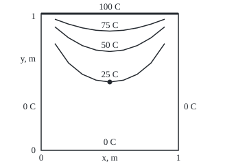

# Laplace on a rectangle: separate into sines one way and sinh the other, one hot edge at a time

[Syllabus](../../../SYLLABUS.md) → [Differential equations and dynamics](../../../SYLLABUS.md#w08) → [The Classical PDEs](../../../SYLLABUS.md#w08-s10) → Laplace on a rectangle

---

## General Overview

A square metal plate, 1 m on a side, has its top edge clamped to a bar at 100 C. The other three edges sit in iced water at 0 C. After a long wait the temperatures stop changing. What does a thermometer read at any chosen point?

At the centre no formula is needed: four quarter turns of the plate, added, make every edge 100 C, so each turn gives the centre an equal share, 25 C ([Laplace's equation](07-laplaces-equation-and-harmonic-functions.md)). That trick works only at the centre. Three quarters of the way up the middle, the plate reads 54.05 C, and that needs a formula for every point.

The formula comes from the move that cooled a rod mode by mode ([Separation of variables](04-separation-of-variables-for-the-heat-equation.md)): guess a shape across the plate times a profile up it. The cold side edges force sine waves across. Up the plate the equation forces the opposite bending: the hyperbolic sine, sinh, zero at the cold bottom and growing towards the hot top. Several warm edges are handled one at a time, and the answers added.

**The settled temperature is a sum of sine waves across the plate, sized by Fourier coefficients to the hot edge, each growing like sinh up from the cold edge; several warm edges are solved one at a time and added.**

**What kind of fact this is:** a method; proved step by step in Why it works, with uniqueness in the Detailed proof.

### The picture: where the plate reads 25, 50 and 75 C

<p align="center"></p>

To scale, 200 units to the metre, from the points both checks print on their "figure, … isotherm" lines; an isotherm is a curve of equal temperature. The dot is the centre. Every curve runs into the top corners, where 100 C meets 0 C.

---

## The formula

Reminder from [A partial differential equation](01-what-a-pde-says.md): $u_{xx}$ is the bend of the temperature across the plate, height held still; $u_{yy}$ the bend up it. $u(x, y)$ is the settled temperature in C, $x$ metres from the left edge and $y$ up from the bottom:

$$u_{xx} + u_{yy} = 0, \qquad u(0, y) = u(1, y) = u(x, 0) = 0, \qquad u(x, 1) = f(x).$$

Separation gives

$$u(x, y) = \sum_{n=1}^{\infty} b_n \sin(n\pi x)\,\frac{\sinh(n\pi y)}{\sinh(n\pi)}, \qquad b_n = 2\int_0^1 f(x)\sin(n\pi x)\,dx .$$

**Read it aloud:** the temperature is a sum of sine waves across the plate; the n-th has n humps, is sized by the hot edge's share of it, and grows up the plate from 0 at the bottom to 1 at the top.

For the bar at 100 C, $f = 100$, so $b_n = 400/(n\pi)$ for odd n and 0 for even n:

$$u(x, y) = \sum_{n \text{ odd}} \frac{400}{n\pi}\,\sin(n\pi x)\,\frac{\sinh(n\pi y)}{\sinh(n\pi)} .$$

A rectangle $W$ wide and $H$ high, hot on top, uses $\sin(n\pi x/W)$ and $\sinh(n\pi y/W)/\sinh(n\pi H/W)$ with $b_n = (2/W)\int_0^W f(x)\sin(n\pi x/W)\,dx$.

| Symbol | Plain meaning | In our example | Push it up and the answer… |
| --- | --- | --- | --- |
| $u$, $f$ | settled temperature, C; $f$ the hot edge's | $f = 100$; centre 25.0 | — |
| $x$, $y$, $W$, $H$ | across and up, m; width and height | 0 to 1; $W = H = 1$ | nearer the hot edge, warmer |
| $u_{xx}$, $u_{yy}$ | bend across and up, C per square metre | cancel inside | one up forces the other down |
| $X$, $Y$ | shape across, profile up, of one product | $\sin(\pi x)$ and $\sinh(\pi y)$ | — |
| $\lambda$ | separation constant, $\lambda = n^2\pi^2$ | $\pi^2$ for n = 1 | faster fade from the edge |
| $n$ | wave number: humps across the plate | 1, 3, 5, … | finer wave, smaller share, faster fade |
| $b_n$ | Fourier sine coefficient: the edge's share of wave n, C | 127.3240, 42.4413, 25.4648 | larger share of that wave |
| $\sinh$, $\cosh$ | hyperbolic sine and cosine: (e^s − e^(−s))/2 and (e^s + e^(−s))/2 | sinh(π/2)/sinh(π) = 0.199268 | — |

### When it holds

- **Settled, no heat made inside.** A heater makes it Poisson's equation; the products alone no longer fit.
- **A rectangle lined up with the axes.** An L-shaped plate does not separate, and a grid takes over.
- **Two cold edges facing each other.** With every edge warm, no direction has sines; split into one warm edge per problem first.
- **Temperatures held, not insulated.** An insulated edge has zero slope, so cosines replace sines, as on the rod.

---

## Why it works

### Step 0: one direction oscillates, the other grows

The bend across plus the bend up is zero. Where a pattern bends down across the plate, it must bend up by as much going up. A sine wave bends down where it is positive, so its partner up the plate bends upward: growth, not a wave. The side edges choose the waves; the bottom and top choose the growth.

### Step 1: the equation splits

Put $u = X(x)\,Y(y)$ into $u_{xx} + u_{yy} = 0$: X''Y + XY'' = 0. Divide by XY:

X''(x) / X(x) = −Y''(y) / Y(y).

The left side depends only on x, the right only on y, so both equal one constant, written −λ. Two ordinary differential equations remain:

X'' = −λX, with X(0) = X(1) = 0, and Y'' = λY, with Y(0) = 0.

The sign flip between them is Step 0 in symbols.

### Step 2: the cold sides choose the sines

The X problem is the rod's boundary-value problem, solved on [Separation of variables](04-separation-of-variables-for-the-heat-equation.md): a nonzero X exists only for λ = n^2 π^2, and then X = sin(nπx), n = 1, 2, 3, …

### Step 3: the cold bottom chooses sinh

Now Y'' = n^2 π^2 Y, solved by combinations of e^(nπy) and e^(−nπy). The cold bottom needs Y(0) = 0, which leaves their difference, halved: sinh(nπy) ([Hyperbolic functions](../../06-Calculus%20and%20analysis/02-Derivatives/07-hyperbolic-functions.md)). Dividing by sinh(nπ) makes it read 1 at the top edge. Each product is zero on three edges and satisfies the equation.

### Step 4: fit the hot edge

The equation is linear, so any sum of products solves it and stays zero on three edges. At y = 1 the sum reads Σ b_n sin(nπx), which must equal f(x): a Fourier sine series, with the rod's coefficients, 400/(nπ) for odd n when f = 100.

Away from the hot edge the n-th wave shrinks roughly like e^(−nπ(1 − y)), so fine detail on the edge dies quickly and the sum converges fast inside. At the centre the third wave is already 0.008983 of its edge size. On the hot edge it creeps: 127.32, 84.88, 110.35 C after one, two, three waves.

### Step 5: four warm edges, four problems

Give every edge its own temperature and no direction has two cold ends. Split into four problems, one warm edge each. Each is Steps 1 to 4 with the plate turned: a hot bottom uses the top solution at height 1 − y; a hot right edge swaps x and y; a hot left edge swaps them and uses 1 − x. The four answers add to one that matches every edge and still solves Laplace's equation.

With top, right, bottom and left at 100, 60, 20 and 0 C, the centre reads a quarter of each: 45.0000 C. At (0.25, 0.75) the four series add to 48.6406 C.

<details>
<summary>Detailed proof: the sum is a solution, and the only one</summary>

Let r_n(y) = sinh(nπy)/sinh(nπ) ≤ e^(−nπ(1−y)) / (1 − e^(−2π)). For y ≤ y_0 < 1, the n-th term and its k-th derivatives are at most (400/(nπ)) (nπ)^k · 2e^(−nπ(1−y_0)) / (1 − e^(−2π)) (the 2 covers cosh, which a y-derivative brings in), a convergent series, so the sum may be differentiated term by term; each term solves the equation, so the sum does.

Edges: every term is zero at x = 0, x = 1 and y = 0. At y = 1 the sum is the sine series of 100, converging to 100 for 0 < x < 1. The factors r_n(y) are at most 1 and fall with n, so by Abel's test u tends to 100 as y rises to 1.

Uniqueness: two settled temperatures with the same edges differ by a harmonic w that is zero on every edge. By the maximum principle ([Laplace's equation](07-laplaces-equation-and-harmonic-functions.md)), w lies between its edge values, 0 and 0, so w = 0.

</details>

A second road needs no sines: relax every grid point to the average of its four neighbours, the grid form of Laplace's equation. The code does this; Two space dimensions makes it fast.

---

## Worked numbers, by hand

The centre, x = 0.5 and y = 0.5. There sin(nπ/2) is 1 for n = 1, 5 and −1 for n = 3, 7.

| Step | Arithmetic | Value |
| --- | --- | --- |
| first coefficient | b_1 = 400/π | 127.3240 |
| its growth factor | sinh(π/2)/sinh(π) | 0.199268 |
| first wave | 127.3240 × 0.199268 | 25.3716 |
| third wave | −42.4413 × 0.008983 | −0.3812 |
| fifth wave | 25.4648 × 0.000388 | 0.0099 |
| seventh wave | −18.1891 × 0.000017 | −0.0003 |
| the sum | 25.3716 − 0.3812 + 0.0099 − 0.0003 | **25.0000 C** |

The centre reads 25.0 C, the quarter share found by turning the plate.

Three quarters of the way up the middle, the same series gives 54.05 C. A grid with no sines reads 53.9751, 54.0332 and 54.0480 C at 20, 40 and 80 cells a side; its centre reads 25.0000 at every size, since turning works on the grid too.

### What breaks if you drop a piece

| Mistake | Comes out at | What went wrong |
| --- | --- | --- |
| cosh in place of sinh | centre 27.19 C; bottom edge middle 10.98 C, not 0 | cosh(0) = 1: the bottom is not cold |
| No division by sinh(nπ) | centre partial sums 293.0, −2069.0, 30729.2 | waves never scaled to the edge; terms grow |
| The quarter rule used off-centre | 25 C at (0.5, 0.75); truth 54.05 C | turning fixes only the centre |
| One wave on the hot edge | 127.32 C at (0.5, 1), not 100 | a flat edge is not one sine hump |

The code prints all four.

---

## Code, from first principles, and it actually runs

Road one sums the series, its coefficients checked by Simpson's rule, a numerical integral written in the script. Road two uses no sines: N cells a side, each inside point replaced by its neighbours' average until nothing moves; overshooting each correction (over-relaxation) only speeds this up. Its error falls fourfold as N doubles: order two. Road three adds four turned series off-centre and needs 100 C.

### Python

```python
# Laplace on a rectangle -- the check behind the card.  Standard library only.  A 1 m square
# plate, top edge at 100 C, the rest at 0 C: u = sum over odd n of (400/(n pi)) sin(n pi x)
# sinh(n pi y)/sinh(n pi).  Road one: that series.  Road two: a grid of neighbour means, no sines.
# Road three: four turned copies add to 100 C.  Second case: edges 100, 60, 20, 0 C (T, R, B, L).
import math; PI = math.pi
def sinh_ratio(n, y, s=-1):         # sinh(n pi y)/sinh(n pi) without overflow; s = +1 gives the cosh mistake
    return math.exp(n * PI * (y - 1)) * (1 + s * math.exp(-2 * n * PI * y)) / (1 + s * math.exp(-2 * n * PI))
cosh_ratio = lambda n, y: sinh_ratio(n, y, 1)
def top(x, y, terms=0, shape=sinh_ratio):   # one hot edge at 100 C; terms counts odd n
    terms = terms or (100000 if y >= 1 else int(40 / (PI * (1 - y))) + 2)
    return sum(400 / (n * PI) * math.sin(n * PI * x) * shape(n, y) for n in range(1, 2 * terms, 2))
def plate(x, y, t, r, b, l): return (t * top(x, y) + r * top(y, x) + b * top(x, 1 - y) + l * top(y, 1 - x)) / 100
def simpson(f, m=2000): return sum((1 if i in (0, m) else 4 if i % 2 else 2) * f(i / m) for i in range(m + 1)) / (3 * m)
def grid(N, t, r, b, l):            # u[j][i] at x = i/N, y = j/N; each point relaxed to its neighbours' mean
    u = [[0.0] * (N + 1) for _ in range(N + 1)]
    for k in range(1, N):
        u[N][k], u[k][N], u[0][k], u[k][0] = t, r, b, l
    w, change = 2 / (1 + math.sin(PI / N)), 1.0     # over-relaxation only speeds the sweeps up
    while change > 1e-11:
        change = 0.0
        for j in range(1, N):
            for i in range(1, N):
                d = (u[j][i - 1] + u[j][i + 1] + u[j - 1][i] + u[j + 1][i]) / 4 - u[j][i]
                change, u[j][i] = max(change, abs(d)), u[j][i] + w * d
    return u
def isotherm(x, c, lo=0.0, hi=1.0): # the height y where the one-edge plate reads c C, by bisection
    for _ in range(50): lo, hi = (lo, (lo + hi) / 2) if top(x, (lo + hi) / 2) > c else ((lo + hi) / 2, hi)
    return lo
f4 = lambda v: " ".join(f"{x:.4f}" for x in v)
bf = [400 / (n * PI) for n in (1, 3, 5, 7)]
bs = [simpson(lambda x: 200 * math.sin(n * PI * x)) for n in (1, 3, 5, 7)]
terms = [400 / (n * PI) * math.sin(n * PI / 2) * sinh_ratio(n, 0.5) for n in (1, 3, 5, 7)]
centre, turned = top(0.5, 0.5), [top(0.3, 0.8), top(0.8, 0.3), top(0.3, 0.2), top(0.8, 0.7)]
Ns, exact = (20, 40, 80), top(0.5, 0.75)
grids = {N: grid(N, 100, 0, 0, 0) for N in Ns}

errs = [abs(grids[N][3 * N // 4][N // 2] - exact) for N in Ns]
case2, grid2 = plate(0.25, 0.75, 100, 60, 20, 0), grid(80, 100, 60, 20, 0)[60][20]
print("sine coefficients, n = 1 3 5 7: formula", f4(bf), " Simpson", f4(bs))
print("centre (0.5, 0.5), n = 1 3 5 7: sinh ratios", " ".join(f"{sinh_ratio(n, 0.5):.6f}" for n in (1, 3, 5, 7)), " terms", f4(terms), f" full series {centre:.4f} C")
print("hot edge (0.5, 1), first 1 2 3 odd modes:", " ".join(f"{top(0.5, 1, k):.2f}" for k in (1, 2, 3)), f" full {top(0.5, 1):.2f} C")
print("four turned copies at (0.3, 0.8), top right bottom left:", f4(turned), f" sum {sum(turned):.4f} C")
print("grid (0.5, 0.75), N = 20 40 80:", f4([grids[N][3 * N // 4][N // 2] for N in Ns]), f" series {exact:.4f} C")
print("grid error:", " ".join(f"{e:.5f}" for e in errs), " ratios", " ".join(f"{errs[i] / errs[i + 1]:.2f}" for i in range(2)))
print("grid centre, N = 20 40 80:", f4([grids[N][N // 2][N // 2] for N in Ns]))
print("figure, y (m):         ", " ".join(f"{j / 10:.1f}" for j in range(11)))
print("figure, series x = 0.5:", " ".join(f"{top(0.5, j / 10):.2f}" for j in range(11)))
print("figure, grid N = 20:   ", " ".join(f"{grids[20][2 * j][10]:.2f}" for j in range(11)))
for c in (25, 50, 75):
    print(f"figure, {c} C isotherm, svg:", " ".join(f"{60 + 20 * i},{220 - 200 * isotherm(i / 10, c):.1f}" for i in range(1, 10)))
print(f"second case, edges 100 60 20 0 C: centre {plate(0.5, 0.5, 100, 60, 20, 0):.4f} C; (0.25, 0.75) series {case2:.4f}, grid N = 80 {grid2:.4f}")
print(f"mistake, cosh for sinh: centre {top(0.5, 0.5, 50, cosh_ratio):.2f} C, bottom edge middle {top(0.5, 0, 50, cosh_ratio):.2f} C, not 0")
raw = [400 / (n * PI) * math.sin(n * PI / 2) * (math.exp(n * PI / 2) - math.exp(-n * PI / 2)) / 2 for n in (1, 3, 5)]
print("mistake, no division by sinh(n pi): centre partial sums", " ".join(f"{sum(raw[:k]):.1f}" for k in (1, 2, 3)))
print(f"mistake, quarter rule off-centre: 25 C claimed at (0.5, 0.75), series gives {exact:.2f} C")
assert max(abs(p - q) for p, q in zip(bf, bs)) < 1e-6                 # closed-form coefficients against an integral
assert abs(centre - 25) < 1e-9 and abs(grids[80][40][40] - 25) < 1e-6  # series and grid meet the symmetry count
assert abs(sum(turned) - 100) < 1e-9                                  # four turned copies make a 100 C plate
assert errs[-1] < 0.01 and all(3.5 < errs[i] / errs[i + 1] < 4.5 for i in range(2)) and abs(case2 - grid2) < 0.01
print("ALL CHECKS PASS")
```

**Ran 2026-09-28 on macOS, Python 3.14.6, standard library only. All checks passed. Output, pasted from the run:**

```
sine coefficients, n = 1 3 5 7: formula 127.3240 42.4413 25.4648 18.1891  Simpson 127.3240 42.4413 25.4648 18.1891
centre (0.5, 0.5), n = 1 3 5 7: sinh ratios 0.199268 0.008983 0.000388 0.000017  terms 25.3716 -0.3812 0.0099 -0.0003  full series 25.0000 C
hot edge (0.5, 1), first 1 2 3 odd modes: 127.32 84.88 110.35  full 100.00 C
four turned copies at (0.3, 0.8), top right bottom left: 55.6852 7.1076 5.9870 31.2202  sum 100.0000 C
grid (0.5, 0.75), N = 20 40 80: 53.9751 54.0332 54.0480  series 54.0529 C
grid error: 0.07781 0.01970 0.00494  ratios 3.95 3.99
grid centre, N = 20 40 80: 25.0000 25.0000 25.0000
figure, y (m):          0.0 0.1 0.2 0.3 0.4 0.5 0.6 0.7 0.8 0.9 1.0
figure, series x = 0.5: 0.00 3.51 7.37 11.94 17.65 25.00 34.53 46.79 62.08 80.17 100.00
figure, grid N = 20:    0.00 3.52 7.38 11.96 17.67 25.00 34.51 46.73 61.99 80.10 100.00
figure, 25 C isotherm, svg: 80,63.7 100,92.3 120,108.7 140,117.3 160,120.0 180,117.3 200,108.7 220,92.3 240,63.7
figure, 50 C isotherm, svg: 80,39.3 100,55.4 120,66.7 140,73.3 160,75.4 180,73.3 200,66.7 220,55.4 240,39.3
figure, 75 C isotherm, svg: 80,28.1 100,35.3 120,40.8 140,44.3 160,45.5 180,44.3 200,40.8 220,35.3 240,28.1
second case, edges 100 60 20 0 C: centre 45.0000 C; (0.25, 0.75) series 48.6406, grid N = 80 48.6404
mistake, cosh for sinh: centre 27.19 C, bottom edge middle 10.98 C, not 0
mistake, no division by sinh(n pi): centre partial sums 293.0 -2069.0 30729.2
mistake, quarter rule off-centre: 25 C claimed at (0.5, 0.75), series gives 54.05 C
ALL CHECKS PASS
```

### Rust

```rust
// Laplace on a rectangle -- the same check as the Python, in Rust.  No crates.  A 1 m square
// plate, top edge at 100 C, the rest at 0 C: u = sum over odd n of (400/(n pi)) sin(n pi x)
// sinh(n pi y)/sinh(n pi).  Road one: that series.  Road two: a grid of neighbour means, no sines.
// Road three: four turned copies add to 100 C.  Second case: edges 100, 60, 20, 0 C (T, R, B, L).
use std::f64::consts::PI;

fn ratio(n: f64, y: f64, s: f64) -> f64 { // sinh(n pi y)/sinh(n pi) without overflow; s = +1 gives the cosh mistake
    (n * PI * (y - 1.0)).exp() * (1.0 + s * (-2.0 * n * PI * y).exp()) / (1.0 + s * (-2.0 * n * PI).exp())
}
fn series(x: f64, y: f64, terms: usize, s: f64) -> f64 { // one hot edge at 100 C; terms counts odd n
    let terms = if terms > 0 { terms } else if y >= 1.0 { 100000 } else { (40.0 / (PI * (1.0 - y))) as usize + 2 };
    (0..terms).map(|k| { let n = (2 * k + 1) as f64; 400.0 / (n * PI) * (n * PI * x).sin() * ratio(n, y, s) }).sum()
}
fn top(x: f64, y: f64) -> f64 { series(x, y, 0, -1.0) }
fn plate(x: f64, y: f64, t: f64, r: f64, b: f64, l: f64) -> f64 {
    (t * top(x, y) + r * top(y, x) + b * top(x, 1.0 - y) + l * top(y, 1.0 - x)) / 100.0
}
fn simpson(f: &dyn Fn(f64) -> f64, m: usize) -> f64 { // integral of f from 0 to 1, m even
    (0..=m).map(|i| (if i == 0 || i == m { 1.0 } else if i % 2 == 1 { 4.0 } else { 2.0 }) * f(i as f64 / m as f64)).sum::<f64>() / (3 * m) as f64
}
fn grid(n: usize, t: f64, r: f64, b: f64, l: f64) -> Vec<Vec<f64>> { // u[j][i] at x = i/n, y = j/n
    let mut u = vec![vec![0.0f64; n + 1]; n + 1];
    for k in 1..n { u[n][k] = t; u[k][n] = r; u[0][k] = b; u[k][0] = l; }
    let (w, mut change) = (2.0 / (1.0 + (PI / n as f64).sin()), 1.0f64); // over-relaxation only speeds the sweeps up
    while change > 1e-11 {
        change = 0.0;
        for j in 1..n {
            for i in 1..n {
                let d = (u[j][i - 1] + u[j][i + 1] + u[j - 1][i] + u[j + 1][i]) / 4.0 - u[j][i];
                change = change.max(d.abs());
                u[j][i] += w * d;
            }
        }
    }
    u
}
fn isotherm(x: f64, c: f64) -> f64 { // the height y where the one-edge plate reads c C, by bisection
    let (mut lo, mut hi) = (0.0f64, 1.0f64);
    for _ in 0..50 { let mid = (lo + hi) / 2.0; if top(x, mid) > c { hi = mid } else { lo = mid } }
    lo
}
fn join(v: &[f64], d: usize) -> String { v.iter().map(|x| format!("{:.*}", d, x)).collect::<Vec<_>>().join(" ") }

fn main() {
    let odd = [1.0f64, 3.0, 5.0, 7.0];
    let bf: Vec<f64> = odd.iter().map(|&n| 400.0 / (n * PI)).collect();
    let bs: Vec<f64> = odd.iter().map(|&n| simpson(&|x| 200.0 * (n * PI * x).sin(), 2000)).collect();
    let terms: Vec<f64> = odd.iter().map(|&n| 400.0 / (n * PI) * (n * PI / 2.0).sin() * ratio(n, 0.5, -1.0)).collect();
    let (centre, turned) = (top(0.5, 0.5), [top(0.3, 0.8), top(0.8, 0.3), top(0.3, 0.2), top(0.8, 0.7)]);
    let (ns, exact) = ([20usize, 40, 80], top(0.5, 0.75));
    let grids: Vec<Vec<Vec<f64>>> = ns.iter().map(|&n| grid(n, 100.0, 0.0, 0.0, 0.0)).collect();
    let g75: Vec<f64> = ns.iter().zip(&grids).map(|(&n, g)| g[3 * n / 4][n / 2]).collect();
    let errs: Vec<f64> = g75.iter().map(|g| (g - exact).abs()).collect();
    let (case2, grid2) = (plate(0.25, 0.75, 100.0, 60.0, 20.0, 0.0), grid(80, 100.0, 60.0, 20.0, 0.0)[60][20]);
    println!("sine coefficients, n = 1 3 5 7: formula {}  Simpson {}", join(&bf, 4), join(&bs, 4));
    println!("centre (0.5, 0.5), n = 1 3 5 7: sinh ratios {}  terms {}  full series {:.4} C", join(&odd.map(|n| ratio(n, 0.5, -1.0)), 6), join(&terms, 4), centre);
    println!("hot edge (0.5, 1), first 1 2 3 odd modes: {}  full {:.2} C", join(&[1, 2, 3].map(|k| series(0.5, 1.0, k, -1.0)), 2), top(0.5, 1.0));
    println!("four turned copies at (0.3, 0.8), top right bottom left: {}  sum {:.4} C", join(&turned, 4), turned.iter().sum::<f64>());
    println!("grid (0.5, 0.75), N = 20 40 80: {}  series {:.4} C", join(&g75, 4), exact);
    println!("grid error: {}  ratios {}", join(&errs, 5), join(&[errs[0] / errs[1], errs[1] / errs[2]], 2));
    println!("grid centre, N = 20 40 80: {}", join(&ns.iter().zip(&grids).map(|(&n, g)| g[n / 2][n / 2]).collect::<Vec<_>>(), 4));
    let ys: Vec<f64> = (0..11).map(|j| j as f64 / 10.0).collect();
    println!("figure, y (m):          {}", join(&ys, 1));
    println!("figure, series x = 0.5: {}", join(&ys.iter().map(|&y| top(0.5, y)).collect::<Vec<_>>(), 2));
    println!("figure, grid N = 20:    {}", join(&(0..11).map(|j| grids[0][2 * j][10]).collect::<Vec<_>>(), 2));
    for c in [25.0, 50.0, 75.0] {
        let pts: Vec<String> = (1..10).map(|i| format!("{},{:.1}", 60 + 20 * i, 220.0 - 200.0 * isotherm(i as f64 / 10.0, c))).collect();
        println!("figure, {} C isotherm, svg: {}", c, pts.join(" "));
    }
    println!("second case, edges 100 60 20 0 C: centre {:.4} C; (0.25, 0.75) series {:.4}, grid N = 80 {:.4}", plate(0.5, 0.5, 100.0, 60.0, 20.0, 0.0), case2, grid2);
    println!("mistake, cosh for sinh: centre {:.2} C, bottom edge middle {:.2} C, not 0", series(0.5, 0.5, 50, 1.0), series(0.5, 0.0, 50, 1.0));
    let raw: Vec<f64> = [1.0f64, 3.0, 5.0].iter().map(|&n| 400.0 / (n * PI) * (n * PI / 2.0).sin() * ((n * PI / 2.0).exp() - (-n * PI / 2.0).exp()) / 2.0).collect();
    println!("mistake, no division by sinh(n pi): centre partial sums {}", join(&[raw[0], raw[0] + raw[1], raw[0] + raw[1] + raw[2]], 1));
    println!("mistake, quarter rule off-centre: 25 C claimed at (0.5, 0.75), series gives {:.2} C", exact);
    assert!(bf.iter().zip(&bs).all(|(p, q)| (p - q).abs() < 1e-6)); // closed-form coefficients against an integral
    assert!((centre - 25.0).abs() < 1e-9 && (grids[2][40][40] - 25.0).abs() < 1e-6); // series and grid meet the symmetry count
    assert!((turned.iter().sum::<f64>() - 100.0).abs() < 1e-9); // four turned copies make a 100 C plate
    assert!(errs[2] < 0.01 && (0..2).all(|i| errs[i] / errs[i + 1] > 3.5 && errs[i] / errs[i + 1] < 4.5) && (case2 - grid2).abs() < 0.01);
    println!("ALL CHECKS PASS");
}
```

**Ran 2026-09-28 on macOS, rustc 1.98.1, no crates. All checks passed. Output, pasted from the run:**

```
sine coefficients, n = 1 3 5 7: formula 127.3240 42.4413 25.4648 18.1891  Simpson 127.3240 42.4413 25.4648 18.1891
centre (0.5, 0.5), n = 1 3 5 7: sinh ratios 0.199268 0.008983 0.000388 0.000017  terms 25.3716 -0.3812 0.0099 -0.0003  full series 25.0000 C
hot edge (0.5, 1), first 1 2 3 odd modes: 127.32 84.88 110.35  full 100.00 C
four turned copies at (0.3, 0.8), top right bottom left: 55.6852 7.1076 5.9870 31.2202  sum 100.0000 C
grid (0.5, 0.75), N = 20 40 80: 53.9751 54.0332 54.0480  series 54.0529 C
grid error: 0.07781 0.01970 0.00494  ratios 3.95 3.99
grid centre, N = 20 40 80: 25.0000 25.0000 25.0000
figure, y (m):          0.0 0.1 0.2 0.3 0.4 0.5 0.6 0.7 0.8 0.9 1.0
figure, series x = 0.5: 0.00 3.51 7.37 11.94 17.65 25.00 34.53 46.79 62.08 80.17 100.00
figure, grid N = 20:    0.00 3.52 7.38 11.96 17.67 25.00 34.51 46.73 61.99 80.10 100.00
figure, 25 C isotherm, svg: 80,63.7 100,92.3 120,108.7 140,117.3 160,120.0 180,117.3 200,108.7 220,92.3 240,63.7
figure, 50 C isotherm, svg: 80,39.3 100,55.4 120,66.7 140,73.3 160,75.4 180,73.3 200,66.7 220,55.4 240,39.3
figure, 75 C isotherm, svg: 80,28.1 100,35.3 120,40.8 140,44.3 160,45.5 180,44.3 200,40.8 220,35.3 240,28.1
second case, edges 100 60 20 0 C: centre 45.0000 C; (0.25, 0.75) series 48.6406, grid N = 80 48.6404
mistake, cosh for sinh: centre 27.19 C, bottom edge middle 10.98 C, not 0
mistake, no division by sinh(n pi): centre partial sums 293.0 -2069.0 30729.2
mistake, quarter rule off-centre: 25 C claimed at (0.5, 0.75), series gives 54.05 C
ALL CHECKS PASS
```

The two outputs match line for line.

> [!TIP]
> **Try changing**
> Guess first, then run it.
> - **Heat the bottom.** Print `plate(0.5, 0.25, 0, 0, 100, 0)`: 54.05 C, the top-hot plate at (0.5, 0.75) turned over.
> - **Every edge at 100 C.** Use `100, 100, 100, 100` in both second-case calls: both roads read 100.0000.
> - **Plain averaging.** Set `w` to `1.0` in `grid`: the same numbers, far more sweeps.

---

## The usual mistake

> [!warning]
> **Separating a plate whose edges are all warm, in one go.** Sines need two facing edges at zero. With every edge warm the X problem has no nonzero solution and the method stalls. Split first: one warm edge per problem, then add.
>
> - **cosh for sinh.** cosh is 1 at zero, so the bottom edge warms to 10.98 C and the centre reads 27.19 C.
> - **No division by sinh(nπ).** The centre's partial sums run 293.0, −2069.0, 30729.2 C.
> - **The quarter rule anywhere.** At (0.5, 0.75) the truth is 54.05 C, not 25.
> - **Judging convergence on the hot edge.** It creeps there; inside, one wave already gives 25.3716 of 25.0000.

---

## Where you meet it in real life

- **Heat spreaders in electronics.** A plate with one edge on a warm component and the rest cooled is this problem; the map shows where a sensitive part can sit.
- **Electrostatics.** A long metal box of square cross-section with its lid at 100 V and the other walls earthed holds a voltage obeying the same equation: 25 V on its centre line.
- **Testing grid solvers.** The series is exact, so grid codes are checked against it, as the code here does.

> **Say it back**
> A rectangle's settled temperature obeys u_xx + u_yy = 0. A product guess splits it into two equations of opposite sign: sine waves between the two cold facing edges, sinh up from the cold bottom. Fourier coefficients fit the hot edge; several warm edges are solved one at a time and added. The 1 m plate with a 100 C top reads 25.0 C at its centre and 54.05 C three quarters of the way up, and a grid of neighbour averages agrees.

---

## What this builds on

- [Laplace's equation](07-laplaces-equation-and-harmonic-functions.md): the equation, the grid average, the turning argument, the maximum principle.
- [Separation of variables](04-separation-of-variables-for-the-heat-equation.md): the product guess, the sine eigenfunctions, the coefficients.
- [Hyperbolic functions](../../06-Calculus%20and%20analysis/02-Derivatives/07-hyperbolic-functions.md): sinh and cosh.

## Where this goes next

- Two space dimensions: an L-shaped or heated plate has no series; grids solve it fast, a row and a column at a time.

---

## Sources

Verified 28 Sep 2026: every link below resolves to the publisher's page.

- Strauss, Walter A. *Partial Differential Equations: An Introduction*, 2nd ed. Wiley, 2008. [Publisher page](https://www.wiley.com/en-us/Partial+Differential+Equations%3A+An+Introduction%2C+2nd+Edition-p-9780470054567). Rectangles by separation; the maximum principle.
- Olver, Peter J. *Introduction to Partial Differential Equations*. Springer, 2014. [DOI](https://doi.org/10.1007/978-3-319-02099-0). The planar Laplace equation separated, with convergence.
- Farlow, Stanley J. *Partial Differential Equations for Scientists and Engineers*. Dover, 1993. [Publisher page](https://store.doverpublications.com/products/9780486676203). Short lessons on separation.
