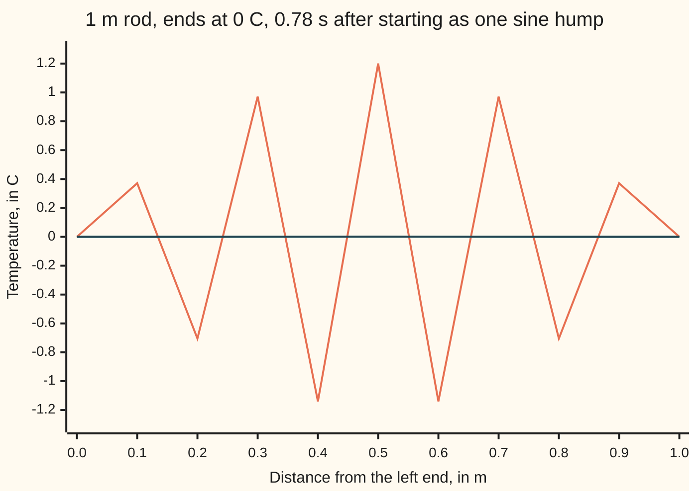

# Stepping the heat equation on a grid: the explicit scheme works only when the time step is small enough

[Syllabus](../../../SYLLABUS.md) → [Differential equations and dynamics](../../../SYLLABUS.md#w08) → [The Classical PDEs](../../../SYLLABUS.md#w08-s10) → Stepping the heat equation on a grid

---

## General Overview

A metal rod 1 m long has both ends in iced water at 0 C. It starts as one sine hump: 0 C at the ends, 1 C in the middle. Heat spreads at 1 m^2/s, a scaling that keeps the clock short. The exact answer is known ([Separation of variables](04-separation-of-variables-for-the-heat-equation.md)): the hump fades but keeps its shape; after 0.1 s the middle reads 0.372708 C.

A computer holds eleven readings, one every 0.1 m, and jumps them forward in time, each inside reading replaced by a mix of itself and its two neighbours. With jumps of 0.004 s the readings stay within 0.004294 C of the rod throughout a 0.8 s run. With jumps of 0.006 s they look fine, then turn into a zigzag, up, down, up, down, that flips sign and grows 1.341268-fold each jump. At the 130th jump, 0.78 s, the middle reads 1.200 C with −1.140 C beside it; the true rod is at 0.0005 C.

**On a grid each new reading is a weighted mix of three old ones; with a time step at most Δx^2/(2κ) the mix is an average and stays tame, and above it the middle weight turns negative and a zigzag grows without limit.**

**What kind of fact this is:** a method; its stability limit is a theorem, proved on this card in Why it works.

### The picture: the same rod at 0.78 s, stepped two ways



Orange: steps of 0.006 s. Teal: steps of 0.004 s. Dark blue: the exact rod, on the zero line with teal.

---

## The formula

Notation first, in words. $u(x, t)$ is the temperature in C at $x$ metres from the left end at $t$ seconds. A subscript is a rate ([A partial differential equation](01-what-a-pde-says.md)): $u_t$ is the change in time, $u_{xx}$ the bend along the rod. The heat equation ([The heat equation](03-the-heat-equation.md)) says $u_t = \kappa\, u_{xx}$.

The grid has nodes every $\Delta x$ metres, and time moves in steps of $\Delta t$ seconds. Write $U_j^n$ for the reading at node number $j$ after $n$ steps; the raised $n$ is a label, not a power. Here $j$ runs from 0 to 10; the ends stay at 0 C.

$$U_j^{n+1} = r\,U_{j-1}^n + (1 - 2r)\,U_j^n + r\,U_{j+1}^n, \qquad r = \frac{\kappa\,\Delta t}{\Delta x^2}$$

**Read it aloud:** the new reading at a node is r times each neighbour plus 1 − 2r times itself, where r is the time step measured in grid units.

The weights add to 1. This is the **FTCS scheme** (forward in time, centred in space), an **explicit** scheme: each new reading comes straight from old ones, with no equation to solve.

| Symbol | Plain meaning | In our example | Push it up and the answer… |
| --- | --- | --- | --- |
| $u$, $u_t$, $u_{xx}$ | temperature; its time rate; its bend | 1 C mid-rod at the start | — |
| $x$, $t$ | place in m; time in s | 0 to 1 m; 0.1 s | — |
| $\kappa$ | diffusivity: how fast heat spreads, in m^2/s | 1 | the safe time step shrinks |
| $\Delta x$, $\Delta t$ | node spacing; time step | 0.1 m; 0.004 s (A) or 0.006 s (B) | larger error |
| $r$ | κΔt/Δx^2, the step in grid units | 0.4 (A) or 0.6 (B) | above 1/2 the scheme blows up |
| $U_j^n$, $j$, $n$ | grid reading at node j after n steps | middle node j = 5 starts at 1 | — |
| $k$ | mode number: sin(kπx) has k humps | 1 smooth; 9 zigzag | sharper zigzag |
| $g$ | factor multiplying mode k each step | 0.960845 (A, k = 1); −1.341268 (B, k = 9) | outside −1 to 1, the mode grows |

The safe range:

$$r \le \tfrac12 \quad\Longleftrightarrow\quad \Delta t \le \frac{\Delta x^2}{2\kappa}$$

On this rod that is Δt ≤ 0.005000 s. Case A is inside; case B is outside.

### When it holds

- **r at most 1/2.** Above it, on a fine enough grid, round-off seeds a zigzag that grows every step, even from a smooth start.
- **A smooth true solution.** The error falls like Δx^2 only then; a sudden jump in the start converges more slowly near it.
- **Constant κ, even spacing.** Otherwise the limit uses the largest κ and the smallest gap.
- **Given end temperatures.** Insulated ends need an extra rule, untested here.

---

## Why it works

### Step 0: stop a derivative short of its limit

A rate is a change over a gap, as the gap shrinks. Keep the gap finite and the heat equation becomes arithmetic on eleven numbers.

### Step 1: replace each rate by a difference

In time, take one plain step along the slope (Euler's rule, [Euler's method](../05-Numerical%20Evolution/01-eulers-method.md)): $u_t$ is about $(U_j^{n+1} - U_j^n)/\Delta t$. In space, use the centred second difference ([Finite differences](../07-Series%20Solutions%20and%20Boundary%20Problems/07-finite-differences-for-boundary-problems.md)): $u_{xx}$ is about $(U_{j+1}^n - 2U_j^n + U_{j-1}^n)/\Delta x^2$. Set the first equal to κ times the second, multiply by Δt, collect terms: the formula.

### Step 2: r ≤ 1/2 makes the step an average

The weights add to 1, and when r ≤ 1/2 none is negative. Such a mix of three numbers lies between the smallest and the largest. So no reading ever passes the largest starting reading: the warmest point never gets warmer, as in a real rod. Case A's weights are 0.4, 0.2, 0.4.

### Step 3: r > 1/2 lets a zigzag feed itself

Case B's weights are 0.6, −0.2, 0.6. Take readings +1 and −1 alternating. Each node's neighbours are its opposite, so the step multiplies every reading by 1 − 4r = −1.400000: the zigzag flips and grows. The iced ends allow only the nearest shape, sin(9πx), the orange line in the picture.

### Step 4: every shape has its own growth factor

Put the mode $U_j^n = g^n \sin(k\pi j\,\Delta x)$ into the formula. The two neighbours combine by sin(a + b) + sin(a − b) = 2 sin a cos b, and the whole step becomes multiplication by

$$g = 1 - 4r\,\sin^2\!\Bigl(\frac{k\pi\,\Delta x}{2}\Bigr).$$

This is **von Neumann analysis**: test each mode, read off its factor. The sine squared lies between 0 and 1, so g stays at or above −1 for every mode on every grid exactly when r ≤ 1/2. Case A's k = 9 mode has g = −0.560845 and dies. Case B's has g = −1.341268 and doubles every 2.36 steps.

<details>
<summary>Detailed proof</summary>

With $U_j^n = g^n \sin(j\theta)$ and $\theta = k\pi\Delta x$, the neighbours sum to $2 g^n \sin(j\theta)\cos\theta$. The formula gives $U_j^{n+1} = g^n \sin(j\theta)\,[1 - 2r + 2r\cos\theta]$, so the factor is $1 - 2r(1 - \cos\theta) = 1 - 4r\sin^2(\theta/2)$. The ends stay at 0, since $\sin 0 = \sin(10\theta) = 0$ for whole-number $k$ when $\Delta x = 0.1$.

The modes $k = 1, \dots, 9$ are the eigenvectors of the second-difference matrix, so any start is a sum of them, each multiplied by its own $g$ every step; all stay bounded exactly when every $|g| \le 1$. The largest $\sin^2$ is at $k = 9$ and tends to 1 as $\Delta x$ shrinks, so every grid is safe exactly when $1 - 4r \ge -1$: $r \le 1/2$.

</details>

### Step 5: halving Δx cuts the error by four

One step multiplies the hump by 0.960845; the rod multiplies it by 0.961291. The time difference errs in proportion to Δt, the space difference to Δx^2; with r fixed, Δt is tied to Δx^2, so both scale as Δx^2. Halve Δx and the error at 0.1 s falls from 0.004294 to 0.001063, a ratio of 4.041, then to 0.000265, a ratio of 4.010.

### Another road: implicit steps

Take the space difference at the new time, and each step becomes a system of equations: backward Euler on the whole grid ([Stiff equations](../05-Numerical%20Evolution/06-stiff-equations-and-backward-euler.md)), stable for any r. The grid is stiff: its zigzag modes die fast, yet an explicit step must stay small enough for them. Average old and new differences equally and the scheme is **Crank-Nicolson**, stable for any r and accurate to Δt^2 in time.

---

## Worked numbers, by hand

One step at the middle node, then 25 steps.

| Step | Arithmetic | Value |
| --- | --- | --- |
| readings at x = 0.4, 0.5, 0.6 m | the sine hump | 0.951057, 1.000000, 0.951057 |
| middle after one step, A | 0.4 × 0.951057 + 0.2 × 1 + 0.4 × 0.951057 | **0.960845** |
| exact rod after 0.004 s | e^(−π^2 × 0.004) | 0.961291 |
| middle after one step, B | 0.6 × 0.951057 − 0.2 × 1 + 0.6 × 0.951057 | **0.941268** |
| A after 25 steps, t = 0.1 s | 0.960845^25 | **0.368414** |
| exact at t = 0.1 s | e^(−π^2 × 0.1) | 0.372708 |

After 0.1 s the grid's middle is at 0.368414 C, the rod's at 0.372708 C: the grid cools slightly too fast. Case B looks as good after one step; its failure lives in the zigzag.

### What breaks if you drop a piece

| Mistake | Comes out at | What went wrong |
| --- | --- | --- |
| Time step 0.006 s, r = 0.6 | middle 1.200 C at 0.78 s; true 0.0005 C | Middle weight −0.2: no longer an average |
| r taken as κΔt/Δx | middle 0.906577 C at 0.1 s; true 0.372708 C | r = 0.04: heat moves ten times too slowly |
| Updating readings in place | middle 0.194586 C at 0.1 s | Each node uses its left neighbour's new value |

The code prints all three.

---

## Code, from first principles, and it actually runs

The loop's readings are checked against two roads that share no stepping: the exact solution e^(−π^2 t) sin(πx), and g raised to the number of steps. Case A is repeated on finer grids, and case B's measured growth is compared with g for k = 9. Four asserts.

### Python

```python
# Stepping the heat equation on a grid -- the check behind the card.  Standard
# library only.  Rod 1 m, ends held at 0 C, kappa = 1, start u = sin(pi x).
# Road one: step the FTCS rule in a loop.  Road two: the exact solution
# e^(-pi^2 t) sin(pi x), and the scheme's own mode factor 1 - 4 r sin^2(k pi dx / 2).
import math
PI = math.pi

def ftcs(dt, dx, steps, in_place=False, r=None):
    n = round(1 / dx)
    r = dt / (dx * dx) if r is None else r
    u = [math.sin(PI * j * dx) for j in range(n + 1)]
    for _ in range(steps):
        old = u if in_place else u[:]
        for j in range(1, n):
            u[j] = r * old[j - 1] + (1 - 2 * r) * old[j] + r * old[j + 1]
    return u

def exact(x, t):
    return math.exp(-PI * PI * t) * math.sin(PI * x)

def factor(r, k, dx):                         # growth of mode sin(k pi x) per step
    return 1 - 4 * r * math.sin(k * PI * dx / 2) ** 2

def max_err(dt, dx, steps):
    u = ftcs(dt, dx, steps)
    return max(abs(u[j] - exact(j * dx, steps * dt)) for j in range(len(u)))

f = lambda v: f"{v:.6f}"
print("grid dx = 0.1, 11 nodes; A: dt = 0.004, r = 0.4; B: dt = 0.006, r = 0.6; limit dt <=", f(0.1 * 0.1 / 2),
      "; dx = 0.05 with dt = 0.004 gives r =", f(0.004 / (0.05 * 0.05)))
print("weights (left, self, right): A", f(0.4), f(1 - 0.8), f(0.4), "| B", f(0.6), f(1 - 1.2), f(0.6))
gA, gB = factor(0.4, 1, 0.1), factor(0.6, 1, 0.1)
print("mode 1 per step: A scheme", f(gA), "exact", f(math.exp(-PI * PI * 0.004)))
print("one step at the middle from", f(math.sin(PI * 4 * 0.1)), f(1.0), f(math.sin(PI * 6 * 0.1)),
      ": A", f(ftcs(0.004, 0.1, 1)[5]), "B", f(ftcs(0.006, 0.1, 1)[5]))
mid = ftcs(0.004, 0.1, 25)[5]
print("A middle at t = 0.1: loop", f(mid), "closed form", f(gA ** 25), "exact", f(exact(0.5, 0.1)))
errs = [max(abs(ftcs(0.004, 0.1, s)[j] - exact(j * 0.1, s * 0.004)) for j in range(11)) for s in range(201)]
print("A largest error over 0 < t <= 0.8:", f(max(errs)), "at t =", f"{errs.index(max(errs)) * 0.004:.3f}")
conv = [max_err(0.004 / 4 ** i, 0.1 / 2 ** i, 25 * 4 ** i) for i in range(3)]
print("error at t = 0.1, r = 0.4, dx = 0.1, 0.05, 0.025:", ", ".join(f(e) for e in conv))
print("error ratios:", f"{conv[0] / conv[1]:.3f}", f"{conv[1] / conv[2]:.3f}")
g9 = factor(0.6, 9, 0.1)
print("B checkerboard mode 9 per step:", f(g9), "doubles every", f"{math.log(2) / math.log(-g9):.2f}", "steps;",
      "A mode 9:", f(factor(0.4, 9, 0.1)), "; pure zigzag 1 - 4r:", f(1 - 4 * 0.6))
first = next(s for s in range(1, 400) if max(map(abs, ftcs(0.006, 0.1, s))) > 1)
growth = (abs(ftcs(0.006, 0.1, 150)[5]) / abs(ftcs(0.006, 0.1, 140)[5])) ** 0.1
print("B first step with |u| > 1:", first, "t =", f"{first * 0.006:.3f}", "; growth per step, steps 140-150:", f(growth))
b, a = ftcs(0.006, 0.1, 130), ftcs(0.004, 0.1, 195)
print("figure, B at t = 0.78:", ", ".join(f"{v:.3f}" for v in b))
print("figure, A at t = 0.78:", ", ".join(f"{v:.4f}" for v in a))
print("figure, exact t = 0.78:", ", ".join(f"{exact(j * 0.1, 0.78):.4f}" for j in range(11)))
print("mistake, r = dt/dx: middle at t = 0.1", f(ftcs(0.004, 0.1, 25, r=0.04)[5]))
print("mistake, update in place: middle at t = 0.1", f(ftcs(0.004, 0.1, 25, in_place=True)[5]))
assert abs(mid - gA ** 25) < 1e-12                       # loop equals the scheme's closed form
assert max(errs) < 0.005                                 # r = 0.4 tracks the exact rod
assert 3.8 < conv[0] / conv[1] < 4.2                     # halve dx, error falls 4x
assert abs(growth + g9) < 1e-3                           # r = 0.6 grows at the predicted rate
print("ALL CHECKS PASS")
```

**Ran 2026-09-28 on macOS, Python 3.14.6, standard library only. All checks passed. Output, pasted from the run:**

```
grid dx = 0.1, 11 nodes; A: dt = 0.004, r = 0.4; B: dt = 0.006, r = 0.6; limit dt <= 0.005000 ; dx = 0.05 with dt = 0.004 gives r = 1.600000
weights (left, self, right): A 0.400000 0.200000 0.400000 | B 0.600000 -0.200000 0.600000
mode 1 per step: A scheme 0.960845 exact 0.961291
one step at the middle from 0.951057 1.000000 0.951057 : A 0.960845 B 0.941268
A middle at t = 0.1: loop 0.368414 closed form 0.368414 exact 0.372708
A largest error over 0 < t <= 0.8: 0.004294 at t = 0.100
error at t = 0.1, r = 0.4, dx = 0.1, 0.05, 0.025: 0.004294, 0.001063, 0.000265
error ratios: 4.041 4.010
B checkerboard mode 9 per step: -1.341268 doubles every 2.36 steps; A mode 9: -0.560845 ; pure zigzag 1 - 4r: -1.400000
B first step with |u| > 1: 130 t = 0.780 ; growth per step, steps 140-150: 1.341267
figure, B at t = 0.78: 0.000, 0.371, -0.705, 0.971, -1.140, 1.200, -1.140, 0.971, -0.705, 0.371, 0.000
figure, A at t = 0.78: 0.0000, 0.0001, 0.0002, 0.0003, 0.0004, 0.0004, 0.0004, 0.0003, 0.0002, 0.0001, 0.0000
figure, exact t = 0.78: 0.0000, 0.0001, 0.0003, 0.0004, 0.0004, 0.0005, 0.0004, 0.0004, 0.0003, 0.0001, 0.0000
mistake, r = dt/dx: middle at t = 0.1 0.906577
mistake, update in place: middle at t = 0.1 0.194586
ALL CHECKS PASS
```

### Rust

Same numbers, same labels, built with `rustc --edition 2021 -O`.

```rust
// Stepping the heat equation on a grid -- the same check as the Python, in Rust.
// No crates.  Rod 1 m, ends held at 0 C, kappa = 1, start u = sin(pi x).
// Road one: step the FTCS rule in a loop.  Road two: the exact solution
// e^(-pi^2 t) sin(pi x), and the scheme's own mode factor 1 - 4 r sin^2(k pi dx / 2).
use std::f64::consts::PI;

fn ftcs(dt: f64, dx: f64, steps: usize, in_place: bool, r_set: Option<f64>) -> Vec<f64> {
    let n = (1.0 / dx).round() as usize;
    let r = r_set.unwrap_or(dt / (dx * dx));
    let mut u: Vec<f64> = (0..=n).map(|j| (PI * j as f64 * dx).sin()).collect();
    for _ in 0..steps {
        let old = u.clone();
        for j in 1..n {
            let left = if in_place { u[j - 1] } else { old[j - 1] };
            u[j] = r * left + (1.0 - 2.0 * r) * old[j] + r * old[j + 1];
        }
    }
    u
}

fn exact(x: f64, t: f64) -> f64 { (-PI * PI * t).exp() * (PI * x).sin() }

fn factor(r: f64, k: f64, dx: f64) -> f64 { 1.0 - 4.0 * r * (k * PI * dx / 2.0).sin().powi(2) }

fn err_at(dt: f64, dx: f64, steps: usize) -> f64 {
    let u = ftcs(dt, dx, steps, false, None);
    (0..u.len()).map(|j| (u[j] - exact(j as f64 * dx, steps as f64 * dt)).abs()).fold(0.0, f64::max)
}

fn row(v: &[f64]) -> String { v.iter().map(|x| format!("{:.4}", x)).collect::<Vec<_>>().join(", ") }

fn main() {
    println!("grid dx = 0.1, 11 nodes; A: dt = 0.004, r = 0.4; B: dt = 0.006, r = 0.6; limit dt <= {:.6} ; dx = 0.05 with dt = 0.004 gives r = {:.6}",
             0.1 * 0.1 / 2.0, 0.004 / (0.05 * 0.05));
    println!("weights (left, self, right): A {:.6} {:.6} {:.6} | B {:.6} {:.6} {:.6}", 0.4, 1.0 - 0.8, 0.4, 0.6, 1.0 - 1.2, 0.6);
    let (ga, g9) = (factor(0.4, 1.0, 0.1), factor(0.6, 9.0, 0.1));
    println!("mode 1 per step: A scheme {:.6} exact {:.6}", ga, (-PI * PI * 0.004).exp());
    println!("one step at the middle from {:.6} {:.6} {:.6} : A {:.6} B {:.6}", (PI * 4.0 * 0.1).sin(), 1.0, (PI * 6.0 * 0.1).sin(),
             ftcs(0.004, 0.1, 1, false, None)[5], ftcs(0.006, 0.1, 1, false, None)[5]);
    let mid = ftcs(0.004, 0.1, 25, false, None)[5];
    println!("A middle at t = 0.1: loop {:.6} closed form {:.6} exact {:.6}", mid, ga.powi(25), exact(0.5, 0.1));
    let errs: Vec<f64> = (0..=200).map(|s| err_at(0.004, 0.1, s)).collect();
    let (mut worst, mut at) = (0.0, 0);
    for (s, &e) in errs.iter().enumerate() { if e > worst { worst = e; at = s } }
    println!("A largest error over 0 < t <= 0.8: {:.6} at t = {:.3}", worst, at as f64 * 0.004);
    let conv: Vec<f64> = (0..3).map(|i| err_at(0.004 / 4f64.powi(i), 0.1 / 2f64.powi(i), 25 * 4usize.pow(i as u32))).collect();
    println!("error at t = 0.1, r = 0.4, dx = 0.1, 0.05, 0.025: {:.6}, {:.6}, {:.6}", conv[0], conv[1], conv[2]);
    println!("error ratios: {:.3} {:.3}", conv[0] / conv[1], conv[1] / conv[2]);
    println!("B checkerboard mode 9 per step: {:.6} doubles every {:.2} steps; A mode 9: {:.6} ; pure zigzag 1 - 4r: {:.6}",
             g9, 2f64.ln() / (-g9).ln(), factor(0.4, 9.0, 0.1), 1.0 - 4.0 * 0.6);
    let big = |s: usize| ftcs(0.006, 0.1, s, false, None).iter().fold(0.0, |m: f64, v| m.max(v.abs()));
    let first = (1..400).find(|&s| big(s) > 1.0).unwrap();
    let growth = (ftcs(0.006, 0.1, 150, false, None)[5].abs() / ftcs(0.006, 0.1, 140, false, None)[5].abs()).powf(0.1);
    println!("B first step with |u| > 1: {} t = {:.3} ; growth per step, steps 140-150: {:.6}", first, first as f64 * 0.006, growth);
    println!("figure, B at t = 0.78: {}", ftcs(0.006, 0.1, 130, false, None).iter().map(|x| format!("{:.3}", x)).collect::<Vec<_>>().join(", "));
    println!("figure, A at t = 0.78: {}", row(&ftcs(0.004, 0.1, 195, false, None)));
    let ex: Vec<f64> = (0..11).map(|j| exact(j as f64 * 0.1, 0.78)).collect();
    println!("figure, exact t = 0.78: {}", row(&ex));
    println!("mistake, r = dt/dx: middle at t = 0.1 {:.6}", ftcs(0.004, 0.1, 25, false, Some(0.04))[5]);
    println!("mistake, update in place: middle at t = 0.1 {:.6}", ftcs(0.004, 0.1, 25, true, None)[5]);
    assert!((mid - ga.powi(25)).abs() < 1e-12);            // loop equals the scheme's closed form
    assert!(worst < 0.005);                                 // r = 0.4 tracks the exact rod
    assert!(conv[0] / conv[1] > 3.8 && conv[0] / conv[1] < 4.2); // halve dx, error falls 4x
    assert!((growth + g9).abs() < 1e-3);                    // r = 0.6 grows at the predicted rate
    println!("ALL CHECKS PASS");
}
```

**Ran 2026-09-28 on macOS, rustc 1.98.1, no crates. All checks passed. Output, pasted from the run:**

```
grid dx = 0.1, 11 nodes; A: dt = 0.004, r = 0.4; B: dt = 0.006, r = 0.6; limit dt <= 0.005000 ; dx = 0.05 with dt = 0.004 gives r = 1.600000
weights (left, self, right): A 0.400000 0.200000 0.400000 | B 0.600000 -0.200000 0.600000
mode 1 per step: A scheme 0.960845 exact 0.961291
one step at the middle from 0.951057 1.000000 0.951057 : A 0.960845 B 0.941268
A middle at t = 0.1: loop 0.368414 closed form 0.368414 exact 0.372708
A largest error over 0 < t <= 0.8: 0.004294 at t = 0.100
error at t = 0.1, r = 0.4, dx = 0.1, 0.05, 0.025: 0.004294, 0.001063, 0.000265
error ratios: 4.041 4.010
B checkerboard mode 9 per step: -1.341268 doubles every 2.36 steps; A mode 9: -0.560845 ; pure zigzag 1 - 4r: -1.400000
B first step with |u| > 1: 130 t = 0.780 ; growth per step, steps 140-150: 1.341267
figure, B at t = 0.78: 0.000, 0.371, -0.705, 0.971, -1.140, 1.200, -1.140, 0.971, -0.705, 0.371, 0.000
figure, A at t = 0.78: 0.0000, 0.0001, 0.0002, 0.0003, 0.0004, 0.0004, 0.0004, 0.0003, 0.0002, 0.0001, 0.0000
figure, exact t = 0.78: 0.0000, 0.0001, 0.0003, 0.0004, 0.0004, 0.0005, 0.0004, 0.0004, 0.0003, 0.0001, 0.0000
mistake, r = dt/dx: middle at t = 0.1 0.906577
mistake, update in place: middle at t = 0.1 0.194586
ALL CHECKS PASS
```

The outputs match line for line: both languages do the same operations in the same order, so even the round-off seeding case B agrees.

> [!TIP]
> **Try changing**
> Guess first, then run it.
> - **Step at the limit.** In the `first =` line change 0.006 to 0.005, r = 0.5. Answer: no reading passes 1, and the search stops the script.
> - **Break the weights.** Change `(1 - 2 * r)` to `(1 - 2.2 * r)`. Answer: the first assert fails.
> - **Smaller r.** In the `conv =` line change 0.004 to 0.002, r = 0.2. Answer: the fourfold fall survives; every assert passes.

---

## The usual mistake

> [!warning]
> **Refining space without refining time fourfold.** Halve Δx to 0.05 m, keep Δt at 0.004 s, and r = 1.600000: the scheme blows up. Each halving of the spacing needs a quartering of the time step.
>
> - **Trusting the early steps.** Case B's zigzag starts at round-off size and takes 130 steps to pass 1 C.
> - **Forgetting the square.** r = κΔt/Δx gives r = 0.04 here and a middle of 0.906577 C at 0.1 s instead of 0.368414 C.
> - **Overwriting as you go.** Updating in place gives 0.194586 C. Keep the old row until the new one is done.

---

## Where you meet it in real life

- **Option pricing.** The Black-Scholes equation is the heat equation in disguise, stepped on a price grid by this same scheme ([Pricing on a grid](../../12-Financial%20mathematics/06-Numerical%20Methods%20for%20Pricing/07-finite-differences-for-the-black-scholes-equation.md)), under the same limit.
- **Engineering heat codes.** A chip's temperature is stepped on a grid; the limit sets the cost of a fine mesh.

> **Say it back**
> Differences replace rates, and each new reading is r, 1 − 2r, r times the three old ones, with r = κΔt/Δx^2. When r ≤ 1/2 the step is an average and nothing grows. Above it the middle weight is negative and a zigzag grows from round-off. Each mode's factor is 1 − 4r sin^2(kπΔx/2), and a stable run's error falls fourfold when Δx halves. Implicit and Crank-Nicolson steps remove the limit by solving equations each step.

---

## What this builds on

- [The heat equation](03-the-heat-equation.md): the equation being stepped, and the fading hump.
- [Stiff equations](../05-Numerical%20Evolution/06-stiff-equations-and-backward-euler.md): why a fast-dying mode limits an explicit step, and the implicit cure.
- [Finite differences](../07-Series%20Solutions%20and%20Boundary%20Problems/07-finite-differences-for-boundary-problems.md): the centred second difference and its sine eigenvectors.

## Where this goes next

- [Pricing on a grid](../../12-Financial%20mathematics/06-Numerical%20Methods%20for%20Pricing/07-finite-differences-for-the-black-scholes-equation.md): explicit, implicit and Crank-Nicolson steps pricing an option.
- Finite differences on a grid: why a consistent, stable scheme converges, for any linear equation.
- [The heat kernel](10-the-heat-kernel.md): the exact solution for any start on an endless rod.

One stable scheme converged on one rod here; whether stability guarantees convergence for every scheme is answered in Finite differences on a grid.

---

## Sources

Verified 2026-09-28: every link below resolves to the cited work.

- Courant, R., K. Friedrichs, and H. Lewy. "Über die partiellen Differenzengleichungen der mathematischen Physik." *Mathematische Annalen* 100, 1928, 32–74. [DOI](https://doi.org/10.1007/BF01448839). The first proof that a grid's time step must be limited by its spacing.
- Crank, J., and P. Nicolson. "A practical method for numerical evaluation of solutions of partial differential equations of the heat-conduction type." *Mathematical Proceedings of the Cambridge Philosophical Society* 43, 1947, 50–67. [DOI](https://doi.org/10.1017/S0305004100023197). The averaged scheme.
- O'Brien, G. G., M. A. Hyman, and S. Kaplan. "A study of the numerical solution of partial differential equations." *Journal of Mathematics and Physics* 29, 1950, 223–251. [DOI](https://doi.org/10.1002/sapm1950291223). Von Neumann's mode-by-mode stability test in print.
- LeVeque, Randall J. *Finite Difference Methods for Ordinary and Partial Differential Equations*. SIAM, 2007. [Publisher page](https://doi.org/10.1137/1.9780898717839). Explicit, implicit and Crank-Nicolson schemes for the heat equation, with their stability.
