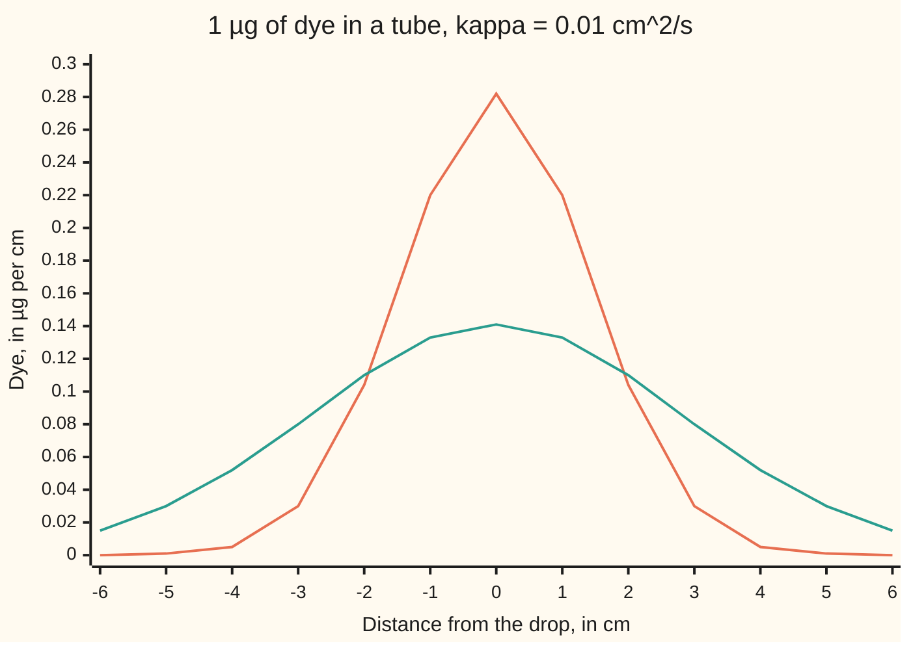

# The heat kernel: on an endless line a point of heat becomes a bell curve, and any start is a blend of bells

[Syllabus](../../../SYLLABUS.md) → [Differential equations and dynamics](../../../SYLLABUS.md#w08) → [The Classical PDEs](../../../SYLLABUS.md#w08-s10) → The heat kernel

---

## General Overview

A glass tube 2 m long holds still water. A pipette puts 1 µg of dye into a thin slice at its middle. Dye spreads as heat does, from rich to poor, at a rate set by its diffusivity, here 0.01 cm^2/s. After 100 s the dye is a hump of standard width 1.4142 cm; after 400 s, twice as wide and half as tall. It never nears the ends, so the tube may as well be endless.

The hump keeps one shape, the bell curve, only stretched. The bell grown from a single point is called the **heat kernel** from here on. The heat equation adds: two starts together spread as the sum of their spreads. So any start is a heap of points, and its future is a heap of bells.

Fill the left half of the tube with dye instead and leave the right half clear. The sharp edge blurs into an S-shaped profile, the **error function**, and at the old edge the strength stays exactly half.

**On an endless line a point of dye spreads into a bell curve of width √(2κt), κ the diffusivity and t the time; any start evolves into the blend of such bells, one per point, weighted by the start.**

**What kind of fact this is:** a theorem, proved on this card in Why it works.

### The picture: the dye at 100 s and 400 s



Orange: after 100 s, peak 0.282 µg per cm. Teal: after 400 s, peak 0.141. Both enclose the same 1 µg.

---

## The formula

Notation first, in words. $u(x, t)$ is the dye per cm at $x$ cm from the drop, $t$ seconds after it. Subscripts are rates ([A partial differential equation](01-what-a-pde-says.md)): $u_t$ the change per second, $u_{xx}$ the curvature along the tube. The heat equation ([The heat equation](03-the-heat-equation.md)) is $u_t = \kappa u_{xx}$, with a start $u(x, 0) = f(x)$.

$$G(x, t) = \frac{1}{\sqrt{4\pi\kappa t}}\; e^{-x^2/(4\kappa t)}$$

**Read it aloud:** the dye per cm at distance x is e to the minus x squared over 4 kappa t, divided by the root of 4 pi kappa t so the total stays 1.

$$u(x, t) = \int_{-\infty}^{\infty} G(x - y, t)\, f(y)\, dy$$

**Read it aloud:** each starting point y sends out a bell sized by its dye; the dye at x sums those bells.

That integral is a convolution ([Convolution](../08-Laplace%20Transforms%20for%20Initial-Value%20Problems/07-convolution-and-the-impulse-response.md)), with G as the impulse response. The width, the root of the average squared distance from the centre, is

$$\sigma = \sqrt{2\kappa t}, \qquad G = \frac{1}{\sigma\sqrt{2\pi}}\, e^{-x^2/(2\sigma^2)}.$$

The step start (strength 1 left of 0, clear water right) gives

$$u(x, t) = \tfrac12\Big(1 - \mathrm{erf}\big(\tfrac{x}{2\sqrt{\kappa t}}\big)\Big), \qquad \mathrm{erf}(z) = \frac{2}{\sqrt{\pi}}\int_0^z e^{-s^2}\, ds,$$

where s is only the integral's running variable.

| Symbol | Plain meaning | In our example | Push it up and the answer… |
| --- | --- | --- | --- |
| $u$, $f$, $u_t$, $u_{xx}$ | dye per cm at place and time; $f$ the start; subscripts are rates | 0.2197 at 1 cm, 100 s | — |
| $x$, $y$ | distance along the tube, in cm; $y$ a starting point | x = 1 | the bell's value falls |
| $t$ | time since the start, in s | 100 and 400 | wider, lower bell |
| $\kappa$ | diffusivity: the spreading rate, in cm^2/s | 0.01 | faster spreading |
| $G$, $F$ | the heat kernel; $F$ its fixed shape before stretching | peak 0.2821 at 100 s | — |
| $\sigma$ | the bell's width, in cm | 1.4142 at 100 s | lower, flatter bell |
| $z$, erf | scaled distance x/√(κt); the error function, fed z/2 for the step start | z = 1 at x = 1 cm, 100 s | — |
| $a$, $\tau$ | cell width and tick of the halving walk | 0.1 cm, 0.5 s | — |

### When it holds

- **An endless line.** Once the bell reaches the tube's ends, they change the answer and the finite-rod method ([Separation of variables](04-separation-of-variables-for-the-heat-equation.md)) takes over.
- **Constant κ, still water.** Flowing water makes the bell drift; κ varying with place bends the shape.
- **Forward in time.** Run backwards, a ripple with 1 cm between crests grows by e^39.48 in 100 s.
- **A tame solution.** Uniqueness needs growth no faster than e^(cx^2) far out, c a constant.

---

## Why it works

### Step 0: solve once, then add

The heat equation is linear, so solutions add, and sliding along the tube changes nothing. One solution, the spread of a single point, gives all others by sliding and adding.

### Step 1: the shape keeps its form, only stretched

If u(x, t) solves $u_t = \kappa u_{xx}$, so does u(Lx, L^2 t) for any stretch L: both sides gain L^2. A point has no length of its own, so its spread depends on x and t only through z = x/√(κt), the **similarity variable**. Keeping 1 µg in total makes the height fall as the width grows:

G(x, t) = F(z) / √(κt), with z = x / √(κt).

### Step 2: the PDE becomes an ODE, and it solves

Put that form into the equation with the chain rule. A common factor 1/t cancels, leaving

F'' + (z/2) F' + F/2 = 0, which is (F' + zF/2)' = 0.

So F' + zF/2 is constant, and 0, since F and F' vanish far out. Then F' = −zF/2, so F = C e^(−z^2/4), C a constant, which is e^(−x^2/(4κt)) times C. The Gaussian integral ([The Gaussian integral](../../06-Calculus%20and%20analysis/08-Multiple%20Integrals/04-gaussian-integral.md)) puts the area under e^(−x^2/(4κt)) at √(4πκt); dividing by it makes the total 1.

### Step 3: the width is √(2κt)

Let W(t), the average squared distance, be the integral of x^2 u. Its rate is the integral of x^2 κ u_xx. Integrating by parts twice moves both derivatives onto x^2 (the far ends add nothing, since u dies off there), leaving 2κ times the total dye, which is 1. So W = 2κt, and the width is √(2κt): 1.4142 cm at 100 s, 2.8284 cm at 400 s.

### Step 4: any start is a blend of bells

Slice the start into thin strips. The strip at y holds f(y) dy of dye and spreads as G(x − y, t) times that; adding the strips is the convolution. For the step start the blend is the area under one bell from x to the far right, which the substitution s = (y − x)/(2√(κt)) turns into ½(1 − erf(x/(2√(κt)))). At x = 0 half the bell lies each side.

### Step 5: the halving walk reaches the same bell by counting

Cut the tube into cells a = 0.1 cm wide. Each tick, every cell sends half its dye one cell left and half one cell right: the grid rule of [Stepping the heat equation on a grid](09-finite-differences-for-the-heat-equation.md) at its largest stable step. Each tick adds exactly a^2 to the average squared distance. With a tick τ = a^2/(2κ) = 0.5 s, 200 ticks make 100 s and add 2 cm^2: width 1.4142 cm, by counting alone. The heaps follow Pascal's triangle. Einstein read the same count as molecules taking random steps; wing 11 follows that road.

### Step 6: infinite speed, instant smoothness

G is positive everywhere once t > 0: after 100 s the step start puts 7.687 × 10^-13 of full strength at 10 cm. Real dye has an edge, so far out the equation is an approximation. The blend also inherits G's smoothness, so a start with a corner is smooth at every t > 0.

<details>
<summary>Detailed proof: the blend solves the equation and starts at f</summary>

Let f be bounded and continuous. For t > 0, G's derivatives are bounded by integrable bells, so they pass under the integral: u_t − κu_xx = ∫ (G_t − κG_xx)(x − y, t) f(y) dy = 0 by Step 2.

Start: G has total 1, so u(x, t) − f(x) = ∫ G(x − y, t)(f(y) − f(x)) dy. Given ε > 0, pick δ with |f(y) − f(x)| < ε when |y − x| < δ. That part is below ε; the rest is at most 2 sup|f| times the bell's area beyond δ, which tends to 0 as the width shrinks. So u → f as t → 0.

Uniqueness among bounded solutions follows from the maximum principle; Tychonoff's example shows the growth limit is needed.

</details>

A second road: a Fourier transform in x fades each frequency k like e^(−κk^2 t), and transforming back gives the bell (The heat kernel). With t negative the same factor explodes.

---

## Worked numbers, by hand

The drop, at x = 1 cm and t = 100 s.

| Step | Arithmetic | Value |
| --- | --- | --- |
| 4κt | 4 × 0.01 × 100 | 4 cm^2 |
| height factor | √(4π × 0.01 × 100) = √(4π) | 3.5449 |
| dye per cm | e^(−1^2/4) / 3.5449 | **0.2197 µg per cm** |
| peak at x = 0 | 1 / 3.5449 | 0.2821 |
| width at 100 s | √(2 × 0.01 × 100) = √2 | **1.4142 cm** |
| width at 400 s | √(2 × 0.01 × 400) = √8 | **2.8284 cm** |
| step start at x = 1 | ½(1 − erf(1/2)) | **0.239750** |

After 100 s the tube 1 cm from the drop holds 0.2197 µg of dye per cm; after 400 s the peak has halved to 0.1410.

### What breaks if you drop a piece

| Mistake | Comes out at | What went wrong |
| --- | --- | --- |
| Width taken as √(κt) | 1.0000 cm at 100 s, not 1.4142 | The spread rate is 2κ |
| Width taken to grow with t | 2.8284 cm at 200 s, true 2.0000 | Width grows with √t |
| Bell without 1/√(4πκt) | 3.5449 µg of dye from 1 | The factor keeps the total fixed |
| Running time backwards | a 1 cm ripple grows by e^39.48 in 100 s | The kernel works forwards only |

The code prints all four.

---

## Code, from first principles, and it actually runs

Four roads: the formula, its derivatives checked by difference quotients; a halving walk, measuring width and dye without the formula; a grid stepped from the step start against an erf series, its error shrinking fourfold as cells halve; Simpson's rule for the step start, far tail and Black-Scholes call.

### Python

```python
# The heat kernel -- the check behind the card.  Standard library only.  Dye in
# a long tube, kappa = 0.01 cm^2/s.  Roads: the kernel formula; a halving walk
# stepped cell by cell; a grid stepped from a step start; Simpson integrals.
from math import exp, sqrt, pi, log
K = 0.01
def G(x, t, k=K): return exp(-x * x / (4 * k * t)) / sqrt(4 * pi * k * t)
def simpson(f, a, b, n=4000):
    h = (b - a) / n
    return h / 3 * (f(a) + f(b) + sum((4 if i % 2 else 2) * f(a + i * h) for i in range(1, n)))
def erf(z):                                     # Maclaurin series, fine for z <= 2
    s, term, n = 0.0, z, 0
    while abs(term) > 1e-17:
        s += term / (2 * n + 1); n += 1; term *= -z * z / n
    return 2 / sqrt(pi) * s
def step(u, r, n):                              # n explicit steps, u_i += r (u_(i-1) - 2 u_i + u_(i+1))
    for _ in range(n):
        u = [u[0]] + [u[i] + r * (u[i - 1] - 2 * u[i] + u[i + 1]) for i in range(1, len(u) - 1)] + [u[-1]]
    return u
h = 1e-3                                        # 1. the kernel obeys u_t = kappa u_xx at x = 1 cm, t = 100 s
gt = (G(1, 100 + h) - G(1, 100 - h)) / (2 * h)
gxx = K * (G(1 + h, 100) - 2 * G(1, 100) + G(1 - h, 100)) / h ** 2
print(f"at x = 1 cm, t = 100 s, in 1e-4 per s: u_t = {gt * 1e4:.6f}, kappa u_xx = {gxx * 1e4:.6f}")
print("dye under the bell, t = 100 and 400 s:", " ".join(f"{simpson(lambda x: G(x, t), -30, 30):.6f}" for t in (100, 400)))
dx = 0.1                                        # 2. halving walk: r = 1/2, one tick = dx^2/(2 kappa) = 0.5 s
walk, xs = [0.0] * 200 + [1.0] + [0.0] * 200, [(i - 200) * dx for i in range(401)]
wid = {}
for t in (100, 400):
    w = step(walk, 0.5, int(t / 0.5))
    wid[t] = sqrt(sum(m * x * x for m, x in zip(w, xs)))
    if t == 100: dens = w[210] / (2 * dx)
print("width sqrt(2 kappa t), t = 100 and 400 s:", " ".join(f"{sqrt(2 * K * t):.4f}" for t in (100, 400)), "cm")
print("width of the halving walk, same times:   ", " ".join(f"{wid[t]:.4f}" for t in (100, 400)), "cm")
print(f"dye per cm at x = 1 cm, t = 100 s: bell {G(1, 100):.4f}, walk {dens:.4f}; peaks at 100 and 400 s: {G(0, 100):.4f} {G(0, 400):.4f}")
for t in (100, 400):
    print(f"figure, bell t = {t} s, x = -6..6 cm:", ", ".join(f"{G(x, t):.3f}" for x in range(-6, 7)))
xq = (0, 1, 2)                                  # 3. step start: full strength 1 left of 0, clear water right
by_erf = [0.5 * (1 - erf(x / (2 * sqrt(K * 100)))) for x in xq]
by_conv = [simpson(lambda s: G(s, 100), x, x + 20) for x in xq]
print("step start, t = 100 s, x = 0, 1, 2 cm: by erf  ", " ".join(f"{v:.6f}" for v in by_erf))
print("                           by kernel integral   ", " ".join(f"{v:.6f}" for v in by_conv))
errs = []
for d in (0.2, 0.1):                            # grid of cells d cm wide, r = 1/4, so a time step of 25 d^2 s
    n = round(10 / d)
    u = step([1.0] * n + [0.5] + [0.0] * n, 0.25, round(100 / (25 * d * d)))
    errs.append(abs(u[n + round(1 / d)] - by_erf[1]))
print(f"grid error at x = 1 cm, cells 0.2 and 0.1 cm, in 1e-4: {errs[0] * 1e4:.2f} {errs[1] * 1e4:.2f}, ratio {errs[0] / errs[1]:.2f}")
print(f"step start at x = 10 cm, t = 100 s (by integral): {simpson(lambda s: G(s, 100), 10, 30):.3e}")
S, Kx, r, q, sg, T = 100, 100, 0.05, 0.02, 0.2, 1.0   # 4. wing 12: kernel in log price, kappa = sigma^2 / 2
m = log(S) + (r - q - sg * sg / 2) * T
call = exp(-r * T) * simpson(lambda y: (exp(y) - Kx) * G(y - m, T, sg * sg / 2), log(Kx), m + 12 * sg)
print(f"Black-Scholes call from the kernel: {call:.9f}")
print(f"mistake 1, width sqrt(kappa t) at 100 s: {sqrt(K * 100):.4f} cm")
print(f"mistake 2, width taken to grow with t: {2 * sqrt(2 * K * 100):.4f} cm at 200 s; true {sqrt(2 * K * 200):.4f} cm")
print(f"mistake 3, bell without 1/sqrt(4 pi kappa t): dye total {simpson(lambda x: exp(-x * x / 4), -30, 30):.4f} at 100 s")
assert abs(gt - gxx) < 1e-6 * abs(gt) and abs(gt - G(1, 100) * (1 / 400 - 1 / 200)) < 1e-9
assert all(abs(wid[t] - sqrt(2 * K * t)) < 1e-9 for t in wid) and abs(dens - G(1, 100)) < 0.01 * G(1, 100)
assert all(abs(a - b) < 1e-9 for a, b in zip(by_erf, by_conv)) and errs[1] < 1e-3 and 3.5 < errs[0] / errs[1] < 4.5
assert abs(call - 9.227005508154) < 1e-6
print(f"mistake 4, run backwards 100 s: a ripple 1 cm long grows by e^{K * (2 * pi) ** 2 * 100:.2f}")
print("ALL CHECKS PASS")
```

**Ran 2026-09-28 on macOS, Python 3.14.6, standard library only. All checks passed. Output, pasted from the run:**

```
at x = 1 cm, t = 100 s, in 1e-4 per s: u_t = -5.492391, kappa u_xx = -5.492391
dye under the bell, t = 100 and 400 s: 1.000000 1.000000
width sqrt(2 kappa t), t = 100 and 400 s: 1.4142 2.8284 cm
width of the halving walk, same times:    1.4142 2.8284 cm
dye per cm at x = 1 cm, t = 100 s: bell 0.2197, walk 0.2197; peaks at 100 and 400 s: 0.2821 0.1410
figure, bell t = 100 s, x = -6..6 cm: 0.000, 0.001, 0.005, 0.030, 0.104, 0.220, 0.282, 0.220, 0.104, 0.030, 0.005, 0.001, 0.000
figure, bell t = 400 s, x = -6..6 cm: 0.015, 0.030, 0.052, 0.080, 0.110, 0.133, 0.141, 0.133, 0.110, 0.080, 0.052, 0.030, 0.015
step start, t = 100 s, x = 0, 1, 2 cm: by erf   0.500000 0.239750 0.078650
                           by kernel integral    0.500000 0.239750 0.078650
grid error at x = 1 cm, cells 0.2 and 0.1 cm, in 1e-4: 5.94 1.49, ratio 3.99
step start at x = 10 cm, t = 100 s (by integral): 7.687e-13
Black-Scholes call from the kernel: 9.227005508
mistake 1, width sqrt(kappa t) at 100 s: 1.0000 cm
mistake 2, width taken to grow with t: 2.8284 cm at 200 s; true 2.0000 cm
mistake 3, bell without 1/sqrt(4 pi kappa t): dye total 3.5449 at 100 s
mistake 4, run backwards 100 s: a ripple 1 cm long grows by e^39.48
ALL CHECKS PASS
```

### Rust

```rust
// The heat kernel -- the same check as the Python, in Rust.  No crates.  Dye in
// a long tube, kappa = 0.01 cm^2/s.  Roads: the kernel formula; a halving walk
// stepped cell by cell; a grid stepped from a step start; Simpson integrals.
use std::f64::consts::PI;
const K: f64 = 0.01;

fn gk(x: f64, t: f64, k: f64) -> f64 { (-x * x / (4.0 * k * t)).exp() / (4.0 * PI * k * t).sqrt() }
fn g(x: f64, t: f64) -> f64 { gk(x, t, K) }
fn simpson(f: &dyn Fn(f64) -> f64, a: f64, b: f64) -> f64 {
    let n = 4000;
    let h = (b - a) / n as f64;
    let inner: f64 = (1..n).map(|i| (if i % 2 == 1 { 4.0 } else { 2.0 }) * f(a + i as f64 * h)).sum();
    h / 3.0 * (f(a) + f(b) + inner)
}
fn erf(z: f64) -> f64 {                          // Maclaurin series, fine for z <= 2
    let (mut s, mut term, mut n) = (0.0, z, 0.0);
    while term.abs() > 1e-17 { s += term / (2.0 * n + 1.0); n += 1.0; term *= -z * z / n; }
    2.0 / PI.sqrt() * s
}
fn step(mut u: Vec<f64>, r: f64, n: usize) -> Vec<f64> { // u_i += r (u_(i-1) - 2 u_i + u_(i+1))
    for _ in 0..n {
        let mut v = u.clone();
        for i in 1..u.len() - 1 { v[i] = u[i] + r * (u[i - 1] - 2.0 * u[i] + u[i + 1]); }
        u = v;
    }
    u
}

fn main() {
    let h = 1e-3;                                // 1. the kernel obeys u_t = kappa u_xx
    let gt = (g(1.0, 100.0 + h) - g(1.0, 100.0 - h)) / (2.0 * h);
    let gxx = K * (g(1.0 + h, 100.0) - 2.0 * g(1.0, 100.0) + g(1.0 - h, 100.0)) / (h * h);
    println!("at x = 1 cm, t = 100 s, in 1e-4 per s: u_t = {:.6}, kappa u_xx = {:.6}", gt * 1e4, gxx * 1e4);
    let fmt = |v: &[f64], p: usize, sep: &str| v.iter().map(|x| format!("{:.*}", p, x)).collect::<Vec<_>>().join(sep);
    let areas: Vec<f64> = [100.0, 400.0].iter().map(|&t| simpson(&|x| g(x, t), -30.0, 30.0)).collect();
    println!("dye under the bell, t = 100 and 400 s: {}", fmt(&areas, 6, " "));
    let dx = 0.1;                                // 2. halving walk: r = 1/2, one tick = 0.5 s
    let mut walk = vec![0.0; 401]; walk[200] = 1.0;
    let (mut wid, mut dens) = (vec![], 0.0);
    for t in [100.0, 400.0] {
        let w = step(walk.clone(), 0.5, (t / 0.5) as usize);
        wid.push(w.iter().enumerate().map(|(i, m)| { let x = (i as f64 - 200.0) * dx; m * x * x }).sum::<f64>().sqrt());
        if t == 100.0 { dens = w[210] / (2.0 * dx); }
    }
    let formula: Vec<f64> = [100.0, 400.0].iter().map(|t| (2.0 * K * t).sqrt()).collect();
    println!("width sqrt(2 kappa t), t = 100 and 400 s: {} cm", fmt(&formula, 4, " "));
    println!("width of the halving walk, same times:    {} cm", fmt(&wid, 4, " "));
    println!("dye per cm at x = 1 cm, t = 100 s: bell {:.4}, walk {:.4}; peaks at 100 and 400 s: {:.4} {:.4}", g(1.0, 100.0), dens, g(0.0, 100.0), g(0.0, 400.0));
    for t in [100.0, 400.0] {
        let row: Vec<f64> = (-6..=6).map(|x| g(x as f64, t)).collect();
        println!("figure, bell t = {} s, x = -6..6 cm: {}", t, fmt(&row, 3, ", "));
    }
    let xq = [0.0, 1.0, 2.0];                    // 3. step start: 1 left of 0, clear water right
    let by_erf: Vec<f64> = xq.iter().map(|x| 0.5 * (1.0 - erf(x / (2.0 * (K * 100.0).sqrt())))).collect();
    let by_conv: Vec<f64> = xq.iter().map(|&x| simpson(&|s| g(s, 100.0), x, x + 20.0)).collect();
    println!("step start, t = 100 s, x = 0, 1, 2 cm: by erf   {}", fmt(&by_erf, 6, " "));
    println!("                           by kernel integral    {}", fmt(&by_conv, 6, " "));
    let mut errs = vec![];
    for d in [0.2f64, 0.1] {                        // cells d cm wide, r = 1/4, time step 25 d^2 s
        let n = (10.0 / d).round() as usize;
        let mut u = vec![1.0; n]; u.push(0.5); u.extend(vec![0.0; n]);
        let u = step(u, 0.25, (100.0 / (25.0 * d * d)).round() as usize);
        errs.push((u[n + (1.0 / d).round() as usize] - by_erf[1]).abs());
    }
    println!("grid error at x = 1 cm, cells 0.2 and 0.1 cm, in 1e-4: {:.2} {:.2}, ratio {:.2}", errs[0] * 1e4, errs[1] * 1e4, errs[0] / errs[1]);
    println!("step start at x = 10 cm, t = 100 s (by integral): {:.3e}", simpson(&|s| g(s, 100.0), 10.0, 30.0));
    let (s0, kx, r, q, sg, tt) = (100.0f64, 100.0f64, 0.05, 0.02, 0.2, 1.0); // 4. wing 12
    let m = s0.ln() + (r - q - sg * sg / 2.0) * tt;
    let call = (-r * tt).exp() * simpson(&|y: f64| (y.exp() - kx) * gk(y - m, tt, sg * sg / 2.0), kx.ln(), m + 12.0 * sg);
    println!("Black-Scholes call from the kernel: {:.9}", call);
    println!("mistake 1, width sqrt(kappa t) at 100 s: {:.4} cm", (K * 100.0).sqrt());
    println!("mistake 2, width taken to grow with t: {:.4} cm at 200 s; true {:.4} cm", 2.0 * (2.0 * K * 100.0).sqrt(), (2.0 * K * 200.0).sqrt());
    println!("mistake 3, bell without 1/sqrt(4 pi kappa t): dye total {:.4} at 100 s", simpson(&|x| (-x * x / 4.0).exp(), -30.0, 30.0));
    println!("mistake 4, run backwards 100 s: a ripple 1 cm long grows by e^{:.2}", K * (2.0 * PI).powi(2) * 100.0);
    assert!((gt - gxx).abs() < 1e-6 * gt.abs() && (gt - g(1.0, 100.0) * (1.0 / 400.0 - 1.0 / 200.0)).abs() < 1e-9);
    assert!(wid.iter().zip(&formula).all(|(a, b)| (a - b).abs() < 1e-9) && (dens - g(1.0, 100.0)).abs() < 0.01 * g(1.0, 100.0));
    assert!(by_erf.iter().zip(&by_conv).all(|(a, b)| (a - b).abs() < 1e-9) && errs[1] < 1e-3 && errs[0] / errs[1] > 3.5 && errs[0] / errs[1] < 4.5);
    assert!((call - 9.227005508154).abs() < 1e-6);
    println!("ALL CHECKS PASS");
}
```

**Ran 2026-09-28 on macOS, rustc 1.98.1, no crates. All checks passed. Output, pasted from the run:**

```
at x = 1 cm, t = 100 s, in 1e-4 per s: u_t = -5.492391, kappa u_xx = -5.492391
dye under the bell, t = 100 and 400 s: 1.000000 1.000000
width sqrt(2 kappa t), t = 100 and 400 s: 1.4142 2.8284 cm
width of the halving walk, same times:    1.4142 2.8284 cm
dye per cm at x = 1 cm, t = 100 s: bell 0.2197, walk 0.2197; peaks at 100 and 400 s: 0.2821 0.1410
figure, bell t = 100 s, x = -6..6 cm: 0.000, 0.001, 0.005, 0.030, 0.104, 0.220, 0.282, 0.220, 0.104, 0.030, 0.005, 0.001, 0.000
figure, bell t = 400 s, x = -6..6 cm: 0.015, 0.030, 0.052, 0.080, 0.110, 0.133, 0.141, 0.133, 0.110, 0.080, 0.052, 0.030, 0.015
step start, t = 100 s, x = 0, 1, 2 cm: by erf   0.500000 0.239750 0.078650
                           by kernel integral    0.500000 0.239750 0.078650
grid error at x = 1 cm, cells 0.2 and 0.1 cm, in 1e-4: 5.94 1.49, ratio 3.99
step start at x = 10 cm, t = 100 s (by integral): 7.687e-13
Black-Scholes call from the kernel: 9.227005508
mistake 1, width sqrt(kappa t) at 100 s: 1.0000 cm
mistake 2, width taken to grow with t: 2.8284 cm at 200 s; true 2.0000 cm
mistake 3, bell without 1/sqrt(4 pi kappa t): dye total 3.5449 at 100 s
mistake 4, run backwards 100 s: a ripple 1 cm long grows by e^39.48
ALL CHECKS PASS
```

The outputs match line for line.

> [!TIP]
> **Try changing**
> Guess first, then run it.
> - **Faster dye.** Set `K = 0.02`. Widths grow by √2, but the first assert, pinned to the rate worked at 0.01 cm^2/s, stops the run; the walk's 0.5 s tick is tied to 0.01 too.
> - **Too long a time step.** Change the grid's `0.25` to `0.6`. Past one half the grid oscillates, and the third assert stops it.
> - **Cut the tail.** Change `x + 20` to `x + 2`. The step start at x = 0 falls below 0.500000, and the third assert stops it.

---

## The usual mistake

> [!warning]
> **Expecting the dye to spread at a steady speed.** Width grows with the square root of time. Doubling the wait from 100 s to 200 s widens the bell from 1.4142 cm to 2.0000 cm, not 2.8284; that takes 400 s. Diffusion is quick over short distances, slow over long ones.
>
> - **A sharp front.** At 10 cm after 100 s the step start is 7.687 × 10^-13 of full strength: tiny, not zero.

---

## Where you meet it in real life

- **Two bars touching.** A long hot bar pressed to a long cold one: the joint sits at the average temperature from the first instant, the 0.500000 in the output.
- **Blurring a photograph.** A Gaussian blur of width σ is brightness diffusing until 2κt = σ^2.
- **Pricing an option.** In log price and time to expiry the Black-Scholes equation is the heat equation, with κ half the squared volatility, plus a drift and discounting; the call is the payoff blended with one bell: 9.227005508 for the house example of [Black–Scholes call](../../12-Financial%20mathematics/08-The%20Black-Scholes%20call%20and%20put/01-black-scholes-call.md).

> **Say it back**
> On an endless line the heat equation turns a point of dye into a bell curve of width √(2κt): four times the wait, twice the width. Because the equation adds, any start evolves into the blend of its points' bells, a convolution. A step start becomes an error-function profile, half strength at the old edge. Splitting dye in half left and right every tick grows the same bell, and in log price the bell prices a call.

---

## What this builds on

- [The heat equation](03-the-heat-equation.md): u_t = κu_xx, curvature driving the spread.
- [Convolution](../08-Laplace%20Transforms%20for%20Initial-Value%20Problems/07-convolution-and-the-impulse-response.md): any input's answer as the impulse response blended with it.
- [The Gaussian integral](../../06-Calculus%20and%20analysis/08-Multiple%20Integrals/04-gaussian-integral.md): the area √π that fixes the height factor.

## Where this goes next

- [Fokker-Planck](../../11-Stochastic%20processes%20and%20calculus/08-Generators%2C%20Densities%20and%20Simulation/03-fokker-planck-forward-equation.md): the spread of a random walker, with drift.
- Two evolutions: convolving with G as one operator.
- The heat kernel: the kernel in n dimensions, uniqueness in full.
- The Gaussian and Poisson kernels: shrinking bells as smoothing tools.

What the bell means for one molecule moving at random, and how drift reshapes it, is the question [Fokker-Planck](../../11-Stochastic%20processes%20and%20calculus/08-Generators%2C%20Densities%20and%20Simulation/03-fokker-planck-forward-equation.md) answers.

---

## Sources

Verified 2026-09-28: every link below resolves to the publisher's page.

- Strauss, Walter A. *Partial Differential Equations: An Introduction*, 2nd ed. Wiley, 2008. [Publisher page](https://www.wiley.com/en-us/Partial+Differential+Equations%3A+An+Introduction%2C+2nd+Edition-p-9780470054567). Diffusion on the whole line: similarity, erf, convolution.
- Farlow, Stanley J. *Partial Differential Equations for Scientists and Engineers*. Dover, 1993. [Publisher page](https://store.doverpublications.com/products/9780486676203). Heat flow on an infinite line by transforms.
- Einstein, Albert. "Über die von der molekularkinetischen Theorie der Wärme geforderte Bewegung von in ruhenden Flüssigkeiten suspendierten Teilchen." *Annalen der Physik* 322, no. 8 (1905): 549–560. [doi:10.1002/andp.19053220806](https://doi.org/10.1002/andp.19053220806). Random steps give diffusion, mean squared distance 2κt.
- Black, Fischer, and Myron Scholes. "The Pricing of Options and Corporate Liabilities." *Journal of Political Economy* 81, no. 3 (1973): 637–654. [doi:10.1086/260062](https://doi.org/10.1086/260062). The pricing equation turned into the heat equation.
