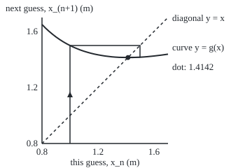
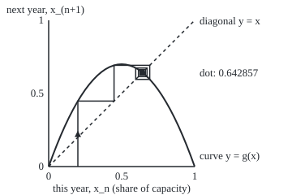

# Iteration: apply one rule over and over, and the cobweb staircase shows where it goes

[Syllabus](../../../SYLLABUS.md) → [Differential equations and dynamics](../README.md) → [Discrete Dynamics and Chaos](../README.md#s11) → Iteration

---

## General Overview

A square patio must cover 2 square metres. How long is each side? Guess 1 m: too short, since it covers 1 square metre. Area over guess is 2 m: too long. The true side lies between, so average them: 1.5 m.

Do the same to 1.5: area over guess is 4/3 m, and the average is 17/12, about 1.4167 m. Then 577/408. The fourth round gives 1.4142135624, correct to ten decimals: the square root of 2. This is the Babylonian square-root rule.

A fish stock, measured each spring as a share of what its lake can hold, runs on the same engine: many fish breed more, but crowding starves them. From 0.2 of capacity the stock goes 0.448, 0.692429, 0.596319, 0.674023, overshooting and undershooting, closing in on 0.642857.

Feeding a rule its own output is **iteration**; the list of values is the **orbit**. A **cobweb plot**, named for the web-like path it traces, shows at a glance whether the orbit settles, swings or wanders.

**Iteration applies one rule to its own output again and again; the cobweb draws each step as one move up or down to the rule's curve and one move across to the diagonal line, so the shape of the path shows where the orbit goes.**

**What kind of fact this is:** a method (a way to compute and draw an orbit), with one theorem behind it, that a settling orbit of a continuous rule settles on a point the rule leaves unchanged, proved on this card in Why it works.

### The picture: the square-root rule's staircase

<p align="center"></p>

Across: the current guess $x_n$; up: the next, $g(x_n)$, where $g$ is the rule (see The formula). Scale: 200 units per metre on both axes, from 0.8 m. From the guess 1 m the path rises to the curve at 1.5, crosses to the diagonal, drops to 1.4167 and closes on the dot at 1.4142, where curve meets diagonal.

---

## The formula

Notation first, in words. A rule turning one number into the next is a **map**, written $g$. The value after $n$ steps is $x_n$, read "x sub n"; the start is $x_0$. One step is

$$x_{n+1} = g(x_n)$$

**Read it aloud:** the next value is the rule applied to the current value.

The orbit:

$$x_0,\quad x_1 = g(x_0),\quad x_2 = g(g(x_0)),\quad \dots,\quad x_n = g^n(x_0)$$

Here $g^n$ means $g$ applied n times in a row, its n-fold [Composing functions](../../01-Foundations/08-Relations%20and%20Functions/03-composition.md), not a power.

The card's two rules:

$$g(x) = \frac{1}{2}\left(x + \frac{2}{x}\right) \qquad\text{and}\qquad g(x) = r\,x\,(1 - x)$$

The first is the square-root rule. The second is the **logistic map**: $x$ is the stock as a share of capacity, the factor $1 - x$ is the room left, and $r$ sets how hard the stock grows; here $r$ = 2.8.

A value the rule leaves unchanged, $g(x^*) = x^*$, is a **fixed point**: a resting level.

| Symbol | Plain meaning | In our example | Push it up and the answer… |
| --- | --- | --- | --- |
| $g$ | the rule: this value in, next value out | the two rules above | — |
| $x_n$ | the value after n steps | 1.4142156863 m at n = 3 | the next value moves with it |
| $x_0$ | the starting value | 1 m; 0.2 of capacity | a different path, often the same end |
| $n$ | the step count | 0 to 4; 0 to 200 years | closer to the end, if it settles |
| $g^n$ | the rule applied n times in a row | $g^4(1)$ = 1.4142135624 | — |
| $x^*$ | a fixed point: $g(x^*) = x^*$ | 1.4142135624; 0.642857 | — |
| $r$ | the logistic growth factor per year | 2.8 | settles, then swings, then wanders |
| $y$ | the cobweb's vertical axis: the next value | $y = x$ is the diagonal | — |

### When it holds

- **The rule sees only the current value.** A rule that changes each step has no single curve to draw.
- **The orbit stays where the rule is defined.** The square-root rule breaks at 0; the logistic map with $r$ above 4 throws the stock below zero.
- **One number describes the state.** Two or more numbers need orbits drawn in space, as in [The Lorenz system](06-the-lorenz-system-and-strange-attractors.md).
- **A continuous rule, for the limit theorem.** A rule with a jump can have an orbit that settles on a value the rule moves.

---

## Why it works

### Step 0: the diagonal turns an output into the next input

Plot the rule as a curve: this value across, next value up. Reading the curve gives one step, but the next step needs that output back on the horizontal axis. The diagonal, the line $y = x$, does it: moving across from the curve to the diagonal keeps the height and makes it the new horizontal position. One step is one move to the curve and one to the diagonal.

### Step 1: drawing the cobweb

1. Mark the start $x_0$ on the horizontal axis.
2. Move vertically to the curve: the height is $x_1 = g(x_0)$.
3. Move horizontally to the diagonal, reaching $(x_1, x_1)$: the output is now the input.
4. Repeat from step 2.

For the square-root rule from 1: up to 1.5, across, down to 17/12, across, down to 577/408, as drawn above. Where the curve crosses the diagonal, $g(x) = x$: a fixed point. A cobweb can stop only at such a crossing.

### Step 2: reading the four shapes

The fish stock at $r$ = 2.8 draws a different shape.

<p align="center"></p>

Scale: 180 units per unit of capacity on both axes. The path rises from 0.2 to 0.448, then boxes in on the dot at 0.642857 from alternate sides.

- **A staircase**: the orbit approaches from one side, where the curve rises gently through the crossing.
- **A spiral**: the orbit overshoots and undershoots by less each time, where the curve falls gently through the crossing. Here the side of 0.642857 reads --+-+-+-+ for steps 0 to 8 (− below, + above).
- **A closed box**: a swing that never settles. At $r$ = 3.2 the stock alternates 0.513045 and 0.799455: boom year, bust year.
- **A tangle**: wandering. At $r$ = 3.9 the stock in years 50 to 53 is 0.368628, 0.907692, 0.326771, 0.857968, with no repeat in sight; 1000 later years land on 911 different values to four decimals.

Why the spiral alternates: near the crossing the curve is almost a straight line of slope s, so the distance from $x^*$ is multiplied by s each step, and a negative s flips the side. At the fish stock's resting level s = 2 − r = −0.8, and the check measures the distance multiplied by −0.800000 each year. Which slopes attract an orbit is [Fixed points of a map](02-fixed-points-of-a-map.md).

On a phase line ([Slope fields and the phase line](../01-Rate%20Equations/02-slope-fields-and-the-phase-line.md)) a solution never passes a resting level. A map jumps, so it can leap over one: hence the spiral, the box and the tangle.

### Step 3: a settling orbit settles on a fixed point

Suppose the orbit of a continuous rule settles on a number $x^*$. The orbit one step later, $x_1, x_2, x_3, \dots$, settles on $x^*$ too. But that list is $g(x_0), g(x_1), g(x_2), \dots$, and continuity says it settles on $g(x^*)$. One list cannot settle on two numbers, so $g(x^*) = x^*$.

<details>
<summary>Detailed proof</summary>

Let the orbit converge to $x^*$, with $g$ continuous there. Take any tolerance ε > 0. Continuity gives δ > 0 with $\lvert g(u) - g(x^*)\rvert < ε$ whenever $\lvert u - x^*\rvert < δ$. Convergence gives an N with $\lvert x_n - x^*\rvert < \min(δ, ε)$ for all n ≥ N. Then $\lvert x_{n+1} - g(x^*)\rvert < ε$ and $\lvert x_{n+1} - x^*\rvert < ε$, so $\lvert g(x^*) - x^*\rvert < 2ε$ for every ε, and $g(x^*) = x^*$.

</details>

So the ends come from algebra. The square-root rule: $x = \tfrac12(x + 2/x)$ means $x^2 = 2$. The logistic map: $x = r x(1 - x)$ means $x = 0$ or $x^* = 1 - 1/r$ = 0.642857.

### Step 4: why the square-root rule is so fast

Subtract $\sqrt2$ from the rule and put everything over $2x_n$:

$$x_{n+1} - \sqrt2 = \frac{x_n^2 - 2\sqrt2\,x_n + 2}{2x_n} = \frac{(x_n - \sqrt2)^2}{2x_n}$$

The new error is the old one squared, over twice the guess: 0.00245 after step 2 becomes 0.00000212 after step 3, as the check confirms. The curve is flat where it meets the diagonal, so the staircase collapses at once. This is Newton's method for $x^2 = 2$.

A second road needs no decimals: a guess p/q goes to $(p^2 + 2q^2)/(2pq)$. From 1/1 that gives 3/2, 17/12, 577/408 and 665857/470832, which the check compares with the decimal orbit.

---

## Worked numbers, by hand

| Step | Arithmetic | Value |
| --- | --- | --- |
| square root, step 1 | (1 + 2/1) / 2 | 1.5 |
| step 2 | (1.5 + 2/1.5) / 2 = (3/2 + 4/3) / 2 | 17/12 = 1.4166666667 |
| step 3 | (17/12 + 24/17) / 2 | 577/408 = 1.4142156863 |
| step 4 | the same, once more | 665857/470832 = **1.4142135624** |
| fish, year 1 | 2.8 × 0.2 × 0.8 | 0.448 |
| year 2 | 2.8 × 0.448 × (1 − 0.448) | 0.692429 |
| year 3 | 2.8 × 0.692429 × (1 − 0.692429) | 0.596319 |
| resting level | 1 − 1/2.8 | **0.642857** |

Four averages give a patio side of 1.4142135624 m; the fish stock settles at 0.642857 of capacity after swinging round it.

### What breaks if you drop a piece

| Mistake | Comes out at | What went wrong |
| --- | --- | --- |
| Solving $g(x) = 0$ for the resting level | 0.000000 and 1.000000 | Rest means $g(x) = x$ |
| 2/x without averaging | 1.0, 2.0, 1.0, 2.0, 1.0 | Same fixed point, but the orbit boxes round it |
| $g^2(0.2)$ as $g(0.2)$ squared | 0.200704, not 0.692429 | $g^2$ means apply twice |
| Square-root rule from −1 | −1.4142135624 | It finds the negative fixed point |

The code prints all four.

---

## Code, from first principles, and it actually runs

Nothing is imported. Road one feeds each rule its own output. Road two avoids that loop: the square root by exact fractions and by bisection (halving an interval that brackets the root), the resting level by Step 3's algebra, the spiral's shrink factor by the curve's slope. Four asserts compare the roads.

### Python

```python
# Iteration and cobweb plots -- the check behind the card.  Nothing is imported.
# Road one feeds each rule its own output, step by step.  Road two reaches each
# end point without that loop: exact fractions and bisection for the square
# root, algebra for the fish stock's resting level, a slope for the spiral.
def orbit(g, x0, n):                     # x0, g(x0), g(g(x0)), ... n steps in all
    xs = [x0]
    for _ in range(n):
        xs.append(g(xs[-1]))
    return xs

def bisect(f, lo, hi):                   # a root of f between lo and hi, 60 halvings
    for _ in range(60):
        mid = (lo + hi) / 2
        lo, hi = (mid, hi) if f(lo) * f(mid) > 0 else (lo, mid)
    return (lo + hi) / 2

def show(xs, d=6):
    return ", ".join(f"{x:.{d}f}" for x in xs)

sq = lambda x: (x + 2 / x) / 2                                  # the square-root rule
fish = lambda r: (lambda x: r * x * (1 - x))                    # the logistic rule
b = orbit(sq, 1.0, 4)
p, q, fracs = 1, 1, []                                          # exact: p/q -> (p*p + 2q*q)/(2pq)
for _ in range(4):
    p, q = p * p + 2 * q * q, 2 * p * q
    fracs.append(f"{p}/{q}")
root = bisect(lambda x: x * x - 2, 1.0, 2.0)
err = [x - root for x in b]
g = fish(2.8)
f = orbit(g, 0.2, 200)
star = 1 - 1 / 2.8                                              # g(x) = x, solved by hand
ratio = (f[81] - star) / (f[80] - star)
slope = (g(star + 1e-6) - g(star - 1e-6)) / 2e-6
c = orbit(fish(3.2), 0.2, 203)
w = orbit(fish(3.9), 0.2, 1999)
bins = len({int(x * 10000) for x in w[1000:]})
print(f"square-root rule from 1 m, x0..x4: {show(b, 10)}")
print(f"the same orbit as exact fractions: {', '.join(fracs)}")
print(f"sqrt(2) by bisection, no use of the rule: {root:.10f}")
print(f"error after steps 1 to 4: {', '.join(f'{e:.2e}' for e in err[1:])}")
print(f"error after step 3 predicted by (error after step 2)^2 / (2 x2): {err[2] ** 2 / (2 * b[2]):.2e}")
print(f"logistic r = 2.8 from 0.2, x0..x8: {show(f[:9])}")
print(f"x200 = {f[200]:.6f}; resting level by algebra, 1 - 1/r = {star:.6f}")
print(f"side of the resting level at steps 0..8: {''.join('+' if x > star else '-' for x in f[:9])}")
print(f"error ratio at step 80: {ratio:.6f}; slope of the curve at the resting level: {slope:.6f}")
print(f"logistic r = 3.2, x200..x203: {show(c[200:])}")
print(f"logistic r = 3.9, x50..x55: {show(w[50:56])}")
print(f"r = 3.9, distinct values to 4 decimals among x1000..x1999: {bins}")
print(f"mistake 1, solving g(x) = 0 at r = 2.8: {abs(bisect(g, -0.5, 0.5)):.6f} and {bisect(g, 0.5, 1.5):.6f}")
print(f"mistake 2, the rule 2/x from 1, x0..x4: {show(orbit(lambda x: 2 / x, 1.0, 4), 1)}")
print(f"mistake 3, g(0.2) squared = {g(0.2) ** 2:.6f}; g(g(0.2)) = {g(g(0.2)):.6f}")
print(f"mistake 4, square-root rule from -1, x4 = {orbit(sq, -1.0, 4)[4]:.10f}")
print(f"figure, square-root cobweb x0..x3 at x px: {show([60 + 200 * (x - 0.8) for x in b[:4]], 1)}")
print(f"figure, logistic cobweb x0..x8 at x px: {show([60 + 180 * x for x in f[:9]], 1)}")
assert abs(b[4] - root) < 1e-11                                 # iteration against bisection
assert abs(b[4] - p / q) < 1e-15                                # iteration against exact fractions
assert abs(f[200] - star) < 1e-12                               # iteration against algebra
assert abs(ratio - slope) < 1e-5                                # spiral rate against the slope
print("ALL CHECKS PASS")
```

**Ran 2026-09-28 on macOS, Python 3.14.6, standard library only. All checks passed. Output, pasted from the run:**

```
square-root rule from 1 m, x0..x4: 1.0000000000, 1.5000000000, 1.4166666667, 1.4142156863, 1.4142135624
the same orbit as exact fractions: 3/2, 17/12, 577/408, 665857/470832
sqrt(2) by bisection, no use of the rule: 1.4142135624
error after steps 1 to 4: 8.58e-02, 2.45e-03, 2.12e-06, 1.59e-12
error after step 3 predicted by (error after step 2)^2 / (2 x2): 2.12e-06
logistic r = 2.8 from 0.2, x0..x8: 0.200000, 0.448000, 0.692429, 0.596319, 0.674023, 0.615205, 0.662838, 0.625754, 0.655720
x200 = 0.642857; resting level by algebra, 1 - 1/r = 0.642857
side of the resting level at steps 0..8: --+-+-+-+
error ratio at step 80: -0.800000; slope of the curve at the resting level: -0.800000
logistic r = 3.2, x200..x203: 0.799455, 0.513045, 0.799455, 0.513045
logistic r = 3.9, x50..x55: 0.368628, 0.907692, 0.326771, 0.857968, 0.475251, 0.972611
r = 3.9, distinct values to 4 decimals among x1000..x1999: 911
mistake 1, solving g(x) = 0 at r = 2.8: 0.000000 and 1.000000
mistake 2, the rule 2/x from 1, x0..x4: 1.0, 2.0, 1.0, 2.0, 1.0
mistake 3, g(0.2) squared = 0.200704; g(g(0.2)) = 0.692429
mistake 4, square-root rule from -1, x4 = -1.4142135624
figure, square-root cobweb x0..x3 at x px: 100.0, 200.0, 183.3, 182.8
figure, logistic cobweb x0..x8 at x px: 96.0, 140.6, 184.6, 167.3, 181.3, 170.7, 179.3, 172.6, 178.0
ALL CHECKS PASS
```

### Rust

Same numbers, same labels, built with `rustc --edition 2021 -O`.

```rust
// Iteration and cobweb plots -- the same check as the Python, in Rust.  No
// crates.  Road one feeds each rule its own output, step by step.  Road two
// reaches each end point without that loop: exact fractions and bisection for
// the square root, algebra for the fish stock's resting level, a slope for the spiral.
fn orbit(g: &dyn Fn(f64) -> f64, x0: f64, n: usize) -> Vec<f64> {
    let mut xs = vec![x0];                 // x0, g(x0), g(g(x0)), ... n steps in all
    for _ in 0..n { let last = xs[xs.len() - 1]; xs.push(g(last)) }
    xs
}

fn bisect(f: &dyn Fn(f64) -> f64, mut lo: f64, mut hi: f64) -> f64 {
    for _ in 0..60 {                       // a root of f between lo and hi, 60 halvings
        let mid = (lo + hi) / 2.0;
        if f(lo) * f(mid) > 0.0 { lo = mid } else { hi = mid }
    }
    (lo + hi) / 2.0
}

fn show(xs: &[f64], d: usize) -> String {
    xs.iter().map(|x| format!("{:.*}", d, x)).collect::<Vec<_>>().join(", ")
}

fn sci(x: f64) -> String {                 // 8.58e-02, as Python prints it
    let s = format!("{:.2e}", x);
    let (m, e) = s.split_once('e').unwrap();
    let e: i32 = e.parse().unwrap();
    format!("{}e{}{:02}", m, if e < 0 { "-" } else { "+" }, e.abs())
}

fn fish(r: f64) -> impl Fn(f64) -> f64 { move |x| r * x * (1.0 - x) }

fn main() {
    let sq = |x: f64| (x + 2.0 / x) / 2.0;                     // the square-root rule
    let b = orbit(&sq, 1.0, 4);
    let (mut p, mut q, mut fracs): (u64, u64, Vec<String>) = (1, 1, vec![]);
    for _ in 0..4 {                        // exact: p/q -> (p*p + 2q*q)/(2pq)
        (p, q) = (p * p + 2 * q * q, 2 * p * q);
        fracs.push(format!("{}/{}", p, q));
    }
    let root = bisect(&|x: f64| x * x - 2.0, 1.0, 2.0);
    let err: Vec<f64> = b.iter().map(|x| x - root).collect();
    let g = fish(2.8);
    let f = orbit(&g, 0.2, 200);
    let star = 1.0 - 1.0 / 2.8;                                // g(x) = x, solved by hand
    let ratio = (f[81] - star) / (f[80] - star);
    let slope = (g(star + 1e-6) - g(star - 1e-6)) / 2e-6;
    let c = orbit(&fish(3.2), 0.2, 203);
    let w = orbit(&fish(3.9), 0.2, 1999);
    let mut seen: Vec<i64> = w[1000..].iter().map(|x| (x * 10000.0) as i64).collect();
    seen.sort();
    seen.dedup();
    let signs: String = f[..9].iter().map(|&x| if x > star { '+' } else { '-' }).collect();
    let bx: Vec<f64> = b[..4].iter().map(|x| 60.0 + 200.0 * (x - 0.8)).collect();
    let fx: Vec<f64> = f[..9].iter().map(|x| 60.0 + 180.0 * x).collect();
    println!("square-root rule from 1 m, x0..x4: {}", show(&b, 10));
    println!("the same orbit as exact fractions: {}", fracs.join(", "));
    println!("sqrt(2) by bisection, no use of the rule: {:.10}", root);
    println!("error after steps 1 to 4: {}", err[1..].iter().map(|&e| sci(e)).collect::<Vec<_>>().join(", "));
    println!("error after step 3 predicted by (error after step 2)^2 / (2 x2): {}", sci(err[2] * err[2] / (2.0 * b[2])));
    println!("logistic r = 2.8 from 0.2, x0..x8: {}", show(&f[..9], 6));
    println!("x200 = {:.6}; resting level by algebra, 1 - 1/r = {:.6}", f[200], star);
    println!("side of the resting level at steps 0..8: {}", signs);
    println!("error ratio at step 80: {:.6}; slope of the curve at the resting level: {:.6}", ratio, slope);
    println!("logistic r = 3.2, x200..x203: {}", show(&c[200..], 6));
    println!("logistic r = 3.9, x50..x55: {}", show(&w[50..56], 6));
    println!("r = 3.9, distinct values to 4 decimals among x1000..x1999: {}", seen.len());
    println!("mistake 1, solving g(x) = 0 at r = 2.8: {:.6} and {:.6}", bisect(&g, -0.5, 0.5).abs(), bisect(&g, 0.5, 1.5));
    println!("mistake 2, the rule 2/x from 1, x0..x4: {}", show(&orbit(&|x: f64| 2.0 / x, 1.0, 4), 1));
    println!("mistake 3, g(0.2) squared = {:.6}; g(g(0.2)) = {:.6}", g(0.2) * g(0.2), g(g(0.2)));
    println!("mistake 4, square-root rule from -1, x4 = {:.10}", orbit(&sq, -1.0, 4)[4]);
    println!("figure, square-root cobweb x0..x3 at x px: {}", show(&bx, 1));
    println!("figure, logistic cobweb x0..x8 at x px: {}", show(&fx, 1));
    assert!((b[4] - root).abs() < 1e-11);                      // iteration against bisection
    assert!((b[4] - p as f64 / q as f64).abs() < 1e-15);       // iteration against exact fractions
    assert!((f[200] - star).abs() < 1e-12);                    // iteration against algebra
    assert!((ratio - slope).abs() < 1e-5);                     // spiral rate against the slope
    println!("ALL CHECKS PASS");
}
```

**Ran 2026-09-28 on macOS, rustc 1.98.1, no crates. All checks passed. Output, pasted from the run:**

```
square-root rule from 1 m, x0..x4: 1.0000000000, 1.5000000000, 1.4166666667, 1.4142156863, 1.4142135624
the same orbit as exact fractions: 3/2, 17/12, 577/408, 665857/470832
sqrt(2) by bisection, no use of the rule: 1.4142135624
error after steps 1 to 4: 8.58e-02, 2.45e-03, 2.12e-06, 1.59e-12
error after step 3 predicted by (error after step 2)^2 / (2 x2): 2.12e-06
logistic r = 2.8 from 0.2, x0..x8: 0.200000, 0.448000, 0.692429, 0.596319, 0.674023, 0.615205, 0.662838, 0.625754, 0.655720
x200 = 0.642857; resting level by algebra, 1 - 1/r = 0.642857
side of the resting level at steps 0..8: --+-+-+-+
error ratio at step 80: -0.800000; slope of the curve at the resting level: -0.800000
logistic r = 3.2, x200..x203: 0.799455, 0.513045, 0.799455, 0.513045
logistic r = 3.9, x50..x55: 0.368628, 0.907692, 0.326771, 0.857968, 0.475251, 0.972611
r = 3.9, distinct values to 4 decimals among x1000..x1999: 911
mistake 1, solving g(x) = 0 at r = 2.8: 0.000000 and 1.000000
mistake 2, the rule 2/x from 1, x0..x4: 1.0, 2.0, 1.0, 2.0, 1.0
mistake 3, g(0.2) squared = 0.200704; g(g(0.2)) = 0.692429
mistake 4, square-root rule from -1, x4 = -1.4142135624
figure, square-root cobweb x0..x3 at x px: 100.0, 200.0, 183.3, 182.8
figure, logistic cobweb x0..x8 at x px: 96.0, 140.6, 184.6, 167.3, 181.3, 170.7, 179.3, 172.6, 178.0
ALL CHECKS PASS
```

The two outputs match line for line.

> [!TIP]
> **Try changing**
> Guess first, then run it.
> - **A gentler lake.** Change the 2.8 in `fish(2.8)` and in `star` to 1.2. The side line reads all plus and the ratio loses its minus sign: a staircase. Every assert passes.
> - **A harder-growing lake.** Change both to 3.2. The orbit boxes round two values; the third assert stops the run.
> - **A wild first guess.** Start the square-root rule at 1000. Each step about halves the guess; the first assert stops the run.

---

## The usual mistake

> [!warning]
> **Looking for the answer where the curve meets the horizontal axis.** An orbit rests where the curve meets the diagonal, $g(x) = x$. For the fish stock $g(x) = 0$ gives 0.000000 and 1.000000, an empty lake and a full one; the stock settles at 0.642857.
>
> - **Composition read as a power.** $g^2(0.2)$ is 0.692429, the stock after two years; squaring one year's value gives 0.200704.
> - **A fixed point taken as a destination.** 2/x from 1 gives 1.0, 2.0, 1.0, 2.0: its fixed point is the root, and the orbit never reaches it.
> - **A few steps taken as the long run.** At $r$ = 3.9 nothing settles; 911 different values in 1000 years is wandering, not slow convergence.
> - **A picture as proof.** The cobweb shows; Step 3 and the checks prove.

---

## Where you meet it in real life

- **Square roots in software.** Libraries refine roots with Newton rules like this one; each step squares the error.
- **Yearly generations.** Species breeding once a year are modelled by maps. Robert May's 1976 paper showed the logistic map settling, swinging and wandering as $r$ grows; [The logistic map](03-the-logistic-map-and-period-doubling.md) follows it.
- **Stepping a differential equation.** Euler's rule, next value = current value + step × rate, is a map ([Euler's method](../05-Numerical%20Evolution/01-eulers-method.md)).
- **Forecasting limits.** A wandering orbit forgets its start; [The Lyapunov exponent](04-chaos-and-the-lyapunov-exponent.md) measures how fast.

> **Say it back**
> Iteration feeds a rule its own output; the values form the orbit. The cobweb draws each step as a move to the curve, then to the diagonal, which makes the output the next input. A staircase settles from one side, a spiral by overshooting, a box swings for ever, a tangle wanders. A continuous rule's settling orbit settles where curve meets diagonal. The square-root rule from 1 reaches 1.4142135624 in four steps; the fish stock at r = 2.8 spirals into 0.642857.

---

## What this builds on

- [Slope fields and the phase line](../01-Rate%20Equations/02-slope-fields-and-the-phase-line.md): resting levels for continuous change, the picture a map breaks by jumping.
- [Composing functions](../../01-Foundations/08-Relations%20and%20Functions/03-composition.md): one function applied to another's output, all that $g^n$ means.

## Where this goes next

- [Fixed points of a map](02-fixed-points-of-a-map.md): the slope test that says which resting levels attract an orbit and which repel it.
- [Dynamic programming](../12-Calculus%20of%20Variations%20and%20Optimal%20Control/07-dynamic-programming-and-the-bellman-equation.md): a value table iterated until it stops changing.
- Collatz: a one-line whole-number rule whose orbits no one can yet predict.

---

## Sources

Verified 2026-09-28: every link below resolves to the publisher's page.

- Strogatz, Steven H. *Nonlinear Dynamics and Chaos*, 3rd ed. Chapman & Hall/CRC, 2024. [Publisher page](https://www.routledge.com/Nonlinear-Dynamics-and-Chaos-With-Applications-to-Physics-Biology-Chemistry-and-Engineering/Strogatz/p/book/9780367026509). Chapter 10, One-Dimensional Maps: 10.1 Fixed Points and Cobwebs, then the logistic map.
- Alligood, Kathleen T., Tim D. Sauer and James A. Yorke. *Chaos: An Introduction to Dynamical Systems*. Springer, 1996. [Publisher page](https://doi.org/10.1007/b97589). Chapter 1: orbits, cobweb plots, fixed points.
- May, Robert M. "Simple mathematical models with very complicated dynamics." *Nature* 261, 459–467 (1976). [DOI](https://doi.org/10.1038/261459a0). The logistic map as a population model.
