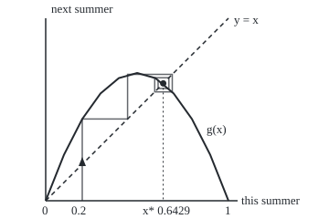
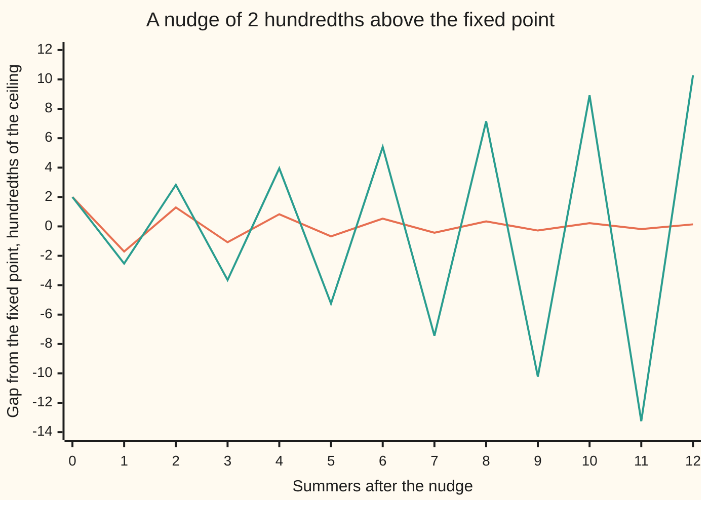

# Fixed points of a map: a slope smaller than one in size pulls nearby points in, larger pushes them away

[Syllabus](../../../SYLLABUS.md) → [Differential equations and dynamics](../README.md) → [Discrete Dynamics and Chaos](../README.md#s11) → Fixed points of a map

---

## General Overview

An island's moths breed once a year. Each summer they are counted as a fraction of the most the island can feed: 0.2 is a fifth of that ceiling. Next summer's fraction depends only on this summer's. Breeding pushes it up; crowding pulls it down.

With a breeding factor of 2.8, a population of 0.2 becomes 0.448, then 0.6924, then 0.5963, swinging round a level and closing in. At 0.642857 the swing stops: that population exactly replaces itself. At a breeding factor of 3.2 the matching level, 0.6875, still exists, but a nudge of 2 hundredths grows to 2.53 hundredths, then 2.83, and the moths end up alternating between 0.513045 and 0.799455.

A value the rule sends to itself is a **fixed point**, the term used from here on. One number decides whether it holds its neighbours: the rule's slope there.

**Near a fixed point a map acts like multiplying the gap by its slope there, so a slope smaller than 1 in size shrinks every nearby gap to nothing and a slope larger than 1 in size makes it grow.**

**What kind of fact this is:** a theorem, proved on this card in Why it works; the fixed point itself is a definition.

### The picture: six summers at breeding factor 2.8

<p align="center"></p>

To scale: 200 px is the island's ceiling on both axes, so a population v sits at 50 + 200v across and 220 − 200v down. The hump is the rule at 2.8, the dashed line is "next equals this", and the staircase from 0.2 winds in to the dot, the fixed point, where they cross.

---

## The formula

A map is written $x_{n+1} = g(x_n)$: next summer's population is the rule $g$ applied to this summer's ([Iteration](01-iteration-and-cobweb-plots.md)). The moth rule is the logistic map:

$$g(x) = r\,x\,(1 - x)$$

A fixed point $x^*$ solves $g(x^*) = x^*$. The test for it:

$$|g'(x^*)|<1 \;\Rightarrow\; \text{attracting}, \qquad |g'(x^*)|>1 \;\Rightarrow\; \text{repelling}$$

**Read it aloud:** a slope at the fixed point smaller than 1 in size draws nearby populations in; larger than 1 pushes them away.

For the moths:

$$x^* = 0 \text{ with slope } r, \qquad x^* = 1 - \frac{1}{r} \text{ with slope } 2 - r$$

So the living fixed point attracts for $r$ between 1 and 3. At 2.8 its slope is −0.8; at 3.2, −1.2.

| Symbol | Plain meaning | In our example | Push it up and the answer… |
| --- | --- | --- | --- |
| $x_n$, $x_0$, $n$ | population in summer $n$, as a fraction of the ceiling | $x_0$ = 0.2 | — |
| $g$, $N$ | a map, one value to the next; $N$ is Newton's | $g(0.2)$ = 0.448 | — |
| $r$ | breeding factor, growth per summer without crowding | 2.8, 3.2 | fixed point rises, slope falls |
| $x^*$ | fixed point: sent to itself | 0.642857 | — |
| $g'(x^*)$ | slope of the map at the fixed point | −0.8 | past 1 in size, lets go |
| $e_n$, $e$ | the gap $x_n-x^*$ | 0.02 | — |
| $L$, $K$, $\delta$, $c$ | slope bound below 1 on a window of half-width $\delta$; $K$ a floor above 1; $c$ a point inside | $L$ = 0.912, $\delta$ = 0.02 | at 1 the proof fails |
| $F$, $h$, $t$ | rate law $x'=F(x)$ in time $t$; step $h$ in years | $h$ = 1.8 | past 2, lets go |

### When it holds

- **The slope exists and changes smoothly near $x^*$.** At a corner there is no single slope and the test says nothing.
- **The start is close enough.** The theorem is local: at 2.8 the proof covers ±0.02.
- **The slope is not exactly 1 in size.** At $r$ = 3 the slope is −1 and the test is silent: the gap creeps from 0.007330 after 1000 summers to 0.003700 after 4000.
- **The state is one number.** For several, every eigenvalue of the Jacobian matrix of partial slopes must be smaller than 1 in size.

---

## Why it works

### Step 0: near a fixed point the map is a multiplication

Zoom in on the fixed point and the hump looks straight. A straight rule through $x^*$ with slope $g'(x^*)$ sends a gap $e$ to $g'(x^*)\,e$, so every summer multiplies the gap by the same number. The rest makes "looks straight" honest.

### Step 1: find the fixed points

Solve $r x (1 - x) = x$, that is $x\,(r - 1 - r x) = 0$. Either no moths, or $x = 1 - 1/r$: at 2.8, 0.642857. Pressing the map 200 times from 0.2 lands there to twelve decimals.

### Step 2: the slope at each

The slope of $g$ is $g'(x) = r\,(1 - 2x)$. At 0 it is $r$ = 2.8: a few moths multiply, so an empty island repels. At $1 - 1/r$ it is $r\,(1 - 2 + 2/r) = 2 - r$ = −0.8.

### Step 3: the contraction argument

The slope changes smoothly, so on some window round $x^*$ its size stays below a bound $L$ under 1. At 2.8, on ±0.02, $L$ = 0.8 + 2 × 2.8 × 0.02 = 0.912. The mean value theorem (a chord of a smooth curve has the curve's slope somewhere between its ends) makes the new gap the old gap times a slope from inside the window:

$$|e_{n+1}| \le L\,|e_n|$$

The population stays in the window, and after $n$ summers the gap is at most $L^n$ times the first: it goes to 0. A map shrinking distances by a fixed factor below 1 is a **contraction** ([Fixed points](../../06-Calculus%20and%20analysis/03-What%20Derivatives%20Tell%20You/07-fixed-point-iteration-and-the-contraction-principle.md)), here used only near the point. The check scans the window: nothing lands farther than 0.017120 from $x^*$.

With slope size above 1 the argument runs backwards: gaps grow by a fixed factor, so the population leaves. At 3.2: 2 hundredths, 2.53, 2.83.

<details>
<summary>Detailed proof</summary>

Let $g'$ be continuous near $x^*$ with $|g'(x^*)|<1$. Choose $L$ with $|g'(x^*)|<L<1$. By continuity there is $\delta>0$ with $|g'(c)|\le L$ whenever $|c-x^*|\le\delta$.

Take $|x_0-x^*|\le\delta$. The mean value theorem gives $c$ between $x_0$ and $x^*$ with $g(x_0)-g(x^*)=g'(c)(x_0-x^*)$. Since $g(x^*)=x^*$, this says $|x_1-x^*|\le L|x_0-x^*|\le\delta$. By induction $|x_n-x^*|\le L^n\delta$, which tends to 0.

If instead $|g'(x^*)|>1$, choose $K$ with $1<K<|g'(x^*)|$ and $\delta$ with $|g'(c)|\ge K$ on the window. While $x_n$ stays there and differs from $x^*$, $|x_{n+1}-x^*|\ge K|x_n-x^*|$, so the gap is at least $K^n$ times the first and passes $\delta$: the orbit leaves unless it lands exactly on $x^*$.

</details>

### Step 4: the sign of the slope sets the style

A positive slope keeps the gap's sign, so the population creeps in from one side. A negative slope flips it each summer, and the cobweb spirals. At 2.8 the gaps in hundredths run 2.00, −1.71, 1.29, −1.08.

### Step 5: continuous time asks for a sign, a map asks for a size

For a differential equation $x' = F(x)$ (the rate of $x$ at time $t$ is $F$ of $x$), an equilibrium is stable when $F$'s slope there is negative, of any size. Take $F(x) = x\,(1 - x)$, rate constant 1 per year: the full island, 1, has slope −1 per year, so it is stable.

Step it $h$ years at a time with Euler's rule (follow the current rate for one whole step): the map $x + h\,F(x)$, slope $1 - h$ at 1. Steps of 1.8 years give −0.8 and land on 1.000000. Steps of 2.2 years give −1.2 and alternate between 0.746247 and 1.162844 for ever. The equation did not change; the step outran it. Rescaled by $h/(1 + h)$, this is the moth map with $r = 1 + h$: the check finds the 2.2-year cycle equal to the 3.2 cycle times 3.2/2.2.

### Step 6: Newton's method is a map with slope 0

Newton's method ([Newton's method](../../06-Calculus%20and%20analysis/03-What%20Derivatives%20Tell%20You/06-newtons-method.md)) replaces a guess by the guess minus the equation's value over its slope. For $x^2 = 2$ that is the map

$$N(x) = \frac{x}{2} + \frac{1}{x}$$

Its fixed point is the square root of 2, where its slope is $\tfrac12 - 1/x^2 = 0$. Slope 0 kills the gap to first order, leaving a fixed multiple of its square: errors 0.085786438, 0.002453104, 0.000002124, Newton's doubling of digits. In general the Newton map's slope is the equation's value times its second slope over its first slope squared, and the value is 0 at a root. Newton even reaches the repelling point: on $g(x) - x = 0$ at 3.2 from 0.9 it lands on 0.6875 in 6 steps.

---

## Worked numbers, by hand

| Step | Arithmetic | Value |
| --- | --- | --- |
| fixed point at 2.8 | 1 − 1/2.8 | 0.642857 |
| its slope | 2 − 2.8 | −0.8 |
| a gap of 0.02, one summer on | −0.8 × 0.02 − 2.8 × 0.0004 | −0.01712: −1.71 hundredths |
| fixed point at 3.2 | 1 − 1/3.2 | 0.6875 |
| its slope | 2 − 3.2 | **−1.2: lets go** |
| where the population ends | 1000 and 1001 summers from 0.2 | 0.513045 and 0.799455 |

The third row is the exact one-summer gap $g(x^*+e)-x^* = (2-r)e-re^2$: slope times gap, plus the hump's bend. At 2.8 the moths settle at 0.642857 of the ceiling; at 3.2 they boom and bust.



First line (orange): breeding factor 2.8, the gap flips and shrinks. Second (green): 3.2, it flips and grows.

### What breaks if you drop a piece

| Mistake | Comes out at | What went wrong |
| --- | --- | --- |
| Sign rule on a map, at 3.2 | slope −1.2 "negative, so stable"; moths alternate 0.513045, 0.799455 | a map needs size below 1, not a sign |
| Slope exactly 1 in size, at 3.0 | gap 0.007330 after 1000 summers, 0.003700 after 4000 | the test is silent |
| Slope read at the start 0.2 | 1.68, "repelling" | the test belongs to the fixed point |
| Newton at a double root, $(x - 1)^2 = 0$ | map $(x + 1)/2$, slope 0.5 | slope 0 needs a nonzero equation slope at the root |

The code prints all four.

---

## Code, from first principles, and it actually runs

Nothing is imported. Fixed points come from the formula $1 - 1/r$ and from pressing the map (2.8) or hand-written Newton (3.2). Slopes come from $2 - r$ and from measurement: a central difference (rise over a tiny step either side) and the gap ratio. The Euler cycle is checked against the rescaled moth cycle.

### Python

```python
# Fixed points of a map -- the check behind the card.  Standard library only.
# The map is the logistic rule g(x) = r x (1 - x): x is this summer's population
# as a fraction of what the habitat holds.  Every fixed point and slope is found
# twice: by formula, and by pressing the map, Newton's method or measurement.
def g(r, x): return r * x * (1 - x)

def press(r, x, n):                          # apply the map n times
    for _ in range(n): x = g(r, x)
    return x

def slope(f, x, h=1e-6): return (f(x + h) - f(x - h)) / (2 * h)

def newton_fixed(r, x):                      # Newton's method on G(x) = g(x) - x
    for k in range(1, 50):
        step = (g(r, x) - x) / (r * (1 - 2 * x) - 1)
        x -= step
        if abs(step) < 1e-15: return x, k
    return x, 50

def euler(h, n, x=0.2):                      # Euler steps of x' = x(1 - x), step h
    for _ in range(n): x += h * x * (1 - x)
    return x

def ratio(r): return (g(r, 1 - 1 / r + 1e-6) - (1 - 1 / r)) / 1e-6   # gap after / gap before
def gaps(r, n): return ", ".join(f"{(press(r, 1 - 1 / r + 0.02, k) - (1 - 1 / r)) * 100:.2f}" for k in range(n + 1))

fx28, it28 = 1 - 1 / 2.8, press(2.8, 0.2, 200)
m28, m32 = slope(lambda x: g(2.8, x), fx28), slope(lambda x: g(3.2, x), 0.6875)
win = [fx28 - 0.02 + 0.04 * i / 1000 for i in range(1001)]
L = max(abs(2.8 * (1 - 2 * x)) for x in win)
into = max(abs(g(2.8, x) - fx28) for x in win)
nw32, k32 = newton_fixed(3.2, 0.9)
a, b = sorted([press(3.2, 0.2, 1000), press(3.2, 0.2, 1001)])
cyc = sorted([euler(2.2, 1000), euler(2.2, 1001)])
cob, nx = [0.2], [1.0]
for _ in range(6): cob.append(g(2.8, cob[-1]))
for _ in range(4): nx.append(nx[-1] / 2 + 1 / nx[-1])
print(f"r = 2.8: fixed points 0 (slope r = 2.8) and 1 - 1/r = {fx28:.12f}")
print(f"r = 2.8: 200 presses of the map from x0 = 0.2 land on {it28:.12f}")
print(f"r = 2.8: slope 2 - r = {2 - 2.8:.6f}; measured by central difference {m28:.6f}; gap ratio {ratio(2.8):.6f}")
print(f"r = 2.8: window x* +/- 0.02: largest |slope| {L:.6f} (formula 0.8 + 2r(0.02) = {0.8 + 5.6 * 0.02:.6f}); largest |g(x) - x*| {into:.6f}")
print(f"r = 3.2: fixed point 1 - 1/r = {1 - 1 / 3.2:.12f}; Newton on g(x) - x from 0.9, {k32} steps: {nw32:.12f}")
print(f"r = 3.2: slope 2 - r = {2 - 3.2:.6f}; measured by central difference {m32:.6f}; gap ratio {ratio(3.2):.6f}")
print(f"r = 3.2: presses 1000 and 1001 from 0.2 alternate {a:.6f} and {b:.6f}, not 0.687500")
print(f"r = 3.0: slope -1; gap after 1000 presses from 0.2 {abs(press(3.0, 0.2, 1000) - 2 / 3):.6f}, after 4000 {abs(press(3.0, 0.2, 4000) - 2 / 3):.6f}")
print(f"chart, gap in hundredths, r = 2.8: {gaps(2.8, 12)}")
print(f"chart, gap in hundredths, r = 3.2: {gaps(3.2, 12)}")
print("figure, cobweb x0..x6 and x* at r = 2.8:", ", ".join(f"{v:.4f}" for v in cob + [fx28]), "| px 50 + 200x:", ", ".join(f"{50 + 200 * v:.1f}" for v in cob + [fx28]))
print("figure, curve y = g(x) at x = 0, 0.1, ..., 1, px 220 - 200y:", ", ".join(f"{220 - 200 * g(2.8, i / 10):.1f}" for i in range(11)))
print("Newton for x^2 = 2 from 1:", ", ".join(f"{v:.12f}" for v in nx[1:]))
print(f"Newton map x/2 + 1/x: slope at sqrt 2 measured {abs(slope(lambda t: t / 2 + 1 / t, 2 ** 0.5)):.6f}; errors",
      ", ".join(f"{abs(v - 2 ** 0.5):.9f}" for v in nx[1:4]))
print(f"Newton for (x - 1)^2 = 0: map (x + 1)/2, slope measured {slope(lambda t: t - (t - 1) / 2, 1.0):.6f}")
print(f"Euler steps of x' = x(1 - x): h = 1.8 lands on {euler(1.8, 200):.6f}; h = 2.2 alternates {cyc[0]:.6f}, {cyc[1]:.6f}")
print(f"mistake, slope read at x0 = 0.2 instead of x*: 2.8(1 - 0.4) = {2.8 * (1 - 0.4):.6f}")
assert abs(it28 - fx28) < 1e-12 and abs(nw32 - 0.6875) < 1e-12   # iteration and Newton find the formula's points
assert abs(ratio(2.8) - (2 - 2.8)) < 1e-4 and abs(m32 - (2 - 3.2)) < 1e-6   # measured slopes match 2 - r
assert L < 1 and abs(L - 0.912) < 1e-9 and into < 0.02 and abs(b - 0.6875) > 0.1   # window contracts at 2.8; 3.2 lets go
assert abs(cyc[0] - a * 3.2 / 2.2) + abs(cyc[1] - b * 3.2 / 2.2) < 1e-9 and abs(euler(1.8, 200) - 1) < 1e-9
print("ALL CHECKS PASS")
```

**Ran 2026-09-28 on macOS, Python 3.14.6, standard library only. All checks passed. Output, pasted from the run:**

```
r = 2.8: fixed points 0 (slope r = 2.8) and 1 - 1/r = 0.642857142857
r = 2.8: 200 presses of the map from x0 = 0.2 land on 0.642857142857
r = 2.8: slope 2 - r = -0.800000; measured by central difference -0.800000; gap ratio -0.800003
r = 2.8: window x* +/- 0.02: largest |slope| 0.912000 (formula 0.8 + 2r(0.02) = 0.912000); largest |g(x) - x*| 0.017120
r = 3.2: fixed point 1 - 1/r = 0.687500000000; Newton on g(x) - x from 0.9, 6 steps: 0.687500000000
r = 3.2: slope 2 - r = -1.200000; measured by central difference -1.200000; gap ratio -1.200003
r = 3.2: presses 1000 and 1001 from 0.2 alternate 0.513045 and 0.799455, not 0.687500
r = 3.0: slope -1; gap after 1000 presses from 0.2 0.007330, after 4000 0.003700
chart, gap in hundredths, r = 2.8: 2.00, -1.71, 1.29, -1.08, 0.83, -0.68, 0.53, -0.43, 0.34, -0.28, 0.22, -0.18, 0.14
chart, gap in hundredths, r = 3.2: 2.00, -2.53, 2.83, -3.65, 3.95, -5.25, 5.41, -7.44, 7.15, -10.22, 8.92, -13.25, 10.28
figure, cobweb x0..x6 and x* at r = 2.8: 0.2000, 0.4480, 0.6924, 0.5963, 0.6740, 0.6152, 0.6628, 0.6429 | px 50 + 200x: 90.0, 139.6, 188.5, 169.3, 184.8, 173.0, 182.6, 178.6
figure, curve y = g(x) at x = 0, 0.1, ..., 1, px 220 - 200y: 220.0, 169.6, 130.4, 102.4, 85.6, 80.0, 85.6, 102.4, 130.4, 169.6, 220.0
Newton for x^2 = 2 from 1: 1.500000000000, 1.416666666667, 1.414215686275, 1.414213562375
Newton map x/2 + 1/x: slope at sqrt 2 measured 0.000000; errors 0.085786438, 0.002453104, 0.000002124
Newton for (x - 1)^2 = 0: map (x + 1)/2, slope measured 0.500000
Euler steps of x' = x(1 - x): h = 1.8 lands on 1.000000; h = 2.2 alternates 0.746247, 1.162844
mistake, slope read at x0 = 0.2 instead of x*: 2.8(1 - 0.4) = 1.680000
ALL CHECKS PASS
```

### Rust

Same numbers, same labels, built with `rustc --edition 2021 -O`.

```rust
// Fixed points of a map -- the same check as the Python, in Rust.  No crates.
// The map is the logistic rule g(x) = r x (1 - x): x is this summer's population
// as a fraction of what the habitat holds.  Every fixed point and slope is found
// twice: by formula, and by pressing the map, Newton's method or measurement.
fn g(r: f64, x: f64) -> f64 { r * x * (1.0 - x) }

fn press(r: f64, mut x: f64, n: usize) -> f64 {        // apply the map n times
    for _ in 0..n { x = g(r, x) }
    x
}

fn slope(f: &dyn Fn(f64) -> f64, x: f64) -> f64 { let h = 1e-6; (f(x + h) - f(x - h)) / (2.0 * h) }

fn newton_fixed(r: f64, mut x: f64) -> (f64, usize) { // Newton's method on G(x) = g(x) - x
    for k in 1..50 {
        let step = (g(r, x) - x) / (r * (1.0 - 2.0 * x) - 1.0);
        x -= step;
        if step.abs() < 1e-15 { return (x, k) }
    }
    (x, 50)
}

fn euler(h: f64, n: usize) -> f64 {                   // Euler steps of x' = x(1 - x), step h
    let mut x = 0.2;
    for _ in 0..n { x += h * x * (1.0 - x) }
    x
}

fn ratio(r: f64) -> f64 { (g(r, 1.0 - 1.0 / r + 1e-6) - (1.0 - 1.0 / r)) / 1e-6 }  // gap after / gap before

fn join(v: &[f64], d: usize) -> String { v.iter().map(|x| format!("{:.*}", d, x)).collect::<Vec<_>>().join(", ") }

fn gaps(r: f64, n: usize) -> String {
    let xs = 1.0 - 1.0 / r;
    join(&(0..=n).map(|k| (press(r, xs + 0.02, k) - xs) * 100.0).collect::<Vec<_>>(), 2)
}

fn main() {
    let (fx28, it28) = (1.0 - 1.0 / 2.8, press(2.8, 0.2, 200));
    let (m28, m32) = (slope(&|x| g(2.8, x), fx28), slope(&|x| g(3.2, x), 0.6875));
    let win: Vec<f64> = (0..=1000).map(|i| fx28 - 0.02 + 0.04 * i as f64 / 1000.0).collect();
    let l = win.iter().map(|&x| (2.8 * (1.0 - 2.0 * x)).abs()).fold(0.0, f64::max);
    let into = win.iter().map(|&x| (g(2.8, x) - fx28).abs()).fold(0.0, f64::max);
    let (nw32, k32) = newton_fixed(3.2, 0.9);
    let (p, q) = (press(3.2, 0.2, 1000), press(3.2, 0.2, 1001));
    let (a, b) = (p.min(q), p.max(q));
    let (e, f) = (euler(2.2, 1000), euler(2.2, 1001));
    let cyc = [e.min(f), e.max(f)];
    let mut cob = vec![0.2];
    let mut nx = vec![1.0];
    for _ in 0..6 { let v = g(2.8, *cob.last().unwrap()); cob.push(v) }
    for _ in 0..4 { let v = *nx.last().unwrap(); nx.push(v / 2.0 + 1.0 / v) }
    cob.push(fx28);
    let px: Vec<f64> = cob.iter().map(|v| 50.0 + 200.0 * v).collect();
    let errs: Vec<f64> = nx[1..4].iter().map(|v| (v - 2f64.sqrt()).abs()).collect();
    println!("r = 2.8: fixed points 0 (slope r = 2.8) and 1 - 1/r = {:.12}", fx28);
    println!("r = 2.8: 200 presses of the map from x0 = 0.2 land on {:.12}", it28);
    println!("r = 2.8: slope 2 - r = {:.6}; measured by central difference {:.6}; gap ratio {:.6}", 2.0 - 2.8, m28, ratio(2.8));
    println!("r = 2.8: window x* +/- 0.02: largest |slope| {:.6} (formula 0.8 + 2r(0.02) = {:.6}); largest |g(x) - x*| {:.6}", l, 0.8 + 5.6 * 0.02, into);
    println!("r = 3.2: fixed point 1 - 1/r = {:.12}; Newton on g(x) - x from 0.9, {} steps: {:.12}", 1.0 - 1.0 / 3.2, k32, nw32);
    println!("r = 3.2: slope 2 - r = {:.6}; measured by central difference {:.6}; gap ratio {:.6}", 2.0 - 3.2, m32, ratio(3.2));
    println!("r = 3.2: presses 1000 and 1001 from 0.2 alternate {:.6} and {:.6}, not 0.687500", a, b);
    println!("r = 3.0: slope -1; gap after 1000 presses from 0.2 {:.6}, after 4000 {:.6}",
             (press(3.0, 0.2, 1000) - 2.0 / 3.0).abs(), (press(3.0, 0.2, 4000) - 2.0 / 3.0).abs());
    println!("chart, gap in hundredths, r = 2.8: {}", gaps(2.8, 12));
    println!("chart, gap in hundredths, r = 3.2: {}", gaps(3.2, 12));
    println!("figure, cobweb x0..x6 and x* at r = 2.8: {} | px 50 + 200x: {}", join(&cob, 4), join(&px, 1));
    let curve: Vec<f64> = (0..=10).map(|i| 220.0 - 200.0 * g(2.8, i as f64 / 10.0)).collect();
    println!("figure, curve y = g(x) at x = 0, 0.1, ..., 1, px 220 - 200y: {}", join(&curve, 1));
    println!("Newton for x^2 = 2 from 1: {}", join(&nx[1..], 12));
    println!("Newton map x/2 + 1/x: slope at sqrt 2 measured {:.6}; errors {}", slope(&|t| t / 2.0 + 1.0 / t, 2f64.sqrt()).abs(), join(&errs, 9));
    println!("Newton for (x - 1)^2 = 0: map (x + 1)/2, slope measured {:.6}", slope(&|t| t - (t - 1.0) / 2.0, 1.0));
    println!("Euler steps of x' = x(1 - x): h = 1.8 lands on {:.6}; h = 2.2 alternates {:.6}, {:.6}", euler(1.8, 200), cyc[0], cyc[1]);
    println!("mistake, slope read at x0 = 0.2 instead of x*: 2.8(1 - 0.4) = {:.6}", 2.8 * (1.0 - 0.4));
    assert!((it28 - fx28).abs() < 1e-12 && (nw32 - 0.6875).abs() < 1e-12);    // iteration and Newton find the formula's points
    assert!((ratio(2.8) - (2.0 - 2.8)).abs() < 1e-4 && (m32 - (2.0 - 3.2)).abs() < 1e-6); // measured slopes match 2 - r
    assert!(l < 1.0 && (l - 0.912).abs() < 1e-9 && into < 0.02 && (b - 0.6875).abs() > 0.1); // window contracts at 2.8; 3.2 lets go
    assert!((cyc[0] - a * 3.2 / 2.2).abs() + (cyc[1] - b * 3.2 / 2.2).abs() < 1e-9 && (euler(1.8, 200) - 1.0).abs() < 1e-9);
    println!("ALL CHECKS PASS");
}
```

**Ran 2026-09-28 on macOS, rustc 1.98.1, no crates. All checks passed. Output, pasted from the run:**

```
r = 2.8: fixed points 0 (slope r = 2.8) and 1 - 1/r = 0.642857142857
r = 2.8: 200 presses of the map from x0 = 0.2 land on 0.642857142857
r = 2.8: slope 2 - r = -0.800000; measured by central difference -0.800000; gap ratio -0.800003
r = 2.8: window x* +/- 0.02: largest |slope| 0.912000 (formula 0.8 + 2r(0.02) = 0.912000); largest |g(x) - x*| 0.017120
r = 3.2: fixed point 1 - 1/r = 0.687500000000; Newton on g(x) - x from 0.9, 6 steps: 0.687500000000
r = 3.2: slope 2 - r = -1.200000; measured by central difference -1.200000; gap ratio -1.200003
r = 3.2: presses 1000 and 1001 from 0.2 alternate 0.513045 and 0.799455, not 0.687500
r = 3.0: slope -1; gap after 1000 presses from 0.2 0.007330, after 4000 0.003700
chart, gap in hundredths, r = 2.8: 2.00, -1.71, 1.29, -1.08, 0.83, -0.68, 0.53, -0.43, 0.34, -0.28, 0.22, -0.18, 0.14
chart, gap in hundredths, r = 3.2: 2.00, -2.53, 2.83, -3.65, 3.95, -5.25, 5.41, -7.44, 7.15, -10.22, 8.92, -13.25, 10.28
figure, cobweb x0..x6 and x* at r = 2.8: 0.2000, 0.4480, 0.6924, 0.5963, 0.6740, 0.6152, 0.6628, 0.6429 | px 50 + 200x: 90.0, 139.6, 188.5, 169.3, 184.8, 173.0, 182.6, 178.6
figure, curve y = g(x) at x = 0, 0.1, ..., 1, px 220 - 200y: 220.0, 169.6, 130.4, 102.4, 85.6, 80.0, 85.6, 102.4, 130.4, 169.6, 220.0
Newton for x^2 = 2 from 1: 1.500000000000, 1.416666666667, 1.414215686275, 1.414213562375
Newton map x/2 + 1/x: slope at sqrt 2 measured 0.000000; errors 0.085786438, 0.002453104, 0.000002124
Newton for (x - 1)^2 = 0: map (x + 1)/2, slope measured 0.500000
Euler steps of x' = x(1 - x): h = 1.8 lands on 1.000000; h = 2.2 alternates 0.746247, 1.162844
mistake, slope read at x0 = 0.2 instead of x*: 2.8(1 - 0.4) = 1.680000
ALL CHECKS PASS
```

The two outputs match line for line.

> [!TIP]
> **Try changing**
> Guess first, then run it.
> - **Just under the edge.** In the first `gaps(...)` print, change 2.8 to 2.95. The slope is 2 − 2.95, still smaller than 1 in size, so the gap shrinks, but barely: after 12 summers it reads 1.07 hundredths, about half the nudge.
> - **Watch where 3.2 goes.** In the second `gaps` print, change 12 to 40. The gap stops growing and settles to alternate 11.20 and −17.45 hundredths: the two-summer cycle 0.799455 and 0.513045, measured from 0.6875.
> - **A slower Newton.** In `newton_fixed`, change `- 1` to `- 1.3`. The answer is still 0.6875 and no assert fires, but it takes 18 steps, not 6: the map's slope at the root is no longer 0.

---

## The usual mistake

> [!warning]
> **Carrying the differential-equation rule over to maps.** For $x' = F(x)$ a negative slope is enough. For a map, a slope of −1.2 is negative and still repels: each overshoot beats the last.
>
> - **Local taken for global.** The proof covers only ±0.02 round 0.642857.
> - **The other fixed point.** $x = 0$ has slope 2.8: an empty island stays empty, a handful of moths leave it.

---

## Where you meet it in real life

- **Insect and fish populations.** Yearly breeders are modelled by maps; May's 1976 paper showed with this one that high breeding alone can destroy a steady level.
- **Simulation step sizes.** Euler's limit, step times rate constant below 2, is Step 5's slope test.
- **Square roots in software.** Newton's map $x/2 + 1/x$ has slope 0 at its fixed point, which is why four steps from 1 reach 1.414213562375.
- **Chaos.** [The Lyapunov exponent](04-chaos-and-the-lyapunov-exponent.md) averages the slope's size along a whole orbit.

> **Say it back**
> A fixed point is a value the map sends to itself. Near it the map multiplies the gap by its slope, so the gap shrinks when the slope is below 1 in size and grows when above. The mean value theorem makes that exact in a small window. Unlike the differential-equation sign rule, a slope of −1.2 repels. Newton's method is a map with slope 0 at the root, so its errors square.

---

## What this builds on

- [Iteration](01-iteration-and-cobweb-plots.md): the map notation and the cobweb staircase.
- [The Picard-Lindelof theorem](../02-Existence%2C%20Uniqueness%20and%20Sensitivity/02-lipschitz-and-the-picard-lindelof-theorem.md): a bound on slope turned into a bound on distance, the tool of Step 3.
- [Newton's method](../../06-Calculus%20and%20analysis/03-What%20Derivatives%20Tell%20You/06-newtons-method.md): the tangent-line rule Step 6 reads as a map.

## Where this goes next

- [The logistic map](03-the-logistic-map-and-period-doubling.md): the two-summer cycle past 3, and why cycles keep doubling.

The slope test says the fixed point lets go at 3, not where the moths go instead; that cycle and the cascade after it come next.

---

## Sources

Verified 2026-09-28: every link below resolves to the publisher's page.

- May, Robert M. "Simple mathematical models with very complicated dynamics." *Nature* 261 (1976), 459–467. [DOI](https://doi.org/10.1038/261459a0). The logistic map as a population model, and its fixed point's slope test.
- Strogatz, Steven H. *Nonlinear Dynamics and Chaos*, 3rd ed. CRC Press. [Publisher page](https://www.routledge.com/Nonlinear-Dynamics-and-Chaos-With-Applications-to-Physics-Biology-Chemistry-and-Engineering/Strogatz/p/book/9780367026509). Chapter 10: fixed points of maps, their stability, cobwebs.
- Devaney, Robert L. *A First Course in Chaotic Dynamical Systems: Theory and Experiment*, 2nd ed. CRC Press. [Publisher page](https://www.routledge.com/A-First-Course-In-Chaotic-Dynamical-Systems-Theory-And-Experiment/Devaney/p/book/9780367235994). The mean-value proof of attraction, and Newton's method as a map.
