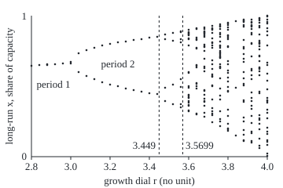

# The logistic map: turn one dial and a settling population starts alternating, then doubles again and again toward chaos

[Syllabus](../../../SYLLABUS.md) → [Differential equations and dynamics](../../../SYLLABUS.md#w08) → [Discrete Dynamics and Chaos](../../../SYLLABUS.md#w08-s11) → The logistic map

---

## General Overview

A moth species in an orchard breeds once a summer, and the adults die before the next. Count each summer's moths as a share of what the orchard can feed: 0.2 is a fifth of the maximum. Next summer's share is this summer's, times a breeding rate, times the share of food still free. The breeding rate is the dial.

Set the dial at 2.8 and start at 0.2: the share settles at 0.642857. At 3.2 it never settles. It alternates 0.513045, 0.799455, 0.513045, a boom summer and a bust summer, forever. At 3.5 four values take turns. At 3.9, sixty-four summers give sixty-four different values.

Between those dials the pattern splits in two again and again: period 2 at 3, period 4 at 3.449490, period 8 at 3.544090. The splits pile up at 3.569946, each gap about 1/4.669 of the one before.

**Past a dial of 3 the steady share repels and a two-summer cycle takes over; each cycle later hands over to one twice as long, at dials whose gaps shrink by 4.669.**

**What kind of fact this is:** a theorem. The 2-cycle, its stability and the dial 3.449490 are proved on this card in Why it works. That the gap ratio tends to 4.669 is also a theorem: Lanford proved it with computer help in 1982 for maps close to a special limiting map, and Lyubich in 1999 for this map. This card computes it and does not prove it.

### The picture: where the share ends up, dial by dial

<p align="center"></p>

To scale: 250 px per unit of dial, 180 px per unit of share. Each column is one dial, 2.8 to 4.0 in steps of 0.04, showing 32 summers after 2,000 summers from 0.2. Dashed lines mark period 4 at 3.449490 and the pile-up at 3.569946. At 3.84 three dots show a window of order inside the chaos.

---

## The formula

A map $x_{n+1} = g(x_n)$ turns this summer's value into next summer's ([Iteration](01-iteration-and-cobweb-plots.md)). The logistic map is

$$x_{n+1} = f(x_n) = r\,x_n\,(1 - x_n).$$

**Read it aloud:** next summer's share is the dial, times this summer's share, times the food still free.

A **2-cycle** is a pair of shares the map swaps, $f(x_-) = x_+$ and $f(x_+) = x_-$:

$$x_\pm = \frac{r + 1 \pm \sqrt{(r+1)(r-3)}}{2r}.$$

**Read it aloud:** two shares either side of (r + 1)/(2r), real only once the dial passes 3.

The cycle's **multiplier** $m$ is the factor a small error is multiplied by over one lap of the cycle:

$$m = f'(x_-)\,f'(x_+) = 4 + 2r - r^2, \qquad \text{the cycle attracts while } |m| < 1.$$

**Read it aloud:** multiply the slopes at the two cycle points; between −1 and 1, errors shrink every lap.

The later splitting dials have no closed form, but their gaps shrink by a fixed ratio:

$$\delta = \lim_{k \to \infty} \frac{r_k - r_{k-1}}{r_{k+1} - r_k} = 4.669\ldots$$

**Read it aloud:** each gap between splits, divided by the next gap, settles on Feigenbaum's constant.

| Symbol | Plain meaning | In our example | Push it up and the answer… |
| --- | --- | --- | --- |
| $x_n$, $n$ | the share in summer $n$; $x_{n+1}$ is the next summer's | 0.2 at the start | more breeders, less food |
| $r$ | the breeding dial | 3.2 | longer cycles, then chaos |
| $f$, $f'$ | the map, and its slope $f'(x) = r(1 - 2x)$ | −0.083485 and −1.916515 on the cycle | steeper, errors grow |
| $x^*$ | the steady share $1 - 1/r$, a fixed point | 0.6875, slope −1.2 | repels harder |
| $x_-$, $x_+$ | the two shares of the 2-cycle | 0.513045 and 0.799455 | they spread apart |
| $m$ | the multiplier: error growth per lap | 0.16 | falls through −1 at 3.449490 |
| $r_k$, $k$ | the dial where period 2^k takes over, $k$ counting splits | 3, 3.449490, 3.544090, 3.564407 | — |
| $\delta$ | Feigenbaum's constant, the limit of gap ratios | 4.669 | — |

### When it holds

- **A dial between 0 and 4.** Above 4 the hump's top, r/4, passes 1; the next share is negative and runs away.
- **A dial above 3 for the 2-cycle to exist.** At 2.8, (r + 1)(r − 3) is −0.76: no real cycle, and the share settles on 0.642857.
- **A dial below 3.449490 for it to hold.** At 3.5 the formula gives 0.428571 and 0.857143, but $m$ = −1.25, so the share moves on to four values.
- **One smooth hump with a rounded top, for 4.669.** A flatter top doubles at a different ratio.
- **Separate generations.** The continuous law of [Logistic growth](../01-Rate%20Equations/07-logistic-growth.md) never oscillates: a flow on a line cannot overshoot a rest point.

---

## Why it works

### Step 0: a 2-cycle is a fixed point of the map applied twice

A share that returns every second summer solves $f(f(x)) = x$. That is the question of [Fixed points of a map](02-fixed-points-of-a-map.md), asked of the map applied twice, with its test: a fixed point attracts when the slope there lies between −1 and 1.

### Step 1: the steady share stops attracting at 3

$x = rx(1-x)$ gives $x = 0$ or $x^* = 1 - 1/r$, where the slope is $2 - r$. That lies between −1 and 1 only for dials from 1 to 3. At 3.2 the steady share 0.6875 has slope −1.2: an error flips sign and grows by a fifth each summer.

### Step 2: divide out the fixed points, and a quadratic is left

$f(f(x)) = x$ has degree 4. Both fixed points solve it, so dividing them out leaves

$$r^2 x^2 - r(r+1)\,x + (r + 1) = 0,$$

whose roots add to $(r+1)/r$ and multiply to $(r+1)/r^2$. The [The quadratic formula](../../03-Algebra/02-Polynomials/03-quadratic-formula.md) gives $x_\pm$.

<details>
<summary>The algebra behind this</summary>

With $f(x) = rx - rx^2$, $f(f(x)) - x = -r^3x^4 + 2r^3x^3 - (r^3 + r^2)x^2 + (r^2 - 1)x$. This equals $-x\,(rx - r + 1)\,(r^2x^2 - r(r+1)x + r + 1)$; multiply back to confirm. The discriminant is $r^2(r+1)^2 - 4r^2(r+1) = r^2(r+1)(r-3)$.

</details>

### Step 3: the chain rule turns two slopes into one verdict

The slope of $f(f(x))$ at $x_-$ is the slope at $f(x_-) = x_+$ times the slope at $x_-$: that product is $m$. Using the sum and product from Step 2,

$$m = r^2(1 - 2x_-)(1 - 2x_+) = r^2\Big(1 - \tfrac{2(r+1)}{r} + \tfrac{4(r+1)}{r^2}\Big) = 4 + 2r - r^2.$$

At 3.2 one slope, −1.916515, is steeper than −1, yet the product is 0.16: an error shrinks to 16% of itself every two summers.

<details>
<summary>Detailed proof: the 2-cycle attracts when |m| &lt; 1</summary>

Let $F(x) = f(f(x))$, so $F(x_-) = x_-$ and $F'(x_-) = m$. By Taylor's theorem, $F(x_- + e) = x_- + m e + R(e)$ with $|R(e)| \le C e^2$ for $|e| \le 1$, the constant C bounding half of $|F''|$ within 1 of $x_-$. Pick a number q with $|m| < q < 1$ and $\varepsilon = \min(1, (q - |m|)/C)$. If $|e_0| < \varepsilon$ then $|e_1| \le |m||e_0| + C e_0^2 \le q|e_0|$, and by induction $|e_j| \le q^j|e_0| \to 0$. The odd summers then tend to $f(x_-) = x_+$ by continuity. With $|m| > 1$ the same estimate shows small errors grow.

</details>

### Step 4: the cycle is born at 3 and breaks at 1 + √6

$m = 1$ gives $r^2 - 2r - 3 = 0$, so $r = 3$: the cycle is born where the steady share breaks. $m = -1$ gives $r^2 - 2r - 5 = 0$, so $r = 1 + \sqrt 6$ = 3.449490. Past it the cycle repels the same way, and the share alternates around each of its two points: period 4.

### Step 5: every split repeats Step 4, and the gaps shrink geometrically

Each cycle is born with multiplier 1 and breaks when it falls through −1. No formula gives these dials, so the check settles on each cycle, takes its multiplier by the chain rule, and finds where it hits −1 by bisection (halving a bracket of dials sixty times). The splits come at 3, 3.449490, 3.544090, 3.564407, 3.568759, 3.569692, with gap ratios 4.7514, 4.6563, 4.6682, 4.6687.

Gaps shrinking by a nearly fixed ratio form a geometric series with a finite sum, so the splits pile up at a finite dial; summing the rest of the series gives 3.569946.

<details>
<summary>Why the same 4.669 appears in other systems</summary>

Near the pile-up, the map applied twice, seen on a small window at the hump's top and magnified, looks like the map at an earlier dial. The magnification depends only on the shape of the top, so every map with a rounded top shares it. Feigenbaum found this between 1975 and 1978.

</details>

A second road: at **superstable** dials the cycle passes through the top, $x = 1/2$, where the slope is 0. Newton's method on the dial (follow the tangent to zero, repeat) finds them: 2, 3.236068, 3.498562, 3.554641, 3.566667, 3.569244, 3.569795, 3.569913, 3.569939. Their gap ratios run 4.7089 … 4.6692, and they pile up at the same 3.569946.

---

## Worked numbers, by hand

At the dial 3.2.

| Step | Arithmetic | Value |
| --- | --- | --- |
| steady share and slope | 1 − 1/3.2, and 2 − 3.2 | 0.6875, −1.2 |
| under the root | 4.2 × 0.2 | 0.84 |
| the 2-cycle | (4.2 ∓ √0.84)/6.4 | 0.513045 and 0.799455 |
| sum and product | 4.2/3.2 and 4.2/10.24 | 1.3125 and 0.410156 |
| slopes | 3.2 × (1 − 2x) at each point | −0.083485 and −1.916515 |
| multiplier | their product; or 4 + 6.4 − 10.24 | **0.16** |
| period 4 takes over | 1 + √6 | **3.449490** |

The orchard swings between 51% and 80% of its maximum forever, and a disturbance fades to 16% of itself every two summers.

### What breaks if you drop a piece

| Mistake | Comes out at | What went wrong |
| --- | --- | --- |
| Solving $f(x) = x$ for the long run | 0.6875, slope −1.2 | it repels; the share never sits there |
| Stability from one slope | $f'$(0.799455) = −1.916515 | a cycle's verdict is the product, 0.16 |
| The 2-cycle formula at 3.5 | 0.428571, 0.857143, $m$ = −1.25 | it exists but repels |
| The formula at 2.8 | (r + 1)(r − 3) = −0.76 | no real cycle below 3 |

The code prints all four.

---

## Code, from first principles, and it actually runs

Two roads to each answer: formula against 2,000 summers of iteration, chain rule against 4 + 2r − r^2, bisection against 1 + √6, splitting dials against superstable dials. Both scripts print every dot of the picture.

### Python

```python
# The logistic map x -> r x (1 - x) and period doubling.  Standard library only.
# Road one: algebra (quadratic formula, chain rule).  Road two: iterate and solve numerically.
from math import sqrt, floor
def f(r, x): return r * x * (1 - x)
def settle(r, x=0.2, n=2000):            # iterate n times from x
    for _ in range(n): x = f(r, x)
    return x
def mult(r, p):                          # multiplier of the p-cycle: land on it, polish by Newton
    x = settle(r, 0.5, 3000)
    for _ in range(40):
        y, d = x, 1.0
        for _ in range(p): d, y = d * r * (1 - 2 * y), f(r, y)
        x -= (y - x) / (d - 1)
    return d
def onset(p, lo, hi):                    # bisection: where the p-cycle's multiplier hits -1
    for _ in range(60):
        mid = (lo + hi) / 2
        lo, hi = (mid, hi) if mult(mid, p) > -1 else (lo, mid)
    return (lo + hi) / 2
def sup(p, r):                           # Newton in r: the p-cycle passes through x = 1/2
    for _ in range(50):
        x, dx = 0.5, 0.0
        for _ in range(p): x, dx = f(r, x), x * (1 - x) + r * (1 - 2 * x) * dx
        r -= (x - 0.5) / dx
    return r
def cyc2(r):                             # the quadratic formula on the period-2 factor
    s = sqrt((r + 1) * (r - 3))
    return (r + 1 - s) / (2 * r), (r + 1 + s) / (2 * r)
def fm(v, d=6): return " ".join(f"{x:.{d}f}" for x in v)
r = 3.2; lo, hi = cyc2(r); a, b = sorted((settle(r), settle(r, 0.2, 2001)))
chain = r * (1 - 2 * a) * r * (1 - 2 * b)
print(f"r = 3.2: fixed point 1 - 1/r = {1 - 1 / r:.6f}, slope 2 - r = {2 - r:.6f}, so it repels")
print(f"2-cycle by the quadratic formula: (r+1)(r-3) = {(r + 1) * (r - 3):.6f}, {lo:.6f} and {hi:.6f}; sum {lo + hi:.6f}, product {lo * hi:.6f}")
print(f"2-cycle by iterating from 0.2 for 2000 steps: {a:.6f} and {b:.6f}")
print(f"multiplier, chain rule on the orbit: {r * (1 - 2 * a):.6f} x {r * (1 - 2 * b):.6f} = {chain:.6f}; by 4 + 2r - r^2: {4 + 2 * r - r * r:.6f}")
house = [sorted({round(settle(q, 0.2, 2000 + i), 6) for i in range(64)}) for q in (2.8, 3.5, 3.9)]
print(f"house example, x0 = 0.2, after 2000 steps: r = 2.8 -> {fm(house[0])} | r = 3.5 -> {fm(house[1])} | r = 3.9 -> {len(house[2])} different values in 64 steps")
R = [2.0, sup(2, 3.2)]
for k in range(2, 9):                    # next guess: the last gap shrunk by the last measured ratio
    R.append(sup(2 ** k, R[-1] + (R[-1] - R[-2]) / (4.0 if k == 2 else (R[-2] - R[-3]) / (R[-1] - R[-2]))))
B = [3.0] + [onset(2 ** k, R[k], R[k + 1]) for k in range(1, 6)]
db = [(B[i] - B[i - 1]) / (B[i + 1] - B[i]) for i in range(1, len(B) - 1)]
ds = [(R[i] - R[i - 1]) / (R[i + 1] - R[i]) for i in range(1, len(R) - 1)]
inf_b, inf_s = B[-1] + (B[-1] - B[-2]) / (db[-1] - 1), R[-1] + (R[-1] - R[-2]) / (ds[-1] - 1)
print(f"period-4 onset: bisection on the multiplier {B[1]:.6f}; 1 + sqrt(6) = {1 + sqrt(6):.6f}")
print(f"doublings, multiplier reaches -1: {fm(B)}\n  gap ratios: {fm(db, 4)}")
print(f"superstable, cycle through 1/2: {fm(R)}\n  gap ratios: {fm(ds, 4)}")
print(f"pile-up point extrapolated: from doublings {inf_b:.6f}, from superstable {inf_s:.6f}")
print(f"mistake 1, one slope for the whole cycle: f'({hi:.6f}) = {r * (1 - 2 * hi):.6f}")
m, q = cyc2(3.5), 2.8
print(f"mistake 2, the 2-cycle at r = 3.5: {m[0]:.6f} and {m[1]:.6f}, multiplier {3.5 * (1 - 2 * m[0]) * 3.5 * (1 - 2 * m[1]):.6f}")
print(f"mistake 3, r = 2.8: (r+1)(r-3) = {(q + 1) * (q - 3):.6f}, no real 2-cycle")
print(f"figure, marks at px x: 3.449490 -> {40 + 250 * (B[1] - 2.8):.1f}, 3.569946 -> {40 + 250 * (inf_b - 2.8):.1f}")
cols = [f"{40 + 10 * k}:" + "/".join(str(y) for y in sorted({floor(200 - 180 * settle(2.8 + 0.04 * k, 0.2, 2000 + i) + 0.5) for i in range(32)})) for k in range(31)]
print("figure, dots px x:y " + " ".join(cols))
assert max(abs(lo - a), abs(hi - b)) < 1e-9             # formula against iteration
assert abs(chain - (4 + 2 * r - r * r)) < 1e-9          # chain rule on the orbit against algebra
assert abs(B[1] - (1 + sqrt(6))) < 1e-9                 # bisection against closed form
assert abs(inf_b - inf_s) < 1e-5 and abs(db[-1] - ds[-1]) < 1e-3   # two sequences, one limit
print("ALL CHECKS PASS")
```

**Ran 2026-09-28 on macOS, Python 3.14.6, standard library only. All checks passed. Output, pasted from the run:**

```
r = 3.2: fixed point 1 - 1/r = 0.687500, slope 2 - r = -1.200000, so it repels
2-cycle by the quadratic formula: (r+1)(r-3) = 0.840000, 0.513045 and 0.799455; sum 1.312500, product 0.410156
2-cycle by iterating from 0.2 for 2000 steps: 0.513045 and 0.799455
multiplier, chain rule on the orbit: -0.083485 x -1.916515 = 0.160000; by 4 + 2r - r^2: 0.160000
house example, x0 = 0.2, after 2000 steps: r = 2.8 -> 0.642857 | r = 3.5 -> 0.382820 0.500884 0.826941 0.874997 | r = 3.9 -> 64 different values in 64 steps
period-4 onset: bisection on the multiplier 3.449490; 1 + sqrt(6) = 3.449490
doublings, multiplier reaches -1: 3.000000 3.449490 3.544090 3.564407 3.568759 3.569692
  gap ratios: 4.7514 4.6563 4.6682 4.6687
superstable, cycle through 1/2: 2.000000 3.236068 3.498562 3.554641 3.566667 3.569244 3.569795 3.569913 3.569939
  gap ratios: 4.7089 4.6808 4.6630 4.6684 4.6690 4.6692 4.6692
pile-up point extrapolated: from doublings 3.569946, from superstable 3.569946
mistake 1, one slope for the whole cycle: f'(0.799455) = -1.916515
mistake 2, the 2-cycle at r = 3.5: 0.428571 and 0.857143, multiplier -1.250000
mistake 3, r = 2.8: (r+1)(r-3) = -0.760000, no real 2-cycle
figure, marks at px x: 3.449490 -> 202.4, 3.569946 -> 232.5
figure, dots px x:y 40:84 50:83 60:82/83 70:82 80:81 90:79/81 100:68/92 110:64/97 120:61/101 130:58/105 140:56/108 150:54/110 160:53/113 170:51/115 180:50/117 190:48/119 200:47/120 210:44/50/112/129 220:42/52/108/133 230:40/41/50/54/101/111/133/137 240:38/41/42/43/44/45/49/50/58/92/93/110/112/121/122/124/125/129/131/134/135/141/142 250:36/37/48/50/51/61/62/83/84/86/106/107/110/113/145/146 260:35/37/40/41/42/43/45/47/57/59/60/65/75/85/87/91/115/116/121/126/129/130/135/144/149 270:33/36/37/38/42/49/54/55/58/61/77/82/88/95/97/98/109/110/127/138/142/145/147/156 280:31/33/34/37/42/44/47/53/58/59/61/65/67/68/70/72/73/74/82/85/86/87/100/113/122/127/142/152/155/161 290:29/30/32/35/38/45/46/48/50/59/60/78/82/90/93/99/104/111/116/117/140/148/158/164/165/167 300:27/112/173 310:25/26/27/28/32/34/51/60/62/69/75/79/92/100/107/109/128/130/150/155/166/172/179/180 320:25/28/29/32/33/34/37/42/44/55/56/72/88/90/96/101/118/125/129/135/139/148/157/168/170/180/182 330:23/24/26/29/33/35/44/52/54/55/56/59/63/71/72/78/86/87/88/91/96/117/119/147/151/153/158/165/177/186/189 340:20/21/25/28/30/36/40/45/58/80/83/94/103/114/125/128/129/131/140/144/151/163/168/171/179/181/185/196/199
ALL CHECKS PASS
```

### Rust

Same numbers, same labels, built with `rustc --edition 2021 -O`.

```rust
// The logistic map x -> r x (1 - x) and period doubling, in Rust.  No crates.
// Road one: algebra (quadratic formula, chain rule).  Road two: iterate and solve numerically.
use std::collections::BTreeSet;
fn f(r: f64, x: f64) -> f64 { r * x * (1.0 - x) }
fn settle(r: f64, mut x: f64, n: usize) -> f64 { for _ in 0..n { x = f(r, x) } x }
fn mult(r: f64, p: usize) -> f64 {           // multiplier of the p-cycle: land on it, polish by Newton
    let mut x = settle(r, 0.5, 3000);
    let mut d = 1.0;
    for _ in 0..40 {
        let mut y = x; d = 1.0;
        for _ in 0..p { d *= r * (1.0 - 2.0 * y); y = f(r, y) }
        x -= (y - x) / (d - 1.0);
    }
    d
}
fn onset(p: usize, mut lo: f64, mut hi: f64) -> f64 {   // bisection: multiplier hits -1
    for _ in 0..60 {
        let mid = (lo + hi) / 2.0;
        if mult(mid, p) > -1.0 { lo = mid } else { hi = mid }
    }
    (lo + hi) / 2.0
}
fn sup(p: usize, mut r: f64) -> f64 {        // Newton in r: the p-cycle passes through x = 1/2
    for _ in 0..50 {
        let (mut x, mut dx) = (0.5, 0.0);
        for _ in 0..p { dx = x * (1.0 - x) + r * (1.0 - 2.0 * x) * dx; x = f(r, x) }
        r -= (x - 0.5) / dx;
    }
    r
}
fn cyc2(r: f64) -> (f64, f64) {              // the quadratic formula on the period-2 factor
    let s = ((r + 1.0) * (r - 3.0)).sqrt();
    ((r + 1.0 - s) / (2.0 * r), (r + 1.0 + s) / (2.0 * r))
}
fn fm(v: &[f64], d: usize) -> String { v.iter().map(|x| format!("{:.*}", d, x)).collect::<Vec<_>>().join(" ") }
fn ratios(v: &[f64]) -> Vec<f64> { (1..v.len() - 1).map(|i| (v[i] - v[i - 1]) / (v[i + 1] - v[i])).collect() }
fn main() {
    let r = 3.2; let (lo, hi) = cyc2(r);
    let (u, w) = (settle(r, 0.2, 2000), settle(r, 0.2, 2001)); let (a, b) = (u.min(w), u.max(w));
    let chain = r * (1.0 - 2.0 * a) * r * (1.0 - 2.0 * b);
    println!("r = 3.2: fixed point 1 - 1/r = {:.6}, slope 2 - r = {:.6}, so it repels", 1.0 - 1.0 / r, 2.0 - r);
    println!("2-cycle by the quadratic formula: (r+1)(r-3) = {:.6}, {:.6} and {:.6}; sum {:.6}, product {:.6}", (r + 1.0) * (r - 3.0), lo, hi, lo + hi, lo * hi);
    println!("2-cycle by iterating from 0.2 for 2000 steps: {:.6} and {:.6}", a, b);
    println!("multiplier, chain rule on the orbit: {:.6} x {:.6} = {:.6}; by 4 + 2r - r^2: {:.6}", r * (1.0 - 2.0 * a), r * (1.0 - 2.0 * b), chain, 4.0 + 2.0 * r - r * r);
    let house: Vec<Vec<String>> = [2.8, 3.5, 3.9].iter().map(|&q| {
        let s: BTreeSet<String> = (0..64).map(|i| format!("{:.6}", settle(q, 0.2, 2000 + i))).collect();
        s.into_iter().collect() }).collect();
    println!("house example, x0 = 0.2, after 2000 steps: r = 2.8 -> {} | r = 3.5 -> {} | r = 3.9 -> {} different values in 64 steps",
             house[0].join(" "), house[1].join(" "), house[2].len());
    let mut rr = vec![2.0, sup(2, 3.2)];
    for k in 2..9 {                          // next guess: the last gap shrunk by the last measured ratio
        let n = rr.len();
        let ratio = if k == 2 { 4.0 } else { (rr[n - 2] - rr[n - 3]) / (rr[n - 1] - rr[n - 2]) };
        let next = sup(1 << k, rr[n - 1] + (rr[n - 1] - rr[n - 2]) / ratio);
        rr.push(next);
    }
    let mut bb = vec![3.0]; for k in 1..6 { bb.push(onset(1 << k, rr[k], rr[k + 1])) }
    let (db, ds) = (ratios(&bb), ratios(&rr));
    let (nb, ns) = (bb.len(), rr.len());
    let inf_b = bb[nb - 1] + (bb[nb - 1] - bb[nb - 2]) / (db[db.len() - 1] - 1.0);
    let inf_s = rr[ns - 1] + (rr[ns - 1] - rr[ns - 2]) / (ds[ds.len() - 1] - 1.0);
    println!("period-4 onset: bisection on the multiplier {:.6}; 1 + sqrt(6) = {:.6}", bb[1], 1.0 + 6f64.sqrt());
    println!("doublings, multiplier reaches -1: {}\n  gap ratios: {}", fm(&bb, 6), fm(&db, 4));
    println!("superstable, cycle through 1/2: {}\n  gap ratios: {}", fm(&rr, 6), fm(&ds, 4));
    println!("pile-up point extrapolated: from doublings {:.6}, from superstable {:.6}", inf_b, inf_s);
    println!("mistake 1, one slope for the whole cycle: f'({:.6}) = {:.6}", hi, r * (1.0 - 2.0 * hi));
    let (m, q) = (cyc2(3.5), 2.8);
    println!("mistake 2, the 2-cycle at r = 3.5: {:.6} and {:.6}, multiplier {:.6}", m.0, m.1, 3.5 * (1.0 - 2.0 * m.0) * 3.5 * (1.0 - 2.0 * m.1));
    println!("mistake 3, r = 2.8: (r+1)(r-3) = {:.6}, no real 2-cycle", (q + 1.0) * (q - 3.0));
    println!("figure, marks at px x: 3.449490 -> {:.1}, 3.569946 -> {:.1}", 40.0 + 250.0 * (bb[1] - 2.8), 40.0 + 250.0 * (inf_b - 2.8));
    let cols: Vec<String> = (0..31).map(|k| {
        let ys: BTreeSet<i64> = (0..32).map(|i| (200.0 - 180.0 * settle(2.8 + 0.04 * k as f64, 0.2, 2000 + i) + 0.5).floor() as i64).collect();
        format!("{}:{}", 40 + 10 * k, ys.iter().map(|y| y.to_string()).collect::<Vec<_>>().join("/")) }).collect();
    println!("figure, dots px x:y {}", cols.join(" "));
    assert!((lo - a).abs().max((hi - b).abs()) < 1e-9);          // formula against iteration
    assert!((chain - (4.0 + 2.0 * r - r * r)).abs() < 1e-9);     // chain rule on the orbit against algebra
    assert!((bb[1] - (1.0 + 6f64.sqrt())).abs() < 1e-9);         // bisection against closed form
    assert!((inf_b - inf_s).abs() < 1e-5 && (db[db.len() - 1] - ds[ds.len() - 1]).abs() < 1e-3); // two sequences, one limit
    println!("ALL CHECKS PASS");
}
```

**Ran 2026-09-28 on macOS, rustc 1.98.1, no crates. All checks passed. Output, pasted from the run:**

```
r = 3.2: fixed point 1 - 1/r = 0.687500, slope 2 - r = -1.200000, so it repels
2-cycle by the quadratic formula: (r+1)(r-3) = 0.840000, 0.513045 and 0.799455; sum 1.312500, product 0.410156
2-cycle by iterating from 0.2 for 2000 steps: 0.513045 and 0.799455
multiplier, chain rule on the orbit: -0.083485 x -1.916515 = 0.160000; by 4 + 2r - r^2: 0.160000
house example, x0 = 0.2, after 2000 steps: r = 2.8 -> 0.642857 | r = 3.5 -> 0.382820 0.500884 0.826941 0.874997 | r = 3.9 -> 64 different values in 64 steps
period-4 onset: bisection on the multiplier 3.449490; 1 + sqrt(6) = 3.449490
doublings, multiplier reaches -1: 3.000000 3.449490 3.544090 3.564407 3.568759 3.569692
  gap ratios: 4.7514 4.6563 4.6682 4.6687
superstable, cycle through 1/2: 2.000000 3.236068 3.498562 3.554641 3.566667 3.569244 3.569795 3.569913 3.569939
  gap ratios: 4.7089 4.6808 4.6630 4.6684 4.6690 4.6692 4.6692
pile-up point extrapolated: from doublings 3.569946, from superstable 3.569946
mistake 1, one slope for the whole cycle: f'(0.799455) = -1.916515
mistake 2, the 2-cycle at r = 3.5: 0.428571 and 0.857143, multiplier -1.250000
mistake 3, r = 2.8: (r+1)(r-3) = -0.760000, no real 2-cycle
figure, marks at px x: 3.449490 -> 202.4, 3.569946 -> 232.5
figure, dots px x:y 40:84 50:83 60:82/83 70:82 80:81 90:79/81 100:68/92 110:64/97 120:61/101 130:58/105 140:56/108 150:54/110 160:53/113 170:51/115 180:50/117 190:48/119 200:47/120 210:44/50/112/129 220:42/52/108/133 230:40/41/50/54/101/111/133/137 240:38/41/42/43/44/45/49/50/58/92/93/110/112/121/122/124/125/129/131/134/135/141/142 250:36/37/48/50/51/61/62/83/84/86/106/107/110/113/145/146 260:35/37/40/41/42/43/45/47/57/59/60/65/75/85/87/91/115/116/121/126/129/130/135/144/149 270:33/36/37/38/42/49/54/55/58/61/77/82/88/95/97/98/109/110/127/138/142/145/147/156 280:31/33/34/37/42/44/47/53/58/59/61/65/67/68/70/72/73/74/82/85/86/87/100/113/122/127/142/152/155/161 290:29/30/32/35/38/45/46/48/50/59/60/78/82/90/93/99/104/111/116/117/140/148/158/164/165/167 300:27/112/173 310:25/26/27/28/32/34/51/60/62/69/75/79/92/100/107/109/128/130/150/155/166/172/179/180 320:25/28/29/32/33/34/37/42/44/55/56/72/88/90/96/101/118/125/129/135/139/148/157/168/170/180/182 330:23/24/26/29/33/35/44/52/54/55/56/59/63/71/72/78/86/87/88/91/96/117/119/147/151/153/158/165/177/186/189 340:20/21/25/28/30/36/40/45/58/80/83/94/103/114/125/128/129/131/140/144/151/163/168/171/179/181/185/196/199
ALL CHECKS PASS
```

> [!TIP]
> **Try changing**
> - **Start at 0.7 instead of 0.2** at dial 3.2. Guess first: a new cycle? No: 0.513045 and 0.799455 again.
> - **Set `r = 3.5`.** Guess first: do the roads agree? No: the formula gives 0.428571 and 0.857143, the iteration finds four values, and the first assert fails.

---

## The usual mistake

> [!warning]
> **Solving f(x) = x and calling it the long run.** At 3.2 that gives 0.6875, a share the moths never hold: its slope is −1.2, so errors grow. A fixed point is the long run only when it attracts.
>
> - **One slope as the verdict.** −1.916515 looks unstable; the product over the lap, 0.16, says the cycle holds.
> - **3.569946 as the start of pure chaos.** At 3.84 the picture shows three dots, a 3-cycle.
> - **Ratios of dials instead of ratios of gaps.** 4.669 divides one gap by the next.

---

## Where you meet it in real life

- **Insects with one breeding season.** Robert May's 1976 survey showed that crowding alone, in separate generations, gives boom-bust cycles and erratic counts.
- **A stepping method pushed too far.** Euler's rule ([Euler's method](../05-Numerical%20Evolution/01-eulers-method.md)) on the continuous logistic law is, after rescaling the share, a logistic map with dial 1 + kh, where k is the growth rate and h the step; past 3 the computed curve alternates though the true one never does.
- **Fluids and circuits.** Heated fluid layers and driven circuits double their period in the same cascade.

> **Say it back**
> The logistic map multiplies a share by a dial and by the room left. Past a dial of 3 the steady share repels and a 2-cycle takes over, found by dividing the fixed points out of the map applied twice. Its multiplier, 4 + 2r − r^2, stays between −1 and 1 up to 3.449490. Each cycle then hands over to one twice as long, at dials whose gaps shrink by 4.669 and pile up at 3.569946.

---

## What this builds on

- [Fixed points of a map](02-fixed-points-of-a-map.md): the slope test, used here on the map applied twice.
- [The quadratic formula](../../03-Algebra/02-Polynomials/03-quadratic-formula.md): the cycle points, and the sum and product of roots.

## Where this goes next

- [The Lyapunov exponent](04-chaos-and-the-lyapunov-exponent.md): the average log-slope along an orbit, negative while a cycle attracts, positive in chaos.

Past 3.569946, telling chaos from a very long cycle needs a measure of whether nearby shares drift apart: the Lyapunov exponent.

---

## Sources

Verified 2026-09-28: every link below resolves to the publisher's page.

- May, Robert M. "Simple mathematical models with very complicated dynamics." *Nature* 261, 459–467 (1976). [DOI](https://doi.org/10.1038/261459a0). The map as a population model, and the cascade.
- Feigenbaum, Mitchell J. "Quantitative universality for a class of nonlinear transformations." *Journal of Statistical Physics* 19, 25–52 (1978). [DOI](https://doi.org/10.1007/BF01020332). The ratio 4.669 and why it is shared.
- Lanford, Oscar E., III. "A computer-assisted proof of the Feigenbaum conjectures." *Bulletin of the American Mathematical Society* 6, 427–435 (1982). [DOI](https://doi.org/10.1090/S0273-0979-1982-15008-X). Lanford's computer-assisted proof.
- Lyubich, Mikhail. "Feigenbaum-Coullet-Tresser universality and Milnor's hairiness conjecture." *Annals of Mathematics* 149, 319–420 (1999). [DOI](https://doi.org/10.2307/120968). The proof for the whole quadratic family, this map included.
- Strogatz, Steven H. *Nonlinear Dynamics and Chaos*, 3rd ed. CRC Press. [Publisher page](https://www.routledge.com/Nonlinear-Dynamics-and-Chaos-With-Applications-to-Physics-Biology-Chemistry-and-Engineering/Strogatz/p/book/9780367026509). The chapter on one-dimensional maps works the cascade by hand.
