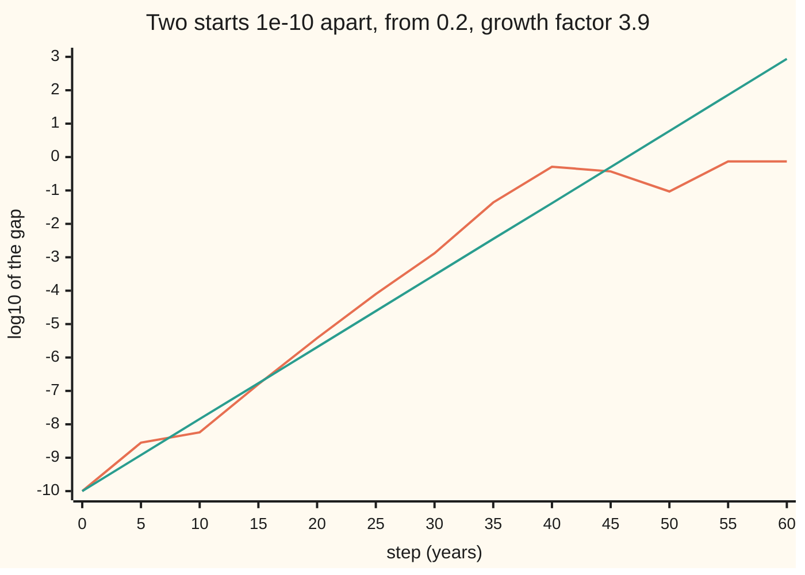
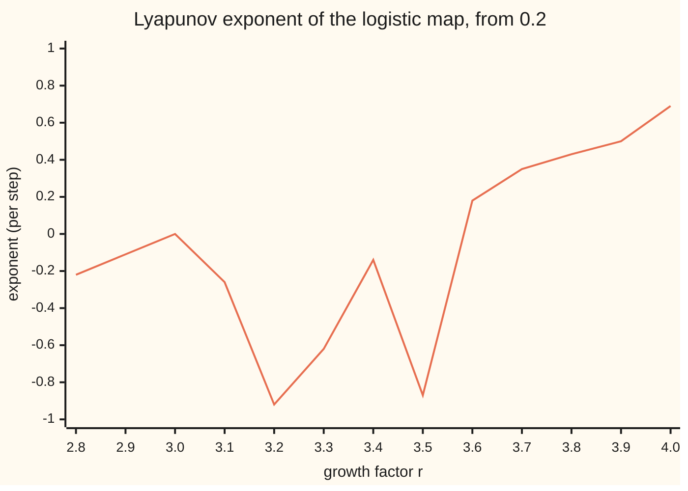

# The Lyapunov exponent: how fast two nearly identical starts drift apart, and positive means chaos

Differential equations and dynamics → Discrete Dynamics and Chaos → Measuring sensitive dependence → The Lyapunov exponent

---

## General Overview

A forest's moths are counted once a year, as a fraction of the most the forest can carry. Next year's fraction is 3.9 times this year's, times the room left: the logistic map of [the-logistic-map-and-period-doubling](03-the-logistic-map-and-period-doubling.md). The rule has no chance in it. Two forecasts start from 0.2, one off by 1e-10, a ten-billionth.

The error grows by a roughly steady factor each year until the two forecasts differ by 0.5, half the whole range. From 0.2 that takes 40 years; across 1,000 starting fractions, a median of 45. The rule is exact; the uncertainty about the start is what grows. That is **sensitive dependence on initial conditions**.

The **Lyapunov exponent**, after Aleksandr Lyapunov, is that growth rate per step, on a logarithmic scale. Negative: nearby starts close up. Positive: they drift apart exponentially, and the map is **chaotic** in the working sense used here. At growth factor 3.9 it is 0.4965 per step. At 4 it is exactly ln 2 = 0.6931: on average each step doubles the error, using up one binary digit of the start.

**The Lyapunov exponent is the long-run average of the logarithm of one step's stretch of a tiny gap; the gap grows like e to the exponent times the steps, so a positive exponent means chaos and fixes how far ahead a forecast can see.**

**What kind of fact this is:** a definition; its exact value ln 2 at growth factor 4 is a theorem, proved on this card in Why it works.

### The picture: an error of 1e-10 at growth factor 3.9



Orange: the base-10 logarithm of the true gap; each unit up is a tenfold larger error. Green: the line the exponent predicts, rising 0.4965 / ln 10 per step. The true gap climbs at about that slope, a little ahead, until step 40; then it fills the range and wanders.

---

## The formula

Reminder: a map $x_{n+1} = f(x_n)$ turns this year's state into next year's. Here $f(x) = r x (1 - x)$, and the size of its derivative, $\lvert f'(x) \rvert = \lvert r(1 - 2x) \rvert$, is one step's stretch at $x$; the bars drop the sign. The capital sigma, Σ, adds the terms after it, for $k$ from 0 to $n - 1$.

$$\lambda = \lim_{n \to \infty} \frac{1}{n} \sum_{k=0}^{n-1} \ln \lvert f'(x_k) \rvert$$

**Read it aloud:** follow the orbit, take the logarithm of each step's stretch, and average over the long run.

The error law and the forecast horizon follow:

$$\delta_n \approx \delta_0 \, e^{\lambda n}, \qquad n_* = \frac{\ln(\Delta / \delta_0)}{\lambda}$$

**Read it aloud:** a small error grows by a factor e to the lambda per step, so it reaches the tolerance after ln of tolerance over error, divided by lambda, steps.

| Symbol | Plain meaning | In our example | Push it up and the answer… |
| --- | --- | --- | --- |
| $x_n$, $x_0$, $x_k$ | the state after $n$ steps; the start; at step $k$ | start 0.2 | — |
| $r$ | the growth factor in the map | 3.9, and 4 | larger exponent, not steadily |
| $f$, $f'$ | the map; one step's stretch | 2.34 at 0.2 | — |
| $\lambda$ | the Lyapunov exponent, per step | 0.4965 at 3.9; 0.6931 at 4 | horizon shrinks |
| $\delta_0$, $\delta_n$ | the gap at the start; after $n$ steps | 1e-10 | horizon shrinks, logarithmically |
| $n$, $k$ | step counts | years | — |
| $\Delta$, $n_*$ | the tolerance; the horizon in steps | 0.5; 44.98 | horizon grows |
| $\theta$, $\theta_0$, $\theta_k$ | an angle with $x = \sin^2\theta$ | $\sin^2\theta_0 = 0.2$ | — |

### When it holds

- **A typical start.** Exceptional starts differ: at growth factor 4 the start 0 is an unstable fixed point giving ln 4 = 1.3863, and 0.5 lands on 0.
- **A small gap.** The law $\delta_0 e^{\lambda n}$ holds while the gap is far smaller than the range; near 0.5 it stops growing.
- **A typical horizon, not a guarantee.** Over 1,000 starts the gap reached 0.5 between steps 34 and 72, median 45, against the predicted 44.98.
- **Negative means settled.** At growth factor 2.8 the orbit settles on a fixed point where the stretch is 0.8, and the exponent is ln 0.8 = −0.2231: every error shrinks to 0.8 of itself per step.

---

## Why it works

### Step 1: stretches multiply, so their logarithms add

Start orbits at $x_0$ and $x_0 + \delta_0$. By the chain rule the derivative of $n$ steps is the product of one-step derivatives along the orbit. The capital pi, ∏, multiplies terms as Σ adds them, so

$$\delta_n \approx \delta_0 \prod_{k=0}^{n-1} \lvert f'(x_k) \rvert = \delta_0 \, e^{\sum \ln \lvert f'(x_k) \rvert} \approx \delta_0 \, e^{\lambda n}.$$

The logarithm of a product is a sum; the last step replaces that sum by $n$ times its average. Solving $\delta_0 e^{\lambda n} = \Delta$ gives the horizon: 22.33 / 0.4965 = 44.98 steps.

### Step 2: the logarithm is what makes the horizon cheap to extend

The horizon depends on $\ln(\Delta / \delta_0)$. A survey a thousand times sharper, 1e-13 instead of 1e-10, buys ln(1000) / 0.4965 = 13.91 more years; across 1,000 starts it bought 13.97. Each tenfold gain in precision buys the same fixed number of steps.

### Step 3: at growth factor 4, the sine-squared substitution doubles an angle

Write the state as $x = \sin^2\theta$ ([trig-identities](../../05-Geometry%20and%20trig/03-Trigonometry/03-trig-identities.md)). Then $1 - x = \cos^2\theta$ and

$$f(x) = 4\sin^2\theta\cos^2\theta = (2\sin\theta\cos\theta)^2 = \sin^2(2\theta).$$

Each step doubles the angle: $\theta_k = 2^k \theta_0$. From 0.2, twenty steps give 0.82001387, as does $\sin^2(2^{20}\theta_0)$.

### Step 4: the stretches telescope to 2^n

By the cosine double-angle formula, $f'(x_k) = 4(1 - 2\sin^2\theta_k) = 4\cos 2\theta_k$. The sine one, $\sin 4\theta = 2\sin 2\theta \cos 2\theta$, rewrites it as

$$\lvert f'(x_k) \rvert = 2\,\frac{\lvert \sin 2\theta_{k+1} \rvert}{\lvert \sin 2\theta_k \rvert}.$$

Multiplied over $n$ steps, every inner sine cancels:

$$\prod_{k=0}^{n-1} \lvert f'(x_k) \rvert = 2^n \, \frac{\lvert \sin 2\theta_n \rvert}{\lvert \sin 2\theta_0 \rvert}.$$

Over 20 steps from 0.2 both sides are 1007094.07. Take logarithms and divide by $n$:

$$\frac{1}{n}\sum_{k=0}^{n-1} \ln \lvert f'(x_k) \rvert = \ln 2 + \frac{1}{n} \ln \frac{\lvert \sin 2\theta_n \rvert}{\lvert \sin 2\theta_0 \rvert}.$$

For a typical start the last term shrinks to zero, so $\lambda = \ln 2$: one bit lost per step.

<details>
<summary>Detailed proof: the correction term vanishes</summary>

From above: $\lvert \sin 2\theta_n \rvert \le 1$, so the correction is at most $\frac{1}{n}\ln(1/\lvert \sin 2\theta_0 \rvert)$, which tends to 0 when $x_0$ is neither 0 nor 1.

From below: $\theta_n / \pi$ doubles each step, and only its fractional part matters. $\sin 2\theta_n$ is tiny only when that part is near 0, 1/2 or 1. Doubling shifts the binary digits of $\theta_0 / \pi$ one place left, so that part comes within a tiny distance of those points only when the digits from place $n + 2$ begin with a long run of equal digits; the closer, the longer the run. Given $\varepsilon > 0$, the correction falls below $-\varepsilon$ at step $n$ only if $\lvert \sin 2\theta_n \rvert < e^{-\varepsilon n}$, which needs a run of length proportional to $n$. A start whose digits never carry runs growing in proportion to their position has correction tending to 0 from below too, so $\lambda = \ln 2$. Starts whose digits end in all zeros, such as 0.5 (angle $\pi/4$, digits 0.01), land on 0: the exceptions.

</details>

A second road never uses the derivative: carry a twin orbit a fixed tiny distance away, record the log of each step's stretch of that distance, and pull the twin back. The code takes it; it agrees to four decimals. Angle doubling read as a shift of binary digits is [the-doubling-map-and-symbolic-dynamics](05-the-doubling-map-and-symbolic-dynamics.md).

---

## Worked numbers, by hand

| Step | Arithmetic | Value |
| --- | --- | --- |
| exponent at 3.9 | orbit average of ln of the stretch | 0.4965 per step |
| same, in bits | 0.4965 / ln 2 | 0.716 bits per step |
| distance to cover | ln(0.5 / 1e-10) = ln(5e9) | 22.33 |
| horizon | 22.33 / 0.4965 | **44.98 steps** |
| test on 1,000 starts | median step the gap hits 0.5 | 45 |
| start 1,000 times sharper | 6.91 / 0.4965 | 13.91 more; measured 13.97 |
| exponent at 4 | ln 2, from Step 4 | **0.6931, 1.000 bit per step** |

A forecast from a survey good to 1e-10 is worthless after about 45 years; a survey a thousand times sharper adds 13.91.

### The picture: the exponent across growth factors



Orange: the orbit-average exponent. Below zero the orbit settles: −0.2231 on the fixed point at 2.8, −0.9163 on the two-cycle at 3.2, −0.8725 on the four-cycle at 3.5. It touches zero at 3.0, where the fixed point loses stability, and turns positive between 3.5 and 3.6, past the period-doubling cascade.

### What breaks if you drop a piece

| Mistake | Comes out at | What went wrong |
| --- | --- | --- |
| Average the stretch, then take ln | ln 2.5455 = 0.9343 at 4 | the log of an average exceeds the average of logs |
| Read the exponent off one step | ln 2.34 = 0.8502, horizon 26.27 | one stretch is local |
| Start on the fixed point 0 at 4 | 1.3863 = ln 4 | an exceptional orbit |
| Trust one pair of starts | 40 steps from 0.2 | horizons scatter, 34 to 72 |

The code prints all four.

---

## Code, from first principles, and it actually runs

Two roads to the exponent share only the map: the average of ln of the stretch along one orbit, and a twin orbit with no derivative. At growth factor 4 the scripts check the telescope over 20 steps, finding the angle by bisection. At 3.9 they test the horizon on 1,000 pairs of starts, and print every charted point and wrong answer.

### Python

```python
# The Lyapunov exponent of the logistic map x -> r x (1 - x): the check behind the card.
# Standard library only; math.log and math.sin are the only borrowed functions.
import math
f = lambda r, x: r * x * (1 - x)
fmt = lambda v: ", ".join(f"{u:.2f}" for u in v)

def lam(r, x=0.2, d0=1e-9, n=200000):     # road 1: mean of ln|f'| on one orbit
    for _ in range(1000):                  # road 2: a twin orbit d0 away, no derivative
        x = f(r, x)
    y, s1, s2, s3 = x + d0, 0.0, 0.0, 0.0
    for _ in range(n):
        s1, s3 = s1 + math.log(abs(r * (1 - 2 * x))), s3 + abs(r * (1 - 2 * x))
        x, y = f(r, x), f(r, y)
        s2 += math.log(abs(y - x) / d0)
        y = x + (d0 if y > x else -d0)      # pull the twin back to distance d0
    return s1 / n, s2 / n, s3 / n

def cross(r, x, d):                        # steps until two starts d apart differ by 0.5
    y, n = x + d, 0
    while abs(x - y) < 0.5 and n < 1000:
        x, y, n = f(r, x), f(r, y), n + 1
    return n

(l4, t4, mean4), (l39, t39, _) = lam(4.0), lam(3.9)
lo, hi = 0.0, math.pi / 2                  # bisection for theta with sin^2(theta) = 0.2
for _ in range(100):
    mid = (lo + hi) / 2
    lo, hi = (mid, hi) if math.sin(mid) ** 2 < 0.2 else (lo, mid)
x, prod = 0.2, 1.0
for _ in range(20):
    prod, x = prod * abs(4 * (1 - 2 * x)), f(4.0, x)
x20, sin20 = x, math.sin(2 ** 20 * lo) ** 2
tele = 2 ** 20 * abs(math.sin(2 ** 21 * lo) / math.sin(2 * lo))
hor, gain = math.log(0.5 / 1e-10) / l39, math.log(1000) / l39
c10 = sorted(cross(3.9, (k + 0.5) / 1000, 1e-10) for k in range(1000))
m10, m13 = sum(c10) / 1000, sum(cross(3.9, (k + 0.5) / 1000, 1e-13) for k in range(1000)) / 1000
x, y, gap = 0.2, 0.2 + 1e-10, []
for n in range(61):
    gap += [math.log(abs(x - y)) / math.log(10)] if n % 5 == 0 else []
    x, y = f(3.9, x), f(3.9, y)
lr = [lam(2.8 + k / 10)[0] for k in range(13)]
print(f"r = 4.0: road 1, average of ln|f'| = {l4:.4f}; road 2, twin orbits = {t4:.4f}; ln 2 = {math.log(2):.4f}")
print(f"r = 3.9: road 1, average of ln|f'| = {l39:.4f}; road 2, twin orbits = {t39:.4f}; bits per step {l39 / math.log(2):.3f}")
print(f"r = 4.0, from 0.2: x20 by the map = {x20:.8f}; sin^2(2^20 theta) = {sin20:.8f}")
print(f"product of |f'| over 20 steps = {prod:.2f}; 2^20 |sin 2theta20 / sin 2theta0| = {tele:.2f}")
print(f"horizon at r = 3.9, gap 1e-10 to 0.5: ln(5e9) = {math.log(5e9):.2f}, / lambda = {hor:.2f} steps")
print(f"1000 starts, first step the gap reaches 0.5: median {(c10[499] + c10[500]) / 2:.0f}, mean {m10:.2f}, fewest {c10[0]}, most {c10[-1]}; from 0.2 alone {cross(3.9, 0.2, 1e-10)}")
print(f"gap 1e-13 instead: mean {m13:.2f}, {m13 - m10:.2f} steps gained; ln(1000) = {math.log(1000):.2f}, / lambda = {gain:.2f}")
print(f"settled: r = 2.8 gives {lr[0]:.4f}, ln 0.8 = {math.log(0.8):.4f}; r = 3.2 gives {lr[4]:.4f}, ln(0.16) / 2 = {math.log(0.16) / 2:.4f}; r = 3.5 gives {lr[7]:.4f}")
print(f"figure, lambda at r = 2.8, 2.9, ..., 4.0: {fmt(lr)}")
print(f"figure, log10 of the gap from 0.2 at steps 0, 5, ..., 60: {fmt(gap)}")
print(f"figure, prediction -10 + lambda n / ln 10: {fmt([-10 + l39 * 5 * k / math.log(10) for k in range(13)])}")
print(f"mistake 1, ln of the average |f'| at r = 4: ln {mean4:.4f} = {math.log(mean4):.4f}")
print(f"mistake 2, one step from 0.2 at r = 3.9: ln 2.34 = {math.log(2.34):.4f}, horizon {math.log(5e9) / math.log(2.34):.2f} steps")
print(f"mistake 3, start on the fixed point 0 at r = 4: {lam(4.0, 0.0)[0]:.4f} = ln 4")
assert abs(l39 - t39) < 0.01 and abs(l4 - t4) < 0.01         # two roads to lambda agree
assert abs(l4 - math.log(2)) < 0.005 and abs(lr[0] - math.log(0.8)) < 1e-6
assert abs(prod / tele - 1) < 1e-6 and abs(x20 - sin20) < 1e-6  # the sine-squared telescope
assert abs((c10[499] + c10[500]) / 2 - hor) < 1 and abs(m13 - m10 - gain) < 1
print("ALL CHECKS PASS")
```

**Ran 2026-09-28 on macOS, Python 3.14.6, standard library only. All checks passed. Output, pasted from the run:**

```
r = 4.0: road 1, average of ln|f'| = 0.6931; road 2, twin orbits = 0.6931; ln 2 = 0.6931
r = 3.9: road 1, average of ln|f'| = 0.4965; road 2, twin orbits = 0.4965; bits per step 0.716
r = 4.0, from 0.2: x20 by the map = 0.82001387; sin^2(2^20 theta) = 0.82001387
product of |f'| over 20 steps = 1007094.07; 2^20 |sin 2theta20 / sin 2theta0| = 1007094.07
horizon at r = 3.9, gap 1e-10 to 0.5: ln(5e9) = 22.33, / lambda = 44.98 steps
1000 starts, first step the gap reaches 0.5: median 45, mean 46.22, fewest 34, most 72; from 0.2 alone 40
gap 1e-13 instead: mean 60.19, 13.97 steps gained; ln(1000) = 6.91, / lambda = 13.91
settled: r = 2.8 gives -0.2231, ln 0.8 = -0.2231; r = 3.2 gives -0.9163, ln(0.16) / 2 = -0.9163; r = 3.5 gives -0.8725
figure, lambda at r = 2.8, 2.9, ..., 4.0: -0.22, -0.11, -0.00, -0.26, -0.92, -0.62, -0.14, -0.87, 0.18, 0.35, 0.43, 0.50, 0.69
figure, log10 of the gap from 0.2 at steps 0, 5, ..., 60: -10.00, -8.55, -8.24, -6.80, -5.42, -4.10, -2.88, -1.36, -0.29, -0.43, -1.03, -0.13, -0.13
figure, prediction -10 + lambda n / ln 10: -10.00, -8.92, -7.84, -6.77, -5.69, -4.61, -3.53, -2.45, -1.38, -0.30, 0.78, 1.86, 2.94
mistake 1, ln of the average |f'| at r = 4: ln 2.5455 = 0.9343
mistake 2, one step from 0.2 at r = 3.9: ln 2.34 = 0.8502, horizon 26.27 steps
mistake 3, start on the fixed point 0 at r = 4: 1.3863 = ln 4
ALL CHECKS PASS
```

### Rust

Same numbers, same labels, built with `rustc --edition 2021 -O`.

```rust
// The Lyapunov exponent of the logistic map x -> r x (1 - x): the same check in Rust.
// No crates; ln and sin from std are the only borrowed functions.
fn f(r: f64, x: f64) -> f64 { r * x * (1.0 - x) }

fn fmt(v: &[f64]) -> String { v.iter().map(|u| format!("{:.2}", u)).collect::<Vec<_>>().join(", ") }

fn lam(r: f64, mut x: f64) -> (f64, f64, f64) {  // road 1: mean of ln|f'| on one orbit
    let (d0, n) = (1e-9, 200000);                 // road 2: a twin orbit d0 away, no derivative
    for _ in 0..1000 { x = f(r, x) }
    let (mut y, mut s1, mut s2, mut s3) = (x + d0, 0.0, 0.0, 0.0);
    for _ in 0..n {
        s1 += (r * (1.0 - 2.0 * x)).abs().ln();
        s3 += (r * (1.0 - 2.0 * x)).abs();
        x = f(r, x);
        y = f(r, y);
        s2 += ((y - x).abs() / d0).ln();
        y = x + if y > x { d0 } else { -d0 };     // pull the twin back to distance d0
    }
    (s1 / n as f64, s2 / n as f64, s3 / n as f64)
}

fn cross(r: f64, mut x: f64, d: f64) -> i32 {     // steps until two starts d apart differ by 0.5
    let (mut y, mut n) = (x + d, 0);
    while (x - y).abs() < 0.5 && n < 1000 { x = f(r, x); y = f(r, y); n += 1 }
    n
}

fn main() {
    let ((l4, t4, mean4), (l39, t39, _)) = (lam(4.0, 0.2), lam(3.9, 0.2));
    let (mut lo, mut hi) = (0.0_f64, std::f64::consts::PI / 2.0);  // bisection: sin^2(theta) = 0.2
    for _ in 0..100 {
        let mid = (lo + hi) / 2.0;
        if mid.sin().powi(2) < 0.2 { lo = mid } else { hi = mid }
    }
    let (mut x, mut prod) = (0.2_f64, 1.0_f64);
    for _ in 0..20 { prod *= (4.0 * (1.0 - 2.0 * x)).abs(); x = f(4.0, x) }
    let (x20, sin20) = (x, (1048576.0 * lo).sin().powi(2));
    let tele = 1048576.0 * ((2097152.0 * lo).sin() / (2.0 * lo).sin()).abs();
    let (hor, gain) = ((0.5_f64 / 1e-10).ln() / l39, 1000.0_f64.ln() / l39);
    let mut c10: Vec<i32> = (0..1000).map(|k| cross(3.9, (k as f64 + 0.5) / 1000.0, 1e-10)).collect();
    c10.sort();
    let m10 = c10.iter().sum::<i32>() as f64 / 1000.0;
    let m13 = (0..1000).map(|k| cross(3.9, (k as f64 + 0.5) / 1000.0, 1e-13)).sum::<i32>() as f64 / 1000.0;
    let med = (c10[499] + c10[500]) as f64 / 2.0;
    let (mut x, mut y, mut gap) = (0.2_f64, 0.2_f64 + 1e-10, Vec::new());
    for n in 0..61 {
        if n % 5 == 0 { gap.push((x - y).abs().ln() / 10.0_f64.ln()) }
        x = f(3.9, x);
        y = f(3.9, y);
    }
    let lr: Vec<f64> = (0..13).map(|k| lam(2.8 + k as f64 / 10.0, 0.2).0).collect();
    let pred: Vec<f64> = (0..13).map(|k| -10.0 + l39 * 5.0 * k as f64 / 10.0_f64.ln()).collect();
    let (ln2, ln08, half016) = (2.0_f64.ln(), 0.8_f64.ln(), 0.16_f64.ln() / 2.0);
    println!("r = 4.0: road 1, average of ln|f'| = {:.4}; road 2, twin orbits = {:.4}; ln 2 = {:.4}", l4, t4, ln2);
    println!("r = 3.9: road 1, average of ln|f'| = {:.4}; road 2, twin orbits = {:.4}; bits per step {:.3}", l39, t39, l39 / ln2);
    println!("r = 4.0, from 0.2: x20 by the map = {:.8}; sin^2(2^20 theta) = {:.8}", x20, sin20);
    println!("product of |f'| over 20 steps = {:.2}; 2^20 |sin 2theta20 / sin 2theta0| = {:.2}", prod, tele);
    println!("horizon at r = 3.9, gap 1e-10 to 0.5: ln(5e9) = {:.2}, / lambda = {:.2} steps", 5e9_f64.ln(), hor);
    println!("1000 starts, first step the gap reaches 0.5: median {:.0}, mean {:.2}, fewest {}, most {}; from 0.2 alone {}",
             med, m10, c10[0], c10[999], cross(3.9, 0.2, 1e-10));
    println!("gap 1e-13 instead: mean {:.2}, {:.2} steps gained; ln(1000) = {:.2}, / lambda = {:.2}", m13, m13 - m10, 1000.0_f64.ln(), gain);
    println!("settled: r = 2.8 gives {:.4}, ln 0.8 = {:.4}; r = 3.2 gives {:.4}, ln(0.16) / 2 = {:.4}; r = 3.5 gives {:.4}",
             lr[0], ln08, lr[4], half016, lr[7]);
    println!("figure, lambda at r = 2.8, 2.9, ..., 4.0: {}", fmt(&lr));
    println!("figure, log10 of the gap from 0.2 at steps 0, 5, ..., 60: {}", fmt(&gap));
    println!("figure, prediction -10 + lambda n / ln 10: {}", fmt(&pred));
    println!("mistake 1, ln of the average |f'| at r = 4: ln {:.4} = {:.4}", mean4, mean4.ln());
    println!("mistake 2, one step from 0.2 at r = 3.9: ln 2.34 = {:.4}, horizon {:.2} steps", 2.34_f64.ln(), 5e9_f64.ln() / 2.34_f64.ln());
    println!("mistake 3, start on the fixed point 0 at r = 4: {:.4} = ln 4", lam(4.0, 0.0).0);
    assert!((l39 - t39).abs() < 0.01 && (l4 - t4).abs() < 0.01);          // two roads to lambda agree
    assert!((l4 - ln2).abs() < 0.005 && (lr[0] - ln08).abs() < 1e-6);
    assert!((prod / tele - 1.0).abs() < 1e-6 && (x20 - sin20).abs() < 1e-6); // the sine-squared telescope
    assert!((med - hor).abs() < 1.0 && (m13 - m10 - gain).abs() < 1.0);
    println!("ALL CHECKS PASS");
}
```

**Ran 2026-09-28 on macOS, rustc 1.98.1, no crates. All checks passed. Output, pasted from the run:**

```
r = 4.0: road 1, average of ln|f'| = 0.6931; road 2, twin orbits = 0.6931; ln 2 = 0.6931
r = 3.9: road 1, average of ln|f'| = 0.4965; road 2, twin orbits = 0.4965; bits per step 0.716
r = 4.0, from 0.2: x20 by the map = 0.82001387; sin^2(2^20 theta) = 0.82001387
product of |f'| over 20 steps = 1007094.07; 2^20 |sin 2theta20 / sin 2theta0| = 1007094.07
horizon at r = 3.9, gap 1e-10 to 0.5: ln(5e9) = 22.33, / lambda = 44.98 steps
1000 starts, first step the gap reaches 0.5: median 45, mean 46.22, fewest 34, most 72; from 0.2 alone 40
gap 1e-13 instead: mean 60.19, 13.97 steps gained; ln(1000) = 6.91, / lambda = 13.91
settled: r = 2.8 gives -0.2231, ln 0.8 = -0.2231; r = 3.2 gives -0.9163, ln(0.16) / 2 = -0.9163; r = 3.5 gives -0.8725
figure, lambda at r = 2.8, 2.9, ..., 4.0: -0.22, -0.11, -0.00, -0.26, -0.92, -0.62, -0.14, -0.87, 0.18, 0.35, 0.43, 0.50, 0.69
figure, log10 of the gap from 0.2 at steps 0, 5, ..., 60: -10.00, -8.55, -8.24, -6.80, -5.42, -4.10, -2.88, -1.36, -0.29, -0.43, -1.03, -0.13, -0.13
figure, prediction -10 + lambda n / ln 10: -10.00, -8.92, -7.84, -6.77, -5.69, -4.61, -3.53, -2.45, -1.38, -0.30, 0.78, 1.86, 2.94
mistake 1, ln of the average |f'| at r = 4: ln 2.5455 = 0.9343
mistake 2, one step from 0.2 at r = 3.9: ln 2.34 = 0.8502, horizon 26.27 steps
mistake 3, start on the fixed point 0 at r = 4: 1.3863 = ln 4
ALL CHECKS PASS
```

The two outputs match line for line.

> [!TIP]
> **Try changing**
> Guess first, then run it.
> - **Growth factor 3.83.** Change `lam(3.9)` to `lam(3.83)`. Guess the sign. Negative: the orbit settles on a three-cycle, and the last assert stops the run.
> - **A sharper survey.** Change `1e-13` to `1e-14` and `math.log(1000)` to `math.log(10000)`. The last assert stops the run: a few twin starts now round to one floating-point number, never separate, and drag the mean up.
> - **Break the derivative.** In the first sum, write `r * (1 - x)` for `r * (1 - 2 * x)`. Road 1 leaves the twin orbit, and the first assert stops it.

---

## The usual mistake

> [!warning]
> **Reading chaos as randomness.** The map has no chance in it: the same start gives the same orbit every time. The exponent measures how fast uncertainty about the start grows, 0.716 bits per step at 3.9. An exact rule does not help without an exact start.
>
> - **Expecting precision to buy time in proportion.** A thousand-fold sharper survey adds 13.91 steps to a 44.98-step horizon.
> - **An exceptional start.** The fixed point 0 at growth factor 4 gives ln 4, but it repels; typical orbits never stay there.

---

## Where you meet it in real life

- **Weather forecasting.** The atmosphere has a positive exponent, so forecast skill fades after a stretch of days, and better instruments add days only logarithmically. The model flow is [the-lorenz-system-and-strange-attractors](06-the-lorenz-system-and-strange-attractors.md).
- **Population ecology.** Robert May's 1976 survey showed the logistic map can be chaotic, so erratic census data need not mean a noisy environment.
- **Measured data.** Wolf and colleagues estimate the exponent from a recorded series alone, following nearby points as the twin-orbit road does.

> **Say it back**
> The Lyapunov exponent is the long-run average of the logarithm of one step's stretch. A tiny error grows like e to the exponent times the steps: positive means chaos, negative means the orbit settles. At growth factor 3.9 it is 0.4965, and a 1e-10 error reaches 0.5 after about 45 steps. At 4, writing the state as a sine squared doubles an angle each step, the stretches telescope to 2 to the n, and the exponent is exactly ln 2. Sharper starts buy time only logarithmically.

---

## What this builds on

- [the-logistic-map-and-period-doubling](03-the-logistic-map-and-period-doubling.md): the map, its cycles, and the cascade into chaos that the exponent measures.
- [trig-identities](../../05-Geometry%20and%20trig/03-Trigonometry/03-trig-identities.md): the double-angle formulas behind the exact value ln 2.

## Where this goes next

- [the-doubling-map-and-symbolic-dynamics](05-the-doubling-map-and-symbolic-dynamics.md): the angle doubling of Step 3 read as a shift of binary digits.
- [the-lorenz-system-and-strange-attractors](06-the-lorenz-system-and-strange-attractors.md): a positive exponent in a continuous flow in three dimensions.

---

## Sources

Verified 28 Sep 2026: every link below resolves to the publisher's page.

- Strogatz, Steven H. *Nonlinear Dynamics and Chaos*, 2nd ed. CRC Press. [Publisher page](https://www.routledge.com/Nonlinear-Dynamics-and-Chaos-With-Applications-to-Physics-Biology-Chemistry-and-Engineering/Strogatz/p/book/9780367026509). Chapter 10: the exponent as an orbit average, for the logistic map.
- May, Robert M. "Simple mathematical models with very complicated dynamics." *Nature* 261 (1976): 459–467. [DOI](https://doi.org/10.1038/261459a0). The logistic map's chaos, for ecology.
- Benettin, G., L. Galgani, A. Giorgilli and J.-M. Strelcyn. "Lyapunov characteristic exponents for smooth dynamical systems and for Hamiltonian systems; a method for computing all of them. Part 1: Theory." *Meccanica* 15 (1980): 9–20. [DOI](https://doi.org/10.1007/BF02128236). The twin-orbit method of the second road.
- Wolf, A., J. B. Swift, H. L. Swinney and J. A. Vastano. "Determining Lyapunov exponents from a time series." *Physica D* 16 (1985): 285–317. [DOI](https://doi.org/10.1016/0167-2789(85)90011-9). The exponent from recorded data.
