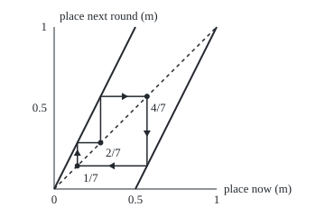

# The doubling map: doubling and dropping the whole part shifts the binary digits, which is why chaos can be proved

Differential equations and dynamics → Discrete Dynamics and Chaos → Chaos read off the digits → The doubling map

---

## General Overview

A strip of dough is 1 m long, with a raisin 0.7 m from its left end. Stretch the strip evenly to 2 m: the raisin moves to 1.4 m. Cut at the 1 m mark and lay the right-hand piece over the left. The raisin now sits at 0.4 m. Repeat: 0.8 m, 0.6 m, 0.2 m, then 0.4 m again.

Each round doubles the distance and throws away any whole metre: from here on, the **doubling map**, with the list of places called the **orbit**. In binary (base two, each place worth half the one before), 0.7 is 0.1011001100…. Doubling moves every digit one place left, and dropping the whole metre deletes the digit that crossed the point.

That makes chaos provable, not just observed: two raisins 0.612 nm apart, sharing 30 binary digits, are 0.657 m apart after 30 rounds.

**Doubling and dropping the whole part deletes the first binary digit, so after n rounds the place is the start's digits from place n + 1 on: errors double every round, cycles are repeating digit blocks, and one orbit can visit every stretch of the strip.**

**What kind of fact this is:** a theorem, proved on this card in Why it works; "period three implies chaos" is a theorem stated here and proved in Li and Yorke's 1975 paper, listed in Sources.

### The picture: the map and its three-round cycle

<p align="center"></p>

Drawn to scale: 1 m on either axis is 180 units. Solid lines: the map, broken at the cut. Dashed: next place equals current place. The cobweb ([iteration-and-cobweb-plots](01-iteration-and-cobweb-plots.md)) runs 1/7 → 2/7 → 4/7 and drops back to 1/7 m.

---

## The formula

Reminder: a map $x_{n+1} = g(x_n)$ gives the place after round n + 1 from the place after round n. "mod 1" means drop the whole part ([division-with-remainder](../../02-Number%20theory/01-Divisibility%20and%20Primes/04-division-with-remainder.md)).

$$x_{n+1} = 2x_n \bmod 1$$

**Read it aloud:** the next place is twice the current place, with any whole metre thrown away.

Write the start in binary as $x_0 = 0.b_1 b_2 b_3 \ldots$. The theorem:

$$x_n = 0.b_{n+1} b_{n+2} b_{n+3} \ldots \quad\text{(base two)}$$

**Read it aloud:** after n rounds the place is the start's binary digits with the first n deleted.

Deleting the first symbol of an endless string is the **shift**, $\sigma$; studying a map through the strings it shifts is **symbolic dynamics**. A start $y_0$ sharing N digits with $x_0$ stays within $2^{-(N-n)}$ of it for rounds n ≤ N, then parts; and the places back after n rounds are exactly

$$x = \frac{k}{2^n - 1}, \qquad k = 0, 1, \ldots, 2^n - 2.$$

| Symbol | Plain meaning | In our example | Push it up and the answer… |
| --- | --- | --- | --- |
| $x_n$ ($x_0$, $x_1$, $x_N$, $x$) | place after round n, in metres; $x_0$ or $x$ the start | 0.7, 0.4, 0.8 | first digit 1 from 0.5 m |
| $n$ | the round count | 30 | n digits used up |
| $b_k$ ($b_1$) | the start's k-th binary digit | $b_1 = 1$ | — |
| $\sigma$ | the shift: delete the first digit | 1011… becomes 011… | — |
| $y_n$ ($y_0$, $y_N$, $y$) | a second raisin's place | 1/7 m at round 30 | — |
| $N$ | leading digits two starts share | 30 | later parting |
| $k$ | labels the returning places | 1 gives 1/7 | — |
| $w$, $z$, $T$ | a digit block; the number listing every block; the tent map | 0110; 98 digits; 2/7 → 4/7 | — |

### When it holds

- **Exact numbers.** Floating point keeps finitely many digits, and the map eats one per round.
- **The whole part dropped.** Without "mod 1" nothing is shifted off and the raisin leaves the strip.
- **No strings ending in endless 1s.** 0.0111… and 0.1000… are both 0.5; the card uses the second form.
- **"Period three implies chaos" needs a continuous map of an interval.** The doubling map jumps at the cut, so the theorem is shown on the tent map; on a loop, rotation by a third has three-round cycles and no chaos.

---

## Why it works

### Step 0: doubling is a shift in base two

In base ten, multiplying by ten moves every digit one place left. In base two, doubling does the same ([place-value](../../01-Foundations/01-Everyday%20Arithmetic/01-place-value.md)). The digit that crosses the point is the whole part, and "mod 1" deletes it. One round is one shift.

<details>
<summary>Detailed proof</summary>

Write $x_0 = \sum_{k \ge 1} b_k 2^{-k}$, not ending in endless 1s. Then $2x_0 = b_1 + \sum_{k \ge 2} b_k 2^{-(k-1)}$ with the tail in [0, 1), so $x_1 = 0.b_2 b_3 \ldots$; induction does the rest.

**Sensitivity.** Flip digit N + 1 of $x$ to get $y$. Then $|x - y| = 2^{-(N+1)}$, and $x_N$, $y_N$ differ only in their first digit, so $|x_N - y_N| = 1/2$.

**Dense cycles.** Let $w$ be the first N digits of $x$. The point $0.www\ldots$ returns after N rounds and lies within $2^{-N}$ of $x$.

**Returning places.** $x_n = x_0$ means $2^n x_0 - x_0$ is a whole number $k$, so $x_0 = k/(2^n - 1)$ with $0 \le k < 2^n - 1$.

**A dense orbit.** Let $z$ list every binary word, shortest first. A stretch of width $2^{-N}$ holds the numbers starting with some word $w$ of length N; if $w$ starts at place m + 1 of $z$, round m puts $z$ in that stretch.

</details>

### Step 1: follow 0.7 digit by digit

0.7 is 0.1011001100110011… in binary: a 1, then 0110 forever. The places 0.7, 0.4, 0.8, 0.6, 0.2 have first digits 1, 0, 1, 1, 0: a 1 exactly when the place is 0.5 m or more. From round 1 the orbit cycles through four places: the block 0110 read aloud.

### Step 2: small errors double every round

A second raisin shares 0.7's first 30 digits and then carries the digits of 1/7. The two start 0.612 nm apart, a few atoms. Doubling doubles differences, so the gap doubles each round. After 30 rounds 0.7 is at 0.8 m and the neighbour at 1/7 m, 0.657 m apart; digit 31 of each start (1 against 0) now decides which half each lies in.

The Lyapunov exponent, the average separation rate per round in natural logarithms ([chaos-and-the-lyapunov-exponent](04-chaos-and-the-lyapunov-exponent.md)), is ln 2 = 0.693147 at every start. This is **sensitive dependence**: beside any start sits another that ends up far away. Flipping digit 31 alone gives 0.8 m and 0.3 m after 30 rounds, 0.5 m apart.

### Step 3: cycles are repeating blocks, and they are everywhere

A place returns after n rounds exactly when its digits repeat every n places. 1/7 is 0.001001001…, so 1/7 → 2/7 → 4/7 → 1/7. The block 011 gives 3/7 → 6/7 → 5/7 → 3/7. With 0, which never moves, that is 2^3 − 1 = 7 places back after three rounds; after four there are 15.

Repeating any start's first 30 digits forever gives a cycle within 2^−30 m of it: **periodic points are dense**.

### Step 4: one orbit that visits everywhere

Write every binary word in a row, shortest first: 0, 1, 00, 01, 10, 11, 000, … . Words of length 1 to 4 fill 98 digits; shifting through them, the first four digits run over all 16 patterns, so the raisin enters every stretch of width 1/16 m. The full list enters every stretch of every width: **a dense orbit**.

### Step 5: Devaney's three conditions

Robert Devaney calls a map **chaotic** when it has sensitive dependence (Step 2), dense periodic points (Step 3) and a dense orbit (Step 4; his word is **transitive**). The doubling map has all three, proved from the digits alone.

<details>
<summary>One of the three is redundant</summary>

Banks and co-authors showed in 1992 that for a continuous map on an infinite set, dense cycles and a dense orbit force sensitivity. Glue the strip's ends into a loop and the doubling map qualifies.

</details>

### Step 6: period three implies chaos

Li and Yorke proved in 1975: if a continuous map of an interval to itself has a point that returns after exactly three rounds, it has cycles of every length, and uncountably many starts whose orbits keep drawing close and parting forever. Sharkovskii had proved the first half in 1964.

The doubling map jumps at the cut, so the theorem is shown on the **tent map** $T$: stretch to 2 m and fold back instead of cutting. It has the cycle 2/7 → 4/7 → 6/7 → 2/7, so the conclusion applies. The logistic map of [the-logistic-map-and-period-doubling](03-the-logistic-map-and-period-doubling.md) has a window of three-round cycles, so every cycle length appears there.

---

## Worked numbers, by hand

| Step | Arithmetic | Value |
| --- | --- | --- |
| round 1 | 2 × 0.7 = 1.4, drop the 1 | 0.4 m |
| round 2 | 2 × 0.4 = 0.8 | 0.8 m |
| round 3 | 2 × 0.8 = 1.6, drop the 1 | 0.6 m |
| round 4 | 2 × 0.6 = 1.2, drop the 1; next, 0.4 again | 0.2 m |
| digits read off | 1 where the place is 0.5 m or more | 0.10110… |
| the three-round cycle | 2 × 1/7, 2 × 2/7, 2 × 4/7 with the 1 dropped | **1/7 → 2/7 → 4/7 → 1/7** |
| sensitivity | 0.612 nm doubled 30 times | **0.657 m** |

The place after 30 rounds is set by digits no kneader could measure.

### What breaks if you drop a piece

| Mistake | Comes out at | What went wrong |
| --- | --- | --- |
| Iterate 0.7 in floating point | exactly 0 after 52 steps | stored digits stop at place 52; one deleted per round |
| Double without dropping the whole part | 751619276.8 m after 30 rounds | nothing shifted off; the raisin leaves the strip |
| Rotation by a third, on a loop | three-round cycles everywhere; gap stays 0.612 nm | not an interval map, nothing stretched |

---

## Code, from first principles, and it actually runs

Road one keeps each place as an exact fraction p/q, so a round is p → 2p mod q, with no rounding. Road two writes binary digits by long division and shifts them. The roads must agree for 30 rounds; then the code measures the gap, counts returning places by brute force against the formula, and checks the dense orbit both ways.

### Python

```python
# The doubling map -- the check behind the card.  Only math.log is imported.  A place
# on the 1 m strip is an exact fraction p/q, so "double, drop the whole metre" is
# p -> 2p mod q (road one); road two shifts the binary digits.  They must agree.
import math
def digits(p, q, k):                  # road two: first k binary digits of p/q
    out = []
    for _ in range(k):
        out.append(2 * p // q)
        p = 2 * p % q
    return out
def orbit(p, q, n):                   # road one: n exact steps of p -> 2p mod q
    for _ in range(n):
        p = 2 * p % q
    return p

def gcd(a, b): return gcd(b, a % b) if b else a    # Euclid, written out
def returners(n):                     # every fraction p/q, q <= 64, back after n steps
    return {(p // gcd(p, q), q // gcd(p, q)) for q in range(1, 65) for p in range(q) if orbit(p, q, n) == p}

M, d = 2 ** 30, digits(7, 10, 70)
agree = all(digits(orbit(7, 10, n), 10, 40) == d[n:n + 40] for n in range(31))
bp, bq = 7 * (7 * M // 10) + 1, 7 * M        # neighbour: 0.7's first 30 digits, then 1/7's
g0n, g0d = 49 * M - 10 * bp, 70 * M          # gap at the start, exact: 0.7 - neighbour
p30, b30 = orbit(7, 10, 30), orbit(bp, bq, 30)
g30n, g30d = p30 * bq - 10 * b30, 10 * bq    # gap after 30 steps, exact
words = "".join(format(w, "0%db" % L) for L in range(1, 5) for w in range(2 ** L))
cells_digits = {int(words[m:m + 4], 2) for m in range(len(words) - 3)}
cells_exact = {16 * orbit(int(words, 2), 2 ** len(words), m) // 2 ** len(words) for m in range(len(words) - 3)}
x, drop = 0.7, 0
while x != 0.0:
    x, drop = 2 * x % 1.0, drop + 1
ra, rb = 147 * M, 30 * bp                    # rotation by a third, over the denominator 210 M
for _ in range(30):
    ra, rb = (ra + 70 * M) % (210 * M), (rb + 70 * M) % (210 * M)
print("0.7 m in binary: 0." + "".join(map(str, d[:16])) + "...")
print("orbit of 0.7 m, steps 0 to 8:", " ".join(f"{orbit(7, 10, n) / 10:.1f}" for n in range(9)))
print("doubled, before the cut, rounds 1 to 5:", " ".join(f"{2 * orbit(7, 10, n) / 10:.1f}" for n in range(5)))
print("half it lands in (1 = right), steps 0 to 8:", " ".join(str(b) for b in d[:9]))
print("exact fractions and shifted digits agree for 30 steps:", "yes" if agree else "no")
print(f"neighbour: 0.7's first 30 digits, then 1/7's; gap at the start {g0n / g0d * 1e9:.3f} nm")
print(f"digit 31: 0.7 has {d[30]}, the neighbour has {digits(bp, bq, 31)[30]}")
print(f"after 30 steps: 0.7 -> {p30 / 10:.1f}, neighbour -> {b30 / bq:.6f} = 1/7; gap {g30n / g30d:.3f} m")
print(f"flip digit 31 alone: after 30 steps 0.7 -> {p30 / 10:.1f}, flipped -> {orbit(7 * 2 * M - 10, 20 * M, 30) / (20 * M):.1f}; gap {p30 / 10 - orbit(7 * 2 * M - 10, 20 * M, 30) / (20 * M):.1f} m")
print(f"gap multiplied per step: {((g30n / g30d) / (g0n / g0d)) ** (1 / 30):.6f}; Lyapunov exponent ln 2 = {math.log((g30n / g30d) / (g0n / g0d)) / 30:.6f}")
print("period-3 orbit: 1/7 -> 2/7 -> 4/7 ->", f"{orbit(4, 7, 1)}/7, binary 0." + "".join(map(str, digits(1, 7, 9))) + "...;",
      f"the other: 3/7 -> {orbit(3, 7, 1)}/7 -> {orbit(3, 7, 2)}/7 -> {orbit(3, 7, 3)}/7")
print(*(f"points back after {n} steps, brute force over q <= 64: {len(returners(n))}; formula 2^{n} - 1 = {2 ** n - 1}" for n in (3, 4)), sep="\n")
print(f"all words of length 1 to 4 in a row: {len(words)} digits; 1/16 m cells visited: {len(cells_digits)} by digits, {len(cells_exact)} by fractions")
tent = [2]                                   # tent map on sevenths: 2x left of 1/2, 2 - 2x right
while len(tent) < 4: tent.append(2 * tent[-1] if 2 * tent[-1] <= 7 else 14 - 2 * tent[-1])
print("tent map period 3:", " -> ".join(f"{t}/7" for t in tent))
print(f"mistake 1, floating point: 0.7 as a double reaches exactly 0 after {drop} steps")
print(f"mistake 2, no mod 1: 0.7 m doubled 30 times = {7 * M / 10:.1f} m")
print(f"mistake 3, rotation by a third: period 3 everywhere, gap after 30 steps {(ra - rb) % (210 * M) / (210 * M) * 1e9:.3f} nm")
print("figure, 1 m = 180 units, (x, y) of 1/7 2/7 4/7:", *(f"({60 + 180 * k / 7:.2f}, {210 - 180 * k / 7:.2f})" for k in (1, 2, 4)))
assert agree and int("".join(map(str, d[:40])), 2) == 7 * 2 ** 40 // 10   # digits right, roads agree
assert g30n * g0d == M * g0n * g30d and digits(bp, bq, 60)[30:] == digits(1, 7, 30)
assert [len(returners(n)) for n in (3, 4)] == [2 ** 3 - 1, 2 ** 4 - 1]
assert cells_digits == cells_exact == set(range(16))
print("ALL CHECKS PASS")
```

**Ran 2026-09-28 on macOS, Python 3.14.6, standard library only. All checks passed. Output, pasted from the run:**

```
0.7 m in binary: 0.1011001100110011...
orbit of 0.7 m, steps 0 to 8: 0.7 0.4 0.8 0.6 0.2 0.4 0.8 0.6 0.2
doubled, before the cut, rounds 1 to 5: 1.4 0.8 1.6 1.2 0.4
half it lands in (1 = right), steps 0 to 8: 1 0 1 1 0 0 1 1 0
exact fractions and shifted digits agree for 30 steps: yes
neighbour: 0.7's first 30 digits, then 1/7's; gap at the start 0.612 nm
digit 31: 0.7 has 1, the neighbour has 0
after 30 steps: 0.7 -> 0.8, neighbour -> 0.142857 = 1/7; gap 0.657 m
flip digit 31 alone: after 30 steps 0.7 -> 0.8, flipped -> 0.3; gap 0.5 m
gap multiplied per step: 2.000000; Lyapunov exponent ln 2 = 0.693147
period-3 orbit: 1/7 -> 2/7 -> 4/7 -> 1/7, binary 0.001001001...; the other: 3/7 -> 6/7 -> 5/7 -> 3/7
points back after 3 steps, brute force over q <= 64: 7; formula 2^3 - 1 = 7
points back after 4 steps, brute force over q <= 64: 15; formula 2^4 - 1 = 15
all words of length 1 to 4 in a row: 98 digits; 1/16 m cells visited: 16 by digits, 16 by fractions
tent map period 3: 2/7 -> 4/7 -> 6/7 -> 2/7
mistake 1, floating point: 0.7 as a double reaches exactly 0 after 52 steps
mistake 2, no mod 1: 0.7 m doubled 30 times = 751619276.8 m
mistake 3, rotation by a third: period 3 everywhere, gap after 30 steps 0.612 nm
figure, 1 m = 180 units, (x, y) of 1/7 2/7 4/7: (85.71, 184.29) (111.43, 158.57) (162.86, 107.14)
ALL CHECKS PASS
```

### Rust

Same numbers, same labels, built with `rustc --edition 2021 -O`.

```rust
// The doubling map -- the same check as the Python, in Rust.  No crates.  A place
// on the 1 m strip is an exact fraction p/q, so "double, drop the whole metre" is
// p -> 2p mod q (road one); road two shifts the binary digits.  They must agree.
use std::collections::BTreeSet;

fn digits(mut p: u128, q: u128, k: usize) -> Vec<u128> {   // road two: first k binary digits of p/q
    let mut out = Vec::new();
    for _ in 0..k { out.push(2 * p / q); p = 2 * p % q }
    out
}
fn orbit(mut p: u128, q: u128, n: usize) -> u128 {          // road one: n exact steps of p -> 2p mod q
    for _ in 0..n { p = 2 * p % q }
    p
}
fn gcd(a: u128, b: u128) -> u128 { if b == 0 { a } else { gcd(b, a % b) } }   // Euclid, written out
fn returners(n: usize) -> usize {                           // every fraction p/q, q <= 64, back after n steps
    let mut s = BTreeSet::new();
    for q in 1..65u128 { for p in 0..q { if orbit(p, q, n) == p { s.insert((p / gcd(p, q), q / gcd(p, q))); } } }
    s.len()
}
fn join(v: &[u128]) -> String { v.iter().map(|b| b.to_string()).collect::<String>() }

fn main() {
    let m: u128 = 1 << 30;
    let d = digits(7, 10, 70);
    let agree = (0..31).all(|n| digits(orbit(7, 10, n), 10, 40) == d[n..n + 40].to_vec());
    let (bp, bq) = (7 * (7 * m / 10) + 1, 7 * m);          // neighbour: 0.7's first 30 digits, then 1/7's
    let (g0n, g0d) = (49 * m - 10 * bp, 70 * m);            // gap at the start, exact: 0.7 - neighbour
    let (p30, b30) = (orbit(7, 10, 30), orbit(bp, bq, 30));
    let (g30n, g30d) = (p30 * bq - 10 * b30, 10 * bq);      // gap after 30 steps, exact
    let (g0, g30) = (g0n as f64 / g0d as f64, g30n as f64 / g30d as f64);
    let words: String = (1..5usize).flat_map(|l| (0..(1u32 << l)).map(move |w| format!("{:0width$b}", w, width = l))).collect();
    let len = words.len();
    let cells_digits: BTreeSet<u128> = (0..len - 3).map(|i| u128::from_str_radix(&words[i..i + 4], 2).unwrap()).collect();
    let (big_p, big_q) = (u128::from_str_radix(&words, 2).unwrap(), 1u128 << len);
    let cells_exact: BTreeSet<u128> = (0..len - 3).map(|i| orbit(big_p, big_q, i) / (big_q / 16)).collect();
    let (mut x, mut drop) = (0.7f64, 0);
    while x != 0.0 { x = (2.0 * x) % 1.0; drop += 1 }
    let (mut ra, mut rb) = (147 * m, 30 * bp);              // rotation by a third, over the denominator 210 m
    for _ in 0..30 { ra = (ra + 70 * m) % (210 * m); rb = (rb + 70 * m) % (210 * m) }
    println!("0.7 m in binary: 0.{}...", join(&d[..16]));
    let orb: Vec<String> = (0..9).map(|n| format!("{:.1}", orbit(7, 10, n) as f64 / 10.0)).collect();
    println!("orbit of 0.7 m, steps 0 to 8: {}", orb.join(" "));
    let dbl: Vec<String> = (0..5).map(|n| format!("{:.1}", 2.0 * orbit(7, 10, n) as f64 / 10.0)).collect();
    println!("doubled, before the cut, rounds 1 to 5: {}", dbl.join(" "));
    let halves: Vec<String> = d[..9].iter().map(|b| b.to_string()).collect();
    println!("half it lands in (1 = right), steps 0 to 8: {}", halves.join(" "));
    println!("exact fractions and shifted digits agree for 30 steps: {}", if agree { "yes" } else { "no" });
    println!("neighbour: 0.7's first 30 digits, then 1/7's; gap at the start {:.3} nm", g0 * 1e9);
    println!("digit 31: 0.7 has {}, the neighbour has {}", d[30], digits(bp, bq, 31)[30]);
    println!("after 30 steps: 0.7 -> {:.1}, neighbour -> {:.6} = 1/7; gap {:.3} m", p30 as f64 / 10.0, b30 as f64 / bq as f64, g30);
    let flip = orbit(7 * 2 * m - 10, 20 * m, 30) as f64 / (20 * m) as f64;   // 0.7 with digit 31 flipped from 1 to 0
    println!("flip digit 31 alone: after 30 steps 0.7 -> {:.1}, flipped -> {:.1}; gap {:.1} m", p30 as f64 / 10.0, flip, p30 as f64 / 10.0 - flip);
    println!("gap multiplied per step: {:.6}; Lyapunov exponent ln 2 = {:.6}", (g30 / g0).powf(1.0 / 30.0), (g30 / g0).ln() / 30.0);
    println!("period-3 orbit: 1/7 -> 2/7 -> 4/7 -> {}/7, binary 0.{}...; the other: 3/7 -> {}/7 -> {}/7 -> {}/7",
             orbit(4, 7, 1), join(&digits(1, 7, 9)), orbit(3, 7, 1), orbit(3, 7, 2), orbit(3, 7, 3));
    for n in [3usize, 4] {
        println!("points back after {} steps, brute force over q <= 64: {}; formula 2^{} - 1 = {}", n, returners(n), n, (1 << n) - 1);
    }
    println!("all words of length 1 to 4 in a row: {} digits; 1/16 m cells visited: {} by digits, {} by fractions",
             len, cells_digits.len(), cells_exact.len());
    let mut tent: Vec<u128> = vec![2];                      // tent map on sevenths: 2x left of 1/2, 2 - 2x right
    while tent.len() < 4 { let t = tent[tent.len() - 1]; tent.push(if 2 * t <= 7 { 2 * t } else { 14 - 2 * t }) }
    let tv: Vec<String> = tent.iter().map(|t| format!("{}/7", t)).collect();
    println!("tent map period 3: {}", tv.join(" -> "));
    println!("mistake 1, floating point: 0.7 as a double reaches exactly 0 after {} steps", drop);
    println!("mistake 2, no mod 1: 0.7 m doubled 30 times = {:.1} m", 7.0 * m as f64 / 10.0);
    println!("mistake 3, rotation by a third: period 3 everywhere, gap after 30 steps {:.3} nm",
             ((ra + 210 * m - rb) % (210 * m)) as f64 / (210 * m) as f64 * 1e9);
    let fig: Vec<String> = [1.0, 2.0, 4.0].iter().map(|k: &f64| format!("({:.2}, {:.2})", 60.0 + 180.0 * k / 7.0, 210.0 - 180.0 * k / 7.0)).collect();
    println!("figure, 1 m = 180 units, (x, y) of 1/7 2/7 4/7: {}", fig.join(" "));
    assert!(agree && u128::from_str_radix(&join(&d[..40]), 2).unwrap() == 7 * (1u128 << 40) / 10);   // digits right, roads agree
    assert!(g30n * g0d == m * g0n * g30d && digits(bp, bq, 60)[30..].to_vec() == digits(1, 7, 30));
    assert!([returners(3), returners(4)] == [(1 << 3) - 1, (1 << 4) - 1]);
    assert!(cells_digits == cells_exact && cells_exact == (0..16u128).collect::<BTreeSet<u128>>());
    println!("ALL CHECKS PASS");
}
```

**Ran 2026-09-28 on macOS, rustc 1.98.1, no crates. All checks passed. Output, pasted from the run:**

```
0.7 m in binary: 0.1011001100110011...
orbit of 0.7 m, steps 0 to 8: 0.7 0.4 0.8 0.6 0.2 0.4 0.8 0.6 0.2
doubled, before the cut, rounds 1 to 5: 1.4 0.8 1.6 1.2 0.4
half it lands in (1 = right), steps 0 to 8: 1 0 1 1 0 0 1 1 0
exact fractions and shifted digits agree for 30 steps: yes
neighbour: 0.7's first 30 digits, then 1/7's; gap at the start 0.612 nm
digit 31: 0.7 has 1, the neighbour has 0
after 30 steps: 0.7 -> 0.8, neighbour -> 0.142857 = 1/7; gap 0.657 m
flip digit 31 alone: after 30 steps 0.7 -> 0.8, flipped -> 0.3; gap 0.5 m
gap multiplied per step: 2.000000; Lyapunov exponent ln 2 = 0.693147
period-3 orbit: 1/7 -> 2/7 -> 4/7 -> 1/7, binary 0.001001001...; the other: 3/7 -> 6/7 -> 5/7 -> 3/7
points back after 3 steps, brute force over q <= 64: 7; formula 2^3 - 1 = 7
points back after 4 steps, brute force over q <= 64: 15; formula 2^4 - 1 = 15
all words of length 1 to 4 in a row: 98 digits; 1/16 m cells visited: 16 by digits, 16 by fractions
tent map period 3: 2/7 -> 4/7 -> 6/7 -> 2/7
mistake 1, floating point: 0.7 as a double reaches exactly 0 after 52 steps
mistake 2, no mod 1: 0.7 m doubled 30 times = 751619276.8 m
mistake 3, rotation by a third: period 3 everywhere, gap after 30 steps 0.612 nm
figure, 1 m = 180 units, (x, y) of 1/7 2/7 4/7: (85.71, 184.29) (111.43, 158.57) (162.86, 107.14)
ALL CHECKS PASS
```

> [!TIP]
> **Try changing**
> - **Start at 1/7.** Guess the places first. In the orbit line, replace `orbit(7, 10, n) / 10` by `orbit(1, 7, n) / 7`. Answer: the three places of the cycle, over and over.
> - **Triple instead of double.** Change 2 to 3 in the exact step. Guess first: do the roads agree? Answer: no, the first assert fails; tripling shifts base-three digits.
> - **Words up to length 5.** Guess first: still every 1/16 m stretch? Answer: yes, 16 of 16; finer cells need the 16 changed too.

---

## The usual mistake

> [!warning]
> **Trusting a computer's orbit.** A double stores 0.7 as a fraction whose binary digits stop at place 52, and the map deletes one per round, so the computed orbit hits exactly 0 after 52 steps; the true one cycles forever.
>
> - **Sensitivity taken for chaos.** Doubling without "mod 1" doubles gaps too, but sends 0.7 m to 751619276.8 m, with no cycles.
> - **A three-round cycle taken for chaos anywhere.** Rotation by a third has one at every point, and a 0.612 nm gap stays 0.612 nm.
> - **Every start taken as wandering.** 0.7 is a fraction, so from round 1 its orbit repeats a cycle of four. Chaos describes all starts together.

---

## Where you meet it in real life

- **Kneading and mixing.** Stretch-and-fold is the tent map: each pass pulls neighbouring particles apart, which is why dough and mixers mix.
- **Simulation and forecasting.** A chaotic orbit uses up the start's digits at a steady rate, so extra precision buys few rounds. [the-lorenz-system-and-strange-attractors](06-the-lorenz-system-and-strange-attractors.md) shows it in a weather model.
- **Labelling orbits by symbols.** Recording "left or right half" each round turns an orbit into 0s and 1s, as for the logistic map's cycles in [the-logistic-map-and-period-doubling](03-the-logistic-map-and-period-doubling.md).

> **Say it back**
> Doubling a place on a 1 m strip and dropping the whole metre deletes its first binary digit. So the orbit reads the start's digits aloud, and starts sharing 30 digits part after 30 rounds. Cycles are repeating blocks, found in every stretch, and one orbit built from all binary words visits every stretch: Devaney's chaos. For continuous maps of an interval, one three-round cycle forces chaos.

---

## What this builds on

- [chaos-and-the-lyapunov-exponent](04-chaos-and-the-lyapunov-exponent.md): the separation rate, here ln 2 per round at every start.
- [place-value](../../01-Foundations/01-Everyday%20Arithmetic/01-place-value.md): digits each worth a fixed fraction of the one before, here in base two.
- [division-with-remainder](../../02-Number%20theory/01-Divisibility%20and%20Primes/04-division-with-remainder.md): "mod 1" keeps the remainder.

## Where this goes next

- [the-lorenz-system-and-strange-attractors](06-the-lorenz-system-and-strange-attractors.md): stretching and folding inside three smooth rate equations.

---

## Sources

Verified 2026-09-28: every link below resolves to the publisher's page.

- Devaney, Robert L. *A First Course in Chaotic Dynamical Systems: Theory and Experiment*, 2nd ed. CRC Press. [Publisher page](https://www.routledge.com/An-Introduction-to-Chaotic-Dynamical-Systems/Devaney/p/book/9780367235994). The doubling map, the shift, the definition of chaos.
- Strogatz, Steven H. *Nonlinear Dynamics and Chaos*, 2nd ed. CRC Press. [Publisher page](https://www.routledge.com/Nonlinear-Dynamics-and-Chaos-With-Applications-to-Physics-Biology-Chemistry-and-Engineering/Strogatz/p/book/9780367026509). One-dimensional maps and the Lorenz system.
- Li, Tien-Yien, and James A. Yorke. "Period Three Implies Chaos." *The American Mathematical Monthly* 82 (1975), 985–992. [DOI](https://doi.org/10.1080/00029890.1975.11994008). The theorem in Step 6.
- Banks, J., J. Brooks, G. Cairns, G. Davis, and P. Stacey. "On Devaney's Definition of Chaos." *The American Mathematical Monthly* 99 (1992), 332–334. [DOI](https://doi.org/10.1080/00029890.1992.11995856). Dense cycles and a dense orbit imply sensitivity.
