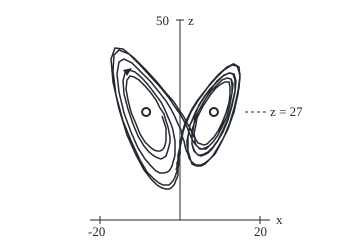
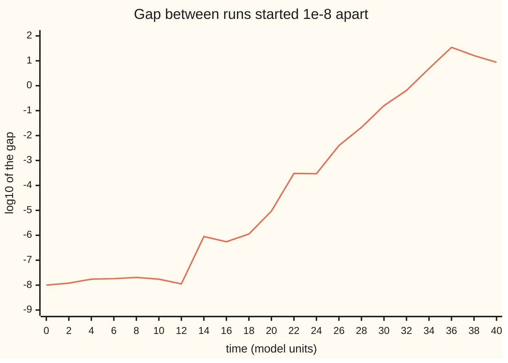

# The Lorenz system: three weather equations that never settle and never repeat, on a butterfly no thicker than a sheet

[Syllabus](../../../SYLLABUS.md) → [Differential equations and dynamics](../README.md) → [Discrete Dynamics and Chaos](../README.md#s11) → The Lorenz system

---

## General Overview

Heat a shallow layer of air from below. Warm air rises, cool air sinks, and the layer turns in rolling cylinders. In 1963 the meteorologist Edward Lorenz cut its equations down to three numbers: how fast the roll turns, the temperature gap between its rising and sinking sides, and how far the temperature profile is bent from a straight line.

At Lorenz's heating the roll turns one way, then flips, again and again, with no pattern. It never settles and never repeats.

Two copies started one part in a hundred million apart agree to within 0.002 for 25 time units; by 35 they differ by 8.3, like unrelated states. The path loops round two centres, (8.49, 8.49, 27) and (−8.49, −8.49, 27): a butterfly's wings. Almost every start ends on that butterfly, a set with no volume.

**The Lorenz system is three rate laws for a heated roll of air whose paths stay bounded, are held by no resting point, squeeze every volume to nothing and pull nearby starts apart exponentially, so they settle onto a thin, never-repeating set: a strange attractor.**

**What kind of fact this is:** a model of a heated layer, not a law of weather; its resting points, boundedness and shrinking volume are proved in Why it works, and that the butterfly is a true strange attractor is Warwick Tucker's 2002 theorem, stated, not proved.

### The picture: the butterfly, side-on

<p align="center"></p>

Scale: 4 units per unit of $x$ and $z$ (pure numbers), origin at the foot of the vertical axis. Time 15 to 25, a printed point every 0.025. Circles: the lobe centres, never reached. Triangle: direction of travel.

---

## The formula

A prime means rate of change in time, so $x'$ is how fast $x$ changes.

$$x' = \sigma(y - x), \qquad y' = x(\rho - z) - y, \qquad z' = xy - \beta z.$$

**Read it aloud:** the roll chases the temperature gap; the gap is fed by the roll, eaten by the bend, and fades; the bend grows when roll and gap act together, and fades at rate beta.

Lorenz's values: $\sigma = 10$, $\rho = 28$, $\beta = 8/3$, start (1, 1, 1). The resting points, where all three rates vanish, are the origin and the two **lobe centres**

$$C_\pm = \left(\pm\sqrt{\beta(\rho - 1)},\ \pm\sqrt{\beta(\rho - 1)},\ \rho - 1\right) = (\pm 8.485281,\ \pm 8.485281,\ 27).$$

The Jacobian $J$, the table of partial slopes of the three rates ([Linearisation](../06-Nonlinear%20Dynamics%20in%20the%20Plane/02-linearisation-and-the-jacobian.md)), is `[[-sigma, sigma, 0], [rho - z, -1, -x], [y, x, -beta]]`. Its diagonal sum, the **divergence**, is $-(\sigma + 1 + \beta) = -13.666667$ everywhere: the rate at which the flow shrinks volume.

| Symbol | Plain meaning | In our example | Push it up and the answer… |
| --- | --- | --- | --- |
| $x$, $y$, $z$ | roll speed; temperature gap; bend of the profile | start (1, 1, 1) | — |
| $t$ | time, in the model's scaled units | agreement until about 25 | — |
| $\sigma$ | how fast friction evens out motion, relative to how fast heat spreads | 10 | faster roll response |
| $\rho$ | heating, relative to the least that starts a roll | 28 | above 24.736842 no resting point attracts |
| $\beta$ | a shape factor of the roll's cell | 8/3 = 2.666667 | faster fading of the bend |
| $C_\pm$ | the two lobe centres, resting points | (±8.485281, ±8.485281, 27) | move out as $\rho$ grows |
| $J$, $\lambda$ | the Jacobian; its eigenvalues, growth rates of nudges near a resting point | at the lobes −13.854578 and 0.093956 ± 10.194505i | positive real part: nudges grow |
| $\Lambda$ | long-run growth rate of the gap between two runs, the Lyapunov exponent | 0.917773 | shorter forecast horizon |

### When it holds

- **Three variables.** In the plane a trapped, restless path must close into a loop ([Poincare-Bendixson](../06-Nonlinear%20Dynamics%20in%20the%20Plane/09-poincare-bendixson-and-bendixsons-criterion.md)).
- **Heating above 24.736842.** Below it the lobe centres attract nearby paths (from about 24.06 they share space with the butterfly); at $\rho = 20$ the path from (1, 1, 1) rests at (−7.118052, −7.118052, 19).
- **As air, only near the onset of rolling.** Lorenz dropped every other motion; the chaos is exact, the match to air is not.
- **No exact arithmetic.** Each computed step is a nudge, so one run is faithful only until nudges grow.

---

## Why it works

### Step 0: stretch, squeeze, stay bounded

Chaos in a flow needs three things at once: nearby paths separate, paths stay bounded, and volume shrinks, so paths crowd onto a thin set instead of a solid lump. Steps 2 and 3 prove the bounds and the squeeze; Step 4 measures the separation.

### Step 1: three resting points

Set all rates to zero. The first law gives $y = x$; the third, $x^2 = \beta z$; the second, $x(\rho - 1 - z) = 0$. So $x = 0$, the origin, or $z = 27$ and $x^2 = 72$, so $x = \pm 8.485281$. Newton's method (repeatedly solving the straight-line approximation) from (8, 8, 25) lands on the same point.

### Step 2: none of them holds the path

Near a resting point a nudge grows or shrinks like $e^{\lambda t}$, for each eigenvalue $\lambda$ of $J$. At the origin they are the roots of $\lambda^2 + 11\lambda - 270 = 0$, and $-\beta$: 11.827723, −22.827723, −2.666667. One is positive: the origin repels along one direction.

At a lobe centre they solve

$$\lambda^3 + (\sigma + \beta + 1)\lambda^2 + \beta(\sigma + \rho)\lambda + 2\sigma\beta(\rho - 1) = 0,$$

with roots −13.854578 and 0.093956 ± 10.194505i: a fast pull onto a surface, and a slow outward spiral round the centre. Their sum, pairwise products and product match the matrix's trace (−13.666667), 2-by-2 minors (101.333333) and determinant (−1440). The real part crosses zero at $\rho = 24.736842$; above it, no resting point holds nearby paths.

### Step 3: every path is trapped, and volume shrinks to nothing

A squared distance from a point high on the $z$ axis falls whenever the path is far out, so every path enters a fixed ball and stays.

<details>
<summary>Detailed proof: the trapping ball</summary>

Let V be $x^2 + y^2 + (z - \sigma - \rho)^2$. Differentiate along a path and substitute the laws; the cross terms cancel:

$V' = -2\sigma x^2 - 2y^2 - 2\beta\left(z - \tfrac{\sigma + \rho}{2}\right)^2 + \tfrac{\beta(\sigma + \rho)^2}{2}.$

This is negative outside the ellipsoid $\sigma x^2 + y^2 + \beta(z - \tfrac{\sigma + \rho}{2})^2 = \tfrac{\beta(\sigma + \rho)^2}{4}$. Let M be V's largest value on that ellipsoid. Where V is at least M + 1 it falls at a rate bounded away from zero, so every path reaches V at most M + 1 in finite time and stays.

</details>

A box of starts carried by the flow changes volume at the divergence times its volume (Liouville's formula). The divergence is constant, so volume is multiplied by $e^{-13.666667\,t}$, by 0.001077 every half unit; a flowed box of side 1e-6 measures the same. Paths end in a bounded set of zero volume: the butterfly.

### Step 4: nearby starts separate exponentially

Runs from (1, 1, 1) and (1.00000001, 1, 1) stay below 2e-8 apart until about time 12, spiralling near one lobe centre. Then the gap grows from 2.4e-07 at time 15 to 0.16 at 30, a rate of 0.894374 per unit.

The second road uses one run. It carries a small arrow along the path by $J$ and rescales it each time unit; the average log-stretch over 500 units is the **Lyapunov exponent** $\Lambda$ = 0.917773, the exponent of [The Lyapunov exponent](04-chaos-and-the-lyapunov-exponent.md) for a flow. From 1e-8 to the butterfly's size, about 10, takes $\ln(10^9)/\Lambda$ = 22.58 units after the calm spell. Each extra digit buys 2.51 units.

The flow stretches one direction at 0.917773, leaves the direction of travel alone, and squeezes the third at 14.5844, summing to the divergence. The Kaplan-Yorke estimate of dimension, the two unsqueezed directions plus the share of the squeezed one that the stretch fills ([Fractals](../../05-Geometry%20and%20trig/07-Points%2C%20Convexity%20and%20Fractals/05-self-similarity-and-fractal-dimension.md)) is 2 + 0.9178/14.5844 = 2.0629: a sheet, plus a sliver.

### Step 5: attractor, basin, Poincaré section

An **attractor** is a closed, bounded set that paths on it never leave, that pulls in every path starting near it, and no smaller piece of which does the same. Its **basin** is every start whose path approaches it. A **strange attractor** separates nearby paths exponentially. The butterfly's basin appears to be all of space except the resting points and the paths that run into them, such as the $z$ axis, which leads straight to the origin. From (1, 1, 1), (30, −40, 90) and (−0.01, 0, 0) the average height over 200 units is 23.49, 23.53 and 23.56.

A **Poincaré section** records the flow only when it crosses a chosen surface, turning it into a map, a rule $x_{n+1} = g(x_n)$ ([Iteration](01-iteration-and-cobweb-plots.md)). Lorenz recorded each top, where $z$ stops rising: 134 tops from time 10 to 110, between 31.82 and 45.61. Each top against the next falls on a thin tent-shaped curve, a one-dimensional map. Every top below 38.5 was followed by a higher one, 84 of 84; the first, 33.84, 34.57, 35.50, 36.78, 38.82, 42.98, climb by growing steps, Step 2's widening spiral seen once a lap.

---

## Worked numbers, by hand

| Step | Arithmetic | Value |
| --- | --- | --- |
| lobe height | $\rho - 1$ | 27 |
| lobe width | $x^2 = \beta \times 27$ = 72, square root | **±8.485281** |
| volume after half a unit | $e^{0.5 \times (-13.666667)}$ | 0.001077 |
| heating threshold | $\sigma(\sigma + \beta + 3)/(\sigma - \beta - 1)$ | 24.736842 |
| gap at time 25, 30, 35 | from the two runs | 2.0e-03, 0.16, **8.3** |
| stretch time, 1e-8 to 10 | $\ln(10^9) / 0.917773$ | 22.58 |

### What breaks if you drop a piece

| Mistake | Comes out at | What went wrong |
| --- | --- | --- |
| Heating 20 instead of 28 | rests at (−7.118052, −7.118052, 19) | Below 24.736842 the lobe centres attract |
| One run trusted as the true path | halving the step moves it 1.2e-02 by time 25, 1.1 by 30 | Step error is a nudge, and grows like one |
| Slow start read as stability | gap 1.2e-08 at time 5, 1.8e-08 at 10, 2.0e-03 at 25 | A calm spell near a lobe is not a stable state |

---

## How two runs drift apart

The chart plots the base-10 logarithm of their gap.



One line, the logged gap every 2 units: flat until 12, then up one power of ten every 2.51 units, then a ceiling near 1, a gap of about 10, the butterfly's size.

---

## Code, from first principles, and it actually runs

Runge-Kutta 4, written out, steps every run. Four asserts each compare two roads: formula and Newton; cubic and matrix; divergence and a flowed box; two runs and a carried arrow.

### Python

```python
# The Lorenz system -- the check behind the card.  Only math primitives imported; RK4 written out.  Two roads each time:
# formula vs Newton, eigenvalue cubic vs Jacobian trace and det, divergence vs a flowed box, separation vs tangent rate.
from math import sqrt, log, exp, log10
S, R, B = 10.0, 28.0, 8.0 / 3.0
def F(p, r=R): x, y, z = p; return (S * (y - x), x * (r - z) - y, x * y - B * z)
def J(p, r=R): x, y, z = p; return ((-S, S, 0.0), (r - z, -1.0, -x), (y, x, -B))
def ax(p, k, c): return tuple(p[i] + c * k[i] for i in range(len(p)))
def rk4(f, p, h, n):                                   # Runge-Kutta 4, four slopes weighted 1-2-2-1
    for _ in range(n):
        k1 = f(p); k2 = f(ax(p, k1, h / 2)); k3 = f(ax(p, k2, h / 2)); k4 = f(ax(p, k3, h))
        p = tuple(p[i] + h * (k1[i] + 2 * k2[i] + 2 * k3[i] + k4[i]) / 6 for i in range(len(p)))
    return p
def det(m): return m[0][0] * (m[1][1] * m[2][2] - m[1][2] * m[2][1]) - m[0][1] * (m[1][0] * m[2][2] - m[1][2] * m[2][0]) + m[0][2] * (m[1][0] * m[2][1] - m[1][1] * m[2][0])
def solve(m, v): d = det(m); return tuple(det([[v[i] if j == k else m[i][j] for j in range(3)] for i in range(3)]) / d for k in range(3))
dist = lambda a, b: sqrt((a[0] - b[0]) * (a[0] - b[0]) + (a[1] - b[1]) * (a[1] - b[1]) + (a[2] - b[2]) * (a[2] - b[2])); f6 = lambda xs: " ".join(f"{x:.6f}" for x in xs)
print(f"Lorenz system, sigma = 10, rho = 28, beta = 8/3 = {B:.6f}; RK4 throughout")
c = sqrt(B * (R - 1)); cp = (8.0, 8.0, 25.0)
for _ in range(8): cp = ax(cp, solve(J(cp), F(cp)), -1.0)       # Newton: p -> p - J^-1 F
print(f"lobe centres, formula x^2 = beta (rho - 1) = {B * (R - 1):.6f}, so (+/-{c:.6f}, +/-{c:.6f}, {R - 1:.6f}); Newton from (8, 8, 25): {f6(cp)}")
a2, a1, a0, lo, hi = S + B + 1, B * (S + R), 2 * S * B * (R - 1), -100.0, 0.0   # cubic l^3 + a2 l^2 + a1 l + a0
for _ in range(200): mid = (lo + hi) / 2; lo, hi = (mid, hi) if ((mid + a2) * mid + a1) * mid + a0 < 0 else (lo, mid)
l1 = lo; re = -(a2 + l1) / 2; im = sqrt(a0 / -l1 - re * re); g = sqrt((S + 1) ** 2 + 4 * S * (R - 1))   # pair's product is a0 / -l1
print(f"eigenvalues at the origin, roots of l^2 + {S + 1:.0f} l - {S * (R - 1):.0f} and -beta: {f6([(-(S + 1) + g) / 2, (-(S + 1) - g) / 2, -B])}")
print(f"eigenvalues at a lobe centre: {l1:.6f} and {re:.6f} +/- {im:.6f}i; spiral turns outward above rho = {S * (S + B + 3) / (S - B - 1):.6f}")
Jc = J(cp); tr = Jc[0][0] + Jc[1][1] + Jc[2][2]; mi = Jc[0][0] * Jc[1][1] - Jc[0][1] * Jc[1][0] + Jc[0][0] * Jc[2][2] - Jc[0][2] * Jc[2][0] + Jc[1][1] * Jc[2][2] - Jc[1][2] * Jc[2][1]; pairs = 2 * l1 * re + re * re + im * im
print(f"Jacobian at Newton's point: trace {tr:.6f}, 2x2 minors {mi:.6f}, det {det(Jc):.6f}; from the roots: sum {l1 + 2 * re:.6f}, pairs {pairs:.6f}, product {l1 * (re * re + im * im):.6f}")
q0 = rk4(F, (1.0, 1.0, 1.0), 0.001, 10000); e = 1e-6; box = [ax(rk4(F, ax(q0, u, e), 0.001, 500), rk4(F, q0, 0.001, 500), -1.0) for u in ((1, 0, 0), (0, 1, 0), (0, 0, 1))]
print(f"box of side 1e-6 at t = 10, after 0.5: volume x {det(box) / (e * e * e):.6f}, exp(0.5 x trace) = {exp(0.5 * tr):.6f}")
a, b, s = (1.0, 1.0, 1.0), (1.0 + 1e-8, 1.0, 1.0), (1.0, 1.0, 1.0); sep, gap = [], []
for k in range(41):
    sep.append(dist(a, b)); gap.append(dist(a, s))
    a, b, s = rk4(F, a, 0.001, 1000), rk4(F, b, 0.001, 1000), rk4(F, s, 0.0005, 2000)
print("separation at t = 0, 5, ..., 40:", " ".join(f"{sep[t]:.1e}" for t in range(0, 41, 5)))
print("chart, log10 separation at t = 0, 2, ..., 40:", " ".join(f"{log10(sep[t]):.2f}" for t in range(0, 41, 2)))
print("step check, h = 0.001 vs 0.0005, gap at t = 10, 20, 25, 30:", " ".join(f"{gap[t]:.1e}" for t in (10, 20, 25, 30)))
slope = (log(sep[30]) - log(sep[15])) / 15; w, v, tot = rk4(F, (1.0, 1.0, 1.0), 0.01, 1000), (1.0, 0.0, 0.0), 0.0
T = lambda s6: F(s6[:3]) + tuple(m[0] * s6[3] + m[1] * s6[4] + m[2] * s6[5] for m in J(s6[:3]))
for _ in range(500):                                   # tangent road: stretch a unit arrow, renormalise each unit
    s6 = rk4(T, w + v, 0.01, 100); w = s6[:3]; n = sqrt(s6[3] * s6[3] + s6[4] * s6[4] + s6[5] * s6[5]); tot += log(n); v = tuple(x / n for x in s6[3:])
lam = tot / 500; print(f"growth rate: separation slope t = 15..30 {slope:.6f}; tangent over 500 units {lam:.6f}; dimension 2 + {lam:.4f}/{lam - tr:.4f} = {2 + lam / (lam - tr):.4f}; 1e-8 to 10 takes {log(10 / 1e-8) / lam:.2f}, one digit {log(10) / lam:.2f}")
p = rk4(F, (1.0, 1.0, 1.0), 0.002, 5000); tops, pr = [], F(p)[2]
for _ in range(50000):                                  # Poincare section: the moments z stops rising
    q = rk4(F, p, 0.002, 1); d = F(q)[2]; tops += [q[2]] if pr > 0 >= d else []; p, pr = q, d
low = [n > m for m, n in zip(tops, tops[1:]) if m < 38.5]; zbar = []
print(f"section z' = 0, t = 10..110: {len(tops)} tops, {min(tops):.2f} to {max(tops):.2f}; below 38.5 then higher: {sum(low)} of {len(low)}")
print("first pairs (top > next top):", " ".join(f"{m:.2f}>{n:.2f}" for m, n in zip(tops[:5], tops[1:6])))
for s0 in ((1.0, 1.0, 1.0), (30.0, -40.0, 90.0), (-0.01, 0.0, 0.0)):   # basin: far and near starts
    q, tot = rk4(F, s0, 0.01, 2000), 0.0
    for _ in range(2000): q = rk4(F, q, 0.01, 10); tot += q[2]
    zbar.append(tot / 2000)
print(f"basin: mean z over t = 20..220 from (1,1,1), (30,-40,90), (-0.01,0,0): {f6(zbar)}")
print(f"mistake, rho = 20: from (1,1,1) at t = 150 {f6(rk4(lambda s: F(s, 20.0), (1.0, 1.0, 1.0), 0.01, 15000))}; formula {sqrt(B * 19):.6f}")
fig, pts = rk4(F, (1.0, 1.0, 1.0), 0.001, 15000), []
for _ in range(400): pts.append(f"{180 + 4 * fig[0]:.0f},{220 - 4 * fig[2]:.0f}"); fig = rk4(F, fig, 0.001, 25)
print(f"figure, x-z plane, 4 units per unit, t = 15 to 25 every 0.025: lobes at {180 - 4 * c:.1f},{220 - 4 * (R - 1):.1f} and {180 + 4 * c:.1f},{220 - 4 * (R - 1):.1f};", " ".join(pts))
assert dist(cp, (c, c, R - 1)) < 1e-9                                  # Newton meets the formula
assert abs(mi - pairs) < 1e-6 and abs(det(Jc) - l1 * (re * re + im * im)) < 1e-6        # matrix meets the cubic's roots
assert abs(det(box) / (e * e * e) - exp(0.5 * tr)) < 1e-5                  # flowed box shrinks at the divergence
assert abs(slope - lam) < 0.1                                          # two roads to the growth rate
print("ALL CHECKS PASS")
```

**Ran 2026-09-28 on macOS, Python 3.14.6, standard library only. All checks passed. Output, pasted from the run:**

```
Lorenz system, sigma = 10, rho = 28, beta = 8/3 = 2.666667; RK4 throughout
lobe centres, formula x^2 = beta (rho - 1) = 72.000000, so (+/-8.485281, +/-8.485281, 27.000000); Newton from (8, 8, 25): 8.485281 8.485281 27.000000
eigenvalues at the origin, roots of l^2 + 11 l - 270 and -beta: 11.827723 -22.827723 -2.666667
eigenvalues at a lobe centre: -13.854578 and 0.093956 +/- 10.194505i; spiral turns outward above rho = 24.736842
Jacobian at Newton's point: trace -13.666667, 2x2 minors 101.333333, det -1440.000000; from the roots: sum -13.666667, pairs 101.333333, product -1440.000000
box of side 1e-6 at t = 10, after 0.5: volume x 0.001077, exp(0.5 x trace) = 0.001077
separation at t = 0, 5, ..., 40: 1.0e-08 1.2e-08 1.8e-08 2.4e-07 9.3e-06 2.0e-03 1.6e-01 8.3e+00 8.7e+00
chart, log10 separation at t = 0, 2, ..., 40: -8.00 -7.92 -7.76 -7.74 -7.69 -7.76 -7.95 -6.05 -6.26 -5.95 -5.03 -3.52 -3.53 -2.40 -1.67 -0.80 -0.19 0.69 1.54 1.21 0.94
step check, h = 0.001 vs 0.0005, gap at t = 10, 20, 25, 30: 2.0e-08 5.5e-05 1.2e-02 1.1e+00
growth rate: separation slope t = 15..30 0.894374; tangent over 500 units 0.917773; dimension 2 + 0.9178/14.5844 = 2.0629; 1e-8 to 10 takes 22.58, one digit 2.51
section z' = 0, t = 10..110: 134 tops, 31.82 to 45.61; below 38.5 then higher: 84 of 84
first pairs (top > next top): 33.84>34.57 34.57>35.50 35.50>36.78 36.78>38.82 38.82>42.98
basin: mean z over t = 20..220 from (1,1,1), (30,-40,90), (-0.01,0,0): 23.492228 23.532092 23.557823
mistake, rho = 20: from (1,1,1) at t = 150 -7.118052 -7.118052 19.000000; formula 7.118052
figure, x-z plane, 4 units per unit, t = 15 to 25 every 0.025: lobes at 146.1,112.0 and 213.9,112.0; 162,116 164,122 166,128 166,133 166,137 166,141 165,145 164,148 162,150 160,151 157,151 154,150 150,147 145,142 140,134 136,124 131,112 128,100 126,89 127,80 130,76 134,77 139,80 145,86 151,93 156,100 160,108 164,114 166,121 168,127 169,132 170,137 170,142 169,146 168,150 167,153 166,156 163,158 161,159 158,158 154,156 149,152 144,146 138,136 133,124 128,109 124,94 123,81 125,73 129,70 135,72 142,78 149,86 155,94 161,102 165,110 168,117 171,124 173,130 174,136 175,141 175,146 175,151 175,155 174,159 173,162 172,166 171,168 169,171 167,172 164,173 160,173 156,171 151,166 145,159 138,148 131,132 124,113 119,92 117,74 119,62 124,59 132,63 141,72 151,82 159,92 166,101 171,109 175,117 178,124 181,130 182,136 184,141 185,146 186,150 188,154 189,158 191,161 192,163 195,165 198,166 201,165 205,163 210,159 216,152 222,141 229,126 234,109 238,91 240,76 238,67 233,64 226,68 218,75 210,84 203,94 197,102 192,110 188,118 185,125 183,131 182,137 181,142 180,147 179,152 179,156 178,160 178,164 177,168 177,171 176,174 175,177 174,179 173,181 171,183 169,185 167,185 163,185 159,183 154,179 147,172 140,160 132,143 123,121 116,95 113,71 114,55 119,50 129,54 140,65 151,77 161,88 169,98 175,107 180,114 184,121 187,127 189,132 191,137 193,141 195,144 197,146 199,148 202,149 205,148 209,146 213,142 218,135 222,126 227,116 230,104 232,93 232,85 231,79 227,78 222,80 217,85 211,91 206,98 202,105 198,112 196,118 194,124 193,130 192,135 192,139 192,144 193,147 194,150 196,153 198,155 201,155 204,154 208,152 213,147 218,140 223,130 228,118 232,104 235,91 235,80 233,74 229,73 223,76 217,82 210,89 204,97 199,105 196,112 193,119 190,125 189,131 188,137 188,142 188,146 188,151 189,154 190,158 191,161 193,163 196,165 199,165 202,165 207,162 212,157 217,149 224,137 230,122 235,105 239,88 240,74 237,66 232,65 224,70 216,78 208,87 201,96 196,104 191,112 188,119 185,126 183,132 182,138 181,143 180,148 180,153 179,157 179,161 179,165 178,168 178,172 178,175 177,178 176,180 175,183 174,185 173,186 171,188 169,189 166,189 162,188 157,185 151,179 144,170 136,155 127,135 119,109 113,82 111,59 115,48 123,49 134,58 146,70 157,82 166,93 174,102 179,110 184,117 187,123 190,128 192,133 194,137 196,140 198,143 201,144 204,145 207,144 210,141 214,137 218,131 222,123 226,113 229,103 230,94 230,87 229,82 225,82 221,84 216,88 211,94 207,100 203,106 200,112 197,118 196,124 195,129 194,134 195,138 195,142 196,145 198,147 200,149 203,149 206,149 209,146 213,142 218,135 222,127 227,116 230,104 232,93 233,84 231,79 227,78 222,80 217,85 211,91 206,98 202,105 198,112 195,118 194,124 192,130 192,135 192,140 192,144 193,148 194,151 196,153 198,155 201,156 204,155 208,153 212,149 217,142 223,132 228,120 232,106 235,92 236,81 234,74 230,73 224,75 217,81 211,89 205,96 200,104 196,111 193,118 190,125 189,131 188,136 187,141 187,146 188,150 188,154 189,158 191,161 192,164 194,165 197,166 201,166 205,164 209,160 215,154 221,143 228,129 234,112 238,94 240,78 239,67 234,64 227,67 219,74 211,83 204,92 197,101 192,109 188,117 185,123 183,130 182,136 180,141 180,146 179,151 178,155 178,160 177,163 177,167 176,170
ALL CHECKS PASS
```

### Rust

Same labels, built with `rustc --edition 2021 -O`. The outputs match byte for byte: the same operations in the same order, even through the chaos.

```rust
// The Lorenz system -- the same check as the Python, in Rust, std only; RK4 written out.  Two roads each time:
// formula vs Newton, eigenvalue cubic vs Jacobian trace and det, divergence vs a flowed box, separation vs tangent rate.
const S: f64 = 10.0; const R: f64 = 28.0; const B: f64 = 8.0 / 3.0;
type V = Vec<f64>;
fn fr(p: &[f64], r: f64) -> V { vec![S * (p[1] - p[0]), p[0] * (r - p[2]) - p[1], p[0] * p[1] - B * p[2]] }
fn f(p: &[f64]) -> V { fr(p, R) }
fn jac(p: &[f64]) -> [[f64; 3]; 3] { [[-S, S, 0.0], [R - p[2], -1.0, -p[0]], [p[1], p[0], -B]] }
fn ax(p: &[f64], k: &[f64], c: f64) -> V { (0..p.len()).map(|i| p[i] + c * k[i]).collect() }
fn rk4(g: &dyn Fn(&[f64]) -> V, p0: &[f64], h: f64, n: usize) -> V {   // Runge-Kutta 4, four slopes weighted 1-2-2-1
    let mut p = p0.to_vec();
    for _ in 0..n {
        let k1 = g(&p); let k2 = g(&ax(&p, &k1, h / 2.0)); let k3 = g(&ax(&p, &k2, h / 2.0)); let k4 = g(&ax(&p, &k3, h));
        p = (0..p.len()).map(|i| p[i] + h * (k1[i] + 2.0 * k2[i] + 2.0 * k3[i] + k4[i]) / 6.0).collect();
    }
    p
}
fn det(m: &[[f64; 3]; 3]) -> f64 { m[0][0] * (m[1][1] * m[2][2] - m[1][2] * m[2][1]) - m[0][1] * (m[1][0] * m[2][2] - m[1][2] * m[2][0]) + m[0][2] * (m[1][0] * m[2][1] - m[1][1] * m[2][0]) }
fn solve(m: &[[f64; 3]; 3], v: &[f64]) -> V { let d = det(m); (0..3).map(|k| { let mut a = *m; for i in 0..3 { a[i][k] = v[i]; } det(&a) / d }).collect() }
fn dist(a: &[f64], b: &[f64]) -> f64 { ((a[0] - b[0]) * (a[0] - b[0]) + (a[1] - b[1]) * (a[1] - b[1]) + (a[2] - b[2]) * (a[2] - b[2])).sqrt() }
fn f6(xs: &[f64]) -> String { xs.iter().map(|x| format!("{:.6}", x)).collect::<Vec<_>>().join(" ") }
fn e1(x: f64) -> String { let s = format!("{:.1e}", x); let (m, e) = s.split_once('e').unwrap(); let k: i32 = e.parse().unwrap(); format!("{}e{}{:02}", m, if k < 0 { '-' } else { '+' }, k.abs()) }
fn main() {
    println!("Lorenz system, sigma = 10, rho = 28, beta = 8/3 = {:.6}; RK4 throughout", B);
    let c = (B * (R - 1.0)).sqrt(); let mut cp = vec![8.0, 8.0, 25.0];
    for _ in 0..8 { cp = ax(&cp, &solve(&jac(&cp), &f(&cp)), -1.0); }      // Newton: p -> p - J^-1 F
    println!("lobe centres, formula x^2 = beta (rho - 1) = {:.6}, so (+/-{:.6}, +/-{:.6}, {:.6}); Newton from (8, 8, 25): {}", B * (R - 1.0), c, c, R - 1.0, f6(&cp));
    let (a2, a1, a0) = (S + B + 1.0, B * (S + R), 2.0 * S * B * (R - 1.0)); let (mut lo, mut hi) = (-100.0f64, 0.0f64);
    for _ in 0..200 { let mid = (lo + hi) / 2.0; if ((mid + a2) * mid + a1) * mid + a0 < 0.0 { lo = mid } else { hi = mid } }
    let l1 = lo; let re = -(a2 + l1) / 2.0; let im = (a0 / -l1 - re * re).sqrt(); let g = ((S + 1.0) * (S + 1.0) + 4.0 * S * (R - 1.0)).sqrt();
    println!("eigenvalues at the origin, roots of l^2 + {:.0} l - {:.0} and -beta: {}", S + 1.0, S * (R - 1.0), f6(&[(-(S + 1.0) + g) / 2.0, (-(S + 1.0) - g) / 2.0, -B]));
    println!("eigenvalues at a lobe centre: {:.6} and {:.6} +/- {:.6}i; spiral turns outward above rho = {:.6}", l1, re, im, S * (S + B + 3.0) / (S - B - 1.0));
    let jc = jac(&cp); let tr = jc[0][0] + jc[1][1] + jc[2][2]; let q0 = rk4(&f, &[1.0, 1.0, 1.0], 0.001, 10000); let e = 1e-6;
    let mi = jc[0][0] * jc[1][1] - jc[0][1] * jc[1][0] + jc[0][0] * jc[2][2] - jc[0][2] * jc[2][0] + jc[1][1] * jc[2][2] - jc[1][2] * jc[2][1]; let pairs = 2.0 * l1 * re + re * re + im * im;
    println!("Jacobian at Newton's point: trace {:.6}, 2x2 minors {:.6}, det {:.6}; from the roots: sum {:.6}, pairs {:.6}, product {:.6}", tr, mi, det(&jc), l1 + 2.0 * re, pairs, l1 * (re * re + im * im));
    let base = rk4(&f, &q0, 0.001, 500); let mut bx = [[0.0; 3]; 3];
    for (r, u) in [[1.0, 0.0, 0.0], [0.0, 1.0, 0.0], [0.0, 0.0, 1.0]].iter().enumerate() { let d = ax(&rk4(&f, &ax(&q0, u, e), 0.001, 500), &base, -1.0); for i in 0..3 { bx[r][i] = d[i]; } }
    let vol = det(&bx) / (e * e * e);
    println!("box of side 1e-6 at t = 10, after 0.5: volume x {:.6}, exp(0.5 x trace) = {:.6}", vol, (0.5 * tr).exp());
    let (mut a, mut b, mut s) = (vec![1.0, 1.0, 1.0], vec![1.0 + 1e-8, 1.0, 1.0], vec![1.0, 1.0, 1.0]); let (mut sep, mut gap) = (vec![], vec![]);
    for _ in 0..41 {
        sep.push(dist(&a, &b)); gap.push(dist(&a, &s));
        a = rk4(&f, &a, 0.001, 1000); b = rk4(&f, &b, 0.001, 1000); s = rk4(&f, &s, 0.0005, 2000);
    }
    println!("separation at t = 0, 5, ..., 40: {}", (0..41).step_by(5).map(|t| e1(sep[t])).collect::<Vec<_>>().join(" "));
    println!("chart, log10 separation at t = 0, 2, ..., 40: {}", (0..41).step_by(2).map(|t| format!("{:.2}", sep[t].log10())).collect::<Vec<_>>().join(" "));
    println!("step check, h = 0.001 vs 0.0005, gap at t = 10, 20, 25, 30: {}", [10, 20, 25, 30].iter().map(|&t| e1(gap[t])).collect::<Vec<_>>().join(" "));
    let slope = (sep[30].ln() - sep[15].ln()) / 15.0;
    let tan = |s6: &[f64]| -> V { let mut o = f(&s6[..3]); for m in jac(&s6[..3]).iter() { o.push(m[0] * s6[3] + m[1] * s6[4] + m[2] * s6[5]); } o };
    let (mut w, mut v, mut tot) = (rk4(&f, &[1.0, 1.0, 1.0], 0.01, 1000), vec![1.0, 0.0, 0.0], 0.0);
    for _ in 0..500 {                                  // tangent road: stretch a unit arrow, renormalise each unit
        let mut st = w.clone(); st.extend_from_slice(&v); let s6 = rk4(&tan, &st, 0.01, 100); w = s6[..3].to_vec();
        let n = (s6[3] * s6[3] + s6[4] * s6[4] + s6[5] * s6[5]).sqrt(); tot += n.ln(); v = s6[3..].iter().map(|x| x / n).collect();
    }
    let lam = tot / 500.0;
    println!("growth rate: separation slope t = 15..30 {:.6}; tangent over 500 units {:.6}; dimension 2 + {:.4}/{:.4} = {:.4}; 1e-8 to 10 takes {:.2}, one digit {:.2}", slope, lam, lam, lam - tr, 2.0 + lam / (lam - tr), (10.0f64 / 1e-8).ln() / lam, 10f64.ln() / lam);
    let mut p = rk4(&f, &[1.0, 1.0, 1.0], 0.002, 5000); let mut pr = f(&p)[2]; let mut tops: Vec<f64> = vec![];
    for _ in 0..50000 { let q = rk4(&f, &p, 0.002, 1); let d = f(&q)[2]; if pr > 0.0 && 0.0 >= d { tops.push(q[2]) } p = q; pr = d; }   // Poincare section
    let low: Vec<bool> = tops.windows(2).filter(|w| w[0] < 38.5).map(|w| w[1] > w[0]).collect();
    let (mn, mx) = (tops.iter().cloned().fold(f64::INFINITY, f64::min), tops.iter().cloned().fold(f64::NEG_INFINITY, f64::max));
    println!("section z' = 0, t = 10..110: {} tops, {:.2} to {:.2}; below 38.5 then higher: {} of {}", tops.len(), mn, mx, low.iter().filter(|&&x| x).count(), low.len());
    println!("first pairs (top > next top): {}", (0..5).map(|i| format!("{:.2}>{:.2}", tops[i], tops[i + 1])).collect::<Vec<_>>().join(" "));
    let mut zbar = vec![];
    for s0 in [[1.0, 1.0, 1.0], [30.0, -40.0, 90.0], [-0.01, 0.0, 0.0]] {   // basin: far and near starts
        let mut q = rk4(&f, &s0, 0.01, 2000); let mut t = 0.0;
        for _ in 0..2000 { q = rk4(&f, &q, 0.01, 10); t += q[2]; }
        zbar.push(t / 2000.0);
    }
    println!("basin: mean z over t = 20..220 from (1,1,1), (30,-40,90), (-0.01,0,0): {}", f6(&zbar));
    println!("mistake, rho = 20: from (1,1,1) at t = 150 {}; formula {:.6}", f6(&rk4(&|s: &[f64]| fr(s, 20.0), &[1.0, 1.0, 1.0], 0.01, 15000)), (B * 19.0).sqrt());
    let mut fig = rk4(&f, &[1.0, 1.0, 1.0], 0.001, 15000); let mut pts = vec![];
    for _ in 0..400 { pts.push(format!("{:.0},{:.0}", 180.0 + 4.0 * fig[0], 220.0 - 4.0 * fig[2])); fig = rk4(&f, &fig, 0.001, 25); }
    println!("figure, x-z plane, 4 units per unit, t = 15 to 25 every 0.025: lobes at {:.1},{:.1} and {:.1},{:.1}; {}", 180.0 - 4.0 * c, 220.0 - 4.0 * (R - 1.0), 180.0 + 4.0 * c, 220.0 - 4.0 * (R - 1.0), pts.join(" "));
    assert!(dist(&cp, &[c, c, R - 1.0]) < 1e-9);                                            // Newton meets the formula
    assert!((mi - pairs).abs() < 1e-6 && (det(&jc) - l1 * (re * re + im * im)).abs() < 1e-6);         // matrix meets the cubic's roots
    assert!((vol - (0.5 * tr).exp()).abs() < 1e-5);                                          // flowed box shrinks at the divergence
    assert!((slope - lam).abs() < 0.1);                                                      // two roads to the growth rate
    println!("ALL CHECKS PASS");
}
```

**Ran 2026-09-28 on macOS, rustc 1.98.1, no crates. All checks passed. Output, pasted from the run:**

```
Lorenz system, sigma = 10, rho = 28, beta = 8/3 = 2.666667; RK4 throughout
lobe centres, formula x^2 = beta (rho - 1) = 72.000000, so (+/-8.485281, +/-8.485281, 27.000000); Newton from (8, 8, 25): 8.485281 8.485281 27.000000
eigenvalues at the origin, roots of l^2 + 11 l - 270 and -beta: 11.827723 -22.827723 -2.666667
eigenvalues at a lobe centre: -13.854578 and 0.093956 +/- 10.194505i; spiral turns outward above rho = 24.736842
Jacobian at Newton's point: trace -13.666667, 2x2 minors 101.333333, det -1440.000000; from the roots: sum -13.666667, pairs 101.333333, product -1440.000000
box of side 1e-6 at t = 10, after 0.5: volume x 0.001077, exp(0.5 x trace) = 0.001077
separation at t = 0, 5, ..., 40: 1.0e-08 1.2e-08 1.8e-08 2.4e-07 9.3e-06 2.0e-03 1.6e-01 8.3e+00 8.7e+00
chart, log10 separation at t = 0, 2, ..., 40: -8.00 -7.92 -7.76 -7.74 -7.69 -7.76 -7.95 -6.05 -6.26 -5.95 -5.03 -3.52 -3.53 -2.40 -1.67 -0.80 -0.19 0.69 1.54 1.21 0.94
step check, h = 0.001 vs 0.0005, gap at t = 10, 20, 25, 30: 2.0e-08 5.5e-05 1.2e-02 1.1e+00
growth rate: separation slope t = 15..30 0.894374; tangent over 500 units 0.917773; dimension 2 + 0.9178/14.5844 = 2.0629; 1e-8 to 10 takes 22.58, one digit 2.51
section z' = 0, t = 10..110: 134 tops, 31.82 to 45.61; below 38.5 then higher: 84 of 84
first pairs (top > next top): 33.84>34.57 34.57>35.50 35.50>36.78 36.78>38.82 38.82>42.98
basin: mean z over t = 20..220 from (1,1,1), (30,-40,90), (-0.01,0,0): 23.492228 23.532092 23.557823
mistake, rho = 20: from (1,1,1) at t = 150 -7.118052 -7.118052 19.000000; formula 7.118052
figure, x-z plane, 4 units per unit, t = 15 to 25 every 0.025: lobes at 146.1,112.0 and 213.9,112.0; 162,116 164,122 166,128 166,133 166,137 166,141 165,145 164,148 162,150 160,151 157,151 154,150 150,147 145,142 140,134 136,124 131,112 128,100 126,89 127,80 130,76 134,77 139,80 145,86 151,93 156,100 160,108 164,114 166,121 168,127 169,132 170,137 170,142 169,146 168,150 167,153 166,156 163,158 161,159 158,158 154,156 149,152 144,146 138,136 133,124 128,109 124,94 123,81 125,73 129,70 135,72 142,78 149,86 155,94 161,102 165,110 168,117 171,124 173,130 174,136 175,141 175,146 175,151 175,155 174,159 173,162 172,166 171,168 169,171 167,172 164,173 160,173 156,171 151,166 145,159 138,148 131,132 124,113 119,92 117,74 119,62 124,59 132,63 141,72 151,82 159,92 166,101 171,109 175,117 178,124 181,130 182,136 184,141 185,146 186,150 188,154 189,158 191,161 192,163 195,165 198,166 201,165 205,163 210,159 216,152 222,141 229,126 234,109 238,91 240,76 238,67 233,64 226,68 218,75 210,84 203,94 197,102 192,110 188,118 185,125 183,131 182,137 181,142 180,147 179,152 179,156 178,160 178,164 177,168 177,171 176,174 175,177 174,179 173,181 171,183 169,185 167,185 163,185 159,183 154,179 147,172 140,160 132,143 123,121 116,95 113,71 114,55 119,50 129,54 140,65 151,77 161,88 169,98 175,107 180,114 184,121 187,127 189,132 191,137 193,141 195,144 197,146 199,148 202,149 205,148 209,146 213,142 218,135 222,126 227,116 230,104 232,93 232,85 231,79 227,78 222,80 217,85 211,91 206,98 202,105 198,112 196,118 194,124 193,130 192,135 192,139 192,144 193,147 194,150 196,153 198,155 201,155 204,154 208,152 213,147 218,140 223,130 228,118 232,104 235,91 235,80 233,74 229,73 223,76 217,82 210,89 204,97 199,105 196,112 193,119 190,125 189,131 188,137 188,142 188,146 188,151 189,154 190,158 191,161 193,163 196,165 199,165 202,165 207,162 212,157 217,149 224,137 230,122 235,105 239,88 240,74 237,66 232,65 224,70 216,78 208,87 201,96 196,104 191,112 188,119 185,126 183,132 182,138 181,143 180,148 180,153 179,157 179,161 179,165 178,168 178,172 178,175 177,178 176,180 175,183 174,185 173,186 171,188 169,189 166,189 162,188 157,185 151,179 144,170 136,155 127,135 119,109 113,82 111,59 115,48 123,49 134,58 146,70 157,82 166,93 174,102 179,110 184,117 187,123 190,128 192,133 194,137 196,140 198,143 201,144 204,145 207,144 210,141 214,137 218,131 222,123 226,113 229,103 230,94 230,87 229,82 225,82 221,84 216,88 211,94 207,100 203,106 200,112 197,118 196,124 195,129 194,134 195,138 195,142 196,145 198,147 200,149 203,149 206,149 209,146 213,142 218,135 222,127 227,116 230,104 232,93 233,84 231,79 227,78 222,80 217,85 211,91 206,98 202,105 198,112 195,118 194,124 192,130 192,135 192,140 192,144 193,148 194,151 196,153 198,155 201,156 204,155 208,153 212,149 217,142 223,132 228,120 232,106 235,92 236,81 234,74 230,73 224,75 217,81 211,89 205,96 200,104 196,111 193,118 190,125 189,131 188,136 187,141 187,146 188,150 188,154 189,158 191,161 192,164 194,165 197,166 201,166 205,164 209,160 215,154 221,143 228,129 234,112 238,94 240,78 239,67 234,64 227,67 219,74 211,83 204,92 197,101 192,109 188,117 185,123 183,130 182,136 180,141 180,146 179,151 178,155 178,160 177,163 177,167 176,170
ALL CHECKS PASS
```

> [!TIP]
> **Try changing**
> - **Heating 20.** Guess first: settle or wander? It rests at (−7.118052, −7.118052, 19), since 20 is below 24.736842.
> - **Nudge 1e-12 instead of 1e-8.** Guess first: how much later do the runs part? About 10 units later: four digits at 2.51 units each.

---

## The usual mistake

> [!warning]
> **Reading chaos as randomness.** The same start gives the same path, in both languages, to the last digit. What is lost is predictability: an error grows tenfold every 2.51 units, so reach grows only with the number of accurate digits.
>
> - **Believing one computed path past the horizon.** Halving the step shifts it 1.2e-02 by time 25 and 1.1 by 30. After that it is some path on the butterfly, not the one from (1, 1, 1).
> - **Picturing the butterfly as solid.** Its dimension is about 2.06.

---

## Where you meet it in real life

- **Weather forecasting.** Forecast centres run many forecasts from nudged starts; their spread shows how far today's horizon reaches.
- **The chaotic waterwheel.** A wheel of leaking buckets filled from above obeys the same equations and reverses without pattern.
- **Lasers.** A hard-pumped single-mode laser obeys equivalent equations and can pulse chaotically.

> **Say it back**
> Three rate laws for a heated roll of air. At heating 28 every resting point repels, every path is trapped, and volume shrinks at the constant rate 13.666667. So paths end on a thin, never-repeating butterfly, a strange attractor. Starts 1e-8 apart agree for 25 time units and are unrelated by 35.

---

## What this builds on

- [The Lyapunov exponent](04-chaos-and-the-lyapunov-exponent.md): the exponent as average log-stretch, and the prediction horizon.
- [Poincare-Bendixson](../06-Nonlinear%20Dynamics%20in%20the%20Plane/09-poincare-bendixson-and-bendixsons-criterion.md): why the plane forbids chaos; divergence as shrink rate.
- [Runge-Kutta four](../05-Numerical%20Evolution/04-runge-kutta-four.md): the stepper under every number here.

## Where this goes next

- [The doubling map](05-the-doubling-map-and-symbolic-dynamics.md): a path coded as symbols, here left and right lobes.
- Runge-Kutta: higher-order steppers, which push the computed horizon back only a few units.
- [Stochastic differential equations](../../11-Stochastic%20processes%20and%20calculus/06-Ito%20Calculus/04-stochastic-differential-equations.md): rate laws with noise.

One path is unforecastable past 25 units, yet the average height is near 23.5 from every start tried: averages over the butterfly can be forecast when single paths cannot.

---

## Sources

Verified 2026-09-28: every link below resolves to the publisher's page.

- Lorenz, Edward N. "Deterministic Nonperiodic Flow." *Journal of the Atmospheric Sciences* 20 (1963). [DOI](https://doi.org/10.1175/1520-0469(1963)020%3C0130:DNF%3E2.0.CO;2). The equations, the values, and the map of successive tops.
- Strogatz, Steven H. *Nonlinear Dynamics and Chaos*, 2nd ed. CRC Press, 2018. [DOI](https://doi.org/10.1201/9780429492563). Chapter 9: trapping, volume contraction and the Lorenz map.
- Sparrow, Colin. *The Lorenz Equations: Bifurcations, Chaos, and Strange Attractors*. Springer, 1982. [DOI](https://doi.org/10.1007/978-1-4612-5767-7). The behaviour as heating rises.
- Tucker, Warwick. "A Rigorous ODE Solver and Smale's 14th Problem." *Foundations of Computational Mathematics* 2 (2002). [DOI](https://doi.org/10.1007/s002080010018). The computer-assisted proof.
