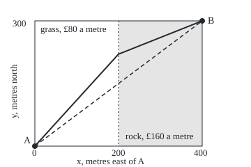
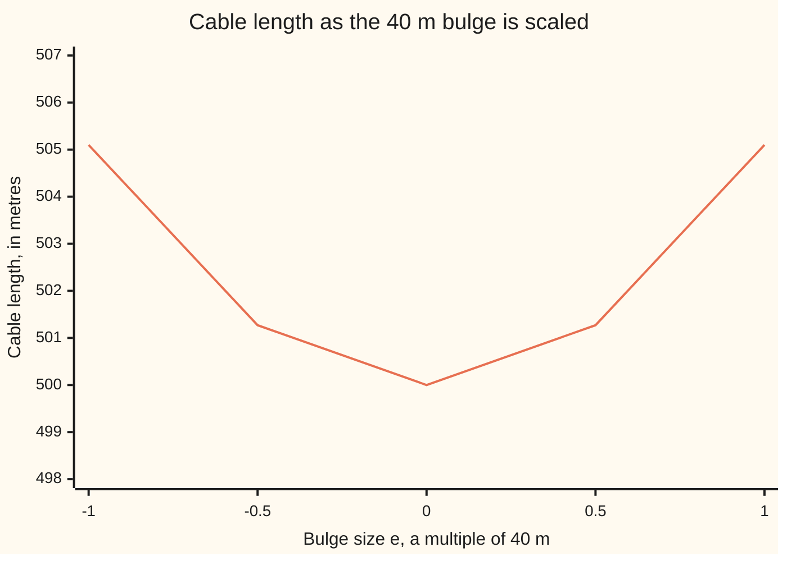

# The Euler-Lagrange equation: to find the best curve, nudge it, and the nudge must change the cost by nothing

[Syllabus](../../../SYLLABUS.md) → [Differential equations and dynamics](../README.md) → [Calculus of Variations and Optimal Control](../README.md#s12) → The Euler-Lagrange equation

---

## General Overview

A cable must cross a flat field from pylon A at the corner to pylon B, 400 m east and 300 m north. If every metre costs the same, the cheapest route is the shortest: a straight line, 500 m long.

Now east of the 200 m mark the field turns to rock, and trenching there costs £160 a metre instead of £80. A route running longer on grass costs less. Which bend is best? The unknown is a whole curve, one of infinitely many.

A rule that takes a whole curve and returns one number, such as its length or cost, is a **functional**. At the bottom of a valley the ground is level; at the best curve, a small nudge changes the cost by nothing to first order. Written out, that demand is a differential equation for the curve, the **Euler-Lagrange equation**. On the rocky field it puts the border crossing 220.30 m north of A, at a cost of £58,250.73.

**At a best curve every small nudge that keeps the ends fixed leaves the cost unchanged to first order, and that demand forces the curve to satisfy a differential equation.**

**What kind of fact this is:** a theorem, proved on this card in Why it works; it is a test every best curve passes, not a proof that a curve is best.

### The picture: the field, to scale

<p align="center"></p>

Scale: 0.6 drawing units per metre, a point at 50 + 0.6x across and 210 − 0.6y down. The dashed straight route crosses the border at height 120.0, the solid bent route at 77.8.

---

## The formula

Notation first, in words. A route is written $y$: at distance $x$ east of A the cable runs $y$ metres north, with slope $y'$. Square brackets, $J[y]$, mark a functional: it takes the whole curve. Inside sits $F$, the cost per metre east. For partial derivatives the slope gets its own slot, $p$: $F_y$ is the rate $F$ changes with height, $F_p$ with slope, other slots held still.

$$J[y] = \int_a^b F\big(x,\, y(x),\, y'(x)\big)\,dx$$

**Read it aloud:** the cost of a route is the cost per metre east, added up from end to end.

For the cable, $F = c\sqrt{1 + p^2}$: one metre east at slope $p$ is $\sqrt{1+p^2}$ metres of cable at $c$ pounds a metre.

A nudge is a curve $\eta$ (eta), zero at both ends, scaled by a small number $\varepsilon$ (epsilon). The **first variation** is the rate the cost changes as $\varepsilon$ leaves zero:

$$\delta J = \frac{d}{d\varepsilon}\,J[y + \varepsilon\eta]\,\Big|_{\varepsilon = 0} = \int_a^b \big(F_y\,\eta + F_p\,\eta'\big)\,dx$$

The theorem: if $y$ is the cheapest route with its ends fixed, then $\delta J = 0$ for every nudge, and so

$$F_y\big(x, y, y'\big) - \frac{d}{dx}\,F_p\big(x, y, y'\big) = 0 \qquad \text{for } a < x < b$$

**Read it aloud:** along the best curve, the pull of height on the cost is matched by how fast the pull of slope changes along the way.

| Symbol | Plain meaning | In our example | Push it up and the answer… |
| --- | --- | --- | --- |
| $x$, $a$, $b$ | distance east; the ends | 0 to 400 m | longer cable |
| $y$, $p$ | the route; the slope slot, holding $y'$ | 0.75x; slope 0.75 | steeper stretches are longer |
| $F$ | cost per metre east | $c\sqrt{1+p^2}$ | — |
| $F_y$, $F_p$, $G$ | $F$'s rate with height, with slope; Step 3's bracket | 0; $cp/\sqrt{1+p^2}$; 0 | — |
| $J$ | the functional: total cost | 500 m of cable, flat field | — |
| $c$ | price per metre | £80 grass, £160 rock | the route avoids that ground |
| $\eta$, $\varepsilon$ | nudge shape, zero at both ends; its size | 40 m bulge; −1 to 1 | at a minimum, cost rises as its square |
| $\theta$, $s$ | angle between route and due east; border crossing | sines 0.7404, 0.3702; 220.30 m | — |

### When it holds

- **Both ends fixed.** Let B slide and a boundary term $F_p\,\eta$ at B survives: moving B 10 m north changes the length by 6 m to first order.
- **Smooth route, smooth $F$.** At a kink or a price jump, such as the rock border, the equation holds on each side and the folded proof matches $F_p$ across.
- **Necessary, not sufficient.** Maxima and saddles pass the test too; a minimum needs a separate argument.

---

## Why it works

### Step 0: a nudge turns a curve problem into a one-number problem

Fix a nudge's shape $\eta$ and vary its size $\varepsilon$. The cost becomes a function of one number, smallest at $\varepsilon = 0$ if $y$ is best, so its derivative there is zero ([Optimisation](../../06-Calculus%20and%20analysis/03-What%20Derivatives%20Tell%20You/03-monotonicity-and-optimisation.md)). This holds for every shape.

The chart takes the straight cable and a 40 m bulge at its middle, $\eta = 40\sin(\pi x/400)$ metres, zero at both pylons.



The cable's length is level at size 0 and rises alike on both sides.

### Step 1: differentiate under the integral

The nudged route has height $y + \varepsilon\eta$ and slope $y' + \varepsilon\eta'$. By the chain rule $\varepsilon$ reaches $F$ through two slots, giving $F_y\,\eta + F_p\,\eta'$ per stretch ([Partial derivatives](../../06-Calculus%20and%20analysis/07-Several%20Variables/01-partial-derivatives.md)). Summing the stretches gives the first-variation formula.

### Step 2: move the derivative off the nudge

Integration by parts ([Integration by parts](../../06-Calculus%20and%20analysis/04-Integrals/04-integration-by-parts.md)) gives

$$\int_a^b F_p\,\eta'\,dx = \Big[F_p\,\eta\Big]_a^b - \int_a^b \frac{dF_p}{dx}\,\eta\,dx$$

The bracket vanishes because the nudge is zero at both pylons. So

$$\delta J = \int_a^b \Big(F_y - \frac{dF_p}{dx}\Big)\,\eta\,dx = 0 \quad \text{for every nudge.}$$

### Step 3: what integrates to zero against every nudge is zero

Call the bracket $G$. If $G$ were positive somewhere, it would stay positive on a short stretch, being continuous. A nudge shaped as a small hump on that stretch, zero elsewhere, then gives a positive integral, not zero. Negative values fail the same way. So $G = 0$ everywhere: the Euler-Lagrange equation. This step is the **fundamental lemma of the calculus of variations**.

<details>
<summary>Detailed proof</summary>

**The lemma.** Let $G$ be continuous on $[a, b]$, with $\int_a^b G\eta\,dx = 0$ for every nudge. Suppose $G(x_0) > 0$ inside. Continuity gives a stretch $[u, w]$ around that point with $G > G(x_0)/2$. Take $\eta = (x - u)^2 (w - x)^2$ there and 0 elsewhere; its value and slope vanish at both ends of the stretch. Then $\int G\eta\,dx \ge \tfrac12 G(x_0) \int_u^w \eta\,dx > 0$, a contradiction. Repeat for $-G$.

**When $F$ has no $y$ slot.** Then $\delta J = \int_a^b F_p\,\eta'\,dx = 0$, with no second derivative needed. Let $\bar F$ be the average of $F_p$ and $\eta(x) = \int_a^x \big(F_p(v) - \bar F\big)\,dv$, zero at both ends. Then $\int (F_p - \bar F)^2\,dx = \delta J - \bar F\,[\eta]_a^b = 0$, so $F_p = \bar F$, even across a kink or a price jump.

</details>

### Step 4: the flat field gives a straight line

With one price, drop it: $F = \sqrt{1 + p^2}$ is metres of cable per metre east. No $y$ slot, so $F_y = 0$ and $F_p = p/\sqrt{1 + p^2}$ is constant along the route. Differentiating, $y''/(1 + y'^2)^{3/2} = 0$, so $y'' = 0$. The pylons fix the two constants ([Boundary value problems](../07-Series%20Solutions%20and%20Boundary%20Problems/05-two-point-boundary-value-problems.md)): $y = 0.75x$, 500 m long.

### Step 5: the rocky field gives a bend

Now $F = c(x)\sqrt{1 + p^2}$, with $c = 80$ west of the border and 160 east. Still no $y$ slot, so $F_p = c\,y'/\sqrt{1 + y'^2}$ is one constant along the whole route; on each side, where $c$ is fixed, $y'$ is fixed and the route is straight. With $\sin\theta = y'/\sqrt{1 + y'^2}$, $\theta$ the angle between route and due east, the constant reads

$$80\,\sin\theta_{\text{grass}} = 160\,\sin\theta_{\text{rock}}$$

Crossing $s$ metres north of A, the grass leg has sine $s/\sqrt{200^2 + s^2}$ and the rock leg $(300 - s)/\sqrt{200^2 + (300 - s)^2}$. Solving gives $s = 220.30$ m, sines 0.7404 and 0.3702. This is Snell's law, by which light bends entering water.

A second road skips the equation: chop the route into ten straight pieces, joint at the border, and move joints until the cost stops falling. The code shows this direct method landing on the same crossing. The case of an $F$ with no $x$ slot is [The brachistochrone](02-the-brachistochrone-and-the-beltrami-identity.md).

---

## Worked numbers, by hand

| Step | Arithmetic | Value |
| --- | --- | --- |
| straight route, flat field | $\sqrt{400^2 + 300^2}$ | 500 m |
| its slope term | $F_p = 0.75/\sqrt{1 + 0.75^2} = 0.75/1.25$ | 0.6, the same everywhere |
| first variation, any nudge fixed at the pylons | $0.6 \times (\eta(400) - \eta(0))$ | **0** |
| rocky field, the equation | $80\sin\theta_{\text{grass}} = 160\sin\theta_{\text{rock}}$ | sines 0.7404 and 0.3702 |
| border crossing, by bisection | solve for $s$ | 220.30 m north |
| cost of the bent route | $80 \times$ grass length $+ 160 \times$ rock length | **£58,250.73** |

The bend lays more cable, all on grass, and saves £1,749.27 on the straight route's £60,000.00.

### What breaks if you drop a piece

| Mistake | Comes out at | What went wrong |
| --- | --- | --- |
| Keep the flat-field answer on the rocky field | £60,000.00, £1,749.27 too much | The price is part of $F$; a new $F$ gives a new equation |
| Minimise the rock alone, straight across it | £60,844.41 | Cheapest in one piece is not cheapest in total |
| Let the nudge move pylon B 10 m north | first variation 6 m, not 0 | The boundary term $F_p\,\eta$ at B survives |
| Test a route bowed 60 m north | first variation 15.71 m for the 40 m bulge | Not stationary: nudging the other way shortens it |

The code prints every row.

---

## Code, from first principles, and it actually runs

The script integrates by Simpson's rule ([Numerical integration](../../06-Calculus%20and%20analysis/04-Integrals/08-numerical-integration.md)) and checks the first-variation formula against a nudge-both-ways difference quotient. Then two roads to each best route: the Euler-Lagrange road solves the sine rule by bisection; the direct road slides ten joints until the cost stops falling.

### Python

```python
# The Euler-Lagrange equation -- the check behind the card.  Standard library only.
# A cable runs from pylon A = (0, 0) to pylon B = (400, 300), in metres.  Rocky
# ground past x = 200 m doubles the price, from 80 to 160 pounds a metre.
from math import sqrt, sin, cos, pi
X, Y, M, h = 400.0, 300.0, 0.75, 1e-4               # far pylon, the line's slope, a small step

def simpson(f, a, b, n=2000):                       # Simpson's rule, written out here
    w = (b - a) / n
    return w / 3 * (f(a) + f(b) + sum((4 if k % 2 else 2) * f(a + k * w) for k in range(1, n)))

length = lambda dy: simpson(lambda x: sqrt(1 + dy(x) ** 2), 0, X)          # L[y], from the slope y'
first_variation = lambda dy, de: simpson(lambda x: dy(x) / sqrt(1 + dy(x) ** 2) * de(x), 0, X)

def quotient(dy, de):                               # the same derivative, by nudging both ways
    return (length(lambda x: dy(x) + h * de(x)) - length(lambda x: dy(x) - h * de(x))) / (2 * h)

def descend(price, n=10):                           # direct method: a route through nodes every X/n metres
    dx, y = X / n, [Y * k / n + 50 * sin(pi * k / n) for k in range(n + 1)]
    for _ in range(2000):
        for i in range(1, n):
            ca, cb, a, b = price((i - 0.5) * dx), price((i + 0.5) * dx), y[i - 1], y[i + 1]
            lo, hi = min(a, b), max(a, b)
            for _ in range(60):                     # bisection: where the local cost stops falling
                m = (lo + hi) / 2
                up = ca * (m - a) / sqrt(dx * dx + (m - a) ** 2) < cb * (b - m) / sqrt(dx * dx + (b - m) ** 2)
                lo, hi = (m, hi) if up else (lo, m)
            y[i] = (lo + hi) / 2
    return y, sum(price((i + 0.5) * dx) * sqrt(dx * dx + (y[i + 1] - y[i]) ** 2) for i in range(n))

line, de = (lambda x: M), (lambda x: 40 * pi / X * cos(pi * x / X))     # bulge eta = 40 sin(pi x / 400)
bow = lambda x: M + 60 * pi / X * cos(pi * x / X)                      # y = 0.75x + 60 sin(pi x / 400)
print(f"straight line y = 0.75x: length {length(line):.6f} m")
print("line plus e x bulge, e = -1, -0.5, 0, 0.5, 1: lengths", ", ".join(f"{length(lambda x: M + e * de(x)):.2f}" for e in (-1, -0.5, 0, 0.5, 1)), "m")
print(f"second-order term, by hand: {simpson(lambda x: de(x) ** 2, 0, X) / (2 * 1.25 ** 3):.6f} m times e^2")
fl, fb, qb = abs(first_variation(line, de)), first_variation(bow, de), quotient(bow, de)
print(f"first variation at the line: formula {fl:.6f} m, quotient {abs(quotient(line, de)):.6f} m")
print(f"first variation at the bowed route: formula {fb:.6f} m, quotient {qb:.6f} m")
print(f"moving pylon B 10 m north: first variation {first_variation(line, lambda x: 10 / X):.6f} m")
yf, lf = descend(lambda x: 1.0)
dev = max(abs(yf[k] - M * 40 * k) for k in range(11))
print(f"direct method, flat ground: length {lf:.6f} m, largest gap from y = 0.75x {dev:.6f} m")
g = lambda s: 80 * s / sqrt(200 ** 2 + s * s) - 160 * (Y - s) / sqrt(200 ** 2 + (Y - s) ** 2)
lo, hi = 0.0, Y
for _ in range(100):                                # bisection on 80 sin = 160 sin
    lo, hi = ((lo + hi) / 2, hi) if g((lo + hi) / 2) < 0 else (lo, (lo + hi) / 2)
s = (lo + hi) / 2
cost = 80 * sqrt(200 ** 2 + s * s) + 160 * sqrt(200 ** 2 + (Y - s) ** 2)
print(f"rocky, Euler-Lagrange road: cross x = 200 at y = {s:.4f} m, cost {cost:.2f} pounds")
yr, cr = descend(lambda x: 80.0 if x < 200 else 160.0)
sg, sr = [(yr[j + 1] - yr[j]) / sqrt(1600 + (yr[j + 1] - yr[j]) ** 2) for j in (0, 9)]
print(f"rocky, direct road: cross at y = {yr[5]:.4f} m, cost {cr:.2f} pounds")
print(f"rocky, sines {sg:.4f} and {sr:.4f}; 80 x {sg:.4f} = {80 * sg:.4f}, 160 x {sr:.4f} = {160 * sr:.4f}")
print(f"mistake, straight line on rocky ground: {80 * 250 + 160 * 250:.2f} pounds, {60000 - cost:.2f} too much")
print(f"mistake, least rock (straight across it): {80 * sqrt(200 ** 2 + Y ** 2) + 160 * 200:.2f} pounds")
print(f"figure, px = 50 + 0.6x, py = 210 - 0.6y: A (50, 210), B (290, 30), crossings (170, 120.0), (170, {210 - 0.6 * s:.1f})")
assert abs(lf - 500) < 1e-6 and dev < 1e-6                  # direct method finds the Euler-Lagrange line
assert abs(fb - qb) < 1e-5 and abs(fb) > 1 and fl < 1e-9    # formula = derivative; zero only at the line
assert abs(cr - cost) < 1e-4 and abs(yr[5] - s) < 1e-4       # two roads, one bent route
assert abs(sg / sr - 2) < 1e-6                              # 80 sin on grass = 160 sin on rock
print("ALL CHECKS PASS")
```

**Ran 2026-09-28 on macOS, Python 3.14.6, standard library only. All checks passed. Output, pasted from the run:**

```
straight line y = 0.75x: length 500.000000 m
line plus e x bulge, e = -1, -0.5, 0, 0.5, 1: lengths 505.10, 501.27, 500.00, 501.27, 505.10 m
second-order term, by hand: 5.053237 m times e^2
first variation at the line: formula 0.000000 m, quotient 0.000000 m
first variation at the bowed route: formula 15.711725 m, quotient 15.711725 m
moving pylon B 10 m north: first variation 6.000000 m
direct method, flat ground: length 500.000000 m, largest gap from y = 0.75x 0.000000 m
rocky, Euler-Lagrange road: cross x = 200 at y = 220.2981 m, cost 58250.73 pounds
rocky, direct road: cross at y = 220.2981 m, cost 58250.73 pounds
rocky, sines 0.7404 and 0.3702; 80 x 0.7404 = 59.2315, 160 x 0.3702 = 59.2315
mistake, straight line on rocky ground: 60000.00 pounds, 1749.27 too much
mistake, least rock (straight across it): 60844.41 pounds
figure, px = 50 + 0.6x, py = 210 - 0.6y: A (50, 210), B (290, 30), crossings (170, 120.0), (170, 77.8)
ALL CHECKS PASS
```

### Rust

Same numbers, same labels, built with `rustc --edition 2021 -O`.

```rust
// The Euler-Lagrange equation -- the same check as the Python, in Rust.  No crates.
// A cable runs from pylon A = (0, 0) to pylon B = (400, 300), in metres.  Rocky
// ground past x = 200 m doubles the price, from 80 to 160 pounds a metre.
use std::f64::consts::PI;
const X: f64 = 400.0;
const Y: f64 = 300.0;
const M: f64 = 0.75;
const H: f64 = 1e-4;

fn simpson(f: &dyn Fn(f64) -> f64, a: f64, b: f64) -> f64 {   // Simpson's rule, 2000 panels
    let (n, w) = (2000, (b - a) / 2000.0);
    let inner: f64 = (1..n).map(|k| if k % 2 == 1 { 4.0 } else { 2.0 } * f(a + k as f64 * w)).sum();
    w / 3.0 * (f(a) + f(b) + inner)
}
fn length(dy: &dyn Fn(f64) -> f64) -> f64 { simpson(&|x| (1.0 + dy(x).powi(2)).sqrt(), 0.0, X) }
fn first_variation(dy: &dyn Fn(f64) -> f64, de: &dyn Fn(f64) -> f64) -> f64 {  // F_p = y'/sqrt(1+y'^2)
    simpson(&|x| dy(x) / (1.0 + dy(x).powi(2)).sqrt() * de(x), 0.0, X)
}
fn quotient(dy: &dyn Fn(f64) -> f64, de: &dyn Fn(f64) -> f64) -> f64 {  // nudging both ways
    (length(&|x| dy(x) + H * de(x)) - length(&|x| dy(x) - H * de(x))) / (2.0 * H)
}
fn descend(price: &dyn Fn(f64) -> f64) -> (Vec<f64>, f64) {   // direct method, nodes every 40 m
    let (n, dx) = (10usize, X / 10.0);
    let mut y: Vec<f64> = (0..=n).map(|k| Y * k as f64 / 10.0 + 50.0 * (PI * k as f64 / 10.0).sin()).collect();
    for _ in 0..2000 {
        for i in 1..n {
            let (ca, cb) = (price((i as f64 - 0.5) * dx), price((i as f64 + 0.5) * dx));
            let (a, b) = (y[i - 1], y[i + 1]);
            let (mut lo, mut hi) = (a.min(b), a.max(b));
            for _ in 0..60 {                                  // bisection on the local slope
                let m = (lo + hi) / 2.0;
                let up = ca * (m - a) / (dx * dx + (m - a).powi(2)).sqrt() < cb * (b - m) / (dx * dx + (b - m).powi(2)).sqrt();
                if up { lo = m } else { hi = m }
            }
            y[i] = (lo + hi) / 2.0;
        }
    }
    let c = (0..n).map(|i| price((i as f64 + 0.5) * dx) * (dx * dx + (y[i + 1] - y[i]).powi(2)).sqrt()).sum();
    (y, c)
}
fn main() {
    let line = |_x: f64| M;
    let de = |x: f64| 40.0 * PI / X * (PI * x / X).cos();          // bulge eta = 40 sin(pi x / 400)
    let bow = |x: f64| M + 60.0 * PI / X * (PI * x / X).cos();     // y = 0.75x + 60 sin(pi x / 400)
    println!("straight line y = 0.75x: length {:.6} m", length(&line));
    let ls: Vec<String> = [-1.0, -0.5, 0.0, 0.5, 1.0].iter().map(|&e| format!("{:.2}", length(&|x| M + e * de(x)))).collect();
    println!("line plus e x bulge, e = -1, -0.5, 0, 0.5, 1: lengths {} m", ls.join(", "));
    println!("second-order term, by hand: {:.6} m times e^2", simpson(&|x| de(x).powi(2), 0.0, X) / (2.0 * 1.25f64.powi(3)));
    let (fl, fb, qb) = (first_variation(&line, &de).abs(), first_variation(&bow, &de), quotient(&bow, &de));
    println!("first variation at the line: formula {:.6} m, quotient {:.6} m", fl, quotient(&line, &de).abs());
    println!("first variation at the bowed route: formula {:.6} m, quotient {:.6} m", fb, qb);
    println!("moving pylon B 10 m north: first variation {:.6} m", first_variation(&line, &|_x| 10.0 / X));
    let (yf, lf) = descend(&|_x| 1.0);
    let dev = (0..11).map(|k| (yf[k] - M * 40.0 * k as f64).abs()).fold(0.0, f64::max);
    println!("direct method, flat ground: length {:.6} m, largest gap from y = 0.75x {:.6} m", lf, dev);
    let g = |s: f64| 80.0 * s / (200.0f64.powi(2) + s * s).sqrt() - 160.0 * (Y - s) / (200.0f64.powi(2) + (Y - s).powi(2)).sqrt();
    let (mut lo, mut hi) = (0.0, Y);
    for _ in 0..100 { let m = (lo + hi) / 2.0; if g(m) < 0.0 { lo = m } else { hi = m } }   // 80 sin = 160 sin
    let s = (lo + hi) / 2.0;
    let cost = 80.0 * (200.0f64.powi(2) + s * s).sqrt() + 160.0 * (200.0f64.powi(2) + (Y - s).powi(2)).sqrt();
    println!("rocky, Euler-Lagrange road: cross x = 200 at y = {:.4} m, cost {:.2} pounds", s, cost);
    let (yr, cr) = descend(&|x| if x < 200.0 { 80.0 } else { 160.0 });
    let sine = |j: usize| (yr[j + 1] - yr[j]) / (1600.0 + (yr[j + 1] - yr[j]).powi(2)).sqrt();
    let (sg, sr) = (sine(0), sine(9));
    println!("rocky, direct road: cross at y = {:.4} m, cost {:.2} pounds", yr[5], cr);
    println!("rocky, sines {:.4} and {:.4}; 80 x {:.4} = {:.4}, 160 x {:.4} = {:.4}", sg, sr, sg, 80.0 * sg, sr, 160.0 * sr);
    println!("mistake, straight line on rocky ground: {:.2} pounds, {:.2} too much", 80.0 * 250.0 + 160.0 * 250.0, 60000.0 - cost);
    println!("mistake, least rock (straight across it): {:.2} pounds", 80.0 * (200.0f64.powi(2) + Y * Y).sqrt() + 160.0 * 200.0);
    println!("figure, px = 50 + 0.6x, py = 210 - 0.6y: A (50, 210), B (290, 30), crossings (170, 120.0), (170, {:.1})", 210.0 - 0.6 * s);
    assert!((lf - 500.0).abs() < 1e-6 && dev < 1e-6);              // direct method finds the Euler-Lagrange line
    assert!((fb - qb).abs() < 1e-5 && fb.abs() > 1.0 && fl < 1e-9); // formula = derivative; zero only at the line
    assert!((cr - cost).abs() < 1e-4 && (yr[5] - s).abs() < 1e-4); // two roads, one bent route
    assert!((sg / sr - 2.0).abs() < 1e-6);                         // 80 sin on grass = 160 sin on rock
    println!("ALL CHECKS PASS");
}
```

**Ran 2026-09-28 on macOS, rustc 1.98.1, no crates. All checks passed. Output, pasted from the run:**

```
straight line y = 0.75x: length 500.000000 m
line plus e x bulge, e = -1, -0.5, 0, 0.5, 1: lengths 505.10, 501.27, 500.00, 501.27, 505.10 m
second-order term, by hand: 5.053237 m times e^2
first variation at the line: formula 0.000000 m, quotient 0.000000 m
first variation at the bowed route: formula 15.711725 m, quotient 15.711725 m
moving pylon B 10 m north: first variation 6.000000 m
direct method, flat ground: length 500.000000 m, largest gap from y = 0.75x 0.000000 m
rocky, Euler-Lagrange road: cross x = 200 at y = 220.2981 m, cost 58250.73 pounds
rocky, direct road: cross at y = 220.2981 m, cost 58250.73 pounds
rocky, sines 0.7404 and 0.3702; 80 x 0.7404 = 59.2315, 160 x 0.3702 = 59.2315
mistake, straight line on rocky ground: 60000.00 pounds, 1749.27 too much
mistake, least rock (straight across it): 60844.41 pounds
figure, px = 50 + 0.6x, py = 210 - 0.6y: A (50, 210), B (290, 30), crossings (170, 120.0), (170, 77.8)
ALL CHECKS PASS
```

The two outputs match line for line.

> [!TIP]
> **Try changing**
> Guess first, then run it.
> - **Make the rock grass.** Change 160 to 80 in the price, in `g` and in `cost`. Guess: the route straightens. Both roads cross at 150.0000 m for £40,000.00; the fourth assert stops the run, the sines now equal.
> - **Double the bulge.** Change `40 * pi` to `80 * pi` in `de`. Guess: the extra length about quadruples. The hand estimate becomes 20.21 m; the true length at size 1 is 520.85 m.
> - **Stop the direct method early.** Change `range(2000)` to `range(3)`. Guess: the joints have not settled. The flat route comes out 504.44 m, up to 37.87 m off the line, and the first assert stops it.

---

## The usual mistake

> [!warning]
> **Reading "the first variation is zero" as "this is the minimum".** Maxima and saddle routes pass the test too. For cable length, $\sqrt{1+p^2}$ curves upward as the slope grows, which makes the line a true minimum; other functionals need their own check.
>
> - **Letting a nudge move an end.** Moving B 10 m north changes the length by 6 m to first order: the endpoint term was dropped only because the nudge vanished there.
> - **Linking $y$ and $y'$ when taking partials.** Freeze the other slots first, then substitute the route: for the cable $F_y = 0$.
> - **Checking one nudge and stopping.** The lemma needs every nudge; the bowed route fails with 15.71 m for the bulge, but another shape could miss it.

---

## Where you meet it in real life

- **Routing cables, pipes and roads.** Price each kind of ground; seek the least-cost route.
- **Mechanics.** A moving body makes a time integral of kinetic minus potential energy stationary, and the Euler-Lagrange equation becomes Newton's second law ([Lagrangian mechanics](04-lagrangian-mechanics.md)).
- **Hanging cables.** A cable strung between pylons sags into the shape of least potential energy for its fixed length ([Paths with a budget](03-constrained-paths-and-the-hanging-chain.md)).

> **Say it back**
> A functional turns a whole curve into one number. Nudge the curve by a small multiple of a shape that is zero at both ends. At the best curve the cost's rate of change, the first variation, is zero for every shape. Integration by parts and the fundamental lemma turn that into the Euler-Lagrange equation. It makes the flat-field cable straight and bends it at the rock.

---

## What this builds on

- [Boundary value problems](../07-Series%20Solutions%20and%20Boundary%20Problems/05-two-point-boundary-value-problems.md): the Euler-Lagrange equation comes with conditions at both ends, not a starting slope.
- [Integration by parts](../../06-Calculus%20and%20analysis/04-Integrals/04-integration-by-parts.md): moves the derivative off the nudge in Step 2 and produces the endpoint term.
- [Partial derivatives](../../06-Calculus%20and%20analysis/07-Several%20Variables/01-partial-derivatives.md): $F_y$ and $F_p$, with the other slots held still.
- [Optimisation](../../06-Calculus%20and%20analysis/03-What%20Derivatives%20Tell%20You/03-monotonicity-and-optimisation.md): a smooth function has zero derivative at an interior minimum, used in Step 0.

## Where this goes next

- [The brachistochrone](02-the-brachistochrone-and-the-beltrami-identity.md): a shortcut when $F$ has no $x$ slot, and the curve of fastest descent.
- [Lagrangian mechanics](04-lagrangian-mechanics.md): time in place of distance, and the laws of motion.
- Dirichlet's principle: a surface as the unknown, and Laplace's equation.
- Minimal surface: least area spanning a wire loop.
- Geodesic and exponential map: shortest routes on curved ground.
- Noether: why a missing slot, as in Step 5, gives a conserved quantity.

---

## Sources

Verified 28 Sep 2026: every link below resolves to the publisher's page.

- Gelfand, I. M., and S. V. Fomin. *Calculus of Variations*. Dover, 2000. [Publisher page](https://store.doverpublications.com/products/9780486414485). Chapter 1: functionals, the variation, the lemma, Euler's equation.
- Liberzon, Daniel. *Calculus of Variations and Optimal Control Theory: A Concise Introduction*. Princeton University Press, 2012. [Publisher page](https://press.princeton.edu/books/hardcover/9780691151878/calculus-of-variations-and-optimal-control-theory). Section 2.3.1 derives the equation; the author's [lecture notes](https://liberzon.csl.illinois.edu/teaching/cvoc/node28.html) give it free.
- University College London, MATH0043 lecture notes, "Calculus of Variations". [Chapter 2](https://www.homepages.ucl.ac.uk/~ucahmto/latex_html/chapter2.html). The equation and the lemma, with the slope as its own slot.
