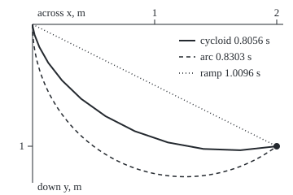

# The brachistochrone: the fastest slide is a cycloid, found with a shortcut that works when the cost ignores the horizontal

[Syllabus](../../../SYLLABUS.md) → [Differential equations and dynamics](../../../SYLLABUS.md#w08) → [Calculus of Variations and Optimal Control](../../../SYLLABUS.md#w08-s12) → The brachistochrone

---

## General Overview

A water-slide starts at a platform and ends at a pool exit 2 m across and 1 m down. A rider starts from rest, and the slide is wet enough to ignore friction. Which shape gets the rider out fastest?

The straight ramp, the shortest path, takes 1.0096 s. A circular arc that starts vertical takes 0.8303 s. The fastest shape takes 0.8056 s. It drops steeply at first, dips to 1.0344 m down, below the exit, and climbs the last stretch. Its name is the **brachistochrone**, Greek for "shortest time". Johann Bernoulli posed the problem in 1696.

A steep start buys speed early, and the rider spends it on the long run across. The shape that balances the trade exactly is a **cycloid**: the curve traced by a point on a rolling wheel's rim. The descent time depends on each point's slope and depth, never on how far across it is, and that fact turns a second-order equation into a first-order one.

**The descent time is a functional of the slide's shape whose cost per step ignores the horizontal position, so the Euler-Lagrange equation reduces to the Beltrami identity, depth times (1 + slope squared) is constant, and its solution through the two ends is a cycloid.**

**What kind of fact this is:** a theorem, proved on this card in Why it works; that the cycloid is the true minimum is sketched in a folded proof and tested in the code.

### The picture: three slides to one exit

<p align="center"></p>

To scale: 150 px per m both ways, depth drawn downward from the platform at top left; the dot is the exit. The cycloid bottoms out at (283.7, 185.2) px, 1.0344 m down; the arc at (227.5, 217.5) px, 1.25 m down.

---

## The formula

A reminder from [The Euler-Lagrange equation](01-functionals-and-the-euler-lagrange-equation.md): a functional takes a whole curve and returns one number; the square brackets in T[y] mark that its input is the curve y. Depth y is measured **downward**.

$$T[y] = \int_0^{2} \sqrt{\frac{1 + y'^2}{2 g\, y}}\; dx$$

**Read it aloud:** the descent time is the sum, over every sliver of the slide, of the sliver's length divided by the rider's speed there.

Drop the constant factor 1/sqrt(2g) and call what is left F(y, y') = sqrt((1 + y'^2)/y). It contains the depth and the slope but not x. For every such cost the **Beltrami identity** holds along the best curve:

$$F - y'\,\frac{\partial F}{\partial y'} = \text{constant} \quad\Longrightarrow\quad y\,(1 + y'^2) = C$$

**Read it aloud:** depth times one-plus-slope-squared stays the same all the way down the fastest slide.

Its solutions, with wheel angle θ as the parameter (as in [Parametric curves](../../05-Geometry%20and%20trig/04-Coordinates%20and%20Curves/06-parametric-curves.md)), are cycloids from the platform:

$$x = R(\theta - \sin\theta), \qquad y = R(1 - \cos\theta), \qquad T = \theta_1\sqrt{R/g}$$

| Symbol | Plain meaning | In our example | Push it up and the answer… |
| --- | --- | --- | --- |
| $T$ | descent time, a functional of the whole shape | 0.8056 s on the cycloid | — |
| $x$ | distance across from the platform, m | 0 to 2 | a farther exit: the cycloid dips deeper |
| $y$, $y'$ | depth below the platform, m, and slope dy/dx | exit at depth 1 | a deeper exit: faster per metre across |
| $g$ | gravity's pull, m/s^2 | 9.81 | every time shrinks as 1 over its square root |
| $F$ | the cost per unit across, the integrand without its 1/sqrt(2g) | sqrt((1 + y'^2)/y) | — |
| $C$ | the Beltrami constant, m | 1.0344 | a bigger wheel |
| $R$ | radius of the rolling wheel, C/2, m | 0.5172 | a deeper dip |
| $\theta$, $\theta_1$ | angle the wheel has turned, rad; its value at the exit | 0 to 3.5084 | past π means past the lowest point |

### When it holds

- **No friction, no air.** Friction changes the cost per sliver, so the best shape is no longer a cycloid.
- **Start from rest.** A launched rider's speed is sqrt(v0^2 + 2 g y), v0 the launch speed; Beltrami still applies, but the cycloid starts higher up, off the platform.
- **A cost free of x.** If the cost changed across the park, x would appear in F and only the full Euler-Lagrange equation would remain.
- **The slide may dip below the exit.** Forbid that and the one cycloid through both ends is ruled out for this exit; the answer changes.

---

## Why it works

### Step 0: a cost that ignores x leaves a quantity unchanged

Shift the whole slide 1 m sideways: every sliver keeps its depth and slope, so the time is unchanged. A cost blind to position forces one combination of depth and slope to stay fixed along the best curve.

### Step 1: write the descent time as a functional

A rider who has dropped y metres from rest has speed sqrt(2 g y): half the speed squared equals g y, energy per kilogram. A sliver dx across is sqrt(1 + y'^2) dx long, by Pythagoras. Time is length over speed; summing slivers gives T[y].

### Step 2: prove the Beltrami identity

Take any F(y, y') without x, and let y solve Euler-Lagrange, ∂F/∂y = d/dx (∂F/∂y'). Differentiate Beltrami's left side by the chain rule:

$$\frac{d}{dx}\Big(F - y'\frac{\partial F}{\partial y'}\Big) = y'\frac{\partial F}{\partial y} + y''\frac{\partial F}{\partial y'} - y''\frac{\partial F}{\partial y'} - y'\frac{d}{dx}\frac{\partial F}{\partial y'} = y'\Big(\frac{\partial F}{\partial y} - \frac{d}{dx}\frac{\partial F}{\partial y'}\Big) = 0.$$

The y'' terms cancel and the bracket is zero by Euler-Lagrange, so the combination is constant: second order has become first order.

### Step 3: apply it to the slide

With F = sqrt((1 + y'^2)/y), the slope derivative is ∂F/∂y' = y' / sqrt(y(1 + y'^2)). Then F − y' ∂F/∂y' = 1/sqrt(y(1 + y'^2)). That is constant, so y(1 + y'^2) = C.

### Step 4: solve the first-order rule

Rearranged, y'^2 = (C − y)/y. Put C = 2R and y = 2R sin^2(θ/2), which is R(1 − cos θ). Then (C − y)/y = cot^2(θ/2), so the slope is y' = cot(θ/2): positive on the way down, negative after the lowest point at θ = π. Also dy = 2R sin(θ/2) cos(θ/2) dθ. Divide dy by the slope: dx = 2R sin^2(θ/2) dθ = R(1 − cos θ) dθ. Integrate from the platform: x = R(θ − sin θ). That pair is a cycloid: a wheel of radius R rolls along the underside of the platform level, and a rim point traces the slide.

<details>
<summary>The algebra behind Step 3</summary>

Write F = (1 + p^2)^(1/2) y^(-1/2) with p for the slope. Then ∂F/∂p = p (1 + p^2)^(-1/2) y^(-1/2). So F − p ∂F/∂p = y^(-1/2) (1 + p^2)^(-1/2) [(1 + p^2) − p^2] = 1/sqrt(y(1 + p^2)).

</details>

### Step 5: fit the exit, then time the ride

On a cycloid x/y = (θ − sin θ)/(1 − cos θ), whatever R is; the exit needs 2. Bisection (halving an interval that brackets the root) gives θ1 = 3.5084 rad, past π, so the rider passes the lowest point and climbs. Then R = 1/(1 − cos θ1) = 0.5172 m.

Along the cycloid a sliver of length 2R sin(θ/2) dθ is crossed at speed 2 sin(θ/2) sqrt(g R), so each radian of wheel turn costs sqrt(R/g) seconds, the same at every point. The total is T = θ1 sqrt(R/g) = 3.5084 × 0.2296 = 0.8056 s.

<details>
<summary>Detailed proof: the cycloid is the minimum, not only stationary</summary>

Euler-Lagrange and Beltrami find stationary shapes: small changes leave T unchanged to first order. Two facts make it a minimum. First, F is convex in the slope p: its second derivative in p is (1 + p^2)^(-3/2) y^(-1/2) > 0. Second, the cycloids from the platform, one per radius R, fill the region below it without crossing: a **field** of stationary curves. The Weierstrass sufficiency theorem combines the two: every other slide to the exit takes longer. The full argument is in Gelfand and Fomin (Sources). The code tests it: no slide of 8, 16 or 32 straight chutes beats 0.8056 s.

</details>

Bernoulli's own route was optics. Light crossing layers of changing speed keeps the sine of its angle from the vertical over its speed constant (Snell's law). With speed sqrt(2 g y) and that sine 1/sqrt(1 + y'^2), Snell's rule says 1/sqrt(2 g y(1 + y'^2)) is constant: the Beltrami identity again. With time in place of x, the same shortcut is energy conservation in [Lagrangian mechanics](04-lagrangian-mechanics.md).

---

## Worked numbers, by hand

| Step | Arithmetic | Value |
| --- | --- | --- |
| exit ratio | 2 m across over 1 m down | 2 |
| wheel angle at exit | solve (θ − sin θ)/(1 − cos θ) = 2 by bisection | 3.5084 rad |
| wheel radius | R = 1/(1 − cos 3.5084) | 0.5172 m |
| Beltrami constant | C = 2R, also the lowest depth | 1.0344 m |
| seconds per radian | sqrt(0.5172/9.81) | 0.2296 |
| cycloid time | 3.5084 × 0.2296 | **0.8056 s** |
| straight ramp | sqrt(2 × (2^2 + 1^2)/9.81) | 1.0096 s |

The cycloid rider exits 0.2041 s before the ramp rider, despite the longer path.

### What breaks if you drop a piece

| Mistake | Comes out at | What went wrong |
| --- | --- | --- |
| Shortest taken as fastest | ramp 1.0096 s, 0.2041 s slower | length is not time; speed must be bought early |
| Speed sqrt(g y) instead of sqrt(2 g y) | 1.1392 s for the cycloid | the ½ in ½v^2 = g y is dropped: every time is off by sqrt 2 |
| Slide assumed to arrive level, slope 0 | C = 1 m, R = 0.5 m: bottoms out at x = 1.5708 m, not 2 | the exit sets the end slope; forcing it misses the pool |

The code prints all three.

---

## Code, from first principles, and it actually runs

Each time is reached by two roads. For the cycloid, road one is the closed form, its end angle found by the script's own bisection. Road two knows nothing of cycloids: it splits the slide into n straight chutes of equal width and moves each corner to its fastest depth by golden-section search (shrinking a bracket by the golden ratio each step). A chute is timed exactly: length over the mean of its end speeds. The ramp and arc are timed by formula and by integrating the functional, with x = 2 s^4 taming the vertical start. The Beltrami constant is measured with finite-difference slopes.

### Python

```python
# The brachistochrone -- the check behind the card.  Standard library only.  A slide
# from (0, 0) to 2 m across, 1 m down; y points DOWN.  Road 1: the Beltrami cycloid.
# Road 2: the fastest n-chute slide by golden-section search.  Ramp and arc: two roads.
from math import sin, cos, sqrt, pi
G, X, Y = 9.81, 2.0, 1.0

def bisect(f, a, b):                           # root finder written out here
    for _ in range(200):
        m = (a + b) / 2
        a, b = (m, b) if f(a) * f(m) > 0 else (a, m)
    return (a + b) / 2
def chute(xa, ya, xb, yb):                     # straight chute: length over mean speed
    return 2 * sqrt((xb - xa)**2 + (yb - ya)**2) / (sqrt(2*G*ya) + sqrt(2*G*yb))
def best_slide(n):                             # road 2: sweep the corners 25n times
    xs, ys = [X*i/n for i in range(n + 1)], [Y*i/n for i in range(n + 1)]
    for _ in range(25 * n):
        for i in range(1, n):
            f = lambda y: chute(xs[i-1], ys[i-1], xs[i], y) + chute(xs[i], y, xs[i+1], ys[i+1])
            a, b = 1e-12, 2.0
            for _ in range(60):
                m1, m2 = a + 0.382*(b - a), b - 0.382*(b - a)
                a, b = (a, m2) if f(m1) < f(m2) else (m1, b)
            ys[i] = (a + b) / 2
    return sum(chute(xs[i], ys[i], xs[i+1], ys[i+1]) for i in range(n)), xs, ys

def functional(y, dy, n=20000):                # T[y] = integral of sqrt((1+y'^2)/(2gy)) dx,
    total = 0.0                                # midpoint rule in s, where x = X s^4
    for k in range(n):
        s = (k + 0.5) / n; x = X * s**4
        total += 4*X*s**3 * sqrt((1 + dy(x)**2) / (2*G*y(x))) / n
    return total
th = bisect(lambda t: t - sin(t) - (X/Y)*(1 - cos(t)), 0.1, 6.2)
R = Y / (1 - cos(th)); T_cyc = th * sqrt(R/G)
cyc = lambda t: (R*(t - sin(t)), R*(1 - cos(t)))
print(f"cycloid: end angle {th:.4f} rad, rolling radius R = {R:.4f} m, lowest point {2*R:.4f} m down")
print(f"cycloid time, closed form theta*sqrt(R/g) = {th:.4f} x {sqrt(R/G):.4f} = {T_cyc:.4f} s")
bel = [cyc(t)[1] * (1 + ((cyc(t+1e-6)[1] - cyc(t-1e-6)[1]) / (cyc(t+1e-6)[0] - cyc(t-1e-6)[0]))**2)
       for t in (0.5, 1.5, 2.5, 3.4)]         # Beltrami's y(1+y'^2), slope by finite differences
print("Beltrami y(1+y'^2) at angles 0.5, 1.5, 2.5, 3.4: " + ", ".join(f"{b:.6f}" for b in bel) + f"; 2R = {2*R:.6f}")
polys = {n: best_slide(n) for n in (8, 16, 32)}
for n in polys: print(f"fastest {n:2d}-chute slide: {polys[n][0]:.4f} s, above the cycloid by {polys[n][0] - T_cyc:.4f} s")
_, xs, ys = polys[32]; gap = max(abs(ys[i] - cyc(bisect(lambda t: cyc(t)[0] - xs[i], 0, th))[1]) for i in range(33))
print(f"32-chute corners vs cycloid depth at the same x: largest gap {100*gap:.2f} cm")
T_ramp, T_ramp2 = sqrt(2*(X*X + Y*Y) / (G*Y)), functional(lambda x: Y*x/X, lambda x: Y/X)
print(f"straight ramp: closed form {T_ramp:.4f} s, by the functional {T_ramp2:.4f} s")
c = (X*X + Y*Y) / (2*X); ang = pi - bisect(lambda a: cos(a) - (X - c)/c, 0.0, 3.14); m = 20000
T_arc = sqrt(c/(2*G)) * sum(2*u/sqrt(sin(u*u)) for u in ((k + 0.5)*sqrt(ang)/m for k in range(m))) * sqrt(ang)/m
T_arc2 = functional(lambda x: sqrt(x*(2*c - x)), lambda x: (c - x)/sqrt(x*(2*c - x)))
print(f"circular arc, centre {c:.2f} m across, radius {c:.2f} m: by angle {T_arc:.4f} s, by the functional {T_arc2:.4f} s")
print(f"mistake, shortest = fastest: the ramp takes {T_ramp:.4f} s, {T_ramp - T_cyc:.4f} s slower")
print(f"mistake, speed sqrt(g y) not sqrt(2 g y): cycloid time comes out {T_cyc*sqrt(2):.4f} s")
print(f"mistake, slide must end level (C = 1 m, R = 0.5 m): it bottoms out at x = {0.5*pi:.4f} m, not 2")
print("figure, 150 px per m, origin (40, 30): cycloid " + " ".join(
      f"{40 + 150*cyc(th*k/12)[0]:.1f},{30 + 150*cyc(th*k/12)[1]:.1f}" for k in range(13)))
print(f"figure, arc radius {150*c:.1f} px, lowest ({40 + 150*c:.1f}, {30 + 150*c:.1f}); cycloid lowest ({40 + 150*pi*R:.1f}, {30 + 300*R:.1f})")
assert 0 < polys[32][0] - T_cyc < polys[16][0] - T_cyc < polys[8][0] - T_cyc < 0.02  # search never beats the cycloid
assert all(abs(b - 2*R) < 1e-5 for b in bel)                                        # Beltrami constant is 2R
assert abs(T_ramp - T_ramp2) < 1e-4 and abs(T_arc - T_arc2) < 1e-3                 # two roads each
assert T_cyc < T_arc < T_ramp                                                       # the order on the card
print("ALL CHECKS PASS")
```

**Ran 2026-09-28 on macOS, Python 3.14.6, standard library only. All checks passed. Output, pasted from the run:**

```
cycloid: end angle 3.5084 rad, rolling radius R = 0.5172 m, lowest point 1.0344 m down
cycloid time, closed form theta*sqrt(R/g) = 3.5084 x 0.2296 = 0.8056 s
Beltrami y(1+y'^2) at angles 0.5, 1.5, 2.5, 3.4: 1.034400, 1.034400, 1.034400, 1.034400; 2R = 1.034400
fastest  8-chute slide: 0.8160 s, above the cycloid by 0.0104 s
fastest 16-chute slide: 0.8104 s, above the cycloid by 0.0049 s
fastest 32-chute slide: 0.8079 s, above the cycloid by 0.0023 s
32-chute corners vs cycloid depth at the same x: largest gap 2.25 cm
straight ramp: closed form 1.0096 s, by the functional 1.0096 s
circular arc, centre 1.25 m across, radius 1.25 m: by angle 0.8303 s, by the functional 0.8303 s
mistake, shortest = fastest: the ramp takes 1.0096 s, 0.2041 s slower
mistake, speed sqrt(g y) not sqrt(2 g y): cycloid time comes out 1.1392 s
mistake, slide must end level (C = 1 m, R = 0.5 m): it bottoms out at x = 1.5708 m, not 2
figure, 150 px per m, origin (40, 30): cycloid 40.0,30.0 40.3,33.3 42.5,42.9 48.4,58.0 59.3,77.3 76.3,99.1 99.8,121.7 129.8,143.1 165.7,161.5 206.2,175.3 250.0,183.3 295.3,184.9 340.0,180.0
figure, arc radius 187.5 px, lowest (227.5, 217.5); cycloid lowest (283.7, 185.2)
ALL CHECKS PASS
```

### Rust

Same numbers, same labels, built with `rustc --edition 2021 -O`.

```rust
// The brachistochrone -- the same check as the Python, in Rust.  No crates.  A slide
// from (0, 0) to 2 m across, 1 m down; y points DOWN.  Road 1: the Beltrami cycloid.
// Road 2: the fastest n-chute slide by golden-section search.  Ramp and arc: two roads.
use std::f64::consts::PI;
const G: f64 = 9.81; const X: f64 = 2.0; const Y: f64 = 1.0;
fn bisect(f: &dyn Fn(f64) -> f64, mut a: f64, mut b: f64) -> f64 { // root finder written out here
    for _ in 0..200 {
        let m = (a + b) / 2.0;
        if f(a) * f(m) > 0.0 { a = m } else { b = m }
    }
    (a + b) / 2.0
}
fn chute(xa: f64, ya: f64, xb: f64, yb: f64) -> f64 {  // straight chute: length over mean speed
    2.0 * ((xb - xa).powi(2) + (yb - ya).powi(2)).sqrt() / ((2.0 * G * ya).sqrt() + (2.0 * G * yb).sqrt())
}
fn best_slide(n: usize) -> (f64, Vec<f64>, Vec<f64>) {  // road 2: sweep the corners 25n times
    let xs: Vec<f64> = (0..=n).map(|i| X * i as f64 / n as f64).collect();
    let mut ys: Vec<f64> = (0..=n).map(|i| Y * i as f64 / n as f64).collect();
    for _ in 0..25 * n {
        for i in 1..n {
            let f = |y: f64| chute(xs[i - 1], ys[i - 1], xs[i], y) + chute(xs[i], y, xs[i + 1], ys[i + 1]);
            let (mut a, mut b) = (1e-12, 2.0);
            for _ in 0..60 {
                let (m1, m2) = (a + 0.382 * (b - a), b - 0.382 * (b - a));
                if f(m1) < f(m2) { b = m2 } else { a = m1 }
            }
            ys[i] = (a + b) / 2.0;
        }
    }
    ((0..n).map(|i| chute(xs[i], ys[i], xs[i + 1], ys[i + 1])).sum(), xs, ys)
}
fn functional(y: &dyn Fn(f64) -> f64, dy: &dyn Fn(f64) -> f64) -> f64 { // x = X s^4, midpoint rule
    let (n, mut total) = (20000, 0.0);
    for k in 0..n {
        let s = (k as f64 + 0.5) / n as f64;
        let x = X * s.powi(4);
        total += 4.0 * X * s.powi(3) * ((1.0 + dy(x).powi(2)) / (2.0 * G * y(x))).sqrt() / n as f64;
    }
    total
}
fn main() {
    let th = bisect(&|t: f64| t - t.sin() - (X / Y) * (1.0 - t.cos()), 0.1, 6.2);
    let r = Y / (1.0 - th.cos());
    let t_cyc = th * (r / G).sqrt();
    let cyc = |t: f64| (r * (t - t.sin()), r * (1.0 - t.cos()));
    println!("cycloid: end angle {:.4} rad, rolling radius R = {:.4} m, lowest point {:.4} m down", th, r, 2.0 * r);
    println!("cycloid time, closed form theta*sqrt(R/g) = {:.4} x {:.4} = {:.4} s", th, (r / G).sqrt(), t_cyc);
    let bel: Vec<f64> = [0.5, 1.5, 2.5, 3.4].iter().map(|&t: &f64| {  // Beltrami's y(1+y'^2)
        let (p, q) = (cyc(t - 1e-6), cyc(t + 1e-6));
        cyc(t).1 * (1.0 + ((q.1 - p.1) / (q.0 - p.0)).powi(2))
    }).collect();
    let bs: Vec<String> = bel.iter().map(|b| format!("{:.6}", b)).collect();
    println!("Beltrami y(1+y'^2) at angles 0.5, 1.5, 2.5, 3.4: {}; 2R = {:.6}", bs.join(", "), 2.0 * r);
    let polys: Vec<(usize, (f64, Vec<f64>, Vec<f64>))> = [8, 16, 32].iter().map(|&n| (n, best_slide(n))).collect();
    for (n, p) in &polys { println!("fastest {:2}-chute slide: {:.4} s, above the cycloid by {:.4} s", n, p.0, p.0 - t_cyc) }
    let (_, xs, ys) = &polys[2].1;
    let gap = (0..33).map(|i| (ys[i] - cyc(bisect(&|t: f64| cyc(t).0 - xs[i], 0.0, th)).1).abs()).fold(0.0, f64::max);
    println!("32-chute corners vs cycloid depth at the same x: largest gap {:.2} cm", 100.0 * gap);
    let t_ramp = (2.0 * (X * X + Y * Y) / (G * Y)).sqrt();
    let t_ramp2 = functional(&|x: f64| Y * x / X, &|_x: f64| Y / X);
    println!("straight ramp: closed form {:.4} s, by the functional {:.4} s", t_ramp, t_ramp2);
    let c = (X * X + Y * Y) / (2.0 * X);
    let ang = PI - bisect(&|a: f64| a.cos() - (X - c) / c, 0.0, 3.14);
    let (m, h) = (20000, ang.sqrt() / 20000.0);
    let t_arc = (c / (2.0 * G)).sqrt() * (0..m).map(|k| { let u = (k as f64 + 0.5) * h; 2.0 * u / (u * u).sin().sqrt() }).sum::<f64>() * h;
    let t_arc2 = functional(&|x: f64| (x * (2.0 * c - x)).sqrt(), &|x: f64| (c - x) / (x * (2.0 * c - x)).sqrt());
    println!("circular arc, centre {:.2} m across, radius {:.2} m: by angle {:.4} s, by the functional {:.4} s", c, c, t_arc, t_arc2);
    println!("mistake, shortest = fastest: the ramp takes {:.4} s, {:.4} s slower", t_ramp, t_ramp - t_cyc);
    println!("mistake, speed sqrt(g y) not sqrt(2 g y): cycloid time comes out {:.4} s", t_cyc * 2f64.sqrt());
    println!("mistake, slide must end level (C = 1 m, R = 0.5 m): it bottoms out at x = {:.4} m, not 2", 0.5 * PI);
    let pts: Vec<String> = (0..13).map(|k| { let p = cyc(th * k as f64 / 12.0); format!("{:.1},{:.1}", 40.0 + 150.0 * p.0, 30.0 + 150.0 * p.1) }).collect();
    println!("figure, 150 px per m, origin (40, 30): cycloid {}", pts.join(" "));
    println!("figure, arc radius {:.1} px, lowest ({:.1}, {:.1}); cycloid lowest ({:.1}, {:.1})", 150.0 * c, 40.0 + 150.0 * c, 30.0 + 150.0 * c, 40.0 + 150.0 * PI * r, 30.0 + 300.0 * r);
    let d: Vec<f64> = polys.iter().map(|(_, p)| p.0 - t_cyc).collect();
    assert!(0.0 < d[2] && d[2] < d[1] && d[1] < d[0] && d[0] < 0.02);   // search never beats the cycloid
    assert!(bel.iter().all(|b| (b - 2.0 * r).abs() < 1e-5));            // Beltrami constant is 2R
    assert!((t_ramp - t_ramp2).abs() < 1e-4 && (t_arc - t_arc2).abs() < 1e-3); // two roads each
    assert!(t_cyc < t_arc && t_arc < t_ramp);                             // the order on the card
    println!("ALL CHECKS PASS");
}
```

**Ran 2026-09-28 on macOS, rustc 1.98.1, no crates. All checks passed. Output, pasted from the run:**

```
cycloid: end angle 3.5084 rad, rolling radius R = 0.5172 m, lowest point 1.0344 m down
cycloid time, closed form theta*sqrt(R/g) = 3.5084 x 0.2296 = 0.8056 s
Beltrami y(1+y'^2) at angles 0.5, 1.5, 2.5, 3.4: 1.034400, 1.034400, 1.034400, 1.034400; 2R = 1.034400
fastest  8-chute slide: 0.8160 s, above the cycloid by 0.0104 s
fastest 16-chute slide: 0.8104 s, above the cycloid by 0.0049 s
fastest 32-chute slide: 0.8079 s, above the cycloid by 0.0023 s
32-chute corners vs cycloid depth at the same x: largest gap 2.25 cm
straight ramp: closed form 1.0096 s, by the functional 1.0096 s
circular arc, centre 1.25 m across, radius 1.25 m: by angle 0.8303 s, by the functional 0.8303 s
mistake, shortest = fastest: the ramp takes 1.0096 s, 0.2041 s slower
mistake, speed sqrt(g y) not sqrt(2 g y): cycloid time comes out 1.1392 s
mistake, slide must end level (C = 1 m, R = 0.5 m): it bottoms out at x = 1.5708 m, not 2
figure, 150 px per m, origin (40, 30): cycloid 40.0,30.0 40.3,33.3 42.5,42.9 48.4,58.0 59.3,77.3 76.3,99.1 99.8,121.7 129.8,143.1 165.7,161.5 206.2,175.3 250.0,183.3 295.3,184.9 340.0,180.0
figure, arc radius 187.5 px, lowest (227.5, 217.5); cycloid lowest (283.7, 185.2)
ALL CHECKS PASS
```

The two outputs match line for line.

> [!TIP]
> **Try changing**
> Guess first, then run it.
> - **The Moon.** Set `G` to `1.62`. The cycloid takes 1.9823 s, the ramp 2.4845 s; the first assert stops the run, as the 8-chute excess passes its 0.02 s bound.
> - **A steeper exit.** Set `X` to `1.0`. The end angle is 2.4120 rad, below π: no dip. The cycloid takes 0.5829 s, the ramp 0.6386 s.
> - **A shallow exit.** Set `X` to `4.0`. The end angle is 4.3761 rad and the cycloid dips to 1.5037 m; it takes 1.2115 s, the ramp 1.8617 s.

---

## The usual mistake

> [!warning]
> **Believing the fastest slide never goes below the exit.** A cycloid that only descends, wheel angle at most π, reaches at most π/2 = 1.5708 m across per metre down. This exit needs 2, so the fastest slide dips to 1.0344 m and climbs back: the speed gained deeper pays for the climb.
>
> - **Depth measured upward.** The speed becomes the square root of a negative number.
> - **Beltrami where x appears.** The shortcut needs a cost blind to x; otherwise use the full Euler-Lagrange equation.

---

## Where you meet it in real life

- **Pendulum clocks.** Christiaan Huygens found that a bead on this cycloid reaches the bottom in the same time from any starting height, and hung a clock pendulum between cycloid-shaped guides so its period ignores the swing's size.
- **Conservation laws.** When a system's rules do not change with time, the Beltrami combination is its energy; see [Lagrangian mechanics](04-lagrangian-mechanics.md) and [Hamilton's equations](05-hamiltons-equations.md).
- **Hanging cables.** A chain's energy per unit across also ignores x, so the same shortcut finds its shape, in [Paths with a budget](03-constrained-paths-and-the-hanging-chain.md).

> **Say it back**
> A slide's descent time is a functional: whole shape in, seconds out. Its cost per sliver ignores position across, so depth times one-plus-slope-squared stays constant along the fastest slide. Solving that first-order rule gives a cycloid, the path of a point on a rolling wheel. For an exit 2 m across and 1 m down, the wheel turns 3.5084 rad, dips to 1.0344 m, and the ride takes 0.8056 s against 1.0096 s on the straight ramp.

---

## What this builds on

- [The Euler-Lagrange equation](01-functionals-and-the-euler-lagrange-equation.md): the functional and the Euler-Lagrange equation that Beltrami integrates once.
- [Parametric curves](../../05-Geometry%20and%20trig/04-Coordinates%20and%20Curves/06-parametric-curves.md): a curve traced by a parameter, here the wheel angle θ.

## Where this goes next

- [Paths with a budget](03-constrained-paths-and-the-hanging-chain.md): a fixed length of chain, where a budget joins the functional and Beltrami finds the catenary.

---

## Sources

Verified 2026-09-28: every link below resolves to the publisher's page.

- Gelfand, I. M., and S. V. Fomin. *Calculus of Variations*. Dover, 2000. [Publisher page](https://store.doverpublications.com/products/9780486414485). Euler-Lagrange, its first integral when x is absent, the brachistochrone, and the sufficiency argument.
- Nahin, Paul J. *When Least Is Best*. Princeton University Press, 2021. [Publisher page](https://press.princeton.edu/books/paperback/9780691218762/when-least-is-best). The brachistochrone through Bernoulli's optical solution.
- O'Connor, J. J., and E. F. Robertson. "Johann Bernoulli." MacTutor Archive, University of St Andrews. [Biography](https://mathshistory.st-andrews.ac.uk/Biographies/Bernoulli_Johann/). Bernoulli's 1696 challenge.
