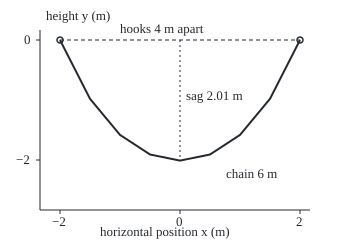
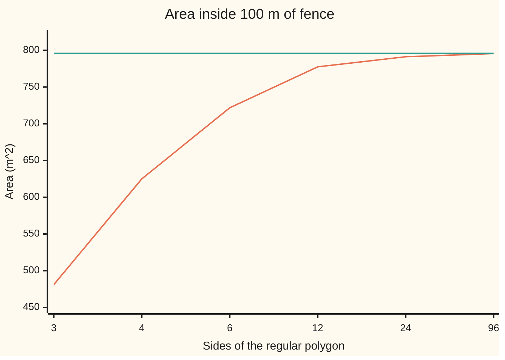

# Paths with a budget: a Lagrange multiplier joins the constraint to the cost, and a chain hangs as a cosh

Differential equations and dynamics → Calculus of Variations and Optimal Control → Budgets on whole paths → Paths with a budget

---

## General Overview

A chain 6 m long hangs from two hooks 4 m apart at the same height. Of all curves 6 m long joining the hooks, it takes the one that puts its weight lowest. Its bottom settles 2.0105 m below the hooks.

The chain cannot just drop: its length is a budget spent over the whole path. A fence of 100 m poses the same problem: enclose the most ground. The answer is a circle, holding 795.7747 m^2; a square holds 625.00 m^2.

One move settles both. Join the budget to the cost with a constant, the **multiplier**, and solve the ordinary path equation for the combination. The multiplier is the price of the budget, what one more metre buys; for the fence it is the circle's radius.

**To find the best path under an integral budget, make the cost minus a constant times the budget stationary, then choose the constant so the budget is spent exactly.**

**What kind of fact this is:** a theorem, Euler's multiplier rule for functionals, proved on this card in Why it works with the full argument folded; the catenary and the circle follow from it.

### The picture: the 6 m chain, to scale

<p align="center"></p>

Drawn to scale at 60 px to the metre on both axes. The nine points on the curve are the `figure,` line both checks print.

---

## The formula

Reminder: a functional takes a whole path y(x) and returns one number ([functionals-and-the-euler-lagrange-equation](01-functionals-and-the-euler-lagrange-equation.md)). Here there are two: the cost $J$, the integral of $F$, and the budget $K$, the integral of $G$, which must equal a fixed amount $L$. Both integrands depend on the height y and the slope y'. The multiplier rule: a path that makes $J$ stationary among all paths with $K = L$ satisfies the Euler-Lagrange equation for $F - \lambda G$, for some constant $\lambda$.

$$\frac{\partial (F - \lambda G)}{\partial y} - \frac{d}{dx}\,\frac{\partial (F - \lambda G)}{\partial y'} = 0, \qquad K[y] = L$$

**Read it aloud:** subtract the multiplier times the budget from the cost, make the combination stationary, then pick the multiplier that spends the budget exactly.

For the chain, the cost is height summed along its length, its potential energy per unit weight; hooks sit at x = ±2 m, height 0:

$$J[y] = \int_{-2}^{2} y\sqrt{1+y'^2}\,dx, \qquad K[y] = \int_{-2}^{2} \sqrt{1+y'^2}\,dx = 6$$

The answer is a shifted hyperbolic cosine, the **catenary**:

$$y = a\cosh\frac{x}{a} + c, \qquad 2a\sinh\frac{2}{a} = 6, \qquad \text{sag} = a\left(\cosh\frac{2}{a} - 1\right)$$

For the fence the cost is the enclosed area $A$; the answer is a circle of radius $\lambda$.

| Symbol | Plain meaning | In our example | Push it up and the answer… |
| --- | --- | --- | --- |
| $x$, $y$ | horizontal position and height, in m; y' is the slope | hooks at x = ±2 m, y = 0 | — |
| $J$, $E$ | the cost; $E$ is its least value for a given length | height summed along the chain | — |
| $K$, $L$ | the budget, and the amount it must equal | 6 m of chain, 100 m of fence | the chain sags lower; the fence holds more |
| $F$, $G$ | the integrands of $J$ and $K$ | y√(1+y'^2) and √(1+y'^2) | — |
| $\lambda$ | the multiplier: change in the best cost per unit of budget | −3.2435 m (chain), 15.9155 m (fence) | — |
| $a$ | the catenary's scale: sideways pull, as a length of chain | 1.2329 m | a flatter, tauter chain |
| $c$ | the catenary's vertical shift, equal to $\lambda$ | −3.2435 m | the curve moves up |
| $A$, $r$ | enclosed area, and the circle's radius | 795.7747 m^2, 15.9155 m | — |

### When it holds

- **The budget is an integral over the path.** A rule at every point needs a multiplier that varies along the path.
- **The path is not stationary for the budget alone.** A chain exactly 4 m long can only be straight, already the shortest path, so nothing is left to trade; near that limit a and the tension run away (What breaks, last row).
- **The path is smooth with fixed ends.** A chain over a peg has a corner there; the equation holds on each side.
- **Stationary is not least.** The rule yields candidates; the bead model in the code confirms the chain's resting shape.
- **The chain is ideal:** it does not stretch, bends freely, and weighs the same per metre.

---

## Why it works

### Step 0: the idea

With a few numbers and one constraint, the best point has the cost's gradient a multiple of the constraint's ([lagrange-multipliers](../../06-Calculus%20and%20analysis/07-Several%20Variables/08-lagrange-multipliers.md)). A path is infinitely many numbers, but each wiggle is one direction, so the rule applies wiggle by wiggle.

### Step 1: two wiggles reduce it to two numbers

Add to the best path two small bumps that vanish at the hooks, scaled by two small numbers. Cost and budget become functions of two numbers, and the two-variable rule gives one constant $\lambda$, the same for every bump, with the cost's first change $\lambda$ times the budget's. So $J - \lambda K$ has zero first change, and the argument of [functionals-and-the-euler-lagrange-equation](01-functionals-and-the-euler-lagrange-equation.md) turns that into the Euler-Lagrange equation for $F - \lambda G$.

<details>
<summary>Detailed proof</summary>

Write δJ[η] for the first change of J along a bump η vanishing at both ends:
$$\delta J[\eta] = \int \left( F_y\,\eta + F_{y'}\,\eta' \right) dx,$$
and δK[η] likewise with G. Since y is not stationary for K alone, some bump η₂ has δK[η₂] ≠ 0. Set λ = δJ[η₂] / δK[η₂].

Take any bump η₁ and the family y + ε₁η₁ + ε₂η₂, making J and K functions j and k of (ε₁, ε₂). As δK[η₂] ≠ 0, the implicit function theorem makes k = L near the origin a curve. Along it j is stationary, and the two-variable rule gives a constant μ with δJ[η₁] = μ δK[η₁] and δJ[η₂] = μ δK[η₂]. The second forces μ = λ, whatever η₁ was.

So δ(J − λK)[η₁] = 0 for every bump. Integrating the η₁' term by parts leaves the integral of η₁ times the Euler-Lagrange expression for F − λG, zero for every bump, so that expression is zero everywhere.

</details>

### Step 2: no x in the integrand, so Beltrami applies

The chain's combined integrand is (y − λ)√(1+y'^2), with no x on its own. The Beltrami identity ([the-brachistochrone-and-the-beltrami-identity](02-the-brachistochrone-and-the-beltrami-identity.md)) says the integrand minus y' times its slope-derivative is constant. Working it out:

$$\frac{y - \lambda}{\sqrt{1+y'^2}} = a$$

### Step 3: solve it, and a cosh appears

Put u = y − λ, so u = a√(1+u'^2). The function a cosh(x/a) satisfies it, since 1 + sinh^2 = cosh^2 ([hyperbolic-functions](../../06-Calculus%20and%20analysis/02-Derivatives/07-hyperbolic-functions.md)). Level hooks put the lowest point at x = 0, so y = a cosh(x/a) + λ. The shift $c$ is the multiplier. Hooks at height 0 fix c = −a cosh(2/a). The length, the integral of cosh(x/a) from −2 to 2, gives 2a sinh(2/a) = 6, which fixes $a$.

### Step 4: what the multiplier means

The sideways pull is the same all along the chain: the weight of $a$ metres of it. Full tension is that pull times the stretch factor √(1+y'^2), which Step 2 says is (y − λ)/a. So tension is the weight of a length of chain equal to the height above the level λ: $a$ at the bottom, a cosh(2/a) at the hooks. It is also a price: the least energy $E$ changes with length at rate λ = −3.2435 m, which the code checks by differencing.

### Step 5: the fence gives a circle

For the arc of fence above a straight chord, the combined integrand is y − λ√(1+y'^2). Beltrami gives y − λ/√(1+y'^2) = constant, which rearranges to a circle of radius λ. The arc below the chord shares the same λ, since one fence has one budget, so both arcs lie on one circle. Circumference 100 m gives r = 100/(2π) = 15.9155 m and area 100^2/(4π) = 795.7747 m^2. The area's rate in the length is 100/(2π) = r: the multiplier is the radius.

The rule shows only that a best fence, if one exists, is a circle; that one exists was proved by Weierstrass. A second road to the chain, beads on weightless strings, is in the code.

---

## Worked numbers, by hand

| Step | Arithmetic | Value |
| --- | --- | --- |
| length equation | 2a sinh(2/a) = 6, solved by halving an interval | a = 1.2329 m |
| cosh at the hook | cosh(2 / 1.2329) | 2.6307 |
| shift = multiplier | c = −1.2329 × 2.6307 | −3.2435 m |
| sag | 1.2329 × (2.6307 − 1) | **2.0105 m** |
| vertical pull at each hook | a sinh(2/a) = 6 / 2 | 3.0000 m of chain |
| fence radius | 100 / (2π) | 15.9155 m |
| fence area | 100^2 / (4π) | **795.7747 m^2** |

The bottom hangs 2.0105 m below the hooks, each hook carrying half the chain's weight. The circle holds 170.77 m^2 more than a square.

### The picture: the fence's best shape, approached by polygons



The orange line is the regular polygon's area; the green line is the circle's 795.77 m^2, which every polygon falls short of.

### What breaks if you drop a piece

| Mistake | Comes out at | What went wrong |
| --- | --- | --- |
| A parabola 6 m long through the hooks | sag 2.0554 m | A parabola suits weight spread evenly across the span, not along the chain |
| Sag read as a cosh(2/a) | 3.2435 m | Measured from the level λ, not from the bottom, which sits $a$ above it |
| A square fence of 100 m | 625.00 m^2 | Budget spent, but not on the stationary shape |
| No slack: a chain just over 4 m | 4.01 m gives a = 16.3 m; 4.001 m gives 51.6 m | The straight path is stationary for length alone |

---

## Code, from first principles, and it actually runs

Road one solves 2a sinh(2/a) = 6 by halving an interval. Road two never mentions cosh: n equal beads on weightless strings, one sideways pull throughout, the upward pull dropping by a bead's weight at each bead, adjusted until the strings span 4 m. Its sag error falls a hundredfold per tenfold rise in beads. The least energy, integrated by Simpson's rule, is differenced to price λ. The fence is checked by regular polygons, their areas by the shoelace formula (half the sum of cross-products of neighbouring corners).

### Python

```python
# Paths with a budget -- the check behind the card.  Standard library only.
# A 6 m chain hangs from hooks 4 m apart at height 0; a 100 m fence encloses
# the most area it can.  Each answer is reached by two roads.
import math
D, L, FENCE = 2.0, 6.0, 100.0           # half-span (m), chain length (m), fence (m)

def bisect(f, lo, hi):                  # f(lo) > 0 > f(hi); halve 200 times
    for _ in range(200):
        mid = (lo + hi) / 2
        lo, hi = (mid, hi) if f(mid) > 0 else (lo, mid)
    return (lo + hi) / 2

def simpson(f, lo, hi, m=2000):         # Simpson's rule on m panels
    h = (hi - lo) / m
    return h / 3 * sum(f(lo + i * h) * (1 if i in (0, m) else 4 if i % 2 else 2) for i in range(m + 1))

def catenary(length):                   # road 1: y = a cosh(x/a) + c from the multiplier rule
    a = bisect(lambda a: 2 * a * math.sinh(D / a) - length, 0.1, 1e4)
    return a, -a * math.cosh(D / a)     # c = lambda puts the hooks at height 0

def beads(n):                           # road 2: n massless strings, n - 1 equal beads
    s = L / n                           # force balance: slope of string k is (k - (n-1)/2) s / a
    slopes = lambda a: [(k - (n - 1) / 2) * s / a for k in range(n)]
    a = bisect(lambda a: 2 * D - sum(s / math.sqrt(1 + t * t) for t in slopes(a)), 0.01, 100.0)
    return a, sum(s * abs(t) / math.sqrt(1 + t * t) for t in slopes(a)[: n // 2])

def energy(length):                     # height summed along the chain, J[y]
    a, c = catenary(length)
    return simpson(lambda x: (a * math.cosh(x / a) + c) * math.cosh(x / a), -D, D)

def polygon(n, perim):                  # regular n-gon by the shoelace formula, rescaled to perim
    p = [(math.cos(2 * math.pi * k / n), math.sin(2 * math.pi * k / n)) for k in range(n)]
    q = p[1:] + p[:1]
    side = sum(math.hypot(x2 - x1, y2 - y1) for (x1, y1), (x2, y2) in zip(p, q))
    return sum(x1 * y2 - x2 * y1 for (x1, y1), (x2, y2) in zip(p, q)) / 2 * (perim / side) ** 2

a, c = catenary(L)
sag = a * (math.cosh(D / a) - 1)
print(f"chain 6 m, hooks 4 m apart; road 1, multiplier rule: a = {a:.4f} m, c = lambda = {c:.4f} m, sag = {sag:.4f} m")
for n in (10, 100, 1000):
    an, sn = beads(n)
    print(f"road 2, {n:4d} beads: a = {an:.4f} m, sag = {sn:.4f} m, sag error {abs(sn - sag):.1e} m")
print(f"cosh(2/a) = {math.cosh(D / a):.4f}; tension as a length of chain: bottom {a:.4f} m, hooks {-c:.4f} m, hook vertical {a * math.sinh(D / a):.4f} m")
dE = (energy(L + 1e-3) - energy(L - 1e-3)) / 2e-3
print(f"price of chain: dE/dL = {dE:.4f} m against lambda = {c:.4f} m")
print("figure, " + " ".join(f"{180 + 60 * x:.0f},{40 - 60 * (a * math.cosh(x / a) + c):.1f}" for x in (-2, -1.5, -1, -0.5, 0, 0.5, 1, 1.5, 2)))
r = FENCE / (2 * math.pi)
print(f"fence: circle radius {r:.4f} m, area L^2/(4 pi) = {FENCE ** 2 / (4 * math.pi):.4f} m^2")
print("regular n-gons, n = 3 4 6 12 24 96: " + " ".join(f"{polygon(n, FENCE):.2f}" for n in (3, 4, 6, 12, 24, 96)))
big, dA = polygon(4096, FENCE), (polygon(4096, FENCE + 0.01) - polygon(4096, FENCE - 0.01)) / 0.02
print(f"4096-gon area {big:.4f} m^2; price of fence dA/dL = {dA:.4f} m against radius {r:.4f} m")
k = bisect(lambda k: L - simpson(lambda x: math.sqrt(1 + 4 * k * k * x * x), -D, D), 0.0, 5.0)
print(f"mistake 1, a parabola 6 m long: sag {4 * k:.4f} m; mistake 2, sag read as a cosh(2/a): {-c:.4f} m")
print("hypothesis dropped, no slack: " + ", ".join(f"chain {x} m gives a = {catenary(x)[0]:.1f} m" for x in (4.01, 4.001)))
print(f"mistake 3, a square fence: {polygon(4, FENCE):.2f} m^2, short by {FENCE ** 2 / (4 * math.pi) - polygon(4, FENCE):.2f} m^2")
assert abs(beads(1000)[1] - sag) < 1e-4                  # force balance agrees with the multiplier rule
assert abs(dE - c) < 1e-4                                # the multiplier is the price of chain
assert abs(big - FENCE ** 2 / (4 * math.pi)) < 0.01      # polygons close on the circle
assert abs(dA - r) < 1e-3                                # the fence's multiplier is the radius
print("ALL CHECKS PASS")
```

**Ran 2026-09-28 on macOS, Python 3.14.6, standard library only. All checks passed. Output, pasted from the run:**

```
chain 6 m, hooks 4 m apart; road 1, multiplier rule: a = 1.2329 m, c = lambda = -3.2435 m, sag = 2.0105 m
road 2,   10 beads: a = 1.2306 m, sag = 2.0238 m, sag error 1.3e-02 m
road 2,  100 beads: a = 1.2329 m, sag = 2.0107 m, sag error 1.3e-04 m
road 2, 1000 beads: a = 1.2329 m, sag = 2.0105 m, sag error 1.3e-06 m
cosh(2/a) = 2.6307; tension as a length of chain: bottom 1.2329 m, hooks 3.2435 m, hook vertical 3.0000 m
price of chain: dE/dL = -3.2435 m against lambda = -3.2435 m
figure, 60,40.0 90,98.8 120,134.9 150,154.5 180,160.6 210,154.5 240,134.9 270,98.8 300,40.0
fence: circle radius 15.9155 m, area L^2/(4 pi) = 795.7747 m^2
regular n-gons, n = 3 4 6 12 24 96: 481.13 625.00 721.69 777.51 791.22 795.49
4096-gon area 795.7746 m^2; price of fence dA/dL = 15.9155 m against radius 15.9155 m
mistake 1, a parabola 6 m long: sag 2.0554 m; mistake 2, sag read as a cosh(2/a): 3.2435 m
hypothesis dropped, no slack: chain 4.01 m gives a = 16.3 m, chain 4.001 m gives a = 51.6 m
mistake 3, a square fence: 625.00 m^2, short by 170.77 m^2
ALL CHECKS PASS
```

### Rust

Same numbers, same labels, built with `rustc --edition 2021 -O`.

```rust
// Paths with a budget -- the same check as the Python, in Rust.  No crates.
// A 6 m chain hangs from hooks 4 m apart at height 0; a 100 m fence encloses
// the most area it can.  Each answer is reached by two roads.
use std::f64::consts::PI;
const D: f64 = 2.0; const L: f64 = 6.0; const FENCE: f64 = 100.0;

fn bisect(f: &dyn Fn(f64) -> f64, mut lo: f64, mut hi: f64) -> f64 { // f(lo) > 0 > f(hi)
    for _ in 0..200 { let mid = (lo + hi) / 2.0; if f(mid) > 0.0 { lo = mid } else { hi = mid } }
    (lo + hi) / 2.0
}

fn simpson(f: &dyn Fn(f64) -> f64, lo: f64, hi: f64) -> f64 {      // Simpson's rule, 2000 panels
    let (m, h) = (2000, (hi - lo) / 2000.0);
    h / 3.0 * (0..=m).map(|i| f(lo + i as f64 * h) * if i == 0 || i == m { 1.0 } else if i % 2 == 1 { 4.0 } else { 2.0 }).sum::<f64>()
}

fn catenary(length: f64) -> (f64, f64) {                          // road 1: the multiplier rule
    let a = bisect(&|a: f64| 2.0 * a * (D / a).sinh() - length, 0.1, 1e4);
    (a, -a * (D / a).cosh())
}

fn beads(n: usize) -> (f64, f64) {                                // road 2: force balance on beads
    let s = L / n as f64;
    let slopes = |a: f64| -> Vec<f64> { (0..n).map(|k| (k as f64 - (n as f64 - 1.0) / 2.0) * s / a).collect() };
    let a = bisect(&|a: f64| 2.0 * D - slopes(a).iter().map(|t| s / (1.0 + t * t).sqrt()).sum::<f64>(), 0.01, 100.0);
    (a, slopes(a)[..n / 2].iter().map(|t| s * t.abs() / (1.0 + t * t).sqrt()).sum())
}

fn energy(length: f64) -> f64 {                                   // height summed along the chain
    let (a, c) = catenary(length);
    simpson(&|x: f64| (a * (x / a).cosh() + c) * (x / a).cosh(), -D, D)
}

fn polygon(n: usize, perim: f64) -> f64 {                         // shoelace, rescaled to perim
    let p: Vec<(f64, f64)> = (0..n).map(|k| { let t = 2.0 * PI * k as f64 / n as f64; (t.cos(), t.sin()) }).collect();
    let (mut side, mut area) = (0.0, 0.0);
    for i in 0..n {
        let ((x1, y1), (x2, y2)) = (p[i], p[(i + 1) % n]);
        side += (x2 - x1).hypot(y2 - y1);
        area += x1 * y2 - x2 * y1;
    }
    area / 2.0 * (perim / side).powi(2)
}

fn sci(v: f64) -> String {                                        // 1.3e-02, as Python prints it
    let s = format!("{:.1e}", v); let (m, e) = s.split_once('e').unwrap();
    let e: i32 = e.parse().unwrap();
    format!("{}e{}{:02}", m, if e < 0 { '-' } else { '+' }, e.abs())
}

fn main() {
    let (a, c) = catenary(L); let sag = a * ((D / a).cosh() - 1.0);
    println!("chain 6 m, hooks 4 m apart; road 1, multiplier rule: a = {:.4} m, c = lambda = {:.4} m, sag = {:.4} m", a, c, sag);
    for n in [10, 100, 1000] {
        let (an, sn) = beads(n);
        println!("road 2, {:4} beads: a = {:.4} m, sag = {:.4} m, sag error {} m", n, an, sn, sci((sn - sag).abs()));
    }
    println!("cosh(2/a) = {:.4}; tension as a length of chain: bottom {:.4} m, hooks {:.4} m, hook vertical {:.4} m", (D / a).cosh(), a, -c, a * (D / a).sinh());
    let de = (energy(L + 1e-3) - energy(L - 1e-3)) / 2e-3;
    println!("price of chain: dE/dL = {:.4} m against lambda = {:.4} m", de, c);
    let fig: Vec<String> = [-2.0, -1.5, -1.0, -0.5, 0.0, 0.5, 1.0, 1.5, 2.0f64].iter()
        .map(|&x| format!("{:.0},{:.1}", 180.0 + 60.0 * x, 40.0 - 60.0 * (a * (x / a).cosh() + c))).collect();
    println!("figure, {}", fig.join(" "));
    let r = FENCE / (2.0 * PI);
    println!("fence: circle radius {:.4} m, area L^2/(4 pi) = {:.4} m^2", r, FENCE * FENCE / (4.0 * PI));
    let gons: Vec<String> = [3, 4, 6, 12, 24, 96].iter().map(|&n| format!("{:.2}", polygon(n, FENCE))).collect();
    println!("regular n-gons, n = 3 4 6 12 24 96: {}", gons.join(" "));
    let (big, da) = (polygon(4096, FENCE), (polygon(4096, FENCE + 0.01) - polygon(4096, FENCE - 0.01)) / 0.02);
    println!("4096-gon area {:.4} m^2; price of fence dA/dL = {:.4} m against radius {:.4} m", big, da, r);
    let k = bisect(&|k: f64| L - simpson(&|x: f64| (1.0 + 4.0 * k * k * x * x).sqrt(), -D, D), 0.0, 5.0);
    println!("mistake 1, a parabola 6 m long: sag {:.4} m; mistake 2, sag read as a cosh(2/a): {:.4} m", 4.0 * k, -c);
    let hyp: Vec<String> = [4.01, 4.001].iter().map(|&x: &f64| format!("chain {} m gives a = {:.1} m", x, catenary(x).0)).collect();
    println!("hypothesis dropped, no slack: {}", hyp.join(", "));
    println!("mistake 3, a square fence: {:.2} m^2, short by {:.2} m^2", polygon(4, FENCE), FENCE * FENCE / (4.0 * PI) - polygon(4, FENCE));
    assert!((beads(1000).1 - sag).abs() < 1e-4);                  // force balance agrees with the multiplier rule
    assert!((de - c).abs() < 1e-4);                               // the multiplier is the price of chain
    assert!((big - FENCE * FENCE / (4.0 * PI)).abs() < 0.01);     // polygons close on the circle
    assert!((da - r).abs() < 1e-3);                               // the fence's multiplier is the radius
    println!("ALL CHECKS PASS");
}
```

**Ran 2026-09-28 on macOS, rustc 1.98.1, no crates. All checks passed. Output, pasted from the run:**

```
chain 6 m, hooks 4 m apart; road 1, multiplier rule: a = 1.2329 m, c = lambda = -3.2435 m, sag = 2.0105 m
road 2,   10 beads: a = 1.2306 m, sag = 2.0238 m, sag error 1.3e-02 m
road 2,  100 beads: a = 1.2329 m, sag = 2.0107 m, sag error 1.3e-04 m
road 2, 1000 beads: a = 1.2329 m, sag = 2.0105 m, sag error 1.3e-06 m
cosh(2/a) = 2.6307; tension as a length of chain: bottom 1.2329 m, hooks 3.2435 m, hook vertical 3.0000 m
price of chain: dE/dL = -3.2435 m against lambda = -3.2435 m
figure, 60,40.0 90,98.8 120,134.9 150,154.5 180,160.6 210,154.5 240,134.9 270,98.8 300,40.0
fence: circle radius 15.9155 m, area L^2/(4 pi) = 795.7747 m^2
regular n-gons, n = 3 4 6 12 24 96: 481.13 625.00 721.69 777.51 791.22 795.49
4096-gon area 795.7746 m^2; price of fence dA/dL = 15.9155 m against radius 15.9155 m
mistake 1, a parabola 6 m long: sag 2.0554 m; mistake 2, sag read as a cosh(2/a): 3.2435 m
hypothesis dropped, no slack: chain 4.01 m gives a = 16.3 m, chain 4.001 m gives a = 51.6 m
mistake 3, a square fence: 625.00 m^2, short by 170.77 m^2
ALL CHECKS PASS
```

> [!TIP]
> **Try changing**
> - **A longer chain.** Guess first, then set L to 8.0: sag 3.1856 m, multiplier −4.1041 m.
> - **Hooks closer.** Guess first, then set D to 1.5: sag 2.3892 m, a = 0.6889 m.
> - **20 beads instead of 100.** Guess first. Sag error 3.3e-03 m, a quarter of the 10-bead error.
> - **200 m of fence.** Guess first: area 3183.0989 m^2, four times as much; multiplier 31.8310 m.

---

## The usual mistake

> [!warning]
> **Treating the multiplier as a throwaway.** It is the catenary's shift, the zero-tension level and the price of chain. Measuring the sag from that level, a cosh(2/a), gives 3.2435 m; the bottom sits $a$ above it, so the sag is 2.0105 m.
>
> - **Calling the curve a parabola.** A parabola of the same 6 m sags 2.0554 m; the two part near the hooks.
> - **Taking the rule as proof the circle is best.** It finds the only candidate; existence is a separate fact.

---

## Where you meet it in real life

- **Power lines and cables.** A cable carrying only its own weight hangs as a catenary, its tension at a tower equal to the weight of the cable that would reach down to the level λ.
- **Dido's problem.** Carthage's founding legend, a boundary of fixed length around the most land, is the fence problem.
- **Budgets over time.** A rocket with a fixed fuel load is a path with an integral budget; [pontryagins-principle-and-bang-bang-control](06-pontryagins-principle-and-bang-bang-control.md) lets the multiplier change along the path.

> **Say it back**
> Some best-path problems carry a budget spent along the whole path, such as a fixed length. Subtract a constant times the budget from the cost and solve the Euler-Lagrange equation for the combination. The multiplier is fixed by spending the budget exactly, and measures what one more unit is worth. A 6 m chain between hooks 4 m apart sags 2.0105 m as a catenary; a 100 m fence is a circle holding 795.7747 m^2.

---

## What this builds on

- [the-brachistochrone-and-the-beltrami-identity](02-the-brachistochrone-and-the-beltrami-identity.md): the first integral used for the chain and the fence.
- [lagrange-multipliers](../../06-Calculus%20and%20analysis/07-Several%20Variables/08-lagrange-multipliers.md): the two-variable rule the proof reduces to, and the multiplier as a price.
- [hyperbolic-functions](../../06-Calculus%20and%20analysis/02-Derivatives/07-hyperbolic-functions.md): cosh, sinh and cosh^2 − sinh^2 = 1.

## Where this goes next

- [lagrangian-mechanics](04-lagrangian-mechanics.md): the same equation run in time, the path a motion and the cost the action.
- [pontryagins-principle-and-bang-bang-control](06-pontryagins-principle-and-bang-bang-control.md): a multiplier for a constraint that holds at every instant.

---

## Sources

Verified 2026-09-28: every link below resolves to the publisher's page.

- Gelfand, I. M., and S. V. Fomin. *Calculus of Variations*. Dover, 2000. [Publisher page](https://store.doverpublications.com/products/9780486414485). Chapter 2: the multiplier rule for integral constraints, and Dido's problem.
- Liberzon, Daniel. *Calculus of Variations and Optimal Control Theory: A Concise Introduction*. Princeton University Press, 2012. [Publisher page](https://press.princeton.edu/books/hardcover/9780691151878/calculus-of-variations-and-optimal-control-theory). Integral constraints, leading on to Pontryagin's principle.
- Blåsjö, Viktor. "The Isoperimetric Problem." *The American Mathematical Monthly* 112 (2005), 526–566. [DOI](https://doi.org/10.1080/00029890.2005.11920227). The fence problem's history, from Dido to Steiner and Weierstrass.
