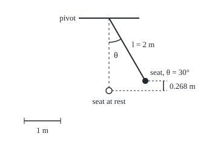
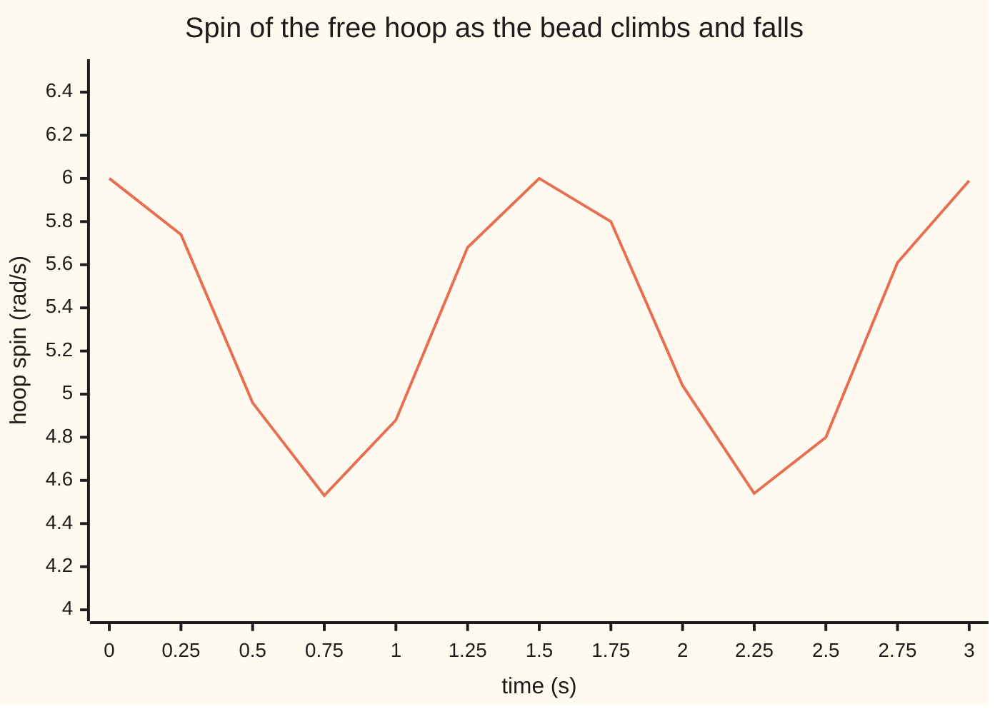

# Lagrangian mechanics: nature makes kinetic minus potential energy stationary, and the equations of motion fall out

Differential equations and dynamics → Calculus of Variations and Optimal Control → Motion from one energy difference → Lagrangian mechanics

---

## General Overview

A playground swing hangs from rigid rods 2 m long. Child and seat weigh 30 kg. Pull the seat back 30 degrees and let go. Newton's way to the motion is a force diagram, which must handle the rods' unknown pull.

Lagrange's way skips the diagram. Take the energy of motion minus the energy of height and feed it through the Euler-Lagrange equation of [functionals-and-the-euler-lagrange-equation](01-functionals-and-the-euler-lagrange-equation.md). Out comes the swing's law of motion, with the seat starting back at 2.4525 rad/s^2. The rods' pull never appears.

The recipe works in any coordinates and reads off conserved quantities. A bead climbs and falls on a hoop spinning freely about its vertical diameter. The hoop's angle is missing from the energy difference, so its angular momentum stays at 1.565499 kg m^2/s while the spin wanders.

**Motion makes the total over time of kinetic minus potential energy stationary; the Euler-Lagrange equation applied to that difference gives the equations of motion in any convenient coordinates, and a coordinate missing from it gives a conserved momentum.**

**What kind of fact this is:** a theorem: for forces from a potential and constraints doing no work, Lagrange's equations are Newton's second law rewritten, proved on this card in Why it works. The principle itself is physics, tested by experiment.

### The picture: one number pins the swing

<p align="center"></p>

Scale: 60 units per metre, pivot at (180, 30); at 30 degrees the seat sits 0.268 m above rest. Across and up are two numbers tied by the rod; the angle θ from straight down alone places the seat.

---

## The formula

Reminder: a functional takes a whole path and returns one number. New notation, in words first: a **generalised coordinate** $q$ is any number that pins down where the system is, such as the swing's angle; its rate is $q'$. Kinetic energy $T$ minus potential energy $V$, written in $q$ and $q'$, is the **Lagrangian** $L$; its total over time is the **action** $S$:

$$L(q, q') = T - V, \qquad S[q] = \int_{t_0}^{t_1} L(q, q')\,dt$$

**Read it aloud:** the Lagrangian is kinetic minus potential energy; the action adds it up from time $t_0$ to time $t_1$.

Hamilton's principle: the true motion between two fixed positions makes $S$ stationary, so no small change of path shifts $S$ to first order. The Euler-Lagrange equation turns that into one equation per coordinate:

$$\frac{d}{dt}\,\frac{\partial L}{\partial q'} = \frac{\partial L}{\partial q}$$

**Read it aloud:** the rate of change of the slope of L in the speed equals the slope of L in the position.

This is the functionals card's equation, with time in place of distance.

The slope $p = \partial L/\partial q'$ is the coordinate's **momentum**; on this card $p$ always means momentum. For the swing, $\theta$ is the angle from straight down and the seat moves at $l\theta'$:

$$L = \tfrac12 m l^2 \theta'^2 + m g l \cos\theta \quad\Longrightarrow\quad \theta'' + \frac{g}{l}\sin\theta = 0$$

**Read it aloud:** the swing's Lagrangian, fed through Euler-Lagrange, gives the pendulum equation.

| Symbol | Plain meaning | In our example | Push it up and the answer… |
| --- | --- | --- | --- |
| $q$, $t$, $t_0$, $t_1$ | a coordinate; time, s; start, end | $\theta$; 0 to 1 s | — |
| $\theta$, $\varphi$ | angle from straight down; hoop's angle | 30° at release | faster start back, up to 90° |
| $T$, $V$ | kinetic, potential energy, J | $V = -m g l\cos\theta$ | — |
| $L$ | Lagrangian $T - V$, J | $60\theta'^2 + 588.6\cos\theta$ | — |
| $S$, $\eta$, $\varepsilon$ | action, J s; nudge shape; size, rad | 604.926936; $\sin(\pi t)$; 0.01 | — |
| $m$, $l$, $g$ | swing mass; rod; gravity | 30 kg, 2 m, 9.81 m/s^2 | $m$: no effect |
| $m_b$, $R$, $I$ | bead mass; hoop radius; hoop's resistance to spinning | 0.5 kg, 0.5 m, 0.25 kg m^2 | $I$: steadier spin |
| $p$, $E$ | momentum; energy $T + V$ | hoop: 1.565499 kg m^2/s | — |

### When it holds

- **Forces come from a potential.** Friction has none: the equations miss it, and the modelled swing never slows.
- **Constraints do no work.** Rigid rods and a smooth hoop push at right angles to the motion. A slack chain lets the seat leave its circle, and the angle stops describing it.
- **One free coordinate per way to move.** A motor-driven coordinate is not free, and its momentum is not conserved: see What breaks.

---

## Why it works

### Step 0: a whole motion gets one number

Every way the seat could get from its release at 0 s to its true place at 1 s gets one number, its action. The true motion is where that number stops changing to first order, like a valley floor. A stationary point of a functional satisfies Euler-Lagrange.

### Step 1: the swing's equation, without a force diagram

The seat moves at $l\theta'$, so $T = \tfrac12 m l^2\theta'^2$. Its height below the pivot is $l\cos\theta$, so $V = -m g l\cos\theta$. The two slopes of $L$:

$$\frac{\partial L}{\partial \theta'} = m l^2\theta', \qquad \frac{\partial L}{\partial \theta} = -m g l\sin\theta.$$

Euler-Lagrange sets the rate of the first equal to the second: $m l^2\theta'' = -m g l\sin\theta$. Divide by $m l^2$: the pendulum equation of [the-nonlinear-pendulum](../06-Nonlinear%20Dynamics%20in%20the%20Plane/03-the-nonlinear-pendulum.md). The mass cancels, and the rods' pull never entered, because $\theta$ already obeys the rod. The force diagram gives the same: gravity's part along the arc, $-m g\sin\theta$, equals $m l\theta''$.

### Step 2: why this is Newton's law in disguise

For one body on a line at position $x$, $L = \tfrac12 m x'^2 - V(x)$. The slope in the speed is $m x'$, the momentum; the slope in the position is $-dV/dx$, the force. Euler-Lagrange reads: rate of momentum equals force, Newton's second law.

The action does not care which coordinates describe the motion, so stationary in across-and-up means stationary in the angle. The rods' pull, at right angles to the seat's path, does no work and drops out.

<details>
<summary>Detailed proof: the equations keep their form under a change of coordinates</summary>

Let $x = x(q)$, with $x_q = dx/dq$, so $x' = x_q\,q'$. Set $\tilde L(q, q') = L(x(q), x_q q')$. The chain rule gives $\tilde L_{q'} = L_{x'}\,x_q$ and $\tilde L_q = L_x\,x_q + L_{x'}\,x_{qq}\,q'$. Differentiating the first in time, $\frac{d}{dt}\tilde L_{q'} = \big(\frac{d}{dt}L_{x'}\big)x_q + L_{x'}\,x_{qq}\,q'$. Subtracting, $\frac{d}{dt}\tilde L_{q'} - \tilde L_q = \big(\frac{d}{dt}L_{x'} - L_x\big)\,dx/dq$: one side vanishes exactly when the other does, wherever $dx/dq \ne 0$. With several coordinates the factor is the Jacobian matrix. A constraint force is at right angles to every allowed motion, so it has no component along coordinates that obey the constraint.

</details>

### Step 3: the action really is stationary on the true swing

Nudge the true path by $\varepsilon\,\eta(t)$, with $\eta = \sin(\pi t)$ zero at both ends and $\varepsilon$ = ±0.01 rad. The first-order change is 0.001001 J s per rad, a higher-order residue; on a straight line between the same ends it is −41.245344. The second-order change, 154.8110, matches the second variation $\tfrac12\int (m l^2\eta'^2 - m g l\cos\theta\,\eta^2)\,dt$ = 154.8101. Positive: this nudge raises the action. Over this second every nudge does, because 1 s is shorter than half the small-swing period, $\pi\sqrt{l/g}$ = 1.42 s. Over longer windows the true path can be a saddle; the principle promises stationary, not least.

### Step 4: a missing coordinate is a conserved momentum

A bead of mass $m_b$ slides without friction on a hoop of radius $R$ that spins freely about its vertical diameter. Coordinates: the bead's angle $\theta$ from the bottom, the hoop's turning angle $\varphi$. The bead sits $R\sin\theta$ from the axis, so

$$L = \tfrac12 I\varphi'^2 + \tfrac12 m_b R^2\left(\theta'^2 + \sin^2\theta\,\varphi'^2\right) + m_b g R\cos\theta.$$

Only the rate of $\varphi$ appears, never $\varphi$ itself. Its Euler-Lagrange equation is $\frac{d}{dt}\,\partial L/\partial\varphi' = 0$, so the momentum

$$p = \frac{\partial L}{\partial \varphi'} = \left(I + m_b R^2\sin^2\theta\right)\varphi'$$

never changes. As the bead climbs, the bracket grows and the spin falls. A coordinate missing from $L$ is **cyclic**, and its momentum is conserved.

### Step 5: time missing means energy conserved

Neither Lagrangian contains $t$ itself, so the Beltrami identity of [the-brachistochrone-and-the-beltrami-identity](02-the-brachistochrone-and-the-beltrami-identity.md) keeps $q'\,\partial L/\partial q' - L$, summed over coordinates, fixed; here that is $T + V = E$, the energy. Both laws are cases of Noether's theorem: every continuous symmetry of the action (turning the hoop, shifting the clock) conserves a quantity.
---

## Worked numbers, by hand

| Step | Arithmetic | Value |
| --- | --- | --- |
| swing constants | $m l^2$ = 30 × 2^2; $m g l$ = 30 × 9.81 × 2 | 120 kg m^2; 588.6 J |
| slopes of $L$ | in θ': 120 θ'; in θ: −588.6 sin θ | — |
| Euler-Lagrange | 120 θ'' = −588.6 sin θ | θ'' = −(9.81 ÷ 2) sin θ |
| at release, 30° | −(9.81 ÷ 2) × 0.5 | **−2.4525 rad/s^2** |
| hoop momentum at start | (0.25 + 0.125 × sin^2 0.3) × 6 = 0.260917 × 6 | **1.565499 kg m^2/s** |
| spin, bead highest at 1.0618 rad | 1.565499 ÷ (0.25 + 0.125 × sin^2 1.0618) | **4.5335 rad/s** |

A child of any weight released from 30 degrees starts back at 2.4525 rad/s^2. On the hoop the bead climbs to 1.0618 rad and the spin drops from 6 to 4.5335 rad/s, momentum unchanged.

### What breaks if you drop a piece

| Mistake | Comes out at | What went wrong |
| --- | --- | --- |
| $L = T + V$ | +2.452500 rad/s^2 at 30°, away from the bottom | Gravity's sign flips |
| The hoop's spin alone, $I\varphi'$, as conserved | 1.1334 to 1.5000 kg m^2/s over the run | The bead carries momentum too |
| A guessed path, straight in θ | first-order change −41.245344 J s per rad | Only the true motion is stationary |
| A motor holds the hoop at 6 rad/s | bead to 1.4357 rad; $p$ from 1.565499 to 2.236398 kg m^2/s | $\varphi$ is no longer free: the motor's torque feeds momentum in |

---

## Code, from first principles, and it actually runs

Road one knows only the Lagrangian: at each state it measures the slopes of $L$ numerically and solves Euler-Lagrange for the accelerations. Road two steps the equations derived in Steps 1 and 4. Both use Runge-Kutta 4 ([runge-kutta-four](../05-Numerical%20Evolution/04-runge-kutta-four.md)). A third check weighs the action on nudged paths against the second-variation integral. Four asserts test these agreements; each fails if the physics in either road is altered. The code also prints the motor-held hoop.

### Python

```python
# Lagrangian mechanics -- the check behind the card.  Imports only sin, cos and pi.
# Road one knows only L = T - V and gets each acceleration from the Euler-Lagrange
# equation by numerical slopes of L.  Road two steps the equations derived by hand.
from math import sin, cos, pi
G, M, LEN, TH0 = 9.81, 30.0, 2.0, pi / 6          # swing: 30 kg, 2 m rods, released at 30 deg
MB, R, I, W0 = 0.5, 0.5, 0.25, 6.0                # bead kg, hoop radius m, hoop inertia kg m^2, spin rad/s
def l_swing(q, v): return 0.5 * M * LEN**2 * v[0]**2 + M * G * LEN * cos(q[0])
def l_wrong(q, v): return 0.5 * M * LEN**2 * v[0]**2 - M * G * LEN * cos(q[0])   # T + V, mistake 1
def l_hoop(q, v): return 0.5 * I * v[1]**2 + 0.5 * MB * R**2 * (v[0]**2 + sin(q[0])**2 * v[1]**2) + MB * G * R * cos(q[0])
def slope(f, x, i, e=1e-4):                       # central difference of f in its i-th input
    xp, xm = list(x), list(x); xp[i] += e; xm[i] -= e; return (f(xp) - f(xm)) / (2 * e)
def acc_from_l(lag, q, v):                        # solve  sum_j L_vi,vj a_j = L_qi - sum_j L_vi,qj v_j
    n, s = len(q), list(q) + list(v); f = lambda x: lag(x[:n], x[n:])
    p = [lambda x, i=i: slope(f, x, n + i) for i in range(n)]          # momenta dL/dv_i
    a = [[slope(p[i], s, n + j) for j in range(n)] for i in range(n)]
    b = [slope(f, s, i) - sum(slope(p[i], s, j) * v[j] for j in range(n)) for i in range(n)]
    if n == 1: return [b[0] / a[0][0]]
    det = a[0][0] * a[1][1] - a[0][1] * a[1][0]; return [(b[0] * a[1][1] - a[0][1] * b[1]) / det, (a[0][0] * b[1] - b[0] * a[1][0]) / det]
def acc_swing(q, v): return [-(G / LEN) * sin(q[0])]
def acc_hoop(q, v):                               # q = (theta, phi), v = (theta', phi')
    c, s = cos(q[0]), sin(q[0]); return [s * c * v[1]**2 - (G / R) * s, -2 * MB * R**2 * s * c * v[0] * v[1] / (I + MB * R**2 * s * s)]
def run(acc, s, h, steps):                        # Runge-Kutta 4 on q' = v, v' = acc(q, v)
    n, out, ad = len(s) // 2, [s], lambda s, k, c: [x + c * y for x, y in zip(s, k)]; f = lambda s: s[n:] + acc(s[:n], s[n:])
    for _ in range(steps):
        s = out[-1]; k1 = f(s); k2 = f(ad(s, k1, h / 2)); k3 = f(ad(s, k2, h / 2)); k4 = f(ad(s, k3, h))
        out.append([x + h / 6 * (a + 2 * b + 2 * c + d) for x, a, b, c, d in zip(s, k1, k2, k3, k4)])
    return out
a1, a2 = acc_from_l(l_swing, [TH0], [0.0])[0], acc_swing([TH0], [0.0])[0]
sw1, sw2 = run(lambda q, v: acc_from_l(l_swing, q, v), [TH0, 0.0], 0.01, 100), run(acc_swing, [TH0, 0.0], 0.01, 100)
print(f"swing: m l^2 = {M * LEN**2:.1f} kg m^2, m g l = {M * G * LEN:.1f} J; at 30 deg, angular acceleration "
      f"from L alone {a1:.6f}, from -(g/l) sin {a2:.6f} rad/s^2\n"
      f"swing angle at 1 s: road one {sw1[-1][0]:.6f}, road two {sw2[-1][0]:.6f} rad; speed {sw2[-1][1]:.6f} rad/s")
fine = run(acc_swing, [TH0, 0.0], 0.001, 1000)                   # the true path, 0 to 1 s, and a straight line
line = [[TH0 + (fine[-1][0] - TH0) * k / 1000, fine[-1][0] - TH0] for k in range(1001)]
def action(path, eps, h=0.001):                  # trapezoid sum of L along path + eps * sin(pi t); eps = +-0.01 rad
    vals = [l_swing([s[0] + eps * sin(pi * k * h)], [s[1] + eps * pi * cos(pi * k * h)]) for k, s in enumerate(path)]
    return h * (sum(vals) - 0.5 * (vals[0] + vals[-1]))
first = lambda p: (action(p, 0.01) - action(p, -0.01)) / 0.02; second = lambda p: (action(p, 0.01) + action(p, -0.01) - 2 * action(p, 0.0)) / 2e-4
q2 = 0.0005 * sum((1 if 0 < k < 1000 else 0.5) * (M * LEN**2 * (pi * cos(pi * k / 1000))**2
     - M * G * LEN * cos(s[0]) * sin(pi * k / 1000)**2) for k, s in enumerate(fine))
for name, pth in (("true path", fine), ("straight line", line)):
    print(f"{name}: action {action(pth, 0.0):.6f} J s; first-order change {first(pth):.6f}, second-order {second(pth):.4f}")
print(f"second variation, 0.5 x integral of (m l^2 eta'^2 - m g l cos(theta) eta^2): {q2:.4f}")
h1, h2 = run(lambda q, v: acc_from_l(l_hoop, q, v), [0.3, 0.0, 0.0, W0], 0.01, 300), run(acc_hoop, [0.3, 0.0, 0.0, W0], 0.01, 300)
p1 = [slope(lambda v: l_hoop(s[:2], v), s[2:], 1) for s in h1]; mom = [(I + MB * R**2 * sin(s[0])**2) * s[3] for s in h2]  # dL/dphi': by slope; by hand
print(f"hoop at 3 s: bead angle road one {h1[-1][0]:.6f}, road two {h2[-1][0]:.6f} rad; over 0 to 3 s the bead "
      f"swings {min(s[0] for s in h2):.4f} to {max(s[0] for s in h2):.4f} rad, the hoop spins {min(s[3] for s in h2):.4f} to {max(s[3] for s in h2):.4f} rad/s")
print(f"momentum (I + m R^2 sin^2 theta) phi', m R^2 = {MB * R**2:.3f}, at the start {mom[0] / W0:.6f} x {W0:g}; road two: min {min(mom):.6f}, max {max(mom):.6f}; "
      f"slope of L in phi', road one: min {min(p1):.6f}, max {max(p1):.6f} kg m^2/s")
dr = run(lambda q, v: acc_hoop(q, [v[0], W0])[:1], [0.3, 0.0], 0.01, 300); pd = [(I + MB * R**2 * sin(s[0])**2) * W0 for s in dr]  # motor holds phi'
print("chart, t = 0, 0.25 ... 3 s, hoop spin:", " ".join(f"{h2[k][3]:.2f}" for k in range(0, 301, 25)))
print(f"mistake 1, L = T + V: acceleration at 30 deg {acc_from_l(l_wrong, [TH0], [0.0])[0]:.6f} rad/s^2; mistake 2, hoop spin alone "
      f"I phi': {min(I * s[3] for s in h2):.4f} to {max(I * s[3] for s in h2):.4f} kg m^2/s\nmistake 3, motor-held spin: bead to {max(s[0] for s in dr):.4f} rad, momentum {min(pd):.6f} to {max(pd):.6f} kg m^2/s")
print("figure, 60 units per metre: pivot 180.0,30.0; seat at 30 deg %.1f,%.1f; seat at rest %.1f,%.1f; drop %.3f m; angle arc 40 units, ends 180.0,70.0 and %.1f,%.1f"
      % (180 + 60 * LEN * sin(TH0), 30 + 60 * LEN * cos(TH0), 180.0, 30 + 60 * LEN, LEN * (1 - cos(TH0)), 180 + 40 * sin(TH0), 30 + 40 * cos(TH0)))
assert abs(a1 - a2) < 1e-6 and abs(sw1[-1][0] - sw2[-1][0]) < 1e-6          # road one = road two, swing
assert abs(h1[-1][0] - h2[-1][0]) < 1e-5 and max(p1) - min(p1) < 1e-6        # road one = road two, hoop
assert abs(first(fine)) < 0.01 < abs(first(line))                            # stationary only on the true path
assert abs(second(fine) - q2) < 1e-3 * q2                                    # nudge cost = second variation
print("ALL CHECKS PASS")
```

**Ran 2026-09-28 on macOS, Python 3.14.6, standard library only. All checks passed. Output, pasted from the run:**

```
swing: m l^2 = 120.0 kg m^2, m g l = 588.6 J; at 30 deg, angular acceleration from L alone -2.452500, from -(g/l) sin -2.452500 rad/s^2
swing angle at 1 s: road one -0.299417, road two -0.299417 rad; speed -0.936926 rad/s
true path: action 604.926936 J s; first-order change 0.001001, second-order 154.8110
straight line: action 609.178774 J s; first-order change -41.245344, second-order 151.4734
second variation, 0.5 x integral of (m l^2 eta'^2 - m g l cos(theta) eta^2): 154.8101
hoop at 3 s: bead angle road one 0.305974, road two 0.305974 rad; over 0 to 3 s the bead swings 0.3000 to 1.0618 rad, the hoop spins 4.5335 to 6.0000 rad/s
momentum (I + m R^2 sin^2 theta) phi', m R^2 = 0.125, at the start 0.260917 x 6; road two: min 1.565499, max 1.565499; slope of L in phi', road one: min 1.565499, max 1.565499 kg m^2/s
chart, t = 0, 0.25 ... 3 s, hoop spin: 6.00 5.74 4.96 4.53 4.88 5.68 6.00 5.80 5.04 4.54 4.80 5.61 5.99
mistake 1, L = T + V: acceleration at 30 deg 2.452500 rad/s^2; mistake 2, hoop spin alone I phi': 1.1334 to 1.5000 kg m^2/s
mistake 3, motor-held spin: bead to 1.4357 rad, momentum 1.565499 to 2.236398 kg m^2/s
figure, 60 units per metre: pivot 180.0,30.0; seat at 30 deg 240.0,133.9; seat at rest 180.0,150.0; drop 0.268 m; angle arc 40 units, ends 180.0,70.0 and 200.0,64.6
ALL CHECKS PASS
```

### Rust

Same numbers, same labels, built with `rustc --edition 2021 -O`.

```rust
// Lagrangian mechanics -- the same check as the Python, in Rust.  No crates.
// Road one knows only L = T - V and gets each acceleration from the Euler-Lagrange
// equation by numerical slopes of L.  Road two steps the equations derived by hand.
use std::f64::consts::PI;
const G: f64 = 9.81; const M: f64 = 30.0; const LEN: f64 = 2.0; const TH0: f64 = PI / 6.0;   // swing
const MB: f64 = 0.5; const R: f64 = 0.5; const I: f64 = 0.25; const W0: f64 = 6.0;            // bead on a free hoop
type Lag = dyn Fn(&[f64], &[f64]) -> f64; type Acc = dyn Fn(&[f64], &[f64]) -> Vec<f64>;
fn l_swing(q: &[f64], v: &[f64]) -> f64 { 0.5 * M * LEN * LEN * v[0] * v[0] + M * G * LEN * q[0].cos() }
fn l_wrong(q: &[f64], v: &[f64]) -> f64 { 0.5 * M * LEN * LEN * v[0] * v[0] - M * G * LEN * q[0].cos() } // T + V
fn l_hoop(q: &[f64], v: &[f64]) -> f64 {
    0.5 * I * v[1] * v[1] + 0.5 * MB * R * R * (v[0] * v[0] + q[0].sin().powi(2) * v[1] * v[1]) + MB * G * R * q[0].cos() }
fn slope(f: &dyn Fn(&[f64]) -> f64, x: &[f64], i: usize) -> f64 {   // central difference in input i
    let (mut xp, mut xm) = (x.to_vec(), x.to_vec()); xp[i] += 1e-4; xm[i] -= 1e-4; (f(&xp) - f(&xm)) / 2e-4 }
fn acc_from_l(lag: &Lag, q: &[f64], v: &[f64]) -> Vec<f64> {        // sum_j L_vi,vj a_j = L_qi - sum_j L_vi,qj v_j
    let n = q.len(); let s: Vec<f64> = q.iter().chain(v.iter()).cloned().collect();
    let f = |x: &[f64]| lag(&x[..n], &x[n..]);
    let p = |i: usize| move |x: &[f64]| slope(&f, x, n + i);              // momentum dL/dv_i
    let a: Vec<Vec<f64>> = (0..n).map(|i| (0..n).map(|j| slope(&p(i), &s, n + j)).collect()).collect();
    let b: Vec<f64> = (0..n).map(|i| slope(&f, &s, i) - (0..n).map(|j| slope(&p(i), &s, j) * v[j]).sum::<f64>()).collect();
    if n == 1 { return vec![b[0] / a[0][0]]; }
    let det = a[0][0] * a[1][1] - a[0][1] * a[1][0]; vec![(b[0] * a[1][1] - a[0][1] * b[1]) / det, (a[0][0] * b[1] - b[0] * a[1][0]) / det]
}
fn acc_swing(q: &[f64], _v: &[f64]) -> Vec<f64> { vec![-(G / LEN) * q[0].sin()] }
fn acc_hoop(q: &[f64], v: &[f64]) -> Vec<f64> {                     // q = (theta, phi), v = (theta', phi')
    let (c, s) = (q[0].cos(), q[0].sin());
    vec![s * c * v[1] * v[1] - (G / R) * s, -2.0 * MB * R * R * s * c * v[0] * v[1] / (I + MB * R * R * s * s)] }
fn run(acc: &Acc, s0: Vec<f64>, h: f64, steps: usize) -> Vec<Vec<f64>> {   // Runge-Kutta 4 on q' = v, v' = acc
    let (n, mut out) = (s0.len() / 2, vec![s0.clone()]);
    let f = |s: &[f64]| { let mut d = s[n..].to_vec(); d.extend(acc(&s[..n], &s[n..])); d };
    let ad = |s: &[f64], k: &[f64], c: f64| s.iter().zip(k).map(|(x, y)| x + c * y).collect::<Vec<f64>>();
    for _ in 0..steps {
        let s = out.last().unwrap().clone();
        let k1 = f(&s); let k2 = f(&ad(&s, &k1, h / 2.0)); let k3 = f(&ad(&s, &k2, h / 2.0)); let k4 = f(&ad(&s, &k3, h));
        out.push((0..s.len()).map(|i| s[i] + h / 6.0 * (k1[i] + 2.0 * k2[i] + 2.0 * k3[i] + k4[i])).collect());
    }
    out
}
fn action(path: &[Vec<f64>], eps: f64) -> f64 {                    // trapezoid sum of L along path + eps * sin(pi t)
    let vals: Vec<f64> = path.iter().enumerate().map(|(k, s)| { let t = k as f64 * 0.001;
        l_swing(&[s[0] + eps * (PI * t).sin()], &[s[1] + eps * PI * (PI * t).cos()]) }).collect();
    0.001 * (vals.iter().sum::<f64>() - 0.5 * (vals[0] + vals[vals.len() - 1]))
}
fn first(p: &[Vec<f64>]) -> f64 { (action(p, 0.01) - action(p, -0.01)) / 0.02 }                 // nudge 0.01 rad each way
fn second(p: &[Vec<f64>]) -> f64 { (action(p, 0.01) + action(p, -0.01) - 2.0 * action(p, 0.0)) / 2e-4 }
fn range(xs: impl Iterator<Item = f64> + Clone) -> (f64, f64) { (xs.clone().fold(f64::MAX, f64::min), xs.fold(f64::MIN, f64::max)) }
fn main() {
    let (a1, a2) = (acc_from_l(&l_swing, &[TH0], &[0.0])[0], acc_swing(&[TH0], &[0.0])[0]);
    let (sw1, sw2) = (run(&|q: &[f64], v: &[f64]| acc_from_l(&l_swing, q, v), vec![TH0, 0.0], 0.01, 100), run(&acc_swing, vec![TH0, 0.0], 0.01, 100));
    println!("swing: m l^2 = {:.1} kg m^2, m g l = {:.1} J; at 30 deg, angular acceleration from L alone {:.6}, from -(g/l) sin {:.6} rad/s^2",
             M * LEN * LEN, M * G * LEN, a1, a2);
    println!("swing angle at 1 s: road one {:.6}, road two {:.6} rad; speed {:.6} rad/s", sw1[100][0], sw2[100][0], sw2[100][1]);
    let fine = run(&acc_swing, vec![TH0, 0.0], 0.001, 1000); let end = fine[1000][0];   // true path, 0 to 1 s; a straight line
    let line: Vec<Vec<f64>> = (0..=1000).map(|k| vec![TH0 + (end - TH0) * k as f64 / 1000.0, end - TH0]).collect();
    let q2 = 0.0005 * fine.iter().enumerate().map(|(k, s)| { let t = PI * k as f64 / 1000.0;
        (if k > 0 && k < 1000 { 1.0 } else { 0.5 }) * (M * LEN * LEN * (PI * t.cos()).powi(2) - M * G * LEN * s[0].cos() * t.sin().powi(2)) }).sum::<f64>();
    for (name, pth) in [("true path", &fine), ("straight line", &line)] {
        println!("{}: action {:.6} J s; first-order change {:.6}, second-order {:.4}", name, action(pth, 0.0), first(pth), second(pth));
    }
    println!("second variation, 0.5 x integral of (m l^2 eta'^2 - m g l cos(theta) eta^2): {:.4}", q2);
    let (h1, h2) = (run(&|q: &[f64], v: &[f64]| acc_from_l(&l_hoop, q, v), vec![0.3, 0.0, 0.0, W0], 0.01, 300), run(&acc_hoop, vec![0.3, 0.0, 0.0, W0], 0.01, 300));
    let p1: Vec<f64> = h1.iter().map(|s| slope(&|v: &[f64]| l_hoop(&s[..2], v), &s[2..], 1)).collect();  // road one
    let mom: Vec<f64> = h2.iter().map(|s| (I + MB * R * R * s[0].sin().powi(2)) * s[3]).collect();       // road two
    let ((b0, b1), (w0, w1), (m0, m1), (p0, pp)) = (range(h2.iter().map(|s| s[0])), range(h2.iter().map(|s| s[3])), range(mom.iter().cloned()), range(p1.iter().cloned()));
    println!("hoop at 3 s: bead angle road one {:.6}, road two {:.6} rad; over 0 to 3 s the bead swings {:.4} to {:.4} rad, the hoop spins {:.4} to {:.4} rad/s",
             h1[300][0], h2[300][0], b0, b1, w0, w1);
    println!("momentum (I + m R^2 sin^2 theta) phi', m R^2 = {:.3}, at the start {:.6} x {}; road two: min {:.6}, max {:.6}; slope of L in phi', road one: min {:.6}, max {:.6} kg m^2/s",
             MB * R * R, mom[0] / W0, W0, m0, m1, p0, pp);
    let ch: Vec<String> = (0..=300).step_by(25).map(|k| format!("{:.2}", h2[k][3])).collect(); println!("chart, t = 0, 0.25 ... 3 s, hoop spin: {}", ch.join(" "));
    let dr = run(&|q: &[f64], v: &[f64]| vec![acc_hoop(q, &[v[0], W0])[0]], vec![0.3, 0.0], 0.01, 300);   // mistake 3: motor holds phi'
    let ((d0, d1), pd) = (range(dr.iter().map(|s| s[0])), |x: f64| (I + MB * R * R * x.sin().powi(2)) * W0);
    println!("mistake 1, L = T + V: acceleration at 30 deg {:.6} rad/s^2; mistake 2, hoop spin alone I phi': {:.4} to {:.4} kg m^2/s\nmistake 3, motor-held spin: bead to {:.4} rad, momentum {:.6} to {:.6} kg m^2/s",
             acc_from_l(&l_wrong, &[TH0], &[0.0])[0], I * w0, I * w1, d1, pd(d0), pd(d1));
    println!("figure, 60 units per metre: pivot 180.0,30.0; seat at 30 deg {:.1},{:.1}; seat at rest {:.1},{:.1}; drop {:.3} m; angle arc 40 units, ends 180.0,70.0 and {:.1},{:.1}",
             180.0 + 60.0 * LEN * TH0.sin(), 30.0 + 60.0 * LEN * TH0.cos(), 180.0, 30.0 + 60.0 * LEN, LEN * (1.0 - TH0.cos()), 180.0 + 40.0 * TH0.sin(), 30.0 + 40.0 * TH0.cos());
    assert!((a1 - a2).abs() < 1e-6 && (sw1[100][0] - sw2[100][0]).abs() < 1e-6);   // road one = road two, swing
    assert!((h1[300][0] - h2[300][0]).abs() < 1e-5 && pp - p0 < 1e-6);             // road one = road two, hoop
    assert!(first(&fine).abs() < 0.01 && 0.01 < first(&line).abs());               // stationary only on the true path
    assert!((second(&fine) - q2).abs() < 1e-3 * q2);                               // nudge cost = second variation
    println!("ALL CHECKS PASS");
}
```

**Ran 2026-09-28 on macOS, rustc 1.98.1, no crates. All checks passed. Output, pasted from the run:**

```
swing: m l^2 = 120.0 kg m^2, m g l = 588.6 J; at 30 deg, angular acceleration from L alone -2.452500, from -(g/l) sin -2.452500 rad/s^2
swing angle at 1 s: road one -0.299417, road two -0.299417 rad; speed -0.936926 rad/s
true path: action 604.926936 J s; first-order change 0.001001, second-order 154.8110
straight line: action 609.178774 J s; first-order change -41.245344, second-order 151.4734
second variation, 0.5 x integral of (m l^2 eta'^2 - m g l cos(theta) eta^2): 154.8101
hoop at 3 s: bead angle road one 0.305974, road two 0.305974 rad; over 0 to 3 s the bead swings 0.3000 to 1.0618 rad, the hoop spins 4.5335 to 6.0000 rad/s
momentum (I + m R^2 sin^2 theta) phi', m R^2 = 0.125, at the start 0.260917 x 6; road two: min 1.565499, max 1.565499; slope of L in phi', road one: min 1.565499, max 1.565499 kg m^2/s
chart, t = 0, 0.25 ... 3 s, hoop spin: 6.00 5.74 4.96 4.53 4.88 5.68 6.00 5.80 5.04 4.54 4.80 5.61 5.99
mistake 1, L = T + V: acceleration at 30 deg 2.452500 rad/s^2; mistake 2, hoop spin alone I phi': 1.1334 to 1.5000 kg m^2/s
mistake 3, motor-held spin: bead to 1.4357 rad, momentum 1.565499 to 2.236398 kg m^2/s
figure, 60 units per metre: pivot 180.0,30.0; seat at 30 deg 240.0,133.9; seat at rest 180.0,150.0; drop 0.268 m; angle arc 40 units, ends 180.0,70.0 and 200.0,64.6
ALL CHECKS PASS
```

The two outputs match line for line.

### The picture: the hoop's spin wanders, its momentum does not



The orange line is the hoop's spin, from road two: 4.53 when the bead is highest, 6.00 when it is back at the start. The momentum stays at 1.565499 kg m^2/s throughout, on both roads.

> [!TIP]
> **Try changing**
> Guess first, then run it. Every run passes its asserts.
> - **A heavier child.** Set `M` to `60.0`. The acceleration and the angle at 1 s are unchanged; the action doubles, to 1209.853871 J s.
> - **A slower hoop.** Set `W0` to `4.0`. The bead falls back and rocks between −0.3000 and 0.3000 rad; the spin stays between 4.0000 and 4.1747 rad/s.
> - **A lighter hoop.** Set `I` to `0.05`. The bead reaches only 0.6635 rad, but the spin drops to 3.7518 rad/s.

---

## The usual mistake

> [!warning]
> **Adding the energies instead of subtracting.** $T + V$ is conserved, so it looks like the natural thing to total up. It is the wrong functional: making it stationary flips gravity's sign, and the seat accelerates away from the bottom at 2.452500 rad/s^2.
>
> - **Reading "least action" literally.** Past half a small-swing period the true path can be a saddle.
> - **Calling a coordinate cyclic because it changes little.** Cyclic means absent from $L$, like the hoop's $\varphi$.
> - **Treating a driven coordinate as free.** A motor-held spin makes $\varphi$ prescribed: no Euler-Lagrange equation, no conserved momentum.

---

## Where you meet it in real life

- **Robot arms.** Each joint angle is a generalised coordinate; one Lagrangian gives every joint's equation, with no force diagram per link.
- **Skaters.** Arms pulled in, spin up: the hoop's momentum run in reverse.
- **Orbits.** A planet's angle round the Sun is cyclic, so its angular momentum is conserved: Kepler's equal areas in equal times.

> **Say it back**
> Kinetic minus potential energy, in any coordinates that pin the system down, is the Lagrangian. The true motion makes its total over time stationary. The Euler-Lagrange equation turns that into one equation of motion per coordinate: for the swing, the pendulum equation, with no force diagram. A coordinate absent from the Lagrangian has a conserved momentum, as the free hoop shows.

---

## What this builds on

- [functionals-and-the-euler-lagrange-equation](01-functionals-and-the-euler-lagrange-equation.md): the functional, the stationary path, and the equation it must satisfy.
- [the-nonlinear-pendulum](../06-Nonlinear%20Dynamics%20in%20the%20Plane/03-the-nonlinear-pendulum.md): the equation this card derives, and what its solutions do.

## Where this goes next

- [hamiltons-equations](05-hamiltons-equations.md): trade each speed for its momentum and get two first-order equations per coordinate.
- lagrangian-and-hamiltonian-mechanics-for-engineers: the same recipe for linkages and vibrating structures.
- noethers-theorem: every continuous symmetry of the action, and the quantity it conserves.

---

## Sources

Verified 2026-09-28: each page names the cited work.

- Landau, L. D., and E. M. Lifshitz. *Mechanics*, 3rd ed. Elsevier, 1976. [Publisher page](https://shop.elsevier.com/books/mechanics/landau/978-0-08-050347-9). The Lagrangian from least action; conservation laws from symmetry.
- Gelfand, I. M., and S. V. Fomin. *Calculus of Variations*. Dover, 2000. [Publisher page](https://store.doverpublications.com/products/9780486414485). Least action and conservation laws as variational results.
- Noether, Emmy. "Invariant Variation Problems" (1918), translated by M. A. Tavel. [arXiv:physics/0503066](https://arxiv.org/abs/physics/0503066). Symmetries and conserved quantities.
- MIT OpenCourseWare. *8.09 Classical Mechanics III*, Fall 2014. [Course page](https://ocw.mit.edu/courses/8-09-classical-mechanics-iii-fall-2014/). Lagrangian and Hamiltonian mechanics.
