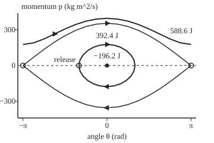

# Hamilton's equations: trade velocity for momentum and the motion becomes a pair of first-order equations that conserve energy

[Syllabus](../../../SYLLABUS.md) → [Differential equations and dynamics](../../../SYLLABUS.md#w08) → [Calculus of Variations and Optimal Control](../../../SYLLABUS.md#w08-s12) → Hamilton's equations

---

## General Overview

A 20 kg child sits on a playground swing hung from rigid 2 m rods. A parent pulls the seat back to 60 degrees and lets go. The seat passes the bottom at 4.43 m/s and one full swing, there and back, takes 3.045 s.

The Lagrangian route ([Lagrangian mechanics](04-lagrangian-mechanics.md)) gives one second-order equation for the angle. William Rowan Hamilton, in 1834, kept the angle as one unknown and took the swing's **momentum**, its mass-weighted turning speed, as the second. Then one function, the energy written in angle and momentum, drives both rates, and it cannot change while the swing moves.

Every motion becomes a level curve of that function, so the whole portrait is drawn without solving anything. And the motion keeps areas in the angle–momentum plane, which is why the steps of [Symplectic steps](../05-Numerical%20Evolution/07-symplectic-steps-for-oscillators.md) hold a swing's energy for thousands of steps.

**Write the energy as a function of position and momentum, the Hamiltonian; the position then changes at its slope in the momentum, the momentum at minus its slope in the position, and the Hamiltonian stays constant along the motion.**

**What kind of fact this is:** a theorem: Hamilton's equations are Lagrange's equations rewritten, proved on this card in Why it works.

### The picture: every motion of the swing, in angle and momentum

<p align="center"></p>

Scale: 45 units per radian across, 0.2 per kg m^2/s up. Each curve is one value of the Hamiltonian: the loop is the release from −60 degrees, −196.2 J; the curves through the open circles (seat upside down) are the separatrix, 392.4 J; the wavy curve, 588.6 J, goes over the top.

---

## The formula

The angle $\theta$ is measured from straight down; a prime means rate in time, so $\theta'$ is the angular speed. The Lagrangian $L$ is kinetic minus potential energy. For a swing of mass $m$, rod length $l$, under gravity $g$:

$$L(\theta, \theta') = \tfrac12\, m l^2\, \theta'^2 + m g l \cos\theta$$

The **momentum** $p$ is the slope of $L$ in the velocity; the **Hamiltonian** $H$ comes from the Legendre transform of Step 2:

$$p = \frac{\partial L}{\partial \theta'} = m l^2\, \theta', \qquad H(\theta, p) = p\,\theta' - L = \frac{p^2}{2 m l^2} - m g l \cos\theta$$

**Read it aloud:** momentum is how steeply the Lagrangian rises with speed; the Hamiltonian is momentum times speed minus the Lagrangian, in angle and momentum only. Hamilton's equations:

$$\theta' = \frac{\partial H}{\partial p} = \frac{p}{m l^2}, \qquad p' = -\frac{\partial H}{\partial \theta} = -m g l \sin\theta$$

**Read it aloud:** the angle changes at the Hamiltonian's slope in the momentum, the momentum at minus its slope in the angle.

| Symbol | Plain meaning | In our example | Push it up and the answer… |
| --- | --- | --- | --- |
| $\theta$ | angle from straight down, rad | −60 degrees at release | seat higher |
| $\theta'$ | angular speed, rad/s | 0 at release, 2.2147 at the bottom | more kinetic energy |
| $p$ | momentum about the pivot, kg m^2/s | 0 at release, 177.18 at the bottom | faster swing |
| $L$ | kinetic minus potential energy, J | 588.6 J at the bottom | — |
| $H$ | kinetic plus potential energy, J | −196.2 J throughout | past 392.4 J: over the top |
| $m$, $l$, $g$ | mass 20 kg, rod length 2 m, gravity 9.81 m/s^2 | $m l^2$ = 80 kg m^2, $m g l$ = 392.4 J | longer rods: slower swing |
| $q$, $v$ | any position, its velocity | $\theta$, $\theta'$ | — |
| $t$, $h$ | time, s; a method's step | $h$ = 0.05 s | larger error per step |

Potential energy is zero with the rods horizontal, −392.4 J hanging.

### When it holds

- **The Lagrangian curves upward in the velocity.** Here its second slope (the slope of its slope) is $m l^2$ = 80, so each momentum names one speed. A Lagrangian that is a straight line in the velocity has no Legendre transform.
- **No clock inside the Hamiltonian.** A child who stands and squats changes $l$; $H$ then changes, which is how pumping works.
- **Forces from a potential.** Friction is not one; with it $H$ drains away, as on [LaSalle's principle](../06-Nonlinear%20Dynamics%20in%20the%20Plane/05-lasalle-and-the-damped-pendulum.md).
- **Any coordinate works.** Each position coordinate gets its own **conjugate momentum** by the same slope rule.

---

## Why it works

### Step 0: choose the second unknown so one function drives both rates

A second-order equation becomes two first-order ones with a second unknown ([From one equation to a system](../04-Systems%20and%20the%20Matrix%20Exponential/01-from-one-equation-to-a-system.md)). Choosing the momentum, not the velocity, makes the two rates the two slopes of one function, with a sign between them.

### Step 1: the momentum

The slope of $L$ in $\theta'$ is $m l^2 \theta'$: 80 × 2.2147 = 177.18 kg m^2/s at the bottom. It is mass times the seat's speed $l\theta'$, times the lever arm $l$.

### Step 2: the Legendre transform

For a fixed $p$, let the velocity $v$ vary in $p\,v - L(\theta, v)$. Because $L$ curves upward in $v$, this has one highest point, where its slope $p - \partial L/\partial v$ is zero: where $p$ is the momentum of $v$. The highest value is the Hamiltonian:

$$H(\theta, p) = \max_{v}\,\big(p\,v - L(\theta, v)\big)$$

This is the **Legendre transform**. At the bottom, $p$ = 177.18, the best $v$ is 2.2147 rad/s and the maximum −196.2 J; the code finds both by search. For the swing the maximum is kinetic plus potential energy.

### Step 3: the two slopes of H are the two rates

Nudge $p$ in $H = p\,\theta' - L$. $H$ changes by $\theta'$, plus $p$ times the change in $\theta'$, minus $\partial L/\partial\theta'$ times that change. The last two cancel, because $p = \partial L/\partial\theta'$. So $\partial H/\partial p = \theta'$.

Nudging $\theta$ leaves only $-\partial L/\partial\theta$. Lagrange's equation says the rate of $\partial L/\partial\theta'$, which is $p'$, equals $\partial L/\partial\theta$. So $p' = -\partial H/\partial\theta$. At release that is −392.4 × sin(−60°) = +339.83 N m, a torque, pushing the seat toward the bottom.

<details>
<summary>Detailed proof: Hamilton's equations for any smooth Lagrangian</summary>

Let $L(q, v, t)$ be smooth with $\partial^2 L/\partial v^2 > 0$. By the inverse function theorem $p = \partial L/\partial v(q, v, t)$ has a unique smooth solution $v = V(q, p, t)$. Define $H = p\,V - L(q, V, t)$. The chain rule gives $\partial H/\partial p = V + (p - \partial L/\partial v)\,\partial V/\partial p = V$ and $\partial H/\partial q = (p - \partial L/\partial v)\,\partial V/\partial q - \partial L/\partial q = -\partial L/\partial q$. If $q(t)$ solves $(\partial L/\partial v)' = \partial L/\partial q$ and $p = \partial L/\partial v(q, q', t)$, then $q' = V = \partial H/\partial p$ and $p' = \partial L/\partial q = -\partial H/\partial q$. The steps reverse, so the two systems share their solutions. Several coordinates work the same way, the matrix of second slopes positive definite.

</details>

### Step 4: the Hamiltonian is conserved

Along a motion, the chain rule gives

$$H' = \frac{\partial H}{\partial \theta}\,\theta' + \frac{\partial H}{\partial p}\,p' = \frac{\partial H}{\partial \theta}\,\frac{\partial H}{\partial p} - \frac{\partial H}{\partial p}\,\frac{\partial H}{\partial \theta} = 0.$$

The sign between the two equations makes the terms cancel, so $H$ keeps its release value, −196.2 J. At the bottom the cosine is 1: $p^2/160 = -196.2 + 392.4$, so $p$ = 177.18 and the seat moves at 2 m × 2.2147 = 4.43 m/s. If $H$ carries an explicit time, the same line gives $H' = \partial H/\partial t$.

### Step 5: the level curves are the pendulum's portrait

Each motion keeps to one curve, $p = \pm\sqrt{2 m l^2\,(H + m g l\cos\theta)}$. Below 392.4 J the square root limits the angle: a closed loop. At 392.4 J the momentum reaches zero exactly upside down: the separatrix. Above it the momentum never vanishes: the seat goes over the top. This is the portrait of [The pendulum](../06-Nonlinear%20Dynamics%20in%20the%20Plane/03-the-nonlinear-pendulum.md) with momentum on the vertical axis; that card's quarter-swing integral, scaled by $\sqrt{l/g}$ to 2 m rods, gives 0.761156138 s.

### Step 6: the motion keeps area, and so should the steps

A small patch of starting states changes area at the divergence of the rates, $\partial\theta'/\partial\theta + \partial p'/\partial p = \partial^2 H/\partial\theta\,\partial p - \partial^2 H/\partial p\,\partial\theta = 0$. Areas never change: Liouville's theorem. A map that keeps this area is **symplectic**.

Euler's rule, a straight step along the current slope ([Euler's method](../05-Numerical%20Evolution/01-eulers-method.md)), stretches area by $1 + h^2 (g/l)\cos\theta$: 1.01226250 per step at the bottom with $h$ = 0.05 s. Leapfrog (half a kick to $p$, a drift of $\theta$, half a kick) is three shears, each keeping area exactly. Over 100 s Euler's swing spins over the top; leapfrog's $H$ stays within 0.55 J.

Another road: the equations are the Euler–Lagrange equations of $\int (p\,\theta' - H)\,dt$, with angle and momentum varied independently, the start of Hamilton-Jacobi.

---

## Worked numbers, by hand

| Step | Arithmetic | Value |
| --- | --- | --- |
| $m l^2$ and $m g l$ | 20 × 2 × 2; 20 × 9.81 × 2 | 80 kg m^2; 392.4 J |
| $H$ at release | 0/160 − 392.4 × cos(−60°) = −392.4 × 0.5 | **−196.2 J** |
| rates at release | $\theta'$ = 0/80; $p'$ = −392.4 × sin(−60°) | 0 rad/s; +339.83 N m |
| $H$ at the bottom, still −196.2 | $p^2$/160 − 392.4 = −196.2, so $p^2$ = 160 × 196.2 = 31,392 | $p$ = **177.18** kg m^2/s |
| speed at the bottom | 177.18 / 80; times 2 m | 2.2147 rad/s; **4.43 m/s** |
| over the top | needs $H$ above 392.4: $p^2$/160 = 784.8 | $p$ = 354.36; seat 8.859 m/s |

### What breaks if you drop a piece

| Mistake | Comes out at | What went wrong |
| --- | --- | --- |
| Momentum taken as $m l\,\theta'$ | 88.59, so $H$ = −343.35 J at the bottom | Not the slope of $L$: one $l$ missing |
| Sign of $p'$ flipped | after 1 s: −185.8 degrees, $H$ = 977.02 J | The two terms in $H'$ add |
| Euler's rule, $h$ = 0.05 s, 100 s | $H$ = 4526.44 J: spinning | Each step stretches area |

---

## Code, from first principles, and it actually runs

Three roads. The bottom momentum comes from the level curve of $H$ and from Runge-Kutta 4 (RK4, four slope samples per step) stepping Hamilton's equations. The quarter swing comes from Simpson's rule on the pendulum card's integral and from the same steps; the error falls 16-fold when the step halves, as a fourth-order method's should. The Hamiltonian is also found as the Legendre maximum, by search.

### Python

```python
# Hamilton's equations -- the check behind the card.  Imports only math's sin, cos, asin, sqrt, pi.
# A 20 kg child, 2 m rods, released at -60 degrees; state: angle th (rad), momentum p = m l^2 th'.
# Roads: the level curve of H, RK4 steps of Hamilton's equations, Simpson's rule, Legendre's max.
from math import sin, cos, asin, sqrt, pi
M, L, G, TH0 = 20.0, 2.0, 9.81, -pi / 3; I, K = M * L * L, M * G * L   # I = m l^2, K = m g l
ham = lambda th, p: p * p / (2 * I) - K * cos(th)     # the Hamiltonian, J
lag = lambda th, v: 0.5 * I * v * v + K * cos(th)      # the Lagrangian, J
def legendre(th, p, lo=-50.0, hi=50.0):                # max over v of p v - L, by ternary search
    for _ in range(200):
        a, b = lo + (hi - lo) / 3, hi - (hi - lo) / 3
        lo, hi = (a, hi) if p * a - lag(th, a) < p * b - lag(th, b) else (lo, b)
    return p * lo - lag(th, lo), lo
def rk4(th, p, h, s=-1.0):                             # s = -1: p' = -dH/dth; s = +1 is mistake 2
    f = lambda a, b: (b / I, s * K * sin(a))
    a1, b1 = f(th, p); a2, b2 = f(th + h / 2 * a1, p + h / 2 * b1)
    a3, b3 = f(th + h / 2 * a2, p + h / 2 * b2); a4, b4 = f(th + h * a3, p + h * b3)
    return th + h / 6 * (a1 + 2 * a2 + 2 * a3 + a4), p + h / 6 * (b1 + 2 * b2 + 2 * b3 + b4)
def to_bottom(h, th=TH0, p=0.0, t=0.0):                # step until th passes 0,
    while rk4(th, p, h)[0] < 0: th, p = rk4(th, p, h); t += h
    lo, hi = 0.0, h                                    # bisect the last step onto th = 0
    for _ in range(60): mid = (lo + hi) / 2; lo, hi = (mid, hi) if rk4(th, p, mid)[0] < 0 else (lo, mid)
    return t + lo, rk4(th, p, lo)[1]
euler = lambda th, p, h: (th + h * p / I, p - h * K * sin(th))
def leap(th, p, h):                                    # kick half, drift, kick half
    p -= h / 2 * K * sin(th); th += h * p / I; return th, p - h / 2 * K * sin(th)
def drift(step, h=0.05, th=TH0, p=0.0, worst=0.0):     # 100 s of steps: largest |H - H0|, final H
    for _ in range(2000): th, p = step(th, p, h); worst = max(worst, abs(ham(th, p) - H0))
    return worst, ham(th, p)
def det(step, th, p, h=0.05, e=1e-4):                  # area factor of one step, by differences
    a = [(x - y) / (2 * e) for x, y in zip(step(th + e, p, h), step(th - e, p, h))]
    b = [(x - y) / (2 * e) for x, y in zip(step(th, p + e, h), step(th, p - e, h))]
    return a[0] * b[1] - a[1] * b[0]
H0, k, n = ham(TH0, 0.0), sin(-TH0 / 2), 400
p_curve = sqrt(2 * I * (H0 + K))                       # the level curve H = H0, read at th = 0
f = lambda q: 1 / sqrt(1 - k * k * sin(q) ** 2)        # the quarter-swing integrand, as on the pendulum card
t_simp = sqrt(I / K) * pi / 6 / n * sum((1 if i in (0, n) else 4 if i % 2 else 2) * f(i * pi / 2 / n) for i in range(n + 1))
runs = [to_bottom(h) for h in (0.02, 0.01)]; err = [abs(r[0] - t_simp) for r in runs]
(H_leg, v_star), lf, eu, th1, p1 = legendre(0.0, runs[1][1]), drift(leap), drift(euler), TH0, 0.0
for _ in range(100): th1, p1 = rk4(th1, p1, 0.01, +1.0)
print(f"swing: m l^2 = {I:.1f} kg m^2, m g l = {K:.1f} J, released at -60 deg: H0 = {H0:.1f} J")
print(f"rates at release: th' = p/(m l^2) = 0, p' = -m g l sin(-60 deg) = {-K * sin(TH0):.2f} N m")
print(f"bottom, level curve: p = {p_curve:.2f} kg m^2/s, th' = {p_curve / I:.4f} rad/s, seat {L * p_curve / I:.2f} m/s")
print(f"bottom, RK4 h = 0.02, 0.01: p = {runs[0][1]:.6f} {runs[1][1]:.6f}; off the level curve by {1e9 * (runs[0][1] - p_curve):.1f} {1e9 * (runs[1][1] - p_curve):.1f} x 1e-9")
print(f"quarter swing: Simpson {t_simp:.9f} s; RK4 h = 0.02, 0.01 off by {1e9 * err[0]:.2f} {1e9 * err[1]:.2f} ns, ratio {err[0] / err[1]:.1f}; full swing {4 * t_simp:.3f} s")
print(f"Legendre at the bottom: best v = {v_star:.4f} rad/s, max of p v - L = {H_leg:.1f} J")
print(f"100 s at h = 0.05: leapfrog largest |H - H0| {lf[0]:.2f} J; Euler ends at H = {eu[1]:.2f} J")
print(f"area factor of one step at the bottom: leapfrog {det(leap, 0.0, p_curve):.8f}, Euler {det(euler, 0.0, p_curve):.8f}")
print(f"standing on end: H = {K:.1f} J, needs p = {2 * sqrt(I * K):.2f} at the bottom, seat {2 * L * sqrt(K / I):.3f} m/s; curve drawn above it H = {1.5 * K:.1f} J")
print(f"mistake 1, p = m l th' at the bottom: {M * L * p_curve / I:.2f}, so H = {ham(0.0, M * L * p_curve / I):.2f} J")
print(f"mistake 2, p' = +dH/dth for 1 s: th = {th1 * 180 / pi:.1f} deg, H = {ham(th1, p1):.2f} J")
pts = lambda cs: " ".join(f"{180 + 45 * a:.1f},{110 - 0.2 * b:.1f}" for a, b in cs)   # 45 per rad, 0.2 per kg m^2/s
print("figure, swing loop:", pts((2 * asin(k * sin(i * pi / 12)), 2 * sqrt(I * K) * k * cos(i * pi / 12)) for i in range(24)))
for sg in (1, -1):
    print(f"figure, separatrix {sg:+d}:", pts((i * pi / 8, sg * 2 * sqrt(I * K) * cos(i * pi / 16)) for i in range(-8, 9)))
print("figure, over the top:", pts((i * pi / 8, sqrt(2 * I * (1.5 * K + K * cos(i * pi / 8)))) for i in range(-8, 9)))
assert abs(runs[1][1] - p_curve) < 1e-6                        # RK4 steps land on the level curve
assert err[1] < 1e-8 and 12 < err[0] / err[1] < 20             # two roads to the quarter swing; order four
assert abs(H_leg - H0) < 1e-6                                  # Legendre's max at the bottom = energy at release
assert lf[0] < K / 100 < abs(eu[1] - H0) and abs(det(leap, 0.0, p_curve) - 1) < 1e-8 < abs(det(euler, 0.0, p_curve) - 1)
print("ALL CHECKS PASS")
```

**Ran 2026-09-28 on macOS, Python 3.14.6, standard library only. All checks passed. Output, pasted from the run:**

```
swing: m l^2 = 80.0 kg m^2, m g l = 392.4 J, released at -60 deg: H0 = -196.2 J
rates at release: th' = p/(m l^2) = 0, p' = -m g l sin(-60 deg) = 339.83 N m
bottom, level curve: p = 177.18 kg m^2/s, th' = 2.2147 rad/s, seat 4.43 m/s
bottom, RK4 h = 0.02, 0.01: p = 177.177877 177.177877; off the level curve by 284.0 25.5 x 1e-9
quarter swing: Simpson 0.761156138 s; RK4 h = 0.02, 0.01 off by 16.29 1.01 ns, ratio 16.1; full swing 3.045 s
Legendre at the bottom: best v = 2.2147 rad/s, max of p v - L = -196.2 J
100 s at h = 0.05: leapfrog largest |H - H0| 0.55 J; Euler ends at H = 4526.44 J
area factor of one step at the bottom: leapfrog 1.00000000, Euler 1.01226250
standing on end: H = 392.4 J, needs p = 354.36 at the bottom, seat 8.859 m/s; curve drawn above it H = 588.6 J
mistake 1, p = m l th' at the bottom: 88.59, so H = -343.35 J
mistake 2, p' = +dH/dth for 1 s: th = -185.8 deg, H = 977.02 J
figure, swing loop: 180.0,74.6 191.7,75.8 202.7,79.3 212.5,84.9 220.3,92.3 225.4,100.8 227.1,110.0 225.4,119.2 220.3,127.7 212.5,135.1 202.7,140.7 191.7,144.2 180.0,145.4 168.3,144.2 157.3,140.7 147.5,135.1 139.7,127.7 134.6,119.2 132.9,110.0 134.6,100.8 139.7,92.3 147.5,84.9 157.3,79.3 168.3,75.8
figure, separatrix +1: 38.6,110.0 56.3,96.2 74.0,82.9 91.6,70.6 109.3,59.9 127.0,51.1 144.7,44.5 162.3,40.5 180.0,39.1 197.7,40.5 215.3,44.5 233.0,51.1 250.7,59.9 268.4,70.6 286.0,82.9 303.7,96.2 321.4,110.0
figure, separatrix -1: 38.6,110.0 56.3,123.8 74.0,137.1 91.6,149.4 109.3,160.1 127.0,168.9 144.7,175.5 162.3,179.5 180.0,180.9 197.7,179.5 215.3,175.5 233.0,168.9 250.7,160.1 268.4,149.4 286.0,137.1 303.7,123.8 321.4,110.0
figure, over the top: 38.6,74.6 56.3,72.0 74.0,65.4 91.6,57.0 109.3,48.6 127.0,41.2 144.7,35.5 162.3,32.0 180.0,30.8 197.7,32.0 215.3,35.5 233.0,41.2 250.7,48.6 268.4,57.0 286.0,65.4 303.7,72.0 321.4,74.6
ALL CHECKS PASS
```

### Rust

Same numbers, same labels, built with `rustc --edition 2021 -O`.

```rust
// Hamilton's equations -- the same check as the Python, in Rust.  No crates.
// A 20 kg child, 2 m rods, released at -60 degrees; state: angle th (rad), momentum p = m l^2 th'.
// Roads: the level curve of H, RK4 steps of Hamilton's equations, Simpson's rule, Legendre's max.
use std::f64::consts::PI;
const M: f64 = 20.0; const L: f64 = 2.0; const G: f64 = 9.81; const TH0: f64 = -PI / 3.0;
const I: f64 = M * L * L; const K: f64 = M * G * L;                 // I = m l^2, K = m g l
fn ham(th: f64, p: f64) -> f64 { p * p / (2.0 * I) - K * th.cos() } // the Hamiltonian, J
fn lag(th: f64, v: f64) -> f64 { 0.5 * I * v * v + K * th.cos() }   // the Lagrangian, J
fn legendre(th: f64, p: f64) -> (f64, f64) {             // max over v of p v - L, by ternary search
    let (mut lo, mut hi) = (-50.0, 50.0);
    for _ in 0..200 { let (a, b) = (lo + (hi - lo) / 3.0, hi - (hi - lo) / 3.0); if p * a - lag(th, a) < p * b - lag(th, b) { lo = a } else { hi = b } }
    (p * lo - lag(th, lo), lo)
}
fn rk4(th: f64, p: f64, h: f64, s: f64) -> (f64, f64) {  // s = -1: p' = -dH/dth; s = +1 is mistake 2
    let f = |a: f64, b: f64| (b / I, s * K * a.sin());
    let (a1, b1) = f(th, p); let (a2, b2) = f(th + h / 2.0 * a1, p + h / 2.0 * b1);
    let (a3, b3) = f(th + h / 2.0 * a2, p + h / 2.0 * b2); let (a4, b4) = f(th + h * a3, p + h * b3);
    (th + h / 6.0 * (a1 + 2.0 * a2 + 2.0 * a3 + a4), p + h / 6.0 * (b1 + 2.0 * b2 + 2.0 * b3 + b4))
}
fn to_bottom(h: f64) -> (f64, f64) {                     // step until th passes 0,
    let (mut th, mut p, mut t) = (TH0, 0.0, 0.0);
    while rk4(th, p, h, -1.0).0 < 0.0 { (th, p) = rk4(th, p, h, -1.0); t += h }
    let (mut lo, mut hi) = (0.0, h);                     // bisect the last step onto th = 0
    for _ in 0..60 { let mid = (lo + hi) / 2.0; if rk4(th, p, mid, -1.0).0 < 0.0 { lo = mid } else { hi = mid } }
    (t + lo, rk4(th, p, lo, -1.0).1)
}
fn euler(th: f64, p: f64, h: f64) -> (f64, f64) { (th + h * p / I, p - h * K * th.sin()) }
fn leap(th: f64, p: f64, h: f64) -> (f64, f64) {         // kick half, drift, kick half
    let p = p - h / 2.0 * K * th.sin(); let th = th + h * p / I; (th, p - h / 2.0 * K * th.sin())
}
fn drift(step: fn(f64, f64, f64) -> (f64, f64), h0: f64) -> (f64, f64) {   // 100 s at h = 0.05
    let (mut th, mut p, mut worst) = (TH0, 0.0, 0.0f64);
    for _ in 0..2000 { (th, p) = step(th, p, 0.05); worst = worst.max((ham(th, p) - h0).abs()) }
    (worst, ham(th, p))
}
fn det(step: fn(f64, f64, f64) -> (f64, f64), th: f64, p: f64) -> f64 {   // area factor of one step
    let (h, e) = (0.05, 1e-4); let (ap, am) = (step(th + e, p, h), step(th - e, p, h)); let (bp, bm) = (step(th, p + e, h), step(th, p - e, h));
    ((ap.0 - am.0) * (bp.1 - bm.1) - (ap.1 - am.1) * (bp.0 - bm.0)) / (4.0 * e * e)
}
fn pts(cs: &[(f64, f64)]) -> String {                    // 45 per rad, 0.2 per kg m^2/s
    cs.iter().map(|&(a, b)| format!("{:.1},{:.1}", 180.0 + 45.0 * a, 110.0 - 0.2 * b)).collect::<Vec<_>>().join(" ")
}
fn main() {
    let (h0, k, n) = (ham(TH0, 0.0), (-TH0 / 2.0).sin(), 400);
    let p_curve = (2.0 * I * (h0 + K)).sqrt();           // the level curve H = H0, read at th = 0
    let f = |q: f64| 1.0 / (1.0 - k * k * q.sin().powi(2)).sqrt();
    let sum: f64 = (0..=n).map(|i| (if i == 0 || i == n { 1.0 } else if i % 2 == 1 { 4.0 } else { 2.0 }) * f(i as f64 * PI / 2.0 / n as f64)).sum();
    let t_simp = (I / K).sqrt() * PI / 6.0 / n as f64 * sum;
    let runs: Vec<(f64, f64)> = [0.02, 0.01].iter().map(|&h| to_bottom(h)).collect();
    let err: Vec<f64> = runs.iter().map(|r| (r.0 - t_simp).abs()).collect();
    let ((h_leg, v_star), lf, eu) = (legendre(0.0, runs[1].1), drift(leap, h0), drift(euler, h0));
    let (mut th1, mut p1) = (TH0, 0.0); for _ in 0..100 { (th1, p1) = rk4(th1, p1, 0.01, 1.0) }
    let (d_lf, d_eu, pw) = (det(leap, 0.0, p_curve), det(euler, 0.0, p_curve), M * L * p_curve / I);
    println!("swing: m l^2 = {:.1} kg m^2, m g l = {:.1} J, released at -60 deg: H0 = {:.1} J", I, K, h0);
    println!("rates at release: th' = p/(m l^2) = 0, p' = -m g l sin(-60 deg) = {:.2} N m", -K * TH0.sin());
    println!("bottom, level curve: p = {:.2} kg m^2/s, th' = {:.4} rad/s, seat {:.2} m/s", p_curve, p_curve / I, L * p_curve / I);
    println!("bottom, RK4 h = 0.02, 0.01: p = {:.6} {:.6}; off the level curve by {:.1} {:.1} x 1e-9", runs[0].1, runs[1].1, 1e9 * (runs[0].1 - p_curve), 1e9 * (runs[1].1 - p_curve));
    println!("quarter swing: Simpson {:.9} s; RK4 h = 0.02, 0.01 off by {:.2} {:.2} ns, ratio {:.1}; full swing {:.3} s", t_simp, 1e9 * err[0], 1e9 * err[1], err[0] / err[1], 4.0 * t_simp);
    println!("Legendre at the bottom: best v = {:.4} rad/s, max of p v - L = {:.1} J", v_star, h_leg);
    println!("100 s at h = 0.05: leapfrog largest |H - H0| {:.2} J; Euler ends at H = {:.2} J", lf.0, eu.1);
    println!("area factor of one step at the bottom: leapfrog {:.8}, Euler {:.8}", d_lf, d_eu);
    println!("standing on end: H = {:.1} J, needs p = {:.2} at the bottom, seat {:.3} m/s; curve drawn above it H = {:.1} J", K, 2.0 * (I * K).sqrt(), 2.0 * L * (K / I).sqrt(), 1.5 * K);
    println!("mistake 1, p = m l th' at the bottom: {:.2}, so H = {:.2} J", pw, ham(0.0, pw));
    println!("mistake 2, p' = +dH/dth for 1 s: th = {:.1} deg, H = {:.2} J", th1 * 180.0 / PI, ham(th1, p1));
    let r = 2.0 * (I * K).sqrt();
    let lp: Vec<(f64, f64)> = (0..24).map(|i| { let a = i as f64 * PI / 12.0; (2.0 * (k * a.sin()).asin(), r * k * a.cos()) }).collect();
    println!("figure, swing loop: {}", pts(&lp));
    for sg in [1.0f64, -1.0] {
        let sp: Vec<(f64, f64)> = (-8..9).map(|i| (i as f64 * PI / 8.0, sg * r * (i as f64 * PI / 16.0).cos())).collect();
        println!("figure, separatrix {:+}: {}", sg as i32, pts(&sp));
    }
    let ov: Vec<(f64, f64)> = (-8..9).map(|i| { let a = i as f64 * PI / 8.0; (a, (2.0 * I * (1.5 * K + K * a.cos())).sqrt()) }).collect();
    println!("figure, over the top: {}", pts(&ov));
    assert!((runs[1].1 - p_curve).abs() < 1e-6);                     // RK4 steps land on the level curve
    assert!(err[1] < 1e-8 && 12.0 < err[0] / err[1] && err[0] / err[1] < 20.0);   // two roads; order four
    assert!((h_leg - h0).abs() < 1e-6);                              // Legendre's max = energy at release
    assert!(lf.0 < K / 100.0 && K / 100.0 < (eu.1 - h0).abs() && (d_lf - 1.0).abs() < 1e-8 && 1e-8 < (d_eu - 1.0).abs());
    println!("ALL CHECKS PASS");
}
```

**Ran 2026-09-28 on macOS, rustc 1.98.1, no crates. All checks passed. Output, pasted from the run:**

```
swing: m l^2 = 80.0 kg m^2, m g l = 392.4 J, released at -60 deg: H0 = -196.2 J
rates at release: th' = p/(m l^2) = 0, p' = -m g l sin(-60 deg) = 339.83 N m
bottom, level curve: p = 177.18 kg m^2/s, th' = 2.2147 rad/s, seat 4.43 m/s
bottom, RK4 h = 0.02, 0.01: p = 177.177877 177.177877; off the level curve by 284.0 25.5 x 1e-9
quarter swing: Simpson 0.761156138 s; RK4 h = 0.02, 0.01 off by 16.29 1.01 ns, ratio 16.1; full swing 3.045 s
Legendre at the bottom: best v = 2.2147 rad/s, max of p v - L = -196.2 J
100 s at h = 0.05: leapfrog largest |H - H0| 0.55 J; Euler ends at H = 4526.44 J
area factor of one step at the bottom: leapfrog 1.00000000, Euler 1.01226250
standing on end: H = 392.4 J, needs p = 354.36 at the bottom, seat 8.859 m/s; curve drawn above it H = 588.6 J
mistake 1, p = m l th' at the bottom: 88.59, so H = -343.35 J
mistake 2, p' = +dH/dth for 1 s: th = -185.8 deg, H = 977.02 J
figure, swing loop: 180.0,74.6 191.7,75.8 202.7,79.3 212.5,84.9 220.3,92.3 225.4,100.8 227.1,110.0 225.4,119.2 220.3,127.7 212.5,135.1 202.7,140.7 191.7,144.2 180.0,145.4 168.3,144.2 157.3,140.7 147.5,135.1 139.7,127.7 134.6,119.2 132.9,110.0 134.6,100.8 139.7,92.3 147.5,84.9 157.3,79.3 168.3,75.8
figure, separatrix +1: 38.6,110.0 56.3,96.2 74.0,82.9 91.6,70.6 109.3,59.9 127.0,51.1 144.7,44.5 162.3,40.5 180.0,39.1 197.7,40.5 215.3,44.5 233.0,51.1 250.7,59.9 268.4,70.6 286.0,82.9 303.7,96.2 321.4,110.0
figure, separatrix -1: 38.6,110.0 56.3,123.8 74.0,137.1 91.6,149.4 109.3,160.1 127.0,168.9 144.7,175.5 162.3,179.5 180.0,180.9 197.7,179.5 215.3,175.5 233.0,168.9 250.7,160.1 268.4,149.4 286.0,137.1 303.7,123.8 321.4,110.0
figure, over the top: 38.6,74.6 56.3,72.0 74.0,65.4 91.6,57.0 109.3,48.6 127.0,41.2 144.7,35.5 162.3,32.0 180.0,30.8 197.7,32.0 215.3,35.5 233.0,41.2 250.7,48.6 268.4,57.0 286.0,65.4 303.7,72.0 321.4,74.6
ALL CHECKS PASS
```

The two outputs match line for line.

> [!TIP]
> **Try changing**
> Guess first, then run the Python. Every run passes its asserts.
> - **Release from 90 degrees.** Set `TH0` to `-pi / 2`. $H$ becomes 0 J (printed −0.0), the bottom momentum 250.57, the full swing 3.349 s.
> - **A heavier child.** Set `M` to `40.0`. The momentum doubles to 354.36; the angular speed stays 2.2147 rad/s, the full swing 3.045 s.
> - **Shorter rods.** Set `L` to `1.0`. The full swing drops to 2.153 s, the pendulum card's 1 m swing, and Euler's area factor rises to 1.02452500, since it carries $g/l$.

---

## The usual mistake

> [!warning]
> **Differentiating the energy written in angle and speed.** $H$ must be a function of angle and momentum. The energy written with $\theta'$ has slope 177.18 in $\theta'$ at the bottom: the momentum, not the rate 2.2147 rad/s. The equations come out right only after the Legendre transform replaces speed by momentum.
>
> - **Momentum as mass times speed in every coordinate.** For an angle it is $m l^2\,\theta'$; $m l\,\theta'$ gives 88.59 and a false energy of −343.35 J.

---

## Where you meet it in real life

- **Orbits and molecules.** Planetary and molecular simulations step Hamilton's equations symplectically.
- **Quantum mechanics.** The Schrödinger equation is built from the Hamiltonian.
- **Optimal control.** Steering at least cost produces a Hamiltonian whose extra unknown, the costate, plays the momentum's part.

> **Say it back**
> Momentum is the slope of the Lagrangian in the velocity. Momentum times velocity minus the Lagrangian, in position and momentum, is the Hamiltonian: for the swing, the energy. Position changes at its slope in momentum, momentum at minus its slope in position. That minus sign keeps the Hamiltonian constant and keeps area, so symplectic steps stay near the level curves.

---

## What this builds on

- [Lagrangian mechanics](04-lagrangian-mechanics.md): the Lagrangian and its Euler–Lagrange equation, which Step 3 rewrites.
- [Symplectic steps](../05-Numerical%20Evolution/07-symplectic-steps-for-oscillators.md): leapfrog and its kept area, which Step 6 explains.

## Where this goes next

- [Pontryagin's principle](06-pontryagins-principle-and-bang-bang-control.md): the same pair of equations with a control to choose.
- Lagrangian and Hamiltonian mechanics: machines with several coordinates.
- Symmetry and conservation: a coordinate missing from $H$ has a conserved momentum.
- Symplectic steps: why kept area bounds the energy error.
- Hamilton-Jacobi: a function whose slopes are the momenta.
- Symplectic form: the kept area as a geometric object.
- Einstein equations: variational field equations on curved spacetime.

---

## Sources

Verified 2026-09-28: each link opens a page naming the cited work; DOIs checked against Crossref.

- Hamilton, William Rowan. "On a General Method in Dynamics." *Philosophical Transactions of the Royal Society*, 1834. [Transcription at Trinity College Dublin](https://www.maths.tcd.ie/pub/HistMath/People/Hamilton/Dynamics/). The 1834 paper.
- Arnold, V. I. *Mathematical Methods of Classical Mechanics*, 2nd ed. Springer, 1989. [doi:10.1007/978-1-4757-2063-1](https://doi.org/10.1007/978-1-4757-2063-1). Legendre transform, Hamilton's equations, Liouville.
- Tong, David. *Classical Dynamics*. University of Cambridge lecture notes. [Course page](https://www.damtp.cam.ac.uk/user/tong/dynamics.html). Free notes on the Hamiltonian formulation.
- Hairer, Ernst, Christian Lubich, and Gerhard Wanner. "Geometric numerical integration illustrated by the Störmer–Verlet method." *Acta Numerica* 12 (2003). [doi:10.1017/S0962492902000144](https://doi.org/10.1017/S0962492902000144). Why leapfrog holds the energy.
