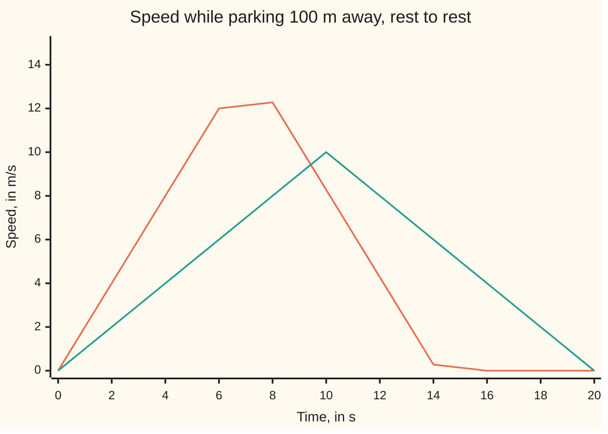
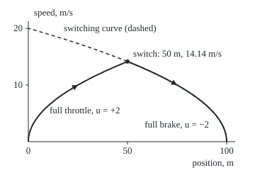

# Pontryagin's principle: the best control maximises a Hamiltonian at every instant, and often that means full throttle or full brake

[Syllabus](../../../SYLLABUS.md) → [Differential equations and dynamics](../README.md) → [Calculus of Variations and Optimal Control](../README.md#s12) → Pontryagin's principle

---

## General Overview

A car sits at rest with a parking bay 100 m ahead. Engine and brakes can change its speed by at most 2 m/s each second: acceleration is capped at 2 m/s^2 either way. Which pedal plan stops it in the bay soonest?

Floor the accelerator for 7.07 s, then stand on the brake for 7.07 s. The car passes halfway at 14.14 m/s and stops in the bay at 14.14 s. Every gentler plan takes longer.

The thing chosen is a **control**: a setting that can change at any moment, the pedal. Lev Pontryagin and colleagues found its rule (1956 to 1961). Give each quantity the rate law tracks, here position and speed, a price: the **costate**. Combine prices, rate law and cost into one quantity, the **control Hamiltonian**. The best control makes it as large as allowed at every instant. When the control enters the rate law in a straight line, that largest value sits at a limit: full throttle or full brake, a **bang-bang** control.

**The best control maximises the control Hamiltonian, priced progress minus running cost, at every instant; a control entering linearly jumps between its limits when its price changes sign.**

**What kind of fact this is:** a theorem, a necessary condition, derived in Why it works, the free-end case proved in the fold; the car's answer is then proved best directly.

### The picture: two ways to cover 100 m



Orange: full throttle, then full brake from 7.07 s. Teal: half throttle, then half brake. Each encloses 100 m; the taller tent is narrower. The 2 s samples miss the 14.14 m/s peak.

---

## The formula

Notation first. The **state** $x$ lists what the rate law tracks: for the car, $x_1$ is position and $x_2$ speed. The **costate** $p$ has one entry per state entry. The dot in $p \cdot f$ multiplies entries in pairs and adds.

The problem: steer $x' = f(x, u)$ from a start to a target, keeping the control $u$ in its allowed set $U$, and make the total cost smallest, where $L$ is the cost paid per second:

$$J = \int_0^T L(x, u)\,dt .$$

The control Hamiltonian is

$$H(x, p, u) = p \cdot f(x, u) - L(x, u).$$

**Pontryagin's maximum principle.** If the control u* and its path x* are best, there are prices p(t) such that

$$x' = \frac{\partial H}{\partial p}, \qquad p' = -\frac{\partial H}{\partial x}, \qquad H(x^*, p, u^*) = \max_{u \in U} H(x^*, p, u),$$

and, when the arrival time $T$ is free, $H = 0$ at every instant along the path. (In rare "abnormal" problems, L enters H with weight 0 instead of 1.)

**Read it aloud:** the state moves by its rate law, the prices by the mirror rule, and each instant's control gives the largest priced progress minus running cost.

For the car, $f = (x_2, u)$, $L = 1$ (the cost is elapsed time) and $a = 2$ m/s^2:

$$H = p_1 x_2 + p_2 u - 1, \qquad \sigma = p_2, \qquad u^* = \pm a \text{ as } \sigma \gtrless 0 .$$

The **switching function** $\sigma$, the coefficient of u in H, picks the pedal by its sign.

| Symbol | Plain meaning | In our example | Push it up and the answer… |
| --- | --- | --- | --- |
| $t$, $T$, $t_s$ | time; arrival; switch, in s | 14.14 s; 7.07 s | — |
| $x$, $x_1$, $x_2$ | state: position (m), speed (m/s) | (0, 0) to (100, 0) | — |
| $u$, $U$, $a$ | control (acceleration); allowed set; cap, m/s^2 | ±2; [−2, 2]; 2 | T falls as 1/√a |
| $D$ | distance to the bay | 100 m | T grows as √D |
| $f$, $L$, $J$ | rate law; running cost; total cost | ($x_2$, u); 1; T | — |
| $p$, $p_1$, $p_2$ | costate: seconds saved per unit of state | 0.0707 s/m; 0.5 to −0.5 s^2/m | — |
| $H$ | control Hamiltonian | zero all along | — |
| $\sigma$ | switching function | 0.5 − 0.0707t | — |

### When it holds

- **The rate law is smooth in the state.** The mirror rule differentiates f and L; a kink such as dry friction needs a generalised version.
- **A best control exists.** Drop the cap and none does: a = 200 m/s^2 parks in 1.41 s, and larger caps are faster still.
- **Necessary, not sufficient.** The conditions name candidates; one must still be shown best, by a direct bound (Step 5), convexity, or the value function of [The HJB equation](08-the-hjb-equation-and-the-linear-quadratic-regulator.md).
- **The switching function has isolated zeros.** If $\sigma$ stays zero for a stretch, a **singular arc**, every setting ties and extra conditions decide.

---

## Why it works

### Step 0: price the state

A small head start, a metre closer or an extra m/s, saves some seconds. Those exchange rates are the costate. H is priced progress, $p \cdot f$, minus the cost being paid, L.

### Step 1: the prices run by the mirror rule

A head start δx, a small change of state, travels forward by the linearised law, δx' = (∂f/∂x) δx: extra speed becomes extra metres. Its worth cannot depend on when it is counted, so p · δx stays constant. Differentiating, with L's own dependence on x, gives p' = −∂H/∂x, the mirror rule of [Hamilton's equations](05-hamiltons-equations.md). For the car, ∂H/∂x_1 = 0 and ∂H/∂x_2 = p_1, so

$$p_1' = 0, \qquad p_2' = -p_1 .$$

A metre is worth the same throughout; extra speed is worth less near the finish.

### Step 2: a needle of different control

Use another setting w for a tiny time ε at time t. The state is pushed by ε(f(x, w) − f(x, u)), worth p times that push, at extra cost ε(L(x, w) − L(x, u)). Net gain: ε(H(x, p, w) − H(x, p, u)). A best plan admits no gain, so no setting beats u* in H.

<details>
<summary>Detailed proof: the needle argument with a free end</summary>

Fix T, leave the endpoint free, and take cost g(x(T)) + ∫ L dt. Let p solve p' = −∂H/∂x backwards from p(T) = −∇g(x(T)). Let u* be optimal, continuous at t, and set u = w on (t − ε, t], u = u* elsewhere. Then x(t) − x*(t) = ε(f(x*, w) − f(x*, u*)) + o(ε), with o(ε)/ε → 0. After t the gap δ obeys the linearised law, and by the product rule (p · δ)' = −(∂L/∂x) · δ up to o(ε). Integrating to T, the cost changes by −ε(H(x*, p, w) − H(x*, p, u*)) + o(ε), which optimality makes at least 0. So H(x*, p, w) ≤ H(x*, p, u*). For a fixed target, the needles' pushes form a cone that a plane separates from the improving directions; that plane supplies p (Liberzon, chapter 4). Stretching T is one more needle, giving H = 0.

</details>

### Step 3: a free arrival time sets H to zero

Arriving δT later costs δT seconds and gains priced progress p · f δT; at the best arrival these balance, so H = 0. H has no explicit t, so it stays zero throughout.

### Step 4: solve the car

H = p_1 x_2 + p_2 u − 1 is a straight line in u, largest at u = +2 when p_2 > 0 and at −2 when p_2 < 0. By Step 1, $p_2 = p_2(0) - p_1 t$ is a straight line in t, so it changes sign at most once: +2, one switch, −2.

By symmetry the switch falls at half the distance: ½ × 2 × $t_s^2$ = 50, so $t_s$ = 7.07 s and T = 14.14 s. At t = 0 the speed is 0 and H = 0, so p_2(0) = 0.5. At the switch p_2 = 0, so p_1 = 0.5 / 7.07 = 0.0707 s/m. In general the state is known at both ends and the prices at neither, a **two-point boundary-value problem**; here symmetry and H = 0 solve it by hand.

They are real exchange rates: the best time from d metres out at speed v0 is (2√(a d + v0^2/2) − v0) / a, which moves 0.0707 s per metre of d and −0.5 s per m/s of v0.

### The picture: the plan in the position–speed plane

<p align="center"></p>

To scale: 2.8 px per metre across, 8 px per m/s up. Full throttle traces speed^2 = 4 × position. The dashed switching curve, speed^2 = 4 × (100 − position), holds every state from which full brake stops at the bay.

### Step 5: nothing is faster, proved directly

The principle describes a best plan only if one exists. A direct bound settles it. From rest, the speed at time t is at most 2t; to stop by T it is also at most 2(T − t). So speed lies under a tent of base T and height T, area T^2/2. Distance is the area under the speed, so 100 ≤ T^2/2 and T ≥ √200 = 14.14 s. The bang-bang plan rides the tent's roof, so it is best, and the only plan reaching the bound.

A grid search over five pedal settings per step finds 14.20, 14.16 and 14.15 s on steps of 0.1, 0.04 and 0.01 s, never below 14.14 s; search by stages is [Dynamic programming](07-dynamic-programming-and-the-bellman-equation.md).

---

## Worked numbers, by hand

| Step | Arithmetic | Value |
| --- | --- | --- |
| switch at half the distance | ½ × 2 × $t_s^2$ = 50 | $t_s$ = 7.07 s |
| speed at the switch | 2 × 7.07 | 14.14 m/s |
| arrival | 2 × 7.07 | **T = 14.14 s** |
| H = 0 at the start | $p_2(0)$ × 2 − 1 = 0 | $p_2(0)$ = 0.5 s^2/m |
| $p_2$ = 0 at the switch | 0.5 / 7.07 | $p_1$ = 0.0707 s/m |
| switching function at 3 s, 10 s | 0.5 − 0.0707t | +0.2879; −0.2071 |

Floor it to the 50 m mark, then brake hard: parked at 14.14 s.

### What breaks if you drop a piece

| Mistake | Comes out at | What went wrong |
| --- | --- | --- |
| Half throttle, half brake | 20.00 s | lower, wider tent |
| Top speed capped at 10 m/s | 15.00 s | 5 s cruising where the peak should be |
| Switch late, at 8 s | stops at 128.00 m | at 64 m and 16 m/s, past the switching curve |
| Cap removed (a = 200 shown) | 1.41 s | T = 2√(D/a) has no floor: no fastest plan |

---

## Code, from first principles, and it actually runs

Three roads: the maximum principle; a grid search over five pedal settings per step, blind to Pontryagin; and the costate as a price, by finite differences (small nudges) of the best-time formula. Euler's rule, new state = old state + step × rate ([Euler's method](../05-Numerical%20Evolution/01-eulers-method.md)), drives the car by the sign of σ alone. Its error at the switch halves with the step; braking then cancels it exactly.

### Python

```python
# Pontryagin's principle -- the check behind the card.  Standard library only.
# A car parks 100 m away, rest to rest, with |u| <= 2 m/s^2.  Road one: the
# maximum principle, H = p1 v + p2 u - 1, switching where p2 = 0.  Road two: a
# grid search offering five throttle settings.  Road three: the costate as a price.
import math
D, A, e, DTS = 100.0, 2.0, 1e-4, (0.1, 0.04, 0.01)
ts = math.sqrt(D / A); T = 2 * ts                  # switch time, arrival time
p2_0 = 1 / A                                        # H = 0 at t = 0, where v = 0
p1 = p2_0 / ts                                      # p2 = p2_0 - p1 t is 0 at ts
def sigma(t): return p2_0 - p1 * t                  # the switching function, p2
def speed(t): return A * t if t <= ts else max(0.0, A * (T - t))
def ham(t, u): return p1 * speed(t) + sigma(t) * u - 1
def best_time(d, v0, a=A):                          # to rest at distance d, from v0
    vp = math.sqrt(a * d + v0 * v0 / 2)             # peak speed
    return (2 * vp - v0) / a, (vp - v0) / a         # arrival time, switch time
def grid(dt):                                       # farthest point at each speed k dt
    best, n = {0: 0.0}, 0
    while best.get(0, -1.0) < D - 1e-9:
        new = {}
        for k, x in best.items():
            for u in (-2, -1, 0, 1, 2):
                y = x + k * dt * dt + u * dt * dt / 2
                if y > new.get(k + u, -1e18): new[k + u] = y
        best, n = new, n + 1
    return n * dt
def euler(n):                                       # n steps, u = 2 sign(sigma)
    x = v = 0.0; h = T / n
    for i in range(n):
        if i == n // 2: xs = x                      # position at the switch
        u = A if sigma((i + 0.5) * h) > 0 else -A
        x, v = x + h * v, v + h * u
    return D / 2 - xs, x
fd1 = (best_time(D + e, 0)[0] - best_time(D - e, 0)[0]) / (2 * e)
fd2 = -(best_time(D, e)[0] - best_time(D, -e)[0]) / (2 * e)
gs, eul = [grid(dt) for dt in DTS], [euler(n) for n in (1000, 2000, 4000)]
print(f"switch ts = sqrt(D/a) = {ts:.4f} s; arrival T = {T:.4f} s; peak speed {A * ts:.4f} m/s")
print(f"costate p1 = {p1:.6f} s/m; p2(0) = {p2_0:.4f} s^2/m; p2(T) = {sigma(T):.4f}")
for t in (0.0, 3.0, ts, 10.0):
    hs = [ham(t, u) for u in (-2, -1, 0, 1, 2)]
    print(f"t = {t:7.4f}: sigma {sigma(t):+.4f}; H at u = -2..2: " + " ".join(f"{round(h, 3) + 0.0:+.3f}" for h in hs))
print("speed chart, t = 0, 2, ..., 20 s")
print("  full throttle then brake:", ", ".join(f"{speed(t):.2f}" for t in range(0, 21, 2)))
print("  half throttle then brake:", ", ".join(f"{min(t, 20 - t) * 1.0:.2f}" for t in range(0, 21, 2)))
print("grid search, dt = 0.1, 0.04, 0.01 s: " + ", ".join(f"{g:.3f} s" for g in gs))
print(f"price of a metre: dT/dD = {fd1:.6f}; of a m/s head start: -dT/dv0 = {fd2:.4f}")
print("Euler, 1000, 2000, 4000 steps: short of 50 m at the switch by "
      + ", ".join(f"{r[0]:.5f}" for r in eul) + "; ends at " + ", ".join(f"{r[1]:.5f}" for r in eul))
print("rolling start 10 m/s: T = {:.4f} s, switch at {:.4f} s".format(*best_time(D, 10.0)))
print(f"mistake, half throttle: {best_time(D, 0, 1.0)[0]:.2f} s; top speed capped at 10: "
      f"{10 / A * 2 + (D - 10 * 10 / A) / 10:.2f} s")
print(f"mistake, switch late at 8 s: stops at {A * 8 ** 2 / 2 + (A * 8) ** 2 / (2 * A):.2f} m; "
      f"bound 200 m/s^2: {best_time(D, 0, 200.0)[0]:.2f} s")
Y = lambda v: 200 - 8 * v                           # figure: 2.8 px per m, 8 px per m/s
print(f"figure, switch ({40 + 2.8 * D / 2:.2f}, {Y(A * ts):.2f}); arc controls y {Y(A * ts / 2):.2f}; "
      f"switching curve top {Y(math.sqrt(2 * A * D)):.2f}, control y {Y(math.sqrt(2 * A * D) / 2):.2f}")
assert all(T <= g < T + dt for g, dt in zip(gs, DTS))    # no plan on the grid beats T
assert abs(fd1 - p1) < 1e-6 and abs(fd2 - p2_0) < 1e-6         # costate = price of state
assert all(abs(ham(t, A if sigma(t) > 0 else -A)) < 1e-12 for t in (1.0, 9.0, 13.0))
assert all(1.9 < a[0] / b[0] < 2.1 for a, b in zip(eul, eul[1:]))  # Euler, order one
print("ALL CHECKS PASS")
```

**Ran 2026-09-28 on macOS, Python 3.14.6, standard library only. All checks passed. Output, pasted from the run:**

```
switch ts = sqrt(D/a) = 7.0711 s; arrival T = 14.1421 s; peak speed 14.1421 m/s
costate p1 = 0.070711 s/m; p2(0) = 0.5000 s^2/m; p2(T) = -0.5000
t =  0.0000: sigma +0.5000; H at u = -2..2: -2.000 -1.500 -1.000 -0.500 +0.000
t =  3.0000: sigma +0.2879; H at u = -2..2: -1.151 -0.864 -0.576 -0.288 +0.000
t =  7.0711: sigma +0.0000; H at u = -2..2: +0.000 +0.000 +0.000 +0.000 +0.000
t = 10.0000: sigma -0.2071; H at u = -2..2: +0.000 -0.207 -0.414 -0.621 -0.828
speed chart, t = 0, 2, ..., 20 s
  full throttle then brake: 0.00, 4.00, 8.00, 12.00, 12.28, 8.28, 4.28, 0.28, 0.00, 0.00, 0.00
  half throttle then brake: 0.00, 2.00, 4.00, 6.00, 8.00, 10.00, 8.00, 6.00, 4.00, 2.00, 0.00
grid search, dt = 0.1, 0.04, 0.01 s: 14.200 s, 14.160 s, 14.150 s
price of a metre: dT/dD = 0.070711; of a m/s head start: -dT/dv0 = 0.5000
Euler, 1000, 2000, 4000 steps: short of 50 m at the switch by 0.10000, 0.05000, 0.02500; ends at 100.00000, 100.00000, 100.00000
rolling start 10 m/s: T = 10.8114 s, switch at 2.9057 s
mistake, half throttle: 20.00 s; top speed capped at 10: 15.00 s
mistake, switch late at 8 s: stops at 128.00 m; bound 200 m/s^2: 1.41 s
figure, switch (180.00, 86.86); arc controls y 143.43; switching curve top 40.00, control y 120.00
ALL CHECKS PASS
```

### Rust

```rust
// Pontryagin's principle -- the same check as the Python, in Rust.  No crates.
// A car parks 100 m away, rest to rest, with |u| <= 2 m/s^2.  Road one: the
// maximum principle, H = p1 v + p2 u - 1, switching where p2 = 0.  Road two: a
// grid search offering five throttle settings.  Road three: the costate as a price.
use std::collections::HashMap;
const D: f64 = 100.0; const A: f64 = 2.0;
const DTS: [f64; 3] = [0.1, 0.04, 0.01];

struct Plan { ts: f64, t: f64, p1: f64, p2_0: f64 }
impl Plan {
    fn sigma(&self, t: f64) -> f64 { self.p2_0 - self.p1 * t } // the switching function, p2
    fn speed(&self, t: f64) -> f64 { if t <= self.ts { A * t } else { (A * (self.t - t)).max(0.0) } }
    fn ham(&self, t: f64, u: f64) -> f64 { self.p1 * self.speed(t) + self.sigma(t) * u - 1.0 }
}
fn best_time(d: f64, v0: f64, a: f64) -> (f64, f64) { // to rest at distance d, from v0
    let vp = (a * d + v0 * v0 / 2.0).sqrt();              // peak speed
    ((2.0 * vp - v0) / a, (vp - v0) / a)                  // arrival time, switch time
}
fn grid(dt: f64) -> f64 {                                 // farthest point at each speed k dt
    let (mut best, mut n) = (HashMap::from([(0i64, 0.0f64)]), 0);
    while *best.get(&0).unwrap_or(&-1.0) < D - 1e-9 {
        let mut new: HashMap<i64, f64> = HashMap::new();
        for (&k, &x) in best.iter() {
            for u in -2i64..=2 {
                let y = x + k as f64 * dt * dt + u as f64 * dt * dt / 2.0;
                let slot = new.entry(k + u).or_insert(-1e18);
                if y > *slot { *slot = y }
            }
        }
        best = new;
        n += 1;
    }
    n as f64 * dt
}
fn euler(p: &Plan, n: usize) -> (f64, f64) {              // n steps, u = 2 sign(sigma)
    let (mut x, mut v, mut xs, h) = (0.0, 0.0, 0.0, p.t / n as f64);
    for i in 0..n {
        if i == n / 2 { xs = x }                          // position at the switch
        let u = if p.sigma((i as f64 + 0.5) * h) > 0.0 { A } else { -A };
        (x, v) = (x + h * v, v + h * u);
    }
    (D / 2.0 - xs, x)
}
fn join(v: &[f64], dp: usize) -> String { v.iter().map(|x| format!("{:.*}", dp, x)).collect::<Vec<_>>().join(", ") }

fn main() {
    let ts = (D / A).sqrt();
    let p2_0 = 1.0 / A;                                   // H = 0 at t = 0, where v = 0
    let p = Plan { ts, t: 2.0 * ts, p1: p2_0 / ts, p2_0 };
    let e = 1e-4;
    let fd1 = (best_time(D + e, 0.0, A).0 - best_time(D - e, 0.0, A).0) / (2.0 * e);
    let fd2 = -(best_time(D, e, A).0 - best_time(D, -e, A).0) / (2.0 * e);
    let gs: Vec<f64> = DTS.iter().map(|&dt| grid(dt)).collect();
    let eul: Vec<(f64, f64)> = [1000, 2000, 4000].iter().map(|&n| euler(&p, n)).collect();
    println!("switch ts = sqrt(D/a) = {:.4} s; arrival T = {:.4} s; peak speed {:.4} m/s", ts, p.t, A * ts);
    println!("costate p1 = {:.6} s/m; p2(0) = {:.4} s^2/m; p2(T) = {:.4}", p.p1, p2_0, p.sigma(p.t));
    for t in [0.0, 3.0, ts, 10.0] {
        let hs: Vec<String> = [-2.0, -1.0, 0.0, 1.0, 2.0].iter().map(|&u| format!("{:+.3}", (p.ham(t, u) * 1000.0).round() / 1000.0 + 0.0)).collect();
        println!("t = {:7.4}: sigma {:+.4}; H at u = -2..2: {}", t, p.sigma(t), hs.join(" "));
    }
    println!("speed chart, t = 0, 2, ..., 20 s");
    println!("  full throttle then brake: {}", join(&(0..11).map(|i| p.speed(2.0 * i as f64)).collect::<Vec<_>>(), 2));
    println!("  half throttle then brake: {}", join(&(0..11).map(|i| (2.0 * i as f64).min(20.0 - 2.0 * i as f64)).collect::<Vec<_>>(), 2));
    println!("grid search, dt = 0.1, 0.04, 0.01 s: {}", gs.iter().map(|g| format!("{:.3} s", g)).collect::<Vec<_>>().join(", "));
    println!("price of a metre: dT/dD = {:.6}; of a m/s head start: -dT/dv0 = {:.4}", fd1, fd2);
    println!("Euler, 1000, 2000, 4000 steps: short of 50 m at the switch by {}; ends at {}",
        join(&eul.iter().map(|r| r.0).collect::<Vec<_>>(), 5), join(&eul.iter().map(|r| r.1).collect::<Vec<_>>(), 5));
    let v10 = best_time(D, 10.0, A);
    println!("rolling start 10 m/s: T = {:.4} s, switch at {:.4} s", v10.0, v10.1);
    println!("mistake, half throttle: {:.2} s; top speed capped at 10: {:.2} s", best_time(D, 0.0, 1.0).0, 10.0 / A * 2.0 + (D - 10.0 * 10.0 / A) / 10.0);
    println!("mistake, switch late at 8 s: stops at {:.2} m; bound 200 m/s^2: {:.2} s", A * 64.0 / 2.0 + (A * 8.0) * (A * 8.0) / (2.0 * A), best_time(D, 0.0, 200.0).0);
    let y = |v: f64| 200.0 - 8.0 * v;                     // figure: 2.8 px per m, 8 px per m/s
    println!("figure, switch ({:.2}, {:.2}); arc controls y {:.2}; switching curve top {:.2}, control y {:.2}",
        40.0 + 2.8 * D / 2.0, y(A * ts), y(A * ts / 2.0), y((2.0 * A * D).sqrt()), y((2.0 * A * D).sqrt() / 2.0));
    assert!(gs.iter().zip(DTS.iter()).all(|(&g, &dt)| p.t <= g && g < p.t + dt)); // no grid plan beats T
    assert!((fd1 - p.p1).abs() < 1e-6 && (fd2 - p2_0).abs() < 1e-6);  // costate = price of state
    assert!([1.0, 9.0, 13.0].iter().all(|&t| p.ham(t, if p.sigma(t) > 0.0 { A } else { -A }).abs() < 1e-12));
    assert!(eul.windows(2).all(|w| w[0].0 / w[1].0 > 1.9 && w[0].0 / w[1].0 < 2.1)); // Euler, order one
    println!("ALL CHECKS PASS");
}
```

**Ran 2026-09-28 on macOS, rustc 1.98.1, no crates. All checks passed. Output, pasted from the run:**

```
switch ts = sqrt(D/a) = 7.0711 s; arrival T = 14.1421 s; peak speed 14.1421 m/s
costate p1 = 0.070711 s/m; p2(0) = 0.5000 s^2/m; p2(T) = -0.5000
t =  0.0000: sigma +0.5000; H at u = -2..2: -2.000 -1.500 -1.000 -0.500 +0.000
t =  3.0000: sigma +0.2879; H at u = -2..2: -1.151 -0.864 -0.576 -0.288 +0.000
t =  7.0711: sigma +0.0000; H at u = -2..2: +0.000 +0.000 +0.000 +0.000 +0.000
t = 10.0000: sigma -0.2071; H at u = -2..2: +0.000 -0.207 -0.414 -0.621 -0.828
speed chart, t = 0, 2, ..., 20 s
  full throttle then brake: 0.00, 4.00, 8.00, 12.00, 12.28, 8.28, 4.28, 0.28, 0.00, 0.00, 0.00
  half throttle then brake: 0.00, 2.00, 4.00, 6.00, 8.00, 10.00, 8.00, 6.00, 4.00, 2.00, 0.00
grid search, dt = 0.1, 0.04, 0.01 s: 14.200 s, 14.160 s, 14.150 s
price of a metre: dT/dD = 0.070711; of a m/s head start: -dT/dv0 = 0.5000
Euler, 1000, 2000, 4000 steps: short of 50 m at the switch by 0.10000, 0.05000, 0.02500; ends at 100.00000, 100.00000, 100.00000
rolling start 10 m/s: T = 10.8114 s, switch at 2.9057 s
mistake, half throttle: 20.00 s; top speed capped at 10: 15.00 s
mistake, switch late at 8 s: stops at 128.00 m; bound 200 m/s^2: 1.41 s
figure, switch (180.00, 86.86); arc controls y 143.43; switching curve top 40.00, control y 120.00
ALL CHECKS PASS
```

The two outputs match line for line.

> [!TIP]
> **Try changing**
> Guess first, then run it.
> - **A bay four times as far.** Set D to 400.0. T doubles to 28.2843 s; $p_1$ halves to 0.035355 s/m; $p_2(0)$ stays 0.5.
> - **Only the extremes.** Offer the grid (−2, 0, 2). It returns 14.200, 14.160 and 14.150 s, unchanged.
> - **Only gentle settings.** Offer (−1, 0, 1). The grid finds 20.000 s, the half-throttle plan, and the first assert stops the run.

---

## The usual mistake

> [!warning]
> **Taking the principle's answer as proved best.** The conditions only list candidates; a candidate can lose, or no best plan exist.
>
> - **Switching at half the time.** From a rolling start of 10 m/s the best time is 10.81 s, yet the switch comes at 2.91 s. Only rest to rest is symmetric.
> - **Minimising H.** With H = p · f − L the best control maximises; minimising picks u = −2 while $p_2$ is positive, and the car reverses.
> - **Forgetting H = 0.** The prices are then fixed only up to a common factor.

---

## Where you meet it in real life

- **Spacecraft.** On-off thrusters are bang-bang by construction; the boundary-value problem is solved by guessing the starting prices and correcting, as in [Shooting](../07-Series%20Solutions%20and%20Boundary%20Problems/06-the-shooting-method.md).
- **Disk heads and cranes.** A seek accelerates and brakes flat out.
- **Economics.** Growth models price capital with a costate.

> **Say it back**
> Each state gets a price, the seconds a head start would save; prices move by Hamilton's rule. The best control maximises priced progress minus running cost, which is zero with a free finish. A control entering linearly sits at a limit and flips when the switching function changes sign. The car floors it for 7.07 s, brakes for 7.07 s and parks at 14.14 s; a tent-shaped bound proves nothing is faster.

---

## What this builds on

- [Hamilton's equations](05-hamiltons-equations.md): the pair x' = ∂H/∂p, p' = −∂H/∂x, and why H is constant when it has no t.
- [Forced systems](../04-Systems%20and%20the%20Matrix%20Exponential/06-forced-systems-and-variation-of-constants.md): a linear system driven by an input, here the pedal.

## Where this goes next

- [The HJB equation](08-the-hjb-equation-and-the-linear-quadratic-regulator.md): the best cost from every start, whose slopes are these prices; with squared costs the best control is smooth feedback.

---

## Sources

Verified 28 Sep 2026: every link below opens the named work.

- Liberzon, Daniel. *Calculus of Variations and Optimal Control Theory: A Concise Introduction*. Princeton University Press, 2012. [Publisher page](https://press.princeton.edu/books/hardcover/9780691151878/calculus-of-variations-and-optimal-control-theory). Chapter 4 proves the maximum principle, needles and separating plane included.
- Evans, Lawrence C. *An Introduction to Mathematical Optimal Control Theory*, lecture notes, UC Berkeley. [Full text](https://math.berkeley.edu/~evans/control.course.pdf). Free; its "rocket railroad car" is this card's problem.
- Kirk, Donald E. *Optimal Control Theory: An Introduction*. Dover. [Publisher page](https://store.doverpublications.com/products/9780486434841). Switching curves and minimum-time control, the engineering route.
