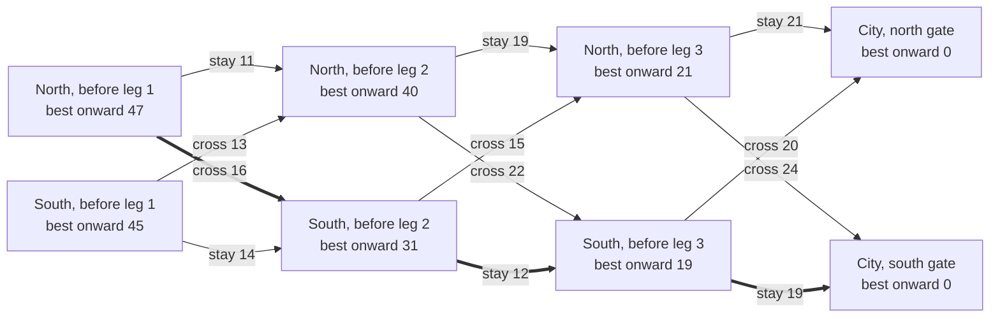

# Dynamic programming: any tail of a best plan is itself a best plan, so solve from the finish backwards

[Syllabus](../../../SYLLABUS.md) → [Differential equations and dynamics](../README.md) → [Calculus of Variations and Optimal Control](../README.md#s12) → Dynamic programming

---

## General Overview

A car drives from a town on the north bank of a river to a city three legs downstream. Each bank has a toll road, and before every leg there is a bridge. So before each leg the driver chooses: stay on this bank's road, or cross and take the other bank's. Each leg's toll depends on the bank and the choice. The cheapest trip costs 47 dollars.

Brute force prices all 8 routes, 2 × 2 × 2; for thirty legs, 1,073,741,824. The alternative starts at the finish. Before the last leg, each bank's best move is plain. One leg earlier, it is the cheaper of "this toll plus the best from where it lands". Six comparisons fill a table of best costs, and the 47 dollar plan is read off it.

The shortcut rests on one fact, which Richard Bellman called the principle of optimality in the 1950s: cut a best plan anywhere, and the part that remains is a best plan from where the car then stands.

**Any tail of a best plan is itself a best plan, so the cheapest cost from each position satisfies one equation, the Bellman equation, that can be solved from the finish backwards one stage at a time.**

**What kind of fact this is:** a theorem, proved on this card in Why it works; backward induction, the method it licenses, is checked by the code against every route.

### The picture: the river, the tolls and the best onward cost



Each box is a bank before a leg, with the cheapest cost from there to the city, filled right to left. Each arrow is a choice and its toll in dollars. The thick arrows are the 47 dollar plan: cross, stay, stay.

---

## The formula

Notation first, in words. The stage $k$ counts legs already driven, 0 to 3. The **state** $x$ is whatever about the present matters for the future: here, the bank, N or S. The **choice** $u$ is stay or cross. The toll $c_k(x, u)$ is what that choice costs on the next leg, and $f(x, u)$ is the bank it leaves the car on. The **value function** $V_k(x)$ is the cheapest cost of finishing the trip from bank $x$ with $k$ legs driven.

$$V_k(x) = \min_{u \,\in\, \{\text{stay},\ \text{cross}\}} \Big( c_k(x, u) + V_{k+1}\big(f(x, u)\big) \Big), \qquad V_3(x) = 0$$

**Read it aloud:** the cheapest cost from here is the smallest, over this leg's choices, of its toll plus the cheapest cost from where it lands; at the finish nothing is left to pay.

This is the **Bellman equation**. Solving it from $k$ = 2 down to $k$ = 0 is **backward induction**. The choice achieving each minimum, stored beside $V_k(x)$, is the plan.

| Symbol | Plain meaning | In our example | Push it up and the answer… |
| --- | --- | --- | --- |
| $k$ | stage: legs already driven | 0 at the start, 3 at the city | fewer legs left, smaller $V_k$ |
| $x$ | state: what the future depends on | the bank, N or S | — |
| $u$, $u_k$ | choice at this stage, at stage $k$ | stay or cross | — |
| $c_k(x, u)$ | toll on the next leg for that bank and choice, dollars | north, cross, first leg: 16 | a dearer leg, a higher total or a detour |
| $f(x, u)$ | the state the choice leads to | north then cross: south | — |
| $V_k(x)$, $V_0$, $V_1$, $V_3$ | value function: cheapest cost to finish from $x$ at stage $k$, dollars | $V_0$(N) = 47, $V_1$(S) = 31, $V_3$ = 0 | — |
| $n$, $s$, $m$ | stages, states per stage, choices per state | 3, 2, 2 | brute force grows as $m^n$ |
| $d$ | numbers needed to describe one state | 1, the bank | states grow as $10^d$ with 10 levels each |

### When it holds

- **Costs add up leg by leg.** A rebate for three legs on the north road ties the legs together; the state must then remember the road so far (What breaks shows it).
- **The state tells the whole story.** Later tolls may depend on the bank, never on how the car got there. Otherwise the state must grow to carry that history.
- **Each choice lands in a known state.** With chance, the tail cost becomes an average, which needs probability (wing 09).
- **Finitely many stages and choices.** Then every minimum exists. With infinitely many choices there may be no cheapest one.

---

## Why it works

### Step 0: the future depends on where the car is, not how it got there

On the south bank before leg 2, the remaining tolls are the same however the car got there. So the cheapest way to finish from here is one number, $V_1$(S), and the method is a table of such numbers.

### Step 1: the principle of optimality, by cut and paste

The best plan from the north bank is cross, stay, stay: 16 + 12 + 19 = 47 dollars. Cut it after the first leg. The tail, stay then stay from the south bank, costs 12 + 19 = 31.

Suppose another tail from the south bank cost less than 31. Paste it after the first leg's 16 dollars: the trip would cost less than 47, a contradiction. So the tail is a best plan, 31 = $V_1$(S). Nothing here used these particular tolls.

### Step 2: the Bellman equation follows

Any plan from $x$ at stage $k$ is a first choice $u$ followed by a tail from $f(x, u)$. Fix $u$: the cheapest such plan pays $c_k(x, u)$ plus the cheapest tail, $V_{k+1}(f(x, u))$. Minimising over $u$ covers every plan.

The equation is a rule that turns one column of the table into the previous one. Backward induction applies it three times from $V_3$ = 0, iterating a map as on [Iteration](../11-Discrete%20Dynamics%20and%20Chaos/01-iteration-and-cobweb-plots.md), but run from the finish.

<details>
<summary>Detailed proof</summary>

Let $J_k(x; u_k, \dots, u_{n-1})$ be the total toll paid from state $x$ at stage $k$ under the choices $u_k, \dots, u_{n-1}$, with the state updated by $f$ after each leg. Claim: for every $k$ from $n$ down to 0 and every $x$, the number $V_k(x)$ defined by the recursion equals the minimum of $J_k(x; \cdot)$ over all choice sequences.

Base, $k = n$: no legs are left, the only sequence is empty, $J_n = 0 = V_n$.

Step: assume the claim at $k + 1$. Any sequence from $(x, k)$ is $u_k$ followed by a sequence from $(f(x, u_k), k+1)$, and $J_k(x; u_k, \dots) = c_k(x, u_k) + J_{k+1}(f(x, u_k); u_{k+1}, \dots)$ because costs add. For fixed $u_k$ the minimum over the rest is $c_k(x, u_k) + V_{k+1}(f(x, u_k))$ by the assumption. The minimum over everything is the minimum over $u_k$ of that, which is the recursion's $V_k(x)$. By induction ([Induction](../../01-Foundations/06-Proof/04-proof-by-induction.md)), run downward, the claim holds at $k = 0$.

The plan: choosing at each stage a $u$ that attains the minimum gives a sequence costing exactly $V_0(x)$, so it is cheapest.

</details>

### Step 3: fill the table backwards, read the plan forwards

Each state at each stage needs one comparison. With $n$ stages, $s$ states and $m$ choices that is $n \cdot s \cdot (m - 1)$ comparisons: 3 × 2 × 1 = 6. Brute force prices $m^n$ = 8 routes and makes 7 comparisons. The table also holds the best plan from both banks: 47 from the north, 45 from the south.

For 10 legs: 20 comparisons against 1,024 routes; for 30, 60 against 1,073,741,824. On a 12-leg river, 24 comparisons and 4,096 routes both find 168 dollars.

### Step 4: the curse of dimensionality

The catch is $s$, the number of states. A bank is one of two. A delivery van tracking fuel, load and hour, each in 10 levels, has 1,000 states per stage; six such gauges give 1,000,000. Bellman called this the **curse of dimensionality**: dynamic programming tames the number of stages, not the size of the state.

On a network without stages the same principle is the Bellman-Ford algorithm ([Bellman-Ford](../../04-Combinatorics%20and%20graphs/10-Trees%20and%20Cheapest%20Routes/06-bellman-ford-and-arbitrage.md)). Pontryagin's route ([Pontryagin's principle](06-pontryagins-principle-and-bang-bang-control.md)) reaches continuous-time plans without a table, by conditions along one path.

---

## Worked numbers, by hand

Tolls in dollars are on the arrows of the picture above.

| Step | Arithmetic | Value |
| --- | --- | --- |
| at the city | nothing left to pay | $V_3$(N) = $V_3$(S) = 0 |
| before leg 3, north | min(21 + 0, 24 + 0) | 21, stay |
| before leg 3, south | min(19 + 0, 20 + 0) | 19, stay |
| before leg 2, north | min(19 + 21, 22 + 19) = min(40, 41) | 40, stay |
| before leg 2, south | min(12 + 19, 15 + 21) = min(31, 36) | 31, stay |
| before leg 1, north | min(11 + 40, 16 + 31) = min(51, 47) | **47**, cross |
| before leg 1, south | min(14 + 31, 13 + 40) = min(45, 53) | 45, stay |
| read the plan from north | cross 16, then south stay 12, then south stay 19 | 16 + 12 + 19 = **47** |

The cheapest trip costs 47 dollars: take the first bridge, then stay south to the city.

### What breaks if you drop a piece

| Mistake | Comes out at | What went wrong |
| --- | --- | --- |
| Take the cheaper toll on each leg, no look ahead | 51: stay, stay, stay | The cheap 11 dollar first leg leaves the car on the dear bank |
| Take each leg's cheapest toll, ignoring the bank | 11 + 12 + 19 = 42 | No route pays those three; the state was dropped |
| Drop "costs add up": a 15 dollar rebate for staying north all three legs | table still 47; true cheapest 51 − 15 = 36 | The bank alone no longer fixes the future cost; the state must also record "north so far" |

The code prints all three; 42 is not among the 8 route costs.

---

## Code, from first principles, and it actually runs

Nothing is imported. Road one solves the Bellman equation backwards, counting comparisons. Road two prices every route and keeps the cheapest, with no table. A second case, 12 legs of generated tolls, repeats the contest at 4,096 routes.

### Python

```python
# Dynamic programming and the Bellman equation -- the check behind the card.  Nothing is
# imported.  A three-leg trip along a river: before each leg the car is on the north bank (0)
# or the south bank (1), and it stays on that bank's toll road (0) or takes the bridge first (1).
TOLL = [[(11, 16), (14, 13)],            # leg 1, dollars: [north (stay, cross), south (stay, cross)]
        [(19, 22), (12, 15)],            # leg 2
        [(21, 24), (19, 20)]]            # leg 3
MOVE = ("stay", "cross")

def backward(toll):                      # road one: the Bellman equation, finish to start
    n, comps = len(toll), 0
    value, plan, cand = [[0, 0] for _ in range(n + 1)], [[0, 0] for _ in toll], [[0, 0] for _ in toll]
    for k in range(n - 1, -1, -1):
        for x in (0, 1):
            a = cand[k][x] = [toll[k][x][c] + value[k + 1][x ^ c] for c in (0, 1)]
            plan[k][x], comps = (0 if a[0] <= a[1] else 1), comps + 1     # one comparison
            value[k][x] = a[plan[k][x]]
    return value, plan, comps, cand
def brute(toll, start):                  # road two: price every whole route, keep the cheapest
    costs = []
    for code in range(2 ** len(toll)):
        side, cost = start, 0
        for k in range(len(toll)):
            c = code >> (len(toll) - 1 - k) & 1
            cost, side = cost + toll[k][side][c], side ^ c
        costs.append(cost)
    return min(costs), costs
value, plan, comps, cand = backward(TOLL)
for k, leg in enumerate(TOLL):
    print(f"leg {k + 1} tolls: north stay {leg[0][0]}, cross {leg[0][1]}; south stay {leg[1][0]}, cross {leg[1][1]}")
print("V_3(N) = 0, V_3(S) = 0: nothing left to pay")
for k in range(2, -1, -1):
    (a, b), (c, d) = cand[k]
    print(f"V_{k}(N) = min({a}, {b}) = {value[k][0]}, V_{k}(S) = min({c}, {d}) = {value[k][1]}; choose {MOVE[plan[k][0]]} / {MOVE[plan[k][1]]}")
side, greedy_side, paid, moves, greedy = 0, 0, [], [], 0
for k, leg in enumerate(TOLL):           # follow the plan; alongside, mistake 1: cheapest toll now
    c, g = plan[k][side], 0 if leg[greedy_side][0] <= leg[greedy_side][1] else 1
    moves.append(MOVE[c]); paid.append(leg[side][c]); side ^= c
    greedy += leg[greedy_side][g]; greedy_side ^= g
blind = [min(min(t) for t in leg) for leg in TOLL]      # mistake 2: forget which bank the car is on
(best_n, costs_n), (best_s, _) = brute(TOLL, 0), brute(TOLL, 1)
print(f"backward induction: {comps} comparisons; cheapest from N {value[0][0]}, from S {value[0][1]}")
print(f"plan from N: {', '.join(moves)}; tolls {' + '.join(map(str, paid))} = {sum(paid)}")
print(f"brute force from N: {len(costs_n)} routes {costs_n}, {len(costs_n) - 1} comparisons, cheapest {best_n}; from S {best_s}")
print(f"mistake 1, cheapest toll each leg with no look ahead: {greedy}")
print(f"mistake 2, cheapest toll per leg ignoring the bank: {' + '.join(map(str, blind))} = {sum(blind)}, no such route")
print(f"drop 'costs add up', 15 dollar rebate for north stay, stay, stay: true cheapest {min(costs_n[0] - 15, best_n)}, table on the bank still {value[0][0]}")
seed = [2026]
def rnd():                               # second case: a home-made generator, tolls 5 to 29 dollars
    seed[0] = (seed[0] * 1103515245 + 12345) % 2 ** 31
    return 5 + seed[0] % 25
big = [[(rnd(), rnd()), (rnd(), rnd())] for _ in range(12)]
(bv, _, bc, _), (bb, bcosts) = backward(big), brute(big, 0)
print(f"{len(big)} legs: backward {bc} comparisons, cheapest {bv[0][0]}; brute force {len(bcosts)} routes, cheapest {bb}")
print("routes 2^n against comparisons 2n: " + "; ".join(f"n = {n}: {2 ** n} vs {2 * n}" for n in (3, 10, 30)))
print("states with d gauges of 10 levels: " + "; ".join(f"d = {d}: {10 ** d}" for d in (1, 3, 6)))
assert value[0][0] == best_n             # Bellman against every route, from the north bank
assert value[0][1] == best_s             # and from the south bank
assert sum(paid) == value[0][0]          # the plan's own tolls add up to the value
assert bv[0][0] == bb                    # 12 legs: 24 comparisons agree with 4096 routes
print("ALL CHECKS PASS")
```

**Ran 2026-09-28 on macOS, Python 3.14.6, standard library only. All checks passed. Output, pasted from the run:**

```
leg 1 tolls: north stay 11, cross 16; south stay 14, cross 13
leg 2 tolls: north stay 19, cross 22; south stay 12, cross 15
leg 3 tolls: north stay 21, cross 24; south stay 19, cross 20
V_3(N) = 0, V_3(S) = 0: nothing left to pay
V_2(N) = min(21, 24) = 21, V_2(S) = min(19, 20) = 19; choose stay / stay
V_1(N) = min(40, 41) = 40, V_1(S) = min(31, 36) = 31; choose stay / stay
V_0(N) = min(51, 47) = 47, V_0(S) = min(45, 53) = 45; choose cross / stay
backward induction: 6 comparisons; cheapest from N 47, from S 45
plan from N: cross, stay, stay; tolls 16 + 12 + 19 = 47
brute force from N: 8 routes [51, 54, 52, 53, 47, 48, 52, 55], 7 comparisons, cheapest 47; from S 45
mistake 1, cheapest toll each leg with no look ahead: 51
mistake 2, cheapest toll per leg ignoring the bank: 11 + 12 + 19 = 42, no such route
drop 'costs add up', 15 dollar rebate for north stay, stay, stay: true cheapest 36, table on the bank still 47
12 legs: backward 24 comparisons, cheapest 168; brute force 4096 routes, cheapest 168
routes 2^n against comparisons 2n: n = 3: 8 vs 6; n = 10: 1024 vs 20; n = 30: 1073741824 vs 60
states with d gauges of 10 levels: d = 1: 10; d = 3: 1000; d = 6: 1000000
ALL CHECKS PASS
```

### Rust

Same numbers, same labels, built with `rustc --edition 2021 -O`.

```rust
// Dynamic programming and the Bellman equation -- the same check as the Python, in Rust.  No
// crates.  A three-leg trip along a river: before each leg the car is on the north bank (0)
// or the south bank (1), and it stays on that bank's toll road (0) or takes the bridge first (1).
type Legs = Vec<[[u64; 2]; 2]>;          // toll[k][bank][choice], dollars
const MOVE: [&str; 2] = ["stay", "cross"];

type Table = (Vec<[u64; 2]>, Vec<[usize; 2]>, usize, Vec<[[u64; 2]; 2]>);  // values, plan, comparisons, candidates
fn backward(toll: &Legs) -> Table {       // road one: the Bellman equation, finish to start
    let n = toll.len();
    let (mut value, mut plan, mut comps, mut cand): Table =
        (vec![Default::default(); n + 1], vec![Default::default(); n], 0, vec![Default::default(); n]);
    for k in (0..n).rev() {
        for x in 0..2 {
            let a = [toll[k][x][0] + value[k + 1][x], toll[k][x][1] + value[k + 1][x ^ 1]];
            cand[k][x] = a;
            plan[k][x] = if a[0] <= a[1] { 0 } else { 1 };
            comps += 1;                          // one comparison
            value[k][x] = a[plan[k][x]];
        }
    }
    (value, plan, comps, cand)
}

fn brute(toll: &Legs, start: usize) -> (u64, Vec<u64>) {    // road two: price every whole route
    let n = toll.len();
    let mut costs = Vec::new();
    for code in 0..(1usize << n) {
        let (mut side, mut cost) = (start, 0);
        for k in 0..n {
            let c = code >> (n - 1 - k) & 1;
            (cost, side) = (cost + toll[k][side][c], side ^ c);
        }
        costs.push(cost);
    }
    (*costs.iter().min().unwrap(), costs)
}
fn join(v: &[u64]) -> String { v.iter().map(|x| x.to_string()).collect::<Vec<_>>().join(" + ") }

fn main() {
    let toll: Legs = Vec::from([[[11, 16], [14, 13]], [[19, 22], [12, 15]], [[21, 24], [19, 20]]]);
    let (value, plan, comps, cand) = backward(&toll);
    for (k, leg) in toll.iter().enumerate() {
        println!("leg {} tolls: north stay {}, cross {}; south stay {}, cross {}", k + 1, leg[0][0], leg[0][1], leg[1][0], leg[1][1]);
    }
    println!("V_3(N) = 0, V_3(S) = 0: nothing left to pay");
    for k in (0..3).rev() {
        let ([a, b], [c, d]) = (cand[k][0], cand[k][1]);
        println!("V_{}(N) = min({}, {}) = {}, V_{}(S) = min({}, {}) = {}; choose {} / {}",
                 k, a, b, value[k][0], k, c, d, value[k][1], MOVE[plan[k][0]], MOVE[plan[k][1]]);
    }
    let (mut side, mut gside, mut paid, mut moves, mut greedy) = (0usize, 0usize, Vec::new(), Vec::new(), 0);
    for (k, leg) in toll.iter().enumerate() {        // follow the plan; alongside, mistake 1
        let (c, g) = (plan[k][side], if leg[gside][0] <= leg[gside][1] { 0 } else { 1 });
        moves.push(MOVE[c]); paid.push(leg[side][c]); side ^= c;
        greedy += leg[gside][g]; gside ^= g;
    }
    let blind: Vec<u64> = toll.iter().map(|l| *l.iter().flatten().min().unwrap()).collect();  // mistake 2
    let ((best_n, costs_n), (best_s, _)) = (brute(&toll, 0), brute(&toll, 1));
    let walked: u64 = paid.iter().sum();
    println!("backward induction: {} comparisons; cheapest from N {}, from S {}", comps, value[0][0], value[0][1]);
    println!("plan from N: {}; tolls {} = {}", moves.join(", "), join(&paid), walked);
    println!("brute force from N: {} routes {:?}, {} comparisons, cheapest {}; from S {}", costs_n.len(), costs_n, costs_n.len() - 1, best_n, best_s);
    println!("mistake 1, cheapest toll each leg with no look ahead: {}", greedy);
    println!("mistake 2, cheapest toll per leg ignoring the bank: {} = {}, no such route", join(&blind), blind.iter().sum::<u64>());
    println!("drop 'costs add up', 15 dollar rebate for north stay, stay, stay: true cheapest {}, table on the bank still {}", best_n.min(costs_n[0] - 15), value[0][0]);
    let mut seed: u64 = 2026;                          // second case: home-made generator, tolls 5 to 29
    let mut rnd = || { seed = (seed * 1103515245 + 12345) % (1 << 31); 5 + seed % 25 };
    let big: Legs = (0..12).map(|_| { let (a, b, c, d) = (rnd(), rnd(), rnd(), rnd()); [[a, b], [c, d]] }).collect();
    let ((bv, _, bc, _), (bb, bcosts)) = (backward(&big), brute(&big, 0));
    println!("{} legs: backward {} comparisons, cheapest {}; brute force {} routes, cheapest {}", big.len(), bc, bv[0][0], bcosts.len(), bb);
    let r: Vec<String> = [3u32, 10, 30].iter().map(|&n| format!("n = {}: {} vs {}", n, 1u64 << n, 2 * n)).collect();
    println!("routes 2^n against comparisons 2n: {}", r.join("; "));
    let s: Vec<String> = [1u32, 3, 6].iter().map(|&d| format!("d = {}: {}", d, 10u64.pow(d))).collect();
    println!("states with d gauges of 10 levels: {}", s.join("; "));
    assert!(value[0][0] == best_n);                  // Bellman against every route, from the north bank
    assert!(value[0][1] == best_s);                  // and from the south bank
    assert!(walked == value[0][0]);                  // the plan's own tolls add up to the value
    assert!(bv[0][0] == bb);                         // 12 legs: 24 comparisons agree with 4096 routes
    println!("ALL CHECKS PASS");
}
```

**Ran 2026-09-28 on macOS, rustc 1.98.1, no crates. All checks passed. Output, pasted from the run:**

```
leg 1 tolls: north stay 11, cross 16; south stay 14, cross 13
leg 2 tolls: north stay 19, cross 22; south stay 12, cross 15
leg 3 tolls: north stay 21, cross 24; south stay 19, cross 20
V_3(N) = 0, V_3(S) = 0: nothing left to pay
V_2(N) = min(21, 24) = 21, V_2(S) = min(19, 20) = 19; choose stay / stay
V_1(N) = min(40, 41) = 40, V_1(S) = min(31, 36) = 31; choose stay / stay
V_0(N) = min(51, 47) = 47, V_0(S) = min(45, 53) = 45; choose cross / stay
backward induction: 6 comparisons; cheapest from N 47, from S 45
plan from N: cross, stay, stay; tolls 16 + 12 + 19 = 47
brute force from N: 8 routes [51, 54, 52, 53, 47, 48, 52, 55], 7 comparisons, cheapest 47; from S 45
mistake 1, cheapest toll each leg with no look ahead: 51
mistake 2, cheapest toll per leg ignoring the bank: 11 + 12 + 19 = 42, no such route
drop 'costs add up', 15 dollar rebate for north stay, stay, stay: true cheapest 36, table on the bank still 47
12 legs: backward 24 comparisons, cheapest 168; brute force 4096 routes, cheapest 168
routes 2^n against comparisons 2n: n = 3: 8 vs 6; n = 10: 1024 vs 20; n = 30: 1073741824 vs 60
states with d gauges of 10 levels: d = 1: 10; d = 3: 1000; d = 6: 1000000
ALL CHECKS PASS
```

The two outputs match line for line.

> [!TIP]
> **Try changing**
> Guess first, then run the Python.
> - **Cheapen the north road.** Set leg 2's north stay toll from 19 to 5. Does the bridge still pay? No: staying north throughout costs 37, and brute force agrees.
> - **Forget that crossing moves the car.** In `backward`, replace `value[k + 1][x ^ c]` with `value[k + 1][x]`. The table says 51, brute force says 47, and the first assert stops the run.
> - **Maximise by mistake.** Change `a[0] <= a[1]` to `a[0] >= a[1]`. The table finds the dearest route, 55, and the first assert fails.
> - **Longer river.** Change `range(12)` to `range(16)`: 32 comparisons against 65,536 routes, both at 228 dollars.

---

## The usual mistake

> [!warning]
> **Choosing the cheapest next step.** Built forward one cheap leg at a time, the plan pays 11 dollars first and 51 in all, stuck on the bank with dear later legs. The Bellman equation charges each choice for its consequences through $V_{k+1}$, so it runs from the finish.
>
> - **Dropping the state.** Adding each leg's cheapest toll gives 42, a route that does not exist: the leg-2 toll of 12 is on the south bank only.
> - **Believing the table is always small.** Six gauges of 10 levels make 1,000,000 states per stage.
> - **Forgetting the finish.** $V_3$ = 0 because the city charges nothing at either gate. A gate fee belongs in $V_3$ and changes every earlier column.

---

## Where you meet it in real life

- **Route planning.** Cheapest-route software uses the same principle on road networks: [Bellman-Ford](../../04-Combinatorics%20and%20graphs/10-Trees%20and%20Cheapest%20Routes/06-bellman-ford-and-arbitrage.md).
- **Game endings.** Chess endgame tables are built backwards from checkmate, each position valued by its best move.
- **Text and DNA comparison.** Spell checkers and gene aligners fill tables of best partial matches: Dynamic programming.
- **Control engineering.** A controller re-solving a short plan at every step and keeping its first move is Predictive control.

> **Say it back**
> A best plan cut anywhere leaves a best plan, or a cheaper tail could be pasted in. So the cheapest cost from each state is the smallest, over the next choice, of its cost plus the cheapest cost from where it lands: the Bellman equation. Solved from the finish, it fills the river's table in 6 comparisons where brute force prices 8 routes. The work grows with stages times states, and the states multiply with every quantity the state must track.

---

## What this builds on

- [Iteration](../11-Discrete%20Dynamics%20and%20Chaos/01-iteration-and-cobweb-plots.md): a rule applied stage after stage, here column to column.
- [Induction](../../01-Foundations/06-Proof/04-proof-by-induction.md): the proof of the Bellman equation is an induction, run from the last stage down.
- [Bellman-Ford](../../04-Combinatorics%20and%20graphs/10-Trees%20and%20Cheapest%20Routes/06-bellman-ford-and-arbitrage.md): the same principle of optimality on a network without stages.

## Where this goes next

- [The HJB equation](08-the-hjb-equation-and-the-linear-quadratic-regulator.md): legs shrunk to zero length turn the Bellman equation into a partial differential equation.
- Predictive control: a finite plan re-solved at every step.
- Dynamic programming: the method as algorithm design.
- Backward induction: the recursion with chance and averaged tails.

---

## Sources

Verified 2026-09-28: every link below resolves to the publisher's page.

- Bellman, Richard. "The theory of dynamic programming." *Bulletin of the American Mathematical Society* 60(6), 1954, 503–515. [doi:10.1090/S0002-9904-1954-09848-8](https://doi.org/10.1090/S0002-9904-1954-09848-8). An early statement of the method and the principle.
- Bellman, Richard. *Dynamic Programming*. Princeton University Press, 1957; Princeton Landmarks edition. [Publisher page](https://press.princeton.edu/books/paperback/9780691146683/dynamic-programming). Names the principle and the curse of dimensionality.
- Bertsekas, Dimitri P. *Dynamic Programming and Optimal Control*. Athena Scientific. [Publisher page](http://www.athenasc.com/dpbook.html). Backward induction and its proof, opening chapter.
- Kirk, Donald E. *Optimal Control Theory: An Introduction*. Dover. [Publisher page](https://store.doverpublications.com/products/9780486434841). Dynamic programming beside Pontryagin's principle.
