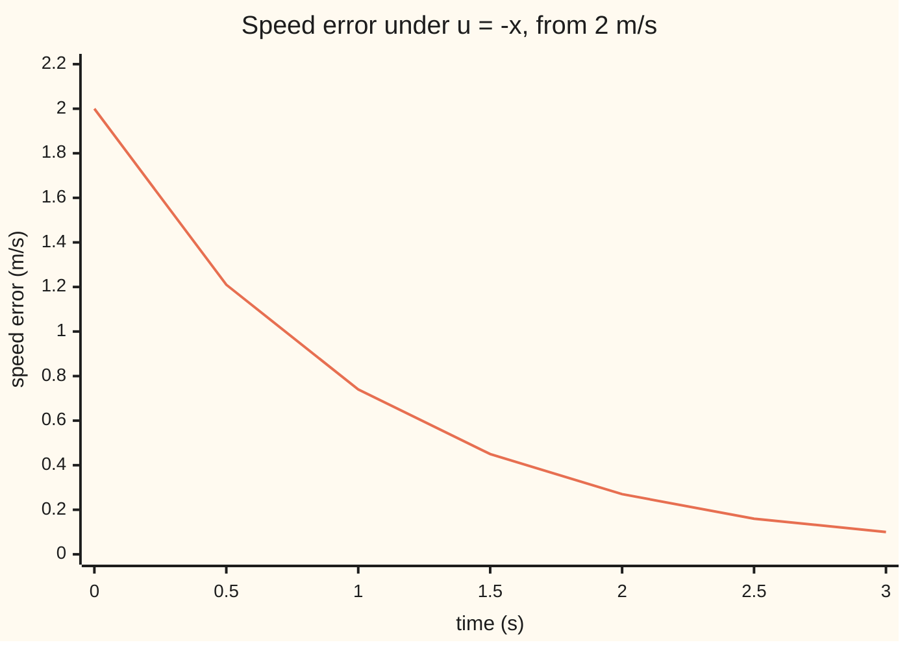
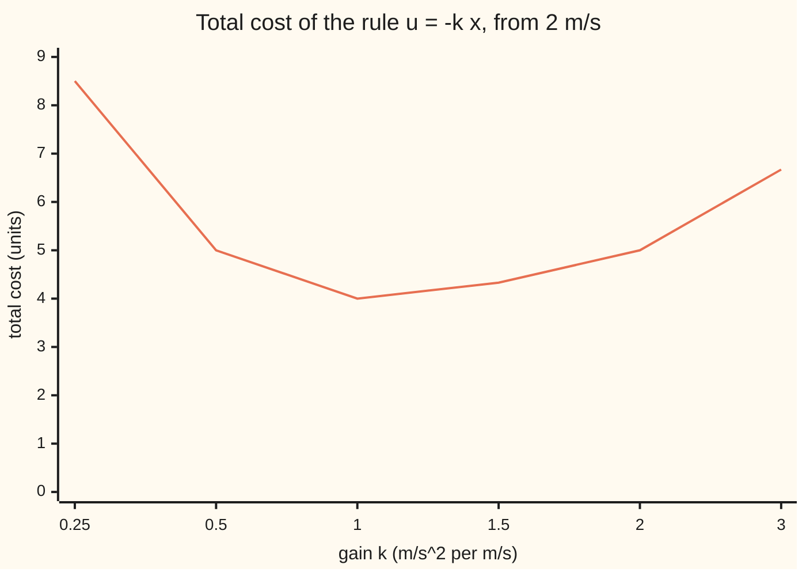

# The HJB equation: dynamic programming in continuous time, and for linear motion with squared costs the best control is a feedback gain

[Syllabus](../../../SYLLABUS.md) → [Differential equations and dynamics](../README.md) → [Calculus of Variations and Optimal Control](../README.md#s12) → The HJB equation

---

## General Overview

A car on cruise control leaves a downhill stretch 2 m/s above its set speed. The controller commands an acceleration; drag is ignored. Each second off speed costs the square of the speed error; each second of pushing costs the square of the push, both weighted 1 in these units. Push hard and the error vanishes, expensively. Push gently and it lingers.

Dynamic programming ([Dynamic programming](07-dynamic-programming-and-the-bellman-equation.md)) works in stages. The car's clock has none. Shrink a stage to an instant and the Bellman equation becomes a differential equation for the best cost itself: the **Hamilton-Jacobi-Bellman equation**, HJB for short.

The answer is a rule, not a plan: decelerate at the speed error, 2 m/s^2 at 2 m/s too fast. The error halves every 0.693 s, and the manoeuvre costs 4 units, the square of the starting error.

**The best achievable cost, written as a function of the state, satisfies the HJB equation over every instant; for linear motion and squared costs it is a square whose coefficient solves a Riccati equation, and the best control is the state times a fixed gain.**

**What kind of fact this is:** a theorem, proved on this card in Why it works for the car and in the folded Detailed proof for any problem with a smooth best cost.

### The picture: the speed error under the best rule



The one line is the speed error under the rule "push equals minus the error", stepped by the check scripts.

---

## The formula

Notation first, in words. A prime means rate in time. For a function of time and state, subscripts mean partial derivatives: $V_t$ is the rate in time with the state fixed, $V_x$ the slope in the state. The car's motion and cost are

$$x' = u, \qquad J = \int_0^\infty \big(x^2 + u^2\big)\,dt .$$

The **value function** $V(t, x)$ is the least cost any control can achieve from state $x$ at time $t$. The HJB equation says

$$-V_t = \min_{u}\big(x^2 + u^2 + V_x\, u\big).$$

**Read it aloud:** the best cost falls with time at the smallest cost rate available now, counting the push's effect on the best cost.

With no deadline, $V_t = 0$. The guess $V = P x^2$ turns the equation into the **Riccati equation** $1 - P^2 = 0$, whose positive root gives

$$V(x) = x^2, \qquad u = -\tfrac12 V_x = -x .$$

**Read it aloud:** the best cost from error x is x squared, and the best push is minus the error.

| Symbol | Plain meaning | In our example | Push it up and the answer… |
| --- | --- | --- | --- |
| $x$, $x_0$ | speed error, m/s; its starting value | $x_0$ = 2 m/s | cost grows as its square |
| $u$ | commanded acceleration, m/s^2 | −2 m/s^2 at the start | faster fix, dearer pushing |
| $t$, $h$ | time in s; $h$ a short step of time | $h$ = 0.1, 0.01, 0.001 s | larger $h$: cruder step |
| $J$ | total cost, the integral of $x^2 + u^2$ | 4 under the best rule | — |
| $V$, $V_t$, $V_x$, $W$ | value function; its rate in time; its slope in the state; $W$ a candidate for $V$ | $V(x) = x^2$, $V_x = 2x$ | — |
| $P$ | coefficient of the quadratic value, $V = P x^2$ | 1 with no deadline | bigger $P$: stronger push |
| $k$ | feedback gain: the rule $u = -k x$ | 1 is best | above 1 overpays for pushing |
| $T$, $s$, $\tanh$ | deadline, s; time left $s = T - t$; the hyperbolic tangent, $(e^{2s}-1)/(e^{2s}+1)$ | 1 s left: $P$ = 0.761594 | longer horizon: $P$ nears 1 |

### When it holds

- **A smooth value function.** The derivation uses $V_x$. If the push is capped and the cost is the time to reach zero error, the value has a corner at zero and HJB holds only in a weaker sense.
- **A positive cost on the push.** Without $u^2$ the minimum over $u$ does not exist.
- **Linear motion and squared costs, for the quadratic guess.** With drag, HJB still holds but $V$ is no longer $P x^2$.
- **The positive root.** $P = -1$ also solves $1 - P^2 = 0$, and gives a runaway car.
- **No noise.** Chance adds a second-derivative term (wing 11).

---

## Why it works

### Step 0: the best cost balances over every instant

The best cost from here is the cost of the next short stretch plus the best cost from where it ends, minimised over the first move. That holds for any length of stretch; shrink it to zero and the balance becomes a differential equation.

### Step 1: the Bellman equation over a short step

Hold the push $u$ for a short time $h$. The stretch costs about $(x^2 + u^2)h$ and moves the error to $x + uh$:

$$V(t, x) = \min_u \Big( (x^2 + u^2)\,h + V(t + h,\; x + u h) \Big).$$

To first order ([Taylor series](../../06-Calculus%20and%20analysis/06-Series/05-taylor-series.md)), $V(t+h, x+uh) = V + V_t h + V_x u h$. $V$ cancels from both sides. Divide by $h$ and let it shrink to zero:

$$0 = V_t + \min_u \big( x^2 + u^2 + V_x u \big).$$

### Step 2: the minimum over the push

The bracket is a bowl in $u$ with slope $2u + V_x$, zero at $u = -V_x/2$. There the bracket is $x^2 - V_x^2/4$, so HJB becomes $V_t + x^2 - \tfrac14 V_x^2 = 0$. At $x$ = 2 with $V_x$ = 4 (the slope Step 3 finds), a search in the check scripts, which never uses this algebra, finds the bottom at $u$ = −2.0000, with the bracket at 0.000000.

### Step 3: guess a square, get a Riccati equation

Doubling the error doubles every sensible push and quadruples every cost. So try $V = P x^2$: then $V_x = 2Px$ and HJB reads $V_t + x^2 - P^2x^2 = 0$.

With no deadline, $V_t = 0$ and $1 - P^2 = 0$, the **algebraic Riccati equation**. Its root $P = 1$ gives $u = -x$, so $x' = -x$ and $x = 2e^{-t}$, which halves when $t = \ln 2$ = 0.693 s.

With a deadline, $V = P(t)x^2$ and dividing by $x^2$ leaves the **Riccati differential equation**. In the time left $s$ it reads $dP/ds = 1 - P^2$, with $P = 0$ when no time is left. Its solution ([Bernoulli and Riccati equations](../01-Rate%20Equations/09-bernoulli-and-riccati-substitutions.md)) is $P = \tanh s$: 0.761594 with 1 s left, 0.995055 with 3 s left.

### Step 4: no other rule does better

The error's square changes at rate $2xu$, and $(x+u)^2 \geq 0$ gives

$$x^2 + u^2 \;\geq\; -2xu \;=\; -\frac{d}{dt}\,x^2 .$$

Integrate from time 0: any control that returns the error to zero costs at least $x_0^2$ = 4, with equality only when $u = -x$.

<details>
<summary>Detailed proof: the verification theorem</summary>

Let $W(t, x)$ be smooth, satisfy HJB, and be zero at the deadline $T$. Along any control's motion $W$ changes at rate $W_t + W_x u$ (chain rule), which HJB says is at least $-(x^2 + u^2)$. Integrating from 0 to $T$ gives $0 - W(0, x_0) \geq -J$, so every control costs at least $W(0, x_0)$. The minimising control makes each inequality an equality, so it costs exactly $W(0, x_0)$: $W$ is the value.

With no deadline, let $T$ grow: a control of finite cost makes $x^2$ and its rate $2xu$ integrable, so $x^2$, and with it $W$, tends to zero.

</details>

### Step 5: a second road, Bellman on short steps

Apply Bellman's rule exactly on steps of $h$, back from $P = 0$: each step turns $P$ into $h + P/(1+hP)$.

<details>
<summary>The algebra behind this, if you want it</summary>

One step costs $h(x^2 + u^2) + P(x + hu)^2$. Its slope in $u$ vanishes at $u = -Px/(1+hP)$, where $x + hu = x/(1+hP)$ and the step's best cost is $x^2\big(h + P/(1+hP)\big)$.

</details>

The recursion settles at 1.051249 for steps of 0.1 s, 1.005012 for 0.01 s, 1.000500 for 0.001 s: the gap to 1 shrinks with the step.

Pontryagin's principle ([Pontryagin's principle](06-pontryagins-principle-and-bang-bang-control.md)) is a third road: its costate is $V_x$ along the best path. It finds one path from one start; HJB finds the best push from every state.

---

## Worked numbers, by hand

| Step | Arithmetic | Value |
| --- | --- | --- |
| HJB, no deadline, $V = Px^2$ | $1 - P^2 = 0$, positive root | $P$ = 1 |
| best push at the start | $u = -x_0$ | −2 m/s^2 |
| error after 1 s | $2e^{-1}$ | 0.74 m/s |
| halving time | $\ln 2$ | 0.693 s |
| total cost | $V(x_0) = x_0^2$ | **4** |
| with a 1 s deadline | $x_0^2 \tanh 1$ | 3.0464 |

The car sheds its excess speed with a brake that eases off as the error shrinks, and no rule does it for less than 4.

### The picture: what other gains cost

A fixed gain $k$ gives cost $x_0^2 (1 + k^2)/(2k)$; the check scripts step each gain instead.



The one line is each gain's stepped cost, lowest at gain 1; a scan in steps of 0.01 also finds 1.00.

### What breaks if you drop a piece

| Mistake | Comes out at | What went wrong |
| --- | --- | --- |
| No cost on the push | gain 20: error cost 0.1000, true cost 40.1000; no gain is best | without $u^2$ the minimum over $u$ does not exist |
| Slope of $x^2$ taken as $x$ | gain 0.5, cost 5.0000, halving in 1.386 s | the slope of $x^2$ is $2x$ |
| Root $P = -1$ | $u = +x$; error 40.1711 m/s after 3 s | a cost cannot be negative |
| No-deadline value on a 1 s trip | 4.0000 instead of 3.0464 | a deadline needs $P = \tanh s$ |

The code prints every entry.

---

## Code, from first principles, and it actually runs

Five roads: a ternary search (discarding a third of an interval at a time) for the best push; fourth-order Runge-Kutta (RK4) stepping the car and its cost under each gain; a scan over gains; the stepped Bellman recursion; and RK4 on the Riccati equation against $\tanh$ built from the exponential.

### Python

```python
# The HJB equation and the linear-quadratic regulator -- the check behind the card.
# Cruise control: speed error x (m/s), push u (m/s^2), x' = u, cost the integral of
# x^2 + u^2.  Claim: value V(x) = x^2, best push u = -x.  Roads: the formula; a search
# over u; RK4 stepping of the car; a backward Bellman recursion; RK4 on the Riccati.
import math
X0 = 2.0

def run(k, h=0.01, t_end=60.0):          # RK4 on x' = -k x, cost rate (1 + k^2) x^2
    f = lambda x: (-k * x, (1 + k * k) * x * x)
    x, c, t, half, path = X0, 0.0, 0.0, None, [X0]
    for _ in range(round(t_end / h)):
        a = f(x); b = f(x + h / 2 * a[0]); d = f(x + h / 2 * b[0]); e = f(x + h * d[0])
        xn = x + h / 6 * (a[0] + 2 * b[0] + 2 * d[0] + e[0])
        c += h / 6 * (a[1] + 2 * b[1] + 2 * d[1] + e[1])
        if half is None and xn <= X0 / 2:        # straight line between the two steps
            half = t + h * (x - X0 / 2) / (x - xn)
        x, t = xn, t + h; path.append(x)
    return c, half, path
def ternary(g, lo, hi):                  # the lowest point of a bowl-shaped g
    for _ in range(200):
        m1, m2 = lo + (hi - lo) / 3, hi - (hi - lo) / 3
        lo, hi = (lo, m2) if g(m1) < g(m2) else (m1, hi)
    return (lo + hi) / 2
def bellman(h, p=0.0):                   # V = P x^2 on steps of h, back from P = 0
    for _ in range(round(40 / h)):
        p = h + p / (1 + h * p)
    return p
def riccati(s_end, h, p=0.0, g=lambda p: 1 - p * p):   # RK4 on P' = 1 - P^2 in time to go
    for _ in range(round(s_end / h)):
        a = g(p); b = g(p + h / 2 * a); d = g(p + h / 2 * b); p += h / 6 * (a + 2 * b + 2 * d + g(p + h * d))
    return p

tanh = lambda s: (math.exp(2 * s) - 1) / (math.exp(2 * s) + 1)
u_best = ternary(lambda u: X0 * X0 + u * u + 2 * X0 * u, -10, 10)
c1, half, path = run(1.0)
gains = [0.25, 0.5, 1.0, 1.5, 2.0, 3.0]; costs = [run(k)[0] for k in gains]
scan = min((run(k / 100, h=0.02)[0], k / 100) for k in range(25, 301))
print(f"HJB at x = 2, V' = 4: search finds u = {u_best:.4f}, min of x^2 + u^2 + V'u = {X0 * X0 + u_best ** 2 + 2 * X0 * u_best:.6f}")
print(f"cost of u = -x from x0 = 2, RK4 stepped: {c1:.6f}; value V(2) = x0^2 = {X0 * X0:.6f}")
print(f"error halves after {half:.3f} s, stepped; ln 2 = {math.log(2):.3f} s")
print("chart, error x(t) at t = 0 0.5 1 1.5 2 2.5 3:", " ".join(f"{path[i]:.2f}" for i in range(0, 301, 50)))
print("chart, cost of gain k =", " ".join(f"{k}" for k in gains) + ":", " ".join(f"{c:.2f}" for c in costs))
print(f"best gain on a scan 0.25 to 3 in steps of 0.01: k = {scan[1]:.2f}, cost {scan[0]:.4f}")
for h in (0.1, 0.01, 0.001):
    p = bellman(h)
    print(f"Bellman on steps of {h}: P = {p:.6f}, gain {p / (1 + h * p):.6f}, P - 1 = {p - 1:.6f}")
for h in (0.1, 0.05):
    ps = [riccati(s, h) for s in (1, 2, 3)]
    print(f"Riccati RK4 h = {h}: P at 1, 2, 3 s to go = " + " ".join(f"{p:.6f}" for p in ps)
          + f"; worst error vs tanh {max(abs(p - tanh(s)) for p, s in zip(ps, (1, 2, 3))):.1e}")
print(f"tanh(1) = {tanh(1):.6f}; 1 s trip from x0 = 2 costs {X0 * X0 * tanh(1):.4f}, not {X0 * X0:.4f}")
c20, (c05, h05, _) = run(20.0, h=0.001), run(0.5)
print(f"mistake, no push cost: gain 20 gives speed cost {c20[0] / 401:.4f}, true cost {c20[0]:.4f}")
print(f"mistake, V' = x not 2x: gain 0.5, cost {c05:.4f}, halving time {h05:.3f} s")
print(f"mistake, root P = -1: u = +x, error after 3 s = {run(-1.0, t_end=3.0)[2][-1]:.4f} m/s")
assert abs(c1 - X0 * X0) < 1e-6 and abs(half - math.log(2)) < 1e-3   # stepping vs formula
assert abs(scan[1] - 1.0) < 1e-9 and all(abs(c - X0 * X0 * (1 + k * k) / (2 * k)) < 1e-6 for c, k in zip(costs, gains))
assert abs(bellman(0.001) - 1) < 1e-3 and 9 < (bellman(0.01) - 1) / (bellman(0.001) - 1) < 11
assert abs(u_best + X0) < 1e-6 and max(abs(riccati(s, 0.05) - tanh(s)) for s in (1, 2, 3)) < 1e-6
print("ALL CHECKS PASS")
```

**Ran 2026-09-28 on macOS, Python 3.14.6, standard library only. All checks passed. Output, pasted from the run:**

```
HJB at x = 2, V' = 4: search finds u = -2.0000, min of x^2 + u^2 + V'u = 0.000000
cost of u = -x from x0 = 2, RK4 stepped: 4.000000; value V(2) = x0^2 = 4.000000
error halves after 0.693 s, stepped; ln 2 = 0.693 s
chart, error x(t) at t = 0 0.5 1 1.5 2 2.5 3: 2.00 1.21 0.74 0.45 0.27 0.16 0.10
chart, cost of gain k = 0.25 0.5 1.0 1.5 2.0 3.0: 8.50 5.00 4.00 4.33 5.00 6.67
best gain on a scan 0.25 to 3 in steps of 0.01: k = 1.00, cost 4.0000
Bellman on steps of 0.1: P = 1.051249, gain 0.951249, P - 1 = 0.051249
Bellman on steps of 0.01: P = 1.005012, gain 0.995012, P - 1 = 0.005012
Bellman on steps of 0.001: P = 1.000500, gain 0.999500, P - 1 = 0.000500
Riccati RK4 h = 0.1: P at 1, 2, 3 s to go = 0.761593 0.964026 0.995054; worst error vs tanh 1.4e-06
Riccati RK4 h = 0.05: P at 1, 2, 3 s to go = 0.761594 0.964028 0.995055; worst error vs tanh 8.7e-08
tanh(1) = 0.761594; 1 s trip from x0 = 2 costs 3.0464, not 4.0000
mistake, no push cost: gain 20 gives speed cost 0.1000, true cost 40.1000
mistake, V' = x not 2x: gain 0.5, cost 5.0000, halving time 1.386 s
mistake, root P = -1: u = +x, error after 3 s = 40.1711 m/s
ALL CHECKS PASS
```

### Rust

Same numbers, same labels, built with `rustc --edition 2021 -O`.

```rust
// The HJB equation and the linear-quadratic regulator -- the same check as the Python.
// Cruise control: speed error x (m/s), push u (m/s^2), x' = u, cost the integral of
// x^2 + u^2.  Claim: value V(x) = x^2, best push u = -x.  Roads: the formula; a search
// over u; RK4 stepping of the car; a backward Bellman recursion; RK4 on the Riccati.
const X0: f64 = 2.0;

fn run(k: f64, h: f64, t_end: f64) -> (f64, f64, Vec<f64>) { // RK4: x' = -k x, cost rate (1 + k^2) x^2
    let f = |x: f64| (-k * x, (1.0 + k * k) * x * x);
    let (mut x, mut c, mut t, mut half, mut path) = (X0, 0.0, 0.0, f64::NAN, vec![X0]);
    for _ in 0..(t_end / h).round() as usize {
        let a = f(x); let b = f(x + h / 2.0 * a.0); let d = f(x + h / 2.0 * b.0); let e = f(x + h * d.0);
        let xn = x + h / 6.0 * (a.0 + 2.0 * b.0 + 2.0 * d.0 + e.0);
        c += h / 6.0 * (a.1 + 2.0 * b.1 + 2.0 * d.1 + e.1);
        if half.is_nan() && xn <= X0 / 2.0 { half = t + h * (x - X0 / 2.0) / (x - xn) } // straight line
        x = xn; t += h; path.push(x);
    }
    (c, half, path)
}
fn ternary(g: impl Fn(f64) -> f64, mut lo: f64, mut hi: f64) -> f64 { // lowest point of a bowl
    for _ in 0..200 {
        let (m1, m2) = (lo + (hi - lo) / 3.0, hi - (hi - lo) / 3.0);
        if g(m1) < g(m2) { hi = m2 } else { lo = m1 }
    }
    (lo + hi) / 2.0
}
fn bellman(h: f64) -> f64 {                // V = P x^2 on steps of h, back from P = 0
    let mut p = 0.0;
    for _ in 0..(40.0 / h).round() as usize { p = h + p / (1.0 + h * p) }
    p
}
fn riccati(s_end: f64, h: f64) -> f64 {    // RK4 on P' = 1 - P^2 in time to go, P(0) = 0
    let (g, mut p) = (|p: f64| 1.0 - p * p, 0.0);
    for _ in 0..(s_end / h).round() as usize {
        let a = g(p); let b = g(p + h / 2.0 * a); let d = g(p + h / 2.0 * b);
        p += h / 6.0 * (a + 2.0 * b + 2.0 * d + g(p + h * d));
    }
    p
}
fn tanh(s: f64) -> f64 { ((2.0 * s).exp() - 1.0) / ((2.0 * s).exp() + 1.0) }
fn sci(v: f64) -> String {                 // 1.4e-06, the way Python prints it
    let s = format!("{:.1e}", v);
    let (m, e) = s.split_once('e').unwrap(); let n: i32 = e.parse().unwrap();
    format!("{}e{}{:02}", m, if n < 0 { '-' } else { '+' }, n.abs())
}
fn join(v: &[f64], d: usize) -> String { v.iter().map(|x| format!("{:.*}", d, x)).collect::<Vec<_>>().join(" ") }
fn main() {
    let u_best = ternary(|u| X0 * X0 + u * u + 2.0 * X0 * u, -10.0, 10.0);
    let (c1, half, path) = run(1.0, 0.01, 60.0);
    let gains = [0.25, 0.5, 1.0, 1.5, 2.0, 3.0]; let costs: Vec<f64> = gains.iter().map(|&k| run(k, 0.01, 60.0).0).collect();
    let scan = (25..301).map(|k| (run(k as f64 / 100.0, 0.02, 60.0).0, k as f64 / 100.0))
        .fold((f64::INFINITY, 0.0), |b, c| if c.0 < b.0 { c } else { b });
    println!("HJB at x = 2, V' = 4: search finds u = {:.4}, min of x^2 + u^2 + V'u = {:.6}", u_best, X0 * X0 + u_best * u_best + 2.0 * X0 * u_best);
    println!("cost of u = -x from x0 = 2, RK4 stepped: {:.6}; value V(2) = x0^2 = {:.6}", c1, X0 * X0);
    println!("error halves after {:.3} s, stepped; ln 2 = {:.3} s", half, 2f64.ln());
    let pts: Vec<f64> = (0..301).step_by(50).map(|i| path[i]).collect();
    println!("chart, error x(t) at t = 0 0.5 1 1.5 2 2.5 3: {}", join(&pts, 2));
    println!("chart, cost of gain k = {}: {}", gains.iter().map(|k| format!("{:?}", k)).collect::<Vec<_>>().join(" "), join(&costs, 2));
    println!("best gain on a scan 0.25 to 3 in steps of 0.01: k = {:.2}, cost {:.4}", scan.1, scan.0);
    for h in [0.1, 0.01, 0.001] {
        let p = bellman(h);
        println!("Bellman on steps of {}: P = {:.6}, gain {:.6}, P - 1 = {:.6}", h, p, p / (1.0 + h * p), p - 1.0);
    }
    for h in [0.1, 0.05] {
        let ps: Vec<f64> = [1.0, 2.0, 3.0].iter().map(|&s| riccati(s, h)).collect();
        let worst = ps.iter().zip([1.0, 2.0, 3.0]).map(|(p, s)| (p - tanh(s)).abs()).fold(0.0, f64::max);
        println!("Riccati RK4 h = {}: P at 1, 2, 3 s to go = {}; worst error vs tanh {}", h, join(&ps, 6), sci(worst));
    }
    println!("tanh(1) = {:.6}; 1 s trip from x0 = 2 costs {:.4}, not {:.4}", tanh(1.0), X0 * X0 * tanh(1.0), X0 * X0);
    let (c20, (c05, h05, _)) = (run(20.0, 0.001, 60.0).0, run(0.5, 0.01, 60.0));
    println!("mistake, no push cost: gain 20 gives speed cost {:.4}, true cost {:.4}", c20 / 401.0, c20);
    println!("mistake, V' = x not 2x: gain 0.5, cost {:.4}, halving time {:.3} s", c05, h05);
    println!("mistake, root P = -1: u = +x, error after 3 s = {:.4} m/s", run(-1.0, 0.01, 3.0).2.last().unwrap());
    assert!((c1 - X0 * X0).abs() < 1e-6 && (half - 2f64.ln()).abs() < 1e-3); // stepping vs formula
    assert!((scan.1 - 1.0f64).abs() < 1e-9 && costs.iter().zip(gains).all(|(c, k)| (c - X0 * X0 * (1.0 + k * k) / (2.0 * k)).abs() < 1e-6));
    let r = (bellman(0.01) - 1.0) / (bellman(0.001) - 1.0);
    assert!((bellman(0.001) - 1.0).abs() < 1e-3 && 9.0 < r && r < 11.0);
    assert!((u_best + X0).abs() < 1e-6 && [1.0, 2.0, 3.0].iter().all(|&s| (riccati(s, 0.05) - tanh(s)).abs() < 1e-6));
    println!("ALL CHECKS PASS");
}
```

**Ran 2026-09-28 on macOS, rustc 1.98.1, no crates. All checks passed. Output, pasted from the run:**

```
HJB at x = 2, V' = 4: search finds u = -2.0000, min of x^2 + u^2 + V'u = 0.000000
cost of u = -x from x0 = 2, RK4 stepped: 4.000000; value V(2) = x0^2 = 4.000000
error halves after 0.693 s, stepped; ln 2 = 0.693 s
chart, error x(t) at t = 0 0.5 1 1.5 2 2.5 3: 2.00 1.21 0.74 0.45 0.27 0.16 0.10
chart, cost of gain k = 0.25 0.5 1.0 1.5 2.0 3.0: 8.50 5.00 4.00 4.33 5.00 6.67
best gain on a scan 0.25 to 3 in steps of 0.01: k = 1.00, cost 4.0000
Bellman on steps of 0.1: P = 1.051249, gain 0.951249, P - 1 = 0.051249
Bellman on steps of 0.01: P = 1.005012, gain 0.995012, P - 1 = 0.005012
Bellman on steps of 0.001: P = 1.000500, gain 0.999500, P - 1 = 0.000500
Riccati RK4 h = 0.1: P at 1, 2, 3 s to go = 0.761593 0.964026 0.995054; worst error vs tanh 1.4e-06
Riccati RK4 h = 0.05: P at 1, 2, 3 s to go = 0.761594 0.964028 0.995055; worst error vs tanh 8.7e-08
tanh(1) = 0.761594; 1 s trip from x0 = 2 costs 3.0464, not 4.0000
mistake, no push cost: gain 20 gives speed cost 0.1000, true cost 40.1000
mistake, V' = x not 2x: gain 0.5, cost 5.0000, halving time 1.386 s
mistake, root P = -1: u = +x, error after 3 s = 40.1711 m/s
ALL CHECKS PASS
```

The two outputs match line for line. Halving the RK4 step on the Riccati equation cuts its error from 1.4e-06 to 8.7e-08, the shrink a fourth-order method promises.

> [!TIP]
> **Try changing**
> Guess first, then run it.
> - **A bigger error.** Set `X0 = 3.0`. The cost becomes 9; the halving time stays 0.693 s. Every assert passes.
> - **Dearer pushing.** In `run`, make the cost rate `(1 + 4 * k * k) * x * x`. Now $P = 2$ and the best gain is 0.5; the scan reports 0.50, cost 8, and the first assert stops the run.
> - **Never push.** In `bellman`, replace `p / (1 + h * p)` with `p`. $P$ climbs to 40; the third assert stops the run.

---

## The usual mistake

> [!warning]
> **Solving for a path instead of a rule.** HJB gives the push as a function of the current error, $u = -x$. The schedule $u = -2e^{-t}$ matches it only if nothing disturbs the car; after a gust the schedule pushes as planned, while the rule reads the new error. The other slips are in the table under What breaks.

---

## Where you meet it in real life

- **Autopilots and cruise controllers.** The linear-quadratic regulator (LQR), this card's answer with matrices for numbers, sets feedback gains in aircraft, satellites and robots (The LQR).
- **Portfolio choice.** Merton's portfolio problem is HJB's best-known use in finance: wealth is the state, the share held in stocks is the control ([Merton's problem](../../12-Financial%20mathematics/38-Performance%20and%20Multi-Period/03-mertons-portfolio-problem.md)).
- **Grid solvers.** Where no quadratic guess works, HJB is solved on a grid of states, Step 5's recursion in more dimensions.

> **Say it back**
> The value function is the best cost from each state. Bellman's balance over a short step, to first order, is the HJB equation. Linear motion and squared costs make the value a square, and HJB a Riccati equation for its coefficient. For the car the best push is minus the error. A smooth solution of HJB is the true value, since no control makes it fall faster than cost is paid.

---

## What this builds on

- [Dynamic programming](07-dynamic-programming-and-the-bellman-equation.md): the stage-by-stage balance Step 1 shrinks to an instant.
- [Pontryagin's principle](06-pontryagins-principle-and-bang-bang-control.md): the path-by-path road whose costate is $V_x$.
- [Bernoulli and Riccati equations](../01-Rate%20Equations/09-bernoulli-and-riccati-substitutions.md): solving $dP/ds = 1 - P^2$.
- [Taylor series](../../06-Calculus%20and%20analysis/06-Series/05-taylor-series.md): the first-order expansion behind Step 1.

## Where this goes next

- [Stochastic control](../../11-Stochastic%20processes%20and%20calculus/09-Beyond%20Brownian/03-stochastic-control-and-the-hjb-equation.md): noise adds a second-derivative term; Feynman-Kac ties it to averages.
- The LQR: many states, a matrix $P$, the matrix Riccati equation.
- The HJB equation: value functions with corners.
- [Merton's problem](../../12-Financial%20mathematics/38-Performance%20and%20Multi-Period/03-mertons-portfolio-problem.md): the stochastic HJB equation choosing a stock holding.

What the best rule becomes when chance jostles the motion is the question the stochastic-control card answers.

---

## Sources

Verified 2026-09-28: every link below resolves to the publisher's page.

- Bertsekas, Dimitri P. *Dynamic Programming and Optimal Control*. Athena Scientific. [Publisher page](http://www.athenasc.com/dpbook.html). HJB from the discrete Bellman equation.
- Kirk, Donald E. *Optimal Control Theory: An Introduction*. Dover. [Publisher page](https://store.doverpublications.com/products/9780486434841). HJB and the linear regulator, introductory.
- Anderson, Brian D. O., and John B. Moore. *Optimal Control: Linear Quadratic Methods*. Dover. [Publisher page](https://store.doverpublications.com/products/9780486457666). The Riccati equation and its positive root.
- Liberzon, Daniel. *Calculus of Variations and Optimal Control Theory: A Concise Introduction*. Princeton University Press, 2012. [Publisher page](https://press.princeton.edu/books/hardcover/9780691151878/calculus-of-variations-and-optimal-control-theory). HJB, Pontryagin and verification.
