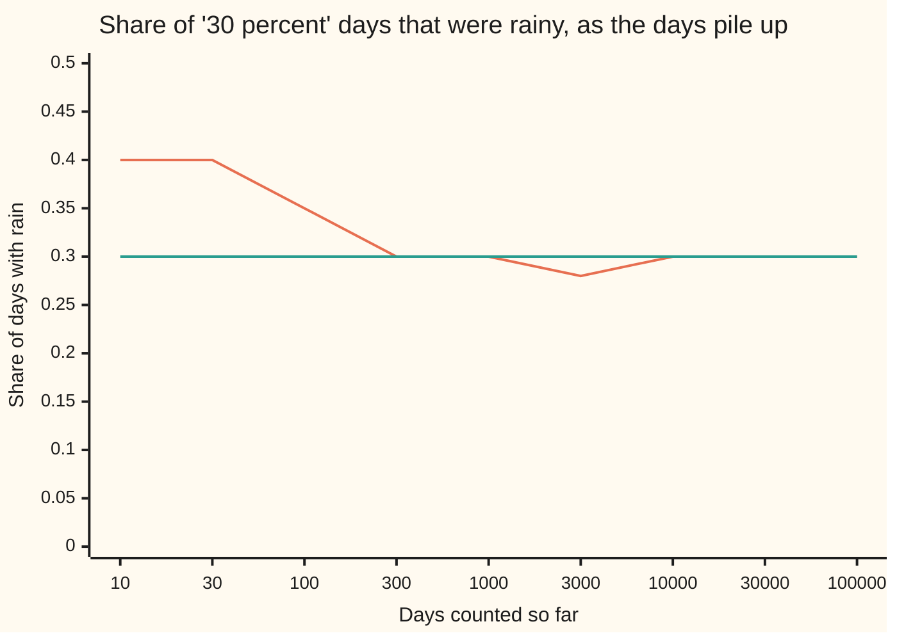
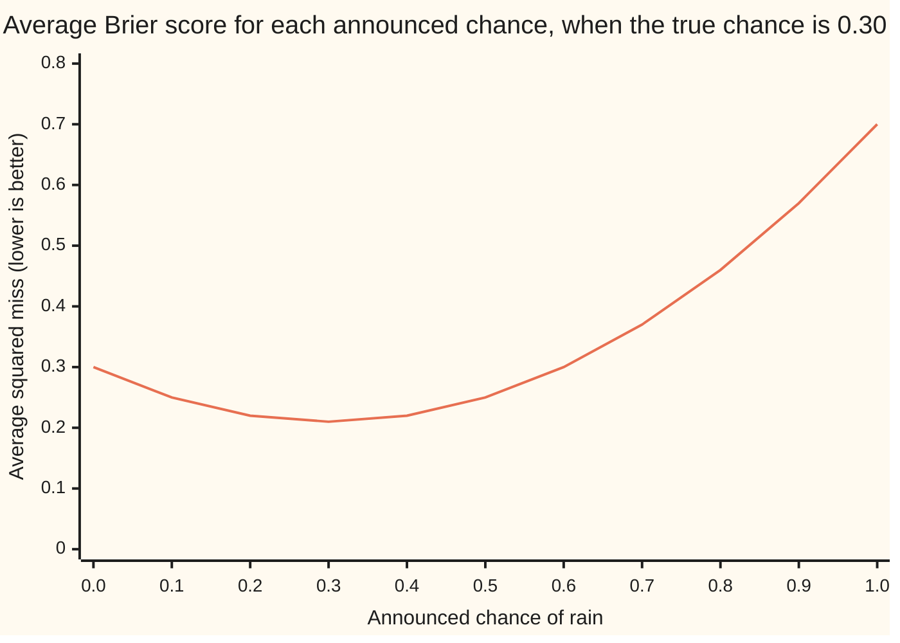
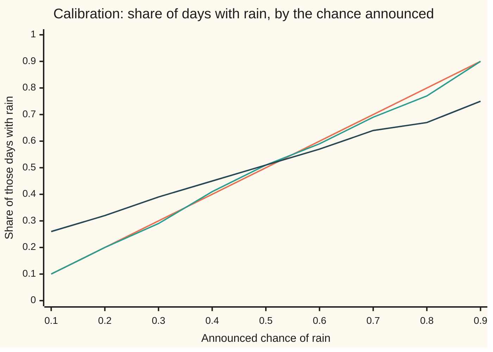

# Probability: a number between 0 and 1, and the three readings people give it

Probability and statistics → Chance and Events → Reading a chance → Probability

---

## General Overview

Tomorrow's forecast says: 30 percent chance of rain. Tomorrow comes once. It will rain or it will not. So what did the forecaster promise?

The US National Weather Service fixes what the number is about: the chance that the forecast point gets at least 0.01 inch of rain during the period. Not rain for 30 percent of the day, not rain over 30 percent of the town. What the number *means* is a separate question, with three answers in common use.

- **How often.** Collect every day the forecaster said 30 percent. On about 3 of every 10 of them, it rained. This is the frequency reading.
- **What price.** A ticket that pays $1 if it rains is worth 30 cents, no more and no less. Equivalently, staking $3 to win $7 on rain is a fair bet. This is the betting reading.
- **How sure.** The forecaster believes in rain as strongly as in drawing a marked card from a pack of 10 with 3 marked. This is the belief reading.

The one number, 0.30, is all three at once. From here on it is called a **probability**: a number from 0 (cannot happen) to 1 (certain).

**A probability is a number from 0 to 1 attached to something that may or may not happen; it can be read as a long-run share of cases, as a fair price, or as a degree of belief, and the three agree when the believer bets coherently and the beliefs are checked against the record.**

**What kind of fact this is:** a definition, of the number and its rules; the two theorems that tie the readings together (incoherent prices lose for sure, honest forecasts score best) are proved on this card in Why it works.

### The picture: the share of rainy days settles on 0.30

One simulated forecaster, 100,000 days, each with a true 30 percent chance of rain. After each count of days, the share that were rainy:



The wandering line is the share of rainy days so far; the flat line is the promised 0.30. After 10 days the share is 0.40, after 100,000 it is 0.2980.

---

## The formula

Notation first, in words. Something that may or may not happen, such as "measurable rain tomorrow", is called an **event** and gets a capital letter, here $A$. Its probability is written $P(A)$, read aloud "the chance of A". Probabilities are written as decimals: 30 percent is 0.30.

The three readings of the same statement, $P(A) = p$:

$$\frac{n_A}{n} \;\longrightarrow\; p \quad\text{as } n \text{ grows}$$

**Read it aloud:** out of $n$ days like this one, the share $n_A / n$ that turn out rainy settles on $p$.

$$\text{fair price of a ticket paying \$1 if } A \;=\; \$p, \qquad \text{odds against } A \;=\; \frac{1-p}{p}$$

**Read it aloud:** a ticket that pays one dollar if it rains is worth $p$ dollars; the odds against rain are the chance of no rain divided by the chance of rain.

$$B(q) \;=\; p\,(1-q)^2 + (1-p)\,q^2$$

**Read it aloud:** a forecaster who announces the chance $q$ is charged the squared miss, $(1-q)^2$ if it rains and $q^2$ if it stays dry; weighing the two by how often each happens gives the average charge.

This is the **Brier score** (Glenn Brier, 1950): the average squared miss, lower is better. Weather services grade forecasters with it.

The rules every reading obeys:

$$0 \le P(A) \le 1, \qquad P(\text{rain}) + P(\text{no rain}) = 1$$

| Symbol | Plain meaning | In our example | Push it up and the answer… |
| --- | --- | --- | --- |
| $A$ | an event: something that may or may not happen | measurable rain at the forecast point tomorrow | — |
| $P(A)$ | the chance of A, a number from 0 to 1 | 0.30 | — |
| $p$ | the true chance, the value $P(A)$ takes | 0.30 | more rainy days, a dearer ticket, shorter odds |
| $n$ | how many comparable days are counted | 10 up to 100,000 | the share wobbles less, like one over the square root of $n$ |
| $n_A$ | how many of those days were rainy | 29,799 of 100,000 | — |
| $n_A / n$ | the share of rainy days | 0.2980 | — |
| $q$ | the chance a forecaster announces | 0.30 when honest | away from $p$, the Brier score rises |
| $B(q)$ | Brier score: average squared miss of the forecast $q$ | 0.21 at $q = 0.30$ | lower is a better forecaster |
| $a$, $b$ | prices of the rain and no-rain tickets, in dollars | 0.30 and 0.60 for the incoherent bookmaker | a sum away from 1 opens a sure win |
| $h$, $k$ | how many rain and no-rain tickets are held; negative means sold | 1 and 1 | — |
| $(1-p)/p$ | odds against: dollars won per dollar staked on a fair bet | 2.3333, that is 7 to 3 | — |

### When it holds

A probability is a definition, so it holds by fiat; what can fail is each reading's link to the world.

- **Frequency needs many comparable cases.** A one-off event, such as one election, has nothing to count. With only 10 days the rainy share is typically 0.1449 off the chance. That typical gap is the **standard error**, $\sqrt{p(1-p)/n}$, derived on shelf 02.
- **Price needs a bet taken either way, at stakes that do not hurt.** A bookmaker's margin, or fear of losing the rent, moves the price off the chance.
- **Belief needs coherence.** Beliefs that break the rules above can be turned into bets that lose whatever happens (Step 3).
- **Belief meets frequency only if checked.** A coherent forecaster can still be wrong about the weather; only a calibration check against the record (Step 4) catches it.

---

## Why it works

### Step 0: one number answers three questions

Counting ties "How often?" to "What price?"; money ties "What price?" to "How sure?"; a score ties "How sure?" back to "How often?".

### Step 1: frequency is a share that settles

Count days on which the chance of rain is really 0.30. After 10 days the simulation has seen 4 rainy ones, a share of 0.40; after 100 days, 0.35; after 100,000, 0.2980.

The share never has to hit 0.30 exactly. What shrinks is the typical gap. The standard error, $\sqrt{0.30 \times 0.70 / n}$, is 0.1449 at 10 days, 0.0145 at 1,000 and 0.0014 at 100,000. Ten times as many days buys about three times less wobble, because of the square root.

That the share settles at all is the **law of large numbers**. It is stated here, checked by the simulation, and proved later in the wing with Chebyshev's inequality.

### Step 2: a fair price is the average payout

Sell one ticket a day that pays $1 on a rainy day. Over 100,000 days, 29,799 tickets pay out: 0.2980 dollars per ticket on average. Charge less and the seller loses in the long run; pay more and the buyer does. The only break-even price is the chance itself, 30 cents.

Odds are the same price said another way. "7 to 3 against" means a stake of $3 wins $7. On a rainy day, 3 times in 10, the bettor gains 7. On a dry day, 7 times in 10, the bettor loses 3. Weighed by the chances:

$$0.30 \times 7 \;-\; 0.70 \times 3 \;=\; 2.1 - 2.1 \;=\; 0.$$

A fair bet gains nothing on average. The simulated days give −0.0201 dollars per bet, standard error 0.0145: within one and a half standard errors of zero. Going back from odds to a chance: 3 wins in 3 + 7 = 10 cases is 3/10.

### Step 3: coherent prices obey the rules, or lose for sure

Now let the chance be a belief rather than a count. A bookmaker believes in 30 percent rain and 60 percent dry: prices of 30 cents for the rain ticket and 60 cents for the no-rain ticket. Buy both, for 90 cents. Exactly one of them pays $1, whatever the weather. The buyer nets 10 cents if it rains and 10 cents if it does not.

A set of bets that loses in every outcome is called a **Dutch book**. The bookmaker walked into one because the two beliefs summed to 0.90, not 1. Had they summed to more than 1, selling both tickets to the bookmaker would win for sure instead. Only prices that obey $P(\text{rain}) + P(\text{no rain}) = 1$, with each between 0 and 1, are safe. Frank Ramsey (1926) and Bruno de Finetti (1937) made this the foundation of the belief reading: a degree of belief is only worth the name if it could be used as a betting price without a sure loss.

<details>
<summary>Detailed proof: the prices must sum to 1, and then no book can be made</summary>

Let the rain ticket cost $a$ and the no-rain ticket cost $b$, each paying 1 in its own weather.

**Sum below 1.** Buy one of each. The cost is $a + b$ and exactly one ticket pays 1, so the buyer nets $1 - (a + b) > 0$ in both weathers.

**Sum above 1.** Sell one of each to the bookmaker. The seller receives $a + b$ and pays out 1, netting $(a + b) - 1 > 0$ in both weathers.

**A price below 0 or above 1.** A negative price pays the buyer to take a ticket that never costs anything later; a price above 1 charges more than the ticket can ever pay. Either is a sure loss for one side.

**Sum exactly 1: no sure win exists.** Hold $h$ rain tickets and $k$ no-rain tickets (a negative count means sold). The cost is $ha + kb$. The net is $h - (ha + kb)$ if it rains and $k - (ha + kb)$ if dry. Average the two nets with weights $a$ and $b$:
$$a\,[h - (ha + kb)] + b\,[k - (ha + kb)] = (ha + kb) - (ha + kb)(a + b) = 0.$$
The weights are non-negative and sum to 1. If both nets were positive, their weighted average would be positive, not 0. So no holding wins in both weathers. Coherent prices cannot be beaten.

</details>

### Step 4: honest forecasts score best, and scoring ties belief to frequency

A forecaster believes the chance is 0.30. Would announcing 0.50, to look cautious, score better? Expand the Brier score:

$$B(q) = p\,(1 - 2q + q^2) + (1-p)\,q^2 = p - 2pq + q^2 = p(1-p) + (q - p)^2.$$

The first term, $p(1-p)$, does not depend on the forecast. The second, $(q-p)^2$, is zero when $q = p$ and positive otherwise. So the average score is lowest exactly when the announced chance equals the true one. A scoring rule with this property is called **proper**.

With $p = 0.30$: forecasting 0.30 scores 0.21 on average, 0.50 scores 0.25, and always saying 0 scores 0.30.



The one line is $B(q) = 0.21 + (q - 0.30)^2$: a bowl whose floor sits at the true chance. Over the simulated days the score at 0.30 comes out at 0.2092, against 0.21 expected.

Here the readings meet. Under a proper score, the best announcement is the honest belief. Grouping days by the announced chance and counting the rainy share in each group is a **calibration** check; a forecaster is **calibrated** when it rains on about 30 percent of the days announced at 30 percent. Missing the frequency costs extra. Take the days a forecaster announced 0.90. Their average squared miss has the same form as $B(q)$, with the share of those days that were rainy in place of $p$. By the expansion above, it equals what announcing that share would have scored, plus the square of the gap between 0.90 and the share. So a miscalibrated forecaster can always lower its score by recalibrating: announcing, on each group of days, the share that came up rainy. The lowest average score needs every announcement to equal the true chance. Calibration is needed for that, but it is not enough, as the climate average below shows.

Two simulated forecasters, 2,000 days at each announced chance from 0.1 to 0.9. The honest one announces the true chance. The overconfident one exaggerates: it says 0.30 when the truth is 0.38, and 0.90 when the truth is 0.74.



First line (orange): perfect calibration, the share equals the announcement. Second (green): the honest forecaster, within three standard errors of the diagonal at every level. Third (dark): the overconfident forecaster, too flat. Its "30 percent" days were rainy 0.3945 of the time; its "90 percent" days only 0.7520. Over the 18,000 days the honest forecaster's Brier score is 0.1856, the overconfident one's 0.2366.

Calibration is not the whole story: announcing the climate average, 0.30, every day is calibrated and useless. The Brier score also rewards sharpness, meaning announcements that leave the average when the weather gives a reason.

<details>
<summary>Why a squared miss and not a plain miss?</summary>

Charging the plain gap between the forecast and the outcome, counted as 1 for rain and 0 for dry, averages to $p(1-q) + (1-p)q$. That is a straight line in $q$, so its lowest point is at an end: with $p = 0.30$ the best announcement is 0, not 0.30. The plain gap rewards exaggeration. The square makes the average a bowl with its floor at the truth.

</details>

The alternative route to all of this is the axiomatic one: take the rules as the starting point and never ask what the number means. Andrey Kolmogorov did that in 1933, and the rest of this shelf takes that road, starting from [sample-spaces-and-events](02-sample-spaces-and-events.md).

---

## Worked numbers, by hand

The forecast: 30 percent chance of measurable rain.

| Step | Arithmetic | Value |
| --- | --- | --- |
| the chance as a decimal | 30 ÷ 100 | 0.30 |
| the chance of no rain | 1 − 0.30 | 0.70 |
| odds against rain | 0.70 ÷ 0.30 | 2.3333, that is 7 to 3 |
| fair bet: stake $3 to win $7 | 0.30 × 7 − 0.70 × 3 | 0 |
| fair price of a $1 rain ticket | 0.30 × $1 | 30 cents |
| rainy share after 100,000 days | 29,799 ÷ 100,000 | 0.2980 |
| its standard error | √(0.30 × 0.70 ÷ 100,000) | 0.0014 |
| Brier score, honest forecast | 0.30 × 0.49 + 0.70 × 0.09 | 0.21 |
| Brier score, forecast of 0.50 | 0.30 × 0.25 + 0.70 × 0.25 | 0.25 |
| **one number, three readings** | share, price, belief | **0.30** |

A 30 percent forecast promises this: on days like tomorrow, about 3 in 10 are rainy; a $1 rain ticket is worth 30 cents; and a forecaster who said anything else would score worse over a season.

### What breaks if you drop a piece

| Mistake | Comes out at | What went wrong |
| --- | --- | --- |
| Prices of 30 cents on rain and 60 cents on no rain | the buyer of both nets +0.10 dollars in every weather | the two chances sum to 0.90, not 1 |
| Odds of 3 to 7 read as the chance 3/7 | 0.4286 instead of 0.3000 | the chance is wins over all cases, 3/(3 + 7) |
| Taking even money on rain | an average loss of 0.4040 dollars per $1 bet over the days | even money is fair only at a 50 percent chance |
| Judging the forecaster on 10 days | a rainy share of 0.40, "wrong" by 0.10 | the standard error at 10 days is 0.1449, so 0.40 is ordinary |

The code prints every number in the table.

---

## Code, from first principles, and it actually runs

Three readings, three roads, each checked against the formula. Road 1 counts rainy days among 100,000 simulated ones and compares the share with 0.30. Road 2 prices the ticket and the bet by weighing both outcomes, averages the same bets over the days, and enumerates both weathers for the incoherent bookmaker. It then searches every holding from 5 tickets sold to 5 bought of each kind, 121 in all: at each of 101 price pairs summing to 1 none wins in both weathers, and at the bookmaker's prices 6 do. Road 3 finds the best announcement by searching 1,001 forecasts, with no algebra, checks the Brier formula against the days, and runs two forecasters through a calibration check. Random numbers come from SplitMix64, a small generator written out in both languages with seed 20260928, so both programs see the same weather. A simulated number must land within four standard errors of its exact value, never on it.

### Python

```python
# What probability means -- the check behind the card.  Standard library only.
# A 30 percent chance of rain, read three ways: as a long-run frequency, as the
# fair price of a $1 ticket, and as a stated belief that a score rewards.
# Random draws come from SplitMix64, written out, seed 20260928, so the Rust
# program draws exactly the same days and prints exactly the same numbers.
from math import sqrt
M = (1 << 64) - 1
class SplitMix64:
    def __init__(self, seed): self.s = seed & M
    def uniform(self):                          # a number in [0, 1), 53 random bits
        self.s = (self.s + 0x9E3779B97F4A7C15) & M
        z = self.s
        z = ((z ^ (z >> 30)) * 0xBF58476D1CE4E5B9) & M
        z = ((z ^ (z >> 27)) * 0x94D049BB133111EB) & M
        return ((z ^ (z >> 31)) >> 11) / 9007199254740992.0
P = 0.30                                        # the forecast: 30 percent chance of rain
rng = SplitMix64(20260928)

# ---- road 1: frequency.  100,000 days on which the chance of rain really is 0.30 ----
DAYS = 100000
CHECKS = [10, 30, 100, 300, 1000, 3000, 10000, 30000, 100000]
rain, wet, freqs = [], 0, []
print("road 1, frequency: days  rainy  share rainy  standard error")
for d in range(1, DAYS + 1):
    y = 1 if rng.uniform() < P else 0           # 1 = measurable rain that day
    rain.append(y); wet += y
    if d in CHECKS:
        se = sqrt(P * (1 - P) / d)
        freqs.append(wet / d)
        print(f"  {d:>6} {wet:>6} {wet / d:>12.4f} {se:>15.4f}")
f_all, se_all = wet / DAYS, sqrt(P * (1 - P) / DAYS)
print("chart, share rainy:", ", ".join(f"{f:.2f}" for f in freqs))

# ---- road 2: price.  A ticket pays $1 if it rains; odds of 7 to 3 against rain ----
payout = sum(1.0 if y else 0.0 for y in rain) / DAYS      # one ticket a day, $1 if it rains
print(f"road 2, price: fair price of a $1 rain ticket, from the chance   {P:.2f}")
print(f"  average payout per ticket over the 100,000 days            {payout:.4f}")
odds_against = (1 - P) / P
print(f"  odds against rain, (1 - p) / p                               {odds_against:.4f}")
win = 7.0                                                # stake $3 at 7 to 3: win $7
exact_gain = sum(pr * g for pr, g in ((P, win), (1 - P, -3.0)))   # weigh both outcomes
sim_gain = sum(win if y else -3.0 for y in rain) / DAYS
print(f"  weighed by hand: 0.30 x {win:.4f} = {P * win:.4f} against 0.70 x 3 = {(1 - P) * 3:.4f}")
print(f"  $3 on rain at 7 to 3: average gain, both outcomes weighed  {exact_gain:.4f}")
print(f"  $3 on rain at 7 to 3: average gain over the days {sim_gain:.4f} (se {10 * se_all:.4f})")
even = sum(1.0 if y else -1.0 for y in rain) / DAYS      # $1 at even money
print(f"  $1 on rain at even money: average gain over the days {even:.4f} (se {2 * se_all:.4f})")
prices = {"rain": 0.30, "no rain": 0.60}                 # an incoherent bookmaker
cost = sum(prices.values())
for weather in ("rain", "no rain"):                      # enumerate what can happen
    paid = sum(1.0 for ticket in prices if ticket == weather)
    print(f"  buy both tickets for ${cost:.2f}, weather is {weather:<8}: buyer nets {paid - cost:+.2f}")
def sure_wins(a, b):          # holdings of -5 to 5 of each ticket (negative = sold) netting > 0 in both weathers
    return sum(1 for h in range(-5, 6) for k in range(-5, 6)
               if min(h - (h * a + k * b), k - (h * a + k * b)) > 1e-9)
coherent_wins = sum(sure_wins(c / 100, 1 - c / 100) for c in range(101))   # every price pair summing to 1
book_wins = sure_wins(prices["rain"], prices["no rain"])
print(f"  searched 121 holdings at each of 101 price pairs summing to 1: {coherent_wins} win in both weathers")
print(f"  searched 121 holdings at the bookmaker's prices, sum {cost:.2f}: {book_wins} win in both weathers")

# ---- road 3: belief.  The Brier score: (forecast - what happened)^2, averaged ----
def brier_exact(q, p): return p * (1 - q) ** 2 + (1 - p) * q ** 2   # weigh the two outcomes
grid = [k / 10 for k in range(11)]
curve = [brier_exact(q, P) for q in grid]
print("road 3, belief: expected Brier score for forecasts 0.0 to 1.0 when the chance is 0.30")
print("  " + ", ".join(f"{s:.2f}" for s in curve))
print(f"  squared misses: forecast 0.30 costs {(1 - 0.3) ** 2:.4f} if rain, {0.3 ** 2:.4f} if dry; 0.50 costs {0.5 ** 2:.4f}")
best = min(range(1001), key=lambda k: brier_exact(k / 1000, P)) / 1000   # search, no calculus
print(f"  forecast with the lowest expected score, searched on a 0.001 grid  {best:.3f}")
for q in (0.0, 0.3, 0.5):
    s = sum((q - y) ** 2 for y in rain) / DAYS
    print(f"  forecast {q:.1f}: score over the days {s:.4f}, expected {brier_exact(q, P):.4f}")
sim03 = sum((0.3 - y) ** 2 for y in rain) / DAYS
se03 = 0.4 * sqrt(P * (1 - P) / DAYS)             # (0.3 - y)^2 is 0.49 or 0.09: spread 0.4 per day

# ---- calibration: two forecasters, 2,000 days at each stated chance ----
print("calibration: said  honest: rained  overconfident: really  rained  se")
honest_ok, over_bad, hb, ob, over_line, hon_line = True, 0, 0.0, 0.0, [], []
N = 2000
for k in range(1, 10):
    said = k / 10
    truth = 0.5 + 0.6 * (said - 0.5)            # the overconfident forecaster exaggerates
    h = o = 0
    for _ in range(N):
        yh = 1 if rng.uniform() < said else 0
        yo = 1 if rng.uniform() < truth else 0
        h += yh; o += yo
        hb += (said - yh) ** 2; ob += (said - yo) ** 2
    se = sqrt(said * (1 - said) / N)
    honest_ok = honest_ok and abs(h / N - said) < 4 * se
    over_bad += abs(o / N - said) > 4 * se
    hon_line.append(h / N); over_line.append(o / N)
    print(f"  {said:>15.1f} {h / N:>15.4f} {truth:>22.2f} {o / N:>7.4f} {se:.4f}")
print("chart, stated chance:", ", ".join(f"{k / 10:.2f}" for k in range(1, 10)))
print("chart, honest:", ", ".join(f"{v:.2f}" for v in hon_line))
print("chart, overconfident:", ", ".join(f"{v:.2f}" for v in over_line))
print(f"  Brier score over the 18,000 days: honest {hb / (9 * N):.4f}, overconfident {ob / (9 * N):.4f}")

# ---- mistakes ----
print(f"mistake: odds 3 to 7 read as 3/7 = {3 / 7:.4f}; right: 3/(3 + 7) = {3 / (3 + 7):.4f}")
print(f"mistake: judged on 10 days, share rainy {freqs[0]:.2f}, standard error {sqrt(P * (1 - P) / 10):.4f}")

assert abs(f_all - P) < 4 * se_all                          # frequency agrees with the chance
assert coherent_wins == 0                                   # no holding beats prices that sum to 1
assert book_wins > 0                                        # the incoherent bookmaker can be beaten
assert abs(sim_gain - exact_gain) < 4 * 10 * se_all         # the days agree with both outcomes weighed
assert best == P                                            # honesty minimises the score
assert abs(sim03 - brier_exact(0.3, P)) < 4 * se03          # days against the formula
assert honest_ok                                            # the honest forecaster is calibrated
assert over_bad >= 6                                        # the overconfident one is not
assert hb < ob                                              # and it scores worse
print("ALL CHECKS PASS")
```

**Ran 2026-10-06 on macOS, Python 3.14.6, standard library only. All checks passed. Output, pasted from the run:**

```
road 1, frequency: days  rainy  share rainy  standard error
      10      4       0.4000          0.1449
      30     12       0.4000          0.0837
     100     35       0.3500          0.0458
     300     90       0.3000          0.0265
    1000    301       0.3010          0.0145
    3000    853       0.2843          0.0084
   10000   2959       0.2959          0.0046
   30000   8963       0.2988          0.0026
  100000  29799       0.2980          0.0014
chart, share rainy: 0.40, 0.40, 0.35, 0.30, 0.30, 0.28, 0.30, 0.30, 0.30
road 2, price: fair price of a $1 rain ticket, from the chance   0.30
  average payout per ticket over the 100,000 days            0.2980
  odds against rain, (1 - p) / p                               2.3333
  weighed by hand: 0.30 x 7.0000 = 2.1000 against 0.70 x 3 = 2.1000
  $3 on rain at 7 to 3: average gain, both outcomes weighed  0.0000
  $3 on rain at 7 to 3: average gain over the days -0.0201 (se 0.0145)
  $1 on rain at even money: average gain over the days -0.4040 (se 0.0029)
  buy both tickets for $0.90, weather is rain    : buyer nets +0.10
  buy both tickets for $0.90, weather is no rain : buyer nets +0.10
  searched 121 holdings at each of 101 price pairs summing to 1: 0 win in both weathers
  searched 121 holdings at the bookmaker's prices, sum 0.90: 6 win in both weathers
road 3, belief: expected Brier score for forecasts 0.0 to 1.0 when the chance is 0.30
  0.30, 0.25, 0.22, 0.21, 0.22, 0.25, 0.30, 0.37, 0.46, 0.57, 0.70
  squared misses: forecast 0.30 costs 0.4900 if rain, 0.0900 if dry; 0.50 costs 0.2500
  forecast with the lowest expected score, searched on a 0.001 grid  0.300
  forecast 0.0: score over the days 0.2980, expected 0.3000
  forecast 0.3: score over the days 0.2092, expected 0.2100
  forecast 0.5: score over the days 0.2500, expected 0.2500
calibration: said  honest: rained  overconfident: really  rained  se
              0.1          0.0995                   0.26  0.2605 0.0067
              0.2          0.1960                   0.32  0.3225 0.0089
              0.3          0.2935                   0.38  0.3945 0.0102
              0.4          0.4095                   0.44  0.4535 0.0110
              0.5          0.5135                   0.50  0.5135 0.0112
              0.6          0.5870                   0.56  0.5665 0.0110
              0.7          0.6940                   0.62  0.6370 0.0102
              0.8          0.7740                   0.68  0.6690 0.0089
              0.9          0.8960                   0.74  0.7520 0.0067
chart, stated chance: 0.10, 0.20, 0.30, 0.40, 0.50, 0.60, 0.70, 0.80, 0.90
chart, honest: 0.10, 0.20, 0.29, 0.41, 0.51, 0.59, 0.69, 0.77, 0.90
chart, overconfident: 0.26, 0.32, 0.39, 0.45, 0.51, 0.57, 0.64, 0.67, 0.75
  Brier score over the 18,000 days: honest 0.1856, overconfident 0.2366
mistake: odds 3 to 7 read as 3/7 = 0.4286; right: 3/(3 + 7) = 0.3000
mistake: judged on 10 days, share rainy 0.40, standard error 0.1449
ALL CHECKS PASS
```

### Rust

Same draws, same labels, built with `rustc --edition 2021 -O`.

```rust
// What probability means -- the same check as the Python, in Rust.  No crates.
// A 30 percent chance of rain, read three ways: as a long-run frequency, as the
// fair price of a $1 ticket, and as a stated belief that a score rewards.
// Random draws come from SplitMix64, written out, seed 20260928, so both
// programs draw exactly the same days and print exactly the same numbers.
struct SplitMix64 { s: u64 }
impl SplitMix64 {
    fn uniform(&mut self) -> f64 {                // a number in [0, 1), 53 random bits
        self.s = self.s.wrapping_add(0x9E3779B97F4A7C15);
        let mut z = self.s;
        z = (z ^ (z >> 30)).wrapping_mul(0xBF58476D1CE4E5B9);
        z = (z ^ (z >> 27)).wrapping_mul(0x94D049BB133111EB);
        ((z ^ (z >> 31)) >> 11) as f64 / 9007199254740992.0
    }
}
const P: f64 = 0.30;                              // the forecast: 30 percent chance of rain
fn brier_exact(q: f64, p: f64) -> f64 { p * ((1.0 - q) * (1.0 - q)) + (1.0 - p) * (q * q) }
fn join(v: &[f64], digits: usize) -> String {
    v.iter().map(|x| format!("{:.*}", digits, x)).collect::<Vec<_>>().join(", ")
}
fn main() {
    let mut rng = SplitMix64 { s: 20260928 };
    // ---- road 1: frequency.  100,000 days on which the chance of rain really is 0.30 ----
    const DAYS: usize = 100000;
    let checks = [10, 30, 100, 300, 1000, 3000, 10000, 30000, 100000];
    let (mut rain, mut wet, mut freqs): (Vec<u8>, u64, Vec<f64>) = (Vec::new(), 0, Vec::new());
    println!("road 1, frequency: days  rainy  share rainy  standard error");
    for d in 1..=DAYS {
        let y: u8 = if rng.uniform() < P { 1 } else { 0 };   // 1 = measurable rain that day
        rain.push(y); wet += y as u64;
        if checks.contains(&d) {
            let se = (P * (1.0 - P) / d as f64).sqrt();
            let f = wet as f64 / d as f64;
            freqs.push(f);
            println!("  {:>6} {:>6} {:>12.4} {:>15.4}", d, wet, f, se);
        }
    }
    let f_all = wet as f64 / DAYS as f64;
    let se_all = (P * (1.0 - P) / DAYS as f64).sqrt();
    println!("chart, share rainy: {}", join(&freqs, 2));
    let mean = |g: &dyn Fn(u8) -> f64| rain.iter().fold(0.0, |acc, &y| acc + g(y)) / DAYS as f64;

    // ---- road 2: price.  A ticket pays $1 if it rains; odds of 7 to 3 against rain ----
    let payout = mean(&|y| if y == 1 { 1.0 } else { 0.0 });   // one ticket a day
    println!("road 2, price: fair price of a $1 rain ticket, from the chance   {:.2}", P);
    println!("  average payout per ticket over the 100,000 days            {:.4}", payout);
    let odds_against = (1.0 - P) / P;
    println!("  odds against rain, (1 - p) / p                               {:.4}", odds_against);
    let win = 7.0;                                            // stake $3 at 7 to 3: win $7
    let exact_gain = 0.0 + P * win + (1.0 - P) * -3.0;        // weigh both outcomes
    let sim_gain = mean(&|y| if y == 1 { win } else { -3.0 });
    println!("  weighed by hand: 0.30 x {:.4} = {:.4} against 0.70 x 3 = {:.4}", win, P * win, (1.0 - P) * 3.0);
    println!("  $3 on rain at 7 to 3: average gain, both outcomes weighed  {:.4}", exact_gain);
    println!("  $3 on rain at 7 to 3: average gain over the days {:.4} (se {:.4})", sim_gain, 10.0 * se_all);
    let even = mean(&|y| if y == 1 { 1.0 } else { -1.0 });   // $1 at even money
    println!("  $1 on rain at even money: average gain over the days {:.4} (se {:.4})", even, 2.0 * se_all);
    let prices = [("rain", 0.30), ("no rain", 0.60)];          // an incoherent bookmaker
    let cost: f64 = prices.iter().fold(0.0, |a, t| a + t.1);
    for weather in ["rain", "no rain"] {                       // enumerate what can happen
        let paid = prices.iter().filter(|t| t.0 == weather).fold(0.0, |a, _| a + 1.0);
        println!("  buy both tickets for ${:.2}, weather is {:<8}: buyer nets {:+.2}", cost, weather, paid - cost);
    }
    let sure_wins = |a: f64, b: f64| -> usize {  // holdings of -5 to 5 of each ticket (negative = sold) netting > 0 in both weathers
        let mut n = 0;
        for h in -5..=5 {
            for k in -5..=5 {
                let (h, k) = (h as f64, k as f64);
                if (h - (h * a + k * b)).min(k - (h * a + k * b)) > 1e-9 { n += 1; }
            }
        }
        n
    };
    let coherent_wins: usize = (0..=100).map(|c| sure_wins(c as f64 / 100.0, 1.0 - c as f64 / 100.0)).sum(); // every price pair summing to 1
    let book_wins = sure_wins(prices[0].1, prices[1].1);
    println!("  searched 121 holdings at each of 101 price pairs summing to 1: {} win in both weathers", coherent_wins);
    println!("  searched 121 holdings at the bookmaker's prices, sum {:.2}: {} win in both weathers", cost, book_wins);

    // ---- road 3: belief.  The Brier score: (forecast - what happened)^2, averaged ----
    let curve: Vec<f64> = (0..11).map(|k| brier_exact(k as f64 / 10.0, P)).collect();
    println!("road 3, belief: expected Brier score for forecasts 0.0 to 1.0 when the chance is 0.30");
    println!("  {}", join(&curve, 2));
    println!("  squared misses: forecast 0.30 costs {:.4} if rain, {:.4} if dry; 0.50 costs {:.4}", 0.7f64 * 0.7, 0.3f64 * 0.3, 0.5f64 * 0.5);
    let mut best_k = 0;                                        // search, no calculus
    for k in 1..=1000 {
        if brier_exact(k as f64 / 1000.0, P) < brier_exact(best_k as f64 / 1000.0, P) { best_k = k; }
    }
    let best = best_k as f64 / 1000.0;
    println!("  forecast with the lowest expected score, searched on a 0.001 grid  {:.3}", best);
    for q in [0.0, 0.3, 0.5] {
        let s = mean(&|y| (q - y as f64) * (q - y as f64));
        println!("  forecast {:.1}: score over the days {:.4}, expected {:.4}", q, s, brier_exact(q, P));
    }
    let sim03 = mean(&|y| (0.3 - y as f64) * (0.3 - y as f64));
    let se03 = 0.4 * (P * (1.0 - P) / DAYS as f64).sqrt();  // 0.49 or 0.09: spread 0.4 per day

    // ---- calibration: two forecasters, 2,000 days at each stated chance ----
    println!("calibration: said  honest: rained  overconfident: really  rained  se");
    let (mut honest_ok, mut over_bad, mut hb, mut ob) = (true, 0, 0.0, 0.0);
    let (mut hon_line, mut over_line, mut said_line) = (Vec::new(), Vec::new(), Vec::new());
    const N: usize = 2000;
    for k in 1..10 {
        let said = k as f64 / 10.0;
        let truth = 0.5 + 0.6 * (said - 0.5);                  // the overconfident forecaster exaggerates
        let (mut h, mut o) = (0u64, 0u64);
        for _ in 0..N {
            let yh = if rng.uniform() < said { 1.0 } else { 0.0 };
            let yo = if rng.uniform() < truth { 1.0 } else { 0.0 };
            h += yh as u64; o += yo as u64;
            hb += (said - yh) * (said - yh); ob += (said - yo) * (said - yo);
        }
        let se = (said * (1.0 - said) / N as f64).sqrt();
        let (hf, of) = (h as f64 / N as f64, o as f64 / N as f64);
        honest_ok = honest_ok && (hf - said).abs() < 4.0 * se;
        if (of - said).abs() > 4.0 * se { over_bad += 1; }
        hon_line.push(hf); over_line.push(of); said_line.push(said);
        println!("  {:>15.1} {:>15.4} {:>22.2} {:>7.4} {:.4}", said, hf, truth, of, se);
    }
    println!("chart, stated chance: {}", join(&said_line, 2));
    println!("chart, honest: {}", join(&hon_line, 2));
    println!("chart, overconfident: {}", join(&over_line, 2));
    let days = (9 * N) as f64;
    println!("  Brier score over the 18,000 days: honest {:.4}, overconfident {:.4}", hb / days, ob / days);

    // ---- mistakes ----
    println!("mistake: odds 3 to 7 read as 3/7 = {:.4}; right: 3/(3 + 7) = {:.4}", 3.0 / 7.0, 3.0 / 10.0);
    println!("mistake: judged on 10 days, share rainy {:.2}, standard error {:.4}", freqs[0], (P * (1.0 - P) / 10.0).sqrt());

    assert!((f_all - P).abs() < 4.0 * se_all);                 // frequency agrees with the chance
    assert!(coherent_wins == 0);                               // no holding beats prices that sum to 1
    assert!(book_wins > 0);                                    // the incoherent bookmaker can be beaten
    assert!((sim_gain - exact_gain).abs() < 4.0 * 10.0 * se_all); // the days agree with both outcomes weighed
    assert!(best == P);                                        // honesty minimises the score
    assert!((sim03 - brier_exact(0.3, P)).abs() < 4.0 * se03); // days against the formula
    assert!(honest_ok);                                        // the honest forecaster is calibrated
    assert!(over_bad >= 6);                                    // the overconfident one is not
    assert!(hb < ob);                                          // and it scores worse
    println!("ALL CHECKS PASS");
}
```

**Ran 2026-10-06 on macOS, rustc 1.98.1, no crates. All checks passed. Output, pasted from the run:**

```
road 1, frequency: days  rainy  share rainy  standard error
      10      4       0.4000          0.1449
      30     12       0.4000          0.0837
     100     35       0.3500          0.0458
     300     90       0.3000          0.0265
    1000    301       0.3010          0.0145
    3000    853       0.2843          0.0084
   10000   2959       0.2959          0.0046
   30000   8963       0.2988          0.0026
  100000  29799       0.2980          0.0014
chart, share rainy: 0.40, 0.40, 0.35, 0.30, 0.30, 0.28, 0.30, 0.30, 0.30
road 2, price: fair price of a $1 rain ticket, from the chance   0.30
  average payout per ticket over the 100,000 days            0.2980
  odds against rain, (1 - p) / p                               2.3333
  weighed by hand: 0.30 x 7.0000 = 2.1000 against 0.70 x 3 = 2.1000
  $3 on rain at 7 to 3: average gain, both outcomes weighed  0.0000
  $3 on rain at 7 to 3: average gain over the days -0.0201 (se 0.0145)
  $1 on rain at even money: average gain over the days -0.4040 (se 0.0029)
  buy both tickets for $0.90, weather is rain    : buyer nets +0.10
  buy both tickets for $0.90, weather is no rain : buyer nets +0.10
  searched 121 holdings at each of 101 price pairs summing to 1: 0 win in both weathers
  searched 121 holdings at the bookmaker's prices, sum 0.90: 6 win in both weathers
road 3, belief: expected Brier score for forecasts 0.0 to 1.0 when the chance is 0.30
  0.30, 0.25, 0.22, 0.21, 0.22, 0.25, 0.30, 0.37, 0.46, 0.57, 0.70
  squared misses: forecast 0.30 costs 0.4900 if rain, 0.0900 if dry; 0.50 costs 0.2500
  forecast with the lowest expected score, searched on a 0.001 grid  0.300
  forecast 0.0: score over the days 0.2980, expected 0.3000
  forecast 0.3: score over the days 0.2092, expected 0.2100
  forecast 0.5: score over the days 0.2500, expected 0.2500
calibration: said  honest: rained  overconfident: really  rained  se
              0.1          0.0995                   0.26  0.2605 0.0067
              0.2          0.1960                   0.32  0.3225 0.0089
              0.3          0.2935                   0.38  0.3945 0.0102
              0.4          0.4095                   0.44  0.4535 0.0110
              0.5          0.5135                   0.50  0.5135 0.0112
              0.6          0.5870                   0.56  0.5665 0.0110
              0.7          0.6940                   0.62  0.6370 0.0102
              0.8          0.7740                   0.68  0.6690 0.0089
              0.9          0.8960                   0.74  0.7520 0.0067
chart, stated chance: 0.10, 0.20, 0.30, 0.40, 0.50, 0.60, 0.70, 0.80, 0.90
chart, honest: 0.10, 0.20, 0.29, 0.41, 0.51, 0.59, 0.69, 0.77, 0.90
chart, overconfident: 0.26, 0.32, 0.39, 0.45, 0.51, 0.57, 0.64, 0.67, 0.75
  Brier score over the 18,000 days: honest 0.1856, overconfident 0.2366
mistake: odds 3 to 7 read as 3/7 = 0.4286; right: 3/(3 + 7) = 0.3000
mistake: judged on 10 days, share rainy 0.40, standard error 0.1449
ALL CHECKS PASS
```

The two outputs match line for line.

> [!TIP]
> **Try changing**
> Guess first, then run it. An assert is a line that stops the program if a number comes out wrong.
> - **A 50 percent forecast.** Set `P = 0.50`. Guess the average gain of an even-money bet. It comes out at −0.0024 dollars with a standard error of 0.0032, fair within the noise, and the best announced chance moves to 0.500. The 7 to 3 bet now gains $2 on average with both outcomes weighed, and 1.9880 dollars over the days, standard error 0.0158. Every assert still passes: the days are checked against the weighed outcomes, not against 0.
> - **A coherent bookmaker.** Set the no-rain price to `0.70`. The buyer of both tickets now nets +0.00 in both weathers, and the search finds 0 holdings that win in both. The sure win is gone, and the Dutch-book assert stops the program.
> - **A milder exaggerator.** Change `0.6` in the overconfident forecaster to `0.9`. Its "30 percent" days are now rainy 0.3235 of the time, its Brier score falls to 0.1968, and the calibration assert stops the program: too few of its levels are still more than four standard errors off.
> - **Another seed.** Set the seed to 1. The first 10 days now hold 1 rainy day, a share of 0.10; after 100,000 days the share is 0.3002. Short runs scatter, long runs agree.

---

## The usual mistake

> [!warning]
> **Judging a single forecast by what happened.** Rain on a 30 percent day does not make the forecast wrong, and a dry day does not make it right. The number is a claim about many days like this one, or about a price, never about which way one day falls. Only a record grades it: after 10 days the rainy share is typically 0.1449 off the true chance, after 100,000 only 0.0014.
>
> - **Reading 30 percent as a share of the day or of the town.** The Weather Service defines it as the chance of at least 0.01 inch at the forecast point, not rain for 30 percent of the hours or over 30 percent of the area.
> - **Turning odds into a chance by dividing the two sides.** Odds of 3 to 7 give 3/(3 + 7) = 0.30, not 3/7 = 0.4286.
> - **Taking calibration for skill.** Announcing 0.30 every day is calibrated and says nothing about tomorrow.

---

## Where you meet it in real life

- **Weather forecasts.** Chances of precipitation are graded with the Brier score and calibration checks of exactly this kind; Allan Murphy and Robert Winkler ran one on US precipitation forecasts in 1977.
- **Betting and prediction markets.** A price of 30 cents on a contract paying $1 is a 30 percent chance. A bookmaker's prices on all outcomes sum to more than 1; the excess, called the overround, is the bookmaker's margin.
- **Medicine.** "A 30 percent chance the treatment works" is a frequency from trials read as a belief about one patient, the same move this card makes from many days to tomorrow.
- **Updating a belief.** How a coherent belief should change when evidence arrives is [bayes-rule](06-bayes-rule.md), built on [conditional-probability](05-conditional-probability.md).

> **Say it back**
> A probability is a number from 0 to 1 attached to something that may or may not happen. It can be read as how often, among many comparable cases, the thing happens; as the fair price of a ticket paying $1 if it does; or as how strongly someone believes it. Prices that break the rules, such as chances of rain and no rain summing to 0.90, lose money whatever happens. A forecaster graded by the Brier score does best by announcing a true belief, and any gap between what it announces and how often it then rains adds to its score. So a 30 percent forecast promises rain on about 3 in 10 such days, and a 30 cent price on a $1 rain ticket.

---

## What this builds on

- [fractions](../../01-Foundations/01-Everyday%20Arithmetic/07-fractions.md): a chance as a part of a whole, 3 out of 10.
- [percentages](../../01-Foundations/01-Everyday%20Arithmetic/10-percentages.md): 30 percent as the decimal 0.30.

## Where this goes next

- [sample-spaces-and-events](02-sample-spaces-and-events.md): the list of everything that can happen, and events as pieces of it.
- [probability-rules-and-complements](03-probability-rules-and-complements.md): the rules that coherent prices obey, written for any events.
- [equally-likely-outcomes-and-counting](04-equally-likely-outcomes-and-counting.md): chances found by counting when every outcome is equally likely.
- [independence](07-independence.md): when one day's rain says nothing about the next, which the simulation here assumes.

This card treats "rain tomorrow" as one thing that happens or not; what exactly counts as an outcome, and how to build events from outcomes, is the question [sample-spaces-and-events](02-sample-spaces-and-events.md) answers.

---

## Sources

Verified 28 Sep 2026: every link below resolves to the publisher's page.

- National Weather Service, Peachtree City office. "What is the Meaning of PoP." [NWS page](https://www.weather.gov/ffc/pop). The official meaning of a chance of rain: at least 0.01 inch at the forecast point.
- Brier, Glenn W. "Verification of Forecasts Expressed in Terms of Probability." *Monthly Weather Review* 78, no. 1 (1950): 1–3. [doi:10.1175/1520-0493(1950)078<0001:VOFEIT>2.0.CO;2](https://doi.org/10.1175/1520-0493(1950)078%3C0001:VOFEIT%3E2.0.CO;2). The squared-miss score and its reward for honesty.
- Murphy, Allan H., and Robert L. Winkler. "Reliability of Subjective Probability Forecasts of Precipitation and Temperature." *Applied Statistics* 26, no. 1 (1977): 41–47. [doi:10.2307/2346866](https://doi.org/10.2307/2346866). Calibration of real forecasters' stated chances.
- Hájek, Alan. "Interpretations of Probability." *Stanford Encyclopedia of Philosophy*. [Entry](https://plato.stanford.edu/entries/probability-interpret/). The frequency, betting and belief readings side by side, with Ramsey's and de Finetti's sure-loss argument.
