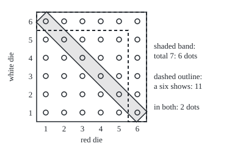
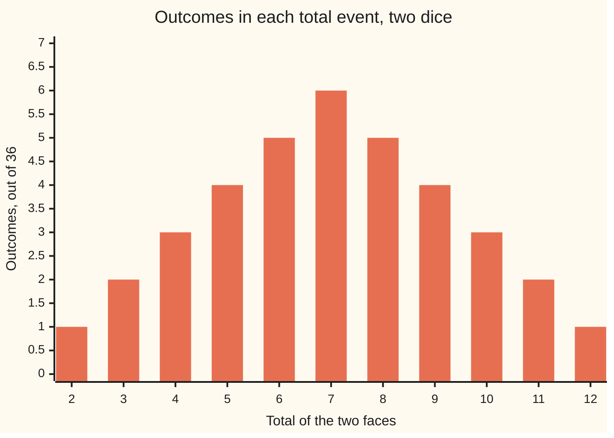

# Sample spaces and events: listing what can happen

Probability and statistics → Chance and Events → What can happen → Sample spaces and events

---

## General Overview

Two dice are thrown at a board game, a red one and a white one. Before anyone can say how likely a total of 7 is, someone must list what can happen.

Write each result as a pair: the red die first, the white die second. Red 3 with white 4 is (3,4). Red 4 with white 3 is (4,3), a different result. Six faces on red, six on white: 36 pairs in all. That list of every possible result is the **sample space**.

A question about the throw, such as "is the total 7?", is answered yes by some pairs and no by the rest. The yes-pairs are (1,6), (2,5), (3,4), (4,3), (5,2) and (6,1): six of the 36. That set of six is the **event** "total is 7". The event happens when the throw lands on any pair in it.

Once questions are sets, "and", "or" and "not" become set operations. "Total is 7 and a six shows" keeps the pairs in both sets: (1,6) and (6,1). "Total is 7 or a six shows" keeps the pairs in either: 15 of them. "Not total 7" keeps the other 30.

**List every complete result once, and every yes-or-no question about the throw becomes a subset of that list; and, or and not are then intersection, union and complement.**

**What kind of fact this is:** a definition, the one probability is built on; the rules for combining events are set identities, proved on this card in Why it works.

### The picture: the 36 outcomes, two events

Red die across, white die up. Each dot is one outcome.

<p align="center"></p>

The shaded band is the event "total is 7": six dots on one diagonal. The dashed outline is "a six shows": the top row and the right-hand column, 11 dots, since (6,6) sits in both. The two events share the two corner dots (1,6) and (6,1). Drawn to scale, 30 units to a face.

---

## The formula

Notation first, in words. The sample space gets a letter, $\Omega$, the Greek capital omega. One result in it is an **outcome**. A pair $(i, j)$ is one outcome: $i$ is the red die's face, $j$ the white die's. Bars count members: $\lvert A\rvert$ is how many outcomes the event $A$ holds.

$$\Omega = \{\,(i, j) \text{ for } i \text{ and } j \text{ each one of } 1, 2, 3, 4, 5, 6\,\}, \qquad \lvert \Omega\rvert = 36$$

$$A = \{\,(i, j) \text{ in } \Omega \text{ with } i + j = 7\,\} = \{(1,6), (2,5), (3,4), (4,3), (5,2), (6,1)\}, \qquad \lvert A\rvert = 6$$

**Read it aloud:** the sample space is every red-white pair; the event "total is 7" is the pairs whose faces add to 7, and there are six.

Events combine by the set operations of [set-operations](../../01-Foundations/07-Sets/03-set-operations.md). With $S$ the event "a six shows":

$$A \cap S = \{(1,6), (6,1)\}, \qquad A \cup S \text{ has } 15, \qquad \text{not } A \text{ has } 36 - 6 = 30$$

**Read it aloud:** "A and S" is the overlap, "A or S" is everything in either, "not A" is the rest of the sample space.

For a count of "or", the overlap must come off once, since it was counted in both ([inclusion-exclusion](../../01-Foundations/07-Sets/04-inclusion-exclusion.md)):

$$\lvert A \cup S\rvert = \lvert A\rvert + \lvert S\rvert - \lvert A \cap S\rvert = 6 + 11 - 2 = 15$$

Chances attach to events: $P(A)$, read "the chance of A" ([what-probability-means](01-what-probability-means.md)). With fair dice the 36 outcomes are equally likely, so $P(A)$ is 6 out of 36, 0.166667: about 1 throw in 6 totals 7. Why that division is licensed is [equally-likely-outcomes-and-counting](04-equally-likely-outcomes-and-counting.md).

| Symbol | Plain meaning | In our example | Push it up and the answer… |
| --- | --- | --- | --- |
| $\Omega$ | the sample space: every complete result, each listed once | the 36 red-white pairs | more outcomes, each one a smaller share |
| $i$, $j$, $(i, j)$ | the red face, the white face, and the outcome they make | (3,4), not the same as (4,3) | — |
| $A$ | the event "total is 7" | 6 outcomes | — |
| $S$ | the event "a six shows" | 11 outcomes | — |
| $D$ | the event "a double": both faces equal | 6 outcomes, none of them in $A$ | — |
| $s$ | a total, 2 to 12 | 7 | outcomes with that total rise to 6 at 7, then fall |
| $\lvert A\rvert$ | how many outcomes an event holds | 6 | the event takes a bigger share of $\Omega$ |
| $\cap$, $A \cap S$ | "A and S": outcomes in both | (1,6) and (6,1) | — |
| $\cup$, $A \cup S$ | "A or S": outcomes in either, or both | 15 | — |
| not $A$ | outcomes of $\Omega$ outside $A$ | 30 | shrinks as $A$ grows |
| $P$ | the chance attached to an event | $P(A)$ = 6/36 | — |

### When it holds

This is a definition, so nothing can fail; what can fail is a badly chosen list. Three demands on the list:

- **Exhaustive.** Every possible result is on it. Leave out the doubles and a throw of (3,3) lands nowhere.
- **Exclusive.** Every throw lands on exactly one outcome. List "a 3 shows" and "a 4 shows" as outcomes and (3,4) lands on both.
- **Fine enough.** Every question to be asked must be a subset. List only the 11 totals and "a six shows" is no event: total 7 holds (1,6) and (3,4), one with a six and one without.

A fourth demand is optional: outcomes equally likely, when counting is to give chances. The red-white pairs pass it. The 21 unordered pairs and the 11 totals are honest lists that fail it.

---

## Why it works

### Step 0: an outcome is a complete answer

An outcome answers every question about the throw at once. Told "(3,4)", anyone can say the total, whether a six showed, whether it was a double. Told only "total 7", nobody can say whether a six showed. That is why the sample space is built from complete answers.

### Step 1: a question is a set of outcomes

Take any yes-or-no question about the throw. Go down the 36 outcomes and mark each one yes or no. The marked set is the event. The event happens exactly when the throw lands on a marked outcome.

Two questions that mark the same outcomes are the same event, however worded.

### Step 2: and, or, not are intersection, union, complement

An outcome says yes to "A and S" when it says yes to both, so it sits in both sets: the intersection. It says yes to "A or S" when it says yes to at least one: the union. "Or" here always includes both. It says yes to "not A" when it is in $\Omega$ but outside $A$: the complement.

### Step 3: counting a combination

For "and", count the overlap directly: two outcomes, (1,6) and (6,1). For "or", add and take the overlap off once: 6 + 11 − 2 = 15. When two events share nothing they are **disjoint**, the overlap is zero, and counts simply add. "Total is 7" and "a double" are disjoint: a double's total is twice one face, always even, and 7 is odd.

"And" and "or" swap places as they cross a "not". Being outside "A or S" means being outside $A$ and outside $S$, so

$$\text{not } (A \cup S) = (\text{not } A) \cap (\text{not } S)$$

which here is 21 outcomes both ways. That is De Morgan's law ([logical-equivalence-and-de-morgan](../../01-Foundations/05-Logic/03-logical-equivalence-and-de-morgan.md)), in dice.

### Step 4: every subset is an event, including two odd ones

On a finite sample space, any subset of $\Omega$ can be an event. Each of the 36 outcomes is in or out, so there are $2^{36}$ = 68,719,476,736 events. The empty set is the **impossible event**, "the total exceeds 12"; the whole of $\Omega$ is the **certain event**.

### Step 5: some events split the space into pieces

The 11 events "total is $s$", for $s$ from 2 to 12, share no outcome and together cover all 36: a **partition**. Its counts are 1, 2, 3, 4, 5, 6, 5, 4, 3, 2, 1: for a total $s$, the number of outcomes is 6 minus the distance from $s$ to 7.

That is why the totals fail as a sample space: "a six shows" cuts through the blocks for totals 7, 8, 9 and 10, and a question that cuts a block cannot be answered from the block's name.

<details>
<summary>Detailed proof</summary>

**The operations are the logic of the questions.** For any outcome in $\Omega$: it is in $A \cap S$ exactly when it is in $A$ and in $S$; in $A \cup S$ exactly when it is in at least one; in not $A$ exactly when it is not in $A$. So each set operation gives the event whose yes-outcomes are the combined question's yes-outcomes.

**De Morgan.** An outcome is in not $(A \cup S)$ exactly when it is in neither set. That is exactly when it is outside $A$ and outside $S$, which is membership in (not $A$) $\cap$ (not $S$). Same members, same set. Swapping the roles of and and or gives not $(A \cap S)$ = (not $A$) $\cup$ (not $S$).

**The union count.** Split $A \cup S$ into three pieces that share nothing: in $A$ only, in both, in $S$ only. Then $\lvert A\rvert$ counts the first two pieces and $\lvert S\rvert$ the last two, so their sum counts "both" twice. Subtract it once: $\lvert A \cup S\rvert = \lvert A\rvert + \lvert S\rvert - \lvert A \cap S\rvert$.

**The number of events.** Choose, outcome by outcome, whether it is in. Each of the 36 choices has 2 options, and different choices give different sets, so there are 2 × 2 × … × 2, 36 factors, which is $2^{36}$.

**The totals.** For a red face $i$, a total $s$ needs white face $s - i$, which must lie between 1 and 6. For $s$ = 7 every red face from 1 to 6 has its partner, so the count is 6. Each step of $s$ away from 7 loses one red face at the edge, so the count is 6 minus the distance from $s$ to 7.

</details>

A second road to the same list: throw red first, then white, and draw each throw as a branch. Six branches, each splitting six ways, give 36 leaves, one per ordered pair. That is the set of ordered pairs from [ordered-pairs-and-cartesian-product](../../01-Foundations/07-Sets/05-ordered-pairs-and-cartesian-product.md), and the tree carries chances on its branches in [conditional-probability](05-conditional-probability.md).

### The picture: the partition by totals



Each bar is one event; the bars add to 36 because the events cover $\Omega$ without overlap. The tallest bar is total 7.

---

## Worked numbers, by hand

| Step | Arithmetic | Value |
| --- | --- | --- |
| the sample space | 6 red faces × 6 white faces | 36 |
| total is 7 | one white partner, 7 − $i$, for each red face | **6** |
| a six shows | 6 with red six + 6 with white six − (6,6) counted twice | 11 |
| total 7 and a six | (1,6) and (6,1) | 2 |
| total 7 or a six | 6 + 11 − 2 | **15** |
| not total 7 | 36 − 6 | 30 |
| neither | 36 − 15 | 21 |
| total 7 and a double | 7 is odd, a double's total is even | 0 |

Six outcomes of 36 total 7: with fair dice, about 1 throw in 6 (0.166667). A simulated 100,000 throws gave 0.164770, with standard error 0.001173 (the typical distance between such a share and the true chance), which sits 1.6 standard errors from 1/6.

### What breaks if you drop a piece

| Mistake | Comes out at | What went wrong |
| --- | --- | --- |
| The 11 totals as equally likely outcomes | 1/11 = 0.090909 for a 7; the simulation sits 63.0 standard errors away | The totals are events of different sizes, 1 to 6 outcomes each |
| The 21 unordered pairs as equally likely | 3/21 = 0.142857; 18.7 standard errors away | "A 3 and a 4" happens two ways, (3,4) and (4,3): simulated 0.055900 against 0.028330 for two 3s |
| "Or" by adding | 6 + 11 = 17, not 15 | (1,6) and (6,1) counted twice |
| "A six shows" as 6 + 6 | 12, not 11 | (6,6) counted twice |

The code prints all four.

---

## Code, from first principles, and it actually runs

Nothing is imported. Three roads reach the counts. Road one lists the 36 outcomes and tests each against the question. Road two stores each event as 36 on-off bits, one per outcome, and forms "and", "or" and "not" with the machine's bitwise operations, without ever looking at a total. Road three throws simulated dice from a SplitMix64 generator (a short, standard recipe for pseudo-random numbers) written out in both languages with seed 20260928, so both print the same draws. The code calls the red die the first die and the white die the second. The asserts pit the listing against the rule, the bits against the listing and against inclusion-exclusion, and the simulated share against 6/36, within four standard errors.

### Python

```python
# Sample spaces and events -- the check behind the card.  Nothing is imported.
# Two dice, first and second: the sample space is the 36 ordered pairs.
# An event is a subset.  Road 1 lists outcomes and tests each one.  Road 2
# stores each event as 36 on/off bits and combines events with bit operations.
# Road 3 rolls dice with a SplitMix64 generator written out here.
FACES = range(1, 7)
OMEGA = [(i, j) for i in FACES for j in FACES]          # first die i, second die j
FULL = (1 << 36) - 1

def bit(i, j):                           # outcome (i, j) -> its bit position
    return 6 * (i - 1) + (j - 1)

def mask(test):                          # road 2: an event as 36 bits
    m = 0
    for i, j in OMEGA:
        if test(i, j):
            m |= 1 << bit(i, j)
    return m

def ones(m):
    return bin(m).count("1")

def seven(i, j): return i + j == 7
def six(i, j): return i == 6 or j == 6
def double(i, j): return i == j

def show(outs):
    return " ".join(f"({i},{j})" for i, j in outs)

A = [w for w in OMEGA if seven(*w)]                      # road 1: listing
S = [w for w in OMEGA if six(*w)]
D = [w for w in OMEGA if double(*w)]
mA, mS, mD = mask(seven), mask(six), mask(double)
print(f"sample space: {len(OMEGA)} ordered pairs (first die, second die)")
print(f"A  total is 7     {len(A):2d} outcomes: {show(A)}")
print(f"S  a six shows    {len(S):2d} outcomes")
print(f"D  a double       {len(D):2d} outcomes")
partner = sum(1 for i in FACES if 1 <= 7 - i <= 6)       # one partner per first die
print(f"|A| by listing {len(A)}; by one partner per first die {partner}")
by_list = [sum(1 for i, j in OMEGA if i + j == s) for s in range(2, 13)]
by_rule = [6 - abs(s - 7) for s in range(2, 13)]
print("totals 2..12, by listing:     " + " ".join(str(c) for c in by_list))
print("totals 2..12, by 6 - |s - 7|: " + " ".join(str(c) for c in by_rule))
tot = [mask(lambda i, j, s=s: i + j == s) for s in range(2, 13)]
cover, overlap = 0, 0
for m in tot:
    overlap += ones(cover & m)
    cover |= m
print(f"the 11 total events cover {ones(cover)} outcomes and overlap in {overlap}")

AandS = [w for w in OMEGA if seven(*w) and six(*w)]
AorS = [w for w in OMEGA if seven(*w) or six(*w)]
notA = [w for w in OMEGA if not seven(*w)]
nor1 = [w for w in OMEGA if not (seven(*w) or six(*w))]
nor2 = [w for w in OMEGA if (not seven(*w)) and (not six(*w))]
print(f"A and S  listing {len(AandS):2d}, bits {ones(mA & mS):2d}: {show(AandS)}")
print(f"A or S   listing {len(AorS):2d}, bits {ones(mA | mS):2d}, "
      f"inclusion-exclusion {len(A)} + {len(S)} - {len(AandS)} = {len(A) + len(S) - len(AandS)}")
print(f"not A    listing {len(notA):2d}, bits {ones(FULL ^ mA):2d}")
print(f"A and D  listing {sum(1 for w in OMEGA if seven(*w) and double(*w)):2d}, bits {ones(mA & mD):2d}")
print(f"not (A or S) {len(nor1)}; (not A) and (not S) {len(nor2)}; "
      f"bits {ones(FULL ^ (mA | mS))} and {ones((FULL ^ mA) & (FULL ^ mS))}")
events = 1
for _ in OMEGA:
    events *= 2                          # each outcome is in or out
print(f"events on this space: 2^36 = {events}; largest bit pattern + 1 = {FULL + 1}")
split = [s for s, m in zip(range(2, 13), tot) if m & mS and m & (FULL ^ mS)]
print("totals that 'a six shows' splits: " + " ".join(str(s) for s in split))

state = 20260928                         # road 3: SplitMix64, seed stated
def next64():
    global state
    state = (state + 0x9E3779B97F4A7C15) & 0xFFFFFFFFFFFFFFFF
    z = state
    z = ((z ^ (z >> 30)) * 0xBF58476D1CE4E5B9) & 0xFFFFFFFFFFFFFFFF
    z = ((z ^ (z >> 27)) * 0x94D049BB133111EB) & 0xFFFFFFFFFFFFFFFF
    return z ^ (z >> 31)

N = 100000
hit7 = hit34 = hit33 = hitS = 0
for _ in range(N):
    i, j = next64() % 6 + 1, next64() % 6 + 1
    hit7 += i + j == 7
    hit34 += (i, j) in ((3, 4), (4, 3))
    hit33 += (i, j) == (3, 3)
    hitS += i == 6 or j == 6
p7 = hit7 / N
se = (p7 * (1 - p7) / N) ** 0.5
print(f"simulation: {N} rolls, SplitMix64 seed 20260928")
print(f"  share with total 7   {p7:.6f}, standard error {se:.6f}")
print(f"  exact 6/36           {6 / 36:.6f}, {abs(p7 - 6 / 36) / se:.1f} standard errors away")
print(f"  share a six shows    {hitS / N:.6f}; exact 11/36 {11 / 36:.6f}")
print(f"  share a 3 and a 4    {hit34 / N:.6f}; share two 3s {hit33 / N:.6f}")
for name, wrong in (("11 totals, equally likely: 1/11", 1 / 11),
                    ("21 unordered pairs, equally likely: 3/21", 3 / 21)):
    print(f"mistake, {name} = {wrong:.6f}, {abs(p7 - wrong) / se:.1f} standard errors away")
print(f"mistake, A or S by adding: {len(A)} + {len(S)} = {len(A) + len(S)}, not {len(AorS)}")
print(f"mistake, a six shows as 6 + 6 = {6 + 6}, not {len(S)}: (6,6) counted twice")

xy = [(45 + 30 * i, 215 - 30 * j) for i, j in A]         # figure: to scale, 30 units a face
print("figure, total-7 dots: " + " ".join(f"({x},{y})" for x, y in xy))
print(f"figure, grid (60,20) to (240,200); a six shows: column x {45 + 30 * 6 - 15}..{45 + 30 * 6 + 15}, "
      f"row y {215 - 30 * 6 - 15}..{215 - 30 * 6 + 15}")

assert by_list == by_rule and len(A) == partner == 6                  # listing vs rule
assert ones(mA | mS) == len(AorS) == len(A) + len(S) - len(AandS) == 15
assert len(nor1) == ones((FULL ^ mA) & (FULL ^ mS)) == 21             # De Morgan, two roads
assert ones(cover) == 36 and overlap == 0 and events == FULL + 1
assert abs(p7 - 6 / 36) < 4 * se and abs(p7 - 1 / 11) > 20 * se      # simulation vs counts
print("ALL CHECKS PASS")
```

**Ran 2026-09-28 on macOS, Python 3.14.6, standard library only. All checks passed. Output, pasted from the run:**

```
sample space: 36 ordered pairs (first die, second die)
A  total is 7      6 outcomes: (1,6) (2,5) (3,4) (4,3) (5,2) (6,1)
S  a six shows    11 outcomes
D  a double        6 outcomes
|A| by listing 6; by one partner per first die 6
totals 2..12, by listing:     1 2 3 4 5 6 5 4 3 2 1
totals 2..12, by 6 - |s - 7|: 1 2 3 4 5 6 5 4 3 2 1
the 11 total events cover 36 outcomes and overlap in 0
A and S  listing  2, bits  2: (1,6) (6,1)
A or S   listing 15, bits 15, inclusion-exclusion 6 + 11 - 2 = 15
not A    listing 30, bits 30
A and D  listing  0, bits  0
not (A or S) 21; (not A) and (not S) 21; bits 21 and 21
events on this space: 2^36 = 68719476736; largest bit pattern + 1 = 68719476736
totals that 'a six shows' splits: 7 8 9 10
simulation: 100000 rolls, SplitMix64 seed 20260928
  share with total 7   0.164770, standard error 0.001173
  exact 6/36           0.166667, 1.6 standard errors away
  share a six shows    0.305410; exact 11/36 0.305556
  share a 3 and a 4    0.055900; share two 3s 0.028330
mistake, 11 totals, equally likely: 1/11 = 0.090909, 63.0 standard errors away
mistake, 21 unordered pairs, equally likely: 3/21 = 0.142857, 18.7 standard errors away
mistake, A or S by adding: 6 + 11 = 17, not 15
mistake, a six shows as 6 + 6 = 12, not 11: (6,6) counted twice
figure, total-7 dots: (75,35) (105,65) (135,95) (165,125) (195,155) (225,185)
figure, grid (60,20) to (240,200); a six shows: column x 210..240, row y 20..50
ALL CHECKS PASS
```

### Rust

Same numbers, same labels, built with `rustc --edition 2021 -O`.

```rust
// Sample spaces and events -- the same check as the Python, in Rust.  No crates.
// Two dice, first and second: the sample space is the 36 ordered pairs.
// An event is a subset.  Road 1 lists outcomes and tests each one.  Road 2
// stores each event as 36 on/off bits and combines events with bit operations.
// Road 3 rolls dice with a SplitMix64 generator written out here.
const FULL: u64 = (1u64 << 36) - 1;

fn omega() -> Vec<(i64, i64)> {                 // first die i, second die j
    let mut v = Vec::new();
    for i in 1..=6 { for j in 1..=6 { v.push((i, j)) } }
    v
}

fn bit(i: i64, j: i64) -> u32 { (6 * (i - 1) + (j - 1)) as u32 }

fn mask(test: &dyn Fn(i64, i64) -> bool) -> u64 {   // road 2: an event as 36 bits
    let mut m = 0u64;
    for (i, j) in omega() { if test(i, j) { m |= 1u64 << bit(i, j) } }
    m
}

fn ones(m: u64) -> u32 { m.count_ones() }
fn seven(i: i64, j: i64) -> bool { i + j == 7 }
fn six(i: i64, j: i64) -> bool { i == 6 || j == 6 }
fn double(i: i64, j: i64) -> bool { i == j }

fn show(outs: &[(i64, i64)]) -> String {
    outs.iter().map(|(i, j)| format!("({},{})", i, j)).collect::<Vec<_>>().join(" ")
}

fn list(test: &dyn Fn(i64, i64) -> bool) -> Vec<(i64, i64)> {  // road 1: listing
    omega().into_iter().filter(|&(i, j)| test(i, j)).collect()
}

struct SplitMix64 { state: u64 }                 // road 3: SplitMix64, seed stated
impl SplitMix64 {
    fn next(&mut self) -> u64 {
        self.state = self.state.wrapping_add(0x9E3779B97F4A7C15);
        let mut z = self.state;
        z = (z ^ (z >> 30)).wrapping_mul(0xBF58476D1CE4E5B9);
        z = (z ^ (z >> 27)).wrapping_mul(0x94D049BB133111EB);
        z ^ (z >> 31)
    }
}

fn main() {
    let om = omega();
    let (a, s, d) = (list(&seven), list(&six), list(&double));
    let (ma, ms, md) = (mask(&seven), mask(&six), mask(&double));
    println!("sample space: {} ordered pairs (first die, second die)", om.len());
    println!("A  total is 7     {:2} outcomes: {}", a.len(), show(&a));
    println!("S  a six shows    {:2} outcomes", s.len());
    println!("D  a double       {:2} outcomes", d.len());
    let partner = (1..=6).filter(|i| (1..=6).contains(&(7 - i))).count();
    println!("|A| by listing {}; by one partner per first die {}", a.len(), partner);
    let by_list: Vec<i64> = (2..=12).map(|t| om.iter().filter(|&&(i, j)| i + j == t).count() as i64).collect();
    let by_rule: Vec<i64> = (2..=12).map(|t: i64| 6 - (t - 7).abs()).collect();
    let join = |v: &Vec<i64>| v.iter().map(|c| c.to_string()).collect::<Vec<_>>().join(" ");
    println!("totals 2..12, by listing:     {}", join(&by_list));
    println!("totals 2..12, by 6 - |s - 7|: {}", join(&by_rule));
    let tot: Vec<u64> = (2..=12).map(|t| mask(&move |i, j| i + j == t)).collect();
    let (mut cover, mut overlap) = (0u64, 0u32);
    for &m in &tot { overlap += ones(cover & m); cover |= m; }
    println!("the 11 total events cover {} outcomes and overlap in {}", ones(cover), overlap);

    let a_and_s = list(&|i, j| seven(i, j) && six(i, j));
    let a_or_s = list(&|i, j| seven(i, j) || six(i, j));
    let not_a = list(&|i, j| !seven(i, j));
    let nor1 = list(&|i, j| !(seven(i, j) || six(i, j)));
    let nor2 = list(&|i, j| !seven(i, j) && !six(i, j));
    println!("A and S  listing {:2}, bits {:2}: {}", a_and_s.len(), ones(ma & ms), show(&a_and_s));
    println!("A or S   listing {:2}, bits {:2}, inclusion-exclusion {} + {} - {} = {}",
             a_or_s.len(), ones(ma | ms), a.len(), s.len(), a_and_s.len(), a.len() + s.len() - a_and_s.len());
    println!("not A    listing {:2}, bits {:2}", not_a.len(), ones(FULL ^ ma));
    println!("A and D  listing {:2}, bits {:2}", list(&|i, j| seven(i, j) && double(i, j)).len(), ones(ma & md));
    println!("not (A or S) {}; (not A) and (not S) {}; bits {} and {}",
             nor1.len(), nor2.len(), ones(FULL ^ (ma | ms)), ones((FULL ^ ma) & (FULL ^ ms)));
    let mut events: u64 = 1;
    for _ in &om { events *= 2 }                  // each outcome is in or out
    println!("events on this space: 2^36 = {}; largest bit pattern + 1 = {}", events, FULL + 1);
    let split: Vec<i64> = (2..=12).zip(tot.iter())
        .filter(|&(_, &m)| m & ms != 0 && m & (FULL ^ ms) != 0).map(|(t, _)| t).collect();
    println!("totals that 'a six shows' splits: {}", join(&split));

    let mut rng = SplitMix64 { state: 20260928 };
    let n: u64 = 100000;
    let (mut hit7, mut hit34, mut hit33, mut hit_s) = (0u64, 0u64, 0u64, 0u64);
    for _ in 0..n {
        let i = (rng.next() % 6 + 1) as i64;
        let j = (rng.next() % 6 + 1) as i64;
        if i + j == 7 { hit7 += 1 }
        if (i, j) == (3, 4) || (i, j) == (4, 3) { hit34 += 1 }
        if (i, j) == (3, 3) { hit33 += 1 }
        if i == 6 || j == 6 { hit_s += 1 }
    }
    let nf = n as f64;
    let p7 = hit7 as f64 / nf;
    let se = (p7 * (1.0 - p7) / nf).sqrt();
    println!("simulation: {} rolls, SplitMix64 seed 20260928", n);
    println!("  share with total 7   {:.6}, standard error {:.6}", p7, se);
    println!("  exact 6/36           {:.6}, {:.1} standard errors away", 6.0 / 36.0, (p7 - 6.0 / 36.0).abs() / se);
    println!("  share a six shows    {:.6}; exact 11/36 {:.6}", hit_s as f64 / nf, 11.0 / 36.0);
    println!("  share a 3 and a 4    {:.6}; share two 3s {:.6}", hit34 as f64 / nf, hit33 as f64 / nf);
    for (name, wrong) in [("11 totals, equally likely: 1/11", 1.0 / 11.0),
                          ("21 unordered pairs, equally likely: 3/21", 3.0 / 21.0)] {
        println!("mistake, {} = {:.6}, {:.1} standard errors away", name, wrong, (p7 - wrong).abs() / se);
    }
    println!("mistake, A or S by adding: {} + {} = {}, not {}", a.len(), s.len(), a.len() + s.len(), a_or_s.len());
    println!("mistake, a six shows as 6 + 6 = {}, not {}: (6,6) counted twice", 6 + 6, s.len());

    let xy: Vec<String> = a.iter().map(|&(i, j)| format!("({},{})", 45 + 30 * i, 215 - 30 * j)).collect();
    println!("figure, total-7 dots: {}", xy.join(" "));
    println!("figure, grid (60,20) to (240,200); a six shows: column x {}..{}, row y {}..{}",
             45 + 30 * 6 - 15, 45 + 30 * 6 + 15, 215 - 30 * 6 - 15, 215 - 30 * 6 + 15);

    assert!(by_list == by_rule && a.len() == partner && partner == 6);   // listing vs rule
    assert!(ones(ma | ms) as usize == a_or_s.len() && a_or_s.len() == a.len() + s.len() - a_and_s.len() && a_or_s.len() == 15);
    assert!(nor1.len() == ones((FULL ^ ma) & (FULL ^ ms)) as usize && nor1.len() == 21);  // De Morgan
    assert!(ones(cover) == 36 && overlap == 0 && events == FULL + 1);
    assert!((p7 - 6.0 / 36.0).abs() < 4.0 * se && (p7 - 1.0 / 11.0).abs() > 20.0 * se);
    println!("ALL CHECKS PASS");
}
```

**Ran 2026-09-28 on macOS, rustc 1.98.1, no crates. All checks passed. Output, pasted from the run:**

```
sample space: 36 ordered pairs (first die, second die)
A  total is 7      6 outcomes: (1,6) (2,5) (3,4) (4,3) (5,2) (6,1)
S  a six shows    11 outcomes
D  a double        6 outcomes
|A| by listing 6; by one partner per first die 6
totals 2..12, by listing:     1 2 3 4 5 6 5 4 3 2 1
totals 2..12, by 6 - |s - 7|: 1 2 3 4 5 6 5 4 3 2 1
the 11 total events cover 36 outcomes and overlap in 0
A and S  listing  2, bits  2: (1,6) (6,1)
A or S   listing 15, bits 15, inclusion-exclusion 6 + 11 - 2 = 15
not A    listing 30, bits 30
A and D  listing  0, bits  0
not (A or S) 21; (not A) and (not S) 21; bits 21 and 21
events on this space: 2^36 = 68719476736; largest bit pattern + 1 = 68719476736
totals that 'a six shows' splits: 7 8 9 10
simulation: 100000 rolls, SplitMix64 seed 20260928
  share with total 7   0.164770, standard error 0.001173
  exact 6/36           0.166667, 1.6 standard errors away
  share a six shows    0.305410; exact 11/36 0.305556
  share a 3 and a 4    0.055900; share two 3s 0.028330
mistake, 11 totals, equally likely: 1/11 = 0.090909, 63.0 standard errors away
mistake, 21 unordered pairs, equally likely: 3/21 = 0.142857, 18.7 standard errors away
mistake, A or S by adding: 6 + 11 = 17, not 15
mistake, a six shows as 6 + 6 = 12, not 11: (6,6) counted twice
figure, total-7 dots: (75,35) (105,65) (135,95) (165,125) (195,155) (225,185)
figure, grid (60,20) to (240,200); a six shows: column x 210..240, row y 20..50
ALL CHECKS PASS
```

The two outputs match line for line.

> [!TIP]
> **Try changing**
> Guess first, then run it. The asserts are pinned to two fair dice and the total 7, so expect one to stop the program.
> - **Ask about 8 instead.** In `seven`, change `7` to `8`. The listing finds 5 outcomes while the partner count still finds 6, and the first assert stops it.
> - **Shrink "a six shows" to "both show six".** Change `or` to `and` in `six`. $S$ drops to the single outcome (6,6), "A or S" falls to 7, and the second assert stops it.
> - **Load the dice.** Change both `% 6 + 1` to `% 5 + 1`, so no die shows a six. The true chance of 7 becomes 4/25 = 0.16; the simulated share lands about five standard errors from 1/6, and the last assert stops it.

---

## The usual mistake

> [!warning]
> **Listing what can be seen instead of what can happen.** Two identical dice look like they give 21 results, (3,4) and (4,3) being indistinguishable. They are still two dice. The throw "a 3 and a 4" happens two ways and "two 3s" one way, and the simulation shows it: 0.055900 against 0.028330. Counting the 21 as equals gives 3/21 = 0.142857 for a 7, not 1/6.
>
> - **Totals as outcomes.** The list 2 to 12 is exhaustive and exclusive, but its entries are events of 1 to 6 outcomes each. Treating them as equal gives 1/11 = 0.090909 for a 7.
> - **"Or" as adding.** "Total 7 or a six" is 15 outcomes, not 17: the two shared outcomes come off once.
> - **Disjoint read as unrelated.** "Total 7" and "a double" share no outcome, so one happening rules the other out: the opposite of unrelated. [independence](07-independence.md) draws the line.

---

## Where you meet it in real life

- **Board games.** Games that punish a total of 7 rely on its being the largest event among the totals: 6 outcomes of 36, against 1 each for 2 and 12.
- **Search filters and databases.** A query "in stock AND on sale AND NOT refurbished" is an intersection and a complement taken over the rows of a table. The table is the sample space.
- **Medical screening.** A test result and a patient's condition give the outcomes ill and positive, ill and negative, well and positive, well and negative. "Positive" is the event made of the first and third, and [bayes-rule](06-bayes-rule.md) turns it round.

> **Say it back**
> A sample space lists every complete result once, like the 36 red-white pairs of two dice. An event is a yes-or-no question written as the set of outcomes that answer yes; "total is 7" is six pairs. "And" is the overlap, "or" is everything in either, "not" is the rest of the sample space. Counting "or" takes the overlap off once: 6 + 11 − 2 = 15. The list must be fine enough that every question is a subset, and equally likely outcomes are what let a count become a chance.

---

## What this builds on

- [what-probability-means](01-what-probability-means.md): what a chance is, and the notation $P(A)$ this card attaches to events.
- [sets-and-membership](../../01-Foundations/07-Sets/01-sets-and-membership.md): a set as the answer to one membership question.
- [set-operations](../../01-Foundations/07-Sets/03-set-operations.md): union, intersection and complement, here renamed or, and, not.

## Where this goes next

- [probability-rules-and-complements](03-probability-rules-and-complements.md): the counts on this card become chances, and "not A" gets its symbol and its rule.
- [random-variables-and-distributions](../02-Random%20Variables/01-random-variables-and-distributions.md): the total is a number read off each outcome, and the bar chart above is its distribution.

The events are now sets that can be counted and combined; what rules any assignment of chances to them must obey, fair dice or not, is the question the rules card answers.

---

## Sources

Verified 28 Sep 2026: every link below opens a page that names the cited work.

- Grinstead, Charles M., and J. Laurie Snell. *Introduction to Probability*, 2nd rev. ed. American Mathematical Society, 1997. [Full text, Dartmouth](https://math.dartmouth.edu/~prob/prob/prob.pdf). Chapter 1 sets out sample spaces and events with dice.
- Blitzstein, Joseph K., and Jessica Hwang. *Introduction to Probability*, 2nd ed. CRC Press, 2019. [Publisher page](https://www.routledge.com/Introduction-to-Probability-Second-Edition/Blitzstein-Hwang/p/book/9781138369917). Chapter 1 translates English statements about events into set operations.
- Illowsky, Barbara, and Susan Dean. *Introductory Statistics 2e*, section 3.1, "Terminology." OpenStax, Rice University. [Textbook page](https://openstax.org/books/introductory-statistics-2e/pages/3-1-terminology). Sample spaces listed by hand, with "and", "or" and complements.
- Iyer, Gautam. "Probability spaces and random variables." Carnegie Mellon University, 21-425 course notes. [Notes](https://www.math.cmu.edu/~gautam/c/2026-425/notes/probability-spaces.html). The general definition for readers heading toward infinite sample spaces.
