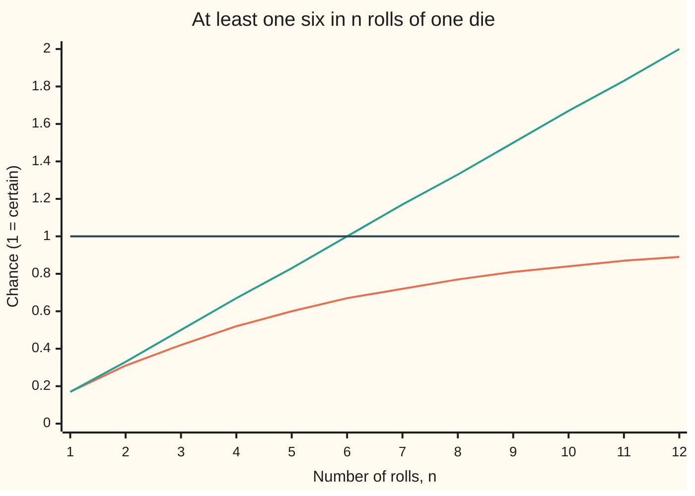
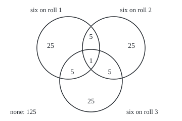

# The rules: adding probabilities of separate events, and one minus for the complement

[Syllabus](../../../SYLLABUS.md) → [Probability and statistics](../../../SYLLABUS.md#w09) → [Chance and Events](../../../SYLLABUS.md#w09-s01) → The rules

---

## General Overview

A French gambler of the 1650s, the Chevalier de Méré, played an even-money bet (a win pays the stake, a loss forfeits it): roll one die four times, and the thrower wins if a six shows at least once. Each roll shows a six one time in six. Four rolls, four chances of one in six: the tempting sum is four sixths, 0.6667, a comfortable favourite.

That sum is wrong. A game with two sixes is counted twice, and at seven rolls the sum reaches 1.1667, more than certain. The true chance is 0.517747. The bet is still a winner, about 52 games in 100, but only just.

The right number comes from turning the question round. "At least one six" fails in exactly one way: no six at all. Of the 1296 equally likely ways four rolls can fall, 625 contain no six. So 671 contain one, and the chance is 671/1296.

**Chances of separate events add; "not A" has chance one minus the chance of A; and when events overlap, adding them counts the overlap twice, so it is subtracted back.**

**What kind of fact this is:** additivity is an axiom, part of the definition of probability; the complement rule and inclusion–exclusion are theorems, proved on this card in Why it works.

### The picture: the true chance against the added-up chance



The orange curve is the true chance, one minus five sixths to the power n. The green line adds one sixth per roll. The dark flat line is certainty. The two agree at one roll, part at two, and the added-up line crosses certainty at seven rolls, which no chance can do.

---

## The formula

Notation first, in words. From [Sample spaces and events](02-sample-spaces-and-events.md): $\Omega$ is the sample space, the list of every possible outcome; an event is a set of outcomes; $P(A)$ is read "the chance of A". Union and intersection come from the sets wing: $A \cup B$ is "A or B or both", $A \cap B$ is "A and B together". The one new piece: $A^c$, read "not A", is the **complement** of A, every outcome in $\Omega$ that is not in A. The small c stands for complement.

Two events are **separate** (the textbook word is *disjoint*) when they share no outcome: $A \cap B = \varnothing$, the empty event.

**Additivity** (the axiom):

$$P(A \cup B) = P(A) + P(B) \quad \text{when } A \cap B = \varnothing$$

**Read it aloud:** if two events cannot happen together, the chance that one or the other happens is the sum of their chances.

**The complement rule:**

$$P(A^c) = 1 - P(A)$$

**Read it aloud:** the chance that A fails is one minus the chance that it happens.

**Inclusion–exclusion** for two events, then three:

$$P(A \cup B) = P(A) + P(B) - P(A \cap B)$$

$$P(A \cup B \cup C) = P(A) + P(B) + P(C) - P(A \cap B) - P(A \cap C) - P(B \cap C) + P(A \cap B \cap C)$$

**Read it aloud:** add the single chances, subtract every overlap of two, and add back the overlap of all three.

On the gambler's bet, with $S_1$ to $S_4$ the events "six on roll 1" to "six on roll 4":

$$P(\text{at least one six}) = 1 - P(\text{no six}) = 1 - \left(\tfrac{5}{6}\right)^4 = 1 - \tfrac{625}{1296} = \tfrac{671}{1296} = 0.517747$$

| Symbol | Plain meaning | In our example | Push it up and the answer… |
| --- | --- | --- | --- |
| $\Omega$ | the sample space: every possible outcome | the 1296 sequences of four rolls | — |
| $A$, $B$, $C$ | events: sets of outcomes | "six on roll 1", "six on roll 2" | a bigger event never has a smaller chance |
| $P(A)$ | the chance of A, from 0 to 1 | $P(S_1)$ = 216/1296, one in six | the complement's chance falls by the same amount |
| $A^c$ | not A: every outcome outside A | "no six at all" is the complement of "at least one six" | — |
| $A \cup B$ | A or B or both | "a six on roll 1 or roll 2" | — |
| $A \cap B$ | A and B together | "sixes on both roll 1 and roll 2", 36 sequences | the more overlap, the more the plain sum overshoots |
| $\varnothing$ | the empty event, no outcomes | "a seven on a six-sided die" | — |
| $S_1$, $S_2$, $S_3$, $S_4$ | six on roll 1, 2, 3, 4 | 216 sequences each | — |
| $n$ | number of rolls | 4 | the chance of at least one six climbs toward 1 |

### When it holds

- **Separate events, for plain adding.** Additivity needs no shared outcome. Add "six on roll 1" and "six on roll 2" as if separate and the game with two sixes is counted twice: four such events give 0.6667, and seven give 1.1667.
- **The complement of the right event, inside $\Omega$.** The complement of "at least one six" is "no six". "Not every roll a six" is a different event, with chance 0.9992.
- **Chances that total 1.** The rules assume $P(\Omega) = 1$; a table of chances summing to anything else is no probability, and its complements mean nothing.
- **No independence needed.** The rules hold whether or not events influence each other; independence enters only when a joint chance is found by multiplying ([Independence](07-independence.md)).

---

## Why it works

### Step 0: a chance is a share of a fixed total

Picture the total chance, 1, as a heap of sand spread over the outcomes. An event's chance is the sand lying on its outcomes. From here on the sand is called **probability**, and the rules below are bookkeeping about where it lies.

On a finite sample space, $P(A)$ is the sum of the weights of A's outcomes, and all weights sum to 1; [Probability](01-what-probability-means.md) says where weights come from. Andrey Kolmogorov took three statements as the definition of probability in 1933: every chance is at least 0, $P(\Omega) = 1$, and separate events add, even along an endless list (that case matters from wing 10 on). Every rule on this card follows from those three.

### Step 1: separate events add

If A and B share no outcome, the sand on $A \cup B$ is the sand on A plus the sand on B, nothing counted twice. That is additivity, and it extends to any finite list of separate events one at a time.

On the dice, split "at least one six" by where the first six lands. First six on roll 1: 216 sequences. First six on roll 2 (roll 1 not a six): 5 × 36 = 180. On roll 3: 25 × 6 = 150. On roll 4: 125. These four events are separate, since a game has only one first six, so they add: 216 + 180 + 150 + 125 = 671, by additivity alone.

### Step 2: the complement rule

A and $A^c$ share no outcome, and together they are all of $\Omega$. Additivity then gives $P(A) + P(A^c) = P(\Omega) = 1$. Subtract $P(A)$ from both sides: $P(A^c) = 1 - P(A)$.

Two by-products drop out. With $A = \Omega$, the complement is $\varnothing$, so $P(\varnothing) = 0$. And since $P(A^c)$ is at least 0, $P(A)$ is at most 1: the range 0 to 1 is a consequence, not an extra rule. The same split gives **monotonicity**: if every outcome of A is in B, then B is A plus the separate piece "B without A", so $P(A) \le P(B)$.

The rule pays off when "at least one" is a union of overlapping events and "none" is one clean event: here, all four rolls from the faces one to five, 625 sequences. So the chance is 1 − 625/1296 = 671/1296.

### Step 3: two overlapping events

Cut $A \cup B$ into three separate pieces: A without B, the overlap $A \cap B$, and B without A. Additivity adds them. Now A itself is the first two pieces, and B is the last two. So $P(A) + P(B)$ counts the overlap twice, and one copy must go:

$$P(A \cup B) = P(A) + P(B) - P(A \cap B)$$

On the shelf's house example, two dice with 36 equally likely outcomes: a six on the first die covers 6 outcomes, a six on the second covers 6, and both covers 1. At least one six: 6 + 6 − 1 = 11 of 36, a chance of 0.3056. The complement agrees: 25 outcomes show no six, and 36 − 25 = 11.

A by-product: since the overlap's chance is at least 0, $P(A \cup B) \le P(A) + P(B)$. The plain sum is always an upper bound on the chance of "A or B", the union bound of [Stopping the sieve early](../../04-Combinatorics%20and%20graphs/04-Inclusion-Exclusion%20and%20Pigeonhole/04-union-bound-and-bonferroni.md). It is exact only when the events are separate.

### Step 4: three overlapping events

With three events the subtraction goes too far, and something must be added back. Roll three times and take $S_1$, $S_2$, $S_3$. The 216 sequences fall into the regions of the picture below.

### The picture: three rolls, eight regions

<p align="center"></p>

Each number counts the three-roll sequences in that region, out of 216; the circles are equal and the areas are not to scale. Six on roll 1 only is 1 × 5 × 5 = 25; sixes on rolls 1 and 2 only is 5; all three is the single sequence six, six, six.

Adding the three single events (36 each) counts a two-region sequence twice and the centre three times. Subtracting the three pairs (6 each) removes the centre three times, so it is back to zero and must be added once more:

$$36 + 36 + 36 - 6 - 6 - 6 + 1 = 91$$

The complement agrees: 125 sequences show no six, and 216 − 125 = 91. The chance of at least one six in three rolls is 91/216, 0.4213.

<details>
<summary>Detailed proof: every outcome is counted exactly once</summary>

Take any outcome in the union, and say it lies in exactly k of the three events, where k is 1, 2 or 3. The formula counts it once for each single event it is in: k times. It subtracts it once for each pair of events it is in: C(k, 2) times, where C(k, 2) is the number of ways to choose 2 of k. It adds it back if it is in all three: C(k, 3) times.

The net count is k − C(k, 2) + C(k, 3). For k = 1: 1 − 0 + 0 = 1. For k = 2: 2 − 1 + 0 = 1. For k = 3: 3 − 3 + 1 = 1. An outcome outside the union is counted zero times. So the right side adds each outcome's weight in the union exactly once, which is the left side.

The same count works for any number of events: k − C(k, 2) + C(k, 3) − … ends at 1 for every k of at least 1, because the binomial expansion of (1 − 1) to the power k is 0. That is the general rule of [Inclusion-exclusion](../../01-Foundations/07-Sets/04-inclusion-exclusion.md), carried from counts to chances.

</details>

### Step 5: four rolls by inclusion–exclusion

The pattern continues to four events with signs alternating. Back to four rolls and 1296 sequences. Four single events, each 216 sequences: 4 × 216 = 864. Six pairs, each 36: 216. Four triples, each 6: 24. One quadruple: 1. So 864 − 216 + 24 − 1 = 671, the same count as the complement and the split by first six.

Three roads by hand, one count; the code adds a fourth by listing all 1296 sequences. The complement took one subtraction; inclusion–exclusion took four terms. For "at least one" among many overlapping events, "none" is almost always the shorter road. A fifth road, a seeded simulation of the game, checks the setup itself; it is in the code.

---

## Worked numbers, by hand

| Step | Arithmetic | Value |
| --- | --- | --- |
| sequences of four rolls | 6 × 6 × 6 × 6 | 1296 |
| sequences with no six | 5 × 5 × 5 × 5 | 625 |
| sequences with at least one six | 1296 − 625 | 671 |
| split by first six | 216 + 180 + 150 + 125 | 671 |
| inclusion–exclusion | 864 − 216 + 24 − 1 | 671 |
| the chance | 671/1296 | **0.517747** |
| house example, two dice | 6 + 6 − 1 of 36 | 11 of 36 = 0.3056 |

About 52 games in 100 show a six. At even money the thrower comes out ahead by 0.0355 per dollar staked, over many games.

### What breaks if you drop a piece

| Mistake | Comes out at | What went wrong |
| --- | --- | --- |
| Adding four 1/6s as if separate | 0.6667; 1.1667 at seven rolls | Games with two or more sixes are counted more than once |
| One minus the chance of "all four sixes" | 0.9992 | That is the chance of at least one non-six: the wrong complement |
| Stopping inclusion–exclusion after the pairs | 0.5000 | Games with three sixes are counted zero times, with four sixes minus twice |
| De Méré's proportion rule for a double six in 24 rolls of two dice | 0.6667, against a true 0.491404 | Scaling the rolls to the rarer event copies the added-up error |

The code prints all four.

---

## Code, from first principles, and it actually runs

Nothing is imported. Five roads reach the four-roll chance: the complement; a listing of all 1296 sequences; additivity over "first six on roll k"; inclusion–exclusion, with C(4, j), the number of ways to choose j of the 4 rolls, built by Pascal's rule; and 200,000 games simulated with the SplitMix64 generator, written out in both languages so both draw the same numbers. The standard error, the typical size of the simulation's miss, is printed beside it. The code also checks the house example, the Venn counts, the chart and the mistakes.

### Python

```python
# The rules of probability -- the check behind the card.  Nothing is imported.
# One fair die rolled four times: the chance of at least one six, reached five
# ways -- the complement, a full listing of all 1296 sequences, adding separate
# pieces, inclusion-exclusion, and a seeded simulation.  Chances are kept as
# whole-number counts of equally likely sequences until the last step.
ROLLS, FACES, GAMES, SEED = 4, 6, 200000, 2026

def sequences(n):                          # every run of n rolls, as tuples
    out = [()]
    for _ in range(n):
        out = [s + (f,) for s in out for f in range(1, FACES + 1)]
    return out

def choose(n, k):                          # ways to pick k of n, by Pascal's rule
    row = [1]
    for _ in range(n):
        row = [1] + [row[i] + row[i + 1] for i in range(len(row) - 1)] + [1]
    return row[k]

def splitmix64(state):                     # SplitMix64: returns (new state, draw)
    state = (state + 0x9E3779B97F4A7C15) % 2**64
    z = state
    z = ((z ^ (z >> 30)) * 0xBF58476D1CE4E5B9) % 2**64
    z = ((z ^ (z >> 27)) * 0x94D049BB133111EB) % 2**64
    return state, z ^ (z >> 31)

total = FACES ** ROLLS
none = (FACES - 1) ** ROLLS
road1 = total - none                                        # the complement rule
road2 = sum(1 for s in sequences(ROLLS) if 6 in s)          # list every sequence
pieces = [(FACES - 1) ** (k - 1) * FACES ** (ROLLS - k) for k in range(1, ROLLS + 1)]
road3 = sum(pieces)                                         # first six on roll k
terms = [choose(ROLLS, j) * FACES ** (ROLLS - j) for j in range(1, ROLLS + 1)]
road4 = sum(t if j % 2 == 0 else -t for j, t in enumerate(terms))
state, wins = SEED, 0                                       # road 5: simulate
for _ in range(GAMES):
    six = False
    for _ in range(ROLLS):
        state, z = splitmix64(state)
        six = six or z % FACES == 5                         # remainder 5 = face six
    wins += six
p_hat = wins / GAMES
se = (p_hat * (1 - p_hat) / GAMES) ** 0.5
exact = road1 / total

print(f"one die, {ROLLS} rolls: {FACES}^{ROLLS} = {total} equally likely sequences, {none} with no six")
print(f"road 1, complement: 1 - {none}/{total} = {road1}/{total} = {exact:.6f}")
print(f"road 2, every sequence listed: {road2} of {total} contain a six")
print("road 3, separate pieces, first six on roll " + ", ".join(str(k) for k in range(1, ROLLS + 1))
      + ": " + " + ".join(str(p) for p in pieces) + f" = {road3}")
signed = str(terms[0]) + "".join(f" {'+-'[j % 2]} {t}" for j, t in enumerate(terms[1:], 1))
print(f"road 4, inclusion-exclusion: {signed} = {road4}")
print(f"road 5, simulation, {GAMES} games, seed {SEED}: {wins} wins, "
      f"{p_hat:.4f} with standard error {se:.4f}")
print(f"read back: about {round(100 * exact)} games in 100 show a six; "
      f"the bet pays even money, so the thrower's edge is {2 * exact - 1:.4f} a dollar")

two = sequences(2)                                          # the house example
a = sum(1 for s in two if s[0] == 6)
b = sum(1 for s in two if s[1] == 6)
ab = sum(1 for s in two if s[0] == 6 and s[1] == 6)
no_six2 = sum(1 for s in two if 6 not in s)
print(f"house example, two dice, 36 outcomes: six on first {a}, on second {b}, on both {ab}")
print(f"  at least one six: {a} + {b} - {ab} = {a + b - ab} of 36; "
      f"complement 36 - {no_six2} = {36 - no_six2}; as a chance {(a + b - ab) / 36:.4f}")

three = sequences(3)                                        # three events, a Venn
regions = {}
for s in three:
    key = tuple(int(f == 6) for f in s)
    regions[key] = regions.get(key, 0) + 1
single = [sum(1 for s in three if s[i] == 6) for i in range(3)]
pair = [sum(1 for s in three if s[i] == 6 and s[j] == 6) for i, j in ((0, 1), (0, 2), (1, 2))]
triple = regions[(1, 1, 1)]
ie3 = sum(single) - sum(pair) + triple
union3 = 216 - regions[(0, 0, 0)]
print(f"three rolls, 216 outcomes: {'+'.join(map(str, single))} - "
      f"{'-'.join(map(str, pair))} + {triple} = {ie3}; complement 216 - "
      f"{regions[(0, 0, 0)]} = {union3}; chance {union3 / 216:.4f}")
print(f"figure, Venn regions out of 216: only roll 1 {regions[(1, 0, 0)]}, only roll 2 "
      f"{regions[(0, 1, 0)]}, only roll 3 {regions[(0, 0, 1)]}, rolls 1+2 only "
      f"{regions[(1, 1, 0)]}, 1+3 only {regions[(1, 0, 1)]}, 2+3 only "
      f"{regions[(0, 1, 1)]}, all three {triple}, none {regions[(0, 0, 0)]}")
print("figure, circles radius 62 centred at (135,95), (225,95), (180,160)")

print("chart, rolls n:          " + " ".join(f"{n:>4}" for n in range(1, 13)))
print("chart, at least one six: " + " ".join(f"{1 - (5 / 6) ** n:.2f}" for n in range(1, 13)))
print("chart, n/6 added up:     " + " ".join(f"{n / 6:.2f}" for n in range(1, 13)))
print(f"mistake 1, add four 1/6s: {4 / 6:.4f}; at seven rolls it gives {7 / 6:.4f}, above 1")
print(f"mistake 2, complement of 'all four sixes': 1 - 1/1296 = {1 - 1 / 1296:.4f}")
print(f"mistake 3, stop after the pair terms: ({terms[0]} - {terms[1]})/1296 = "
      f"{(terms[0] - terms[1]) / total:.4f}")
lose24 = 35 ** 24                                           # de Mere's second bet
p24 = (36 ** 24 - lose24) / 36 ** 24
print(f"second bet, a double six in 24 rolls of two dice: 1 - (35/36)^24 = {p24:.6f}; "
      f"the old rule 24/36 = {24 / 36:.4f}")

listed_none = sum(1 for s in sequences(ROLLS) if 6 not in s)
trunc = sum(k - k * (k - 1) // 2 for k in (s.count(6) for s in sequences(ROLLS)))
assert road2 == road1 and none == listed_none         # listing against complement
assert road3 == road2 and road4 == road2              # two more exact roads
assert abs(p_hat - exact) < 4 * se                    # simulation within 4 errors
assert ie3 == union3 and sum(regions.values()) == FACES ** 3
assert a + b - ab == 36 - no_six2                     # house example, two roads
assert trunc == terms[0] - terms[1]                   # mistake 3: k - C(k, 2) per game
assert p24 < 0.5 < exact                              # second bet loses, first wins
print("ALL CHECKS PASS")
```

**Ran 2026-09-28 on macOS, Python 3.14.6, standard library only. All checks passed. Output, pasted from the run:**

```
one die, 4 rolls: 6^4 = 1296 equally likely sequences, 625 with no six
road 1, complement: 1 - 625/1296 = 671/1296 = 0.517747
road 2, every sequence listed: 671 of 1296 contain a six
road 3, separate pieces, first six on roll 1, 2, 3, 4: 216 + 180 + 150 + 125 = 671
road 4, inclusion-exclusion: 864 - 216 + 24 - 1 = 671
road 5, simulation, 200000 games, seed 2026: 103741 wins, 0.5187 with standard error 0.0011
read back: about 52 games in 100 show a six; the bet pays even money, so the thrower's edge is 0.0355 a dollar
house example, two dice, 36 outcomes: six on first 6, on second 6, on both 1
  at least one six: 6 + 6 - 1 = 11 of 36; complement 36 - 25 = 11; as a chance 0.3056
three rolls, 216 outcomes: 36+36+36 - 6-6-6 + 1 = 91; complement 216 - 125 = 91; chance 0.4213
figure, Venn regions out of 216: only roll 1 25, only roll 2 25, only roll 3 25, rolls 1+2 only 5, 1+3 only 5, 2+3 only 5, all three 1, none 125
figure, circles radius 62 centred at (135,95), (225,95), (180,160)
chart, rolls n:             1    2    3    4    5    6    7    8    9   10   11   12
chart, at least one six: 0.17 0.31 0.42 0.52 0.60 0.67 0.72 0.77 0.81 0.84 0.87 0.89
chart, n/6 added up:     0.17 0.33 0.50 0.67 0.83 1.00 1.17 1.33 1.50 1.67 1.83 2.00
mistake 1, add four 1/6s: 0.6667; at seven rolls it gives 1.1667, above 1
mistake 2, complement of 'all four sixes': 1 - 1/1296 = 0.9992
mistake 3, stop after the pair terms: (864 - 216)/1296 = 0.5000
second bet, a double six in 24 rolls of two dice: 1 - (35/36)^24 = 0.491404; the old rule 24/36 = 0.6667
ALL CHECKS PASS
```

### Rust

Same numbers, same labels, built with `rustc --edition 2021 -O`.

```rust
// The rules of probability -- the same check as the Python, in Rust.  No crates.
// One fair die rolled four times: the chance of at least one six, reached five
// ways -- the complement, a full listing of all 1296 sequences, adding separate
// pieces, inclusion-exclusion, and a seeded simulation.  Chances are kept as
// whole-number counts of equally likely sequences until the last step.
const ROLLS: u32 = 4;
const FACES: u64 = 6;
const GAMES: u64 = 200000;
const SEED: u64 = 2026;

fn sequences(n: u32) -> Vec<Vec<u64>> {             // every run of n rolls
    let mut out: Vec<Vec<u64>> = vec![vec![]];
    for _ in 0..n {
        let mut next = Vec::new();
        for s in &out {
            for f in 1..=FACES { let mut t = s.clone(); t.push(f); next.push(t); }
        }
        out = next;
    }
    out
}

fn choose(n: usize, k: usize) -> u64 {              // ways to pick k of n, by Pascal's rule
    let mut row: Vec<u64> = vec![1];
    for _ in 0..n {
        let mut next = vec![1];
        for i in 0..row.len() - 1 { next.push(row[i] + row[i + 1]); }
        next.push(1);
        row = next;
    }
    row[k]
}

fn splitmix64(state: u64) -> (u64, u64) {          // SplitMix64: (new state, draw)
    let state = state.wrapping_add(0x9E3779B97F4A7C15);
    let mut z = state;
    z = (z ^ (z >> 30)).wrapping_mul(0xBF58476D1CE4E5B9);
    z = (z ^ (z >> 27)).wrapping_mul(0x94D049BB133111EB);
    (state, z ^ (z >> 31))
}

fn count<F: Fn(&Vec<u64>) -> bool>(v: &[Vec<u64>], f: F) -> u64 { v.iter().filter(|s| f(s)).count() as u64 }

fn join(v: &[u64], sep: &str) -> String { v.iter().map(|x| x.to_string()).collect::<Vec<_>>().join(sep) }

fn main() {
    let total = FACES.pow(ROLLS);
    let none = (FACES - 1).pow(ROLLS);
    let road1 = total - none;                                          // the complement rule
    let road2 = count(&sequences(ROLLS), |s| s.contains(&6));          // list every sequence
    let pieces: Vec<u64> = (1..=ROLLS).map(|k| (FACES - 1).pow(k - 1) * FACES.pow(ROLLS - k)).collect();
    let road3: u64 = pieces.iter().sum();                              // first six on roll k
    let terms: Vec<i64> = (1..=ROLLS).map(|j| (choose(ROLLS as usize, j as usize) * FACES.pow(ROLLS - j)) as i64).collect();
    let road4: i64 = terms.iter().enumerate().map(|(j, t)| if j % 2 == 0 { *t } else { -*t }).sum();
    let (mut state, mut wins) = (SEED, 0u64);                          // road 5: simulate
    for _ in 0..GAMES {
        let mut six = false;
        for _ in 0..ROLLS {
            let (s, z) = splitmix64(state);
            state = s;
            six = six || z % FACES == 5;                               // remainder 5 = face six
        }
        if six { wins += 1; }
    }
    let p_hat = wins as f64 / GAMES as f64;
    let se = (p_hat * (1.0 - p_hat) / GAMES as f64).sqrt();
    let exact = road1 as f64 / total as f64;

    println!("one die, {} rolls: {}^{} = {} equally likely sequences, {} with no six", ROLLS, FACES, ROLLS, total, none);
    println!("road 1, complement: 1 - {}/{} = {}/{} = {:.6}", none, total, road1, total, exact);
    println!("road 2, every sequence listed: {} of {} contain a six", road2, total);
    let ks: Vec<u64> = (1..=ROLLS as u64).collect();
    println!("road 3, separate pieces, first six on roll {}: {} = {}", join(&ks, ", "), join(&pieces, " + "), road3);
    let signed: String = terms.iter().enumerate().map(|(j, t)| if j == 0 { t.to_string() } else { format!(" {} {}", if j % 2 == 1 { "-" } else { "+" }, t) }).collect();
    println!("road 4, inclusion-exclusion: {} = {}", signed, road4);
    println!("road 5, simulation, {} games, seed {}: {} wins, {:.4} with standard error {:.4}", GAMES, SEED, wins, p_hat, se);
    println!("read back: about {} games in 100 show a six; the bet pays even money, so the thrower's edge is {:.4} a dollar",
             (100.0 * exact).round(), 2.0 * exact - 1.0);

    let two = sequences(2);                                            // the house example
    let a = count(&two, |s| s[0] == 6);
    let b = count(&two, |s| s[1] == 6);
    let ab = count(&two, |s| s[0] == 6 && s[1] == 6);
    let no_six2 = count(&two, |s| !s.contains(&6));
    println!("house example, two dice, 36 outcomes: six on first {}, on second {}, on both {}", a, b, ab);
    println!("  at least one six: {} + {} - {} = {} of 36; complement 36 - {} = {}; as a chance {:.4}",
             a, b, ab, a + b - ab, no_six2, 36 - no_six2, (a + b - ab) as f64 / 36.0);

    let three = sequences(3);                                          // three events, a Venn
    let mut regions = [0u64; 8];                                       // index = roll1*4 + roll2*2 + roll3
    for s in &three {
        let key = (s[0] == 6) as usize * 4 + (s[1] == 6) as usize * 2 + (s[2] == 6) as usize;
        regions[key] += 1;
    }
    let single: Vec<u64> = (0..3).map(|i| count(&three, |s| s[i] == 6)).collect();
    let pair: Vec<u64> = [(0, 1), (0, 2), (1, 2)].iter().map(|&(i, j)| count(&three, |s| s[i] == 6 && s[j] == 6)).collect();
    let triple = regions[7];
    let ie3 = single.iter().sum::<u64>() - pair.iter().sum::<u64>() + triple;
    let union3 = 216 - regions[0];
    println!("three rolls, 216 outcomes: {} - {} + {} = {}; complement 216 - {} = {}; chance {:.4}",
             join(&single, "+"), join(&pair, "-"), triple, ie3, regions[0], union3, union3 as f64 / 216.0);
    println!("figure, Venn regions out of 216: only roll 1 {}, only roll 2 {}, only roll 3 {}, rolls 1+2 only {}, 1+3 only {}, 2+3 only {}, all three {}, none {}",
             regions[4], regions[2], regions[1], regions[6], regions[5], regions[3], triple, regions[0]);
    println!("figure, circles radius 62 centred at (135,95), (225,95), (180,160)");

    let ns: Vec<String> = (1..=12).map(|n| format!("{:>4}", n)).collect();
    let at_least: Vec<String> = (1..=12).map(|n| format!("{:.2}", 1.0 - (5.0f64 / 6.0).powi(n))).collect();
    let naive: Vec<String> = (1..=12).map(|n| format!("{:.2}", n as f64 / 6.0)).collect();
    println!("chart, rolls n:          {}", ns.join(" "));
    println!("chart, at least one six: {}", at_least.join(" "));
    println!("chart, n/6 added up:     {}", naive.join(" "));
    println!("mistake 1, add four 1/6s: {:.4}; at seven rolls it gives {:.4}, above 1", 4.0 / 6.0, 7.0 / 6.0);
    println!("mistake 2, complement of 'all four sixes': 1 - 1/1296 = {:.4}", 1.0 - 1.0 / 1296.0);
    println!("mistake 3, stop after the pair terms: ({} - {})/1296 = {:.4}", terms[0], terms[1], (terms[0] - terms[1]) as f64 / total as f64);
    let (all24, lose24) = (36u128.pow(24), 35u128.pow(24));            // de Mere's second bet
    let p24 = (all24 - lose24) as f64 / all24 as f64;
    println!("second bet, a double six in 24 rolls of two dice: 1 - (35/36)^24 = {:.6}; the old rule 24/36 = {:.4}", p24, 24.0 / 36.0);

    let listed_none = count(&sequences(ROLLS), |s| !s.contains(&6));
    let trunc: i64 = sequences(ROLLS).iter().map(|s| { let k = s.iter().filter(|&&f| f == 6).count() as i64; k - k * (k - 1) / 2 }).sum();
    assert!(road2 == road1 && none == listed_none);                   // listing against complement
    assert!(road3 == road2 && road4 == road2 as i64);                 // two more exact roads
    assert!((p_hat - exact).abs() < 4.0 * se);                        // simulation within 4 errors
    assert!(ie3 == union3 && regions.iter().sum::<u64>() == FACES.pow(3));
    assert!(a + b - ab == 36 - no_six2);                              // house example, two roads
    assert!(trunc == terms[0] - terms[1]);                            // mistake 3: k - C(k, 2) per game
    assert!(p24 < 0.5 && 0.5 < exact);                                // second bet loses, first wins
    println!("ALL CHECKS PASS");
}
```

**Ran 2026-09-28 on macOS, rustc 1.98.1, no crates. All checks passed. Output, pasted from the run:**

```
one die, 4 rolls: 6^4 = 1296 equally likely sequences, 625 with no six
road 1, complement: 1 - 625/1296 = 671/1296 = 0.517747
road 2, every sequence listed: 671 of 1296 contain a six
road 3, separate pieces, first six on roll 1, 2, 3, 4: 216 + 180 + 150 + 125 = 671
road 4, inclusion-exclusion: 864 - 216 + 24 - 1 = 671
road 5, simulation, 200000 games, seed 2026: 103741 wins, 0.5187 with standard error 0.0011
read back: about 52 games in 100 show a six; the bet pays even money, so the thrower's edge is 0.0355 a dollar
house example, two dice, 36 outcomes: six on first 6, on second 6, on both 1
  at least one six: 6 + 6 - 1 = 11 of 36; complement 36 - 25 = 11; as a chance 0.3056
three rolls, 216 outcomes: 36+36+36 - 6-6-6 + 1 = 91; complement 216 - 125 = 91; chance 0.4213
figure, Venn regions out of 216: only roll 1 25, only roll 2 25, only roll 3 25, rolls 1+2 only 5, 1+3 only 5, 2+3 only 5, all three 1, none 125
figure, circles radius 62 centred at (135,95), (225,95), (180,160)
chart, rolls n:             1    2    3    4    5    6    7    8    9   10   11   12
chart, at least one six: 0.17 0.31 0.42 0.52 0.60 0.67 0.72 0.77 0.81 0.84 0.87 0.89
chart, n/6 added up:     0.17 0.33 0.50 0.67 0.83 1.00 1.17 1.33 1.50 1.67 1.83 2.00
mistake 1, add four 1/6s: 0.6667; at seven rolls it gives 1.1667, above 1
mistake 2, complement of 'all four sixes': 1 - 1/1296 = 0.9992
mistake 3, stop after the pair terms: (864 - 216)/1296 = 0.5000
second bet, a double six in 24 rolls of two dice: 1 - (35/36)^24 = 0.491404; the old rule 24/36 = 0.6667
ALL CHECKS PASS
```

The two outputs match line for line. The simulated 0.5187 sits within one standard error, 0.0011, of the exact 0.517747.

> [!TIP]
> **Try changing**
> Guess first, then run it.
> - **Another seed.** Set `SEED` to `7`. The simulated chance moves to 0.5184, under one standard error away; every assert still passes, since the simulation is allowed four.
> - **Fewer games.** Set `GAMES` to `2000`, a hundred times fewer. The standard error grows ten times over, because it shrinks with the square root of the number of games.
> - **Five rolls.** Set `ROLLS` to `5`. The four exact roads agree on 4651 of 7776, 0.598, the 0.60 the chart shows for five rolls, and every assert still passes.
> - **Forget the add-back.** Delete `+ triple` from the `ie3` line. The three-roll count drops to 90, one short of the complement's 91, and the fourth assert stops it.

---

## The usual mistake

> [!warning]
> **Adding chances of events that can happen together.** "Six on roll 1" and "six on roll 2" share the games with sixes on both. Four sixths, 0.6667, overstates the true 0.517747. For overlapping events the plain sum is only an upper bound.
>
> - **The wrong complement.** The opposite of "at least one six" is "no six at all", not "not all sixes" (0.9992).
> - **Scaling by proportion.** De Méré reasoned that 24 rolls of two dice, hunting a double six, match four rolls of one die, since 24/36 = 4/6 = 0.6667. The true chance is 0.491404: the second bet loses.
> - **Separate is not independent.** Separate events never happen together; "six on roll 1" and "six on roll 2" can, and are independent ([Independence](07-independence.md)).

---

## Where you meet it in real life

- **Dice and card games.** De Méré took his two bets to Blaise Pascal in 1654; Pascal's letters with Pierre de Fermat on such problems are usually taken as the start of probability theory.
- **Matching birthdays.** "At least two people in a room share a birthday" is a union of hundreds of overlapping pair events. Its complement, "all birthdays different", is one count, done in [Counting chances](04-equally-likely-outcomes-and-counting.md).
- **Many tests at once.** The chance of at least one false alarm among many tests is at most the plain sum of their chances, whatever the overlaps. So a study running 20 tests allows each a twentieth of the false-alarm chance it will tolerate overall ([Stopping the sieve early](../../04-Combinatorics%20and%20graphs/04-Inclusion-Exclusion%20and%20Pigeonhole/04-union-bound-and-bonferroni.md)).
- **Safety and reliability.** "At least one of four pumps fails" is one minus "none fails"; whether failures are linked is a question for [Independence](07-independence.md).

> **Say it back**
> Chances of events that cannot happen together add. An event and its failure split the whole sample space, so the failure has one minus the event's chance. Adding overlapping events counts the overlap twice, so it is subtracted; with three events the triple overlap is added back. At least one six in four rolls: 1 − 625/1296 = 671/1296 = 0.517747.

---

## What this builds on

- [Sample spaces and events](02-sample-spaces-and-events.md): the sample space, events as sets of outcomes, and $P(A)$.
- [Inclusion-exclusion](../../01-Foundations/07-Sets/04-inclusion-exclusion.md): the counting version of the overlap correction.
- [Stopping the sieve early](../../04-Combinatorics%20and%20graphs/04-Inclusion-Exclusion%20and%20Pigeonhole/04-union-bound-and-bonferroni.md): the plain sum as an upper bound.

## Where this goes next

- [Counting chances](04-equally-likely-outcomes-and-counting.md): where counts such as 625 of 1296 come from, and when a count is a chance.
- [Conditional probability](05-conditional-probability.md): how a chance changes once another event is known to have happened.

These rules say how the chances of events combine, but not how knowing one event changes the chance of another: after seeing a six on roll 1, what is the chance of a second six? That question is [Conditional probability](05-conditional-probability.md).

---

## Sources

Verified 28 Sep 2026: every link below resolves to the publisher's page.

- Kolmogorov, A. N. *Foundations of the Theory of Probability*, 2nd English ed. Dover. [Publisher page](https://store.doverpublications.com/products/9780486821597). The three axioms, with additivity, as the definition of probability.
- Grinstead, Charles M., and J. Laurie Snell. *Introduction to Probability*. American Mathematical Society; free under the GNU FDL. [Book page and full text](https://chance.dartmouth.edu/teaching_aids/books_articles/probability_book/book.html). Chapter 1: chance on finite sample spaces, with the complement and union rules proved from the definition.
- Blitzstein, Joseph K., and Jessica Hwang. *Introduction to Probability*, 2nd ed. CRC Press, 2019. [Publisher page](https://www.routledge.com/Introduction-to-Probability-Second-Edition/Blitzstein-Hwang/p/book/9781138369917). Chapter 1 derives the complement rule and inclusion–exclusion from the axioms.
- Ore, Oystein. "Pascal and the Invention of Probability Theory." *The American Mathematical Monthly* 67, no. 5 (1960): 409–419. [doi:10.2307/2309286](https://doi.org/10.2307/2309286). The history of de Méré's two bets and the Pascal–Fermat letters.
