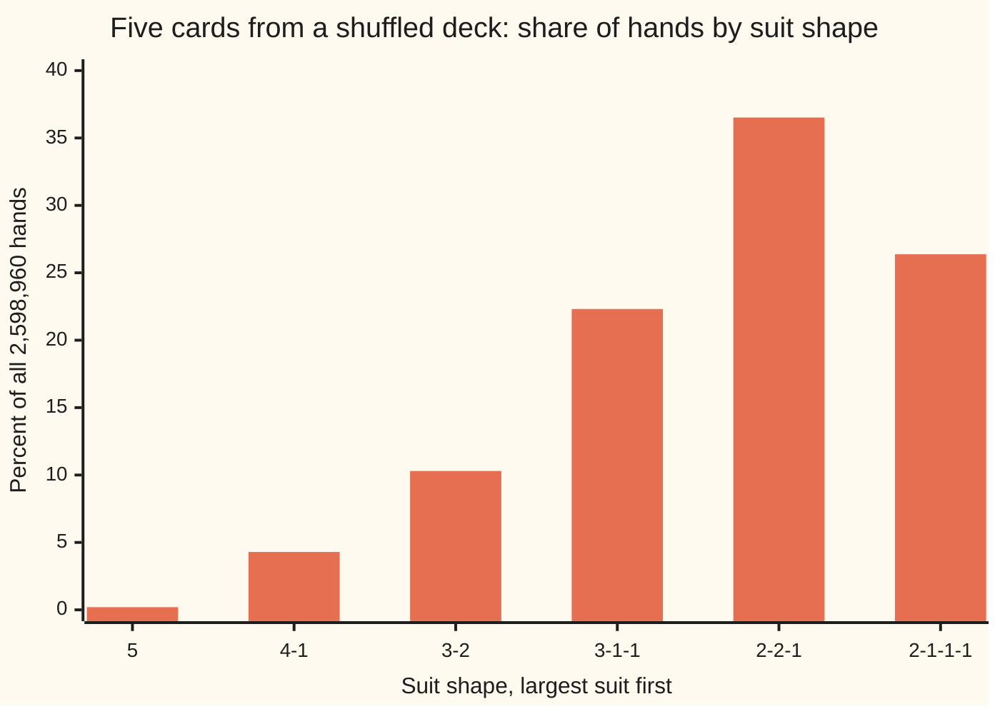

# Counting chances: favourable over possible, with the counting done in wing 04

[Syllabus](../../../SYLLABUS.md) → [Probability and statistics](../../../SYLLABUS.md#w09) → [Chance and Events](../../../SYLLABUS.md#w09-s01) → Counting chances

---

## General Overview

A dealer shuffles a standard deck and deals five cards. The deck holds 52 cards: 13 ranks (two up to ace) in each of four suits (clubs, diamonds, hearts, spades). A **flush** is a hand whose five cards all share one suit. How often does one turn up?

Watching deals gives only an estimate. Counting gives the exact answer. Count every five-card hand the deal could produce: 2,598,960. Count the hands that are flushes: 5,148. If every hand is as likely as every other, the chance of a flush is the second count divided by the first: 0.0019808, about 1 deal in 505.

That division is the whole method. It needs two things. The outcomes must be equally likely, which a fair shuffle gives and many natural-looking lists of outcomes do not. And both counts must be made the same way, which is where the counting tools of wing 04 come in.

**When every outcome is equally likely, the chance of an event is the number of outcomes in it divided by the number of outcomes in all; the hard part is counting, and checking that "equally likely" is true.**

**What kind of fact this is:** a theorem, proved on this card in Why it works from the rules of chance; whether a list of outcomes really is equally likely is a modelling judgement about the mechanism, checked by symmetry.

### The picture: how the suits fall in a five-card hand

Sort each hand by its suit shape: how many cards of each suit it holds, largest first. "3-1-1" means three of one suit and one each of two others. A flush is shape "5".



Each bar is the share of all hands with that suit shape, counted by formula and by listing every hand. The flush bar, at 0.198%, barely leaves the axis. The six shapes are six possible results, but they are far from equally likely: that gap is the trap this card teaches to spot.

---

## The formula

Notation first, in words. $P(A)$ is the chance of the event $A$, read "the chance of A" ([Probability](01-what-probability-means.md)). $S$ is the sample space: the list of every outcome that can happen ([Sample spaces and events](02-sample-spaces-and-events.md)). Vertical bars count members: $\lvert A\rvert$ is how many outcomes $A$ holds. $C(n, k)$, read "n choose k", is the number of ways to take $k$ things from $n$ with order ignored ([Combinations, n choose k](../../04-Combinatorics%20and%20graphs/01-Counting%20Principles/05-n-choose-k.md)).

$$P(A) = \frac{\lvert A\rvert}{\lvert S\rvert}\qquad\text{when every outcome in } S \text{ is equally likely}$$

**Read it aloud:** the chance of A is the count of outcomes where A happens, over the count of all outcomes.

For the flush, an outcome is a five-card hand with order ignored, and the event is "all five in one suit":

$$P(\text{flush}) = \frac{4 \times C(13, 5)}{C(52, 5)} = \frac{5{,}148}{2{,}598{,}960} = 0.0019808$$

The 4 picks the suit. $C(13, 5)$ picks five of that suit's 13 ranks. $C(52, 5)$ counts all hands.

| Symbol | Plain meaning | In our example | Push it up and the answer… |
| --- | --- | --- | --- |
| $P(A)$ | the chance of the event, a number from 0 to 1 | P(flush) = 0.0019808 | — |
| $A$ | the event: the outcomes that count as a success | all 5,148 flushes | more outcomes in it, a bigger chance |
| $S$ | the sample space: every outcome that can happen | all five-card hands | more outcomes, each one rarer |
| $\lvert A\rvert$, $\lvert S\rvert$ | how many outcomes each holds | 5,148 and 2,598,960 | top up, chance up; bottom up, chance down |
| $C(n, k)$ | ways to take $k$ things from $n$, order ignored | C(52, 5) = 2,598,960 | — |
| $n$ | how many things are available | 52 cards, or 13 in one suit | more hands in all |
| $k$ | how many are taken | 5 cards | — |
| $n!$ | the orders of $n$ different things: n × (n−1) × … × 1 | 5! = 120 | — |

One clash of letters: the [Ordered picks](../../04-Combinatorics%20and%20graphs/01-Counting%20Principles/04-ordered-picks.md) card writes its count of ordered picks with a P too. That count is not a chance, so this card writes ordered products out in full, 52 × 51 × 50 × 49 × 48.

### When it holds

- **Equally likely outcomes.** A fair shuffle makes every five-card hand as likely as any other. A dealer who stacks the deck breaks this, and the count says nothing about that dealer's table.
- **A finite list.** The method divides two counts. With endless outcomes, such as a point on a line, counts give way to lengths and areas, on this wing's shelf of continuous laws.
- **The same grain on top and bottom.** Count ordered deals in both, or unordered hands in both. Ordered on top and unordered below gives 0.2377, a flush one hand in four.
- **The event is built from the same outcomes.** "Flush" must be a clear list of hands. Poker's own ranking removes the 40 straight flushes from "flush", which changes the top count to 5,108 and the chance to 0.0019654.

---

## Why it works

### Step 0: symmetry fixes the chances without watching anything

A fair shuffle does not prefer one card to another. Swap the names of any two cards and nothing about the shuffle changes. So no hand can be likelier than another: they all share one chance. The rules of chance then leave only one value that chance can take.

### Step 1: equal chances that fill the space are each one over the count

Say the sample space holds $\lvert S\rvert$ outcomes, each with the same chance, call it q. Different outcomes cannot happen together, so by the addition rule ([The rules](03-probability-rules-and-complements.md)) their chances add. Something must happen, so they add to 1. That gives $\lvert S\rvert \times q = 1$, so q = 1 over $\lvert S\rvert$: one over 2,598,960 for each hand.

### Step 2: an event's chance is its count times that share

The event $A$ is a collection of single outcomes that cannot happen together. The addition rule again: its chance is the sum of their chances, $\lvert A\rvert$ copies of 1 over $\lvert S\rvert$. That is $\lvert A\rvert$ over $\lvert S\rvert$, the formula.

### Step 3: why every unordered hand is equally likely

The shuffle acts on the order of the whole deck: every one of the 52! orders is equally likely. A hand is the top five cards. For any one hand, those five can sit in the top places in 5! orders and the other 47 cards below in 47! orders. Every hand is reached by the same number of deck orders, so every hand has the same chance.

<details>
<summary>Detailed proof: the hands are equally likely, and their number is C(52, 5)</summary>

Take the 52! deck orders as the equally likely outcomes, by Step 0 applied to the whole deck. Fix one five-card hand, call it H. A deck order puts H on top exactly when its first five places hold the cards of H in some order (5! ways) and its last 47 places hold the rest in some order (47! ways). So H is on top in 5! × 47! orders, whichever hand H is.

By Step 2, the chance of H is 5! × 47! over 52!, the same for every hand. By Step 1 that common chance is also 1 over the number of hands. So the number of hands is 52! over 5! × 47!, which is $C(52, 5)$, the n-choose-k count. The same argument inside one suit gives $C(13, 5)$ = 1,287.

</details>

### Step 4: count the flushes

Build a flush in two moves. Choose its suit: 4 ways. Choose its five ranks from that suit's 13: $C(13, 5)$ = 1,287 ways. Every choice gives a different flush and every flush arises once, so the product rule gives 4 × 1,287 = 5,148. Divide by 2,598,960: 0.0019808.

### Step 5: order in both counts, or in neither

Counting ordered deals gives the same answer. The first card can be any of 52. For a flush the second must share its suit, 12 of the 51 left, then 11 of 50, 10 of 49, 9 of 48: 617,760 ordered flushes out of 311,875,200 ordered deals. Each unordered hand appears in 5! = 120 orders, top and bottom alike, so dividing both by 120 returns 5,148 over 2,598,960. The ratio does not move.

The same ordered road can be read as a chain of chances, 12/51 × 11/50 × 10/49 × 9/48, each factor a chance given the cards already dealt. That reading is [Conditional probability](05-conditional-probability.md), which does it properly.

---

## Worked numbers, by hand

| Step | Arithmetic | Value |
| --- | --- | --- |
| ordered deals of five | 52 × 51 × 50 × 49 × 48 | 311,875,200 |
| hands, order ignored | 311,875,200 ÷ 5! = 311,875,200 ÷ 120 | 2,598,960 |
| five ranks from one suit | 13 × 12 × 11 × 10 × 9 ÷ 120 = 154,440 ÷ 120 | 1,287 |
| flushes | 4 suits × 1,287 | 5,148 |
| chance of five of one suit | 5,148 ÷ 2,598,960 | **0.0019808** |
| as "1 in N" | 2,598,960 ÷ 5,148 | about 1 in 505 |
| poker's flush, straight flushes removed | (5,148 − 40) ÷ 2,598,960 | 0.0019654, about 1 in 509 |

About 2 deals in every 1,000 give five cards of one suit; a player dealt 505 hands can expect to see roughly one.

The house example of this shelf checks the method on a smaller space. Two dice, told apart as first and second, give 36 equally likely pairs. Six of them sum to 7, so the chance of a 7 is 6 over 36, 0.1667.

### What breaks if you drop a piece

| Mistake | Comes out at | What went wrong |
| --- | --- | --- |
| Top counted in order, 4 × 13 × 12 × 11 × 10 × 9 = 617,760, bottom unordered | 0.2377 | Each flush counted 120 times on top and once below |
| Each later card a fresh 1-in-4 chance to match: 0.25^4 | 0.00390625, 1.97 times too big | A dealt card leaves the deck; its suit has 12 left, not 13 of 52 |
| The 56 suit patterns (cards per named suit, such as 2 hearts, 2 spades, 1 club) taken as equally likely, 4 of them flushes | 4 / 56 = 0.0714 | Patterns are not equally likely: one five-hearts pattern holds 1,287 hands, shape 2-2-1 holds 949,104 |
| Two dice: the 11 sums 2 to 12 taken as equally likely | 0.0909 for a 7, not 0.1667 | A 7 comes from 6 pairs, a 2 from one |

The code prints all four.

---

## Code, from first principles, and it actually runs

The scripts reach the flush chance by four roads that share no arithmetic. Road 1 is the formula with a hand-written C(n, k). Road 2 counts ordered deals and never divides. Road 3 lists all 2,598,960 hands one at a time and tallies their suit shapes. Road 4 deals a million hands from a seeded SplitMix64 generator (a short, well-known recipe for pseudo-random numbers), written out in both languages so Python and Rust deal the same cards; its estimate is printed with its standard error, the typical size of a simulation's miss. Every number on the card comes out of these runs, including the chart's bars and the mistakes.

### Python

```python
# Counting chances -- the check behind the card.  Nothing is imported.
# A five-card poker hand from a shuffled 52-card deck: the chance of a flush,
# five cards of one suit.  Road 1 counts unordered hands with C(n, k).  Road 2
# counts ordered deals.  Road 3 lists all 2,598,960 hands.  Road 4 deals a
# million hands with a seeded SplitMix64 generator written out here.
MASK = (1 << 64) - 1

def choose(n, k):                        # C(n, k), multiplied and divided in turn
    out = 1
    for i in range(k):
        out = out * (n - i) // (i + 1)
    return out

def falling(n, k):                       # n x (n-1) x ... , k factors: ordered picks
    out = 1
    for i in range(k):
        out *= n - i
    return out

class SplitMix64:                        # a small seeded generator, same in Rust
    def __init__(self, seed):
        self.s = seed
    def next(self):
        self.s = (self.s + 0x9E3779B97F4A7C15) & MASK
        z = self.s
        z = ((z ^ (z >> 30)) * 0xBF58476D1CE4E5B9) & MASK
        z = ((z ^ (z >> 27)) * 0x94D049BB133111EB) & MASK
        return z ^ (z >> 31)
    def below(self, n):                  # a whole number from 0 to n - 1
        return (self.next() * n) >> 64

SHAPES = ["5", "4-1", "3-2", "3-1-1", "2-2-1", "2-1-1-1"]

# Road 1: unordered hands.  Pick the suit, then five of its 13 ranks.
hands = choose(52, 5)
flush = 4 * choose(13, 5)
straight_flush = 4 * 10                  # lowest card ace (low) up to ten, in each suit
p_flush, p_proper = flush / hands, (flush - straight_flush) / hands
# The suit shapes by formula: which suits play which part, then ranks inside each.
c = [choose(13, j) for j in range(6)]
shape_formula = {"5": 4 * c[5], "4-1": 4 * 3 * c[4] * c[1], "3-2": 4 * 3 * c[3] * c[2],
                 "3-1-1": 4 * 3 * c[3] * c[1] ** 2, "2-2-1": 4 * 3 * c[2] ** 2 * c[1],
                 "2-1-1-1": 4 * c[2] * c[1] ** 3}

# Road 2: ordered deals.  Any first card, then 12 of the 51 left share its suit, ...
ordered_all = falling(52, 5)
ordered_flush = 52 * falling(12, 4)

# Road 3: list every hand.  A hand's suit counts are packed as one number in base 6.
w = [6 ** (card // 13) for card in range(52)]
tally = [0] * 6 ** 4
for a in range(48):
    for b in range(a + 1, 49):
        ab = w[a] + w[b]
        for d in range(b + 1, 50):
            abd = ab + w[d]
            for e in range(d + 1, 51):
                t = abd + w[e]
                for f in range(e + 1, 52):
                    tally[t + w[f]] += 1
shape_listed = {s: 0 for s in SHAPES}
for code in range(6 ** 4):
    if tally[code]:
        counts = sorted((code // 6 ** s % 6 for s in range(4)), reverse=True)
        shape_listed["-".join(str(x) for x in counts if x)] += tally[code]
listed_hands = sum(tally)
listed_sf = 0                            # straights inside one suit, ranks 0 = two ... 12 = ace
for r in [(p, q, u, v, x) for p in range(13) for q in range(p + 1, 13) for u in range(q + 1, 13)
          for v in range(u + 1, 13) for x in range(v + 1, 13)]:
    if r[4] - r[0] == 4 or r == (0, 1, 2, 3, 12):
        listed_sf += 4

# Road 4: deal a million hands, five swaps of a partial shuffle each.
rng, deck, deals, hits = SplitMix64(20260928), list(range(52)), 1_000_000, 0
for _ in range(deals):
    for i in range(5):
        j = i + rng.below(52 - i)
        deck[i], deck[j] = deck[j], deck[i]
    s = deck[0] // 13
    hits += all(deck[i] // 13 == s for i in range(1, 5))
p_sim = hits / deals
se = (p_sim * (1 - p_sim) / deals) ** 0.5

# The house example: two dice, 36 ordered pairs, against 11 sums taken as equal.
sevens = sum(1 for x in range(1, 7) for y in range(1, 7) if x + y == 7)

print(f"road 1, hands C(52, 5) = {hands:,}; one suit C(13, 5) = {falling(13, 5):,} / 120 = {choose(13, 5):,}; flushes 4 x {choose(13, 5):,} = {flush:,}")
print(f"P(five of one suit) = {flush:,} / {hands:,} = {p_flush:.7f}, about 1 in {hands / flush:.1f}")
print(f"less {straight_flush} straight flushes: {flush - straight_flush:,} / {hands:,} = {p_proper:.7f}, about 1 in {hands / (flush - straight_flush):.1f}")
print(f"road 2, ordered deals 52x51x50x49x48 = {ordered_all:,}; ordered flushes 52x12x11x10x9 = {ordered_flush:,}")
print(f"ordered ratio = {ordered_flush / ordered_all:.7f}; both counts / 5! = 120: {ordered_all // 120:,} and {ordered_flush // 120:,}")
print(f"road 3, hands listed one by one: {listed_hands:,}; five of one suit: {shape_listed['5']:,}; straight flushes: {listed_sf}")
print("shape, hands by formula, hands listed, percent of all hands")
for s in SHAPES:
    print(f"shape {s}, {shape_formula[s]:,}, {shape_listed[s]:,}, {100 * shape_listed[s] / hands:.3f}")
print(f"road 4, {deals:,} seeded deals: {hits:,} flushes, estimate {p_sim:.7f}, standard error {se:.7f}")
print(f"distance from road 1 in standard errors: {(p_sim - p_flush) / se:.2f}")
print(f"mistake 1, ordered top 4 x 13x12x11x10x9 = {4 * falling(13, 5):,} over unordered {hands:,} = {4 * falling(13, 5) / hands:.4f}")
print(f"mistake 2, each later card a fresh 1/4 chance: 0.25^4 = {0.25 ** 4:.8f}, {0.25 ** 4 / p_flush:.2f} times too big")
print(f"mistake 3, the {choose(8, 3)} suit patterns taken as equal: 4 / {choose(8, 3)} = {4 / choose(8, 3):.4f}")
print(f"mistake 4, two dice: 7 in {sevens} of 36 pairs = {sevens / 36:.4f}; 11 sums taken as equal gives {1 / 11:.4f}")
assert listed_hands == hands and shape_listed["5"] == flush         # listing agrees with C(n, k)
assert shape_listed == shape_formula and listed_sf == straight_flush
assert ordered_flush * hands == flush * ordered_all                 # the two ratios are equal
assert abs(p_sim - p_flush) < 4 * se                                # simulation within 4 errors
assert sevens == min(7 - 1, 13 - 7) and choose(8, 3) == sum(1 for p in range(6) for q in range(6) for u in range(6)
                                           if p + q + u <= 5)       # 56 patterns, counted twice
print("ALL CHECKS PASS")
```

**Ran 2026-09-28 on macOS, Python 3.14.6, standard library only. All checks passed. Output, pasted from the run:**

```
road 1, hands C(52, 5) = 2,598,960; one suit C(13, 5) = 154,440 / 120 = 1,287; flushes 4 x 1,287 = 5,148
P(five of one suit) = 5,148 / 2,598,960 = 0.0019808, about 1 in 504.8
less 40 straight flushes: 5,108 / 2,598,960 = 0.0019654, about 1 in 508.8
road 2, ordered deals 52x51x50x49x48 = 311,875,200; ordered flushes 52x12x11x10x9 = 617,760
ordered ratio = 0.0019808; both counts / 5! = 120: 2,598,960 and 5,148
road 3, hands listed one by one: 2,598,960; five of one suit: 5,148; straight flushes: 40
shape, hands by formula, hands listed, percent of all hands
shape 5, 5,148, 5,148, 0.198
shape 4-1, 111,540, 111,540, 4.292
shape 3-2, 267,696, 267,696, 10.300
shape 3-1-1, 580,008, 580,008, 22.317
shape 2-2-1, 949,104, 949,104, 36.519
shape 2-1-1-1, 685,464, 685,464, 26.375
road 4, 1,000,000 seeded deals: 1,998 flushes, estimate 0.0019980, standard error 0.0000447
distance from road 1 in standard errors: 0.39
mistake 1, ordered top 4 x 13x12x11x10x9 = 617,760 over unordered 2,598,960 = 0.2377
mistake 2, each later card a fresh 1/4 chance: 0.25^4 = 0.00390625, 1.97 times too big
mistake 3, the 56 suit patterns taken as equal: 4 / 56 = 0.0714
mistake 4, two dice: 7 in 6 of 36 pairs = 0.1667; 11 sums taken as equal gives 0.0909
ALL CHECKS PASS
```

### Rust

Same numbers, same labels, built with `rustc --edition 2021 -O`.

```rust
// Counting chances -- the same check as the Python, in Rust.  No crates.
// A five-card poker hand from a shuffled 52-card deck: the chance of a flush,
// five cards of one suit.  Road 1 counts unordered hands with C(n, k).  Road 2
// counts ordered deals.  Road 3 lists all 2,598,960 hands.  Road 4 deals a
// million hands with a seeded SplitMix64 generator written out here.
fn choose(n: u64, k: u64) -> u64 {       // C(n, k), multiplied and divided in turn
    let mut out = 1;
    for i in 0..k { out = out * (n - i) / (i + 1) }
    out
}

fn falling(n: u64, k: u64) -> u64 {      // n x (n-1) x ... , k factors: ordered picks
    (0..k).map(|i| n - i).product()
}

struct SplitMix64 { s: u64 }             // a small seeded generator, same in Python

impl SplitMix64 {
    fn next(&mut self) -> u64 {
        self.s = self.s.wrapping_add(0x9E3779B97F4A7C15);
        let mut z = self.s;
        z = (z ^ (z >> 30)).wrapping_mul(0xBF58476D1CE4E5B9);
        z = (z ^ (z >> 27)).wrapping_mul(0x94D049BB133111EB);
        z ^ (z >> 31)
    }
    fn below(&mut self, n: u64) -> u64 { // a whole number from 0 to n - 1
        ((self.next() as u128 * n as u128) >> 64) as u64
    }
}

fn commas(x: u64) -> String {            // 2598960 -> 2,598,960
    let s = x.to_string();
    let mut out = String::new();
    for (i, ch) in s.chars().enumerate() {
        if i > 0 && (s.len() - i) % 3 == 0 { out.push(',') }
        out.push(ch);
    }
    out
}

fn main() {
    let shapes = ["5", "4-1", "3-2", "3-1-1", "2-2-1", "2-1-1-1"];
    // Road 1: unordered hands.  Pick the suit, then five of its 13 ranks.
    let hands = choose(52, 5);
    let flush = 4 * choose(13, 5);
    let straight_flush = 4 * 10;         // lowest card ace (low) up to ten, in each suit
    let (p_flush, p_proper) = (flush as f64 / hands as f64, (flush - straight_flush) as f64 / hands as f64);
    let c: Vec<u64> = (0..6).map(|j| choose(13, j)).collect();
    let shape_formula = [4 * c[5], 4 * 3 * c[4] * c[1], 4 * 3 * c[3] * c[2],
                         4 * 3 * c[3] * c[1] * c[1], 4 * 3 * c[2] * c[2] * c[1], 4 * c[2] * c[1].pow(3)];
    // Road 2: ordered deals.  Any first card, then 12 of the 51 left share its suit, ...
    let ordered_all = falling(52, 5);
    let ordered_flush = 52 * falling(12, 4);
    // Road 3: list every hand.  A hand's suit counts are packed as one number in base 6.
    let w: Vec<usize> = (0..52).map(|card: u32| 6usize.pow(card / 13)).collect();
    let mut tally = vec![0u64; 1296];
    for a in 0..48 { for b in a + 1..49 { for d in b + 1..50 { for e in d + 1..51 { for f in e + 1..52 {
        tally[w[a] + w[b] + w[d] + w[e] + w[f]] += 1;
    }}}}}
    let mut shape_listed = [0u64; 6];
    for code in 0..1296usize {
        if tally[code] == 0 { continue }
        let mut counts: Vec<usize> = (0..4).map(|s| code / 6usize.pow(s) % 6).filter(|&x| x > 0).collect();
        counts.sort_by(|x, y| y.cmp(x));
        let name = counts.iter().map(|x| x.to_string()).collect::<Vec<_>>().join("-");
        let k = shapes.iter().position(|&s| s == name).unwrap();
        shape_listed[k] += tally[code];
    }
    let listed_hands: u64 = tally.iter().sum();
    let mut listed_sf = 0;               // straights inside one suit, ranks 0 = two ... 12 = ace
    for p in 0..13 { for q in p + 1..13 { for u in q + 1..13 { for v in u + 1..13 { for x in v + 1..13 {
        if x - p == 4 || (p, q, u, v, x) == (0, 1, 2, 3, 12) { listed_sf += 4 }
    }}}}}
    // Road 4: deal a million hands, five swaps of a partial shuffle each.
    let mut rng = SplitMix64 { s: 20260928 };
    let mut deck: Vec<u64> = (0..52).collect();
    let (deals, mut hits) = (1_000_000u64, 0u64);
    for _ in 0..deals {
        for i in 0..5 {
            let j = i + rng.below(52 - i as u64) as usize;
            deck.swap(i, j);
        }
        let s = deck[0] / 13;
        if (1..5).all(|i| deck[i] / 13 == s) { hits += 1 }
    }
    let p_sim = hits as f64 / deals as f64;
    let se = (p_sim * (1.0 - p_sim) / deals as f64).sqrt();
    // The house example: two dice, 36 ordered pairs, against 11 sums taken as equal.
    let sevens = (1..7).flat_map(|x| (1..7).map(move |y| x + y)).filter(|&t| t == 7).count() as u64;
    let patterns = choose(8, 3);
    let mistake1 = 4 * falling(13, 5);

    println!("road 1, hands C(52, 5) = {}; one suit C(13, 5) = {} / 120 = {}; flushes 4 x {} = {}", commas(hands), commas(falling(13, 5)), commas(c[5]), commas(c[5]), commas(flush));
    println!("P(five of one suit) = {} / {} = {:.7}, about 1 in {:.1}", commas(flush), commas(hands), p_flush, hands as f64 / flush as f64);
    println!("less {} straight flushes: {} / {} = {:.7}, about 1 in {:.1}", straight_flush, commas(flush - straight_flush), commas(hands), p_proper, hands as f64 / (flush - straight_flush) as f64);
    println!("road 2, ordered deals 52x51x50x49x48 = {}; ordered flushes 52x12x11x10x9 = {}", commas(ordered_all), commas(ordered_flush));
    println!("ordered ratio = {:.7}; both counts / 5! = 120: {} and {}", ordered_flush as f64 / ordered_all as f64, commas(ordered_all / 120), commas(ordered_flush / 120));
    println!("road 3, hands listed one by one: {}; five of one suit: {}; straight flushes: {}", commas(listed_hands), commas(shape_listed[0]), listed_sf);
    println!("shape, hands by formula, hands listed, percent of all hands");
    for k in 0..6 {
        println!("shape {}, {}, {}, {:.3}", shapes[k], commas(shape_formula[k]), commas(shape_listed[k]), 100.0 * shape_listed[k] as f64 / hands as f64);
    }
    println!("road 4, {} seeded deals: {} flushes, estimate {:.7}, standard error {:.7}", commas(deals), commas(hits), p_sim, se);
    println!("distance from road 1 in standard errors: {:.2}", (p_sim - p_flush) / se);
    println!("mistake 1, ordered top 4 x 13x12x11x10x9 = {} over unordered {} = {:.4}", commas(mistake1), commas(hands), mistake1 as f64 / hands as f64);
    println!("mistake 2, each later card a fresh 1/4 chance: 0.25^4 = {:.8}, {:.2} times too big", 0.25f64.powi(4), 0.25f64.powi(4) / p_flush);
    println!("mistake 3, the {} suit patterns taken as equal: 4 / {} = {:.4}", patterns, patterns, 4.0 / patterns as f64);
    println!("mistake 4, two dice: 7 in {} of 36 pairs = {:.4}; 11 sums taken as equal gives {:.4}", sevens, sevens as f64 / 36.0, 1.0 / 11.0);
    assert!(listed_hands == hands && shape_listed[0] == flush);         // listing agrees with C(n, k)
    assert!(shape_listed == shape_formula && listed_sf == straight_flush);
    assert!(ordered_flush * hands == flush * ordered_all);              // the two ratios are equal
    assert!((p_sim - p_flush).abs() < 4.0 * se);                        // simulation within 4 errors
    let counted = (0..6).flat_map(|p| (0..6).flat_map(move |q| (0..6).map(move |u| p + q + u))).filter(|&t| t <= 5).count() as u64;
    assert!(sevens == (7 - 1).min(13 - 7) && patterns == counted);      // 56 patterns, counted twice
    println!("ALL CHECKS PASS");
}
```

**Ran 2026-09-28 on macOS, rustc 1.98.1, no crates. All checks passed. Output, pasted from the run:**

```
road 1, hands C(52, 5) = 2,598,960; one suit C(13, 5) = 154,440 / 120 = 1,287; flushes 4 x 1,287 = 5,148
P(five of one suit) = 5,148 / 2,598,960 = 0.0019808, about 1 in 504.8
less 40 straight flushes: 5,108 / 2,598,960 = 0.0019654, about 1 in 508.8
road 2, ordered deals 52x51x50x49x48 = 311,875,200; ordered flushes 52x12x11x10x9 = 617,760
ordered ratio = 0.0019808; both counts / 5! = 120: 2,598,960 and 5,148
road 3, hands listed one by one: 2,598,960; five of one suit: 5,148; straight flushes: 40
shape, hands by formula, hands listed, percent of all hands
shape 5, 5,148, 5,148, 0.198
shape 4-1, 111,540, 111,540, 4.292
shape 3-2, 267,696, 267,696, 10.300
shape 3-1-1, 580,008, 580,008, 22.317
shape 2-2-1, 949,104, 949,104, 36.519
shape 2-1-1-1, 685,464, 685,464, 26.375
road 4, 1,000,000 seeded deals: 1,998 flushes, estimate 0.0019980, standard error 0.0000447
distance from road 1 in standard errors: 0.39
mistake 1, ordered top 4 x 13x12x11x10x9 = 617,760 over unordered 2,598,960 = 0.2377
mistake 2, each later card a fresh 1/4 chance: 0.25^4 = 0.00390625, 1.97 times too big
mistake 3, the 56 suit patterns taken as equal: 4 / 56 = 0.0714
mistake 4, two dice: 7 in 6 of 36 pairs = 0.1667; 11 sums taken as equal gives 0.0909
ALL CHECKS PASS
```

The two outputs match line for line. The simulation matches too, because both languages draw the same numbers from the same seed.

> [!TIP]
> **Try changing**
> Guess first, then run the Python.
> - **A different seed.** Change `20260928` to any other number. The flush count moves, but the distance from road 1 stays within a few standard errors, and every assert still passes.
> - **Match only four cards.** In road 4, change `range(1, 5)` to `range(1, 4)`. The simulation now counts hands whose first four cards share a suit, an event far more common than a flush, and the fourth assert stops the run.
> - **Forget the ace-low straight.** Set `straight_flush = 4 * 9`. The listing still finds 40 straight flushes, since ace-2-3-4-5 counts, and the second assert stops the run.
> - **Deal fewer hands.** Set `deals` to `10_000`. The standard error grows about ten-fold, and the estimate becomes a rough guide rather than a measurement.

---

## The usual mistake

> [!warning]
> **Dividing counts of outcomes that are not equally likely.** The formula is only as good as the list under it. Sort hands by suit pattern (how many cards of each suit, 56 patterns in all) and 4 of the 56 are flushes, which suggests 0.0714. That is far above the truth, because the four all-one-suit patterns hold only 5,148 hands between them, while the patterns of shape 2-2-1 hold 949,104. The test: can the outcomes be swapped for each other by relabelling cards, dice or people, without changing how they are produced? If yes, they are equally likely. If not, go back to the finest outcomes the mechanism treats alike, here the hands or the deck orders, and count those.
>
> - **Order on top, not below.** 617,760 ordered flushes over 2,598,960 unordered hands gives 0.2377. Order in both or in neither.
> - **Drawing as if the card went back.** Treating each later card as a fresh 1-in-4 chance to match gives 0.00390625, nearly twice the truth. Without replacement, the matching suit runs down: 12 of 51, then 11 of 50.
> - **Dice sums as equal outcomes.** The 11 sums of two dice give 0.0909 for a 7. The 36 pairs give 0.1667.
> - **Which "flush"?** Five of one suit is 0.0019808. Poker's ranked flush, straight flushes removed, is 0.0019654. Say which one is meant.

---

## Where you meet it in real life

- **Card rooms and poker odds tables.** Every printed table of hand chances is this card's division, with a different top count per hand.
- **Lotteries.** A six-from-49 ticket wins the jackpot with chance 1 over C(49, 6): one outcome on top, every ticket below ([Combinations, n choose k](../../04-Combinatorics%20and%20graphs/01-Counting%20Principles/05-n-choose-k.md)).
- **Quality checks by sampling.** Draw 5 items from a batch of 52 with some faulty, and the chance of finding none is a count of faultless handfuls over all handfuls: the [Hypergeometric](../03-Discrete%20Distributions/03-hypergeometric.md) law.
- **Random assignment in trials.** Shuffling patients into treatment and control makes every split equally likely, which is what later lets a statistician compute how surprising a result is by counting splits.
- **Shuffling software.** A card-game app that shuffles badly makes some hands likelier than others; comparing its dealt frequencies with the chart above exposes it, as road 4 does in reverse.

> **Say it back**
> When outcomes are equally likely, a chance is a count over a count: the outcomes in the event over all outcomes. The rules of chance force this, because equal chances that add to 1 are each one over the count. A fair shuffle makes every five-card hand equally likely, so the flush chance is 4 × C(13, 5) over C(52, 5), 0.0019808, about 1 deal in 505. Count order in both or in neither. Before dividing, check that the outcomes really are equally likely: suit patterns and dice sums are not.

---

## What this builds on

- [The rules](03-probability-rules-and-complements.md): the addition rule and the total of 1, which force equal chances to be one over the count.
- [Combinations, n choose k](../../04-Combinatorics%20and%20graphs/01-Counting%20Principles/05-n-choose-k.md): C(n, k), the count of unordered hands and of ranks within a suit.
- [Ordered picks](../../04-Combinatorics%20and%20graphs/01-Counting%20Principles/04-ordered-picks.md): the ordered count 52 × 51 × 50 × 49 × 48, the second road.

## Where this goes next

- [Binomial](../03-Discrete%20Distributions/01-bernoulli-and-binomial.md): repeat a yes-or-no trial and count the ways to get k successes; C(n, k) returns, now weighting outcomes that are not equally likely.
- [Conditional probability](05-conditional-probability.md), next on this shelf: the chain 12/51 × 11/50 × 10/49 × 9/48 read as chances that update as cards are seen.

Counting works only when every outcome carries the same weight; the question left open is how to compute chances when they do not, and how a chance changes once part of the outcome is known.

---

## Sources

Verified 2026-09-28: every link below opens a page that names the cited work.

- Blitzstein, Joseph K., and Jessica Hwang. *Introduction to Probability*, 2nd ed. Chapman and Hall/CRC, 2019. [Publisher page](https://www.routledge.com/Introduction-to-Probability/Blitzstein-Hwang/p/book/9781138369917). Chapter 1, "Probability and counting": the naive definition of probability, when it applies, and card-hand counts.
- Feller, William. *An Introduction to Probability Theory and Its Applications*, Volume 1, 3rd ed. Wiley, 1968. [Publisher page](https://www.wiley.com/en-us/An+Introduction+to+Probability+Theory+and+Its+Applications%2C+Volume+1%2C+3rd+Edition-p-9780471257080). Chapter II, "Elements of combinatorial analysis": probabilities on finite spaces of equally likely outcomes, worked at length.
- Grinstead, Charles M., and J. Laurie Snell. *Introduction to Probability*, 2nd ed. American Mathematical Society, 1997; free from Dartmouth. [Book page](https://chance.dartmouth.edu/teaching_aids/books_articles/probability_book/book.html). Chapter 3, "Combinatorics": permutations and combinations used to compute chances, with card-hand examples.
