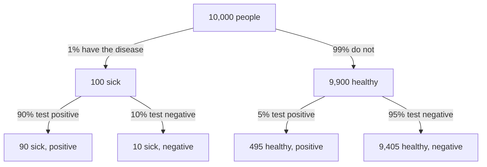
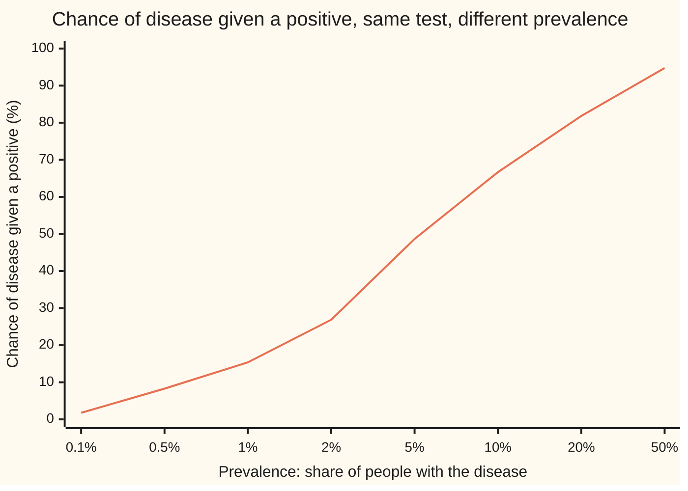

# Conditional probability: the chance of one thing given another has happened

Probability and statistics → Chance and Events → Updating on evidence → Conditional probability

---

## General Overview

A town of 10,000 people is screened for a disease. One person in a hundred has it: 100 people. The test catches 90% of them, so 90 of the 100 test positive. It also wrongly flags 5% of the healthy: 495 of the other 9,900.

One resident's result comes back positive. What is the chance this person has the disease?

The test is right 90% of the time on the sick, so the answer feels like 90%. It is about 15%. Count the positives: 90 sick plus 495 healthy makes 585. Of those 585, only 90 are sick. That is 90 out of 585, or 2 in 13.

The positive result threw away everyone who tested negative. The question is then asked again inside the 585 who remain. That move, shrinking the world to what is known and re-measuring, is **conditional probability**. Its two working tools come with it: the **multiplication rule**, which finds the chance that two things both happen, and the **law of total probability**, which adds up the chance of something across separate groups.

**The chance of one event given another is the part of the second where the first also happens, as a share of all of the second: shrink the world to what is known, then re-measure.**

**What kind of fact this is:** a definition; the multiplication rule and the law of total probability follow from it and are theorems, proved on this card in Why it works.

### The picture: the town, split twice



A positive result keeps two of the four end boxes, 90 and 495, and discards the other two. The answer is the sick box's share of what is kept: 90 out of 585.

---

## The formula

Notation first, in words. $P(A)$ is the chance of the event $A$, as on [what-probability-means](01-what-probability-means.md). The new notation is $P(A \mid B)$, read "the chance of $A$ given $B$": the chance of $A$ once $B$ is known to have happened. The upright bar means "given"; it is not division. $A \cap B$, read "$A$ and $B$", is the event that both happen.

$$P(A \mid B) = \frac{P(A \cap B)}{P(B)}, \qquad \text{defined only when } P(B) > 0$$

**Read it aloud:** the chance of $A$ given $B$ is the chance that both happen, divided by the chance of $B$.

Two rules come straight out of it. Multiply both sides by $P(B)$ and the **multiplication rule** appears:

$$P(A \cap B) = P(B)\,P(A \mid B)$$

**Read it aloud:** the chance of both is the chance of the first, times the chance of the second once the first has happened.

Split the world into pieces $B_1, B_2, \dots, B_n$ that do not overlap and together cover every outcome. Such a split is a **partition**. The **law of total probability** says

$$P(A) = P(B_1)\,P(A \mid B_1) + P(B_2)\,P(A \mid B_2) + \dots + P(B_n)\,P(A \mid B_n)$$

**Read it aloud:** the chance of $A$ is its rate in each piece, weighted by the size of that piece, added up.

In the town, $D$ is "has the disease" and $T$ is "tests positive". The pieces are $D$ and $D^c$, read "not $D$" as on [probability-rules-and-complements](03-probability-rules-and-complements.md).

| Symbol | Plain meaning | In our example | Push it up and the answer… |
| --- | --- | --- | --- |
| $P$ | the chance of whatever is in the brackets | P(D) = 0.01 | — |
| $A$, $B$, $A_1$, $A_2$ | events: the question, and what is known; numbered when there are several | A = sick, B = positive | — |
| $D$ | the resident has the disease | 100 of 10,000 | a commoner disease raises the chance of disease given a positive |
| $D^c$ | the resident does not: "not D" | 9,900 of 10,000 | more healthy people means more false alarms among the positives |
| $T$ | the test comes back positive | 585 of 10,000 | — |
| $\cap$ | "and": both events happen | P(D ∩ T) = 0.009 | — |
| $P(A \mid B)$ | the chance of A once B is known | P(D given T) = 0.153846 | rises with P(A ∩ B), falls with P(B) |
| $P(T \mid D)$ | the test's hit rate on the sick | 0.90 | raises the answer, but less than it looks |
| $P(T \mid D^c)$ | the false-alarm rate on the healthy | 0.05 | lowers the answer sharply |
| $B_i$, $i$ | one piece of a partition, and its number | B_1 = D, B_2 = D^c | — |
| $S$, $Q$ | the whole sample space; the chances given B, used in the proof | all 10,000 residents; Q(D) = 0.153846 | — |
| $n$ | how many pieces | 2 | — |

### When it holds

It is a definition, so it needs no proof, only one condition. The two rules drawn from it carry their own conditions.

- **The known event must be possible: $P(B) > 0$.** Divide by zero and the ratio means nothing. Conditioning on an event of probability zero needs the heavier machinery of [conditioning-on-a-partition](../../10-Measure%20and%20integration/09-Conditional%20Expectation/01-conditioning-on-a-partition.md) and the cards after it.
- **The pieces of a partition must cover everything.** Leave out the healthy and the town's chance of a positive drops from 0.0585 to 0.009; the answer then comes out at 1, as if every positive were sick.
- **The pieces must not overlap.** An outcome in two pieces is counted twice, and the total can pass 1.
- **Each piece must be possible: $P(B_i) > 0$.** Otherwise $P(A \mid B_i)$ is undefined. A piece of chance zero adds nothing to $P(A)$, so it is left out of the sum.
- **Rates and weights must describe one population.** A test's hit rate measured in a hospital ward, weighted by the prevalence in a whole town, answers no real question.

---

## Why it works

### Step 0: knowing B happened deletes everything outside B

Before the result, all 10,000 people are possible. After a positive, only the 585 positives are; the rest are ruled out. The survivors keep their relative sizes but now make up everything that can happen, so their chances must be scaled up to total 1. Dividing by $P(B)$ does exactly that.

### Step 1: with equally likely outcomes, the formula is a count

When all outcomes are equally likely, a chance is a count divided by the total ([equally-likely-outcomes-and-counting](04-equally-likely-outcomes-and-counting.md)). Pick one of the 10,000 residents at random. Among the positives, the share who are sick is

90 / 585 = (90 / 10,000) / (585 / 10,000) = 0.009 / 0.0585 = 0.153846.

The middle step divides top and bottom by the same 10,000. The top is now $P(D \cap T)$ and the bottom is $P(T)$. The count and the formula are one calculation written two ways. For outcomes that are not equally likely the definition keeps the same shape: overlap over what is known.

### Step 2: the result is a genuine probability

Given $B$, the new chances obey every rule on [probability-rules-and-complements](03-probability-rules-and-complements.md). None is negative. $B$ itself now has chance 1. Chances of events that cannot happen together add. So the complement rule works inside the smaller world: the chance of being healthy given a positive is 1 − 0.153846 = 0.846154, and the count agrees, 495 / 585.

<details>
<summary>Detailed proof: conditioning on B gives a probability</summary>

Fix $B$ with $P(B) > 0$ and write $Q(A)$ for $P(A \mid B)$.

**Never negative.** $P(A \cap B) \ge 0$ and $P(B) > 0$, so the ratio is at least 0.

**The whole world has chance 1.** Every outcome is in the whole sample space $S$ ([sample-spaces-and-events](02-sample-spaces-and-events.md)), so $S \cap B = B$ and $Q(S) = P(B) / P(B) = 1$.

**Separate events add.** Let $A_1$ and $A_2$ share no outcome. Then $A_1 \cap B$ and $A_2 \cap B$ share none either, and together they make $(A_1 \text{ or } A_2) \cap B$. The addition rule for $P$ gives $P((A_1 \text{ or } A_2) \cap B) = P(A_1 \cap B) + P(A_2 \cap B)$. Divide both sides by $P(B)$: $Q(A_1 \text{ or } A_2) = Q(A_1) + Q(A_2)$. The same step works for any list of events, one pair at a time, and for an endless list because dividing a convergent sum by a fixed number divides each term.

These are the three rules every probability obeys, so every consequence of them, including the complement rule $Q(A^c) = 1 - Q(A)$, holds for $Q$ too.

</details>

### Step 3: the multiplication rule is the definition turned round

Multiply both sides of the definition by $P(B)$:

$$P(A \cap B) = P(B)\,P(A \mid B).$$

In the town: the chance of being sick and positive is 0.01 × 0.90 = 0.009, which is 90 out of 10,000. This is how a chance of "both" is usually found, because the rate inside a group is what gets measured: a test's makers measure its hit rate on patients known to be sick.

The rule chains. For three events, $P(A \cap B \cap C) = P(A)\,P(B \mid A)\,P(C \mid A \cap B)$: each factor is the next event's chance given everything before it. A probability tree like the town's picture is this chain drawn out: multiply along a path to get the chance of its end box.

### Step 4: total probability adds the pieces

Every positive is either sick or healthy, never both. So the event $T$ splits into two parts that do not overlap: $T \cap D$ and $T \cap D^c$. Chances of non-overlapping events add:

$$P(T) = P(T \cap D) + P(T \cap D^c).$$

Replace each part by the multiplication rule:

$$P(T) = P(D)\,P(T \mid D) + P(D^c)\,P(T \mid D^c) = 0.01 \times 0.90 + 0.99 \times 0.05 = 0.009 + 0.0495 = 0.0585.$$

With $n$ pieces the argument is the same, one term per piece, and the rule is exact.

### Step 5: put the three tools together

The question was the chance of disease given a positive. The definition asks for $P(D \cap T) / P(T)$. The multiplication rule gave the top, 0.009. Total probability gave the bottom, 0.0585. Divide: 0.153846.

Written as one line, that calculation is Bayes' rule: it turns "positive given sick" into "sick given positive". It gets its own card: [bayes-rule](06-bayes-rule.md).

---

## Worked numbers, by hand

The town: 1% have the disease, the test flags 90% of the sick and 5% of the healthy.

| Step | Arithmetic | Value |
| --- | --- | --- |
| sick and positive, multiplication rule | 0.01 × 0.90 | 0.009 |
| healthy and positive, multiplication rule | 0.99 × 0.05 | 0.0495 |
| positive at all, total probability | 0.009 + 0.0495 | 0.0585 |
| sick given positive, the definition | 0.009 / 0.0585 | **0.153846** |
| the same by counting | 90 / 585 = 2 / 13 | **0.153846** |
| healthy given positive, complement | 1 − 0.153846, or 495 / 585 | 0.846154 |

A positive result moves the chance of disease from 1 in 100 to about 2 in 13: about fifteen times higher, and still far short of likely. About 85% of positives are false alarms.

### What breaks if you drop a piece

The right answer is 0.153846.

| Mistake | Comes out at | What went wrong |
| --- | --- | --- |
| Swap the condition: read the hit rate as the answer | 0.900000 | Divides by the 100 sick, not the 585 positives |
| Divide by everyone | 0.009000 | That is the chance of sick and positive among all 10,000, not among the positives |
| Weight the two groups equally for the chance of a positive | 0.475 for the chance of a positive, then 0.018947 | The groups are 1% and 99% of the town, not half and half |
| Drop the healthy piece of the partition | 0.009 for the chance of a positive, then 1.000000 | The pieces no longer cover everyone; the 495 false alarms vanish |
| Multiply as if the result and the disease were unrelated | 0.000585 for sick and positive | Plain chances multiply only under independence; the true value is 0.009 |

The last row is the multiplication rule with its conditional factor dropped. It is right only when knowing one event does not change the other's chance, which is the subject of [independence](07-independence.md).

### The base rate decides

The same test gives very different answers in different places. Hold the hit rate at 90% and the false-alarm rate at 5%, and vary the share of people who have the disease, called the **prevalence** or **base rate**:



The one line is the chance of disease given a positive, in percent, by the formula and again by counting a town of 100,000; both checks print both. At 1 in 1,000 a positive means under 2%; in a clinic where half the patients have it, about 95%. The test did not change. The weights in the law of total probability did.

---

## Code, from first principles, and it actually runs

The check reaches the chance of disease given a positive by **three independent roads**. The formula applies the multiplication rule and total probability. A count lists all 10,000 residents, keeps the positives, and counts the sick among them. A simulation draws 1,000,000 residents from a small random generator written out in both languages (SplitMix64, seed 20260928), so Python and Rust draw the same numbers. Its estimate carries a **standard error**, the typical size of its miss: the square root of p(1 − p) / m for a share p estimated from m trials. The asserts demand that formula and count agree and that the simulation land within four standard errors.

### Python

```python
# Conditional probability -- the check behind the card.  Only math.sqrt is
# imported.  A screening test: 1% of people have the disease, the test flags
# 90% of those who have it and 5% of those who do not.  Three roads to the
# chance of disease given a positive result: the formula, a town of 10,000
# people counted one by one, and a seeded simulation of 1,000,000 people.
from math import sqrt

PREV, SENS, FPOS = 0.01, 0.90, 0.05      # P(D), P(T | D), P(T | not D)
TOWN, SIMS, SEED = 10_000, 1_000_000, 20260928
MASK = (1 << 64) - 1

def by_formula(prev, sens, fpos):
    both = prev * sens                    # multiplication rule: P(D and T)
    pos = both + (1 - prev) * fpos        # total probability: P(T)
    return both, pos, both / pos          # the definition: P(D | T)

def gcd(a, b):                            # Euclid, written out
    while b:
        a, b = b, a % b
    return a

class SplitMix64:                         # the same random numbers in Python and Rust
    def __init__(self, seed):
        self.s = seed
    def uniform(self):                    # a number in [0, 1) from 53 random bits
        self.s = (self.s + 0x9E3779B97F4A7C15) & MASK
        z = self.s
        z = ((z ^ (z >> 30)) * 0xBF58476D1CE4E5B9) & MASK
        z = ((z ^ (z >> 27)) * 0x94D049BB133111EB) & MASK
        return ((z ^ (z >> 31)) >> 11) / 9007199254740992.0

def row(label, value):
    print(f"  {label:<40} {value}")

# ---- road 1: the formula ----
both, pos, answer = by_formula(PREV, SENS, FPOS)
print(f"inputs: P(D) = {PREV:.6f}, P(T | D) = {SENS:.6f}, P(T | not D) = {FPOS:.6f}")
print("road 1, the formula")
row("P(D and T) = P(D) P(T | D)", f"{both:.6f}")
row("P(not D and T) = P(not D) P(T | not D)", f"{(1 - PREV) * FPOS:.6f}")
row("P(T), by total probability", f"{pos:.6f}")
row("P(D | T) = P(D and T) / P(T)", f"{answer:.6f}")
row("P(not D | T) = 1 - P(D | T)", f"{1 - answer:.6f}")

# ---- road 2: a town of 10,000 people, listed and counted ----
sick_n, sick_pos_n = round(TOWN * PREV), round(TOWN * PREV * SENS)
well_pos_n = round(TOWN * (1 - PREV) * FPOS)
people = []                               # (has the disease, tests positive)
for i in range(TOWN):
    if i < sick_n:
        people.append((True, i < sick_pos_n))
    else:
        people.append((False, i - sick_n < well_pos_n))
sick = sum(1 for d, t in people if d)
sick_pos = sum(1 for d, t in people if d and t)
well_pos = sum(1 for d, t in people if not d and t)
positives = [d for d, t in people if t]   # keep only the people who tested positive
g = gcd(sick_pos, len(positives))
print(f"road 2, a town of {TOWN} people counted one by one")
row("have the disease", sick)
row("  and test positive", sick_pos)
row("  and test negative", sick - sick_pos)
row("do not have it", TOWN - sick)
row("  and test positive", well_pos)
row("  and test negative", TOWN - sick - well_pos)
row("test positive in all", len(positives))
row(f"P(D | T) = {sick_pos} / {len(positives)} = {sick_pos // g} / {len(positives) // g}",
    f"{sum(positives) / len(positives):.6f}")
row(f"P(not D | T) = {well_pos} / {len(positives)}", f"{well_pos / len(positives):.6f}")

# ---- road 3: simulate 1,000,000 people ----
rng = SplitMix64(SEED)
s_pos = s_both = 0
for _ in range(SIMS):
    d = rng.uniform() < PREV
    t = rng.uniform() < (SENS if d else FPOS)
    s_pos += t
    s_both += d and t
est_pos, est_ans = s_pos / SIMS, s_both / s_pos
se_pos = sqrt(est_pos * (1 - est_pos) / SIMS)       # standard error of each estimate
se_ans = sqrt(est_ans * (1 - est_ans) / s_pos)
miss_pos, miss_ans = abs(est_pos - pos) / se_pos, abs(est_ans - answer) / se_ans
print(f"road 3, a simulation of {SIMS} people, SplitMix64 seed {SEED}")
row("tested positive", s_pos)
row("  of whom have the disease", s_both)
row("P(T) estimate", f"{est_pos:.6f}  standard error {se_pos:.6f}")
row("P(D | T) estimate", f"{est_ans:.6f}  standard error {se_ans:.6f}")
row("misses, in standard errors", f"{miss_pos:.2f} and {miss_ans:.2f}")

# ---- what breaks ----
print("what breaks (right answer P(D | T) = %.6f)" % answer)
row("swap the condition: P(T | D)", f"{SENS:.6f}")
row("divide by everyone: P(D and T)", f"{both:.6f}")
row("equal weights: P(T) = (0.90 + 0.05) / 2", f"{(SENS + FPOS) / 2:.6f}")
row("  so P(D | T) comes out at", f"{both / ((SENS + FPOS) / 2):.6f}")
row("drop the healthy branch: P(T)", f"{both:.6f}")
row("  so P(D | T) comes out at", f"{both / both:.6f}")
row("multiply as if independent: P(D) P(T)", f"{PREV * pos:.6f}")
print("try: one input moved, P(D | T) by the formula")
row("false-alarm rate 5% -> 1%", f"{by_formula(PREV, SENS, 0.01)[2]:.6f}")
row("hit rate 90% -> 99%", f"{by_formula(PREV, 0.99, FPOS)[2]:.6f}")

# ---- the chart: P(D | T) as the disease gets commoner, formula against count ----
print("P(D | T) in percent as prevalence changes, formula and count of 100000")
sweep = [("0.1", 0.001, 100), ("0.5", 0.005, 500), ("1", 0.01, 1000), ("2", 0.02, 2000),
         ("5", 0.05, 5000), ("10", 0.10, 10000), ("20", 0.20, 20000), ("50", 0.50, 50000)]
worst = 0.0
for name, prev, sick_k in sweep:
    f = 100 * by_formula(prev, SENS, FPOS)[2]
    sp, wp = sick_k * 9 // 10, (100000 - sick_k) // 20   # integer counts: 90% and 5%
    c = 100 * sp / (sp + wp)
    worst = max(worst, abs(f - c))
    row(f"prevalence {name}%", f"{f:6.2f}  {c:6.2f}")

assert abs(answer - sick_pos / len(positives)) < 1e-12           # formula = count
assert abs(pos - len(positives) / TOWN) < 1e-12                   # total probability = count
assert abs((1 - answer) - well_pos / len(positives)) < 1e-12      # complement rule inside T
assert miss_pos < 4 and miss_ans < 4                              # simulation within 4 SE
assert worst < 1e-9                                               # sweep: formula = count
print("ALL CHECKS PASS")
```

**Ran 2026-09-28 on macOS, Python 3.14.6, standard library only. All checks passed. Output, pasted from the run:**

```
inputs: P(D) = 0.010000, P(T | D) = 0.900000, P(T | not D) = 0.050000
road 1, the formula
  P(D and T) = P(D) P(T | D)               0.009000
  P(not D and T) = P(not D) P(T | not D)   0.049500
  P(T), by total probability               0.058500
  P(D | T) = P(D and T) / P(T)             0.153846
  P(not D | T) = 1 - P(D | T)              0.846154
road 2, a town of 10000 people counted one by one
  have the disease                         100
    and test positive                      90
    and test negative                      10
  do not have it                           9900
    and test positive                      495
    and test negative                      9405
  test positive in all                     585
  P(D | T) = 90 / 585 = 2 / 13             0.153846
  P(not D | T) = 495 / 585                 0.846154
road 3, a simulation of 1000000 people, SplitMix64 seed 20260928
  tested positive                          58399
    of whom have the disease               9056
  P(T) estimate                            0.058399  standard error 0.000234
  P(D | T) estimate                        0.155071  standard error 0.001498
  misses, in standard errors               0.43 and 0.82
what breaks (right answer P(D | T) = 0.153846)
  swap the condition: P(T | D)             0.900000
  divide by everyone: P(D and T)           0.009000
  equal weights: P(T) = (0.90 + 0.05) / 2  0.475000
    so P(D | T) comes out at               0.018947
  drop the healthy branch: P(T)            0.009000
    so P(D | T) comes out at               1.000000
  multiply as if independent: P(D) P(T)    0.000585
try: one input moved, P(D | T) by the formula
  false-alarm rate 5% -> 1%                0.476190
  hit rate 90% -> 99%                      0.166667
P(D | T) in percent as prevalence changes, formula and count of 100000
  prevalence 0.1%                            1.77    1.77
  prevalence 0.5%                            8.29    8.29
  prevalence 1%                             15.38   15.38
  prevalence 2%                             26.87   26.87
  prevalence 5%                             48.65   48.65
  prevalence 10%                            66.67   66.67
  prevalence 20%                            81.82   81.82
  prevalence 50%                            94.74   94.74
ALL CHECKS PASS
```

### Rust

Same numbers, same labels, built with `rustc --edition 2021 -O`.

```rust
// Conditional probability -- the same check as the Python, in Rust.  No
// crates.  A screening test: 1% of people have the disease, the test flags
// 90% of those who have it and 5% of those who do not.  Three roads to the
// chance of disease given a positive result: the formula, a town of 10,000
// people counted one by one, and a seeded simulation of 1,000,000 people.
const PREV: f64 = 0.01; // P(D)
const SENS: f64 = 0.90; // P(T | D)
const FPOS: f64 = 0.05; // P(T | not D)
const TOWN: usize = 10_000;
const SIMS: u64 = 1_000_000;
const SEED: u64 = 20260928;

fn by_formula(prev: f64, sens: f64, fpos: f64) -> (f64, f64, f64) {
    let both = prev * sens; // multiplication rule: P(D and T)
    let pos = both + (1.0 - prev) * fpos; // total probability: P(T)
    (both, pos, both / pos) // the definition: P(D | T)
}

fn gcd(mut a: usize, mut b: usize) -> usize {
    while b != 0 {
        (a, b) = (b, a % b);
    }
    a
}

struct SplitMix64 {
    s: u64,
}

impl SplitMix64 {
    fn uniform(&mut self) -> f64 {
        // a number in [0, 1) from 53 random bits
        self.s = self.s.wrapping_add(0x9E3779B97F4A7C15);
        let mut z = self.s;
        z = (z ^ (z >> 30)).wrapping_mul(0xBF58476D1CE4E5B9);
        z = (z ^ (z >> 27)).wrapping_mul(0x94D049BB133111EB);
        ((z ^ (z >> 31)) >> 11) as f64 / 9007199254740992.0
    }
}

fn row(label: &str, value: String) {
    println!("  {:<40} {}", label, value);
}

fn main() {
    // ---- road 1: the formula ----
    let (both, pos, answer) = by_formula(PREV, SENS, FPOS);
    println!("inputs: P(D) = {:.6}, P(T | D) = {:.6}, P(T | not D) = {:.6}", PREV, SENS, FPOS);
    println!("road 1, the formula");
    row("P(D and T) = P(D) P(T | D)", format!("{:.6}", both));
    row("P(not D and T) = P(not D) P(T | not D)", format!("{:.6}", (1.0 - PREV) * FPOS));
    row("P(T), by total probability", format!("{:.6}", pos));
    row("P(D | T) = P(D and T) / P(T)", format!("{:.6}", answer));
    row("P(not D | T) = 1 - P(D | T)", format!("{:.6}", 1.0 - answer));

    // ---- road 2: a town of 10,000 people, listed and counted ----
    let sick_n = (TOWN as f64 * PREV).round() as usize;
    let sick_pos_n = (TOWN as f64 * PREV * SENS).round() as usize;
    let well_pos_n = (TOWN as f64 * (1.0 - PREV) * FPOS).round() as usize;
    let people: Vec<(bool, bool)> = (0..TOWN) // (has the disease, tests positive)
        .map(|i| if i < sick_n { (true, i < sick_pos_n) } else { (false, i - sick_n < well_pos_n) })
        .collect();
    let sick = people.iter().filter(|p| p.0).count();
    let sick_pos = people.iter().filter(|p| p.0 && p.1).count();
    let well_pos = people.iter().filter(|p| !p.0 && p.1).count();
    let positives: Vec<bool> = people.iter().filter(|p| p.1).map(|p| p.0).collect();
    let n_pos = positives.len();
    let g = gcd(sick_pos, n_pos);
    let sick_among_pos = positives.iter().filter(|&&d| d).count();
    println!("road 2, a town of {} people counted one by one", TOWN);
    row("have the disease", sick.to_string());
    row("  and test positive", sick_pos.to_string());
    row("  and test negative", (sick - sick_pos).to_string());
    row("do not have it", (TOWN - sick).to_string());
    row("  and test positive", well_pos.to_string());
    row("  and test negative", (TOWN - sick - well_pos).to_string());
    row("test positive in all", n_pos.to_string());
    row(&format!("P(D | T) = {} / {} = {} / {}", sick_pos, n_pos, sick_pos / g, n_pos / g),
        format!("{:.6}", sick_among_pos as f64 / n_pos as f64));
    row(&format!("P(not D | T) = {} / {}", well_pos, n_pos), format!("{:.6}", well_pos as f64 / n_pos as f64));

    // ---- road 3: simulate 1,000,000 people ----
    let mut rng = SplitMix64 { s: SEED };
    let (mut s_pos, mut s_both) = (0u64, 0u64);
    for _ in 0..SIMS {
        let d = rng.uniform() < PREV;
        let t = rng.uniform() < if d { SENS } else { FPOS };
        s_pos += t as u64;
        s_both += (d && t) as u64;
    }
    let est_pos = s_pos as f64 / SIMS as f64;
    let est_ans = s_both as f64 / s_pos as f64;
    let se_pos = (est_pos * (1.0 - est_pos) / SIMS as f64).sqrt(); // standard error of each estimate
    let se_ans = (est_ans * (1.0 - est_ans) / s_pos as f64).sqrt();
    let miss_pos = (est_pos - pos).abs() / se_pos;
    let miss_ans = (est_ans - answer).abs() / se_ans;
    println!("road 3, a simulation of {} people, SplitMix64 seed {}", SIMS, SEED);
    row("tested positive", s_pos.to_string());
    row("  of whom have the disease", s_both.to_string());
    row("P(T) estimate", format!("{:.6}  standard error {:.6}", est_pos, se_pos));
    row("P(D | T) estimate", format!("{:.6}  standard error {:.6}", est_ans, se_ans));
    row("misses, in standard errors", format!("{:.2} and {:.2}", miss_pos, miss_ans));

    // ---- what breaks ----
    println!("what breaks (right answer P(D | T) = {:.6})", answer);
    row("swap the condition: P(T | D)", format!("{:.6}", SENS));
    row("divide by everyone: P(D and T)", format!("{:.6}", both));
    row("equal weights: P(T) = (0.90 + 0.05) / 2", format!("{:.6}", (SENS + FPOS) / 2.0));
    row("  so P(D | T) comes out at", format!("{:.6}", both / ((SENS + FPOS) / 2.0)));
    row("drop the healthy branch: P(T)", format!("{:.6}", both));
    row("  so P(D | T) comes out at", format!("{:.6}", both / both));
    row("multiply as if independent: P(D) P(T)", format!("{:.6}", PREV * pos));
    println!("try: one input moved, P(D | T) by the formula");
    row("false-alarm rate 5% -> 1%", format!("{:.6}", by_formula(PREV, SENS, 0.01).2));
    row("hit rate 90% -> 99%", format!("{:.6}", by_formula(PREV, 0.99, FPOS).2));

    // ---- the chart: P(D | T) as the disease gets commoner, formula against count ----
    println!("P(D | T) in percent as prevalence changes, formula and count of 100000");
    let sweep: [(&str, f64, usize); 8] = [("0.1", 0.001, 100), ("0.5", 0.005, 500), ("1", 0.01, 1000),
        ("2", 0.02, 2000), ("5", 0.05, 5000), ("10", 0.10, 10000), ("20", 0.20, 20000), ("50", 0.50, 50000)];
    let mut worst: f64 = 0.0;
    for (name, prev, sick_k) in sweep {
        let f = 100.0 * by_formula(prev, SENS, FPOS).2;
        let (sp, wp) = (sick_k * 9 / 10, (100000 - sick_k) / 20); // integer counts: 90% and 5%
        let c = 100.0 * sp as f64 / (sp + wp) as f64;
        worst = worst.max((f - c).abs());
        row(&format!("prevalence {}%", name), format!("{:6.2}  {:6.2}", f, c));
    }

    assert!((answer - sick_pos as f64 / n_pos as f64).abs() < 1e-12); // formula = count
    assert!((pos - n_pos as f64 / TOWN as f64).abs() < 1e-12); // total probability = count
    assert!(((1.0 - answer) - well_pos as f64 / n_pos as f64).abs() < 1e-12); // complement inside T
    assert!(miss_pos < 4.0 && miss_ans < 4.0); // simulation within 4 SE
    assert!(worst < 1e-9); // sweep: formula = count
    println!("ALL CHECKS PASS");
}
```

**Ran 2026-09-28 on macOS, rustc 1.98.1, no crates. All checks passed. Output, pasted from the run:**

```
inputs: P(D) = 0.010000, P(T | D) = 0.900000, P(T | not D) = 0.050000
road 1, the formula
  P(D and T) = P(D) P(T | D)               0.009000
  P(not D and T) = P(not D) P(T | not D)   0.049500
  P(T), by total probability               0.058500
  P(D | T) = P(D and T) / P(T)             0.153846
  P(not D | T) = 1 - P(D | T)              0.846154
road 2, a town of 10000 people counted one by one
  have the disease                         100
    and test positive                      90
    and test negative                      10
  do not have it                           9900
    and test positive                      495
    and test negative                      9405
  test positive in all                     585
  P(D | T) = 90 / 585 = 2 / 13             0.153846
  P(not D | T) = 495 / 585                 0.846154
road 3, a simulation of 1000000 people, SplitMix64 seed 20260928
  tested positive                          58399
    of whom have the disease               9056
  P(T) estimate                            0.058399  standard error 0.000234
  P(D | T) estimate                        0.155071  standard error 0.001498
  misses, in standard errors               0.43 and 0.82
what breaks (right answer P(D | T) = 0.153846)
  swap the condition: P(T | D)             0.900000
  divide by everyone: P(D and T)           0.009000
  equal weights: P(T) = (0.90 + 0.05) / 2  0.475000
    so P(D | T) comes out at               0.018947
  drop the healthy branch: P(T)            0.009000
    so P(D | T) comes out at               1.000000
  multiply as if independent: P(D) P(T)    0.000585
try: one input moved, P(D | T) by the formula
  false-alarm rate 5% -> 1%                0.476190
  hit rate 90% -> 99%                      0.166667
P(D | T) in percent as prevalence changes, formula and count of 100000
  prevalence 0.1%                            1.77    1.77
  prevalence 0.5%                            8.29    8.29
  prevalence 1%                             15.38   15.38
  prevalence 2%                             26.87   26.87
  prevalence 5%                             48.65   48.65
  prevalence 10%                            66.67   66.67
  prevalence 20%                            81.82   81.82
  prevalence 50%                            94.74   94.74
ALL CHECKS PASS
```

The two outputs match line for line, simulation included, because both languages run the same generator from the same seed.

The simulation found 58,399 positives, 9,056 of them sick: an estimate of 0.155071, standard error 0.001498, which misses the exact 0.153846 by 0.82 standard errors.

> [!TIP]
> **Try changing**
> Guess first, then run it.
> - **A commoner disease.** Set `PREV = 0.10`. Guess the chance of disease given a positive. It is 66.67%, the chart's 10% point. The formula-against-count asserts still pass, since both roads move together.
> - **Fewer false alarms.** Guess what cutting the false-alarm rate from 5% to 1% does. The answer jumps from 0.153846 to 0.476190: the "try" rows print it.
> - **More hits.** Now guess what raising the hit rate from 90% to 99% does. Only 0.153846 to 0.166667. With a rare disease the false alarms of the healthy majority set the answer, not the test's skill on the few sick.
> - **Break the weighting.** In `by_formula`, replace `(1 - prev) * fpos` by `fpos`. The formula now disagrees with the count and the first assert stops the run.

---

## The usual mistake

> [!warning]
> **Swapping the condition.** The chance of a positive given the disease, 0.90, is not the chance of the disease given a positive, 0.153846. The two share a top, the 90 sick positives, but divide by different crowds: the 100 sick, or the 585 positives. Reading one as the other is common enough to have names: the base-rate fallacy in medicine, the prosecutor's fallacy in court.
>
> - **Dividing by everyone.** 90 out of 10,000 is 0.009, the chance of sick and positive; "given a positive" means divide by the 585.
> - **Equal weights in total probability.** Averaging the two positive rates gives 0.475; weighted by group size, the town's rate is 0.0585.
> - **Forgetting a piece.** Leave the healthy out of the partition and every positive looks sick: the answer comes out at 1.
> - **Multiplying plain chances for "both".** 0.01 × 0.0585 = 0.000585 treats the result as unrelated to the disease; the conditional factor gives 0.009.

---

## Where you meet it in real life

- **Screening programmes.** Cancer screening and antibody tests report hit rates and false-alarm rates; the chance a positive is real depends on who is screened. Gigerenzer and Hoffrage found that people given the numbers as counts, like the town of 10,000, get the answer right far more often.
- **Spam filters.** A filter learns the chance a word appears given spam and given ordinary mail, then weighs them with total probability to find the chance a message is spam given its words: [bayes-rule](06-bayes-rule.md).
- **Courtrooms.** A tiny chance of the evidence if the defendant is innocent is a statement given innocence. It is not the chance of innocence given the evidence.
- **Group comparisons.** A treatment can look better in every group and worse overall when the groups have different weights, a reversal that total probability explains: [confounding-and-simpsons-paradox](../13-Survival%2C%20Design%20and%20Causality/07-confounding-and-simpsons-paradox.md).
- **Credit risk.** A lender prices the chance a company defaults this year given it survived to now; finance calls the rate of that conditional chance the hazard rate: [hazard-rate-and-survival-probability](../../12-Financial%20mathematics/41-Default%2C%20Survival%20and%20the%20Hazard%20Rate/02-hazard-rate-and-survival-probability.md).

> **Say it back**
> Knowing that B happened shrinks the world to B. The chance of A given B is the part of B where A also happens, divided by all of B. Turned round, the chance of both is the chance of the first times the chance of the second given the first. Split the world into pieces that cover it without overlap, and the chance of A is its rate in each piece weighted by the piece's size. A test that catches 90% of a disease one person in a hundred has leaves a positive with only about a 15% chance of disease, because the healthy are 99 times as many and their false alarms outnumber the true hits.

---

## What this builds on

- [probability-rules-and-complements](03-probability-rules-and-complements.md): the addition rule for events that cannot happen together, which gives total probability, and the complement "not A", which gives the healthy piece of the partition.

## Where this goes next

- [bayes-rule](06-bayes-rule.md): Step 5 as one formula, in odds form, and applied again after a second test.
- [independence](07-independence.md): when knowing B does not change the chance of A, and the multiplication rule loses its conditional factor.
- [conditional-expectation-in-tables](../02-Random%20Variables/05-conditional-expectation-in-tables.md): the average of a number once something is known, built from these conditional chances.
- [confounding-and-simpsons-paradox](../13-Survival%2C%20Design%20and%20Causality/07-confounding-and-simpsons-paradox.md): what the weights in total probability do when groups differ in size.
- [random-walks-on-graphs-and-mixing](../14-Random%20Graphs%20and%20the%20Probabilistic%20Method/05-random-walks-on-graphs-and-mixing.md): a walk whose next step is chosen given where it stands; total probability moves its whole distribution one step at a time.
- [conditioning-on-a-partition](../../10-Measure%20and%20integration/09-Conditional%20Expectation/01-conditioning-on-a-partition.md): the same idea rebuilt on measure theory, reaching conditions of probability zero.
- [hazard-rate-and-survival-probability](../../12-Financial%20mathematics/41-Default%2C%20Survival%20and%20the%20Hazard%20Rate/02-hazard-rate-and-survival-probability.md): conditional chances of default, chained through time by the multiplication rule.

This card turns "positive given sick" into "sick given positive" only by a count; the question it leaves open is how to make that reversal a single rule that can be applied again as each new piece of evidence arrives, which [bayes-rule](06-bayes-rule.md) answers.

---

## Sources

Verified 2026-09-28: every link below opens the cited work.

- Blitzstein, Joseph K., and Jessica Hwang. *Introduction to Probability*, 2nd ed. Chapman and Hall/CRC, 2019. [Publisher page](https://www.routledge.com/Introduction-to-Probability-Second-Edition/Blitzstein-Hwang/p/book/9781138369917). Chapter 2 builds conditional probability, the multiplication rule and total probability, with a screening example of the same shape.
- Gigerenzer, Gerd, and Ulrich Hoffrage. "How to Improve Bayesian Reasoning Without Instruction: Frequency Formats." *Psychological Review* 102, no. 4 (1995): 684–704. [doi:10.1037/0033-295X.102.4.684](https://doi.org/10.1037/0033-295X.102.4.684). Why counting a town of people, as this card does, makes the answer easy to see.
- Iyer, Gautam. "Conditional Probability and Independence." Lecture notes, 21-425, Carnegie Mellon University. [Notes](https://www.math.cmu.edu/~gautam/c/2026-425/notes/independence.html). Definition 2, Proposition 3 (conditioning gives a probability) and Proposition 5 (total probability), stated with the measure-theoretic care of wing 10.
