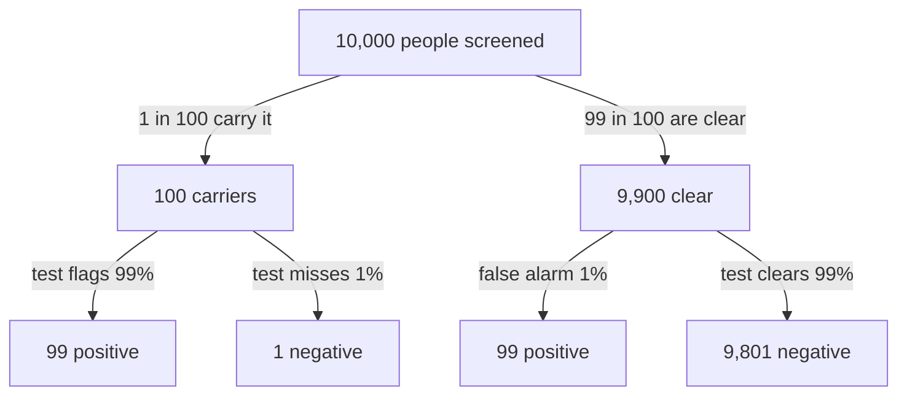
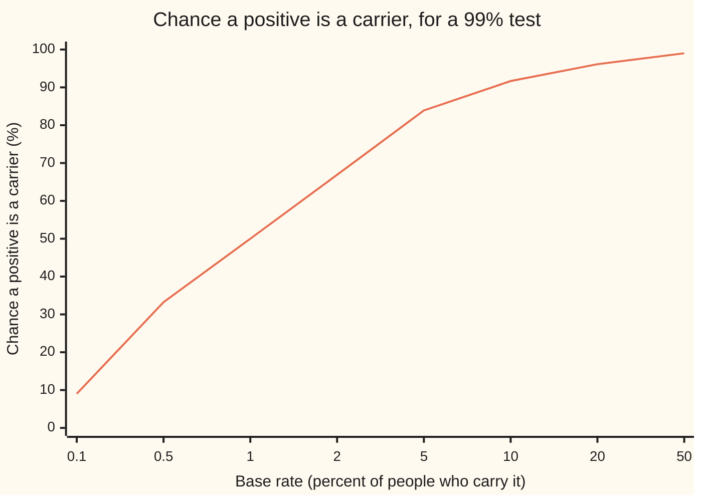

# Bayes' rule: turning the evidence round

[Syllabus](../../../SYLLABUS.md) → [Probability and statistics](../README.md) → [Chance and Events](../README.md#s01) → Bayes' rule

---

## General Overview

A clinic screens 10,000 people for a condition that 1 person in 100 carries. The test is good. It flags 99 of every 100 carriers. It wrongly flags only 1 of every 100 people who are clear. One person's result comes back positive. How likely is it that this person carries the condition?

The instinct says 99 percent. The answer is 50 percent: a coin toss.

Count the people. About 100 of the 10,000 carry the condition, and the test flags 99 of them. The other 9,900 are clear, and the test wrongly flags 1 percent of those: another 99. So 198 people hold a positive result, and only 99 of them carry the condition. Half.

The test knows how often a carrier tests positive. The person holding the result wants the reverse: how often a positive tester is a carrier. Those are different questions with different answers. The rule that turns one into the other is Bayes' rule, named after Thomas Bayes, whose essay on it was published in 1763, two years after his death. It needs one extra ingredient the test cannot supply: how common the condition is before anyone is tested, called the **base rate**.

**Bayes' rule turns the chance of the evidence given a cause into the chance of the cause given the evidence, and the base rate is the ingredient that cannot be left out.**

**What kind of fact this is:** a theorem, proved on this card in Why it works; it follows in two lines from the definition of conditional probability.

### The picture: the 10,000 people, split twice



The two boxes that say "positive" hold 198 people. Only the left one, 99 people, carries the condition. Bayes' rule is the arithmetic of reading this tree from the bottom up.

---

## The formula

Notation from earlier cards, one line each. $P(A)$ is read "the chance of A". $P(A \mid B)$ is read "the chance of A given B": the chance of A counted only among the cases where B happened ([Conditional probability](05-conditional-probability.md)). $A^c$ is read "not A": every case where A fails ([The rules](03-probability-rules-and-complements.md)).

Name the two events. $H$ is the claim under test: "this person carries the condition". $E$ is the evidence: "this person tested positive".

$$P(H \mid E) = \frac{P(E \mid H)\,P(H)}{P(E)}, \qquad P(E) = P(E \mid H)\,P(H) + P(E \mid H^c)\,P(H^c)$$

**Read it aloud:** the chance of the cause given the evidence is the chance of the evidence given the cause, times the base rate of the cause, divided by the total chance of seeing the evidence at all.

The second formula is the law of total probability: a positive result arrives either from a carrier or from someone clear, and the two routes add.

The same rule has a second form that is often easier to use. The **odds** of an event are its chance divided by the chance it fails: odds of 1 to 99 mean 1 case for every 99 against. Write $O(H)$ for the odds of $H$ before the test and $O(H \mid E)$ for the odds after it:

$$O(H \mid E) = L \times O(H), \qquad L = \frac{P(E \mid H)}{P(E \mid H^c)}, \qquad O(H) = \frac{P(H)}{P(H^c)}$$

**Read it aloud:** the odds after the evidence are the odds before it, multiplied by how many times more often the evidence turns up when the claim is true than when it is false.

That multiplier $L$ is called the **likelihood ratio**: the standard name for this one comparison of two chances of the same evidence. For the test, $L = 0.99 / 0.01 = 99$. Odds of 1 to 99 times 99 are odds of 1 to 1. Even odds: 50 percent. To turn odds $O$ back into a chance, compute $O / (1 + O)$.

| Symbol | Plain meaning | In our example | Push it up and the answer… |
| --- | --- | --- | --- |
| $H$ | the claim under test | "carries the condition" | — |
| $E$ | the evidence observed | "tested positive" | — |
| $H^c$ | not $H$: the claim fails | "is clear" | — |
| $H_i$, $H_j$, $i$, $j$, $n$ | one of $n$ claims that do not overlap and cover every case, counted by $i$ or $j$ (the general form) | carrier, clear: $n = 2$ | — |
| $P(H)$ | the base rate: chance of $H$ before any evidence | 0.01 | rises, and steeply at first: 2 percent gives 66.89 percent |
| $P(E \mid H)$ | the test's hit rate: chance of a positive for a carrier | 0.99 | rises a little: already near 1 |
| $P(E \mid H^c)$ | the false-alarm rate: chance of a positive for someone clear | 0.01 | falls: more of the positives are false |
| $P(E)$ | total chance of a positive result | 0.0198 | — (it is computed, not chosen) |
| $P(H \mid E)$ | the answer: chance of $H$ once $E$ is seen | 0.50 | — |
| $O(H)$ | odds of $H$ before the evidence | 1 to 99, or 0.010101 | the odds after rise in proportion |
| $L$ | the likelihood ratio | 99 | rises: stronger evidence |
| $O(H \mid E)$ | odds of $H$ after the evidence | 1 to 1 | — |

### When it holds

- **The evidence must be possible.** $P(E)$ sits in a denominator; if a positive result has chance 0, the rule divides by zero and says nothing.
- **The base rate must belong to the people being tested.** The 1 percent describes the general public. A person sent in with symptoms comes from a group where the rate may be 10 percent, and then the same positive means 91.67 percent.
- **The claims must cover every case, without overlap.** Here that is carrier or clear. If three causes can produce the evidence and one is left out of $P(E)$, the denominator is too small and the answer too large.
- **The hit rate and false-alarm rate must be stable across the group.** A test that misses more often in early cases has no single hit rate, and one number for it misleads.
- **Chaining two results needs them to be independent given the person's true state.** Retesting the same blood sample repeats the same error; Worked numbers shows the price.

---

## Why it works

### Step 0: one overlap, counted from two sides

The 99 people who carry the condition *and* test positive are a single group. Counted from the carriers' side, they are 99 percent of 100 carriers. Counted from the positives' side, they are some unknown share of 198 positives. Both counts describe the same 99 people. Setting the two descriptions equal is the whole of Bayes' rule.

### Step 1: write the overlap both ways

The conditional-probability card defines $P(A \mid B) = P(A \text{ and } B) / P(B)$ whenever $P(B) > 0$. Multiply out, once with $H$ as the condition and once with $E$:

$$P(H \text{ and } E) = P(E \mid H)\,P(H) \qquad\text{and}\qquad P(H \text{ and } E) = P(H \mid E)\,P(E).$$

Both right-hand sides equal the same chance, so they equal each other: $P(H \mid E)\,P(E) = P(E \mid H)\,P(H)$.

In the example the overlap is $0.99 \times 0.01 = 0.0099$: 99 people in 10,000.

### Step 2: divide by the chance of the evidence

Divide both sides by $P(E)$, which is allowed because it is not zero. That gives the first formula. Nothing physical was reversed. Two descriptions of one joint chance were set equal and one was solved for.

### Step 3: find the chance of the evidence by splitting it

$P(E)$ is rarely given directly. Split the positives by who they are. Every positive comes from a carrier or from someone clear, never both:

$$P(E) = P(E \text{ and } H) + P(E \text{ and } H^c) = P(E \mid H)\,P(H) + P(E \mid H^c)\,P(H^c).$$

In the example: $0.99 \times 0.01 + 0.01 \times 0.99 = 0.0099 + 0.0099 = 0.0198$. The true positives and the false positives are exactly equal, which is why the answer lands on one half.

### Step 4: the odds form, where the denominator cancels

Write Step 2 twice, once for $H$ and once for $H^c$, and divide one by the other. Both have the same denominator $P(E)$, and it cancels:

$$\frac{P(H \mid E)}{P(H^c \mid E)} = \frac{P(E \mid H)}{P(E \mid H^c)} \times \frac{P(H)}{P(H^c)}.$$

That is $O(H \mid E) = L \times O(H)$. The odds form needs no total: it keeps the base rate and the strength of the evidence as two separate factors. The base rate sets where the odds start. The test only multiplies.

This makes the base rate's weight visible. A likelihood ratio of 99 is strong evidence. It moves odds of 1 to 99 up to 1 to 1. It cannot move them to 99 to 1, because it started so far down.

### Step 5: a second result multiplies again, if it is fresh evidence

Suppose the person takes a second, separate test with the same error rates, and it too is positive. The odds after the first result become the odds before the second. If the two tests err independently of each other once the person's true state is fixed, the second result multiplies by 99 again: odds of 1 to 1 become 99 to 1, a chance of 99 percent.

The code checks this by counting all 1,000,000 equally likely cases: 9,900 have two positives, and 9,801 of those are carriers. The independence condition is not automatic. A retest of the same sample copies the first result's error, adds nothing, and leaves the answer at 50 percent. When events carry fresh information and when they do not is the subject of [Independence](07-independence.md).

<details>
<summary>Detailed proof</summary>

**Claim.** Let $H_1, \dots, H_n$ be events that do not overlap, cover every case, and each have positive chance. Let $E$ be an event with $P(E) > 0$. Then for each $i$,
$$P(H_i \mid E) = \frac{P(E \mid H_i)\,P(H_i)}{\sum_{j=1}^{n} P(E \mid H_j)\,P(H_j)},$$
and these answers add up to 1.

**Proof.** By the definition of conditional probability, $P(H_i \text{ and } E) = P(E \mid H_i)\,P(H_i)$, since $P(H_i) > 0$. The events "$H_j$ and $E$" for $j = 1, \dots, n$ do not overlap, because the $H_j$ do not. Together they make up $E$, because the $H_j$ cover every case. By the addition rule for events that do not overlap, $P(E) = \sum_j P(H_j \text{ and } E) = \sum_j P(E \mid H_j)\,P(H_j)$. Then $P(H_i \mid E) = P(H_i \text{ and } E) / P(E)$ is the stated fraction. Adding over $i$ gives the sum over $j$ divided by itself: 1.

**The odds form.** Take $n = 2$ with $H_1 = H$ and $H_2 = H^c$, and suppose $P(E \mid H^c) > 0$. Dividing the two fractions cancels the shared denominator and leaves $O(H \mid E) = L \times O(H)$.

**Edge cases.** If $P(E \mid H^c) = 0$ the evidence cannot occur without $H$: the fraction gives $P(H \mid E) = 1$ and the odds are not a finite number. If $P(H) = 0$, the overlap is at most $P(H) = 0$, so $P(H \mid E) = 0$ for any evidence with $P(E) > 0$: a claim given zero chance at the start can never be revived by this rule.

</details>

**The other road: count, do not divide.** The tree in the overview is Bayes' rule written in whole people. Take a round number of cases, split them by the base rate, split each branch by the test's rates, and read off the share of positives that sit under $H$. Psychologists call these counts **natural frequencies**; people given them solve problems like this one far more often than people given percentages. The same counting sits behind [Conditional probability](05-conditional-probability.md).

---

## Worked numbers, by hand

The screening test: base rate 1 percent, hit rate 99 percent, false-alarm rate 1 percent.

| Step | Arithmetic | Value |
| --- | --- | --- |
| overlap, carrier and positive | $0.99 \times 0.01$ | 0.0099 |
| clear and positive | $0.01 \times 0.99$ | 0.0099 |
| $P(E)$, any positive | $0.0099 + 0.0099$ | 0.0198 |
| $P(H \mid E)$ | $0.0099 / 0.0198$ | 0.50 |
| $O(H)$, odds before | $0.01 / 0.99$ | 1 to 99 |
| $L$, likelihood ratio | $0.99 / 0.01$ | 99 |
| $O(H \mid E)$, odds after | $99 \times (1/99)$ | 1 to 1 |
| **answer** | $1 / (1 + 1)$ | **0.50** |

A positive result from this test, on a person drawn from the general public, means a 50 percent chance of carrying the condition: about 1 positive in 2 is a false alarm.

**The house example, as a cross-check.** Two dice at a board game give 36 equally likely outcomes. Let $H$ be "the first die shows 6" and $E$ be "the total is 10". Then $P(E \mid H) = 1/6$, because the second die must show 4. $P(H) = 1/6$. Three outcomes total 10, namely (4, 6), (5, 5) and (6, 4), so $P(E) = 3/36$. Bayes gives $(1/6)(1/6) / (3/36) = 1/3$. Listing the three outcomes directly gives 1 in 3 with a first-die 6. Both checks count all 36 outcomes and agree: 0.333333.

### The picture: the same test at other base rates



One line: the chance that a positive result is a true one, for the same test (hit rate 99 percent, false alarms 1 percent) used on groups with different base rates. The base rates across the bottom are not evenly spaced. At a base rate of 1 in 1,000 a positive is right only about 1 time in 11 (9.02 percent). At 1 in 2 it is right 99 percent of the time. The test never changed. Only the group did.

### What breaks if you drop a piece

Correct answer: 0.50.

| Mistake | Comes out at | What went wrong |
| --- | --- | --- |
| Read the hit rate as the answer | 0.99 | That is $P(E \mid H)$, the chance of a positive for a carrier: the question turned the wrong way round. |
| Leave the clear people's positives out of $P(E)$ | 1.00 | The denominator counts only true positives, so every positive looks real. The 99 false alarms vanished. |
| Multiply the chance, not the odds, by $L$ | 0.99 here; 1.98 at a 2 percent base rate (right: 0.668919) | The likelihood ratio multiplies odds. Applied to a chance it can exceed 1, which no chance can. |
| Count a retest of the same sample as a second test | 0.99 (right: 0.50) | Step 5 needs errors independent given the true state. A retest repeats the first error, so the second positive carries no new information. |

Both checks below print every number in these tables.

---

## Code, from first principles, and it actually runs

The scripts reach the answer by four roads. Road 1 is the formula. Road 2 counts: 100 equally likely status slots (one is a carrier) crossed with 100 equally likely test slots (one is the test's error) give 10,000 equally likely cases, and the script counts the positives and the carriers among them. Road 3 is the odds form. Road 4 draws 400,000 people from a small random-number generator written out in both languages (SplitMix64, seed 20260928), so Python and Rust draw the same numbers; the estimate is printed with its standard error, the typical size of the gap between a simulated share and the true one. The scripts then count all 1,000,000 cases of a two-test sequence, check the dice, and print every "what breaks", "try changing" and chart value on the card. Nothing imported knows the answer; there is no `random` or `statistics` module.

### Python

```python
# Bayes' rule -- the check behind the card.  Standard library only.
# A screening test: 1% of people carry the condition, the test flags 99% of
# carriers and 1% of non-carriers.  Every number quoted on the card is printed.
# Roads: the formula, an exact count over equally likely cases, the odds form,
# and a seeded simulation with its standard error.
from math import sqrt

base, hit, false_alarm = 0.01, 0.99, 0.01   # P(H), P(E | H), P(E | not H)

def bayes(p, s, f):                           # road 1: the formula
    return s * p / (s * p + f * (1.0 - p))

def by_odds(p, s, f):                         # road 3: odds times likelihood ratio
    after = (p / (1.0 - p)) * (s / f)
    return after / (1.0 + after)

def row(label, v):
    print(f"{label:<44} {v:>12.6f}")

# ---- road 1: formula ----
pe = hit * base + false_alarm * (1.0 - base)
post = bayes(base, hit, false_alarm)
row("formula  carrier and positive 0.99*0.01", hit * base)
row("formula  clear and positive 0.01*0.99", false_alarm * (1.0 - base))
row("formula  P(E) = 0.99*0.01 + 0.01*0.99", pe)
row("formula  P(H|E)", post)

# ---- road 2: count.  100 equally likely status slots (slot 0 carries),
# 100 equally likely test slots (slot 0 is the test's error). ----
pos = carriers_pos = 0
for status in range(100):
    for test in range(100):
        carrier = status == 0
        positive = (test != 0) if carrier else (test == 0)
        if positive:
            pos += 1
            carriers_pos += carrier
count_post = carriers_pos / pos
print(f"count    cases 10000, positive {pos}, carriers among them {carriers_pos}")
row("count    P(H|E) = carriers / positives", count_post)

# ---- road 3: odds ----
row("odds     before, 1 to 99", base / (1.0 - base))
row("odds     likelihood ratio 0.99 / 0.01", hit / false_alarm)
row("odds     after", (base / (1.0 - base)) * (hit / false_alarm))
row("odds     P(H|E) = odds / (1 + odds)", by_odds(base, hit, false_alarm))

# ---- road 4: seeded simulation (SplitMix64, seed 20260928) ----
MASK = (1 << 64) - 1
state = 20260928
def uniform():
    global state
    state = (state + 0x9E3779B97F4A7C15) & MASK
    z = state
    z = ((z ^ (z >> 30)) * 0xBF58476D1CE4E5B9) & MASK
    z = ((z ^ (z >> 27)) * 0x94D049BB133111EB) & MASK
    z ^= z >> 31
    return (z >> 11) / 9007199254740992.0
n, sim_pos, sim_car = 400000, 0, 0
for _ in range(n):
    carrier = uniform() < base
    positive = uniform() < (hit if carrier else false_alarm)
    if positive:
        sim_pos += 1
        sim_car += carrier
est = sim_car / sim_pos
se = sqrt(est * (1.0 - est) / sim_pos)
print(f"simulate people {n}, positive {sim_pos}, carriers among them {sim_car}")
row("simulate P(H|E) estimate", est)
row("simulate standard error", se)

# ---- a second, independent positive: count over 100^3 equally likely cases ----
both = both_car = repeat = repeat_car = 0
for status in range(100):
    carrier = status == 0
    for t1 in range(100):
        p1 = (t1 != 0) if carrier else (t1 == 0)
        if p1:                                  # a repeat of the same sample copies t1
            repeat += 1
            repeat_car += carrier
        for t2 in range(100):
            p2 = (t2 != 0) if carrier else (t2 == 0)
            if p1 and p2:
                both += 1
                both_car += carrier
two_count = both_car / both
two_odds = by_odds(post, hit, false_alarm)
print(f"second   cases 1000000, both positive {both}, carriers {both_car}")
row("second   count P(H|E1,E2)", two_count)
row("second   odds 1 x 99 = 99, P(H|E1,E2)", two_odds)

# ---- house example: two dice.  H = first die 6, E = total 10 ----
dice = [(a, b) for a in range(1, 7) for b in range(1, 7)]
ten = [d for d in dice if d[0] + d[1] == 10]
dice_count = sum(1 for d in ten if d[0] == 6) / len(ten)
# P(E) by total probability over the first die, not from the count above
dice_pe = sum((1 / 6) * sum(1 for b in range(1, 7) if a + b == 10) / 6 for a in range(1, 7))
dice_formula = (1 / 6) * (1 / 6) / dice_pe
row("dice     count P(first 6 | total 10)", dice_count)
row("dice     formula (1/6)(1/6)/(3/36)", dice_formula)

# ---- what breaks ----
row("wrong: hit rate read as the answer", hit)
row("wrong: healthy positives left out of P(E)", hit * base / (hit * base))
row("wrong: probability (not odds) times 99", base * hit / false_alarm)
row("wrong: same, at a 2% base rate", 0.02 * hit / false_alarm)
row("  right, at a 2% base rate", bayes(0.02, hit, false_alarm))
row("wrong: repeat of one sample as 2nd test", two_odds)
row("  right, repeat of one sample (count)", repeat_car / repeat)
row("court: innocent matches, 1 in 10000 of 1e6", 1e6 / 10000)

# ---- try changing ----
row("try: base rate 10%", bayes(0.10, hit, false_alarm))
row("try: false alarms 0.1%", bayes(base, hit, 0.001))
row("try: likelihood ratio 0.99 / 0.001", hit / 0.001)
row("try: hit rate 90%", bayes(base, 0.90, false_alarm))
row("try: base rate 50%", bayes(0.50, hit, false_alarm))

# ---- chart: the same test at other base rates (percent) ----
for b in (0.1, 0.5, 1, 2, 5, 10, 20, 50):
    print(f"sweep    base rate {b:>4}%  ->  P(H|E) {100 * bayes(b / 100, hit, false_alarm):6.2f}%")
print("figure, tree: 10000 -> 100 carriers (99 pos, 1 neg), 9900 not (99 pos, 9801 neg)")

# ---- asserts: each side is reached by a different road ----
assert carriers_pos == 99 and pos == 198            # the count, against the tree
assert abs(post - count_post) < 1e-12               # formula vs count
assert abs(by_odds(base, hit, false_alarm) - count_post) < 1e-12   # odds vs count
assert abs(est - post) < 4 * se                     # simulation vs formula
assert abs(two_count - two_odds) < 1e-12            # two tests: count vs odds
assert abs(repeat_car / repeat - two_odds) > 0.4    # a repeat is not a second test
assert abs(dice_count - dice_formula) < 1e-12       # dice: count vs formula
print("all checks passed")
```

**Ran 2026-09-28 on macOS, Python 3.14.6, standard library only. All checks passed. Output, pasted from the run:**

```
formula  carrier and positive 0.99*0.01          0.009900
formula  clear and positive 0.01*0.99            0.009900
formula  P(E) = 0.99*0.01 + 0.01*0.99            0.019800
formula  P(H|E)                                  0.500000
count    cases 10000, positive 198, carriers among them 99
count    P(H|E) = carriers / positives           0.500000
odds     before, 1 to 99                         0.010101
odds     likelihood ratio 0.99 / 0.01           99.000000
odds     after                                   1.000000
odds     P(H|E) = odds / (1 + odds)              0.500000
simulate people 400000, positive 8011, carriers among them 4020
simulate P(H|E) estimate                         0.501810
simulate standard error                          0.005586
second   cases 1000000, both positive 9900, carriers 9801
second   count P(H|E1,E2)                        0.990000
second   odds 1 x 99 = 99, P(H|E1,E2)            0.990000
dice     count P(first 6 | total 10)             0.333333
dice     formula (1/6)(1/6)/(3/36)               0.333333
wrong: hit rate read as the answer               0.990000
wrong: healthy positives left out of P(E)        1.000000
wrong: probability (not odds) times 99           0.990000
wrong: same, at a 2% base rate                   1.980000
  right, at a 2% base rate                       0.668919
wrong: repeat of one sample as 2nd test          0.990000
  right, repeat of one sample (count)            0.500000
court: innocent matches, 1 in 10000 of 1e6     100.000000
try: base rate 10%                               0.916667
try: false alarms 0.1%                           0.909091
try: likelihood ratio 0.99 / 0.001             990.000000
try: hit rate 90%                                0.476190
try: base rate 50%                               0.990000
sweep    base rate  0.1%  ->  P(H|E)   9.02%
sweep    base rate  0.5%  ->  P(H|E)  33.22%
sweep    base rate    1%  ->  P(H|E)  50.00%
sweep    base rate    2%  ->  P(H|E)  66.89%
sweep    base rate    5%  ->  P(H|E)  83.90%
sweep    base rate   10%  ->  P(H|E)  91.67%
sweep    base rate   20%  ->  P(H|E)  96.12%
sweep    base rate   50%  ->  P(H|E)  99.00%
figure, tree: 10000 -> 100 carriers (99 pos, 1 neg), 9900 not (99 pos, 9801 neg)
all checks passed
```

### Rust

```rust
// Bayes' rule -- the check behind the card.  Rust std only, no crates.
// A screening test: 1% of people carry the condition, the test flags 99% of
// carriers and 1% of non-carriers.  Every number quoted on the card is printed.
// Roads: the formula, an exact count over equally likely cases, the odds form,
// and a seeded simulation with its standard error.

fn bayes(p: f64, s: f64, f: f64) -> f64 {
    // road 1: the formula
    s * p / (s * p + f * (1.0 - p))
}

fn by_odds(p: f64, s: f64, f: f64) -> f64 {
    // road 3: odds times likelihood ratio
    let after = (p / (1.0 - p)) * (s / f);
    after / (1.0 + after)
}

fn row(label: &str, v: f64) {
    println!("{:<44} {:>12.6}", label, v);
}

struct SplitMix64(u64);
impl SplitMix64 {
    fn uniform(&mut self) -> f64 {
        self.0 = self.0.wrapping_add(0x9E3779B97F4A7C15);
        let mut z = self.0;
        z = (z ^ (z >> 30)).wrapping_mul(0xBF58476D1CE4E5B9);
        z = (z ^ (z >> 27)).wrapping_mul(0x94D049BB133111EB);
        z ^= z >> 31;
        (z >> 11) as f64 / 9007199254740992.0
    }
}

fn main() {
    let (base, hit, false_alarm) = (0.01_f64, 0.99_f64, 0.01_f64);

    // ---- road 1: formula ----
    let pe = hit * base + false_alarm * (1.0 - base);
    let post = bayes(base, hit, false_alarm);
    row("formula  carrier and positive 0.99*0.01", hit * base);
    row("formula  clear and positive 0.01*0.99", false_alarm * (1.0 - base));
    row("formula  P(E) = 0.99*0.01 + 0.01*0.99", pe);
    row("formula  P(H|E)", post);

    // ---- road 2: count over 100 x 100 equally likely cases ----
    let (mut pos, mut carriers_pos) = (0u64, 0u64);
    for status in 0..100 {
        for test in 0..100 {
            let carrier = status == 0;
            let positive = if carrier { test != 0 } else { test == 0 };
            if positive {
                pos += 1;
                if carrier { carriers_pos += 1; }
            }
        }
    }
    let count_post = carriers_pos as f64 / pos as f64;
    println!("count    cases 10000, positive {}, carriers among them {}", pos, carriers_pos);
    row("count    P(H|E) = carriers / positives", count_post);

    // ---- road 3: odds ----
    row("odds     before, 1 to 99", base / (1.0 - base));
    row("odds     likelihood ratio 0.99 / 0.01", hit / false_alarm);
    row("odds     after", (base / (1.0 - base)) * (hit / false_alarm));
    row("odds     P(H|E) = odds / (1 + odds)", by_odds(base, hit, false_alarm));

    // ---- road 4: seeded simulation (SplitMix64, seed 20260928) ----
    let mut rng = SplitMix64(20260928);
    let (n, mut sim_pos, mut sim_car) = (400000u64, 0u64, 0u64);
    for _ in 0..n {
        let carrier = rng.uniform() < base;
        let positive = rng.uniform() < if carrier { hit } else { false_alarm };
        if positive {
            sim_pos += 1;
            if carrier { sim_car += 1; }
        }
    }
    let est = sim_car as f64 / sim_pos as f64;
    let se = (est * (1.0 - est) / sim_pos as f64).sqrt();
    println!("simulate people {}, positive {}, carriers among them {}", n, sim_pos, sim_car);
    row("simulate P(H|E) estimate", est);
    row("simulate standard error", se);

    // ---- a second, independent positive: count over 100^3 equally likely cases ----
    let (mut both, mut both_car, mut repeat, mut repeat_car) = (0u64, 0u64, 0u64, 0u64);
    for status in 0..100 {
        let carrier = status == 0;
        for t1 in 0..100 {
            let p1 = if carrier { t1 != 0 } else { t1 == 0 };
            if p1 {
                // a repeat of the same sample copies t1
                repeat += 1;
                if carrier { repeat_car += 1; }
            }
            for t2 in 0..100 {
                let p2 = if carrier { t2 != 0 } else { t2 == 0 };
                if p1 && p2 {
                    both += 1;
                    if carrier { both_car += 1; }
                }
            }
        }
    }
    let two_count = both_car as f64 / both as f64;
    let two_odds = by_odds(post, hit, false_alarm);
    println!("second   cases 1000000, both positive {}, carriers {}", both, both_car);
    row("second   count P(H|E1,E2)", two_count);
    row("second   odds 1 x 99 = 99, P(H|E1,E2)", two_odds);

    // ---- house example: two dice.  H = first die 6, E = total 10 ----
    let (mut ten, mut ten_six) = (0u32, 0u32);
    for a in 1..=6 {
        for b in 1..=6 {
            if a + b == 10 {
                ten += 1;
                if a == 6 { ten_six += 1; }
            }
        }
    }
    let dice_count = ten_six as f64 / ten as f64;
    // P(E) by total probability over the first die, not from the count above
    let mut dice_pe = 0.0_f64;
    for a in 1..=6 {
        let k = (1..=6).filter(|b| a + b == 10).count();
        dice_pe += (1.0 / 6.0) * (k as f64 / 6.0);
    }
    let dice_formula = (1.0 / 6.0) * (1.0 / 6.0) / dice_pe;
    row("dice     count P(first 6 | total 10)", dice_count);
    row("dice     formula (1/6)(1/6)/(3/36)", dice_formula);

    // ---- what breaks ----
    row("wrong: hit rate read as the answer", hit);
    row("wrong: healthy positives left out of P(E)", hit * base / (hit * base));
    row("wrong: probability (not odds) times 99", base * hit / false_alarm);
    row("wrong: same, at a 2% base rate", 0.02 * hit / false_alarm);
    row("  right, at a 2% base rate", bayes(0.02, hit, false_alarm));
    row("wrong: repeat of one sample as 2nd test", two_odds);
    row("  right, repeat of one sample (count)", repeat_car as f64 / repeat as f64);
    row("court: innocent matches, 1 in 10000 of 1e6", 1e6 / 10000.0);

    // ---- try changing ----
    row("try: base rate 10%", bayes(0.10, hit, false_alarm));
    row("try: false alarms 0.1%", bayes(base, hit, 0.001));
    row("try: likelihood ratio 0.99 / 0.001", hit / 0.001);
    row("try: hit rate 90%", bayes(base, 0.90, false_alarm));
    row("try: base rate 50%", bayes(0.50, hit, false_alarm));

    // ---- chart: the same test at other base rates (percent) ----
    for b in ["0.1", "0.5", "1", "2", "5", "10", "20", "50"] {
        let r: f64 = b.parse().unwrap();
        println!("sweep    base rate {:>4}%  ->  P(H|E) {:6.2}%", b, 100.0 * bayes(r / 100.0, hit, false_alarm));
    }
    println!("figure, tree: 10000 -> 100 carriers (99 pos, 1 neg), 9900 not (99 pos, 9801 neg)");

    // ---- asserts: each side is reached by a different road ----
    assert!(carriers_pos == 99 && pos == 198); // the count, against the tree
    assert!((post - count_post).abs() < 1e-12); // formula vs count
    assert!((by_odds(base, hit, false_alarm) - count_post).abs() < 1e-12); // odds vs count
    assert!((est - post).abs() < 4.0 * se); // simulation vs formula
    assert!((two_count - two_odds).abs() < 1e-12); // two tests: count vs odds
    assert!((repeat_car as f64 / repeat as f64 - two_odds).abs() > 0.4); // a repeat is not a second test
    assert!((dice_count - dice_formula).abs() < 1e-12); // dice: count vs formula
    println!("all checks passed");
}
```

**Ran 2026-09-28 on macOS, rustc 1.98.1, no crates. All checks passed. Output, pasted from the run:**

```
formula  carrier and positive 0.99*0.01          0.009900
formula  clear and positive 0.01*0.99            0.009900
formula  P(E) = 0.99*0.01 + 0.01*0.99            0.019800
formula  P(H|E)                                  0.500000
count    cases 10000, positive 198, carriers among them 99
count    P(H|E) = carriers / positives           0.500000
odds     before, 1 to 99                         0.010101
odds     likelihood ratio 0.99 / 0.01           99.000000
odds     after                                   1.000000
odds     P(H|E) = odds / (1 + odds)              0.500000
simulate people 400000, positive 8011, carriers among them 4020
simulate P(H|E) estimate                         0.501810
simulate standard error                          0.005586
second   cases 1000000, both positive 9900, carriers 9801
second   count P(H|E1,E2)                        0.990000
second   odds 1 x 99 = 99, P(H|E1,E2)            0.990000
dice     count P(first 6 | total 10)             0.333333
dice     formula (1/6)(1/6)/(3/36)               0.333333
wrong: hit rate read as the answer               0.990000
wrong: healthy positives left out of P(E)        1.000000
wrong: probability (not odds) times 99           0.990000
wrong: same, at a 2% base rate                   1.980000
  right, at a 2% base rate                       0.668919
wrong: repeat of one sample as 2nd test          0.990000
  right, repeat of one sample (count)            0.500000
court: innocent matches, 1 in 10000 of 1e6     100.000000
try: base rate 10%                               0.916667
try: false alarms 0.1%                           0.909091
try: likelihood ratio 0.99 / 0.001             990.000000
try: hit rate 90%                                0.476190
try: base rate 50%                               0.990000
sweep    base rate  0.1%  ->  P(H|E)   9.02%
sweep    base rate  0.5%  ->  P(H|E)  33.22%
sweep    base rate    1%  ->  P(H|E)  50.00%
sweep    base rate    2%  ->  P(H|E)  66.89%
sweep    base rate    5%  ->  P(H|E)  83.90%
sweep    base rate   10%  ->  P(H|E)  91.67%
sweep    base rate   20%  ->  P(H|E)  96.12%
sweep    base rate   50%  ->  P(H|E)  99.00%
figure, tree: 10000 -> 100 carriers (99 pos, 1 neg), 9900 not (99 pos, 9801 neg)
all checks passed
```

The two outputs are identical line for line.

The simulation found 8,011 positives among 400,000 people, 4,020 of them carriers: an estimate of 0.501810 with a standard error of 0.005586. The true 0.50 sits a third of a standard error away. The assert allows four.

> [!TIP]
> **Try changing**
> - **Screen a referred group.** Guess first: a clinic sees only people with symptoms, and the base rate there is 10 percent. Set `base = 0.10`. A positive now means 0.916667: about 11 positives in 12 are real.
> - **Cut the false alarms tenfold.** Guess first: keep the 1 percent base rate and make false alarms 0.1 percent. Set `false_alarm = 0.001`. The answer rises to 0.909091, because the likelihood ratio grows from 99 to 990.
> - **Lower the hit rate.** Guess first: a cheaper test catches 90 percent of carriers, same false alarms. Set `hit = 0.90`. The answer falls only to 0.476190: at a low base rate the false alarms decide the answer, not the misses.
> - **Screen everyone twice with a fresh test.** Guess first: two independent positives. The second-test block already prints it: 0.990000.

---

## The usual mistake

> [!warning]
> **Turning the condition round without the base rate.** "The test is 99 percent accurate, so a positive means 99 percent" confuses $P(E \mid H)$ with $P(H \mid E)$. The first is a fact about the test. The second depends on how common the condition is among the people tested, and here it is 50 percent. In a 1978 survey of 60 doctors and medical students at Harvard teaching hospitals, the commonest answer to a problem of this kind was 95 percent where the right one was about 2 percent.
>
> - **In court.** "The chance an innocent person matches the evidence is 1 in 10,000" is $P(E \mid H^c)$. It is not the chance the defendant is innocent. In a city of a million, about 100 innocent people match. Reading one as the other is called the prosecutor's fallacy.

---

## Where you meet it in real life

- **Medical screening.** Screening programmes for rare conditions follow a positive with a second, different test, because a single positive at a low base rate is often a false alarm. The second test multiplies the odds again.
- **Spam filters.** A filter scores each word by how much more often it appears in spam than in normal mail, a likelihood ratio, and multiplies the odds word by word. The multiplication assumes words are independent given the class; they are not quite, and the filter works well in practice anyway.
- **Courtrooms.** Forensic guidelines in several countries ask experts to report a likelihood ratio ("this match is 10,000 times more likely if the suspect was present") and leave the base rate to the court.
- **Trading.** A market maker who fills an order updates the chance that the other side knows something: [The spread](../../12-Financial%20mathematics/49-Microstructure%20and%20Execution/02-bid-ask-spread-and-adverse-selection.md).

> **Say it back**
> The chance of the evidence given a cause and the chance of the cause given the evidence are different numbers. Bayes' rule connects them: multiply the first by the base rate, then divide by the total chance of the evidence. In odds, the rule is a single multiplication: the odds after equal the odds before times the likelihood ratio. A 99 percent test on a 1 percent condition moves odds of 1 to 99 to odds of 1 to 1, so a positive means 50 percent. A second independent positive multiplies by 99 again; a repeat of the same reading does not.

---

## What this builds on

- [Conditional probability](05-conditional-probability.md): the definition of the chance of A given B, the multiplication rule used in Step 1, and the law of total probability used in Step 3.

## Where this goes next

- [Bayesian updating](../10-Bayesian%20Inference/01-priors-posteriors-and-updating.md): the base rate becomes a whole distribution of beliefs about an unknown number, updated by data.
- [Conditioning on a random variable](../../10-Measure%20and%20integration/09-Conditional%20Expectation/05-conditioning-on-a-random-variable.md): conditioning on evidence that has chance zero, such as an exact measurement, where the division here breaks.
- [Hidden Markov models](../../11-Stochastic%20processes%20and%20calculus/03-Markov%20Chains/08-hidden-markov-models.md): Bayes' rule applied step after step to a hidden state that changes over time.
- [The spread](../../12-Financial%20mathematics/49-Microstructure%20and%20Execution/02-bid-ask-spread-and-adverse-selection.md): a dealer's quote as the answer to a Bayes update on who is trading.
- Deciding under uncertainty: what a test is worth before it is run, priced by the decisions its result would change.

[Independence](07-independence.md) answers the question Step 5 left open: when does a second piece of evidence carry fresh information, so that its likelihood ratio may be multiplied in?

---

## Sources

Verified 2026-09-28: every link below resolves to the publisher's page.

- Bayes, Thomas, and Richard Price. "An Essay towards Solving a Problem in the Doctrine of Chances." *Philosophical Transactions of the Royal Society of London* 53 (1763): 370–418. [doi:10.1098/rstl.1763.0053](https://doi.org/10.1098/rstl.1763.0053). The original, published by Price after Bayes's death.
- Blitzstein, Joseph K., and Jessica Hwang. *Introduction to Probability*, 2nd ed. CRC Press, 2019. [Publisher page](https://www.routledge.com/Introduction-to-Probability-Second-Edition/Blitzstein-Hwang/p/book/9781138369917). Chapter 2 derives Bayes' rule, its odds form, and the testing example.
- Casscells, Ward, Arno Schoenberger, and Thomas B. Graboys. "Interpretation by Physicians of Clinical Laboratory Results." *New England Journal of Medicine* 299 (1978): 999–1001. [doi:10.1056/NEJM197811022991808](https://doi.org/10.1056/NEJM197811022991808). The hospital survey quoted under The usual mistake.
- Gigerenzer, Gerd, and Ulrich Hoffrage. "How to Improve Bayesian Reasoning without Instruction: Frequency Formats." *Psychological Review* 102, no. 4 (1995): 684–704. [doi:10.1037/0033-295X.102.4.684](https://doi.org/10.1037/0033-295X.102.4.684). Why counting whole people, as in the tree, beats percentages.
