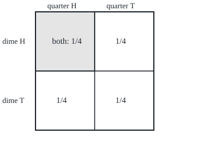
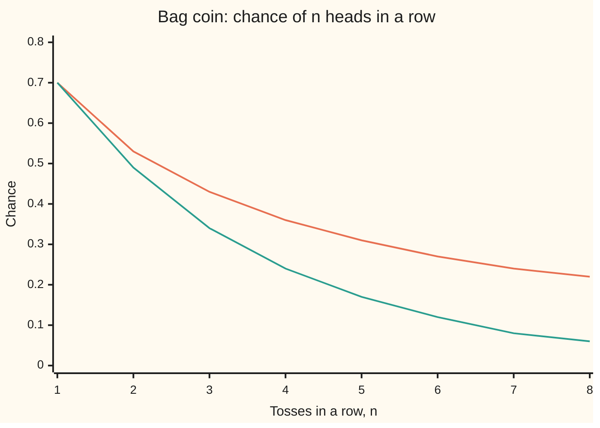

# Independence: when knowing one event says nothing about another

Probability and statistics → Chance and Events → The product rule for chances → Independence

---

## General Overview

Toss a quarter and a dime together. Four outcomes are equally likely: both heads, quarter heads and dime tails, quarter tails and dime heads, both tails. The quarter lands heads in 2 of the 4, a chance of 0.5. Now peek at the dime and see heads. Two outcomes remain, and the quarter is heads in one of them: still 0.5. The dime told nothing about the quarter. That is **independence**.

Now compare the quarter with its own outcome, recorded twice on two sheets of paper. Each sheet says heads with chance 0.5, but once the first is read, the second is certain. The two records are as far from independent as two events can be.

Independence is the condition under which chances multiply: two heads from two coins is 0.5 × 0.5 = 0.25, about 1 toss in 4. Multiply chances of dependent events and the answer can be badly wrong. Below: pair checks are not enough for three events, learning a fact can create or destroy independence, and a Simpson reversal shows a comparison that runs one way inside every group and the other way in the total.

**Two events are independent when the chance that both happen equals the product of their separate chances; equivalently, learning that one happened leaves the other's chance where it was.**

**What kind of fact this is:** a definition; the facts built on it (complements, the pairwise gap, when conditioning breaks it, when a pooled comparison can reverse) are theorems proved on this card in Why it works.

### The picture: independence as a rectangle

The square below has area 1 and stands for all four outcomes of the two coins. The left half is "quarter heads", the top half is "dime heads". The shaded corner, where both happen, is half of a half: area 0.25. Drawn to scale.

<p align="center"></p>

The dime's strip cuts the quarter's half in the same proportion as it cuts the whole square. That equal cut is independence.

---

## The formula

Two pieces of notation from earlier on this shelf. $P(A)$ is the chance of the event A, read "the chance of A" ([sample-spaces-and-events](02-sample-spaces-and-events.md)). $P(A \mid B)$ is the chance of A once B is known to have happened, read "the chance of A given B" ([conditional-probability](05-conditional-probability.md)). The cap sign $A \cap B$ means "both A and B happen".

$$P(A \cap B) = P(A)\,P(B)$$

**Read it aloud:** the chance that both happen is the chance of the first times the chance of the second.

When $P(B)$ is above zero, dividing both sides by it gives the version that matches the word:

$$P(A \mid B) = P(A)$$

**Read it aloud:** learning B leaves the chance of A unchanged.

For a list of events $A_1, A_2, \dots, A_k$ there are two different claims. **Pairwise independent** means every two of them pass the product rule. **Mutually independent** means every choice of two or more passes:

$$P(A_{1} \cap A_{2} \cap \cdots \cap A_{k}) = P(A_{1})\,P(A_{2}) \cdots P(A_{k}) \quad\text{for every sub-list of two or more}$$

For three events that is four equations: three pairs and one triple. For $k$ events it is $2^k - k - 1$.

**Conditional independence** is the same product rule applied after a fact $G$ is known:

$$P(A \cap B \mid G) = P(A \mid G)\,P(B \mid G)$$

A **Simpson reversal** is about pooled rates. Mint X's overall acceptance rate is a weighted average of its rates on quarters and on dimes:

$$\text{pooled rate of X} = w_X\,x_Q + (1 - w_X)\,x_D$$

| Symbol | Plain meaning | In our example | Push it up and the answer… |
| --- | --- | --- | --- |
| $A$, $B$ | two events: sets of outcomes | quarter heads; dime heads | a bigger event overlaps more |
| $P(A)$, $P$, $p$ | the chance of an event, a number from 0 to 1; $p$ when it stands alone | 0.5 for each coin | the product P(A)P(B) grows with it |
| $A \cap B$ | both events happen | both coins heads, chance 0.25 | independence needs it to equal the product |
| $P(A \mid B)$ | the chance of A once B is known | 0.5: the dime says nothing | above P(A) means B favours A |
| $A^c$ | "not A", the complement: A fails | quarter tails | independence of A and B carries over to it |
| $C$ | a third event | the two coins match | three events need four checks, not three |
| $A_1$, $A_2$, $k$ | a list of $k$ events, numbered | three separate coins | each extra event roughly doubles the checks |
| $G$, $M$ | a fact known first; $M$ = "at least one head" | which coin came out of the bag; M covers 3 of 4 outcomes | conditioning can make or break independence |
| $H_1$, $H_2$ | first and second toss of the bag coin land heads | chance 0.7 each | they rise and fall together |
| $q$ | the bent coin's chance of heads | 0.9 | the further from 0.5, the stronger the link between tosses |
| $n$ | tosses in a row | 1 to 8 on the chart | the independence shortcut falls further behind |
| $x_Q$, $x_D$, $y_Q$, $y_D$, $w_X$, $w_Y$ | mint X's and Y's acceptance rates on quarters and dimes; each mint's share of quarters | 0.9, 0.625, 0.85, 0.6; shares 0.2 and 0.8 | unequal shares let the pooled rates reverse |

### When it holds

- **A definition, tested by the product rule.** It is a property of the chances assigned, not of the objects. Two physical coins are given independent chances because neither can feel the other; a coin and its own record never pass the test.
- **One set of chances.** Change the chances, for example by learning a fact, and independence must be checked again: the two coins are independent, but not once "at least one head" is known.
- **Division needs a possible event.** The form $P(A \mid B) = P(A)$ needs $P(B)$ above zero. The product form needs nothing, so an impossible event is independent of everything.
- **Three or more events need every sub-list.** Pairwise checks miss a link that only shows up in the triple.

---

## Why it works

### Step 0: the idea is an equal cut

"Knowing B changes nothing about A" means B takes the same fraction of A as of everything, as the dime's strip does in the square. Every result below reads that picture carefully.

### Step 1: from "learning B changes nothing" to the product

The conditional-probability card defines $P(A \mid B) = P(A \cap B) / P(B)$ when $P(B)$ is above zero. Set it equal to $P(A)$ and multiply both sides by $P(B)$:

$$P(A \cap B) = P(A)\,P(B)$$

The steps also run backwards, so the two forms agree whenever $P(B)$ is above zero. The product form is the definition for two reasons: it is symmetric, saying in one line that neither event informs the other, and it needs no division, so it still makes sense when $P(B) = 0$. For the coins: $P(A \cap B) = 0.25$ and $0.5 \times 0.5 = 0.25$, so the quarter and the dime are independent; given the dime shows heads, the quarter is heads with chance 0.25 / 0.5 = 0.5.

### Step 2: complements come for free

If A and B are independent, so are A and "not B". The event A splits into the part inside B and the part outside, so

$$P(A \cap B^c) = P(A) - P(A \cap B) = P(A) - P(A)P(B) = P(A)\,(1 - P(B)) = P(A)\,P(B^c)$$

The last step uses the complement rule, $P(B^c) = 1 - P(B)$ ([probability-rules-and-complements](03-probability-rules-and-complements.md)). On the coins: quarter heads and dime tails has chance 0.25, and 0.5 × 0.5 = 0.25. Swapping roles gives "not A" with B, and doing it twice gives "not A" with "not B".

### Step 3: a coin and its own outcome

An event with chance $p$ is independent of itself only if $p = p \times p$, which forces $p = 0$ or $p = 1$. So the quarter's heads and the quarter's heads again, with chance 0.5, are dependent: the joint chance is 0.5, the product is 0.25.

The other extreme is just as dependent. "Quarter heads" and "quarter tails" cannot both happen, so their joint chance is 0, while the product is 0.25. Two events that exclude each other, each with a chance above zero, are never independent: learning one happened makes the other impossible. **Disjoint is the opposite of independent, not a kind of it.**

### Step 4: every pair can pass while the triple fails

Add a third event to the two coins: C is "the two coins match", both heads or both tails. C has chance 0.5. Each pair overlaps in the single outcome both-heads, chance 0.25, which equals 0.5 × 0.5. So A, B and C are pairwise independent. Knowing the quarter alone says nothing about a match; knowing the dime alone says nothing either.

But all three happen together only at both-heads, chance 0.25, while the product of three halves is 0.125. Knowing both coins settles the match completely. The link lives in the triple, and no pair can see it. That is why mutual independence asks for every sub-list: 3 of the 4 equations hold here, and the fourth fails. Three separate coins, a quarter, a dime and a nickel, pass all 4.

### Step 5: learning a fact can break independence, or create it

Conditional independence and plain independence do not imply each other. Each direction has a coin example.

**Independent, then dependent.** The quarter and the dime are independent. Now learn M: at least one coin shows heads. Three outcomes remain, equally likely. The quarter is heads in 2 of them, chance 2/3; the dime likewise. Both heads is 1 of the 3, chance 1/3. The product would be 4/9, about 0.4444. Given M, a tails on the dime forces heads on the quarter.

**Dependent, then independent.** A bag holds a fair coin and a bent coin that lands heads with chance $q = 0.9$. Draw one blind, with chance 0.5 each, and toss it twice. Given which coin was drawn, the two tosses are independent: $0.5 \times 0.5 = 0.25$ for the fair coin, $0.9 \times 0.9 = 0.81$ for the bent one. Without knowing the coin, add over the two ways:

$$P(H_1) = 0.5 \times 0.5 + 0.5 \times 0.9 = 0.7 \qquad P(H_1 \cap H_2) = 0.5 \times 0.25 + 0.5 \times 0.81 = 0.53$$

The product would be $0.7 \times 0.7 = 0.49$, not 0.53. A first head is evidence that the bent coin came out, so it raises the chance of a second head from 0.7 to 0.53 / 0.7, about 0.7571. The tosses share a hidden cause, the coin drawn: fixing it makes them independent, averaging over it makes them dependent. The update is Bayes' rule ([bayes-rule](06-bayes-rule.md)).

### Step 6: a Simpson reversal

Two mints, X and Y, strike quarters and dimes. A counting machine accepts each coin or rejects it on the first pass. The counts:

| Mint | Quarters accepted | Dimes accepted | All coins |
| --- | --- | --- | --- |
| X | 90 of 100, rate 0.9000 | 250 of 400, rate 0.6250 | 340 of 500, rate 0.6800 |
| Y | 340 of 400, rate 0.8500 | 60 of 100, rate 0.6000 | 400 of 500, rate 0.8000 |

X beats Y on quarters and on dimes, yet Y beats X overall. Each pooled rate is a weighted average, and the weights differ: X struck mostly dimes, the harder coin, a quarter share of $w_X = 0.2$; Y mostly quarters, $w_Y = 0.8$. Coin type and mint are dependent, and without that dependence no reversal is possible. The pooled gap, −0.1200, splits into the gaps inside each coin type, worth +0.0300, and the different mix, worth −0.1500. Give both mints the same mix, say half quarters and half dimes, and X comes out ahead, 0.7625 against 0.7250. **If coin type were independent of mint, the reversal could not happen.** The proof is folded below.

<details>
<summary>Detailed proof</summary>

**Complements in a longer list.** Suppose $A_1, \dots, A_k$ are mutually independent and $A_1$ is replaced by its complement. Take any sub-list that contains $A_1$, and let D be the event that all the other members of the sub-list happen. Mutual independence gives $P(D)$ as the product of their chances, and $P(D \cap A_1) = P(D)\,P(A_1)$. Then $P(D \cap A_1^c) = P(D) - P(D \cap A_1) = P(D)\,(1 - P(A_1))$, which is the product rule for the new sub-list. Sub-lists without $A_1$ are untouched. Repeat one event at a time: any mix of events and complements from a mutually independent list is mutually independent.

**The pooled gap, split in two.** Write the pooled rates as $w_X x_Q + (1 - w_X) x_D$ and $w_Y y_Q + (1 - w_Y) y_D$. Add and subtract Y's rates weighted by X's mix:

$$\text{X} - \text{Y} = \underbrace{w_X (x_Q - y_Q) + (1 - w_X)(x_D - y_D)}_{\text{inside each coin type}} + \underbrace{(w_X - w_Y)(y_Q - y_D)}_{\text{different mix}}$$

Check it on the mints: $0.2 \times 0.05 + 0.8 \times 0.025 = 0.03$, and $(0.2 - 0.8)(0.85 - 0.6) = -0.15$; the sum, −0.12, is 0.68 − 0.80.

**No reversal under independence.** Coin type independent of mint means $P(\text{quarter} \mid X) = P(\text{quarter} \mid Y)$, that is $w_X = w_Y$. The second term is then zero. If X is ahead inside both coin types, both differences in the first term are positive and their weights are between 0 and 1 and add to 1, so the first term is positive. X stays ahead overall. A reversal needs $w_X \ne w_Y$, and it needs the mix term to outweigh the within-type term.

</details>

The proof above is a finite count. The version for chances spread over a continuum, where independence becomes a product of whole distributions, is [independence-as-a-product-measure](../../10-Measure%20and%20integration/06-Product%20Measures%20and%20Fubini/04-independence-as-a-product-measure.md).

---

## Worked numbers, by hand

The two coins and the bag coin, side by side.

| Step | Arithmetic | Value |
| --- | --- | --- |
| Quarter heads, P(A) | 2 outcomes of 4 | 0.5 |
| Dime heads, P(B) | 2 outcomes of 4 | 0.5 |
| Both heads, P(A ∩ B) | 1 outcome of 4 | 0.25 |
| Product P(A)P(B) | 0.5 × 0.5 | 0.25: **the coins are independent** |
| Bag coin, first toss heads | 0.5 × 0.5 + 0.5 × 0.9 | 0.7 |
| Bag coin, two heads | 0.5 × 0.25 + 0.5 × 0.81 | 0.53 |
| Product of the singles | 0.7 × 0.7 | 0.49 |
| Second head given the first | 0.53 / 0.7 | **0.7571: the tosses are dependent** |

Two coins show two heads about 1 time in 4. The bag coin shows two heads 53 times in 100, and a first head lifts the chance of a second from 70% to about 76%.

### The picture: the shortcut falls behind

Assume the bag coin's tosses are independent with chance 0.7 each, and the chance of $n$ heads in a row is $0.7^n$. The truth is $0.5 \times 0.5^n + 0.5 \times 0.9^n$.



Orange, upper line: the true chance, drawing one coin and tossing it n times. Green, lower line: the answer from multiplying 0.7 by itself n times, as if the tosses were independent. At 8 tosses the truth is 0.2172 and the shortcut says 0.0576, far too small.

### What breaks if you drop a piece

| Mistake | Comes out at | What went wrong |
| --- | --- | --- |
| Multiply the bag coin's tosses | 0.4900 for two heads, true 0.5300 | the tosses share a hidden cause, the coin drawn |
| Treat pairwise as mutual | 0.1250 for A, B and C together, true 0.2500 | the match event is fixed by the two coins |
| Treat "quarter heads" and "quarter tails" as independent | 0.2500 for both, true 0 | events that exclude each other are dependent |
| Keep the coins independent after learning M | 0.4444 for both heads, true 0.3333 | learning a fact changes the chances |
| Compare the mints' pooled rates | X looks 0.1200 worse | X is better on each coin type; the mixes differ |

---

## Code, from first principles, and it actually runs

The checks reach each answer by **three independent roads**: the formula (the product rule, or adding over the coin drawn), a count over every outcome with its weight, and a seeded simulation of 100,000 trials printed with its standard error, the typical size of a simulation's chance error. Random numbers come from SplitMix64, a small generator written out in both languages with seed 20260928, so both print the same digits. The checks also count which product equations hold, rebuild the mint table two ways, and print every number on the card.

### Python

```python
# Independence -- the check behind the card. Standard library only.
# Roads: the product formula, a count over every outcome, a seeded simulation.
from math import sqrt

M64 = (1 << 64) - 1
def splitmix(s):                     # SplitMix64: returns (new state, 64-bit draw)
    s = (s + 0x9E3779B97F4A7C15) & M64
    z = ((s ^ (s >> 30)) * 0xBF58476D1CE4E5B9) & M64
    z = ((z ^ (z >> 27)) * 0x94D049BB133111EB) & M64
    return s, z ^ (z >> 31)
def uniform(s):
    s, z = splitmix(s)
    return s, (z >> 11) / 9007199254740992.0

def f4(x): return f"{x:.4f}"
def prob(outcomes, event):          # enumerated road: add the weights of outcomes in the event
    tot = sum(w for _, w in outcomes)
    return sum(w for o, w in outcomes if event(o)) / tot

# ---- two fair coins, a quarter and a dime: 4 outcomes, weight 1 each ----
coins = [((q, d), 1) for q in (1, 0) for d in (1, 0)]
A = lambda o: o[0] == 1              # quarter heads
B = lambda o: o[1] == 1              # dime heads
C = lambda o: o[0] == o[1]           # the coins match
Ac = lambda o: not A(o)
both = lambda e, f: (lambda o: e(o) and f(o))
pA, pB, pAB = prob(coins, A), prob(coins, B), prob(coins, both(A, B))
assert abs(pAB - pA * pB) < 1e-12    # counted overlap equals the product of the counted chances
print("two coins: P(A) =", f4(pA), " P(B) =", f4(pB), " P(A and B) =", f4(pAB), " product =", f4(pA * pB))
print("given the dime: P(A | B) =", f4(pAB / pB))
pABc = prob(coins, both(A, lambda o: not B(o)))
assert abs(pABc - pA * (1 - pB)) < 1e-12 and prob(coins, both(A, Ac)) == 0 < pA * (1 - pA)
print("A with not-B: joint =", f4(pABc), " product =", f4(pA * (1 - pB)))
print("A with itself: joint =", f4(prob(coins, both(A, A))), " product =", f4(pA * pA))
print("A with not-A: joint =", f4(prob(coins, both(A, Ac))), " product =", f4(pA * (1 - pA)))

# ---- pairwise versus mutual ----
def equations(outcomes, events):     # every choice of two or more events: does the product rule hold?
    held, n = 0, len(events)
    subsets = [m for m in range(1, 1 << n) if bin(m).count("1") >= 2]
    for m in subsets:
        chosen = [events[i] for i in range(n) if m >> i & 1]
        joint = prob(outcomes, lambda o: all(e(o) for e in chosen))
        prod = 1.0
        for e in chosen: prod *= prob(outcomes, e)
        held += abs(joint - prod) < 1e-12
    return held, len(subsets)
h3, t3 = equations(coins, [A, B, C])
pABC = prob(coins, lambda o: A(o) and B(o) and C(o))
assert (h3, t3) == (3, 4) and abs(pABC - 0.125) > 0.1   # pairs pass, the triple fails
print("match event: P(C) =", f4(prob(coins, C)), " P(A and C) =", f4(prob(coins, both(A, C))), " P(B and C) =", f4(prob(coins, both(B, C))))
print("triple: P(A and B and C) =", f4(pABC), " product =", f4(0.5 ** 3), f" equations holding = {h3} of {t3}")
three = [((q, d, k), 1) for q in (1, 0) for d in (1, 0) for k in (1, 0)]
h, t = equations(three, [lambda o: o[0] == 1, lambda o: o[1] == 1, lambda o: o[2] == 1])
assert (h, t) == (4, 4)                 # three separate coins pass every equation
print(f"three separate coins: equations holding = {h} of {t}")

# ---- conditioning can break independence: learn 'at least one head' ----
Mh = lambda o: A(o) or B(o)
pM = prob(coins, Mh)
pAM, pBM, pABM = [prob(coins, both(e, Mh)) / pM for e in (A, B, both(A, B))]
assert abs(pABM - pAM * pBM) > 0.1       # given M the product rule fails
print("given M: P(A | M) =", f4(pAM), " P(A and B | M) =", f4(pABM), " product =", f4(pAM * pBM))

# ---- a bag: fair coin or bent coin (heads 0.9), chosen 50/50, tossed twice ----
qb = 0.9
bag = [(("fair", a, b), 25) for a in (1, 0) for b in (1, 0)]        # weights out of 200
bag += [(("bent", a, b), (9 if a else 1) * (9 if b else 1)) for a in (1, 0) for b in (1, 0)]
H1 = lambda o: o[1] == 1; H2 = lambda o: o[2] == 1
eH1, eHH = prob(bag, H1), prob(bag, lambda o: H1(o) and H2(o))
fH1, fHH = 0.5 * 0.5 + 0.5 * qb, 0.5 * 0.5 ** 2 + 0.5 * qb ** 2        # formula road: total probability
assert abs(eH1 - fH1) < 1e-12 and abs(eHH - fHH) < 1e-12 and eHH - eH1 * eH1 > 0.03   # dependent
print("bag: P(H1) =", f4(eH1), " P(H1 and H2) =", f4(eHH), " product =", f4(eH1 * eH1), " P(H2 | H1) =", f4(eHH / eH1))
for c in ("fair", "bent"):
    sub = [x for x in bag if x[0][0] == c]
    print(f"given {c}: P(H1 and H2) =", f4(prob(sub, lambda o: H1(o) and H2(o))), " product =", f4(prob(sub, H1) * prob(sub, H2)))
print("chart, all n tosses heads: n, true, if independent")
for n in range(1, 9):
    print(f"chart, {n}, {0.5 * 0.5 ** n + 0.5 * qb ** n:.2f}, {fH1 ** n:.2f}")
print("eight heads: true", f4(0.5 * 0.5 ** 8 + 0.5 * qb ** 8), " if independent", f4(fH1 ** 8))

# ---- simulation road, seed 20260928, 100000 trials each ----
s, N = 20260928, 100000
print(f"simulation: seed {s}, {N} trials")
kAB = kHH = 0
for _ in range(N):
    s, u1 = uniform(s); s, u2 = uniform(s)
    kAB += (u1 < 0.5) and (u2 < 0.5)
    s, u0 = uniform(s); p = 0.5 if u0 < 0.5 else qb
    s, u1 = uniform(s); s, u2 = uniform(s)
    kHH += (u1 < p) and (u2 < p)
for name, k, exact in (("coins P(A and B)", kAB, pAB), ("bag P(H1 and H2)", kHH, eHH)):
    est = k / N; se = sqrt(est * (1 - est) / N)
    assert abs(est - exact) < 4 * se     # simulation agrees within four standard errors
    print(f"simulated {name} = {f4(est)}, standard error {f4(se)}")

# ---- Simpson: two mints, quarters and dimes, accepted by a counting machine ----
mint = {"X": ((90, 100), (250, 400)), "Y": ((340, 400), (60, 100))}   # (accepted, struck): quarters, dimes
pool = {}
for m, ((aq, nq), (ad, nd)) in mint.items():
    wq = nq / (nq + nd)
    pool[m] = wq * aq / nq + (1 - wq) * ad / nd                          # weighted road
    assert abs(pool[m] - (aq + ad) / (nq + nd)) < 1e-12                # direct count road
    print(f"mint {m}: quarters {aq}/{nq} = {f4(aq / nq)}, dimes {ad}/{nd} = {f4(ad / nd)}, all {aq + ad}/{nq + nd}, quarter share {f4(wq)}, pooled {f4(pool[m])}")
(xq, xd), (yq, yd) = [(a / n, b / k) for (a, n), (b, k) in mint.values()]
wx, wy = [n / (n + k) for (_, n), (_, k) in mint.values()]
within = wx * (xq - yq) + (1 - wx) * (xd - yd); mix = (wx - wy) * (yq - yd)
assert xq > yq and xd > yd and pool["X"] < pool["Y"] and abs(within + mix - (pool["X"] - pool["Y"])) < 1e-12
print("gap X - Y: quarters", f4(xq - yq), " dimes", f4(xd - yd))
print("gap X - Y: within types =", f4(within), " mix =", f4(mix), " total =", f4(within + mix))
print("same 50/50 mix: X =", f4((xq + xd) / 2), " Y =", f4((yq + yd) / 2))

# ---- a real misuse: one cot death in 8,543 squared for two ----
print("squared 1 in 8543: 1 in", 8543 ** 2)
x0, y0, side = 60, 20, 200                                            # the picture, drawn to scale
print(f"figure, square x {x0}-{x0 + side}, A x {x0}-{x0 + round(side * pA)}, B y {y0}-{y0 + round(side * pB)}, overlap share {f4(pAB)}")
```

**Ran 2026-09-28 on macOS, Python 3.14.6, standard library only. All checks passed. Output, pasted from the run:**

```
two coins: P(A) = 0.5000  P(B) = 0.5000  P(A and B) = 0.2500  product = 0.2500
given the dime: P(A | B) = 0.5000
A with not-B: joint = 0.2500  product = 0.2500
A with itself: joint = 0.5000  product = 0.2500
A with not-A: joint = 0.0000  product = 0.2500
match event: P(C) = 0.5000  P(A and C) = 0.2500  P(B and C) = 0.2500
triple: P(A and B and C) = 0.2500  product = 0.1250  equations holding = 3 of 4
three separate coins: equations holding = 4 of 4
given M: P(A | M) = 0.6667  P(A and B | M) = 0.3333  product = 0.4444
bag: P(H1) = 0.7000  P(H1 and H2) = 0.5300  product = 0.4900  P(H2 | H1) = 0.7571
given fair: P(H1 and H2) = 0.2500  product = 0.2500
given bent: P(H1 and H2) = 0.8100  product = 0.8100
chart, all n tosses heads: n, true, if independent
chart, 1, 0.70, 0.70
chart, 2, 0.53, 0.49
chart, 3, 0.43, 0.34
chart, 4, 0.36, 0.24
chart, 5, 0.31, 0.17
chart, 6, 0.27, 0.12
chart, 7, 0.24, 0.08
chart, 8, 0.22, 0.06
eight heads: true 0.2172  if independent 0.0576
simulation: seed 20260928, 100000 trials
simulated coins P(A and B) = 0.2496, standard error 0.0014
simulated bag P(H1 and H2) = 0.5295, standard error 0.0016
mint X: quarters 90/100 = 0.9000, dimes 250/400 = 0.6250, all 340/500, quarter share 0.2000, pooled 0.6800
mint Y: quarters 340/400 = 0.8500, dimes 60/100 = 0.6000, all 400/500, quarter share 0.8000, pooled 0.8000
gap X - Y: quarters 0.0500  dimes 0.0250
gap X - Y: within types = 0.0300  mix = -0.1500  total = -0.1200
same 50/50 mix: X = 0.7625  Y = 0.7250
squared 1 in 8543: 1 in 72982849
figure, square x 60-260, A x 60-160, B y 20-120, overlap share 0.2500
```

### Rust

```rust
// Independence -- the check behind the card. Rust std only.
// Roads: the product formula, a count over every outcome, a seeded simulation.
fn splitmix(s: &mut u64) -> u64 { // SplitMix64: advance the state, return a 64-bit draw
    *s = s.wrapping_add(0x9E3779B97F4A7C15);
    let mut z = (*s ^ (*s >> 30)).wrapping_mul(0xBF58476D1CE4E5B9);
    z = (z ^ (z >> 27)).wrapping_mul(0x94D049BB133111EB);
    z ^ (z >> 31)
}
fn uniform(s: &mut u64) -> f64 { (splitmix(s) >> 11) as f64 / 9007199254740992.0 }
fn f4(x: f64) -> String { format!("{:.4}", x) }
// enumerated road: add the weights of outcomes in the event
fn prob<T>(out: &[(T, u32)], ev: &dyn Fn(&T) -> bool) -> f64 {
    let tot: u32 = out.iter().map(|x| x.1).sum();
    out.iter().filter(|x| ev(&x.0)).map(|x| x.1).sum::<u32>() as f64 / tot as f64
}
type Ev<'a, T> = &'a dyn Fn(&T) -> bool;
// every choice of two or more events: does the product rule hold?
fn equations<T>(out: &[(T, u32)], evs: &[Ev<T>]) -> (u32, u32) {
    let (mut held, mut total) = (0, 0);
    for m in 1u32..(1 << evs.len()) {
        if m.count_ones() < 2 { continue; }
        total += 1;
        let chosen: Vec<&Ev<T>> = (0..evs.len()).filter(|i| m >> i & 1 == 1).map(|i| &evs[i]).collect();
        let joint = prob(out, &|o: &T| chosen.iter().all(|e| e(o)));
        let prod: f64 = chosen.iter().map(|e| prob(out, **e)).product();
        if (joint - prod).abs() < 1e-12 { held += 1; }
    }
    (held, total)
}
fn main() {
    // ---- two fair coins, a quarter and a dime: 4 outcomes, weight 1 each ----
    let mut coins = vec![];
    for q in [1, 0] { for d in [1, 0] { coins.push(((q, d), 1u32)); } }
    let a = |o: &(i32, i32)| o.0 == 1; // quarter heads
    let b = |o: &(i32, i32)| o.1 == 1; // dime heads
    let c = |o: &(i32, i32)| o.0 == o.1; // the coins match
    let (pa, pb, pab) = (prob(&coins, &a), prob(&coins, &b), prob(&coins, &|o| a(o) && b(o)));
    assert!((pab - pa * pb).abs() < 1e-12); // counted overlap equals the product of the counted chances
    println!("two coins: P(A) = {}  P(B) = {}  P(A and B) = {}  product = {}", f4(pa), f4(pb), f4(pab), f4(pa * pb));
    println!("given the dime: P(A | B) = {}", f4(pab / pb));
    let p_a_not_b = prob(&coins, &|o| a(o) && !b(o));
    assert!((p_a_not_b - pa * (1.0 - pb)).abs() < 1e-12 && prob(&coins, &|o| a(o) && !a(o)) == 0.0 && pa * (1.0 - pa) > 0.0);
    println!("A with not-B: joint = {}  product = {}", f4(p_a_not_b), f4(pa * (1.0 - pb)));
    println!("A with itself: joint = {}  product = {}", f4(prob(&coins, &|o| a(o) && a(o))), f4(pa * pa));
    println!("A with not-A: joint = {}  product = {}", f4(prob(&coins, &|o| a(o) && !a(o))), f4(pa * (1.0 - pa)));
    // ---- pairwise versus mutual ----
    let (h3, t3) = equations(&coins, &[&a, &b, &c]);
    let pabc = prob(&coins, &|o| a(o) && b(o) && c(o));
    assert!((h3, t3) == (3, 4) && (pabc - 0.125).abs() > 0.1); // pairs pass, the triple fails
    println!("match event: P(C) = {}  P(A and C) = {}  P(B and C) = {}", f4(prob(&coins, &c)),
        f4(prob(&coins, &|o| a(o) && c(o))), f4(prob(&coins, &|o| b(o) && c(o))));
    println!("triple: P(A and B and C) = {}  product = {}  equations holding = {} of {}", f4(pabc), f4(0.5f64.powi(3)), h3, t3);
    let mut three = vec![];
    for q in [1, 0] { for d in [1, 0] { for k in [1, 0] { three.push(([q, d, k], 1u32)); } } }
    let (e0, e1, e2) = (|o: &[i32; 3]| o[0] == 1, |o: &[i32; 3]| o[1] == 1, |o: &[i32; 3]| o[2] == 1);
    let (h, t) = equations(&three, &[&e0, &e1, &e2]);
    assert!((h, t) == (4, 4)); // three separate coins pass every equation
    println!("three separate coins: equations holding = {} of {}", h, t);
    // ---- conditioning can break independence: learn 'at least one head' ----
    let pm = prob(&coins, &|o| a(o) || b(o));
    let pam = prob(&coins, &|o| a(o) && (a(o) || b(o))) / pm;
    let pbm = prob(&coins, &|o| b(o) && (a(o) || b(o))) / pm;
    assert!((pab / pm - pam * pbm).abs() > 0.1); // given M the product rule fails
    println!("given M: P(A | M) = {}  P(A and B | M) = {}  product = {}", f4(pam), f4(pab / pm), f4(pam * pbm));
    // ---- a bag: fair coin or bent coin (heads 0.9), chosen 50/50, tossed twice ----
    let qb = 0.9f64;
    let mut bag = vec![]; // weights out of 200
    for x in [1, 0] { for y in [1, 0] { bag.push(((0, x, y), 25u32)); } }
    for x in [1, 0] { for y in [1, 0] { bag.push(((1, x, y), (if x == 1 { 9 } else { 1 }) * (if y == 1 { 9 } else { 1 }))); } }
    let h1 = |o: &(i32, i32, i32)| o.1 == 1;
    let h2 = |o: &(i32, i32, i32)| o.2 == 1;
    let (eh1, ehh) = (prob(&bag, &h1), prob(&bag, &|o| h1(o) && h2(o)));
    let (fh1, fhh) = (0.5 * 0.5 + 0.5 * qb, 0.5 * 0.25 + 0.5 * qb * qb); // formula road: total probability
    assert!((eh1 - fh1).abs() < 1e-12 && (ehh - fhh).abs() < 1e-12 && ehh - eh1 * eh1 > 0.03); // dependent
    println!("bag: P(H1) = {}  P(H1 and H2) = {}  product = {}  P(H2 | H1) = {}", f4(eh1), f4(ehh), f4(eh1 * eh1), f4(ehh / eh1));
    for (ci, name) in [(0, "fair"), (1, "bent")] {
        let sub: Vec<_> = bag.iter().filter(|x| x.0 .0 == ci).cloned().collect();
        println!("given {}: P(H1 and H2) = {}  product = {}", name, f4(prob(&sub, &|o| h1(o) && h2(o))), f4(prob(&sub, &h1) * prob(&sub, &h2)));
    }
    println!("chart, all n tosses heads: n, true, if independent");
    for n in 1..9 {
        println!("chart, {}, {:.2}, {:.2}", n, 0.5 * 0.5f64.powi(n) + 0.5 * qb.powi(n), fh1.powi(n));
    }
    println!("eight heads: true {}  if independent {}", f4(0.5 * 0.5f64.powi(8) + 0.5 * qb.powi(8)), f4(fh1.powi(8)));
    // ---- simulation road, seed 20260928, 100000 trials each ----
    let (mut s, nn) = (20260928u64, 100000u32);
    println!("simulation: seed {}, {} trials", s, nn);
    let (mut kab, mut khh) = (0u32, 0u32);
    for _ in 0..nn {
        let (u1, u2) = (uniform(&mut s), uniform(&mut s));
        if u1 < 0.5 && u2 < 0.5 { kab += 1; }
        let p = if uniform(&mut s) < 0.5 { 0.5 } else { qb };
        let (u1, u2) = (uniform(&mut s), uniform(&mut s));
        if u1 < p && u2 < p { khh += 1; }
    }
    for (name, k, exact) in [("coins P(A and B)", kab, pab), ("bag P(H1 and H2)", khh, ehh)] {
        let est = k as f64 / nn as f64;
        let se = (est * (1.0 - est) / nn as f64).sqrt();
        assert!((est - exact).abs() < 4.0 * se); // simulation agrees within four standard errors
        println!("simulated {} = {}, standard error {}", name, f4(est), f4(se));
    }
    // ---- Simpson: two mints, quarters and dimes, accepted by a counting machine ----
    let mints = [("X", (90u32, 100u32), (250u32, 400u32)), ("Y", (340, 400), (60, 100))];
    let mut pool = [0.0f64; 2];
    let mut rate = [[0.0f64; 2]; 2];
    let mut share = [0.0f64; 2];
    for (i, &(m, (ia, iq), (ib, id))) in mints.iter().enumerate() {
        let (aq, nq, ad, nd) = (ia as f64, iq as f64, ib as f64, id as f64);
        let wq = nq / (nq + nd);
        pool[i] = wq * (aq / nq) + (1.0 - wq) * (ad / nd); // weighted road
        assert!((pool[i] - (aq + ad) / (nq + nd)).abs() < 1e-12); // direct count road
        rate[i] = [aq / nq, ad / nd];
        share[i] = wq;
        println!("mint {}: quarters {}/{} = {}, dimes {}/{} = {}, all {}/{}, quarter share {}, pooled {}",
            m, ia, iq, f4(aq / nq), ib, id, f4(ad / nd), ia + ib, iq + id, f4(wq), f4(pool[i]));
    }
    let ([xq, xd], [yq, yd], wx, wy) = (rate[0], rate[1], share[0], share[1]);
    let within = wx * (xq - yq) + (1.0 - wx) * (xd - yd);
    let mix = (wx - wy) * (yq - yd);
    assert!(xq > yq && xd > yd && pool[0] < pool[1] && (within + mix - (pool[0] - pool[1])).abs() < 1e-12);
    println!("gap X - Y: quarters {}  dimes {}", f4(xq - yq), f4(xd - yd));
    println!("gap X - Y: within types = {}  mix = {}  total = {}", f4(within), f4(mix), f4(within + mix));
    println!("same 50/50 mix: X = {}  Y = {}", f4((xq + xd) / 2.0), f4((yq + yd) / 2.0));
    // ---- a real misuse: one cot death in 8,543 squared for two ----
    println!("squared 1 in 8543: 1 in {}", 8543u64 * 8543);
    let (x0, y0, side) = (60.0, 20.0, 200.0); // the picture, drawn to scale
    println!("figure, square x {}-{}, A x {}-{}, B y {}-{}, overlap share {}", x0, x0 + side, x0, x0 + (side * pa).round(), y0, y0 + (side * pb).round(), f4(pab));
}
```

**Ran 2026-09-28 on macOS, rustc 1.98.1, no crates. All checks passed. Output, pasted from the run:**

```
two coins: P(A) = 0.5000  P(B) = 0.5000  P(A and B) = 0.2500  product = 0.2500
given the dime: P(A | B) = 0.5000
A with not-B: joint = 0.2500  product = 0.2500
A with itself: joint = 0.5000  product = 0.2500
A with not-A: joint = 0.0000  product = 0.2500
match event: P(C) = 0.5000  P(A and C) = 0.2500  P(B and C) = 0.2500
triple: P(A and B and C) = 0.2500  product = 0.1250  equations holding = 3 of 4
three separate coins: equations holding = 4 of 4
given M: P(A | M) = 0.6667  P(A and B | M) = 0.3333  product = 0.4444
bag: P(H1) = 0.7000  P(H1 and H2) = 0.5300  product = 0.4900  P(H2 | H1) = 0.7571
given fair: P(H1 and H2) = 0.2500  product = 0.2500
given bent: P(H1 and H2) = 0.8100  product = 0.8100
chart, all n tosses heads: n, true, if independent
chart, 1, 0.70, 0.70
chart, 2, 0.53, 0.49
chart, 3, 0.43, 0.34
chart, 4, 0.36, 0.24
chart, 5, 0.31, 0.17
chart, 6, 0.27, 0.12
chart, 7, 0.24, 0.08
chart, 8, 0.22, 0.06
eight heads: true 0.2172  if independent 0.0576
simulation: seed 20260928, 100000 trials
simulated coins P(A and B) = 0.2496, standard error 0.0014
simulated bag P(H1 and H2) = 0.5295, standard error 0.0016
mint X: quarters 90/100 = 0.9000, dimes 250/400 = 0.6250, all 340/500, quarter share 0.2000, pooled 0.6800
mint Y: quarters 340/400 = 0.8500, dimes 60/100 = 0.6000, all 400/500, quarter share 0.8000, pooled 0.8000
gap X - Y: quarters 0.0500  dimes 0.0250
gap X - Y: within types = 0.0300  mix = -0.1500  total = -0.1200
same 50/50 mix: X = 0.7625  Y = 0.7250
squared 1 in 8543: 1 in 72982849
figure, square x 60-260, A x 60-160, B y 20-120, overlap share 0.2500
```

The two outputs are identical line for line.

> [!TIP]
> **Try changing**
> - **Straighten the bent coin.** Guess first: with `qb = 0.5` and the bent coin's four weights set to 25, are the bag tosses independent? Yes: two heads has chance 0.25, which is 0.5 × 0.5.
> - **Replace "match" by "differ".** Guess first: does the triple still fail? Yes. Every pair still passes, but A, B and "differ" together are impossible: joint 0 against a product of 0.1250.
> - **Give both mints the same mix.** Guess first: if each mint strikes half quarters and half dimes at its same rates, which mint wins overall? X, 0.7625 against 0.7250: equal mixes cannot reverse.
> - **Change the seed.** Guess first: how far does the two-coin estimate move? About one standard error, 0.0014; the assert allows four.

---

## The usual mistake

> [!warning]
> **Multiplying chances of events that share a hidden cause.** Each toss of the bag coin lands heads with chance 0.7, but two heads has chance 0.53, not 0.49, and eight heads 0.2172, not 0.0576. The product rule must be earned, not assumed because the events look separate.
>
> - **Disjoint read as independent.** "Quarter heads" and "quarter tails" never happen together: joint chance 0, not 0.25.
> - **Pairwise read as mutual.** Quarter heads, dime heads and "the coins match" pass every pair check, yet all three happen with chance 0.25, not 0.125.
> - **Independence carried through a new fact.** Once "at least one head" is known, both heads is 1/3, not 4/9.
> - **The pooled rate trusted over the groups.** Mint X is better on both coin types and still 0.12 behind overall.

---

## Where you meet it in real life

- **Courtrooms.** At Sally Clark's 1999 trial for the deaths of her two infant sons, the jury heard that one cot death in such a family had chance 1 in 8,543, and so two had 1 in 8,543 squared: 1 in 72,982,849, about 1 in 73 million. Squaring assumed the two deaths independent, ignoring genetic and household causes the brothers shared. The conviction was quashed in 2003; Hill's 2004 study of family data found a second death far more likely after a first than the squared figure allowed.
- **Backup systems.** Two rarely failing pumps fail together far more rarely only if they fail independently. On one shared power supply that fails more often than either pump, a joint failure is about as common as a single one.
- **University admissions.** In Berkeley's 1973 graduate admissions, men had the higher pooled rate, yet department by department the gap mostly vanished or reversed: women had applied more to departments that admitted few of anyone. That is the mint table with applicants for coins.
- **Spam filters.** A simple filter treats an email's words as conditionally independent given "spam" or "not spam" and multiplies their chances through [bayes-rule](06-bayes-rule.md). The assumption is false; the filter works because it only needs the ranking right.

> **Say it back**
> Two events are independent when the chance of both is the product of their chances; then learning one leaves the other's chance unchanged. Two separate coins are independent; a coin and its own record, or its own opposite face, are not. Every pair of three events can pass while the three together fail, so mutual independence checks every sub-list. Learning a fact can create a link or remove one: a hidden shared cause makes tosses of one bag coin dependent. When the mix of groups depends on what is compared, a pooled rate can reverse the comparison made inside every group.

---

## What this builds on

- [conditional-probability](05-conditional-probability.md): the chance of A given B, the ratio this card sets equal to the plain chance of A.

## Where this goes next

- [confounding-and-simpsons-paradox](../13-Survival%2C%20Design%20and%20Causality/07-confounding-and-simpsons-paradox.md): when the group mix is itself caused by the thing compared, and which of the pooled or the within-group comparison answers a question about cause.
- [independence-as-a-product-measure](../../10-Measure%20and%20integration/06-Product%20Measures%20and%20Fubini/04-independence-as-a-product-measure.md): the product rule for chances spread over a continuum, the rectangle picture made exact.

---

## Sources

Verified 2026-09-28: every link below resolves to the publisher's page.

- Grinstead, Charles M., and J. Laurie Snell. *Introduction to Probability*, 2nd revised ed. American Mathematical Society. [Full text, Dartmouth College](https://math.dartmouth.edu/~prob/prob/prob.pdf). Chapter 4 defines independence by the product rule and separates pairwise from mutual.
- Blitzstein, Joseph K., and Jessica Hwang. *Introduction to Probability*, 2nd ed. CRC Press, 2019. [Publisher page](https://www.routledge.com/Introduction-to-Probability-Second-Edition/Blitzstein-Hwang/p/book/9781138369917). Chapter 2 covers conditional independence in both directions and Simpson's paradox.
- Simpson, E. H. "The Interpretation of Interaction in Contingency Tables." *Journal of the Royal Statistical Society, Series B* 13, no. 2 (1951): 238–241. [doi:10.1111/j.2517-6161.1951.tb00088.x](https://doi.org/10.1111/j.2517-6161.1951.tb00088.x). The reversal that now carries his name.
- Bickel, P. J., E. A. Hammel, and J. W. O'Connell. "Sex Bias in Graduate Admissions: Data from Berkeley." *Science* 187, no. 4175 (1975): 398–404. [doi:10.1126/science.187.4175.398](https://doi.org/10.1126/science.187.4175.398). The admissions data behind the Berkeley bullet.
- Hill, Ray. "Multiple Sudden Infant Deaths – Coincidence or Beyond Coincidence?" *Paediatric and Perinatal Epidemiology* 18, no. 5 (2004): 320–326. [doi:10.1111/j.1365-3016.2004.00560.x](https://doi.org/10.1111/j.1365-3016.2004.00560.x). Tests the independence assumption behind the 1 in 73 million figure against family data.
