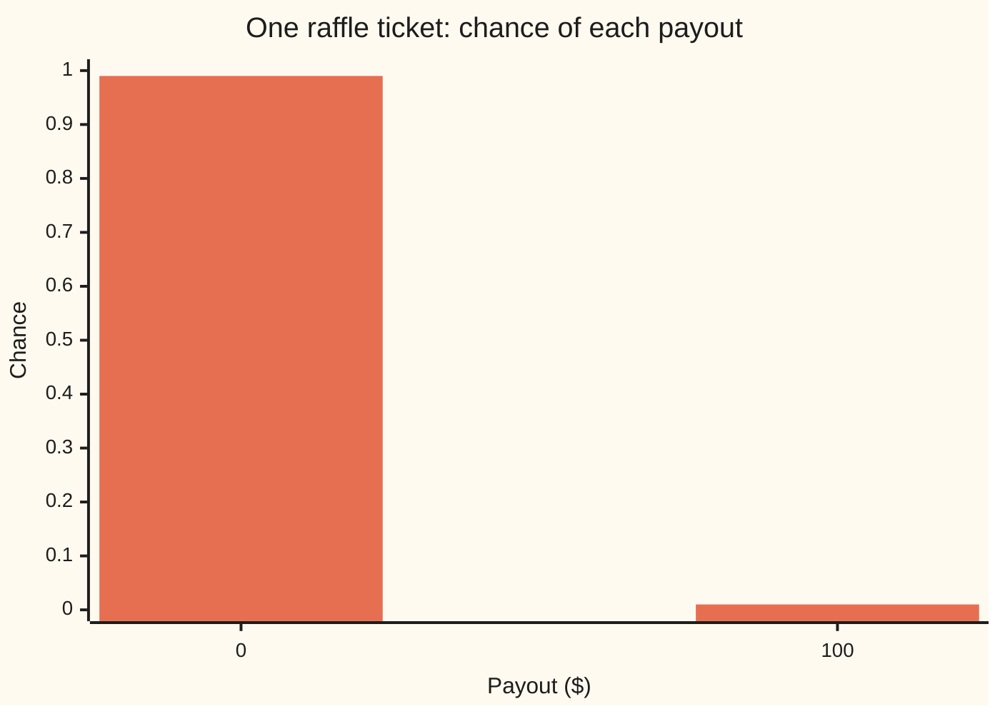
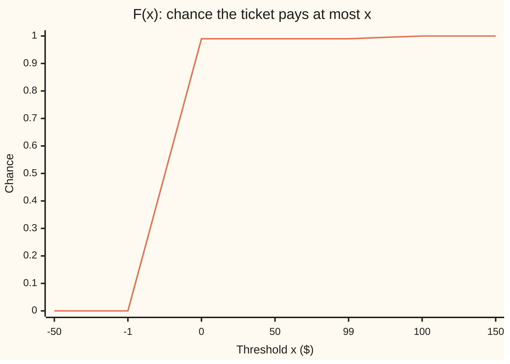

# Random variables: a number for each outcome, and the table of its chances

[Syllabus](../../../SYLLABUS.md) → [Probability and statistics](../../../SYLLABUS.md#w09) → [Random Variables](../../../SYLLABUS.md#w09-s02) → Random variables

---

## General Overview

A club sells 100 raffle tickets, numbered 1 to 100. On Friday one number is drawn, and that ticket wins $100. Follow ticket 37. There are 100 ways Friday can go, one for each number drawn. In 99 of them the ticket pays nothing. In one it pays $100.

Nobody cares which losing number came up. What matters is the payout. So attach a number to every way Friday can go: $100 to the draw of 37, $0 to each of the other 99. That rule is the **random variable**. It is a function in the ordinary sense ([Functions](../../01-Foundations/08-Relations%20and%20Functions/02-functions.md)): each outcome goes in, one number comes out. Nothing about the rule is random. The randomness is all in which outcome happens.

Once the rule is fixed, the 100 outcomes collapse into a two-line table: pays $0 with chance 0.99, pays $100 with chance 0.01. That table is the ticket's **distribution**. A running total of the same table, read from the left, is its **cumulative distribution function**. The table answers "how likely is exactly this payout?" The running total answers "how likely is at most this payout?"

**A random variable is a fixed rule that turns each outcome into a number; its distribution is the table of chances for those numbers, found by pooling every outcome that gives the same number.**

**What kind of fact this is:** a definition, with three consequences (the table adds to 1, the running total climbs from 0 to 1, and its jumps are the table's entries) proved on this card in Why it works.

### The picture: the ticket's payout table



One bar per payout value: 0.99 at $0 and 0.01 at $100, a bar one ninety-ninth the height of the first. Two bars, because 100 outcomes produce only two numbers.

---

## The formula

Notation first, in words. $P(A)$ is the chance of the event A, as on [Sample spaces and events](../01-Chance%20and%20Events/02-sample-spaces-and-events.md). A random variable gets a capital letter, $X$; a value it might take gets the lower-case letter, $x$. So $P(X = x)$ is read "the chance that X comes out equal to x", and $P(X = 100)$ is "the chance the ticket pays $100". The outcomes form the sample space $\Omega$ (capital omega); one outcome is $\omega$ (small omega), here the number drawn.

The random variable is a function from outcomes to numbers:

$$X : \Omega \to \mathbb{R}, \qquad X(\omega) = \begin{cases} 100 & \text{if } \omega = 37 \\ 0 & \text{otherwise} \end{cases}$$

Its **probability mass function**, the table, gives each value its chance by adding up the outcomes that produce it:

$$p(x) = P(X = x) = \sum_{\omega \,:\, X(\omega) = x} P(\{\omega\})$$

**Read it aloud:** the chance of the value x is the total chance of every outcome the rule sends to x.

Its **cumulative distribution function**, the running total, adds the table up to a threshold:

$$F(x) = P(X \le x) = \sum_{v \,\le\, x} p(v)$$

**Read it aloud:** the chance that X comes out at x or below is the sum of the table's entries for every value v up to and including x.

Two readings follow at once. The chance of landing in a window with its right edge included:

$$P(a < X \le b) = F(b) - F(a)$$

And the chance of one exact value is the height of the step the running total climbs there: $p(x)$ equals $F(x)$ minus the value of $F$ just below $x$.

| Symbol | Plain meaning | In our example | Push it up and the answer… |
| --- | --- | --- | --- |
| $\Omega$ | the sample space: every way the draw can go | the numbers 1 to 100 | more outcomes, usually thinner chances each |
| $\omega$ | one outcome | the number drawn, say 37 | — |
| $X$ | the random variable: the rule outcome → number | payout of the held ticket | — |
| $x$ | a value X might take, or a threshold | 0 or 100; any number for F | F never falls as x rises |
| $v$ | a value of X being added into the running total | 0, then 100 | — |
| $P$ | the chance of an event | P(draw is 37) = 0.01 | — |
| $p$ | the table: p(x) is the chance X equals x | p(0) = 0.99, p(100) = 0.01 | more entries share the same total of 1 |
| $F$ | the running total: F(x) is the chance X is at most x | F(0) = 0.99, F(100) = 1 | climbs in steps, never down |
| $a$, $b$ | the left and right edges of a window of values | 0 and 100 | a wider window never holds less chance |
| $Y$ | a second random variable, the net gain X − 2 for a $2 ticket | −2 or 98 | — |
| $T$ | total payout from three separate raffles, one ticket in each | 0, 100, 200 or 300 | — |

### When it holds

This is a definition, so it holds by fiat. Three conditions make it the right one:

- **Every outcome gets exactly one number.** A rule that gave draw 37 two payouts would not be a function, and the table would count that outcome twice, adding to more than 1.
- **The values can be listed**, finitely many or one after another (0, 1, 2, …). A payout that could be any amount on a continuous scale usually gives each single value chance 0; the table is then replaced by a density, on [Densities](../04-Continuous%20Distributions/01-densities-and-cdfs.md). The running total F survives that change unchanged.
- **Every set of outcomes asked about has a chance.** On a finite space this is automatic. On an infinite one it is a real condition, and it is what [Random variables as measurable maps](../../10-Measure%20and%20integration/03-Measurable%20Functions/04-random-variables-and-their-information.md) makes precise.

---

## Why it works

### Step 0: the rule is fixed, the outcome is not

All the uncertainty lives in the sample space and its chances. The random variable adds none. So every question about X is a question about outcomes in disguise. "Does the ticket pay $100?" is the event "the draw is 37". "Does it pay at most $50?" is the event "the draw is not 37". Chances of values are chances of events, and the rules for events already exist.

### Step 1: the table adds to 1

Group the outcomes by the number the rule gives them. Each outcome lands in exactly one group, because a function gives each input one output. So the groups do not overlap and together they are the whole sample space. The chances of non-overlapping events add, and the whole space has chance 1. Therefore

$$\sum_{x} p(x) = 1.$$

On the ticket: 99 outcomes pool into the value 0, one into the value 100, and 0.99 + 0.01 = 1. Nothing is lost and nothing is counted twice.

### Step 2: the running total climbs from 0 to 1 and never falls

Raise the threshold and the event "X is at most x" can only gain outcomes. So F never decreases. Below the smallest value no outcome qualifies, so F is 0 there. At or above the largest value every outcome qualifies, so F is 1.

### Step 3: F is flat between values and jumps at each one

Between two neighbouring values of X, moving the threshold adds no outcomes, so F stays level. At a value x the threshold passes the whole group of outcomes sent to x at once, so F jumps by exactly p(x). The jump belongs to x itself, because "at most x" includes x: F(0) is 0.99, not 0. On a graph each step's top includes its left end.

### The picture: the running total of the payout



One line, the running total F at seven thresholds. The thresholds −1 and 99 stand for "just below" the two payouts; F is flat everywhere between payouts, so those two points are exact. The chart joins points with slanted segments; the true F rises straight up at 0 (by 0.99) and at 100 (by 0.01).

### Step 4: windows are differences

The event "X is at most b" splits into two pieces that do not overlap: "X is at most a" and "X is above a but at most b". Their chances add, so

$$P(a < X \le b) = F(b) - F(a).$$

### Step 5: the table forgets the outcomes

Two random variables on different sample spaces can share a table. Take a bet that pays $100 if the last two digits of tomorrow's three-digit lottery number, 000 to 999, are 77. That space has 1,000 outcomes; 10 of them pay. The table is 0.99 at $0 and 0.01 at $100, identical to the raffle ticket's. Any question asked about the payout alone gets the same answer for both. That is why the distribution, not the sample space, is what later cards work with.

A function of a random variable is another random variable. If the ticket cost $2, the net gain is $Y$ = X − 2, a rule applied after the first rule. Its table moves each value down by 2: −2 with chance 0.99, 98 with chance 0.01.

<details>
<summary>Detailed proof</summary>

The steps above use a finite sample space. The same four facts hold when the values run on forever, such as the number of weekly draws until the ticket first wins (1, 2, 3, …). The one new tool is that the chance of a union of infinitely many non-overlapping events is the sum of their chances, the series form of the addition rule.

**Table adds to 1.** The events "X = x", one per value, do not overlap and cover the sample space. By the series addition rule their chances sum to 1. For the waiting time, p(k) is 0.99 raised to the power k − 1, times 0.01, and the geometric series gives 0.01 / (1 − 0.99) = 1.

**F never falls.** If s ≤ t then every outcome with X at most s also has X at most t, so P(X ≤ s) ≤ P(X ≤ t).

**F tends to 0 far left and 1 far right.** Let the threshold rise through 1, 2, 3, …. The events "X is at most n" grow and their union is the whole space, since every outcome's value is some finite number. The chance of a growing union is the limit of the chances (it is the sum of the pieces added at each stage), so F(n) tends to 1. The far-left limit follows the same way with shrinking events and complements.

**Jumps are table entries, and F includes its own jump.** Let thresholds s rise towards x from below. The events "X is at most s" grow towards "X is below x", so F just below x equals P(X < x). Then F(x) minus that limit is P(X ≤ x) − P(X < x) = P(X = x) = p(x). Thresholds falling towards x from above give events shrinking to "X is at most x", so the limit from the right is F(x) itself: the running total holds its step's top value at x.

</details>

Another route defines the distribution directly as the rule sending each set of values B to P(X in B), with the table and the running total as two ways to record it. For a random variable with a density, or one mixing jumps and a density, the table fails and this route still works; [Random variables as measurable maps](../../10-Measure%20and%20integration/03-Measurable%20Functions/04-random-variables-and-their-information.md) takes it.

---

## Worked numbers, by hand

One ticket first, then one ticket in each of three separate weekly raffles.

| Step | Arithmetic | Value |
| --- | --- | --- |
| Outcomes sent to $0 | every draw except 37 | 99 of 100 |
| p(0) | 99 / 100 | 0.99 |
| p(100) | 1 / 100 | 0.01 |
| F(−50) | no value at or below −50 | 0 |
| F(0) | p(0) | 0.99 |
| F(50) | p(0), nothing between 0 and 50 | 0.99 |
| F(100) | p(0) + p(100) | 1 |
| P(0 < X ≤ 100) | F(100) − F(0) | 0.01 |
| Three raffles: nothing won, p(T = 0) | 99 × 99 × 99 = 970,299 of 1,000,000 | 0.970299 |
| Exactly one win, p(T = 100) | three ways, each 1 × 99 × 99: 29,403 | 0.029403 |
| Exactly two wins, p(T = 200) | three ways, each 1 × 1 × 99: 297 | 0.000297 |
| All three, p(T = 300) | 1 × 1 × 1 | 0.000001 |
| F(100) for T | 0.970299 + 0.029403 | 0.999702 |
| Win at least once, P(T ≥ 100) | 1 − F(0) = 1 − 0.970299 | **0.029701** |

The draws are separate, so the chance of a pattern of wins and losses is the product of the single-raffle chances, and a pattern with one win can happen in three ways (the win in week one, two or three). Out of 1,000,000 equally likely triples of draws, 29,701 pay something.

**A buyer of one ticket in each of three raffles wins something about 1 time in 34 (1 in 33.67); a single ticket wins 1 time in 100.**

### What breaks if you drop a piece

| Mistake | Comes out at | What went wrong |
| --- | --- | --- |
| Treat the four values of T as equally likely | P(T = 0) = 0.25 | chances belong to outcomes; pooling 970,299 outcomes into $0 gives 0.970299 |
| Use "below" for F instead of "at most" | F(100) read as 0.970299 | the jump at 100 is left out; the true F(100) is 0.999702 |
| Add the three weekly win chances | 0.03 | the weeks with two or three wins are counted more than once; the truth is 0.029701 |
| Read one outcome's chance as P(X = 0) | 0.01 | 99 outcomes pool into $0; the table entry is 0.99 |

---

## Code, from first principles, and it actually runs

The scripts define the payout rule, then reach the tables by three independent roads. Road one counts every outcome: the 100 draws of one raffle and all 1,000,000 triples of draws for three. Road two multiplies the single-raffle counts pattern by pattern, never touching the million triples. Road three draws 200,000 simulated three-raffle weeks from a SplitMix64 generator, a short fixed recipe for pseudo-random numbers written out in both languages with seed 2026, and prints each estimate with its standard error (the typical size of the simulation's miss). The asserts pit the running total against a direct count, the two exact roads against each other, the 77 bet against the raffle, and the simulation against the exact chances, within four standard errors.

### Python

```python
# Random variables: a number for each outcome, and the table of its chances.
# Raffle: 100 tickets, one number drawn, the held ticket (37) pays $100.
# Roads: count every outcome; multiply single-raffle counts; seeded simulation.
M = 2**64 - 1
MINE = 37


def X(drawn):                      # the random variable: number drawn -> payout
    return 100 if drawn == MINE else 0


def table(values):                 # pool outcomes by value: value -> outcome count
    t = {}
    for v in values:
        t[v] = t.get(v, 0) + 1
    return dict(sorted(t.items()))


def cdf(t, x):                     # running total of a table: count of values <= x
    return sum(c for v, c in t.items() if v <= x)


def splitmix64(s):
    s = (s + 0x9E3779B97F4A7C15) & M
    z = s
    z = ((z ^ (z >> 30)) * 0xBF58476D1CE4E5B9) & M
    z = ((z ^ (z >> 27)) * 0x94D049BB133111EB) & M
    return s, z ^ (z >> 31)


# One raffle: 100 outcomes pooled into two values
one = table(X(w) for w in range(1, 101))
print(f"one raffle, tickets 1-100, held ticket {MINE}, pooled to 0: {one[0]}, pooled to 100: {one[100]}")
for v, c in one.items():
    print(f"pmf X, {v}, {c / 100:.6f}")
for x in (-50, -1, 0, 50, 99, 100, 150):
    direct = sum(1 for w in range(1, 101) if X(w) <= x)
    assert cdf(one, x) == direct
    print(f"cdf X, {x}, {cdf(one, x) / 100:.6f}")
print(f"jump of F at 0: {(cdf(one, 0) - cdf(one, -1)) / 100:.6f}, at 100: {(cdf(one, 100) - cdf(one, 99)) / 100:.6f}")
print(f"P(0 < X <= 100) = F(100) - F(0) = {(cdf(one, 100) - cdf(one, 0)) / 100:.6f}")

# A different space with the same table: last two digits of a number 000-999 are 77
bet = table(100 if n % 100 == 77 else 0 for n in range(1000))
assert {v: c * 100 for v, c in bet.items()} == {v: c * 1000 for v, c in one.items()}
print(f"77 bet, 1000 outcomes, {bet[100]} pay, pmf 0: {bet[0] / 1000:.6f}, pmf 100: {bet[100] / 1000:.6f}")

# A function of X is a random variable: net gain Y = X - 2 for a $2 ticket
net = table(X(w) - 2 for w in range(1, 101))
for v, c in net.items():
    print(f"pmf Y, {v}, {c / 100:.6f}")
print(f"cdf Y, 0, {cdf(net, 0) / 100:.6f}")

# Three separate raffles, one ticket in each: T = total payout
vals = [X(w) for w in range(1, 101)]
three, le100 = {}, 0
for a in vals:
    for b in vals:
        for c in vals:
            s = a + b + c
            three[s] = three.get(s, 0) + 1
            le100 += s <= 100
three = dict(sorted(three.items()))
prod = {}                          # road 2: multiply the single-raffle counts
for a, ca in one.items():
    for b, cb in one.items():
        for c, cc in one.items():
            prod[a + b + c] = prod.get(a + b + c, 0) + ca * cb * cc
assert prod == three
assert cdf(prod, 100) == le100
for v, c in three.items():
    print(f"pmf T, {v}, count {c} of 1000000, {c / 10**6:.6f}")
for x in (0, 100, 200, 300):
    print(f"cdf T, {x}, {cdf(prod, x) / 10**6:.6f}")
win = 1 - cdf(prod, 0) / 10**6
print(f"P(T >= 100) = 1 - F(0) = {win:.6f}, {10**6 - cdf(prod, 0)} of 1000000, about 1 in {1 / win:.2f}")

# Road 3: seeded simulation of 200,000 three-raffle weeks
N, s, sim = 200_000, 2026, {}
print(f"simulation, {N} weeks, seed {s}")
for _ in range(N):
    tot = 0
    for _ in range(3):
        s, r = splitmix64(s)
        tot += X(r % 100 + 1)
    sim[tot] = sim.get(tot, 0) + 1
for v in (0, 100, 200, 300):
    p, q = prod[v] / 10**6, sim.get(v, 0) / N
    se = (p * (1 - p) / N) ** 0.5
    assert abs(q - p) <= 4 * se
    print(f"simulated T, {v}, {q:.6f}, exact {p:.6f}, se {se:.6f}")

# What breaks
print(f"break, four values read as equally likely, P(T=0) = {1 / 4:.6f}")
print(f"break, strict < in place of <=, P(T<100) = {cdf(prod, 99) / 10**6:.6f}")
print(f"break, three win chances added, {3 * one[100] / 100:.6f}")
print(f"break, one outcome's chance read as P(X=0), {1 / 100:.6f}")
print("all checks passed")
```

**Ran 2026-09-28 on macOS, Python 3.14.6, standard library only. All checks passed. Output, pasted from the run:**

```
one raffle, tickets 1-100, held ticket 37, pooled to 0: 99, pooled to 100: 1
pmf X, 0, 0.990000
pmf X, 100, 0.010000
cdf X, -50, 0.000000
cdf X, -1, 0.000000
cdf X, 0, 0.990000
cdf X, 50, 0.990000
cdf X, 99, 0.990000
cdf X, 100, 1.000000
cdf X, 150, 1.000000
jump of F at 0: 0.990000, at 100: 0.010000
P(0 < X <= 100) = F(100) - F(0) = 0.010000
77 bet, 1000 outcomes, 10 pay, pmf 0: 0.990000, pmf 100: 0.010000
pmf Y, -2, 0.990000
pmf Y, 98, 0.010000
cdf Y, 0, 0.990000
pmf T, 0, count 970299 of 1000000, 0.970299
pmf T, 100, count 29403 of 1000000, 0.029403
pmf T, 200, count 297 of 1000000, 0.000297
pmf T, 300, count 1 of 1000000, 0.000001
cdf T, 0, 0.970299
cdf T, 100, 0.999702
cdf T, 200, 0.999999
cdf T, 300, 1.000000
P(T >= 100) = 1 - F(0) = 0.029701, 29701 of 1000000, about 1 in 33.67
simulation, 200000 weeks, seed 2026
simulated T, 0, 0.970555, exact 0.970299, se 0.000380
simulated T, 100, 0.029150, exact 0.029403, se 0.000378
simulated T, 200, 0.000295, exact 0.000297, se 0.000039
simulated T, 300, 0.000000, exact 0.000001, se 0.000002
break, four values read as equally likely, P(T=0) = 0.250000
break, strict < in place of <=, P(T<100) = 0.970299
break, three win chances added, 0.030000
break, one outcome's chance read as P(X=0), 0.010000
all checks passed
```

### Rust

```rust
// Random variables: a number for each outcome, and the table of its chances.
// Raffle: 100 tickets, one number drawn, the held ticket (37) pays $100.
// Roads: count every outcome; multiply single-raffle counts; seeded simulation.
use std::collections::BTreeMap;

const MINE: u64 = 37;
type Table = BTreeMap<i64, u64>;

fn x(drawn: u64) -> i64 {
    // the random variable: number drawn -> payout
    if drawn == MINE { 100 } else { 0 }
}

fn table<I: Iterator<Item = i64>>(values: I) -> Table {
    // pool outcomes by value: value -> outcome count
    let mut t = Table::new();
    for v in values {
        *t.entry(v).or_insert(0) += 1;
    }
    t
}

fn cdf(t: &Table, at: i64) -> u64 {
    // running total of a table: count of values <= at
    t.iter().filter(|(v, _)| **v <= at).map(|(_, c)| *c).sum()
}

fn splitmix64(s: &mut u64) -> u64 {
    *s = s.wrapping_add(0x9E3779B97F4A7C15);
    let mut z = *s;
    z = (z ^ (z >> 30)).wrapping_mul(0xBF58476D1CE4E5B9);
    z = (z ^ (z >> 27)).wrapping_mul(0x94D049BB133111EB);
    z ^ (z >> 31)
}

fn main() {
    // One raffle: 100 outcomes pooled into two values
    let one = table((1..=100).map(x));
    println!("one raffle, tickets 1-100, held ticket {}, pooled to 0: {}, pooled to 100: {}", MINE, one[&0], one[&100]);
    for (v, c) in &one {
        println!("pmf X, {}, {:.6}", v, *c as f64 / 100.0);
    }
    for at in [-50, -1, 0, 50, 99, 100, 150] {
        let direct = (1..=100).filter(|w| x(*w) <= at).count() as u64;
        assert_eq!(cdf(&one, at), direct);
        println!("cdf X, {}, {:.6}", at, cdf(&one, at) as f64 / 100.0);
    }
    let jump = |a: i64, b: i64| (cdf(&one, a) - cdf(&one, b)) as f64 / 100.0;
    println!("jump of F at 0: {:.6}, at 100: {:.6}", jump(0, -1), jump(100, 99));
    println!("P(0 < X <= 100) = F(100) - F(0) = {:.6}", jump(100, 0));

    // A different space with the same table: last two digits of a number 000-999 are 77
    let bet = table((0..1000u64).map(|n| if n % 100 == 77 { 100 } else { 0 }));
    let scaled = |t: &Table, k: u64| t.iter().map(|(v, c)| (*v, c * k)).collect::<Table>();
    assert_eq!(scaled(&bet, 100), scaled(&one, 1000));
    println!("77 bet, 1000 outcomes, {} pay, pmf 0: {:.6}, pmf 100: {:.6}",
             bet[&100], bet[&0] as f64 / 1000.0, bet[&100] as f64 / 1000.0);

    // A function of X is a random variable: net gain Y = X - 2 for a $2 ticket
    let net = table((1..=100).map(|w| x(w) - 2));
    for (v, c) in &net {
        println!("pmf Y, {}, {:.6}", v, *c as f64 / 100.0);
    }
    println!("cdf Y, 0, {:.6}", cdf(&net, 0) as f64 / 100.0);

    // Three separate raffles, one ticket in each: T = total payout
    let vals: Vec<i64> = (1..=100).map(x).collect();
    let (mut three, mut le100) = (Table::new(), 0u64);
    for a in &vals {
        for b in &vals {
            for c in &vals {
                let s = a + b + c;
                *three.entry(s).or_insert(0) += 1;
                if s <= 100 { le100 += 1; }
            }
        }
    }
    let mut prod = Table::new(); // road 2: multiply the single-raffle counts
    for (a, ca) in &one {
        for (b, cb) in &one {
            for (c, cc) in &one {
                *prod.entry(a + b + c).or_insert(0) += ca * cb * cc;
            }
        }
    }
    assert_eq!(prod, three);
    assert_eq!(cdf(&prod, 100), le100);
    for (v, c) in &three {
        println!("pmf T, {}, count {} of 1000000, {:.6}", v, c, *c as f64 / 1e6);
    }
    for at in [0, 100, 200, 300] {
        println!("cdf T, {}, {:.6}", at, cdf(&prod, at) as f64 / 1e6);
    }
    let win = 1.0 - cdf(&prod, 0) as f64 / 1e6;
    println!("P(T >= 100) = 1 - F(0) = {:.6}, {} of 1000000, about 1 in {:.2}",
             win, 1_000_000 - cdf(&prod, 0), 1.0 / win);

    // Road 3: seeded simulation of 200,000 three-raffle weeks
    let (n, mut s) = (200_000u64, 2026u64);
    let mut sim = Table::new();
    println!("simulation, {} weeks, seed {}", n, s);
    for _ in 0..n {
        let mut tot = 0;
        for _ in 0..3 {
            tot += x(splitmix64(&mut s) % 100 + 1);
        }
        *sim.entry(tot).or_insert(0) += 1;
    }
    for v in [0, 100, 200, 300] {
        let p = prod[&v] as f64 / 1e6;
        let q = *sim.get(&v).unwrap_or(&0) as f64 / n as f64;
        let se = (p * (1.0 - p) / n as f64).sqrt();
        assert!((q - p).abs() <= 4.0 * se);
        println!("simulated T, {}, {:.6}, exact {:.6}, se {:.6}", v, q, p, se);
    }

    // What breaks
    println!("break, four values read as equally likely, P(T=0) = {:.6}", 1.0 / 4.0);
    println!("break, strict < in place of <=, P(T<100) = {:.6}", cdf(&prod, 99) as f64 / 1e6);
    println!("break, three win chances added, {:.6}", 3.0 * one[&100] as f64 / 100.0);
    println!("break, one outcome's chance read as P(X=0), {:.6}", 1.0 / 100.0);
    println!("all checks passed");
}
```

**Ran 2026-09-28 on macOS, rustc 1.98.1, no crates. All checks passed. Output, pasted from the run:**

```
one raffle, tickets 1-100, held ticket 37, pooled to 0: 99, pooled to 100: 1
pmf X, 0, 0.990000
pmf X, 100, 0.010000
cdf X, -50, 0.000000
cdf X, -1, 0.000000
cdf X, 0, 0.990000
cdf X, 50, 0.990000
cdf X, 99, 0.990000
cdf X, 100, 1.000000
cdf X, 150, 1.000000
jump of F at 0: 0.990000, at 100: 0.010000
P(0 < X <= 100) = F(100) - F(0) = 0.010000
77 bet, 1000 outcomes, 10 pay, pmf 0: 0.990000, pmf 100: 0.010000
pmf Y, -2, 0.990000
pmf Y, 98, 0.010000
cdf Y, 0, 0.990000
pmf T, 0, count 970299 of 1000000, 0.970299
pmf T, 100, count 29403 of 1000000, 0.029403
pmf T, 200, count 297 of 1000000, 0.000297
pmf T, 300, count 1 of 1000000, 0.000001
cdf T, 0, 0.970299
cdf T, 100, 0.999702
cdf T, 200, 0.999999
cdf T, 300, 1.000000
P(T >= 100) = 1 - F(0) = 0.029701, 29701 of 1000000, about 1 in 33.67
simulation, 200000 weeks, seed 2026
simulated T, 0, 0.970555, exact 0.970299, se 0.000380
simulated T, 100, 0.029150, exact 0.029403, se 0.000378
simulated T, 200, 0.000295, exact 0.000297, se 0.000039
simulated T, 300, 0.000000, exact 0.000001, se 0.000002
break, four values read as equally likely, P(T=0) = 0.250000
break, strict < in place of <=, P(T<100) = 0.970299
break, three win chances added, 0.030000
break, one outcome's chance read as P(X=0), 0.010000
all checks passed
```

The two outputs are identical line for line: every count is a whole number, and the simulation draws the same sequence in both languages.

> [!TIP]
> **Try changing**
> - **Hold a second ticket.** Guess first: what happens to the table? In Python change `drawn == MINE` to `drawn in (MINE, 38)`. The $100 bar doubles, the $0 bar shrinks by the same amount, and the assert comparing the raffle with the 77 bet fails: the two no longer share a table.
> - **Swap the seed.** Guess first: which lines move? Change 2026 to any other seed. Only the seed line and the four simulated lines change, typically by about one standard error; every exact line stays put.
> - **Break the running total.** Guess first: which assert catches it? In Python change `v <= x` to `v < x` in `cdf`. The first CDF assert fails at once: counting outcomes directly at a threshold of 0 finds 99, the broken running total finds 0.
> - **Tighten the simulation check.** Guess first: does `abs(q - p) <= 0.1 * se` pass? It fails on the first value. A simulated estimate is right to within its standard error, not exactly.

---

## The usual mistake

> [!warning]
> **Counting values instead of outcomes.** The three-raffle total has four possible values, but they are nowhere near equally likely. Chance sits on outcomes. The table for T is built by pooling outcomes that give the same number, so $0 gets 970,299 of a million triples and $300 gets one. Treating four values as four equal cases gives 0.25 for winning nothing, against the true 0.970299.
>
> - **"Below" for "at most".** F includes its own value. Dropping the jump makes F(100) for three raffles read 0.970299 instead of 0.999702.
> - **Adding chances of overlapping events.** Winning in week one and winning in week two can both happen. Adding the three 0.01's gives 0.03; the chance of at least one win is 1 − F(0) = 0.029701.
> - **Confusing the variable with its table.** The raffle ticket and the 77 bet are different random variables on different spaces with the same distribution. Knowing the table says nothing about which outcome produced a payout.

---

## Where you meet it in real life

- **Lotteries and raffles.** Every prize table printed on the back of a ticket is a probability mass function: values in dollars, chances beside them.
- **Insurance.** The claim a policy pays in a year is a random variable; an insurer prices from its table, with most of the chance at $0 and small chances on large amounts, the raffle's shape.
- **Several quantities at once.** Two random variables on the same draws, such as this week's and next week's payouts, need a table of pairs: [Two variables at once](04-joint-distributions-and-covariance.md).

> **Say it back**
> A random variable is a fixed rule that gives each outcome a number. Its distribution is the table of chances for those numbers, made by pooling all outcomes that give the same number, and the table adds to 1. The cumulative distribution function is the running total of the table: it climbs from 0 to 1, stays flat between values, and jumps by each value's chance at that value. The chance of a window is a difference of two running totals. One raffle ticket pays $100 with chance 0.01; one ticket in each of three raffles wins something with chance 0.029701.

---

## What this builds on

- [Sample spaces and events](../01-Chance%20and%20Events/02-sample-spaces-and-events.md): the outcomes, the events, and the addition rule for events that do not overlap.
- [Functions](../../01-Foundations/08-Relations%20and%20Functions/02-functions.md): one output for each input, the property that makes the table add to 1.

## Where this goes next

- [Expectation](02-expectation.md): one number that summarises the table, the long-run average payout.
- [Densities](../04-Continuous%20Distributions/01-densities-and-cdfs.md): values on a continuous scale, where the table becomes a density and the running total carries over.
- [Random variables as measurable maps](../../10-Measure%20and%20integration/03-Measurable%20Functions/04-random-variables-and-their-information.md): the definition on infinite sample spaces, and what a random variable reveals about the outcome.
- [Stochastic processes](../../11-Stochastic%20processes%20and%20calculus/01-Random%20Walks%20and%20Filtrations/01-processes-and-paths.md): a random variable for every date, such as a running balance of weekly raffle payouts.

The table says how the payout is spread; what a ticket is worth on average, and so whether $2 is a fair price, is the question [Expectation](02-expectation.md) answers.

---

## Sources

Verified 2026-09-28: every link below opens a page naming the cited work.

- Blitzstein, Joseph K., and Jessica Hwang. *Introduction to Probability*, 2nd ed. Chapman and Hall/CRC, 2019. [Publisher page](https://www.routledge.com/Introduction-to-Probability-Second-Edition/Blitzstein-Hwang/p/book/9781138369917). Chapter 3 defines random variables as functions, then the mass function and the cumulative distribution function.
- Grinstead, Charles M., and J. Laurie Snell. *Introduction to Probability*. American Mathematical Society; free under the GNU FDL. [Book page and full text](https://chance.dartmouth.edu/teaching_aids/books_articles/probability_book/book.html). Chapter 1 builds distribution functions on finite spaces and simulates them.
- Feller, William. *An Introduction to Probability Theory and Its Applications*, Volume 1, 3rd ed. Wiley, 1968. [Publisher page](https://www.wiley.com/en-us/An+Introduction+to+Probability+Theory+and+Its+Applications%2C+Volume+1%2C+3rd+Edition-p-9780471257080). The classic treatment of discrete random variables and their distributions.
- MIT OpenCourseWare. *18.05 Introduction to Probability and Statistics*, Spring 2022. [Course page](https://ocw.mit.edu/courses/18-05-introduction-to-probability-and-statistics-spring-2022/). Free readings on discrete random variables, mass functions and cumulative distribution functions.
