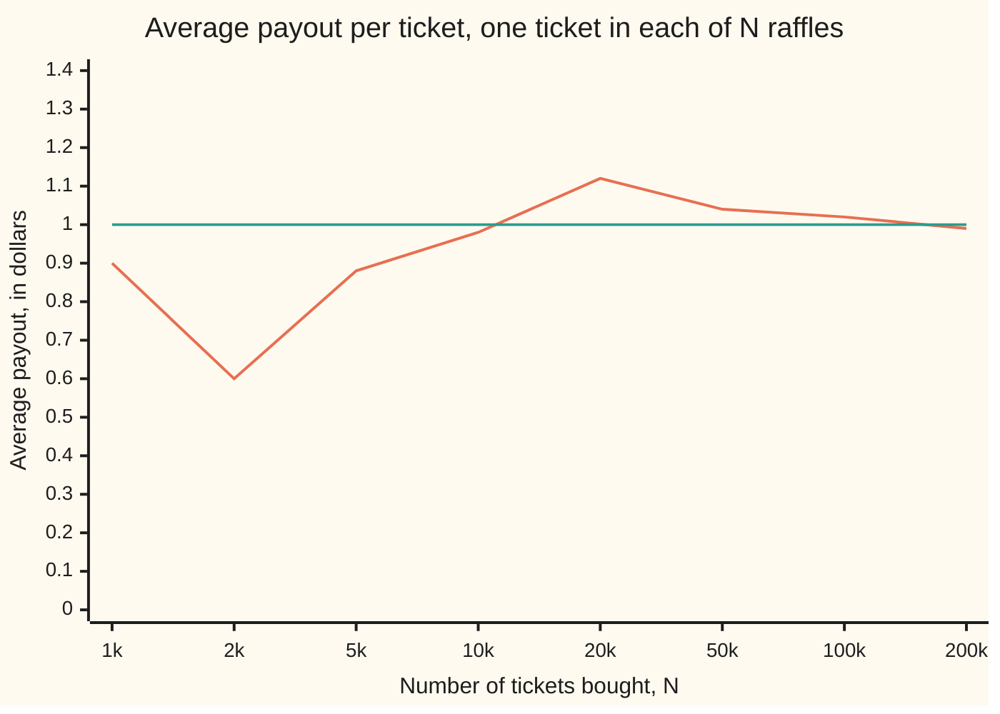
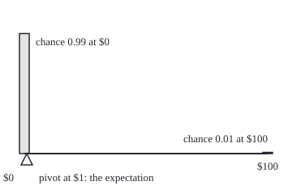

# Expectation: the long-run average, as a weighted sum

[Syllabus](../../../SYLLABUS.md) → [Probability and statistics](../README.md) → [Random Variables](../README.md#s02) → Expectation

---

## General Overview

A school raffle sells 100 tickets at $2 each. One ticket is drawn and wins $100. Buy one ticket and it pays $0 with chance 0.99 (99 draws in 100) and $100 with chance 0.01 (1 draw in 100).

What is the ticket worth? It never pays $1. It pays nothing or it pays $100. Yet the fair answer is $1. Buy one ticket in each of 200,000 such raffles and the payouts average out at about $1 a ticket. The organiser sees the same number from the other side: $200 comes in, $100 goes out, so each ticket carries $1 of prize.

The ticket is worth $1 against a price of $2. Each ticket loses $1 on average: that $1 is the organiser's margin, and the reason raffles raise money.

That $1 is the **expected value**, or **expectation**, of the payout. It is a weighted sum: each possible payout times its chance, added up. It is also the long-run average over many tickets. The card proves the two agree, proves that expectations of sums add even when the pieces are tangled together, and shows that the expected value is usually not a value anyone ever sees.

**The expectation of a random quantity is each of its values weighted by its chance and added up; it is the balance point of the distribution and the long-run average of many independent copies, and it need not be the most likely value or even a possible one.**

**What kind of fact this is:** a definition; its main property, linearity, is a theorem proved on this card in Why it works.

### The picture: the running average settles on $1



The wandering line is a seeded simulation: one ticket bought in each of N separate raffles, the payouts averaged. The flat line is the expectation, $1. Early on, a few lucky wins pull the average around; by 200,000 tickets it sits at $0.99, and the code gives its standard error (the typical size of the simulation's own error) as $0.0221.

---

## The formula

Notation first, in words. A capital letter such as X is a random variable: a number fixed by chance, here the payout of one ticket ([Random variables](01-random-variables-and-distributions.md)). A lower-case x is one value it can take, and P(X = x) is the chance it takes that value. The new symbol is E[X], read "the average value of X in the long run", or "the expectation of X". The Greek capital sigma, ∑, means "add up over every value listed underneath it".

$$E[X] = \sum_{x} x \cdot P(X = x)$$

**Read it aloud:** take each value the payout can have, multiply it by its chance, and add the results.

For the ticket: $E[X] = 0 \times 0.99 + 100 \times 0.01 = 1$.

The main property is **linearity**: for any two random variables X and Y on the same chance experiment, and any fixed numbers a and b,

$$E[aX + bY] = a\,E[X] + b\,E[Y].$$

**Read it aloud:** the average of a combination is the same combination of the averages, whether or not X and Y depend on each other.

| Symbol | Plain meaning | In our example | Push it up and the answer… |
| --- | --- | --- | --- |
| $X$ | the random payout of one ticket | 0 or 100 dollars | — |
| $x$ | one value the payout can take | 0, then 100 | a bigger prize raises E[X] by its chance per dollar |
| $P(X = x)$ | the chance the payout is exactly x | 0.99 and 0.01 | more chance on the prize raises E[X] |
| $E[X]$ | the expectation: the weighted sum, the long-run average | 1 dollar | — |
| $G$ | net gain of one ticket, X − 2 | E[G] = −1 dollar | — |
| $a$, $b$ | fixed numbers that scale or shift | for G: a = 1 on X, b = −2 on the constant 1 | E moves in step with them |
| $Y$ | a second random variable on the same experiment | a second ticket's payout | — |
| $X_1$, $X_5$, $T$ | payouts of tickets 1 to 5, and their total T | E[T] = 5 dollars | each extra ticket adds 1 dollar |
| $\omega$ | one outcome of the whole experiment: which ticket is drawn | "ticket 37 wins" | — |
| $P(\omega)$ | the chance of that outcome | 0.01 for each of 100 | — |
| $1_W$ | the indicator of an event W: 1 if W happens, 0 if not | 1 if our ticket wins | E[1_W] = P(W) |
| $N$ | how many tickets a simulation or a long run buys | up to 200,000 | the average hugs E[X] more tightly |

### When it holds

- **The sum must converge absolutely.** With finitely many values it always does. With infinitely many, the weighted sum of the sizes |x| must be finite; if not, there is no expectation. The St Petersburg ticket below pays $2, $4, $8, … with chances 1/2, 1/4, 1/8, …, and its sum grows without end.
- **Linearity needs the pieces on one experiment, each with a finite expectation, and nothing else.** No independence is assumed. Five tickets in one draw, where at most one can win, still add.
- **Products are different.** E[XY] = E[X] E[Y] needs independence ([Two variables at once](04-joint-distributions-and-covariance.md)); two tickets in one draw break it.
- **A bent function is different too.** E[X^2] is not E[X]^2, and E[√X] is not √E[X]. Only straight-line combinations pass through; how far a bent one misses is [Jensen's inequality](06-jensens-inequality.md).

---

## Why it works

### Step 0: a long run of tickets is sorted by payout

Buy N tickets, one in each of N separate raffles. About 0.99 N of them pay $0 and about 0.01 N pay $100. The total is about 0 × 0.99 N + 100 × 0.01 N, and dividing by N gives the average: 0 × 0.99 + 100 × 0.01 = $1. The N cancels. What is left is each value times its chance, added. That is the formula, read as a forecast of the long-run average.

The word "about" is doing work: the fraction of winners wanders, as the chart shows. That the long-run average really does home in on E[X] is the law of large numbers, proved on a later shelf of this wing; the simulation here only checks it. As a definition, E[X] stands on its own.

### Step 1: two ways to add up the same thing

The raffle's real outcome is which ticket is drawn. Call one outcome ω (the Greek letter omega): "ticket 37 wins" is one ω, with chance P(ω) = 0.01. Our ticket is number 0, and X(ω) is what it pays when ω happens.

Summing over outcomes gives $E[X] = \sum_{\omega} X(\omega)\,P(\omega)$: 100 terms, one of them 100 × 0.01, the rest zero, total $1. Summing over values groups those 100 outcomes into two piles, "pays 0" (99 outcomes) and "pays 100" (1 outcome). Grouping terms does not change a sum, so both give $1. The code runs both roads.

<details>
<summary>Detailed proof: the two sums agree</summary>

Let the outcomes ω carry chances P(ω) that add to 1. For each value x, the outcomes with X(ω) = x have total chance P(X = x). Then
$$\sum_{\omega} X(\omega)P(\omega) = \sum_{x}\ \sum_{\omega:\,X(\omega)=x} x\,P(\omega) = \sum_x x \sum_{\omega:\,X(\omega)=x} P(\omega) = \sum_x x\,P(X=x).$$
The first step reorders terms into piles; the second pulls the common factor x out of each pile. With finitely many outcomes, reordering is always allowed. With infinitely many, reordering a series is safe exactly when the series of sizes |X(ω)| P(ω) converges, which is the "When it holds" condition. Without it a rearranged series can reach any total, and the expectation is left undefined.

</details>

### Step 2: linearity, from the outcome sum

Work on the outcome side. Each outcome ω gives numbers X(ω) and Y(ω), and the combination aX + bY gives aX(ω) + bY(ω). So

$$E[aX + bY] = \sum_{\omega} \big(aX(\omega) + bY(\omega)\big)P(\omega) = a\sum_{\omega} X(\omega)P(\omega) + b\sum_{\omega} Y(\omega)P(\omega) = a\,E[X] + b\,E[Y].$$

The middle step splits one sum into two and pulls out constants: nothing more than the rules of adding. Nowhere does the argument ask how X and Y are related. They may move together, against each other or not at all. That is why linearity survives dependence.

A constant counts as a random variable that takes one value, and its expectation is itself. So for net gain, $E[G] = E[X - 2] = E[X] - 2 = -1$: the ticket loses $1 on average.

### Step 3: five tickets in one draw

Buy tickets 0 to 4 in the same raffle. They are tied: if one wins, the other four lose. Let W be the event "ticket 0 wins" and $1_W$ its indicator, the number that is 1 when W happens and 0 when it does not. Then E[1_W] = 1 × P(W) + 0 × P(not W) = P(W): an indicator's expectation is a chance.

Call their payouts X_1 to X_5. Each is 100 times an indicator, so the total is

$$T = X_1 + X_2 + X_3 + X_4 + X_5, \qquad E[T] = 5 \times 100 \times 0.01 = 5.$$

Counting the 100 draws directly agrees: 5 draws pay $100, 95 pay nothing, average $5. Five tickets in five separate raffles, which are independent, have a different spread of totals (two wins become possible) but the same $5. Linearity cannot tell the two apart, and does not need to.

### Step 4: the balance point is not the peak

Picture the chances as weights on a line: 0.99 at $0 and 0.01 at $100. The expectation is where the line balances, because the formula is exactly the one for a centre of mass (the balance point of a set of weights).

The balance point sits at $1, just right of the heavy weight. The peak, the most likely payout, is $0; the value halfway through the list of outcomes, the median, is also $0. Move the prize further out at the same chance and the balance point follows it, while the peak does not move at all. Expectation feels every value, weighted; the most likely value ignores all but one.

### The picture: the ticket's weights, to scale

<p align="center"></p>

The horizontal axis runs from $0 to $100 at 3 units per dollar. Bar heights are proportional to the chances: 148.5 units and 1.5 units. The pivot sits at $1, three units right of the tall bar.

Another road reaches the same $1 for a payout that is never negative: add up, over the whole-dollar levels t = 0, 1, 2, …, the chance the payout exceeds t. The ticket exceeds each level from $0 to $99 with chance 0.01, and 100 × 0.01 = 1. The code runs this road too. That tail-sum view is the engine of [Markov and Chebyshev](08-markov-and-chebyshev-inequalities.md).

---

## Worked numbers, by hand

| Step | Arithmetic | Value |
| --- | --- | --- |
| weight on no prize | 0 × 0.99 | 0 |
| weight on the prize | 100 × 0.01 | 1 |
| **E[X]** | 0 + 1 | **$1** |
| net gain, E[X − 2] | 1 − 2 | −$1 |
| organiser, per raffle | 100 × $2 in, $100 out | keeps $100 |
| five tickets, one draw | 5 × $1 | $5 |
| check by counting | 5 of 100 draws pay $100 | $5 |
| chance none of five wins | 95 of 100 draws | 0.95 |

A ticket bought for $2 returns $1 on average, so a raffle player hands the organiser $1 per ticket in the long run; the prize is paid for by the tickets that lose.

### What breaks if you drop a piece

| Mistake | Comes out at | What went wrong |
| --- | --- | --- |
| Value the ticket at its most likely payout | $0, not $1 | The peak ignores the prize; the balance point does not |
| Multiply two tickets in one draw as if independent | E[X1 X2] taken as 1.00, truly 0.00 | Both cannot win, so the product is always 0 |
| Square the mean for E[X^2] | 1.00, truly 100.00 | Squaring is not a straight-line combination |
| Drop the finite-mean condition: St Petersburg | truncated means 10.00, 20.00, 40.00, and rising by 1.00 a level | The sum diverges, so there is no expectation to add |

The last row is the theorem failing once a hypothesis goes. The St Petersburg ticket pays 2^j dollars with chance 2^−j for j = 1, 2, 3, …, so every level adds exactly $1 to the sum: ten levels give 10.00, forty give 40.00. Simulated, its running average is 12.67 after 1,000 tickets, 13.99 after 10,000, 27.76 after 100,000 and 53.57 after 1,000,000. It never settles, because there is nothing to settle on.

---

## Code, from first principles, and it actually runs

The code reaches E[X] by three independent roads: the weighted sum over values, a count over all 100 equally likely draws, and a seeded simulation of 200,000 separate raffles, printed with its standard error; a fourth, the tail sum, agrees. It then checks linearity on five tickets bought two ways, by counting all 100 draws and all 32 win-or-lose patterns, and by a second simulation. It prints every "what breaks" number. The random numbers come from SplitMix64, a small generator written out in both languages with a stated seed, so Python and Rust draw the same sequence. The square root is Newton's method, so nothing imported holds an answer.

### Python

```python
# Expectation -- the check behind the card.  Nothing is imported.  A raffle
# sells 100 tickets at $2; one ticket, drawn at random, wins $100.  One
# ticket's payout X is 0 with chance 0.99 and 100 with chance 0.01.  E[X] is
# reached three ways: the weighted sum, a count over all 100 tickets, and a
# seeded simulation.  Linearity is checked on five tickets in one draw
# (dependent) and five tickets in five draws (independent).
M = (1 << 64) - 1

class SplitMix64:                        # the random numbers, written out here
    def __init__(self, seed):
        self.s = seed
    def next(self):
        self.s = (self.s + 0x9E3779B97F4A7C15) & M
        z = self.s
        z = ((z ^ (z >> 30)) * 0xBF58476D1CE4E5B9) & M
        z = ((z ^ (z >> 27)) * 0x94D049BB133111EB) & M
        return z ^ (z >> 31)
    def uniform(self):                   # a number in [0, 1), 53 bits
        return (self.next() >> 11) / 9007199254740992.0

PRICE, PRIZE, SOLD = 2.0, 100.0, 100
law = [(0.0, 0.99), (PRIZE, 0.01)]                    # value, chance

def expect(pairs, g=lambda x: x):        # road one: the weighted sum
    return sum(g(x) * p for x, p in pairs)

def sqrt(v):                             # Newton's method, so nothing is imported
    r = v if v > 1 else 1.0
    for _ in range(60):
        r = 0.5 * (r + v / r)
    return r

e_x = expect(law)
mode = max(law, key=lambda xp: xp[1])[0]
# road two: count every draw.  Our ticket is number 0; the winning number w is
# any of 100, each equally likely.  Our payout in draw w:
payouts = [PRIZE if w == 0 else 0.0 for w in range(SOLD)]
e_count = sum(payouts) / SOLD
e_net = sum(x - PRICE for x in payouts) / SOLD
print(f"payout law: 0 with chance {law[0][1]:.2f}, 100 with chance {law[1][1]:.2f}")
print(f"E[X], weighted sum             {e_x:.2f}")
print(f"E[X], count over 100 draws     {e_count:.2f}")
print(f"E[X - 2], net per ticket       {expect(law, lambda x: x - PRICE):.2f} (count: {e_net:.2f})")
print(f"organiser: takes {SOLD * PRICE:.0f}, pays {PRIZE:.0f}, keeps {SOLD * PRICE - PRIZE:.0f}")
p_exact = sum(p for x, p in law if x == e_x)
print(f"most likely payout {mode:.0f} (chance 0.99); chance a ticket pays exactly 1: {p_exact:.2f}")
tail = sum(sum(p for x, p in law if x > t) for t in range(int(PRIZE)))   # levels t = 0..99
print(f"E[X], tail sum of P(X > t)     {tail:.2f}")

# road three: one ticket in each of N separate raffles, seed 2026
rng, total, total_sq, n = SplitMix64(2026), 0.0, 0.0, 0
marks = [1000, 2000, 5000, 10000, 20000, 50000, 100000, 200000]
running = []
for m in marks:
    while n < m:
        x = PRIZE if rng.uniform() < 0.01 else 0.0
        total, total_sq, n = total + x, total_sq + x * x, n + 1
    running.append(total / n)
mean_sim = total / n
se = sqrt((total_sq / n - mean_sim ** 2) / n)
print("running average after N tickets:")
for m, r in zip(marks, running):
    print(f"  N = {m:>6}   {r:.2f}")
print(f"simulated E[X] = {mean_sim:.4f}, standard error {se:.4f}")

# linearity: five tickets, bought two ways
five_same = sum(PRIZE for w in range(SOLD) if w < 5) / SOLD   # our tickets are 0 to 4
p_zero_same = sum(1 for w in range(SOLD) if w >= 5) / SOLD
dist_indep = {}                                             # all 32 win/lose patterns
for mask in range(32):
    wins = bin(mask).count("1")
    chance = 0.01 ** wins * 0.99 ** (5 - wins)
    dist_indep[wins] = dist_indep.get(wins, 0.0) + chance
five_indep = sum(PRIZE * k * p for k, p in dist_indep.items())
print(f"5 tickets, one draw:   E[T] = {five_same:.2f}, P(T = 0) = {p_zero_same:.2f}, at most one wins")
print(f"5 tickets, five draws, 32 patterns: E[T] = {five_indep:.2f}, P(T = 0) = {dist_indep[0]:.4f}, "
      f"P(T = 100) = {dist_indep[1]:.4f}, P(T = 200) = {dist_indep[2]:.5f}")
print(f"5 x E[X]              = {5 * e_x:.2f}")
rng5, hits = SplitMix64(7), 0
for _ in range(100000):
    hits += 1 if int(rng5.uniform() * SOLD) < 5 else 0
q = hits / 100000
se5 = PRIZE * sqrt(q * (1 - q) / 100000)
print(f"5 tickets, one draw, simulated 100000 draws: E[T] = {PRIZE * q:.3f}, standard error {se5:.3f}")

# what breaks
both_same_draw = sum((PRIZE if w == 0 else 0.0) * (PRIZE if w == 1 else 0.0) for w in range(SOLD)) / SOLD
both_indep = sum(a * b * pa * pb for a, pa in law for b, pb in law)   # four patterns
print(f"two tickets, one draw: E[X1 X2] = {both_same_draw:.2f}, E[X1] E[X2] = {e_x * e_x:.2f}")
print(f"two tickets, two draws: E[X1 X2] = {both_indep:.2f}")
e_sq = sum(x * x for x in payouts) / SOLD                  # E[X^2] by counting draws
print(f"E[X^2] = {expect(law, lambda x: x * x):.2f}, E[X]^2 = {e_x ** 2:.2f}")
print(f"E[sqrt X] = {expect(law, sqrt):.2f}, sqrt E[X] = {sqrt(e_x):.2f}")
trunc = {k: sum(2.0 ** j * 0.5 ** j for j in range(1, k + 1)) for k in (10, 20, 40)}
for k, t in trunc.items():                # St Petersburg: pays 2^j with chance 2^-j
    print(f"St Petersburg, levels 1..{k}: truncated mean {t:.2f}")
rng_sp, sp_total, sp_n = SplitMix64(99), 0.0, 0
for m in (1000, 10000, 100000, 1000000):
    while sp_n < m:
        z = rng_sp.next()
        sp_total, sp_n = sp_total + 2.0 ** (z & -z).bit_length(), sp_n + 1
    print(f"  St Petersburg running average, N = {m:>7}: {sp_total / sp_n:.2f}")
print(f"figure, x = 30 + 3v; bar at 0: x 30, height {150 * 0.99:.1f}; bar at 100: x 330, "
      f"height {150 * 0.01:.1f}; balance point x {30 + 3 * e_x:.0f}")
assert abs(e_x - e_count) < 1e-12                           # weighted sum = count
assert abs(mean_sim - e_x) < 4 * se                         # simulation within 4 SE
assert abs(five_same - 5 * e_x) < 1e-9                      # linearity, dependent tickets
assert abs(five_indep - 5 * e_x) < 1e-9                     # linearity, independent tickets
assert both_same_draw < both_indep                           # products need independence
assert abs(tail - e_x) < 1e-12                              # tail sum = weighted sum
assert mode != e_x and p_exact == 0.0                       # the mean is never paid
assert abs(PRIZE * q - five_same) < 4 * se5                 # simulated five tickets
assert abs(e_sq - expect(law, lambda x: x * x)) < 1e-9 and e_sq > e_x ** 2   # E[X^2] vs E[X]^2
assert all(abs(t - k) < 1e-9 for k, t in trunc.items())     # each level adds $1: no mean
print("ALL CHECKS PASS")
```

**Ran 2026-09-28 on macOS, Python 3.14.6, standard library only. All checks passed. Output, pasted from the run:**

```
payout law: 0 with chance 0.99, 100 with chance 0.01
E[X], weighted sum             1.00
E[X], count over 100 draws     1.00
E[X - 2], net per ticket       -1.00 (count: -1.00)
organiser: takes 200, pays 100, keeps 100
most likely payout 0 (chance 0.99); chance a ticket pays exactly 1: 0.00
E[X], tail sum of P(X > t)     1.00
running average after N tickets:
  N =   1000   0.90
  N =   2000   0.60
  N =   5000   0.88
  N =  10000   0.98
  N =  20000   1.12
  N =  50000   1.04
  N = 100000   1.02
  N = 200000   0.99
simulated E[X] = 0.9860, standard error 0.0221
5 tickets, one draw:   E[T] = 5.00, P(T = 0) = 0.95, at most one wins
5 tickets, five draws, 32 patterns: E[T] = 5.00, P(T = 0) = 0.9510, P(T = 100) = 0.0480, P(T = 200) = 0.00097
5 x E[X]              = 5.00
5 tickets, one draw, simulated 100000 draws: E[T] = 4.981, standard error 0.069
two tickets, one draw: E[X1 X2] = 0.00, E[X1] E[X2] = 1.00
two tickets, two draws: E[X1 X2] = 1.00
E[X^2] = 100.00, E[X]^2 = 1.00
E[sqrt X] = 0.10, sqrt E[X] = 1.00
St Petersburg, levels 1..10: truncated mean 10.00
St Petersburg, levels 1..20: truncated mean 20.00
St Petersburg, levels 1..40: truncated mean 40.00
  St Petersburg running average, N =    1000: 12.67
  St Petersburg running average, N =   10000: 13.99
  St Petersburg running average, N =  100000: 27.76
  St Petersburg running average, N = 1000000: 53.57
figure, x = 30 + 3v; bar at 0: x 30, height 148.5; bar at 100: x 330, height 1.5; balance point x 33
ALL CHECKS PASS
```

### Rust

Same numbers, same labels, built with `rustc --edition 2021 -O`.

```rust
// Expectation -- the same check as the Python, in Rust.  No crates.  A raffle
// sells 100 tickets at $2; one ticket, drawn at random, wins $100.  One
// ticket's payout X is 0 with chance 0.99 and 100 with chance 0.01.  E[X] is
// reached three ways: the weighted sum, a count over all 100 draws, and a
// seeded simulation.  Linearity is checked on five tickets in one draw
// (dependent) and five tickets in five draws (independent).
struct SplitMix64 { s: u64 }

impl SplitMix64 {                                  // the random numbers, written out here
    fn next(&mut self) -> u64 {
        self.s = self.s.wrapping_add(0x9E3779B97F4A7C15);
        let mut z = self.s;
        z = (z ^ (z >> 30)).wrapping_mul(0xBF58476D1CE4E5B9);
        z = (z ^ (z >> 27)).wrapping_mul(0x94D049BB133111EB);
        z ^ (z >> 31)
    }
    fn uniform(&mut self) -> f64 { (self.next() >> 11) as f64 / 9007199254740992.0 }
}

const PRICE: f64 = 2.0;
const PRIZE: f64 = 100.0;
const SOLD: usize = 100;
const LAW: [(f64, f64); 2] = [(0.0, 0.99), (PRIZE, 0.01)];   // value, chance

fn expect(g: impl Fn(f64) -> f64) -> f64 {         // road one: the weighted sum
    LAW.iter().map(|&(x, p)| g(x) * p).sum()
}

fn sqrt(v: f64) -> f64 {                           // Newton's method, as in the Python
    let mut r = if v > 1.0 { v } else { 1.0 };
    for _ in 0..60 { r = 0.5 * (r + v / r) }
    r
}

fn main() {
    let e_x = expect(|x| x);
    let mode = if LAW[0].1 >= LAW[1].1 { LAW[0].0 } else { LAW[1].0 };
    // road two: count every draw.  Our ticket is number 0; the winning number w is
    // any of 100, each equally likely.  Our payout in draw w:
    let payouts: Vec<f64> = (0..SOLD).map(|w| if w == 0 { PRIZE } else { 0.0 }).collect();
    let e_count = payouts.iter().sum::<f64>() / SOLD as f64;
    let e_net = payouts.iter().map(|x| x - PRICE).sum::<f64>() / SOLD as f64;
    println!("payout law: 0 with chance {:.2}, 100 with chance {:.2}", LAW[0].1, LAW[1].1);
    println!("E[X], weighted sum             {:.2}", e_x);
    println!("E[X], count over 100 draws     {:.2}", e_count);
    println!("E[X - 2], net per ticket       {:.2} (count: {:.2})", expect(|x| x - PRICE), e_net);
    println!("organiser: takes {:.0}, pays {:.0}, keeps {:.0}", SOLD as f64 * PRICE, PRIZE, SOLD as f64 * PRICE - PRIZE);
    let exact_one = LAW.iter().filter(|&&(x, _)| x == e_x).fold(0.0, |acc, &(_, p)| acc + p);
    println!("most likely payout {:.0} (chance 0.99); chance a ticket pays exactly 1: {:.2}", mode, exact_one);
    let tail: f64 = (0..PRIZE as usize)                // levels t = 0..99
        .map(|t| LAW.iter().filter(|&&(x, _)| x > t as f64).map(|&(_, p)| p).sum::<f64>()).sum();
    println!("E[X], tail sum of P(X > t)     {:.2}", tail);

    // road three: one ticket in each of N separate raffles, seed 2026
    let mut rng = SplitMix64 { s: 2026 };
    let (mut total, mut total_sq, mut n) = (0.0f64, 0.0f64, 0usize);
    let marks = [1000, 2000, 5000, 10000, 20000, 50000, 100000, 200000];
    let mut running = Vec::new();
    for &m in &marks {
        while n < m {
            let x = if rng.uniform() < 0.01 { PRIZE } else { 0.0 };
            total += x; total_sq += x * x; n += 1;
        }
        running.push(total / n as f64);
    }
    let mean_sim = total / n as f64;
    let se = sqrt((total_sq / n as f64 - mean_sim.powi(2)) / n as f64);
    println!("running average after N tickets:");
    for (m, r) in marks.iter().zip(&running) { println!("  N = {:>6}   {:.2}", m, r) }
    println!("simulated E[X] = {:.4}, standard error {:.4}", mean_sim, se);

    // linearity: five tickets, bought two ways
    let five_same = (0..SOLD).filter(|&w| w < 5).map(|_| PRIZE).sum::<f64>() / SOLD as f64;
    let p_zero_same = (0..SOLD).filter(|&w| w >= 5).count() as f64 / SOLD as f64;
    let mut dist_indep = [0.0f64; 6];                 // all 32 win/lose patterns
    for mask in 0u32..32 {
        let wins = mask.count_ones() as usize;
        dist_indep[wins] += 0.01f64.powi(wins as i32) * 0.99f64.powi(5 - wins as i32);
    }
    let five_indep: f64 = (0..6).map(|k| PRIZE * k as f64 * dist_indep[k]).sum();
    println!("5 tickets, one draw:   E[T] = {:.2}, P(T = 0) = {:.2}, at most one wins", five_same, p_zero_same);
    println!("5 tickets, five draws, 32 patterns: E[T] = {:.2}, P(T = 0) = {:.4}, P(T = 100) = {:.4}, P(T = 200) = {:.5}",
             five_indep, dist_indep[0], dist_indep[1], dist_indep[2]);
    println!("5 x E[X]              = {:.2}", 5.0 * e_x);
    let (mut rng5, mut hits) = (SplitMix64 { s: 7 }, 0u32);
    for _ in 0..100000 { if ((rng5.uniform() * SOLD as f64) as usize) < 5 { hits += 1 } }
    let q = hits as f64 / 100000.0;
    let se5 = PRIZE * sqrt(q * (1.0 - q) / 100000.0);
    println!("5 tickets, one draw, simulated 100000 draws: E[T] = {:.3}, standard error {:.3}", PRIZE * q, se5);

    // what breaks
    let both_same_draw = (0..SOLD).map(|w| (if w == 0 { PRIZE } else { 0.0 }) * (if w == 1 { PRIZE } else { 0.0 }))
        .sum::<f64>() / SOLD as f64;
    let both_indep: f64 = LAW.iter().flat_map(|&(a, pa)| LAW.iter().map(move |&(b, pb)| a * b * pa * pb)).sum();
    println!("two tickets, one draw: E[X1 X2] = {:.2}, E[X1] E[X2] = {:.2}", both_same_draw, e_x * e_x);
    println!("two tickets, two draws: E[X1 X2] = {:.2}", both_indep);
    let e_sq = payouts.iter().map(|x| x * x).sum::<f64>() / SOLD as f64;   // E[X^2] by counting draws
    println!("E[X^2] = {:.2}, E[X]^2 = {:.2}", expect(|x| x * x), e_x.powi(2));
    println!("E[sqrt X] = {:.2}, sqrt E[X] = {:.2}", expect(sqrt), sqrt(e_x));
    let mut trunc = Vec::new();
    for k in [10, 20, 40] {                           // St Petersburg: pays 2^j with chance 2^-j
        let t: f64 = (1..=k).map(|j| 2f64.powi(j) * 0.5f64.powi(j)).sum();
        println!("St Petersburg, levels 1..{}: truncated mean {:.2}", k, t);
        trunc.push((k, t));
    }
    let (mut rng_sp, mut sp_total, mut sp_n) = (SplitMix64 { s: 99 }, 0.0f64, 0usize);
    for m in [1000usize, 10000, 100000, 1000000] {
        while sp_n < m {
            let z = rng_sp.next();
            sp_total += 2f64.powi(z.trailing_zeros() as i32 + 1);
            sp_n += 1;
        }
        println!("  St Petersburg running average, N = {:>7}: {:.2}", m, sp_total / sp_n as f64);
    }
    println!("figure, x = 30 + 3v; bar at 0: x 30, height {:.1}; bar at 100: x 330, height {:.1}; balance point x {:.0}",
             150.0 * 0.99, 150.0 * 0.01, 30.0 + 3.0 * e_x);
    assert!((e_x - e_count).abs() < 1e-12);                        // weighted sum = count
    assert!((mean_sim - e_x).abs() < 4.0 * se);                     // simulation within 4 SE
    assert!((five_same - 5.0 * e_x).abs() < 1e-9);                  // linearity, dependent tickets
    assert!((five_indep - 5.0 * e_x).abs() < 1e-9);                 // linearity, independent tickets
    assert!(both_same_draw < both_indep);                           // products need independence
    assert!((tail - e_x).abs() < 1e-12);                            // tail sum = weighted sum
    assert!(mode != e_x && exact_one == 0.0);                       // the mean is never paid
    assert!((PRIZE * q - five_same).abs() < 4.0 * se5);             // simulated five tickets
    assert!((e_sq - expect(|x| x * x)).abs() < 1e-9 && e_sq > e_x.powi(2)); // E[X^2] vs E[X]^2
    assert!(trunc.iter().all(|&(k, t)| (t - k as f64).abs() < 1e-9)); // each level adds $1: no mean
    println!("ALL CHECKS PASS");
}
```

**Ran 2026-09-28 on macOS, rustc 1.98.1, no crates. All checks passed. Output, pasted from the run:**

```
payout law: 0 with chance 0.99, 100 with chance 0.01
E[X], weighted sum             1.00
E[X], count over 100 draws     1.00
E[X - 2], net per ticket       -1.00 (count: -1.00)
organiser: takes 200, pays 100, keeps 100
most likely payout 0 (chance 0.99); chance a ticket pays exactly 1: 0.00
E[X], tail sum of P(X > t)     1.00
running average after N tickets:
  N =   1000   0.90
  N =   2000   0.60
  N =   5000   0.88
  N =  10000   0.98
  N =  20000   1.12
  N =  50000   1.04
  N = 100000   1.02
  N = 200000   0.99
simulated E[X] = 0.9860, standard error 0.0221
5 tickets, one draw:   E[T] = 5.00, P(T = 0) = 0.95, at most one wins
5 tickets, five draws, 32 patterns: E[T] = 5.00, P(T = 0) = 0.9510, P(T = 100) = 0.0480, P(T = 200) = 0.00097
5 x E[X]              = 5.00
5 tickets, one draw, simulated 100000 draws: E[T] = 4.981, standard error 0.069
two tickets, one draw: E[X1 X2] = 0.00, E[X1] E[X2] = 1.00
two tickets, two draws: E[X1 X2] = 1.00
E[X^2] = 100.00, E[X]^2 = 1.00
E[sqrt X] = 0.10, sqrt E[X] = 1.00
St Petersburg, levels 1..10: truncated mean 10.00
St Petersburg, levels 1..20: truncated mean 20.00
St Petersburg, levels 1..40: truncated mean 40.00
  St Petersburg running average, N =    1000: 12.67
  St Petersburg running average, N =   10000: 13.99
  St Petersburg running average, N =  100000: 27.76
  St Petersburg running average, N = 1000000: 53.57
figure, x = 30 + 3v; bar at 0: x 30, height 148.5; bar at 100: x 330, height 1.5; balance point x 33
ALL CHECKS PASS
```

The two outputs match line for line, including the simulated rows, because both languages draw the same numbers from the same seed.

> [!TIP]
> **Try changing**
> Guess first, then run it.
> - **Double the chance of the prize.** Set the prize's chance in `law` to `0.02`. The weighted sum doubles, but the counting road still has one winner in 100 draws, so the first assert stops the run.
> - **Change the seed.** Replace `2026` with `1`. The early running averages wander differently, but the final estimate still lands within four standard errors of $1 and the run passes. The expectation belongs to the ticket, not to the luck.
> - **Put two winners in one draw.** Make ticket 1 also pay when ticket 0 wins, in `both_same_draw`. The product for tickets in one draw becomes 100.00, above the independent 1.00, and the fifth assert stops the run.
> - **Cap the St Petersburg prize.** Wrap the exponent in `min(..., 20)`. The running average stops climbing and settles: a capped prize has a finite mean, and the averages home in on it.

---

## The usual mistake

> [!warning]
> **Reading "expected value" as "the value to expect".** The raffle ticket's expected payout is $1, and no ticket ever pays $1: the chance is 0.00. The expectation is a long-run average and a balance point. The most likely single result is $0, with chance 0.99. A player who "expects $1" from one ticket has misread the word.
>
> - **Multiplying expectations of tied quantities.** Two tickets in one draw have E[X1 X2] = 0.00, not E[X1] E[X2] = 1.00. Linearity covers sums; products need independence.
> - **Pushing a curve through the mean.** E[X^2] = 100.00 against E[X]^2 = 1.00; E[√X] = 0.10 against √E[X] = 1.00. The gap is what [Jensen's inequality](06-jensens-inequality.md) measures.
> - **Thinking dependence breaks addition.** Five tickets in one draw, where at most one wins, still have E[T] = 5.00, exactly as five independent raffles do.
> - **Assuming every random quantity has a mean.** The St Petersburg ticket has none: its truncated means climb by $1 per level, and its simulated average reached 53.57 after a million tickets without settling.

---

## Where you meet it in real life

- **Raffles, lotteries and casinos.** Nearly every game on sale is set so that the player's expected net gain is negative; the organiser's margin is that negative number times the tickets sold.
- **Insurance.** A premium starts from the expected claim: the claim size times its chance, summed over what can go wrong, plus a margin. A lender's version is [Default probability, recovery and expected loss](../../12-Financial%20mathematics/41-Default%2C%20Survival%20and%20the%20Hazard%20Rate/01-default-probability-recovery-and-expected-loss.md).
- **Counting with indicators.** The expected number of anything (winning tickets, matched socks, collisions in a hash table) is a sum of chances, by linearity, however tangled the events are.
- **Algorithms.** A randomised algorithm is judged by its expected running time (Randomised algorithms).
- **Pricing.** A one-period asset price is an expectation under specially chosen weights, then discounted ([State prices](../../12-Financial%20mathematics/03-Contracts%20and%20No-Arbitrage/07-state-prices-and-risk-neutral-pricing-in-one-period.md)).

> **Say it back**
> The expectation of a random quantity is each value times its chance, added up. It equals the sum over every outcome of the value times the outcome's chance, and it is the long-run average of many independent copies. It is linear: the expectation of a sum is the sum of the expectations, with no independence needed. It is a balance point, not a forecast: a raffle ticket worth $1 in expectation pays $0 or $100 and never $1. It exists only when the weighted sum of sizes is finite.

---

## What this builds on

- [Random variables](01-random-variables-and-distributions.md): a random variable as a number fixed by chance, and its table of values and chances, which this card weights and adds.

## Where this goes next

- [Variance](03-variance-and-standard-deviation.md): the expectation of the squared distance from the mean, measuring the swing around $1.
- [Jensen's inequality](06-jensens-inequality.md): which way E[g(X)] and g(E[X]) differ when g bends.
- [Moment generating functions](07-moment-generating-functions.md): one expectation, E[e^(tX)], that holds every moment.
- [The probabilistic method](../14-Random%20Graphs%20and%20the%20Probabilistic%20Method/03-probabilistic-method.md): if the average count is below 1, some case has count 0.
- [State prices](../../12-Financial%20mathematics/03-Contracts%20and%20No-Arbitrage/07-state-prices-and-risk-neutral-pricing-in-one-period.md): prices as discounted expectations.
- [Default probability, recovery and expected loss](../../12-Financial%20mathematics/41-Default%2C%20Survival%20and%20the%20Hazard%20Rate/01-default-probability-recovery-and-expected-loss.md): expected loss as chance times loss.
- Randomised algorithms: linearity counting comparisons and collisions.
- Entropy: the expectation of surprise.
- Nash equilibrium: players choosing mixed moves by expected payoff.
- States: expectation taken as a linear rule in its own right.
- Regret: expected loss against the best fixed choice.

The ticket averages $1 yet pays $0 or $100, so the mean alone says nothing about how far one result lands from it; measuring that swing is [Variance](03-variance-and-standard-deviation.md).

---

## Sources

Verified 2026-09-28: every link below resolves to the publisher's page.

- Grinstead, Charles M., and J. Laurie Snell. *Introduction to Probability*, 2nd ed. American Mathematical Society; free edition hosted by Dartmouth. [Full text](https://math.dartmouth.edu/~prob/prob/prob.pdf). Chapter 6 defines expected value by weighted sums and proves linearity.
- Blitzstein, Joseph K., and Jessica Hwang. *Introduction to Probability*, 2nd ed. CRC Press, 2019. [Publisher page](https://www.routledge.com/Introduction-to-Probability-Second-Edition/Blitzstein-Hwang/p/book/9781138369917). Linearity and indicators as a counting tool.
- Siegrist, Kyle. "Definitions and Basic Properties." *Probability, Mathematical Statistics, and Stochastic Processes* (Random Services). [Chapter page](https://www.randomservices.org/random/expect/Properties.html). Linearity in full generality, and the tail-sum formula.
- O'Connor, J. J., and E. F. Robertson. "Christiaan Huygens." MacTutor Archive, University of St Andrews. [Biography](https://mathshistory.st-andrews.ac.uk/Biographies/Huygens/). Huygens's 1657 *De ratiociniis in ludo aleae*, the first printed treatment of the value of a chance.
- Peterson, Martin. "The St. Petersburg Paradox." *Stanford Encyclopedia of Philosophy*. [Entry](https://plato.stanford.edu/entries/paradox-stpetersburg/). The game with no finite expectation, and the history of responses to it.
