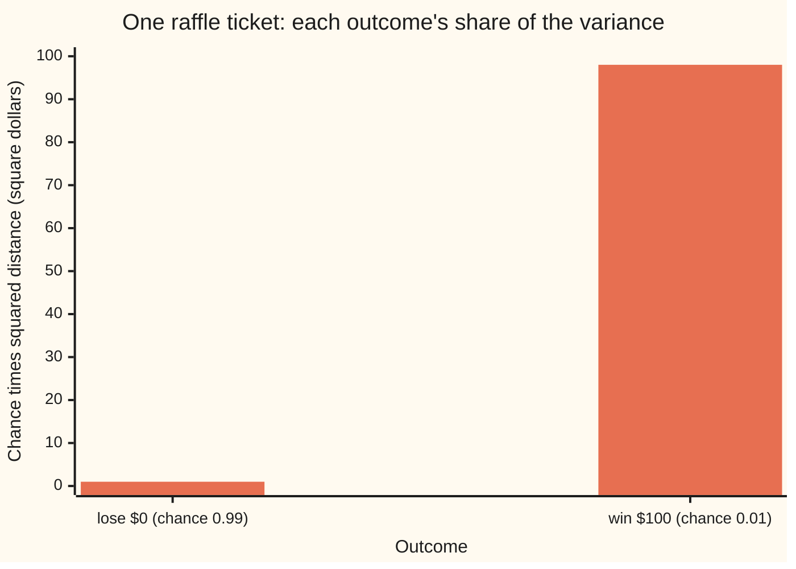
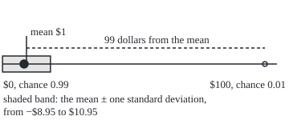

# Variance: the average squared distance from the mean, and its square root in the original units

[Syllabus](../../../SYLLABUS.md) → [Probability and statistics](../../../SYLLABUS.md#w09) → [Random Variables](../../../SYLLABUS.md#w09-s02) → Variance

---

## General Overview

A charity raffle sells 100 tickets. One of them wins $100. The rest win nothing. Hold one ticket and its payout is $0 with chance 0.99 and $100 with chance 0.01: 99 times in 100 nothing, once in 100 a hundred dollars.

On average the ticket pays $1. That is its expectation ([Expectation](02-expectation.md)): 0.99 × $0 + 0.01 × $100. But no ticket ever pays $1. It pays nothing, or it pays a hundred times the average. A ticket paying exactly $1 every time has the same average, and the average alone cannot tell the two apart.

What separates them is spread: how far the payout typically lands from its average. The raffle ticket lands $1 below the average almost every time, and $99 above it once in a hundred. Averaging those distances after squaring them gives the **variance**, 99 square dollars. Its square root, the **standard deviation**, is back in dollars: about $9.95. The steady ticket has variance 0 and standard deviation $0.

**Variance is the probability-weighted average of the squared distance from the mean; the standard deviation is its square root, a typical distance measured in the quantity's own units.**

**What kind of fact this is:** a definition, with two theorems about it (the shortcut formula and the rule for rescaling), both proved on this card in Why it works.

### The picture: where the 99 comes from

Each outcome adds its chance times its squared distance from the $1 mean. The loss is close but common; the win is rare but far.



The two bars sum to 99. The win, one ticket in a hundred, supplies 98.01 of it: squaring makes far outcomes count heavily.

---

## The formula

A reminder of the notation. $X$ is the random variable, here the ticket's payout; its values are written in lower case, $x$. $E[X]$ is its expectation, the long-run average, and this card writes it $\mu$ (the Greek letter mu, read "mew") to keep the formulas short. The sign $\sum_x$ (a capital Greek sigma) means "add up over every value $x$". New on this card: $\mathrm{Var}(X)$, read "the variance of X", and $\sigma$ (Greek sigma), its square root.

$$\mathrm{Var}(X) = E\big[(X - \mu)^2\big] = \sum_x (x - \mu)^2 \, P(X = x)$$

**Read it aloud:** for each value the payout can take, measure its distance from the mean, square it, weight it by its chance, and add.

$$\sigma = \sqrt{\mathrm{Var}(X)}$$

**Read it aloud:** the standard deviation is the square root of the variance, which puts it back in dollars.

Two results make the definition usable. The **shortcut** computes the same number from two averages:

$$\mathrm{Var}(X) = E[X^2] - \mu^2$$

**Read it aloud:** the average of the square, minus the square of the average.

The **rescaling rule** says what happens when every payout is multiplied by a number $a$ and then shifted by a number $b$:

$$\mathrm{Var}(aX + b) = a^2 \, \mathrm{Var}(X), \qquad \sigma_{aX+b} = \lvert a \rvert \, \sigma$$

**Read it aloud:** shifting changes nothing; stretching by $a$ multiplies the variance by $a$ squared and the standard deviation by the size of $a$, sign dropped.

| Symbol | Plain meaning | In our example | Push it up and the answer… |
| --- | --- | --- | --- |
| $X$ | the random variable: the ticket's payout | $0 or $100 | — |
| $x$ | one value $X$ can take | 0, then 100 | a value farther from the mean adds more |
| $P(X = x)$ | the chance $X$ takes the value $x$ | 0.99 and 0.01 | more chance on the far value, more variance |
| $\mu$ | the mean, $E[X]$, the long-run average payout | $1 | a shift moves it, and the variance stays put |
| $E[X^2]$ | the average of the squared payout | 100 square dollars | variance rises one for one |
| $\mathrm{Var}(X)$ | the variance: average squared distance from $\mu$ | 99 square dollars | — |
| $\sigma$ | the standard deviation, $\sqrt{\mathrm{Var}(X)}$ | about $9.95 | — |
| $a$ | a stretch applied to every payout | 2 for a doubled prize | variance grows as $a$ squared |
| $b$ | a shift added to every payout | −2 for a $2 ticket price | no change at all |
| $p$ | the chance of the win | 0.01 | variance $p(1-p)$ times prize squared |
| $\sum_x$ | add over every value $X$ can take | two terms, $0 and $100 | — |
| $n$ | tickets drawn in the simulation | 1,000,000 | the standard error shrinks like $1/\sqrt{n}$ |

### When it holds

- **The variance is a definition, so it always applies where it exists.** It exists when $E[X^2]$ is finite. Every variable with finitely many values qualifies. One with endlessly many can fail: a payout of 1, 2, 3, … dollars, with chance proportional to one over the payout cubed, has a finite mean, but $E[X^2]$ adds terms proportional to one over the payout, and that sum runs off to infinity.
- **The shortcut needs $E[X^2]$ finite too.** Without it the right side is infinity minus a number, and no subtraction makes sense.
- **The rescaling rule needs $a$ and $b$ to be fixed numbers.** If $a$ is itself random, $a$ times $X$ is a product of two random variables and its variance depends on how they move together: [Two variables at once](04-joint-distributions-and-covariance.md).
- **Variances of a sum do not add in general.** That rule needs independence and belongs to the covariance card just named.

---

## Why it works

### Step 0: spread needs a distance, and signed distances cancel

The first try is the average signed distance from the mean. For the ticket: 0.99 × (0 − 1) + 0.01 × (100 − 1) = −0.99 + 0.99 = 0. That is no accident. The mean is the balance point, so the distances below it and above it always cancel exactly, for every random variable that has a mean. A measure of spread must throw the sign away. Squaring does, and keeps the algebra of averages working, which the two theorems below need.

### Step 1: the definition, worked on the ticket

Distances from $\mu = 1$: the loss sits 1 below, the win 99 above. Squared: 1 and 9,801. Weighted by chance: 0.99 × 1 = 0.99 and 0.01 × 9,801 = 98.01. Sum: 99 square dollars.

The distances were squared, so the unit is square dollars. The square root undoes that: $\sigma = \sqrt{99} \approx 9.95$ dollars.

### Step 2: the shortcut, from linearity of the average

Expand the square inside the average: $(X - \mu)^2 = X^2 - 2\mu X + \mu^2$. The average of a sum is the sum of the averages, and a fixed number comes out of an average unchanged ([Expectation](02-expectation.md)). So the average of the expansion is $E[X^2] - 2\mu \cdot \mu + \mu^2 = E[X^2] - \mu^2$.

On the ticket: $E[X^2]$ = 0.99 × 0 + 0.01 × 10,000 = 100. Minus $1^2$: 99 again.

Because a variance is an average of squares it is never negative, so the shortcut also proves $E[X^2] \ge \mu^2$: the average of the squares is at least the square of the average, with equality only when $X$ never moves.

### Step 3: the rescaling rule, from one line of distances

Multiply every payout by $a$ and add $b$. The mean moves the same way: $a\mu + b$. Each new distance from the new mean is $(ax + b) - (a\mu + b) = a(x - \mu)$. The shift $b$ cancels, since it moves payouts and mean together. The stretch survives as $a$, and squaring makes it $a^2$. Averaging the squared distances gives $a^2 \, \mathrm{Var}(X)$. The square root gives $\lvert a \rvert \sigma$, since a square root is never negative.

<details>
<summary>Detailed proof</summary>

Let $X$ take the values $x$ with chances $P(X = x)$ summing to 1, and suppose $\sum_x x^2 P(X = x)$ is finite. Then $\sum_x \lvert x \rvert P(X = x) \le \sum_x (1 + x^2) P(X = x)$ is finite too, so $\mu$ exists.

**Shortcut.** $\sum_x (x - \mu)^2 P(X = x) = \sum_x x^2 P(X = x) - 2\mu \sum_x x P(X = x) + \mu^2 \sum_x P(X = x)$. Each of the three sums is finite, so splitting is allowed. The middle sum is $\mu$ and the last is 1, giving $E[X^2] - 2\mu^2 + \mu^2 = E[X^2] - \mu^2$.

**Rescaling.** The rescaled payout $aX + b$ takes the value $ax + b$ with chance $P(X = x)$. (If $a = 0$ every value collapses to $b$ and both sides are 0.) Its mean is $\sum_x (ax + b) P(X = x) = a\mu + b$. Its variance is $\sum_x \big(ax + b - a\mu - b\big)^2 P(X = x) = a^2 \sum_x (x - \mu)^2 P(X = x) = a^2 \, \mathrm{Var}(X)$.

**Zero spread.** Every term $(x - \mu)^2 P(X = x)$ is at least 0. The sum is 0 only if each term is, so every value with positive chance equals $\mu$: $X$ is constant.

For a variable with a density the sums become integrals and every line holds unchanged; the general case, one integral for all of them, is [Expectation as an integral](../../10-Measure%20and%20integration/04-The%20Lebesgue%20Integral/06-expectation-as-an-integral.md).

</details>

<details>
<summary>Why square, and not take the plain distance?</summary>

The average unsigned distance is a real measure of spread, the mean absolute deviation. For the ticket it is 0.99 × 1 + 0.01 × 99 = $1.98, not $9.95. Both are honest answers to different questions. The square wins in practice for three reasons: the shortcut and the rescaling rule above hold for it; variances of independent variables add, which unsigned distances do not; and the mean is exactly the number that makes the average squared distance smallest, so mean and variance belong together the way a centre and a radius do.

</details>

A third road reaches 99 through the rescaling rule. The payout is $100 times a yes-or-no variable that is 1 on a win and 0 otherwise, with win chance $p$. That variable equals its own square, so its mean and its average square are both $p$, and the shortcut gives its variance as $p - p^2 = p(1 - p)$ = 0.01 × 0.99 = 0.0099. The rescaling rule with $a = 100$ multiplies it by 10,000: 99.

---

## Worked numbers, by hand

| Step | Arithmetic | Value |
| --- | --- | --- |
| the mean | 0.99 × 0 + 0.01 × 100 | $1 |
| distances from the mean | 0 − 1 and 100 − 1 | −1 and 99 |
| squared, times chance | 0.99 × 1 and 0.01 × 9,801 | 0.99 and 98.01 |
| variance, by definition | 0.99 + 98.01 | 99 square dollars |
| average squared payout | 0.99 × 0 + 0.01 × 10,000 | 100 |
| variance, by shortcut | 100 − 1 × 1 | 99 square dollars |
| standard deviation | square root of 99 | **about $9.95** |
| one standard deviation each side of the mean | 1 − 9.95 to 1 + 9.95 | −$8.95 to $10.95 |

A ticket's payout typically lands about $9.95 from its $1 average: nearly always $1 below, now and then $99 above.

### The picture: the ticket's law on a number line, to scale

<p align="center"></p>

The large dot is the common loss, the small ring the rare win. Neither lies at the band's edge: a standard deviation is a typical distance, not a place the payout goes.

### A second case: the same ticket, rescaled

| Rescaled payout | $a$ | $b$ | Mean | Variance | Standard deviation |
| --- | --- | --- | --- | --- | --- |
| net of a $2 price, $X - 2$ | 1 | −2 | −$1 | 99 | $9.95 |
| the organiser's side, $2 - X$ | −1 | 2 | $1 | 99 | $9.95 |
| a doubled prize, $2X$ | 2 | 0 | $2 | 396 | $19.90 |
| counted in cents, $100X$ | 100 | 0 | 100 cents | 990,000 square cents | 994.99 cents |

The ticket price moves the mean and leaves the spread alone. The organiser faces the buyer's spread, sign reversed. Doubling the prize quadruples the variance and doubles the standard deviation. In cents the variance grows 10,000-fold: only the standard deviation converts the way money does.

### What breaks if you drop a piece

| Mistake | Comes out at | What went wrong |
| --- | --- | --- |
| Average the signed distances | 0 | Distances below and above the mean always cancel |
| Double the prize, double the variance | 198, not 396 | The stretch enters squared |
| Shortcut on $2X$, subtracting its mean, not its mean squared | 398, not 396 | At mean $1 the slip is invisible; at mean $2 it shows |
| Shift and stretch both carried into $\mathrm{Var}(2 - X)$ | −97, not 99 | A shift drops out, and a squared sign cannot be negative |

The code prints all four.

---

## Code, from first principles, and it actually runs

The scripts reach the variance by four roads. The definition and the shortcut use the two-line law. A count over a real raffle of 100 tickets, ticket 37 the winner, uses whole numbers only, so no rounding can creep in. A seeded simulation draws a million tickets from a SplitMix64 generator (a short, well-tested recipe for pseudo-random numbers, written out in both languages so both draw the same tickets) and reports its estimate with a standard error, the typical size of a simulation's miss. A fifth line checks the yes-or-no road. The rescaled table counts rescaled tickets directly and compares with $a^2$ times 99. Square roots are Newton's method, written out.

### Python

```python
# Variance and standard deviation -- the check behind the card.  Nothing is
# imported.  The raffle ticket pays $100 with chance 0.01 and $0 otherwise.
# Its variance is reached four ways: the definition, the shortcut, a count
# over a raffle of 100 real tickets, and a seeded simulation of a million.
LAW = [(0.0, 0.99), (100.0, 0.01)]          # (payout in dollars, chance)

def mean(law):
    return sum(p * x for x, p in law)

def var_definition(law):                    # road 1: average squared distance
    m = mean(law)
    return sum(p * (x - m) ** 2 for x, p in law)

def var_shortcut(law):                      # road 2: E[X^2] minus the mean squared
    return sum(p * x * x for x, p in law) - mean(law) ** 2

def sqrt(v):                                # Newton's method, written out here
    if v == 0.0:
        return 0.0
    r = v if v > 1.0 else 1.0
    for _ in range(100):
        r = 0.5 * (r + v / r)
    return r

def splitmix64(state):                      # the generator both languages share
    state = (state + 0x9E3779B97F4A7C15) & 0xFFFFFFFFFFFFFFFF
    z = state
    z = ((z ^ (z >> 30)) * 0xBF58476D1CE4E5B9) & 0xFFFFFFFFFFFFFFFF
    z = ((z ^ (z >> 27)) * 0x94D049BB133111EB) & 0xFFFFFFFFFFFFFFFF
    return state, z ^ (z >> 31)

def enumerate_tickets(pay, a=1, b=0):       # road 3: 100 tickets, ticket 37 wins
    vals = [a * (pay if t == 37 else 0) + b for t in range(100)]
    total = sum(vals)                       # whole numbers: no rounding at all
    sq = sum((100 * v - total) ** 2 for v in vals)
    return total / 100, sq / 100 ** 3

mu, v_def, v_short = mean(LAW), var_definition(LAW), var_shortcut(LAW)
ex2 = sum(p * x * x for x, p in LAW)
m_enum, v_enum = enumerate_tickets(100)
v_indicator = 100 ** 2 * (0.01 * (1 - 0.01))  # a = 100 times a 0-or-1 indicator
sd = sqrt(v_def)

# road 4: a seeded simulation, one million tickets, variance by the definition
n, state, draws = 1_000_000, 20260928, []
for _ in range(n):
    state, z = splitmix64(state)
    draws.append(100.0 if (z >> 11) * 2.0 ** -53 < 0.01 else 0.0)
m_sim = sum(draws) / n
v_sim = sum((d - m_sim) ** 2 for d in draws) / n
m4_sim = sum((d - m_sim) ** 4 for d in draws) / n
se_v = sqrt((m4_sim - v_sim ** 2) / n)      # standard error of the variance
sd_sim = sqrt(v_sim)
se_sd = se_v / (2 * sd_sim)                 # and of its square root

def row(label, v):
    print(f"{label:<40} {v:>14.6f}")

row("mean E[X]", mu)
row("E[X^2]", ex2)
row("1 definition: sum p (x - mean)^2", v_def)
row("2 shortcut: E[X^2] - mean^2", v_short)
row("3 count, 100 tickets: mean", m_enum)
row("3 count, 100 tickets: variance", v_enum)
row("4 simulated, 1,000,000: mean", m_sim)
row("4 simulated: variance", v_sim)
row("4 simulated: standard error of it", se_v)
row("5 indicator alone: p(1 - p)", 0.01 * (1 - 0.01))
row("5 prize^2 times p(1 - p)", v_indicator)
row("standard deviation sqrt(99)", sd)
row("simulated standard deviation", sd_sim)
row("  its standard error", se_sd)
row("mean +/- one sd: low end", mu - sd)
row("mean +/- one sd: high end", mu + sd)
print()
print("scaled ticket aX + b     a      b    mean  var by count   a^2 Var(X)      sd")
for name, a, b in (("net of a $2 price", 1, -2), ("organiser: 2 - X", -1, 2),
                   ("double prize: 2X", 2, 0), ("in cents: 100X", 100, 0)):
    m_ab, v_ab = enumerate_tickets(100, a, b)
    print(f"{name:<20} {a:>6} {b:>6} {m_ab:>7.2f} {v_ab:>14.2f} {a * a * v_def:>12.2f} {sqrt(v_ab):>7.2f}")
    assert abs(v_ab - a * a * v_def) < 1e-6 * (1 + a * a * v_def), name
print()
row("wrong: no square, sum p (x - mean)", sum(p * (x - mu) for x, p in LAW))
row("wrong: average distance, no square", sum(p * abs(x - mu) for x, p in LAW))
row("wrong: Var(2X) = 2 Var(X)", 2 * v_def)
row("wrong: 2X, E[Y^2] - E[Y] not E[Y]^2", 4 * ex2 - 2 * mu)
row("wrong: Var(2 - X) = -Var(X) + 2", -v_def + 2)
row("try: $1,000 prize, chance 0.001: var", var_definition([(0.0, 0.999), (1000.0, 0.001)]))
row("try: $1,000 prize, chance 0.001: sd", sqrt(var_definition([(0.0, 0.999), (1000.0, 0.001)])))
row("try: $2 prize, chance 0.5: var", var_definition([(0.0, 0.5), (2.0, 0.5)]))
row("chart, contribution of a loss", 0.99 * (0.0 - mu) ** 2)
row("chart, contribution of a win", 0.01 * (100.0 - mu) ** 2)
print("figure, x of $0 {:.2f}, $1 {:.2f}, $100 {:.2f}, band {:.2f} to {:.2f}".format(
    *[(v + 10) * 3 for v in (0.0, mu, 100.0, mu - sd, mu + sd)]))

assert abs(v_def - v_enum) < 1e-9, "definition vs whole-number count"
assert abs(m_enum - mu) < 1e-12, "mean vs whole-number count"
assert abs(v_short - v_enum) < 1e-9, "shortcut vs whole-number count"
assert abs(var_shortcut([(0.0, 0.99), (200.0, 0.01)]) - enumerate_tickets(100, 2)[1]) < 1e-9, "shortcut, 2X"
assert abs(v_indicator - v_def) < 1e-9, "indicator road vs definition"
assert abs(v_sim - v_enum) < 4 * se_v, "simulation within four standard errors"
assert abs(sd * sd - v_enum) < 1e-9, "Newton square root vs the count"
print("ALL CHECKS PASS")
```

**Ran 2026-09-28 on macOS, Python 3.14.6, standard library only. All checks passed. Output, pasted from the run:**

```
mean E[X]                                      1.000000
E[X^2]                                       100.000000
1 definition: sum p (x - mean)^2              99.000000
2 shortcut: E[X^2] - mean^2                   99.000000
3 count, 100 tickets: mean                     1.000000
3 count, 100 tickets: variance                99.000000
4 simulated, 1,000,000: mean                   1.011000
4 simulated: variance                        100.077879
4 simulated: standard error of it              0.980161
5 indicator alone: p(1 - p)                    0.009900
5 prize^2 times p(1 - p)                      99.000000
standard deviation sqrt(99)                    9.949874
simulated standard deviation                  10.003893
  its standard error                           0.048989
mean +/- one sd: low end                      -8.949874
mean +/- one sd: high end                     10.949874

scaled ticket aX + b     a      b    mean  var by count   a^2 Var(X)      sd
net of a $2 price         1     -2   -1.00          99.00        99.00    9.95
organiser: 2 - X         -1      2    1.00          99.00        99.00    9.95
double prize: 2X          2      0    2.00         396.00       396.00   19.90
in cents: 100X          100      0  100.00      990000.00    990000.00  994.99

wrong: no square, sum p (x - mean)             0.000000
wrong: average distance, no square             1.980000
wrong: Var(2X) = 2 Var(X)                    198.000000
wrong: 2X, E[Y^2] - E[Y] not E[Y]^2          398.000000
wrong: Var(2 - X) = -Var(X) + 2              -97.000000
try: $1,000 prize, chance 0.001: var         999.000000
try: $1,000 prize, chance 0.001: sd           31.606961
try: $2 prize, chance 0.5: var                 1.000000
chart, contribution of a loss                  0.990000
chart, contribution of a win                  98.010000
figure, x of $0 30.00, $1 33.00, $100 330.00, band 3.15 to 62.85
ALL CHECKS PASS
```

### Rust

Same numbers, same labels, same generator and seed.

```rust
// Variance and standard deviation -- the check behind the card, in Rust, std
// only.  The raffle ticket pays $100 with chance 0.01 and $0 otherwise.  Its
// variance is reached four ways: the definition, the shortcut, a count over a
// raffle of 100 real tickets, and a seeded simulation of a million tickets.
const LAW: [(f64, f64); 2] = [(0.0, 0.99), (100.0, 0.01)]; // (payout in dollars, chance)

fn mean(law: &[(f64, f64)]) -> f64 {
    law.iter().map(|&(x, p)| p * x).sum()
}

fn var_definition(law: &[(f64, f64)]) -> f64 {
    // road 1: average squared distance
    let m = mean(law);
    law.iter().map(|&(x, p)| p * (x - m).powf(2.0)).sum()
}

fn var_shortcut(law: &[(f64, f64)]) -> f64 {
    // road 2: E[X^2] minus the mean squared
    law.iter().map(|&(x, p)| p * x * x).sum::<f64>() - mean(law).powf(2.0)
}

fn sqrt(v: f64) -> f64 {
    // Newton's method, written out here
    if v == 0.0 {
        return 0.0;
    }
    let mut r = if v > 1.0 { v } else { 1.0 };
    for _ in 0..100 {
        r = 0.5 * (r + v / r);
    }
    r
}

fn splitmix64(state: u64) -> (u64, u64) {
    // the generator both languages share
    let state = state.wrapping_add(0x9E3779B97F4A7C15);
    let mut z = state;
    z = (z ^ (z >> 30)).wrapping_mul(0xBF58476D1CE4E5B9);
    z = (z ^ (z >> 27)).wrapping_mul(0x94D049BB133111EB);
    (state, z ^ (z >> 31))
}

fn enumerate_tickets(pay: i64, a: i64, b: i64) -> (f64, f64) {
    // road 3: 100 tickets, ticket 37 wins; whole numbers, no rounding at all
    let vals: Vec<i64> = (0..100).map(|t| a * (if t == 37 { pay } else { 0 }) + b).collect();
    let total: i64 = vals.iter().sum();
    let sq: i64 = vals.iter().map(|&v| (100 * v - total) * (100 * v - total)).sum();
    (total as f64 / 100.0, sq as f64 / 1_000_000.0)
}

fn row(label: &str, v: f64) {
    println!("{:<40} {:>14.6}", label, v);
}

fn main() {
    let (mu, v_def, v_short) = (mean(&LAW), var_definition(&LAW), var_shortcut(&LAW));
    let ex2: f64 = LAW.iter().map(|&(x, p)| p * x * x).sum();
    let (m_enum, v_enum) = enumerate_tickets(100, 1, 0);
    let v_indicator = 100f64.powf(2.0) * (0.01 * (1.0 - 0.01)); // a = 100 times a 0-or-1 indicator
    let sd = sqrt(v_def);

    // road 4: a seeded simulation, one million tickets, variance by the definition
    let (n, mut state) = (1_000_000usize, 20260928u64);
    let mut draws = Vec::with_capacity(n);
    for _ in 0..n {
        let (s, z) = splitmix64(state);
        state = s;
        draws.push(if ((z >> 11) as f64) * 2f64.powf(-53.0) < 0.01 { 100.0 } else { 0.0 });
    }
    let nf = n as f64;
    let m_sim = draws.iter().sum::<f64>() / nf;
    let v_sim = draws.iter().map(|d| (d - m_sim).powf(2.0)).sum::<f64>() / nf;
    let m4_sim = draws.iter().map(|d| (d - m_sim).powf(4.0)).sum::<f64>() / nf;
    let se_v = sqrt((m4_sim - v_sim.powf(2.0)) / nf); // standard error of the variance
    let sd_sim = sqrt(v_sim);
    let se_sd = se_v / (2.0 * sd_sim); // and of its square root

    row("mean E[X]", mu);
    row("E[X^2]", ex2);
    row("1 definition: sum p (x - mean)^2", v_def);
    row("2 shortcut: E[X^2] - mean^2", v_short);
    row("3 count, 100 tickets: mean", m_enum);
    row("3 count, 100 tickets: variance", v_enum);
    row("4 simulated, 1,000,000: mean", m_sim);
    row("4 simulated: variance", v_sim);
    row("4 simulated: standard error of it", se_v);
    row("5 indicator alone: p(1 - p)", 0.01 * (1.0 - 0.01));
    row("5 prize^2 times p(1 - p)", v_indicator);
    row("standard deviation sqrt(99)", sd);
    row("simulated standard deviation", sd_sim);
    row("  its standard error", se_sd);
    row("mean +/- one sd: low end", mu - sd);
    row("mean +/- one sd: high end", mu + sd);
    println!();
    println!("scaled ticket aX + b     a      b    mean  var by count   a^2 Var(X)      sd");
    for &(name, a, b) in [("net of a $2 price", 1i64, -2i64), ("organiser: 2 - X", -1, 2),
                          ("double prize: 2X", 2, 0), ("in cents: 100X", 100, 0)].iter() {
        let (m_ab, v_ab) = enumerate_tickets(100, a, b);
        let af = a as f64;
        println!("{:<20} {:>6} {:>6} {:>7.2} {:>14.2} {:>12.2} {:>7.2}", name, a, b, m_ab, v_ab, af * af * v_def, sqrt(v_ab));
        assert!((v_ab - af * af * v_def).abs() < 1e-6 * (1.0 + af * af * v_def), "{}", name);
    }
    println!();
    row("wrong: no square, sum p (x - mean)", LAW.iter().map(|&(x, p)| p * (x - mu)).sum());
    row("wrong: average distance, no square", LAW.iter().map(|&(x, p)| p * (x - mu).abs()).sum());
    row("wrong: Var(2X) = 2 Var(X)", 2.0 * v_def);
    row("wrong: 2X, E[Y^2] - E[Y] not E[Y]^2", 4.0 * ex2 - 2.0 * mu);
    row("wrong: Var(2 - X) = -Var(X) + 2", -v_def + 2.0);
    let big = [(0.0, 0.999), (1000.0, 0.001)];
    row("try: $1,000 prize, chance 0.001: var", var_definition(&big));
    row("try: $1,000 prize, chance 0.001: sd", sqrt(var_definition(&big)));
    row("try: $2 prize, chance 0.5: var", var_definition(&[(0.0, 0.5), (2.0, 0.5)]));
    row("chart, contribution of a loss", 0.99 * (0.0 - mu).powf(2.0));
    row("chart, contribution of a win", 0.01 * (100.0 - mu).powf(2.0));
    let f: Vec<f64> = [0.0, mu, 100.0, mu - sd, mu + sd].iter().map(|v| (v + 10.0) * 3.0).collect();
    println!("figure, x of $0 {:.2}, $1 {:.2}, $100 {:.2}, band {:.2} to {:.2}", f[0], f[1], f[2], f[3], f[4]);

    assert!((v_def - v_enum).abs() < 1e-9, "definition vs whole-number count");
    assert!((m_enum - mu).abs() < 1e-12, "mean vs whole-number count");
    assert!((v_short - v_enum).abs() < 1e-9, "shortcut vs whole-number count");
    assert!((var_shortcut(&[(0.0, 0.99), (200.0, 0.01)]) - enumerate_tickets(100, 2, 0).1).abs() < 1e-9, "shortcut, 2X");
    assert!((v_indicator - v_def).abs() < 1e-9, "indicator road vs definition");
    assert!((v_sim - v_enum).abs() < 4.0 * se_v, "simulation within four standard errors");
    assert!((sd * sd - v_enum).abs() < 1e-9, "Newton square root vs the count");
    println!("ALL CHECKS PASS");
}
```

**Ran 2026-09-28 on macOS, rustc 1.98.1, no crates. All checks passed. Output, pasted from the run:**

```
mean E[X]                                      1.000000
E[X^2]                                       100.000000
1 definition: sum p (x - mean)^2              99.000000
2 shortcut: E[X^2] - mean^2                   99.000000
3 count, 100 tickets: mean                     1.000000
3 count, 100 tickets: variance                99.000000
4 simulated, 1,000,000: mean                   1.011000
4 simulated: variance                        100.077879
4 simulated: standard error of it              0.980161
5 indicator alone: p(1 - p)                    0.009900
5 prize^2 times p(1 - p)                      99.000000
standard deviation sqrt(99)                    9.949874
simulated standard deviation                  10.003893
  its standard error                           0.048989
mean +/- one sd: low end                      -8.949874
mean +/- one sd: high end                     10.949874

scaled ticket aX + b     a      b    mean  var by count   a^2 Var(X)      sd
net of a $2 price         1     -2   -1.00          99.00        99.00    9.95
organiser: 2 - X         -1      2    1.00          99.00        99.00    9.95
double prize: 2X          2      0    2.00         396.00       396.00   19.90
in cents: 100X          100      0  100.00      990000.00    990000.00  994.99

wrong: no square, sum p (x - mean)             0.000000
wrong: average distance, no square             1.980000
wrong: Var(2X) = 2 Var(X)                    198.000000
wrong: 2X, E[Y^2] - E[Y] not E[Y]^2          398.000000
wrong: Var(2 - X) = -Var(X) + 2              -97.000000
try: $1,000 prize, chance 0.001: var         999.000000
try: $1,000 prize, chance 0.001: sd           31.606961
try: $2 prize, chance 0.5: var                 1.000000
chart, contribution of a loss                  0.990000
chart, contribution of a win                  98.010000
figure, x of $0 30.00, $1 33.00, $100 330.00, band 3.15 to 62.85
ALL CHECKS PASS
```

The two outputs match line for line. The simulated variance, 100.08, sits about one standard error (0.98) above the exact 99, and the simulated standard deviation, 10.004, about one of its standard errors (0.049) above 9.95. That is the size of miss chance alone produces.

> [!TIP]
> **Try changing**
> Guess first, then run it.
> - **Same average, rarer prize.** A $1,000 prize with chance 0.001 keeps the mean at $1. Guess the variance. It is 999, standard deviation about $31.61: a rarer, bigger prize is a riskier ticket at the same average. The `try:` rows print it; setting `LAW` to it stops the run, since the asserts are pinned to the 100-ticket raffle.
> - **A coin-flip ticket.** $2 with chance 0.5, $0 otherwise. Mean still $1; variance exactly 1, standard deviation $1.
> - **Another seed.** Change `20260928` to any other number. The simulated variance moves by roughly one standard error, about 0.98. The asserts allow four, so a pass is all but certain.
> - **Break the square.** Replace `(x - m) ** 2` with `abs(x - m)` in `var_definition`. An assert stops the run: 1.98 is not 99.

---

## The usual mistake

> [!warning]
> **Reading the standard deviation as a place the payout lands.** "Mean $1, standard deviation $9.95" does not say the payout sits between −$8.95 and $10.95. The ticket never pays anything in that band except $0, and it pays $100, far outside it, once in a hundred. How much chance lies within a given distance is a separate question, bounded for every variable by [Markov and Chebyshev](08-markov-and-chebyshev-inequalities.md).
>
> - **Quoting variance in the payout's units.** The ticket's variance is 99 square dollars, not $99. In cents it becomes 990,000, which looks alarming and means the same thing.
> - **Scaling the variance by $a$.** A doubled prize has variance 396, not 198. The standard deviation doubles; the variance quadruples.
> - **Squaring the wrong thing in the shortcut.** $E[X^2] - E[X]$ gives the right 99 here only because the mean is 1. On the doubled prize it gives 398, not 396.
> - **Dividing by $n - 1$ where no data exist.** A calculator's sample standard deviation divides by one less than the count, a correction for estimating spread from data. A known law, like the ticket's, has no sample and no correction.

---

## Where you meet it in real life

- **Lotteries and insurance.** A lottery ticket and a steady coupon can share an expected value; the spread is what a ticket buyer pays for and an insurer is paid to absorb.
- **Investment risk.** A fund's volatility is the standard deviation of its returns, quoted in percent per year, and the finance wing builds its option prices on it.
- **Measurement.** A scale that reads a 1 kg weight with standard deviation 2 g is quoted as "1,000 g ± 2 g"; how those errors combine through a formula is [Error propagation](../../13-Engineering%20mathematics/01-Units%20and%20Modelling/07-error-propagation-and-sensitivity.md).
- **Computing it safely.** The shortcut subtracts two large numbers; with real data in floating point that can lose most of the digits, which is why software uses the two-pass or running method: Cancellation and Adding a million numbers without losing the small ones.

> **Say it back**
> A raffle ticket pays $0 almost always and $100 once in a hundred, so it averages $1 but never pays $1. Variance measures that spread: square each outcome's distance from the mean, weight it by its chance, and add, giving 99 square dollars. The shortcut gets the same 99 as the average of the square minus the square of the average. The square root, about $9.95, is the standard deviation, a typical distance in dollars. Shifting every payout leaves both unchanged; stretching by a factor multiplies the variance by its square and the standard deviation by its size.

---

## What this builds on

- [Expectation](02-expectation.md): the mean, and the linearity that turns the definition into the shortcut.

## Where this goes next

- [Two variables at once](04-joint-distributions-and-covariance.md): the variance of a sum, and the cross term that dependence adds.
- [Markov and Chebyshev](08-markov-and-chebyshev-inequalities.md): how much chance a standard deviation can leave in the tails.
- [Binomial](../03-Discrete%20Distributions/01-bernoulli-and-binomial.md): the $p(1 - p)$ variance of a yes-or-no variable, and $n$ of them.
- [Expectation as an integral](../../10-Measure%20and%20integration/04-The%20Lebesgue%20Integral/06-expectation-as-an-integral.md): one integral that covers sums and densities alike.
- [Error propagation](../../13-Engineering%20mathematics/01-Units%20and%20Modelling/07-error-propagation-and-sensitivity.md): the rescaling rule applied to a measured input.
- Cancellation: why the shortcut can fail in floating point.
- Adding a million numbers without losing the small ones: the one-pass variance that stays accurate.

One ticket's spread is now a number; what happens to it when two tickets, from the same raffle or different ones, are held together is the question [Two variables at once](04-joint-distributions-and-covariance.md) answers.

---

## Sources

Verified 2026-09-28: every link below opens the cited work.

- Grinstead, Charles M., and J. Laurie Snell. *Introduction to Probability*, 2nd revised ed. American Mathematical Society. [Full text, Dartmouth](https://math.dartmouth.edu/~prob/prob/prob.pdf). Chapter 6 defines variance for discrete variables and proves the shortcut and the rescaling rule.
- Blitzstein, Joseph K., and Jessica Hwang. *Introduction to Probability*, 2nd ed. CRC Press, 2019. [Publisher page](https://www.routledge.com/Introduction-to-Probability-Second-Edition/Blitzstein-Hwang/p/book/9781138369917). Chapter 4 on expectation and variance, with the indicator road.
- Siegrist, Kyle. "Variance." *Probability, Mathematical Statistics, and Stochastic Processes*, Random Services. [Section page](https://www.randomservices.org/random/expect/Variance.html). The definition, the shortcut, linear rescaling, and the mean as the point that minimises the average squared distance.
- Graham, Ronald L., Donald E. Knuth, and Oren Patashnik. *Concrete Mathematics*, 2nd ed. Addison-Wesley, 1994. [Publisher page](https://www.informit.com/store/concrete-mathematics-a-foundation-for-computer-science-9780201558029). Chapter 8 computes means and variances of discrete laws by sums.
