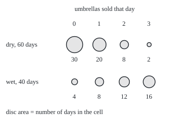
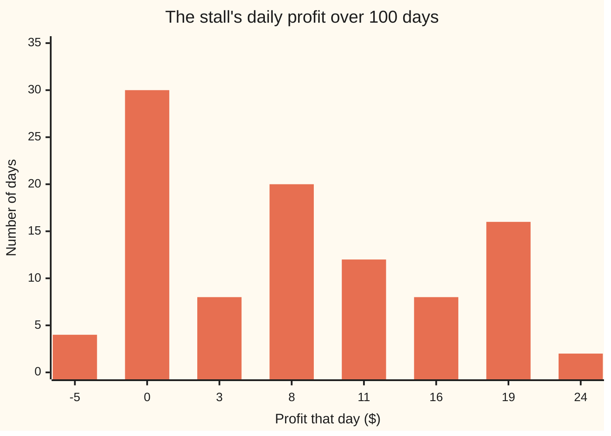

# Two variables at once: joint tables, marginals, covariance and correlation

Probability and statistics → Random Variables → Moving together → Two variables at once

---

## General Overview

A street stall sells umbrellas. Over 100 days its owner writes down two things each evening: did it rain, and how many umbrellas sold. Sixty days were dry and forty were wet. On dry days the stall sold 0.7 umbrellas on average. On wet days it sold 2.0.

Those two averages already say the two readings move together. But they come from one table, and the table holds more. It says how often each *pair* happened: dry and none sold on 30 days, wet and three sold on 16 days. That table is the **joint distribution**: the chance of every combination of the two readings at once.

From the one table come three things. The rain column alone and the sales column alone (the **marginals**). One number for how much the two move together (the **covariance**). And that number rescaled to lie between −1 and +1 (the **correlation**), here 0.5786.

Why care? Umbrellas earn $8 each, and on a wet day the stall pays $5 to hire a canopy. The day's profit mixes the two readings, and its variance is not the two separate variances added: a third piece, the cross term, built from the covariance, appears. Leave it out and the stall's day-to-day swing comes out at $9.1402 instead of the true $7.6539.

**Two readings taken together carry a joint table; from it, covariance measures how they move together, and the spread of any sum of them is the separate spreads plus twice their covariance.**

**What kind of fact this is:** covariance and correlation are definitions; the variance of a sum, with its cross term, is a theorem, proved on this card in Why it works.

### The picture: the 100 days as a table of discs

Each disc's area is proportional to the number of days in that cell (radius 3 times the square root of the count). Rows are rain, columns are umbrellas sold.

<p align="center"></p>

The weight runs from top left to bottom right: dry days pile up at few sales, wet days at many. That diagonal lean is what covariance measures.

---

## The formula

Notation first, in words. Two capital letters name the two readings of one day: $X$ is 1 on a wet day and 0 on a dry one, and $Y$ is the number of umbrellas sold. A lower-case letter is a value one of them can take. The chance that both happen together, written P(X = x, Y = y), is read "the chance that X is x and Y is y": one cell of the table. As on the earlier cards of this shelf, $E$ in E[X] means the long-run average and Var(X) the variance, the average squared distance from that average.

Two new symbols. Cov(X, Y), read "the covariance of X and Y", is the average product of the two readings' distances from their own averages. $\sigma_X$ and $\sigma_Y$ (sigma) are the two standard deviations. The Greek letter rho, $\rho$, is the correlation: covariance divided by both standard deviations.

$$\mathrm{Cov}(X,Y) = E\big[(X - E[X])\,(Y - E[Y])\big] = E[XY] - E[X]\,E[Y]$$

**Read it aloud:** on each day, multiply how far rain sat above its average by how far sales sat above theirs, and average those products; equivalently, the average of the product minus the product of the averages.

$$\rho = \frac{\mathrm{Cov}(X,Y)}{\sigma_X\,\sigma_Y}, \qquad -1 \le \rho \le 1$$

**Read it aloud:** correlation is covariance with the units divided out, so it always lands between −1 and +1.

The theorem this card proves, for any fixed numbers a and b:

$$\mathrm{Var}(aX + bY) = a^2\,\mathrm{Var}(X) + b^2\,\mathrm{Var}(Y) + 2ab\,\mathrm{Cov}(X,Y)$$

**Read it aloud:** the spread of a weighted sum is each spread scaled by its weight squared, plus twice the two weights times the covariance.

With a = b = 1 this is the plain sum: Var(X + Y) = Var(X) + Var(Y) + 2 Cov(X, Y).

| Symbol | Plain meaning | In our example | Push it up and the answer… |
| --- | --- | --- | --- |
| $X$ | the rain reading: 1 on a wet day, 0 on a dry one | average 0.4000 | more wet days: more umbrella days |
| $Y$ | umbrellas sold that day | average 1.2200 | more sales: larger profit |
| $x$, $y$ | one particular value of each | x = 1, y = 3 | picks a different cell |
| P(X = x, Y = y) | the joint probability: one cell of the table, as a share of all days | wet and 3 sold: 16 of 100 days | a heavier cell pulls the lean its way |
| $E$ | long-run average, E[X], E[Y], E[XY] | E[XY] = 0.8000 | — |
| Var | variance: average squared distance from the average | Var(X) = 0.2400, Var(Y) = 1.2116 | a wider spread |
| Cov | covariance: average product of the two distances | 0.3120 | stronger joint movement, in umbrella units |
| $\sigma_X$, $\sigma_Y$ | standard deviations, the square roots of the variances | 0.4899, 1.1007 | shrinks the correlation for a given covariance |
| $\rho$ | correlation, covariance with units removed | 0.5786 | nearer +1: closer to a straight rising line |
| $a$, $b$ | fixed multipliers in a weighted sum | a = −5 (canopy), b = 8 (price) | scales that reading's share of the spread |
| $G$ | the day's profit in dollars, G = 8Y − 5X | average $7.76 | — |

Two helper facts, each one line. The **marginal** of X is a row total: add across a row and the sales reading is forgotten, leaving 0.60 dry and 0.40 wet. The marginal of Y is a column total: 0.34, 0.28, 0.20, 0.18 for 0, 1, 2, 3 sold.

### When it holds

- **Both readings come from the same day.** Two lists shuffled apart give margins but no covariance.
- **Both variances are finite.** On a finite table like this one they always are. A reading with an unbounded tail can have no variance, and then neither formula means anything.
- **Correlation needs both standard deviations above zero.** If sales were always 2, the ratio would be 0 divided by 0: undefined, not zero.
- **The multipliers a and b are fixed numbers.** If the canopy fee itself rose on busy days, it would be a third random reading with its own covariances.
- **Covariance only sees straight-line lean.** It can be zero while one reading fixes the other exactly; What breaks shows one.

---

## Why it works

### Step 0: a sum's wobble squared makes a cross product

A day's profit sits off its average by the umbrella money's distance plus the canopy money's distance. Variance squares that total. Squaring a sum of two pieces gives each piece squared plus twice their product. The squares average to the two variances, the product to the covariance. That is the whole theorem.

### Step 1: read the margins off the table

Every day falls in exactly one cell. So the chance of a wet day is the sum of the wet row: (4 + 8 + 12 + 16) out of 100, giving 0.40. The chance of selling two umbrellas is the sum of that column: (8 + 12) out of 100, giving 0.20. Adding across one reading forgets it; that is all a marginal is.

The margins cannot rebuild the table: the table of margin products (Step 4) has the same totals and no lean.

### Step 2: the covariance shortcut

Write m for E[X] and n for E[Y]. Expand the product inside the definition:

(X − m)(Y − n) = XY − nX − mY + mn.

Averages add, and a fixed number comes out of an average (the linearity of expectation, from the expectation card). So the average is E[XY] − nm − mn + mn = E[XY] − mn. On the stall: 0.8000 − 0.4 × 1.22 = 0.8000 − 0.4880 = 0.3120.

### Step 3: the variance of a sum

Let U = aX + bY. Its average is am + bn, so its distance from average is a(X − m) + b(Y − n). Square it:

a^2(X − m)^2 + b^2(Y − n)^2 + 2ab(X − m)(Y − n).

Average each term. The first averages to a^2 Var(X), the second to b^2 Var(Y), the third to 2ab Cov(X, Y). Nothing was assumed about how X and Y relate. The cross term is there whenever the covariance is not zero.

For the stall, b = 8 and a = −5: 64 × 1.2116 + 25 × 0.24 + 2 × 8 × (−5) × 0.312 = 77.5424 + 6.0000 − 24.9600 = 58.5824. The cross term is negative because the canopy fee (subtracted) and sales (added) both rise on wet days. On a wet day the fee eats part of the sales boost, so the profit swings less than the two pieces would alone.

<details>
<summary>Detailed proof: the same theorem written as sums over the table</summary>

Let the rows carry values x with row totals r(x), the columns values y with column totals c(y), and let p(x, y) be the cell probabilities, which sum to 1. Write m = Σ x r(x) and n = Σ y c(y).

Var(aX + bY) = Σ over all cells of p(x, y) (a(x − m) + b(y − n))^2.

Expand the square inside the sum and split the sum into three:

a^2 Σ p(x, y)(x − m)^2 + b^2 Σ p(x, y)(y − n)^2 + 2ab Σ p(x, y)(x − m)(y − n).

In the first sum the term depends only on x, so adding over y first turns p(x, y) into r(x): the sum is Σ r(x)(x − m)^2, which is Var(X). The second sum, by the same move over x, is Var(Y). The third is the definition of Cov(X, Y). No step needed the cells to factor. The code checks it by brute force: it lists all 100 days, computes each day's profit, and takes the variance of those 100 numbers directly.

</details>

### Step 4: independent readings have zero covariance

Two readings are **independent** when every cell equals its row total times its column total. Then E[XY] = Σ x y r(x) c(y) = (Σ x r(x))(Σ y c(y)) = E[X] E[Y], and the covariance is zero. For independent readings, variances simply add.

The converse fails. Zero covariance does not mean independent: covariance measures only straight-line lean, and a U-shaped link cancels itself. What breaks has the example.

### Step 5: correlation cannot pass ±1

Standardise both readings: divide each by its standard deviation, so each has variance 1. Step 3 with a = 1/σ_X and b = 1/σ_Y gives Var(X/σ_X + Y/σ_Y) = 1 + 1 + 2ρ = 2 + 2ρ. With a minus sign, Var(X/σ_X − Y/σ_Y) = 2 − 2ρ. A variance is an average of squares, so neither can be negative. So −1 ≤ ρ ≤ 1. On the stall the two are 3.1572 and 0.8428, both positive. Correlation equals +1 or −1 only when one of these variances is zero, which means one reading is an exact straight-line function of the other.

### Step 6: when one reading is yes or no

With X a yes-or-no reading, Step 2 collapses to

Cov(X, Y) = Var(X) × (wet-day average − dry-day average) = 0.24 × (2.0 − 0.7) = 0.24 × 1.3 = 0.312.

<details>
<summary>The algebra behind Step 6</summary>

Write p for the chance of a wet day, w for the wet-day average sales and d for the dry-day average. Then E[XY] = pw, since XY is zero on dry days and Y on wet ones. E[X] = p and E[Y] = pw + (1 − p)d. So Cov = pw − p(pw + (1 − p)d) = p(1 − p)(w − d). For a yes-or-no reading, p(1 − p) is its variance (the variance card).

</details>

The gap between the two averages is what the next card on this shelf, [conditional-expectation-in-tables](05-conditional-expectation-in-tables.md), studies in its own right.

---

## Worked numbers, by hand

The 100 days, as a joint table of counts:

| Rain \ umbrellas sold | 0 | 1 | 2 | 3 | Row total |
| --- | --- | --- | --- | --- | --- |
| dry (X = 0) | 30 | 20 | 8 | 2 | 60 |
| wet (X = 1) | 4 | 8 | 12 | 16 | 40 |
| Column total | 34 | 28 | 20 | 18 | 100 |

| Step | Arithmetic | Value |
| --- | --- | --- |
| E[X] | 40 wet days out of 100 | 0.4000 |
| E[Y] | (1 × 28 + 2 × 20 + 3 × 18) / 100 | 1.2200 |
| E[Y^2] | (1 × 28 + 4 × 20 + 9 × 18) / 100 | 2.7000 |
| Var(X) | 0.4 × (1 − 0.4) | 0.2400 |
| Var(Y) | 2.7000 − 1.4884 | 1.2116 |
| E[XY] | wet days only: (1 × 8 + 2 × 12 + 3 × 16) / 100 | 0.8000 |
| Cov(X, Y) | 0.8000 − 0.4 × 1.22 | **0.3120** |
| correlation | 0.312 / (0.4899 × 1.1007) | **0.5786** |
| profit variance | 64 × 1.2116 + 25 × 0.24 − 80 × 0.312 | **58.5824** |
| profit spread | square root of 58.5824 | **$7.6539** |

Over these 100 days the stall's profit averaged $7.76 and typically swung about $7.6539 either side of that. The correlation of 0.5786 says rain and sales lean together clearly but loosely: plenty of wet days still sold nothing or one.

The profit takes eight values, one per cell, and its law is a bar chart:



The bars are the eight cells of the table, re-labelled by profit. A wet day with no sales loses $5 (4 days); a dry day with three sales earns $24 (2 days). Their variance, taken directly over the 100 days, is 58.5824: the same as the formula.

### What breaks if you drop a piece

| Mistake | Comes out at | What went wrong |
| --- | --- | --- |
| Adding the two variances, cross term dropped | 83.5424, a spread of $9.1402 | treats rain and sales as uncorrelated; the true variance is 58.5824 |
| Reading E[XY] as the covariance | 0.8000 | forgets to subtract E[X]E[Y] = 0.4880; true covariance 0.3120 |
| Reading zero covariance as "unrelated" | wind W = −1, 0, +1 (west gale, calm, east gale), each a third; umbrellas blown over whenever W^2 = 1. Cov(W, W^2) = 0.0000 | yet P(calm and nothing blown over) = 0.3333, not the 0.1111 independence would give |
| Reading covariance as strength | 0.0260 with umbrellas counted in dozens, against 0.3120 in single umbrellas | covariance carries units; the correlation, 0.5786 both ways, does not |

The code prints every entry.

---

## Code, from first principles, and it actually runs

The script builds the table from the 100 day counts and reaches the covariance by four independent roads: the shortcut from the margins, the centred products averaged over all 100 listed days, the yes-or-no gap of Step 6, and a seeded simulation of 10000 days drawn with a SplitMix64 generator written out in both languages, printed with its standard error. The profit variance is reached twice: by the theorem, and by brute force over the 100 days. It then prints every wrong answer in What breaks and every number in Try changing. The wind table and the dozens table go through the same covariance routine as the stall.

### Python

```python
# Joint distributions and covariance -- the check behind the card.  Nothing is
# imported.  A street stall logs 100 days: X = 1 on a wet day, 0 on a dry day;
# Y = umbrellas sold that day.  Profit = $8 per umbrella minus a $5 canopy fee
# on each wet day.  Covariance is reached four ways, the profit variance two.
COUNTS = [[30, 20, 8, 2],   # dry days: 0, 1, 2, 3 umbrellas sold
          [4, 8, 12, 16]]   # wet days
XS, YS = [0, 1], [0, 1, 2, 3]  # the values of X (rows) and Y (columns)
N, PRICE, FEE, SEED, DRAWS = 100, 8, 5, 2026, 10000

def moments(table, xs, ys): # road 1: margins, then E[XY] - E[X]E[Y]
    tot = sum(map(sum, table))
    p = [[k / tot for k in row] for row in table]
    I, J = range(len(xs)), range(len(ys))
    r = [sum(row) for row in p]
    c = [sum(p[i][j] for i in I) for j in J]
    ex = sum(xs[i] * r[i] for i in I)
    ey = sum(ys[j] * c[j] for j in J)
    vx = sum(xs[i] ** 2 * r[i] for i in I) - ex * ex
    vy = sum(ys[j] ** 2 * c[j] for j in J) - ey * ey
    exy = sum(xs[i] * ys[j] * p[i][j] for i in I for j in J)
    return r, c, ex, ey, vx, vy, exy, exy - ex * ey

r, c, ex, ey, vx, vy, exy, cov = moments(COUNTS, XS, YS)
sx, sy = vx ** 0.5, vy ** 0.5
rho = cov / (sx * sy)
days = [(x, y) for x in range(2) for y in range(4) for _ in range(COUNTS[x][y])]
mx = sum(d[0] for d in days) / N                     # road 2: the 100 days, centred
my = sum(d[1] for d in days) / N
cov_days = sum((x - mx) * (y - my) for x, y in days) / N
dry_avg = sum(j * COUNTS[0][j] for j in range(4)) / sum(COUNTS[0])
wet_avg = sum(j * COUNTS[1][j] for j in range(4)) / sum(COUNTS[1])
cov_yesno = vx * (wet_avg - dry_avg)                 # road 3: a yes/no X
profit = [PRICE * y - FEE * x for x, y in days]
pm = sum(profit) / N
var_days = sum((v - pm) ** 2 for v in profit) / N    # profit variance, brute force
var_formula = PRICE ** 2 * vy + FEE ** 2 * vx - 2 * PRICE * FEE * cov
var_no_cross = PRICE ** 2 * vy + FEE ** 2 * vx

state = SEED                                         # road 4: SplitMix64 draws
def draw():
    global state
    state = (state + 0x9E3779B97F4A7C15) & 0xFFFFFFFFFFFFFFFF
    z = state
    z = ((z ^ (z >> 30)) * 0xBF58476D1CE4E5B9) & 0xFFFFFFFFFFFFFFFF
    z = ((z ^ (z >> 27)) * 0x94D049BB133111EB) & 0xFFFFFFFFFFFFFFFF
    z ^= z >> 31
    return days[((z >> 11) * N) >> 53]               # one of the 100 days
sample = [draw() for _ in range(DRAWS)]
ax = sum(d[0] for d in sample) / DRAWS
ay = sum(d[1] for d in sample) / DRAWS
prods = [(x - ax) * (y - ay) for x, y in sample]
cov_sim = sum(prods) / DRAWS
se = (sum((q - cov_sim) ** 2 for q in prods) / (DRAWS - 1) / DRAWS) ** 0.5

indep = [[r[i] * c[j] * N for j in range(4)] for i in range(2)]
mi = moments(indep, XS, YS)
cov_indep = mi[7]
var_indep = PRICE ** 2 * mi[5] + FEE ** 2 * mi[4] - 2 * PRICE * FEE * cov_indep
WIND = [[0, 1], [1, 0], [0, 1]]   # rows W = -1, 0, +1; columns: upright, blown over (= W^2)
wr, wc, *_, cov_wind = moments(WIND, [-1, 0, 1], [0, 1])
both_calm = WIND[1][0] / 3                            # calm and upright: one day in three
calm_times_calm = wr[1] * wc[0]                       # what independence would give
dz = moments(COUNTS, XS, [y / 12 for y in YS])        # Y counted in dozens
dozens, rho_dz = dz[7], dz[7] / (dz[4] * dz[5]) ** 0.5

print("joint counts, dry row:", COUNTS[0], " wet row:", COUNTS[1])
print(f"margin of X (dry, wet): {r[0]:.2f}, {r[1]:.2f}")
print("margin of Y (0,1,2,3 sold):", ", ".join(f"{v:.2f}" for v in c))
print(f"E[X] = {ex:.4f}   E[Y] = {ey:.4f}   E[XY] = {exy:.4f}")
print(f"E[Y^2] = {vy + ey * ey:.4f}   E[Y]^2 = {ey * ey:.4f}   E[X]E[Y] = {ex * ey:.4f}")
print(f"Var(X) = {vx:.4f}   Var(Y) = {vy:.4f}")
print(f"sd(X) = {sx:.4f}   sd(Y) = {sy:.4f}")
print(f"covariance, road 1 (E[XY] - E[X]E[Y]):    {cov:.4f}")
print(f"covariance, road 2 (centred, 100 days):   {cov_days:.4f}")
print(f"average sold: dry days {dry_avg:.4f}, wet days {wet_avg:.4f}, gap {wet_avg - dry_avg:.4f}")
print(f"covariance, road 3 (Var(X) x gap):        {cov_yesno:.4f}")
print(f"covariance, road 4 (simulated, {DRAWS} days, seed {SEED}): {cov_sim:.4f}, standard error {se:.4f}")
print(f"correlation = {rho:.4f}")
print(f"profit: mean ${pm:.2f}")
print(f"profit variance, formula with cross term: {var_formula:.4f}  (sd ${var_formula ** 0.5:.4f})")
print(f"profit variance, brute force over 100 days: {var_days:.4f}")
print(f"pieces: 64 Var(Y) = {PRICE ** 2 * vy:.4f}, 25 Var(X) = {FEE ** 2 * vx:.4f}")
print(f"cross term 2 x 8 x (-5) x Cov = {-2 * PRICE * FEE * cov:.4f}")
print(f"mistake 1, cross term dropped: {var_no_cross:.4f}  (sd ${var_no_cross ** 0.5:.4f})")
print(f"mistake 2, E[XY] read as covariance: {exy:.4f}")
print(f"mistake 3, wind: Cov(W, W^2) = {cov_wind:.4f}; P(calm and upright) = {both_calm:.4f}"
      f" vs product {calm_times_calm:.4f}")
print(f"independent table (margins multiplied): Cov = {abs(cov_indep):.4f}, profit variance {var_indep:.4f}")
print(f"Var(X/sd + Y/sd) = 2 + 2 rho = {2 + 2 * rho:.4f};  Var(X/sd - Y/sd) = 2 - 2 rho = {2 - 2 * rho:.4f}")
print(f"try: umbrellas in dozens: Cov = {dozens:.4f}, correlation {rho_dz:.4f}")
print(f"try: fee $5 as a rainy-day bonus: variance {var_no_cross + 2 * PRICE * FEE * cov:.4f}")
print(f"try: no fee at all: variance {PRICE ** 2 * vy:.4f}")
pl = sorted((PRICE * y - FEE * x, COUNTS[x][y]) for x in range(2) for y in range(4))
print("figure, profit bars ($: days):", ", ".join(f"{v}: {k}" for v, k in pl))
print("figure, disc radii 3 x sqrt(days):", ", ".join(f"{3 * k ** 0.5:.1f}" for row in COUNTS for k in row))
assert abs(cov - cov_days) < 1e-12                                     # margins vs centred days
assert abs(cov - cov_yesno) < 1e-12                                    # vs the yes/no gap
assert abs(var_formula - var_days) < 1e-9                              # formula vs brute force
assert abs(cov_sim - cov) < 4 * se                                     # simulation, within 4 SE
assert abs(cov_indep) < 1e-12                                          # independence -> zero
assert abs(cov_wind) < 1e-12                                           # wind: zero covariance
assert both_calm - calm_times_calm > 0.2                               # ...yet dependent
assert abs(rho_dz - rho) < 1e-12 and abs(12 * dozens - cov) < 1e-12   # units: rho unchanged
print("ALL CHECKS PASS")
```

**Ran 2026-09-28 on macOS, Python 3.14.6, standard library only. All checks passed. Output, pasted from the run:**

```
joint counts, dry row: [30, 20, 8, 2]  wet row: [4, 8, 12, 16]
margin of X (dry, wet): 0.60, 0.40
margin of Y (0,1,2,3 sold): 0.34, 0.28, 0.20, 0.18
E[X] = 0.4000   E[Y] = 1.2200   E[XY] = 0.8000
E[Y^2] = 2.7000   E[Y]^2 = 1.4884   E[X]E[Y] = 0.4880
Var(X) = 0.2400   Var(Y) = 1.2116
sd(X) = 0.4899   sd(Y) = 1.1007
covariance, road 1 (E[XY] - E[X]E[Y]):    0.3120
covariance, road 2 (centred, 100 days):   0.3120
average sold: dry days 0.7000, wet days 2.0000, gap 1.3000
covariance, road 3 (Var(X) x gap):        0.3120
covariance, road 4 (simulated, 10000 days, seed 2026): 0.3127, standard error 0.0047
correlation = 0.5786
profit: mean $7.76
profit variance, formula with cross term: 58.5824  (sd $7.6539)
profit variance, brute force over 100 days: 58.5824
pieces: 64 Var(Y) = 77.5424, 25 Var(X) = 6.0000
cross term 2 x 8 x (-5) x Cov = -24.9600
mistake 1, cross term dropped: 83.5424  (sd $9.1402)
mistake 2, E[XY] read as covariance: 0.8000
mistake 3, wind: Cov(W, W^2) = 0.0000; P(calm and upright) = 0.3333 vs product 0.1111
independent table (margins multiplied): Cov = 0.0000, profit variance 83.5424
Var(X/sd + Y/sd) = 2 + 2 rho = 3.1572;  Var(X/sd - Y/sd) = 2 - 2 rho = 0.8428
try: umbrellas in dozens: Cov = 0.0260, correlation 0.5786
try: fee $5 as a rainy-day bonus: variance 108.5024
try: no fee at all: variance 77.5424
figure, profit bars ($: days): -5: 4, 0: 30, 3: 8, 8: 20, 11: 12, 16: 8, 19: 16, 24: 2
figure, disc radii 3 x sqrt(days): 16.4, 13.4, 8.5, 4.2, 6.0, 8.5, 10.4, 12.0
ALL CHECKS PASS
```

### Rust

Same numbers, same labels, built with `rustc --edition 2021 -O`. Both programs draw the same simulated days, so the two outputs match line for line.

```rust
// Joint distributions and covariance -- the same check as the Python, in Rust,
// std only.  A street stall logs 100 days: X = 1 on a wet day, 0 on a dry day;
// Y = umbrellas sold that day.  Profit = $8 per umbrella minus a $5 canopy fee
// on each wet day.  Covariance is reached four ways, the profit variance two.
const COUNTS: [[u32; 4]; 2] = [[30, 20, 8, 2], [4, 8, 12, 16]];
const XS: [f64; 2] = [0.0, 1.0]; // the values of X (rows)
const YS: [f64; 4] = [0.0, 1.0, 2.0, 3.0]; // the values of Y (columns)
const N: usize = 100;
const PRICE: f64 = 8.0;
const FEE: f64 = 5.0;
const SEED: u64 = 2026;
const DRAWS: usize = 10000;

struct Moments { r: Vec<f64>, c: Vec<f64>, ex: f64, ey: f64, vx: f64, vy: f64, exy: f64, cov: f64 }

// road 1: margins, then E[XY] - E[X]E[Y]
fn moments(table: &[Vec<f64>], xs: &[f64], ys: &[f64]) -> Moments {
    let tot: f64 = table.iter().map(|row| row.iter().sum::<f64>()).sum();
    let p: Vec<Vec<f64>> = table.iter().map(|row| row.iter().map(|v| v / tot).collect()).collect();
    let (ni, nj) = (xs.len(), ys.len());
    let r: Vec<f64> = p.iter().map(|row| row.iter().sum()).collect();
    let c: Vec<f64> = (0..nj).map(|j| (0..ni).map(|i| p[i][j]).sum()).collect();
    let ex: f64 = (0..ni).map(|i| xs[i] * r[i]).sum();
    let ey: f64 = (0..nj).map(|j| ys[j] * c[j]).sum();
    let vx = (0..ni).map(|i| xs[i].powi(2) * r[i]).sum::<f64>() - ex * ex;
    let vy = (0..nj).map(|j| ys[j].powi(2) * c[j]).sum::<f64>() - ey * ey;
    let mut exy = 0.0;
    for i in 0..ni { for j in 0..nj { exy += xs[i] * ys[j] * p[i][j]; } }
    Moments { r, c, ex, ey, vx, vy, exy, cov: exy - ex * ey }
}

struct SplitMix(u64);
impl SplitMix {
    fn next(&mut self) -> u64 {
        self.0 = self.0.wrapping_add(0x9E3779B97F4A7C15);
        let mut z = self.0;
        z = (z ^ (z >> 30)).wrapping_mul(0xBF58476D1CE4E5B9);
        z = (z ^ (z >> 27)).wrapping_mul(0x94D049BB133111EB);
        z ^ (z >> 31)
    }
}

fn main() {
    let table: Vec<Vec<f64>> = COUNTS.iter().map(|row| row.iter().map(|&v| v as f64).collect()).collect();
    let m = moments(&table, &XS, &YS);
    let (ex, ey, vx, vy, exy, cov) = (m.ex, m.ey, m.vx, m.vy, m.exy, m.cov);
    let (sx, sy) = (vx.sqrt(), vy.sqrt());
    let rho = cov / (sx * sy);
    let mut days: Vec<(f64, f64)> = Vec::new();
    for x in 0..2 { for y in 0..4 { for _ in 0..COUNTS[x][y] { days.push((x as f64, y as f64)); } } }
    let nf = N as f64;
    let mx = days.iter().map(|d| d.0).sum::<f64>() / nf; // road 2: the 100 days, centred
    let my = days.iter().map(|d| d.1).sum::<f64>() / nf;
    let cov_days = days.iter().map(|&(x, y)| (x - mx) * (y - my)).sum::<f64>() / nf;
    let avg = |row: usize| (0..4).map(|j| (j as u32 * COUNTS[row][j]) as f64).sum::<f64>()
        / COUNTS[row].iter().sum::<u32>() as f64;
    let (dry_avg, wet_avg) = (avg(0), avg(1));
    let cov_yesno = vx * (wet_avg - dry_avg); // road 3: a yes/no X
    let profit: Vec<f64> = days.iter().map(|&(x, y)| PRICE * y - FEE * x).collect();
    let pm = profit.iter().sum::<f64>() / nf;
    let var_days = profit.iter().map(|v| (v - pm).powi(2)).sum::<f64>() / nf;
    let var_formula = PRICE * PRICE * vy + FEE * FEE * vx - 2.0 * PRICE * FEE * cov;
    let var_no_cross = PRICE * PRICE * vy + FEE * FEE * vx;

    let mut rng = SplitMix(SEED); // road 4: SplitMix64 draws
    let sample: Vec<(f64, f64)> = (0..DRAWS)
        .map(|_| days[(((rng.next() >> 11) * N as u64) >> 53) as usize]).collect();
    let df = DRAWS as f64;
    let ax = sample.iter().map(|d| d.0).sum::<f64>() / df;
    let ay = sample.iter().map(|d| d.1).sum::<f64>() / df;
    let prods: Vec<f64> = sample.iter().map(|&(x, y)| (x - ax) * (y - ay)).collect();
    let cov_sim = prods.iter().sum::<f64>() / df;
    let se = (prods.iter().map(|q| (q - cov_sim).powi(2)).sum::<f64>() / (df - 1.0) / df).sqrt();

    let indep: Vec<Vec<f64>> = (0..2).map(|i| (0..4).map(|j| m.r[i] * m.c[j] * nf).collect()).collect();
    let mi = moments(&indep, &XS, &YS);
    let cov_indep = mi.cov;
    let var_indep = PRICE * PRICE * mi.vy + FEE * FEE * mi.vx - 2.0 * PRICE * FEE * cov_indep;
    // wind: rows W = -1, 0, +1; columns: upright, blown over (= W^2)
    let wind = vec![vec![0.0, 1.0], vec![1.0, 0.0], vec![0.0, 1.0]];
    let mw = moments(&wind, &[-1.0, 0.0, 1.0], &[0.0, 1.0]);
    let cov_wind = mw.cov;
    let both_calm = wind[1][0] / 3.0; // calm and upright: one day in three
    let calm_times_calm = mw.r[1] * mw.c[0]; // what independence would give
    let dz = moments(&table, &XS, &YS.map(|y| y / 12.0)); // Y counted in dozens
    let (dozens, rho_dz) = (dz.cov, dz.cov / (dz.vx * dz.vy).sqrt());

    println!("joint counts, dry row: {:?}  wet row: {:?}", COUNTS[0], COUNTS[1]);
    println!("margin of X (dry, wet): {:.2}, {:.2}", m.r[0], m.r[1]);
    let cs: Vec<String> = m.c.iter().map(|v| format!("{:.2}", v)).collect();
    println!("margin of Y (0,1,2,3 sold): {}", cs.join(", "));
    println!("E[X] = {:.4}   E[Y] = {:.4}   E[XY] = {:.4}", ex, ey, exy);
    println!("E[Y^2] = {:.4}   E[Y]^2 = {:.4}   E[X]E[Y] = {:.4}", vy + ey * ey, ey * ey, ex * ey);
    println!("Var(X) = {:.4}   Var(Y) = {:.4}", vx, vy);
    println!("sd(X) = {:.4}   sd(Y) = {:.4}", sx, sy);
    println!("covariance, road 1 (E[XY] - E[X]E[Y]):    {:.4}", cov);
    println!("covariance, road 2 (centred, 100 days):   {:.4}", cov_days);
    println!("average sold: dry days {:.4}, wet days {:.4}, gap {:.4}", dry_avg, wet_avg, wet_avg - dry_avg);
    println!("covariance, road 3 (Var(X) x gap):        {:.4}", cov_yesno);
    println!("covariance, road 4 (simulated, {} days, seed {}): {:.4}, standard error {:.4}", DRAWS, SEED, cov_sim, se);
    println!("correlation = {:.4}", rho);
    println!("profit: mean ${:.2}", pm);
    println!("profit variance, formula with cross term: {:.4}  (sd ${:.4})", var_formula, var_formula.sqrt());
    println!("profit variance, brute force over 100 days: {:.4}", var_days);
    println!("pieces: 64 Var(Y) = {:.4}, 25 Var(X) = {:.4}", PRICE * PRICE * vy, FEE * FEE * vx);
    println!("cross term 2 x 8 x (-5) x Cov = {:.4}", -2.0 * PRICE * FEE * cov);
    println!("mistake 1, cross term dropped: {:.4}  (sd ${:.4})", var_no_cross, var_no_cross.sqrt());
    println!("mistake 2, E[XY] read as covariance: {:.4}", exy);
    println!("mistake 3, wind: Cov(W, W^2) = {:.4}; P(calm and upright) = {:.4} vs product {:.4}",
             cov_wind, both_calm, calm_times_calm);
    println!("independent table (margins multiplied): Cov = {:.4}, profit variance {:.4}", cov_indep.abs(), var_indep);
    println!("Var(X/sd + Y/sd) = 2 + 2 rho = {:.4};  Var(X/sd - Y/sd) = 2 - 2 rho = {:.4}", 2.0 + 2.0 * rho, 2.0 - 2.0 * rho);
    println!("try: umbrellas in dozens: Cov = {:.4}, correlation {:.4}", dozens, rho_dz);
    println!("try: fee $5 as a rainy-day bonus: variance {:.4}", var_no_cross + 2.0 * PRICE * FEE * cov);
    println!("try: no fee at all: variance {:.4}", PRICE * PRICE * vy);
    let mut pl: Vec<(i64, u32)> = Vec::new();
    for x in 0..2 { for y in 0..4 { pl.push((8 * y as i64 - 5 * x as i64, COUNTS[x][y])); } }
    pl.sort();
    let bars: Vec<String> = pl.iter().map(|(v, k)| format!("{}: {}", v, k)).collect();
    println!("figure, profit bars ($: days): {}", bars.join(", "));
    let radii: Vec<String> = COUNTS.iter().flatten().map(|&k| format!("{:.1}", 3.0 * (k as f64).sqrt())).collect();
    println!("figure, disc radii 3 x sqrt(days): {}", radii.join(", "));
    assert!((cov - cov_days).abs() < 1e-12); // margins vs centred days
    assert!((cov - cov_yesno).abs() < 1e-12); // vs the yes/no gap
    assert!((var_formula - var_days).abs() < 1e-9); // formula vs brute force
    assert!((cov_sim - cov).abs() < 4.0 * se); // simulation, within 4 SE
    assert!(cov_indep.abs() < 1e-12); // independence -> zero
    assert!(cov_wind.abs() < 1e-12); // wind: zero covariance
    assert!(both_calm - calm_times_calm > 0.2); // ...yet dependent
    assert!((rho_dz - rho).abs() < 1e-12 && (12.0 * dozens - cov).abs() < 1e-12); // units: rho unchanged
    println!("ALL CHECKS PASS");
}
```

**Ran 2026-09-28 on macOS, rustc 1.98.1, no crates. All checks passed. Output, pasted from the run:**

```
joint counts, dry row: [30, 20, 8, 2]  wet row: [4, 8, 12, 16]
margin of X (dry, wet): 0.60, 0.40
margin of Y (0,1,2,3 sold): 0.34, 0.28, 0.20, 0.18
E[X] = 0.4000   E[Y] = 1.2200   E[XY] = 0.8000
E[Y^2] = 2.7000   E[Y]^2 = 1.4884   E[X]E[Y] = 0.4880
Var(X) = 0.2400   Var(Y) = 1.2116
sd(X) = 0.4899   sd(Y) = 1.1007
covariance, road 1 (E[XY] - E[X]E[Y]):    0.3120
covariance, road 2 (centred, 100 days):   0.3120
average sold: dry days 0.7000, wet days 2.0000, gap 1.3000
covariance, road 3 (Var(X) x gap):        0.3120
covariance, road 4 (simulated, 10000 days, seed 2026): 0.3127, standard error 0.0047
correlation = 0.5786
profit: mean $7.76
profit variance, formula with cross term: 58.5824  (sd $7.6539)
profit variance, brute force over 100 days: 58.5824
pieces: 64 Var(Y) = 77.5424, 25 Var(X) = 6.0000
cross term 2 x 8 x (-5) x Cov = -24.9600
mistake 1, cross term dropped: 83.5424  (sd $9.1402)
mistake 2, E[XY] read as covariance: 0.8000
mistake 3, wind: Cov(W, W^2) = 0.0000; P(calm and upright) = 0.3333 vs product 0.1111
independent table (margins multiplied): Cov = 0.0000, profit variance 83.5424
Var(X/sd + Y/sd) = 2 + 2 rho = 3.1572;  Var(X/sd - Y/sd) = 2 - 2 rho = 0.8428
try: umbrellas in dozens: Cov = 0.0260, correlation 0.5786
try: fee $5 as a rainy-day bonus: variance 108.5024
try: no fee at all: variance 77.5424
figure, profit bars ($: days): -5: 4, 0: 30, 3: 8, 8: 20, 11: 12, 16: 8, 19: 16, 24: 2
figure, disc radii 3 x sqrt(days): 16.4, 13.4, 8.5, 4.2, 6.0, 8.5, 10.4, 12.0
ALL CHECKS PASS
```

> [!TIP]
> **Try changing**
> - **Count umbrellas in dozens.** Guess first: does the correlation change? Divide Y by 12. Covariance falls to 0.0260; correlation stays 0.5786. Covariance carries units, correlation does not.
> - **Turn the $5 canopy fee into a $5 rainy-day bonus.** Guess first: more or less swing? Set the multiplier on X to +5. The cross term flips sign and the variance rises to 108.5024, since the bonus and the sales now pile up on the same days.
> - **Drop the canopy fee.** Set it to 0. Variance falls to 77.5424, which is 64 Var(Y) alone: with only one reading left there is no cross term.
> - **Make rain irrelevant.** Replace each cell by its row total times its column total divided by 100 (the script's independent table). Covariance is 0.0000 and the profit variance becomes 83.5424, the sum of the two separate pieces.

---

## The usual mistake

> [!warning]
> **Adding variances without asking whether the pieces move together.** Var(X + Y) = Var(X) + Var(Y) holds only when the covariance is zero. Here dropping the cross term puts the stall's profit variance at 83.5424 instead of 58.5824, a swing of $9.1402 instead of $7.6539. When the pieces move the same way, as with the rainy-day bonus, the same mistake understates the risk (83.5424 against 108.5024).
>
> - **Correlation as cause.** Umbrella sales and rain correlate at 0.5786. Selling more umbrellas does not bring rain. Correlation says two readings lean together; it never says which, if either, drives the other.
> - **Zero covariance as independence.** The wind example has covariance 0.0000 and a complete dependence: 0.3333 against 0.1111.
> - **Correlation from separate lists.** Rain from one month and sales from another have margins but no joint table. The covariance needs the pairs from the same days.
> - **Correlation of a constant.** If one reading never varies, the correlation is 0 divided by 0: undefined, not zero.

---

## Where you meet it in real life

- **Shop stock planning.** A shop that stocks umbrellas by the forecast is reading a joint table of weather and sales, not the sales column alone.
- **Two-asset portfolios.** The spread of a portfolio's return is exactly this theorem with the weights as a and b: [two-asset-portfolio-risk-and-return](../../12-Financial%20mathematics/37-Portfolio%20Theory/01-two-asset-portfolio-risk-and-return.md). A negative cross term is what diversification buys.
- **Insurance and credit.** Claims or defaults that arrive together (a storm hits many houses at once) have positive covariance, so the total loss swings far more than independent pieces would: [default-correlation-and-joint-default](../../12-Financial%20mathematics/45-Portfolio%20Credit%20-%20Correlation%2C%20Copulas%2C%20Indices%20and%20Tranches/01-default-correlation-and-joint-default.md).
- **Measurement.** Two instruments reading the same quantity with errors that share a cause (the same room temperature) do not average their errors away as fast as independent errors would.

> **Say it back**
> Two readings of the same day form a joint table, one cell per combination. Row and column totals are the marginals, each reading on its own. Covariance is the average product of the two distances from average, equal to E[XY] minus E[X]E[Y]; correlation divides out both standard deviations and lies between −1 and +1. The variance of a sum is the two variances plus twice the covariance, because squaring a sum makes a cross product. Independence makes the covariance zero, but zero covariance does not make readings independent.

---

## What this builds on

- [variance-and-standard-deviation](03-variance-and-standard-deviation.md): variance as an average squared distance, and the shortcut E[X^2] − E[X]^2, which covariance generalises to two readings.

## Where this goes next

- [conditional-expectation-in-tables](05-conditional-expectation-in-tables.md): the wet-day and dry-day averages, 2.0 and 0.7, as a reading in their own right.
- [joint-densities-and-marginals](../05-Transformations%20and%20Joint%20Laws/02-joint-densities-and-marginals.md): the joint table for readings that vary smoothly, with sums turned into integrals.
- [least-squares-regression](../09-Regression/01-least-squares-regression.md): the best straight line through the pairs, whose slope is covariance over variance.
- [stationarity-and-autocorrelation](../12-Time%20Series/01-stationarity-and-autocorrelation.md): the covariance of a reading with its own past.
- [conditioning-on-a-random-variable](../../10-Measure%20and%20integration/09-Conditional%20Expectation/05-conditioning-on-a-random-variable.md): conditioning without a table.
- [basket-options](../../12-Financial%20mathematics/18-Many%20underlyings%20-%20exchange%2C%20spread%2C%20basket%20and%20rainbow/03-basket-options.md): a basket's variance is this theorem with many weights.
- [quanto-forward-and-adjustment](../../12-Financial%20mathematics/24-Quantos%20and%20composites/01-quanto-forward-and-adjustment.md): a price correction set by the covariance of a stock and an exchange rate.
- [composite-option](../../12-Financial%20mathematics/24-Quantos%20and%20composites/04-composite-option.md): the spread of a product of two prices, cross term included.
- [margrabe-and-kirk-spread-options](../../12-Financial%20mathematics/26-Options%20on%20commodity%20futures%20and%20spreads/04-margrabe-and-kirk-spread-options.md): the variance of a difference, with a minus sign on the cross term.
- [two-asset-portfolio-risk-and-return](../../12-Financial%20mathematics/37-Portfolio%20Theory/01-two-asset-portfolio-risk-and-return.md): choosing a and b to make the spread smallest.
- [default-correlation-and-joint-default](../../12-Financial%20mathematics/45-Portfolio%20Credit%20-%20Correlation%2C%20Copulas%2C%20Indices%20and%20Tranches/01-default-correlation-and-joint-default.md): correlation between two yes-or-no readings, defaulted or not.
- [information-coefficient-and-the-fundamental-law](../../12-Financial%20mathematics/50-Signals%2C%20Mean%20Reversion%20and%20Backtesting/04-information-coefficient-and-the-fundamental-law.md): the correlation of a forecast with what happened, as a measure of skill.
- adaptive-and-optimal-filters: filters tuned from the covariance of a signal and its noise.
- conditional-entropy-and-mutual-information: a measure of dependence that the wind example cannot fool.

---

## Sources

Verified 2026-09-28: every link below resolves to the publisher's page.

- Blitzstein, Joseph K., and Jessica Hwang. *Introduction to Probability*, 2nd ed. Chapman and Hall/CRC, 2019. [Publisher page](https://www.routledge.com/Introduction-to-Probability-Second-Edition/Blitzstein-Hwang/p/book/9781138369917). Chapter 7 covers joint tables, marginals, covariance, correlation and the variance of a sum.
- Siegrist, Kyle. "Covariance and Correlation." *Probability, Mathematical Statistics, and Stochastic Processes*, Random Services. [Chapter page](https://www.randomservices.org/random/expect/Covariance.html). Free; proves bilinearity, the variance of a sum and the correlation bound.
- Pearson, Karl. "Mathematical contributions to the theory of evolution. III. Regression, heredity, and panmixia." *Philosophical Transactions of the Royal Society of London A* 187 (1896): 253–318. [DOI](https://doi.org/10.1098/rsta.1896.0007). The paper that fixed the correlation coefficient in its modern form.
