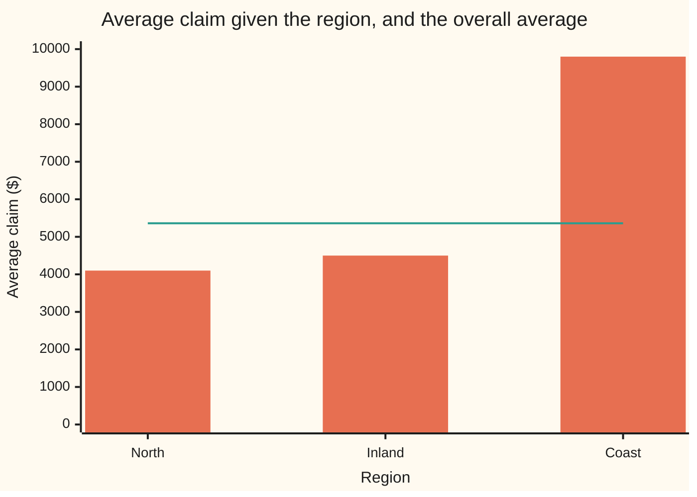

# Conditional expectation: the average given what you know, and the tower rule

[Syllabus](../../../SYLLABUS.md) → [Probability and statistics](../README.md) → [Random Variables](../README.md#s02) → Conditional expectation

---

## General Overview

An insurer pays home claims in three regions: North, Inland and Coast. Every claim is one of three sizes: $1,000 for a burst pipe, $5,000 for a damaged roof, $20,000 for a flooded ground floor. Out of every 100 claims, 50 come from North, 30 from Inland and 20 from Coast. Coast claims run large.

Across all claims, the average is $5,360. A handler who knows a claim came from the Coast should expect more, $9,800; a North claim, less, $4,100. Each is an ordinary average, taken only over the claims that match what is known.

That is a **conditional expectation**: the average of an uncertain amount, given a piece of information. Before the region is known, the region's average is itself uncertain. It will be $4,100 half the time, $4,500 three times in ten, and $9,800 one time in five. Average those three numbers with those weights and the overall $5,360 comes back exactly. That fact is the **tower rule**, and it is the reason conditional expectation is useful: a hard average can be split into easy ones, group by group, then put back together.

**Average within each group of what is known, then average those group averages by how often each group occurs: the result is the plain average.**

**What kind of fact this is:** the conditional expectation is a definition; the tower rule is a theorem, proved on this card in Why it works.

### The picture: three regional averages against the overall one



Bars: the average claim within each region, $4,100, $4,500 and $9,800. Flat line: the overall average, $5,360. The line sits nearer the short bars because North and Inland supply most of the claims.

---

## The formula

Notation first, in words. As on [Expectation](02-expectation.md), $E[X]$ is the long-run average value of $X$. A vertical bar inside the brackets means "given", as in $P(A \mid B)$: $E[X \mid Y = y]$ is read "the average of X given that Y equals y". A capital sigma, Σ, with x beneath it means: add one term for every value x that X can take.

Let $X$ be the size of one claim and $Y$ its region. The joint table ([Two variables at once](04-joint-distributions-and-covariance.md)) gives $P(X = x, Y = y)$, the chance that a claim has size $x$ and region $y$.

$$E[X \mid Y = y] \;=\; \sum_x x\,P(X = x \mid Y = y) \;=\; \frac{\sum_x x\,P(X = x,\ Y = y)}{P(Y = y)}$$

**Read it aloud:** keep only the row of the table for region y, rescale its chances so they add to one, and take the ordinary average.

Doing this for every region gives a rule $g$ that turns a region into a number: $g(y) = E[X \mid Y = y]$. Feeding in the region that actually occurs gives a new random amount:

$$E[X \mid Y] \;=\; g(Y)$$

**Read it aloud:** the average of X given Y is the regional average of whichever region turns up.

The tower rule says that averaging this random amount returns the plain average:

$$E\big[\,E[X \mid Y]\,\big] \;=\; \sum_y P(Y = y)\,E[X \mid Y = y] \;=\; E[X]$$

**Read it aloud:** the average of the group averages, each weighted by its group's chance, is the overall average.

| Symbol | Plain meaning | In our example | Push it up and the answer… |
| --- | --- | --- | --- |
| $X$ | the uncertain amount being averaged | one claim's size, $1,000, $5,000 or $20,000 | a bigger claim raises every average it enters |
| $Y$ | the information: which group the outcome falls in | the claim's region | — |
| $x$, $y$ | one value of $X$, of $Y$ | $20,000; Coast | — |
| $P(X = x, Y = y)$ | a cell of the joint table: chance of size x and region y | Coast and $20,000: 0.08 | more weight on that cell pulls its region's average toward x |
| $P(Y = y)$ | a row total: chance of region y | Coast: 0.20 | a region's average moves the overall average more |
| $E[X]$ | the plain average of X | $5,360 | — |
| $E[X \mid Y = y]$ | the average of X among outcomes with Y = y: one number | Coast: $9,800 | — |
| $g$ | the rule that sends each region to its average | North to $4,100, Inland to $4,500, Coast to $9,800 | — |
| $E[X \mid Y]$ | $g(Y)$: a random amount, fixed once Y is known | $4,100, $4,500 or $9,800 | — |
| $h$, $c$ | a rival guess: a rule by region, or one number | $5,360 for every claim | its squared error rises above the regional averages' |
| $N$, $n$ | number of claims in a month, and one value of it | 0, 1, 2 or 3; average 1.70 | the month's total rises in step |
| $S$, $X_1$, $X_2$, $X_3$ | the month's total, $X_1 + \dots + X_N$, and its claims' sizes | average total $9,112; each claim $5,360 | — |

### When it holds

- **Every region has a positive chance.** The formula divides by $P(Y = y)$. A region with chance zero has no average from the table; information of that kind needs the measure-based construction of wing 10.
- **The average of X exists.** On a finite table it always does. If a claim law's average is infinite, the tower says nothing useful.
- **The weights are the real chances of each region.** The tower weights each regional average by $P(Y = y)$. Weighting the three averages equally gives $6,133.33 instead of $5,360.
- **For the random-sum shortcut of Step 4 only: claim sizes do not depend on how many claims arrive.** If busy months are storm months with coastal claims, $E[N] \times E[X]$ gives $9,112 while the true average is $11,776. The tower itself still holds and finds the right answer.

---

## Why it works

### Step 0: grouping the terms of a sum does not change the sum

The plain average $E[X]$ is a sum over every cell of the table: size times chance. Sorting those cells by region before adding them cannot change the total. Everything below is that sentence, done carefully.

### Step 1: a conditional average is a plain average with rescaled chances

The Coast row of the table holds the chances 0.06, 0.06 and 0.08 for $1,000, $5,000 and $20,000. They add to 0.20, not 1: they are chances out of all claims. Given that a claim is from the Coast, the chances out of Coast claims are each divided by 0.20: 0.30, 0.30, 0.40. That division is conditional probability, $P(X = x \mid Y = y) = P(X = x, Y = y) / P(Y = y)$ ([Conditional probability](../01-Chance%20and%20Events/05-conditional-probability.md)).

With rescaled chances, the average is the ordinary one: 0.30 × 1,000 + 0.30 × 5,000 + 0.40 × 20,000 = 9,800 dollars.

### Step 2: before the region is known, the regional average is random

Once $Y$ is revealed, $E[X \mid Y]$ is one number. Before, it is a random variable ([Random variables](01-random-variables-and-distributions.md)) whose law is read off the row totals: $4,100 with chance 0.50, $4,500 with chance 0.30, $9,800 with chance 0.20.

### Step 3: the tower rule

Average $E[X \mid Y]$ with those weights:

$$\sum_y P(Y = y) \cdot \frac{\sum_x x\,P(X = x, Y = y)}{P(Y = y)} \;=\; \sum_y \sum_x x\,P(X = x, Y = y) \;=\; \sum_x x\,P(X = x) \;=\; E[X].$$

The region's chance multiplies and divides, so it cancels. What remains is every cell, size times chance, added region by region; adding down the columns instead gives the size law $P(X = x)$: 0.51, 0.33, 0.16. That is Step 0. For the claims, 0.50 × 4,100 + 0.30 × 4,500 + 0.20 × 9,800 = 2,050 + 1,350 + 1,960 = 5,360 dollars.

### Step 4: split a hard average into easy ones

The insurer wants the average total paid in a month, $S$. The number of claims $N$ is random: none with chance 0.10, one with 0.30, two with 0.40, three with 0.20. Each claim's size follows the table. Averaging $S$ directly means listing every possible month.

Condition on $N$ instead. Given $N = n$, the month is $n$ claims, each still following the table because size does not depend on the count, and an average of a sum is the sum of the averages, so $E[S \mid N = n] = n \times 5{,}360$: $0, $5,360, $10,720 or $16,080. As a random amount, $E[S \mid N] = N \times E[X]$. The tower rule then averages over $N$:

$$E[S] \;=\; E\big[\,E[S \mid N]\,\big] \;=\; E[N]\,E[X] \;=\; 1.70 \times 5{,}360 \;=\; 9{,}112.$$

One hard average became two easy ones. The identity is Wald's; actuaries call it frequency times severity.

### Step 5: the conditional average is the best guess from the information

Why this particular number? Among all guesses that may use the region and nothing else, $E[X \mid Y]$ has the smallest average squared error. Guessing $4,100, $4,500 or $9,800 by region leaves an average squared error of 39,072,000 dollars squared. Guessing $5,360 for every claim leaves 44,030,400, which is the variance of $X$ ([Variance](03-variance-and-standard-deviation.md)). Shifting every regional guess up or down by $500 leaves 39,322,000: worse by exactly 500 × 500.

The difference, 4,958,400, is the variance of the regional averages: the variance splits into spread within regions plus spread between them. Region removes 11% of the squared error. Most of what makes a claim large is not its region.

<details>
<summary>Detailed proof: the best guess, and the variance split</summary>

Fix a region $y$ and write $g = g(y)$. For any number $c$, expand $(x - c)^2 = (x - g)^2 + 2(x - g)(g - c) + (g - c)^2$ and average with the chances $P(X = x \mid Y = y)$. The middle term averages to $2(g - c)$ times $\sum_x (x - g)\,P(X = x \mid Y = y) = g - g = 0$. So within the region, the average squared error of guess $c$ is the within-region spread plus $(g - c)^2$.

Now let the guess $h(y)$ depend on the region, weight each region by $P(Y = y)$ and add. The average squared error of $h$ is the average within-region spread, 39,072,000 here, plus $\sum_y P(Y = y)\,(g(y) - h(y))^2$. The second part is never negative and is zero only when $h = g$. So $g$ is the best guess. Shifting every guess by 500 adds 500 × 500 = 250,000.

Take $h$ to be the constant $E[X]$. The error on the left is then the variance of $X$, and the second part is $\sum_y P(Y = y)\,(g(y) - E[X])^2$, the variance of the regional averages, by Step 3. That is the variance split: 44,030,400 = 39,072,000 + 4,958,400.

</details>

For information with infinitely many values, such as an exact temperature, no single value has positive chance and the division in Step 1 fails; wing 10 rebuilds the definition with measure, and the tower rule survives unchanged.

---

## Worked numbers, by hand

The table, as chances out of all claims:

| Region | $1,000 | $5,000 | $20,000 | Row total |
| --- | --- | --- | --- | --- |
| North | 0.30 | 0.15 | 0.05 | 0.50 |
| Inland | 0.15 | 0.12 | 0.03 | 0.30 |
| Coast | 0.06 | 0.06 | 0.08 | 0.20 |
| Column total | 0.51 | 0.33 | 0.16 | 1 |

| Step | Arithmetic | Value |
| --- | --- | --- |
| Coast row, size times chance | 1,000 × 0.06 + 5,000 × 0.06 + 20,000 × 0.08 | 1,960 |
| divide by P(Coast) | 1,960 / 0.20 | $9,800 |
| North, the same way | 2,050 / 0.50 | $4,100 |
| Inland, the same way | 1,350 / 0.30 | $4,500 |
| tower terms | 0.50 × 4,100; 0.30 × 4,500; 0.20 × 9,800: the row sums again | 2,050; 1,350; 1,960 |
| tower rule | 2,050 + 1,350 + 1,960 | **$5,360** |
| check by columns | 1,000 × 0.51 + 5,000 × 0.33 + 20,000 × 0.16 | **$5,360** |
| month's average total | 1.70 × 5,360 | **$9,112** |

A claim of unknown region costs $5,360 on average, a Coast claim $9,800, a month's claims $9,112.

### What breaks if you drop a piece

| Mistake | Comes out at | What went wrong |
| --- | --- | --- |
| Average the three regional averages equally | $6,133.33 | Coast is one claim in five, not one in three: the tower weights by $P(Y = y)$ |
| Forget to divide the Coast row by 0.20 | $1,960 | Chances out of all claims, not out of Coast claims: the row does not add to one |
| Use $E[N] \times E[X]$ when three-claim months are storm months with Coast claims | $9,112 (right: $11,776) | Claim size now depends on $N$; conditioning on $N$ and using 9,800 on the three-claim branch gives the truth |

The code prints all three.

---

## Code, from first principles, and it actually runs

Nothing is imported. Each regional average is found by dividing a table row by its total, and again from a ledger of 100 claims that realises the table, in whole dollars. The plain average comes three ways: tower rule, column sums, ledger. The month's total comes from the shortcut and from walking every possible month. A simulation (SplitMix64, a small random number generator written out in both languages) draws 200,000 claims and 100,000 months; each estimate carries its standard error.

### Python

```python
# Conditional expectation on a claims table -- the check behind the card.
# Nothing is imported.  X is one claim's size in dollars, Y its region.  The
# table holds 100 claims' worth of counts, so each probability is a count / 100.
# Road 1 divides the table by P(region).  Road 2 walks a ledger of the 100
# claims with whole-number sums.  Road 3 draws claims with SplitMix64, seed 2026.
SIZES = [1000, 5000, 20000]
REGIONS = ["North", "Inland", "Coast"]
COUNTS = [[30, 15, 5], [15, 12, 3], [6, 6, 8]]      # rows: regions; columns: sizes
N_TENTHS = [1, 3, 4, 2]                             # P(N = 0) ... P(N = 3), in tenths
N_LAW = [c / 10 for c in N_TENTHS]                 # claims in a month
MASK = (1 << 64) - 1

def splitmix(state):
    state = (state + 0x9E3779B97F4A7C15) & MASK
    z = state
    z = ((z ^ (z >> 30)) * 0xBF58476D1CE4E5B9) & MASK
    z = ((z ^ (z >> 27)) * 0x94D049BB133111EB) & MASK
    return state, z ^ (z >> 31)

def below(state, n):                                # a whole number from 0 to n - 1
    state, z = splitmix(state)
    return state, ((z >> 11) * n) >> 53

def sqrt(v):                                        # Newton's method for a square root
    r = v if v > 1 else 1.0
    for _ in range(60):
        r = 0.5 * (r + v / r)
    return r

def mean_and_se(s, sq, n):                          # sample mean and its standard error
    var = (sq - s * s / n) / (n - 1)
    return s / n, sqrt(var / n)

joint = [[c / 100 for c in row] for row in COUNTS]  # P(X = x, Y = y)
p_y = [sum(row) for row in joint]                   # P(Y = y), row sums
g = [sum(x * p for x, p in zip(SIZES, row)) / py for row, py in zip(joint, p_y)]
col = [sum(joint[r][j] for r in range(3)) for j in range(3)]    # P(X = x), column sums
ledger = [(r, SIZES[j]) for r in range(3) for j in range(3) for _ in range(COUNTS[r][j])]

print("Conditional expectation on a claims table, dollars")
for r in range(3):
    print(f"joint, {REGIONS[r]}, " + ", ".join(f"{p:.2f}" for p in joint[r]))
print("P(X = x) for 1000, 5000, 20000, " + ", ".join(f"{p:.2f}" for p in col))
print("region, P(region), E[X | region] by division, by ledger")
for r in range(3):
    tot = sum(x for rr, x in ledger if rr == r)
    cnt = sum(1 for rr, x in ledger if rr == r)
    print(f"{REGIONS[r]}, {p_y[r]:.2f}, {g[r]:.2f}, {tot / cnt:.2f}")
    assert abs(tot / cnt - g[r]) < 1e-9, "table road and ledger road disagree"
coast_law = [p / p_y[2] for p in joint[2]]         # P(X = x | Coast)
print("Coast weights given Coast, " + ", ".join(f"{p:.2f}" for p in coast_law))
print("tower terms, " + ", ".join(f"{py * gy:.2f}" for py, gy in zip(p_y, g)))
e_tower = sum(py * gy for py, gy in zip(p_y, g))
e_col = sum(x * p for x, p in zip(SIZES, col))
e_ledger = sum(x for _, x in ledger) / len(ledger)
print(f"tower, sum of P(region) times E[X | region], {e_tower:.2f}")
print(f"column, sum of x times P(X = x), {e_col:.2f}")
print(f"ledger, grand average of 100 claims, {e_ledger:.2f}")
assert abs(e_tower - e_col) < 1e-9, "tower rule fails against the column road"
assert abs(e_tower - e_ledger) < 1e-9, "tower rule fails against the ledger road"

st, n, s, sq, cs, csq, cn = 2026, 200000, 0, 0, 0, 0, 0
for _ in range(n):
    st, k = below(st, 100)
    r, x = ledger[k]
    s, sq = s + x, sq + x * x
    if r == 2:
        cs, csq, cn = cs + x, csq + x * x, cn + 1
m, se = mean_and_se(float(s), float(sq), n)
print(f"sim, {n} claims, E[X] {m:.2f}, se {se:.2f}")
cm, cse = mean_and_se(float(cs), float(csq), cn)
print(f"sim, {cn} Coast claims, E[X | Coast] {cm:.2f}, se {cse:.2f}")
assert abs(m - e_col) < 4 * se, "simulation misses E[X]"
assert abs(cm - g[2]) < 4 * cse, "simulation misses E[X | Coast]"

def mse(h):                                         # E[(X - h(Y))^2] for a guess h per region
    return sum((SIZES[j] - h[r]) ** 2 * joint[r][j] for r in range(3) for j in range(3))
total = sum(x * x * p for x, p in zip(SIZES, col)) - e_col ** 2
within = mse(g)
between = sum(py * (gy - e_col) ** 2 for py, gy in zip(p_y, g))
print(f"variance, total {total:.2f}, within {within:.2f}, between {between:.2f}")
print(f"best guess, squared error with region means {within:.2f}, with E[X] alone {mse([e_col] * 3):.2f}")
up, down = mse([gy + 500 for gy in g]), mse([gy - 500 for gy in g])
print(f"best guess, region means + 500 {up:.2f}, region means - 500 {down:.2f}")
print(f"best guess, extra error from a 500 shift {up - within:.2f}")
print(f"share of squared error removed by the region {between / total:.2f}")
assert abs(within + between - total) < 1e-3, "variance does not split"
assert within < min(up, down), "shifted region means beat the region means"
assert within <= mse([e_col] * 3) + 1e-6, "one flat guess beats the region means"

def enum_total(law_for):                            # E[S] by walking every month outcome
    out = 0.0
    for k, pn in enumerate(N_LAW):
        combos = [(1.0, 0)]
        for _ in range(k):
            combos = [(w * p, t + x) for w, t in combos for x, p in zip(SIZES, law_for(k))]
        out += pn * sum(w * t for w, t in combos)
    return out
e_n = sum(k * p for k, p in enumerate(N_LAW))
plain = enum_total(lambda k: col)
print("P(N = n) for n = 0 to 3, " + ", ".join(f"{p:.2f}" for p in N_LAW))
print(f"random sum, E[N] {e_n:.2f}, E[N] x E[X] {e_n * e_col:.2f}, enumeration {plain:.2f}")
print("E[S | N = n] for n = 0 to 3, " + ", ".join(f"{k * e_col:.2f}" for k in range(4)))
assert abs(plain - e_n * e_col) < 1e-6, "random-sum shortcut fails"
st, months, s, sq = 7, 100000, 0, 0
for _ in range(months):
    st, u = below(st, 10)
    k = 0
    while u >= sum(N_TENTHS[:k + 1]):
        k += 1
    t = 0
    for _ in range(k):
        st, j = below(st, 100)
        t += ledger[j][1]
    s, sq = s + t, sq + t * t
m, se = mean_and_se(float(s), float(sq), months)
print(f"random sum sim, {months} months, E[S] {m:.2f}, se {se:.2f}")
assert abs(m - e_n * e_col) < 4 * se, "random-sum simulation misses"

storm = enum_total(lambda k: coast_law if k == 3 else col)
storm_tower = sum(p * k * (g[2] if k == 3 else e_col) for k, p in enumerate(N_LAW))
print(f"breaks, equal weights on the region means {sum(g) / 3:.2f}")
print(f"breaks, Coast row not divided by P(Coast) {sum(x * p for x, p in zip(SIZES, joint[2])):.2f}")
print(f"breaks, storm months: enumeration {storm:.2f}, tower {storm_tower:.2f}, E[N] x E[X] {e_n * e_col:.2f}")
assert abs(storm - storm_tower) < 1e-6, "tower misses the storm enumeration"
assert abs(storm - e_n * e_col) > 1, "storm case should break the shortcut"
print(f"figure, bars North {g[0]:.2f}, Inland {g[1]:.2f}, Coast {g[2]:.2f}, line {e_col:.2f}")
print("All checks passed.")
```

**Ran 2026-09-28 on macOS, Python 3.14.6, standard library only. All checks passed. Output, pasted from the run:**

```
Conditional expectation on a claims table, dollars
joint, North, 0.30, 0.15, 0.05
joint, Inland, 0.15, 0.12, 0.03
joint, Coast, 0.06, 0.06, 0.08
P(X = x) for 1000, 5000, 20000, 0.51, 0.33, 0.16
region, P(region), E[X | region] by division, by ledger
North, 0.50, 4100.00, 4100.00
Inland, 0.30, 4500.00, 4500.00
Coast, 0.20, 9800.00, 9800.00
Coast weights given Coast, 0.30, 0.30, 0.40
tower terms, 2050.00, 1350.00, 1960.00
tower, sum of P(region) times E[X | region], 5360.00
column, sum of x times P(X = x), 5360.00
ledger, grand average of 100 claims, 5360.00
sim, 200000 claims, E[X] 5353.48, se 14.81
sim, 39581 Coast claims, E[X | Coast] 9845.30, se 42.60
variance, total 44030400.00, within 39072000.00, between 4958400.00
best guess, squared error with region means 39072000.00, with E[X] alone 44030400.00
best guess, region means + 500 39322000.00, region means - 500 39322000.00
best guess, extra error from a 500 shift 250000.00
share of squared error removed by the region 0.11
P(N = n) for n = 0 to 3, 0.10, 0.30, 0.40, 0.20
random sum, E[N] 1.70, E[N] x E[X] 9112.00, enumeration 9112.00
E[S | N = n] for n = 0 to 3, 0.00, 5360.00, 10720.00, 16080.00
random sum sim, 100000 months, E[S] 9133.47, se 31.41
breaks, equal weights on the region means 6133.33
breaks, Coast row not divided by P(Coast) 1960.00
breaks, storm months: enumeration 11776.00, tower 11776.00, E[N] x E[X] 9112.00
figure, bars North 4100.00, Inland 4500.00, Coast 9800.00, line 5360.00
All checks passed.
```

### Rust

```rust
// Conditional expectation on a claims table -- the check behind the card.
// Standard library only.  X is one claim's size in dollars, Y its region.  The
// table holds 100 claims' worth of counts, so each probability is a count / 100.
// Road 1 divides the table by P(region).  Road 2 walks a ledger of the 100
// claims with whole-number sums.  Road 3 draws claims with SplitMix64, seed 2026.
const SIZES: [f64; 3] = [1000.0, 5000.0, 20000.0];
const REGIONS: [&str; 3] = ["North", "Inland", "Coast"];
const COUNTS: [[u64; 3]; 3] = [[30, 15, 5], [15, 12, 3], [6, 6, 8]]; // rows: regions; columns: sizes
const N_TENTHS: [usize; 4] = [1, 3, 4, 2]; // P(N = 0) ... P(N = 3), in tenths
const N_LAW: [f64; 4] = [N_TENTHS[0] as f64 / 10.0, N_TENTHS[1] as f64 / 10.0, N_TENTHS[2] as f64 / 10.0, N_TENTHS[3] as f64 / 10.0];

fn splitmix(state: &mut u64) -> u64 {
    *state = state.wrapping_add(0x9E3779B97F4A7C15);
    let mut z = *state;
    z = (z ^ (z >> 30)).wrapping_mul(0xBF58476D1CE4E5B9);
    z = (z ^ (z >> 27)).wrapping_mul(0x94D049BB133111EB);
    z ^ (z >> 31)
}

fn below(state: &mut u64, n: u64) -> usize {
    // a whole number from 0 to n - 1
    let z = splitmix(state);
    (((z >> 11) as u128 * n as u128) >> 53) as usize
}

fn sqrt(v: f64) -> f64 {
    // Newton's method for a square root
    let mut r = if v > 1.0 { v } else { 1.0 };
    for _ in 0..60 {
        r = 0.5 * (r + v / r);
    }
    r
}

fn mean_and_se(s: f64, sq: f64, n: f64) -> (f64, f64) {
    // sample mean and its standard error
    let var = (sq - s * s / n) / (n - 1.0);
    (s / n, sqrt(var / n))
}

fn enum_total(law_for: &dyn Fn(usize) -> [f64; 3]) -> f64 {
    // E[S] by walking every month outcome
    let mut out = 0.0;
    for (k, pn) in N_LAW.iter().enumerate() {
        let mut combos: Vec<(f64, f64)> = vec![(1.0, 0.0)];
        let law = law_for(k);
        for _ in 0..k {
            combos = combos.iter().flat_map(|&(w, t)| (0..3).map(move |j| (w * law[j], t + SIZES[j]))).collect();
        }
        out += pn * combos.iter().map(|&(w, t)| w * t).sum::<f64>();
    }
    out
}

fn main() {
    let joint: [[f64; 3]; 3] = COUNTS.map(|row| row.map(|c| c as f64 / 100.0)); // P(X = x, Y = y)
    let p_y: Vec<f64> = joint.iter().map(|row| row.iter().sum()).collect(); // row sums
    let g: Vec<f64> = (0..3).map(|r| (0..3).map(|j| SIZES[j] * joint[r][j]).sum::<f64>() / p_y[r]).collect();
    let col: [f64; 3] = [0, 1, 2].map(|j| (0..3).map(|r| joint[r][j]).sum::<f64>()); // column sums
    let mut ledger: Vec<(usize, u64)> = Vec::new();
    for r in 0..3 {
        for j in 0..3 {
            for _ in 0..COUNTS[r][j] {
                ledger.push((r, SIZES[j] as u64));
            }
        }
    }

    println!("Conditional expectation on a claims table, dollars");
    let fmt = |v: &[f64]| v.iter().map(|x| format!("{:.2}", x)).collect::<Vec<_>>().join(", ");
    for r in 0..3 {
        println!("joint, {}, {}", REGIONS[r], fmt(&joint[r]));
    }
    println!("P(X = x) for 1000, 5000, 20000, {}", fmt(&col));
    println!("region, P(region), E[X | region] by division, by ledger");
    for r in 0..3 {
        let tot: u64 = ledger.iter().filter(|e| e.0 == r).map(|e| e.1).sum();
        let cnt = ledger.iter().filter(|e| e.0 == r).count() as u64;
        println!("{}, {:.2}, {:.2}, {:.2}", REGIONS[r], p_y[r], g[r], tot as f64 / cnt as f64);
        assert!((tot as f64 / cnt as f64 - g[r]).abs() < 1e-9, "table road and ledger road disagree");
    }
    let coast_law = [0, 1, 2].map(|j| joint[2][j] / p_y[2]); // P(X = x | Coast)
    println!("Coast weights given Coast, {}", fmt(&coast_law));
    println!("tower terms, {}", fmt(&(0..3).map(|r| p_y[r] * g[r]).collect::<Vec<f64>>()));
    let e_tower: f64 = (0..3).map(|r| p_y[r] * g[r]).sum();
    let e_col: f64 = (0..3).map(|j| SIZES[j] * col[j]).sum();
    let e_ledger = ledger.iter().map(|e| e.1).sum::<u64>() as f64 / ledger.len() as f64;
    println!("tower, sum of P(region) times E[X | region], {:.2}", e_tower);
    println!("column, sum of x times P(X = x), {:.2}", e_col);
    println!("ledger, grand average of 100 claims, {:.2}", e_ledger);
    assert!((e_tower - e_col).abs() < 1e-9, "tower rule fails against the column road");
    assert!((e_tower - e_ledger).abs() < 1e-9, "tower rule fails against the ledger road");

    let (mut st, n) = (2026u64, 200000u64);
    let (mut s, mut sq, mut cs, mut csq, mut cn) = (0u64, 0u64, 0u64, 0u64, 0u64);
    for _ in 0..n {
        let (r, x) = ledger[below(&mut st, 100)];
        s += x;
        sq += x * x;
        if r == 2 {
            cs += x;
            csq += x * x;
            cn += 1;
        }
    }
    let (m, se) = mean_and_se(s as f64, sq as f64, n as f64);
    println!("sim, {} claims, E[X] {:.2}, se {:.2}", n, m, se);
    let (cm, cse) = mean_and_se(cs as f64, csq as f64, cn as f64);
    println!("sim, {} Coast claims, E[X | Coast] {:.2}, se {:.2}", cn, cm, cse);
    assert!((m - e_col).abs() < 4.0 * se, "simulation misses E[X]");
    assert!((cm - g[2]).abs() < 4.0 * cse, "simulation misses E[X | Coast]");

    // E[(X - h(Y))^2] for a guess h per region
    let mse = |h: &[f64]| -> f64 { (0..9).map(|i| (SIZES[i % 3] - h[i / 3]).powi(2) * joint[i / 3][i % 3]).sum() };
    let total = (0..3).map(|j| SIZES[j] * SIZES[j] * col[j]).sum::<f64>() - e_col.powi(2);
    let within = mse(&g);
    let between: f64 = (0..3).map(|r| p_y[r] * (g[r] - e_col).powi(2)).sum();
    let flat = mse(&[e_col; 3]);
    println!("variance, total {:.2}, within {:.2}, between {:.2}", total, within, between);
    println!("best guess, squared error with region means {:.2}, with E[X] alone {:.2}", within, flat);
    let up = mse(&g.iter().map(|v| v + 500.0).collect::<Vec<f64>>());
    let down = mse(&g.iter().map(|v| v - 500.0).collect::<Vec<f64>>());
    println!("best guess, region means + 500 {:.2}, region means - 500 {:.2}", up, down);
    println!("best guess, extra error from a 500 shift {:.2}", up - within);
    println!("share of squared error removed by the region {:.2}", between / total);
    assert!((within + between - total).abs() < 1e-3, "variance does not split");
    assert!(within < up.min(down), "shifted region means beat the region means");
    assert!(within <= flat + 1e-6, "one flat guess beats the region means");

    let e_n: f64 = N_LAW.iter().enumerate().map(|(k, p)| k as f64 * p).sum();
    let plain = enum_total(&|_k| col);
    println!("P(N = n) for n = 0 to 3, {}", fmt(&N_LAW));
    println!("random sum, E[N] {:.2}, E[N] x E[X] {:.2}, enumeration {:.2}", e_n, e_n * e_col, plain);
    println!("E[S | N = n] for n = 0 to 3, {}", fmt(&[0.0, 1.0, 2.0, 3.0].map(|k| k * e_col)));
    assert!((plain - e_n * e_col).abs() < 1e-6, "random-sum shortcut fails");
    let (months, mut s, mut sq) = (100000u64, 0u64, 0u64);
    st = 7;
    for _ in 0..months {
        let u = below(&mut st, 10);
        let mut k = 0;
        while u >= N_TENTHS[..k + 1].iter().sum::<usize>() {
            k += 1;
        }
        let mut t = 0u64;
        for _ in 0..k {
            t += ledger[below(&mut st, 100)].1;
        }
        s += t;
        sq += t * t;
    }
    let (m, se) = mean_and_se(s as f64, sq as f64, months as f64);
    println!("random sum sim, {} months, E[S] {:.2}, se {:.2}", months, m, se);
    assert!((m - e_n * e_col).abs() < 4.0 * se, "random-sum simulation misses");

    let storm = enum_total(&|k| if k == 3 { coast_law } else { col });
    let storm_tower: f64 = N_LAW.iter().enumerate().map(|(k, p)| p * k as f64 * if k == 3 { g[2] } else { e_col }).sum();
    println!("breaks, equal weights on the region means {:.2}", g.iter().sum::<f64>() / 3.0);
    let unscaled: f64 = (0..3).map(|j| SIZES[j] * joint[2][j]).sum();
    println!("breaks, Coast row not divided by P(Coast) {:.2}", unscaled);
    println!("breaks, storm months: enumeration {:.2}, tower {:.2}, E[N] x E[X] {:.2}", storm, storm_tower, e_n * e_col);
    assert!((storm - storm_tower).abs() < 1e-6, "tower misses the storm enumeration");
    assert!((storm - e_n * e_col).abs() > 1.0, "storm case should break the shortcut");
    println!("figure, bars North {:.2}, Inland {:.2}, Coast {:.2}, line {:.2}", g[0], g[1], g[2], e_col);
    println!("All checks passed.");
}
```

**Ran 2026-09-28 on macOS, rustc 1.98.1, no crates. All checks passed. Output, pasted from the run:**

```
Conditional expectation on a claims table, dollars
joint, North, 0.30, 0.15, 0.05
joint, Inland, 0.15, 0.12, 0.03
joint, Coast, 0.06, 0.06, 0.08
P(X = x) for 1000, 5000, 20000, 0.51, 0.33, 0.16
region, P(region), E[X | region] by division, by ledger
North, 0.50, 4100.00, 4100.00
Inland, 0.30, 4500.00, 4500.00
Coast, 0.20, 9800.00, 9800.00
Coast weights given Coast, 0.30, 0.30, 0.40
tower terms, 2050.00, 1350.00, 1960.00
tower, sum of P(region) times E[X | region], 5360.00
column, sum of x times P(X = x), 5360.00
ledger, grand average of 100 claims, 5360.00
sim, 200000 claims, E[X] 5353.48, se 14.81
sim, 39581 Coast claims, E[X | Coast] 9845.30, se 42.60
variance, total 44030400.00, within 39072000.00, between 4958400.00
best guess, squared error with region means 39072000.00, with E[X] alone 44030400.00
best guess, region means + 500 39322000.00, region means - 500 39322000.00
best guess, extra error from a 500 shift 250000.00
share of squared error removed by the region 0.11
P(N = n) for n = 0 to 3, 0.10, 0.30, 0.40, 0.20
random sum, E[N] 1.70, E[N] x E[X] 9112.00, enumeration 9112.00
E[S | N = n] for n = 0 to 3, 0.00, 5360.00, 10720.00, 16080.00
random sum sim, 100000 months, E[S] 9133.47, se 31.41
breaks, equal weights on the region means 6133.33
breaks, Coast row not divided by P(Coast) 1960.00
breaks, storm months: enumeration 11776.00, tower 11776.00, E[N] x E[X] 9112.00
figure, bars North 4100.00, Inland 4500.00, Coast 9800.00, line 5360.00
All checks passed.
```

The outputs agree line for line. Each simulated average sits within about one standard error of its exact value: $5,353.48 (standard error $14.81) against $5,360, $9,845.30 ($42.60) against $9,800, $9,133.47 ($31.41) against $9,112.

> [!TIP]
> **Try changing**
> - **Make the coast calmer.** Guess first: set Coast's row in `COUNTS` to `[10, 6, 4]`. Coast's average falls to $6,000 and the overall average to $4,600; the storm months give $8,660 against the shortcut's $7,820.
> - **Quieter months.** Guess first: set `N_TENTHS` to `[4, 3, 2, 1]`. The average number of claims falls to 1.00, so the month's average total is one claim's average, $5,360; the simulation lands at $5,373.56, standard error $27.04.
> - **Regions that differ only in size.** Guess first: make every row proportional, `[30, 15, 5]`, `[18, 9, 3]`, `[12, 6, 2]`. Every regional average is $4,100, the between-region spread is 0.00, and knowing the region removes none of the squared error. The run then stops at the storm assert: storm months now bring ordinary claims, so the shortcut is right and there is nothing left to break.
> - **Another seed.** Change 2026. The simulated averages move but stay within four standard errors of the exact values; an assert checks it.

---

## The usual mistake

> [!warning]
> **Treating $E[X \mid Y]$ as one number.** $E[X]$ is a number. $E[X \mid Y = \text{Coast}]$ is a number. $E[X \mid Y]$ is not: it is a random amount that becomes $4,100, $4,500 or $9,800 once the region is known. The tower rule averages that random amount; a single number has nothing to average.
>
> - **Equal weights on the groups.** Averaging $4,100, $4,500 and $9,800 as if each region were equally common gives $6,133.33, too high. The weights are the regions' chances.
> - **Forgetting to rescale.** Summing size times chance along the Coast row gives $1,960, a number far below every claim size. The row's chances add to 0.20; divide by it.
> - **Reading a group average as a cause.** Coast claims average $9,800, but moving a house inland does not make its claims smaller. The table says which claims occur together, not what produces them.
> - **Multiplying averages across dependence.** $E[N] \times E[X]$ needs claim size independent of the count. In the storm case it gives $9,112 against a true $11,776; the tower, used branch by branch, still gets it right.

---

## Where you meet it in real life

- **Insurance pricing.** A regional premium is the region's average claim times its expected claim count; by the tower rule, the regional premiums average back to the book's. Step 4 is the actuary's frequency times severity.
- **Polls by region.** A poll that averages each region's answers and weights them by population share is using the tower rule; weighting regions equally is the $6,133.33 mistake.
- **Regression.** $E[X \mid Y = y]$ plotted against $y$ is the regression curve; Step 5 is why least squares aims at it, and a straight regression line is the best straight-line fit to it.
- **Analysis of variance.** Splitting spread into within-group and between-group parts, as in Step 5, is the core of that statistical method.

> **Say it back**
> The conditional average of X given Y is the plain average taken over the outcomes that match Y, with chances rescaled to add to one. Before Y is known it is itself random. Averaging it by the chance of each group returns the plain average: that is the tower rule, and it holds because grouping the terms of a sum does not change the sum. It turns a hard average into easy ones, such as a month's claims into claim count times claim size. Among guesses that use only Y, it has the smallest average squared error.

---

## What this builds on

- [Two variables at once](04-joint-distributions-and-covariance.md): the joint table of two random variables, its row and column totals.
- [Conditional probability](../01-Chance%20and%20Events/05-conditional-probability.md): $P(A \mid B)$, the rescaling that turns a row of the table into a law of its own.

## Where this goes next

- [Martingales](../../11-Stochastic%20processes%20and%20calculus/02-Martingales/01-martingales.md): a fair game, where the conditional average of tomorrow's value given today's history is today's value.
- [Stochastic-local volatility](../../12-Financial%20mathematics/14-Stochastic%20volatility%20-%20Heston%2C%20SABR%20and%20their%20mix/06-stochastic-local-volatility.md): a volatility calibrated as the conditional average of variance given the price.
- [Forward-start options](../../12-Financial%20mathematics/17-Averages%2C%20choosers%2C%20compounds%20and%20forward-starts/06-forward-start-options-and-forward-volatility.md): an option priced by conditioning on the price at its start date, then averaging with the tower rule.
- Conditional entropy and mutual information: the same average-within-each-group step, applied to uncertainty instead of size.

On this shelf, [Jensen's inequality](06-jensens-inequality.md) compares the average of a curved function with the function of the average.

This card conditions on information fixed once and for all; what happens when the information grows step by step, a little more history each day, is the question [Martingales](../../11-Stochastic%20processes%20and%20calculus/02-Martingales/01-martingales.md) answers.

---

## Sources

Verified 2026-09-28: every link below resolves to the publisher's page.

- Blitzstein, Joseph K., and Jessica Hwang. *Introduction to Probability*, 2nd ed. CRC Press, 2019. [Publisher page](https://www.routledge.com/Introduction-to-Probability-Second-Edition/Blitzstein-Hwang/p/book/9781138369917). Conditional expectation on tables, the tower rule as "Adam's law" and the variance split as "Eve's law".
- Siegrist, Kyle. "Conditional Expected Value." *Random: Probability, Mathematical Statistics, Stochastic Processes*, University of Alabama in Huntsville. [Chapter page](https://www.randomservices.org/random/expect/Conditional.html). The discrete definition, the best-guess property and the random-sum identity, with proofs.
- Wald, Abraham. "On Cumulative Sums of Random Variables." *Annals of Mathematical Statistics* 15, no. 3 (1944): 283–296. [doi:10.1214/aoms/1177731235](https://doi.org/10.1214/aoms/1177731235). The average of a sum with a random number of terms.
- Klugman, Stuart A., Harry H. Panjer, and Gordon E. Willmot. *Loss Models: From Data to Decisions*, 5th ed. Wiley, 2019. [Publisher page](https://www.wiley.com/en-us/Loss+Models%3A+From+Data+to+Decisions%2C+5th+Edition-p-9781119523789). Aggregate claims as frequency times severity, the actuarial use of Step 4.
