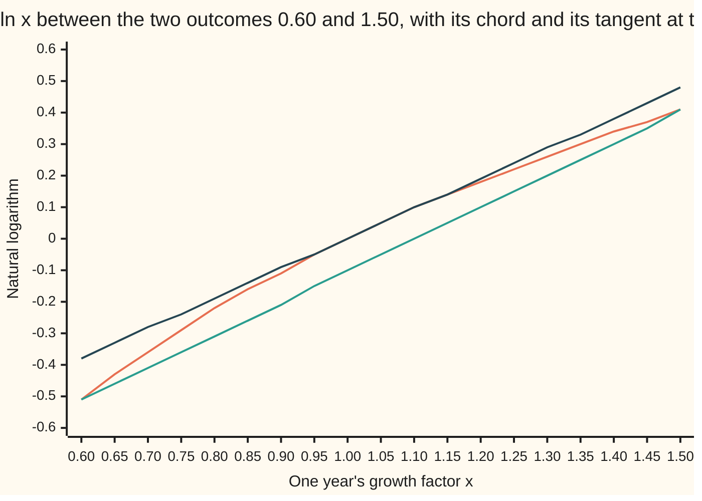
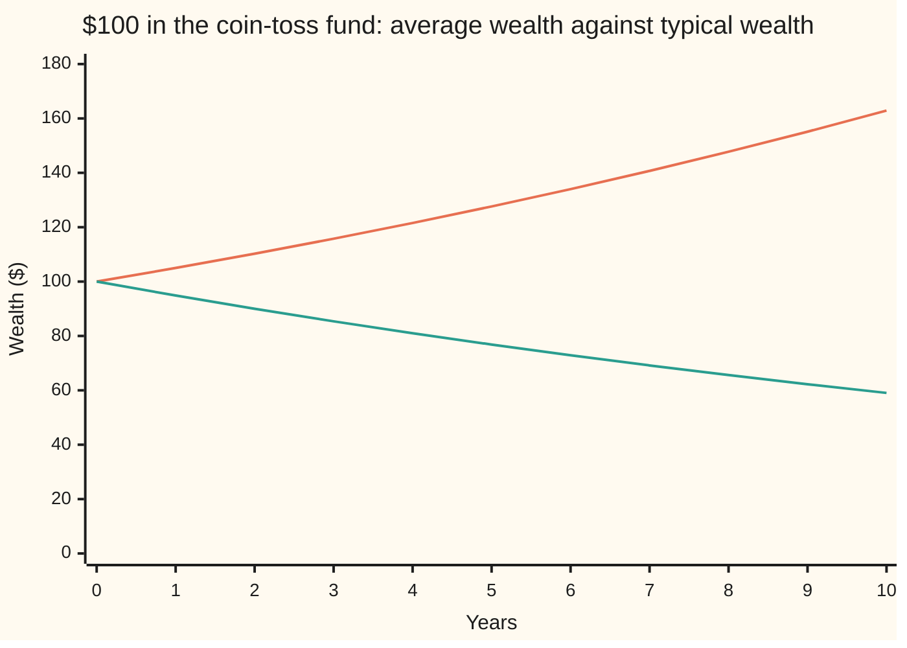

# Jensen's inequality: the average of a curve is not the curve of the average

[Syllabus](../../../SYLLABUS.md) → [Probability and statistics](../README.md) → [Random Variables](../README.md#s02) → Jensen's inequality

---

## General Overview

Put $100 into a fund that plays one coin toss a year. Heads, the fund gains 50%: every dollar becomes $1.50. Tails, it loses 40%: every dollar becomes $0.60. The coin is fair.

The average year is good. Half of $1.50 plus half of $0.60 is $1.05, so the fund is expected to return 5% a year. Across every possible ten-year run, the average ending balance is $162.89.

Now follow one investor. The most common count, five heads and five tails, ends at $59.05; that is also the median run. Of the 1,024 equally likely ten-year runs, 638 finish below the $100 start: 62.3% of them. The average balance climbs while most balances shrink.

Nothing is wrong with the arithmetic. Growth is multiplied, not added, and multiplying bends the picture. Take logarithms and the multiplying becomes adding; the logarithm's graph bends downward. The average of the logarithm of the yearly growth is −0.0527: shrinking. The logarithm of the average growth is +0.0488: growing. Squaring bends the other way: the average of the squared growth, 1.305, beats the square of the average growth, 1.1025. The difference, 0.2025, is exactly the variance of one year's growth.

Apply a bent function before averaging and you get a different number from applying it after. Which one is larger depends only on which way the curve bends.

**For a function whose graph bends upward, the average of the function's values is at least the function of the average value; for a graph that bends downward, like the logarithm, the inequality turns round.**

**What kind of fact this is:** a theorem, proved on this card in Why it works with one supporting line.

### The picture: the logarithm, a chord and a tangent



Orange is the logarithm itself. Green is the chord, the straight line joining the two outcomes: its height above 1.05 is the average of the two logarithms, −0.052680, shown as −0.05. Dark blue is the tangent at the mean 1.05: it touches the curve at 0.048790, the logarithm of the average, shown as 0.05, and stays above the curve everywhere else. The chord lies under the curve and the tangent over it, so the average of the logarithms sits below the logarithm of the average.

---

## The formula

Notation first, in words. $E[X]$ is the expectation of $X$, read "the average value of X in the long run" ([Expectation](02-expectation.md)). A Greek phi, $\varphi$, names a function. A function is **convex** when every chord between two points of its graph lies on or above the graph ([Convex functions](../../06-Calculus%20and%20analysis/07-Several%20Variables/09-convex-functions.md)); **concave** when every chord lies on or below.

$$\varphi\big(E[X]\big) \;\le\; E\big[\varphi(X)\big] \qquad \text{for convex } \varphi$$

**Read it aloud:** for a function that bends upward, the function of the average is at most the average of the function.

Two cases carry most of the uses.

$$\big(E[X]\big)^2 \;\le\; E[X^2], \qquad E[X^2] - \big(E[X]\big)^2 = \operatorname{Var}(X)$$

**Read it aloud:** the square of the average never beats the average of the square, and the gap is the variance.

$$E[\ln X] \;\le\; \ln E[X] \qquad \text{for } X > 0$$

**Read it aloud:** the logarithm bends downward, so the average of the logarithms is at most the logarithm of the average.

| Symbol | Plain meaning | In our example | Push it up and the answer… |
| --- | --- | --- | --- |
| $X$ | one year's growth factor, a random variable | 1.50 or 0.60, chance 0.5 each | — |
| $E[X]$, $m$ | the average of $X$; $m$ is its short name in the proofs | 1.05 | — |
| $\varphi$ | a function applied to $X$ | $x^2$, or $\ln x$ | a sharper bend, a bigger gap |
| $E[X^2]$ | the average of the squared growth | 1.305 | — |
| $\operatorname{Var}(X)$ | the variance: average squared distance from $m$ | 0.2025 | the square gap grows with it, one for one |
| $\ln$ | the natural logarithm; it turns multiplying into adding | $\ln 1.5 = 0.405465$ | — |
| $E[\ln X]$ | the average log return: the mean of $\ln X$ per year | −0.052680 | typical wealth grows faster |
| $\ell(x)$, $s$ | a supporting line through the curve at $m$, and its slope | $\ell(x) = \ln m + (x - m)/m$ for the logarithm | — |
| $x$, $y$ | input values along the curve's horizontal axis | 0.6 and 1.5 | — |
| $W_n$, $n$ | wealth per dollar invested after $n$ years | after 10 years: mean 1.628895 | mean and median drift apart |
| $k$ | the number of heads in a ten-year run | 5 on the median run | — |
| $R$ | a return: growth factor minus 1 | +0.50 or −0.40 | — |

For the logarithm, raising $\operatorname{Var}(X)$ with $m$ fixed lowers $E[\ln X]$: more spread, slower typical growth. A second-order Taylor expansion of $\ln$ around $m$ says by how much:

$$E[\ln X] \;\approx\; \ln m - \frac{\operatorname{Var}(X)}{2m^2}$$

In words: the log average falls short of the log of the average by about half the variance, measured in units of the mean squared. This is an approximation. For small returns, $\ln m \approx E[R]$ and $m \approx 1$, and it shrinks to the traders' drag rule: average log return ≈ average return minus half the variance.

### When it holds

- **The function bends one way over every value $X$ can take.** A cube bends down for negative inputs and up for positive ones. A fund returning −40% or +10% has returns whose average cube is −0.0315, below the cube of the average return, −0.003375: the inequality runs the wrong way.
- **Both averages exist.** $E[X]$ and $E[\varphi(X)]$ must be finite numbers. For a finite list of outcomes they always are; for unbounded laws this is a real condition, taken up in wing 10.
- **Direction follows the bend.** Convex gives ≤ as written; concave, like the logarithm, reverses it. Reading the logarithm as convex predicts that typical growth beats average growth: −0.0527 against 0.0488 says otherwise.
- **Equality needs no spread.** When the function is strictly convex (no straight pieces), the two sides are equal only when $X$ is one fixed value. Any spread opens a gap.
- **It bounds, it does not measure.** The inequality says which side is larger. The size of the gap needs more: the variance for the square, the Taylor term above for the logarithm.

---

## Why it works

### Step 0: straight lines pass through averages unchanged

For any straight line $\ell(x) = a + b\,x$, the average of $\ell(X)$ is $\ell$ of the average: $E[a + bX] = a + b\,E[X]$. That is linearity of expectation ([Expectation](02-expectation.md)). Only bending breaks the swap. So squeeze the curve against a line that touches it at the mean, and let the line do the averaging.

### Step 1: a convex curve has a line beneath it touching at the mean

Take $m = E[X]$. A **supporting line** at $m$ is a straight line that meets the graph at $m$ and lies on or below it everywhere else. For a curve with a slope at $m$, the tangent line does it:

$$\varphi(x) \;\ge\; \varphi(m) + \varphi'(m)\,(x - m) \quad \text{for every } x$$

Here $\varphi'(m)$ is the slope of the curve at $m$. The inequality holds because a convex curve's slope never decreases as $x$ grows ([Convex functions](../../06-Calculus%20and%20analysis/07-Several%20Variables/09-convex-functions.md)): to the right of $m$ the curve climbs at least as fast as the tangent, to the left it falls at least as fast.

For the square at $m = 1.05$, the tangent is $\ell(x) = m^2 + 2m\,(x - m)$. The curve minus the line is $x^2 - m^2 - 2m(x - m) = (x - m)^2$, never negative. At both outcomes, 1.5 and 0.6, the gap is $0.45^2 = 0.2025$.

A curve with a corner, like a call option's payoff at its strike, has no single tangent there, but a supporting line still exists: any slope between the left slope and the right slope works.

<details>
<summary>Detailed proof: a supporting line exists at any interior point, corner or not</summary>

Let $\varphi$ be convex on an interval and $m$ a point inside it, not an endpoint. For $x < m < y$ in the interval, write $m$ as a weighted average of $x$ and $y$: $m = (1-t)x + ty$ with $t = (m - x)/(y - x)$, which lies strictly between 0 and 1. The chord inequality gives $\varphi(m) \le (1-t)\varphi(x) + t\varphi(y)$. Rearranged, this says the slope from $x$ to $m$ is at most the slope from $m$ to $y$:

$$\frac{\varphi(m) - \varphi(x)}{m - x} \;\le\; \frac{\varphi(y) - \varphi(m)}{y - m}.$$

So every left slope is at most every right slope. Fix one right slope: it caps all the left slopes, so they have a least upper bound $s$, and $s$ is still at most every right slope. For any $x < m$, the left slope is at most $s$, so $\varphi(x) \ge \varphi(m) + s(x - m)$ (multiplying by the negative $x - m$ flips the inequality). For any $y > m$, the right slope is at least $s$, so $\varphi(y) \ge \varphi(m) + s(y - m)$. At $x = m$ both sides agree. The line $\ell(x) = \varphi(m) + s(x - m)$ supports the curve at $m$.

If $m$ is an endpoint of the interval, every value of $X$ is on one side of it and its average is on the boundary; that forces $X$ to equal $m$ with chance 1, and both sides of Jensen are $\varphi(m)$.

</details>

### Step 2: average the line

The curve lies above the line at every outcome, so its average lies above the line's average. By Step 0 the line's average is the line at the mean, which is the curve at the mean:

$$E[\varphi(X)] \;\ge\; E[\ell(X)] \;=\; \varphi(m) + s\,(E[X] - m) \;=\; \varphi(m).$$

The slope term vanishes because $E[X] - m = 0$. That is Jensen's inequality.

For the square, averaging the gap $(X - m)^2$ gives the variance exactly: $E[X^2] - m^2 = \operatorname{Var}(X) = 0.2025$. The supporting-line proof and the variance formula are the same calculation.

### Step 3: turn it over for a concave curve

If $\varphi$ is concave, then $-\varphi$ is convex, and Step 2 applied to $-\varphi$ flips the sign: $E[\varphi(X)] \le \varphi(E[X])$. Geometrically, the tangent now lies above the curve.

For the logarithm at $m = 1.05$ the tangent is $\ell(x) = \ln 1.05 + (x - 1.05)/1.05$. At 1.5 the tangent reads 0.477362 and the curve 0.405465. At 0.6 the tangent reads −0.379781 and the curve −0.510826. The tangent's average is $\ln 1.05 = 0.048790$; the curve's average is −0.052680, lower at both points and so lower on average.

### Step 4: from one year to ten

Wealth multiplies: after $n$ years, $W_n = X_1 X_2 \cdots X_n$, one growth factor per year. Logarithms turn that product into a sum, $\ln W_n = \ln X_1 + \cdots + \ln X_n$, and averages of sums add. So the average log wealth after ten years is $10 \times (-0.052680) = -0.526803$.

The years are independent (the coin has no memory), so the average of the product is the product of the averages ([Two variables at once](04-joint-distributions-and-covariance.md)): $E[W_{10}] = 1.05^{10} = 1.628895$.

The mean is pulled up by rare runs of heads; ten heads in a row turns $100 into $5,766.50. A typical run has about as many heads as tails, and a head followed by a tail multiplies wealth by $1.5 \times 0.6 = 0.9$. Per year that is $\sqrt{0.9} = 0.948683$, which is exactly $e^{E[\ln X]}$: the typical path grows at the average *log* rate, not the log of the average. Jensen says that rate is always the lower one.

A second road to the same inequality: for a finite list of outcomes, Jensen is the chord inequality stretched from two points to many, proved by induction on the number of points in [Convex functions](../../06-Calculus%20and%20analysis/07-Several%20Variables/09-convex-functions.md). The supporting line is the better tool here because it never counts outcomes, and it is the idea Jensen's inequality builds on.

---

## Worked numbers, by hand

The fund: growth factor 1.5 or 0.6, chance 0.5 each.

| Step | Arithmetic | Value |
| --- | --- | --- |
| average growth $m$ | 0.5 × 1.5 + 0.5 × 0.6 | 1.05 |
| average of the squares | 0.5 × 2.25 + 0.5 × 0.36 | 1.305 |
| square of the average | 1.05 × 1.05 | 1.1025 |
| square gap | 1.305 − 1.1025 | **0.2025** |
| variance, by definition | 0.5 × 0.45^2 + 0.5 × 0.45^2 | 0.2025 |
| logs of the outcomes | ln 1.5, ln 0.6 | 0.405465, −0.510826 |
| average of the logs | (0.405465 − 0.510826) / 2 | −0.052680 |
| log of the average | ln 1.05 | 0.048790 |
| log gap | 0.048790 + 0.052680 | **0.101470** |
| typical yearly growth | $e^{-0.052680}$, or √(1.5 × 0.6) | 0.948683 |

Squared growth averages 0.2025 above the square of average growth, and that surplus is the variance. The logarithm reverses the order: typical wealth shrinks by about 5.1% a year while average wealth grows 5%.

The drag rule from The formula, applied to the fund: average return 0.05, minus half the variance, 0.10125, gives −0.051250. The true average log return is −0.052680. The rule is close even at these large swings.

A calmer second case: growth 0.80, 1.08 or 1.30 with chances 0.25, 0.5 and 0.25, a made-up year with less spread. The average is 1.065 and the variance 0.031475. The average log is 0.048286, the log of the average 0.062975, a gap of 0.014689. The Taylor estimate, variance over twice the mean squared, gives 0.013875. Less spread, smaller gap, same direction.

### Ten years on



Orange is the average over all runs, growing at 1.05 a year. Green grows at the typical rate 0.948683 a year and lands on the median run, five heads and five tails, at $59.05. The gap between them is Jensen's gap for the logarithm, compounded ten times.

### What breaks if you drop a piece

| Mistake | Comes out at | What went wrong |
| --- | --- | --- |
| Compounding the average return as the typical outcome | $162.89 after ten years; the median run ends at $59.05 | Averages pass through sums, not through products or logarithms |
| A cube on returns of −40% or +10% | average cube −0.0315, below the cube of the average, −0.003375 | The cube bends both ways across those values; no single bend, no inequality |
| The average return used as a growth rate | +5% a year; the typical run shrinks 5.13% a year | The growth rate of one path is $e^{E[\ln X]} - 1$, the concave side of Jensen |

The code prints all three.

---

## Code, from first principles, and it actually runs

The scripts import only logarithm, exponential and square root. They reach each answer by three roads. First, exact sums over the two outcomes, with the variance computed twice: by the shortcut and by its definition. Second, all 1,024 ten-year runs enumerated one at a time, checked against the formula $1.05^{10}$ and against a count by $C(10, k)$, the number of ways to place $k$ heads among 10 years. Third, a seeded simulation of 200,000 runs with a small random-number generator, SplitMix64, written out in both languages, printed with standard errors. The calmer year, the cube counterexample and every charted point are printed too.

### Python

```python
# Jensen's inequality -- the check behind the card.  Standard library only;
# math gives log, exp and sqrt, nothing more.  The fund: each year a fair coin
# turns every $1 into $1.50 (up 50%) or $0.60 (down 40%).  Three roads: exact
# sums over the two outcomes, all 1,024 ten-year paths enumerated one by one,
# and a seeded simulation printed with its standard error.
from math import log, exp, sqrt

UP, DOWN, YEARS, M64 = 1.5, 0.6, 10, (1 << 64) - 1
FUND = [(UP, 0.5), (DOWN, 0.5)]                       # (growth factor, chance)
INDEX = [(0.80, 0.25), (1.08, 0.50), (1.30, 0.25)]    # second case: a calmer year
SWING = [(-0.40, 0.5), (0.10, 0.5)]                   # returns fed to a cube

def E(f, law):                        # expectation: the chance-weighted average of f
    return sum(p * f(x) for x, p in law)

def choose(n, k):                     # C(n, k) by the product rule, written out
    out = 1
    for i in range(k):
        out = out * (n - i) // (i + 1)
    return out

state = 20260928                      # SplitMix64, seed 20260928
def uniform():
    global state
    state = (state + 0x9E3779B97F4A7C15) & M64
    z = state
    z = ((z ^ (z >> 30)) * 0xBF58476D1CE4E5B9) & M64
    z = ((z ^ (z >> 27)) * 0x94D049BB133111EB) & M64
    return ((z ^ (z >> 31)) >> 11) / 9007199254740992.0

def show(label, *vals, d=6):
    print(label + ": " + ", ".join(f"{v:.{d}f}" for v in vals))

# ---- one year: square, then logarithm ----
m = E(lambda x: x, FUND)
sq = E(lambda x: x * x, FUND)
var = E(lambda x: (x - m) ** 2, FUND)                 # road two: the definition
tan_sq = lambda x: m * m + 2 * m * (x - m)            # supporting line of x^2 at m
mlog, logm = E(log, FUND), log(m)
tan_log = lambda x: logm + (x - m) / m                # tangent of ln at m, above ln
typical = exp(mlog)
show("mean growth E[X]", m)
show("mean of squares E[X^2], square of mean", sq, m * m)
show("gap, and Var(X) as average squared distance", sq - m * m, var)
show("x^2 minus its line at m, at 1.5 and 0.6", UP * UP - tan_sq(UP), DOWN * DOWN - tan_sq(DOWN))
show("mean of logs E[ln X], log of mean ln E[X]", mlog, logm)
show("log gap", logm - mlog)
show("tangent of ln at m, at 1.5 and 0.6", tan_log(UP), tan_log(DOWN))
show("ln itself at 1.5 and 0.6", log(UP), log(DOWN))
show("typical growth exp(E[ln X]), and sqrt(1.5 x 0.6)", typical, sqrt(UP * DOWN))
show("drag rule mu - var/2, and the true E[ln X]", (m - 1) - var / 2, mlog)
show("1.5^2, 0.6^2, 1.5 - m, var/2, 1.5 x 0.6", UP * UP, DOWN * DOWN, UP - m, var / 2, UP * DOWN)

# ---- ten years: every path, then the counting formula ----
tot_w = tot_lw = 0.0
below = 0
for path in range(1 << YEARS):
    w = 1.0
    for year in range(YEARS):
        w *= UP if (path >> year) & 1 else DOWN
    tot_w += w
    tot_lw += log(w)
    below += w < 1.0
paths = 1 << YEARS
by_count = sum(choose(YEARS, k) for k in range(YEARS + 1) if k * log(UP) + (YEARS - k) * log(DOWN) < 0)
mean_formula = 1.0
for _ in range(YEARS):
    mean_formula *= m
print(f"ten years, {paths} paths; ending below the start: {below} by enumeration, {by_count} by counting")
show("mean wealth per $1: enumerated, formula 1.05^10", tot_w / paths, mean_formula)
show("mean log wealth: enumerated, 10 x E[ln X]", tot_lw / paths, YEARS * mlog)
show("chance of ending below the start", below / paths)
show("$100 in: mean, median (5 up, 5 down), best path", 100 * mean_formula, 100 * (UP * DOWN) ** 5, 100 * UP ** YEARS, d=2)

# ---- ten years: seeded simulation ----
N = 200000
s1 = s2 = l1 = l2 = 0.0
lo = 0
for _ in range(N):
    w = 1.0
    for year in range(YEARS):
        w *= UP if uniform() < 0.5 else DOWN
    s1 += w; s2 += w * w; l1 += log(w); l2 += log(w) ** 2
    lo += w < 1.0
sm, sl, sp = s1 / N, l1 / N, lo / N
se_m, se_l, se_p = sqrt((s2 / N - sm * sm) / N), sqrt((l2 / N - sl * sl) / N), sqrt(sp * (1 - sp) / N)
print(f"simulation: {N} paths of {YEARS} years, SplitMix64 seed 20260928")
show("  mean wealth, standard error", sm, se_m)
show("  mean wealth off the exact value, in standard errors", (sm - tot_w / paths) / se_m)
show("  mean log wealth, standard error", sl, se_l)
show("  chance below the start, standard error", sp, se_p)

# ---- second case: a calmer year ----
m2 = E(lambda x: x, INDEX)
v2 = E(lambda x: (x - m2) ** 2, INDEX)
ml2 = E(log, INDEX)
show("calmer year: E[X], E[X^2] - E[X]^2, Var(X)", m2, E(lambda x: x * x, INDEX) - m2 * m2, v2)
show("calmer year: E[ln X], ln E[X], gap, var/(2 m^2)", ml2, log(m2), log(m2) - ml2, v2 / (2 * m2 * m2))

# ---- what breaks: a cube on returns that are mostly negative ----
er = E(lambda r: r, SWING)
show("cube, returns -40% or +10%: E[R^3], (E[R])^3", E(lambda r: r ** 3, SWING), er ** 3)

# ---- the charts ----
xs = [0.6 + 0.05 * i for i in range(19)]
slope = (log(UP) - log(DOWN)) / (UP - DOWN)
print("figure, x: " + ", ".join(f"{x:.2f}" for x in xs))
print("figure, ln x: " + ", ".join(f"{log(x):.2f}" for x in xs))
print("figure, chord: " + ", ".join(f"{log(DOWN) + slope * (x - DOWN):.2f}" for x in xs))
print("figure, tangent: " + ", ".join(f"{tan_log(x):.2f}" for x in xs))
wm, wt, a, b = 100.0, 100.0, [], []
for n in range(YEARS + 1):
    a.append(wm); b.append(wt); wm *= m; wt *= typical
print("figure, mean $: " + ", ".join(f"{v:.2f}" for v in a))
print("figure, typical $: " + ", ".join(f"{v:.2f}" for v in b))

assert abs((sq - m * m) - var) < 1e-12                        # shortcut against definition
assert abs((m - 1) - var / 2 - mlog) < 0.002                 # drag rule is close
assert all(x * x >= tan_sq(x) and log(x) <= tan_log(x) for x, _ in FUND + INDEX)
assert sq > m * m and mlog < logm and ml2 < log(m2)           # Jensen, both directions
assert abs(tot_w / paths - mean_formula) < 1e-12 and below == by_count
assert abs(sm - tot_w / paths) < 4 * se_m and abs(sl - tot_lw / paths) < 4 * se_l
assert abs(sp - below / paths) < 4 * se_p                     # simulation agrees
assert E(lambda r: r ** 3, SWING) < er ** 3                   # no convexity, no Jensen
print("ALL CHECKS PASS")
```

**Ran 2026-09-28 on macOS, Python 3.14.6, standard library only. All checks passed. Output, pasted from the run:**

```
mean growth E[X]: 1.050000
mean of squares E[X^2], square of mean: 1.305000, 1.102500
gap, and Var(X) as average squared distance: 0.202500, 0.202500
x^2 minus its line at m, at 1.5 and 0.6: 0.202500, 0.202500
mean of logs E[ln X], log of mean ln E[X]: -0.052680, 0.048790
log gap: 0.101470
tangent of ln at m, at 1.5 and 0.6: 0.477362, -0.379781
ln itself at 1.5 and 0.6: 0.405465, -0.510826
typical growth exp(E[ln X]), and sqrt(1.5 x 0.6): 0.948683, 0.948683
drag rule mu - var/2, and the true E[ln X]: -0.051250, -0.052680
1.5^2, 0.6^2, 1.5 - m, var/2, 1.5 x 0.6: 2.250000, 0.360000, 0.450000, 0.101250, 0.900000
ten years, 1024 paths; ending below the start: 638 by enumeration, 638 by counting
mean wealth per $1: enumerated, formula 1.05^10: 1.628895, 1.628895
mean log wealth: enumerated, 10 x E[ln X]: -0.526803, -0.526803
chance of ending below the start: 0.623047
$100 in: mean, median (5 up, 5 down), best path: 162.89, 59.05, 5766.50
simulation: 200000 paths of 10 years, SplitMix64 seed 20260928
  mean wealth, standard error: 1.641021, 0.007707
  mean wealth off the exact value, in standard errors: 1.573568
  mean log wealth, standard error: -0.523032, 0.003246
  chance below the start, standard error: 0.621190, 0.001085
calmer year: E[X], E[X^2] - E[X]^2, Var(X): 1.065000, 0.031475, 0.031475
calmer year: E[ln X], ln E[X], gap, var/(2 m^2): 0.048286, 0.062975, 0.014689, 0.013875
cube, returns -40% or +10%: E[R^3], (E[R])^3: -0.031500, -0.003375
figure, x: 0.60, 0.65, 0.70, 0.75, 0.80, 0.85, 0.90, 0.95, 1.00, 1.05, 1.10, 1.15, 1.20, 1.25, 1.30, 1.35, 1.40, 1.45, 1.50
figure, ln x: -0.51, -0.43, -0.36, -0.29, -0.22, -0.16, -0.11, -0.05, 0.00, 0.05, 0.10, 0.14, 0.18, 0.22, 0.26, 0.30, 0.34, 0.37, 0.41
figure, chord: -0.51, -0.46, -0.41, -0.36, -0.31, -0.26, -0.21, -0.15, -0.10, -0.05, -0.00, 0.05, 0.10, 0.15, 0.20, 0.25, 0.30, 0.35, 0.41
figure, tangent: -0.38, -0.33, -0.28, -0.24, -0.19, -0.14, -0.09, -0.05, 0.00, 0.05, 0.10, 0.14, 0.19, 0.24, 0.29, 0.33, 0.38, 0.43, 0.48
figure, mean $: 100.00, 105.00, 110.25, 115.76, 121.55, 127.63, 134.01, 140.71, 147.75, 155.13, 162.89
figure, typical $: 100.00, 94.87, 90.00, 85.38, 81.00, 76.84, 72.90, 69.16, 65.61, 62.24, 59.05
ALL CHECKS PASS
```

### Rust

Same numbers, same labels, built with `rustc --edition 2021 -O`.

```rust
// Jensen's inequality -- the same check as the Python, in Rust.  No crates;
// std gives ln, exp and sqrt, nothing more.  The fund: each year a fair coin
// turns every $1 into $1.50 (up 50%) or $0.60 (down 40%).  Three roads: exact
// sums over the two outcomes, all 1,024 ten-year paths enumerated one by one,
// and a seeded simulation printed with its standard error.
const UP: f64 = 1.5;
const DOWN: f64 = 0.6;
const YEARS: u32 = 10;

fn e(f: &dyn Fn(f64) -> f64, law: &[(f64, f64)]) -> f64 {    // chance-weighted average of f
    law.iter().fold(0.0, |acc, &(x, p)| acc + p * f(x))
}

fn choose(n: u64, k: u64) -> u64 {                          // C(n, k) by the product rule
    let mut out = 1;
    for i in 0..k { out = out * (n - i) / (i + 1) }
    out
}

struct SplitMix64(u64);                                     // seed 20260928
impl SplitMix64 {
    fn uniform(&mut self) -> f64 {
        self.0 = self.0.wrapping_add(0x9E3779B97F4A7C15);
        let mut z = self.0;
        z = (z ^ (z >> 30)).wrapping_mul(0xBF58476D1CE4E5B9);
        z = (z ^ (z >> 27)).wrapping_mul(0x94D049BB133111EB);
        ((z ^ (z >> 31)) >> 11) as f64 / 9007199254740992.0
    }
}

fn show(label: &str, vals: &[f64], d: usize) {
    let parts: Vec<String> = vals.iter().map(|v| format!("{:.*}", d, v)).collect();
    println!("{}: {}", label, parts.join(", "));
}

fn list(label: &str, vals: &[f64], d: usize) { show(&format!("figure, {}", label), vals, d) }

fn main() {
    let fund = [(UP, 0.5), (DOWN, 0.5)];                    // (growth factor, chance)
    let index = [(0.80, 0.25), (1.08, 0.50), (1.30, 0.25)]; // second case: a calmer year
    let swing = [(-0.40, 0.5), (0.10, 0.5)];                // returns fed to a cube

    // ---- one year: square, then logarithm ----
    let m = e(&|x| x, &fund);
    let sq = e(&|x| x * x, &fund);
    let var = e(&|x| (x - m) * (x - m), &fund);             // road two: the definition
    let tan_sq = |x: f64| m * m + 2.0 * m * (x - m);        // supporting line of x^2 at m
    let (mlog, logm) = (e(&|x: f64| x.ln(), &fund), m.ln());
    let tan_log = |x: f64| logm + (x - m) / m;              // tangent of ln at m, above ln
    let typical = mlog.exp();
    show("mean growth E[X]", &[m], 6);
    show("mean of squares E[X^2], square of mean", &[sq, m * m], 6);
    show("gap, and Var(X) as average squared distance", &[sq - m * m, var], 6);
    show("x^2 minus its line at m, at 1.5 and 0.6", &[UP * UP - tan_sq(UP), DOWN * DOWN - tan_sq(DOWN)], 6);
    show("mean of logs E[ln X], log of mean ln E[X]", &[mlog, logm], 6);
    show("log gap", &[logm - mlog], 6);
    show("tangent of ln at m, at 1.5 and 0.6", &[tan_log(UP), tan_log(DOWN)], 6);
    show("ln itself at 1.5 and 0.6", &[UP.ln(), DOWN.ln()], 6);
    show("typical growth exp(E[ln X]), and sqrt(1.5 x 0.6)", &[typical, (UP * DOWN).sqrt()], 6);
    show("drag rule mu - var/2, and the true E[ln X]", &[(m - 1.0) - var / 2.0, mlog], 6);
    show("1.5^2, 0.6^2, 1.5 - m, var/2, 1.5 x 0.6", &[UP * UP, DOWN * DOWN, UP - m, var / 2.0, UP * DOWN], 6);

    // ---- ten years: every path, then the counting formula ----
    let (mut tot_w, mut tot_lw, mut below) = (0.0, 0.0, 0u64);
    for path in 0..(1u32 << YEARS) {
        let mut w = 1.0;
        for year in 0..YEARS { w *= if (path >> year) & 1 == 1 { UP } else { DOWN } }
        tot_w += w;
        tot_lw += f64::ln(w);
        if w < 1.0 { below += 1 }
    }
    let paths = (1u32 << YEARS) as f64;
    let y = YEARS as u64;
    let by_count: u64 = (0..=y)
        .filter(|&k| k as f64 * UP.ln() + (y - k) as f64 * DOWN.ln() < 0.0)
        .map(|k| choose(y, k)).sum();
    let mut mean_formula = 1.0;
    for _ in 0..YEARS { mean_formula *= m }
    println!("ten years, {} paths; ending below the start: {} by enumeration, {} by counting", 1u32 << YEARS, below, by_count);
    show("mean wealth per $1: enumerated, formula 1.05^10", &[tot_w / paths, mean_formula], 6);
    show("mean log wealth: enumerated, 10 x E[ln X]", &[tot_lw / paths, YEARS as f64 * mlog], 6);
    show("chance of ending below the start", &[below as f64 / paths], 6);
    show("$100 in: mean, median (5 up, 5 down), best path", &[100.0 * mean_formula, 100.0 * (UP * DOWN).powi(5), 100.0 * UP.powi(YEARS as i32)], 2);

    // ---- ten years: seeded simulation ----
    let n = 200000;
    let mut rng = SplitMix64(20260928);
    let (mut s1, mut s2, mut l1, mut l2, mut lo) = (0.0, 0.0, 0.0, 0.0, 0u64);
    for _ in 0..n {
        let mut w = 1.0;
        for _ in 0..YEARS { w *= if rng.uniform() < 0.5 { UP } else { DOWN } }
        s1 += w; s2 += w * w; l1 += f64::ln(w); l2 += f64::ln(w) * f64::ln(w);
        if w < 1.0 { lo += 1 }
    }
    let nf = n as f64;
    let (sm, sl, sp) = (s1 / nf, l1 / nf, lo as f64 / nf);
    let (se_m, se_l, se_p) = (((s2 / nf - sm * sm) / nf).sqrt(), ((l2 / nf - sl * sl) / nf).sqrt(), (sp * (1.0 - sp) / nf).sqrt());
    println!("simulation: {} paths of {} years, SplitMix64 seed 20260928", n, YEARS);
    show("  mean wealth, standard error", &[sm, se_m], 6);
    show("  mean wealth off the exact value, in standard errors", &[(sm - tot_w / paths) / se_m], 6);
    show("  mean log wealth, standard error", &[sl, se_l], 6);
    show("  chance below the start, standard error", &[sp, se_p], 6);

    // ---- second case: a calmer year ----
    let m2 = e(&|x| x, &index);
    let v2 = e(&|x| (x - m2) * (x - m2), &index);
    let ml2 = e(&|x: f64| x.ln(), &index);
    show("calmer year: E[X], E[X^2] - E[X]^2, Var(X)", &[m2, e(&|x| x * x, &index) - m2 * m2, v2], 6);
    show("calmer year: E[ln X], ln E[X], gap, var/(2 m^2)", &[ml2, m2.ln(), m2.ln() - ml2, v2 / (2.0 * m2 * m2)], 6);

    // ---- what breaks: a cube on returns that are mostly negative ----
    let er = e(&|r| r, &swing);
    let er3 = e(&|r| r * r * r, &swing);
    show("cube, returns -40% or +10%: E[R^3], (E[R])^3", &[er3, er * er * er], 6);

    // ---- the charts ----
    let xs: Vec<f64> = (0..19).map(|i| 0.6 + 0.05 * i as f64).collect();
    let slope = (UP.ln() - DOWN.ln()) / (UP - DOWN);
    list("x", &xs, 2);
    list("ln x", &xs.iter().map(|x| x.ln()).collect::<Vec<f64>>(), 2);
    list("chord", &xs.iter().map(|x| DOWN.ln() + slope * (x - DOWN)).collect::<Vec<f64>>(), 2);
    list("tangent", &xs.iter().map(|&x| tan_log(x)).collect::<Vec<f64>>(), 2);
    let (mut wm, mut wt, mut a, mut b) = (100.0, 100.0, vec![], vec![]);
    for _ in 0..=YEARS { a.push(wm); b.push(wt); wm *= m; wt *= typical }
    list("mean $", &a, 2);
    list("typical $", &b, 2);

    assert!(((sq - m * m) - var).abs() < 1e-12);                     // shortcut against definition
    assert!(((m - 1.0) - var / 2.0 - mlog).abs() < 0.002);         // drag rule is close
    assert!(fund.iter().chain(index.iter()).all(|&(x, _)| x * x >= tan_sq(x) && x.ln() <= tan_log(x)));
    assert!(sq > m * m && mlog < logm && ml2 < m2.ln());             // Jensen, both directions
    assert!((tot_w / paths - mean_formula).abs() < 1e-12 && below == by_count);
    assert!((sm - tot_w / paths).abs() < 4.0 * se_m && (sl - tot_lw / paths).abs() < 4.0 * se_l);
    assert!((sp - below as f64 / paths).abs() < 4.0 * se_p);         // simulation agrees
    assert!(er3 < er * er * er);                                     // no convexity, no Jensen
    println!("ALL CHECKS PASS");
}
```

**Ran 2026-09-28 on macOS, rustc 1.98.1, no crates. All checks passed. Output, pasted from the run:**

```
mean growth E[X]: 1.050000
mean of squares E[X^2], square of mean: 1.305000, 1.102500
gap, and Var(X) as average squared distance: 0.202500, 0.202500
x^2 minus its line at m, at 1.5 and 0.6: 0.202500, 0.202500
mean of logs E[ln X], log of mean ln E[X]: -0.052680, 0.048790
log gap: 0.101470
tangent of ln at m, at 1.5 and 0.6: 0.477362, -0.379781
ln itself at 1.5 and 0.6: 0.405465, -0.510826
typical growth exp(E[ln X]), and sqrt(1.5 x 0.6): 0.948683, 0.948683
drag rule mu - var/2, and the true E[ln X]: -0.051250, -0.052680
1.5^2, 0.6^2, 1.5 - m, var/2, 1.5 x 0.6: 2.250000, 0.360000, 0.450000, 0.101250, 0.900000
ten years, 1024 paths; ending below the start: 638 by enumeration, 638 by counting
mean wealth per $1: enumerated, formula 1.05^10: 1.628895, 1.628895
mean log wealth: enumerated, 10 x E[ln X]: -0.526803, -0.526803
chance of ending below the start: 0.623047
$100 in: mean, median (5 up, 5 down), best path: 162.89, 59.05, 5766.50
simulation: 200000 paths of 10 years, SplitMix64 seed 20260928
  mean wealth, standard error: 1.641021, 0.007707
  mean wealth off the exact value, in standard errors: 1.573568
  mean log wealth, standard error: -0.523032, 0.003246
  chance below the start, standard error: 0.621190, 0.001085
calmer year: E[X], E[X^2] - E[X]^2, Var(X): 1.065000, 0.031475, 0.031475
calmer year: E[ln X], ln E[X], gap, var/(2 m^2): 0.048286, 0.062975, 0.014689, 0.013875
cube, returns -40% or +10%: E[R^3], (E[R])^3: -0.031500, -0.003375
figure, x: 0.60, 0.65, 0.70, 0.75, 0.80, 0.85, 0.90, 0.95, 1.00, 1.05, 1.10, 1.15, 1.20, 1.25, 1.30, 1.35, 1.40, 1.45, 1.50
figure, ln x: -0.51, -0.43, -0.36, -0.29, -0.22, -0.16, -0.11, -0.05, 0.00, 0.05, 0.10, 0.14, 0.18, 0.22, 0.26, 0.30, 0.34, 0.37, 0.41
figure, chord: -0.51, -0.46, -0.41, -0.36, -0.31, -0.26, -0.21, -0.15, -0.10, -0.05, -0.00, 0.05, 0.10, 0.15, 0.20, 0.25, 0.30, 0.35, 0.41
figure, tangent: -0.38, -0.33, -0.28, -0.24, -0.19, -0.14, -0.09, -0.05, 0.00, 0.05, 0.10, 0.14, 0.19, 0.24, 0.29, 0.33, 0.38, 0.43, 0.48
figure, mean $: 100.00, 105.00, 110.25, 115.76, 121.55, 127.63, 134.01, 140.71, 147.75, 155.13, 162.89
figure, typical $: 100.00, 94.87, 90.00, 85.38, 81.00, 76.84, 72.90, 69.16, 65.61, 62.24, 59.05
ALL CHECKS PASS
```

The two outputs match line for line, simulation included, because both languages draw the same numbers from the same seed. The simulated mean wealth, 1.641021, sits 1.6 standard errors above the exact 1.628895: the mean is dragged about by rare runs of heads, so it settles slowly.

> [!TIP]
> **Try changing**
> Guess first, then run it.
> - **A gentler loss.** Set `DOWN` to `0.7`. Guess: does the typical run still shrink? It grows now: the average log turns positive, so typical growth rises above 1, and fewer than half the runs end below the start. The labels that say 1.05 no longer match the numbers.
> - **A different cube.** Set `SWING` to `[(-0.10, 0.5), (0.40, 0.5)]`. The cube still bends both ways, yet now the average cube lands above the cube of the average, and the last assert stops the run. Dropping convexity removes the guarantee; it does not force a failure.
> - **Fewer runs.** Set `N` to `2000`. A hundred times fewer runs gives standard errors about ten times larger. The asserts still pass, because they allow four standard errors.

---

## The usual mistake

> [!warning]
> **Plugging the average into a curve and calling the answer the average.** The fund's average growth is 1.05, and $1.05^{10}$ is 1.628895, the average wealth per dollar. It is not what an investor should expect to see: the median run ends at $59.05 per $100. The average of a product, a square or a logarithm is not that function of the average.
>
> - **Getting the direction backwards.** Convex (bends up, like $x^2$): average of the function is larger. Concave (bends down, like $\ln x$): smaller. Drawing the chord settles it every time.
> - **Using a curve that bends both ways.** The cube on returns of −40% or +10% gives −0.0315 against −0.003375: below, where a convex function would put it above.
> - **Reading the gap as rounding.** The square gap is the variance, 0.2025 here; it is structure, not error.
> - **Averaging past returns to get a growth rate.** Up 50% then down 40% averages to +5% but leaves $100 at $90.

---

## Where you meet it in real life

- **Investment growth.** Performance reports often quote the average (arithmetic) return; the investor's balance grows at the geometric rate, $e^{E[\ln X]} - 1$, which Jensen puts below it. The drag rule, average return minus half the variance, is how practitioners estimate the gap.
- **Betting and position sizing.** Kelly's rule chooses the stake that maximises the average log of wealth, not the average wealth, because the average log is what one bettor's wealth grows at over many rounds.
- **Variance is never negative.** $E[X^2] \ge (E[X])^2$ is the square case of Jensen; [Variance](03-variance-and-standard-deviation.md) builds everything on that gap.
- **Options have value at the money.** A call payoff is convex in the final price, so its average payoff exceeds the payoff at the average price. The volatility swap, whose payoff is a square root of variance, sits on the concave side ([The volatility swap and the jump bias](../../12-Financial%20mathematics/19-Variance%20swaps%2C%20the%20log%20contract%20and%20VIX/05-volatility-swap-and-jump-bias.md)).
- **Risk aversion.** A concave utility of money makes a sure $1.05 worth more than a coin toss between $1.50 and $0.60: [Expected utility](../../12-Financial%20mathematics/36-Returns%20and%20Utility/02-expected-utility-and-risk-aversion.md).
- **Information theory.** The logarithm's concavity makes the KL divergence, a measure of mismatch between two laws of chance, never negative: KL divergence.

> **Say it back**
> Averaging passes through straight lines unchanged and through bent curves with a gap. For a curve that bends upward, the average of the curve's values is at least the curve at the average; a supporting line through the mean proves it in two steps. For the square the gap is exactly the variance. For the logarithm, which bends down, the average log is below the log of the average, so the typical path of a compounding investment grows more slowly than its average. The coin-toss fund averages 5% a year, and most runs still lose money.

---

## What this builds on

- [Expectation](02-expectation.md): the average of a random variable, and linearity, which lets a straight line pass through it.
- [Convex functions](../../06-Calculus%20and%20analysis/07-Several%20Variables/09-convex-functions.md): the chord definition of convexity, nondecreasing slopes, and the finite-point Jensen.

## Where this goes next

- [The volatility swap and the jump bias](../../12-Financial%20mathematics/19-Variance%20swaps%2C%20the%20log%20contract%20and%20VIX/05-volatility-swap-and-jump-bias.md): the square root is concave, so a volatility swap's fair strike sits below the square root of the variance swap's.
- [Expected utility](../../12-Financial%20mathematics/36-Returns%20and%20Utility/02-expected-utility-and-risk-aversion.md): concave utility turns Jensen's gap into a price for risk.
- [A random hazard](../../12-Financial%20mathematics/44-Reduced-Form%20Models%20-%20Risky%20Bonds%2C%20Spreads%20and%20Random%20Hazards/03-stochastic-hazard-cox-process.md): a survival chance averaged over a random hazard exceeds the survival chance at the average hazard, because the exponential is convex.
- KL divergence: Jensen on the logarithm proves the divergence is never negative.
- Jensen's inequality: supporting lines in many dimensions, and the inequality as an optimisation tool.

Jensen says which side of the average a bent function lands on and, for the square, by exactly how much; how far a random quantity can stray from its average, with only the mean and variance known, is [Markov and Chebyshev](08-markov-and-chebyshev-inequalities.md).

---

## Sources

Verified 2026-09-28: every link below was opened and names the cited work.

- Jensen, J. L. W. V. "Sur les fonctions convexes et les inégalités entre les valeurs moyennes." *Acta Mathematica* 30 (1906), 175–193. [DOI](https://doi.org/10.1007/BF02418571). The inequality's origin.
- Boyd, Stephen, and Lieven Vandenberghe. *Convex Optimization*. Cambridge University Press, 2004. [Authors' page with the full text](https://web.stanford.edu/~boyd/cvxbook/). Section 3.1 gives the supporting-line view of convexity and Jensen's inequality for expectations.
- Kelly, J. L., Jr. "A New Interpretation of Information Rate." *Bell System Technical Journal* 35 (1956), 917–926. [DOI](https://doi.org/10.1002/j.1538-7305.1956.tb03809.x). Growth of wealth measured by the average logarithm.
- Peters, Ole. "The ergodicity problem in economics." *Nature Physics* 15 (2019), 1216–1221. [DOI](https://doi.org/10.1038/s41567-019-0732-0). A multiplicative coin-toss gamble in which the average over many players grows while almost every single player's wealth shrinks.
