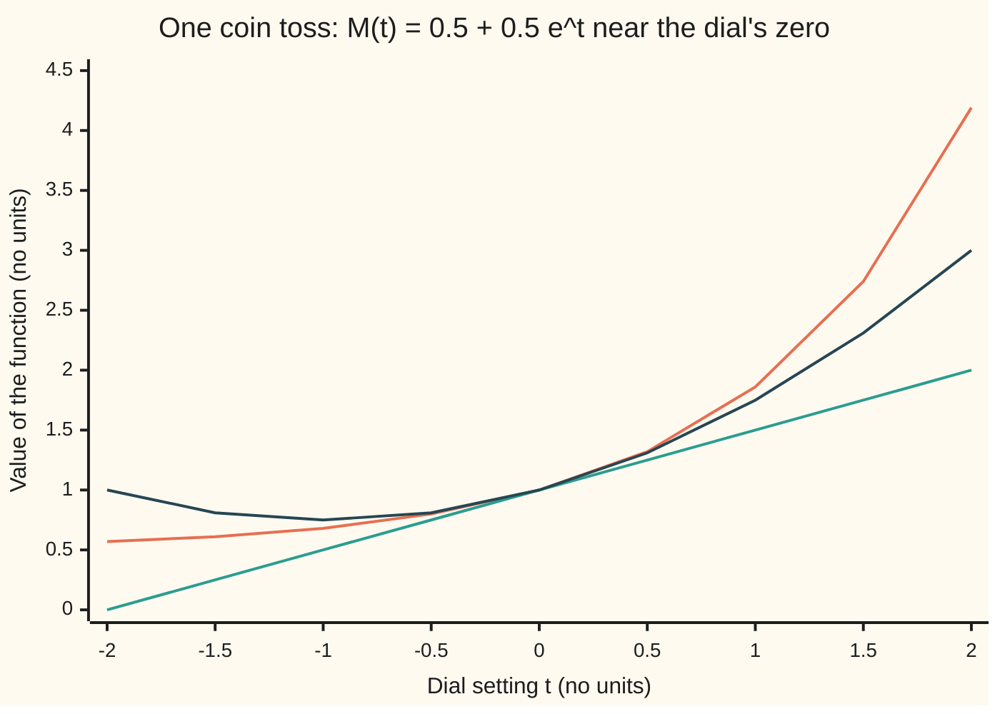
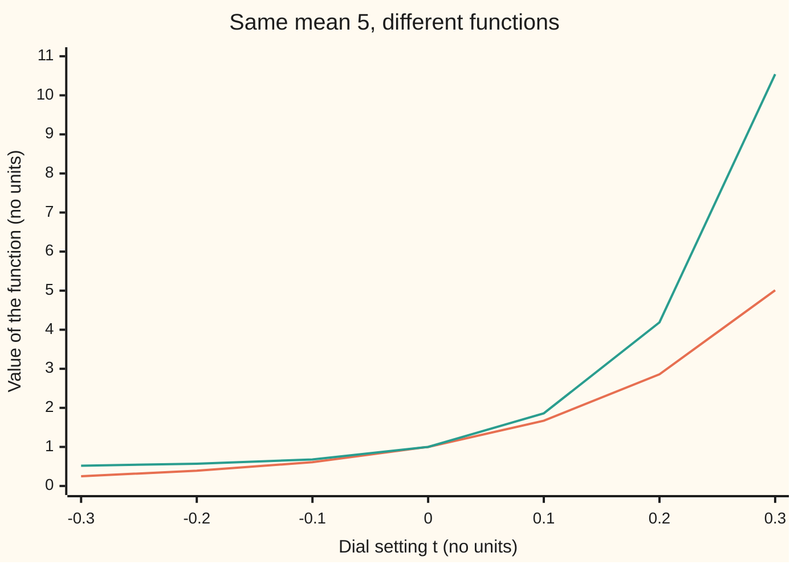

# Moment generating functions: one function that stores every moment

[Syllabus](../../../SYLLABUS.md) → [Probability and statistics](../../../SYLLABUS.md#w09) → [Random Variables](../../../SYLLABUS.md#w09-s02) → Moment generating functions

---

## General Overview

Toss a fair coin and score 1 for heads, 0 for tails. The score averages 0.5 in the long run ([Expectation](02-expectation.md)). The average of its square is also 0.5, since 1 squared is 1 and 0 squared is 0. So is the average of its cube, and of every higher power. These averages of powers are the score's **moments**. The first is the mean. The second, less the mean squared, is the variance ([Variance](03-variance-and-standard-deviation.md)). The third and fourth, taken about the mean, measure lean to one side and how heavy the tails are.

Now toss the coin ten times and count the heads. The count's moments are harder: its average cube means cubing the count on each of 1,024 equally likely sequences and averaging.

One function does it. Picture a filing cabinet with a drawer for every moment, built as a single function of a dial setting; each drawer opens by differentiating at the dial's zero. From here on the cabinet has its real name, the **moment generating function**. For the coin it is 0.5 + 0.5 e^t, where e is Euler's number, about 2.718, and t is the dial: a free number with no meaning in the world. For ten independent tosses it is the same expression raised to the tenth power.

**The moment generating function of a random variable is the long-run average of e raised to t times the variable; its k-th derivative at t = 0 is the k-th moment, and for independent variables the function of the sum is the product of their functions.**

**What kind of fact this is:** a definition, with two theorems about it (moments by differentiation, and the product rule for independent sums), proved on this card in Why it works; a third theorem, that the function pins down the whole law, is stated here and proved in [Characteristic functions](../../10-Measure%20and%20integration/10-The%20Limit%20Theorems%2C%20Proved/06-characteristic-functions.md).

### The picture: the coin's function and the moments in its shape



Orange: the coin's moment generating function. Green: its tangent line at zero, 1 + t/2, whose slope 0.5 is the mean. Dark blue: 1 + t/2 + t^2/4, which adds the second moment, 0.5, divided by 2. All three pass through 1 at t = 0; the more moments the approximation carries, the longer it hugs the curve.

---

## The formula

A reminder of the notation. $X$ is a random variable, here the coin's score, and its values are written in lower case, $x$. $P(X = x)$ is the chance that $X$ equals $x$, and $E[\,\cdot\,]$ is the long-run average ([Expectation](02-expectation.md)). New on this card: $M_X(t)$, read "the moment generating function of X at t", and $M_X^{(k)}(0)$, its k-th derivative at t = 0.

$$M_X(t) = E\big[e^{tX}\big] = \sum_x e^{tx}\,P(X = x)$$

**Read it aloud:** for each value the variable can take, raise e to the dial times that value, weight it by its chance, and add.

$$E[X^k] = M_X^{(k)}(0)$$

**Read it aloud:** the k-th moment is the k-th derivative of the function, taken at a dial setting of zero.

$$M_X(t) = \sum_{k=0}^{\infty} \frac{E[X^k]}{k!}\,t^k$$

**Read it aloud:** written as a power series in the dial, the function's k-th coefficient is the k-th moment divided by k factorial.

That last line says the moment generating function is the exponential generating function of the moment sequence ([Exponential generating functions](../../04-Combinatorics%20and%20graphs/07-Generating%20Functions/04-exponential-generating-functions.md)): the moments are packed into a power series with k! under each term, exactly as the combinatorics wing packs a counting sequence.

$$M_{X+Y}(t) = M_X(t)\,M_Y(t) \qquad \text{for independent } X \text{ and } Y$$

**Read it aloud:** the function of a sum of two independent variables is the product of their two functions.

For the coin, with chance of heads $p$ = 0.5, the definition gives $M_X(t) = (1 - p) + p\,e^t = 0.5 + 0.5e^t$. For $S$, the heads in $n$ = 10 independent tosses, the product rule gives $M_S(t) = (0.5 + 0.5e^t)^{10}$.

| Symbol | Plain meaning | In our example | Push it up and the answer… |
| --- | --- | --- | --- |
| $X$, $Y$ | random variables: one toss's score, and a second toss independent of it | 1 for heads, 0 for tails | — |
| $x$ | one value $X$ can take | 0, then 1 | a larger value weighs in as e^(tx) |
| $p$ | the chance of heads | 0.5 | the mean of $S$ rises as 10 times $p$ |
| $t$ | the dial: a free real number, not a probability or a time | read at 0 | $M_X(t)$ rises for $t$ above 0, falls below |
| $M_X$, $M_S$ | the moment generating functions of $X$ and $S$ | 0.5 + 0.5e^t, and its tenth power | — |
| $k$ | which moment: first, second, … | 1 to 4 | moments grow fast: 5, 27.5, 162.5, 1,017.5 for $S$ |
| $E[X^k]$ | the k-th moment: the average of the k-th power | 0.5 for every $k$ from 1 | — |
| $M_X^{(k)}(0)$ | the k-th derivative of $M_X$ at $t$ = 0 | 0.5 for every $k$ from 1 | equals $E[X^k]$ |
| $k!$ | k factorial: 1 × 2 × … × k | 2 for $k$ = 2 | shrinks the k-th coefficient |
| $S$ | heads in ten independent tosses | 0 to 10, averaging 5 | — |
| $n$ | the number of tosses | 10 | $M_S$ is $M_X$ to the power $n$ |
| $L$ | a count whose chance of the value $k$ is proportional to $e^{-\sqrt{k}}$ | average 4.47 | its function is infinite for every $t$ above 0 |

### When it holds

- **The function must be finite on an interval around $t$ = 0.** Every variable with finitely many values passes: the coin, the ten-toss count, any die. A count $L$ whose chance of the value $k$ is proportional to $e^{-\sqrt{k}}$ fails. Its moments are finite (average 4.47, average square 89.87), yet for any positive dial the sum defining $M_L(t)$ runs off to infinity, and no derivative at zero exists to read.
- **Derivatives are read at zero, not elsewhere.** At $t$ = 1 the coin's slope is 0.5e = 1.359, which is no moment of anything.
- **The product rule needs independence.** One toss copied ten times has function 0.5 + 0.5e^(10t), not (0.5 + 0.5e^t)^10: at $t$ = 0.1 it reads 1.859 against 1.669. What breaks, below, shows the gap.
- **Uniqueness needs the interval, not just the moments.** Two variables whose functions agree on an interval around zero have the same law: same chances, value for value. The proof runs through the complex-valued cousin of this function and lives in [Characteristic functions](../../10-Measure%20and%20integration/10-The%20Limit%20Theorems%2C%20Proved/06-characteristic-functions.md). Without that interval, two different laws can share every moment. The standard example is the lognormal law (e raised to a normal variable): every moment is finite, yet its function is infinite for every positive dial.

---

## Why it works

### Step 0: e^(tx) carries every power of x, each tagged by its own power of t

The exponential is a power series: e^(tx) = 1 + tx + (tx)^2/2! + (tx)^3/3! + … ([Taylor series](../../06-Calculus%20and%20analysis/06-Series/05-taylor-series.md)). Every power of $x$ appears once, and the matching power of $t$ labels it. Averaging over $X$ turns each $x^k$ into the moment $E[X^k]$ and leaves the labels alone. Differentiating at zero is the way to strip the labels off one at a time. Multiplying exponentials adds their exponents, e^(tx) e^(ty) = e^(t(x+y)), and that is why sums turn into products.

### Step 1: the k-th derivative at zero is the k-th moment

For a variable with finitely many values, $M_X(t)$ is a finite sum of terms e^(tx) $P(X = x)$. Differentiate each term: the derivative of e^(tx) with respect to $t$ is $x$ e^(tx). After $k$ derivatives each term is $x^k$ e^(tx) $P(X = x)$. At $t$ = 0, e^0 = 1, so what remains is the sum of $x^k P(X = x)$ over every value: $E[X^k]$.

On the coin: $M_X(t)$ = 0.5 + 0.5e^t. Every derivative of 0.5e^t is 0.5e^t, and the constant 0.5 vanishes after one derivative. So every derivative at zero is 0.5, matching the fact that 0^k = 0 and 1^k = 1 for every power. The variance is 0.5 − 0.5^2 = 0.25.

### Step 2: the series is the exponential generating function of the moments

Put the series of Step 0 inside the average. Each term is a number times a power of $t$, and the average of a sum is the sum of the averages, so

$$M_X(t) = 1 + E[X]\,t + \frac{E[X^2]}{2!}t^2 + \frac{E[X^3]}{3!}t^3 + \cdots$$

A power series's k-th coefficient is its k-th derivative at zero divided by k!, which is Step 1 read the other way. The division by k! is the price of the exponential: the t^2 coefficient of $M_S$ is 13.75, and it takes 2! × 13.75 = 27.5 to get the second moment.

### Step 3: independent sums multiply

Take independent $X$ and $Y$ with finitely many values each. Independence means $P(X = x, Y = y) = P(X = x)\,P(Y = y)$ for every pair ([Two variables at once](04-joint-distributions-and-covariance.md)). Then

$$E\big[e^{t(X+Y)}\big] = \sum_x \sum_y e^{tx}\,e^{ty}\,P(X = x)\,P(Y = y) = \Big(\sum_x e^{tx} P(X = x)\Big)\Big(\sum_y e^{ty} P(Y = y)\Big)$$

The double sum splits into a product because each term splits. Without independence the joint chance does not split, and neither does the sum. Adding one toss at a time, ten times over, gives $M_S(t) = M_X(t)^{10}$.

### Step 4: the ten-toss moments, read off the product

Differentiate $M_S(t) = (0.5 + 0.5e^t)^{10}$ with the chain rule: $M_S'(t)$ = 10 (0.5 + 0.5e^t)^9 × 0.5e^t. At zero the bracket is 1, so the mean is 10 × 0.5 = 5. One more derivative, by the product rule for derivatives, gives 90 × 0.5^2 + 10 × 0.5 = 27.5 at zero. The variance is 27.5 − 5^2 = 2.5, exactly ten times the coin's 0.25.

<details>
<summary>Detailed proof</summary>

**Finitely many values.** Let $X$ take the values $x_1, \dots, x_m$. Then $M_X(t)$ is a finite sum of smooth functions of $t$, finite for every $t$, and may be differentiated term by term any number of times. The k-th derivative is $\sum_i x_i^k e^{t x_i} P(X = x_i)$; at $t = 0$ it is $E[X^k]$. Taylor's theorem for this smooth function then gives the series of Step 2, and here it converges for every $t$.

**Product rule.** For independent $X$, $Y$ with finitely many values, $P(X + Y = s)$ is the sum of $P(X = x)P(Y = y)$ over pairs with $x + y = s$. So $E[e^{t(X+Y)}] = \sum_s e^{ts} P(X + Y = s) = \sum_x \sum_y e^{t(x + y)} P(X = x) P(Y = y)$, a finite double sum, which factors as shown in Step 3. By induction on the number of tosses, $M_S = M_X^n$ for $n$ independent copies.

**Infinitely many values.** Suppose $M_X(t)$ is finite for every $t$ in an interval $(-a, a)$ with $a > 0$. For $|t| < b < a$, each term $|x|^k e^{t x}$ is at most a constant times $e^{bx} + e^{-bx}$, whose average is finite. That bound is what allows the derivative to pass inside the infinite sum, and it is proved in wing 10 with the dominated convergence theorem; the moments by differentiation, the series and the product rule then hold unchanged on the interval. For a variable with a density the sums become integrals, again with no change to the conclusions.

</details>

<details>
<summary>The logarithm turns the product into a sum</summary>

Take the natural logarithm: ln $M_S$ = 10 ln $M_X$. Its first derivative at zero is the mean and its second the variance, so both add across independent tosses: 10 × 0.5 = 5 and 10 × 0.25 = 2.5. These derivatives are the **cumulants**; Moments and cumulants develops them.

</details>

A second road packs the probabilities rather than the moments. The average of s^S, as a polynomial in a new variable s, is (0.5 + 0.5s)^10; its coefficients are the chances $P(S = k)$, so it is the ordinary generating function of the law ([Generating functions](../../04-Combinatorics%20and%20graphs/07-Generating%20Functions/01-ordinary-generating-functions.md)). The coefficient of s^5 is 252/1,024, about 0.246, the chance of exactly five heads. Putting s = e^t turns it into the moment generating function. Counts built this way are the business of [Adding counts](../03-Discrete%20Distributions/06-sums-of-discrete-variables.md).

---

## Worked numbers, by hand

| Step | Arithmetic | Value |
| --- | --- | --- |
| one toss's function | 0.5 × e^(t × 0) + 0.5 × e^(t × 1) | 0.5 + 0.5e^t |
| at the dial's zero | 0.5 + 0.5 | 1 |
| first derivative at zero | 0.5 × e^0 | 0.5, the mean |
| second derivative at zero | 0.5 × e^0 | 0.5, the average square |
| one toss's variance | 0.5 − 0.25 | 0.25 |
| ten tosses' function | the product rule, ten times | (0.5 + 0.5e^t)^10 |
| first derivative at zero | 10 × 1^9 × 0.5 | 5 |
| second derivative at zero | 90 × 1^8 × 0.25 + 10 × 1^9 × 0.5 | 27.5 |
| ten tosses' variance | 27.5 − 25 | **2.5** |
| standard deviation | the square root of 2.5 | **about 1.58** |

Ten tosses average 5 heads, and a run of ten typically lands about 1.6 heads away from 5.

### A second case: the third and fourth moments

The third derivative of $M_S$ at zero is 720 × 0.5^3 + 270 × 0.5^2 + 10 × 0.5 = 90 + 67.5 + 5 = 162.5. The third moment about the mean is 162.5 − 3 × 5 × 27.5 + 2 × 5^3 = 0: the count of heads leans neither way from 5, as a fair coin should. The fourth moment is 1,017.5. The code reaches all four moments by four roads.

### What breaks if you drop a piece

| Mistake | Comes out at | What went wrong |
| --- | --- | --- |
| One toss copied ten times, treated as ten tosses | function 1.859 at t = 0.1, not 1.669; average square 50, not 27.5; variance 25, not 2.5 | The product rule needs independence |
| Slope read at t = 1 | 1.359, not the mean 0.5 | Moments live at the dial's zero |
| The t^2 coefficient read as the second moment | 13.75, not 27.5 | The k! under each coefficient was dropped |
| The heavy-tailed count $L$ | the log of the partial sums at t = 0.01 climbs 0.049, 4.34, 203.9 as the sum runs to 2,500, 10,000 and 40,000 | Finite moments (4.47 and 89.87) do not make the function finite |

The code prints all four.

### The picture: ten tosses against one toss copied ten times



Orange: ten independent tosses, (0.5 + 0.5e^t)^10. Green: one toss copied ten times, 0.5 + 0.5e^(10t), which scores 0 or 10. Both pass through 1 with slope 5, since both average 5 heads. The copied count bends away faster because its second moment is 50, not 27.5: all-or-nothing is the wider law.

---

## Code, from first principles, and it actually runs

The scripts reach each moment of the ten-toss count by four roads. One multiplies the coin's power series by itself ten times, up to t^4, and multiplies each coefficient by k!. One averages the k-th power of the heads over all 1,024 sequences. One evaluates the average of e^(tS) near zero and differentiates numerically by central differences (differences of nearby values, divided by the step to the right power). One simulates 200,000 runs of ten tosses with SplitMix64 (a short pseudo-random recipe written out in both languages, so both draw the same tosses) and reports standard errors. The product rule is checked against the sequences at five dial settings; then come the two failures. Only math is imported, for e^x, logarithms and square roots.

### Python

```python
# Moment generating functions -- the check behind the card.  Only math is
# imported, for exp, log and sqrt.  A fair coin scores X = 1 for heads and 0
# for tails; S counts the heads in ten independent flips.  Each moment E[S^k]
# is reached four ways: Taylor coefficients of M_X(t) multiplied ten times,
# an average over all 1,024 flip sequences, numerical derivatives of E[e^(tS)]
# at t = 0, and a seeded simulation.  Then two failures: copies, a heavy tail.
import math

P, N, KMAX = 0.5, 10, 4
LAW_X = [(0, 1 - P), (1, P)]                  # (value, chance) for one flip

def mgf(law, t):                              # the definition: sum of chance * e^(t x)
    total = 0.0                               # a plain loop, added in order, as in Rust
    for x, c in law:
        total += c * math.exp(t * x)
    return total

SEQS = []                                     # every sequence of ten flips, as (heads, chance)
for code in range(2 ** N):
    h = bin(code).count("1")
    SEQS.append((h, P ** h * (1 - P) ** (N - h)))

def mgf_s_enum(t):                            # E[e^(tS)] straight from the 1,024 sequences
    return mgf(SEQS, t)

def moment_enum(k):                           # road 2: E[S^k] by averaging over sequences
    return sum(c * h ** k for h, c in SEQS)

def taylor_x():                               # coefficients E[X^k] / k! of M_X(t)
    return [sum(c * x ** k for x, c in LAW_X) / math.factorial(k) for k in range(KMAX + 1)]

def poly_mul(a, b):                           # product of two series, cut at t^KMAX
    out = [0.0] * (KMAX + 1)
    for i, ai in enumerate(a):
        for j, bj in enumerate(b):
            if i + j <= KMAX:
                out[i + j] += ai * bj
    return out

series_s = [1.0] + [0.0] * KMAX               # road 1: M_S = M_X ten times over
for _ in range(N):
    series_s = poly_mul(series_s, taylor_x())
m_taylor = [series_s[k] * math.factorial(k) for k in range(KMAX + 1)]

def derivs_at_zero(f, h):                     # road 3: central differences, orders 1 to 4
    f2, f1, f0, g1, g2 = f(2 * h), f(h), f(0.0), f(-h), f(-2 * h)
    return [f0, (f1 - g1) / (2 * h), (f1 - 2 * f0 + g1) / h ** 2,
            (f2 - 2 * f1 + 2 * g1 - g2) / (2 * h ** 3), (f2 - 4 * f1 + 6 * f0 - 4 * g1 + g2) / h ** 4]
m_diff = derivs_at_zero(mgf_s_enum, 1e-3)

def splitmix64(state):                        # the generator both languages share
    state = (state + 0x9E3779B97F4A7C15) & 0xFFFFFFFFFFFFFFFF
    z = state
    z = ((z ^ (z >> 30)) * 0xBF58476D1CE4E5B9) & 0xFFFFFFFFFFFFFFFF
    z = ((z ^ (z >> 27)) * 0x94D049BB133111EB) & 0xFFFFFFFFFFFFFFFF
    return state, z ^ (z >> 31)

RUNS, state, sums = 200_000, 20260928, [0.0] * 6   # road 4: S, S^2, e^(0.1 S), and their squares
for _ in range(RUNS):
    s = 0
    for _ in range(N):
        state, z = splitmix64(state)
        s += 1 if (z >> 11) * 2.0 ** -53 < P else 0
    for i, v in enumerate((s, s * s, math.exp(0.1 * s))):
        sums[i] += v
        sums[i + 3] += v * v
est = [sums[i] / RUNS for i in range(3)]
se = [math.sqrt((sums[i + 3] / RUNS - est[i] ** 2) / RUNS) for i in range(3)]

def row(label, v, fmt="{:>14.6f}"):
    print(f"{label:<44}" + fmt.format(v))

row("coin: M_X(0)", mgf(LAW_X, 0.0))
coin_slope = derivs_at_zero(lambda t: mgf(LAW_X, t), 1e-3)[1]
row("coin: M_X'(0) by central difference", coin_slope)
row("coin: E[X^2] = E[X^3] = E[X^4]", sum(c * x ** 3 for x, c in LAW_X))
row("coin: variance E[X^2] - E[X]^2", P - P * P)
print("ten flips, E[S^k]:  k   Taylor x k!   all 1,024   derivative   simulated (se)")
for k in range(1, KMAX + 1):
    sim = f"{est[k - 1]:>10.4f} ({se[k - 1]:.4f})" if k <= 2 else ""
    print(f"{'':<20}{k:>2} {m_taylor[k]:>12.4f} {moment_enum(k):>11.4f} {m_diff[k]:>12.4f}  {sim}".rstrip())
mean_s, var_s = moment_enum(1), moment_enum(2) - moment_enum(1) ** 2
row("ten flips: variance E[S^2] - E[S]^2", var_s)
row("ten flips: standard deviation", math.sqrt(var_s))
row("ten flips: third central moment", moment_enum(3) - 3 * mean_s * moment_enum(2) + 2 * mean_s ** 3)
row("Taylor coefficient of t^2 in M_S", series_s[2])
row("Taylor coefficient of t^3 in M_S", series_s[3])
row("P(S = 5): count of sequences with 5 heads", sum(c for h, c in SEQS if h == 5))
print("product rule:   t    E[e^(tS)] over 1,024   M_X(t)^10")
for t in (-1.0, -0.5, 0.1, 0.5, 1.0):
    print(f"{'':<12}{t:>6.1f} {mgf_s_enum(t):>21.6f} {mgf(LAW_X, t) ** N:>11.6f}")
    assert abs(mgf_s_enum(t) - mgf(LAW_X, t) ** N) < 1e-12 * mgf_s_enum(t), t
row("simulated E[e^(0.1 S)]", est[2])
row("  its standard error", se[2])

COPY = [(0, 1 - P), (N, P)]                   # one flip copied ten times: S = 10 X
row("wrong: copies, M(0.1) of 10X", mgf(COPY, 0.1))
row("wrong: copies, E[(10X)^2] by derivative", derivs_at_zero(lambda t: mgf(COPY, t), 1e-3)[2])
row("wrong: copies, variance", N * N * (P - P * P))
row("wrong: slope at t = 1, M_X'(1)", P * math.exp(1.0))
row("wrong: t^2 coefficient read as E[S^2]", series_s[2])
TAIL = [(k, math.exp(-math.sqrt(k))) for k in range(40_001)]
c_tail = sum(w for _, w in TAIL)              # heavy tail: chance of k proportional to e^(-sqrt k)
row("heavy tail: E[L]", sum(k * w for k, w in TAIL) / c_tail)
row("heavy tail: E[L^2]", sum(k * k * w for k, w in TAIL) / c_tail)
logs = []
for cut in (2_500, 10_000, 40_000):
    logs.append(math.log(sum(math.exp(0.01 * k) * w for k, w in TAIL[:cut + 1]) / c_tail))
    row(f"heavy tail: ln of E[e^(0.01 L)], k <= {cut:,}", logs[-1])
ts = [-2 + 0.5 * i for i in range(9)]
print("chart1, M_X(t):   " + " ".join(f"{mgf(LAW_X, t):.2f}" for t in ts))
print("chart1, 1 + t/2:  " + " ".join(f"{1 + t / 2:.2f}" for t in ts))
print("chart1, + t^2/4:  " + " ".join(f"{1 + t / 2 + t * t / 4:.2f}" for t in ts))
ts2 = [-0.3 + 0.1 * i for i in range(7)]
print("chart2, independent: " + " ".join(f"{mgf(LAW_X, t) ** N:.2f}" for t in ts2))
print("chart2, copies 10X:  " + " ".join(f"{mgf(COPY, t):.2f}" for t in ts2))

for k in range(1, KMAX + 1):
    assert abs(m_taylor[k] - moment_enum(k)) < 1e-9 * moment_enum(k), f"Taylor vs sequences, k={k}"
    assert abs(m_diff[k] - moment_enum(k)) < 1e-3 * moment_enum(k), f"derivative vs sequences, k={k}"
for i, exact in enumerate((moment_enum(1), moment_enum(2), mgf_s_enum(0.1))):
    assert abs(est[i] - exact) < 4 * se[i], f"simulation {i} within four standard errors"
assert abs(mgf(COPY, 0.1) - mgf(LAW_X, 0.1) ** N) > 0.1, "copies must break the product rule"
assert abs(coin_slope - sum(c * x for x, c in LAW_X)) < 1e-6, "coin slope at zero is the mean"
assert logs[0] < 1 < 10 * logs[1] < logs[2], "heavy tail: partial sums must run away"
print("ALL CHECKS PASS")
```

**Ran 2026-09-28 on macOS, Python 3.14.6, standard library only. All checks passed. Output, pasted from the run:**

```
coin: M_X(0)                                      1.000000
coin: M_X'(0) by central difference               0.500000
coin: E[X^2] = E[X^3] = E[X^4]                    0.500000
coin: variance E[X^2] - E[X]^2                    0.250000
ten flips, E[S^k]:  k   Taylor x k!   all 1,024   derivative   simulated (se)
                     1       5.0000      5.0000       5.0000      5.0041 (0.0035)
                     2      27.5000     27.5000      27.5001     27.5514 (0.0363)
                     3     162.5000    162.5000     162.5017
                     4    1017.5000   1017.5000    1017.4999
ten flips: variance E[S^2] - E[S]^2               2.500000
ten flips: standard deviation                     1.581139
ten flips: third central moment                   0.000000
Taylor coefficient of t^2 in M_S                 13.750000
Taylor coefficient of t^3 in M_S                 27.083333
P(S = 5): count of sequences with 5 heads         0.246094
product rule:   t    E[e^(tS)] over 1,024   M_X(t)^10
              -1.0              0.022396    0.022396
              -0.5              0.111838    0.111838
               0.1              1.669451    1.669451
               0.5             16.598263   16.598263
               1.0            493.313596  493.313596
simulated E[e^(0.1 S)]                            1.670225
  its standard error                              0.000595
wrong: copies, M(0.1) of 10X                      1.859141
wrong: copies, E[(10X)^2] by derivative          50.000417
wrong: copies, variance                          25.000000
wrong: slope at t = 1, M_X'(1)                    1.359141
wrong: t^2 coefficient read as E[S^2]            13.750000
heavy tail: E[L]                                  4.471619
heavy tail: E[L^2]                               89.872048
heavy tail: ln of E[e^(0.01 L)], k <= 2,500       0.048777
heavy tail: ln of E[e^(0.01 L)], k <= 10,000      4.342915
heavy tail: ln of E[e^(0.01 L)], k <= 40,000    203.914926
chart1, M_X(t):   0.57 0.61 0.68 0.80 1.00 1.32 1.86 2.74 4.19
chart1, 1 + t/2:  0.00 0.25 0.50 0.75 1.00 1.25 1.50 1.75 2.00
chart1, + t^2/4:  1.00 0.81 0.75 0.81 1.00 1.31 1.75 2.31 3.00
chart2, independent: 0.25 0.39 0.61 1.00 1.67 2.86 5.01
chart2, copies 10X:  0.52 0.57 0.68 1.00 1.86 4.19 10.54
ALL CHECKS PASS
```

### Rust

Same numbers, same labels, same generator and seed.

```rust
// Moment generating functions -- the check behind the card, in Rust, std only.
// A fair coin scores X = 1 for heads and 0 for tails; S counts the heads in
// ten independent flips.  Each moment E[S^k] is reached four ways: Taylor
// coefficients of M_X(t) multiplied ten times, an average over all 1,024 flip
// sequences, numerical derivatives of E[e^(tS)] at t = 0, and a seeded
// simulation.  Then two failures: copies, and a heavy tail.
const P: f64 = 0.5;
const N: i32 = 10;
const KMAX: usize = 4;

fn mgf(law: &[(f64, f64)], t: f64) -> f64 {
    // the definition: sum of chance * e^(t x)
    law.iter().map(|&(x, c)| c * (t * x).exp()).sum()
}

fn factorial(k: usize) -> f64 {
    (1..=k).map(|i| i as f64).product()
}

fn poly_mul(a: &[f64], b: &[f64]) -> Vec<f64> {
    // product of two series, cut at t^KMAX
    let mut out = vec![0.0; KMAX + 1];
    for (i, ai) in a.iter().enumerate() {
        for (j, bj) in b.iter().enumerate() {
            if i + j <= KMAX {
                out[i + j] += ai * bj;
            }
        }
    }
    out
}

fn derivs_at_zero(f: &dyn Fn(f64) -> f64, h: f64) -> Vec<f64> {
    // road 3: central differences, orders 1 to 4
    let (f2, f1, f0, g1, g2) = (f(2.0 * h), f(h), f(0.0), f(-h), f(-2.0 * h));
    vec![f0, (f1 - g1) / (2.0 * h), (f1 - 2.0 * f0 + g1) / h.powi(2),
         (f2 - 2.0 * f1 + 2.0 * g1 - g2) / (2.0 * h.powi(3)), (f2 - 4.0 * f1 + 6.0 * f0 - 4.0 * g1 + g2) / h.powi(4)]
}

fn splitmix64(state: u64) -> (u64, u64) {
    // the generator both languages share
    let state = state.wrapping_add(0x9E3779B97F4A7C15);
    let mut z = state;
    z = (z ^ (z >> 30)).wrapping_mul(0xBF58476D1CE4E5B9);
    z = (z ^ (z >> 27)).wrapping_mul(0x94D049BB133111EB);
    (state, z ^ (z >> 31))
}

fn row(label: &str, v: f64) {
    println!("{:<44}{:>14.6}", label, v);
}

fn main() {
    let law_x: [(f64, f64); 2] = [(0.0, 1.0 - P), (1.0, P)]; // (value, chance) for one flip
    let seqs: Vec<(f64, f64)> = (0..(1u32 << N)) // every sequence of ten flips, as (heads, chance)
        .map(|code| { let h = code.count_ones() as i32; (h as f64, P.powi(h) * (1.0 - P).powi(N - h)) })
        .collect();
    let mgf_s_enum = |t: f64| mgf(&seqs, t); // E[e^(tS)] straight from the 1,024 sequences
    let moment_enum = |k: i32| -> f64 { seqs.iter().map(|&(h, c)| c * h.powi(k)).sum() }; // road 2
    let taylor_x: Vec<f64> = (0..=KMAX) // coefficients E[X^k] / k! of M_X(t)
        .map(|k| law_x.iter().map(|&(x, c)| c * x.powi(k as i32)).sum::<f64>() / factorial(k)).collect();
    let mut series_s = vec![0.0; KMAX + 1]; // road 1: M_S = M_X ten times over
    series_s[0] = 1.0;
    for _ in 0..N {
        series_s = poly_mul(&series_s, &taylor_x);
    }
    let m_taylor: Vec<f64> = (0..=KMAX).map(|k| series_s[k] * factorial(k)).collect();
    let m_diff = derivs_at_zero(&mgf_s_enum, 1e-3);

    let (runs, mut state, mut sums) = (200_000usize, 20260928u64, [0.0f64; 6]); // road 4
    for _ in 0..runs {
        let mut s = 0i32;
        for _ in 0..N {
            let (st, z) = splitmix64(state);
            state = st;
            if ((z >> 11) as f64) * 2f64.powi(-53) < P { s += 1; }
        }
        let sf = s as f64;
        for (i, v) in [sf, sf * sf, (0.1 * sf).exp()].iter().enumerate() {
            sums[i] += v;
            sums[i + 3] += v * v;
        }
    }
    let rf = runs as f64;
    let est: Vec<f64> = (0..3).map(|i| sums[i] / rf).collect();
    let se: Vec<f64> = (0..3).map(|i| ((sums[i + 3] / rf - est[i].powi(2)) / rf).sqrt()).collect();

    row("coin: M_X(0)", mgf(&law_x, 0.0));
    let coin_slope = derivs_at_zero(&|t| mgf(&law_x, t), 1e-3)[1];
    row("coin: M_X'(0) by central difference", coin_slope);
    row("coin: E[X^2] = E[X^3] = E[X^4]", law_x.iter().map(|&(x, c)| c * x.powi(3)).sum());
    row("coin: variance E[X^2] - E[X]^2", P - P * P);
    println!("ten flips, E[S^k]:  k   Taylor x k!   all 1,024   derivative   simulated (se)");
    for k in 1..=KMAX {
        let sim = if k <= 2 { format!("{:>10.4} ({:.4})", est[k - 1], se[k - 1]) } else { String::new() };
        let line = format!("{:<20}{:>2} {:>12.4} {:>11.4} {:>12.4}  {}", "", k, m_taylor[k], moment_enum(k as i32), m_diff[k], sim);
        println!("{}", line.trim_end());
    }
    let (mean_s, var_s) = (moment_enum(1), moment_enum(2) - moment_enum(1).powi(2));
    row("ten flips: variance E[S^2] - E[S]^2", var_s);
    row("ten flips: standard deviation", var_s.sqrt());
    row("ten flips: third central moment", moment_enum(3) - 3.0 * mean_s * moment_enum(2) + 2.0 * mean_s.powi(3));
    row("Taylor coefficient of t^2 in M_S", series_s[2]);
    row("Taylor coefficient of t^3 in M_S", series_s[3]);
    row("P(S = 5): count of sequences with 5 heads", seqs.iter().filter(|&&(h, _)| h == 5.0).map(|&(_, c)| c).sum());
    println!("product rule:   t    E[e^(tS)] over 1,024   M_X(t)^10");
    for &t in [-1.0f64, -0.5, 0.1, 0.5, 1.0].iter() {
        let (e, m) = (mgf_s_enum(t), mgf(&law_x, t).powi(N));
        println!("{:<12}{:>6.1} {:>21.6} {:>11.6}", "", t, e, m);
        assert!((e - m).abs() < 1e-12 * e, "{}", t);
    }
    row("simulated E[e^(0.1 S)]", est[2]);
    row("  its standard error", se[2]);

    let copy: [(f64, f64); 2] = [(0.0, 1.0 - P), (N as f64, P)]; // one flip copied ten times: S = 10 X
    row("wrong: copies, M(0.1) of 10X", mgf(&copy, 0.1));
    row("wrong: copies, E[(10X)^2] by derivative", derivs_at_zero(&|t| mgf(&copy, t), 1e-3)[2]);
    row("wrong: copies, variance", (N * N) as f64 * (P - P * P));
    row("wrong: slope at t = 1, M_X'(1)", P * 1f64.exp());
    row("wrong: t^2 coefficient read as E[S^2]", series_s[2]);
    let tail: Vec<(f64, f64)> = (0..=40_000).map(|k| (k as f64, (-(k as f64).sqrt()).exp())).collect();
    let c_tail: f64 = tail.iter().map(|&(_, w)| w).sum(); // heavy tail: chance of k proportional to e^(-sqrt k)
    row("heavy tail: E[L]", tail.iter().map(|&(k, w)| k * w).sum::<f64>() / c_tail);
    row("heavy tail: E[L^2]", tail.iter().map(|&(k, w)| k * k * w).sum::<f64>() / c_tail);
    let mut logs = Vec::new();
    for &(cut, name) in [(2_500usize, "2,500"), (10_000, "10,000"), (40_000, "40,000")].iter() {
        let part: f64 = tail[..=cut].iter().map(|&(k, w)| (0.01 * k).exp() * w).sum::<f64>() / c_tail;
        logs.push(part.ln());
        row(&format!("heavy tail: ln of E[e^(0.01 L)], k <= {}", name), part.ln());
    }
    let join = |v: Vec<f64>| v.iter().map(|x| format!("{:.2}", x)).collect::<Vec<_>>().join(" ");
    let ts: Vec<f64> = (0..9).map(|i| -2.0 + 0.5 * i as f64).collect();
    println!("chart1, M_X(t):   {}", join(ts.iter().map(|&t| mgf(&law_x, t)).collect()));
    println!("chart1, 1 + t/2:  {}", join(ts.iter().map(|&t| 1.0 + t / 2.0).collect()));
    println!("chart1, + t^2/4:  {}", join(ts.iter().map(|&t| 1.0 + t / 2.0 + t * t / 4.0).collect()));
    let ts2: Vec<f64> = (0..7).map(|i| -0.3 + 0.1 * i as f64).collect();
    println!("chart2, independent: {}", join(ts2.iter().map(|&t| mgf(&law_x, t).powi(N)).collect()));
    println!("chart2, copies 10X:  {}", join(ts2.iter().map(|&t| mgf(&copy, t)).collect()));

    for k in 1..=KMAX {
        let exact = moment_enum(k as i32);
        assert!((m_taylor[k] - exact).abs() < 1e-9 * exact, "Taylor vs sequences, k={}", k);
        assert!((m_diff[k] - exact).abs() < 1e-3 * exact, "derivative vs sequences, k={}", k);
    }
    for (i, &exact) in [moment_enum(1), moment_enum(2), mgf_s_enum(0.1)].iter().enumerate() {
        assert!((est[i] - exact).abs() < 4.0 * se[i], "simulation {} within four standard errors", i);
    }
    assert!((mgf(&copy, 0.1) - mgf(&law_x, 0.1).powi(N)).abs() > 0.1, "copies must break the product rule");
    assert!((coin_slope - law_x.iter().map(|&(x, c)| c * x).sum::<f64>()).abs() < 1e-6, "coin slope at zero is the mean");
    assert!(logs[0] < 1.0 && 1.0 < 10.0 * logs[1] && 10.0 * logs[1] < logs[2], "heavy tail: partial sums must run away");
    println!("ALL CHECKS PASS");
}
```

**Ran 2026-09-28 on macOS, rustc 1.98.1, no crates. All checks passed. Output, pasted from the run:**

```
coin: M_X(0)                                      1.000000
coin: M_X'(0) by central difference               0.500000
coin: E[X^2] = E[X^3] = E[X^4]                    0.500000
coin: variance E[X^2] - E[X]^2                    0.250000
ten flips, E[S^k]:  k   Taylor x k!   all 1,024   derivative   simulated (se)
                     1       5.0000      5.0000       5.0000      5.0041 (0.0035)
                     2      27.5000     27.5000      27.5001     27.5514 (0.0363)
                     3     162.5000    162.5000     162.5017
                     4    1017.5000   1017.5000    1017.4999
ten flips: variance E[S^2] - E[S]^2               2.500000
ten flips: standard deviation                     1.581139
ten flips: third central moment                   0.000000
Taylor coefficient of t^2 in M_S                 13.750000
Taylor coefficient of t^3 in M_S                 27.083333
P(S = 5): count of sequences with 5 heads         0.246094
product rule:   t    E[e^(tS)] over 1,024   M_X(t)^10
              -1.0              0.022396    0.022396
              -0.5              0.111838    0.111838
               0.1              1.669451    1.669451
               0.5             16.598263   16.598263
               1.0            493.313596  493.313596
simulated E[e^(0.1 S)]                            1.670225
  its standard error                              0.000595
wrong: copies, M(0.1) of 10X                      1.859141
wrong: copies, E[(10X)^2] by derivative          50.000417
wrong: copies, variance                          25.000000
wrong: slope at t = 1, M_X'(1)                    1.359141
wrong: t^2 coefficient read as E[S^2]            13.750000
heavy tail: E[L]                                  4.471619
heavy tail: E[L^2]                               89.872048
heavy tail: ln of E[e^(0.01 L)], k <= 2,500       0.048777
heavy tail: ln of E[e^(0.01 L)], k <= 10,000      4.342915
heavy tail: ln of E[e^(0.01 L)], k <= 40,000    203.914926
chart1, M_X(t):   0.57 0.61 0.68 0.80 1.00 1.32 1.86 2.74 4.19
chart1, 1 + t/2:  0.00 0.25 0.50 0.75 1.00 1.25 1.50 1.75 2.00
chart1, + t^2/4:  1.00 0.81 0.75 0.81 1.00 1.31 1.75 2.31 3.00
chart2, independent: 0.25 0.39 0.61 1.00 1.67 2.86 5.01
chart2, copies 10X:  0.52 0.57 0.68 1.00 1.86 4.19 10.54
ALL CHECKS PASS
```

The two outputs match line for line. The simulated mean, 5.0041, sits about 1.2 standard errors (0.0035) above the exact 5; the simulated average square, 27.5514, about 1.4 standard errors (0.0363) above 27.5; the simulated value of the function at t = 0.1, 1.670225, about 1.3 standard errors (0.000595) above 1.669451. Misses of that size are what chance alone produces. The derivative road is off by 0.0074 at the fourth moment: a fourth difference divides by the step to the fourth power, which magnifies rounding and the step's own error; the assert allows one part in a thousand.

> [!TIP]
> **Try changing**
> Guess first, then run it.
> - **Break independence.** The `COPY` rows already show it: one toss copied ten times has the same mean, 5, but an average square of 50 and a function value of 1.859 at t = 0.1. Guess which way the copied curve bends before reading the second chart.
> - **Drop the factorial.** Remove `/ math.factorial(k)` in `taylor_x`. Guess where it fails: the mean survives, since 1! is 1, and the assert on the second moment stops the run.
> - **Shrink the step.** Set the derivative step to `1e-5`. Guess: a smaller step should be more accurate. It is not: the first two rows hold, the third drifts, the fourth turns to noise, and the assert stops at the third moment. Rounding, divided by the step cubed, has taken over.
> - **Bias the coin.** Set `P = 0.3`. Every assert still passes, since no road assumed a fair coin. Guess the mean before reading it: 10 times the chance of heads. The third moment about the mean is no longer zero: a biased coin's count leans.

---

## The usual mistake

> [!warning]
> **Multiplying the functions of variables that are not independent.** The product rule is a fact about independent variables only. Ten tosses of one coin multiply; ten readings of one toss, or ten stocks that move together, do not. One toss copied ten times has the same mean, 5, but its function at t = 0.1 is 1.859, not 1.669, and its variance is 25, not 2.5. Multiplying anyway understates the variance tenfold.
>
> - **Reading the function's value as a chance or an average payout.** $M_S$(0.1) = 1.669 is neither. The dial has no meaning in the world; only the derivatives at zero, and the function's shape as a whole, carry information.
> - **Differentiating somewhere other than zero.** The coin's slope at t = 1 is 1.359, not the mean 0.5.
> - **Forgetting the factorial.** The t^2 coefficient of $M_S$ is 13.75; the second moment is 2! times that, 27.5.
> - **Assuming finite moments make the function finite.** The count $L$ has average 4.47 and average square 89.87, and every other moment finite too, yet its function is infinite for every positive dial.

---

## Where you meet it in real life

- **Sums of independent counts.** Multiplying functions identifies the law of a sum without adding up every pair of outcomes: [Adding counts](../03-Discrete%20Distributions/06-sums-of-discrete-variables.md) for counts, [Adding continuous variables](../05-Transformations%20and%20Joint%20Laws/04-sums-and-convolution.md) for measurements.
- **Tail bounds.** The chance that ten tosses give nine or more heads is at most e^(−9t) times $M_S(t)$ for every positive dial; choosing the best dial gives the Chernoff bound of [Concentration](../06-Limit%20Theorems%20in%20Practice/06-concentration-inequalities-hoeffding-and-chernoff.md).
- **Insurance totals.** A year's claims are a random number of random amounts; their total's function comes from composing two functions, as [Compound Poisson](../../11-Stochastic%20processes%20and%20calculus/04-Poisson%20and%20Jump%20Processes/04-compound-poisson.md) shows.
- **Asset prices.** When a stock's log-return is normal, its average future price is today's price times the normal law's moment generating function at a dial of 1.

> **Say it back**
> The moment generating function of a random variable is the average of e raised to the dial times the variable. At a dial of zero it equals 1, its slope there is the mean, and its k-th derivative there is the k-th moment. As a power series it is the exponential generating function of the moments, each divided by k!. For independent variables the function of the sum is the product of the functions, so ten fair tosses have (0.5 + 0.5e^t)^10, mean 5 and variance 2.5. It needs independence to multiply, and it must be finite around zero to hold anything at all.

---

## What this builds on

- [Expectation](02-expectation.md): the long-run average, and the linearity that lets it pass through a sum.
- [Taylor series](../../06-Calculus%20and%20analysis/06-Series/05-taylor-series.md): the series for e^x, and coefficients as derivatives at zero divided by k!.
- [Generating functions](../../04-Combinatorics%20and%20graphs/07-Generating%20Functions/01-ordinary-generating-functions.md): packing a sequence into a power series, here the chances of each count.
- [Exponential generating functions](../../04-Combinatorics%20and%20graphs/07-Generating%20Functions/04-exponential-generating-functions.md): the same packing with k! underneath, which the moment generating function is for the moments.

## Where this goes next

- [Adding counts](../03-Discrete%20Distributions/06-sums-of-discrete-variables.md): the law of a sum of independent counts, found by multiplying functions.
- [Adding continuous variables](../05-Transformations%20and%20Joint%20Laws/04-sums-and-convolution.md): the same for measurements with densities, and the convolution the product replaces.
- [Characteristic functions](../06-Limit%20Theorems%20in%20Practice/04-characteristic-functions-and-inversion.md): the complex-valued cousin, finite for every law, and how to recover the law from it.
- [Concentration](../06-Limit%20Theorems%20in%20Practice/06-concentration-inequalities-hoeffding-and-chernoff.md): the function turned into exponentially small tail bounds.
- [Characteristic functions](../../10-Measure%20and%20integration/10-The%20Limit%20Theorems%2C%20Proved/06-characteristic-functions.md): the uniqueness theorem proved, and the swap of derivative and average justified.
- [Compound Poisson](../../11-Stochastic%20processes%20and%20calculus/04-Poisson%20and%20Jump%20Processes/04-compound-poisson.md): a random number of random amounts, handled by composing functions.
- Moments and cumulants: cumulants, the derivatives of the logarithm, and what they measure.

The coin's function exists for every dial, but the heavy-tailed count's does not; a transform that exists for every law, and still multiplies over independent sums, is what [Characteristic functions](../06-Limit%20Theorems%20in%20Practice/04-characteristic-functions-and-inversion.md) builds.

---

## Sources

Verified 2026-09-28: every link below resolves to the publisher's page.

- Grinstead, Charles M., and J. Laurie Snell. *Introduction to Probability*, 2nd revised ed. American Mathematical Society. [Full text, Dartmouth](https://math.dartmouth.edu/~prob/prob/prob.pdf). Chapter 10 defines moment generating functions for discrete variables, reads moments off the derivatives, and multiplies them for independent sums.
- Blitzstein, Joseph K., and Jessica Hwang. *Introduction to Probability*, 2nd ed. CRC Press, 2019. [Publisher page](https://www.routledge.com/Introduction-to-Probability-Second-Edition/Blitzstein-Hwang/p/book/9781138369917). Chapter 6 on moments and moment generating functions, with the Bernoulli and binomial cases.
- Siegrist, Kyle. "Generating Functions." *Probability, Mathematical Statistics, and Stochastic Processes*, Random Services. [Section page](https://www.randomservices.org/random/expect/Generating.html). The probability and moment generating functions side by side, the finiteness condition, and the lognormal counterexample.
- Graham, Ronald L., Donald E. Knuth, and Oren Patashnik. *Concrete Mathematics*, 2nd ed. Addison-Wesley, 1994. [Publisher page](https://www.informit.com/store/concrete-mathematics-a-foundation-for-computer-science-9780201558029). Chapter 8 handles means and variances of discrete laws through their generating functions.
