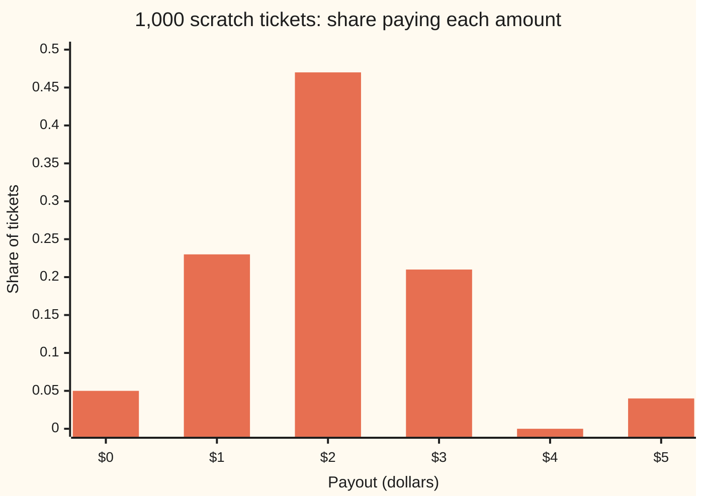
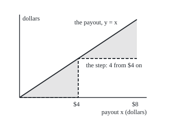
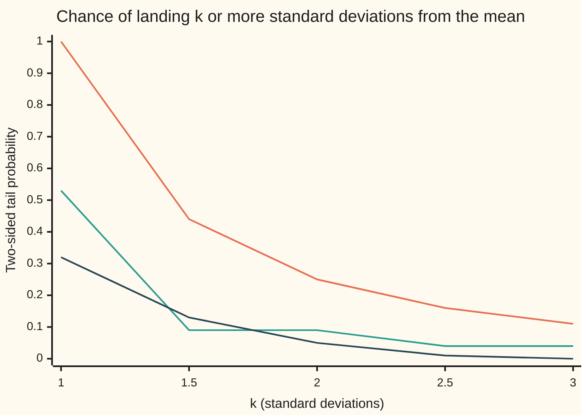

# Markov and Chebyshev: bounds on tails from a mean and a variance alone

Probability and statistics → Random Variables → Guaranteed tail bounds → Markov and Chebyshev

---

## General Overview

A school fête sells 1,000 scratch tickets. The notice on the stall gives two numbers and nothing else: the average ticket pays $2, and the standard deviation of the payout is $1. The prize table stays in the organiser's drawer.

A buyer wants to know how many tickets pay $4 or more: twice the average. Without the table there is no exact answer. There is a guaranteed ceiling. The average alone forces at most half the tickets to pay $4 or more, since the prize fund of $2,000 cannot stretch further. The average and the spread together force at most a quarter: 250 tickets. That holds for every prize table with those two numbers, however lopsided.

The drawer, opened, holds this table: 50 tickets pay $0, 230 pay $1, 470 pay $2, 210 pay $3 and 40 pay $5. Only 40 tickets, 4%, pay $4 or more. The guarantee is true and far from tight here. Step 4 shows tables that meet each ceiling exactly; for the upper tail alone the true worst case is a fifth, not a quarter.

A random variable's **law** is its list of values with their chances, here the prize table. The part of a law far from its centre is its **tail**; the share of tickets out there is the tail's probability. The ceiling from the average alone is **Markov's inequality**. The ceiling from the average and the variance is **Chebyshev's inequality**.

**A quantity that is never negative rarely lands far above its mean, and any quantity with a finite variance rarely lands many standard deviations from its mean: the mean and the variance alone cap how much probability the tails can hold.**

**What kind of fact this is:** two theorems, both proved on this card in Why it works; the second is the first applied to the squared distance from the mean.

### The picture: the prize table in the drawer



The bars sum to 1. The two bars at $4 and above hold 0.04 between them; the bounds promise no more than 0.5 (Markov) and 0.25 (Chebyshev) without ever seeing this chart.

---

## The formula

A reminder of the notation. $X$ is the random variable, here one ticket's payout in dollars; its values are written in lower case, $x$. $P(A)$ is the chance of the event $A$, here the share of tickets for which $A$ is true. $E[X]$ is the expectation, the long-run average, shortened to $\mu$ (Greek mu). $\mathrm{Var}(X)$ is the variance, shortened to $\sigma^2$, and $\sigma$ (Greek sigma) is the standard deviation. Vertical bars, $\lvert X - \mu \rvert$, mean the distance between $X$ and $\mu$, sign dropped.

**Markov's inequality.** For a random variable that is never negative, and any positive threshold $a$:

$$P(X \ge a) \le \frac{E[X]}{a}$$

**Read it aloud:** the chance of reaching at least $a$ is at most the mean divided by $a$.

**Chebyshev's inequality.** For a random variable with a finite variance, and any positive distance $\varepsilon$ (Greek epsilon):

$$P\big(\lvert X - \mu \rvert \ge \varepsilon\big) \le \frac{\sigma^2}{\varepsilon^2}$$

**Read it aloud:** the chance of landing at least $\varepsilon$ from the mean, on either side, is at most the variance divided by $\varepsilon$ squared.

Measuring the distance in standard deviations, $\varepsilon = k\sigma$ for a number $k$, gives the form most often quoted:

$$P\big(\lvert X - \mu \rvert \ge k\sigma\big) \le \frac{1}{k^2}$$

**Read it aloud:** at most one over $k$ squared of the probability lies $k$ or more standard deviations from the mean. Two standard deviations: at most a quarter. Three: at most a ninth.

For the tickets, "twice the average" is $X \ge 2\mu$, which puts $X$ at least $\mu$ above the mean, so Chebyshev with $\varepsilon = \mu$ caps it at $\sigma^2 / \mu^2 = 1/4$.

| Symbol | Plain meaning | In our example | Push it up and the answer… |
| --- | --- | --- | --- |
| $X$ | the random variable: one ticket's payout | $0, $1, $2, $3 or $5 | — |
| $x$ | one value $X$ can take | 5 for the top prize | — |
| $A$, $P(A)$ | an event, and its chance: the share of tickets where it is true | 0.04 for "pays $4 or more" | — |
| $\mu$ | the mean, $E[X]$ | $2 | Markov's ceiling rises in proportion |
| $\sigma^2$, $\sigma$ | the variance and the standard deviation | 1 square dollar, $1 | Chebyshev's ceiling rises with $\sigma^2$ |
| $a$ | Markov's threshold, in dollars | $4 | the ceiling falls like $1/a$ |
| $\varepsilon$ | Chebyshev's distance from the mean, in dollars | $2 | the ceiling falls like $1/\varepsilon^2$ |
| $k$ | the same distance counted in standard deviations | 2 | the ceiling falls like $1/k^2$ |
| $Y$ | the squared distance from the mean, $(X - \mu)^2$ | 4, 1, 0, 1 or 9 | its mean is $\sigma^2$ |
| $n$ | tickets drawn in the simulation, or people in a poll | 1,000,000 | the standard error shrinks like $1/\sqrt{n}$ |

### When it holds

- **Markov needs a quantity that is never negative.** A ticket's payout net of a $2 price, $X - 2$, averages $0$, so Markov would promise that no ticket nets $1 or more. In fact 25% do. Negative values cancel against positive ones in the mean and hide the tail.
- **The threshold must be positive.** At $a = 0$ the ratio has no meaning, and any threshold at or below the mean gives a ceiling of 1 or more, which says nothing.
- **Chebyshev needs a finite variance.** A ticket paying $2, $4, $8 and so on, $2^j$ with chance $3/4^j$, averages $3, but its average squared payout grows by 3 with every prize level added: 30 over ten levels, 120 over forty. There is no $\sigma^2$ to divide. Markov still applies to it.
- **The mean and variance must be the law's own.** Numbers estimated from a handful of draws carry their own error, and the inequality does not account for it.
- **Useful beyond one standard deviation only.** For $k \le 1$ the ceiling $1/k^2$ is 1 or more: true and empty.

---

## Why it works

### Step 0: a big tail costs the mean too much

The prize fund is 1,000 tickets times $2: $2,000. Every ticket paying $4 or more takes at least $4 of that fund. No ticket gives money back. So the fund caps the number of big tickets. Markov's inequality is that budget argument; Chebyshev's is the same argument spent on squared distances instead of dollars.

### Step 1: Markov, by the prize fund

Count the tickets paying $4 or more. Each takes at least $4 of the fund, and the others take at least $0, since payouts are never negative. So $4 times the count is at most $2,000, and the count is at most 500: at most half.

The same line works for any threshold. Compare each ticket's payout with a second, smaller payout: $a$ dollars if the ticket reaches $a$, nothing otherwise. The smaller payout never exceeds the real one. On a big ticket it pays $a$, and the real one pays at least $a$. On a small ticket it pays $0$, and the real one pays at least $0$. Averages keep that order, and the smaller payout averages $a \cdot P(X \ge a)$. So $a \cdot P(X \ge a) \le E[X]$. Divide by $a$.

### The picture: the step that sits under the diagonal

<p align="center"></p>

The solid line is the payout. The dashed step pays $4 from $4 on and nothing below. The line never dips under the step, so its average cannot be smaller. The shaded gaps are what Markov throws away, and why it is loose: it would be exact only if every ticket paid either $0 or exactly $4.

### Step 2: Chebyshev is Markov on the squared distance

Give each ticket a new number, $Y = (X - \mu)^2$: its squared distance from the $2 mean. The five payouts $0, $1, $2, $3, $5 give $Y$ = 4, 1, 0, 1, 9. $Y$ is never negative, and its average is the variance by definition: 1.

A payout lands at least $2 from the mean exactly when its squared distance is at least 4. Markov on $Y$ at threshold 4 gives

$$P\big(\lvert X - 2 \rvert \ge 2\big) = P(Y \ge 4) \le \frac{E[Y]}{4} = \frac{1}{4}.$$

In general, $\lvert X - \mu \rvert \ge \varepsilon$ is the same event as $Y \ge \varepsilon^2$, and $E[Y] = \sigma^2$. That is Chebyshev's inequality. The square is what turns a signed distance into something never negative, so Markov can use it.

### Step 3: the one-sided question sits inside the two-sided one

A ticket paying $4 or more is at least $2 above the mean, so it lies in the two-sided event of Step 2. Its share is at most the two-sided share, at most 1/4. That is the fête's guarantee: at most 250 tickets pay twice the average. In the drawer's table the two-sided event holds 90 tickets, the 50 zeros and the 40 fives, and the one-sided event holds 40.

### Step 4: neither ceiling can be lowered

Both inequalities are as strong as their inputs allow: some law meets each one exactly.

For Chebyshev, take 8 tickets: one pays $0, six pay $2, one pays $4. The mean is $2. The squared distances are 4, 0 and 4, averaging $(4 + 4)/8 = 1$. Two tickets of 8 lie $2 from the mean: a quarter, the full ceiling. No smaller constant than 1 in $\sigma^2/\varepsilon^2$ could survive this law.

For Markov, the shelf's house raffle does it. One ticket in 100 pays $100, the rest pay $0, so the mean is $1. Markov at $100 gives $1/100 = 0.01$, and exactly 0.01 of tickets pay $100. The gaps in the picture close when every payout sits either at 0 or at the threshold, and this raffle is built that way.

<details>
<summary>Detailed proof</summary>

**Markov.** Let $X$ take values $x \ge 0$ with chances $P(X = x)$ summing to 1, let $\mu = \sum_x x \, P(X = x)$ be finite, and let $a > 0$. Split the sum at $a$:
$$\mu = \sum_{x < a} x \, P(X = x) + \sum_{x \ge a} x \, P(X = x) \ge 0 + \sum_{x \ge a} a \, P(X = x) = a \, P(X \ge a).$$
The first sum is at least 0 because every $x$ is; the second has each $x$ at least $a$. Dividing by $a$ gives the result. Equality needs both steps tight: no chance on values strictly between 0 and $a$, and no chance above $a$.

**Chebyshev.** Suppose $\sigma^2 = \sum_x (x - \mu)^2 P(X = x)$ is finite, and let $\varepsilon > 0$. Put $Y = (X - \mu)^2$, never negative, with $E[Y] = \sigma^2$. For every value, $\lvert x - \mu \rvert \ge \varepsilon$ holds exactly when $(x - \mu)^2 \ge \varepsilon^2$, so the two events have the same chance. Markov on $Y$ at $\varepsilon^2$ gives $P(\lvert X - \mu \rvert \ge \varepsilon) \le \sigma^2 / \varepsilon^2$. If $\sigma > 0$, setting $\varepsilon = k\sigma$ gives the $1/k^2$ form. If $\sigma = 0$, the variance card shows $X$ equals $\mu$ with chance 1, and both sides are 0 for every $\varepsilon > 0$.

**Equality in Chebyshev.** For any $\varepsilon > 0$ and $0 < v \le \varepsilon^2$, put chance $v/(2\varepsilon^2)$ at each of $\mu - \varepsilon$ and $\mu + \varepsilon$ and the rest at $\mu$. The mean is $\mu$, the variance is $2 \cdot \frac{v}{2\varepsilon^2} \cdot \varepsilon^2 = v$, and the two-sided tail is $v/\varepsilon^2$: the ceiling. The 8-ticket law is the case $\mu = 2$, $\varepsilon = 2$, $v = 1$.

**Densities.** For a variable with a density the sums become integrals, and every line holds unchanged. The single statement covering both is proved in [expectation-as-an-integral](../../10-Measure%20and%20integration/04-The%20Lebesgue%20Integral/06-expectation-as-an-integral.md).

</details>

<details>
<summary>One tail only: Cantelli's sharper quarter</summary>

Chebyshev spends its quarter on both tails, and at the fête some of that goes on $0 tickets nobody is asking about. Asking about the upper tail alone gives $P(X - \mu \ge \varepsilon) \le \sigma^2 / (\sigma^2 + \varepsilon^2)$, Cantelli's inequality. The proof shifts before squaring: for any shift $t \ge 0$, $X - \mu \ge \varepsilon$ forces $(X - \mu + t)^2 \ge (\varepsilon + t)^2$, so Markov gives a ceiling of $(\sigma^2 + t^2)/(\varepsilon + t)^2$, smallest at $t = \sigma^2/\varepsilon$, where it equals $\sigma^2/(\sigma^2 + \varepsilon^2)$. At the fête: $1/(1 + 4) = 0.2$, so at most 200 tickets, not 250. Five tickets meet it: four pay $1.50 and one pays $4. Mean $2, variance 1, and one in five pays $4.

</details>

A second route to tail bounds applies Markov to an exponential of $X$ instead of $(X - \mu)^2$. It uses the moment generating function ([moment-generating-functions](07-moment-generating-functions.md)) and gives tails that shrink exponentially rather than like $1/k^2$: [concentration-inequalities-hoeffding-and-chernoff](../06-Limit%20Theorems%20in%20Practice/06-concentration-inequalities-hoeffding-and-chernoff.md).

---

## Worked numbers, by hand

| Step | Arithmetic | Value |
| --- | --- | --- |
| the mean | (50 × 0 + 230 × 1 + 470 × 2 + 210 × 3 + 40 × 5) / 1,000 | $2 |
| the variance | (50 × 4 + 230 × 1 + 470 × 0 + 210 × 1 + 40 × 9) / 1,000 | 1 square dollar |
| standard deviation | square root of 1 | $1 |
| Markov at $4 | 2 / 4 | 0.5 |
| Chebyshev at 2 from the mean | 1 / 2^2 | 0.25 |
| two-sided, counted | (50 + 40) / 1,000 | 0.09 |
| $4 or more, counted | 40 / 1,000 | 0.04 |
| **guarantee at the fête** | 0.25 × 1,000 tickets | **at most 250 tickets** |

Whatever the prize table, if the average is $2 and the standard deviation $1, no more than 250 of the 1,000 tickets pay $4 or more; this table has 40.

The shelf's house raffle cross-checks Markov at both ends. Its mean is $1. At $2, Markov allows 0.5 and the truth is 0.01. At $100, Markov allows 0.01 and the truth is 0.01.

### The picture: the ceiling against two real laws



Orange, top: Chebyshev's ceiling $1/k^2$. Green, middle: the fête's tickets, counted. Dark, bottom: a normal law, the bell curve of [normal-distribution](../04-Continuous%20Distributions/04-normal-distribution.md), at the same $k$. Both real laws stay under the ceiling at every $k$, the normal law far under it from two standard deviations on.

### What breaks if you drop a piece

| Mistake | Comes out at | What went wrong |
| --- | --- | --- |
| Markov on the net payout $X - 2$, threshold $1 | a "ceiling" of 0; the true share is 0.25 | $X - 2$ goes negative, and the losses cancel the wins in the mean |
| Chebyshev on the ticket paying $2^j$ with chance $3/4^j$ | no number: the average squared payout reads 30, 60, 120 over 10, 20, 40 prize levels | the variance is infinite |
| Chebyshev at $k = 1$ | a ceiling of 1; the fête's true share is 0.53 | true, and says nothing |
| Chebyshev's 0.25 quoted as the best for one tail | 0.25, where 0.2 is the true worst case | Chebyshev covers both tails; Cantelli covers one |

The code prints all four.

---

## Code, from first principles, and it actually runs

The scripts reach the tail shares by four roads. They count over all 1,000 tickets. They compute Markov's and Chebyshev's ceilings from the mean and variance alone, and Chebyshev a second time as Markov on the squared distance. They draw a million tickets from SplitMix64 (a short, well-tested recipe for pseudo-random whole numbers, written out in both languages so both draw the same tickets) and report each share with its standard error, the typical size of a simulation's miss. And they search 100,000 random three-point laws for one that beats either ceiling. The sharp laws, the house raffle, the one-sided law, the heavy ticket and the poll are checked alongside. The normal tails come from the normal area's series, cross-checked by Simpson's rule, a standard way to add up area under a curve; the poll's normal quantile, the point with 97.5% of the area below it, is found by halving an interval.

### Python

```python
# Markov and Chebyshev -- the check behind the card; only math is imported.
# A fete sells 1,000 scratch tickets paying $0 to $5.  Tail shares four ways:
# a count over every ticket, the bounds from mean and variance alone, a seeded
# simulation of a million draws, and a search of 100,000 random laws.
import math

LAW = [(0, 50), (1, 230), (2, 470), (3, 210), (5, 40)]   # (payout $, tickets)
SHARP = [(0, 1), (2, 6), (4, 1)]                          # 8 tickets meeting Chebyshev
RAFFLE = [(0, 99), (100, 1)]                              # the shelf's house raffle
ONE_SIDED = [(1.5, 4), (4, 1)]                            # 5 tickets meeting Cantelli
KS = [1, 1.5, 2, 2.5, 3]

def moments(law):                            # mean and variance, by counting
    n = sum(c for _, c in law)
    m = sum(x * c for x, c in law) / n
    return m, sum((x - m) * (x - m) * c for x, c in law) / n

def share(law, keep):                        # share of tickets a test keeps
    return sum(c for x, c in law if keep(x)) / sum(c for _, c in law)

def splitmix64(s):                           # the generator both languages share
    s = (s + 0x9E3779B97F4A7C15) & 0xFFFFFFFFFFFFFFFF
    z = ((s ^ (s >> 30)) * 0xBF58476D1CE4E5B9) & 0xFFFFFFFFFFFFFFFF
    z = ((z ^ (z >> 27)) * 0x94D049BB133111EB) & 0xFFFFFFFFFFFFFFFF
    return s, z ^ (z >> 31)

def phi_series(x):                           # normal area below x, by its series
    term, total, k = x, x, 0
    while abs(term) > 1e-17:
        k += 1
        term *= x * x / (2 * k + 1)
        total += term
    return 0.5 + math.exp(-x * x / 2) / math.sqrt(2 * math.pi) * total

def phi_simpson(x, steps=2000):              # the same area, by Simpson's rule
    h = x / steps
    f = [math.exp(-(i * h) ** 2 / 2) / math.sqrt(2 * math.pi) for i in range(steps + 1)]
    s = f[0] + f[steps] + sum((4 if i % 2 else 2) * f[i] for i in range(1, steps))
    return 0.5 + s * h / 3

def row(label, v):
    print(f"{label:<46} {v:>11.6f}")

mu, var = moments(LAW)
sd = math.sqrt(var)
tail4 = share(LAW, lambda x: x >= 2 * mu)                # road 1: every ticket
tail2 = share(LAW, lambda x: abs(x - mu) >= 2 * sd)
markov, cheb = mu / (2 * mu), var / (mu * mu)            # road 2: moments alone
ey = moments([((x - mu) * (x - mu), c) for x, c in LAW])[0]

pay = [x for x, c in LAW for _ in range(c)]              # road 3: simulation
state, n, h4, h2 = 20260928, 1_000_000, 0, 0
for _ in range(n):
    state, z = splitmix64(state)
    x = pay[z % len(pay)]
    h4 += x >= 2 * mu
    h2 += abs(x - mu) >= 2 * sd
s4, s2 = h4 / n, h2 / n
se4, se2 = math.sqrt(s4 * (1 - s4) / n), math.sqrt(s2 * (1 - s2) / n)

worst_m, worst_c = 0.0, 0.0                              # road 4: hunt a counterexample
for _ in range(100_000):
    law = []
    for _ in range(3):
        state, z = splitmix64(state)
        state, w = splitmix64(state)
        law.append((z % 9, (w >> 11) * 2.0 ** -53))
    m, v = moments(law)
    worst_m = max(worst_m, share(law, lambda x: x >= 2 * m)) if m > 0 else worst_m
    worst_c = max(worst_c, share(law, lambda x: abs(x - m) >= 2 * math.sqrt(v))) if v > 0 else worst_c

print(f"tickets {len(pay)}")
row("mean E[X], dollars", mu)
row("variance Var(X), square dollars", var)
row("standard deviation, dollars", sd)
row("1 count: share paying $4 or more", tail4)
row("1 count: share with |X - 2| >= 2", tail2)
row("2 Markov bound E[X]/4", markov)
row("2 Chebyshev bound Var(X)/2^2", cheb)
row("2 Markov on Y = (X - 2)^2 at 4: E[Y]/4", ey / 4)
row("3 simulated, 1,000,000: share >= $4", s4)
row("3   its standard error", se4)
row("3 simulated: share |X - 2| >= 2", s2)
row("3   its standard error", se2)
row("4 of 100,000 laws, largest P(X >= 2 mean)", worst_m)
row("4 of 100,000 laws, largest P(|X-mean| >= 2 sd)", worst_c)
ms, vs = moments(SHARP)
t_sharp = share(SHARP, lambda x: abs(x - ms) >= 2)
row("sharp, 8 tickets: mean", ms)
row("sharp, 8 tickets: variance", vs)
row("sharp: share |X - 2| >= 2", t_sharp)
mr, _ = moments(RAFFLE)
row("house raffle: share paying $100", share(RAFFLE, lambda x: x >= 100))
row("house raffle: Markov bound E[X]/100", mr / 100)
row("house raffle: share paying $2 or more", share(RAFFLE, lambda x: x >= 2))
row("house raffle: Markov bound E[X]/2", mr / 2)
mo, vo = moments(ONE_SIDED)
t_one = share(ONE_SIDED, lambda x: x >= 4)
row("one-sided, 5 tickets: share paying $4 or more", t_one)
row("one-sided bound Var/(Var + 2^2)", vo / (vo + (4 - mo) ** 2))
print("chart, share of tickets at $0..$5:", " ".join(
    f"{share(LAW, lambda x: x == d):.2f}" for d in range(6)))
print("chart,   k  Chebyshev 1/k^2  tickets  normal")
for k in KS:
    tk = share(LAW, lambda x: abs(x - mu) >= k * sd)
    print(f"chart, {k:>3}  {1 / k ** 2:>15.2f}  {tk:>7.2f}  {2 * (1 - phi_series(k)):.2f}")
row("normal law: two-sided tail at k = 2", 2 * (1 - phi_series(2)))
row("normal area below 2: series", phi_series(2))
row("normal area below 2: Simpson", phi_simpson(2))
row("wrong: Markov on X - 2 at $1: 'bound'", moments([(x - 2, c) for x, c in LAW])[0] / 1)
row("wrong: actual share with X - 2 >= 1", share(LAW, lambda x: x - 2 >= 1))
heavy = [(2.0 ** j, 3 * 4.0 ** -j) for j in range(1, 61)]  # $2^j with chance 3/4^j
for top in (10, 20, 40):
    row(f"heavy ticket: E[X^2] over {top} prize levels", sum(x * x * p for x, p in heavy[:top]))
mh = sum(x * p for x, p in heavy)
th = sum(p for x, p in heavy if x >= 6)
row("heavy ticket: mean", mh)
row("heavy ticket: share paying $6 or more", th)
row("heavy ticket: Markov bound E[X]/6", mh / 6)
lo, hi = 0.0, 5.0                                        # normal quantile by bisection
for _ in range(100):
    lo, hi = (lo, (lo + hi) / 2) if phi_series((lo + hi) / 2) > 0.975 else ((lo + hi) / 2, hi)
row("poll, 5 points, 5% risk: Chebyshev size", 0.25 / (0.05 * 0.05 ** 2))
row("poll: normal quantile for 97.5%", lo)
row("poll: normal-approximation size", lo * lo * 0.25 / 0.05 ** 2)
px, py = (lambda d: 40 + 30 * d), (lambda d: 200 - 20 * d)   # 30 px per $ across, 20 up
print(f"figure, origin ({px(0)},{py(0)}), step ({px(4)},{py(0)}) to ({px(4)},{py(4)}), y=x ends ({px(8)},{py(8)})")

assert abs(s4 - tail4) < 4 * se4, "simulation vs count, $4 or more"
assert abs(s2 - tail2) < 4 * se2, "simulation vs count, two-sided"
assert abs(mu - 2) + abs(var - 1) < 1e-12 and tail4 <= tail2 <= cheb <= markov, "mean $2, sd $1; count under both bounds"
assert abs(cheb - ey / 4) < 1e-12 and moments([(x - 2, c) for x, c in LAW])[0] / 1 < share(LAW, lambda x: x - 2 >= 1), "Chebyshev = Markov on Y; Markov fails on X - 2"
assert abs(phi_simpson(lo) - 0.975) < 1e-9, "poll quantile: bisection on the series, checked by Simpson"
assert abs(t_sharp - vs / 2 ** 2) < 1e-12, "counted tail meets Chebyshev's bound"
assert abs(share(RAFFLE, lambda x: x >= 100) - mr / 100) < 1e-12, "raffle meets Markov"
assert abs(t_one - vo / (vo + (4 - mo) ** 2)) < 1e-12, "one-sided law meets Cantelli"
assert worst_m <= 0.5 and worst_c <= 0.25, "no random law beats Markov at 2 means or Chebyshev at 2 sd"
assert abs(th - 4.0 ** -2) + abs(mh - 3) < 1e-12 and all(abs(sum(x * x * p for x, p in heavy[:t]) - 3 * t) < 1e-9 for t in (10, 20, 40)), "heavy ticket: sums vs closed forms"
assert abs(phi_series(2) - phi_simpson(2)) < 1e-10, "series vs Simpson"
print("ALL CHECKS PASS")
```

**Ran 2026-09-28 on macOS, Python 3.14.6, standard library only. All checks passed. Output, pasted from the run:**

```
tickets 1000
mean E[X], dollars                                2.000000
variance Var(X), square dollars                   1.000000
standard deviation, dollars                       1.000000
1 count: share paying $4 or more                  0.040000
1 count: share with |X - 2| >= 2                  0.090000
2 Markov bound E[X]/4                             0.500000
2 Chebyshev bound Var(X)/2^2                      0.250000
2 Markov on Y = (X - 2)^2 at 4: E[Y]/4            0.250000
3 simulated, 1,000,000: share >= $4               0.040111
3   its standard error                            0.000196
3 simulated: share |X - 2| >= 2                   0.090472
3   its standard error                            0.000287
4 of 100,000 laws, largest P(X >= 2 mean)         0.499864
4 of 100,000 laws, largest P(|X-mean| >= 2 sd)    0.242946
sharp, 8 tickets: mean                            2.000000
sharp, 8 tickets: variance                        1.000000
sharp: share |X - 2| >= 2                         0.250000
house raffle: share paying $100                   0.010000
house raffle: Markov bound E[X]/100               0.010000
house raffle: share paying $2 or more             0.010000
house raffle: Markov bound E[X]/2                 0.500000
one-sided, 5 tickets: share paying $4 or more     0.200000
one-sided bound Var/(Var + 2^2)                   0.200000
chart, share of tickets at $0..$5: 0.05 0.23 0.47 0.21 0.00 0.04
chart,   k  Chebyshev 1/k^2  tickets  normal
chart,   1             1.00     0.53  0.32
chart, 1.5             0.44     0.09  0.13
chart,   2             0.25     0.09  0.05
chart, 2.5             0.16     0.04  0.01
chart,   3             0.11     0.04  0.00
normal law: two-sided tail at k = 2               0.045500
normal area below 2: series                       0.977250
normal area below 2: Simpson                      0.977250
wrong: Markov on X - 2 at $1: 'bound'             0.000000
wrong: actual share with X - 2 >= 1               0.250000
heavy ticket: E[X^2] over 10 prize levels        30.000000
heavy ticket: E[X^2] over 20 prize levels        60.000000
heavy ticket: E[X^2] over 40 prize levels       120.000000
heavy ticket: mean                                3.000000
heavy ticket: share paying $6 or more             0.062500
heavy ticket: Markov bound E[X]/6                 0.500000
poll, 5 points, 5% risk: Chebyshev size        2000.000000
poll: normal quantile for 97.5%                   1.959964
poll: normal-approximation size                 384.145882
figure, origin (40,200), step (160,200) to (160,120), y=x ends (280,40)
ALL CHECKS PASS
```

### Rust

Same numbers, same labels, same generator and seed.

```rust
// Markov and Chebyshev -- the check behind the card, in Rust, std only.
// A fete sells 1,000 scratch tickets paying $0 to $5.  Tail shares four ways:
// a count over every ticket, the bounds from mean and variance alone, a seeded
// simulation of a million draws, and a search of 100,000 random laws.
use std::f64::consts::PI;

type Law = Vec<(f64, f64)>; // (payout $, tickets or weight)

fn moments(law: &Law) -> (f64, f64) {
    // mean and variance, by counting
    let n: f64 = law.iter().map(|&(_, c)| c).sum();
    let m = law.iter().map(|&(x, c)| x * c).sum::<f64>() / n;
    (m, law.iter().map(|&(x, c)| (x - m) * (x - m) * c).sum::<f64>() / n)
}

fn share(law: &Law, keep: impl Fn(f64) -> bool) -> f64 {
    // share of tickets a test keeps; + 0.0 because an empty f64 sum is -0.0
    let n: f64 = law.iter().map(|&(_, c)| c).sum();
    (law.iter().filter(|&&(x, _)| keep(x)).map(|&(_, c)| c).sum::<f64>() + 0.0) / n
}

fn splitmix64(s: u64) -> (u64, u64) {
    // the generator both languages share
    let s = s.wrapping_add(0x9E3779B97F4A7C15);
    let mut z = (s ^ (s >> 30)).wrapping_mul(0xBF58476D1CE4E5B9);
    z = (z ^ (z >> 27)).wrapping_mul(0x94D049BB133111EB);
    (s, z ^ (z >> 31))
}

fn phi_series(x: f64) -> f64 {
    // normal area below x, by its series
    let (mut term, mut total, mut k) = (x, x, 0.0);
    while term.abs() > 1e-17 {
        k += 1.0;
        term *= x * x / (2.0 * k + 1.0);
        total += term;
    }
    0.5 + (-x * x / 2.0).exp() / (2.0 * PI).sqrt() * total
}

fn phi_simpson(x: f64, steps: usize) -> f64 {
    // the same area, by Simpson's rule
    let h = x / steps as f64;
    let f: Vec<f64> = (0..=steps).map(|i| (-(i as f64 * h).powi(2) / 2.0).exp() / (2.0 * PI).sqrt()).collect();
    let mut s = f[0] + f[steps];
    for i in 1..steps {
        s += if i % 2 == 1 { 4.0 } else { 2.0 } * f[i];
    }
    0.5 + s * h / 3.0
}

fn row(label: &str, v: f64) {
    println!("{:<46} {:>11.6}", label, v);
}

fn main() {
    let law: Law = vec![(0.0, 50.0), (1.0, 230.0), (2.0, 470.0), (3.0, 210.0), (5.0, 40.0)];
    let sharp: Law = vec![(0.0, 1.0), (2.0, 6.0), (4.0, 1.0)]; // 8 tickets meeting Chebyshev
    let raffle: Law = vec![(0.0, 99.0), (100.0, 1.0)]; // the shelf's house raffle
    let one_sided: Law = vec![(1.5, 4.0), (4.0, 1.0)]; // 5 tickets meeting Cantelli
    let ks = [1.0, 1.5, 2.0, 2.5, 3.0];

    let (mu, var) = moments(&law);
    let sd = var.sqrt();
    let tail4 = share(&law, |x| x >= 2.0 * mu); // road 1: every ticket
    let tail2 = share(&law, |x| (x - mu).abs() >= 2.0 * sd);
    let (markov, cheb) = (mu / (2.0 * mu), var / (mu * mu)); // road 2: moments alone
    let ey = moments(&law.iter().map(|&(x, c)| ((x - mu) * (x - mu), c)).collect()).0;

    let pay: Vec<f64> = law.iter().flat_map(|&(x, c)| std::iter::repeat(x).take(c as usize)).collect();
    let (mut state, n, mut h4, mut h2) = (20260928u64, 1_000_000u64, 0u64, 0u64); // road 3
    for _ in 0..n {
        let (s, z) = splitmix64(state);
        state = s;
        let x = pay[(z % pay.len() as u64) as usize];
        h4 += (x >= 2.0 * mu) as u64;
        h2 += ((x - mu).abs() >= 2.0 * sd) as u64;
    }
    let (nf, s4, s2) = (n as f64, h4 as f64 / n as f64, h2 as f64 / n as f64);
    let (se4, se2) = ((s4 * (1.0 - s4) / nf).sqrt(), (s2 * (1.0 - s2) / nf).sqrt());

    let (mut worst_m, mut worst_c) = (0.0f64, 0.0f64); // road 4: hunt a counterexample
    for _ in 0..100_000 {
        let mut rl: Law = Vec::new();
        for _ in 0..3 {
            let (s, z) = splitmix64(state);
            let (s, w) = splitmix64(s);
            state = s;
            rl.push(((z % 9) as f64, (w >> 11) as f64 * 2f64.powi(-53)));
        }
        let (m, v) = moments(&rl);
        if m > 0.0 { worst_m = worst_m.max(share(&rl, |x| x >= 2.0 * m)); }
        if v > 0.0 { worst_c = worst_c.max(share(&rl, |x| (x - m).abs() >= 2.0 * v.sqrt())); }
    }

    println!("tickets {}", pay.len());
    row("mean E[X], dollars", mu);
    row("variance Var(X), square dollars", var);
    row("standard deviation, dollars", sd);
    row("1 count: share paying $4 or more", tail4);
    row("1 count: share with |X - 2| >= 2", tail2);
    row("2 Markov bound E[X]/4", markov);
    row("2 Chebyshev bound Var(X)/2^2", cheb);
    row("2 Markov on Y = (X - 2)^2 at 4: E[Y]/4", ey / 4.0);
    row("3 simulated, 1,000,000: share >= $4", s4);
    row("3   its standard error", se4);
    row("3 simulated: share |X - 2| >= 2", s2);
    row("3   its standard error", se2);
    row("4 of 100,000 laws, largest P(X >= 2 mean)", worst_m);
    row("4 of 100,000 laws, largest P(|X-mean| >= 2 sd)", worst_c);
    let (ms, vs) = moments(&sharp);
    let t_sharp = share(&sharp, |x| (x - ms).abs() >= 2.0);
    row("sharp, 8 tickets: mean", ms);
    row("sharp, 8 tickets: variance", vs);
    row("sharp: share |X - 2| >= 2", t_sharp);
    let mr = moments(&raffle).0;
    row("house raffle: share paying $100", share(&raffle, |x| x >= 100.0));
    row("house raffle: Markov bound E[X]/100", mr / 100.0);
    row("house raffle: share paying $2 or more", share(&raffle, |x| x >= 2.0));
    row("house raffle: Markov bound E[X]/2", mr / 2.0);
    let (mo, vo) = moments(&one_sided);
    let t_one = share(&one_sided, |x| x >= 4.0);
    row("one-sided, 5 tickets: share paying $4 or more", t_one);
    row("one-sided bound Var/(Var + 2^2)", vo / (vo + (4.0 - mo).powi(2)));
    let bars: Vec<String> = (0..6).map(|d| format!("{:.2}", share(&law, |x| x == d as f64))).collect();
    println!("chart, share of tickets at $0..$5: {}", bars.join(" "));
    println!("chart,   k  Chebyshev 1/k^2  tickets  normal");
    for &k in ks.iter() {
        let tk = share(&law, |x| (x - mu).abs() >= k * sd);
        println!("chart, {:>3}  {:>15.2}  {:>7.2}  {:.2}", k, 1.0 / (k * k), tk, 2.0 * (1.0 - phi_series(k)));
    }
    row("normal law: two-sided tail at k = 2", 2.0 * (1.0 - phi_series(2.0)));
    row("normal area below 2: series", phi_series(2.0));
    row("normal area below 2: Simpson", phi_simpson(2.0, 2000));
    let net: Law = law.iter().map(|&(x, c)| (x - 2.0, c)).collect();
    row("wrong: Markov on X - 2 at $1: 'bound'", moments(&net).0 / 1.0);
    row("wrong: actual share with X - 2 >= 1", share(&law, |x| x - 2.0 >= 1.0));
    let heavy: Vec<(f64, f64)> = (1..=60).map(|j| (2f64.powi(j), 3.0 * 4f64.powi(-j))).collect(); // $2^j, chance 3/4^j
    for &top in [10usize, 20, 40].iter() {
        row(&format!("heavy ticket: E[X^2] over {} prize levels", top), heavy[..top].iter().map(|&(x, p)| x * x * p).sum());
    }
    let mh: f64 = heavy.iter().map(|&(x, p)| x * p).sum();
    let th: f64 = heavy.iter().filter(|&&(x, _)| x >= 6.0).map(|&(_, p)| p).sum();
    row("heavy ticket: mean", mh);
    row("heavy ticket: share paying $6 or more", th);
    row("heavy ticket: Markov bound E[X]/6", mh / 6.0);
    let (mut lo, mut hi) = (0.0f64, 5.0f64); // normal quantile by bisection
    for _ in 0..100 {
        let mid = (lo + hi) / 2.0;
        if phi_series(mid) > 0.975 { hi = mid; } else { lo = mid; }
    }
    row("poll, 5 points, 5% risk: Chebyshev size", 0.25 / (0.05 * 0.05f64.powi(2)));
    row("poll: normal quantile for 97.5%", lo);
    row("poll: normal-approximation size", lo * lo * 0.25 / 0.05f64.powi(2));
    let (px, py) = (|d: i32| 40 + 30 * d, |d: i32| 200 - 20 * d); // 30 px per $ across, 20 up
    println!("figure, origin ({},{}), step ({},{}) to ({},{}), y=x ends ({},{})", px(0), py(0), px(4), py(0), px(4), py(4), px(8), py(8));

    assert!((s4 - tail4).abs() < 4.0 * se4, "simulation vs count, $4 or more");
    assert!((s2 - tail2).abs() < 4.0 * se2, "simulation vs count, two-sided");
    assert!((mu - 2.0).abs() + (var - 1.0).abs() < 1e-12 && tail4 <= tail2 && tail2 <= cheb && cheb <= markov, "mean $2, sd $1; count under both bounds");
    assert!((cheb - ey / 4.0).abs() < 1e-12 && moments(&net).0 / 1.0 < share(&law, |x| x - 2.0 >= 1.0), "Chebyshev = Markov on Y; Markov fails on X - 2");
    assert!((phi_simpson(lo, 2000) - 0.975).abs() < 1e-9, "poll quantile: bisection on the series, checked by Simpson");
    assert!((t_sharp - vs / 4.0).abs() < 1e-12, "counted tail meets Chebyshev's bound");
    assert!((share(&raffle, |x| x >= 100.0) - mr / 100.0).abs() < 1e-12, "raffle meets Markov");
    assert!((t_one - vo / (vo + (4.0 - mo).powi(2))).abs() < 1e-12, "one-sided law meets Cantelli");
    assert!(worst_m <= 0.5 && worst_c <= 0.25, "no random law beats Markov at 2 means or Chebyshev at 2 sd");
    assert!((th - 4f64.powi(-2)).abs() + (mh - 3.0).abs() < 1e-12 && [10usize, 20, 40].iter().all(|&t| (heavy[..t].iter().map(|&(x, p)| x * x * p).sum::<f64>() - 3.0 * t as f64).abs() < 1e-9), "heavy ticket: sums vs closed forms");
    assert!((phi_series(2.0) - phi_simpson(2.0, 2000)).abs() < 1e-10, "series vs Simpson");
    println!("ALL CHECKS PASS");
}
```

**Ran 2026-09-28 on macOS, rustc 1.98.1, no crates. All checks passed. Output, pasted from the run:**

```
tickets 1000
mean E[X], dollars                                2.000000
variance Var(X), square dollars                   1.000000
standard deviation, dollars                       1.000000
1 count: share paying $4 or more                  0.040000
1 count: share with |X - 2| >= 2                  0.090000
2 Markov bound E[X]/4                             0.500000
2 Chebyshev bound Var(X)/2^2                      0.250000
2 Markov on Y = (X - 2)^2 at 4: E[Y]/4            0.250000
3 simulated, 1,000,000: share >= $4               0.040111
3   its standard error                            0.000196
3 simulated: share |X - 2| >= 2                   0.090472
3   its standard error                            0.000287
4 of 100,000 laws, largest P(X >= 2 mean)         0.499864
4 of 100,000 laws, largest P(|X-mean| >= 2 sd)    0.242946
sharp, 8 tickets: mean                            2.000000
sharp, 8 tickets: variance                        1.000000
sharp: share |X - 2| >= 2                         0.250000
house raffle: share paying $100                   0.010000
house raffle: Markov bound E[X]/100               0.010000
house raffle: share paying $2 or more             0.010000
house raffle: Markov bound E[X]/2                 0.500000
one-sided, 5 tickets: share paying $4 or more     0.200000
one-sided bound Var/(Var + 2^2)                   0.200000
chart, share of tickets at $0..$5: 0.05 0.23 0.47 0.21 0.00 0.04
chart,   k  Chebyshev 1/k^2  tickets  normal
chart,   1             1.00     0.53  0.32
chart, 1.5             0.44     0.09  0.13
chart,   2             0.25     0.09  0.05
chart, 2.5             0.16     0.04  0.01
chart,   3             0.11     0.04  0.00
normal law: two-sided tail at k = 2               0.045500
normal area below 2: series                       0.977250
normal area below 2: Simpson                      0.977250
wrong: Markov on X - 2 at $1: 'bound'             0.000000
wrong: actual share with X - 2 >= 1               0.250000
heavy ticket: E[X^2] over 10 prize levels        30.000000
heavy ticket: E[X^2] over 20 prize levels        60.000000
heavy ticket: E[X^2] over 40 prize levels       120.000000
heavy ticket: mean                                3.000000
heavy ticket: share paying $6 or more             0.062500
heavy ticket: Markov bound E[X]/6                 0.500000
poll, 5 points, 5% risk: Chebyshev size        2000.000000
poll: normal quantile for 97.5%                   1.959964
poll: normal-approximation size                 384.145882
figure, origin (40,200), step (160,200) to (160,120), y=x ends (280,40)
ALL CHECKS PASS
```

The two outputs match line for line. The simulated shares, 0.040111 and 0.090472, sit within two standard errors of the counted 0.04 and 0.09. The random search came within 0.0002 of Markov's ceiling of 0.5 and reached 0.242946 against Chebyshev's 0.25, never above either.

> [!TIP]
> **Try changing**
> Guess first, then run it.
> - **Three standard deviations.** Guess the ceiling and the fête's true share at $k = 3$. Ceiling 1/9, about 0.11; true share 0.04. The `chart,` rows print both.
> - **The house raffle at two thresholds.** Guess Markov's ceiling for "pays $2 or more" and for "pays $100". At $2 it is 0.5 against a true 0.01; at $100 it is 0.01 against a true 0.01, exact.
> - **Another seed.** Change `20260928` to any other number. The simulated shares move by about one standard error, 0.0002 to 0.0003, and the random search finds a different near-worst law, still under both ceilings.
> - **Break the square.** Replace `(x - m) * (x - m)` with `abs(x - m)` in `moments`. The 8-ticket law's "variance" shrinks, its ceiling falls below the quarter that is really there, and an assert stops the run.

---

## The usual mistake

> [!warning]
> **Reading the ceiling as the chance.** Chebyshev says at most 25% of tickets pay $4 or more; the fête's table gives 4%. A bell-shaped law two standard deviations out holds 0.0455 in both tails together, not 0.25. The inequality is a worst case over every law with that mean and variance, so it is the right number only when nothing else is known, and a poor estimate once anything is.
>
> - **Markov on a signed quantity.** Net winnings average $0, so a mean-over-threshold "ceiling" reads 0, while 25% of tickets net $1 or more.
> - **The standard deviation where the variance belongs.** A ceiling of $\sigma/\varepsilon$ instead of $\sigma^2/\varepsilon^2$ still holds, but is weaker beyond one standard deviation and is not Chebyshev's statement.
> - **A variance that does not exist.** Heavy-tailed payouts have no finite $\sigma^2$, and Chebyshev then gives nothing, not a small number.
> - **Sample figures as if exact.** A mean and variance estimated from a handful of draws are themselves uncertain; the ceiling inherits that uncertainty.

---

## Where you meet it in real life

- **Polls and the law of large numbers.** The share answering yes in a poll of $n$ people has variance at most $1/(4n)$. Chebyshev then says a poll of 2,000 lands within 5 points of the truth with chance at least 95%, for any population. The bell-curve approximation needs only about 384, because it assumes more. The first version is how [law-of-large-numbers](../06-Limit%20Theorems%20in%20Practice/01-law-of-large-numbers.md) is proved.
- **Randomised algorithms.** A program that is fast on average is rarely slow: Markov bounds how often a run takes more than a few times its mean, and repeating the run drives that down fast. tail-bounds-and-repeated-trials.
- **Counting arguments.** If the average count of some structure is below 1, Markov shows it is often absent; if the variance is small next to the mean squared, Chebyshev shows it is usually present. [first-and-second-moment-methods](../14-Random%20Graphs%20and%20the%20Probabilistic%20Method/04-first-and-second-moment-methods.md).
- **Risk without a bell curve.** A loss known only by its mean and standard deviation still has a guaranteed ceiling on a 3-sigma event: 1/9. The finance wing's value-at-risk, the loss exceeded only on the worst few percent of days, usually assumes a shape and gets a much smaller number.

> **Say it back**
> A fête's scratch tickets average $2 with a standard deviation of $1, and nothing else is known. Markov's inequality uses only the average: a quantity that is never negative reaches $a$ with chance at most the mean over $a$, so at most half pay $4. Chebyshev's inequality applies Markov to the squared distance from the mean, whose average is the variance, so at most a quarter land $2 or more from the mean, and so at most a quarter pay $4. Some law meets each ceiling exactly, so neither can be lowered without more information; for the upper tail alone, Cantelli's inequality lowers the quarter to a fifth. The real table has 4% at $4 or more: the ceiling is a guarantee, not an estimate.

---

## What this builds on

- [variance-and-standard-deviation](03-variance-and-standard-deviation.md): the variance as the average squared distance, which Step 2 feeds to Markov.

## Where this goes next

- [law-of-large-numbers](../06-Limit%20Theorems%20in%20Practice/01-law-of-large-numbers.md): Chebyshev on an average of $n$ draws, whose variance falls like $1/n$.
- [concentration-inequalities-hoeffding-and-chernoff](../06-Limit%20Theorems%20in%20Practice/06-concentration-inequalities-hoeffding-and-chernoff.md): Markov on an exponential, for tails that shrink exponentially.
- [first-and-second-moment-methods](../14-Random%20Graphs%20and%20the%20Probabilistic%20Method/04-first-and-second-moment-methods.md): both inequalities deciding whether a random graph holds a structure.
- tail-bounds-and-repeated-trials: running time and error chance of randomised programs.

One ticket's tail is now capped by its mean and variance; what happens to the cap when many tickets are averaged, and why it then falls to zero, is the question [law-of-large-numbers](../06-Limit%20Theorems%20in%20Practice/01-law-of-large-numbers.md) answers.

---

## Sources

Verified 2026-09-28: every link below opens a page naming the cited work.

- Grinstead, Charles M., and J. Laurie Snell. *Introduction to Probability*, 2nd revised ed. American Mathematical Society, 1997. [Full text, Dartmouth](https://math.dartmouth.edu/~prob/prob/prob.pdf). Chapter 8 proves Chebyshev's inequality and uses it for the law of large numbers.
- Blitzstein, Joseph K., and Jessica Hwang. *Introduction to Probability*, 2nd ed. CRC Press, 2019. [Publisher page](https://www.routledge.com/Introduction-to-Probability-Second-Edition/Blitzstein-Hwang/p/book/9781138369917). Chapter 10, "Inequalities and limit theorems", proves Markov and Chebyshev and compares them with the exact tails.
- Siegrist, Kyle. "Variance." *Probability, Mathematical Statistics, and Stochastic Processes*, Random Services. [Section page](https://www.randomservices.org/random/expect/Variance.html). Chebyshev's inequality with worked comparisons against exact laws.
- Shalizi, Cosma. "Deviation Bounds I: Markov Inequality etc." Lecture notes, Carnegie Mellon University, 2021. [Lecture page](https://stat.cmu.edu/~cshalizi/sml/21/lectures/05/lecture-05.html). Markov's inequality by the pointwise comparison, and Chebyshev as its squared-distance case.
