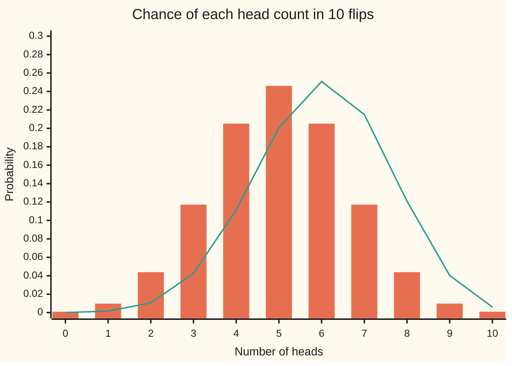

# Binomial: the number of successes in n independent tries

Probability and statistics → Discrete Distributions → Counting successes → Binomial

---

## General Overview

Flip a fair coin ten times and count the heads. What is the chance of exactly 7?

Each run writes a string such as HHTHHTHHTH. There are 1,024 such strings, all equally likely, and 120 of them hold 7 heads. So the chance is 120 in 1,024, or 0.117188: about 12 runs in 100. Seven or more heads fills 176 strings, a chance of 0.171875, roughly 1 run in 6.

Nothing there needed more than counting. Bend the coin so it lands heads 60% of the time, and the 1,024 strings are no longer equally likely. Yet HHHHHHHTTT and TTTHHHHHHH hold the same seven heads and three tails, so they still carry the same chance. That survives any coin: every string with 7 heads has one shared chance. Count those strings and multiply.

Each flip is a **Bernoulli trial**: one try with two outcomes, called success and failure, where success has the same chance every time. Here a head is the success. The count of successes in a fixed number of independent Bernoulli trials has the **binomial law**, the name used from here on.

**Count the ways to place the successes among the tries, multiply by the chance of any one such placement, and the result is the binomial chance of that many successes; its long-run average is tries times chance, and its variance is that times the chance of failure.**

**What kind of fact this is:** a theorem, proved on this card in Why it works, about a model: whether real tries are independent with one shared chance is a question about the world, not about the algebra.

### The picture: ten flips, two coins



Bars: the fair coin, symmetric about 5 heads. Line: the coin that lands heads 60% of the time, shifted right and peaking at 6. At 7 heads the bar reads 0.1172 and the line 0.2150.

---

## The formula

Notation first, in words. A random variable is a quantity whose value depends on chance, written as a capital letter; here X is the number of heads, and $P(X = k)$ is read "the chance that X equals k". C(n, k) is the number of ways to choose k items from n, as in [binomial-theorem](../../04-Combinatorics%20and%20graphs/03-Binomial%20Coefficients%20and%20Identities/02-binomial-theorem.md). This card introduces one more piece: **X ~ Binomial(n, p)**, read "X follows the binomial law with n trials and chance p".

$$P(X = k) = C(n, k)\; p^k\,(1-p)^{n-k}, \qquad k = 0, 1, \dots, n$$

**Read it aloud:** the number of ways to choose which k of the n tries succeed, times the chance of k successes, times the chance of the other n minus k failing.

The long-run average and the spread follow:

$$E[X] = np, \qquad \mathrm{Var}(X) = np(1-p)$$

**Read it aloud:** on average, tries times chance succeed; the variance is that average times the chance of failure.

The tail, the chance of at least j successes, is a sum of masses:

$$P(X \ge j) = \sum_{k=j}^{n} C(n, k)\; p^k\,(1-p)^{n-k}$$

**Read it aloud:** add the chances of exactly j, exactly j plus one, and so on up to all n.

| Symbol | Plain meaning | In our example | Push it up and the answer… |
| --- | --- | --- | --- |
| $n$ | the number of tries, fixed in advance | 10 flips | more possible counts; each single count gets rarer |
| $k$ | one possible count of successes | 7 heads | chance rises toward the peak near np, then falls |
| $j$ | the threshold of a tail | 7: "7 or more" | the tail shrinks |
| $p$ | the chance of success on one try | 0.5 fair; 0.6 bent | the whole law slides right |
| $1-p$ | the chance of failure on one try | 0.5; 0.4 | the law slides left |
| $X$ | the number of successes, a random variable | heads in ten flips | — |
| $B_i$ | 1 if try number i succeeds, 0 if not | 1 when flip i is a head | — |
| $C(n, k)$ | ways to choose which k tries succeed | C(10, 7) = 120 | largest at k = n/2 |
| $P(X = k)$ | chance of exactly k successes | 0.117188 fair; 0.214991 bent | — |
| $P(X \ge j)$ | chance of at least j successes | 0.171875 fair; 0.382281 bent | — |
| $E[X]$ | the long-run average of X | 5 fair; 6 bent | rises with n and with p |
| $\mathrm{Var}(X)$ | the average squared distance of X from E[X] | 2.5 fair; 2.4 bent | rises with n; largest at p = 0.5 |

A single try, n = 1, is the **Bernoulli law**, Bernoulli(p): X is 1 with chance p and 0 with chance 1 − p. Each $B_i$ above is one. At p = 0 or p = 1 the formula still holds, reading $0^0$ as 1: all the chance sits at 0 or at n successes.

### When it holds

- **A fixed number of tries.** Flipping until the third head makes n itself random; that count is the [geometric-and-negative-binomial](02-geometric-and-negative-binomial.md) law.
- **Two outcomes per try.** Three or more outcomes per try, such as a die read as 1, 2 or other, need the [multinomial](05-multinomial.md) law.
- **One shared chance p.** If the chance changes from try to try, strings with the same head count stop carrying one shared chance, and Step 0 below fails.
- **Independent tries.** One flip copied onto all ten keeps each flip fair but makes 7 heads impossible and raises the variance from 2.5 to 25. Drawing cards without putting them back is the milder version: the [hypergeometric](03-hypergeometric.md) law.

---

## Why it works

### Step 0: strings with the same count share one chance

The event "exactly 7 heads" is a pile of strings: HHHHHHHTTT, HHHHHHTHTT, and so on. The strings never overlap, so the pile's chance is the sum of their chances. If they all share one chance, the sum is that chance times the pile's size. The proof finds those two numbers.

### Step 1: the chance of one string is a product

Independence means the chance of several tries turning out a given way is the product of their separate chances. HHHHHHHTTT has seven factors of p and three of 1 − p. Reordering the letters reorders the factors, and multiplication does not care about order. So every string with k heads has chance

$$p^k (1-p)^{n-k}.$$

For the fair coin that is 0.5 to the tenth power, 1/1,024 = 0.0009765625, the same for all 1,024 strings. For the bent coin, a string with 7 heads has chance 0.6 to the seventh times 0.4 cubed: 0.0017915904.

### Step 2: the pile's size is C(n, k)

A string with k heads is fixed by saying which k of the n positions hold the heads. So the strings in the pile match the ways of choosing k positions from n, one for one. That count is C(n, k). For 7 of 10 it is 120.

Multiplying Steps 1 and 2 gives the mass: $P(X = k) = C(n, k)\, p^k (1-p)^{n-k}$.

### Step 3: the chances add up to one

Sum the mass over every k from 0 to n. The binomial theorem, $(a + b)^n = \sum_k C(n, k) a^k b^{n-k}$, with a = p and b = 1 − p, turns the sum into $(p + 1 - p)^n = 1^n = 1$. The name of the law comes from this: its masses are the terms of a binomial expansion.

### Step 4: the average is np

Write X as a sum of switches: $X = B_1 + B_2 + \dots + B_n$, where $B_i$ is 1 if flip i is a head. One switch averages p, since it is 1 with chance p and 0 otherwise. The average of a sum is the sum of the averages. So $E[X] = np$: 5 heads for the fair coin, 6 for the bent one. This step never used independence; it holds for the copied coin too.

### Step 5: the variance is np(1 − p)

One switch has variance $E[B_i^2] - p^2$. A switch squared is itself, since 0 squared is 0 and 1 squared is 1, so the variance is $p - p^2 = p(1-p)$. For independent tries, variances add ([variance-and-standard-deviation](../02-Random%20Variables/03-variance-and-standard-deviation.md)), so $\mathrm{Var}(X) = np(1-p)$: 2.5 for the fair coin, 2.4 for the bent one.

This step does use independence. The copied coin has the same average, 5, but variance 25.

<details>
<summary>Detailed proof: the variance by counting pairs</summary>

Expand the square of the sum: $X^2 = \sum_i B_i^2 + \sum_{i \ne l} B_i B_l$, the second sum over ordered pairs of different tries, n(n − 1) of them.

Each $B_i^2 = B_i$ averages p. Each product $B_i B_l$ is 1 exactly when both tries succeed; independence gives that chance as $p^2$. So
$$E[X^2] = np + n(n-1)p^2.$$
Subtract the squared average $(np)^2$: $np + n^2p^2 - np^2 - n^2p^2 = np - np^2 = np(1-p)$.

Only pairs were used, so pairwise independence is enough for the variance. The mass in Step 1 needs every try independent of all the others at once.

For the copied coin every product $B_i B_l$ equals the first flip's switch and averages p, not $p^2$. Then $E[X^2] = np + n(n-1)p = n^2 p$, and the variance is $n^2p - n^2p^2 = n^2 p(1-p)$: 25 for ten fair flips.

</details>

<details>
<summary>The average straight from the mass, a second road</summary>

The identity $k\,C(n, k) = n\,C(n-1, k-1)$ says: choosing a team of k from n and then a captain from the team is the same as choosing the captain from n first, then the other k − 1 from the remaining n − 1. Put it in the average: $\sum_k k\,C(n,k)p^k(1-p)^{n-k} = np \sum_k C(n-1,k-1)p^{k-1}(1-p)^{n-k}$. The last sum is the whole Binomial(n − 1, p) law, which adds to 1. So the average is np again.

</details>

### Step 6: a tail is a sum, and there is no shortcut

The chance of at least 7 heads is the four masses at 7, 8, 9 and 10 added. The binomial tail has no short closed formula. For a thousand tries, adding hundreds of terms still works on a computer, and the [normal-approximation-to-binomial](../06-Limit%20Theorems%20in%20Practice/03-normal-approximation-to-binomial.md) gives a quick estimate with its error stated.

A second road reaches the whole law without C(n, k): add one flip at a time. After one more flip, k heads can come from k − 1 heads and a head, or from k heads and a tail, so the new chance is p times the old chance at k − 1 plus (1 − p) times the old chance at k. That is Pascal's rule with weights. The code runs it as its third road; adding counts in general is [sums-of-discrete-variables](06-sums-of-discrete-variables.md).

---

## Worked numbers, by hand

Ten flips of the fair coin, then the coin that lands heads 60% of the time.

| Step | Arithmetic | Value |
| --- | --- | --- |
| strings of ten flips | 2 to the tenth | 1,024 |
| chance of one string, fair coin | 1/1,024 | 0.0009765625 |
| strings with exactly 7 heads | C(10, 7) = (10 × 9 × 8)/(3 × 2 × 1) | 120 |
| **P(X = 7), fair** | 120/1,024 | **0.117188** |
| strings with 7 or more heads | 120 + 45 + 10 + 1 | 176 |
| **P(X ≥ 7), fair** | 176/1,024 | **0.171875** |
| average and variance, fair | 10 × 0.5; 10 × 0.5 × 0.5 | 5; 2.5 |
| one 7-head string, bent coin | 0.6 to the 7th × 0.4 cubed | 0.0017915904 |
| **P(X = 7), bent** | 120 × 0.0017915904 | **0.214991** |
| P(X ≥ 7), bent | four masses added | 0.382281 |
| average and variance, bent | 10 × 0.6; 10 × 0.6 × 0.4 | 6; 2.4 |

A fair coin gives exactly 7 heads in about 12 runs of 100 and 7 or more in about 1 run in 6. At 60% heads, exactly 7 comes about 1 run in 5, and 7 or more a little under 2 runs in 5.

### What breaks if you drop a piece

| Mistake | Comes out at | What went wrong |
| --- | --- | --- |
| Leave out C(10, 7) | 0.000977 | One string counted instead of 120 |
| Every count 0 to 10 equally likely | 0.090909 | Middle counts are made of more strings: 252 for 5 heads, 1 for 10 |
| "7 or more" summed from 8 | 0.054688 | The mass at 7 itself, 0.117188, was dropped |
| One flip copied onto all ten | P(X = 7) = 0, P(X ≥ 7) = 0.5, variance 25 | Independence dropped: each flip is still fair, but only 0 or 10 heads can occur |

The code prints all four.

---

## Code, from first principles, and it actually runs

Only a square root is imported. The chance of 7 heads, and of 7 or more, is reached by four roads: the formula; weighing all 1,024 head-tail strings one by one and filing each under its head count; adding one flip at a time by Pascal's rule, which never mentions C(n, k); and a seeded simulation of 100,000 runs of ten flips, with SplitMix64 (a small, fully written-out random number generator, seed 20260928) so that Python and Rust draw the same numbers. The average and variance are reached three ways: the formulas np and np(1 − p), sums over the law, and the simulation. Every simulated number is printed with its standard error.

### Python

```python
# Binomial: the number of successes in n independent tries -- the check behind
# the card.  Only math.sqrt is imported.  Ten coin flips: the fair coin
# (p = 0.5) and a bent coin that lands heads 60% of the time (p = 0.6).
# Four roads: the formula, weighing all 1024 head-tail strings, adding one
# flip at a time (Pascal's rule), and a seeded simulation (SplitMix64).
from math import sqrt
N, M64 = 10, 2**64 - 1

def choose(n, k):                        # C(n, k) by the multiplicative rule
    c = 1
    for j in range(1, k + 1):
        c = c * (n + 1 - j) // j
    return c

def formula(n, p):                       # road 1: C(n, k) p^k (1 - p)^(n - k)
    return [choose(n, k) * p**k * (1 - p)**(n - k) for k in range(n + 1)]

def strings(n, p):                       # road 2: weigh every string, file it by its heads
    law, count = [0.0] * (n + 1), [0] * (n + 1)
    for s in range(2**n):
        w, heads = 1.0, 0
        for i in range(n):
            if s >> i & 1:
                w, heads = w * p, heads + 1
            else:
                w = w * (1 - p)
        law[heads] += w
        count[heads] += 1
    return law, count

def one_flip_at_a_time(n, p):            # road 3: new[k] = p old[k-1] + (1-p) old[k]
    law = [1.0]
    for _ in range(n):
        old = [0.0] + law + [0.0]
        law = [p * old[k] + (1 - p) * old[k + 1] for k in range(len(law) + 1)]
    return law

state = 20260928                         # road 4: SplitMix64 with a stated seed
def uniform():
    global state
    state = (state + 0x9E3779B97F4A7C15) & M64
    z = state
    z = ((z ^ (z >> 30)) * 0xBF58476D1CE4E5B9) & M64
    z = ((z ^ (z >> 27)) * 0x94D049BB133111EB) & M64
    return ((z ^ (z >> 31)) >> 11) / 2.0**53

def simulate(p, runs):                   # runs of ten flips; tally the heads
    tally = [0] * (N + 1)
    for _ in range(runs):
        tally[sum(1 for _ in range(N) if uniform() < p)] += 1
    return tally

def moments(law):
    mean = sum(k * w for k, w in enumerate(law))
    return mean, sum(k * k * w for k, w in enumerate(law)) - mean * mean

def row(label, v, d=6):
    print(f"{label:<44}{v:>12.{d}f}")

RUNS = 100000
count = strings(N, 0.5)[1]               # the tally of strings does not depend on p
print("strings with k = 0..10 heads  " + " ".join(str(c) for c in count))
print(f"{'strings with exactly 7 heads, of 1024':<44}{count[7]:>12d}")
print(f"{'strings with 7 or more heads':<44}{sum(count[7:]):>12d}")
res = {}
for name, p in (("fair", 0.5), ("bent", 0.6)):
    f1, f2, f3 = formula(N, p), strings(N, p)[0], one_flip_at_a_time(N, p)
    tally = simulate(p, RUNS)
    mean, var = moments(f3)
    s7, s_tail = tally[7] / RUNS, sum(tally[7:]) / RUNS
    s_mean = sum(k * t for k, t in enumerate(tally)) / RUNS
    s_var = sum(k * k * t for k, t in enumerate(tally)) / RUNS - s_mean**2
    print(f"--- {name} coin, p = {p}")
    row("one string with 7 heads, p^7 (1-p)^3", p**7 * (1 - p)**3, 10)
    row("P(X = 7)  1 formula", f1[7])
    row("P(X = 7)  2 all strings", f2[7])
    row("P(X = 7)  3 one flip at a time", f3[7])
    row(f"P(X = 7)  4 simulated, {RUNS} runs", s7)
    row("          standard error", sqrt(s7 * (1 - s7) / RUNS))
    row("P(X >= 7) 1 formula", sum(f1[7:]))
    row("P(X >= 7) 3 one flip at a time", sum(f3[7:]))
    row("P(X >= 7) 4 simulated", s_tail)
    row("          standard error", sqrt(s_tail * (1 - s_tail) / RUNS))
    row("mean: n p", N * p)
    row("mean: sum of k P(X = k)", mean)
    row("mean: simulated", s_mean)
    row("          standard error", sqrt(s_var / RUNS))
    row("variance: n p (1 - p)", N * p * (1 - p))
    row("variance: sum of k^2 P(X = k) - mean^2", var)
    row("variance: simulated", s_var)
    print("chart, " + name + "  " + " ".join(f"{w:.4f}" for w in f1))
    res[name] = (p, f1, f2, f3, s7, s_tail, mean, var)

print("--- what breaks, fair coin")
row("no C(10,7): one string only", 0.5**10)
row("every count equally likely, 1/11", 1 / 11)
row("tail without 7 itself, P(X > 7)", sum(formula(N, 0.5)[8:]))
copy = [0.5] + [0.0] * 9 + [0.5]        # one flip copied ten times: all heads or none
row("one flip copied ten times: P(X = 7)", copy[7])
row("one flip copied ten times: P(X >= 7)", sum(copy[7:]))
row("one flip copied ten times: variance", moments(copy)[1])
print("--- try changing")
row("try: 20 fair flips, exactly 14 heads", formula(20, 0.5)[14])
row("try: p = 0.4, exactly 3 heads", formula(N, 0.4)[3])
row("try: 100 fair flips, 60 or more heads", sum(one_flip_at_a_time(100, 0.5)[60:]))
row("try: p = 0.7, variance", moments(one_flip_at_a_time(N, 0.7))[1])

for name, (p, f1, f2, f3, s7, s_tail, mean, var) in res.items():
    assert all(abs(a - b) < 1e-12 and abs(a - c) < 1e-12 for a, b, c in zip(f1, f2, f3)), "three exact roads"
    assert abs(mean - N * p) < 1e-12 and abs(var - N * p * (1 - p)) < 1e-12, "moments from the law vs np, np(1-p)"
    se7, se_t = sqrt(f1[7] * (1 - f1[7]) / RUNS), sqrt(sum(f1[7:]) * (1 - sum(f1[7:])) / RUNS)
    assert abs(s7 - f1[7]) < 4 * se7 and abs(s_tail - sum(f1[7:])) < 4 * se_t, "simulation within 4 SE"
assert count[7] == choose(N, 7) and sum(count[7:]) == 176, "strings counted one by one vs C(10, k)"
assert abs(moments(copy)[1] - 25.0) < 1e-12, "copied flip: variance n^2 p (1-p), not n p (1-p)"
print("ALL CHECKS PASS")
```

**Ran 2026-09-28 on macOS, Python 3.14.6, standard library only. All checks passed. Output, pasted from the run:**

```
strings with k = 0..10 heads  1 10 45 120 210 252 210 120 45 10 1
strings with exactly 7 heads, of 1024                120
strings with 7 or more heads                         176
--- fair coin, p = 0.5
one string with 7 heads, p^7 (1-p)^3        0.0009765625
P(X = 7)  1 formula                             0.117188
P(X = 7)  2 all strings                         0.117188
P(X = 7)  3 one flip at a time                  0.117188
P(X = 7)  4 simulated, 100000 runs              0.118140
          standard error                        0.001021
P(X >= 7) 1 formula                             0.171875
P(X >= 7) 3 one flip at a time                  0.171875
P(X >= 7) 4 simulated                           0.172850
          standard error                        0.001196
mean: n p                                       5.000000
mean: sum of k P(X = k)                         5.000000
mean: simulated                                 4.998750
          standard error                        0.005010
variance: n p (1 - p)                           2.500000
variance: sum of k^2 P(X = k) - mean^2          2.500000
variance: simulated                             2.510268
chart, fair  0.0010 0.0098 0.0439 0.1172 0.2051 0.2461 0.2051 0.1172 0.0439 0.0098 0.0010
--- bent coin, p = 0.6
one string with 7 heads, p^7 (1-p)^3        0.0017915904
P(X = 7)  1 formula                             0.214991
P(X = 7)  2 all strings                         0.214991
P(X = 7)  3 one flip at a time                  0.214991
P(X = 7)  4 simulated, 100000 runs              0.216330
          standard error                        0.001302
P(X >= 7) 1 formula                             0.382281
P(X >= 7) 3 one flip at a time                  0.382281
P(X >= 7) 4 simulated                           0.384410
          standard error                        0.001538
mean: n p                                       6.000000
mean: sum of k P(X = k)                         6.000000
mean: simulated                                 6.009130
          standard error                        0.004908
variance: n p (1 - p)                           2.400000
variance: sum of k^2 P(X = k) - mean^2          2.400000
variance: simulated                             2.408467
chart, bent  0.0001 0.0016 0.0106 0.0425 0.1115 0.2007 0.2508 0.2150 0.1209 0.0403 0.0060
--- what breaks, fair coin
no C(10,7): one string only                     0.000977
every count equally likely, 1/11                0.090909
tail without 7 itself, P(X > 7)                 0.054688
one flip copied ten times: P(X = 7)             0.000000
one flip copied ten times: P(X >= 7)            0.500000
one flip copied ten times: variance            25.000000
--- try changing
try: 20 fair flips, exactly 14 heads            0.036964
try: p = 0.4, exactly 3 heads                   0.214991
try: 100 fair flips, 60 or more heads           0.028444
try: p = 0.7, variance                          2.100000
ALL CHECKS PASS
```

### Rust

```rust
// Binomial: the number of successes in n independent tries -- the check behind
// the card.  Rust std only.  Ten coin flips: the fair coin (p = 0.5) and a
// bent coin that lands heads 60% of the time (p = 0.6).  Four roads: the
// formula, weighing all 1024 head-tail strings, adding one flip at a time
// (Pascal's rule), and a seeded simulation (SplitMix64).
const N: usize = 10;
const RUNS: usize = 100000;

fn choose(n: u64, k: u64) -> u64 {           // C(n, k) by the multiplicative rule
    let mut c = 1;
    for j in 1..=k { c = c * (n + 1 - j) / j; }
    c
}

fn formula(n: usize, p: f64) -> Vec<f64> {   // road 1: C(n, k) p^k (1 - p)^(n - k)
    (0..=n).map(|k| choose(n as u64, k as u64) as f64 * p.powi(k as i32) * (1.0 - p).powi((n - k) as i32)).collect()
}

fn strings(n: usize, p: f64) -> (Vec<f64>, Vec<u64>) {   // road 2: weigh every string
    let (mut law, mut count) = (vec![0.0; n + 1], vec![0u64; n + 1]);
    for s in 0..(1u32 << n) {
        let (mut w, mut heads) = (1.0, 0);
        for i in 0..n {
            if s >> i & 1 == 1 { w *= p; heads += 1; } else { w *= 1.0 - p; }
        }
        law[heads] += w;
        count[heads] += 1;
    }
    (law, count)
}

fn one_flip_at_a_time(n: usize, p: f64) -> Vec<f64> {   // road 3: new[k] = p old[k-1] + (1-p) old[k]
    let mut law = vec![1.0];
    for _ in 0..n {
        let mut old = vec![0.0];
        old.extend(&law);
        old.push(0.0);
        law = (0..=law.len()).map(|k| p * old[k] + (1.0 - p) * old[k + 1]).collect();
    }
    law
}

struct SplitMix64 { state: u64 }            // road 4: SplitMix64 with a stated seed
impl SplitMix64 {
    fn uniform(&mut self) -> f64 {
        self.state = self.state.wrapping_add(0x9E3779B97F4A7C15);
        let mut z = self.state;
        z = (z ^ (z >> 30)).wrapping_mul(0xBF58476D1CE4E5B9);
        z = (z ^ (z >> 27)).wrapping_mul(0x94D049BB133111EB);
        ((z ^ (z >> 31)) >> 11) as f64 / 9007199254740992.0
    }
}

fn simulate(rng: &mut SplitMix64, p: f64, runs: usize) -> Vec<usize> {   // tally heads per run
    let mut tally = vec![0usize; N + 1];
    for _ in 0..runs {
        let heads = (0..N).filter(|_| rng.uniform() < p).count();
        tally[heads] += 1;
    }
    tally
}

fn moments(law: &[f64]) -> (f64, f64) {
    let mean: f64 = law.iter().enumerate().map(|(k, w)| k as f64 * w).sum();
    let second: f64 = law.iter().enumerate().map(|(k, w)| (k * k) as f64 * w).sum();
    (mean, second - mean * mean)
}

fn row(label: &str, v: f64) { rowd(label, v, 6); }
fn rowd(label: &str, v: f64, d: usize) { println!("{:<44}{:>12.*}", label, d, v); }
fn tail(law: &[f64], from: usize) -> f64 { law[from..].iter().sum() }

fn main() {
    let mut rng = SplitMix64 { state: 20260928 };
    let count = strings(N, 0.5).1;               // the tally of strings does not depend on p
    let cs: Vec<String> = count.iter().map(|c| c.to_string()).collect();
    println!("strings with k = 0..10 heads  {}", cs.join(" "));
    println!("{:<44}{:>12}", "strings with exactly 7 heads, of 1024", count[7]);
    println!("{:<44}{:>12}", "strings with 7 or more heads", count[7..].iter().sum::<u64>());
    let mut res = Vec::new();
    for (name, p) in [("fair", 0.5), ("bent", 0.6)] {
        let (f1, f2, f3) = (formula(N, p), strings(N, p).0, one_flip_at_a_time(N, p));
        let tally = simulate(&mut rng, p, RUNS);
        let (mean, var) = moments(&f3);
        let r = RUNS as f64;
        let (s7, s_tail) = (tally[7] as f64 / r, tally[7..].iter().sum::<usize>() as f64 / r);
        let s_mean = tally.iter().enumerate().map(|(k, t)| (k * t) as f64).sum::<f64>() / r;
        let s_var = tally.iter().enumerate().map(|(k, t)| (k * k * t) as f64).sum::<f64>() / r - s_mean * s_mean;
        println!("--- {} coin, p = {}", name, p);
        rowd("one string with 7 heads, p^7 (1-p)^3", p.powi(7) * (1.0 - p).powi(3), 10);
        row("P(X = 7)  1 formula", f1[7]);
        row("P(X = 7)  2 all strings", f2[7]);
        row("P(X = 7)  3 one flip at a time", f3[7]);
        row(&format!("P(X = 7)  4 simulated, {} runs", RUNS), s7);
        row("          standard error", (s7 * (1.0 - s7) / r).sqrt());
        row("P(X >= 7) 1 formula", tail(&f1, 7));
        row("P(X >= 7) 3 one flip at a time", tail(&f3, 7));
        row("P(X >= 7) 4 simulated", s_tail);
        row("          standard error", (s_tail * (1.0 - s_tail) / r).sqrt());
        row("mean: n p", N as f64 * p);
        row("mean: sum of k P(X = k)", mean);
        row("mean: simulated", s_mean);
        row("          standard error", (s_var / r).sqrt());
        row("variance: n p (1 - p)", N as f64 * p * (1.0 - p));
        row("variance: sum of k^2 P(X = k) - mean^2", var);
        row("variance: simulated", s_var);
        let pts: Vec<String> = f1.iter().map(|w| format!("{:.4}", w)).collect();
        println!("chart, {}  {}", name, pts.join(" "));
        res.push((p, f1, f2, f3, s7, s_tail, mean, var));
    }
    println!("--- what breaks, fair coin");
    row("no C(10,7): one string only", 0.5f64.powi(10));
    row("every count equally likely, 1/11", 1.0 / 11.0);
    row("tail without 7 itself, P(X > 7)", tail(&formula(N, 0.5), 8));
    let mut copy = vec![0.0; N + 1];             // one flip copied ten times: all heads or none
    copy[0] = 0.5;
    copy[N] = 0.5;
    row("one flip copied ten times: P(X = 7)", copy[7]);
    row("one flip copied ten times: P(X >= 7)", tail(&copy, 7));
    row("one flip copied ten times: variance", moments(&copy).1);
    println!("--- try changing");
    row("try: 20 fair flips, exactly 14 heads", formula(20, 0.5)[14]);
    row("try: p = 0.4, exactly 3 heads", formula(N, 0.4)[3]);
    row("try: 100 fair flips, 60 or more heads", tail(&one_flip_at_a_time(100, 0.5), 60));
    row("try: p = 0.7, variance", moments(&one_flip_at_a_time(N, 0.7)).1);

    for (p, f1, f2, f3, s7, s_tail, mean, var) in &res {
        for k in 0..=N { assert!((f1[k] - f2[k]).abs() < 1e-12 && (f1[k] - f3[k]).abs() < 1e-12, "three exact roads"); }
        assert!((mean - N as f64 * p).abs() < 1e-12 && (var - N as f64 * p * (1.0 - p)).abs() < 1e-12, "moments vs np, np(1-p)");
        let (e7, et) = (f1[7], tail(f1, 7));
        let r = RUNS as f64;
        assert!((s7 - e7).abs() < 4.0 * (e7 * (1.0 - e7) / r).sqrt(), "simulation within 4 SE");
        assert!((s_tail - et).abs() < 4.0 * (et * (1.0 - et) / r).sqrt(), "simulation within 4 SE");
    }
    assert!(count[7] == choose(N as u64, 7) && count[7..].iter().sum::<u64>() == 176, "strings vs C(10, k)");
    assert!((moments(&copy).1 - 25.0).abs() < 1e-12, "copied flip: variance n^2 p (1-p)");
    println!("ALL CHECKS PASS");
}
```

**Ran 2026-09-28 on macOS, rustc 1.98.1, no crates. All checks passed. Output, pasted from the run:**

```
strings with k = 0..10 heads  1 10 45 120 210 252 210 120 45 10 1
strings with exactly 7 heads, of 1024                120
strings with 7 or more heads                         176
--- fair coin, p = 0.5
one string with 7 heads, p^7 (1-p)^3        0.0009765625
P(X = 7)  1 formula                             0.117188
P(X = 7)  2 all strings                         0.117188
P(X = 7)  3 one flip at a time                  0.117188
P(X = 7)  4 simulated, 100000 runs              0.118140
          standard error                        0.001021
P(X >= 7) 1 formula                             0.171875
P(X >= 7) 3 one flip at a time                  0.171875
P(X >= 7) 4 simulated                           0.172850
          standard error                        0.001196
mean: n p                                       5.000000
mean: sum of k P(X = k)                         5.000000
mean: simulated                                 4.998750
          standard error                        0.005010
variance: n p (1 - p)                           2.500000
variance: sum of k^2 P(X = k) - mean^2          2.500000
variance: simulated                             2.510268
chart, fair  0.0010 0.0098 0.0439 0.1172 0.2051 0.2461 0.2051 0.1172 0.0439 0.0098 0.0010
--- bent coin, p = 0.6
one string with 7 heads, p^7 (1-p)^3        0.0017915904
P(X = 7)  1 formula                             0.214991
P(X = 7)  2 all strings                         0.214991
P(X = 7)  3 one flip at a time                  0.214991
P(X = 7)  4 simulated, 100000 runs              0.216330
          standard error                        0.001302
P(X >= 7) 1 formula                             0.382281
P(X >= 7) 3 one flip at a time                  0.382281
P(X >= 7) 4 simulated                           0.384410
          standard error                        0.001538
mean: n p                                       6.000000
mean: sum of k P(X = k)                         6.000000
mean: simulated                                 6.009130
          standard error                        0.004908
variance: n p (1 - p)                           2.400000
variance: sum of k^2 P(X = k) - mean^2          2.400000
variance: simulated                             2.408467
chart, bent  0.0001 0.0016 0.0106 0.0425 0.1115 0.2007 0.2508 0.2150 0.1209 0.0403 0.0060
--- what breaks, fair coin
no C(10,7): one string only                     0.000977
every count equally likely, 1/11                0.090909
tail without 7 itself, P(X > 7)                 0.054688
one flip copied ten times: P(X = 7)             0.000000
one flip copied ten times: P(X >= 7)            0.500000
one flip copied ten times: variance            25.000000
--- try changing
try: 20 fair flips, exactly 14 heads            0.036964
try: p = 0.4, exactly 3 heads                   0.214991
try: 100 fair flips, 60 or more heads           0.028444
try: p = 0.7, variance                          2.100000
ALL CHECKS PASS
```

The two outputs are identical. The simulated chance of exactly 7 fair heads, 0.118140 with standard error 0.001021, sits under one standard error from the exact 0.117188; the bent coin's simulated average, 6.009130 with standard error 0.004908, sits under two from 6.

> [!TIP]
> **Try changing**
> - **Twenty fair flips, exactly 14 heads.** The same 70% share of heads as 7 of 10. Guess first: the same chance? Change the row to `formula(20, 0.5)[14]`. It is 0.036964, under a third of 0.117188. The same share becomes rarer as the tries grow, because the spread grows like the square root of n while the gap between 70% and 50% grows like n.
> - **A coin landing heads 40% of the time, exactly 3 heads.** Guess first. It is 0.214991, the bent coin's chance of 7 heads: swap the names of head and tail and p becomes 1 − p, k becomes n − k.
> - **A hundred fair flips, 60 or more heads.** The same 60% share as 6 of 10. Guess first. It is 0.028444, against 0.171875 for 7 or more of 10.
> - **A coin landing heads 70% of the time.** Guess first whether the variance rises above 2.5. It is 2.100000: p(1 − p) peaks at p = 0.5, so a lopsided coin gives less spread.

---

## The usual mistake

> [!warning]
> **Calling any count of yes-no outcomes binomial.** The formula needs a fixed number of tries, one shared chance, and independence. Ten loans from one town default together in a bad year; ten cards dealt from one deck change the odds as they go. Each outcome is still yes or no, but the count follows another law. Copy one flip onto ten and the chance of 7 heads falls from 0.117188 to 0, and the variance rises from 2.5 to 25.
>
> - **Forgetting the count of strings.** Using $p^k(1-p)^{n-k}$ alone gives 0.000977 for 7 fair heads, 120 times too small.
> - **"At least" read as "more than".** Starting the tail at 8 gives 0.054688 instead of 0.171875.
> - **Variance np.** That is the average, 5, not the variance, 2.5; the factor 1 − p is the part that shrinks the spread as p nears 0 or 1.

---

## Where you meet it in real life

- **Quality checks.** A factory tests n parts from a large batch; the count of failures is Binomial(n, p) while parts fail independently, and a count far in the tail flags the batch.
- **Drug trials and polls.** The count of patients who respond, or of voters who say yes, is binomial when each is drawn independently from a large population; estimating p comes later in this wing.
- **Risk models checked against days.** A bank's Value at Risk at the 1% level should be broken on about one trading day in a hundred; if the model is right, the count of breaks over a year is binomial, the test in [backtesting-var](../../12-Financial%20mathematics/39-Value%20at%20Risk%20and%20Expected%20Shortfall/08-backtesting-var.md).
- **Loan defaults.** Counting defaults in a pool as binomial assumes independence, which fails exactly when it matters: [default-correlation-and-joint-default](../../12-Financial%20mathematics/45-Portfolio%20Credit%20-%20Correlation%2C%20Copulas%2C%20Indices%20and%20Tranches/01-default-correlation-and-joint-default.md).
- **Rare events.** Many tries with a small chance each, such as emails arriving at a help desk, one tiny slice of time per try, turn the binomial into the [poisson](04-poisson.md) law.

> **Say it back**
> A binomial count is the number of successes in a fixed number of independent tries sharing one chance of success. Every string with k successes has the same chance, and there are C(n, k) such strings; their product is the chance of exactly k. The average is np because each try adds p on average, and the variance is np(1 − p) because independent spreads add. A tail is the masses added. Ten fair flips give exactly 7 heads with chance 0.117188, and 7 or more with chance 0.171875.

---

## What this builds on

- [equally-likely-outcomes-and-counting](../01-Chance%20and%20Events/04-equally-likely-outcomes-and-counting.md): the fair-coin answer as favourable strings over all strings.
- [variance-and-standard-deviation](../02-Random%20Variables/03-variance-and-standard-deviation.md): variance, and why independent variances add.
- [binomial-theorem](../../04-Combinatorics%20and%20graphs/03-Binomial%20Coefficients%20and%20Identities/02-binomial-theorem.md): C(n, k), and the expansion that makes the masses add to one.

## Where this goes next

- [geometric-and-negative-binomial](02-geometric-and-negative-binomial.md): fix the successes and count the tries instead.
- [hypergeometric](03-hypergeometric.md): draws without replacement, where the tries are not independent.
- [poisson](04-poisson.md): many tries, tiny chance each, and the limit law.
- [multinomial](05-multinomial.md): more than two outcomes per try.
- [normal-approximation-to-binomial](../06-Limit%20Theorems%20in%20Practice/03-normal-approximation-to-binomial.md): the bell curve that approximates a long tail sum.
- [simple-random-walk](../../11-Stochastic%20processes%20and%20calculus/01-Random%20Walks%20and%20Filtrations/02-simple-random-walk.md): heads minus tails, followed flip by flip.
- [backtesting-var](../../12-Financial%20mathematics/39-Value%20at%20Risk%20and%20Expected%20Shortfall/08-backtesting-var.md): a binomial count of broken days as a test of a risk model.
- [default-correlation-and-joint-default](../../12-Financial%20mathematics/45-Portfolio%20Credit%20-%20Correlation%2C%20Copulas%2C%20Indices%20and%20Tranches/01-default-correlation-and-joint-default.md): counts of defaults when independence fails.

The binomial law fixes the number of tries and asks how many succeed; the geometric law asks the reverse question, how many tries until the first success, and gets a law with no upper limit.

---

## Sources

Verified 2026-09-28: every link below opens a page naming the cited work.

- Siegrist, Kyle. "The Binomial Distribution." *Probability, Mathematical Statistics, and Stochastic Processes*, University of Alabama in Huntsville. [Page](https://www.randomservices.org/random/bernoulli/Binomial.html). The mass, the moments by indicators, and simulations of the law.
- Grinstead, Charles M., and J. Laurie Snell. *Introduction to Probability*, 2nd revised ed. American Mathematical Society, 1997; free edition from Dartmouth. [Full text](https://math.dartmouth.edu/~prob/prob/prob.pdf). Bernoulli trials and the binomial law in section 3.2, with the variance by indicators in chapter 6.
- Blitzstein, Joseph K., and Jessica Hwang. *Introduction to Probability*, 2nd ed. CRC Press, 2019. [Publisher page](https://www.routledge.com/Introduction-to-Probability-Second-Edition/Blitzstein-Hwang/p/book/9781138369917). The story proof of the mass and the indicator proof of np.
- Feller, William. *An Introduction to Probability Theory and Its Applications*, Vol. 1, 3rd ed. Wiley, 1968. [Publisher page](https://www.wiley.com/en-us/An+Introduction+to+Probability+Theory+and+Its+Applications%2C+Volume+1%2C+3rd+Edition-p-9780471257080). Chapter 6 on Bernoulli trials and the binomial tail.
- O'Connor, J. J., and E. F. Robertson. "Jacob Bernoulli." MacTutor Archive, University of St Andrews. [Biography](https://mathshistory.st-andrews.ac.uk/Biographies/Bernoulli_Jacob/). Dates *Ars Conjectandi*, published in Basel in 1713, Bernoulli's book on repeated trials and their long-run frequencies.
