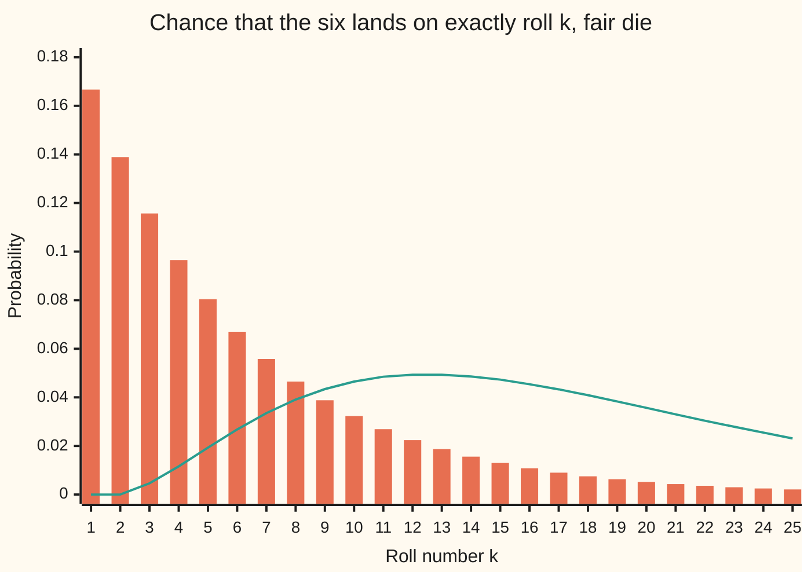
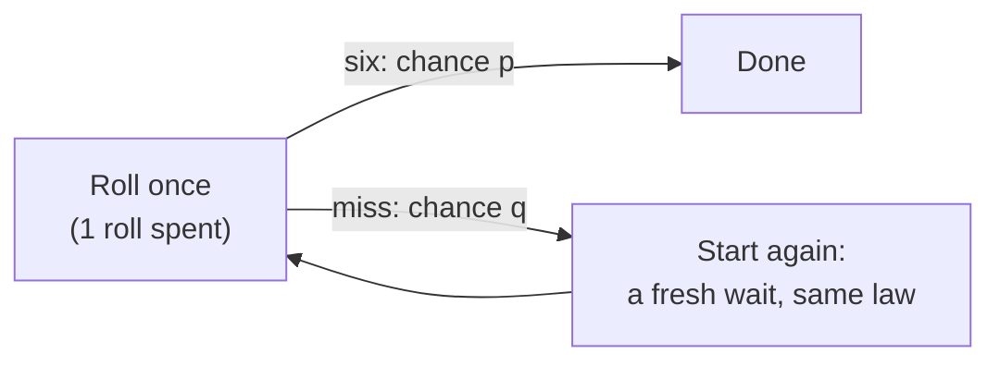

# Waiting for a success: how many tries until the first, and until the r-th

Probability and statistics → Discrete Distributions → Waiting times → Waiting for a success

---

## General Overview

A board game says: roll a fair die, and you may not leave the start square until you throw a six. How many rolls does that take?

The count is random, but its pattern is not. The first six lands on roll 1 with chance 0.166667, and on roll 5 with chance 0.080376: about 8 games in 100. The wait averages exactly 6 rolls, yet just over half of all waits are over by roll 4. A rule that asks for three sixes gives a wait averaging 18 rolls.

The rolls up to and including the first six follow the **geometric law**. The rolls up to and including the third six, or the r-th, follow the **negative binomial law**. Both come from two facts: the rolls do not influence each other, and every roll has the same chance.

The geometric wait also forgets. After ten misses, the wait still to come is as long, on average, as a wait from scratch. That is **memorylessness**, and among waits counted in whole tries only the geometric has it.

**Count the misses before each success; independent tries with a fixed chance make the first-success wait geometric, with mean one over the chance, and the r-th-success wait a sum of r such waits.**

**What kind of fact this is:** a theorem, proved on this card in Why it works, about a model: fair, independent rolls with the same chance each time.

### The picture: when the first six and the third six land



Bars: the first six (geometric); each bar is five sixths of the one before. Line: the third six (negative binomial); it cannot land before roll 3 and peaks at rolls 12 and 13. Both tails run past roll 25.

---

## The formula

Notation first, in words. $p$ is the chance of a six on one roll, here 1/6, and $q = 1 - p$ the chance of a miss. As on the [bernoulli-and-binomial](01-bernoulli-and-binomial.md) card, a capital letter is a random count and $P(X = k)$ is the chance it takes the value $k$. $P(A \mid B)$ is the chance of A given B. $E[X]$ is the average value of $X$ in the long run, and $\operatorname{Var}(X)$ its variance: the average squared distance from that mean. "$X \sim \text{Geometric}(p)$" is read "X follows the geometric law with chance p".

The first six. Let $X$ be the roll on which it lands.

$$P(X = k) = q^{\,k-1}\,p, \qquad k = 1, 2, 3, \dots$$

**Read it aloud:** the chance the first six comes on roll k is the chance of k − 1 misses in a row, times the chance of a six.

The tail, the mean and the variance:

$$P(X > k) = q^{\,k}, \qquad E[X] = \frac{1}{p}, \qquad \operatorname{Var}(X) = \frac{q}{p^2}.$$

Memorylessness, for any whole numbers $s, t \ge 0$ (with p below 1, so that s misses can happen):

$$P(X > s + t \mid X > s) = P(X > t).$$

**Read it aloud:** given s misses so far, the chance of t more misses is the same as if no roll had yet been made.

The r-th six. A rule may ask for $r$ sixes; let $T_r$ be the roll on which the r-th lands, so $T_1 = X$.

$$P(T_r = k) = \binom{k-1}{r-1}\,p^{\,r}\,q^{\,k-r}, \qquad k = r, r+1, \dots$$

$$E[T_r] = \frac{r}{p}, \qquad \operatorname{Var}(T_r) = \frac{r\,q}{p^2}.$$

**Read it aloud:** roll k must be a six, and the other r − 1 sixes can sit anywhere among the first k − 1 rolls.

| Symbol | Plain meaning | In our example | Push it up and the answer… |
| --- | --- | --- | --- |
| $p$ | chance of a success (a six) on one try | 1/6 = 0.166667 | waits shorten; mean 1/p falls |
| $q$ | chance of a miss, 1 − p | 5/6 = 0.833333 | waits lengthen; tails fatten |
| $X$ | rolls up to and including the first six | often 1 to 10; mean 6 | — |
| $k$ | one particular roll number | 5 | its chance shrinks by q per roll |
| $r$ | how many sixes the wait needs | 3 | mean r/p grows in step |
| $T_r$, $T_3$ | the roll on which the r-th six lands; $T_3$ for the third | mean 18 | — |
| $G_1$, $G_2$, $G_3$ | the gaps: rolls from one six to the next | each with mean 6 | — |
| $s$, $t$ | rolls already missed; further rolls asked about | 4 missed, 3 more | memoryless: s has no effect |
| $n$ | a fixed number of rolls | 12 or 18 | P(T_r > n) falls |
| $\binom{k-1}{r-1}$ | ways to place the earlier r − 1 sixes among k − 1 rolls | C(4, 2) = 6 | more placements, more chance |
| $E[X]$ | the long-run average wait | 6 rolls | — |
| $\operatorname{Var}(X)$ | variance: average squared distance from the mean | 30 (rolls squared) | wider spread of waits |

### When it holds

- **Independent tries.** Drop this and pattern chances no longer multiply: dealing six cards numbered 1 to 6 until the 6 appears takes 3.5 turns on average, not 6.
- **The same chance every try.** If p drifts (a machine wearing out), each roll needs its own chance and the q^(k−1) pattern breaks.
- **p above zero.** With p = 0 no six ever comes. With p = 1 the wait is exactly r tries.
- **Counting tries, not misses.** Counting only misses shifts the law down by r and the mean to r q/p.

---

## Why it works

### Step 0: every roll is a fresh start

A wait is a pattern: some misses, then a six. Independence says the chance of a pattern is the product of the chances of its rolls. And after any miss, the problem left over is the problem there at the start. Everything below uses one of those two facts.

### Step 1: the geometric mass, and why the wait ends

The first six lands on roll k exactly when rolls 1 to k − 1 miss and roll k hits. Multiply:

$$P(X = k) = \underbrace{q \times q \times \cdots \times q}_{k-1 \text{ misses}} \times p = q^{\,k-1} p.$$

These chances add up to 1. The sum $p(1 + q + q^2 + \cdots)$ is a geometric series with ratio q below 1, so it equals $p / (1 - q) = p / p = 1$. The law takes its name from that series. So the wait ends with probability 1, even though no fixed number of rolls guarantees a six.

### Step 2: the tail is one line

"No six yet after k rolls" means the first k rolls all missed. That is one pattern, with chance

$$P(X > k) = q^{\,k}.$$

No summing needed. For the die, $P(X > 3) = (5/6)^3 = 0.578704$.

### Step 3: the mean, by restarting

Roll once. With chance p the wait is over after 1 roll. With chance q it missed, one roll is spent, and a fresh wait of the same law begins.



Averaging over the two branches:

$$E[X] = 1 + q\,E[X] \quad\Longrightarrow\quad (1 - q)\,E[X] = 1 \quad\Longrightarrow\quad E[X] = \frac{1}{p}.$$

A second road: a wait of length X is "still waiting" after 0, 1, …, X − 1 rolls, X checkpoints in all, so $E[X] = \sum_{j \ge 0} P(X > j) = 1 + q + q^2 + \cdots = 1/p$. For the die, 6 rolls. Restarting on the square of X gives the variance $q/p^2 = 30$ (detailed proof below).

### Step 4: memorylessness

Given s misses, the chance of t more is a ratio of two tails from Step 2:

$$P(X > s + t \mid X > s) = \frac{q^{\,s+t}}{q^{\,s}} = q^{\,t} = P(X > t).$$

After four misses, the chance of three more is 0.578704, the same as from a standing start. Conversely, a wait in whole tries that forgets its past must be geometric (detailed proof below).

### Step 5: the negative binomial mass

The r-th six lands on roll k exactly when two things happen together. Roll k is a six. And the first k − 1 rolls hold exactly r − 1 sixes. The second event is a binomial count (the [bernoulli-and-binomial](01-bernoulli-and-binomial.md) card): its chance is $\binom{k-1}{r-1} p^{r-1} q^{k-r}$. The two involve different rolls, so they multiply:

$$P(T_r = k) = \binom{k-1}{r-1}\,p^{\,r-1} q^{\,k-r} \times p = \binom{k-1}{r-1}\,p^{\,r}\,q^{\,k-r}.$$

### Step 6: the r-th wait is r first waits laid end to end

Cut the wait for the third six at each six. $G_1$ rolls to the first six, then $G_2$ more to the second, then $G_3$ more to the third:

$$T_3 = G_1 + G_2 + G_3.$$

By Step 0, the rolls after a six start a fresh wait, so each gap is geometric with the same p, and the gaps are independent: each uses its own rolls. Averages add, so $E[T_3] = 3 \times 6 = 18$. For independent counts variances also add (the [sums-of-discrete-variables](06-sums-of-discrete-variables.md) card), so $\operatorname{Var}(T_3) = 3 \times 30 = 90$.

The negative binomial is not memoryless. After two rolls, both may already be sixes, and then one more six ends the wait. So $P(T_3 > 3 \mid T_3 > 2) = 1 - p^3 = 0.995370$, while from scratch $P(T_3 > 1) = 1$. The wait remembers progress.

### Step 7: the same event, counted two ways

The third six comes after roll n exactly when the first n rolls hold fewer than three sixes. So one tail can be read off the binomial:

$$P(T_3 > n) = \sum_{j=0}^{2} \binom{n}{j} p^{\,j} q^{\,n-j}.$$

For n = 18 both sides give 0.402654: the wait for the third six overshoots its own mean of 18 rolls about 40 times in 100.

<details>
<summary>Detailed proof</summary>

**The masses sum to 1 (negative binomial).** By Step 6, $T_r = G_1 + \cdots + G_r$ with each gap finite with probability 1 (Step 1), so $T_r$ is finite with probability 1 and its masses, which partition that event by the value of k, add to 1.

**The variance of X, by restarting.** Write $X = 1 + X'$ on a miss, where $X'$ is a fresh wait with the same law, and $X = 1$ on a six. Square and average:
$$E[X^2] = p \cdot 1 + q\,E[(1 + X')^2] = 1 + 2q\,E[X] + q\,E[X^2].$$
So $p\,E[X^2] = 1 + 2q/p$, which gives $E[X^2] = (p + 2q)/p^2 = (2 - p)/p^2$. Subtract the squared mean:
$$\operatorname{Var}(X) = \frac{2 - p}{p^2} - \frac{1}{p^2} = \frac{1 - p}{p^2} = \frac{q}{p^2}.$$
For p = 1/6: $(5/6) \times 36 = 30$. The restart step is legitimate because $E[X^2]$ is finite: $\sum k^2 q^{k-1}$ converges by the ratio test.

**Only the geometric forgets.** Let $S(k) = P(X > k)$ for a wait in whole tries, with $S(0) = 1$. Memorylessness with every s and t says $S(s + t) = S(s)\,S(t)$. Put $a = S(1)$. Then $S(2) = a^2$, $S(3) = a^3$, and by induction $S(k) = a^k$. So $P(X = k) = S(k-1) - S(k) = a^{k-1}(1 - a)$: geometric with chance $p = 1 - a$.

**Tail-sum formula.** For a count taking values 1, 2, …, $X = \sum_{j \ge 0} \mathbf{1}[X > j]$, where $\mathbf{1}[\cdot]$ is 1 when the bracket is true and 0 otherwise. The terms are never negative, so the average can be taken term by term: $E[X] = \sum_{j \ge 0} P(X > j)$.

</details>

When a wait can end at any instant, not only at whole tries, it becomes the exponential law, reached through the [poisson](04-poisson.md) card's arrivals.

---

## Worked numbers, by hand

The fair die: p = 1/6, q = 5/6.

| Step | Arithmetic | Value |
| --- | --- | --- |
| first six on roll 5 | (5/6)^4 × 1/6 = 625/7776 | 0.080376 |
| no six in the first 3 rolls | (5/6)^3 = 125/216 | 0.578704 |
| a six within 4 rolls | 1 − (5/6)^4 | 0.517747 |
| a six within 6 rolls | 1 − (5/6)^6 | 0.665102 |
| mean wait for the first six | 1 / (1/6) | 6 |
| its variance | (5/6) / (1/36) | 30 |
| its standard deviation | √30 | 5.477226 |
| third six on roll 5 | C(4, 2) × (1/6)^3 × (5/6)^2 = 6 × 25/7776 | 0.019290 |
| variance for the third six | 3 × 30 | 90 |
| standard deviation for the third six | √90 | 9.486833 |
| **mean wait for the third six** | 3 × 6 | **18** |

One six takes 6 rolls on average, give or take about 5.5; three take 18, give or take about 9.5. The mean triples, the standard deviation grows only by √3.

The shelf's house example runs the same way in time. A help desk gets 12 emails an hour on average. Model each of its 3,600 seconds as a try with chance 12/3600: the wait for the first email is geometric, with mean 300 seconds.

### What breaks if you drop a piece

| Mistake | Comes out at | What went wrong |
| --- | --- | --- |
| Count only the misses | mean 5 (right: 6) | The six is a roll too; misses-only has mean q/p. |
| Take the third-six wait as three times one wait | variance 270 (right: 90) | The gaps are independent, so variances add: 30 + 30 + 30. |
| Deal six cards numbered 1 to 6, turn until the 6 | mean 3.5; after five misses, next-card chance 1.000000 (not 0.166667) | No replacement: independence and memorylessness both fail. |
| Read the mean as the typical wait | "half need 6 rolls or more" | P(X ≤ 6) = 0.665102; half are done by roll 4. |

---

## Code, from first principles, and it actually runs

Five roads to the same numbers: the formula; a count over all 46,656 equally likely sequences of six rolls; the masses summed term by term out to roll 600; the binomial count of sixes; and a simulation of 200,000 first-six waits and 100,000 third-six waits from a SplitMix64 generator (seed 20260928) written out in both languages, so both draw identical rolls. Simulated numbers carry their standard errors, and the asserts allow four of them.

### Python

```python
# Geometric and negative binomial -- the check behind the card.  Standard library only.
# Rolling a fair die until the first six (X), and until the third six (T3).
# Roads: the formula; a count over all 6^6 sequences of six rolls; the masses summed
# term by term; the binomial count of sixes; a seeded simulation (SplitMix64).
from math import sqrt

p, q, M64 = 1.0 / 6.0, 5.0 / 6.0, (1 << 64) - 1

def pw(x, n):                        # x to the power n, by repeated multiplication
    out = 1.0
    for _ in range(n):
        out *= x
    return out
def comb(n, k):                      # C(n, k), exact in integers
    out = 1
    for j in range(1, k + 1):
        out = out * (n - k + j) // j
    return out
def geo(k):                          # P(X = k): k-1 misses, then a six
    return pw(q, k - 1) * p
def negbin(r, k):                    # P(T_r = k): r-1 sixes in the first k-1 rolls, then a six
    return comb(k - 1, r - 1) * pw(p, r) * pw(q, k - r) if k >= r else 0.0
def row(label, v): print(f"{label:<46}{v:>12.6f}")

# ---- road 1: the formula ----
for label, v in (("formula  P(X=1)", geo(1)), ("formula  P(X=5)", geo(5)),
                 ("formula  P(X>3)  no six in 3 rolls", pw(q, 3)),
                 ("formula  P(X<=4) a six within 4 rolls", 1.0 - pw(q, 4)),
                 ("formula  P(X<=6) a six within 6 rolls", 1.0 - pw(q, 6)),
                 ("formula  P(X>20) no six in 20 rolls", pw(q, 20)),
                 ("formula  E[X] = 1/p", 1.0 / p), ("formula  Var(X) = q/p^2", q / (p * p)),
                 ("formula  sd(X)", sqrt(q / (p * p))), ("formula  P(T3=5)", negbin(3, 5)),
                 ("formula  E[T3] = 3/p", 3.0 / p), ("formula  Var(T3) = 3q/p^2", 3.0 * q / (p * p)),
                 ("formula  sd(T3)", sqrt(3.0 * q / (p * p))),
                 ("formula  P(T3>3 | T3>2) = 1 - p^3", 1.0 - pw(p, 3))):
    row(label, v)

# ---- road 2: count every sequence of six rolls (6^6 = 46656, all equally likely) ----
first5 = third5 = none2 = none3 = none5 = 0
for code in range(6 ** 6):
    sixes, c = [], code
    for i in range(1, 7):
        if c % 6 == 5: sixes.append(i)
        c //= 6
    first = sixes[0] if sixes else 99
    first5 += first == 5
    third5 += len(sixes) >= 3 and sixes[2] == 5
    none2 += first > 2; none3 += first > 3; none5 += first > 5
print(f"{'count  of 46656 sequences, first six on roll 5':<46}{first5:>12d}")
print(f"{'count  of 46656 sequences, third six on roll 5':<46}{third5:>12d}")
row("count  P(X=5)", first5 / 46656)
row("count  P(T3=5)", third5 / 46656)
row("count  P(X>5 | X>2)", none5 / none2)
row("count  P(X>3)", none3 / 46656)

# ---- road 3: sum the masses term by term, out to roll 600 ----
tx = m1 = m2 = tt = t1 = t2 = 0.0
for k in range(1, 601):
    gx, gt = geo(k), negbin(3, k)
    tx += gx; m1 += k * gx; m2 += k * k * gx
    tt += gt; t1 += k * gt; t2 += k * k * gt
for label, v in (("series  total mass of X, rolls 1 to 600", tx), ("series  E[X]", m1), ("series  Var(X)", m2 - m1 * m1),
                 ("series  total mass of T3", tt), ("series  E[T3]", t1), ("series  Var(T3)", t2 - t1 * t1)):
    row(label, v)

# ---- road 4: the third six comes after roll n exactly when n rolls hold fewer than 3 sixes ----
tails = []
for n in (12, 18):
    by_binom = sum(comb(n, j) * pw(p, j) * pw(q, n - j) for j in range(3))
    by_mass = 1.0 - sum(negbin(3, k) for k in range(3, n + 1))
    row(f"binomial  P(fewer than 3 sixes in {n} rolls)", by_binom)
    row(f"negbin    P(T3 > {n})", by_mass)
    tails.append((by_binom, by_mass))

# ---- road 5: seeded simulation, SplitMix64 ----
state = 20260928
def die():
    global state
    state = (state + 0x9E3779B97F4A7C15) & M64
    z = state
    z = ((z ^ (z >> 30)) * 0xBF58476D1CE4E5B9) & M64
    z = ((z ^ (z >> 27)) * 0x94D049BB133111EB) & M64
    z ^= z >> 31
    return ((z * 6) >> 64) + 1       # a face from 1 to 6
def wait_for(r):
    n = got = 0
    while got < r:
        n += 1
        if die() == 6: got += 1
    return n

def mean_se(s, s2, n): return s / n, sqrt((s2 - s * s / n) / (n - 1) / n)

N, NT = 200000, 100000
s = s2 = past4 = past7 = 0
for _ in range(N):
    x = wait_for(1)
    s += x; s2 += x * x; past4 += x > 4; past7 += x > 7
mx, sex = mean_se(s, s2, N)
frac = past7 / past4
se_frac = sqrt(frac * (1.0 - frac) / past4)
s = s2 = 0
for _ in range(NT):
    t = wait_for(3)
    s += t; s2 += t * t
mt, set3 = mean_se(s, s2, NT)
for label, v in (("sim  mean wait for first six, 200000 runs", mx), ("sim    standard error", sex),
                 ("sim  P(X>7 | X>4)", frac), ("sim    standard error", se_frac),
                 ("sim  mean wait for third six, 100000 runs", mt), ("sim    standard error", set3)):
    row(label, v)

# ---- what breaks ----
deal = sum((6 - j) / 6 for j in range(6))       # six cards, no replacement: P(the 6 not in first j)
for label, v in (("wrong: count misses only, mean q/p", q / p),
                 ("wrong: T3 as 3 copies of one wait, Var 9q/p^2", 9.0 * q / (p * p)),
                 ("wrong: deal 6 cards, mean draws to the 6", deal),
                 ("wrong: deal, P(6 next | 5 misses)", (1 / 6) / ((6 - 5) / 6)),
                 # ---- try changing ----
                 ("try: coin, p=1/2, mean", 1.0 / 0.5), ("try: coin, p=1/2, variance", 0.5 / (0.5 * 0.5)),
                 ("try: r=10 sixes, mean", 10.0 / p), ("try: r=10 sixes, sd", sqrt(10.0 * q / (p * p))),
                 ("try: p=1/100, mean", 1.0 / 0.01), ("try: p=1/100, sd", sqrt(0.99 / (0.01 * 0.01))),
                 ("house: emails 12/3600 a second, mean wait s", 1.0 / (12.0 / 3600.0))):
    row(label, v)

# ---- chart points, rolls 1 to 25 ----
print("chart, k       " + " ".join(f"{k:d}" for k in range(1, 26)))
print("chart, P(X=k)  " + " ".join(f"{geo(k):.4f}" for k in range(1, 26)))
print("chart, P(T3=k) " + " ".join(f"{negbin(3, k):.4f}" for k in range(1, 26)))

assert first5 == 5 ** 4 * 6, "count of sequences vs 4 misses, a six, any sixth roll"
assert abs(third5 / 46656 - negbin(3, 5)) < 1e-15, "count vs negative binomial mass"
assert abs(none5 / none2 - none3 / 46656) < 1e-15 and abs(none3 / 46656 - pw(q, 3)) < 1e-12, "memoryless and tail, by counting"
assert abs(m1 - 1.0 / p) < 1e-9 and abs(m2 - m1 * m1 - q / (p * p)) < 1e-9, "series mean and variance vs 1/p, q/p^2"
assert abs(t2 - t1 * t1 - 3.0 * q / (p * p)) < 1e-9, "series variance vs rq/p^2"
assert all(abs(a - b) < 1e-12 for a, b in tails), "binomial tail vs negative binomial tail"
assert abs(mx - 6.0) < 4 * sex, "simulated first-six wait within 4 standard errors"
assert abs(mt - 18.0) < 4 * set3, "simulated third-six wait within 4 standard errors"
assert abs(frac - 125 / 216) < 4 * se_frac, "simulated memorylessness vs (5/6)^3"
print("ALL CHECKS PASS")
```

**Ran 2026-09-28 on macOS, Python 3.14.6, standard library only. All checks passed. Output, pasted from the run:**

```
formula  P(X=1)                                   0.166667
formula  P(X=5)                                   0.080376
formula  P(X>3)  no six in 3 rolls                0.578704
formula  P(X<=4) a six within 4 rolls             0.517747
formula  P(X<=6) a six within 6 rolls             0.665102
formula  P(X>20) no six in 20 rolls               0.026084
formula  E[X] = 1/p                               6.000000
formula  Var(X) = q/p^2                          30.000000
formula  sd(X)                                    5.477226
formula  P(T3=5)                                  0.019290
formula  E[T3] = 3/p                             18.000000
formula  Var(T3) = 3q/p^2                        90.000000
formula  sd(T3)                                   9.486833
formula  P(T3>3 | T3>2) = 1 - p^3                 0.995370
count  of 46656 sequences, first six on roll 5        3750
count  of 46656 sequences, third six on roll 5         900
count  P(X=5)                                     0.080376
count  P(T3=5)                                    0.019290
count  P(X>5 | X>2)                               0.578704
count  P(X>3)                                     0.578704
series  total mass of X, rolls 1 to 600           1.000000
series  E[X]                                      6.000000
series  Var(X)                                   30.000000
series  total mass of T3                          1.000000
series  E[T3]                                    18.000000
series  Var(T3)                                  90.000000
binomial  P(fewer than 3 sixes in 12 rolls)       0.677426
negbin    P(T3 > 12)                              0.677426
binomial  P(fewer than 3 sixes in 18 rolls)       0.402654
negbin    P(T3 > 18)                              0.402654
sim  mean wait for first six, 200000 runs         6.028130
sim    standard error                             0.012266
sim  P(X>7 | X>4)                                 0.581852
sim    standard error                             0.001584
sim  mean wait for third six, 100000 runs        18.051010
sim    standard error                             0.030108
wrong: count misses only, mean q/p                5.000000
wrong: T3 as 3 copies of one wait, Var 9q/p^2   270.000000
wrong: deal 6 cards, mean draws to the 6          3.500000
wrong: deal, P(6 next | 5 misses)                 1.000000
try: coin, p=1/2, mean                            2.000000
try: coin, p=1/2, variance                        2.000000
try: r=10 sixes, mean                            60.000000
try: r=10 sixes, sd                              17.320508
try: p=1/100, mean                              100.000000
try: p=1/100, sd                                 99.498744
house: emails 12/3600 a second, mean wait s     300.000000
chart, k       1 2 3 4 5 6 7 8 9 10 11 12 13 14 15 16 17 18 19 20 21 22 23 24 25
chart, P(X=k)  0.1667 0.1389 0.1157 0.0965 0.0804 0.0670 0.0558 0.0465 0.0388 0.0323 0.0269 0.0224 0.0187 0.0156 0.0130 0.0108 0.0090 0.0075 0.0063 0.0052 0.0043 0.0036 0.0030 0.0025 0.0021
chart, P(T3=k) 0.0000 0.0000 0.0046 0.0116 0.0193 0.0268 0.0335 0.0391 0.0434 0.0465 0.0485 0.0493 0.0493 0.0486 0.0473 0.0454 0.0433 0.0409 0.0383 0.0357 0.0330 0.0304 0.0279 0.0255 0.0231
ALL CHECKS PASS
```

### Rust

```rust
// Geometric and negative binomial -- the same check as the Python, in Rust.  Std only, no crates.
// Rolling a fair die until the first six (X), and until the third six (T3).
// Roads: the formula; a count over all 6^6 sequences of six rolls; the masses summed
// term by term; the binomial count of sixes; a seeded simulation (SplitMix64).
const P: f64 = 1.0 / 6.0;
const Q: f64 = 5.0 / 6.0;

fn pw(x: f64, n: u32) -> f64 {        // x to the power n, by repeated multiplication
    let mut out = 1.0;
    for _ in 0..n { out *= x; }
    out
}
fn comb(n: u64, k: u64) -> u64 {      // C(n, k), exact in integers
    let mut out = 1u64;
    for j in 1..=k { out = out * (n - k + j) / j; }
    out
}
fn geo(k: u32) -> f64 {               // P(X = k): k-1 misses, then a six
    pw(Q, k - 1) * P
}
fn negbin(r: u32, k: u32) -> f64 {    // P(T_r = k): r-1 sixes in the first k-1 rolls, then a six
    if k >= r { comb((k - 1) as u64, (r - 1) as u64) as f64 * pw(P, r) * pw(Q, k - r) } else { 0.0 }
}
fn row(label: &str, v: f64) {
    println!("{:<46}{:>12.6}", label, v);
}

struct SplitMix(u64);
impl SplitMix {
    fn die(&mut self) -> u64 {            // a face from 1 to 6
        self.0 = self.0.wrapping_add(0x9E3779B97F4A7C15);
        let mut z = self.0;
        z = (z ^ (z >> 30)).wrapping_mul(0xBF58476D1CE4E5B9);
        z = (z ^ (z >> 27)).wrapping_mul(0x94D049BB133111EB);
        z ^= z >> 31;
        (((z as u128) * 6) >> 64) as u64 + 1
    }
    fn wait_for(&mut self, r: u32) -> u64 {
        let (mut n, mut got) = (0u64, 0u32);
        while got < r {
            n += 1;
            if self.die() == 6 { got += 1; }
        }
        n
    }
}
fn mean_se(s: u64, s2: u64, n: u64) -> (f64, f64) {
    let (sf, nf) = (s as f64, n as f64);
    (sf / nf, ((s2 as f64 - sf * sf / nf) / (nf - 1.0) / nf).sqrt())
}

fn main() {
    // ---- road 1: the formula ----
    for (label, v) in [
        ("formula  P(X=1)", geo(1)), ("formula  P(X=5)", geo(5)),
        ("formula  P(X>3)  no six in 3 rolls", pw(Q, 3)),
        ("formula  P(X<=4) a six within 4 rolls", 1.0 - pw(Q, 4)),
        ("formula  P(X<=6) a six within 6 rolls", 1.0 - pw(Q, 6)),
        ("formula  P(X>20) no six in 20 rolls", pw(Q, 20)),
        ("formula  E[X] = 1/p", 1.0 / P), ("formula  Var(X) = q/p^2", Q / (P * P)),
        ("formula  sd(X)", (Q / (P * P)).sqrt()), ("formula  P(T3=5)", negbin(3, 5)),
        ("formula  E[T3] = 3/p", 3.0 / P), ("formula  Var(T3) = 3q/p^2", 3.0 * Q / (P * P)),
        ("formula  sd(T3)", (3.0 * Q / (P * P)).sqrt()),
        ("formula  P(T3>3 | T3>2) = 1 - p^3", 1.0 - pw(P, 3)),
    ] {
        row(label, v);
    }

    // ---- road 2: count every sequence of six rolls (6^6 = 46656, all equally likely) ----
    let (mut first5, mut third5, mut none2, mut none3, mut none5) = (0u64, 0u64, 0u64, 0u64, 0u64);
    for code in 0..6u64.pow(6) {
        let (mut sixes, mut c) = (Vec::new(), code);
        for i in 1..=6u32 {
            if c % 6 == 5 { sixes.push(i); }
            c /= 6;
        }
        let first = if sixes.is_empty() { 99 } else { sixes[0] };
        first5 += (first == 5) as u64;
        third5 += (sixes.len() >= 3 && sixes[2] == 5) as u64;
        none2 += (first > 2) as u64;
        none3 += (first > 3) as u64;
        none5 += (first > 5) as u64;
    }
    println!("{:<46}{:>12}", "count  of 46656 sequences, first six on roll 5", first5);
    println!("{:<46}{:>12}", "count  of 46656 sequences, third six on roll 5", third5);
    row("count  P(X=5)", first5 as f64 / 46656.0);
    row("count  P(T3=5)", third5 as f64 / 46656.0);
    row("count  P(X>5 | X>2)", none5 as f64 / none2 as f64);
    row("count  P(X>3)", none3 as f64 / 46656.0);

    // ---- road 3: sum the masses term by term, out to roll 600 ----
    let (mut tx, mut m1, mut m2, mut tt, mut t1, mut t2) = (0.0, 0.0, 0.0, 0.0, 0.0, 0.0);
    for k in 1..=600u32 {
        let (gx, gt, kf) = (geo(k), negbin(3, k), k as f64);
        tx += gx; m1 += kf * gx; m2 += kf * kf * gx;
        tt += gt; t1 += kf * gt; t2 += kf * kf * gt;
    }
    for (label, v) in [("series  total mass of X, rolls 1 to 600", tx), ("series  E[X]", m1), ("series  Var(X)", m2 - m1 * m1),
                       ("series  total mass of T3", tt), ("series  E[T3]", t1), ("series  Var(T3)", t2 - t1 * t1)] {
        row(label, v);
    }

    // ---- road 4: the third six comes after roll n exactly when n rolls hold fewer than 3 sixes ----
    let mut tails = Vec::new();
    for n in [12u32, 18] {
        let by_binom = (0..3u32).fold(0.0, |a, j| a + comb(n as u64, j as u64) as f64 * pw(P, j) * pw(Q, n - j));
        let by_mass = 1.0 - (3..=n).fold(0.0, |a, k| a + negbin(3, k));
        row(&format!("binomial  P(fewer than 3 sixes in {} rolls)", n), by_binom);
        row(&format!("negbin    P(T3 > {})", n), by_mass);
        tails.push((by_binom, by_mass));
    }

    // ---- road 5: seeded simulation, SplitMix64 ----
    let mut rng = SplitMix(20260928);
    let (n1, nt) = (200000u64, 100000u64);
    let (mut s, mut s2, mut past4, mut past7) = (0u64, 0u64, 0u64, 0u64);
    for _ in 0..n1 {
        let x = rng.wait_for(1);
        s += x; s2 += x * x; past4 += (x > 4) as u64; past7 += (x > 7) as u64;
    }
    let (mx, sex) = mean_se(s, s2, n1);
    let frac = past7 as f64 / past4 as f64;
    let se_frac = (frac * (1.0 - frac) / past4 as f64).sqrt();
    let (mut s, mut s2) = (0u64, 0u64);
    for _ in 0..nt {
        let t = rng.wait_for(3);
        s += t; s2 += t * t;
    }
    let (mt, set3) = mean_se(s, s2, nt);
    for (label, v) in [("sim  mean wait for first six, 200000 runs", mx), ("sim    standard error", sex),
                       ("sim  P(X>7 | X>4)", frac), ("sim    standard error", se_frac),
                       ("sim  mean wait for third six, 100000 runs", mt), ("sim    standard error", set3)] {
        row(label, v);
    }

    // ---- what breaks, then try changing ----
    let deal = (0..6).fold(0.0, |a, j| a + (6 - j) as f64 / 6.0);   // six cards, no replacement
    for (label, v) in [
        ("wrong: count misses only, mean q/p", Q / P),
        ("wrong: T3 as 3 copies of one wait, Var 9q/p^2", 9.0 * Q / (P * P)),
        ("wrong: deal 6 cards, mean draws to the 6", deal),
        ("wrong: deal, P(6 next | 5 misses)", (1.0 / 6.0) / ((6.0 - 5.0) / 6.0)),
        ("try: coin, p=1/2, mean", 1.0 / 0.5), ("try: coin, p=1/2, variance", 0.5 / (0.5 * 0.5)),
        ("try: r=10 sixes, mean", 10.0 / P), ("try: r=10 sixes, sd", (10.0 * Q / (P * P)).sqrt()),
        ("try: p=1/100, mean", 1.0 / 0.01), ("try: p=1/100, sd", (0.99f64 / (0.01 * 0.01)).sqrt()),
        ("house: emails 12/3600 a second, mean wait s", 1.0 / (12.0 / 3600.0)),
    ] {
        row(label, v);
    }

    // ---- chart points, rolls 1 to 25 ----
    let ks: Vec<String> = (1..=25u32).map(|k| format!("{}", k)).collect();
    let gs: Vec<String> = (1..=25u32).map(|k| format!("{:.4}", geo(k))).collect();
    let ns: Vec<String> = (1..=25u32).map(|k| format!("{:.4}", negbin(3, k))).collect();
    println!("chart, k       {}", ks.join(" "));
    println!("chart, P(X=k)  {}", gs.join(" "));
    println!("chart, P(T3=k) {}", ns.join(" "));

    assert!(first5 == 5u64.pow(4) * 6, "count of sequences vs 4 misses, a six, any sixth roll");
    assert!((third5 as f64 / 46656.0 - negbin(3, 5)).abs() < 1e-15, "count vs negative binomial mass");
    assert!((none5 as f64 / none2 as f64 - none3 as f64 / 46656.0).abs() < 1e-15
        && (none3 as f64 / 46656.0 - pw(Q, 3)).abs() < 1e-12, "memoryless and tail, by counting");
    assert!((m1 - 1.0 / P).abs() < 1e-9 && (m2 - m1 * m1 - Q / (P * P)).abs() < 1e-9, "series mean and variance vs 1/p, q/p^2");
    assert!((t2 - t1 * t1 - 3.0 * Q / (P * P)).abs() < 1e-9, "series variance vs rq/p^2");
    assert!(tails.iter().all(|&(a, b)| (a - b).abs() < 1e-12), "binomial tail vs negative binomial tail");
    assert!((mx - 6.0).abs() < 4.0 * sex, "simulated first-six wait within 4 standard errors");
    assert!((mt - 18.0).abs() < 4.0 * set3, "simulated third-six wait within 4 standard errors");
    assert!((frac - 125.0 / 216.0).abs() < 4.0 * se_frac, "simulated memorylessness vs (5/6)^3");
    println!("ALL CHECKS PASS");
}
```

**Ran 2026-09-28 on macOS, rustc 1.98.1, no crates. All checks passed. Output, pasted from the run:**

```
formula  P(X=1)                                   0.166667
formula  P(X=5)                                   0.080376
formula  P(X>3)  no six in 3 rolls                0.578704
formula  P(X<=4) a six within 4 rolls             0.517747
formula  P(X<=6) a six within 6 rolls             0.665102
formula  P(X>20) no six in 20 rolls               0.026084
formula  E[X] = 1/p                               6.000000
formula  Var(X) = q/p^2                          30.000000
formula  sd(X)                                    5.477226
formula  P(T3=5)                                  0.019290
formula  E[T3] = 3/p                             18.000000
formula  Var(T3) = 3q/p^2                        90.000000
formula  sd(T3)                                   9.486833
formula  P(T3>3 | T3>2) = 1 - p^3                 0.995370
count  of 46656 sequences, first six on roll 5        3750
count  of 46656 sequences, third six on roll 5         900
count  P(X=5)                                     0.080376
count  P(T3=5)                                    0.019290
count  P(X>5 | X>2)                               0.578704
count  P(X>3)                                     0.578704
series  total mass of X, rolls 1 to 600           1.000000
series  E[X]                                      6.000000
series  Var(X)                                   30.000000
series  total mass of T3                          1.000000
series  E[T3]                                    18.000000
series  Var(T3)                                  90.000000
binomial  P(fewer than 3 sixes in 12 rolls)       0.677426
negbin    P(T3 > 12)                              0.677426
binomial  P(fewer than 3 sixes in 18 rolls)       0.402654
negbin    P(T3 > 18)                              0.402654
sim  mean wait for first six, 200000 runs         6.028130
sim    standard error                             0.012266
sim  P(X>7 | X>4)                                 0.581852
sim    standard error                             0.001584
sim  mean wait for third six, 100000 runs        18.051010
sim    standard error                             0.030108
wrong: count misses only, mean q/p                5.000000
wrong: T3 as 3 copies of one wait, Var 9q/p^2   270.000000
wrong: deal 6 cards, mean draws to the 6          3.500000
wrong: deal, P(6 next | 5 misses)                 1.000000
try: coin, p=1/2, mean                            2.000000
try: coin, p=1/2, variance                        2.000000
try: r=10 sixes, mean                            60.000000
try: r=10 sixes, sd                              17.320508
try: p=1/100, mean                              100.000000
try: p=1/100, sd                                 99.498744
house: emails 12/3600 a second, mean wait s     300.000000
chart, k       1 2 3 4 5 6 7 8 9 10 11 12 13 14 15 16 17 18 19 20 21 22 23 24 25
chart, P(X=k)  0.1667 0.1389 0.1157 0.0965 0.0804 0.0670 0.0558 0.0465 0.0388 0.0323 0.0269 0.0224 0.0187 0.0156 0.0130 0.0108 0.0090 0.0075 0.0063 0.0052 0.0043 0.0036 0.0030 0.0025 0.0021
chart, P(T3=k) 0.0000 0.0000 0.0046 0.0116 0.0193 0.0268 0.0335 0.0391 0.0434 0.0465 0.0485 0.0493 0.0493 0.0486 0.0473 0.0454 0.0433 0.0409 0.0383 0.0357 0.0330 0.0304 0.0279 0.0255 0.0231
ALL CHECKS PASS
```

The outputs agree byte for byte. Counting gives the formula's 0.080376 and 0.019290 exactly; the three simulated numbers sit within four standard errors of 6, 18 and 0.578704.

> [!TIP]
> **Try changing**
> - **A coin instead of a die.** Guess first: flips until the first head. Set p = 1/2. Mean 2 flips, variance 2.
> - **Ten sixes.** Guess first: how long, and how spread? Set r = 10. Mean 60 rolls, standard deviation 17.320508.
> - **A rare prize.** Guess first: a 1-in-100 chance per try. Set p = 1/100. Mean 100 tries, standard deviation 99.498744: almost as large as the mean.
> - **A long drought.** Guess first: the chance of no six in 20 rolls. The tail $q^{20}$ gives 0.026084, between 2 and 3 games in 100.

---

## The usual mistake

> [!warning]
> **"Ten misses, so a six is due."** It is not. By memorylessness the next roll's chance is still 0.166667 and the expected wait from here is still 6 rolls. The long-run share of sixes settles near one sixth because later rolls dilute a drought, never because the die corrects it.
>
> - **Trials or misses.** Some books define the geometric as the number of misses before the first success, starting at 0, with mean q/p = 5 for the die. Both are correct; mixing them is off by one on every value and every mean.
> - **Mean read as median.** Half of all waits end by roll 4 (0.517747), though the mean is 6. The long right tail pulls the mean up.
> - **Variance of r waits taken as r^2 times one.** That treats the gaps as one wait repeated: 270 instead of 90 for three sixes.
> - **Memorylessness where there is none.** Draws without replacement remember, and so does the wait for two or more sixes.

---

## Where you meet it in real life

- **Retrying a connection.** With a fixed loss chance per try, the number of sends until a packet gets through is geometric; past failures say nothing about the next try.
- **Screening.** A clinic screening patients until r qualify waits a negative binomial number of screenings; r/p sets the budget.
- **Counts that spread more than a Poisson.** Ecologists and insurers fit the negative binomial to counts whose variance exceeds their mean, where the [poisson](04-poisson.md) law would force the two to be equal.

> **Say it back**
> With independent tries at chance p, the first success lands on try k with chance q^(k−1) p. The wait ends for sure, averages 1/p tries and has variance q/p^2. After any run of failures the remaining wait has the same law as a fresh one; no other law in whole tries does that. The r-th success is r such waits end to end: mean r/p, variance r q/p^2. For a die, 6 rolls for the first six and 18 for the third.

---

## What this builds on

- [bernoulli-and-binomial](01-bernoulli-and-binomial.md): the single try with chance p, and the count of successes in n tries that places the earlier r − 1 sixes and gives the tail of Step 7.

## Where this goes next

- [birthday-and-coupon-collector](07-birthday-and-coupon-collector.md): the wait until every face of the die has shown is a sum of six geometric waits whose chances fall from 6/6 to 1/6.

---

## Sources

Verified 2026-09-28: every link below resolves to the publisher's page.

- Siegrist, Kyle. "The Geometric Distribution." *Probability, Mathematical Statistics, and Stochastic Processes*, Random Services. [Chapter page](https://www.randomservices.org/random/bernoulli/Geometric.html). Mass, tail, moments and the memoryless characterization, both counting conventions.
- Siegrist, Kyle. "The Negative Binomial Distribution." Random Services. [Chapter page](https://www.randomservices.org/random/bernoulli/NegativeBinomial.html). The r-th success, the binomial duality of Step 7, and the gap decomposition.
- Feller, William. *An Introduction to Probability Theory and Its Applications*, Volume 1, 3rd ed. Wiley. [Publisher page](https://www.wiley.com/en-us/An+Introduction+to+Probability+Theory+and+Its+Applications%2C+Volume+1%2C+3rd+Edition-p-9780471257080). Chapter VI treats waiting times in Bernoulli trials and the negative binomial.
- Blitzstein, Joseph K., and Jessica Hwang. *Introduction to Probability*, 2nd ed. CRC Press. [Publisher page](https://www.routledge.com/Introduction-to-Probability-Second-Edition/Blitzstein-Hwang/p/book/9781138369917). Chapter 4 tells the story of both laws and derives their means.
