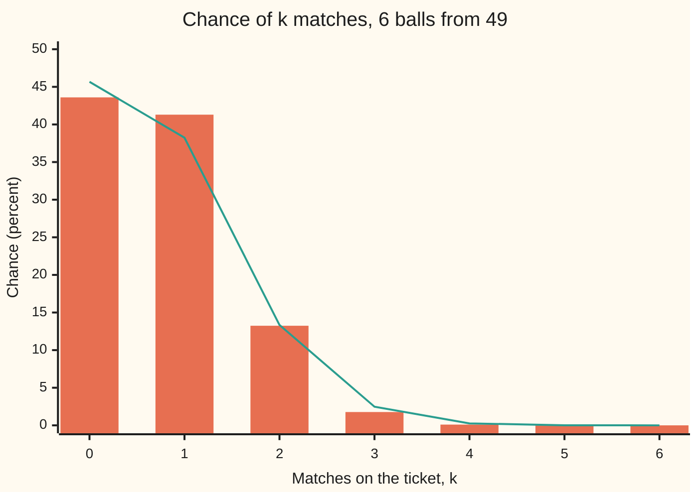
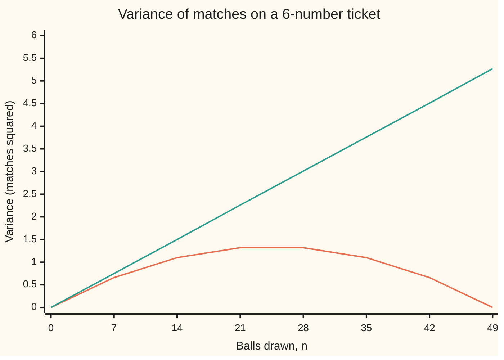

# Hypergeometric: drawing without replacement, where every ball taken changes the odds for the next

[Syllabus](../../../SYLLABUS.md) → [Probability and statistics](../README.md) → [Discrete Distributions](../README.md#s03) → Hypergeometric

---

## General Overview

A lottery machine holds 49 numbered balls. It draws 6, one after another, and never puts one back. A ticket names 6 numbers in advance. The question every ticket holder asks is how many of those 6 numbers the machine will draw.

The answer is a count between 0 and 6, and it is random. Most draws match none or one: 43.60 percent of draws match nothing and 41.30 percent match one number. Three matches, a small prize in most 6-from-49 games, happens about once in 56.7 draws. All six, the jackpot, happens once in 13,983,816.

What makes this count its own law is the phrase "never puts one back". When the first ball drawn is on the ticket, only 5 ticket numbers are left among 48 balls, so the second ball is slightly less likely to match. Each draw changes the pool for the next. The draws are not independent trials, so the binomial law of [Binomial](01-bernoulli-and-binomial.md) does not apply exactly. Counting sets of balls does apply, and it gives the whole law in one line. The law it gives is called the **hypergeometric** law, and that name is used from here on.

**When a fixed pool holds some marked items and a sample is taken without putting anything back, the chance of exactly k marked items is the number of ways to choose k marked and the rest unmarked, divided by the number of ways to choose the sample.**

**What kind of fact this is:** a theorem, proved on this card in Why it works, once every set of 6 balls is taken as equally likely; the binomial stand-in for it is an approximation, with its error stated.

### The picture: matches on one ticket, with and without putting balls back



Bars: the real lottery, drawn without putting balls back (hypergeometric). Line: the same count if each ball went back before the next draw (binomial). The two agree near the middle and part in the tail, where the prizes are.

---

## The formula

Notation first, in words. $\binom{a}{b}$, read "a choose b", is the number of ways to pick b items from a, order ignored, as on [Combinations, n choose k](../../04-Combinatorics%20and%20graphs/01-Counting%20Principles/05-n-choose-k.md); it is written C(a, b) in the code. X is the count of marked items in the sample. Writing $X \sim \text{Hypergeometric}(N, K, n)$ is read "X follows the hypergeometric law with a pool of N, K of them marked, n drawn".

$$P(X = k) = \frac{\binom{K}{k}\binom{N-K}{n-k}}{\binom{N}{n}}$$

**Read it aloud:** choose which k of the marked items are drawn, choose which of the unmarked items fill the other places, and divide by all the samples that could have been drawn.

The count can only take values that both pools can supply: at least n − (N − K), at least 0, at most K and at most n. In the lottery every value from 0 to 6 is possible.

The long-run average and the spread follow. As a reminder, $E[X]$ is the average value of X in the long run and $Var(X)$ is the average squared distance from it (shelf 02).

$$E[X] = n\,p, \qquad Var(X) = n\,p\,(1-p)\,\frac{N-n}{N-1}, \qquad p = \frac{K}{N}$$

The last factor, $\frac{N-n}{N-1}$, is the **finite-population correction**: the amount by which drawing without replacement shrinks the binomial variance $n\,p\,(1-p)$. It needs N ≥ 2; a pool of one ball leaves nothing random.

| Symbol | Plain meaning | In our example | Push it up and the answer… |
| --- | --- | --- | --- |
| $N$ | how many items are in the pool | 49 balls | fewer matches; each draw matters less, so closer to binomial |
| $K$ | how many of them are marked | 6 numbers on the ticket | more matches |
| $n$ | how many items are drawn | 6 balls | more matches, and more of the pool used up |
| $X$ | the random count of marked items in the sample | matches on the ticket | — |
| $k$ | one value the count might take | 3 | — |
| $p$ | the marked share of the pool, K/N | 6/49 | more matches on average |
| $\binom{a}{b}$ | ways to choose b items from a, order ignored | $\binom{49}{6}$ = 13,983,816 | — |
| $E[X]$ | the long-run average count | 0.734694 matches | — |
| $Var(X)$ | the spread of the count, in squared matches | 0.577572 | — |
| $I_i$ | indicator: 1 if draw number i is a marked ball, else 0 | for the first draw, 1 if that ball is on the ticket | — |
| $\frac{N-n}{N-1}$ | the finite-population correction | 43/48 = 0.895833 | nearer 1: less correction |

### When it holds

- **Every set of n items is equally likely.** A fair machine does this. Weighted balls, or a scoop that reaches the top of a crate first, break it, and the formula gives the wrong odds with no warning.
- **Nothing goes back.** If each ball is returned before the next draw, the draws become independent and the count is binomial: the jackpot moves from 1 in 13,983,816 to 1 in 296,666.8.
- **The pool is fixed and known.** N and K must be numbers, not guesses. With the marked share unknown, the count becomes evidence about it, which is the estimation problem of later shelves.
- **Each item is marked or not.** Three or more kinds of item (red, green, blue) need the several-colour version, the way the binomial grows into [Multinomial](05-multinomial.md).

---

## Why it works

### Step 0: count sets, not sequences

The machine draws balls in an order, but a ticket cares only about which six came out. So the outcome is a set of 6 balls. A fair machine makes every such set equally likely. The chance of any event is then a count: sets in the event, divided by all sets. The whole proof is two counts.

### Step 1: count all possible draws

Drawn in order, the first ball can be any of 49, the second any of the 48 left, and so on: 49 × 48 × 47 × 46 × 45 × 44 = 10,068,347,520 ordered draws. Each set of six balls appears in 6! = 720 orders (6! is 6 × 5 × 4 × 3 × 2 × 1). Dividing gives $\binom{49}{6}$ = 13,983,816 sets. In general there are $\binom{N}{n}$.

### Step 2: split each favourable draw into two independent choices

A draw with exactly k matches is k balls from the 6 on the ticket plus 6 − k balls from the 43 that are not. Any choice of the first part combined with any choice of the second gives such a draw. Every such draw splits back into one pair of choices. So the count is a product: $\binom{K}{k}\binom{N-K}{n-k}$. For three matches, 20 ways to pick which ticket numbers came up, times 12,341 ways to pick the other three balls from the 43, makes 246,820 draws.

### Step 3: divide

Favourable over total gives the formula. The seven counts for k = 0 to 6 add up to 13,983,816, since every draw has exactly one number of matches, so the chances add to 1.

### Step 4: the average needs no independence

Write the count as a sum of switches, called **indicators**: $I_i$ is 1 if draw i lands on the ticket and 0 otherwise, so X is $I_1 + \dots + I_6$. Taken alone, draw i is equally likely to be any of the 49 balls, so it matches with chance 6/49. Averages add whether or not the indicators depend on each other, so $E[X] = n\,p$ = 0.734694, the same as the binomial.

### Step 5: the spread is where dependence shows

Two named draws both match with chance 6/49 × 5/48 = 0.012755. If the draws were independent it would be $p^2$ = 0.014994. The difference is the **covariance** of two indicators (shelf 02): −0.0022387. It is negative because a match on one draw leaves one fewer ticket number for the other. The variance of a sum is the sum of the separate variances plus every covariance between pairs. The 30 ordered pairs of draws, each with that negative covariance, pull the variance down from 0.644731 to 0.577572.

<details>
<summary>Detailed proof: the variance formula</summary>

Each indicator has $Var(I_i) = p\,(1-p)$, since it is 1 with chance p.

For two different draws i and j, the pair of balls is equally likely to be any of the N(N − 1) ordered pairs of distinct balls, K(K − 1) of which are both marked. So
$$P(I_i = 1, I_j = 1) = \frac{K(K-1)}{N(N-1)}, \qquad Cov(I_i, I_j) = \frac{K(K-1)}{N(N-1)} - p^2 = -\frac{p\,(1-p)}{N-1}.$$
The last step puts both terms over $N^2(N-1)$ and simplifies $K(K-1)N - K^2(N-1) = -K(N-K)$.

The variance of the sum is n separate variances plus n(n − 1) ordered pairs:
$$Var(X) = n\,p\,(1-p) - n(n-1)\frac{p\,(1-p)}{N-1} = n\,p\,(1-p)\left(1 - \frac{n-1}{N-1}\right) = n\,p\,(1-p)\,\frac{N-n}{N-1}.$$
With n = 1 there are no pairs and the factor is 1. With n = N the factor is 0: drawing the whole pool leaves nothing random.

</details>

### Step 6: when the pool is large, the binomial returns

Hold the shares fixed and grow the pool: 6 marked in 49, then 60 in 490, then 600 in 4,900. Removing a few balls from a huge pool barely changes the share left, so the draws are nearly independent. The chance of exactly three matches in six draws climbs from 0.017650 to 0.024155, then 0.024749, then 0.024808 with 49,000 balls, and the binomial gives 0.024815. The correction factor $\frac{N-n}{N-1}$ tends to 1 at the same time. So the binomial is a fair stand-in when the sample is a small share of the pool. Six balls from 49 is 12.24 percent of the pool, and the tail shows it.

A second road to the same law follows the machine ball by ball: the chance of a hit is the ticket numbers left over the balls left, and a path of hits and misses multiplies those chances. Summing the 64 paths by their number of hits gives exactly the counting answer, and the code checks it.

---

## Worked numbers, by hand

The chance of exactly three matches.

| Step | Arithmetic | Value |
| --- | --- | --- |
| all possible draws | 49 × 48 × 47 × 46 × 45 × 44 / 720 | 13,983,816 |
| which ticket numbers match | $\binom{6}{3}$ | 20 |
| which other balls come out | $\binom{43}{3}$ = 43 × 42 × 41 / 6 | 12,341 |
| favourable draws | 20 × 12,341 | 246,820 |
| chance | 246,820 / 13,983,816 | **0.01765040** |
| average matches | 6 × 6/49 | 0.734694 |
| variance with replacement | 6 × 6/49 × 43/49 | 0.644731 |
| correction | 43/48 | 0.895833 |
| **variance without replacement** | 0.644731 × 0.895833 | **0.577572** |

About 1 draw in 56.7 gives a ticket exactly three matches. At least three matches, any prize at all in many 6-from-49 games, comes to 0.018638, about 1 draw in 53.7.

The full table, each row printed by both checks:

| Matches k | Favourable draws | Chance | About 1 in |
| --- | --- | --- | --- |
| 0 | 6,096,454 | 0.43596498 | 2.3 |
| 1 | 5,775,588 | 0.41301945 | 2.4 |
| 2 | 1,851,150 | 0.13237803 | 7.6 |
| 3 | 246,820 | 0.01765040 | 56.7 |
| 4 | 13,545 | 0.00096862 | 1,032.4 |
| 5 | 258 | 0.00001845 | 54,200.8 |
| 6 | 1 | 0.00000007 | 13,983,816 |

### What breaks if you drop a piece

| Mistake | Comes out at | What went wrong |
| --- | --- | --- |
| Treat the draws as independent (binomial with p = 6/49) | jackpot 1 in 296,666.8, not 1 in 13,983,816 | Balls are not put back, so a match leaves fewer to match; the jackpot looks 47.1 times too likely |
| Count ordered draws on top, sets underneath | jackpot 1 in 19,422.0 | 720 orders of the winning six divided by unordered sets: the two counts must agree |
| Choose 3 matches, then "any 3 of the other 46" | at least 3 matches 0.021711, not 0.018638 | A draw with 4 matches is counted 4 times, one for each way to call 3 of them the matches |
| Binomial variance for the lottery | 0.644731, not 0.577572 | The finite-population correction 0.895833 left out |

The first row is the failure the theorem guards against: dependent draws multiplied as if independent. The code prints every row.

### Variance as more balls are drawn

Keep the ticket of 6 and let the machine draw n balls, from 0 up to all 49.



Lower curve, orange: without replacement, rising then falling to 0 at n = 49, when all 6 ticket numbers are certainly drawn. Upper line, green: with replacement, growing in a straight line. The gap is the finite-population correction. Near n = 0 the two agree; by half the pool the correction has cut the variance in half.

---

## Code, from first principles, and it actually runs

Three roads that share no arithmetic reach the law: the counting formula, a walk through all 13,983,816 draws, and the ball-by-ball product over 64 hit-and-miss paths. A seeded simulation of 200,000 draws (SplitMix64, written out in both languages) checks the average, the variance and the chance of three or more matches within four standard errors, and shows the simulated variance clear of the binomial one. Each chart point is computed from the full table and checked against the correction formula.

### Python

```python
# Hypergeometric: drawing without replacement -- the check behind the card.
# Standard library only.  The lottery: 6 balls drawn from 49, a ticket holds 6
# numbers, X = how many of them are drawn.  Three roads to the law of X: count
# with binomial coefficients, enumerate all 13,983,816 draws, and follow the
# draw one ball at a time.  A seeded simulation checks the moments.
from itertools import combinations

N, K, n = 49, 6, 6                      # balls, ticket numbers, balls drawn

def C(a, b):                            # a choose b, by the product rule
    if b < 0 or b > a:
        return 0
    v = 1
    for j in range(1, b + 1):
        v = v * (a - b + j) // j
    return v

def mass(N, K, n):                      # road one: counting
    return [C(K, k) * C(N - K, n - k) / C(N, n) for k in range(n + 1)]

def binom(n, p):                        # the with-replacement law, for contrast
    return [C(n, k) * p ** k * (1 - p) ** (n - k) for k in range(n + 1)]

def mean_var(P):
    m = sum(k * q for k, q in enumerate(P))
    return m, sum(k * k * q for k, q in enumerate(P)) - m * m

total = C(N, n)
counted = [C(K, k) * C(N - K, n - k) for k in range(n + 1)]
enum = [0] * (n + 1)                    # road two: every draw; ticket = balls 0..5
for s in combinations(range(N), n):
    enum[(s[0] < 6) + (s[1] < 6) + (s[2] < 6) + (s[3] < 6) + (s[4] < 6) + (s[5] < 6)] += 1
seq = [0.0] * (n + 1)                   # road three: 64 hit/miss paths, ball by ball
for path in range(1 << n):
    pr, hits = 1.0, 0
    for i in range(n):
        if path >> i & 1:
            pr *= (K - hits) / (N - i); hits += 1
        else:
            pr *= (N - K - (i - hits)) / (N - i)
    seq[hits] += pr
P, B = mass(N, K, n), binom(n, K / N)
print(f"lottery: {n} balls from {N}; a ticket holds {K} numbers; C(49,6) = {total}")
print(f"by hand: 49x48x47x46x45x44 = {49*48*47*46*45*44} ordered draws; / 720 = {49*48*47*46*45*44 // 720}")
print(f"by hand: C(6,3) = {C(6, 3)}, C(43,3) = {C(43, 3)}, product {C(6, 3) * C(43, 3)}")
print("k  counted  enumerated  P(X=k)      ball by ball  about 1 in")
for k in range(n + 1):
    print(f"{k}  {counted[k]:>7}  {enum[k]:>10}  {P[k]:.8f}  {seq[k]:.8f}    {total / counted[k]:.1f}")
print("chart, percent: hypergeometric " + ", ".join(f"{100 * q:.2f}" for q in P))
print("chart, percent: binomial       " + ", ".join(f"{100 * q:.2f}" for q in B))
print(f"at least 3 matches: {sum(P[3:]):.6f}, about 1 in {1 / sum(P[3:]):.1f}")
print(f"jackpot with replacement (binomial): 1 in {1 / B[6]:.1f}, {B[6] / P[6]:.1f} times too likely")
print(f"sample share of the pool: {100 * n / N:.2f} percent")
p = K / N
hm, hv = mean_var(P)
bm, bv = mean_var(B)
fpc = (N - n) / (N - 1)
print(f"mean from the table {hm:.6f}; n K / N = {n * p:.6f}; binomial mean {bm:.6f}")
print(f"variance from the table {hv:.6f}; n p (1-p) (N-n)/(N-1) = {n * p * (1 - p) * fpc:.6f}")
print(f"binomial variance n p (1-p) = {bv:.6f}; correction (N-n)/(N-1) = {fpc:.6f}")
both = K * (K - 1) / (N * (N - 1))
print(f"two named draws both hit: {both:.6f}; p^2 = {p * p:.6f}; covariance {both - p * p:.7f}; {n * (n - 1)} ordered pairs")
print("variance as the draw grows, ticket of 6 (n, without, with replacement):")
for m in range(0, N + 1, 7):
    wv = mean_var(mass(N, K, m))[1]
    fv = m * p * (1 - p) * (N - m) / (N - 1)
    assert abs(wv - fv) < 1e-12        # table road against the correction formula
    print(f"figure, n={m:>2}  {wv:.2f}  {m * p * (1 - p):.2f}")
print("P(X=3) as the pool grows, same shares (6 in 49), 6 drawn:")
for s in (1, 10, 100, 1000):
    print(f"  pool {N * s:>5}: {mass(N * s, K * s, n)[3]:.6f}")
print(f"  binomial:   {B[3]:.6f}")
print(f"smaller game, 6 from 39: jackpot 1 in {1 / mass(39, K, n)[6]:.1f}; correction {(39 - n) / (39 - 1):.6f}")
wrong_at_least_3 = C(K, 3) * C(N - 3, 3) / total
print(f"mistake, ordered over unordered jackpot: 1 in {total / 720:.1f}")
print(f"mistake, choose 3 hits then any 3 balls: {wrong_at_least_3:.6f} for at least 3")

state = 20260928                        # SplitMix64, written out, seed stated
def rnd():
    global state
    state = (state + 0x9E3779B97F4A7C15) & 0xFFFFFFFFFFFFFFFF
    z = state
    z = ((z ^ (z >> 30)) * 0xBF58476D1CE4E5B9) & 0xFFFFFFFFFFFFFFFF
    z = ((z ^ (z >> 27)) * 0x94D049BB133111EB) & 0xFFFFFFFFFFFFFFFF
    return z ^ (z >> 31)
R = 200000
s1 = s2 = s3 = s4 = big = 0
for _ in range(R):
    balls, x = list(range(N)), 0
    for i in range(n):                  # partial shuffle: 6 distinct balls
        j = i + rnd() % (N - i)
        balls[i], balls[j] = balls[j], balls[i]
        x += balls[i] < 6
    s1 += x; s2 += x * x; s3 += x ** 3; s4 += x ** 4; big += x >= 3
sm = s1 / R
sv = s2 / R - sm * sm
m4 = (s4 - 4 * sm * s3 + 6 * sm * sm * s2) / R - 3 * sm ** 4   # 4th moment about the mean
se_v = ((m4 - sv * sv) / R) ** 0.5
sp = big / R
se_p = (sp * (1 - sp) / R) ** 0.5
print(f"simulated, {R} draws, seed 20260928: mean {sm:.4f} (se {(sv / R) ** 0.5:.4f})")
print(f"simulated variance {sv:.4f} (se {se_v:.4f}); at least 3 matches {sp:.5f} (se {se_p:.5f})")
assert counted == enum and sum(enum) == total                      # counting = enumeration
assert all(abs(a - b) < 1e-15 for a, b in zip(P, seq))             # counting = ball by ball
assert abs(hv - n * p * (1 - p) * fpc) < 1e-12 and abs(hm - n * p) < 1e-12
assert abs(sv - hv) < 4 * se_v and abs(sv - bv) > 4 * se_v         # sees the correction
assert abs(sp - sum(P[3:])) < 4 * se_p and abs(sm - hm) < 4 * (sv / R) ** 0.5
print("ALL CHECKS PASS")
```

**Ran 2026-09-28 on macOS, Python 3.14.6, standard library only. All checks passed. Output, pasted from the run:**

```
lottery: 6 balls from 49; a ticket holds 6 numbers; C(49,6) = 13983816
by hand: 49x48x47x46x45x44 = 10068347520 ordered draws; / 720 = 13983816
by hand: C(6,3) = 20, C(43,3) = 12341, product 246820
k  counted  enumerated  P(X=k)      ball by ball  about 1 in
0  6096454     6096454  0.43596498  0.43596498    2.3
1  5775588     5775588  0.41301945  0.41301945    2.4
2  1851150     1851150  0.13237803  0.13237803    7.6
3   246820      246820  0.01765040  0.01765040    56.7
4    13545       13545  0.00096862  0.00096862    1032.4
5      258         258  0.00001845  0.00001845    54200.8
6        1           1  0.00000007  0.00000007    13983816.0
chart, percent: hypergeometric 43.60, 41.30, 13.24, 1.77, 0.10, 0.00, 0.00
chart, percent: binomial       45.67, 38.24, 13.34, 2.48, 0.26, 0.01, 0.00
at least 3 matches: 0.018638, about 1 in 53.7
jackpot with replacement (binomial): 1 in 296666.8, 47.1 times too likely
sample share of the pool: 12.24 percent
mean from the table 0.734694; n K / N = 0.734694; binomial mean 0.734694
variance from the table 0.577572; n p (1-p) (N-n)/(N-1) = 0.577572
binomial variance n p (1-p) = 0.644731; correction (N-n)/(N-1) = 0.895833
two named draws both hit: 0.012755; p^2 = 0.014994; covariance -0.0022387; 30 ordered pairs
variance as the draw grows, ticket of 6 (n, without, with replacement):
figure, n= 0  0.00  0.00
figure, n= 7  0.66  0.75
figure, n=14  1.10  1.50
figure, n=21  1.32  2.26
figure, n=28  1.32  3.01
figure, n=35  1.10  3.76
figure, n=42  0.66  4.51
figure, n=49  0.00  5.27
P(X=3) as the pool grows, same shares (6 in 49), 6 drawn:
  pool    49: 0.017650
  pool   490: 0.024155
  pool  4900: 0.024749
  pool 49000: 0.024808
  binomial:   0.024815
smaller game, 6 from 39: jackpot 1 in 3262623.0; correction 0.868421
mistake, ordered over unordered jackpot: 1 in 19422.0
mistake, choose 3 hits then any 3 balls: 0.021711 for at least 3
simulated, 200000 draws, seed 20260928: mean 0.7328 (se 0.0017)
simulated variance 0.5789 (se 0.0019); at least 3 matches 0.01891 (se 0.00030)
ALL CHECKS PASS
```

### Rust

Same numbers, same labels, built with `rustc --edition 2021 -O`.

```rust
// Hypergeometric: drawing without replacement -- the same check in Rust, std only.
// The lottery: 6 balls drawn from 49, a ticket holds 6 numbers, X = how many of
// them are drawn.  Three roads to the law of X: count with binomial
// coefficients, enumerate all 13,983,816 draws, and follow the draw one ball at
// a time.  A seeded simulation checks the moments.
const N: usize = 49;
const K: usize = 6;
const NN: usize = 6; // balls drawn

fn c(a: usize, b: usize) -> u128 {                 // a choose b, by the product rule
    if b > a { return 0; }
    let mut v: u128 = 1;
    for j in 1..=b as u128 { v = v * (a as u128 - b as u128 + j) / j; }
    v
}

fn mass(n: usize, k: usize, d: usize) -> Vec<f64> { // road one: counting
    (0..=d).map(|j| if j > k || d - j > n - k { 0.0 } else {
        c(k, j) as f64 * c(n - k, d - j) as f64 / c(n, d) as f64 }).collect()
}

fn binom(d: usize, p: f64) -> Vec<f64> {           // the with-replacement law, for contrast
    (0..=d).map(|j| c(d, j) as f64 * p.powi(j as i32) * (1.0 - p).powi((d - j) as i32)).collect()
}

fn mean_var(p: &[f64]) -> (f64, f64) {
    let m: f64 = p.iter().enumerate().map(|(k, q)| k as f64 * q).sum();
    let s: f64 = p.iter().enumerate().map(|(k, q)| (k * k) as f64 * q).sum();
    (m, s - m * m)
}

fn enumerate(start: usize, left: usize, hits: usize, out: &mut [u64]) { // road two
    if left == 0 { out[hits] += 1; return; }
    for b in start..=N - left { enumerate(b + 1, left - 1, hits + (b < 6) as usize, out); }
}

struct SplitMix(u64);                              // SplitMix64, written out, seed stated
impl SplitMix {
    fn next(&mut self) -> u64 {
        self.0 = self.0.wrapping_add(0x9E3779B97F4A7C15);
        let mut z = self.0;
        z = (z ^ (z >> 30)).wrapping_mul(0xBF58476D1CE4E5B9);
        z = (z ^ (z >> 27)).wrapping_mul(0x94D049BB133111EB);
        z ^ (z >> 31)
    }
}

fn main() {
    let total = c(N, NN);
    let counted: Vec<u128> = (0..=NN).map(|k| c(K, k) * c(N - K, NN - k)).collect();
    let mut en = vec![0u64; NN + 1];
    enumerate(0, NN, 0, &mut en);
    let mut seq = vec![0.0f64; NN + 1];            // road three: 64 hit/miss paths
    for path in 0..(1u32 << NN) {
        let (mut pr, mut hits) = (1.0f64, 0usize);
        for i in 0..NN {
            if path >> i & 1 == 1 { pr *= (K - hits) as f64 / (N - i) as f64; hits += 1; }
            else { pr *= (N - K - (i - hits)) as f64 / (N - i) as f64; }
        }
        seq[hits] += pr;
    }
    let p = K as f64 / N as f64;
    let (pm, bm) = (mass(N, K, NN), binom(NN, p));
    println!("lottery: {} balls from {}; a ticket holds {} numbers; C(49,6) = {}", NN, N, K, total);
    let ordered: u128 = (44..=49).product();
    println!("by hand: 49x48x47x46x45x44 = {} ordered draws; / 720 = {}", ordered, ordered / 720);
    println!("by hand: C(6,3) = {}, C(43,3) = {}, product {}", c(6, 3), c(43, 3), c(6, 3) * c(43, 3));
    println!("k  counted  enumerated  P(X=k)      ball by ball  about 1 in");
    for k in 0..=NN {
        println!("{}  {:>7}  {:>10}  {:.8}  {:.8}    {:.1}", k, counted[k], en[k], pm[k], seq[k],
                 total as f64 / counted[k] as f64);
    }
    let pct = |v: &[f64]| v.iter().map(|q| format!("{:.2}", 100.0 * q)).collect::<Vec<_>>().join(", ");
    println!("chart, percent: hypergeometric {}", pct(&pm));
    println!("chart, percent: binomial       {}", pct(&bm));
    let tail: f64 = pm[3..].iter().sum();
    println!("at least 3 matches: {:.6}, about 1 in {:.1}", tail, 1.0 / tail);
    println!("jackpot with replacement (binomial): 1 in {:.1}, {:.1} times too likely", 1.0 / bm[6], bm[6] / pm[6]);
    println!("sample share of the pool: {:.2} percent", 100.0 * NN as f64 / N as f64);
    let ((hm, hv), (bmean, bv)) = (mean_var(&pm), mean_var(&bm));
    let fpc = (N - NN) as f64 / (N - 1) as f64;
    let nf = NN as f64;
    println!("mean from the table {:.6}; n K / N = {:.6}; binomial mean {:.6}", hm, nf * p, bmean);
    println!("variance from the table {:.6}; n p (1-p) (N-n)/(N-1) = {:.6}", hv, nf * p * (1.0 - p) * fpc);
    println!("binomial variance n p (1-p) = {:.6}; correction (N-n)/(N-1) = {:.6}", bv, fpc);
    let both = (K * (K - 1)) as f64 / (N * (N - 1)) as f64;
    println!("two named draws both hit: {:.6}; p^2 = {:.6}; covariance {:.7}; {} ordered pairs", both, p * p, both - p * p, NN * (NN - 1));
    println!("variance as the draw grows, ticket of 6 (n, without, with replacement):");
    for m in (0..=N).step_by(7) {
        let wv = mean_var(&mass(N, K, m)).1;
        let mf = m as f64;
        let fv = mf * p * (1.0 - p) * (N - m) as f64 / (N - 1) as f64;
        assert!((wv - fv).abs() < 1e-12);          // table road against the correction formula
        println!("figure, n={:>2}  {:.2}  {:.2}", m, wv, mf * p * (1.0 - p));
    }
    println!("P(X=3) as the pool grows, same shares (6 in 49), 6 drawn:");
    for s in [1usize, 10, 100, 1000] {
        println!("  pool {:>5}: {:.6}", N * s, mass(N * s, K * s, NN)[3]);
    }
    println!("  binomial:   {:.6}", bm[3]);
    println!("smaller game, 6 from 39: jackpot 1 in {:.1}; correction {:.6}", 1.0 / mass(39, K, NN)[6], (39 - NN) as f64 / 38.0);
    let wrong = c(K, 3) as f64 * c(N - 3, 3) as f64 / total as f64;
    println!("mistake, ordered over unordered jackpot: 1 in {:.1}", total as f64 / 720.0);
    println!("mistake, choose 3 hits then any 3 balls: {:.6} for at least 3", wrong);

    let mut g = SplitMix(20260928);
    let r = 200000u64;
    let (mut s1, mut s2, mut s3, mut s4, mut big) = (0u64, 0u64, 0u64, 0u64, 0u64);
    for _ in 0..r {
        let mut balls: Vec<usize> = (0..N).collect();
        let mut x = 0u64;
        for i in 0..NN {                            // partial shuffle: 6 distinct balls
            let j = i + (g.next() % (N - i) as u64) as usize;
            balls.swap(i, j);
            x += (balls[i] < 6) as u64;
        }
        s1 += x; s2 += x * x; s3 += x * x * x; s4 += x * x * x * x; big += (x >= 3) as u64;
    }
    let rf = r as f64;
    let sm = s1 as f64 / rf;
    let sv = s2 as f64 / rf - sm * sm;
    let m4 = (s4 as f64 - 4.0 * sm * s3 as f64 + 6.0 * sm * sm * s2 as f64) / rf - 3.0 * sm.powi(4); // 4th moment about the mean
    let se_v = ((m4 - sv * sv) / rf).sqrt();
    let sp = big as f64 / rf;
    let se_p = (sp * (1.0 - sp) / rf).sqrt();
    println!("simulated, {} draws, seed 20260928: mean {:.4} (se {:.4})", r, sm, (sv / rf).sqrt());
    println!("simulated variance {:.4} (se {:.4}); at least 3 matches {:.5} (se {:.5})", sv, se_v, sp, se_p);
    assert!(counted.iter().zip(&en).all(|(a, b)| *a == *b as u128) && en.iter().sum::<u64>() as u128 == total);
    assert!(pm.iter().zip(&seq).all(|(a, b)| (a - b).abs() < 1e-15));
    assert!((hv - nf * p * (1.0 - p) * fpc).abs() < 1e-12 && (hm - nf * p).abs() < 1e-12);
    assert!((sv - hv).abs() < 4.0 * se_v && (sv - bv).abs() > 4.0 * se_v); // sees the correction
    assert!((sp - tail).abs() < 4.0 * se_p && (sm - hm).abs() < 4.0 * (sv / rf).sqrt());
    println!("ALL CHECKS PASS");
}
```

**Ran 2026-09-28 on macOS, rustc 1.98.1, no crates. All checks passed. Output, pasted from the run:**

```
lottery: 6 balls from 49; a ticket holds 6 numbers; C(49,6) = 13983816
by hand: 49x48x47x46x45x44 = 10068347520 ordered draws; / 720 = 13983816
by hand: C(6,3) = 20, C(43,3) = 12341, product 246820
k  counted  enumerated  P(X=k)      ball by ball  about 1 in
0  6096454     6096454  0.43596498  0.43596498    2.3
1  5775588     5775588  0.41301945  0.41301945    2.4
2  1851150     1851150  0.13237803  0.13237803    7.6
3   246820      246820  0.01765040  0.01765040    56.7
4    13545       13545  0.00096862  0.00096862    1032.4
5      258         258  0.00001845  0.00001845    54200.8
6        1           1  0.00000007  0.00000007    13983816.0
chart, percent: hypergeometric 43.60, 41.30, 13.24, 1.77, 0.10, 0.00, 0.00
chart, percent: binomial       45.67, 38.24, 13.34, 2.48, 0.26, 0.01, 0.00
at least 3 matches: 0.018638, about 1 in 53.7
jackpot with replacement (binomial): 1 in 296666.8, 47.1 times too likely
sample share of the pool: 12.24 percent
mean from the table 0.734694; n K / N = 0.734694; binomial mean 0.734694
variance from the table 0.577572; n p (1-p) (N-n)/(N-1) = 0.577572
binomial variance n p (1-p) = 0.644731; correction (N-n)/(N-1) = 0.895833
two named draws both hit: 0.012755; p^2 = 0.014994; covariance -0.0022387; 30 ordered pairs
variance as the draw grows, ticket of 6 (n, without, with replacement):
figure, n= 0  0.00  0.00
figure, n= 7  0.66  0.75
figure, n=14  1.10  1.50
figure, n=21  1.32  2.26
figure, n=28  1.32  3.01
figure, n=35  1.10  3.76
figure, n=42  0.66  4.51
figure, n=49  0.00  5.27
P(X=3) as the pool grows, same shares (6 in 49), 6 drawn:
  pool    49: 0.017650
  pool   490: 0.024155
  pool  4900: 0.024749
  pool 49000: 0.024808
  binomial:   0.024815
smaller game, 6 from 39: jackpot 1 in 3262623.0; correction 0.868421
mistake, ordered over unordered jackpot: 1 in 19422.0
mistake, choose 3 hits then any 3 balls: 0.021711 for at least 3
simulated, 200000 draws, seed 20260928: mean 0.7328 (se 0.0017)
simulated variance 0.5789 (se 0.0019); at least 3 matches 0.01891 (se 0.00030)
ALL CHECKS PASS
```

The two outputs match line for line, simulation included, since both draw the same SplitMix64 numbers.

> [!TIP]
> **Try changing**
> Guess first, then run it.
> - **A smaller game.** Guess whether a 6-from-39 game needs more or less correction. Set `N` to 39; keep `n` and `K` at 6, since the enumeration line hard-codes six draws and a ticket of balls 0 to 5. The jackpot becomes 1 in 3,262,623.0 and the correction 0.868421, further from 1: the sample is a bigger share of a smaller pool. The "smaller game" line already prints both.
> - **Break the shuffle.** Guess whether four standard errors can see it. In the simulation, change `j = i + rnd() % (N - i)` to `j = rnd() % N`. A ball already drawn can be swapped back out and drawn again, the simulated law drifts, and an assert stops the run.
> - **Drop the correction.** Guess which assert notices. Set `fpc` to 1.0. The table's variance no longer matches the formula, and the assert comparing them fails: the correction is not optional.

---

## The usual mistake

> [!warning]
> **Treating draws from a fixed pool as independent.** Each ball drawn changes what is left. Multiplying 6/49 six times puts the jackpot at 1 in 296,666.8; the true figure is 1 in 13,983,816. The binomial gets the average right, 0.734694 matches, and the tail badly wrong.
>
> - **Mixing ordered and unordered counts.** Count sets on both sides or sequences on both sides; mixing them is off by a factor of 720.
> - **Overcounting "at least".** Add the exact counts for 3, 4, 5 and 6; "3 matches, then any 3 balls" counts a 4-match draw 4 times.
> - **Forgetting the correction in a spread.** In a survey of a small population it makes an interval too wide.
> - **Reading 0.734694 as a count to expect.** No draw produces a fraction of a match; it is the long-run average over many draws.

---

## Where you meet it in real life

- **Lotteries and keno.** Every prize table for a pick-6 or keno game is this formula with that game's N, K and n.
- **Card games.** The chance of being dealt k aces in a bridge hand is this law with the deck as the pool and the aces as the marked items.
- **Acceptance sampling.** A factory inspects a sample from each batch and rejects the batch if too many are faulty. The chance of rejecting a good batch is a hypergeometric tail.
- **Surveys of small populations.** Polling a sizeable share of a town's voters uses the finite-population correction to narrow the margin of error.
- **Fisher's exact test.** The test for a two-by-two table of counts (treated or not, recovered or not) reads its p-value off a hypergeometric law.
- **Capture and recapture.** Tag K fish, later catch n, count the tagged ones: the count is hypergeometric in the unknown lake size N, which turns it into an estimate of N.

> **Say it back**
> Drawing without replacement from a fixed pool makes each draw change the odds for the next, so the count of marked items is not binomial. Counting sets gives its law: marked choices times unmarked choices, over all samples. The average is the same as with replacement, but the negative covariance between draws shrinks the variance by the factor (N − n)/(N − 1). For the 6-from-49 lottery that is 0.577572 against 0.644731, and a jackpot of 1 in 13,983,816 against 1 in 296,666.8. When the pool is huge compared with the sample, the correction nears 1 and the binomial returns.

---

## What this builds on

- [Binomial](01-bernoulli-and-binomial.md): the with-replacement law this card compares against, and its variance n p (1 − p).
- [Combinations, n choose k](../../04-Combinatorics%20and%20graphs/01-Counting%20Principles/05-n-choose-k.md): the count of unordered choices, and why dividing ordered draws by 6! gives it.

## Where this goes next

- [Poisson](04-poisson.md): the law for counts of rare events when the pool is huge and the chance per item tiny.
- [Multinomial](05-multinomial.md): several kinds of outcome at once; with a fixed pool and no replacement it has a many-colour hypergeometric twin.
- [Adding counts](06-sums-of-discrete-variables.md): the covariance bookkeeping of Step 5 as a general tool for sums of dependent counts.
- [Two classics](07-birthday-and-coupon-collector.md): more questions about drawing from a fixed set, where repeats are the point.

---

## Sources

Verified 2026-09-28: every link below resolves to the publisher's page.

- Siegrist, Kyle. "The Hypergeometric Distribution." *Probability, Mathematical Statistics, and Stochastic Processes* (Random Services). [Chapter page](https://www.randomservices.org/random/urn/Hypergeometric.html). The counting derivation, the indicator moments and the comparison with sampling with replacement.
- Feller, William. *An Introduction to Probability Theory and Its Applications*, Volume 1, 3rd ed. Wiley, 1968. [Publisher page](https://www.wiley.com/en-us/An+Introduction+to+Probability+Theory+and+Its+Applications%2C+Volume+1%2C+3rd+Edition-p-9780471257080). Chapter II introduces the hypergeometric law through bridge hands, lotteries and capture-recapture.
- Blitzstein, Joseph K., and Jessica Hwang. *Introduction to Probability*, 2nd ed. CRC Press, 2019. [Publisher page](https://www.routledge.com/Introduction-to-Probability-Second-Edition/Blitzstein-Hwang/p/book/9781138369917). The hypergeometric beside the binomial, and its variance by indicators.
- Cochran, William G. *Sampling Techniques*, 3rd ed. Wiley, 1977. [Publisher page](https://www.wiley.com/en-us/Sampling+Techniques%2C+3rd+Edition-p-9780471162407). The finite-population correction as survey practice uses it.
