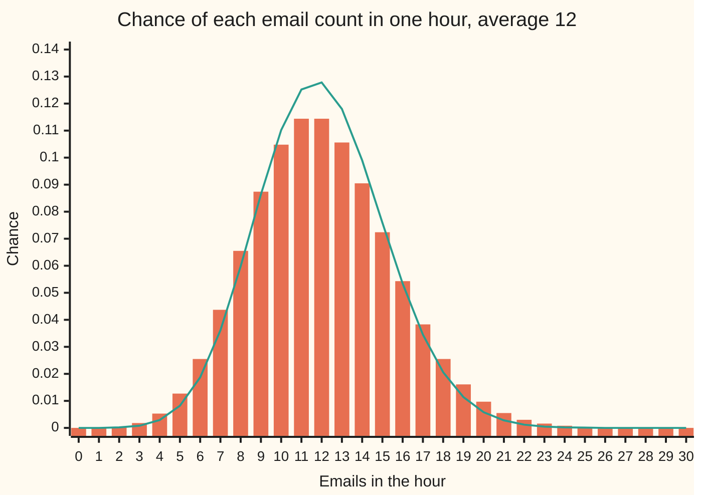

# Poisson: counts of rare events, and the limit of the binomial that produces it

[Syllabus](../../../SYLLABUS.md) → [Probability and statistics](../../../SYLLABUS.md#w09) → [Discrete Distributions](../../../SYLLABUS.md#w09-s03) → Poisson

---

## General Overview

A help desk receives emails at an average of 12 an hour. Nobody schedules them. Each of thousands of customers might write in any given second, and almost none of them does. One staff member can clear 20 emails in an hour. How often does an hour bring more than that?

The answer is about 1.16% of hours: roughly one hour in 86.

That number comes from one law. Cut the hour into 3600 one-second slots. In each slot an email either arrives or it does not, with a tiny chance, the same in every slot, and the slots do not influence each other. That is the binomial count ([Binomial](01-bernoulli-and-binomial.md)): many trials, each with a small chance. Now cut finer: tenths of a second, thousandths, while keeping the average at 12. The binomial settles onto a fixed shape that no longer mentions slots at all. Only the average survives. That shape is the **Poisson law**, named after Siméon Denis Poisson.

The same law counts typos on a page, calls to a switchboard and orders hitting an exchange: events individually rare, many in opportunity, independent of one another.

**Many rare, independent chances with a fixed average add up to a count whose whole law is set by that one average, and whose spread, measured as variance, equals the average.**

**What kind of fact this is:** a theorem, proved on this card in Why it works: the Poisson law is the limit of the binomial, and its mean equals its variance. Applying it to a real help desk is a model, and When it holds says where the model fails.

### The picture: one hour at the help desk



The bars are the Poisson law with average 12. The line is the coarse slot model: 60 one-minute slots, at most one email a minute, a 0.2 chance in each. The line is taller in the middle and thinner in the tails, because forbidding two emails in one minute throws away exactly the busy hours the question is about. The bars to the right of 20 are what the help desk fears; they add up to 0.011598.

---

## The formula

A count $X$ follows the Poisson law with average $\lambda > 0$, written X ~ Poisson($\lambda$) and read "X follows the Poisson law with mean lambda", when

$$p_k = P(X = k) = e^{-\lambda}\,\frac{\lambda^k}{k!}, \qquad k = 0, 1, 2, \ldots$$

**Read it aloud:** the chance of exactly k events is e (about 2.71828) to the minus lambda, times lambda to the power k, divided by k factorial.

Two facts ride with it:

$$E[X] = \lambda, \qquad \mathrm{Var}(X) = \lambda$$

The average count is lambda, and so is the variance: the spread is fixed by the average.

The help desk's question is a tail: the chance of anything above 20.

$$P(X > 20) = 1 - \sum_{k=0}^{20} e^{-12}\,\frac{12^k}{k!} = 0.011598$$

A recurrence makes the sum a chain of multiplications. Start at $p_0 = e^{-\lambda}$, then each mass is the one before times lambda over the new count:

$$p_{k+1} = p_k \cdot \frac{\lambda}{k+1}$$

The ratio is above 1 while the count is below lambda, and below 1 after. So the masses climb, peak at 11 and 12 (equal, because 12/12 is 1), then fall away.

| Symbol | Plain meaning | In our example | Push it up and the answer… |
| --- | --- | --- | --- |
| $X$ | the count: emails that arrive in one hour | anything from 0 up | — |
| $k$ | one particular count asked about | 20 is the cut-off | the tail beyond it shrinks |
| $p_k$; $p_0$, $p_{11}$, $p_{12}$, $p_{20}$, $p_{21}$ | the chance of exactly k emails, P(X = k) | $p_{20}$ = 0.009682 | — |
| $\lambda$, $np$ | lambda: the average count in the window; also the variance | 12 | the whole hump slides right and widens; the tail above 20 grows |
| $r$ | the rate: average emails per hour | 12 per hour | $\lambda$ grows in step |
| $t$ | the window's length, in hours | 1 | $\lambda$ = r × t grows in step |
| $e$ | the base of natural growth, about 2.71828 | $e^{-12}$ = 6.1442e-06 | — |
| $k!$ | k factorial: 1 × 2 × … × k, with 0! = 1 | 20! for the last term | — |
| $n$ | the number of slots the window is cut into | 60, 600, 3600, 36000 | the binomial lands closer to the Poisson |
| $p$ | the chance of an email in one slot, $\lambda/n$ | 0.2 down to 0.000333 | — |
| $B_n$ | the slot-model count, binomial with n slots and chance p | tail 0.004826 at 60 slots | — |
| $E[X]$, $\mathrm{Var}(X)$ | the long-run average of X, and its variance | 12 and 12 | — |

$E[X]$ is read "the average value of X in the long run", and $\mathrm{Var}(X)$ is the average squared distance from that average; both are defined on the expectation cards of shelf 02. The standard deviation, the square root of the variance, is 3.4641 here.

### When it holds

- **Events come one at a time.** If emails arrive in pairs (a message and its automatic copy), the count is twice a Poisson count with average 6: still mean 12, but variance 24, and the chance of more than 20 jumps to 0.042621.
- **The rate is steady across the window.** If a coin flip decides whether an hour runs at 6 or at 18 emails, the mean is still 12 but the variance is 48, and the tail is 0.134641, far above the Poisson answer.
- **Arrivals are independent.** One email must not provoke another. An outage that sends everyone writing at once breaks this; clustering of this kind pushes the variance above the mean and fattens the tail.
- **Lambda matches the window.** Lambda is rate times length. Using 12 for a two-hour window gives 0.011598 where the truth, at lambda 24, is 0.757361.
- **The chance per opportunity is small.** With coarse slots the binomial is visibly different: 60 one-minute slots give 0.004826, less than half the Poisson tail.

---

## Why it works

### Step 0: the average is the only thing that survives

The slot picture has two dials, the number of slots $n$ and the chance per slot $p$. Their product $np$ is the average count. Refining the slots turns $n$ up and $p$ down together, holding $np$ at 12. The claim is that in the limit the binomial's answer depends on $np$ alone. Every step below is that claim, made exact.

### Step 1: write the binomial with the average built in

With $p = \lambda/n$, the binomial chance of exactly k emails in n slots splits into four factors:

$$P(B_n = k) = \underbrace{\frac{n(n-1)\cdots(n-k+1)}{n^k}}_{\to 1}\cdot\frac{\lambda^k}{k!}\cdot\underbrace{\left(1-\frac{\lambda}{n}\right)^{n}}_{\to e^{-\lambda}}\cdot\underbrace{\left(1-\frac{\lambda}{n}\right)^{-k}}_{\to 1}$$

The first factor is k numbers each close to n, divided by n multiplied k times: for a fixed count like 20 it creeps toward 1 as the slots multiply. The last factor is a fixed number of copies of something close to 1. The middle factor $\lambda^k/k!$ never depended on n at all.

### Step 2: the one factor that does not go to 1

$(1 - \lambda/n)^n$ is the chance that every one of n slots stays empty. Each slot is nearly certain to be empty, but there are very many of them, and the two pull in opposite directions. Take the logarithm and use the Taylor series of $\ln(1-u)$, which is $-u - u^2/2 - \ldots$ for small u ([Taylor series](../../06-Calculus%20and%20analysis/06-Series/05-taylor-series.md)):

$$n \ln\!\left(1 - \frac{\lambda}{n}\right) = -\lambda - \frac{\lambda^2}{2n} - \ldots \;\longrightarrow\; -\lambda$$

So the chance of an empty hour tends to $e^{-\lambda}$. For the help desk, $e^{-12}$ = 6.1442e-06: an hour with no email at all happens a few times in a million hours.

Multiply the four limits and the Poisson mass appears: $e^{-\lambda}\lambda^k/k!$. The count of slots has disappeared.

### Step 3: the masses add to 1

A law must account for every outcome. The Taylor series of the exponential says $\sum_{k \ge 0} \lambda^k/k! = e^{\lambda}$, so the masses add to $e^{-\lambda} e^{\lambda} = 1$. No count is left out, even though the counts run without end.

### Step 4: mean equals variance

Two sums, each by the same move: cancel k against k!, then shift the index so the exponential series reappears.

$$E[X] = \sum_{k\ge1} k\,e^{-\lambda}\frac{\lambda^k}{k!} = \lambda \sum_{j\ge0} e^{-\lambda}\frac{\lambda^j}{j!} = \lambda$$

$$E[X(X-1)] = \sum_{k\ge2} k(k-1)\,e^{-\lambda}\frac{\lambda^k}{k!} = \lambda^2$$

Then $E[X^2] = E[X(X-1)] + E[X] = \lambda^2 + \lambda$, and the variance, the average square minus the square of the average, is $\lambda^2 + \lambda - \lambda^2 = \lambda$. At the help desk: mean 12, variance 12, standard deviation 3.4641.

The binomial explains why. Its variance is $np(1-p)$. The factor $1-p$ is the chance a slot stays empty, and as slots shrink it tends to 1, so the variance closes in on $np$, the mean.

<details>
<summary>Detailed proof: the binomial limit, with every factor accounted for</summary>

Fix a count $k$ and let $n > k$ with $p = \lambda/n < 1$. The binomial mass is $\binom{n}{k} p^k (1-p)^{n-k}$, and $\binom{n}{k} = n(n-1)\cdots(n-k+1)/k!$. Substitute $p = \lambda/n$ and regroup:

$$\binom{n}{k}\frac{\lambda^k}{n^k}\left(1-\frac{\lambda}{n}\right)^{n-k} = \frac{\lambda^k}{k!}\cdot\prod_{j=0}^{k-1}\left(1-\frac{j}{n}\right)\cdot\left(1-\frac{\lambda}{n}\right)^{n}\cdot\left(1-\frac{\lambda}{n}\right)^{-k}.$$

The product has k factors, a number that does not grow with n, and each tends to 1, so the product tends to 1. The last factor is a fixed power of a number tending to 1, so it tends to 1. For the middle factor, $\ln(1-u) = -u - u^2/2 - u^3/3 - \ldots$ for $0 \le u < 1$, and for $u \le 1/2$ the terms after the first add to at most $u^2$ in size (they are bounded by the geometric series $u^2/2 \cdot (1 + u + u^2 + \ldots) \le u^2$). With $u = \lambda/n$ and $n \ge 2\lambda$, so that u is at most 1/2:

$$\left| n\ln\!\left(1-\frac{\lambda}{n}\right) + \lambda \right| \le n\cdot\frac{\lambda^2}{n^2} = \frac{\lambda^2}{n} \to 0.$$

The exponential is continuous, so $(1-\lambda/n)^n \to e^{-\lambda}$. A product of finitely many convergent factors converges to the product of the limits, which is $e^{-\lambda}\lambda^k/k!$. The proof holds k fixed; for a count that grows with n it gives no guarantee, and a separate bound is needed.

Moments: the sums in Step 4 have non-negative terms, so reordering and shifting the index is safe, and each shifted sum is the exponential series, which converges for every λ. Hence $E[X] = \lambda$ and $E[X(X-1)] = \lambda^2$ are finite, and $\mathrm{Var}(X) = \lambda$ follows by subtraction.

</details>

### Step 5: how close is close

The limit does not say how fast. Lucien Le Cam proved a bound: for n independent slots each with chance p, the chance of any event, such as "more than 20", differs between the two laws by at most $n p^2 = \lambda^2/n$, here 144/n. At 3600 slots the bound is 0.0400 and the actual gap 1.29e-04. The gap times n settles near 0.465, so the error shrinks like 1/n, as the bound says, with a far smaller constant.

The limit is one road to the Poisson law. The other builds it from waiting times between arrivals, and proves that the count in any window of a steady random stream is Poisson: that is [Poisson process](../../11-Stochastic%20processes%20and%20calculus/04-Poisson%20and%20Jump%20Processes/01-poisson-process.md).

---

## Worked numbers, by hand

| Step | Arithmetic | Value |
| --- | --- | --- |
| lambda | 12 emails an hour × 1 hour | 12 |
| empty hour, $p_0$ | $e^{-12}$ | 6.1442e-06 |
| the peak, $p_{11}$ and $p_{12}$ | chain the recurrence 11 and 12 times | 0.114368 each |
| exactly 20, $p_{20}$ | chain on to 20 | 0.009682 |
| 20 or fewer | $p_0 + p_1 + \cdots + p_{20}$ | 0.988402 |
| more than 20 | 1 − 0.988402 | **0.011598** |
| check from above: $p_{21}$ | 0.009682 × 12/21 | 0.005533 |
| bracket | each later ratio is at most 12/22, so the tail is at most 0.005533 × 22/10 | 0.012172 |

The answer, 0.011598, sits inside the bracket from 0.005533 to 0.012172. The bracket needs nothing but the first term above the cut and a geometric series, so it is a check a pencil can finish.

In the world: the desk overflows in about one hour in 86. The cut-off, 20, is 2.3094 standard deviations above the average of 12.

### What breaks if you drop a piece

| Mistake | Comes out at | What went wrong |
| --- | --- | --- |
| "More than 20" read as "20 or more" | 0.021280 | adds $p_{20}$ = 0.009682, nearly doubling the answer |
| Cut the hour into 60 one-minute slots, at most one email each | 0.004826 | slots too coarse: the variance falls to 9.6 and the busy hours vanish |
| Normal curve at mean 12, sd 3.4641, with the usual half-step | 0.007069 | the Poisson leans right; a symmetric curve thins the tail |
| A coin flip picks rate 6 or 18 each hour | 0.134641 | the steady-rate hypothesis dropped: variance 48, not 12 |
| Emails in pairs, 6 pairs an hour | 0.042621 | the one-at-a-time hypothesis dropped: variance 24, not 12 |

Every number in the table is printed by both programs below, and the two variances, 48 and 24, are recomputed from the masses and asserted.

---

## Code, from first principles, and it actually runs

The programs reach the tail by five roads. Road 1 sums the masses from 0 to 20 by the recurrence and subtracts from 1. Road 2 sums the tail upward from 21, building each mass from logarithms of factorials, never from its neighbour. Road 3 is the geometric bracket. Road 4 is the binomial with the hour cut into 60, 600, 3600 and 36000 slots, computed by its own recurrence, never by the Poisson formula. Road 5 simulates 200,000 hours with a seeded generator, SplitMix64, written out in both languages so both draw the same numbers. The simulation multiplies random numbers between 0 and 1 until the product falls below $e^{-12}$ and counts the multiplications before that; why that count is Poisson belongs to [Poisson process](../../11-Stochastic%20processes%20and%20calculus/04-Poisson%20and%20Jump%20Processes/01-poisson-process.md), and it uses only $e^{-12}$, not the mass formula. Every simulated number is printed with its standard error. The normal-curve area is built from its own Taylor series.

### Python

```python
# Poisson counts -- the check behind the card.  Standard library only: math for
# exp, log and sqrt; no statistics or random module.  A help desk receives 12
# emails an hour on average.  The chance of more than 20 in one hour is reached
# by five roads: the mass summed up to 20 and subtracted from 1, the tail summed
# upward with log-factorials, a geometric bracket, the binomial with the hour cut
# into ever finer slots, and a seeded simulation.
import math

LAM, CUT, TOP = 12.0, 20, 150

def pmf_recurrence(lam, top):             # p0 = e^-lam, then p(k+1) = p(k) lam/(k+1)
    p = [math.exp(-lam)]
    for k in range(top):
        p.append(p[-1] * lam / (k + 1))
    return p

def pmf_logs(lam, k):                     # e^(-lam + k ln lam - ln k!), ln k! summed
    return math.exp(-lam + k * math.log(lam) - sum(math.log(j) for j in range(2, k + 1)))

def binom_pmf(n, p, top):                 # (1-p)^n, then times (n-k)/(k+1) p/(1-p)
    b = [(1 - p) ** n]
    for k in range(top):
        b.append(b[-1] * (n - k) / (k + 1) * p / (1 - p) if k < n else 0.0)
    return b

def phi_normal(x):                        # normal area left of x, by its Taylor series
    term, total, j = x, x, 0
    while abs(term) > 1e-17:
        j += 1
        term *= x * x / (2 * j + 1)
        total += term
    return 0.5 + math.exp(-x * x / 2) / math.sqrt(2 * math.pi) * total

def poisson_tail(lam, cut):
    return 1 - sum(pmf_recurrence(lam, cut)[: cut + 1])

M64 = (1 << 64) - 1
def splitmix(state):                      # SplitMix64: returns new state, uniform in [0,1)
    state = (state + 0x9E3779B97F4A7C15) & M64
    z = state
    z = ((z ^ (z >> 30)) * 0xBF58476D1CE4E5B9) & M64
    z = ((z ^ (z >> 27)) * 0x94D049BB133111EB) & M64
    z ^= z >> 31
    return state, (z >> 11) * 2.0 ** -53

p = pmf_recurrence(LAM, TOP)
tail_a = 1 - sum(p[: CUT + 1])                                   # road 1
tail_b = sum(pmf_logs(LAM, k) for k in range(CUT + 1, TOP))      # road 2
lo, hi = p[CUT + 1], p[CUT + 1] / (1 - LAM / (CUT + 2))         # road 3
mean = sum(k * q for k, q in enumerate(p))
var = sum(k * k * q for k, q in enumerate(p)) - mean ** 2
fall2 = sum(k * (k - 1) * q for k, q in enumerate(p))
print(f"help desk: lambda = {LAM:g} emails an hour; question: P(X > {CUT})")
print(f"p0 = e^-12 = {p[0]:.4e}; p11 = {p[11]:.6f}; p12 = {p[12]:.6f}; p20 = {p[20]:.6f}; p21 = {p[21]:.6f}")
print(f"P(X <= 20) = {1 - tail_a:.6f}")
print(f"road 1, 1 minus the sum to 20:       P(X > 20) = {tail_a:.6f}")
print(f"road 2, tail summed upward by logs:  P(X > 20) = {tail_b:.6f}")
print(f"road 3, geometric bracket:  {lo:.6f} <= P(X > 20) <= {hi:.6f}")
print(f"read back: about one hour in {1 / tail_a:.0f}, or {100 * tail_a:.2f}% of hours")
print(f"sum of all masses = {sum(p):.12f}")
print(f"mean = {mean:.9f}; E[X(X-1)] = {fall2:.9f}; variance = {var:.9f}; sd = {math.sqrt(var):.4f}")
print("figure, Poisson(12) masses k=0..30:")
for r in range(0, 31, 8):
    print("  " + ", ".join(f"{p[k]:.4f}" for k in range(r, min(r + 8, 31))))
b60 = binom_pmf(60, LAM / 60, 30)
print("figure, Binomial(60, 0.2) masses k=0..30:")
for r in range(0, 31, 8):
    print("  " + ", ".join(f"{b60[k]:.4f}" for k in range(r, min(r + 8, 31))))
gaps = []
for n in (60, 600, 3600, 36000):
    b = binom_pmf(n, LAM / n, CUT)
    t = 1 - sum(b)
    gaps.append(abs(t - tail_a))
    print(f"binomial, n = {n:>5} slots, p = {LAM / n:.6f}: P(X > 20) = {t:.6f}; gap {gaps[-1]:.2e};"
          f" n x gap = {n * gaps[-1]:.3f}; Le Cam bound 144/n = {144 / n:.4f}")
    assert gaps[-1] <= 144 / n
state, hours, total, total_sq, over = 20260928, 200000, 0, 0, 0
floor = math.exp(-LAM)
for _ in range(hours):                    # multiply uniforms until the product < e^-12
    k, prod = 0, 1.0
    while True:
        state, u = splitmix(state)
        prod *= u
        if prod < floor:
            break
        k += 1
    total, total_sq, over = total + k, total_sq + k * k, over + (k > CUT)
s_mean = total / hours
s_var = (total_sq - hours * s_mean ** 2) / (hours - 1)
s_tail = over / hours
se_tail = math.sqrt(tail_a * (1 - tail_a) / hours)
print(f"simulation, seed 20260928, {hours} hours: mean {s_mean:.4f} (se {math.sqrt(LAM / hours):.4f});"
      f" variance {s_var:.4f} (se {math.sqrt((LAM + 2 * LAM ** 2) / hours):.4f})")
print(f"simulation: P(X > 20) = {s_tail:.5f} (se {se_tail:.5f}); hours over 20: {over}")
at20 = tail_a + p[20]
z_plain, z_cc = (CUT - LAM) / math.sqrt(LAM), (CUT + 0.5 - LAM) / math.sqrt(LAM)
mix = 0.5 * poisson_tail(6.0, CUT) + 0.5 * poisson_tail(18.0, CUT)
pairs = poisson_tail(6.0, 10)
print(f"mistake, 'at least 20' for 'more than 20': P(X >= 20) = {at20:.6f}")
print(f"mistake, one email per minute at most: Binomial(60, 0.2) P(X > 20) = {1 - sum(b60[:21]):.6f};"
      f" variance {60 * 0.2 * 0.8:.1f}")
print(f"mistake, normal curve, z = {z_plain:.4f}: {1 - phi_normal(z_plain):.6f};"
      f" with the half-step, z = {z_cc:.4f}: {1 - phi_normal(z_cc):.6f}")
print(f"mistake, 12 used for a two-hour window: true P(X > 20) at lambda 24 = {poisson_tail(24.0, CUT):.6f}")
print(f"breaks, rate 6 or 18 on a coin flip (mean 12, variance 48): P(X > 20) = {mix:.6f}")
print(f"breaks, emails in pairs, 6 pairs an hour (mean 12, variance 24): P(X > 20) = {pairs:.6f}")
assert abs(tail_a - tail_b) < 1e-12                      # two sums, one tail
assert lo <= tail_a <= hi                                # bracket holds
assert abs(mean - LAM) < 1e-9 and abs(var - LAM) < 1e-9  # the theorem, by sums
assert gaps == sorted(gaps, reverse=True)                # slots finer, gap smaller
assert abs(sum(k * q for k, q in enumerate(binom_pmf(60, 0.2, 60))) - 60 * 0.2) < 1e-9
assert abs(s_tail - tail_a) < 4 * se_tail                # simulation agrees
assert abs(s_mean - LAM) < 4 * math.sqrt(LAM / hours)
assert abs(s_var - LAM) < 4 * math.sqrt((LAM + 2 * LAM ** 2) / hours)
q6, q18 = pmf_recurrence(6.0, TOP), pmf_recurrence(18.0, TOP)
mix_var = sum(k * k * (a + b) / 2 for k, (a, b) in enumerate(zip(q6, q18))) - LAM ** 2
pair_var = sum(4 * k * k * q for k, q in enumerate(q6)) - LAM ** 2
assert abs(mix_var - 48) < 1e-9                          # mixture variance 48
assert abs(pair_var - 24) < 1e-9                         # pairs variance 24
pairs_logs = sum(pmf_logs(6.0, k) for k in range(11, TOP))
assert abs(pairs - pairs_logs) < 1e-12 and mix > pairs > tail_a
print("ALL CHECKS PASS")
```

**Ran 2026-09-28 on macOS, Python 3.14.6, standard library only. All checks passed. Output, pasted from the run:**

```
help desk: lambda = 12 emails an hour; question: P(X > 20)
p0 = e^-12 = 6.1442e-06; p11 = 0.114368; p12 = 0.114368; p20 = 0.009682; p21 = 0.005533
P(X <= 20) = 0.988402
road 1, 1 minus the sum to 20:       P(X > 20) = 0.011598
road 2, tail summed upward by logs:  P(X > 20) = 0.011598
road 3, geometric bracket:  0.005533 <= P(X > 20) <= 0.012172
read back: about one hour in 86, or 1.16% of hours
sum of all masses = 1.000000000000
mean = 12.000000000; E[X(X-1)] = 144.000000000; variance = 12.000000000; sd = 3.4641
figure, Poisson(12) masses k=0..30:
  0.0000, 0.0001, 0.0004, 0.0018, 0.0053, 0.0127, 0.0255, 0.0437
  0.0655, 0.0874, 0.1048, 0.1144, 0.1144, 0.1056, 0.0905, 0.0724
  0.0543, 0.0383, 0.0255, 0.0161, 0.0097, 0.0055, 0.0030, 0.0016
  0.0008, 0.0004, 0.0002, 0.0001, 0.0000, 0.0000, 0.0000
figure, Binomial(60, 0.2) masses k=0..30:
  0.0000, 0.0000, 0.0002, 0.0008, 0.0029, 0.0082, 0.0187, 0.0361
  0.0598, 0.0864, 0.1102, 0.1252, 0.1278, 0.1180, 0.0990, 0.0759
  0.0534, 0.0345, 0.0206, 0.0114, 0.0058, 0.0028, 0.0012, 0.0005
  0.0002, 0.0001, 0.0000, 0.0000, 0.0000, 0.0000, 0.0000
binomial, n =    60 slots, p = 0.200000: P(X > 20) = 0.004826; gap 6.77e-03; n x gap = 0.406; Le Cam bound 144/n = 2.4000
binomial, n =   600 slots, p = 0.020000: P(X > 20) = 0.010831; gap 7.67e-04; n x gap = 0.460; Le Cam bound 144/n = 0.2400
binomial, n =  3600 slots, p = 0.003333: P(X > 20) = 0.011469; gap 1.29e-04; n x gap = 0.464; Le Cam bound 144/n = 0.0400
binomial, n = 36000 slots, p = 0.000333: P(X > 20) = 0.011585; gap 1.29e-05; n x gap = 0.465; Le Cam bound 144/n = 0.0040
simulation, seed 20260928, 200000 hours: mean 11.9891 (se 0.0077); variance 12.0355 (se 0.0387)
simulation: P(X > 20) = 0.01150 (se 0.00024); hours over 20: 2301
mistake, 'at least 20' for 'more than 20': P(X >= 20) = 0.021280
mistake, one email per minute at most: Binomial(60, 0.2) P(X > 20) = 0.004826; variance 9.6
mistake, normal curve, z = 2.3094: 0.010461; with the half-step, z = 2.4537: 0.007069
mistake, 12 used for a two-hour window: true P(X > 20) at lambda 24 = 0.757361
breaks, rate 6 or 18 on a coin flip (mean 12, variance 48): P(X > 20) = 0.134641
breaks, emails in pairs, 6 pairs an hour (mean 12, variance 24): P(X > 20) = 0.042621
ALL CHECKS PASS
```

### Rust

Same numbers, same labels, built with `rustc --edition 2021 -O`.

```rust
// Poisson counts -- the same check as the Python, in Rust.  No crates.  A help
// desk receives 12 emails an hour on average.  The chance of more than 20 in one
// hour is reached by five roads: the mass summed up to 20 and subtracted from 1,
// the tail summed upward with log-factorials, a geometric bracket, the binomial
// with the hour cut into ever finer slots, and a seeded simulation.
const LAM: f64 = 12.0;
const CUT: usize = 20;
const TOP: usize = 150;

fn pmf_recurrence(lam: f64, top: usize) -> Vec<f64> {   // p0 = e^-lam, then p(k+1) = p(k) lam/(k+1)
    let mut p = vec![(-lam).exp()];
    for k in 0..top {
        let next = p[k] * lam / (k as f64 + 1.0);
        p.push(next);
    }
    p
}

fn pmf_logs(lam: f64, k: usize) -> f64 {                // e^(-lam + k ln lam - ln k!), ln k! summed
    let lf: f64 = (2..=k).map(|j| (j as f64).ln()).sum();
    (-lam + k as f64 * lam.ln() - lf).exp()
}

fn binom_pmf(n: usize, p: f64, top: usize) -> Vec<f64> { // (1-p)^n, then times (n-k)/(k+1) p/(1-p)
    let mut b = vec![(1.0 - p).powf(n as f64)];
    for k in 0..top {
        let next = if k < n { b[k] * (n - k) as f64 / (k as f64 + 1.0) * p / (1.0 - p) } else { 0.0 };
        b.push(next);
    }
    b
}

fn phi_normal(x: f64) -> f64 {                          // normal area left of x, by its Taylor series
    let (mut term, mut total, mut j) = (x, x, 0.0);
    while term.abs() > 1e-17 {
        j += 1.0;
        term *= x * x / (2.0 * j + 1.0);
        total += term;
    }
    0.5 + (-x * x / 2.0).exp() / (2.0 * std::f64::consts::PI).sqrt() * total
}

fn poisson_tail(lam: f64, cut: usize) -> f64 {
    1.0 - pmf_recurrence(lam, cut)[..=cut].iter().sum::<f64>()
}

fn splitmix(state: &mut u64) -> f64 {                   // SplitMix64, uniform in [0,1)
    *state = state.wrapping_add(0x9E3779B97F4A7C15);
    let mut z = *state;
    z = (z ^ (z >> 30)).wrapping_mul(0xBF58476D1CE4E5B9);
    z = (z ^ (z >> 27)).wrapping_mul(0x94D049BB133111EB);
    z ^= z >> 31;
    (z >> 11) as f64 * 2f64.powi(-53)
}

fn sci(x: f64, d: usize) -> String {                    // Python-style e-notation: 6.1442e-06
    let s = format!("{:.*e}", d, x);
    let (m, e) = s.split_once('e').unwrap();
    let ev: i32 = e.parse().unwrap();
    format!("{}e{}{:02}", m, if ev < 0 { '-' } else { '+' }, ev.abs())
}

fn rows(label: &str, v: &[f64]) {
    println!("{}", label);
    for r in (0..31).step_by(8) {
        let cells: Vec<String> = (r..(r + 8).min(31)).map(|k| format!("{:.4}", v[k])).collect();
        println!("  {}", cells.join(", "));
    }
}

fn main() {
    let p = pmf_recurrence(LAM, TOP);
    let tail_a = 1.0 - p[..=CUT].iter().sum::<f64>();                          // road 1
    let tail_b: f64 = (CUT + 1..TOP).map(|k| pmf_logs(LAM, k)).sum();           // road 2
    let (lo, hi) = (p[CUT + 1], p[CUT + 1] / (1.0 - LAM / (CUT as f64 + 2.0))); // road 3
    let mean: f64 = p.iter().enumerate().map(|(k, q)| k as f64 * q).sum();
    let var = p.iter().enumerate().map(|(k, q)| (k * k) as f64 * q).sum::<f64>() - mean * mean;
    let fall2: f64 = p.iter().enumerate().map(|(k, q)| (k * k - k) as f64 * q).sum();
    println!("help desk: lambda = {} emails an hour; question: P(X > {})", LAM, CUT);
    println!("p0 = e^-12 = {}; p11 = {:.6}; p12 = {:.6}; p20 = {:.6}; p21 = {:.6}", sci(p[0], 4), p[11], p[12], p[20], p[21]);
    println!("P(X <= 20) = {:.6}", 1.0 - tail_a);
    println!("road 1, 1 minus the sum to 20:       P(X > 20) = {:.6}", tail_a);
    println!("road 2, tail summed upward by logs:  P(X > 20) = {:.6}", tail_b);
    println!("road 3, geometric bracket:  {:.6} <= P(X > 20) <= {:.6}", lo, hi);
    println!("read back: about one hour in {:.0}, or {:.2}% of hours", 1.0 / tail_a, 100.0 * tail_a);
    println!("sum of all masses = {:.12}", p.iter().sum::<f64>());
    println!("mean = {:.9}; E[X(X-1)] = {:.9}; variance = {:.9}; sd = {:.4}", mean, fall2, var, var.sqrt());
    rows("figure, Poisson(12) masses k=0..30:", &p);
    let b60 = binom_pmf(60, LAM / 60.0, 30);
    rows("figure, Binomial(60, 0.2) masses k=0..30:", &b60);
    let mut gaps: Vec<f64> = Vec::new();
    for n in [60usize, 600, 3600, 36000] {
        let b = binom_pmf(n, LAM / n as f64, CUT);
        let t = 1.0 - b.iter().sum::<f64>();
        let g = (t - tail_a).abs();
        gaps.push(g);
        println!("binomial, n = {:>5} slots, p = {:.6}: P(X > 20) = {:.6}; gap {}; n x gap = {:.3}; Le Cam bound 144/n = {:.4}",
                 n, LAM / n as f64, t, sci(g, 2), n as f64 * g, 144.0 / n as f64);
        assert!(g <= 144.0 / n as f64);
    }
    let (mut state, hours) = (20260928u64, 200000usize);
    let (mut total, mut total_sq, mut over) = (0usize, 0usize, 0usize);
    let floor = (-LAM).exp();
    for _ in 0..hours {                                  // multiply uniforms until the product < e^-12
        let (mut k, mut prod) = (0usize, 1.0f64);
        loop {
            prod *= splitmix(&mut state);
            if prod < floor { break }
            k += 1;
        }
        total += k; total_sq += k * k; if k > CUT { over += 1 }
    }
    let h = hours as f64;
    let s_mean = total as f64 / h;
    let s_var = (total_sq as f64 - h * s_mean * s_mean) / (h - 1.0);
    let s_tail = over as f64 / h;
    let se_tail = (tail_a * (1.0 - tail_a) / h).sqrt();
    println!("simulation, seed 20260928, {} hours: mean {:.4} (se {:.4}); variance {:.4} (se {:.4})",
             hours, s_mean, (LAM / h).sqrt(), s_var, ((LAM + 2.0 * LAM * LAM) / h).sqrt());
    println!("simulation: P(X > 20) = {:.5} (se {:.5}); hours over 20: {}", s_tail, se_tail, over);
    let at20 = tail_a + p[20];
    let (z_plain, z_cc) = ((CUT as f64 - LAM) / LAM.sqrt(), (CUT as f64 + 0.5 - LAM) / LAM.sqrt());
    let mix = 0.5 * poisson_tail(6.0, CUT) + 0.5 * poisson_tail(18.0, CUT);
    let pairs = poisson_tail(6.0, 10);
    println!("mistake, 'at least 20' for 'more than 20': P(X >= 20) = {:.6}", at20);
    println!("mistake, one email per minute at most: Binomial(60, 0.2) P(X > 20) = {:.6}; variance {:.1}",
             1.0 - b60[..21].iter().sum::<f64>(), 60.0 * 0.2 * 0.8);
    println!("mistake, normal curve, z = {:.4}: {:.6}; with the half-step, z = {:.4}: {:.6}",
             z_plain, 1.0 - phi_normal(z_plain), z_cc, 1.0 - phi_normal(z_cc));
    println!("mistake, 12 used for a two-hour window: true P(X > 20) at lambda 24 = {:.6}", poisson_tail(24.0, CUT));
    println!("breaks, rate 6 or 18 on a coin flip (mean 12, variance 48): P(X > 20) = {:.6}", mix);
    println!("breaks, emails in pairs, 6 pairs an hour (mean 12, variance 24): P(X > 20) = {:.6}", pairs);
    assert!((tail_a - tail_b).abs() < 1e-12);                      // two sums, one tail
    assert!(lo <= tail_a && tail_a <= hi);                         // bracket holds
    assert!((mean - LAM).abs() < 1e-9 && (var - LAM).abs() < 1e-9); // the theorem, by sums
    assert!(gaps.windows(2).all(|w| w[0] > w[1]));                 // slots finer, gap smaller
    assert!((binom_pmf(60, 0.2, 60).iter().enumerate().map(|(k, q)| k as f64 * q).sum::<f64>() - 60.0 * 0.2).abs() < 1e-9);
    assert!((s_tail - tail_a).abs() < 4.0 * se_tail);              // simulation agrees
    assert!((s_mean - LAM).abs() < 4.0 * (LAM / h).sqrt());
    assert!((s_var - LAM).abs() < 4.0 * ((LAM + 2.0 * LAM * LAM) / h).sqrt());
    let (q6, q18) = (pmf_recurrence(6.0, TOP), pmf_recurrence(18.0, TOP));
    let mix_var = q6.iter().zip(&q18).enumerate().map(|(k, (a, b))| (k * k) as f64 * (a + b) / 2.0).sum::<f64>() - LAM * LAM;
    let pair_var = q6.iter().enumerate().map(|(k, q)| (4 * k * k) as f64 * q).sum::<f64>() - LAM * LAM;
    assert!((mix_var - 48.0).abs() < 1e-9);                        // mixture variance 48
    assert!((pair_var - 24.0).abs() < 1e-9);                       // pairs variance 24
    let pairs_logs: f64 = (11..TOP).map(|k| pmf_logs(6.0, k)).sum();
    assert!((pairs - pairs_logs).abs() < 1e-12 && mix > pairs && pairs > tail_a);
    println!("ALL CHECKS PASS");
}
```

**Ran 2026-09-28 on macOS, rustc 1.98.1, no crates. All checks passed. Output, pasted from the run:**

```
help desk: lambda = 12 emails an hour; question: P(X > 20)
p0 = e^-12 = 6.1442e-06; p11 = 0.114368; p12 = 0.114368; p20 = 0.009682; p21 = 0.005533
P(X <= 20) = 0.988402
road 1, 1 minus the sum to 20:       P(X > 20) = 0.011598
road 2, tail summed upward by logs:  P(X > 20) = 0.011598
road 3, geometric bracket:  0.005533 <= P(X > 20) <= 0.012172
read back: about one hour in 86, or 1.16% of hours
sum of all masses = 1.000000000000
mean = 12.000000000; E[X(X-1)] = 144.000000000; variance = 12.000000000; sd = 3.4641
figure, Poisson(12) masses k=0..30:
  0.0000, 0.0001, 0.0004, 0.0018, 0.0053, 0.0127, 0.0255, 0.0437
  0.0655, 0.0874, 0.1048, 0.1144, 0.1144, 0.1056, 0.0905, 0.0724
  0.0543, 0.0383, 0.0255, 0.0161, 0.0097, 0.0055, 0.0030, 0.0016
  0.0008, 0.0004, 0.0002, 0.0001, 0.0000, 0.0000, 0.0000
figure, Binomial(60, 0.2) masses k=0..30:
  0.0000, 0.0000, 0.0002, 0.0008, 0.0029, 0.0082, 0.0187, 0.0361
  0.0598, 0.0864, 0.1102, 0.1252, 0.1278, 0.1180, 0.0990, 0.0759
  0.0534, 0.0345, 0.0206, 0.0114, 0.0058, 0.0028, 0.0012, 0.0005
  0.0002, 0.0001, 0.0000, 0.0000, 0.0000, 0.0000, 0.0000
binomial, n =    60 slots, p = 0.200000: P(X > 20) = 0.004826; gap 6.77e-03; n x gap = 0.406; Le Cam bound 144/n = 2.4000
binomial, n =   600 slots, p = 0.020000: P(X > 20) = 0.010831; gap 7.67e-04; n x gap = 0.460; Le Cam bound 144/n = 0.2400
binomial, n =  3600 slots, p = 0.003333: P(X > 20) = 0.011469; gap 1.29e-04; n x gap = 0.464; Le Cam bound 144/n = 0.0400
binomial, n = 36000 slots, p = 0.000333: P(X > 20) = 0.011585; gap 1.29e-05; n x gap = 0.465; Le Cam bound 144/n = 0.0040
simulation, seed 20260928, 200000 hours: mean 11.9891 (se 0.0077); variance 12.0355 (se 0.0387)
simulation: P(X > 20) = 0.01150 (se 0.00024); hours over 20: 2301
mistake, 'at least 20' for 'more than 20': P(X >= 20) = 0.021280
mistake, one email per minute at most: Binomial(60, 0.2) P(X > 20) = 0.004826; variance 9.6
mistake, normal curve, z = 2.3094: 0.010461; with the half-step, z = 2.4537: 0.007069
mistake, 12 used for a two-hour window: true P(X > 20) at lambda 24 = 0.757361
breaks, rate 6 or 18 on a coin flip (mean 12, variance 48): P(X > 20) = 0.134641
breaks, emails in pairs, 6 pairs an hour (mean 12, variance 24): P(X > 20) = 0.042621
ALL CHECKS PASS
```

The two outputs match line for line. The simulated tail, 0.01150 with standard error 0.00024, sits within half a standard error of the exact 0.011598; the simulated mean and variance land within a few standard errors of 12.

> [!TIP]
> **Try changing**
> Guess first, then run it.
> - **Double the window.** Set `LAM` to `24.0`. Guess: the tail turns from rare to usual. Roads 1 and 2 print 0.757361, but the run stops at the bracket assert: the ratio 24/22 is above 1, so the geometric series no longer closes and the "upper bound" comes out negative.
> - **Finer slots.** Add `360000` to the slot list. Guess: the gap falls tenfold again. It prints a gap of 1.29e-06, with n x gap still 0.465.
> - **Count one too many.** In the Python, change `k, prod = 0, 1.0` to `k, prod = 1, 1.0`. Guess: every simulated hour gains an email. The simulated mean prints near 13, and the assert comparing the simulated tail with the exact one stops the run.
> - **Another seed.** Change `20260928`. Guess: only the simulation lines move, and by a few standard errors at most.

---

## The usual mistake

> [!warning]
> **Treating "rare events, steady average" as proof that counts are Poisson.** The law needs events that come one at a time, at a steady rate, independently. The mean alone cannot tell: a desk whose hours run at 6 or 18 on a coin flip has mean 12, yet more than 20 emails arrive in 0.134641 of its hours, not 0.011598. The quick test is the variance. A Poisson count has variance equal to its mean; counts whose variance runs well above the mean, called overdispersed, are something else, often the negative binomial of [Waiting for a success](02-geometric-and-negative-binomial.md). Mean equal to variance is necessary, not sufficient: other laws share it.
>
> A second trap: **the normal curve in the tail.** With mean 12 and standard deviation 3.4641, the normal area beyond 20 is 0.010461, and beyond 20.5 (the half-step that usually helps) it is 0.007069. The Poisson law leans right, so its far tail is heavier than a symmetric curve's, and here the half-step moves the answer further from 0.011598, not closer.

---

## Where you meet it in real life

- **Staffing a help desk or call centre.** The tail beyond capacity sets how many people to roster; the waiting-line consequences are Queues.
- **Insurance claims and defects.** Claims per month on a large book of policies, flaws per metre of cable, typos per page: many opportunities, each rarely taken.
- **Market orders.** Orders arriving at an exchange are often modelled as Poisson counts in short windows ([The order book](../../12-Financial%20mathematics/49-Microstructure%20and%20Execution/01-the-limit-order-book.md)); sudden price jumps counted the same way drive [Merton jump-diffusion](../../12-Financial%20mathematics/13-Local%20volatility%20and%20jumps/04-merton-jump-diffusion.md).
- **Radioactive decay and biology.** Clicks of a Geiger counter in a second, mutations along a genome: counts of independent rare events.

> **Say it back**
> Cut a window into many slots, each with a small chance of an event, independent of the others, and the count of events follows the binomial. Refine the slots while holding the average fixed and the binomial tends to the Poisson law, $e^{-\lambda}\lambda^k/k!$, which depends on the average alone. Its mean and its variance both equal lambda. At a help desk averaging 12 emails an hour, more than 20 arrive in 0.011598 of hours, about one in 86. The law fails when events cluster, come in pairs, or arrive at a changing rate, and the variance running above the mean is the sign.

---

## What this builds on

- [Binomial](01-bernoulli-and-binomial.md): the slot model, its mass formula, and its variance $np(1-p)$.
- [Taylor series](../../06-Calculus%20and%20analysis/06-Series/05-taylor-series.md): the series for $e^x$ that makes the masses add to 1, and the series for $\ln(1-u)$ that turns the empty-hour chance into $e^{-\lambda}$.

## Where this goes next

- [Adding counts](06-sums-of-discrete-variables.md): two independent Poisson counts add to a Poisson count, averages added.
- [Exponential](../04-Continuous%20Distributions/03-exponential-distribution.md): the wait between two emails, the continuous partner of this count.
- [Gamma-Poisson](../10-Bayesian%20Inference/04-gamma-poisson.md): estimating lambda from observed counts, and the rate-mixture that fattened the tail here.
- [Random graphs](../14-Random%20Graphs%20and%20the%20Probabilistic%20Method/01-random-graphs-erdos-renyi.md): the number of friends in a large sparse network is Poisson by this same limit.
- [Poisson process](../../11-Stochastic%20processes%20and%20calculus/04-Poisson%20and%20Jump%20Processes/01-poisson-process.md): arrivals through time, with a Poisson count in every window.
- [Merton jump-diffusion](../../12-Financial%20mathematics/13-Local%20volatility%20and%20jumps/04-merton-jump-diffusion.md): a Poisson number of price jumps added to a smooth stock path.
- [The order book](../../12-Financial%20mathematics/49-Microstructure%20and%20Execution/01-the-limit-order-book.md): order arrivals as Poisson streams.
- Queues: what Poisson arrivals do to a queue.
- Infinitely divisible laws: the Poisson law as a building block of every law that splits into any number of independent equal parts.

---

## Sources

Verified 2026-09-28: every link below resolves to the publisher's page.

- Siegrist, Kyle. "The Poisson Distribution." *Random*, chapter 13, section 4. [Section page](https://www.randomservices.org/random/poisson/Poisson.html). Free; the mass, its mean and variance, and its links to the binomial.
- Blitzstein, Joseph K., and Jessica Hwang. *Introduction to Probability*, 2nd ed. Chapman and Hall/CRC, 2019. [Publisher page](https://www.routledge.com/Introduction-to-Probability-Second-Edition/Blitzstein-Hwang/p/book/9781138369917). The Poisson approximation to the binomial, and the moments by the shifted-series argument.
- Feller, William. *An Introduction to Probability Theory and Its Applications*, Volume 1, 3rd ed. Wiley, 1968. [Publisher page](https://www.wiley.com/en-us/An+Introduction+to+Probability+Theory+and+Its+Applications%2C+Volume+1%2C+3rd+Edition-p-9780471257080). The classic treatment of the Poisson limit, with real data sets.
- Le Cam, Lucien. "An approximation theorem for the Poisson binomial distribution." *Pacific Journal of Mathematics* 10(4), 1960, 1181–1197. [DOI](https://doi.org/10.2140/pjm.1960.10.1181). The bound on the gap between binomial and Poisson used in Step 5.
