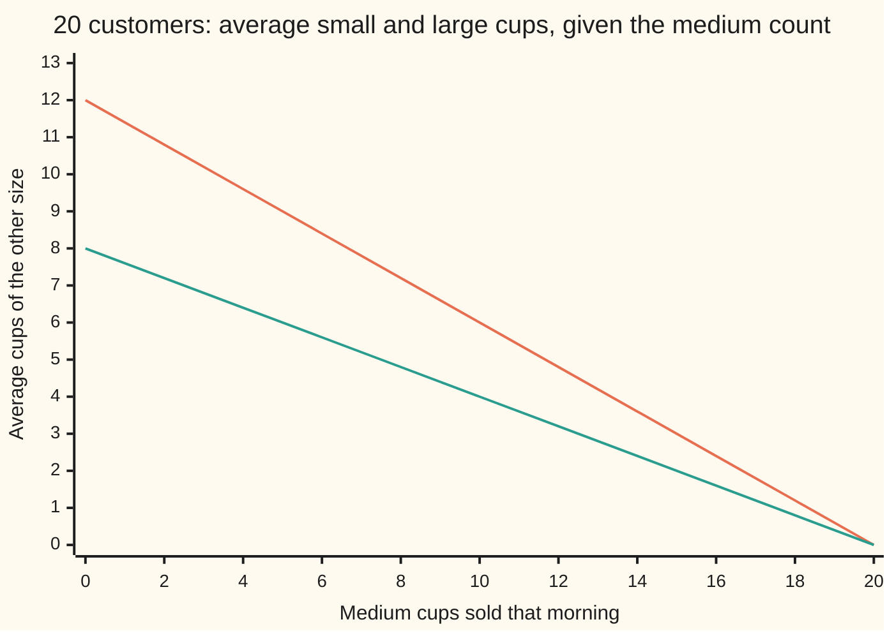
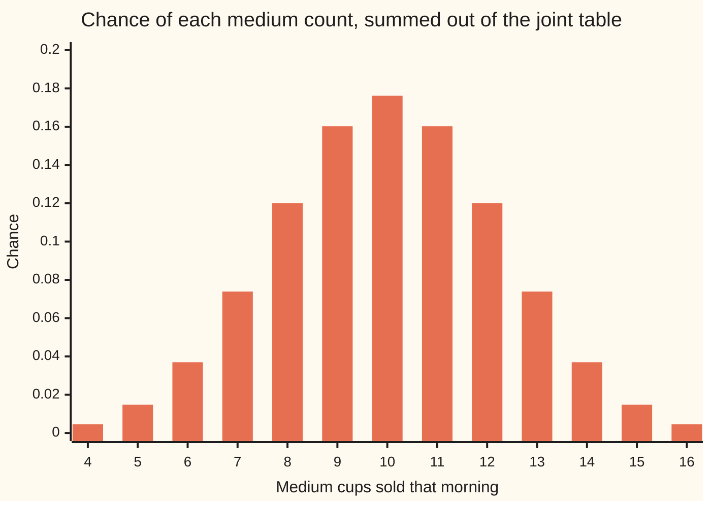

# Multinomial: several categories at once

Probability and statistics → Discrete Distributions → Counting several outcomes together → Multinomial

---

## General Overview

A coffee cart sells one drink in three cup sizes. Over months, 30% of customers take a small, 50% a medium and 20% a large. Tomorrow morning 20 customers will come, and each will choose without looking at anyone else.

How many cups of each size will go? The single most likely tally is 6 small, 10 medium and 4 large, exactly the averages. Yet it happens on only 4.4% of mornings, about 1 in 23. The rest of the chance is spread over the other 230 tallies.

One more thing is visible on the counter. A morning with many mediums is a morning with few smalls, because the 20 cups are shared. The customers act independently; the three counts do not. Given 16 mediums, the smalls average 2.40. Given 4 mediums, they average 9.60.

The law that gives the chance of every tally at once is the **multinomial distribution**, the name used from here on. It does three jobs: it prices each full tally, it says each size taken alone is a plain binomial count, and it measures exactly how hard the counts pull against each other.

**Count the orders of customers that give a tally, multiply by the chance of any one such order, and the result is the chance of that tally; each count alone is binomial, and any two counts move in opposite directions by exactly the number of customers times the two chances.**

**What kind of fact this is:** a theorem, proved on this card in Why it works, about a model; whether real customers choose independently with fixed chances is an assumption the data must support.

### The picture: a busy medium morning is a quiet small morning



The upper line is the average number of small cups, the lower line the average number of large cups, each read from the exact table of every tally. Both fall in straight lines: each extra medium removes one cup from the other two sizes, 0.6 of it small and the rest large.

---

## The formula

Notation first, in words. A **tally** is the list of counts, one per category, and its entries add to the number of customers. The counts are random variables written with capital letters, $N_1$ for small, $N_2$ for medium, $N_3$ for large; on this card they are also called S, M and L. Lower-case $k_1$, $k_2$, $k_3$ are particular values they might take. The multinomial coefficient $C(n; k_1, \ldots, k_r)$ counts the ways to split $n$ distinct things into named piles of sizes $k_1$ to $k_r$ ([splitting-into-groups](../../04-Combinatorics%20and%20graphs/02-Repeats%2C%20Groups%20and%20Double%20Counting/03-splitting-into-groups.md)). Writing $(N_1, N_2, N_3) \sim \text{Multinomial}(20;\ 0.3, 0.5, 0.2)$ is read "the three counts follow the multinomial law with 20 trials and chances 0.3, 0.5 and 0.2".

The joint mass, the chance of one whole tally:

$$P(N_1 = k_1, \ldots, N_r = k_r) = \frac{n!}{k_1!\,k_2!\cdots k_r!}\; p_1^{k_1}\, p_2^{k_2} \cdots p_r^{k_r}, \qquad k_1 + \cdots + k_r = n$$

**Read it aloud:** the number of customer orders that give this tally, times the chance of any single one of those orders.

Any tally whose counts do not add to $n$ has chance zero.

Each count alone, and each pair together:

$$N_i \sim \text{Binomial}(n, p_i), \qquad E[N_i] = n p_i, \qquad \text{Var}(N_i) = n p_i (1 - p_i)$$

$$\text{Cov}(N_i, N_j) = -\,n\, p_i\, p_j \quad (i \ne j)$$

**Read it aloud:** each size taken alone behaves like a yes-or-no count; two different sizes co-move negatively, by the number of customers times their two chances.

From the covariance and the two variances comes the correlation (the covariance divided by both standard deviations, a number between −1 and 1, defined when every chance lies strictly between 0 and 1): $-\sqrt{p_i p_j / ((1 - p_i)(1 - p_j))}$, which does not depend on $n$. For small against medium it is −0.6547.

| Symbol | Plain meaning | In our example | Push it up and the answer… |
| --- | --- | --- | --- |
| $n$ | number of independent trials | 20 customers | every mean, variance and covariance grows in proportion |
| $r$ | number of categories | 3 sizes | each chance is spread thinner |
| $i$, $j$ | labels of two categories | small is 1, medium is 2, large is 3 | — |
| $p_i$ | chance one trial lands in category $i$; they add to 1 | 0.3, 0.5, 0.2 | that count's mean rises, the others fall |
| $N_i$; $N_1$, $N_2$, $N_3$ | random count of category $i$ (S, M, L) | on one morning, say 6, 10, 4 | — |
| $k_i$; $k_1$, $k_2$, $k_3$, $k_r$ | a particular count asked about | 6, 10, 4 | — |
| $C(n; k_1, \ldots, k_r)$ | the multinomial coefficient, $n!$ over the product of the $k_i!$ | 38,798,760 | peaks when the piles are near equal |
| $E[N_i]$ | long-run average of the count | 6, 10, 4 | — |
| $\text{Var}(N_i)$ | variance: average squared distance from that mean | 4.2, 5, 3.2 | largest when $p_i$ is 0.5 |
| $\text{Cov}(N_i, N_j)$ | covariance: do the two counts rise together (positive) or trade off (negative)? | small with medium, −3 | more negative as either chance grows |
| $m$ | a fixed medium count, in Step 5 | 10 | the others' averages fall along a line |
| $t$, $s$, $A_t$, $A_s$, $B_t$ | customers, and 0-or-1 markers for "customer $t$ took category $i$ (or $j$)" | customer 7 took a medium | — |

### When it holds

- **A fixed number of trials.** Twenty customers, known in advance. If the number who turn up is itself random, the tug changes. When that number follows the law of rare arrivals in [poisson](04-poisson.md), it disappears: the three counts become independent.
- **Every trial lands in exactly one category.** Small, medium or large, no customer taking two. A customer who buys two cups is two trials, or the chances stop adding to 1.
- **The same chances for every trial.** If the morning rush takes more larges than the afternoon, each count is a mixture of binomials, more spread out than the formula says.
- **Independent trials.** Break this and the formula is simply wrong. If the customers come in 10 pairs and each pair orders alike, the tally 6, 10, 4 has chance 0.085050, not 0.044194, and the variance of the medium count doubles from 5 to 10.
- **Draws with replacement, or from a population so large it makes no difference.** Twenty cups taken from a box of 30 mixed cups is the job of [hypergeometric](03-hypergeometric.md) and its many-colour version.

---

## Why it works

### Step 0: every order with the same tally has the same chance

Write the morning as a word of 20 letters, one per customer in arrival order: S, M or L. Customers choose independently, so a word's chance is the product of its letters' chances. That product depends only on how many of each letter the word holds, not where they sit. So the chance of a tally is the chance of one word, times how many words give it. The whole proof is those two counts.

### Step 1: the joint mass, by counting words

Take the word with 6 S, then 10 M, then 4 L. Its chance is $0.3^6 \times 0.5^{10} \times 0.2^4$ = 0.000729 × 0.0009765625 × 0.0016 = 0.000000001139, about one in a billion.

How many words carry exactly 6 S, 10 M and 4 L? Choosing a word means sending each of the 20 customers into one of three named piles, the small pile of size 6, the medium pile of size 10, the large pile of size 4. That count is the multinomial coefficient: 20! / (6! 10! 4!) = 38,798,760.

Every one of those words is a different morning, none overlaps another, and each has chance 0.000000001139. Adding them gives 38,798,760 × 0.000000001139 = 0.044194. Nothing in the argument used the numbers 20, 3 or 0.3, so the same steps give the general formula.

### Step 2: the chances of all tallies add to 1

Multiply out $(p_1 + p_2 + p_3)^{20}$ by picking one term from each of the 20 brackets. Each picking is a word; its product is that word's chance. Collect the words by tally and the expansion is exactly the list of joint masses. The left side is $1^{20} = 1$. That identity is the multinomial theorem, and it is why the distribution takes its name. The table built in the code sums its 231 tallies to 1.000000.

### Step 3: each count alone is binomial

Look only at mediums. Each customer either takes a medium, with chance 0.5, or does not, with chance 0.5, independently of the rest. That is the setting of [bernoulli-and-binomial](01-bernoulli-and-binomial.md) with "small or large" lumped into one "no". So $M \sim \text{Binomial}(20, 0.5)$, with mean 10 and variance 5. The same lumping gives $S \sim \text{Binomial}(20, 0.3)$ and $L \sim \text{Binomial}(20, 0.2)$.

The code checks this the long way, summing the joint table over the other two counts, and the result matches the binomial law at every value to within 1e-12.



The bars are the medium count's chances, summed out of the full joint table; they are the Binomial(20, 0.5) bars, symmetric about 10. Counts below 4 or above 16 are left off: each carries less than the smallest bar shown.

### Step 4: the covariance, from one lumping more

Lump small and medium together. Then S + M counts customers who did not take a large, a binomial count too, and S + M = 20 − L. So the variance of S + M is the variance of L, 3.2.

The variance of a sum is the two variances plus twice the covariance:

$$\text{Var}(S + M) = \text{Var}(S) + \text{Var}(M) + 2\,\text{Cov}(S, M)$$

Put in the numbers: 3.2 = 4.2 + 5 + 2 Cov(S, M), so Cov(S, M) = −3. In general, lumping two categories gives a binomial count with chance $p_i + p_j$:

$$n (p_i + p_j)(1 - p_i - p_j) = n p_i (1 - p_i) + n p_j (1 - p_j) + 2\,\text{Cov}(N_i, N_j)$$

Expand the left side, cancel what matches on the right, and $-2 n p_i p_j$ is all that is left over: $\text{Cov}(N_i, N_j) = -n p_i p_j$.

Where the minus sign comes from, in words: on one customer, "took a small" and "took a medium" cannot both be yes. Each customer's pair of answers is negatively related, customers are independent, and 20 of them add up.

<details>
<summary>Detailed proof: the covariance from one customer at a time</summary>

For customer $t$, let $A_t$ be 1 if that customer takes category $i$ and 0 otherwise, and $B_t$ be 1 for category $j$, 0 otherwise. Then $N_i = A_1 + \cdots + A_n$ and $N_j = B_1 + \cdots + B_n$.

Covariance adds over sums in each argument, so $\text{Cov}(N_i, N_j)$ is the sum of $\text{Cov}(A_s, B_t)$ over all $n^2$ pairs of customers $s$ and $t$.

For two different customers, $A_s$ and $B_t$ are independent, so their covariance is 0.

For the same customer, $A_t B_t$ is always 0, since one customer takes one size. So $E[A_t B_t] = 0$ and $\text{Cov}(A_t, B_t) = 0 - p_i p_j = -p_i p_j$.

There are $n$ such same-customer pairs, so $\text{Cov}(N_i, N_j) = -n p_i p_j$. With $i = j$ the same sum gives $n(p_i - p_i^2)$, the binomial variance: the one line covers the whole covariance table.

</details>

### Step 5: given one count, the others are binomial on what is left

Fix the mediums at $m$. The other $20 - m$ customers each took small or large, and among customers who did not take a medium, the share taking small is 0.3 / (0.3 + 0.2) = 0.6. So given $M = m$, the small count is Binomial($20 - m$, 0.6), with average $0.6\,(20 - m)$. That is the falling line in the overview picture: 12.00 at no mediums, 6.00 at ten, 0.00 at twenty. A straight line with slope −0.6 is a negative covariance made visible.

The same numbers are reached twice more in the code: a table that adds one customer at a time, never using a factorial, and a simulation of 100,000 mornings.

---

## Worked numbers, by hand

| Step | Arithmetic | Value |
| --- | --- | --- |
| orders with 6 S, 10 M, 4 L | 20! / (6! 10! 4!) | 38,798,760 |
| small part | 0.3 multiplied 6 times | 0.000729 |
| medium part | 0.5 multiplied 10 times | 0.0009765625 |
| large part | 0.2 multiplied 4 times | 0.0016 |
| one order | 0.000729 × 0.0009765625 × 0.0016 | 0.000000001139 |
| the tally 6, 10, 4 | 38,798,760 × 0.000000001139 | **0.044194** |
| averages | 20 × 0.3, 20 × 0.5, 20 × 0.2 | 6, 10, 4 |
| variances | 20 × 0.3 × 0.7, 20 × 0.5 × 0.5, 20 × 0.2 × 0.8 | 4.2, 5, 3.2 |
| small with medium | −20 × 0.3 × 0.5 | **−3** |
| correlation | −3 / √(4.2 × 5) | −0.6547 |

The single most likely morning, 6 small, 10 medium and 4 large, turns up on 4.4% of mornings, about 1 in 23. The small and medium counts carry a correlation of about −0.65: when mediums run high, smalls run low, strongly and predictably.

The other two covariances are −1.2 (small with large) and −2 (medium with large). Each row of the table 4.2, −3, −1.2 adds to zero, because the total of 20 never moves: its variance is 0.

### What breaks if you drop a piece

| Mistake | Comes out at | What went wrong |
| --- | --- | --- |
| One order, no coefficient | 0.000000001139, not 0.044194 | Priced one arrival order; 38,798,760 orders give the tally |
| The three binomial chances multiplied, as if the counts were independent | 0.007368, not 0.044194 | The counts share the 20 cups; each binomial ignores what the others took |
| The three variances added for the total | 12.4, but the total never moves | The negative covariances were left out |
| Customers in 10 pairs ordering alike | 0.085050, variance of mediums 10, not 5 | Trials no longer independent: the multinomial formula fails |

The code prints all four. The last one is the model breaking, not an arithmetic slip: the pairs obey a multinomial of their own, 10 trials in steps of 2 cups.

---

## Code, from first principles, and it actually runs

Nothing is imported. Three roads reach the same numbers. The formula builds the coefficient from factorials. An exact table adds one customer at a time, spreading each tally's chance over its three possible next steps; it covers all 3^20 arrival orders, grouped into 231 tallies, and never uses a factorial. A simulation draws 100,000 mornings from SplitMix64, a small random number generator written out in both languages with seed 20260928, so both programs draw the same customers; each simulated number carries its standard error. The binomial check builds its coefficients by Pascal's triangle, again with no factorial.

### Python

```python
# Multinomial -- the check behind the card.  Nothing is imported.  Twenty
# customers each pick a cup size on their own: small 0.3, medium 0.5, large
# 0.2.  Three roads: the counting formula, an exact table built one customer
# at a time (every one of the 3^20 orders, grouped by tally), and a seeded
# simulation of 100,000 days drawn from SplitMix64, written out below.
N, P = 20, (0.3, 0.5, 0.2)

def fact(n):
    out = 1
    for i in range(2, n + 1):
        out *= i
    return out
def ipow(x, k):                              # x multiplied in k times
    out = 1.0
    for _ in range(k):
        out *= x
    return out
def formula(k, p, n):                        # road one: C(n; k1, k2, k3) p1^k1 p2^k2 p3^k3
    coef = fact(n) // (fact(k[0]) * fact(k[1]) * fact(k[2]))
    return coef * ipow(p[0], k[0]) * ipow(p[1], k[1]) * ipow(p[2], k[2])

def table(p, steps, size):                   # road two: law[s][m], large = total - s - m
    law = [[0.0] * (N + 1) for _ in range(N + 1)]
    law[0][0] = 1.0
    for t in range(steps):
        new = [[0.0] * (N + 1) for _ in range(N + 1)]
        for s in range(t * size + 1):
            for m in range(t * size - s + 1):
                w = law[s][m]
                new[s + size][m] += w * p[0]      # this customer (or pair) takes small
                new[s][m + size] += w * p[1]      # medium
                new[s][m] += w * p[2]             # large
        law = new
    return law

def moments(law):                            # E[S], E[M], E[L], then the 3 x 3 covariances
    cells = [(s, m, N - s - m, law[s][m]) for s in range(N + 1) for m in range(N + 1 - s)]
    mean = [0.0, 0.0, 0.0]
    for c in cells:
        for i in range(3):
            mean[i] += c[i] * c[3]
    cov = [[0.0] * 3 for _ in range(3)]
    for c in cells:
        for i in range(3):
            for j in range(3):
                cov[i][j] += (c[i] - mean[i]) * (c[j] - mean[j]) * c[3]
    return mean, cov

def add(xs):                                 # plain left-to-right sum, as in Rust
    out = 0.0
    for x in xs:
        out += x
    return out

def binom_pmf(n, p):                         # Pascal's triangle, no factorials
    row = [1]
    for _ in range(n):
        row = [1] + [row[i] + row[i + 1] for i in range(len(row) - 1)] + [1]
    return [row[k] * ipow(p, k) * ipow(1 - p, n - k) for k in range(n + 1)]

law = table(P, N, 1)
exact = formula((6, 10, 4), P, N)
total = 0.0
best = (0, 0, 0.0)
for s in range(N + 1):
    for m in range(N + 1 - s):
        total += law[s][m]
        if law[s][m] > best[2]:
            best = (s, m, law[s][m])
mean, cov = moments(law)
corr = cov[0][1] / (cov[0][0] * cov[1][1]) ** 0.5
print(f"coefficient C(20; 6, 10, 4) = {fact(20) // (fact(6) * fact(10) * fact(4))}")
print(f"one order, 6 small then 10 medium then 4 large = {ipow(0.3, 6) * ipow(0.5, 10) * ipow(0.2, 4):.12f}")
print(f"its pieces: 0.3^6 = {ipow(0.3, 6):.10f}, 0.5^10 = {ipow(0.5, 10):.10f}, 0.2^4 = {ipow(0.2, 4):.10f}")
print(f"P(6, 10, 4) by the formula          = {exact:.6f}")
print(f"P(6, 10, 4) by the customer table   = {law[6][10]:.6f}")
print(f"table total over {(N + 1) * (N + 2) // 2} tallies = {total:.6f}; most likely tally {best[0]}, {best[1]}, {N - best[0] - best[1]}")
print(f"means from the table: small {mean[0]:.4f}, medium {mean[1]:.4f}, large {mean[2]:.4f}")
for i, name in enumerate(("small", "medium", "large")):
    print(f"covariance row {name:6s}: {cov[i][0]:8.4f} {cov[i][1]:8.4f} {cov[i][2]:8.4f}; formula diagonal {N * P[i] * (1 - P[i]):.4f}")
print(f"formula off-diagonal: -n p1 p2 = {-N * P[0] * P[1]:.4f}, -n p1 p3 = {-N * P[0] * P[2]:.4f}, -n p2 p3 = {-N * P[1] * P[2]:.4f}")
print(f"correlation small with medium = {corr:.4f}; variance of the total = {add(add(r) for r in cov):.4f}")
marg_err = 0.0                               # each count alone, summed out of the table
for i in range(3):
    marg, pmf = [0.0] * (N + 1), binom_pmf(N, P[i])
    for s in range(N + 1):
        for m in range(N + 1 - s):
            marg[(s, m, N - s - m)[i]] += law[s][m]
    marg_err = max(marg_err, max(abs(marg[a] - pmf[a]) for a in range(N + 1)))
print(f"each count alone matches Binomial(20, its chance) to 1e-12: {'yes' if marg_err < 1e-12 else 'no'}")
print("figure, P(medium = m), m = 4..16: " + ", ".join(f"{add(law[s][m] for s in range(N + 1 - m)):.4f}" for m in range(4, 17)))
cond = []
for m in range(0, N + 1, 2):
    w = [law[s][m] for s in range(N + 1 - m)]
    cond.append(add(s * w[s] for s in range(len(w))) / add(w))
print("figure, mean small given m medium, m = 0,2..20: " + ", ".join(f"{c:.2f}" for c in cond))
print("figure, mean large given m medium, m = 0,2..20: " + ", ".join(f"{(N - m) - c:.2f}" for m, c in zip(range(0, N + 1, 2), cond)))
print(f"given m medium, each other customer is small with chance 0.3 / (0.3 + 0.2) = {P[0] / (P[0] + P[2]):.4f}")
state, MASK = 20260928, (1 << 64) - 1
def draw():                                  # SplitMix64, top 53 bits
    global state
    state = (state + 0x9E3779B97F4A7C15) & MASK
    z = state
    z = ((z ^ (z >> 30)) * 0xBF58476D1CE4E5B9) & MASK
    z = ((z ^ (z >> 27)) * 0x94D049BB133111EB) & MASK
    return (z ^ (z >> 31)) >> 11
CUT1, CUT2, DAYS = int(0.3 * 2.0 ** 53), int(0.8 * 2.0 ** 53), 100000
hits, days, ss, sm, ssm = 0, [], 0, 0, 0
for _ in range(DAYS):                        # road three: simulate the days
    s = m = 0
    for _ in range(N):
        u = draw()
        if u < CUT1: s += 1
        elif u < CUT2: m += 1
    hits += (s, m) == (6, 10)
    days.append((s, m))
    ss, sm, ssm = ss + s, sm + m, ssm + s * m
ph = hits / DAYS
cov_sim = (ssm - ss * sm / DAYS) / (DAYS - 1)
dev = 0.0
for s, m in days:
    d = (s - ss / DAYS) * (m - sm / DAYS) - cov_sim
    dev += d * d
se_cov = (dev / (DAYS - 1) / DAYS) ** 0.5
se_p = (ph * (1 - ph) / DAYS) ** 0.5
print(f"simulated {DAYS} days, seed 20260928: P(6, 10, 4) = {ph:.5f} +/- {se_p:.5f}; Cov(small, medium) = {cov_sim:.4f} +/- {se_cov:.4f}")
indep = binom_pmf(N, P[0])[6] * binom_pmf(N, P[1])[10] * binom_pmf(N, P[2])[4]
pairs = table(P, N // 2, 2)
pm, pc = moments(pairs)
print(f"mistake 1, one order only, no coefficient: {ipow(0.3, 6) * ipow(0.5, 10) * ipow(0.2, 4):.12f}, not {exact:.6f}")
print(f"mistake 2, three binomial chances multiplied as if independent: {indep:.6f}, not {exact:.6f}")
print(f"mistake 3, the three variances added: {cov[0][0] + cov[1][1] + cov[2][2]:.4f}, but the total never moves")
print(f"mistake 4, customers in 10 pairs ordering alike: P(6, 10, 4) = {pairs[6][10]:.6f}, formula on pairs {formula((3, 5, 2), P, 10):.6f}; Var(medium) = {pc[1][1]:.4f}; Cov(small, medium) = {pc[0][1]:.4f}")
assert abs(exact - law[6][10]) < 1e-12 * exact             # formula against the table
assert marg_err < 1e-12 and abs(total - 1) < 1e-12          # marginals are the binomials
assert all(abs(cov[i][j] - (N * P[i] * ((i == j) - P[j]))) < 1e-9 for i in range(3) for j in range(3))
assert best[:2] == (6, 10) and all(abs(c - P[0] / (P[0] + P[2]) * (N - m)) < 1e-9 for m, c in zip(range(0, N + 1, 2), cond))
assert abs(ph - exact) < 4 * se_p and abs(cov_sim - cov[0][1]) < 4 * se_cov   # simulation agrees
assert abs(pairs[6][10] - formula((3, 5, 2), P, 10)) < 1e-12 and abs(pc[1][1] - 2 * cov[1][1]) < 1e-9
print("ALL CHECKS PASS")
```

**Ran 2026-09-28 on macOS, Python 3.14.6, standard library only. All checks passed. Output, pasted from the run:**

```
coefficient C(20; 6, 10, 4) = 38798760
one order, 6 small then 10 medium then 4 large = 0.000000001139
its pieces: 0.3^6 = 0.0007290000, 0.5^10 = 0.0009765625, 0.2^4 = 0.0016000000
P(6, 10, 4) by the formula          = 0.044194
P(6, 10, 4) by the customer table   = 0.044194
table total over 231 tallies = 1.000000; most likely tally 6, 10, 4
means from the table: small 6.0000, medium 10.0000, large 4.0000
covariance row small :   4.2000  -3.0000  -1.2000; formula diagonal 4.2000
covariance row medium:  -3.0000   5.0000  -2.0000; formula diagonal 5.0000
covariance row large :  -1.2000  -2.0000   3.2000; formula diagonal 3.2000
formula off-diagonal: -n p1 p2 = -3.0000, -n p1 p3 = -1.2000, -n p2 p3 = -2.0000
correlation small with medium = -0.6547; variance of the total = 0.0000
each count alone matches Binomial(20, its chance) to 1e-12: yes
figure, P(medium = m), m = 4..16: 0.0046, 0.0148, 0.0370, 0.0739, 0.1201, 0.1602, 0.1762, 0.1602, 0.1201, 0.0739, 0.0370, 0.0148, 0.0046
figure, mean small given m medium, m = 0,2..20: 12.00, 10.80, 9.60, 8.40, 7.20, 6.00, 4.80, 3.60, 2.40, 1.20, 0.00
figure, mean large given m medium, m = 0,2..20: 8.00, 7.20, 6.40, 5.60, 4.80, 4.00, 3.20, 2.40, 1.60, 0.80, 0.00
given m medium, each other customer is small with chance 0.3 / (0.3 + 0.2) = 0.6000
simulated 100000 days, seed 20260928: P(6, 10, 4) = 0.04462 +/- 0.00065; Cov(small, medium) = -3.0138 +/- 0.0170
mistake 1, one order only, no coefficient: 0.000000001139, not 0.044194
mistake 2, three binomial chances multiplied as if independent: 0.007368, not 0.044194
mistake 3, the three variances added: 12.4000, but the total never moves
mistake 4, customers in 10 pairs ordering alike: P(6, 10, 4) = 0.085050, formula on pairs 0.085050; Var(medium) = 10.0000; Cov(small, medium) = -6.0000
ALL CHECKS PASS
```

### Rust

Same numbers, same labels, built with `rustc --edition 2021 -O`.

```rust
// Multinomial -- the same check as the Python, in Rust.  No crates.  Twenty
// customers each pick a cup size on their own: small 0.3, medium 0.5, large
// 0.2.  Three roads: the counting formula, an exact table built one customer
// at a time (every one of the 3^20 orders, grouped by tally), and a seeded
// simulation of 100,000 days drawn from SplitMix64, written out below.
const N: usize = 20;
const P: [f64; 3] = [0.3, 0.5, 0.2];
type Law = Vec<Vec<f64>>;

fn fact(n: usize) -> u128 { (2..=n as u128).product() }

fn ipow(x: f64, k: usize) -> f64 {                // x multiplied in k times
    let mut out = 1.0;
    for _ in 0..k { out *= x }
    out
}

fn formula(k: [usize; 3], p: [f64; 3], n: usize) -> f64 {   // road one
    let coef = fact(n) / (fact(k[0]) * fact(k[1]) * fact(k[2]));
    coef as f64 * ipow(p[0], k[0]) * ipow(p[1], k[1]) * ipow(p[2], k[2])
}

fn table(p: [f64; 3], steps: usize, size: usize) -> Law {    // road two: law[s][m]
    let mut law = vec![vec![0.0; N + 1]; N + 1];
    law[0][0] = 1.0;
    for t in 0..steps {
        let mut new = vec![vec![0.0; N + 1]; N + 1];
        for s in 0..=t * size {
            for m in 0..=(t * size - s) {
                let w = law[s][m];
                new[s + size][m] += w * p[0];     // this customer (or pair) takes small
                new[s][m + size] += w * p[1];     // medium
                new[s][m] += w * p[2];            // large
            }
        }
        law = new;
    }
    law
}

fn moments(law: &Law) -> ([f64; 3], [[f64; 3]; 3]) {
    let mut cells = Vec::new();
    for s in 0..=N { for m in 0..=(N - s) { cells.push(([s as f64, m as f64, (N - s - m) as f64], law[s][m])) } }
    let mut mean = [0.0; 3];
    for (c, w) in &cells { for i in 0..3 { mean[i] += c[i] * w } }
    let mut cov = [[0.0; 3]; 3];
    for (c, w) in &cells {
        for i in 0..3 { for j in 0..3 { cov[i][j] += (c[i] - mean[i]) * (c[j] - mean[j]) * w } }
    }
    (mean, cov)
}

fn add(xs: impl Iterator<Item = f64>) -> f64 {   // plain left-to-right sum
    let mut out = 0.0;
    for x in xs { out += x }
    out
}

fn binom_pmf(n: usize, p: f64) -> Vec<f64> {      // Pascal's triangle, no factorials
    let mut row: Vec<u64> = vec![1];
    for _ in 0..n {
        let mut next = vec![1];
        for i in 0..row.len() - 1 { next.push(row[i] + row[i + 1]) }
        next.push(1);
        row = next;
    }
    (0..=n).map(|k| row[k] as f64 * ipow(p, k) * ipow(1.0 - p, n - k)).collect()
}

struct SplitMix(u64);
impl SplitMix {
    fn draw(&mut self) -> u64 {                   // SplitMix64, top 53 bits
        self.0 = self.0.wrapping_add(0x9E3779B97F4A7C15);
        let mut z = self.0;
        z = (z ^ (z >> 30)).wrapping_mul(0xBF58476D1CE4E5B9);
        z = (z ^ (z >> 27)).wrapping_mul(0x94D049BB133111EB);
        (z ^ (z >> 31)) >> 11
    }
}

fn main() {
    let law = table(P, N, 1);
    let exact = formula([6, 10, 4], P, N);
    let one_order = ipow(0.3, 6) * ipow(0.5, 10) * ipow(0.2, 4);
    let (mut total, mut best) = (0.0, (0, 0, 0.0));
    for s in 0..=N {
        for m in 0..=(N - s) {
            total += law[s][m];
            if law[s][m] > best.2 { best = (s, m, law[s][m]) }
        }
    }
    let (mean, cov) = moments(&law);
    let corr = cov[0][1] / (cov[0][0] * cov[1][1]).sqrt();
    let nf = N as f64;
    println!("coefficient C(20; 6, 10, 4) = {}", fact(20) / (fact(6) * fact(10) * fact(4)));
    println!("one order, 6 small then 10 medium then 4 large = {:.12}", one_order);
    println!("its pieces: 0.3^6 = {:.10}, 0.5^10 = {:.10}, 0.2^4 = {:.10}", ipow(0.3, 6), ipow(0.5, 10), ipow(0.2, 4));
    println!("P(6, 10, 4) by the formula          = {:.6}", exact);
    println!("P(6, 10, 4) by the customer table   = {:.6}", law[6][10]);
    println!("table total over {} tallies = {:.6}; most likely tally {}, {}, {}", (N + 1) * (N + 2) / 2, total, best.0, best.1, N - best.0 - best.1);
    println!("means from the table: small {:.4}, medium {:.4}, large {:.4}", mean[0], mean[1], mean[2]);
    for (i, name) in ["small", "medium", "large"].iter().enumerate() {
        println!("covariance row {:6}: {:8.4} {:8.4} {:8.4}; formula diagonal {:.4}", name, cov[i][0], cov[i][1], cov[i][2], nf * P[i] * (1.0 - P[i]));
    }
    println!("formula off-diagonal: -n p1 p2 = {:.4}, -n p1 p3 = {:.4}, -n p2 p3 = {:.4}", -nf * P[0] * P[1], -nf * P[0] * P[2], -nf * P[1] * P[2]);
    println!("correlation small with medium = {:.4}; variance of the total = {:.4}", corr, add(cov.iter().map(|r| add(r.iter().copied()))));
    let mut marg_err: f64 = 0.0;                  // each count alone, summed out of the table
    for i in 0..3 {
        let (mut marg, pmf) = (vec![0.0; N + 1], binom_pmf(N, P[i]));
        for s in 0..=N { for m in 0..=(N - s) { marg[[s, m, N - s - m][i]] += law[s][m] } }
        for a in 0..=N { marg_err = marg_err.max((marg[a] - pmf[a]).abs()) }
    }
    println!("each count alone matches Binomial(20, its chance) to 1e-12: {}", if marg_err < 1e-12 { "yes" } else { "no" });
    let bars: Vec<String> = (4..=16).map(|m| format!("{:.4}", add((0..=(N - m)).map(|s| law[s][m])))).collect();
    println!("figure, P(medium = m), m = 4..16: {}", bars.join(", "));
    let ms: Vec<usize> = (0..=N).step_by(2).collect();
    let cond: Vec<f64> = ms.iter().map(|&m| {
        let w: Vec<f64> = (0..=(N - m)).map(|s| law[s][m]).collect();
        add((0..w.len()).map(|s| s as f64 * w[s])) / add(w.iter().copied())
    }).collect();
    println!("figure, mean small given m medium, m = 0,2..20: {}", cond.iter().map(|c| format!("{:.2}", c)).collect::<Vec<_>>().join(", "));
    println!("figure, mean large given m medium, m = 0,2..20: {}", ms.iter().zip(&cond).map(|(&m, c)| format!("{:.2}", (N - m) as f64 - c)).collect::<Vec<_>>().join(", "));
    println!("given m medium, each other customer is small with chance 0.3 / (0.3 + 0.2) = {:.4}", P[0] / (P[0] + P[2]));
    let mut rng = SplitMix(20260928);
    let (cut1, cut2, days_n) = ((0.3 * 2f64.powi(53)) as u64, (0.8 * 2f64.powi(53)) as u64, 100000usize);
    let (mut hits, mut days, mut ss, mut sm, mut ssm) = (0usize, Vec::new(), 0i64, 0i64, 0i64);
    for _ in 0..days_n {                          // road three: simulate the days
        let (mut s, mut m) = (0i64, 0i64);
        for _ in 0..N {
            let u = rng.draw();
            if u < cut1 { s += 1 } else if u < cut2 { m += 1 }
        }
        if (s, m) == (6, 10) { hits += 1 }
        days.push((s, m));
        ss += s; sm += m; ssm += s * m;
    }
    let d = days_n as f64;
    let ph = hits as f64 / d;
    let cov_sim = (ssm as f64 - (ss * sm) as f64 / d) / (d - 1.0);
    let mut dev = 0.0;
    for &(s, m) in &days {
        let x = (s as f64 - ss as f64 / d) * (m as f64 - sm as f64 / d) - cov_sim;
        dev += x * x;
    }
    let se_cov = (dev / (d - 1.0) / d).sqrt();
    let se_p = (ph * (1.0 - ph) / d).sqrt();
    println!("simulated {} days, seed 20260928: P(6, 10, 4) = {:.5} +/- {:.5}; Cov(small, medium) = {:.4} +/- {:.4}", days_n, ph, se_p, cov_sim, se_cov);
    let indep = binom_pmf(N, P[0])[6] * binom_pmf(N, P[1])[10] * binom_pmf(N, P[2])[4];
    let pairs = table(P, N / 2, 2);
    let (_, pc) = moments(&pairs);
    let pair_formula = formula([3, 5, 2], P, 10);
    println!("mistake 1, one order only, no coefficient: {:.12}, not {:.6}", one_order, exact);
    println!("mistake 2, three binomial chances multiplied as if independent: {:.6}, not {:.6}", indep, exact);
    println!("mistake 3, the three variances added: {:.4}, but the total never moves", cov[0][0] + cov[1][1] + cov[2][2]);
    println!("mistake 4, customers in 10 pairs ordering alike: P(6, 10, 4) = {:.6}, formula on pairs {:.6}; Var(medium) = {:.4}; Cov(small, medium) = {:.4}", pairs[6][10], pair_formula, pc[1][1], pc[0][1]);
    assert!((exact - law[6][10]).abs() < 1e-12 * exact);                // formula against the table
    assert!(marg_err < 1e-12 && (total - 1.0).abs() < 1e-12);           // marginals are the binomials
    for i in 0..3 { for j in 0..3 {
        let want = nf * P[i] * ((if i == j { 1.0 } else { 0.0 }) - P[j]);
        assert!((cov[i][j] - want).abs() < 1e-9);
    } }
    assert!((best.0, best.1) == (6, 10) && ms.iter().zip(&cond).all(|(&m, c)| (c - P[0] / (P[0] + P[2]) * (N - m) as f64).abs() < 1e-9));
    assert!((ph - exact).abs() < 4.0 * se_p && (cov_sim - cov[0][1]).abs() < 4.0 * se_cov);   // simulation agrees
    assert!((pairs[6][10] - pair_formula).abs() < 1e-12 && (pc[1][1] - 2.0 * cov[1][1]).abs() < 1e-9);
    println!("ALL CHECKS PASS");
}
```

**Ran 2026-09-28 on macOS, rustc 1.98.1, no crates. All checks passed. Output, pasted from the run:**

```
coefficient C(20; 6, 10, 4) = 38798760
one order, 6 small then 10 medium then 4 large = 0.000000001139
its pieces: 0.3^6 = 0.0007290000, 0.5^10 = 0.0009765625, 0.2^4 = 0.0016000000
P(6, 10, 4) by the formula          = 0.044194
P(6, 10, 4) by the customer table   = 0.044194
table total over 231 tallies = 1.000000; most likely tally 6, 10, 4
means from the table: small 6.0000, medium 10.0000, large 4.0000
covariance row small :   4.2000  -3.0000  -1.2000; formula diagonal 4.2000
covariance row medium:  -3.0000   5.0000  -2.0000; formula diagonal 5.0000
covariance row large :  -1.2000  -2.0000   3.2000; formula diagonal 3.2000
formula off-diagonal: -n p1 p2 = -3.0000, -n p1 p3 = -1.2000, -n p2 p3 = -2.0000
correlation small with medium = -0.6547; variance of the total = 0.0000
each count alone matches Binomial(20, its chance) to 1e-12: yes
figure, P(medium = m), m = 4..16: 0.0046, 0.0148, 0.0370, 0.0739, 0.1201, 0.1602, 0.1762, 0.1602, 0.1201, 0.0739, 0.0370, 0.0148, 0.0046
figure, mean small given m medium, m = 0,2..20: 12.00, 10.80, 9.60, 8.40, 7.20, 6.00, 4.80, 3.60, 2.40, 1.20, 0.00
figure, mean large given m medium, m = 0,2..20: 8.00, 7.20, 6.40, 5.60, 4.80, 4.00, 3.20, 2.40, 1.60, 0.80, 0.00
given m medium, each other customer is small with chance 0.3 / (0.3 + 0.2) = 0.6000
simulated 100000 days, seed 20260928: P(6, 10, 4) = 0.04462 +/- 0.00065; Cov(small, medium) = -3.0138 +/- 0.0170
mistake 1, one order only, no coefficient: 0.000000001139, not 0.044194
mistake 2, three binomial chances multiplied as if independent: 0.007368, not 0.044194
mistake 3, the three variances added: 12.4000, but the total never moves
mistake 4, customers in 10 pairs ordering alike: P(6, 10, 4) = 0.085050, formula on pairs 0.085050; Var(medium) = 10.0000; Cov(small, medium) = -6.0000
ALL CHECKS PASS
```

The two outputs match line for line, the simulation included, because both draw the same numbers from the same generator.

> [!TIP]
> **Try changing**
> Guess first, then run it.
> - **Fewer mornings.** Set `DAYS` to 10000. Guess how the ± on the simulated chance changes. It grows about threefold, the square root of ten, and the estimate wanders further from 0.044194; the asserts allow four standard errors, so they still pass.
> - **Mis-price the large cup in the table.** Change `w * p[2]` in `table` to `w * p[1]`. Guess which check notices. The table's chances no longer add to 1, and the first assert, formula against table, stops it.
> - **Bigger groups.** Change `table(P, N // 2, 2)` to `table(P, 5, 4)`: five groups of four ordering alike. Guess the medium variance. It is four times the independent 5, and the last assert, which expects double, stops it.
> - **Move the medium cut.** Change `0.8` in `CUT2` to `0.7`, so the simulated customers take medium only 40% of the time. The simulated tally chance drops far below 0.044194 and the simulation assert stops it.

---

## The usual mistake

> [!warning]
> **Independent customers do not make independent counts.** Each customer ignores the others, yet the counts share one fixed total, so knowing one says something about the rest. Multiplying the three binomial chances as if the counts were independent gives 0.007368 for the tally 6, 10, 4; the truth is 0.044194, about six times larger.
>
> - **Pricing one order and stopping.** 0.000000001139 is the chance of one arrival order. The tally needs every order: 38,798,760 of them.
> - **Adding variances across categories.** The variances 4.2, 5 and 3.2 add to 12.4, but the total is always 20, variance 0. The covariances −3, −1.2 and −2, each counted twice, bring it back to zero.
> - **Forgetting the covariance in a difference.** The gap between two counts, such as mediums minus smalls, varies more than the two variances alone suggest: the variance of a difference subtracts twice the covariance, and subtracting a negative adds.
> - **Using it when trials are linked.** Friends who order alike break independence: in pairs the tally 6, 10, 4 comes out at 0.085050 and the medium variance doubles to 10.

---

## Where you meet it in real life

- **Stocking by size.** A shop orders shirts in small, medium and large, or a cart its cups; the multinomial prices each mix, and the negative covariance says a shortage of one size tends to come with a surplus of another.
- **Opinion polls.** A poll of voters among three parties gives multinomial counts. The standard error of the lead, one party's share minus another's, must include the covariance, which widens it.
- **Genetics.** Offspring of two parents who each carry one copy of a gene variant fall into three genotype classes with fixed chances; the class counts in a litter are multinomial.
- **Word counts in text.** A document read as a string of words drawn from a vocabulary gives multinomial word counts, the starting model for classifying spam and for topic models.
- **Dice and fairness tests.** Counting faces over many rolls of a die is a six-category multinomial; the test of whether the die is fair compares the counts with their averages, allowing for how the counts co-move.

> **Say it back**
> Twenty independent customers each pick one of three sizes with fixed chances. The chance of a tally is the number of arrival orders that give it, the multinomial coefficient, times the chance of one order. Each size alone is a binomial count, because every customer either took it or did not. Two sizes move against each other with covariance minus the number of customers times their two chances, since one customer cannot take both. The customers are independent; the counts are not, because they share one total.

---

## What this builds on

- [bernoulli-and-binomial](01-bernoulli-and-binomial.md): the two-category case, and the law each count follows alone.
- [splitting-into-groups](../../04-Combinatorics%20and%20graphs/02-Repeats%2C%20Groups%20and%20Double%20Counting/03-splitting-into-groups.md): the multinomial coefficient, counting ways to fill named piles.

## Where this goes next

- [sums-of-discrete-variables](06-sums-of-discrete-variables.md): adding counts in general, where the lumping of Step 3 becomes a rule.
- [birthday-and-coupon-collector](07-birthday-and-coupon-collector.md): many categories and many trials, asking when every category has been seen at least once.
- [poisson](04-poisson.md): let the number of customers itself follow the Poisson law, and the three counts become independent.

The multinomial says how counts behave when the chances are known; turning an observed tally back into estimates of the chances, with honest error bars that respect the covariance, is the work of the estimation shelf.

---

## Sources

Verified 2026-09-28: every link below resolves to the publisher's page.

- Siegrist, Kyle. "The Multinomial Distribution." *Random: Probability, Mathematical Statistics, Stochastic Processes*. [Web chapter](https://www.randomservices.org/random/bernoulli/Multinomial.html). Joint mass, binomial marginals, and the covariance by indicators, as in the folded proof.
- Blitzstein, Joseph K., and Jessica Hwang. *Introduction to Probability*, 2nd ed. CRC Press, 2019. [Publisher page](https://www.routledge.com/Introduction-to-Probability-Second-Edition/Blitzstein-Hwang/p/book/9781138369917). The multinomial in its chapter on joint distributions, with lumping and conditioning as used in Steps 3 and 5.
- Feller, William. *An Introduction to Probability Theory and Its Applications*, Volume 1, 3rd ed. Wiley, 1968. [Publisher page](https://www.wiley.com/en-us/An+Introduction+to+Probability+Theory+and+Its+Applications%2C+Volume+1%2C+3rd+Edition-p-9780471257080). The classic treatment of the multinomial distribution and the counting behind it.
