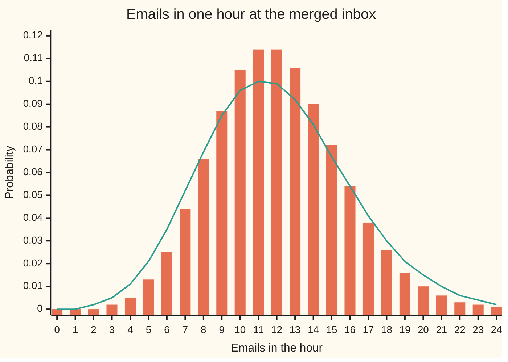

# Adding counts: convolution, and why binomials and Poissons stay in the family

Probability and statistics → Discrete Distributions → Merging independent counts → Adding counts

---

## General Overview

A company runs two help desks. The billing desk receives 5 emails an hour on average. The technical desk receives 7. Each desk's hourly count follows the Poisson law, the law of rare events arriving independently at a steady rate ([poisson](04-poisson.md)). Next month the two inboxes merge into one, staffed by one team.

The team lead needs two numbers. What is the chance the merged inbox gets exactly 12 emails in an hour? And what is the chance it gets 16 or more, the point where the team falls behind? Knowing each desk's law is not yet an answer. The merged count is a sum, and the chance of a sum has to be built from the chances of its parts.

The build is mechanical. Twelve emails can arrive as 0 billing and 12 technical, or 1 and 11, or 2 and 10, and so on up to 12 and 0. These thirteen splits cannot happen together, so their chances add. When the desks do not influence each other, each split's chance is a product of two chances already known. Adding up those products over every split is called **convolution**, the word used from here on. It gives 0.114368: about 1 hour in 9 brings exactly 12 emails.

Then something tidy happens. The merged count is itself Poisson, with rate 12 = 5 + 7. The same holds for the binomial law, the count of successes in a fixed number of independent tries, when both parts share one chance of success. These two families are closed under independent addition. Most families are not.

**The chance that two independent counts add to a total is the sum, over every way of splitting that total, of the product of the two chances; for two Poisson counts, or two binomial counts with the same chance of success, the result stays in the same family.**

**What kind of fact this is:** convolution is a theorem about any two independent counts, and the two closure results are theorems; all three are proved on this card in Why it works.

### The picture: the merged inbox, and what dependence does to it



Bars: the merged count when the desks are independent, which is Poisson with rate 12. Line: the same two desks, each still averaging 5 and 7, but with some customers copying one email to both desks (What breaks, below). Same average of 12, a flatter and wider law. The bars peak at 11 and 12 together, each about 0.114.

---

## The formula

Notation first, in words. A capital letter is a random count and $P(X = k)$ is the chance it equals $k$. "$X$ ~ Poisson($\lambda$)" reads "$X$ follows the Poisson law with average $\lambda$". The sign $\sum_{k=0}^{s}$ means "add up the following, for $k$ = 0, 1, and so on up to $s$".

$$P(X + Y = s) \;=\; \sum_{k=0}^{s} P(X = k)\,P(Y = s - k) \qquad \text{for independent counts } X, Y \ge 0$$

**Read it aloud:** the chance the two counts total $s$ is found by letting the first count take each possible value $k$, letting the second supply the rest, multiplying those two chances, and adding over all $k$.

The two closure results follow from it:

$$X \sim \text{Poisson}(\lambda),\; Y \sim \text{Poisson}(\mu) \;\Longrightarrow\; X + Y \sim \text{Poisson}(\lambda + \mu)$$

$$X \sim \text{Binomial}(n, p),\; Y \sim \text{Binomial}(m, p) \;\Longrightarrow\; X + Y \sim \text{Binomial}(n + m, p)$$

**Read them aloud:** independent Poisson counts add to a Poisson count whose average is the sum of the averages; independent binomial counts with the same chance of success add to a binomial count over all the tries together.

| Symbol | Plain meaning | In our example | Push it up and the answer… |
| --- | --- | --- | --- |
| $X$ | the first count | billing emails in an hour | — |
| $Y$ | the second count, independent of the first | technical emails in the same hour | — |
| $S$ | the total, $X + Y$ | merged inbox, one hour | — |
| $s$ | one value the total might take | 12 | the list of splits grows by one |
| $k$ | the first count's share of the total, running over every split | 0 to 12 | — |
| $\lambda$ | average of the first Poisson count. Say "lambda". | 5 an hour | the merged average rises with it |
| $\mu$ | average of the second Poisson count. Say "mu". | 7 an hour | the same |
| $n$ | tries behind the first binomial count | 20 Monday replies | more tries, more successes |
| $m$ | tries behind the second binomial count | 30 Tuesday replies | the same |
| $p$ | the shared chance of success on each try | 0.7, a reply that resolves the case | the merged count shifts up |
| $t$ | a dial for the moment generating function, any real number | 0.5 | — |
| $M_X(t)$ | the moment generating function $E[e^{tX}]$: the long-run average of e raised to $t$ times the count | 2403.437416 for the merged count at 0.5 | grows with $t$ |

Two helper facts carry the proofs. The Poisson mass is $P(X = k) = e^{-\lambda}\lambda^k/k!$, where e is about 2.718 and $k!$ is 1 × 2 × … × $k$. The binomial mass is $P(X = k) = C(n,k)\,p^k(1-p)^{n-k}$, where $C(n,k)$ counts the ways to choose $k$ of $n$ tries.

### When it holds

- **Independence.** The formula multiplies the two chances in each split. If the counts share a cause, such as one email copied to both desks, the product is the wrong weight and the sum law changes even though each desk's own law does not. The copied-email case gives 0.098759 for exactly 12, not 0.114368.
- **Same window.** Both counts cover the same hour. Adding a billing hour to a technical half-hour is legitimate, but the average is then billing's 5 plus half of technical's 7, not 12.
- **Same chance of success, for binomial closure.** With 0.7 on Monday and 0.5 on Tuesday the sum is still computed by convolution, but it is not binomial with any single chance.
- **Whole-number counts.** The splits run over whole numbers. Continuous amounts, such as waiting times, need the integral version on a later shelf.

---

## Why it works

### Step 0: split the total by its first part

The event "the total is 12" is the same as "billing got 0 and technical got 12, or billing got 1 and technical got 11, or …". These pieces never overlap: an hour has one billing count. Chances of non-overlapping events add. Independence then turns each piece's chance into a product of chances already known. That is the whole theorem. The closure results are algebra on top of it.

### Step 1: the convolution formula

For any whole number $s$, the event $X + Y = s$ splits into the pieces $X = k$ and $Y = s - k$, for $k$ from 0 to $s$. Adding the non-overlapping pieces:

$$P(X + Y = s) = \sum_{k=0}^{s} P(X = k \text{ and } Y = s-k).$$

Independence means the chance of both is the product of the chances. Substituting gives the formula. For $s$ = 12 on the help desks, the thirteen products appear in Worked numbers below and add to 0.114368.

### Step 2: two Poisson counts make a Poisson count

Put the Poisson masses into the formula. Each term is

$$e^{-\lambda}\frac{\lambda^k}{k!}\; e^{-\mu}\frac{\mu^{s-k}}{(s-k)!}.$$

Pull out what does not depend on $k$, and multiply and divide by $s!$:

$$P(X+Y=s) = \frac{e^{-(\lambda+\mu)}}{s!}\sum_{k=0}^{s} \frac{s!}{k!\,(s-k)!}\lambda^k\mu^{s-k}.$$

The fraction inside is $C(s,k)$. The sum is then the binomial theorem, the expansion of $(\lambda + \mu)^s$ term by term. So

$$P(X+Y=s) = e^{-(\lambda+\mu)}\frac{(\lambda+\mu)^s}{s!},$$

the Poisson mass with average $\lambda + \mu$. For the desks: rate 12, and at 12 emails the same 0.114368.

### Step 3: two binomial counts with one chance make a binomial count

The plain-words proof is shorter than the algebra. Monday's 20 replies and Tuesday's 30 replies are 50 independent tries, each resolving with chance 0.7. The count of resolved cases over all 50 is binomial with 50 tries by the definition of the binomial law. Splitting the 50 into two days changes nothing.

The algebra agrees. Every term of the convolution carries the same factor $p^s(1-p)^{n+m-s}$, and what remains is a count: the ways to pick $k$ successes from $n$ tries and $s-k$ from $m$ tries, added over $k$. That is every way to pick $s$ from $n + m$, so it equals $C(n+m, s)$. The folded proof below writes it out.

<details>
<summary>Detailed proof</summary>

**The convolution of two laws is a law.** Every product is at least zero. Adding over every total $s$ and every split $k$ visits each pair of values, one for $X$ and one for $Y$, exactly once, so the grand total is (sum of the chances of $X$) times (sum of the chances of $Y$), which is 1 × 1 = 1.

**Vandermonde's count.** Put $n$ red tries and $m$ blue tries in a row. A choice of $s$ tries from all $n+m$ takes some number $k$ of reds and the rest, $s-k$, from the blues. For a fixed $k$ there are $C(n,k)\,C(m,s-k)$ such choices. Every choice has exactly one $k$. So $\sum_k C(n,k)\,C(m,s-k) = C(n+m,s)$, where $k$ runs over the values with $0 \le k \le n$ and $0 \le s-k \le m$.

**Binomial closure.** For $0 \le s \le n+m$,
$$P(X+Y=s) = \sum_k C(n,k)p^k(1-p)^{n-k}\,C(m,s-k)p^{s-k}(1-p)^{m-s+k} = p^s(1-p)^{n+m-s}\sum_k C(n,k)C(m,s-k),$$
and the count above turns the sum into $C(n+m,s)$. This is the binomial mass with $n+m$ tries. At $p$ = 0 or 1 both counts are fixed numbers and the claim holds directly.

**Poisson closure at the edges.** Step 2 holds at $s = 0$ and when an average is 0, with the usual reading that any number to the power 0 is 1.

</details>

### Step 4: the second road, through moment generating functions

The moment generating function of a count is $M_X(t) = E[e^{tX}]$, the long-run average of e raised to $t$ times the count ([moment-generating-functions](../02-Random%20Variables/07-moment-generating-functions.md)). For a sum, $e^{t(X+Y)} = e^{tX}e^{tY}$, and the average of a product of independent quantities is the product of their averages. So

$$M_{X+Y}(t) = M_X(t)\,M_Y(t).$$

Convolution of laws becomes multiplication of generating functions. For a Poisson count, summing the series gives $M_X(t) = e^{\lambda(e^t - 1)}$. Multiply two of them and the exponents add: $e^{(\lambda+\mu)(e^t-1)}$, the Poisson generating function with average $\lambda + \mu$. The binomial generating function is $(1 - p + pe^t)^n$; two with the same $p$ multiply to the power $n + m$. Since a generating function that exists near $t$ = 0 pins down its law (stated on the moment-generating-functions card, proved in [characteristic-functions](../../10-Measure%20and%20integration/10-The%20Limit%20Theorems%2C%20Proved/06-characteristic-functions.md)), both closure results follow a second time. At $t$ = 0.5 the code finds 2403.437416 three ways: the product of the two desks' series, the series of the merged law, and the closed form.

<details>
<summary>Why most families are not closed</summary>

Closure needs the generating function to have a special shape: a fixed pattern raised to a power set by the parameter. Poisson has $e^{\lambda(\ldots)}$; binomial has $(\ldots)^n$. Change the chance of success between the two days and the patterns differ, so the product is not one of the family. Adding a count of 1 to 6 on a die to another die gives a triangle, not a die. Convolution always works; closure is the exception.

</details>

---

## Worked numbers, by hand

Billing averages 5, technical 7. The chance the merged inbox gets exactly 12 in an hour, split by billing's share $k$:

| Step | Arithmetic | Value |
| --- | --- | --- |
| $k$ = 0 | 0.006738 × 0.026350 | 0.000178 |
| $k$ = 1 | 0.033690 × 0.045171 | 0.001522 |
| $k$ = 2 | 0.084224 × 0.070983 | 0.005979 |
| $k$ = 3 | 0.140374 × 0.101405 | 0.014235 |
| $k$ = 4 | 0.175467 × 0.130377 | 0.022877 |
| $k$ = 5 | 0.175467 × 0.149003 | 0.026145 |
| $k$ = 6 | 0.146223 × 0.149003 | 0.021788 |
| $k$ = 7 | 0.104445 × 0.127717 | 0.013339 |
| $k$ = 8 | 0.065278 × 0.091226 | 0.005955 |
| $k$ = 9 | 0.036266 × 0.052129 | 0.001890 |
| $k$ = 10 | 0.018133 × 0.022341 | 0.000405 |
| $k$ = 11 | 0.008242 × 0.006383 | 0.000053 |
| $k$ = 12 | 0.003434 × 0.000912 | 0.000003 |
| sum of the thirteen | add the column | **0.114368** |
| closed form, Poisson with rate 12 | $e^{-12}\,12^{12}/12!$ | **0.114368** |

The first column is billing's chance of $k$, the second technical's chance of $12 - k$. The biggest terms sit near $k$ = 5, billing's own average. About 1 hour in 9, the merged inbox gets exactly 12 emails.

The staffing number follows the same way. Adding the merged law from 0 to 15 and subtracting from 1 gives the chance of 16 or more: 0.155584, about 1 hour in 6 or 7. The team falls behind in roughly 16% of hours.

The binomial version runs the same. Monday brings 20 replies and Tuesday 30, each resolving the case with chance 0.7. The chance of exactly 35 resolved, the average, is 0.122347 by convolution and 0.122347 from the binomial law with 50 tries.

### What breaks if you drop a piece

| Mistake | Comes out at | What went wrong |
| --- | --- | --- |
| Count only the even split, 6 billing and 6 technical | 0.021788, not 0.114368 | Twelve other splits also make 12. The formula needs all of them. |
| Average the two laws at 12 instead of adding the counts | 0.014892 | That is the chance for one hour at a desk picked by coin flip, a different question. |
| Some customers copy one email to both desks (copies average 2 an hour) | 0.098759 at 12; variance 16, not 12 | Each desk is still Poisson with 5 and 7, but the copies count twice. The counts are dependent, so the product rule fails. |
| Tuesday's replies resolve with chance 0.5, pooled as one binomial with chance 0.58 | 0.113721 at 29, true 0.116076; variance 12.18, true 11.7 | Different chances of success: the sum is not binomial, though convolution still gives the true law. |

The copied-email row is the theorem's hypothesis failing. Write the billing count as A + C and the technical count as B + C, with A, B and C independent Poisson counts averaging 3, 5 and 2, and C the copied emails. Each desk's marginal law, its law seen on its own, is exactly Poisson with 5 and 7 (the code checks billing). But the merged count A + B + 2C has variance 3 + 5 + 4 × 2 = 16. A Poisson law has variance equal to its average, so a count averaging 12 with variance 16 is not Poisson.

---

## Code, from first principles, and it actually runs

Both programs build the merged law four independent ways: convolution of the two desks' masses, the Poisson closed form computed through logarithms, moment generating functions summed term by term, and a seeded simulation of 200,000 hours. The simulation draws each desk's count by Knuth's method, multiplying uniform random numbers until the product falls below $e^{-\lambda}$, with the uniforms from SplitMix64 written out in both languages, so Python and Rust draw identical numbers. The binomial result is checked by convolving the two days, and again by convolving fifty one-email laws one at a time, against the binomial formula with Pascal's rule for $C(n,k)$. The what-breaks rows are computed, including the copied-email law, which is itself a convolution of independent pieces.

### Python

```python
# Sums of discrete variables -- the check behind the card.  Standard library only.
# Two help desks merged: billing gets 5 emails an hour on average, technical 7.
# Roads to the merged law: convolution, the closed form, moment generating
# functions, and a seeded simulation (SplitMix64, written out below).
from math import exp, log, sqrt

def pois(lam, K):                       # masses 0..K by the ratio p(k) = p(k-1) * lam / k
    p = [exp(-lam)]
    for k in range(1, K + 1):
        p.append(p[-1] * lam / k)
    return p

def pois_direct(lam, s):                # closed form through logs: e^-lam lam^s / s!
    return exp(-lam + s * log(lam) - sum(log(i) for i in range(2, s + 1)))

def conv(a, b):                         # P(X+Y=s) = sum over k of P(X=k) P(Y=s-k)
    out = [0.0] * (len(a) + len(b) - 1)
    for i, x in enumerate(a):
        for j, y in enumerate(b):
            out[i + j] += x * y
    return out

def binom(n, p):                        # C(n,k) by Pascal's rule, then the masses
    row = [1]
    for _ in range(n):
        row = [1] + [row[i] + row[i + 1] for i in range(len(row) - 1)] + [1]
    return [row[k] * p ** k * (1 - p) ** (n - k) for k in range(n + 1)]

def trials(n, p):                       # n one-email laws convolved one at a time
    law = [1.0]
    for _ in range(n):
        law = conv(law, [1 - p, p])
    return law

def mean_var(law):
    m = sum(k * q for k, q in enumerate(law))
    return m, sum((k - m) ** 2 * q for k, q in enumerate(law))

def mgf(law, t):                        # E[e^(tX)], summed term by term
    return sum(q * exp(t * k) for k, q in enumerate(law))

def gap(a, b):
    return max(abs(x - y) for x, y in zip(a, b))

def yn(c):
    return "yes" if c else "no"

K = 60
bill, tech = pois(5.0, K), pois(7.0, K)
merged = conv(bill, tech)[:K + 1]
print("road 1, convolution: merged total s = 12, billing's share k")
for k in range(13):
    print(f"  k={k:2d}  {bill[k]:.6f} x {tech[12 - k]:.6f} = {bill[k] * tech[12 - k]:.6f}")
closed = [pois_direct(12.0, s) for s in range(K + 1)]
tail_c, tail_f = 1 - sum(merged[:16]), 1 - sum(closed[:16])
print(f"convolution  P(S=12)        {merged[12]:.6f}   P(S>=16) {tail_c:.6f}")
print(f"road 2, closed form Poisson(12) {closed[12]:.6f}   P(S>=16) {tail_f:.6f}")
print(f"every s = 0..60 agrees to 1e-12: {yn(gap(merged, closed) < 1e-12)}")
m_prod, m_conv, m_form = mgf(bill, 0.5) * mgf(tech, 0.5), mgf(merged, 0.5), exp(12 * (exp(0.5) - 1))
print(f"road 3, MGF at t=0.5: product {m_prod:.6f}  of merged {m_conv:.6f}  formula {m_form:.6f}")
assert abs(merged[12] - closed[12]) < 1e-12
assert abs(tail_c - tail_f) < 1e-12
assert gap(merged, closed) < 1e-12
assert abs(m_prod - m_form) < 1e-9
assert abs(m_conv - m_form) < 1e-9

M64, state = (1 << 64) - 1, 20260928
def u01():                              # SplitMix64, top 53 bits as a number in [0, 1)
    global state
    state = (state + 0x9E3779B97F4A7C15) & M64
    z = state
    z = ((z ^ (z >> 30)) * 0xBF58476D1CE4E5B9) & M64
    z = ((z ^ (z >> 27)) * 0x94D049BB133111EB) & M64
    return ((z ^ (z >> 31)) >> 11) / 9007199254740992.0
def draw(lam):                          # Knuth: multiply uniforms until below e^-lam
    L, k, p = exp(-lam), 0, u01()
    while p > L:
        k += 1
        p *= u01()
    return k

H, hit, over, tot, sq = 200000, 0, 0, 0, 0
for _ in range(H):
    s = draw(5.0) + draw(7.0)
    hit += s == 12; over += s >= 16; tot += s; sq += s * s
e12, eov = hit / H, over / H
se12, seov = sqrt(e12 * (1 - e12) / H), sqrt(eov * (1 - eov) / H)
sm = tot / H
print(f"road 4, simulation, seed 20260928, {H} hours")
print(f"  P(S=12) {e12:.6f} +- {se12:.6f}   P(S>=16) {eov:.6f} +- {seov:.6f}")
print(f"  mean {sm:.4f}   variance {sq / H - sm * sm:.4f}")
assert abs(e12 - closed[12]) < 4 * se12
assert abs(eov - tail_f) < 4 * seov

print("what breaks")
print(f"  only the 6 + 6 split           {bill[6] * tech[6]:.6f}")
print(f"  averaging the two laws at 12   {(bill[12] + tech[12]) / 2:.6f}")
def shock(a, b, c):                     # X = A + C, Y = B + C: C emails copied to both desks
    pc = pois(c, K)
    twice = [0.0] * (2 * K + 1)
    for i, q in enumerate(pc):
        twice[2 * i] = q
    return conv(conv(pois(a, K), pois(b, K)), twice)[:K + 1], conv(pois(a, K), pc)[:K + 1]
sh, marg = shock(3.0, 5.0, 2.0)
shm, shv = mean_var(sh)
print(f"  copied emails: billing still Poisson(5): {yn(gap(marg, bill) < 1e-12)}")
print(f"  copied emails  P(S=12) {sh[12]:.6f}   mean {shm:.4f}   variance {shv:.4f}")
assert gap(marg, bill) < 1e-12
assert abs(shv - (3 + 5 + 4 * 2)) < 1e-9
assert abs(sh[12] - closed[12]) > 0.005

mon, tue, both = binom(20, 0.7), binom(30, 0.7), binom(50, 0.7)
print("binomial: 20 then 30 replies, each resolves with chance 0.7")
print(f"  convolution P(T=35) {conv(mon, tue)[35]:.6f}   Binomial(50, 0.7) {both[35]:.6f}")
print(f"  50 one-email laws convolved {trials(50, 0.7)[35]:.6f}")
assert gap(conv(mon, tue), both) < 1e-12
assert gap(trials(50, 0.7), both) < 1e-12
mixed, pooled = conv(mon, binom(30, 0.5)), binom(50, 0.58)
mv, pv = mean_var(mixed)[1], mean_var(pooled)[1]
print(f"  chances 0.7 and 0.5: P(T=29) {mixed[29]:.6f}   variance {mv:.4f}")
print(f"  pooled Binomial(50, 0.58): P(T=29) {pooled[29]:.6f}   variance {pv:.4f}")
assert abs(mv - (20 * 0.7 * 0.3 + 30 * 0.25)) < 1e-9
assert abs(pv - mv) > 0.3

print("try changing")
print(f"  desks at 2 and 10: P(S=12) {conv(pois(2.0, K), pois(10.0, K))[12]:.6f}")
sh2 = shock(1.0, 3.0, 4.0)[0]
print(f"  copies Poisson(4), A 1, B 3: P(S=12) {sh2[12]:.6f}   variance {mean_var(sh2)[1]:.4f}")
print("chart, s = 0..24, merged:  " + " ".join(f"{merged[s]:.3f}" for s in range(25)))
print("chart, s = 0..24, copied:  " + " ".join(f"{sh[s]:.3f}" for s in range(25)))
```

**Ran 2026-09-28 on macOS, Python 3.14.6, standard library only. All checks passed. Output, pasted from the run:**

```
road 1, convolution: merged total s = 12, billing's share k
  k= 0  0.006738 x 0.026350 = 0.000178
  k= 1  0.033690 x 0.045171 = 0.001522
  k= 2  0.084224 x 0.070983 = 0.005979
  k= 3  0.140374 x 0.101405 = 0.014235
  k= 4  0.175467 x 0.130377 = 0.022877
  k= 5  0.175467 x 0.149003 = 0.026145
  k= 6  0.146223 x 0.149003 = 0.021788
  k= 7  0.104445 x 0.127717 = 0.013339
  k= 8  0.065278 x 0.091226 = 0.005955
  k= 9  0.036266 x 0.052129 = 0.001890
  k=10  0.018133 x 0.022341 = 0.000405
  k=11  0.008242 x 0.006383 = 0.000053
  k=12  0.003434 x 0.000912 = 0.000003
convolution  P(S=12)        0.114368   P(S>=16) 0.155584
road 2, closed form Poisson(12) 0.114368   P(S>=16) 0.155584
every s = 0..60 agrees to 1e-12: yes
road 3, MGF at t=0.5: product 2403.437416  of merged 2403.437416  formula 2403.437416
road 4, simulation, seed 20260928, 200000 hours
  P(S=12) 0.113500 +- 0.000709   P(S>=16) 0.156220 +- 0.000812
  mean 11.9862   variance 12.0489
what breaks
  only the 6 + 6 split           0.021788
  averaging the two laws at 12   0.014892
  copied emails: billing still Poisson(5): yes
  copied emails  P(S=12) 0.098759   mean 12.0000   variance 16.0000
binomial: 20 then 30 replies, each resolves with chance 0.7
  convolution P(T=35) 0.122347   Binomial(50, 0.7) 0.122347
  50 one-email laws convolved 0.122347
  chances 0.7 and 0.5: P(T=29) 0.116076   variance 11.7000
  pooled Binomial(50, 0.58): P(T=29) 0.113721   variance 12.1800
try changing
  desks at 2 and 10: P(S=12) 0.114368
  copies Poisson(4), A 1, B 3: P(S=12) 0.088095   variance 20.0000
chart, s = 0..24, merged:  0.000 0.000 0.000 0.002 0.005 0.013 0.025 0.044 0.066 0.087 0.105 0.114 0.114 0.106 0.090 0.072 0.054 0.038 0.026 0.016 0.010 0.006 0.003 0.002 0.001
chart, s = 0..24, copied:  0.000 0.000 0.002 0.005 0.011 0.021 0.035 0.052 0.069 0.085 0.096 0.100 0.099 0.092 0.081 0.067 0.054 0.041 0.030 0.021 0.015 0.010 0.006 0.004 0.002
```

### Rust

```rust
// Sums of discrete variables -- the check behind the card.  Rust std only.
// Two help desks merged: billing gets 5 emails an hour on average, technical 7.
// Roads to the merged law: convolution, the closed form, moment generating
// functions, and a seeded simulation (SplitMix64, written out below).
fn pois(lam: f64, k_max: usize) -> Vec<f64> { // masses 0..K by the ratio p(k) = p(k-1) * lam / k
    let mut p = vec![(-lam).exp()];
    for k in 1..=k_max {
        let last = p[k - 1];
        p.push(last * lam / k as f64);
    }
    p
}
fn pois_direct(lam: f64, s: usize) -> f64 { // closed form through logs: e^-lam lam^s / s!
    let lf: f64 = (2..=s).map(|i| (i as f64).ln()).sum();
    (-lam + s as f64 * lam.ln() - lf).exp()
}
fn conv(a: &[f64], b: &[f64]) -> Vec<f64> { // P(X+Y=s) = sum over k of P(X=k) P(Y=s-k)
    let mut out = vec![0.0; a.len() + b.len() - 1];
    for (i, x) in a.iter().enumerate() {
        for (j, y) in b.iter().enumerate() {
            out[i + j] += x * y;
        }
    }
    out
}
fn binom(n: usize, p: f64) -> Vec<f64> { // C(n,k) by Pascal's rule, then the masses
    let mut row: Vec<u64> = vec![1];
    for _ in 0..n {
        let mut next = vec![1u64];
        for i in 0..row.len() - 1 {
            next.push(row[i] + row[i + 1]);
        }
        next.push(1);
        row = next;
    }
    (0..=n).map(|k| row[k] as f64 * p.powf(k as f64) * (1.0 - p).powf((n - k) as f64)).collect()
}
fn trials(n: usize, p: f64) -> Vec<f64> { // n one-email laws convolved one at a time
    let mut law = vec![1.0];
    for _ in 0..n {
        law = conv(&law, &[1.0 - p, p]);
    }
    law
}
fn mean_var(law: &[f64]) -> (f64, f64) {
    let m: f64 = law.iter().enumerate().map(|(k, q)| k as f64 * q).sum();
    (m, law.iter().enumerate().map(|(k, q)| (k as f64 - m).powi(2) * q).sum())
}
fn mgf(law: &[f64], t: f64) -> f64 {
    law.iter().enumerate().map(|(k, q)| q * (t * k as f64).exp()).sum()
}
fn gap(a: &[f64], b: &[f64]) -> f64 { a.iter().zip(b).map(|(x, y)| (x - y).abs()).fold(0.0, f64::max) }
fn yn(c: bool) -> &'static str { if c { "yes" } else { "no" } }
struct SplitMix(u64);
impl SplitMix {
    fn u01(&mut self) -> f64 { // SplitMix64, top 53 bits as a number in [0, 1)
        self.0 = self.0.wrapping_add(0x9E3779B97F4A7C15);
        let mut z = self.0;
        z = (z ^ (z >> 30)).wrapping_mul(0xBF58476D1CE4E5B9);
        z = (z ^ (z >> 27)).wrapping_mul(0x94D049BB133111EB);
        ((z ^ (z >> 31)) >> 11) as f64 / 9007199254740992.0
    }
    fn draw(&mut self, lam: f64) -> u64 { // Knuth: multiply uniforms until below e^-lam
        let (l, mut k, mut p) = ((-lam).exp(), 0u64, self.u01());
        while p > l {
            k += 1;
            p *= self.u01();
        }
        k
    }
}
fn shock(a: f64, b: f64, c: f64, k: usize) -> (Vec<f64>, Vec<f64>) { // X = A + C, Y = B + C: C emails copied to both desks
    let pc = pois(c, k);
    let mut twice = vec![0.0; 2 * k + 1];
    for (i, q) in pc.iter().enumerate() {
        twice[2 * i] = *q;
    }
    let s = conv(&conv(&pois(a, k), &pois(b, k)), &twice)[..=k].to_vec();
    (s, conv(&pois(a, k), &pc)[..=k].to_vec())
}
fn main() {
    let k = 60;
    let (bill, tech) = (pois(5.0, k), pois(7.0, k));
    let merged = conv(&bill, &tech)[..=k].to_vec();
    println!("road 1, convolution: merged total s = 12, billing's share k");
    for i in 0..13 {
        println!("  k={:2}  {:.6} x {:.6} = {:.6}", i, bill[i], tech[12 - i], bill[i] * tech[12 - i]);
    }
    let closed: Vec<f64> = (0..=k).map(|s| pois_direct(12.0, s)).collect();
    let tail_c = 1.0 - merged[..16].iter().sum::<f64>();
    let tail_f = 1.0 - closed[..16].iter().sum::<f64>();
    println!("convolution  P(S=12)        {:.6}   P(S>=16) {:.6}", merged[12], tail_c);
    println!("road 2, closed form Poisson(12) {:.6}   P(S>=16) {:.6}", closed[12], tail_f);
    println!("every s = 0..60 agrees to 1e-12: {}", yn(gap(&merged, &closed) < 1e-12));
    let (m_prod, m_conv) = (mgf(&bill, 0.5) * mgf(&tech, 0.5), mgf(&merged, 0.5));
    let m_form = (12.0 * (0.5f64.exp() - 1.0)).exp();
    println!("road 3, MGF at t=0.5: product {:.6}  of merged {:.6}  formula {:.6}", m_prod, m_conv, m_form);
    assert!((merged[12] - closed[12]).abs() < 1e-12);
    assert!((tail_c - tail_f).abs() < 1e-12);
    assert!(gap(&merged, &closed) < 1e-12);
    assert!((m_prod - m_form).abs() < 1e-9);
    assert!((m_conv - m_form).abs() < 1e-9);

    let mut rng = SplitMix(20260928);
    let h = 200000u64;
    let (mut hit, mut over, mut tot, mut sq) = (0u64, 0u64, 0u64, 0u64);
    for _ in 0..h {
        let s = rng.draw(5.0) + rng.draw(7.0);
        hit += (s == 12) as u64;
        over += (s >= 16) as u64;
        tot += s;
        sq += s * s;
    }
    let hf = h as f64;
    let (e12, eov) = (hit as f64 / hf, over as f64 / hf);
    let (se12, seov) = ((e12 * (1.0 - e12) / hf).sqrt(), (eov * (1.0 - eov) / hf).sqrt());
    let sm = tot as f64 / hf;
    println!("road 4, simulation, seed 20260928, {} hours", h);
    println!("  P(S=12) {:.6} +- {:.6}   P(S>=16) {:.6} +- {:.6}", e12, se12, eov, seov);
    println!("  mean {:.4}   variance {:.4}", sm, sq as f64 / hf - sm * sm);
    assert!((e12 - closed[12]).abs() < 4.0 * se12);
    assert!((eov - tail_f).abs() < 4.0 * seov);

    println!("what breaks");
    println!("  only the 6 + 6 split           {:.6}", bill[6] * tech[6]);
    println!("  averaging the two laws at 12   {:.6}", (bill[12] + tech[12]) / 2.0);
    let (sh, marg) = shock(3.0, 5.0, 2.0, k);
    let (shm, shv) = mean_var(&sh);
    println!("  copied emails: billing still Poisson(5): {}", yn(gap(&marg, &bill) < 1e-12));
    println!("  copied emails  P(S=12) {:.6}   mean {:.4}   variance {:.4}", sh[12], shm, shv);
    assert!(gap(&marg, &bill) < 1e-12);
    assert!((shv - (3.0 + 5.0 + 4.0 * 2.0)).abs() < 1e-9);
    assert!((sh[12] - closed[12]).abs() > 0.005);

    let (mon, tue, both) = (binom(20, 0.7), binom(30, 0.7), binom(50, 0.7));
    println!("binomial: 20 then 30 replies, each resolves with chance 0.7");
    println!("  convolution P(T=35) {:.6}   Binomial(50, 0.7) {:.6}", conv(&mon, &tue)[35], both[35]);
    println!("  50 one-email laws convolved {:.6}", trials(50, 0.7)[35]);
    assert!(gap(&conv(&mon, &tue), &both) < 1e-12);
    assert!(gap(&trials(50, 0.7), &both) < 1e-12);
    let (mixed, pooled) = (conv(&mon, &binom(30, 0.5)), binom(50, 0.58));
    let (mv, pv) = (mean_var(&mixed).1, mean_var(&pooled).1);
    println!("  chances 0.7 and 0.5: P(T=29) {:.6}   variance {:.4}", mixed[29], mv);
    println!("  pooled Binomial(50, 0.58): P(T=29) {:.6}   variance {:.4}", pooled[29], pv);
    assert!((mv - (20.0 * 0.7 * 0.3 + 30.0 * 0.25)).abs() < 1e-9);
    assert!((pv - mv).abs() > 0.3);

    println!("try changing");
    println!("  desks at 2 and 10: P(S=12) {:.6}", conv(&pois(2.0, k), &pois(10.0, k))[12]);
    let sh2 = shock(1.0, 3.0, 4.0, k).0;
    println!("  copies Poisson(4), A 1, B 3: P(S=12) {:.6}   variance {:.4}", sh2[12], mean_var(&sh2).1);
    let row = |v: &[f64]| (0..25).map(|s| format!("{:.3}", v[s])).collect::<Vec<_>>().join(" ");
    println!("chart, s = 0..24, merged:  {}", row(&merged));
    println!("chart, s = 0..24, copied:  {}", row(&sh));
}
```

**Ran 2026-09-28 on macOS, rustc 1.98.1, no crates. All checks passed. Output, pasted from the run:**

```
road 1, convolution: merged total s = 12, billing's share k
  k= 0  0.006738 x 0.026350 = 0.000178
  k= 1  0.033690 x 0.045171 = 0.001522
  k= 2  0.084224 x 0.070983 = 0.005979
  k= 3  0.140374 x 0.101405 = 0.014235
  k= 4  0.175467 x 0.130377 = 0.022877
  k= 5  0.175467 x 0.149003 = 0.026145
  k= 6  0.146223 x 0.149003 = 0.021788
  k= 7  0.104445 x 0.127717 = 0.013339
  k= 8  0.065278 x 0.091226 = 0.005955
  k= 9  0.036266 x 0.052129 = 0.001890
  k=10  0.018133 x 0.022341 = 0.000405
  k=11  0.008242 x 0.006383 = 0.000053
  k=12  0.003434 x 0.000912 = 0.000003
convolution  P(S=12)        0.114368   P(S>=16) 0.155584
road 2, closed form Poisson(12) 0.114368   P(S>=16) 0.155584
every s = 0..60 agrees to 1e-12: yes
road 3, MGF at t=0.5: product 2403.437416  of merged 2403.437416  formula 2403.437416
road 4, simulation, seed 20260928, 200000 hours
  P(S=12) 0.113500 +- 0.000709   P(S>=16) 0.156220 +- 0.000812
  mean 11.9862   variance 12.0489
what breaks
  only the 6 + 6 split           0.021788
  averaging the two laws at 12   0.014892
  copied emails: billing still Poisson(5): yes
  copied emails  P(S=12) 0.098759   mean 12.0000   variance 16.0000
binomial: 20 then 30 replies, each resolves with chance 0.7
  convolution P(T=35) 0.122347   Binomial(50, 0.7) 0.122347
  50 one-email laws convolved 0.122347
  chances 0.7 and 0.5: P(T=29) 0.116076   variance 11.7000
  pooled Binomial(50, 0.58): P(T=29) 0.113721   variance 12.1800
try changing
  desks at 2 and 10: P(S=12) 0.114368
  copies Poisson(4), A 1, B 3: P(S=12) 0.088095   variance 20.0000
chart, s = 0..24, merged:  0.000 0.000 0.000 0.002 0.005 0.013 0.025 0.044 0.066 0.087 0.105 0.114 0.114 0.106 0.090 0.072 0.054 0.038 0.026 0.016 0.010 0.006 0.003 0.002 0.001
chart, s = 0..24, copied:  0.000 0.000 0.002 0.005 0.011 0.021 0.035 0.052 0.069 0.085 0.096 0.100 0.099 0.092 0.081 0.067 0.054 0.041 0.030 0.021 0.015 0.010 0.006 0.004 0.002
```

The two outputs are identical line for line. The simulation's 0.113500, with standard error 0.000709, lies within 2 standard errors of the exact 0.114368; its 0.156220 for 16 or more, with standard error 0.000812, lies within one of the exact 0.155584.

> [!TIP]
> **Try changing**
> Guess first, then run.
> - **Move the load between desks.** Set the rates to 2 and 10. The chance of exactly 12 stays at **0.114368**: only the total rate 12 matters, not how it is shared.
> - **More copying.** In `shock`, use averages 1, 3 and 4 for A, B and C. Each desk still averages 5 and 7, but the chance of exactly 12 falls to **0.088095** and the variance rises to **20**, since the copies add 4 × 4.
> - **Tie the desks together in the simulation.** Replace the technical draw with one that depends on billing's, for instance zero whenever billing's count is odd. The simulated chance of 12 leaves the band of 4 standard errors and the assert fails: the formula's answer is for independent counts only.

---

## The usual mistake

> [!warning]
> **Adding the laws instead of the counts.** "The merged inbox" is the sum of two counts, not a blend of two laws. Averaging the two probability tables answers a different question: an hour at one desk picked at random. At 12 emails that gives 0.014892 against the true 0.114368. The sum's law comes from convolution, never from arithmetic on the two tables at the same point.
>
> Smaller traps:
> - **Using one split.** Twelve emails can arrive thirteen ways. Keeping only 6 and 6 gives 0.021788.
> - **Trusting the marginals.** Two desks can each be exactly Poisson with 5 and 7 and still merge to a non-Poisson count, if one cause feeds both. The copied-email hour gives 0.098759 at 12 and variance 16.
> - **Pooling different chances.** Binomial counts with chances 0.7 and 0.5 do not add to a binomial with the blended chance 0.58: its variance 12.18 overstates the true 11.7.
> - **Adding standard deviations.** For independent counts the variances add, 5 + 7 = 12, so the standard deviation is the square root of 12, not the square root of 5 plus the square root of 7.

---

## Where you meet it in real life

- **Call centres and inboxes.** Merging queues, adding a channel, or routing overflow from one team to another: independent Poisson streams merge into one Poisson stream at the summed rate, which is why staffing tables need only the total.
- **Insurance claim counts.** The number of claims across independent policy groups is a sum of counts, and actuaries convolve their laws. The Poisson case gives the portfolio's claim count in one line.
- **Quality control across batches.** Defective items in two batches from one process, each item defective with the same chance, form one binomial count over both batches ([bernoulli-and-binomial](01-bernoulli-and-binomial.md)).
- **Waiting for several successes.** The tries needed for three successes are three independent geometric waits added, which is how the negative binomial law arises ([geometric-and-negative-binomial](02-geometric-and-negative-binomial.md)).
- **Splitting a stream.** The converse of merging: sort one Poisson stream of emails by topic and the topic counts are independent Poisson counts ([multinomial](05-multinomial.md)).
- **Dice games.** Two dice total 7 with chance 6/36: six of the 36 equally likely splits. The same convolution, with a law that is not closed.

> **Say it back**
> The chance that two counts total $s$ is found by splitting $s$ every possible way, multiplying the two counts' chances for each split, and adding. The multiplication needs independence; without it, the sum's law can change even when each count's own law does not. Independent Poisson counts add to a Poisson count with the summed average, and binomial counts with one shared chance of success add to a binomial count over all the tries. Moment generating functions give the same results, because the generating function of a sum is the product of the parts' generating functions.

---

## What this builds on

- [poisson](04-poisson.md): the Poisson law and its mass $e^{-\lambda}\lambda^k/k!$, the building block convolved here.
- [moment-generating-functions](../02-Random%20Variables/07-moment-generating-functions.md): $M_X(t)$, the product rule for independent sums, and the fact that a generating function pins down its law, which gives the second road in Step 4.

## Where this goes next

- [birthday-and-coupon-collector](07-birthday-and-coupon-collector.md): the coupon collector's total wait is a sum of independent geometric waits with different chances, a sum convolution handles but no family closes over.

When the parts are many and belong to no closed family, the sum's law still settles into a recognisable shape as the count grows; that pull toward the bell curve is where the wing's limit theorems start.

---

## Sources

Verified 2026-09-28: every link below opens a page that names the cited work.

- Grinstead, Charles M., and J. Laurie Snell. *Introduction to Probability*, 2nd ed. American Mathematical Society, free edition hosted at Dartmouth. [PDF](https://math.dartmouth.edu/~prob/prob/prob.pdf). Chapter 7, "Sums of Independent Random Variables": the discrete convolution and its examples.
- Siegrist, Kyle. "Transformations of Variables", in *Probability, Mathematical Statistics, and Stochastic Processes*. [Random Services](https://www.randomservices.org/random/dist/Transformations.html). The convolution formula, with the Poisson and binomial closure results.
- Knuth, Donald E. *The Art of Computer Programming, Volume 2: Seminumerical Algorithms*, 3rd ed. Addison-Wesley. [Publisher page](https://www.informit.com/store/art-of-computer-programming-volume-2-seminumerical-algorithms-9780201896848). Section 3.4.1: the multiply-uniforms method for Poisson draws used in the simulation.
- Steele, Guy L., Doug Lea, and Christine H. Flood. "Fast Splittable Pseudorandom Number Generators." OOPSLA 2014. [doi:10.1145/2660193.2660195](https://doi.org/10.1145/2660193.2660195). The SplitMix64 generator both programs write out.
