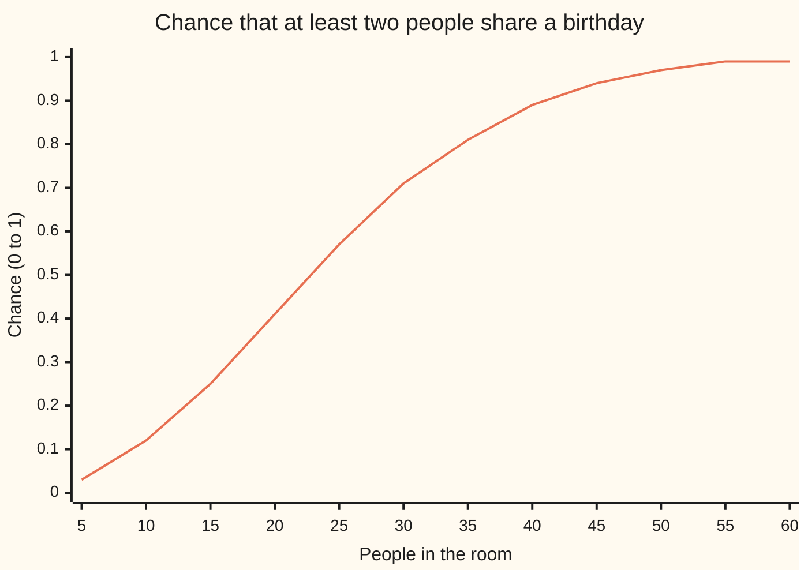
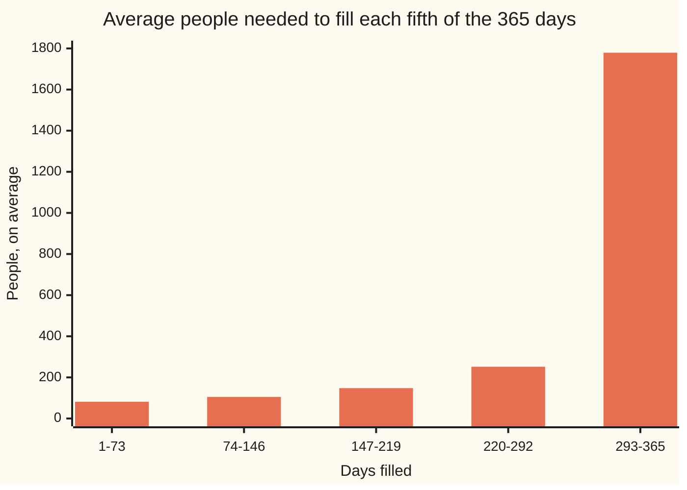

# Two classics: shared birthdays and collecting a full set

[Syllabus](../../../SYLLABUS.md) → [Probability and statistics](../../../SYLLABUS.md#w09) → [Discrete Distributions](../../../SYLLABUS.md#w09-s03) → Two classics

---

## General Overview

Twenty-three people stand in a room. Ignore 29 February, and take every one of the 365 days as equally likely to be someone's birthday. The chance that at least two of them share a birthday is 0.507297: a little better than a coin toss. Most people guess far lower, because they picture someone matching their own birthday. That is a different question, with the answer 0.058571, about 1 in 17.

The gap has one cause. A shared birthday can happen between any two people in the room, not just between one person and the rest. Twenty-three people make 253 pairs, and each pair is a separate chance of a match.

Now turn the question round. How many people must gather before every one of the 365 days is somebody's birthday? The average is 2364.6460 people, more than six times the number of days. The first few hundred people fill days quickly. The last empty day alone takes 365 people on average to fill, because each new arrival hits it with chance only 1 in 365.

The two questions are the two ends of one experiment: people arrive one by one, each with a random day. The birthday problem asks when the first repeat comes. The second question, called the **coupon collector's problem** after cereal-box coupons collected until the set is complete, asks when the last new day arrives. Repeats come early; completion comes late.

**Among n people with d equally likely days, the chance of no shared day is a product of shrinking fractions, and the average wait to see all d days is d times the sum 1 + 1/2 + … + 1/d; the first gets past one half near n = 23, the second is about 2365.**

**What kind of fact this is:** a theorem, two in fact, both proved on this card in Why it works by counting and by adding averages.

### The picture: the chance of a shared birthday, room by room



The one line is the exact chance, rounded to two places. It crosses one half between 20 and 25 people, at 23. By 40 people it is 0.891232; by 57, 0.990122. Nobody needs 366 people to be nearly certain of a match.

---

## The formula

Two pieces of notation first, in words. A capital pi, $\prod$, means "multiply all of these together", the way a capital sigma, $\sum$, means "add all of these". And $P(A)$ is the chance of an event A, as elsewhere in this wing.

The birthday chance, for $n$ people and $d$ equally likely days:

$$P(\text{no shared day}) = \frac{d}{d}\cdot\frac{d-1}{d}\cdot\frac{d-2}{d}\cdots\frac{d-n+1}{d} = \prod_{i=0}^{n-1}\left(1-\frac{i}{d}\right), \qquad P(\text{shared}) = 1 - P(\text{no shared day})$$

**Read it aloud:** the first person may land anywhere; each later person must miss every day already taken; multiply those chances, and one minus the product is the chance of a match.

The collector's wait. Let $T$ be the number of people who arrive until every day is taken. Its average, $E[T]$ (read "the average value of T in the long run"), is

$$E[T] = \frac{d}{d} + \frac{d}{d-1} + \frac{d}{d-2} + \cdots + \frac{d}{1} = d\,H_d, \qquad H_d = 1 + \frac12 + \frac13 + \cdots + \frac1d$$

**Read it aloud:** when $i$ days are already taken, the next new day arrives with chance $(d-i)/d$, so it takes $d/(d-i)$ people on average; add those waits over all 365 stages.

The sum $H_d$ is called the $d$-th **harmonic number**. Two approximations make both results easy to carry around:

$$P(\text{shared}) \approx 1 - e^{-n(n-1)/(2d)}, \qquad E[T] \approx d\,(\ln d + \gamma) + \tfrac12$$

In words: the birthday chance is set by the number of pairs, $n(n-1)/2$, measured against $d$; the full set costs about $d \ln d$ people plus a correction.

| Symbol | Plain meaning | In our example | Push it up and the answer… |
| --- | --- | --- | --- |
| $n$ | people in the room | 23 | the match chance climbs, fast |
| $d$ | equally likely days (or coupons, or hash values) | 365 | matches get rarer; the full set takes longer |
| $i$ | days already taken when the next person arrives | 0 to 22 (birthdays), 0 to 364 (collector) | the next person is more likely to repeat |
| $p_i$ | chance the next person brings a new day, $(d-i)/d$ | 1 at the start, 1/365 at the end | the stage ends sooner |
| $W_i$ | people needed to get from $i$ taken days to $i+1$ | average $d/(d-i)$ | — |
| $T$ | people needed until all $d$ days are taken | average 2364.6460 | — |
| $H_d$ | the harmonic number $1 + 1/2 + \cdots + 1/d$ | 6.478482 | grows like $\ln d$ |
| $\gamma$ | Euler's constant, the gap $H_d - \ln d$ settles to | 0.5772156649 | — |
| $e$ | the base of natural logarithms, 2.718… | in $e^{-253/365}$ | — |
| $\prod$ | multiply every factor that follows | 23 factors | — |
| $\sum$ | add every term that follows | 365 terms | — |
| $b$ | length of a hash fingerprint, in bits | not used here | collisions start later, at about $2^{b/2}$ tries |

### When it holds

- **Every day equally likely.** Real births bunch in some months. Any unevenness raises the match chance: a calendar where half the year is 1.5 times as likely as the other half gives 0.520852 at 23 people, not 0.507297. The formula is then a floor, not the answer.
- **People independent.** A room with twins breaks it: one pair is a match by construction.
- **A fixed, known number of days.** Counting 29 February as a full day makes $d = 366$ and moves the numbers a little. A hash with $2^{b}$ values is the same problem with $d = 2^{b}$.
- **Draws with replacement.** Each person's day is drawn fresh; a day already taken is still available to the next person. Dealing from a deck without replacement is a different problem ([Hypergeometric](03-hypergeometric.md)).

---

## Why it works

### Step 0: count the easy side, and cut the long wait into stages

"At least one shared birthday" can happen in a huge number of ways: one pair, two pairs, three people on one day. "Nobody shares" happens in one way only: every person on a different day. So count that, and subtract from 1 ([Counting the complement](../../04-Combinatorics%20and%20graphs/01-Counting%20Principles/06-complementary-counting.md)).

For the full set, the long wait $T$ is a string of short waits: the wait for the first day, then for a second, different day, and so on. Each short wait is simple. Averages add. That is the whole proof.

### Step 1: the birthday product, by counting

Write down each person's birthday in order. With $d$ days and $n$ people there are $d^n$ possible lists, all equally likely. Lists with no repeat: the first person has $d$ choices, the second $d-1$, the third $d-2$, down to $d-n+1$ for the last. So

$$P(\text{no shared day}) = \frac{d(d-1)\cdots(d-n+1)}{d^n}.$$

Split the fraction into one factor per person and it is the product above. On a small calendar this can be checked by listing every case: with 12 equally likely birth months and 4 people there are 20736 lists, and counting them gives a match chance of 0.427083, the same as the formula. The code does exactly that count.

### Step 2: why 23, and not half of 365

Each factor $1 - i/d$ is close to $e^{-i/d}$ when $i/d$ is small: the curve $e^{-x}$ touches the line $1 - x$ at $x = 0$ and stays just above it. Multiply the factors and the exponents add:

$$P(\text{no shared day}) \approx e^{-(0 + 1 + \cdots + (n-1))/d} = e^{-n(n-1)/(2d)}.$$

The top of the exponent, $n(n-1)/2$, is the number of pairs. At 23 people it is 253, and 253/365 = 0.693151, which is almost exactly $\ln 2$. So the chance of no match is about one half, and the approximation gives a shared-birthday chance of 0.500002 against the exact 0.507297.

Setting the exponent equal to $\ln 2$ and solving gives the threshold $n \approx \sqrt{2d\ln 2}$, here 22.4944, so 23 people. The threshold grows with the square root of $d$. That square root is the surprise: pairs grow like $n^2$, so a room needs only about $\sqrt{d}$ people, not $d/2$.

<details>
<summary>The algebra behind the approximation</summary>

For $0 \le x < 1$, $\ln(1-x) = -x - x^2/2 - x^3/3 - \cdots$, so $1 - x \le e^{-x}$ and the error in the exponent is about $x^2/2$ per factor. Summing $i^2/(2d^2)$ over $i < n$ gives about $n^3/(6d^2)$, small when $n$ is near $\sqrt{d}$; it is why the exact no-match chance sits a little below the approximate one. Since every factor satisfies $1 - i/d \le e^{-i/d}$, the approximation always slightly understates the match chance.

</details>

### Step 3: one stage of the collection is a geometric wait

Suppose $i$ days are already taken. Each new person brings a new day with chance $p_i = (d-i)/d$, independently of everyone before. The number of people until the first success is a geometric wait, and its average is $1/p_i$ ([Waiting for a success](02-geometric-and-negative-binomial.md)). So

$$E[W_i] = \frac{d}{d-i}.$$

The first stage takes exactly 1 person. The 183rd new day, with half the year taken, takes 1.9945 people on average. The 365th takes 365.0000.

### Step 4: add the stages

$T = W_0 + W_1 + \cdots + W_{d-1}$. The average of a sum is the sum of the averages; this needs no independence at all. So

$$E[T] = \sum_{i=0}^{d-1}\frac{d}{d-i} = d\left(\frac1d + \frac1{d-1} + \cdots + \frac11\right) = d\,H_d.$$

For $d = 365$, $H_{365} = 6.478482$ and $E[T] = 2364.6460$.

### Step 5: why the answer is near d ln d

The harmonic sum $1 + 1/2 + \cdots + 1/d$ is a staircase under and over the curve $1/x$. The area under $1/x$ from 1 to $d$ is $\ln d$, so $H_d$ sits between $\ln d$ and $\ln d + 1$. The gap $H_d - \ln d$ shrinks towards a fixed number, Euler's constant $\gamma = 0.5772156649$. Adding the next correction, $1/(2d)$, gives $E[T] \approx d(\ln d + \gamma) + 1/2 = 2364.6463$, against the exact 2364.6460.

<details>
<summary>Detailed proof</summary>

**Birthday.** The sample space is the $d^n$ lists of days, each with chance $d^{-n}$ by the two assumptions (equal days, independent people). The event "all different" is the set of lists with distinct entries. Choosing entries left to right gives $d(d-1)\cdots(d-n+1)$ such lists by the multiplication rule. Dividing gives the product. The complement rule gives $P(\text{shared})$.

**Collector, average.** For $i = 0, \ldots, d-1$, let $W_i$ count the arrivals after the moment $i$ distinct days have been seen, up to and including the arrival that brings the next new day. Given the whole history up to that moment, each later arrival is new with chance $(d-i)/d$, independently, so $W_i$ is geometric on $1, 2, \ldots$ with success chance $p_i = (d-i)/d$, whatever the history. Then $T = \sum W_i$, and linearity of expectation gives $E[T] = \sum 1/p_i = d H_d$.

**Collector, spread.** Because each $W_i$ has the same law whatever happened before, the $W_i$ are independent. A geometric wait has variance $(1-p)/p^2$, so $\mathrm{Var}(T) = \sum_{i}(1-p_i)/p_i^2$. For $d = 365$ this gives a standard deviation of 465.2066 people. The last few stages dominate it: their $p_i$ are tiny.

**Harmonic bounds.** For $k \ge 1$, $\int_k^{k+1} dx/x \le 1/k$, and for $k \ge 2$, $1/k \le \int_{k-1}^{k} dx/x$. Summing gives $\ln(d+1) \le H_d \le 1 + \ln d$. The differences $H_d - \ln d$ decrease and stay above 0, so they settle to a limit, which is $\gamma$ by definition.

</details>

The code takes a third road to the collector's average that uses neither stages nor harmonic numbers. It tracks the chance of having seen each possible number of distinct days after each arrival, steps it forward one person at a time, and adds up the chance of not yet being finished, since the average of a count equals the sum of its tail chances. That also gives the median, which a formula does not. For the number of matching pairs in a room, the [Poisson](04-poisson.md) law with mean 253/365 gives the same "about one half" by another route.

---

## Worked numbers, by hand

The birthday side, 23 people, 365 days:

| Step | Arithmetic | Value |
| --- | --- | --- |
| 1. Count the pairs | 23 × 22 / 2 | 253 |
| 2. Pairs against days | 253 / 365 | 0.693151 |
| 3. Approximate match chance | 1 − e^(−0.693151) | 0.500002 |
| 4. Exact match chance | 1 − (365/365)(364/365)⋯(343/365) | **0.507297** |
| 5. One fewer person | the same product, 22 factors | 0.475695 |

About 1 room in 2 of 23 strangers holds a shared birthday; 22 strangers fall just short.

The collector's side, 365 days:

| Step | Arithmetic | Value |
| --- | --- | --- |
| 1. Harmonic number | 1 + 1/2 + ⋯ + 1/365 | 6.478482 |
| 2. Average wait | 365 × 6.478482 | **2364.6460** |
| 3. Shortcut | 365 × (ln 365 + 0.5772156649) + 1/2 | 2364.6463 |
| 4. Spread | standard deviation of the wait | 465.2066 |
| 5. Median | first count with at least a half chance of being done | 2287 |

On average about 2365 people must gather before every day of the year is someone's birthday. The median, 2287, sits below the average because a few very unlucky collections drag the average up: the chance of being done by 2365 people is 0.572145, more than a half.

Where the people go, fifth by fifth of the year:



Each bar is the average number of arrivals spent filling 73 more days. The first four fifths of the calendar together cost fewer people than the last fifth alone.

### What breaks if you drop a piece

| Mistake | Comes out at | What went wrong |
| --- | --- | --- |
| Ask whether someone matches one fixed person | 0.058571 | only 22 of the 253 pairs are counted |
| Add the 253 pair chances of 1/365 | 0.693151 | pairs overlap; adding double-counts rooms with several matches, and past 365 pairs it would exceed 1 |
| Drop "every day equally likely" | 0.520852 | births bunched into half the year raise the match chance; the formula becomes a floor |
| Treat each stage as waiting for one named day | 133225 | a new day can be any of the $d-i$ untaken ones, not a single one |
| Expect 365 people to cover 365 days | chance 1.455e-157 | that needs every person on a different day, the birthday problem at its extreme |
| Keep only $d \ln d$ | 2153.4625 | drops the $\gamma d$ term, which is not small: it grows with $d$ |

---

## Code, from first principles, and it actually runs

Both programs take several independent roads. For the birthday chance: the product formula, a full count of all 20736 month-lists for 4 people, and 20,000 simulated rooms of 23. For the collector: the harmonic sum, a step-by-step count of the chance of having each number of distinct days after each arrival (which also gives the median), and 2,000 simulated collections. Random days come from SplitMix64, a small generator written out in both languages with the same seed, so both print the same simulated numbers. Asserts compare the formula against the count, the step-by-step sum, the simulations within four standard errors, and the threshold 23 against the square-root rule, and confirm that the uneven calendar raises the match chance.

### Python

```python
# Birthday problem and coupon collector -- the check behind the card.
# Standard library only. Roads: exact formula, brute-force enumeration on a
# small calendar, a step-by-step count of the chance itself, and a seeded simulation.
import math

M64 = (1 << 64) - 1
class SplitMix64:                       # the random numbers, written out
    def __init__(self, seed): self.s = seed
    def next(self):
        self.s = (self.s + 0x9E3779B97F4A7C15) & M64
        z = self.s
        z = ((z ^ (z >> 30)) * 0xBF58476D1CE4E5B9) & M64
        z = ((z ^ (z >> 27)) * 0x94D049BB133111EB) & M64
        return z ^ (z >> 31)
    def day(self, d): return ((self.next() >> 32) * d) >> 32   # 0 .. d-1

def no_match(n, d):                     # road 1: product of shrinking fractions
    p = 1.0
    for i in range(n): p *= (d - i) / d
    return p

def brute_no_match(n, d):               # road 2: list every way n people can fall
    good = 0
    for code in range(d ** n):
        days = [(code // d ** j) % d for j in range(n)]
        good += len(set(days)) == n
    return good / d ** n

def harmonic(d): return sum(1.0 / k for k in range(1, d + 1))

def cover_dp(d, tmax):                  # road 2 for the collector: carry P(k days seen) forward
    p = [0.0] * (d + 1); p[0] = 1.0; mean = 0.0; median = None; cdf = []
    for t in range(1, tmax + 1):
        mean += 1.0 - p[d]              # E[T] = sum over t of P(T > t-1)
        q = [0.0] * (d + 1)
        for k in range(d + 1):
            if p[k] == 0.0: continue
            q[k] += p[k] * k / d
            if k < d: q[k + 1] += p[k] * (d - k) / d
        p = q; cdf.append(p[d])
        if median is None and p[d] >= 0.5: median = t
    return mean, median, cdf

D = 365
print("== birthdays: 365 equally likely days ==")
p23 = 1 - no_match(23, D)
print(f"n=22  P(shared) = {1 - no_match(22, D):.6f}")
print(f"n=23  P(shared) = {p23:.6f}   pairs = {23 * 22 // 2}")
n50 = next(n for n in range(1, D + 2) if 1 - no_match(n, D) > 0.5)
print(f"first n above one half = {n50}   sqrt(2 d ln 2) = {math.sqrt(2 * D * math.log(2)):.4f}")
approx = 1 - math.exp(-23 * 22 / (2 * D))
print(f"approx 1 - exp(-n(n-1)/2d) at 23 = {approx:.6f}")
for n in (40, 57, 70):
    print(f"n={n}  P(shared) = {1 - no_match(n, D):.6f}")
print("chart1," + ",".join(f"{1 - no_match(n, D):.2f}" for n in range(5, 65, 5)))

rng = SplitMix64(20260928); rooms = 20000; hits = 0
for _ in range(rooms):
    seen = [False] * D
    for _ in range(23):
        k = rng.day(D)
        if seen[k]: hits += 1; break
        seen[k] = True
ph = hits / rooms; se = math.sqrt(ph * (1 - ph) / rooms)
print(f"simulated 23-person rooms: {ph:.4f}  (standard error {se:.4f}, {rooms} rooms)")
assert abs(ph - p23) < 4 * se, "simulation disagrees with the product formula"

pb, pf = 1 - brute_no_match(4, 12), 1 - no_match(4, 12)
m50 = next(n for n in range(1, 14) if 1 - no_match(n, 12) > 0.5)
print(f"birth months, 4 people ({12 ** 4} lists): enumerated {pb:.6f}   formula {pf:.6f}   first n above one half = {m50}")
assert abs(pb - pf) < 1e-12, "enumeration disagrees with the product formula"
assert n50 == math.ceil(math.sqrt(2 * D * math.log(2))), "threshold and square-root rule disagree"

print("== what breaks ==")
print(f"match one fixed person, 22 others: {1 - (364 / 365) ** 22:.6f}")
print(f"add pair chances 253/365: {253 / 365:.6f}")
w = [1.2] * 182 + [0.8] * 183; tot = sum(w); e = [1.0] + [0.0] * 23
for x in w:                             # e[k]: sum over k distinct days of their chances
    for k in range(23, 0, -1): e[k] += e[k - 1] * x / tot
uneven = 1 - math.factorial(23) * e[23]
print(f"uneven calendar (half the year 1.5x the other): {uneven:.6f}")
assert uneven > p23, "an uneven calendar should raise the match chance"

print("== collecting all 365 days ==")
h = harmonic(D); exact = D * h
var = sum((1 - (D - i) / D) / ((D - i) / D) ** 2 for i in range(D))
print(f"H_365 = {h:.6f}   E[T] = 365 H_365 = {exact:.4f}   sd = {math.sqrt(var):.4f}")
print(f"d ln d = {D * math.log(D):.4f}   d(ln d + gamma) + 1/2 = {D * (math.log(D) + 0.5772156649) + 0.5:.4f}")
print("wait for new day number 1, 183, 365: " + ", ".join(f"{D / (D - i):.4f}" for i in (0, 182, 364)))
mean, med, cdf = cover_dp(D, 14000)
print(f"step-by-step mean = {mean:.4f}   median = {med}   P(done by 2365) = {cdf[2364]:.6f}")
assert abs(mean - exact) < 1e-6, "step-by-step mean disagrees with d H_d"
print(f"P(all days covered by 365 people) = {math.factorial(D) / D ** D:.3e}")
print(f"naive: wait 365 for each day = {D * D}")
fifths = [D * (harmonic(D - a) - harmonic(D - a - 73)) for a in range(0, D, 73)]
print("chart2," + ",".join(f"{x:.2f}" for x in fifths))

rng = SplitMix64(365); runs = 2000; s = s2 = 0.0
for _ in range(runs):
    seen = [False] * D; got = t = 0
    while got < D:
        t += 1; k = rng.day(D)
        if not seen[k]: seen[k] = True; got += 1
    s += t; s2 += t * t
m = s / runs; sem = math.sqrt((s2 / runs - m * m) / runs)
print(f"simulated collectors: mean {m:.2f}  (standard error {sem:.2f}, {runs} runs)")
assert abs(m - exact) < 4 * sem, "simulation disagrees with d H_d"

print("== a die, all six faces ==")
print(f"E[T] = 6 H_6 = {6 * harmonic(6):.4f}")
```

**Ran 2026-09-28 on macOS, Python 3.14.6, standard library only. All checks passed. Output, pasted from the run:**

```
== birthdays: 365 equally likely days ==
n=22  P(shared) = 0.475695
n=23  P(shared) = 0.507297   pairs = 253
first n above one half = 23   sqrt(2 d ln 2) = 22.4944
approx 1 - exp(-n(n-1)/2d) at 23 = 0.500002
n=40  P(shared) = 0.891232
n=57  P(shared) = 0.990122
n=70  P(shared) = 0.999160
chart1,0.03,0.12,0.25,0.41,0.57,0.71,0.81,0.89,0.94,0.97,0.99,0.99
simulated 23-person rooms: 0.5042  (standard error 0.0035, 20000 rooms)
birth months, 4 people (20736 lists): enumerated 0.427083   formula 0.427083   first n above one half = 5
== what breaks ==
match one fixed person, 22 others: 0.058571
add pair chances 253/365: 0.693151
uneven calendar (half the year 1.5x the other): 0.520852
== collecting all 365 days ==
H_365 = 6.478482   E[T] = 365 H_365 = 2364.6460   sd = 465.2066
d ln d = 2153.4625   d(ln d + gamma) + 1/2 = 2364.6463
wait for new day number 1, 183, 365: 1.0000, 1.9945, 365.0000
step-by-step mean = 2364.6460   median = 2287   P(done by 2365) = 0.572145
P(all days covered by 365 people) = 1.455e-157
naive: wait 365 for each day = 133225
chart2,81.32,104.80,147.58,251.75,1779.20
simulated collectors: mean 2368.61  (standard error 10.36, 2000 runs)
== a die, all six faces ==
E[T] = 6 H_6 = 14.7000
```

### Rust

```rust
// Birthday problem and coupon collector -- the check behind the card.
// Rust std only. Roads: exact formula, brute-force enumeration on a
// small calendar, a step-by-step count of the chance itself, and a seeded simulation.

struct SplitMix64 { s: u64 } // the random numbers, written out
impl SplitMix64 {
    fn next(&mut self) -> u64 {
        self.s = self.s.wrapping_add(0x9E3779B97F4A7C15);
        let mut z = self.s;
        z = (z ^ (z >> 30)).wrapping_mul(0xBF58476D1CE4E5B9);
        z = (z ^ (z >> 27)).wrapping_mul(0x94D049BB133111EB);
        z ^ (z >> 31)
    }
    fn day(&mut self, d: u64) -> usize { (((self.next() >> 32) * d) >> 32) as usize } // 0 .. d-1
}

fn no_match(n: usize, d: usize) -> f64 { // road 1: product of shrinking fractions
    let mut p = 1.0;
    for i in 0..n { p *= (d - i) as f64 / d as f64; }
    p
}

fn brute_no_match(n: u32, d: usize) -> f64 { // road 2: list every way n people can fall
    let total = d.pow(n);
    let mut good = 0usize;
    for code in 0..total {
        let mut seen = vec![false; d];
        let mut ok = true;
        for j in 0..n {
            let day = (code / d.pow(j)) % d;
            if seen[day] { ok = false; }
            seen[day] = true;
        }
        if ok { good += 1; }
    }
    good as f64 / total as f64
}

fn harmonic(d: usize) -> f64 { let mut h = 0.0; for k in 1..=d { h += 1.0 / k as f64; } h }

fn cover_dp(d: usize, tmax: usize) -> (f64, usize, Vec<f64>) { // road 2 for the collector
    let mut p = vec![0.0f64; d + 1];
    p[0] = 1.0;
    let (mut mean, mut median, mut cdf) = (0.0f64, 0usize, Vec::new());
    for t in 1..=tmax {
        mean += 1.0 - p[d]; // E[T] = sum over t of P(T > t-1)
        let mut q = vec![0.0f64; d + 1];
        for k in 0..=d {
            if p[k] == 0.0 { continue; }
            q[k] += p[k] * k as f64 / d as f64;
            if k < d { q[k + 1] += p[k] * (d - k) as f64 / d as f64; }
        }
        p = q;
        cdf.push(p[d]);
        if median == 0 && p[d] >= 0.5 { median = t; }
    }
    (mean, median, cdf)
}

fn main() {
    const D: usize = 365;
    let df = D as f64;
    println!("== birthdays: 365 equally likely days ==");
    let p23 = 1.0 - no_match(23, D);
    println!("n=22  P(shared) = {:.6}", 1.0 - no_match(22, D));
    println!("n=23  P(shared) = {:.6}   pairs = {}", p23, 23 * 22 / 2);
    let n50 = (1..D + 2).find(|&n| 1.0 - no_match(n, D) > 0.5).unwrap();
    let root = (2.0 * df * 2f64.ln()).sqrt();
    println!("first n above one half = {}   sqrt(2 d ln 2) = {:.4}", n50, root);
    let approx = 1.0 - (-(23.0 * 22.0) / (2.0 * df)).exp();
    println!("approx 1 - exp(-n(n-1)/2d) at 23 = {:.6}", approx);
    for n in [40, 57, 70] { println!("n={}  P(shared) = {:.6}", n, 1.0 - no_match(n, D)); }
    let c1: Vec<String> = (1..13).map(|i| format!("{:.2}", 1.0 - no_match(5 * i, D))).collect();
    println!("chart1,{}", c1.join(","));

    let mut rng = SplitMix64 { s: 20260928 };
    let rooms = 20000;
    let mut hits = 0;
    for _ in 0..rooms {
        let mut seen = [false; D];
        for _ in 0..23 {
            let k = rng.day(D as u64);
            if seen[k] { hits += 1; break; }
            seen[k] = true;
        }
    }
    let ph = hits as f64 / rooms as f64;
    let se = (ph * (1.0 - ph) / rooms as f64).sqrt();
    println!("simulated 23-person rooms: {:.4}  (standard error {:.4}, {} rooms)", ph, se, rooms);
    assert!((ph - p23).abs() < 4.0 * se, "simulation disagrees with the product formula");

    let (pb, pf) = (1.0 - brute_no_match(4, 12), 1.0 - no_match(4, 12));
    let m50 = (1..14).find(|&n| 1.0 - no_match(n, 12) > 0.5).unwrap();
    println!("birth months, 4 people ({} lists): enumerated {:.6}   formula {:.6}   first n above one half = {}", 12usize.pow(4), pb, pf, m50);
    assert!((pb - pf).abs() < 1e-12, "enumeration disagrees with the product formula");
    assert!(n50 == root.ceil() as usize, "threshold and square-root rule disagree");

    println!("== what breaks ==");
    println!("match one fixed person, 22 others: {:.6}", 1.0 - (364.0f64 / 365.0).powf(22.0));
    println!("add pair chances 253/365: {:.6}", 253.0 / 365.0);
    let mut w = vec![1.2f64; 182];
    w.extend(vec![0.8f64; 183]);
    let tot: f64 = w.iter().sum();
    let mut e = vec![0.0f64; 24];
    e[0] = 1.0;
    for x in &w { for k in (1..24).rev() { e[k] += e[k - 1] * x / tot; } } // e[k]: k distinct days
    let fact23: f64 = (1..=23).map(|k| k as f64).product();
    let uneven = 1.0 - fact23 * e[23];
    println!("uneven calendar (half the year 1.5x the other): {:.6}", uneven);
    assert!(uneven > p23, "an uneven calendar should raise the match chance");

    println!("== collecting all 365 days ==");
    let h = harmonic(D);
    let exact = df * h;
    let mut var = 0.0;
    for i in 0..D { let p = (D - i) as f64 / df; var += (1.0 - p) / (p * p); }
    println!("H_365 = {:.6}   E[T] = 365 H_365 = {:.4}   sd = {:.4}", h, exact, var.sqrt());
    println!("d ln d = {:.4}   d(ln d + gamma) + 1/2 = {:.4}", df * df.ln(), df * (df.ln() + 0.5772156649) + 0.5);
    let waits: Vec<String> = [0, 182, 364].iter().map(|&i| format!("{:.4}", df / (D - i) as f64)).collect();
    println!("wait for new day number 1, 183, 365: {}", waits.join(", "));
    let (mean, med, cdf) = cover_dp(D, 14000);
    println!("step-by-step mean = {:.4}   median = {}   P(done by 2365) = {:.6}", mean, med, cdf[2364]);
    assert!((mean - exact).abs() < 1e-6, "step-by-step mean disagrees with d H_d");
    let mut allp = 1.0f64;
    for k in 1..=D { allp *= k as f64 / df; }
    println!("P(all days covered by 365 people) = {}", sci(allp));
    println!("naive: wait 365 for each day = {}", D * D);
    let c2: Vec<String> = (0..5).map(|j| {
        let a = 73 * j;
        format!("{:.2}", df * (harmonic(D - a) - harmonic(D - a - 73)))
    }).collect();
    println!("chart2,{}", c2.join(","));

    let mut rng = SplitMix64 { s: 365 };
    let runs = 2000;
    let (mut s, mut s2) = (0.0f64, 0.0f64);
    for _ in 0..runs {
        let mut seen = [false; D];
        let (mut got, mut t) = (0, 0u64);
        while got < D {
            t += 1;
            let k = rng.day(D as u64);
            if !seen[k] { seen[k] = true; got += 1; }
        }
        s += t as f64;
        s2 += (t * t) as f64;
    }
    let m = s / runs as f64;
    let sem = ((s2 / runs as f64 - m * m) / runs as f64).sqrt();
    println!("simulated collectors: mean {:.2}  (standard error {:.2}, {} runs)", m, sem, runs);
    assert!((m - exact).abs() < 4.0 * sem, "simulation disagrees with d H_d");

    println!("== a die, all six faces ==");
    println!("E[T] = 6 H_6 = {:.4}", 6.0 * harmonic(6));
}

fn sci(x: f64) -> String { // Python-style 1.234e-157
    let s = format!("{:.3e}", x);
    let (m, e) = s.split_once('e').unwrap();
    let ev: i32 = e.parse().unwrap();
    format!("{}e{}{:02}", m, if ev < 0 { "-" } else { "+" }, ev.abs())
}
```

**Ran 2026-09-28 on macOS, rustc 1.98.1, no crates. All checks passed. Output, pasted from the run:**

```
== birthdays: 365 equally likely days ==
n=22  P(shared) = 0.475695
n=23  P(shared) = 0.507297   pairs = 253
first n above one half = 23   sqrt(2 d ln 2) = 22.4944
approx 1 - exp(-n(n-1)/2d) at 23 = 0.500002
n=40  P(shared) = 0.891232
n=57  P(shared) = 0.990122
n=70  P(shared) = 0.999160
chart1,0.03,0.12,0.25,0.41,0.57,0.71,0.81,0.89,0.94,0.97,0.99,0.99
simulated 23-person rooms: 0.5042  (standard error 0.0035, 20000 rooms)
birth months, 4 people (20736 lists): enumerated 0.427083   formula 0.427083   first n above one half = 5
== what breaks ==
match one fixed person, 22 others: 0.058571
add pair chances 253/365: 0.693151
uneven calendar (half the year 1.5x the other): 0.520852
== collecting all 365 days ==
H_365 = 6.478482   E[T] = 365 H_365 = 2364.6460   sd = 465.2066
d ln d = 2153.4625   d(ln d + gamma) + 1/2 = 2364.6463
wait for new day number 1, 183, 365: 1.0000, 1.9945, 365.0000
step-by-step mean = 2364.6460   median = 2287   P(done by 2365) = 0.572145
P(all days covered by 365 people) = 1.455e-157
naive: wait 365 for each day = 133225
chart2,81.32,104.80,147.58,251.75,1779.20
simulated collectors: mean 2368.61  (standard error 10.36, 2000 runs)
== a die, all six faces ==
E[T] = 6 H_6 = 14.7000
```

The simulated rooms give 0.5042 with standard error 0.0035, against the exact 0.507297; the simulated collectors average 2368.61 with standard error 10.36, against 2364.6460. Both sit within one standard error.

> [!TIP]
> **Try changing**
> - **A die instead of a calendar.** Guess first: how many rolls to see all six faces? The last line of the output computes `6 * harmonic(6)`: 14.7000 rolls on average, not 6.
> - **70 people.** Guess first, then read the `(40, 57, 70)` loop. The chance of a shared birthday is 0.999160: a 70-person room with no match is rarer than 1 in 1000.
> - **Birth months.** Guess first: with 12 months, how many people for a better-than-even shared month? The months line answers it: 4 people give 0.427083, and the threshold is 5.
> - **A bunched calendar.** Change the weights `1.2` and `0.8` to `1.0` and `1.0`. The uneven-calendar line falls back to 0.507297, the equal-days answer.

---

## The usual mistake

> [!warning]
> **Counting people instead of pairs.** The intuition "23 is small next to 365" compares the wrong things. A match needs two people, and 23 people form 253 pairs. The chance of no match falls with the number of pairs, which grows like the square of the room.
>
> - **Answering "does anyone share my birthday?"** That chance, 0.058571 for 22 others, is what most guesses are near. It is a different question.
> - **Adding the pair chances.** 253/365 = 0.693151 overstates the answer, because rooms with two matches are counted twice. The exponent is right; the sum is not the chance.
> - **Thinking the full set costs about 365 people, or twice that.** The average is 2364.6460. The last day alone costs 365 people on average, as many as the whole calendar has days.
> - **Reading the average as typical.** The collector's wait has a long right tail: the median is 2287, and the standard deviation is 465.2066 people.

---

## Where you meet it in real life

- **Hash tables and checksums.** A hash assigns each item one of $d$ labels; two items with the same label collide. Collisions start near $\sqrt{d}$ items, not $d$, which is why hash tables resize early and why Hashing for size budgets for them.
- **Cryptographic hashes.** A "birthday attack" finds two messages with the same fingerprint of $b$ bits after about $2^{b/2}$ tries, not $2^{b}$. That halving of the exponent sets fingerprint lengths in Hashes and MACs.
- **Sticker albums and collectible toys.** Completing a set of $d$ random stickers costs about $d \ln d$ packets; the last few are the expensive ones, which is why swaps and direct orders exist.
- **Testing by random inputs.** Random tests hit each of $d$ equally likely cases after about $d H_d$ tries; the last cases take most of the budget.
- **Counts per day.** How many birthdays land on each day of the year is a [Multinomial](05-multinomial.md) count; the birthday problem asks whether any count reaches 2, the collector whether none stays at 0.

> **Say it back**
> A shared birthday needs a pair, and 23 people make 253 pairs, so a match is more likely than not. The exact chance of no match multiplies the chances that each person misses every day already taken. The number of people needed grows like the square root of the number of days. Collecting every day is the opposite end: each stage is a geometric wait, the averages add to 365 × (1 + 1/2 + ⋯ + 1/365), about 2365, and the last day costs as much as the whole calendar has days.

---

## What this builds on

- [Waiting for a success](02-geometric-and-negative-binomial.md): the average wait $1/p$ and variance $(1-p)/p^2$ of each collection stage.
- [Counting the complement](../../04-Combinatorics%20and%20graphs/01-Counting%20Principles/06-complementary-counting.md): count "nobody shares" and subtract from the total.

## Where this goes next

- Hashing for size: collisions as the cost of hashing, and structures sized around them.
- Hashes and MACs: the birthday bound setting how long a secure fingerprint must be.

This card counts collisions when labels are drawn at random; what a hash function must do to behave like that random draw, and what an attacker gains when it does not, is the question those cards take up.

---

## Sources

Verified 2026-09-28: every link below opens a page naming the cited work.

- Feller, William. *An Introduction to Probability Theory and Its Applications*, Volume 1, 3rd ed. Wiley, 1968. [Publisher page](https://www.wiley.com/en-us/An+Introduction+to+Probability+Theory+and+Its+Applications%2C+Volume+1%2C+3rd+Edition-p-9780471257080). The classic treatment of both problems as occupancy questions: balls dropped into cells.
- Blitzstein, Joseph K., and Jessica Hwang. *Introduction to Probability*, 2nd ed. Chapman and Hall/CRC, 2019. [Publisher page](https://www.routledge.com/Introduction-to-Probability-Second-Edition/Blitzstein-Hwang/p/book/9781138369917). The birthday product by counting, and the collector's average by adding geometric waits.
- Grinstead, Charles M., and J. Laurie Snell. *Introduction to Probability*, 2nd revised ed. American Mathematical Society, 1997. [Full text from Dartmouth](https://math.dartmouth.edu/~prob/prob/prob.pdf). Free and complete; the birthday problem among its counting examples.
- Graham, Ronald L., Donald E. Knuth, and Oren Patashnik. *Concrete Mathematics*, 2nd ed. Addison-Wesley, 1994. [Publisher page](https://www.informit.com/store/concrete-mathematics-a-foundation-for-computer-science-9780201558029). Harmonic numbers, their bounds and the constant $\gamma$.
